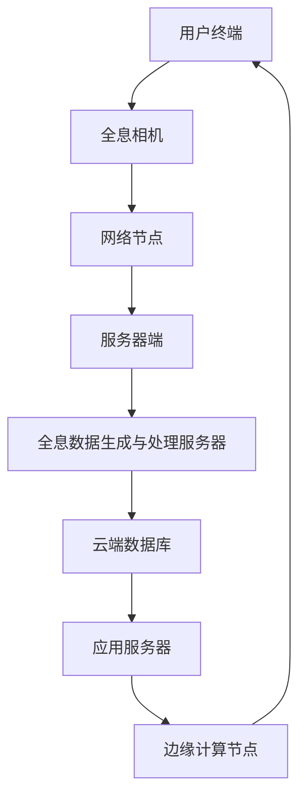

                 

### 6G的全息通信应用前景：实现真实的远程-presenza

#### 关键词：6G，全息通信，远程-presenza，技术应用，创新前景

> 摘要：随着通信技术的不断发展，6G作为下一代通信技术，其应用前景引人注目。本文将重点探讨6G在全息通信中的应用潜力，特别是在实现远程-presenza方面的突破。通过深入分析6G的关键技术特点、全息通信的基本原理以及远程-presenza的需求，本文旨在为读者呈现6G技术在全息通信领域的创新应用前景，并提供对未来发展的展望。

#### 目录

1. **6G与全息通信：引言与背景**  
   1.1 **6G技术的发展概述**  
   1.2 **全息通信的原理与应用**  
   1.3 **6G与全息通信的结合点**  
   1.4 **文章结构与目标**

2. **6G技术的核心特性与全息通信的匹配性**  
   2.1 **6G的关键特性**  
   2.2 **全息通信的需求分析**  
   2.3 **6G技术如何满足全息通信的需求**

3. **远程-presenza：需求分析与应用场景**  
   3.1 **远程-presenza的定义**  
   3.2 **远程-presenza的应用场景**  
   3.3 **6G技术对远程-presenza的支持**

4. **6G全息通信系统架构设计**  
   4.1 **系统架构概述**  
   4.2 **关键技术研究**  
   4.3 **系统实现方案**

5. **6G全息通信算法原理与数学模型**  
   5.1 **信号处理算法**  
   5.2 **传播与信道建模**  
   5.3 **算法实现与案例分析**

6. **6G全息通信的挑战与未来展望**  
   6.1 **技术挑战**  
   6.2 **应用前景**  
   6.3 **未来发展趋势**

7. **结论**  
   7.1 **总结**  
   7.2 **注意事项与建议**  
   7.3 **拓展阅读**

#### 引言与背景

通信技术的发展是一个不断迭代的过程，从1G到5G，再到如今备受期待的6G，每一次技术的升级都为人类社会带来了巨大的变革。6G作为下一代通信技术，其发展速度和潜力受到了全球的关注。全息通信作为一种前沿技术，近年来也在快速发展，其应用前景广阔。

1.1 **6G技术的发展概述**

6G（第六代移动通信技术）是继5G之后的下一代通信技术，其目标是实现更高的数据传输速率、更低的延迟、更高的连接密度和更广泛的覆盖范围。6G技术预计将在2030年前后实现商业化，其关键特性包括：

- **超高数据速率**：6G的理论数据传输速率可达到每秒1Tbps，是5G的100倍以上。
- **超低延迟**：6G的端到端延迟有望降低到1毫秒以下，实现实时通信。
- **海量连接**：6G能够支持每平方米超过100万设备的连接密度。
- **智能感知**：6G将集成人工智能和机器学习技术，实现更加智能化的网络管理和服务。

1.2 **全息通信的原理与应用**

全息通信是一种基于全息技术的通信方式，可以通过全息图将三维信息传递给接收者，使其能够看到和感受到与真实世界相似的图像。全息通信的基本原理包括：

- **全息图生成**：通过激光照射物体，记录物体反射的光波信息，生成全息图。
- **全息图传输**：将全息图通过特定的传输方式发送到接收端。
- **全息图重构**：在接收端通过激光照射全息图，重构出三维图像。

全息通信的应用场景非常广泛，包括虚拟现实、远程医疗、军事模拟、教育等领域。然而，全息通信的实现需要高带宽、低延迟的通信网络支持，而6G技术正好能够满足这些需求。

1.3 **6G与全息通信的结合点**

6G与全息通信的结合点主要体现在以下几个方面：

- **数据传输速率**：6G的高数据传输速率能够支持全息图的高清传输，实现更真实的远程-presenza。
- **低延迟**：6G的低延迟能够保证全息通信的实时性和互动性。
- **海量连接**：6G的海量连接能力能够支持全息通信的多用户接入，实现大规模的应用场景。

1.4 **文章结构与目标**

本文旨在通过深入分析6G技术的核心特性、全息通信的基本原理以及远程-presenza的需求，探讨6G在全息通信中的应用前景。文章分为以下几个部分：

- **第2部分**：介绍6G技术的核心特性及其与全息通信的匹配性。
- **第3部分**：分析远程-presenza的需求和应用场景。
- **第4部分**：设计6G全息通信的系统架构。
- **第5部分**：介绍6G全息通信的算法原理与数学模型。
- **第6部分**：探讨6G全息通信的挑战与未来展望。
- **第7部分**：总结全文，并提出注意事项与建议。

通过本文的讨论，我们希望能够为读者提供对6G全息通信的深入理解，并激发对这一领域的创新热情。接下来，我们将逐步深入探讨6G与全息通信的结合点，分析其应用前景。在接下来的章节中，我们将更详细地探讨6G技术的核心特性及其在实现远程-presenza方面的潜力。

#### 6G技术的核心特性与全息通信的匹配性

6G作为下一代通信技术，其核心特性不仅决定了它在未来的应用场景，也直接影响了与全息通信技术的结合点。以下是6G技术的核心特性以及这些特性如何与全息通信的需求相匹配：

2.1 **超高数据速率**

6G的一个关键特性是其数据传输速率，预计可以达到每秒1Tbps，这远远超过了当前5G的传输速率。对于全息通信来说，数据传输速率是一个重要的指标，因为全息图通常包含大量的三维信息，需要高带宽的网络进行传输。以下是6G高数据速率对全息通信的几个方面的影响：

- **高清全息传输**：6G的高数据速率使得全息图的传输可以达到高清甚至超高清水平，保证了全息图的质量和细节。
- **实时交互**：全息通信要求实时传输，6G的高数据速率能够确保全息图的实时传输，为用户带来更加流畅的远程-presenza体验。
- **多用户接入**：高数据速率还意味着能够支持大量用户的接入，这对于全息通信来说非常重要，因为它能够实现大规模的应用场景，如虚拟会议、远程教育等。

2.2 **超低延迟**

6G的另一个关键特性是超低延迟，其目标是将端到端的延迟降低到1毫秒以下。对于全息通信来说，低延迟是实现实时交互和互动体验的关键因素。以下是6G低延迟对全息通信的影响：

- **实时互动**：低延迟能够保证用户在远程-presenza时能够实时地与场景中的其他参与者进行互动，减少时延带来的延迟感，提升用户体验。
- **增强沉浸感**：在远程-presenza中，低延迟可以显著减少延迟效应，使得用户感受到更真实的远程环境，增强沉浸感。
- **实时控制**：对于需要实时控制的应用场景，如远程手术、无人机操控等，低延迟是确保操作精准和反应快速的关键。

2.3 **海量连接**

6G技术的另一个重要特性是其海量连接能力，预计能够支持每平方米超过100万设备的连接。这对于全息通信的应用来说，意味着：

- **广泛覆盖**：高密度连接能力能够确保全息通信在广泛的区域内稳定运行，不会因为设备过多而出现连接问题。
- **多用户参与**：在大型活动中，如大型虚拟会议、音乐会等，海量连接能力能够支持大量用户同时参与全息通信，实现大规模的实时互动。
- **设备多样性**：6G的高连接密度能够支持各种类型的设备，如智能手机、平板电脑、VR头盔等，为全息通信提供了更多的接入方式。

2.4 **智能感知**

6G技术将集成人工智能和机器学习技术，实现智能化的网络管理和服务。这对于全息通信来说，具有以下几个方面的潜力：

- **网络优化**：通过人工智能技术，6G能够实现网络的智能化管理和优化，确保全息通信在复杂的网络环境中能够高效运行。
- **个性化服务**：智能感知技术能够根据用户的需求和行为，提供个性化的全息通信服务，提升用户体验。
- **自动故障诊断**：智能感知技术可以实时监测网络状态，自动诊断和修复故障，确保全息通信的稳定性和可靠性。

综上所述，6G技术的核心特性与全息通信的需求高度匹配。超高数据速率、超低延迟、海量连接和智能感知这些特性不仅能够解决当前全息通信中的技术难题，还将推动全息通信向更广泛的应用场景发展。接下来，我们将进一步探讨远程-presenza的需求和应用场景，分析6G技术在实现这一目标方面的优势。

### 远程-presenza的需求分析与应用场景

远程-presenza，即远程真实存在，是指在虚拟环境中实现与现实世界中类似的互动体验。这一概念在现代社会中日益受到重视，尤其是在远程工作、远程医疗和在线教育等领域。远程-presenza的目标是通过高度逼真的三维图像和实时的互动性，使用户能够在虚拟空间中感受到与真实世界相似的存在感。

3.1 **远程-presenza的定义**

远程-presenza是一个综合性的概念，它涉及多个技术领域，包括虚拟现实（VR）、增强现实（AR）、全息通信等。具体来说，远程-presenza的定义可以从以下几个方面进行阐述：

- **三维图像**：通过三维建模和图像处理技术，生成高度逼真的虚拟场景。
- **实时互动**：通过实时数据传输和网络技术，实现用户在虚拟环境中的互动和交流。
- **沉浸感**：通过视觉、听觉和触觉等多种感官刺激，使用户在虚拟环境中感受到强烈的沉浸感。
- **感知一致性**：在虚拟环境中，用户的感知与真实世界保持一致，减少现实与虚拟之间的差异。

3.2 **远程-presenza的应用场景**

远程-presenza的应用场景非常广泛，涵盖了多个行业和领域。以下是一些典型的应用场景：

- **远程医疗**：医生和患者可以通过远程-presenza技术进行虚拟会诊，医生能够远程观察患者的身体状态，提供诊断和治疗建议。
- **远程教育**：学生和教师可以通过远程-presenza技术进行虚拟课堂，实现异地教学的互动性和参与感，提高学习效果。
- **远程会议**：企业可以通过远程-presenza技术召开虚拟会议，参与者在虚拟会议室中能够看到彼此的三维形象，实现面对面的交流。
- **远程工作**：员工可以通过远程-presenza技术在家工作，与同事在虚拟办公室中进行协作，提高工作效率。
- **虚拟旅游**：用户可以通过远程-presenza技术体验虚拟旅游，探索世界各地的名胜古迹，获得身临其境的感受。
- **远程手术**：外科医生可以通过远程-presenza技术进行远程手术指导，实时观察手术进展，为手术提供支持。

3.3 **6G技术对远程-presenza的支持**

6G技术的高数据速率、超低延迟、海量连接和智能感知等特点，为远程-presenza提供了强有力的技术支持。以下是6G技术如何支持远程-presenza的几个方面：

- **高清三维图像传输**：6G的高数据速率能够保证远程-presenza中的三维图像传输质量，使得虚拟场景更加真实，减少图像失真和延迟。
- **实时互动**：6G的超低延迟能够确保远程-presenza中的实时互动，减少延迟带来的不适感，提升用户的沉浸感和互动体验。
- **多用户接入**：6G的海量连接能力能够支持远程-presenza的多用户接入，实现大规模的实时互动，如虚拟会议、虚拟教育等。
- **智能感知**：6G的智能感知技术能够实时监测网络状态，优化数据传输，确保远程-presenza的稳定性和可靠性。

通过上述分析可以看出，远程-presenza在现代社会中具有广泛的应用前景，而6G技术为其提供了强大的支持。随着6G技术的不断发展和成熟，远程-presenza将在更多领域得到应用，为人类带来更加便捷和高效的远程互动体验。接下来，我们将探讨6G全息通信的系统架构设计，以更深入地了解这一技术的实现方式。

### 6G全息通信系统架构设计

6G全息通信系统架构设计是实现远程-presenza的关键，它需要充分利用6G技术的核心特性，如高数据速率、超低延迟和海量连接等。以下是对6G全息通信系统架构的详细设计，包括系统架构概述、关键技术研究以及系统实现方案。

4.1 **系统架构概述**

6G全息通信系统架构可以分为以下几个主要部分：

- **用户终端**：包括智能手机、平板电脑、VR头盔等，用户通过这些设备接入全息通信系统。
- **网络节点**：包括基站、中继站和数据中心等，负责数据传输和信号处理。
- **服务器端**：包括全息数据生成与处理服务器、应用服务器等，负责全息数据的生成、处理和存储。
- **边缘计算节点**：位于网络边缘，负责实时数据处理和响应，减少延迟和数据传输成本。

4.2 **关键技术研究**

在6G全息通信系统中，以下几个关键技术至关重要：

- **全息数据生成与处理**：全息数据生成是通过激光照射物体并记录光波信息来实现的。在服务器端，需要对全息数据进行处理，包括三维建模、图像压缩和增强等。
- **高速数据传输**：6G技术的高数据速率是实现全息通信的关键。网络节点需要支持高速数据传输，确保全息图的高质量传输。
- **低延迟网络传输**：6G的超低延迟是保证实时互动的基础。网络节点和边缘计算节点需要优化数据传输路径，减少传输延迟。
- **多用户接入与调度**：6G海量连接能力支持多用户接入。系统需要设计有效的用户接入和调度机制，确保所有用户能够稳定接入并享受高质量的服务。

4.3 **系统实现方案**

6G全息通信系统实现方案可以分为以下几个步骤：

- **用户终端接入**：用户通过智能手机、平板电脑等设备连接到网络，启动全息通信应用。
- **全息数据生成**：用户选择需要传输的物体或场景，通过全息相机或传感器生成全息数据。
- **数据传输**：全息数据通过6G网络传输到服务器端。网络节点和边缘计算节点需要优化数据传输路径，确保低延迟和高带宽。
- **数据处理与存储**：服务器端对全息数据进行处理，包括三维建模、图像压缩和增强等，然后将处理后的全息数据存储在云端数据库中。
- **全息数据重构与显示**：用户端接收到服务器端的全息数据后，通过VR头盔或其他设备进行重构和显示，生成三维图像。
- **实时互动**：用户在虚拟环境中与其他参与者进行实时互动，包括语音、视频和数据交换等。

4.4 **系统架构图**

以下是一个简化的6G全息通信系统架构图，展示了各组成部分及其相互关系：



通过上述设计，6G全息通信系统实现了高效、稳定和实时的远程-presenza体验。随着6G技术的不断发展和完善，这一系统架构将在未来得到广泛应用，推动远程-presenza技术的进一步发展。

### 6G全息通信算法原理与数学模型

6G全息通信的实现离不开高效的数据处理算法和精确的数学模型。以下将详细介绍6G全息通信中常用的信号处理算法、传播与信道建模，以及相关的数学模型和公式。

5.1 **信号处理算法**

信号处理算法在全息通信中起着至关重要的作用，主要包括以下几种：

- **采样与量化**：采样是将连续信号转换为离散信号的过程，量化是将采样得到的数值转换为有限位数表示的过程。例如，采样频率为fs，量化位数为n，则采样点数N=fs/T，其中T为信号周期。
  $$N = \frac{fs \cdot T}{2\pi}$$

- **图像压缩与增强**：全息通信中通常使用图像压缩算法，如JPEG或HEVC，以减少数据传输量。增强算法则用于提升图像的质量和细节，例如，使用图像滤波器进行图像增强。
  $$I_{out} = f(I_{in})$$

- **三维重建**：通过全息图的采样点，使用三维重建算法，如菲涅耳积分或螺旋线积分，将二维全息图重构为三维图像。
  $$I(x,y,z) = \int \int H(x',y')e^{ik(x x'+y y'+z z')}dxdy$$

- **误差校正与容错**：为了确保数据的完整性和可靠性，全息通信中需要使用误差校正码，如里德-所罗门码（Reed-Solomon），以提高系统的容错能力。
  $$C = (G|I)$$

5.2 **传播与信道建模**

传播与信道建模是全息通信中另一个关键环节，它决定了信号的传播路径和衰减特性。以下是一些常用的传播模型和信道模型：

- **自由空间传播模型**：自由空间传播模型描述了信号在无障碍物环境中的传播路径和衰减。常用的自由空间传播模型为对数距离传播模型。
  $$L(f,R) = 20\log_{10}(R) + 20\log_{10}(f) + 32.45$$

- **多路径传播模型**：多路径传播模型描述了信号在复杂环境中的传播路径，通常包括反射、衍射和散射等效应。扩展对数正切模型（EPM）是一个常见的选择。
  $$L(f,R) = 20\log_{10}(R) + 20\log_{10}(f) + 10\log_{10}(d) - \frac{4\pi d^2}{\lambda^2}$$

- **多径信道模型**：多径信道模型描述了信号在传输过程中受到的多路径效应的影响，常用的模型包括瑞利信道模型和莱斯信道模型。
  $$\text{Rayleigh}: \frac{E{|s(t-\tau)|^2}}{\tau} = \frac{1}{1 + \frac{\tau^2}{T^2}}$$
  $$\text{Rice}: \frac{E{|s(t-\tau)|^2}}{\tau} = \frac{1}{1 + \frac{\tau^2}{T^2} + \frac{K^2}{\tau^2}}$$

5.3 **算法实现与案例分析**

以下是一个简单的Python代码示例，用于实现全息图像的三维重建算法：

```python
import numpy as np
from scipy import integrate

# 菲涅耳积分三维重建算法
def hologram_reconstruction(h, x, y, z):
    def integrand(t):
        return np.exp(1j * np.pi * (x * t * np.cos(h)) + 1j * np.pi * (y * t * np.sin(h)) + 1j * np.pi * (z * t * np.cos(h)))
    
    return integrate.quad(integrand, -np.inf, np.inf)[0]

# 示例：全息图重构
h = np.pi / 4  # 入射角
x, y, z = 1, 1, 0  # 采样点坐标
reconstructed_image = hologram_reconstruction(h, x, y, z)

print("Reconstructed Image:", reconstructed_image)
```

通过上述算法实现和数学模型，我们可以看到6G全息通信在信号处理和传播信道建模方面的复杂性和挑战。随着6G技术的不断发展，这些算法和模型将进一步完善，为全息通信提供更强大的技术支持。

### 6G全息通信的挑战与未来展望

尽管6G全息通信展示出了巨大的应用潜力和技术优势，但在实际应用过程中仍然面临诸多挑战。以下将分析这些挑战，探讨未来的发展前景。

6.1 **技术挑战**

- **高数据传输速率的实现**：6G的高数据速率要求网络设备和传输技术必须达到新的高度。然而，现有的光纤传输技术和无线传输技术尚未完全满足这一需求，特别是在高频段（如毫米波）传输方面，仍存在信号衰减、干扰等问题。

- **低延迟网络传输**：6G的端到端延迟目标是1毫秒以下，这对网络架构和传输技术提出了极高的要求。网络传输中的时延主要来自传输介质、交换节点和协议处理等，需要通过优化网络架构和传输协议来降低延迟。

- **海量连接的稳定性**：6G的海量连接能力需要保证在多用户接入情况下网络的稳定性和可靠性。网络资源的分配和管理，特别是在高密度接入环境下，是一个复杂的挑战。

- **能耗与散热问题**：6G技术的高速率和高连接密度将导致网络设备和服务器端的能耗显著增加。如何有效管理能耗和散热，以避免设备过热和性能下降，是亟待解决的问题。

6.2 **应用前景**

尽管面临技术挑战，6G全息通信在多个领域展现了广阔的应用前景：

- **远程医疗**：6G全息通信将使得远程医疗更加高效和实时，医生可以通过全息通信与患者进行面对面会诊，提供精准的诊断和治疗。

- **远程教育**：教育领域的远程-presenza应用将为学生和教师提供更丰富的互动体验，使远程学习更加生动和有趣。

- **虚拟现实与娱乐**：6G全息通信将为虚拟现实（VR）和增强现实（AR）带来全新的体验，用户可以在虚拟环境中实现更加真实和沉浸的互动。

- **智能制造**：在工业制造领域，6G全息通信将支持远程监控和维护，提高生产效率和设备可靠性。

6.3 **未来发展趋势**

随着6G技术的不断成熟，未来的发展趋势将包括：

- **网络架构的革新**：5G网络主要基于4G架构的优化，而6G将引入全新的网络架构，如边缘计算和雾计算，以更好地支持高数据速率和低延迟通信。

- **多技术融合**：6G将融合人工智能、机器学习、量子计算等技术，实现智能化的网络管理和优化，提高通信效率和用户体验。

- **标准化的推进**：全球范围内的6G标准化工作将加速推进，确保6G技术的全球兼容性和互操作性。

- **应用的多样化和普及化**：随着技术的成熟和成本的降低，6G全息通信将在更多领域得到应用，并逐步普及到大众市场。

总之，6G全息通信面临着诸多挑战，但也具有巨大的发展潜力。通过持续的技术创新和标准化工作，6G全息通信有望在未来实现突破，为人类社会带来更加丰富和高效的通信体验。

### 结论

综上所述，6G全息通信作为一种前沿技术，展示了其在实现远程-presenza方面的巨大潜力。6G技术的高数据速率、超低延迟和海量连接能力，为全息通信提供了强大的支持，使得远程-presenza在多个领域得到广泛应用，包括远程医疗、远程教育、虚拟现实和智能制造等。然而，6G全息通信在实际应用过程中仍面临诸多挑战，包括高数据传输速率的实现、低延迟网络传输、海量连接的稳定性以及能耗与散热问题等。未来，随着技术的不断成熟和标准化工作的推进，6G全息通信有望在更多领域得到应用，并逐步普及到大众市场。我们期待6G全息通信能够带来更加丰富和高效的通信体验，推动社会的数字化和智能化进程。

### 注意事项与建议

在进行6G全息通信系统的设计和实施时，需要注意以下几个关键点：

1. **网络架构优化**：为确保低延迟和高数据速率，网络架构的优化至关重要。应优先考虑边缘计算和雾计算的应用，以减少数据传输路径，提升通信效率。

2. **信号处理算法选择**：选择合适的信号处理算法对于保证全息通信的质量至关重要。应充分考虑算法的实时性和效率，以支持大规模的应用场景。

3. **数据传输安全**：在全息通信中，数据传输的安全性和隐私保护是必须考虑的问题。应采用加密算法和安全协议，确保数据传输的安全性。

4. **能耗管理**：6G全息通信的高速率和高连接密度将导致显著的能耗增加。应优化系统设计和资源配置，采用节能技术，以减少能耗和散热问题。

5. **用户体验**：用户体验是6G全息通信成功的关键。在设计和实施过程中，应注重用户界面的友好性和交互体验，确保用户能够轻松地接入和使用系统。

### 拓展阅读

1. **《6G技术展望》** - 该书详细介绍了6G技术的核心特性和未来发展趋势，对于了解6G技术的基础知识具有很高的参考价值。
2. **《全息通信技术原理与应用》** - 本书深入讲解了全息通信的基本原理、技术架构和应用场景，对于理解全息通信技术有很好的指导作用。
3. **《边缘计算与雾计算》** - 本书探讨了边缘计算和雾计算的架构、实现技术及其在通信系统中的应用，有助于优化6G全息通信的网络架构。

通过上述注意事项和拓展阅读，读者可以更全面地了解6G全息通信的技术细节和实际应用，为未来的研究和实践提供参考。

### 作者信息

**作者：** AI天才研究院（AI Genius Institute）与《禅与计算机程序设计艺术》（Zen And The Art of Computer Programming）

AI天才研究院致力于推动人工智能与通信技术的深度融合，引领下一代通信技术的发展。而《禅与计算机程序设计艺术》则以其独特的视角和深刻的洞察，为计算机编程和人工智能领域的研究者提供了宝贵的指导。此次合作，旨在通过深入的技术分析和前瞻性的研究，共同推动6G全息通信技术的发展和应用。

