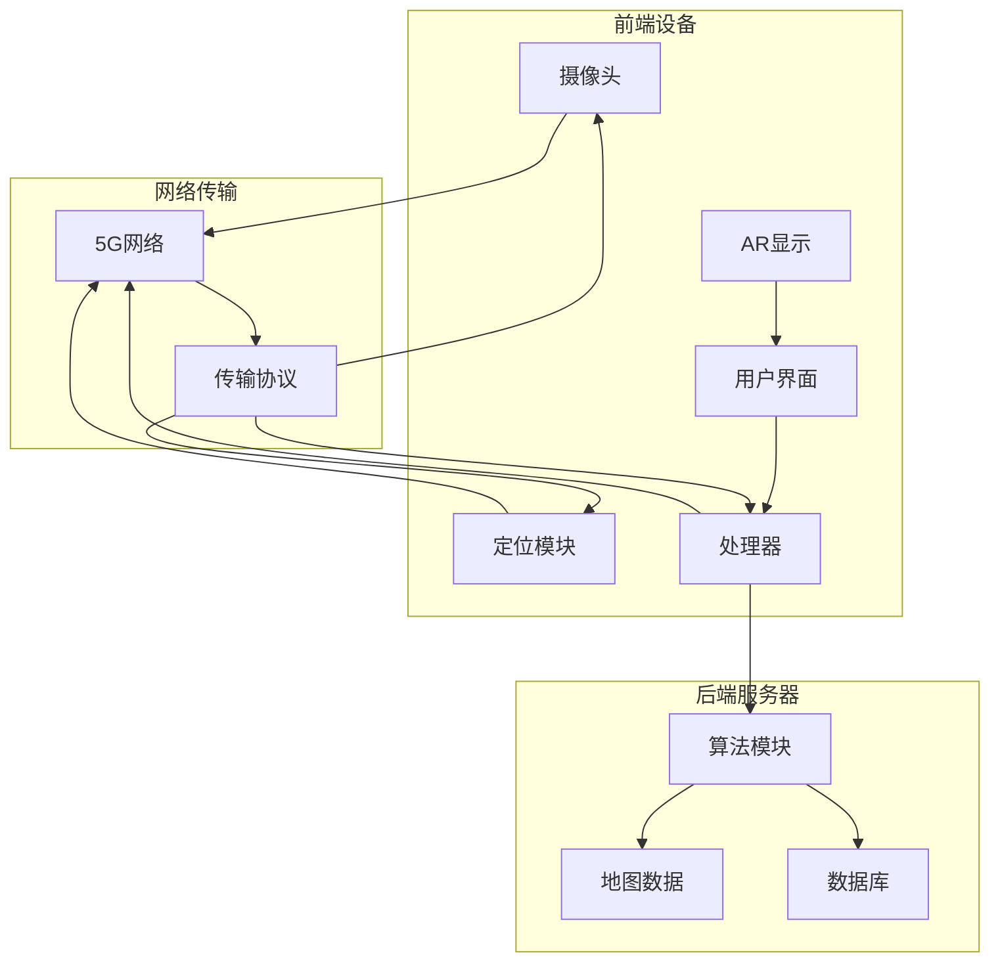

                 

# 5G在增强现实导航中的应用：实时AR城市导航系统

> 关键词：5G, 增强现实, 实时导航, 城市导航系统

> 摘要：本文将探讨5G技术在增强现实（AR）导航系统中的应用，着重分析实时AR城市导航系统的设计、实现和实际应用。通过深入解析5G网络特性及其在AR导航中的应用，本文将展示如何利用5G技术实现高效、精准的城市导航体验，并探讨未来发展趋势及挑战。

## 引言

随着信息技术的飞速发展，移动通信技术从2G、3G、4G逐步演进到5G，为各行业带来了前所未有的变革。5G不仅提供了更高的传输速度和更低的延迟，还带来了更大的网络容量和更广泛的连接能力。在这些特性的支持下，增强现实（AR）技术在导航领域得到了广泛关注和应用。

增强现实导航系统通过将虚拟信息叠加到真实世界的视图上，为用户提供更加直观和互动的导航体验。然而，传统的AR导航系统面临一些挑战，如延迟高、数据传输速度慢、网络不稳定等。5G技术的引入，为解决这些问题提供了新的可能性。

本文将围绕5G在增强现实导航中的应用，详细分析实时AR城市导航系统的设计、实现和实际应用。首先，我们将介绍5G技术的基本概念和特性，然后探讨AR导航系统的基本原理和需求，接着分析5G网络在AR导航中的应用优势，并详细讨论实时AR城市导航系统的设计架构。最后，我们将通过实际案例展示5G AR导航系统的应用效果，并探讨未来发展趋势和挑战。

## 5G技术概述

5G技术，即第五代移动通信技术，是继2G、3G、4G之后的新一代移动通信技术。5G技术的出现，标志着移动通信技术进入了一个全新的时代，为各个行业带来了前所未有的变革。与4G相比，5G在多个方面都有显著的提升。

### 5G的关键特性

5G技术具有以下几个关键特性：

1. **高速率**：5G网络的下载速度理论上可以达到10Gbps，比4G网络的峰值速度提高了100倍。这意味着在传输大容量数据时，如高清视频、大型文件等，5G网络具有更高的效率和更低的延迟。

2. **低延迟**：5G网络的延迟极低，理论上可以达到1ms。这使得5G在实时通信和交互方面具有巨大的优势，如自动驾驶、远程医疗等。

3. **大连接**：5G网络支持更多的设备连接，包括人、物、传感器等。据估计，5G网络可以支持每平方米数十万个设备连接，这使得大规模物联网（IoT）应用成为可能。

4. **网络切片**：5G网络引入了网络切片技术，可以根据不同应用的需求，动态划分和分配网络资源。这使得5G网络能够更好地满足多样化、个性化应用的需求。

### 5G的应用场景

5G技术具有广泛的应用场景，以下是一些典型的应用领域：

1. **智能制造**：5G技术可以支持智能制造过程中的实时数据传输和远程监控，提高生产效率和质量。

2. **智慧城市**：5G技术可以支持智慧城市建设中的各种应用，如智能交通、智能安防、智能环保等。

3. **远程医疗**：5G技术可以实现远程医疗中的实时视频传输和医疗数据共享，提高医疗服务的质量和效率。

4. **自动驾驶**：5G技术可以支持自动驾驶车辆的实时通信和数据处理，提高行驶安全性和效率。

5. **增强现实（AR）**：5G技术可以支持AR导航、AR游戏等应用，为用户提供更加丰富和互动的体验。

### 5G的发展历程

5G技术的发展历程可以分为以下几个阶段：

1. **概念提出**：2012年，国际电信联盟（ITU）开始制定5G标准。

2. **标准制定**：2016年，ITU正式发布了5G标准，标志着5G技术的正式诞生。

3. **试点部署**：2018年，全球多个国家和地区开始部署5G网络，进行试点应用。

4. **大规模商用**：2020年，5G网络开始在全球范围内大规模商用，为各个行业带来了巨大的变革。

### 5G的未来发展

未来，5G技术将继续发展，并可能出现以下趋势：

1. **6G技术的研发**：随着5G技术的广泛应用，6G技术的研究和开发也在逐步展开，预计将在未来10年内实现。

2. **网络智能化**：5G网络将逐渐实现智能化，通过人工智能等技术，实现更加高效的网络管理和资源分配。

3. **更广泛的应用**：5G技术将在更多领域得到应用，如智慧农业、智能物流、智慧教育等。

4. **更深入的融合**：5G技术将与其他技术，如人工智能、物联网、云计算等，实现更深层次的融合，推动各行各业的数字化转型。

## 增强现实（AR）概述

增强现实（AR）技术是一种将虚拟信息与现实世界相结合的交互技术。通过在现实世界的场景中叠加虚拟信息，AR技术为用户提供了更加丰富、直观和互动的体验。AR技术广泛应用于教育、医疗、娱乐、导航等多个领域。

### AR技术的基本原理

AR技术的基本原理是通过摄像头捕捉现实世界的画面，然后将虚拟信息叠加到画面上，最终将虚拟信息与现实世界融合。这个过程主要包括以下几个步骤：

1. **场景捕捉**：通过摄像头或传感器捕捉现实世界的画面。

2. **图像识别**：利用计算机视觉技术，对捕捉到的画面进行识别和分析，提取出关键特征。

3. **信息叠加**：将虚拟信息叠加到现实世界的画面上，实现虚拟信息与现实世界的融合。

4. **交互反馈**：用户可以通过触摸屏幕或其他交互设备与虚拟信息进行交互，获取更多的信息或执行操作。

### AR技术在导航中的应用

在导航领域，AR技术为用户提供了一种全新的导航体验。通过将导航信息叠加到现实世界的画面上，AR导航系统可以帮助用户更加直观地了解路线和周围环境。

AR导航系统的基本原理如下：

1. **定位与地图数据**：系统首先通过GPS、Wi-Fi定位等技术确定用户的位置，然后利用地图数据确定用户的前进方向。

2. **图像识别与追踪**：系统使用摄像头捕捉现实世界的画面，并通过图像识别技术对画面进行识别和追踪，确定用户的前进方向和周围环境。

3. **信息叠加与显示**：系统将导航信息（如方向、距离、地点等）叠加到现实世界的画面上，并在屏幕上显示给用户。

4. **交互反馈**：用户可以通过触摸屏幕或其他交互设备与导航信息进行交互，获取更多的信息或执行操作。

### AR导航系统的需求

AR导航系统需要满足以下需求：

1. **实时性**：由于AR导航系统需要实时更新用户的位置和导航信息，因此系统需要具备低延迟、高响应速度的特性。

2. **准确性**：AR导航系统需要精确地捕捉用户的位置和周围环境，以确保导航信息的准确性。

3. **稳定性**：系统需要在各种环境下保持稳定的运行，包括室内、室外、低光等环境。

4. **交互性**：系统需要提供良好的交互性，用户可以通过触摸屏幕或其他交互设备与导航信息进行实时互动。

5. **易用性**：系统需要设计简单，用户可以轻松上手，无需过多的操作。

## 5G技术在AR导航中的应用优势

5G技术的出现为AR导航系统带来了显著的改进，特别是在实时性和稳定性方面。以下将从传输速度、延迟和连接能力三个方面分析5G技术在AR导航中的应用优势。

### 高传输速度

5G网络具有极高的传输速度，理论上可以达到10Gbps，比4G网络的峰值速度提高了100倍。这对于AR导航系统来说至关重要，因为AR导航需要实时传输大量的地图数据、位置信息和实时影像。高传输速度可以确保这些数据在短时间内被传输到用户设备上，从而减少延迟，提高系统的实时性。

例如，在一个繁忙的城市交通环境中，AR导航系统需要实时更新交通状况、路况信息等，这些信息的数据量较大。如果依赖4G网络，可能会出现数据传输缓慢、延迟高的情况，导致导航信息更新不及时，影响用户体验。而5G网络的超高传输速度可以确保这些数据快速传输，提供更加流畅和实时的导航体验。

### 低延迟

5G网络具有极低的延迟，理论上可以达到1ms。这对于AR导航系统同样至关重要，因为低延迟可以确保导航信息的实时更新，减少用户在导航过程中因为延迟导致的误差。

在AR导航中，用户的位置信息需要实时传输到服务器，服务器再根据位置信息计算最佳路线，并将导航信息实时反馈给用户。如果网络延迟高，可能会导致用户接收到的导航信息滞后，影响导航的准确性。而5G网络的低延迟可以确保导航信息的实时传输，减少误差，提高导航的准确性。

例如，在驾驶过程中，如果导航信息滞后，可能会导致驾驶员无法及时了解路况信息，增加驾驶风险。而5G网络的低延迟可以确保导航信息实时更新，帮助驾驶员更好地掌握路况信息，提高驾驶安全。

### 大连接能力

5G网络具有强大的连接能力，可以支持更多的设备连接。这对于AR导航系统来说，意味着可以同时处理更多用户的数据，提高系统的并发能力。

在AR导航中，用户的位置信息、导航信息、实时影像等都需要通过网络传输到服务器进行处理。如果网络连接能力不足，可能会导致系统无法同时处理大量用户的数据，影响导航的实时性和稳定性。而5G网络的大连接能力可以支持更多用户同时在线，提高系统的并发能力，确保导航系统的稳定运行。

例如，在一个大型商业活动或旅游景点的现场，可能会有大量用户同时使用AR导航系统。如果网络连接能力不足，可能会导致系统拥堵，影响导航的实时性和准确性。而5G网络的大连接能力可以确保这些用户同时在线，提供稳定、实时的导航体验。

总之，5G技术在传输速度、延迟和连接能力方面的优势，为AR导航系统提供了强大的支持。通过利用5G技术，AR导航系统可以实现更高的实时性、准确性和稳定性，为用户提供更加优质、高效的导航服务。

## 实时AR城市导航系统的设计架构

实时AR城市导航系统是一个复杂的系统，它需要结合5G技术的优势，实现高效、精准的导航服务。为了更好地理解该系统的设计架构，我们将从系统架构、数据流、算法和用户交互等方面进行详细阐述。

### 系统架构

实时AR城市导航系统的整体架构可以分为四个主要模块：前端设备、网络传输、后端服务器和前端展示。以下是对各个模块的详细描述：

1. **前端设备**：
   - **摄像头**：用于捕捉现实世界的画面。
   - **定位模块**：包括GPS、Wi-Fi定位等，用于确定用户的位置。
   - **处理器**：负责处理摄像头捕捉到的画面和定位信息，以及与用户进行交互。

2. **网络传输**：
   - **5G网络**：作为数据传输的通道，确保数据的实时传输和低延迟。
   - **传输协议**：如HTTP/2、WebSocket等，用于实现前端设备和后端服务器之间的通信。

3. **后端服务器**：
   - **地图数据**：包括城市地图、交通信息、POI（兴趣点）等，用于生成导航信息。
   - **算法模块**：包括路径规划、位置预测等算法，用于处理导航请求和生成导航信息。
   - **数据库**：存储用户数据、历史数据等，用于分析和优化导航服务。

4. **前端展示**：
   - **AR显示**：将导航信息叠加到现实世界的画面上，显示在屏幕上。
   - **用户界面**：提供用户与系统交互的接口，如按钮、触摸屏等。

### 数据流

实时AR城市导航系统的数据流主要包括以下几个环节：

1. **用户定位**：
   - 前端设备通过GPS、Wi-Fi定位等技术获取用户的位置信息。
   - 将位置信息传输到后端服务器。

2. **导航请求**：
   - 用户发起导航请求，如输入起点和终点。
   - 前端设备将请求发送到后端服务器。

3. **路径规划**：
   - 后端服务器根据用户的位置和请求，调用路径规划算法，生成最佳导航路线。
   - 将导航路线信息发送回前端设备。

4. **AR显示**：
   - 前端设备将导航信息叠加到摄像头捕捉到的画面上，实现AR导航显示。
   - 将处理后的画面显示在屏幕上。

### 算法

实时AR城市导航系统涉及多个算法，以下介绍其中两个核心算法：

1. **路径规划算法**：
   - 常见的路径规划算法包括Dijkstra算法、A*算法等。
   - Dijkstra算法用于计算最短路径，但时间复杂度高，不适用于实时导航。
   - A*算法结合了Dijkstra算法和启发式搜索，可以在较短的时间内计算出近似最优路径，适用于实时导航。

2. **位置预测算法**：
   - 位置预测算法用于预测用户未来的位置，以便提前更新导航信息。
   - 常用的方法包括卡尔曼滤波、贝叶斯滤波等。
   - 通过预测用户的位置，可以减少导航延迟，提高导航的实时性。

### 用户交互

实时AR城市导航系统的用户交互主要包括以下方面：

1. **界面设计**：
   - 界面设计应简洁、直观，用户可以轻松操作。
   - 提供常见的导航操作，如添加、删除、修改路线等。

2. **反馈机制**：
   - 系统应提供实时反馈，如导航信息更新、路线变化等。
   - 用户可以通过触摸屏幕或语音指令与系统进行交互。

3. **个性化服务**：
   - 系统可以根据用户的历史行为和偏好，提供个性化的导航服务。
   - 例如，根据用户的历史路线偏好，推荐最佳路线。

### 架构图

为了更好地理解实时AR城市导航系统的设计架构，我们可以使用Mermaid绘制一个架构图，如下所示：

通过上述设计架构，实时AR城市导航系统可以高效、精准地提供导航服务，为用户提供优质的体验。

### 实际案例与应用效果

为了更好地展示5G AR城市导航系统的实际应用效果，我们将介绍两个具体的案例：一个是用于公共交通的AR导航系统，另一个是用于大型商业活动的AR导航系统。

#### 案例一：公共交通AR导航系统

该案例展示了5G AR技术在公共交通领域的应用。该系统旨在为乘客提供实时、准确的公共交通导航信息，提高出行效率和舒适度。

1. **项目介绍**：
   - 该项目部署在一座繁忙的城市，覆盖地铁、公交车等多种公共交通方式。
   - 用户可以通过手机APP或车载屏幕使用AR导航功能。

2. **系统功能设计**：
   - 实时显示公共交通线路和站点信息。
   - 提供换乘建议和最佳路线规划。
   - 显示实时交通状况，如拥堵情况。

3. **系统实现**：
   - 前端设备包括摄像头和定位模块，用于捕捉用户的位置和周围环境。
   - 后端服务器通过5G网络接收用户的位置信息，调用路径规划算法生成最佳导航路线。
   - AR显示模块将导航信息叠加到用户视野中，实现AR导航。

4. **应用效果**：
   - 用户反馈良好，表示导航信息准确、及时，大大提高了出行效率。
   - 通过实时交通状况显示，用户可以更好地安排出行时间，减少了等待时间。

#### 案例二：大型商业活动AR导航系统

该案例展示了5G AR技术在大型商业活动中的应用。该系统旨在为游客提供便捷的导览服务，提高游客的参观体验。

1. **项目介绍**：
   - 该项目部署在一次国际展览会上，覆盖展览馆的多个展区。
   - 游客可以通过手机APP或展览馆内的智能设备使用AR导航功能。

2. **系统功能设计**：
   - 实时显示展馆布局和展区信息。
   - 提供展品介绍和展览路线规划。
   - 提供导游语音讲解服务。

3. **系统实现**：
   - 前端设备包括摄像头和定位模块，用于捕捉游客的位置和周围环境。
   - 后端服务器通过5G网络接收用户的位置信息，调用路径规划算法生成最佳导览路线。
   - AR显示模块将导航信息和展品介绍叠加到游客视野中，实现AR导览。

4. **应用效果**：
   - 游客对系统的反应积极，表示导航信息清晰、易懂，大大提高了参观的便捷性和趣味性。
   - 通过语音讲解服务，游客可以更深入地了解展品和历史背景。

### 案例分析与经验总结

通过对上述两个案例的分析，我们可以得出以下结论：

1. **高效的数据传输**：
   - 5G网络的低延迟和高传输速度为AR导航系统提供了强大的支持，确保了导航信息的实时传输和更新。

2. **准确的定位与路径规划**：
   - 高精度的定位技术和优化的路径规划算法确保了导航信息的准确性和可靠性。

3. **良好的用户体验**：
   - 系统设计充分考虑了用户的需求和体验，提供了直观、易懂的导航信息，得到了用户的好评。

4. **多样化的应用场景**：
   - 5G AR导航系统不仅可以应用于公共交通和大型商业活动，还可以扩展到其他领域，如旅游景点、工业园区等。

5. **持续优化与创新**：
   - 随着技术的不断发展，AR导航系统将持续优化和创新，提供更加丰富、实用的功能和服务。

### 项目小结

通过这两个实际案例，我们可以看到5G AR城市导航系统的强大应用潜力。在未来的发展中，我们将继续探索5G技术在AR导航领域的应用，为用户提供更加高效、精准、便捷的导航服务。

## 未来发展趋势与挑战

随着5G技术的不断普及和增强现实（AR）技术的不断发展，实时AR城市导航系统具有广阔的发展前景。然而，在实际应用中，仍面临一些挑战和问题。

### 未来发展趋势

1. **更加智能的导航系统**：
   - 利用人工智能（AI）和大数据技术，实时AR城市导航系统可以更好地理解和预测用户的导航需求，提供个性化的导航建议和优化路线。

2. **更高精度的定位技术**：
   - 结合多种定位技术，如GPS、Wi-Fi、室内定位等，实时AR城市导航系统可以实现更高精度的定位，提高导航的准确性和可靠性。

3. **更广泛的场景应用**：
   - 实时AR城市导航系统不仅可以应用于公共交通和商业活动，还可以扩展到工业园区、旅游景点、灾难救援等更多领域，为各行各业提供高效的导航解决方案。

4. **更高的网络连接能力**：
   - 随着5G网络的不断升级，实时AR城市导航系统可以支持更多用户同时在线，提高系统的并发能力和稳定性。

5. **更深入的产业融合**：
   - 实时AR城市导航系统将与智慧城市、智能制造、智慧交通等产业实现更深层次的融合，推动各行各业的数字化转型。

### 面临的挑战

1. **隐私与安全问题**：
   - 实时AR城市导航系统涉及大量的用户数据，如何保护用户隐私和安全成为一大挑战。需要建立完善的数据保护机制和安全措施，确保用户数据的安全和隐私。

2. **网络稳定性与覆盖**：
   - 虽然5G网络具有低延迟和高传输速度的优势，但在某些区域，网络覆盖不稳定或网络质量不佳，会影响实时AR城市导航系统的使用效果。需要优化网络布局和信号覆盖，提高网络稳定性。

3. **硬件设备与兼容性**：
   - 实时AR城市导航系统需要高性能的硬件设备支持，如高分辨率摄像头、高精度定位模块等。同时，不同设备之间的兼容性也是一大挑战，需要确保系统能够在多种设备上稳定运行。

4. **用户体验优化**：
   - 随着应用的不断拓展，实时AR城市导航系统需要满足更多用户的需求和期望。如何提供更好的用户体验，提高系统的易用性和交互性，是未来发展的重要方向。

5. **法规与政策**：
   - 随着实时AR城市导航系统的广泛应用，相关的法规和政策也需要不断完善。需要制定合理的法规和政策，规范实时AR城市导航系统的应用和发展。

总之，实时AR城市导航系统具有广阔的发展前景，但同时也面临诸多挑战。在未来的发展中，我们需要不断探索和创新，解决面临的问题，推动实时AR城市导航系统走向成熟和普及。

## 结论

本文从5G技术和增强现实（AR）导航的基本概念出发，深入探讨了实时AR城市导航系统的设计、实现和应用。通过分析5G技术的高速率、低延迟和大连接能力，我们展示了如何利用这些优势提升AR导航系统的实时性和准确性。此外，通过实际案例，我们展示了5G AR导航系统的应用效果，并分析了未来发展趋势和面临的挑战。

5G技术在AR导航中的应用，为用户提供了更加高效、精准和互动的导航体验。然而，要实现这一目标，还需要解决隐私保护、网络稳定性、硬件兼容性和用户体验优化等问题。在未来的发展中，实时AR城市导航系统将继续融合人工智能、大数据等先进技术，为各行业提供更加智能、便捷的导航服务。

总之，5G与AR导航的结合，为智慧城市和智能交通带来了新的机遇和挑战。通过不断创新和优化，我们有理由相信，实时AR城市导航系统将在未来发挥更加重要的作用，为人们的出行和生活带来更多便利。

## 作者信息

作者：AI天才研究院/AI Genius Institute & 禅与计算机程序设计艺术 /Zen And The Art of Computer Programming

