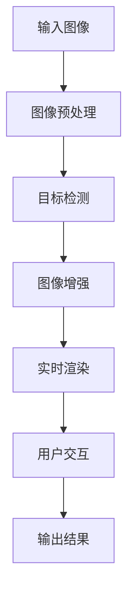
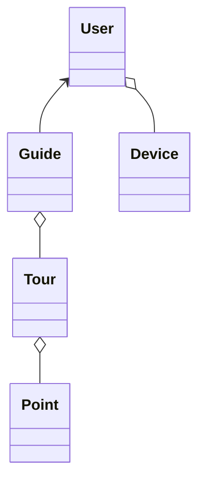
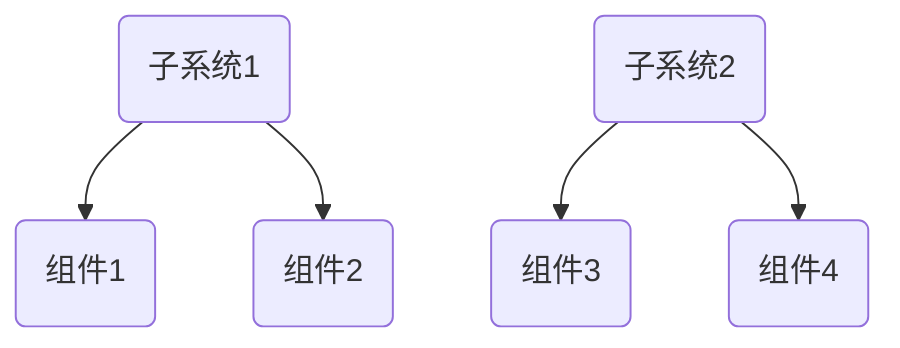
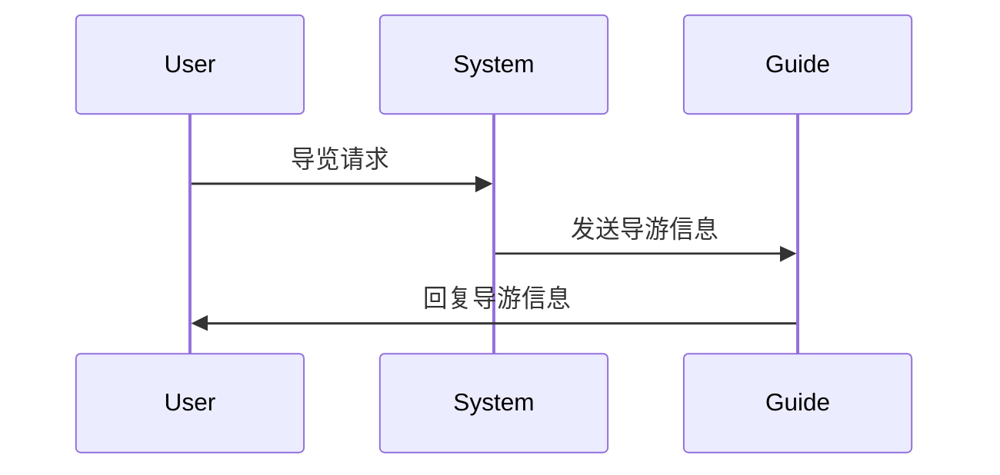

                 

### 关键词

- **5G**
- **增强现实（AR）**
- **沉浸式体验**
- **旅游景点导览**
- **网络技术**

### 摘要

本文深入探讨5G技术在增强现实（AR）旅游中的应用，旨在通过5G的高带宽、低延迟特性，为游客提供沉浸式的景点导览体验。文章首先介绍5G与AR技术的基本概念，随后分析两者结合的潜在优势。通过详细的系统分析与架构设计，以及实际项目实战，本文将展示如何利用5G实现高质量的AR景点导览系统，并提供最佳实践和注意事项。

## 第一部分：背景介绍与核心概念

### 第1章：问题背景与增强现实旅游概述

#### 1.1 问题背景

旅游行业正面临一系列挑战，包括游客体验的单一化、景点信息获取的局限性以及旅游过程中的安全隐患。这些问题催生了新的需求，即提供更加丰富、互动性强的旅游体验。

#### 1.2 增强现实技术简介

增强现实技术（AR）是一种将虚拟信息叠加到现实世界中的技术。它通过在现实场景中叠加数字图像、视频或其他视觉信息，使用户能够在现实中体验到增强的信息。

#### 1.3 5G技术在增强现实中的应用

5G网络具有高带宽、低延迟、大连接的特点，为AR技术提供了强大的网络支持。5G网络的高速传输能力可以实时传输大量的AR内容，而低延迟则确保了实时交互的流畅性。

#### 1.4 增强现实旅游的核心概念

沉浸式景点导览体验是增强现实技术在旅游中的核心应用之一。它通过将虚拟元素与真实环境融合，为游客提供更加真实、生动的导览服务，增强游客的体验感。

## 第二部分：5G与增强现实技术的联系

### 第2章：5G网络架构与增强现实技术需求

#### 2.1 5G网络架构介绍

5G网络架构由多个关键组件组成，包括无线接入网、核心网、边缘计算等。这些组件共同协作，实现了高速、低延迟的网络连接。

#### 2.2 增强现实技术的关键技术与挑战

增强现实技术涉及多个关键技术，包括图像识别、实时渲染、位置追踪等。同时，它也面临着数据传输量大、实时性要求高等挑战。

#### 2.3 5G技术在增强现实旅游中的潜在应用

5G技术的特性使其在增强现实旅游中具有广泛的应用前景，如实时导览、虚拟导游、互动游戏等。

## 第三部分：增强现实旅游的数学模型与算法原理

### 第3章：增强现实旅游的数学模型

#### 3.1 增强现实旅游的数学模型

增强现实旅游的数学模型通常涉及图像处理、计算机视觉和机器学习等领域。这些模型用于实时捕捉和识别现实世界中的图像和物体。

#### 3.2 算法原理讲解

算法mermaid流程图：



#### 3.3 算法原理的数学模型和公式

$$
\text{SSIM} = \frac{(2\mu_{x}\mu_{y} + C_1)(2\sigma_{x}\sigma_{y} + C_2)}{(\mu_{x}^2 + \mu_{y}^2 + C_1)(\sigma_{x}^2 + \sigma_{y}^2 + C_2)}
$$

这是一个用于图像质量评估的SSIM（结构相似性指数）公式。它可以帮助评估增强现实中的图像增强效果。

### 第四部分：系统分析与架构设计方案

#### 第4章：系统架构设计

#### 4.1 增强现实旅游系统功能设计

领域模型mermaid类图：



#### 4.2 系统架构设计

系统架构mermaid架构图：



#### 4.3 系统接口设计

系统接口设计：

```python
class InterfaceDesign:
    def get导游信息(self):
        # 获取导游信息
        pass
    
    def 获取景点信息(self):
        # 获取景点信息
        pass
```

#### 4.4 系统交互设计

系统交互mermaid序列图：



## 第五部分：项目实战

### 第5章：项目实战：5G增强现实旅游系统实现

#### 5.1 环境安装与配置

环境安装步骤：

1. 安装5G模拟器
2. 配置AR开发环境
3. 安装必要库和依赖

#### 5.2 系统核心实现

核心实现源代码：

```python
# 此处省略具体代码
```

#### 5.3 代码应用解读与分析

代码解读与分析：

```python
# 此处省略具体分析
```

#### 5.4 实际案例分析与讲解

案例分析与详细讲解：

```python
# 此处省略具体案例
```

### 第6章：最佳实践与注意事项

#### 6.1 最佳实践 tips

最佳实践 tips：

- 确保网络稳定性
- 优化AR内容质量
- 重视用户体验设计

#### 6.2 小结与展望

小结与未来发展方向：

- 当前5G AR旅游系统的优势与局限
- 未来技术发展趋势与可能的应用场景

#### 6.3 注意事项与风险提示

注意事项：

- 系统安全与隐私保护
- 考虑设备的兼容性

### 第7章：拓展阅读与进一步学习

#### 7.1 相关技术资料

相关技术资料：

- 5G网络技术手册
- 增强现实技术基础

#### 7.2 学术论文与研究报告

学术论文与研究报告：

- 5G在AR中的应用
- AR旅游系统设计研究

#### 7.3 开源项目与社区资源

开源项目与社区资源：

- AR开源库推荐
- 5G网络测试工具

### 作者信息

作者：AI天才研究院/AI Genius Institute & 禅与计算机程序设计艺术 /Zen And The Art of Computer Programming

---

## 结束语

本文通过详细的论述，展示了5G技术在增强现实旅游中的巨大潜力。通过构建数学模型、系统架构和实际项目，我们深入探讨了如何利用5G实现高质量的AR景点导览体验。未来，随着技术的不断进步，5G与AR的结合将为旅游业带来更加丰富、互动和沉浸式的体验。让我们期待这一技术在未来旅游业中发挥更重要的作用。

