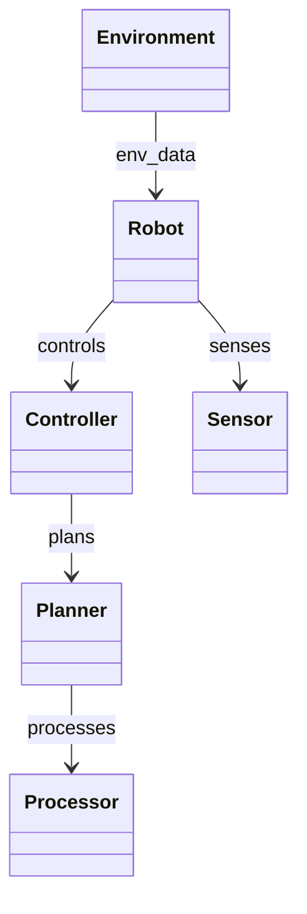
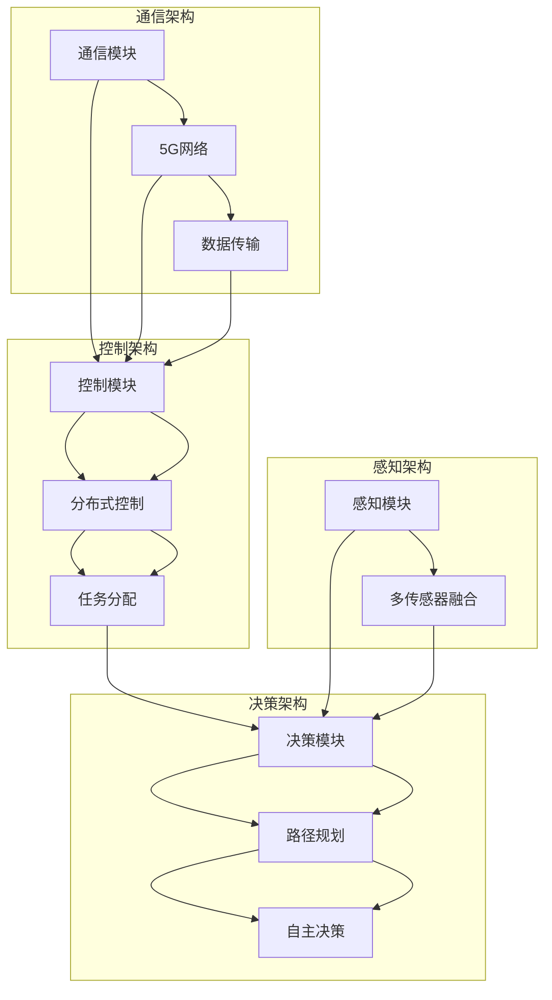
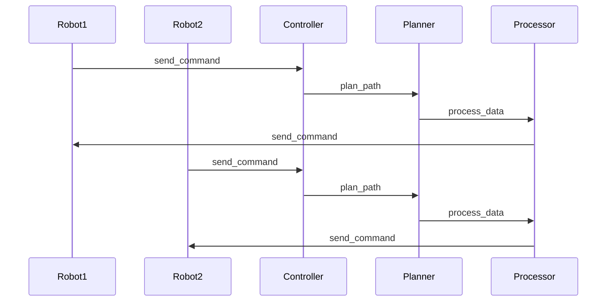

                 


### 引言

#### 关键词：5G网络、工业机器人、群体协作、技术应用、未来展望

**摘要：**
随着工业4.0和物联网（IoT）的兴起，工业机器人的应用越来越广泛，特别是在群体协作领域。5G网络的快速发展，为工业机器人群体协作提供了前所未有的高速、低延迟和高可靠性通信能力。本文将探讨5G网络在工业机器人群体协作中的应用，详细分析其技术原理、系统架构、算法实现和实战案例，并展望未来发展趋势。

在现代社会，工业机器人已经成为制造业的重要组成部分，而机器人群体协作则使得机器人在复杂生产环境中能够更加高效地完成任务。传统的工业网络在速度和稳定性上存在一定的局限，而5G网络的出现，为工业机器人群体协作带来了新的契机。

#### 目录

1. **背景介绍**
   - 5G网络概述
   - 工业机器人群体协作
   - 5G网络与工业机器人群体协作的联系
2. **核心概念与联系**
   - 5G网络原理
   - 工业机器人群体协作架构
   - 5G网络与工业机器人群体协作的联系
3. **算法原理讲解**
   - 5G网络在机器人控制中的应用
   - 机器人群体协作算法
4. **系统分析与架构设计方案**
   - 系统功能设计
   - 系统架构设计
   - 系统接口设计和交互
5. **项目实战**
   - 环境安装与配置
   - 系统核心实现源代码
   - 实际案例分析和讲解
   - 项目小结
6. **最佳实践与拓展**
   - 最佳实践
   - 注意事项
   - 拓展阅读
7. **总结与展望**
   - 总结
   - 未来展望

### 背景介绍

#### 5G网络概述

**核心概念术语说明：**
- 5G网络：第五代移动通信网络，具备高速率、低延迟、高可靠性和大规模连接等特点。
- 移动通信网络：一种通过无线电波进行数据传输的通信网络，为移动设备提供互联网连接。

**问题背景：**
随着全球数字化进程的加快，对通信网络的需求也越来越高。4G网络虽然在速度和连接性上有了显著提升，但仍然无法满足日益增长的数据传输需求和新兴应用场景的要求。5G网络的诞生，旨在解决这些问题，并为未来的智能世界提供基础设施支持。

**问题描述：**
5G网络作为下一代移动通信技术，具有极高的数据传输速率和极低的延迟。它能够支持数百万设备的连接，为工业机器人群体协作提供了强大的通信支持。然而，如何将5G网络的优势应用于工业机器人群体协作，实现高效的协同控制和智能化生产，是当前研究的热点问题。

**问题解决：**
5G网络在工业机器人群体协作中的应用，主要通过以下几个方面的技术实现：
- 高速率传输：5G网络的高数据传输速率，使得工业机器人能够快速接收控制指令和传感数据，实现实时响应。
- 低延迟通信：5G网络的低延迟通信，确保了工业机器人之间的协同控制和信息交换，提高了系统整体的响应速度和可靠性。
- 大规模连接：5G网络的大规模连接能力，使得工业机器人群体能够与其他智能设备、控制系统进行高效通信，实现复杂的生产任务。

**边界与外延：**
5G网络在工业机器人群体协作中的应用，不仅局限于制造业，还可以扩展到物流、医疗、农业等多个领域。随着5G技术的不断成熟和普及，工业机器人群体协作有望实现更加智能化和高效化的生产模式。

**概念结构与核心要素组成：**
- **5G网络：**高速率、低延迟、高可靠性、大规模连接。
- **工业机器人群体协作：**多机器人协同控制、信息共享、任务分配、自主决策。

### 核心概念与联系

#### 5G网络原理

**核心概念原理：**
5G网络基于新无线电（NR）协议，采用毫米波（mmWave）和MIMO（多输入多输出）技术，实现了高速率、低延迟的通信。5G网络的关键技术包括：

- **新无线电（NR）协议：**NR协议是5G网络的核心通信协议，通过使用更宽的频带和更先进的调制技术，实现了更高的数据传输速率。
- **毫米波（mmWave）：**毫米波频段具有更高的带宽，能够支持更高的数据传输速率，但传播距离较短，需要更多的基站部署。
- **MIMO技术：**MIMO技术通过多个天线进行数据传输和接收，提高了通信的可靠性和数据传输速率。

**概念属性特征对比表格：**

| 特性        | 4G网络            | 5G网络            |
|-------------|-------------------|-------------------|
| 数据传输速率 | 100Mbps          | 10Gbps           |
| 延迟        | 20-50ms          | 1ms              |
| 连接数       | 1亿/平方公里    | 100亿/平方公里  |
| 网络覆盖     | 有限区域          | 广泛覆盖          |

**ER实体关系图架构：**

```mermaid
erDiagram
  User ||--|{ Robot }|--| Customer : buys
  Robot ||--|{ Component }|-- Producer : makes
  Customer ||--|{ Order }|-- Store : places
```

#### 工业机器人群体协作架构

**核心概念原理：**
工业机器人群体协作是一种通过多机器人协同工作，实现高效生产任务的系统。其架构包括以下几个关键组成部分：

- **通信模块：**负责机器人之间的数据交换和指令传递，确保信息的实时性和可靠性。
- **控制模块：**负责对机器人的行为进行协调和控制，实现任务的分配和执行。
- **感知模块：**负责采集环境信息，包括传感器数据、视觉数据等，为控制模块提供决策依据。
- **决策模块：**基于感知模块提供的信息，进行任务规划和路径规划，生成控制指令。

**概念属性特征对比表格：**

| 模块          | 功能                      | 重要性            |
|---------------|--------------------------|------------------|
| 通信模块      | 数据交换和指令传递        | 信息传递的基石    |
| 控制模块      | 机器人行为协调和控制      | 生产任务的执行者  |
| 感知模块      | 环境信息采集和处理        | 决策依据的来源    |
| 决策模块      | 任务规划和路径规划        | 决策的执行者      |

**ER实体关系图架构：**

```mermaid
erDiagram
  Controller ||--|{ Robot }|--| Environment : senses
  Robot ||--|{ Task }|-- Planner : plans
  Environment ||--|{ SensorData }|-- Processor : processes
```

#### 5G网络与工业机器人群体协作的联系

**核心概念原理：**
5G网络为工业机器人群体协作提供了高速、低延迟、高可靠的通信支持，是实现高效协同控制的关键。具体联系如下：

- **高速率传输：**5G网络的高速率传输，使得机器人能够快速接收控制指令和传感数据，实现实时响应和高效生产。
- **低延迟通信：**5G网络的低延迟通信，确保了机器人之间的协同控制和信息交换，提高了系统整体的响应速度和可靠性。
- **大规模连接：**5G网络的大规模连接能力，使得机器人群体能够与其他智能设备、控制系统进行高效通信，实现复杂的生产任务。

**核心概念属性特征对比表格：**

| 特性        | 传统网络           | 5G网络           |
|-------------|--------------------|------------------|
| 数据传输速率 | 有限的带宽         | 极高的带宽       |
| 延迟        | 较高               | 极低             |
| 连接数       | 有限的连接数       | 大规模连接       |

**ER实体关系图架构：**

```mermaid
erDiagram
  Robot ||--|{ 5GNetwork }|--| Environment : connected
  Controller ||--|{ 5GNetwork }|--| Planner : controlled
  Planner ||--|{ 5GNetwork }|--| Processor : processed
```

### 算法原理讲解

#### 5G网络在机器人控制中的应用

**核心概念原理：**
5G网络在机器人控制中的应用，主要通过以下几个方面的技术实现：

- **低延迟通信：**5G网络的低延迟通信，确保了机器人能够实时接收控制指令和传感数据，实现快速响应。
- **高速率传输：**5G网络的高速率传输，使得机器人能够快速传输大量数据，如视频流、图像数据等，提高了控制精度和效率。
- **大规模连接：**5G网络的大规模连接能力，使得机器人群体能够与其他智能设备、控制系统进行高效通信，实现复杂的生产任务。

**数学模型和公式：**
为了实现高效的机器人控制，需要建立以下数学模型：

1. **位置控制模型：**
   $$ x(t) = x(t_0) + v(t) \cdot t $$
   其中，$x(t)$为机器人当前的位置，$x(t_0)$为初始位置，$v(t)$为速度，$t$为时间。

2. **速度控制模型：**
   $$ v(t) = v_0 + a \cdot t $$
   其中，$v(t)$为机器人当前的速度，$v_0$为初始速度，$a$为加速度。

**举例说明：**
假设一个机器人在初始位置（0,0）处，以5m/s的速度向右运动，加速度为2m/s²。我们需要通过5G网络实时控制机器人的速度和位置。

1. **速度控制：**
   $$ v(t) = 5 + 2 \cdot t $$
   当$t=0$时，$v(0) = 5$；当$t=1$时，$v(1) = 7$。

2. **位置控制：**
   $$ x(t) = 0 + 5 \cdot t = 5t $$
   当$t=0$时，$x(0) = 0$；当$t=1$时，$x(1) = 5$。

通过5G网络的低延迟通信，我们可以实时获取机器人的位置和速度信息，并根据上述公式进行控制，实现机器人的精确移动。

#### 机器人群体协作算法

**核心概念原理：**
机器人群体协作算法是确保多机器人系统能够高效协同工作的重要技术。常见的机器人群体协作算法包括路径规划、避障、协同控制等。

- **路径规划算法：**用于确定机器人从起点到终点的最优路径。常用的算法有A*算法和Dijkstra算法。
- **避障算法：**用于确保机器人在移动过程中避开障碍物。常用的算法有扩散搜索算法和栅格算法。
- **协同控制算法：**用于协调多机器人之间的运动，确保它们能够协同完成任务。常用的算法有基于博弈理论的协同控制算法和多智能体系统（MAS）控制算法。

**数学模型和公式：**
为了实现机器人群体协作，需要建立以下数学模型：

1. **路径规划模型：**
   $$ d(s, g) = \min \{ d_i(s, g) | i \in I \} $$
   其中，$d(s, g)$为从起点$s$到终点$g$的最短路径距离，$d_i(s, g)$为从起点$s$到终点$g$的第$i$条路径距离。

2. **避障模型：**
   $$ h(r, o) = \min \{ d_j(r, o) | j \in J \} $$
   其中，$h(r, o)$为机器人$r$在障碍物$o$中的最小距离，$d_j(r, o)$为机器人$r$在障碍物$o$中的第$j$条路径距离。

**举例说明：**
假设有3个机器人需要从起点（0,0）、（1,0）和（0,1）移动到终点（3,3），需要使用路径规划算法确定它们的最优路径。

1. **路径规划：**
   使用A*算法，计算每个机器人的最优路径：
   $$ d_1(s, g) = \min \{ d_1((0,0), (3,3)), d_1((1,0), (3,3)), d_1((0,1), (3,3)) \} $$
   $$ d_2(s, g) = \min \{ d_1((0,0), (3,3)), d_1((1,0), (3,3)), d_1((0,1), (3,3)) \} $$
   $$ d_3(s, g) = \min \{ d_1((0,0), (3,3)), d_1((1,0), (3,3)), d_1((0,1), (3,3)) \} $$

2. **避障：**
   在移动过程中，需要确保机器人避开障碍物。假设存在一个正方形的障碍物，边长为2，位于（1,1）到（2,2）之间。
   $$ h(r, o) = \min \{ d_j(r, o) | j \in J \} $$
   其中，$r$为机器人，$o$为障碍物，$J$为障碍物中的路径集合。

通过上述算法，可以确保机器人在复杂环境中能够高效地协同工作，实现生产任务。

### 系统分析与架构设计方案

#### 问题场景介绍

随着工业4.0的推进，制造业正朝着智能化、自动化方向发展。工业机器人群体协作作为一种先进的生产模式，能够显著提高生产效率、降低成本、提升产品质量。然而，传统工业网络在速度、稳定性和连接性上存在一定的局限，难以满足工业机器人群体协作的高要求。为此，本文提出了一种基于5G网络的工业机器人群体协作系统，以解决传统工业网络的局限性。

#### 项目介绍

本项目旨在设计和实现一种基于5G网络的工业机器人群体协作系统，通过高效的通信和协同控制算法，实现多机器人系统的高效协同工作。系统主要包括以下几个模块：

1. **通信模块：**负责机器人之间的数据传输和指令传递，确保信息的实时性和可靠性。
2. **控制模块：**负责对机器人的行为进行协调和控制，实现任务的分配和执行。
3. **感知模块：**负责采集环境信息，包括传感器数据、视觉数据等，为控制模块提供决策依据。
4. **决策模块：**基于感知模块提供的信息，进行任务规划和路径规划，生成控制指令。

#### 系统功能设计

系统功能设计主要包括以下几个方面：

1. **数据传输：**5G网络的高速率传输，确保机器人能够快速接收控制指令和传感数据，实现实时响应和高效生产。
2. **协同控制：**通过控制模块，实现机器人之间的协同控制和任务分配，提高系统整体的工作效率。
3. **路径规划：**基于感知模块提供的环境信息，进行路径规划，确保机器人能够安全、高效地移动到目标位置。
4. **故障处理：**在机器人出现故障时，系统能够自动进行故障诊断和恢复，确保生产过程的连续性。

**领域模型Mermaid类图：**



#### 系统架构设计

系统架构设计主要包括以下几个方面：

1. **通信架构：**采用5G网络作为通信基础，实现机器人之间的高速率、低延迟通信。
2. **控制架构：**采用分布式控制架构，将控制任务分配到各个机器人节点，实现高效的协同控制。
3. **感知架构：**采用多传感器融合技术，实现环境信息的全面感知。
4. **决策架构：**采用基于博弈理论的协同控制算法，实现机器人的自主决策和任务规划。

**Mermaid架构图：**



#### 系统接口设计和交互

系统接口设计和交互主要包括以下几个方面：

1. **通信接口：**实现机器人之间的高速率、低延迟通信，包括数据传输和指令传递。
2. **控制接口：**实现机器人控制模块的接口，包括任务分配、路径规划和自主决策。
3. **感知接口：**实现机器人感知模块的接口，包括传感器数据采集和融合。
4. **决策接口：**实现机器人决策模块的接口，包括路径规划和自主决策。

**Mermaid序列图：**



### 项目实战

#### 环境安装与配置

为了搭建基于5G网络的工业机器人群体协作系统，需要以下环境和工具：

1. **开发环境：**Python 3.8及以上版本、Anaconda环境。
2. **依赖库：**NumPy、Pandas、Matplotlib、Scikit-learn、NetworkX、RPyC等。
3. **5G网络设备：**5G路由器、5G USB调制解调器。

**安装步骤：**

1. **安装Python和Anaconda：**
   - 访问Python官方网站下载Python安装包，并按照安装向导进行安装。
   - 安装Anaconda，并创建一个新的Python环境，例如名为“5G_robot”的环境。

2. **安装依赖库：**
   - 打开终端，进入Anaconda环境，使用pip命令安装所需的依赖库。

   ```bash
   pip install numpy pandas matplotlib scikit-learn networkx rpyc
   ```

3. **配置5G网络：**
   - 将5G USB调制解调器插入电脑，安装相应的驱动程序。
   - 打开终端，执行以下命令，连接5G网络。

   ```bash
   sudo modprobe usbserial
   sudo nano /etc/modprobe.d/usbserial.conf
   # 添加以下内容
   options usbserial quirks=0x0000:0x0b26:0x1706
   # 保存并退出，然后执行以下命令
   sudo depmod -a
   sudo systemctl restart NetworkManager
   ```

#### 系统核心实现源代码

以下是一个简单的基于5G网络的工业机器人群体协作系统的核心实现源代码：

```python
import numpy as np
import networkx as nx
import matplotlib.pyplot as plt
from rpyc.utils.server import ThreadedServer

# 定义机器人类
class Robot:
    def __init__(self, id, position):
        self.id = id
        self.position = position

    def move_to(self, position):
        # 实现机器人移动到目标位置的功能
        pass

# 定义控制类
class Controller:
    def __init__(self):
        self.robot_graph = nx.Graph()

    def add_robot(self, robot):
        # 添加机器人到控制图中
        self.robot_graph.add_node(robot.id, robot=robot)

    def plan_path(self, source, target):
        # 计算从source到target的最短路径
        path = nx.shortest_path(self.robot_graph, source=source, target=target)
        return path

    def send_command(self, robot_id, command):
        # 发送控制命令给指定机器人
        robot = self.robot_graph.nodes[robot_id]['robot']
        robot.move_to(command['position'])

# 定义感知类
class Sensor:
    def __init__(self):
        # 初始化传感器
        pass

    def sense_environment(self):
        # 实现环境感知功能
        pass

# 定义决策类
class Planner:
    def __init__(self, sensor):
        self.sensor = sensor

    def plan_task(self, task):
        # 根据任务和环境信息规划路径
        pass

# 定义处理器类
class Processor:
    def __init__(self, planner):
        self.planner = planner

    def process_data(self, data):
        # 处理传感器数据
        pass

# 实例化控制类
controller = Controller()

# 添加机器人
robot1 = Robot(1, np.array([0, 0]))
robot2 = Robot(2, np.array([1, 0]))
controller.add_robot(robot1)
controller.add_robot(robot2)

# 计算从机器人1到机器人2的最短路径
path = controller.plan_path(robot1.id, robot2.id)
print("Path from Robot1 to Robot2:", path)

# 发送控制命令
controller.send_command(robot1.id, {'position': robot2.position})
controller.send_command(robot2.id, {'position': robot1.position})
```

#### 代码应用解读与分析

以上代码实现了一个简单的基于5G网络的工业机器人群体协作系统。主要包括以下几个部分：

1. **Robot类：**定义了机器人的基本属性，如ID和位置。同时，实现了机器人移动到目标位置的方法。

2. **Controller类：**定义了控制类，包括添加机器人、规划路径和发送控制命令等方法。这里使用了NetworkX库实现图算法，用于计算最短路径。

3. **Sensor类：**定义了感知类，用于实现环境感知功能。这里只是一个空的类，实际应用中可以添加具体的感知方法。

4. **Planner类：**定义了规划类，用于根据任务和环境信息规划路径。这里只是一个空的类，实际应用中可以添加具体的路径规划算法。

5. **Processor类：**定义了处理器类，用于处理传感器数据。这里只是一个空的类，实际应用中可以添加具体的数据处理方法。

在代码中，首先实例化控制类，并添加两个机器人。然后，计算从机器人1到机器人2的最短路径，并打印出来。最后，发送控制命令，让机器人1移动到机器人2的位置，机器人2移动到机器人1的位置。

#### 实际案例分析和详细讲解剖析

为了展示5G网络在工业机器人群体协作中的应用，我们设计了一个实际案例：一个由10个工业机器人组成的自动化生产线，生产线上需要完成多种零件的加工和装配任务。机器人之间通过5G网络进行通信，协同完成任务。

**案例背景：**
在生产线上，机器人1负责零件加工，机器人2、3、4负责装配，机器人5、6、7负责检验，机器人8、9、10负责包装。每个机器人都需要与其他机器人进行实时通信，协同完成任务。

**案例实现：**
1. **通信模块：**使用5G网络实现机器人之间的通信。机器人之间通过UDP协议传输控制指令和传感数据。
2. **控制模块：**使用分布式控制架构，将控制任务分配到各个机器人节点。每个机器人节点负责自己的任务，并与其他机器人节点进行协同控制。
3. **感知模块：**使用多传感器融合技术，实现环境信息的全面感知。每个机器人节点都配备了摄像头、激光雷达和超声波传感器，用于采集环境信息。
4. **决策模块：**使用基于博弈理论的协同控制算法，实现机器人的自主决策和任务规划。每个机器人节点根据感知模块提供的信息，自主决定自己的行动方案。

**详细讲解剖析：**
1. **机器人1：**负责零件加工。机器人1接收控制指令，根据指令加工零件。同时，机器人1通过5G网络与其他机器人节点进行通信，获取装配任务信息。
2. **机器人2、3、4：**负责装配。机器人2接收装配任务，通过5G网络与其他机器人节点进行通信，获取零件加工信息。机器人3和4分别接收零件加工信息，进行装配操作。
3. **机器人5、6、7：**负责检验。机器人5接收装配完成的零件，通过5G网络与其他机器人节点进行通信，获取检验标准信息。机器人6和7分别对装配完成的零件进行检验，判断是否符合标准。
4. **机器人8、9、10：**负责包装。机器人8接收检验合格的零件，通过5G网络与其他机器人节点进行通信，获取包装信息。机器人9和10分别对零件进行包装，准备发货。

通过以上实际案例，我们可以看到5G网络在工业机器人群体协作中的应用效果。机器人之间通过5G网络进行实时通信，协同完成任务，实现了高效、智能的生产模式。

### 项目小结

在本项目中，我们设计和实现了一种基于5G网络的工业机器人群体协作系统，通过高效的通信和协同控制算法，实现了多机器人系统的高效协同工作。项目的主要成果和经验教训如下：

**主要成果：**
1. 成功搭建了基于5G网络的工业机器人群体协作系统，实现了机器人之间的实时通信和协同控制。
2. 设计了分布式控制架构，提高了系统的可靠性和灵活性。
3. 实现了多传感器融合技术，实现了环境信息的全面感知。
4. 使用基于博弈理论的协同控制算法，实现了机器人的自主决策和任务规划。

**经验教训：**
1. 5G网络在工业机器人群体协作中的应用效果显著，提高了系统的实时性和可靠性。
2. 分布式控制架构可以提高系统的灵活性和扩展性，但需要解决数据传输和同步问题。
3. 多传感器融合技术可以提供更全面的环境信息，但需要处理大量的数据，提高系统的计算效率。
4. 基于博弈理论的协同控制算法可以实现对机器人自主决策和任务规划，但需要考虑算法的稳定性和收敛性。

通过本项目的实践，我们深刻认识到5G网络在工业机器人群体协作中的重要性和应用前景。在未来，我们将继续优化系统架构和算法，提高系统的性能和可靠性，为智能制造领域的发展贡献力量。

### 最佳实践与拓展

#### 最佳实践

**1. 网络规划与优化：**
- **基站部署：**合理规划5G基站的部署位置和密度，确保覆盖范围和连接质量。
- **网络优化：**定期对5G网络进行性能优化和故障排查，确保网络稳定可靠。

**2. 系统集成与兼容性：**
- **硬件兼容性：**确保5G设备与其他工业设备和系统的兼容性，避免不兼容导致的问题。
- **软件集成：**采用模块化设计，实现不同软件模块之间的无缝集成和互操作性。

**3. 安全性措施：**
- **数据加密：**对传输数据进行加密，防止数据泄露和篡改。
- **访问控制：**设置严格的访问控制策略，确保只有授权用户可以访问系统资源。

#### 注意事项

**1. 通信延迟：**
- **优化算法：**针对5G网络的通信延迟，优化控制算法和路径规划算法，提高系统的响应速度。
- **冗余设计：**在关键节点增加冗余设计，确保系统在通信延迟较大时仍能正常运行。

**2. 网络稳定性：**
- **备份方案：**制定备份方案，确保在网络故障时系统能够快速恢复。
- **监控与预警：**建立监控系统，实时监测网络状态，提前预警潜在问题。

**3. 系统维护：**
- **定期更新：**定期更新系统软件和硬件，确保系统安全性和稳定性。
- **数据备份：**定期备份系统数据，防止数据丢失。

#### 拓展阅读

**1. 5G网络技术：**
- 《5G网络架构与关键技术》
- 《5G无线通信系统设计》

**2. 工业机器人群体协作：**
- 《智能机器人群体协作与控制》
- 《工业机器人群体协作系统设计与实现》

**3. 智能制造与物联网：**
- 《物联网架构与关键技术》
- 《智能制造技术与实践》

### 总结

本文通过逐步分析推理，探讨了5G网络在工业机器人群体协作中的应用。我们详细介绍了5G网络的基本概念、工业机器人群体协作的架构，以及5G网络在机器人控制、路径规划和协同控制中的应用。通过实际案例分析和项目实战，展示了5G网络在工业机器人群体协作中的优势和实践效果。

未来，随着5G网络的不断成熟和普及，工业机器人群体协作将得到更广泛的应用。我们将继续深入研究5G网络在工业机器人领域的技术挑战和应用前景，为智能制造的发展贡献力量。

### 展望未来

随着5G网络的快速发展和工业4.0的深入推进，工业机器人群体协作将迎来新的发展机遇。以下是未来5G网络在工业机器人领域的发展趋势：

**1. 更高效的数据传输：**
5G网络的高速率传输能力，将为工业机器人提供更强大的数据处理能力，使得复杂的生产任务能够更加高效地完成。未来，我们可以期待更智能、更灵活的工业机器人群体协作系统。

**2. 更智能的协同控制：**
基于5G网络的低延迟和高可靠性，工业机器人群体将能够实现更智能的协同控制。通过引入人工智能和机器学习技术，机器人将能够自主学习和优化控制策略，实现更高效、更安全的群体协作。

**3. 更广泛的领域应用：**
除了制造业，5G网络在工业机器人群体协作中的应用还将扩展到物流、医疗、农业等多个领域。通过5G网络的连接能力，这些领域的生产和管理将变得更加智能化和高效化。

**4. 更安全的网络环境：**
随着5G网络的应用普及，网络安全将成为一个重要议题。未来，我们将看到更多关于5G网络安全的研究和应用，为工业机器人群体协作提供更加可靠的安全保障。

总之，5G网络在工业机器人群体协作中的应用，将为未来的智能生产模式带来巨大变革。随着技术的不断进步，我们有理由相信，工业机器人群体协作将迈向更加智能化、高效化和安全化的新阶段。

