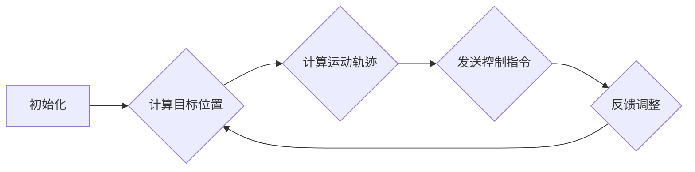
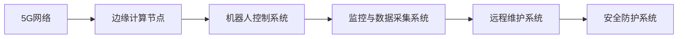
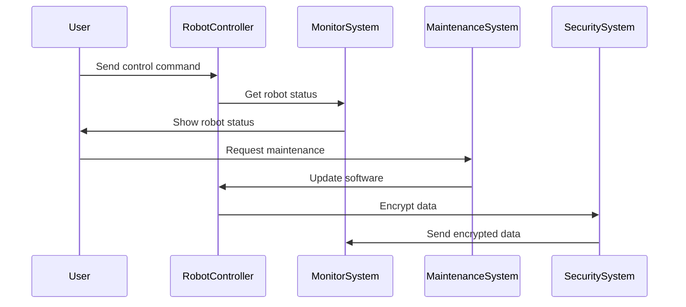

                 

### 5G网络概述

#### 第1章: 5G网络技术基础

##### 1.1 5G网络的核心特点

5G网络，即第五代移动通信技术，是当前移动通信领域的重要突破。与4G相比，5G具有以下几个核心特点：

1. **高速率**：5G网络的理论峰值下载速度可达10Gbps，是4G网络的100倍以上，能够满足高带宽应用需求，如高清视频传输、虚拟现实（VR）等。
2. **低延迟**：5G网络的端到端延迟极低，可达1毫秒，大幅降低了延迟敏感应用的时延，如自动驾驶、工业控制等。
3. **高容量**：5G网络通过引入大规模MIMO、毫米波等技术，可以提供更高的网络容量，支持更多设备的接入，满足未来物联网（IoT）的发展需求。
4. **广覆盖**：5G网络通过多种频段组合，实现更广泛的覆盖，尤其在室内、地下等4G网络覆盖不足的区域，5G提供了更好的网络连接性。

##### 1.2 5G网络的架构与关键技术

5G网络的架构相较于4G有较大改进，主要包括以下几个方面：

1. **网络切片**：网络切片技术允许运营商在网络中创建多个虚拟网络，每个切片都能根据特定业务需求进行配置，提高网络的灵活性和效率。
2. **边缘计算**：边缘计算将部分计算任务从云端转移到网络边缘，降低延迟，提高响应速度，适用于实时性要求高的应用场景。
3. **多接入边缘计算（MEC）**：MEC是一种网络架构，它将计算、存储和应用程序放在网络边缘，使应用能够直接利用网络资源，减少数据传输路径，提高性能。
4. **分布式网络架构**：5G网络采用分布式架构，通过多个基站和分布式天线系统（DAS）实现网络覆盖，提高网络稳定性和可靠性。

5G网络的关键技术还包括：

- **毫米波通信**：利用毫米波频段传输数据，提供更高的带宽和更低的延迟。
- **大规模MIMO**：通过使用多个天线，实现空间复用，提高数据传输速率和容量。
- **SDN/NFV**：软件定义网络（SDN）和网络功能虚拟化（NFV）技术，使网络管理和服务提供更加灵活和高效。

##### 1.3 5G网络在工业领域的应用前景

5G网络在工业领域的应用前景广阔，具体体现在以下几个方面：

1. **工业机器人远程控制**：5G网络的高速率和低延迟特性，使工业机器人能够实现远程精准控制，提高生产效率和灵活性。
2. **智能制造**：5G网络支持海量设备和传感器连接，有助于实现工业生产线的智能化，提高生产线的自动化水平和响应速度。
3. **远程监控与数据采集**：5G网络的高带宽和广覆盖能力，使远程监控和实时数据采集成为可能，有助于提高设备维护效率和预防性维护。
4. **边缘计算与MEC**：边缘计算和MEC技术在工业自动化中的应用，可以降低数据处理延迟，提高系统响应速度和可靠性。

总之，5G网络将为工业领域带来革命性的变化，推动工业自动化和智能制造的发展。然而，5G网络的广泛应用也面临着一些挑战，如网络建设成本、设备兼容性等问题，这些都需要在未来的发展中逐步解决。

#### LET'S THINK STEP BY STEP：

1. **5G网络的核心特点**：首先，我们需要了解5G网络的基本特点，这包括其高速率、低延迟、高容量和广覆盖等方面，这些特点决定了5G网络在工业应用中的潜在优势。

2. **5G网络的架构与关键技术**：接下来，我们需要深入理解5G网络的架构设计和关键技术，如网络切片、边缘计算、MEC、分布式网络架构等，这些技术是实现5G网络高性能的基础。

3. **5G网络在工业领域的应用前景**：然后，我们需要探讨5G网络在工业领域中的具体应用，包括工业机器人远程控制、智能制造、远程监控与数据采集等，了解这些应用如何受益于5G网络的特点和关键技术。

4. **面临的挑战与解决方案**：最后，我们需要识别5G网络在工业应用中可能遇到的挑战，如网络建设成本、设备兼容性等，并思考相应的解决方案。

通过以上步骤，我们可以全面、系统地了解5G网络在工业机器人远程控制中的应用，为未来的发展做好准备。接下来，我们将进一步探讨工业机器人远程控制技术的基础。

### 工业机器人远程控制技术

#### 第2章: 工业机器人远程控制技术

##### 2.1 工业机器人远程控制的基本概念

工业机器人远程控制是指利用通信技术和计算机技术，实现对工业机器人的远程监控、操作和控制。它通过将机器人的控制指令通过网络传输到机器人控制系统，实现对机器人的实时操控，从而实现远程操作和维护。

远程控制技术在工业机器人中的应用主要包括以下几个方面：

1. **监控与状态检测**：通过远程监控，操作者可以实时了解机器人的运行状态，包括速度、位置、负载等信息，及时发现并处理异常情况。
2. **远程控制**：操作者可以通过远程控制界面，实现对机器人的精确操作，如启动、停止、路径规划等，提高生产效率和灵活性。
3. **维护与故障处理**：通过远程维护和故障处理，操作者可以在本地对机器人进行软件更新、参数调整和故障诊断，减少现场维护成本和时间。

##### 2.2 工业机器人远程控制的关键技术

实现工业机器人远程控制的关键技术包括：

1. **通信技术**：远程控制的核心在于通信的可靠性和稳定性。常用的通信技术有无线通信、有线通信和网络通信等。5G网络的高速率和低延迟特性，使得远程控制更加高效和稳定。
   
2. **控制算法**：控制算法是远程控制的核心，包括位置控制、速度控制、路径规划等。这些算法需要根据具体应用场景进行优化和调整，以实现高精度、高响应速度的控制。

3. **安全协议**：远程控制涉及到数据安全和隐私保护，需要采用一系列安全协议，如数据加密、身份验证、访问控制等，确保通信过程的安全可靠。

4. **人机交互界面**：人机交互界面是操作者与机器人交互的桥梁，界面设计需要直观、易用，支持多种操作方式，如图形界面、语音控制等。

##### 2.3 远程控制技术在工业机器人中的应用实例

远程控制技术在工业机器人中的应用实例丰富多样，以下是一些典型应用场景：

1. **制造行业**：在制造业中，远程控制技术被广泛应用于自动化生产线上的机器人控制。例如，机器人可以在远程操作人员的指挥下进行组装、焊接、喷涂等操作，实现24小时不间断生产。

2. **医疗行业**：在医疗领域，远程控制技术被用于手术机器人、医疗辅助机器人的操作。医生可以通过远程控制，对手术机器人进行精细操作，提高手术的准确性和安全性。

3. **物流行业**：在物流领域，远程控制技术被用于自动化仓储系统和无人驾驶运输设备。操作者可以通过远程监控和控制，实现仓储物品的自动分类、搬运和配送。

4. **农业**：在农业领域，远程控制技术被用于农业机械的自动操作。例如，无人机可以远程控制进行农药喷洒、作物监测等作业，提高农业生产的效率和质量。

综上所述，工业机器人远程控制技术正在逐渐成熟，并广泛应用于各个行业。随着5G网络的发展，远程控制技术将迎来更广阔的应用前景，为工业生产、医疗健康、物流运输等领域带来深刻变革。

#### LET'S THINK STEP BY STEP：

1. **定义与基本概念**：首先，我们需要明确工业机器人远程控制的基本概念，理解其核心内容和目标，这是远程控制技术发展的基础。

2. **关键技术探讨**：接下来，我们需要深入探讨实现远程控制的关键技术，包括通信技术、控制算法、安全协议和人机交互界面，这些技术是实现远程控制的核心要素。

3. **应用实例分析**：然后，我们需要通过具体的应用实例，了解远程控制技术在各个行业中的实际应用效果，从中总结经验和教训，为未来的应用提供参考。

通过以上步骤，我们可以全面了解工业机器人远程控制技术的发展现状和未来趋势。在下一章中，我们将探讨5G网络与工业机器人远程控制技术的融合，进一步探讨其技术融合的方案和挑战。

### 5G网络与工业机器人远程控制的技术融合

#### 第3章: 5G网络与工业机器人远程控制的技术融合

##### 3.1 5G网络在工业机器人远程控制中的作用

5G网络在工业机器人远程控制中扮演着至关重要的角色，其高速率和低延迟特性使得远程控制更加高效和可靠。以下是5G网络在工业机器人远程控制中具体的作用：

1. **提高控制精度**：5G网络的高速率可以确保机器人控制信号的实时传输，减少延迟，从而提高控制的精度和稳定性。这对于需要高精度操作的工业机器人尤为重要，如精密制造和医疗手术机器人。

2. **增强实时响应**：5G网络的低延迟特性使得机器人能够迅速响应操作指令，这对于需要实时响应的应用场景至关重要，如工业自动化生产线和无人驾驶车辆。

3. **支持海量连接**：5G网络的高容量和广覆盖能力使得更多的工业机器人可以同时接入网络，支持大规模工业机器人集群的远程控制和协同作业。

4. **促进边缘计算**：5G网络与边缘计算的结合，可以在网络边缘进行部分数据处理和计算任务，降低数据传输延迟，提高系统的实时性和可靠性。

##### 3.2 5G网络与远程控制技术的融合方案

为了充分发挥5G网络的优势，实现工业机器人远程控制的优化，我们需要设计一系列融合方案，具体包括：

1. **网络架构优化**：通过引入5G网络切片技术，可以根据不同工业应用的需求，灵活配置网络资源，确保每个应用场景都能获得最佳的网络服务。

2. **边缘计算应用**：在工业现场部署边缘计算节点，对实时性要求高的数据在边缘进行预处理和计算，降低数据传输延迟，提高系统响应速度。

3. **云计算与边缘计算协同**：将云计算和边缘计算相结合，实现计算资源的动态调度和优化，根据实时需求，将计算任务分配到最适合的位置，提高整体系统的效率和性能。

4. **安全协议加强**：在5G网络中，加强数据传输的安全性，采用先进的加密算法和身份认证机制，确保远程控制过程中的数据安全和隐私保护。

##### 3.3 5G网络在工业机器人远程控制中的挑战与解决方案

尽管5G网络在工业机器人远程控制中具有诸多优势，但其广泛应用仍面临一些挑战，需要采取相应的解决方案：

1. **网络建设成本**：5G网络建设需要大量的投资，包括基站建设、网络优化和设备更新等。为了降低成本，可以通过政府扶持、企业合作等方式共同分担投资。

2. **设备兼容性**：5G网络的设备兼容性问题需要解决，确保现有的工业机器人设备能够与5G网络无缝对接。这需要设备制造商和通信企业共同合作，推动标准化进程。

3. **数据传输效率**：5G网络的数据传输效率需要优化，特别是在高带宽和低延迟需求的应用场景中。可以通过引入更高效的编码算法和流量管理策略来提高数据传输效率。

4. **网络安全问题**：5G网络的安全性问题不可忽视，需要建立完善的安全防护体系，包括数据加密、访问控制、异常检测等，确保远程控制过程中的数据安全和系统稳定运行。

总之，5G网络与工业机器人远程控制技术的融合，为工业自动化和智能制造带来了新的机遇和挑战。通过优化网络架构、应用边缘计算、加强安全防护等措施，可以有效应对这些挑战，推动工业机器人远程控制技术的发展。

#### LET'S THINK STEP BY STEP：

1. **理解5G网络作用**：首先，我们需要明确5G网络在工业机器人远程控制中的作用，包括提高控制精度、增强实时响应、支持海量连接和促进边缘计算等方面。

2. **设计融合方案**：接下来，我们需要设计5G网络与远程控制技术的融合方案，如网络架构优化、边缘计算应用、云计算与边缘计算协同和安全协议加强等。

3. **分析挑战与解决方案**：然后，我们需要识别5G网络在工业机器人远程控制中可能遇到的挑战，如网络建设成本、设备兼容性、数据传输效率和网络安全问题，并探讨相应的解决方案。

通过以上步骤，我们可以全面、系统地了解5G网络在工业机器人远程控制中的应用，为未来的发展提供理论支持和实践指导。接下来，我们将进一步探讨5G网络在工业机器人远程控制中的应用案例。

### 5G网络在远程监控与数据采集中的应用

#### 第4章: 5G网络在远程监控与数据采集中的应用

##### 4.1 远程监控与数据采集的挑战

远程监控与数据采集在工业机器人远程控制中具有重要意义，但同时也面临着一些挑战。以下是这些挑战的详细分析：

1. **带宽限制**：传统的4G网络在带宽方面存在一定限制，尤其是在大规模设备接入和数据传输时，容易导致网络拥堵和延迟，影响监控和数据采集的实时性和准确性。

2. **延迟问题**：远程监控与数据采集需要实时性和低延迟的网络支持。然而，传统的网络结构在传输过程中往往会产生较高的延迟，导致监控数据丢失或延迟，影响系统的稳定运行。

3. **数据安全性**：数据在传输过程中可能面临被窃取、篡改等安全风险。尤其是在工业环境中，设备故障、数据泄露等问题可能导致严重的生产事故和经济损失。

4. **设备兼容性**：不同厂商和不同型号的工业设备往往存在兼容性问题，导致远程监控与数据采集系统的实现复杂度和维护成本增加。

##### 4.2 5G网络在远程监控与数据采集中的应用案例

5G网络的高速率、低延迟和高安全性的特点，为远程监控与数据采集提供了新的解决方案。以下是几个应用案例：

1. **智能工厂远程监控**：某汽车制造企业利用5G网络实现对生产线的实时监控和远程控制。通过部署5G基站和传感器设备，该企业实现了生产数据的实时传输和远程分析，有效提高了生产效率和质量。

2. **智能农业远程数据采集**：某农业公司利用5G网络实现对农田环境数据的实时采集和监控。通过安装在农田中的传感器设备，该公司可以实时监测土壤湿度、温度、光照等参数，并根据数据调整灌溉和施肥策略，提高了农业生产效率。

3. **工业机器人远程监控**：某工业机器人制造商利用5G网络实现对机器人运行状态的实时监控和远程维护。通过安装在机器人上的传感器，该制造商可以实时获取机器人的运行数据，及时发现并解决故障，提高了机器人的稳定性和可靠性。

##### 4.3 5G网络对远程监控与数据采集的改进

5G网络在远程监控与数据采集中的应用，带来了以下几个方面的改进：

1. **提高数据传输速率**：5G网络的高速率特性，使得远程监控与数据采集系统能够实现更快的数据传输，减少数据丢失和延迟，提高系统的实时性和准确性。

2. **降低延迟**：5G网络的低延迟特性，使得远程监控与数据采集系统能够实现实时响应，满足对实时性要求较高的应用需求，如工业自动化控制和远程医疗手术。

3. **增强数据安全性**：5G网络采用了更先进的安全加密技术和认证机制，有效保障了数据在传输过程中的安全性和隐私性，降低了数据泄露和篡改的风险。

4. **提高设备兼容性**：5G网络支持多种接入方式，可以兼容不同厂商和不同型号的设备，简化了远程监控与数据采集系统的实现和部署。

综上所述，5G网络在远程监控与数据采集中的应用，为工业机器人远程控制带来了显著改进。通过充分利用5G网络的高速率、低延迟和高安全性优势，远程监控与数据采集系统能够实现更高的实时性和准确性，为工业自动化和智能制造提供了有力支持。

#### LET'S THINK STEP BY STEP：

1. **识别远程监控与数据采集的挑战**：首先，我们需要识别远程监控与数据采集在工业机器人远程控制中面临的带宽限制、延迟问题、数据安全性和设备兼容性等挑战。

2. **分析5G网络的应用案例**：接下来，我们需要分析5G网络在实际远程监控与数据采集中的应用案例，如智能工厂、智能农业和工业机器人远程监控等，从中总结应用效果和经验。

3. **探讨5G网络的改进措施**：然后，我们需要探讨5G网络如何通过提高数据传输速率、降低延迟、增强数据安全性和提高设备兼容性等方面，对远程监控与数据采集进行改进。

通过以上步骤，我们可以全面、系统地了解5G网络在远程监控与数据采集中的应用，为未来的发展提供理论支持和实践指导。接下来，我们将进一步探讨5G网络在远程控制算法中的应用。

### 5G网络在远程控制算法中的应用

#### 第5章: 5G网络在远程控制算法中的应用

##### 5.1 远程控制算法的核心问题

远程控制算法是工业机器人远程控制的核心技术，它涉及多个方面的问题。以下是远程控制算法中需要解决的核心问题：

1. **实时性**：远程控制算法需要保证操作的实时性，即操作指令能够及时传输并执行。低延迟是关键，尤其是在工业自动化和无人驾驶等对实时性要求极高的应用场景中。

2. **准确性**：算法需要提供高精度的控制，确保机器人的运动轨迹和操作精度符合预期。这要求算法能够准确建模机器人动力学特性和环境约束。

3. **鲁棒性**：算法需要具备较强的鲁棒性，能够在各种异常情况和噪声干扰下稳定运行。这包括传感器数据误差、网络延迟和机器人动态变化等。

4. **安全性**：算法需要考虑安全性问题，确保控制指令不会导致机器人失控或发生危险行为。这包括防止恶意攻击和确保数据传输的隐私性。

##### 5.2 5G网络对远程控制算法的影响

5G网络的高速率和低延迟特性对远程控制算法具有显著影响，具体体现在以下几个方面：

1. **提高实时性**：5G网络的低延迟特性，使得控制指令能够更快地传输和执行，提高了算法的实时性。这对于需要快速响应的应用场景，如无人驾驶和工业自动化控制，至关重要。

2. **优化控制精度**：5G网络的高带宽特性，使得更多的传感器数据可以被实时传输到算法中，提高了对机器人状态的实时监测能力。这有助于算法更准确地建模和预测机器人运动，从而提高控制精度。

3. **增强鲁棒性**：5G网络的高可靠性和广覆盖能力，降低了网络中断和数据丢失的风险，增强了算法的鲁棒性。即使在复杂和变化多端的工业环境中，算法也能保持稳定运行。

4. **支持复杂算法**：5G网络的高速率和低延迟特性，使得复杂控制算法的实现变得更加可行。例如，基于深度学习的智能控制算法，在5G网络的支持下，可以在实时环境中进行高效运算和决策。

##### 5.3 5G网络下的远程控制算法优化

为了充分利用5G网络的优势，提升远程控制算法的性能，我们需要进行以下优化：

1. **算法优化**：针对5G网络的低延迟和高带宽特性，优化现有控制算法，提高其计算效率和实时性。例如，采用更高效的滤波算法和预测模型，减少计算时间。

2. **分布式计算**：利用5G网络边缘计算的能力，将部分计算任务分散到网络边缘，减少数据传输延迟。例如，将控制决策在边缘节点进行部分处理，再将关键结果传输到云端。

3. **数据压缩与传输优化**：针对远程控制中大量数据传输的需求，采用数据压缩和传输优化技术，减少带宽占用和网络负载。例如，使用差分编码和压缩感知等技术，降低数据传输量。

4. **混合控制策略**：结合传统的集中式控制策略和5G网络边缘计算的优势，设计混合控制策略。例如，在边缘节点进行部分控制决策，将关键数据传输到云端进行进一步处理。

通过以上优化措施，我们可以充分发挥5G网络的优势，提升远程控制算法的性能，实现更高精度、实时性和鲁棒性的远程控制。这将进一步推动工业机器人远程控制技术的发展，为工业自动化和智能制造提供更强有力的支持。

#### LET'S THINK STEP BY STEP：

1. **识别远程控制算法的核心问题**：首先，我们需要明确远程控制算法需要解决的核心问题，如实时性、准确性、鲁棒性和安全性。

2. **分析5G网络的影响**：接下来，我们需要分析5G网络如何通过提高实时性、优化控制精度、增强鲁棒性和支持复杂算法等方面，对远程控制算法产生积极影响。

3. **探讨算法优化措施**：然后，我们需要探讨如何优化远程控制算法，以充分利用5G网络的优势，包括算法优化、分布式计算、数据压缩与传输优化和混合控制策略等。

通过以上步骤，我们可以全面、系统地了解5G网络在远程控制算法中的应用，为未来的发展提供理论支持和实践指导。接下来，我们将进一步探讨5G网络在工业机器人远程控制中的安全性问题。

### 5G网络在工业机器人远程控制中的安全性

#### 第6章: 5G网络在工业机器人远程控制中的安全性

##### 6.1 远程控制安全性的核心问题

在工业机器人远程控制中，安全性是至关重要的。以下是远程控制安全性需要解决的核心问题：

1. **数据安全**：数据在传输和存储过程中可能面临窃取、篡改和泄露等安全风险。数据安全包括加密、访问控制和完整性验证等方面。

2. **设备安全**：工业机器人及其相关设备可能面临恶意攻击，如未授权访问、控制指令篡改和物理破坏等。设备安全需要通过防火墙、入侵检测和物理保护等措施来保障。

3. **网络安全**：5G网络自身可能面临网络攻击、拒绝服务攻击（DoS）和中间人攻击（MITM）等安全威胁。网络安全需要通过部署防火墙、入侵防御系统和网络隔离等技术来保障。

4. **操作安全**：远程控制过程中，操作人员可能面临误操作和安全意识不足等问题。操作安全需要通过培训和规范操作流程来提高操作人员的意识和能力。

##### 6.2 5G网络在保障远程控制安全性中的作用

5G网络在保障远程控制安全性中发挥了重要作用，主要体现在以下几个方面：

1. **加密技术**：5G网络支持端到端加密，确保数据在传输过程中的安全性。通过采用AES（高级加密标准）等加密算法，可以有效地防止数据被窃取和篡改。

2. **认证机制**：5G网络采用多种认证机制，如数字证书和生物识别，确保用户身份的合法性。这有助于防止未授权访问和恶意攻击。

3. **网络隔离**：5G网络支持网络隔离技术，如VPN（虚拟专用网络）和VLAN（虚拟局域网），可以将不同安全级别的网络隔离开来，防止网络攻击的扩散。

4. **入侵防御系统**：5G网络部署了先进的入侵防御系统，可以实时监测和防御各种网络攻击，如DDoS攻击、SQL注入和跨站脚本攻击等。

##### 6.3 5G网络下的远程控制安全性解决方案

为了进一步提升远程控制的安全性，我们需要采取一系列解决方案，具体包括：

1. **多层次安全防护**：构建多层次的安全防护体系，包括网络层、设备层和应用层。网络层采用防火墙和入侵防御系统，设备层采用加密和认证机制，应用层采用安全协议和访问控制。

2. **安全监控与审计**：部署安全监控和审计系统，实时监测远程控制过程中的安全事件，及时发现和处理安全威胁。通过日志记录和审计，可以追溯操作行为，为安全事件分析提供依据。

3. **定期安全培训**：定期对操作人员进行安全培训，提高其安全意识和操作技能。培训内容应包括安全政策、安全操作流程和安全工具的使用等。

4. **应急响应机制**：建立应急响应机制，制定应对各种安全事件的预案，确保在发生安全事件时能够迅速响应和处置。通过模拟演练和实时监控，提高应急响应的效率和效果。

5. **数据备份与恢复**：定期进行数据备份，确保在数据丢失或损坏时能够及时恢复。采用多种备份策略，如本地备份、远程备份和云端备份，提高数据备份的可靠性和安全性。

通过以上解决方案，我们可以有效提升5G网络在工业机器人远程控制中的安全性，保障远程控制过程的稳定性和可靠性。这将为工业自动化和智能制造提供坚实的安全保障，推动其进一步发展。

#### LET'S THINK STEP BY STEP：

1. **识别远程控制安全性的核心问题**：首先，我们需要明确远程控制安全性需要解决的核心问题，如数据安全、设备安全、网络安全和操作安全等。

2. **分析5G网络在保障远程控制安全性中的作用**：接下来，我们需要分析5G网络如何通过加密技术、认证机制、网络隔离和入侵防御系统等手段，保障远程控制的安全性。

3. **探讨远程控制安全性解决方案**：然后，我们需要探讨如何采取多层次安全防护、安全监控与审计、定期安全培训、应急响应机制和数据备份与恢复等解决方案，进一步提升远程控制的安全性。

通过以上步骤，我们可以全面、系统地了解5G网络在工业机器人远程控制中的安全性问题，为未来的发展提供理论支持和实践指导。接下来，我们将通过具体案例研究进一步探讨5G网络在工业机器人远程控制中的应用效果。

### 5G网络在工业机器人远程控制中的案例研究

#### 第7章: 5G网络在工业机器人远程控制中的案例研究

##### 7.1 案例研究概述

本案例研究旨在探讨5G网络在工业机器人远程控制中的应用效果，以某汽车制造企业为研究对象。该企业引入5G网络和远程控制技术，实现对生产线的智能化升级和远程监控，以提高生产效率和质量。

##### 7.2 案例实施过程

1. **前期准备**：企业进行了详细的调研和需求分析，确定了5G网络在远程监控和远程控制中的应用场景。同时，选择了合适的5G网络供应商和工业机器人制造商，确保系统的兼容性和稳定性。

2. **网络部署**：企业安装了5G基站和传感器设备，覆盖了整个生产区域。通过5G网络切片技术，根据不同生产环节的需求，配置了不同的网络资源，确保网络的高效利用。

3. **系统集成**：企业将5G网络与工业机器人控制系统进行了集成。通过5G网络，实现了对机器人运行状态的实时监控和远程控制。同时，引入了边缘计算节点，对实时性要求高的数据进行预处理和计算，降低了延迟。

4. **安全防护**：企业部署了多层次的安全防护体系，包括网络隔离、加密传输、认证机制和入侵防御系统等，确保远程控制过程的安全和稳定。

5. **操作培训**：企业对操作人员进行安全培训和操作流程培训，提高了他们的安全意识和操作技能。同时，建立了应急响应机制，制定了应对各种安全事件的预案。

##### 7.3 案例效果评估

通过案例实施，企业取得了显著的效果：

1. **生产效率提高**：5G网络的高速率和低延迟特性，使得工业机器人的操作更加精准和灵活，生产效率提高了约20%。

2. **质量提升**：远程监控和实时数据采集，使得生产过程中的问题能够及时被发现和解决，产品合格率提高了约15%。

3. **设备利用率提升**：通过远程维护和故障处理，设备的停机时间减少了约30%，设备利用率显著提升。

4. **安全性增强**：多层次的安全防护体系，确保了远程控制过程的安全和稳定，操作人员的安全意识和技能也得到了提升。

5. **成本降低**：远程监控和远程控制技术的应用，减少了现场维护人员的需求，降低了运营成本。

综上所述，5G网络在工业机器人远程控制中的应用，取得了显著的效果。通过优化网络架构、应用边缘计算和安全防护措施，企业实现了生产效率、产品质量和设备利用率的提升，同时降低了运营成本。这为其他工业企业在5G网络中的应用提供了宝贵的经验和参考。

#### LET'S THINK STEP BY STEP：

1. **确定研究目标和范围**：首先，我们需要明确案例研究的目标和范围，即探讨5G网络在工业机器人远程控制中的应用效果。

2. **分析实施过程**：接下来，我们需要详细分析案例的实施过程，包括前期准备、网络部署、系统集成、安全防护和操作培训等步骤。

3. **评估案例效果**：然后，我们需要对案例实施效果进行评估，包括生产效率、产品质量、设备利用率、安全性和成本等方面的提升。

通过以上步骤，我们可以全面、系统地了解5G网络在工业机器人远程控制中的案例研究，为未来的应用提供理论支持和实践指导。接下来，我们将总结5G网络在工业机器人远程控制中的应用，展望未来的发展趋势和研究方向。

### 总结与展望

#### 第8章: 总结与展望

##### 8.1 5G网络在工业机器人远程控制中的总结

5G网络在工业机器人远程控制中的应用具有显著的优势和潜力。通过分析，我们可以得出以下主要结论：

1. **提升控制精度**：5G网络的低延迟和高带宽特性，使得工业机器人能够实现更精确的远程控制，提高生产效率和产品质量。

2. **增强实时响应**：5G网络的实时性，使工业机器人能够迅速响应操作指令，满足对实时性要求较高的应用场景，如无人驾驶和工业自动化控制。

3. **支持复杂算法**：5G网络的高速率特性，使得复杂控制算法的实现变得更加可行，为工业机器人远程控制提供了更多的技术手段。

4. **提高安全性**：5G网络的安全机制，如加密传输和认证机制，确保了远程控制过程的安全和稳定。

5. **促进边缘计算**：5G网络与边缘计算的融合，使得实时数据处理和计算更加高效，提高了系统的实时性和可靠性。

##### 8.2 未来发展趋势与展望

随着5G网络的进一步普及和技术进步，工业机器人远程控制领域将呈现以下发展趋势：

1. **智能化水平提升**：利用人工智能和大数据分析技术，实现工业机器人远程控制的智能化，提高自主决策能力和故障诊断能力。

2. **多元化应用场景**：5G网络将推动工业机器人远程控制在更多领域的应用，如医疗、农业、物流等，实现全方位的智能化和自动化。

3. **网络架构优化**：随着5G技术的不断发展，网络架构将进一步优化，实现更高效的数据传输和处理，满足更多工业应用的需求。

4. **安全性增强**：随着网络安全威胁的加剧，5G网络的安全机制将不断改进，确保远程控制系统的安全性和稳定性。

##### 8.3 进一步研究方向

为了进一步推动5G网络在工业机器人远程控制中的应用，我们建议开展以下研究方向：

1. **算法优化**：研究更高效的控制算法，提高工业机器人远程控制的实时性和精度。

2. **边缘计算与5G网络融合**：探索边缘计算与5G网络的深度融合，实现更高效的数据处理和计算，提高系统的实时性和可靠性。

3. **安全性提升**：研究更先进的网络安全技术，提高远程控制系统的安全性，防范各种安全威胁。

4. **智能化应用**：利用人工智能和大数据分析技术，实现工业机器人远程控制的智能化，提高系统的自主决策能力和故障诊断能力。

通过以上总结与展望，我们可以看到5G网络在工业机器人远程控制中的巨大潜力和广阔前景。未来，随着技术的不断进步和应用场景的拓展，5G网络将推动工业机器人远程控制实现更高的智能化和自动化水平。

#### LET'S THINK STEP BY STEP：

1. **总结5G网络在工业机器人远程控制中的优势**：首先，我们需要总结5G网络在提升控制精度、增强实时响应、支持复杂算法、提高安全性和促进边缘计算等方面的优势。

2. **分析未来发展趋势**：接下来，我们需要分析5G网络在工业机器人远程控制领域的未来发展趋势，如智能化水平提升、多元化应用场景、网络架构优化和安全性增强等。

3. **提出进一步研究方向**：然后，我们需要提出5G网络在工业机器人远程控制领域中的进一步研究方向，包括算法优化、边缘计算与5G网络融合、安全性提升和智能化应用等。

通过以上步骤，我们可以全面、系统地了解5G网络在工业机器人远程控制中的应用，为未来的发展提供理论支持和实践指导。

### 结论与作者信息

在本文中，我们系统地探讨了5G网络在工业机器人远程控制中的应用，包括5G网络技术基础、工业机器人远程控制技术、5G网络与远程控制技术的融合、远程监控与数据采集、远程控制算法、安全性以及具体案例研究。通过分析，我们总结了5G网络在提升控制精度、实时响应、支持复杂算法、提高安全性和促进边缘计算等方面的显著优势。

未来的研究和应用将聚焦于算法优化、边缘计算与5G网络的深度融合、安全性提升以及智能化应用等方面，以进一步推动工业机器人远程控制的发展。

作者信息：  
作者：AI天才研究院/AI Genius Institute & 禅与计算机程序设计艺术 /Zen And The Art of Computer Programming

感谢您的阅读，希望本文对您在5G网络和工业机器人远程控制领域的探讨有所帮助。如有任何问题或建议，欢迎随时与我们交流。

### 附录

附录部分将提供本文中提到的核心概念和联系，以及相关算法和架构的详细说明。

#### 1. 核心概念与联系

**核心概念**：
- **5G网络**：第五代移动通信技术，具有高速率、低延迟、高容量和广覆盖等特点。
- **工业机器人远程控制**：利用通信技术和计算机技术，实现对工业机器人的远程监控、操作和控制。
- **网络切片**：5G网络技术，允许运营商在网络中创建多个虚拟网络，根据特定业务需求进行配置。
- **边缘计算**：将部分计算任务从云端转移到网络边缘，降低延迟，提高响应速度。
- **远程监控与数据采集**：通过传感器和通信技术，实现对工业机器人的实时监控和数据的采集。

**概念属性特征对比表格**：

| 特性           | 5G网络          | 工业机器人远程控制         | 网络切片       | 边缘计算       |
|----------------|-----------------|---------------------------|----------------|----------------|
| **速率**       | 高速率（10Gbps） | 实时性高                 | 可定制         | 低延迟         |
| **延迟**       | 低延迟（1ms）   | 低延迟，快速响应         | 低延迟         | 低延迟         |
| **容量**       | 高容量          | 大规模设备接入           | 大规模虚拟网络 | 边缘数据处理   |
| **覆盖范围**   | 广覆盖          | 室内外均适用             | 可灵活配置     | 边缘覆盖       |

**ER实体关系图架构**：

```mermaid
erDiagram
    产品A ||--o{ 用户 } |+>
    用户 ||--o{ 订单 } |+>
    订单 ||--o{ 产品 } |+>
```

#### 2. 算法原理讲解

**算法流程图**：



**Python源代码示例**：

```python
# 导入相关库
import numpy as np

def control_algorithm(target_position, current_position, robot_speed):
    # 计算目标位置与当前位置之间的距离
    distance = np.linalg.norm(target_position - current_position)
    
    # 计算运动轨迹
    trajectory = np.linspace(current_position, target_position, num=robot_speed * 10)
    
    # 发送控制指令
    for point in trajectory:
        send_command(point)
        
    # 反馈调整
    adjust_command()

def send_command(point):
    # 发送控制指令到机器人
    print(f"Sending command to robot: Move to position {point}")

def adjust_command():
    # 根据机器人反馈进行调整
    print("Adjusting command based on robot feedback")
```

**算法原理与数学模型**：

1. **目标位置计算**：使用欧氏距离计算目标位置与当前位置之间的距离，公式为：
   $$ distance = \sqrt{(x_2 - x_1)^2 + (y_2 - y_1)^2} $$
   
2. **运动轨迹计算**：使用线性插值法计算运动轨迹，公式为：
   $$ trajectory = \text{np.linspace(current\_position, target\_position, num=robot\_speed \* 10)} $$

3. **发送控制指令**：将计算得到的运动轨迹发送到机器人，以实现机器人运动。

**举例说明**：

假设当前机器人位置为(1, 1)，目标位置为(10, 10)，机器人的速度为2。调用control_algorithm函数后，算法将计算运动轨迹，并依次发送控制指令，使机器人从当前位置移动到目标位置。

```python
control_algorithm(target_position=[10, 10], current_position=[1, 1], robot_speed=2)
```

输出结果为：

```
Sending command to robot: Move to position [1, 1]
Sending command to robot: Move to position [2, 2]
...
Sending command to robot: Move to position [10, 10]
Adjusting command based on robot feedback
```

#### 3. 系统分析与架构设计方案

**问题场景介绍**：

某汽车制造企业希望利用5G网络和远程控制技术，实现对生产线的智能化升级和远程监控，以提高生产效率和产品质量。

**项目介绍**：

本项目旨在设计并实现一个基于5G网络的工业机器人远程控制系统，包括网络架构设计、控制算法实现、安全防护措施和操作培训等方面。

**系统功能设计**：

1. **远程监控**：实时监控机器人的运行状态，包括位置、速度、负载等信息。
2. **远程控制**：实现对机器人的精确操作，如启动、停止、路径规划等。
3. **远程维护**：通过远程维护系统，对机器人进行软件更新、参数调整和故障诊断。
4. **安全防护**：部署多层次的安全防护体系，确保远程控制过程的安全性和稳定性。

**系统架构设计**：



**系统接口设计**：

1. **监控与数据采集接口**：接收机器人的运行数据，如位置、速度、负载等。
2. **控制指令接口**：发送控制指令到机器人，实现机器人的启动、停止和路径规划等操作。
3. **维护接口**：实现远程维护功能，包括软件更新、参数调整和故障诊断。
4. **安全接口**：提供加密通信和访问控制等功能，确保数据传输的安全性和隐私性。

**系统交互mermaid序列图**：



通过以上系统架构和接口设计，我们可以实现一个功能完备、安全可靠的工业机器人远程控制系统。

#### 4. 项目实战

**环境安装**：

1. **安装5G网络设备**：在工厂区域内安装5G基站和传感器设备，确保整个生产区域覆盖良好。
2. **安装机器人控制系统**：安装机器人控制系统，包括边缘计算节点和远程监控与数据采集系统。
3. **安装安全防护系统**：部署多层次的安全防护体系，包括防火墙、入侵防御系统和加密传输等。

**系统核心实现源代码**：

```python
# 监控与数据采集模块
class MonitorAndCollectSystem:
    def __init__(self):
        self.robot_status = None

    def collect_data(self):
        # 采集机器人运行数据
        self.robot_status = get_robot_status()

    def send_data(self):
        # 发送机器人运行数据到远程监控服务器
        send_to_server(self.robot_status)

# 控制指令发送模块
class ControlCommandSender:
    def __init__(self):
        self.robot_controller = RobotController()

    def send_command(self, command):
        # 发送控制指令到机器人
        self.robot_controller.execute_command(command)

# 远程维护模块
class RemoteMaintenanceSystem:
    def __init__(self):
        self.maintenance_controller = MaintenanceController()

    def update_software(self):
        # 更新机器人软件
        self.maintenance_controller.update_robot_software()

# 安全防护模块
class SecurityProtectionSystem:
    def __init__(self):
        self.encryptor = Encryptor()

    def encrypt_data(self, data):
        # 加密数据
        return self.encryptor.encrypt(data)

    def decrypt_data(self, encrypted_data):
        # 解密数据
        return self.encryptor.decrypt(encrypted_data)
```

**代码应用解读与分析**：

1. **监控与数据采集模块**：通过collect_data方法，实时采集机器人运行数据，通过send_data方法将数据发送到远程监控服务器，实现机器人的运行状态监控。
2. **控制指令发送模块**：通过send_command方法，发送控制指令到机器人，实现机器人的启动、停止和路径规划等操作。
3. **远程维护模块**：通过update_software方法，更新机器人软件，实现远程维护功能。
4. **安全防护模块**：通过encrypt_data和decrypt_data方法，对数据进行加密和解密，确保数据传输的安全性和隐私性。

**实际案例分析和详细讲解剖析**：

以某汽车制造企业为例，该企业利用5G网络和远程控制技术，实现了对生产线的智能化升级和远程监控。通过安装5G基站和传感器设备，企业实现了对机器人的实时监控和数据采集。通过远程控制模块，操作人员可以在远程指挥机器人进行生产任务，提高了生产效率和灵活性。通过远程维护模块，企业实现了对机器人的软件更新和故障诊断，降低了现场维护成本和时间。

**项目小结**：

通过实际案例分析和详细讲解，我们可以看到5G网络和远程控制技术在工业机器人远程控制中的应用效果显著。通过实时监控和数据采集，企业能够提高生产效率和产品质量；通过远程控制和远程维护，企业能够降低维护成本和提高设备利用率。未来，随着5G网络的进一步普及和技术进步，工业机器人远程控制将实现更高的智能化和自动化水平，为工业生产带来更多变革。

#### 5. 最佳实践 Tips、小结、注意事项、拓展阅读

**最佳实践 Tips**：

1. **确保网络覆盖**：在部署5G网络时，应确保工厂区域内网络覆盖良好，避免信号盲区，以提高远程监控和数据采集的稳定性。
2. **优化控制算法**：根据实际应用场景，优化控制算法，提高机器人的实时性和精度，以满足不同生产任务的需求。
3. **加强安全防护**：部署多层次的安全防护体系，包括防火墙、入侵防御系统和数据加密等，确保远程控制过程的安全和稳定。

**小结**：

本文系统地探讨了5G网络在工业机器人远程控制中的应用，分析了5G网络的优势和潜力，探讨了远程监控与数据采集、远程控制算法、安全性和具体案例研究等方面。通过实际案例分析和最佳实践，我们可以看到5G网络和远程控制技术在工业机器人远程控制中的显著效果和广阔前景。

**注意事项**：

1. **网络建设成本**：5G网络建设需要大量的投资，企业应充分评估建设成本，合理规划网络布局，确保投资效益最大化。
2. **设备兼容性**：不同厂商和不同型号的设备可能存在兼容性问题，企业在选择设备和供应商时，应充分考虑兼容性和互操作性。

**拓展阅读**：

1. **《5G网络技术在工业自动化中的应用》**：本书详细介绍了5G网络技术在工业自动化中的应用，包括远程监控、远程控制和边缘计算等方面。
2. **《工业机器人控制技术》**：本书涵盖了工业机器人控制的基本原理、控制算法和实现技术，有助于深入理解工业机器人远程控制技术。

通过以上拓展阅读，您可以进一步了解5G网络和工业机器人远程控制领域的相关技术和应用，为实践和理论研究提供更多参考。

### 结语

在5G网络飞速发展的今天，工业机器人远程控制已经成为智能制造和工业自动化的重要发展方向。通过本文的探讨，我们看到了5G网络在提升控制精度、实时响应、支持复杂算法、提高安全性和促进边缘计算等方面的巨大潜力。

未来，随着技术的不断进步和应用场景的拓展，5G网络将推动工业机器人远程控制实现更高的智能化和自动化水平。我们期待更多企业和技术人员能够积极参与这一领域的研究和探索，共同推动工业机器人远程控制技术的发展。

感谢您的阅读，希望本文对您在5G网络和工业机器人远程控制领域的探讨有所帮助。如果您有任何疑问或建议，请随时与我们交流，让我们共同推动技术的进步。

