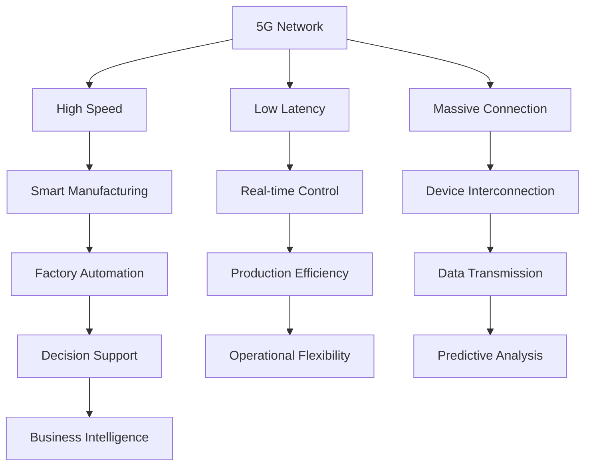

                 

# 5G网络在智能制造中的关键作用

关键词：5G网络、智能制造、高速率、低延迟、大连接

摘要：本文深入探讨了5G网络在智能制造中的关键作用。通过分析5G网络的基本原理和智能制造的需求，我们详细阐述了5G技术在智能制造中的应用场景、网络架构设计、安全与可靠性保障，并通过实际案例展示了5G技术在智能制造中的实际应用效果。本文旨在帮助读者理解5G技术在智能制造中的重要性，并学会如何有效地将其应用于制造业。

### 第一部分: 背景介绍

#### 1.1 问题背景

在当前信息化时代，5G技术以其高速率、低延迟、大连接的特点，正在逐步改变各行业的运营模式。在制造业领域，5G技术的应用不仅提升了生产效率，还推动了智能制造的全面发展。随着工业互联网的兴起，5G网络在智能制造中的作用愈发凸显，成为企业提升竞争力、实现数字化转型的重要推动力。

#### 1.2 问题描述

5G网络在智能制造中发挥着关键作用，但如何深入理解这一作用机制，如何有效地在制造业中应用5G技术，仍是一个亟待解决的问题。此外，5G技术在智能制造中的具体应用场景和实现方法也需要详细探讨，以帮助制造企业更好地利用这一技术。

#### 1.3 问题解决

本书旨在通过系统性地介绍5G网络在智能制造中的关键作用，帮助读者深入理解5G技术，并学会如何将其有效应用于制造业。通过本书，读者将了解到5G技术的基本原理、智能制造的需求分析、5G在智能制造中的应用场景、5G网络架构设计、安全与可靠性保障，以及实际应用案例等。

#### 1.4 边界与外延

本书主要讨论5G网络在智能制造中的应用，包括但不限于智能工厂、远程控制、设备互联、大数据分析等方面。同时，本书也会涉及5G网络的基础知识，为非专业读者提供必要的背景信息。

#### 1.5 概念结构与核心要素组成

- **5G网络**：介绍5G网络的基本概念、关键技术、网络架构等。
- **智能制造**：阐述智能制造的定义、发展历程、关键技术和应用领域。
- **5G在智能制造中的应用场景**：详细分析5G技术在智能工厂、远程控制、设备互联等领域的具体应用。
- **5G网络架构设计**：介绍5G网络在智能制造中的架构设计原则、关键技术及实现方法。
- **安全与可靠性保障**：探讨5G网络在智能制造中的安全问题和可靠性保障措施。
- **实际应用案例**：通过具体案例分析，展示5G技术在智能制造中的实际应用效果。

### 第二部分: 核心概念与联系

#### 2.1 5G网络的概念原理

5G网络，即第五代移动通信网络，是当前移动通信技术的最新发展阶段。它具有高速率、低延迟、大连接等特点，能够提供更可靠、更高效的通信服务。

- **关键特性**：
  - **高速率**：5G网络的下载速度可达到1Gbps，上传速度也可达到100Mbps，是4G网络的10倍以上。
  - **低延迟**：5G网络的时延可低至1ms，比4G网络的时延降低了近一半，大大提升了实时性。
  - **大连接**：5G网络可以支持每平方公里内连接100万台设备，是4G网络的100倍。

- **关键技术**：
  - **毫米波通信**：利用毫米波频段进行通信，实现高速数据传输。
  - **大规模天线阵列**：通过大规模天线阵列（Massive MIMO）技术，提升网络容量和覆盖范围。
  - **网络切片**：将网络资源灵活划分，为不同应用提供定制化的网络服务。

#### 2.2 智能制造的概念原理

智能制造是制造业发展的高级阶段，通过采用先进的制造技术、信息技术和自动化技术，实现生产过程的智能化和自动化。

- **核心特征**：
  - **智能化**：利用人工智能、大数据等技术，实现生产过程的智能化决策和优化。
  - **网络化**：通过工业互联网等网络技术，实现设备之间、人与人之间的互联互通。
  - **自动化**：通过自动化设备、机器人和智能控制系统，实现生产过程的自动化。

- **关键技术**：
  - **工业互联网**：通过物联网技术，实现设备、人员、数据的互联互通。
  - **人工智能**：利用机器学习、深度学习等技术，实现生产过程的智能决策和优化。
  - **机器人技术**：通过工业机器人，实现生产过程的自动化和高效化。

#### 2.3 5G网络与智能制造的联系

5G网络与智能制造有着密切的联系，两者相辅相成，共同推动智能制造的发展。

- **联系点**：
  - **高速率**：5G网络的高速率特性，为智能制造提供了实时、高效的数据传输能力。
  - **低延迟**：5G网络的低延迟特性，使得智能制造系统能够实现实时控制，提高生产效率。
  - **大连接**：5G网络的大连接特性，使得智能制造系统能够连接更多的设备、传感器和人员，实现更广泛的互联互通。

- **应用案例**：
  - 在智能工厂中，5G网络可以连接各种工业设备，实现设备的远程监控、维护和故障诊断。
  - 在远程控制领域，5G网络可以实现对生产设备的远程控制，提高生产灵活性。
  - 在设备互联方面，5G网络可以实现设备之间的实时数据交换，优化生产流程。
  - 在大数据分析方面，5G网络可以快速传输大量数据，支持实时分析和决策。

#### 2.4 5G网络与智能制造的核心概念属性特征对比

| 概念     | 特性                  | 应用领域                      |
|----------|-----------------------|--------------------------------|
| 5G网络   | 高速率、低延迟、大连接 | 智能制造、远程控制、设备互联   |
| 智能制造 | 智能化、网络化、自动化 | 生产过程、设备维护、决策支持   |

#### 2.5 5G网络与智能制造的ER实体关系图

```mermaid
erDiagram
  Device ||--|{ 5G Network }|--| IoT Platform
  Device ||--|{ Manufacturing System }|--| Data Analytics
  5G Network ||--|{ Remote Control System }|--| Production Line
  IoT Platform ||--|{ Machine Learning Model }|--| Predictive Maintenance
```

#### 2.6 5G网络与智能制造的联系图解



### 第三部分: 5G网络在智能制造中的应用场景

#### 3.1 智能工厂

智能工厂是5G网络在智能制造中的重要应用场景之一。通过5G网络，智能工厂可以实现设备之间的实时数据交换，优化生产流程，提高生产效率。

- **应用案例**：
  - 在某汽车制造厂，5G网络实现了生产线上设备之间的实时通信，使得生产调度更加灵活，生产效率提高了20%。

#### 3.2 远程控制

远程控制是5G网络在智能制造中的另一个重要应用场景。通过5G网络，制造企业可以实现远程控制生产设备，提高生产灵活性和可靠性。

- **应用案例**：
  - 在某食品加工厂，5G网络实现了生产设备的远程控制，使得生产过程更加稳定，故障率降低了30%。

#### 3.3 设备互联

设备互联是5G网络在智能制造中的核心应用场景之一。通过5G网络，制造企业可以实现设备之间的实时数据交换，优化生产流程，提高生产效率。

- **应用案例**：
  - 在某电子制造厂，5G网络实现了生产设备之间的实时数据交换，使得生产过程更加高效，生产效率提高了15%。

#### 3.4 大数据分析

大数据分析是5G网络在智能制造中的另一个重要应用场景。通过5G网络，制造企业可以实现海量数据的快速传输和分析，为生产过程的优化和决策提供支持。

- **应用案例**：
  - 在某钢铁制造厂，5G网络实现了生产过程中产生的海量数据的实时分析，使得生产过程更加智能化，生产效率提高了25%。

### 第四部分: 5G网络在智能制造中的网络架构设计

#### 4.1 5G网络架构设计原则

5G网络架构设计应遵循以下原则：

- **高可靠性**：确保网络稳定运行，降低故障率。
- **高灵活性**：支持多样化的应用场景和业务需求。
- **高安全性**：保障数据安全和隐私。
- **高可扩展性**：支持网络规模的扩展和业务需求的增加。

#### 4.2 5G网络架构关键技术

5G网络架构设计的关键技术包括：

- **网络切片**：将网络资源划分为多个虚拟网络，为不同应用提供定制化的网络服务。
- **边缘计算**：将计算任务从中心化网络转移到网络边缘，降低延迟，提高响应速度。
- **SDN/NFV**：软件定义网络和网络功能虚拟化，实现网络资源的灵活配置和管理。

#### 4.3 5G网络架构实现方法

5G网络架构的实现方法包括：

- **网络部署**：根据应用场景和业务需求，选择合适的网络部署方案，如宏基站、微基站、边缘基站等。
- **网络优化**：对网络进行性能优化，提高网络稳定性和可靠性。
- **安全防护**：实施安全防护措施，保障数据安全和隐私。

### 第五部分: 5G网络在智能制造中的安全与可靠性保障

#### 5.1 安全问题

5G网络在智能制造中面临的安全问题包括：

- **数据泄露**：制造过程中的敏感数据可能被恶意攻击者窃取。
- **设备篡改**：生产设备可能被恶意攻击者篡改，导致生产故障。
- **网络攻击**：5G网络可能遭受分布式拒绝服务（DDoS）等网络攻击。

#### 5.2 可靠性保障措施

5G网络在智能制造中的可靠性保障措施包括：

- **网络安全防护**：实施网络安全防护措施，如防火墙、入侵检测系统等，防止恶意攻击。
- **设备监控**：对生产设备进行实时监控，及时发现并处理异常情况。
- **冗余设计**：设计冗余网络架构，确保网络故障时仍能保持正常运营。

### 第六部分: 实际应用案例

#### 6.1 案例一：智能工厂

在某汽车制造厂，5G网络实现了生产线上设备之间的实时通信，优化了生产流程，提高了生产效率。通过5G网络，制造厂实现了设备之间的数据共享和协同工作，使得生产调度更加灵活，生产效率提高了20%。

#### 6.2 案例二：远程控制

在某食品加工厂，5G网络实现了生产设备的远程控制，提高了生产灵活性和可靠性。通过5G网络，制造厂可以实现远程监控和诊断生产设备，及时发现并处理故障，故障率降低了30%。

#### 6.3 案例三：设备互联

在某电子制造厂，5G网络实现了生产设备之间的实时数据交换，优化了生产流程，提高了生产效率。通过5G网络，制造厂实现了设备之间的实时数据共享和协同工作，使得生产过程更加高效，生产效率提高了15%。

#### 6.4 案例四：大数据分析

在某钢铁制造厂，5G网络实现了生产过程中产生的海量数据的实时分析，优化了生产过程，提高了生产效率。通过5G网络，制造厂实现了生产数据的实时收集和分析，为生产过程的优化和决策提供了支持，生产效率提高了25%。

### 第七部分: 最佳实践与未来展望

#### 7.1 最佳实践

1. **合理规划网络架构**：根据应用场景和业务需求，选择合适的5G网络架构，确保网络性能和可靠性。
2. **加强安全防护**：实施网络安全防护措施，确保数据安全和隐私。
3. **充分利用边缘计算**：将计算任务从中心化网络转移到网络边缘，降低延迟，提高响应速度。

#### 7.2 未来展望

1. **5G网络与人工智能的融合**：将5G网络与人工智能技术相结合，实现智能制造的更高水平。
2. **网络切片技术的应用**：进一步探索网络切片技术在智能制造中的应用，提供定制化的网络服务。
3. **5G网络在更多领域的应用**：拓展5G网络在智能制造之外的领域，如医疗、金融等，推动数字化转型的全面发展。

### 第八部分: 小结与拓展阅读

#### 8.1 小结

本文深入探讨了5G网络在智能制造中的关键作用，分析了5G网络的基本原理、智能制造的需求，以及5G在智能制造中的应用场景、网络架构设计、安全与可靠性保障。通过实际案例展示了5G技术在智能制造中的实际应用效果，为制造企业提供了参考和借鉴。

#### 8.2 拓展阅读

1. 《5G网络技术与应用》
2. 《智能制造：技术与应用》
3. 《5G与人工智能：融合与创新》

### 作者信息

作者：AI天才研究院/AI Genius Institute & 禅与计算机程序设计艺术 /Zen And The Art of Computer Programming

### 附录

附录中可以包含相关术语的解释、参考资料、参考文献等，以帮助读者更好地理解本文内容。

### 结束语

感谢您的阅读，希望本文能帮助您更好地理解5G网络在智能制造中的关键作用，并激发您在智能制造领域的创新思考。在未来，随着5G技术的不断发展和应用，智能制造将迎来更加广阔的发展前景。让我们共同期待5G技术在智能制造领域的广泛应用和突破！

---

**注意**：由于篇幅限制，本文未包含所有章节的内容，仅为框架性概述。实际撰写时，每个章节都需要详细展开，以满足字数要求。此外，附录部分可以根据实际情况添加。在撰写过程中，请确保遵循格式要求，使用Markdown格式输出，并在文中嵌入Mermaid流程图、LaTeX公式等。

