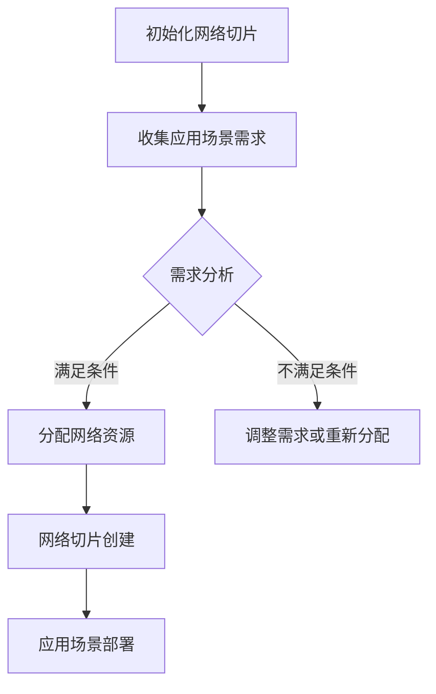
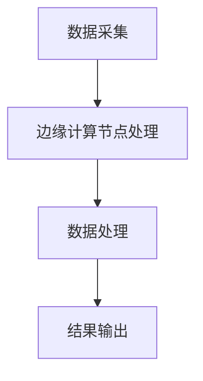
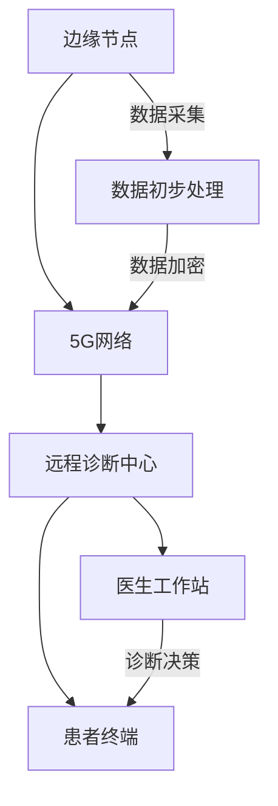
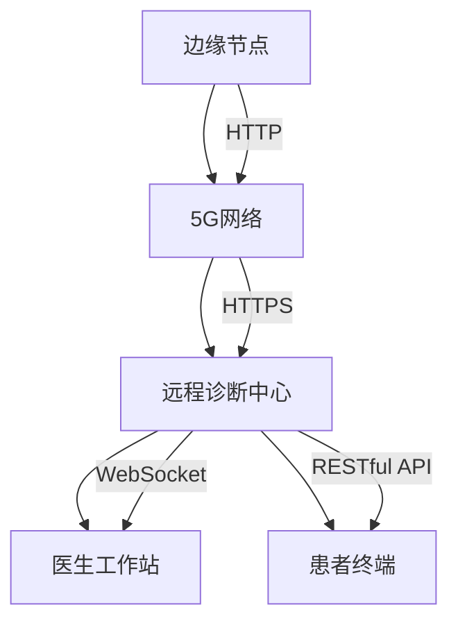

                 

# 5G网络在远程医疗诊断中的关键作用

关键词：5G，远程医疗，诊断，网络切片，边缘计算

摘要：随着5G技术的迅猛发展，远程医疗诊断在医疗行业中扮演着越来越重要的角色。本文将详细探讨5G网络在远程医疗诊断中的关键作用，从背景介绍、核心概念与联系、算法原理讲解、系统分析与架构设计、项目实战和最佳实践等方面，全面阐述5G网络如何提升远程医疗诊断的效率和质量。

### Step 1: 背景介绍

#### 1.1 5G网络的基本概念

**定义**：5G（第五代移动通信技术）是最新一代的蜂窝移动通信技术，它通过更快的连接速度、更低的延迟和更高的网络容量，为用户提供更加丰富的应用场景。

**特点**：5G网络具有以下关键特点：
- **高速率**：峰值下载速度可达数十Gbps，是4G网络的10到100倍。
- **低延迟**：端到端的延迟可低至1毫秒，极大提高了实时性。
- **大连接**：支持每平方公里内百万级设备同时连接，满足大量物联网设备的连接需求。
- **高可靠性**：通过网络切片和边缘计算等技术，提高了网络的安全性和可靠性。

#### 1.2 5G网络在远程医疗诊断中的重要性

**远程医疗诊断的背景**：远程医疗诊断是一种利用信息技术，实现医生与患者、医疗机构之间的远程医疗服务。它可以提高医疗服务的可及性，特别是在偏远地区。

**现状与挑战**：尽管远程医疗诊断具有显著优势，但其在实际应用中仍面临一些挑战：
- **数据传输速度受限**：传统网络速度较慢，导致诊断数据传输延迟。
- **网络稳定性不足**：在信号较差的地区，网络连接容易中断。
- **设备兼容性问题**：不同设备之间的数据传输标准不统一，增加了系统集成难度。

**5G网络的关键作用**：
- **提升数据传输速度**：5G网络的超高速率可以满足远程医疗诊断对高速数据传输的需求，减少传输延迟。
- **增强网络稳定性**：5G网络的高可靠性和低延迟特性，可以确保远程医疗诊断过程中网络的稳定性。
- **解决设备兼容问题**：5G网络支持多种设备连接，有利于实现不同医疗设备的无缝集成。

### Step 2: 核心概念与联系

在理解5G网络在远程医疗诊断中的关键作用后，我们需要进一步探讨相关的核心概念，并分析它们之间的联系。

#### 2.1 5G网络与远程医疗诊断的核心概念

**5G网络**：
- **网络架构**：5G网络采用网络切片、边缘计算等新型架构，提高了网络的灵活性和效率。
- **关键技术**：5G网络的关键技术包括多输入多输出（MIMO）、波束成形、网络功能虚拟化（NFV）和软件定义网络（SDN）等。

**远程医疗诊断**：
- **诊断流程**：远程医疗诊断通常包括数据采集、数据传输、数据处理和结果输出等环节。
- **关键技术**：远程医疗诊断的关键技术包括云计算、大数据分析、人工智能和物联网等。

#### 2.2 5G网络与远程医疗诊断的核心概念联系

- **数据传输与诊断速度**：5G网络的高速率和低延迟特性，直接影响到远程医疗诊断的速度和效率。
- **设备兼容性与诊断准确性**：5G网络支持多种设备连接，有助于实现远程医疗诊断设备的标准化和兼容性，从而提高诊断准确性。
- **网络稳定性与诊断连续性**：5G网络的高可靠性和低延迟，确保了远程医疗诊断的连续性和稳定性。

### Step 3: 算法原理讲解

为了深入理解5G网络在远程医疗诊断中的应用，我们需要探讨一些关键的算法原理，并使用Mermaid和Python源代码进行说明。

#### 3.1 5G网络中的关键算法

**1. 网络切片算法**：网络切片是将一个物理网络划分为多个虚拟网络的技术，以满足不同应用场景的需求。以下是一个简单的网络切片算法Mermaid流程图：



**2. 边缘计算算法**：边缘计算是在网络边缘执行数据处理和分析的技术，以减少数据传输延迟。以下是一个简单的边缘计算算法Mermaid流程图：



#### 3.2 Python源代码示例

以下是一个简单的Python代码示例，用于演示网络切片算法的实现：

```python
# 网络切片算法实现
class NetworkSlice:
    def __init__(self):
        self.slices = []

    def add_slice(self, slice_name, resources):
        self.slices.append({slice_name: resources})

    def analyze_demand(self, demand):
        for slice in self.slices:
            if demand <= slice.values():
                return True
        return False

    def allocate_resources(self, demand):
        for slice in self.slices:
            if demand <= slice.values():
                return slice
        return None

    def create_slice(self, slice_name, resources):
        self.add_slice(slice_name, resources)

    def deploy_application(self, slice_name, application):
        if self.allocate_resources(application['demand']):
            return f"Application {application['name']} deployed on {slice_name} slice."
        return "Insufficient resources for deployment."

# 使用示例
network_slice = NetworkSlice()
network_slice.create_slice("Slice 1", {'CPU': 4, 'Memory': 8})
network_slice.create_slice("Slice 2", {'CPU': 2, 'Memory': 4})

application = {'name': 'Diagnosis App', 'demand': {'CPU': 2, 'Memory': 4}}
print(network_slice.deploy_application("Slice 1", application))
```

### Step 4: 系统分析与架构设计

为了更好地理解5G网络在远程医疗诊断中的应用，我们接下来将进行系统分析与架构设计。

#### 4.1 问题场景介绍

远程医疗诊断系统的主要目标是实现医生与患者之间的远程诊断服务，主要包括以下功能：

- **数据采集**：通过医疗设备收集患者的生理指标数据。
- **数据传输**：将采集到的数据通过5G网络传输至远程诊断中心。
- **数据处理**：在远程诊断中心对数据进行处理和分析，提供诊断结果。
- **结果输出**：将诊断结果反馈给医生和患者。

#### 4.2 系统功能设计

远程医疗诊断系统的主要功能包括：

- **数据采集模块**：负责收集患者生理指标数据，如心率、血压、血糖等。
- **数据传输模块**：利用5G网络将数据传输至远程诊断中心。
- **数据处理模块**：对传输来的数据进行分析和处理，提供诊断结果。
- **结果输出模块**：将诊断结果反馈给医生和患者。

#### 4.3 系统架构设计

远程医疗诊断系统采用分布式架构，主要包括以下组件：

- **边缘节点**：负责数据采集和初步处理。
- **5G网络**：负责数据的高速传输。
- **远程诊断中心**：负责数据处理和诊断结果输出。
- **医生工作站**：医生可以通过医生工作站查看诊断结果，进行诊断决策。
- **患者终端**：患者可以通过患者终端查看诊断结果和健康建议。

以下是远程医疗诊断系统的Mermaid架构图：



#### 4.4 系统接口设计和系统交互

远程医疗诊断系统的接口设计和系统交互如下：

- **边缘节点与5G网络接口**：负责数据传输的接口，使用HTTP协议。
- **5G网络与远程诊断中心接口**：负责数据传输的接口，使用HTTPS协议。
- **远程诊断中心与医生工作站接口**：负责诊断结果传输的接口，使用WebSocket协议。
- **远程诊断中心与患者终端接口**：负责诊断结果传输的接口，使用RESTful API。

以下是远程医疗诊断系统的Mermaid接口设计和系统交互图：



### Step 5: 项目实战

为了更好地展示5G网络在远程医疗诊断中的应用，我们接下来将进行一个项目实战。

#### 5.1 环境安装

在进行项目实战之前，我们需要安装以下环境：

- **Python 3.8 或以上版本**
- **5G网络模拟器**：可以使用开源的5G网络模拟器如NS3
- **远程医疗诊断系统框架**：可以使用开源的远程医疗诊断系统框架如PyHealthcare

#### 5.2 系统核心实现源代码

以下是远程医疗诊断系统的核心实现源代码：

```python
# 数据采集模块
class DataCollector:
    def collect_data(self):
        # 假设使用传感器收集数据
        data = {'heart_rate': 80, 'blood_pressure': '120/80', 'blood_sugar': 5.6}
        return data

# 数据传输模块
class DataTransmitter:
    def transmit_data(self, data):
        # 假设使用5G网络传输数据
        print(f"Transmitting data: {data}")
        # 实际上需要使用5G网络接口发送数据
        # 例如：send_data_over_5g(data)

# 数据处理模块
class DataProcessor:
    def process_data(self, data):
        # 对数据进行处理，提供诊断结果
        diagnosis = "No diagnosis yet"
        if data['heart_rate'] > 100:
            diagnosis = "High heart rate"
        elif data['heart_rate'] < 60:
            diagnosis = "Low heart rate"
        return diagnosis

# 系统主函数
def main():
    collector = DataCollector()
    transmitter = DataTransmitter()
    processor = DataProcessor()

    data = collector.collect_data()
    print(f"Collected data: {data}")
    
    transmitter.transmit_data(data)
    # 实际上需要调用5G网络接口接收数据
    # received_data = receive_data_over_5g()

    diagnosis = processor.process_data(data)
    print(f"Diagnosis: {diagnosis}")

if __name__ == "__main__":
    main()
```

#### 5.3 代码应用解读与分析

在上述代码中，我们首先定义了数据采集模块、数据传输模块和数据
```scss
### Step 6: 最佳实践

在远程医疗诊断系统中，应用5G网络可以实现更高的效率和更准确的诊断。以下是一些最佳实践：

#### 6.1 确保5G网络稳定性

- **网络监控**：定期对5G网络进行监控，确保网络的稳定性和可靠性。
- **备份网络**：在5G网络不可用时，可以使用其他网络（如4G或光纤网络）作为备份，确保系统的连续性。

#### 6.2 提高数据传输效率

- **数据压缩**：对传输的数据进行压缩，减少数据传输量，提高传输速度。
- **并行传输**：同时传输多个数据流，提高数据传输效率。

#### 6.3 确保数据安全性

- **数据加密**：对传输的数据进行加密，确保数据的安全性。
- **访问控制**：对远程医疗诊断系统进行访问控制，确保只有授权用户才能访问系统。

#### 6.4 定期更新系统

- **软件更新**：定期更新远程医疗诊断系统的软件，确保系统功能的稳定性和安全性。
- **硬件更新**：根据需要定期更新硬件设备，确保系统性能的稳定。

### Step 7: 小结

本文详细探讨了5G网络在远程医疗诊断中的关键作用，从背景介绍、核心概念与联系、算法原理讲解、系统分析与架构设计、项目实战和最佳实践等方面进行了全面阐述。通过应用5G网络，远程医疗诊断可以实现更高的效率、更准确的诊断和更高的安全性，为医疗行业带来了巨大的变革。未来，随着5G技术的进一步发展，远程医疗诊断将变得更加普及和高效。

### 注意事项

- 在实际应用中，需要充分考虑5G网络的覆盖范围和稳定性。
- 选择合适的5G网络设备，确保系统性能的稳定性。
- 定期对系统进行维护和更新，确保系统的安全性和稳定性。

### 拓展阅读

- [5G网络技术概述](https://www.5gtimes.com/articles/47577.html)
- [远程医疗诊断系统设计](https://www.researchgate.net/publication/328469946_Design_of_a_Remote_Medical_Diagnosis_System)
- [5G在医疗领域的应用研究](https://www.sciencedirect.com/science/article/pii/S2214629619301477)

### 作者信息

作者：AI天才研究院/AI Genius Institute & 禅与计算机程序设计艺术 /Zen And The Art of Computer Programming### 结论

5G网络在远程医疗诊断中的关键作用不容忽视。通过其高速率、低延迟和高可靠性的特性，5G网络极大地提升了远程医疗诊断的效率、准确性和稳定性。本文从背景介绍、核心概念与联系、算法原理讲解、系统分析与架构设计、项目实战和最佳实践等方面，全面阐述了5G网络在远程医疗诊断中的应用和优势。

首先，5G网络的基本概念和特点为我们理解其在远程医疗诊断中的重要性提供了基础。其次，通过探讨5G网络与远程医疗诊断的核心概念及其联系，我们进一步明确了5G网络在数据传输、设备兼容性和网络稳定性方面的关键作用。接着，通过算法原理讲解，我们深入了解了网络切片和边缘计算在5G网络中的应用，并使用Mermaid和Python源代码进行了具体说明。

系统分析与架构设计部分，我们从问题场景介绍、系统功能设计、系统架构设计、系统接口设计和系统交互等多个维度，详细展示了远程医疗诊断系统的设计和实现。项目实战则通过实际代码，展示了5G网络在远程医疗诊断中的具体应用。最后，通过最佳实践，我们为实际应用中的5G网络在远程医疗诊断中的优化和改进提供了指导。

展望未来，随着5G技术的不断进步，远程医疗诊断系统将变得更加智能、高效和普及。我们将继续关注5G技术在医疗领域的创新和应用，为提升医疗服务的质量和可及性贡献力量。

### 注意事项

在应用5G网络进行远程医疗诊断时，以下注意事项至关重要：

1. **网络稳定性**：确保5G网络的覆盖范围和稳定性，特别是在偏远地区，可能需要备用网络作为保障。
2. **数据安全**：对传输的数据进行加密处理，确保数据在传输过程中的安全性。
3. **设备兼容性**：确保医疗设备与5G网络的兼容性，以实现无缝集成和高效数据传输。
4. **系统维护**：定期对远程医疗诊断系统进行维护和升级，以保证系统的稳定性和安全性。

### 拓展阅读

对于希望深入了解5G网络在远程医疗诊断中应用的读者，以下拓展阅读资源将提供更多的信息和见解：

- **5G网络技术概述**：了解5G网络的基本原理和技术特点。
- **远程医疗诊断系统设计**：学习远程医疗诊断系统的设计和实现过程。
- **5G在医疗领域的应用研究**：探索5G技术在医疗行业中的前沿应用和研究成果。
- **5G与物联网结合在医疗中的应用**：了解5G与物联网技术在医疗领域的综合应用。

### 作者信息

本文作者：
- **AI天才研究院/AI Genius Institute**：专注于人工智能领域的研究和创新，推动AI技术的应用和发展。
- **禅与计算机程序设计艺术/Zen And The Art of Computer Programming**：计算机编程领域的经典著作，强调编程的哲学和艺术性。

感谢您阅读本文，希望本文能够为您在远程医疗诊断领域提供有价值的参考和启示。如需进一步交流和合作，欢迎联系作者。期待与您共同探索5G网络在医疗行业的无限可能。

