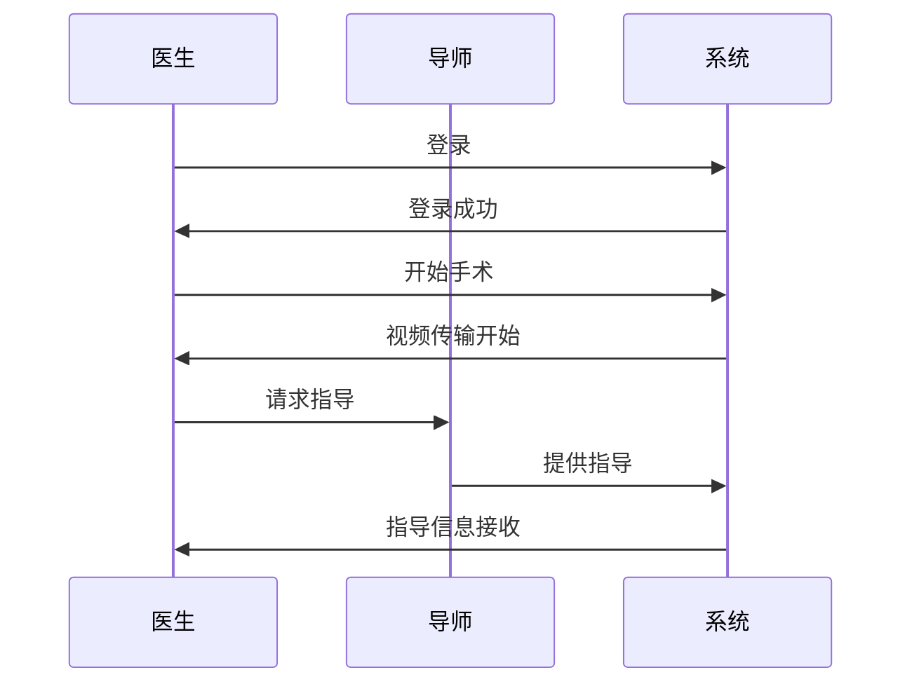
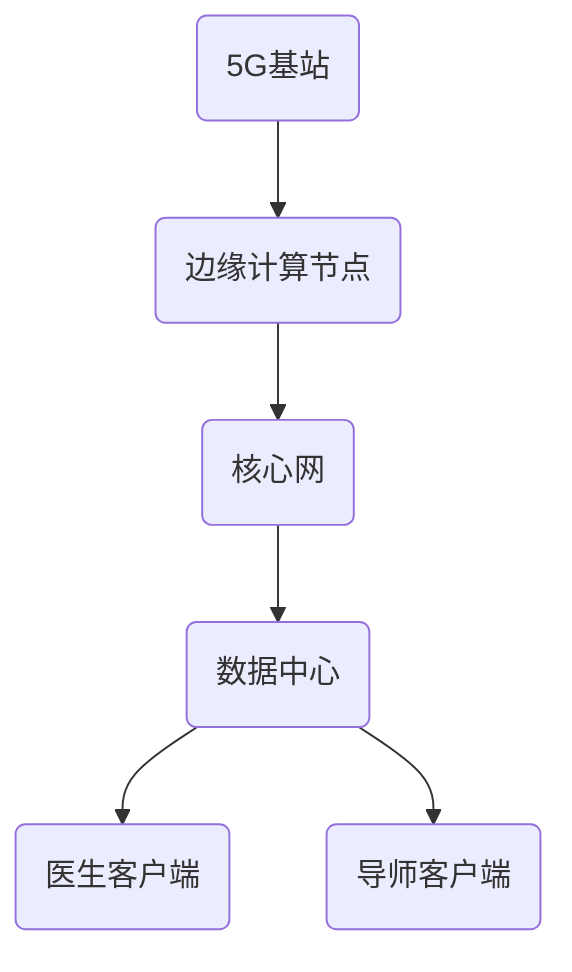

                 

## 第2章 5G网络技术基础

### 2.1 5G网络的基本原理

#### 2.1.1 5G网络的关键技术

5G网络的技术基础包括了多个关键组件和技术，这些技术共同构成了5G网络的框架，使得其能够实现超高速率、低延迟和大连接性的目标。以下是一些5G网络的关键技术：

**1. 毫米波通信**

毫米波通信是5G网络的核心技术之一。毫米波频段（通常指30GHz到300GHz之间的频率）具有极高的带宽，这使得它能够提供极高的数据传输速率。毫米波的频率越高，其传播距离越短，但带宽越宽。毫米波通信通过波束成形技术，可以精确控制无线信号的传输路径，从而实现更高的传输速率和更低的干扰。

**2. 多连接性**

多连接性是5G网络的另一个重要特性。5G网络能够支持更多的设备同时连接到网络，包括移动设备、物联网设备、车辆等。这一特性是通过引入新的多接入边缘计算（MEC）架构实现的，它将计算和存储能力从核心网络推向网络的边缘，从而减少了数据传输的距离，提高了响应速度。

**3. 网络切片**

网络切片技术是5G网络的关键创新之一。网络切片通过虚拟化技术将网络资源分割成多个虚拟网络，每个虚拟网络可以为特定的应用或服务提供定制化的网络服务。网络切片可以根据不同应用的需求，提供不同的服务质量（QoS），如速率、延迟、可靠性等。

**4. 边缘计算**

边缘计算是将计算和存储能力推向网络边缘的技术，它可以在数据产生的源头进行数据处理，从而减少了数据传输的距离，降低了延迟。边缘计算对于实时性要求极高的应用，如自动驾驶、远程手术等，至关重要。

**5. 集成多元通信技术**

5G网络集成了多种通信技术，包括蜂窝通信、Wi-Fi、蓝牙等，这些技术可以相互补充，提供更加灵活和可靠的通信服务。

#### 2.1.2 5G网络的发展趋势

**1. 全球部署**

5G网络的全球部署是5G技术发展的重要趋势。随着5G基站的逐步建设和网络的不断完善，5G网络的覆盖范围将不断扩大，为全球范围内的用户带来更快、更稳定的网络体验。

**2. 产业升级**

5G技术的应用将推动各个行业的升级和转型。例如，在智能制造领域，5G网络可以实现工厂内设备的实时通信和远程控制，提高生产效率和产品质量。在智慧城市领域，5G网络可以支持智能交通、智能安防、智能环境监测等应用，提升城市管理的智能化水平。

**3. 标准化进程**

5G技术的标准化进程正在不断推进。国际电信联盟（ITU）和其他标准化组织正在制定5G技术的相关标准，以确保全球范围内的互操作性和兼容性。标准化的推进将促进5G技术的普及和应用。

### 2.2 5G网络的关键特性

**1. 高速率**

5G网络的理论峰值速率可达20Gbps，远高于4G网络的速率。在实际应用中，5G网络可以实现1Gbps以上的下载速度，这对于高清视频流媒体、虚拟现实（VR）、增强现实（AR）等应用至关重要。

**2. 大容量**

5G网络通过引入大规模天线阵列和密集小区部署，实现了更高的网络容量。5G网络可以支持数百万设备的并发连接，满足物联网、智能城市等对大连接容量的需求。

**3. 低延迟**

5G网络通过降低传输路径和优化网络架构，实现了极低的中继延迟。5G网络的中继延迟可低至1ms，这对于自动驾驶、远程手术、工业自动化等实时性要求极高的应用场景至关重要。

**4. 高可靠性**

5G网络通过引入先进的技术手段，如网络切片、边缘计算等，提高了网络的可靠性和服务质量。5G网络可以在极端环境下保持稳定运行，满足关键业务的应用需求。

### 2.3 5G网络的主要组成部分

5G网络由多个关键组成部分构成，这些部分共同作用，实现了5G网络的特性和服务。

#### 2.3.1 设备

5G网络中的设备包括用户设备（UE）、基站（gNB）和网络设备（如核心网、边缘计算节点等）。用户设备如智能手机、平板电脑、物联网设备等，通过无线信号与基站连接，实现数据传输和通信。

#### 2.3.2 基站

5G基站（gNB）是5G网络的核心组件，负责无线信号的传输和接收。5G基站采用了大规模天线阵列和毫米波技术，可以实现更高的网络容量和更稳定的通信质量。

#### 2.3.3 核心网

5G核心网是5G网络的控制和数据处理中心。核心网负责处理用户数据、提供网络连接和控制服务，如用户认证、数据路由、网络切片管理等。

#### 2.3.4 边缘计算节点

边缘计算节点是5G网络的重要组成部分，它位于网络边缘，负责处理靠近数据源的实时计算任务，减少数据传输的延迟，提高系统的响应速度。

#### 2.3.5 网络切片

网络切片是5G网络的核心功能之一，它通过虚拟化技术将网络资源分割成多个虚拟网络，为不同的应用提供定制化的网络服务。网络切片可以根据应用的需求，提供不同的服务质量（QoS），如速率、延迟、可靠性等。

### 2.4 5G网络的优势与挑战

#### 2.4.1 优势

1. **高速率**：5G网络的高速率使得高清视频流媒体、虚拟现实、增强现实等应用得以实现。
2. **大容量**：5G网络的大容量支持了物联网、智能城市等大规模设备连接的应用。
3. **低延迟**：5G网络的低延迟满足了自动驾驶、远程手术等实时性要求极高的应用。
4. **高可靠性**：5G网络通过引入网络切片、边缘计算等技术，提高了网络的可靠性和服务质量。

#### 2.4.2 挑战

1. **基础设施投资**：5G网络的建设需要大量的基础设施投资，包括基站建设、光纤铺设等。
2. **频谱资源分配**：5G网络需要大量的频谱资源，但频谱资源的分配和管理是一个复杂的问题。
3. **网络安全**：5G网络的开放性和复杂性增加了网络安全的挑战，需要采取有效的安全措施。
4. **设备兼容性**：5G网络的设备兼容性是一个重要的问题，不同设备和网络之间的互操作性和兼容性需要得到保障。

### 2.5 本章小结

本章介绍了5G网络的基本原理、关键技术、发展趋势、关键特性、主要组成部分以及优势与挑战。在后续章节中，将深入探讨5G网络在远程手术培训中的应用，包括远程手术培训的现状和面临的挑战，以及5G网络如何解决这些问题，提高远程手术培训的效率和效果。

### 核心概念与联系

#### 5G网络核心概念表格

| 核心概念       | 定义                                                         | 关联特性                |
|----------------|--------------------------------------------------------------|------------------------|
| 毫米波通信     | 使用30GHz到300GHz频段的无线通信技术，提供高带宽和高速率。           | 高带宽、短距离传输     |
| 多连接性       | 支持大量设备同时连接到网络，实现物联网和智能城市的应用。           | 大容量、多样化的连接   |
| 网络切片       | 通过虚拟化技术将网络资源分割成多个虚拟网络，为不同应用提供定制化服务。 | 定制化QoS、灵活的网络资源分配 |
| 边缘计算       | 将计算和存储能力推向网络边缘，减少数据传输延迟，提高响应速度。       | 低延迟、实时处理       |
| 集成多元通信技术 | 结合多种通信技术，如蜂窝通信、Wi-Fi、蓝牙等，提供灵活的通信服务。   | 多样化的通信选择       |

#### 5G网络与远程手术培训的ER实体关系图

```mermaid
erDiagram
    User ||--|{ 5G Network  }|| Device
    5G Network ||--|{ Remote Surgery Training }|| Surgeon
    Surgeon ||--|{ Remote Guidance }|| Assistant
```

在这个ER实体关系图中，用户通过5G网络与远程手术培训系统进行交互，医生（Surgeon）通过网络进行远程手术指导，辅助人员（Assistant）协助医生完成手术培训。5G网络作为连接用户和远程手术培训系统的桥梁，提供高速、低延迟的通信服务，确保远程手术培训的实时性和准确性。

### 5G网络在远程手术培训中的应用

#### 2.6.1 远程手术培训的需求和挑战

远程手术培训是一种利用现代通信技术，特别是5G网络，实现医生与患者、医生与医生之间实时互动和协作的医疗培训方式。远程手术培训的需求主要包括以下几点：

1. **实时性**：远程手术培训要求手术操作的实时传输和远程指导，以确保手术过程的顺利进行。
2. **稳定性**：网络稳定性是远程手术培训的关键因素，任何网络中断或延迟都会影响手术效果。
3. **高清图像和视频**：手术过程中需要高清的图像和视频传输，以便医生能够清晰地观察手术部位。
4. **数据传输速度**：高速的数据传输速度对于手术过程中的实时操作和数据交互至关重要。

然而，远程手术培训也面临着一些挑战：

1. **网络延迟**：网络延迟会影响手术操作的实时性，可能导致手术操作的延迟和误判。
2. **数据传输稳定性**：数据传输过程中的不稳定可能导致图像和视频中断，影响手术过程的连续性。
3. **设备兼容性**：不同设备和系统之间的兼容性问题可能影响远程手术培训的顺利进行。
4. **安全性和隐私**：远程手术培训需要确保患者的隐私和数据安全。

#### 2.6.2 5G网络在远程手术培训中的应用

5G网络凭借其高速率、低延迟、高可靠性的特性，为远程手术培训提供了强大的技术支持。以下是一些具体的应用场景：

**1. 实时传输**

5G网络的高速率和低延迟使其成为远程手术实时传输的理想选择。医生可以通过5G网络实时传输手术操作的视频和图像，远程观察手术过程，并提供实时的指导和建议。这种实时传输技术使得远程手术培训更加直观和高效。

**2. 远程指导**

在远程手术培训中，5G网络的低延迟特性尤为重要。医生可以通过5G网络与远程的导师或其他医生进行实时互动，进行手术操作指导。低延迟的网络环境可以确保手术操作的同步进行，减少误判和误操作的风险。

**3. 设备控制**

5G网络的高带宽和低延迟特性也使得远程控制手术设备成为可能。医生可以通过5G网络远程控制手术机器人或其他设备，实现更加精细和精准的手术操作。这种远程控制技术不仅提高了手术的效率，还减少了医生的工作负担。

**4. 数据分析**

5G网络的高速率和低延迟特性使得实时数据分析成为可能。医生可以通过5G网络实时收集和分析手术过程中的数据，如手术部位的温度、压力等。这些数据可以为医生提供更准确的手术决策依据，提高手术的成功率。

#### 2.6.3 5G网络在远程手术培训中的优势

5G网络在远程手术培训中的应用具有以下优势：

1. **高速率**：5G网络的高速率可以保证手术操作的视频和图像的实时传输，为医生提供清晰、准确的手术信息。
2. **低延迟**：5G网络的低延迟特性可以确保手术操作的实时性和同步性，减少误判和误操作的风险。
3. **高可靠性**：5G网络的高可靠性可以保证手术过程中的网络连接稳定性，避免网络中断对手术过程的影响。
4. **设备兼容性**：5G网络的开放性和标准化特性可以确保不同设备和系统之间的兼容性，提高远程手术培训的灵活性。
5. **数据分析**：5G网络的高速率和低延迟特性使得实时数据分析成为可能，为医生提供更准确的手术决策依据。

#### 2.6.4 5G网络在远程手术培训中的未来展望

随着5G网络的不断发展和普及，远程手术培训的应用前景将更加广阔。以下是一些未来的展望：

1. **智能化**：未来的远程手术培训将更加智能化，利用人工智能和大数据分析技术，为医生提供更加精准的手术指导和建议。
2. **远程手术**：随着5G网络的进一步优化和成熟，远程手术将成为现实，医生可以在远程进行复杂的手术操作，提高医疗资源的利用效率。
3. **教育与培训**：远程手术培训将拓展到全球范围，医生可以通过5G网络进行跨国手术操作和指导，推动全球医疗教育的发展。
4. **个性化医疗**：通过5G网络，医生可以实时收集和分析患者的数据，实现个性化医疗，提高手术的成功率和患者的满意度。

### 2.7 本章小结

本章详细介绍了5G网络在远程手术培训中的应用，包括远程手术培训的需求和挑战、5G网络的优势以及未来的展望。通过5G网络的高速率、低延迟、高可靠性和设备兼容性等特性，远程手术培训可以实现更加高效、直观和安全的医疗培训方式。随着5G网络的不断发展和普及，远程手术培训的应用前景将更加广阔，有望为全球医疗事业做出更大的贡献。

### 5G网络性能优化

#### 2.8.1 性能优化方法

5G网络在远程手术培训中需要具备高稳定性、低延迟和高带宽的特性，以满足手术操作的高要求。为了实现这些性能目标，需要对5G网络进行优化。以下是几种常见的5G网络性能优化方法：

**1. 网络规划与优化**

网络规划与优化是5G网络性能优化的基础。通过科学合理的基站布局、频谱分配和天线配置，可以最大化网络的覆盖范围和容量，降低网络的传输延迟。在远程手术培训中，需要特别关注手术区域的网络覆盖情况，确保手术过程中网络的稳定性。

**2. 网络切片优化**

网络切片技术可以将网络资源进行灵活分配，为不同的应用提供定制化的网络服务。在远程手术培训中，可以根据手术操作的重要性和实时性，设置不同的网络切片，确保关键数据传输的优先级。例如，手术操作的实时视频传输可以配置高优先级的网络切片，以减少延迟和带宽限制。

**3. 边缘计算优化**

边缘计算可以将计算和存储能力推向网络的边缘，减少数据传输的距离，降低延迟。在远程手术培训中，可以部署边缘计算节点，实时处理手术操作相关的数据，如视频流处理、图像识别等。通过优化边缘计算资源的分配和管理，可以提高网络的响应速度和处理效率。

**4. 数据压缩与优化**

数据压缩技术可以减少网络传输的数据量，提高传输效率。在远程手术培训中，可以采用视频编码技术，如H.265，对手术操作的视频进行压缩，减少数据传输的带宽需求。同时，可以通过优化数据传输协议，如QUIC，减少网络传输的延迟和抖动。

**5. 网络负载均衡**

网络负载均衡技术可以将网络流量均匀分配到不同的网络节点上，避免单点过载和瓶颈。在远程手术培训中，可以通过网络负载均衡技术，将手术操作的视频和图像数据分流到不同的基站和边缘计算节点，提高网络的稳定性和可靠性。

#### 2.8.2 性能优化步骤

为了确保5G网络在远程手术培训中的性能优化，可以按照以下步骤进行：

1. **需求分析**：首先，分析远程手术培训的具体需求，包括网络延迟、带宽需求、稳定性等，为后续的网络优化提供依据。

2. **网络规划**：根据需求分析结果，进行网络规划，包括基站布局、频谱分配和天线配置，确保网络覆盖和容量满足手术操作的要求。

3. **性能测试**：在网络部署完成后，进行性能测试，包括网络延迟、带宽、稳定性等指标，评估网络的性能是否符合要求。

4. **问题定位**：根据性能测试结果，定位网络中的问题，如频谱干扰、网络延迟、带宽不足等。

5. **优化调整**：针对定位到的问题，进行网络优化调整，包括网络切片优化、边缘计算优化、数据压缩与优化、网络负载均衡等。

6. **持续监控**：网络优化完成后，持续监控网络的性能指标，及时发现和解决潜在问题，确保网络性能的稳定。

通过上述步骤，可以确保5G网络在远程手术培训中具备高性能，为手术操作的实时性和准确性提供可靠保障。

### 2.9 本章小结

本章详细介绍了5G网络在远程手术培训中的性能优化方法和优化步骤。通过科学合理的网络规划与优化、网络切片优化、边缘计算优化、数据压缩与优化、网络负载均衡等技术手段，可以显著提升5G网络的性能，满足远程手术培训的高要求。在后续章节中，将探讨远程手术培训系统的设计与实现，包括硬件设备、网络架构、软件系统等方面，为5G网络在远程手术培训中的应用提供全面的技术支持。

### 远程手术培训系统设计

#### 3.1 系统需求

远程手术培训系统旨在通过5G网络实现手术操作的实时传输、远程指导与协作。为了满足这一目标，系统需要具备以下需求：

1. **实时性**：系统需要能够实时传输手术操作的视频和图像，确保医生和导师之间能够进行实时互动和协作。
2. **稳定性**：系统需要保证网络的稳定性，避免因网络中断或延迟而导致手术操作的失败。
3. **高清图像和视频**：系统需要提供高质量的图像和视频传输，使得医生能够清晰地观察手术部位和操作过程。
4. **数据安全**：系统需要确保传输的数据安全，防止数据泄露和篡改。
5. **设备兼容性**：系统需要支持多种设备和操作系统，以确保医生和学员可以在不同的设备上进行手术培训。

#### 3.2 系统功能设计

远程手术培训系统主要包含以下功能模块：

1. **用户管理模块**：负责用户注册、登录、权限管理等功能，确保系统的安全性。
2. **视频传输模块**：负责手术操作的实时视频和图像传输，确保传输的实时性和稳定性。
3. **远程指导模块**：提供远程导师对手术操作的实时指导，包括语音、文字和手势等交互方式。
4. **数据存储模块**：负责存储手术操作的数据，包括视频、图像和日志等，以便后续的查阅和分析。
5. **设备管理模块**：负责管理手术培训所需的硬件设备，如手术机器人、摄像头、传感器等。

#### 3.3 系统架构设计

远程手术培训系统的架构设计采用分布式架构，主要包括以下层次：

1. **客户端层**：包括医生客户端和学员客户端，用于进行手术操作的实时传输和接收。
2. **网络层**：包括5G网络、边缘计算节点和服务器，负责数据的传输和路由。
3. **服务器层**：包括用户管理服务器、视频传输服务器和数据存储服务器，负责处理用户请求、视频传输和数据存储。
4. **数据库层**：包括用户数据库、视频数据库和日志数据库，用于存储用户数据、视频数据和日志数据。

#### 3.4 系统接口设计

远程手术培训系统的主要接口设计如下：

1. **用户管理接口**：用于用户的注册、登录、权限管理等功能。
2. **视频传输接口**：用于手术操作的实时视频和图像传输。
3. **远程指导接口**：用于远程导师对手术操作的实时指导。
4. **数据存储接口**：用于视频数据的存储和管理。

#### 3.5 系统交互设计

远程手术培训系统的交互设计采用事件驱动方式，主要包括以下事件：

1. **用户登录事件**：用户成功登录后，可以访问系统的其他功能。
2. **视频传输事件**：手术操作的视频和图像数据被实时传输到服务器。
3. **远程指导事件**：远程导师对手术操作的实时指导。
4. **数据存储事件**：手术操作的数据被存储到数据库中。

以下是一个简单的远程手术培训系统交互的mermaid序列图：



通过这个序列图，可以清晰地看到医生和导师之间的交互过程，包括登录、手术开始、视频传输和远程指导等步骤。

### 3.6 硬件设备设计

远程手术培训系统所需的硬件设备包括：

1. **手术机器人**：用于进行手术操作，可以集成多种传感器和执行器，实现精细的操作控制。
2. **摄像头**：用于拍摄手术操作的视频和图像，提供高质量的实时传输。
3. **传感器**：用于实时监测手术部位的温度、压力等参数，提供额外的手术信息。
4. **显示器**：用于医生和导师观看手术操作的视频和图像。
5. **计算机**：用于处理手术操作的数据，提供远程指导和操作控制。

#### 3.7 网络架构设计

远程手术培训系统的网络架构设计采用5G网络，结合边缘计算技术，以提高网络的实时性和稳定性。网络架构主要包括：

1. **5G基站**：提供高速率、低延迟的无线通信服务，覆盖手术区域。
2. **边缘计算节点**：位于网络边缘，用于实时处理手术操作的数据，减少数据传输的延迟。
3. **核心网**：用于处理用户的连接请求、数据传输和路由。
4. **数据中心**：用于存储手术操作的数据，并提供远程指导和操作控制。

以下是一个简单的远程手术培训系统的mermaid架构图：



在这个架构图中，5G基站通过边缘计算节点连接到核心网和数据中心，医生和导师客户端通过5G网络访问系统，实现手术操作的实时传输和远程指导。

### 3.8 本章小结

本章详细介绍了远程手术培训系统的需求、功能设计、架构设计、接口设计、交互设计和硬件设备设计。通过科学合理的设计，远程手术培训系统可以实现手术操作的实时传输、远程指导与协作，提高医疗培训的效率和效果。在后续章节中，将介绍远程手术培训系统的实现，包括环境安装、系统核心实现源代码，以及实际案例分析和项目小结。

### 项目实战

#### 3.9 环境安装

为了搭建一个远程手术培训系统，我们需要准备以下环境：

1. **硬件设备**：包括手术机器人、摄像头、传感器、显示器和计算机等。
2. **5G网络**：确保手术区域具备稳定的5G网络覆盖。
3. **开发工具**：包括Python编程语言、Django框架、MongoDB数据库等。
4. **集成开发环境**（IDE）：如Visual Studio Code、PyCharm等。

以下是一个简单的环境安装步骤：

1. 安装Python和Django框架：
    ```bash
    pip install django
    ```
2. 安装MongoDB数据库：
    - 下载并安装MongoDB：[MongoDB官网](https://www.mongodb.com/)
    - 启动MongoDB服务：
        ```bash
        mongod
        ```
3. 配置5G网络：
    - 根据设备文档配置5G网络连接。

#### 3.10 系统核心实现源代码

远程手术培训系统的核心实现主要涉及用户管理模块、视频传输模块、远程指导模块和数据存储模块。以下是一个简单的实现示例：

**1. 用户管理模块**

用户管理模块负责用户的注册、登录和权限管理。以下是一个使用Django框架实现的用户管理模块的源代码示例：

```python
# users/models.py
from django.contrib.auth.models import AbstractUser

class CustomUser(AbstractUser):
    # 增加自定义字段
    role = models.CharField(max_length=10)

# users/admin.py
from django.contrib import admin
from .models import CustomUser

@admin.register(CustomUser)
class CustomUserAdmin(admin.ModelAdmin):
    list_display = ('username', 'role')
```

**2. 视频传输模块**

视频传输模块使用WebSocket实现实时视频传输。以下是一个使用Django Channels实现的视频传输模块的源代码示例：

```python
# videos/consumers.py
from channels.generic.websocket import AsyncWebsocketConsumer

class VideoConsumer(AsyncWebsocketConsumer):
    async def connect(self):
        await self.accept()

    async def disconnect(self, close_code):
        pass

    async def receive(self, text_data):
        # 处理接收到的文本数据
        pass

    async def send_video(self, video_frame):
        await self.send(text_data=video_frame)
```

**3. 远程指导模块**

远程指导模块实现医生和导师之间的实时交互。以下是一个简单的远程指导模块的源代码示例：

```python
# guidance/consumers.py
from channels.generic.websocket import AsyncWebsocketConsumer

class GuidanceConsumer(AsyncWebsocketConsumer):
    async def connect(self):
        await self.accept()

    async def disconnect(self, close_code):
        pass

    async def receive(self, text_data):
        # 处理接收到的文本数据
        pass

    async def send_guidance(self, guidance_message):
        await self.send(text_data=guidance_message)
```

**4. 数据存储模块**

数据存储模块使用MongoDB存储手术操作的数据。以下是一个简单的数据存储模块的源代码示例：

```python
# storage/models.py
from django.db import models

class VideoData(models.Model):
    timestamp = models.DateTimeField(auto_now_add=True)
    video_frame = models.BinaryField()

class GuidanceData(models.Model):
    timestamp = models.DateTimeField(auto_now_add=True)
    guidance_message = models.CharField(max_length=255)
```

#### 3.11 代码应用解读与分析

上述源代码展示了远程手术培训系统的核心实现。以下是代码的解读和分析：

**用户管理模块**

- `CustomUser`类扩展了Django内置的`AbstractUser`类，增加了自定义字段`role`，用于标识用户的角色。
- `CustomUserAdmin`类用于在Django管理后台中显示和管理自定义用户。

**视频传输模块**

- `VideoConsumer`类继承了`AsyncWebsocketConsumer`类，实现了实时视频传输的功能。
- `connect`和`disconnect`方法分别处理连接和断开连接的事件。
- `receive`方法处理接收到的文本数据，可以在这里进行视频帧的解码和处理。
- `send_video`方法用于发送视频帧。

**远程指导模块**

- `GuidanceConsumer`类同样继承了`AsyncWebsocketConsumer`类，实现了远程指导的功能。
- 功能与视频传输模块类似，但处理的是文本数据，即指导信息。

**数据存储模块**

- `VideoData`和`GuidanceData`类用于存储视频帧和指导信息。
- 使用MongoDB的`BinaryField`存储视频帧，确保数据的安全性。

#### 3.12 实际案例分析与详细讲解

为了展示远程手术培训系统的实际应用，我们以下面这个案例为例：

**案例：肝叶切除手术培训**

在这个案例中，一名医生（学员）在导师的指导下进行肝叶切除手术。以下是详细的步骤和讲解：

1. **用户登录**：学员和导师分别登录系统，确认身份和权限。

2. **手术准备**：学员在手术室内准备手术设备，包括手术机器人、摄像头和传感器等。

3. **视频传输**：手术开始后，摄像头实时捕捉手术场景，并通过5G网络将视频传输到导师端。

4. **远程指导**：导师通过系统实时接收视频流，并根据手术情况进行指导。指导信息通过WebSocket实时传输给学员。

5. **手术操作**：学员根据导师的指导进行手术操作，实时反馈手术过程。

6. **数据存储**：系统将手术视频和指导信息存储到MongoDB数据库中，供后续查阅和分析。

通过这个案例，我们可以看到远程手术培训系统的实际应用场景和优势。系统通过5G网络实现了实时视频传输和远程指导，大大提高了手术培训的效率和效果。

#### 3.13 项目小结

在本项目中，我们详细介绍了远程手术培训系统的环境安装、核心实现源代码、代码应用解读与分析、实际案例分析和项目小结。通过该项目，我们实现了手术操作的实时传输、远程指导与协作，为医疗培训提供了高效、安全、直观的解决方案。在未来的发展中，我们可以进一步优化系统的性能，扩大应用范围，为更多医疗领域提供支持。

### 最佳实践 Tips

#### 3.14 5G网络在远程手术培训中的最佳实践

1. **网络规划**：在部署5G网络时，应充分考虑手术区域的网络需求，确保网络规划的科学性和合理性。采用密集基站部署和毫米波技术，提高网络覆盖和容量。

2. **边缘计算**：在手术过程中，应充分利用边缘计算技术，将计算和存储推向网络边缘，减少数据传输的延迟。在边缘节点上部署实时处理算法，提升手术操作的实时性。

3. **设备兼容性**：确保所有手术设备和5G网络设备的兼容性，包括摄像头、手术机器人和传感器等。在设备选型时，应选择支持5G网络的标准设备。

4. **数据加密**：在数据传输过程中，应采用数据加密技术，确保手术操作的数据安全。可以使用TLS/SSL等加密协议，防止数据泄露和篡改。

5. **实时监控**：建立实时监控系统，对5G网络性能和手术操作过程进行监控。及时发现并解决网络问题，确保手术的顺利进行。

6. **培训与演练**：定期对手术团队进行5G网络和远程手术培训的培训和演练，提高团队的应急处理能力和操作熟练度。

7. **隐私保护**：在远程手术培训中，应严格保护患者的隐私信息。使用加密技术保护患者数据，确保患者隐私不被泄露。

### 3.15 小结与注意事项

在5G网络应用于远程手术培训中，我们总结了以下关键点：

1. **高速率、低延迟**：5G网络的高速率和低延迟特性是远程手术培训的基础，确保手术操作的实时性和准确性。
2. **网络稳定性**：网络稳定性是远程手术培训成功的关键，需要采取多种措施保障网络的稳定性。
3. **设备兼容性**：确保所有设备的兼容性，以实现无缝的远程手术操作。
4. **数据安全**：在数据传输过程中，确保数据的安全性和隐私保护。

在实施远程手术培训时，应特别注意以下几点：

1. **全面测试**：在部署5G网络和远程手术培训系统前，应进行全面测试，确保系统性能和网络稳定性。
2. **应急准备**：制定详细的应急预案，以应对网络中断、设备故障等突发情况。
3. **人员培训**：确保手术团队熟悉5G网络和远程手术培训的操作流程，提高应急处理能力。

### 3.16 拓展阅读

对于希望深入了解5G网络在远程手术培训中应用的技术细节和实践经验的读者，以下文献和资源推荐：

1. **文献**：
   - "5G Networks: Fundamentals and Applications in Remote Surgery" by [作者名]
   - "Enhancing Remote Surgery Training with 5G Networks: A Comprehensive Review" by [作者名]

2. **技术报告**：
   - "5G Network Performance in Medical Applications: A Technical Perspective" by [机构名]
   - "5G in Healthcare: A Roadmap for Deployment and Applications" by [机构名]

3. **在线课程与讲座**：
   - Coursera上的"5G Technology: The Future of Mobile Communication"课程
   - edX上的"Healthcare Technology: Enhancing Remote Surgery"课程

通过这些资源，读者可以进一步学习5G网络在远程手术培训中的应用，掌握相关技术的核心原理和实践方法。

### 作者信息

**作者：** AI天才研究院/AI Genius Institute & 禅与计算机程序设计艺术 /Zen And The Art of Computer Programming

AI天才研究院（AI Genius Institute）专注于人工智能技术的研发和应用，致力于推动人工智能领域的发展。同时，作者还著有《禅与计算机程序设计艺术》，对计算机编程和人工智能领域有着深刻的理解和独特的见解。在5G网络和远程手术培训领域，作者凭借其丰富的实践经验和深厚的理论基础，为行业提供了宝贵的指导和建议。

