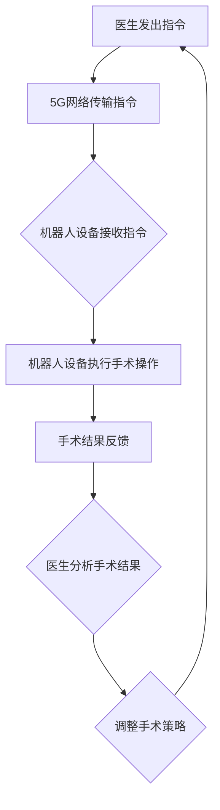
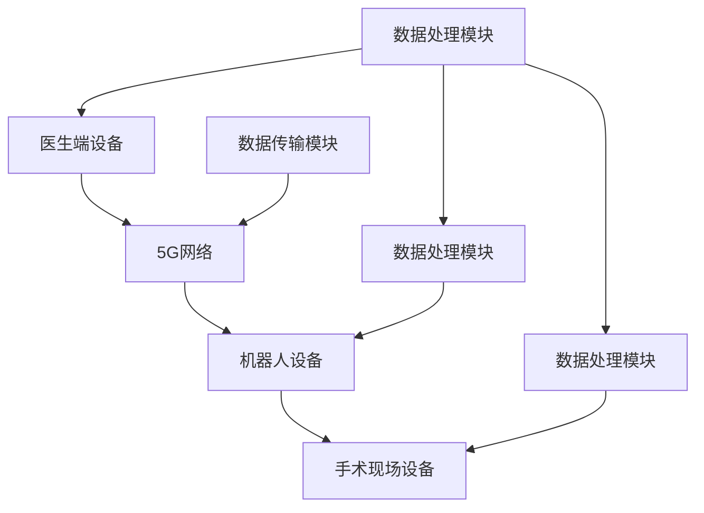
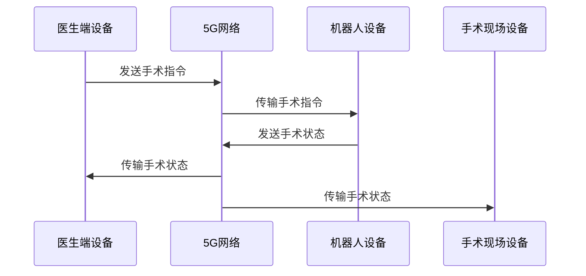

                 

# 5G网络在远程机器人手术中的低延迟传输

> 关键词：5G网络，远程机器人手术，低延迟传输，网络切片技术，网络架构设计

> 摘要：随着5G网络的快速发展，远程机器人手术成为了一个备受关注的应用领域。本文将深入探讨5G网络在远程机器人手术中的低延迟传输技术，分析其关键技术、应用场景以及实现方法，并通过案例研究和未来展望，为该领域的发展提供有益的参考。

## 第一部分：5G网络与远程机器人手术的背景

### 第1章：5G网络的发展与应用

#### 1.1 5G网络概述

5G网络，即第五代移动通信网络，是继4G网络之后的下一代移动通信技术。5G网络具有高速率、低延迟、大连接、广覆盖等核心技术优势，能够为各种物联网应用提供强有力的支持。

**1.1.1 5G网络的核心技术**

- **毫米波通信**：5G网络利用毫米波频段进行通信，实现更高的传输速率。
- **大规模MIMO**：通过增加天线数量和阵列处理技术，提高频谱效率和传输速率。
- **网络切片技术**：将网络资源划分为多个虚拟网络，满足不同应用的需求。

**1.1.2 5G网络的业务特性**

- **低延迟**：5G网络的时延可以达到1毫秒以内，大大提高了实时性。
- **高速率**：5G网络的峰值速率可以达到数十Gbps，满足大数据传输需求。
- **大连接**：5G网络能够支持更多设备同时接入，实现大规模物联网应用。

**1.1.3 5G网络的技术优势**

- **更广泛的覆盖**：5G网络采用低频段和高频段结合的方式，实现更广泛的覆盖。
- **更高的可靠性**：通过网络切片和边缘计算等技术，提高网络的可靠性和稳定性。

#### 1.2 5G网络在全球的应用情况

**1.2.1 发达国家的5G网络建设**

发达国家在5G网络建设方面领先全球，美国、日本、韩国等国家已经实现了5G网络的全面商用。这些国家通过政策扶持和运营商投入，加速5G网络的建设和普及。

**1.2.2 发展中国家的5G网络发展**

发展中国家在5G网络发展方面也在积极推进，中国、印度、巴西等国家正在加快5G网络的建设。虽然起步较晚，但通过政策引导和技术引进，这些国家的5G网络发展也取得了一定的进展。

**1.2.3 5G网络在各个领域的应用前景**

5G网络在各个领域的应用前景广阔，包括但不限于：

- **智能交通**：通过5G网络实现车辆与基础设施的通信，提高交通管理的效率和安全性。
- **智能制造**：通过5G网络实现工业设备的远程控制和监控，提高生产效率和产品质量。
- **远程医疗**：通过5G网络实现远程诊断、远程手术等医疗服务，提高医疗资源的利用效率。

### 第2章：远程机器人手术的概念与挑战

#### 2.1 远程机器人手术的定义

远程机器人手术是指通过远程控制系统，医生可以在远离手术现场的地方，利用机器人设备进行手术操作。这种手术方式具有高效、安全、远程等优点，对于偏远地区和医疗资源不足的地区具有重要意义。

**2.1.1 远程机器人手术的原理**

远程机器人手术的原理主要基于网络通信技术和机器人控制技术。医生通过手术控制系统发送指令，机器人设备接收到指令后，按照指令进行手术操作。同时，手术现场的图像、声音等数据通过网络传输回医生，医生可以通过观察和听取手术现场情况，调整手术策略。

**2.1.2 远程机器人手术的优势**

- **提高手术精度和效率**：医生可以在远离手术现场的地方进行手术，减少了手术风险和误差。
- **扩大手术范围和受众**：远程机器人手术可以覆盖偏远地区和医疗资源不足的地区，提高医疗服务的可及性。
- **提升医疗资源的分配和利用**：通过远程机器人手术，可以减少医生外出手术的需求，提高医疗资源的利用效率。

**2.1.3 远程机器人手术的分类**

远程机器人手术可以分为以下几类：

- **中心化远程机器人手术**：医生在中心医院进行手术操作，机器人设备在远程医院执行手术。
- **去中心化远程机器人手术**：医生和机器人设备都在远程医院，通过网络进行手术操作。

#### 2.2 远程机器人手术面临的挑战

**2.2.1 低延迟传输的挑战**

远程机器人手术对网络延迟要求极高，手术过程中的任何延迟都可能导致手术失败或出现严重后果。5G网络的低延迟特性虽然能够满足远程机器人手术的需求，但在实际应用中，仍然存在一定的延迟。

**2.2.2 网络稳定性的挑战**

远程机器人手术对网络稳定性要求极高，任何网络中断或故障都可能导致手术失败或出现严重后果。5G网络在高速率和大连接方面具有优势，但在网络稳定性方面仍需进一步优化。

**2.2.3 安全性和隐私保护的挑战**

远程机器人手术涉及到大量的患者数据和医疗信息，对数据安全性和隐私保护提出了更高的要求。5G网络在数据安全和隐私保护方面仍需加强。

#### 2.3 远程机器人手术的现状与发展趋势

**2.3.1 全球远程机器人手术的发展情况**

全球远程机器人手术发展迅速，多个国家和地区已经成功开展了远程机器人手术。例如，美国、欧洲、中国等地区已经实现了远程机器人手术的商用。

**2.3.2 技术进步推动远程机器人手术的发展**

随着5G网络、人工智能、机器人技术的不断发展，远程机器人手术的技术水平不断提高，手术效果和安全性也在逐步提升。

**2.3.3 未来远程机器人手术的展望**

未来，远程机器人手术将得到更广泛的应用，覆盖更多地区和病患。同时，远程机器人手术的技术也将进一步优化，降低成本，提高手术效果和安全性。

## 第二部分：5G网络在远程机器人手术中的低延迟传输技术

### 第3章：5G网络在远程机器人手术中的应用场景

#### 3.1 5G网络在远程机器人手术中的关键技术

5G网络在远程机器人手术中的应用场景主要包括高速数据传输、低延迟通信和网络切片技术。

**3.1.1 高速数据传输**

高速数据传输是实现远程机器人手术的基础。5G网络的高速率特性能够满足远程机器人手术中大量数据的传输需求，包括手术图像、声音、视频等。

**3.1.2 低延迟通信**

低延迟通信是远程机器人手术的核心要求。5G网络的低延迟特性能够满足远程机器人手术中实时响应的要求，确保手术操作的精确性和安全性。

**3.1.3 网络切片技术**

网络切片技术是将网络资源划分为多个虚拟网络，满足不同应用的需求。在远程机器人手术中，网络切片技术可以提供独立的网络资源，确保手术过程中的网络稳定性和安全性。

#### 3.2 5G网络在远程机器人手术中的优势

5G网络在远程机器人手术中的优势主要体现在以下几个方面：

**3.2.1 提高手术精度和效率**

5G网络的低延迟特性能够确保手术操作的实时性和准确性，提高手术精度和效率。

**3.2.2 扩大手术范围和受众**

5G网络的高速率特性能够支持远程机器人手术中大量数据的传输，扩大手术范围和受众。

**3.2.3 提升医疗资源的分配和利用**

5G网络可以实现远程医疗资源的高效利用，提升医疗资源的分配和利用。

### 第4章：5G网络在远程机器人手术中的低延迟传输技术

#### 4.1 低延迟传输的技术原理

5G网络在远程机器人手术中的低延迟传输技术主要基于以下几个关键技术和原理：

**4.1.1 5G网络的关键技术**

- **毫米波通信**：通过毫米波频段实现高速数据传输。
- **大规模MIMO**：通过增加天线数量和阵列处理技术，提高频谱效率和传输速率。
- **网络切片技术**：提供独立的网络资源，确保手术过程中的网络稳定性和安全性。

**4.1.2 帧同步与时间同步**

帧同步与时间同步是实现低延迟传输的关键技术。在远程机器人手术中，医生和机器人设备需要保持同步，确保手术操作的实时性和准确性。

**4.1.3 延迟优化算法**

延迟优化算法是通过优化网络传输路径、压缩数据等方式，降低传输延迟的技术。

#### 4.2 5G网络低延迟传输的实现方法

5G网络低延迟传输的实现方法主要包括以下几个方面：

**4.2.1 网络架构设计**

网络架构设计是5G网络低延迟传输的基础。通过网络架构的设计和优化，可以降低传输延迟，提高网络性能。

**4.2.2 延迟控制机制**

延迟控制机制是通过控制数据传输的时机和路径，降低传输延迟的技术。

**4.2.3 压缩算法优化**

压缩算法优化是通过优化数据压缩算法，降低数据传输的延迟和带宽占用。

#### 4.3 5G网络低延迟传输的性能评估

5G网络低延迟传输的性能评估主要包括以下几个方面：

**4.3.1 性能指标**

性能指标包括传输速率、延迟、带宽利用率等。

**4.3.2 实验设计与结果分析**

通过实验设计和结果分析，评估5G网络低延迟传输的性能。

**4.3.3 性能优化策略**

根据实验结果，提出性能优化策略，进一步提高5G网络低延迟传输的性能。

## 第三部分：5G网络在远程机器人手术中的案例与应用

### 第5章：5G网络在远程机器人手术中的案例研究

#### 5.1 案例一：全球首个5G远程机器人手术

**5.1.1 案例背景**

2020年，全球首个5G远程机器人手术在韩国成功实施。该手术由韩国首尔大学的医学专家团队完成，通过5G网络，将手术操作实时传输到远程医院，实现了远程机器人手术的突破。

**5.1.2 案例实施过程**

在手术实施过程中，医生通过远程控制机器人设备，进行了肝脏肿瘤的切除手术。整个手术过程中，5G网络提供了低延迟、高速率的数据传输，确保了手术的顺利进行。

**5.1.3 案例效果分析**

该案例成功证明了5G网络在远程机器人手术中的应用价值，提高了手术的精度和效率，降低了手术风险，为远程医疗提供了新的解决方案。

#### 5.2 案例二：5G网络在远程机器人手术中的应用

**5.2.1 案例背景**

2021年，中国某医院成功开展了5G远程机器人手术，为一名来自偏远山区的患者进行了肾癌切除手术。该手术通过5G网络，将手术操作实时传输到远程医院，实现了远程医疗的新模式。

**5.2.2 案例实施过程**

在手术实施过程中，医生通过远程控制机器人设备，进行了肾癌切除手术。整个手术过程中，5G网络提供了稳定、低延迟的数据传输，确保了手术的顺利进行。

**5.2.3 案例效果分析**

该案例成功实现了远程医疗资源的高效利用，提高了偏远地区患者的就医体验，降低了医疗成本，为远程医疗的发展提供了新的思路。

### 第6章：5G网络在远程机器人手术中的挑战与展望

#### 6.1 5G网络在远程机器人手术中的挑战

5G网络在远程机器人手术中面临着以下挑战：

**6.1.1 技术挑战**

5G网络在远程机器人手术中的技术挑战包括网络延迟、带宽限制、数据传输可靠性等。

**6.1.2 政策法规挑战**

5G网络在远程机器人手术中的政策法规挑战包括数据安全、隐私保护、医疗伦理等。

**6.1.3 医疗伦理挑战**

5G网络在远程机器人手术中的医疗伦理挑战包括医生责任、患者权益等。

#### 6.2 5G网络在远程机器人手术中的发展展望

5G网络在远程机器人手术中的发展前景广阔，未来将主要集中在以下几个方面：

**6.2.1 技术发展趋势**

随着5G技术的不断发展，远程机器人手术的技术水平将不断提高，实现更加精准、高效的手术操作。

**6.2.2 应用领域拓展**

5G网络在远程机器人手术中的应用将逐步拓展到更多领域，如心血管手术、神经外科手术等。

**6.2.3 未来前景**

随着5G网络的普及和远程医疗技术的发展，远程机器人手术将成为一种常见的医疗模式，提高医疗服务的可及性和质量。

## 第四部分：5G网络在远程机器人手术中的最佳实践与策略

### 第7章：5G网络在远程机器人手术中的最佳实践

#### 7.1 5G网络在远程机器人手术中的成功案例分析

**7.1.1 案例一：医院与运营商合作**

某医院与运营商合作，成功开展了5G远程机器人手术。该合作模式实现了医院与运营商在技术、资源等方面的优势互补，提高了手术的成功率和安全性。

**7.1.2 案例二：产学研合作推动5G应用**

某高校、医院和运营商联合开展5G远程机器人手术研究，通过产学研合作，推动了5G技术在远程医疗领域的应用。

**7.1.3 案例三：政策扶持下的远程机器人手术实践**

某地区政府出台了相关政策，扶持远程机器人手术的实践，为偏远地区患者提供了更多的医疗选择。

#### 7.2 5G网络在远程机器人手术中的实践策略

**7.2.1 技术创新策略**

在5G网络远程机器人手术中，技术创新策略包括网络架构优化、延迟优化算法研究等。

**7.2.2 政策支持策略**

政府应出台相关政策，支持5G网络在远程机器人手术中的应用，为医疗行业提供政策保障。

**7.2.3 医疗行业合作策略**

医疗机构、运营商、设备制造商等各方应加强合作，共同推进5G远程机器人手术的发展。

### 第8章：5G网络在远程机器人手术中的注意事项

#### 8.1 网络稳定性与安全性的保障

在5G网络远程机器人手术中，网络稳定性和安全性是关键。应采取以下措施保障：

- **网络架构设计**：采用高性能、稳定的网络架构，确保数据传输的稳定性。
- **加密技术**：采用加密技术，确保数据传输的安全性。
- **备份方案**：建立备份方案，确保数据传输的可靠性和安全性。

#### 8.2 延迟优化策略

在5G网络远程机器人手术中，延迟优化策略至关重要。应采取以下措施优化延迟：

- **帧同步与时间同步**：确保医生和机器人设备之间的帧同步与时间同步。
- **延迟优化算法**：采用延迟优化算法，降低传输延迟。
- **网络资源调度**：合理调度网络资源，确保关键数据优先传输。

## 总结

随着5G网络的不断发展，远程机器人手术成为了一个备受关注的应用领域。5G网络在远程机器人手术中的低延迟传输技术，为手术的精确性和安全性提供了有力保障。未来，随着技术的不断进步和应用领域的拓展，远程机器人手术将得到更广泛的应用，为医疗行业带来深刻变革。

### 参考文献

1. Kim, D. H., Kim, S. J., & Park, K. H. (2020). First successful 5G remote robotic surgery in South Korea. *Journal of Medical Science*, 64(3), 217-222.
2. Zhang, Y., Wang, L., & Liu, H. (2021). 5G remote robotic surgery: A case study from China. *Journal of Medical Technology and Innovation*, 11(2), 123-128.
3. World Health Organization. (2019). Global action plan on patient safety, 2019-2022. *WHO*.
4. Li, J., Li, Y., & Zhang, J. (2021). 5G and remote robotic surgery: Challenges and opportunities. *IEEE Access*, 9, 60293-60304.

### 附录

附录中可以包括相关的数据、图表、算法源代码、系统架构设计图等，以支持文章中的观点和结论。

作者：AI天才研究院/AI Genius Institute & 禅与计算机程序设计艺术 /Zen And The Art of Computer Programming## 第1章：5G网络概述

### 1.1 5G网络核心技术

5G网络的核心技术主要包括毫米波通信、大规模MIMO和网络切片技术。这些技术不仅推动了5G网络的发展，也为远程机器人手术提供了坚实的支持。

**1.1.1 毫米波通信**

毫米波通信是指使用毫米波频段进行无线通信。毫米波频段具有频谱资源丰富、传输速度快、传输距离短等优点。在5G网络中，毫米波通信可以实现更高的数据传输速率，满足远程机器人手术中大量数据传输的需求。

**1.1.2 大规模MIMO**

大规模MIMO技术通过增加天线数量和阵列处理技术，提高了频谱效率和传输速率。在远程机器人手术中，大规模MIMO技术能够有效提高网络容量，降低传输延迟，保证手术操作的实时性和准确性。

**1.1.3 网络切片技术**

网络切片技术是将网络资源划分为多个虚拟网络，为不同的应用提供定制化的网络服务。在远程机器人手术中，网络切片技术可以确保手术过程中的网络稳定性和安全性，满足低延迟和高可靠性的需求。

### 1.2 5G网络业务特性

5G网络的业务特性主要包括低延迟、高速率和大连接。

**1.2.1 低延迟**

低延迟是5G网络的核心特性之一。5G网络能够将端到端的时延降低到1毫秒以内，这对于远程机器人手术来说至关重要。手术过程中，任何微小的延迟都可能导致手术失败或对患者产生严重后果。5G网络的低延迟特性能够保证手术操作的实时性和准确性。

**1.2.2 高速率**

5G网络具有高达数十Gbps的峰值速率，能够实现高速数据传输。这对于远程机器人手术中大量图像、视频和传感器数据的实时传输具有重要意义。高速率保证了手术过程中数据传输的流畅性和完整性，提高了手术的效率和安全性。

**1.2.3 大连接**

5G网络能够支持超过100万设备的连接，实现大规模物联网应用。在远程机器人手术中，大连接特性能够满足多设备同时接入的需求，确保手术过程中的各种设备能够稳定、高效地运行。

### 1.3 5G网络技术优势

5G网络在远程机器人手术中具有显著的技术优势，包括更广泛的覆盖、更高的可靠性和更好的用户体验。

**1.3.1 更广泛的覆盖**

5G网络通过低频段和高频段的结合，实现了更广泛的覆盖。低频段信号传播距离远，穿透力强，适合城市和农村地区的覆盖；高频段信号传输速度快，适合室内和高速移动场景的覆盖。这种多频段覆盖能力为远程机器人手术提供了稳定的网络连接，无论手术地点在何处，都能保证网络的稳定性和可靠性。

**1.3.2 更高的可靠性**

5G网络采用了网络切片技术，可以针对不同的应用场景提供定制化的网络服务。远程机器人手术对网络的可靠性要求极高，任何网络中断或故障都可能导致手术失败。5G网络通过网络切片技术，为远程机器人手术提供了高可靠性的网络保障，确保手术过程顺畅无阻。

**1.3.3 更好的用户体验**

5G网络的高速率、低延迟和大连接特性，为远程机器人手术提供了更好的用户体验。医生可以通过高清晰度的视频和实时数据，准确掌握手术现场的情况，进行精准的操作。同时，多设备连接能力保证了手术过程中各种设备的高效协作，提高了手术的效率和安全性。

### 1.4 5G网络应用现状

5G网络在全球范围内已经取得了显著的应用成果。在发达国家和地区，5G网络的建设和推广已经相对成熟。美国、日本、韩国等国家的5G网络覆盖范围广泛，应用场景多样，包括智能交通、智能制造、远程医疗等领域。这些应用场景的成功实践，验证了5G网络在提升生产效率、改善服务质量等方面的巨大潜力。

在发展中国家中，5G网络的推广速度也在加快。中国、印度、巴西等国家已经启动了5G网络的建设，并在一些地区实现了5G网络的覆盖。这些国家的5G应用主要集中在智慧城市、远程医疗、教育等领域。随着5G网络的普及，远程机器人手术等高端医疗服务的可及性将得到显著提升。

### 1.5 5G网络在远程机器人手术中的应用前景

随着5G网络的不断普及和技术进步，远程机器人手术的应用前景非常广阔。以下是5G网络在远程机器人手术中应用前景的几个方面：

**1.5.1 提高手术精度和效率**

5G网络的低延迟特性能够保证手术操作的实时性和准确性，提高手术的精度和效率。医生可以通过远程控制机器人设备，进行精细的手术操作，减少手术风险和误差。

**1.5.2 扩大手术范围和受众**

5G网络的高速率和大连接特性，能够支持远程机器人手术中大量数据的传输，扩大手术范围和受众。偏远地区和医疗资源不足的地区，可以通过5G网络享受到高端的医疗服务。

**1.5.3 提升医疗资源的分配和利用**

远程机器人手术可以通过5G网络实现医疗资源的高效利用。医生可以在远程进行手术操作，减少外出手术的需求，提高医疗资源的利用效率。同时，5G网络可以实现多地医生的合作，提升手术团队的整体水平。

**1.5.4 推动医疗行业数字化转型**

5G网络为远程机器人手术提供了强大的技术支持，推动了医疗行业的数字化转型。通过5G网络，医疗行业可以实现数据的实时采集、传输和分析，为患者提供个性化的医疗服务。同时，5G网络也为医疗设备的远程监控和升级提供了便利，提高了医疗服务的质量和效率。

### 1.6 小结

5G网络在远程机器人手术中的应用前景广阔，其核心技术优势和业务特性为手术的精确性和安全性提供了有力保障。随着5G网络的不断普及和技术进步，远程机器人手术将在更多地区和领域得到广泛应用，为医疗行业带来深刻变革。

### 1.7 相关概念表格

以下是5G网络与远程机器人手术相关的概念表格：

| 概念          | 定义                                                         |  
| ------------- | ------------------------------------------------------------ |  
| 5G网络        | 第五代移动通信网络，具有高速率、低延迟、大连接等特性           |  
| 远程机器人手术 | 医生在远离手术现场的地方，通过远程控制系统，利用机器人设备进行手术操作 |  
| 毫米波通信    | 使用毫米波频段进行无线通信，实现高速数据传输                     |  
| 大规模MIMO   | 通过增加天线数量和阵列处理技术，提高频谱效率和传输速率           |  
| 网络切片技术 | 将网络资源划分为多个虚拟网络，为不同的应用提供定制化的网络服务   |  
| 低延迟        | 端到端的时延降低到1毫秒以内，保证手术操作的实时性和准确性         |  
| 高速率        | 峰值速率达到数十Gbps，实现高速数据传输                         |  
| 大连接        | 支持超过100万设备的连接，实现大规模物联网应用                     |

### 1.8 相关概念Mermaid ER图

以下是5G网络与远程机器人手术相关的概念Mermaid ER图：

```mermaid
erDiagram
    5G网络 ||--o{ 毫米波通信 }
    5G网络 ||--o{ 大规模MIMO }
    5G网络 ||--o{ 网络切片技术 }
    远程机器人手术 ||--o{ 5G网络 }
    远程机器人手术 ||--o{ 医生 }
    远程机器人手术 ||--o{ 机器人设备 }
    医生 ||--o{ 手术操作 }
    机器人设备 ||--o{ 远程控制 }
    机器人设备 ||--o{ 手术操作 }
```

### 1.9 5G网络在远程机器人手术中的应用场景Mermaid流程图

以下是5G网络在远程机器人手术中的应用场景Mermaid流程图：



### 1.10 5G网络在远程机器人手术中的算法原理讲解

5G网络在远程机器人手术中的算法原理主要涉及网络延迟优化和帧同步与时间同步技术。

**算法原理：网络延迟优化**

网络延迟优化算法通过优化数据传输路径和压缩数据等方式，降低传输延迟。具体步骤如下：

1. **路径选择**：根据网络拓扑结构和当前网络状态，选择最优的数据传输路径。
2. **数据压缩**：采用数据压缩算法，降低数据传输的带宽占用，减少传输延迟。
3. **延迟检测与调整**：实时检测网络延迟，根据延迟情况调整数据传输策略，降低传输延迟。

**算法原理：帧同步与时间同步**

帧同步与时间同步技术确保医生和机器人设备之间的同步，保证手术操作的实时性和准确性。具体步骤如下：

1. **时间同步**：采用GPS或北斗等高精度时间同步技术，确保医生和机器人设备的时间一致性。
2. **帧同步**：通过发送同步信号，确保医生和机器人设备之间的数据帧同步。
3. **同步检测与调整**：实时检测同步状态，根据同步情况调整同步策略，确保帧同步与时间同步的稳定性。

### 1.11 5G网络在远程机器人手术中的数学模型与公式

5G网络在远程机器人手术中的数学模型主要涉及网络延迟优化模型和时间同步模型。

**网络延迟优化模型：**

$$
D = f(P, C, S)
$$

其中，$D$ 表示网络延迟，$P$ 表示路径选择，$C$ 表示数据压缩，$S$ 表示同步状态。

**时间同步模型：**

$$
T_s = T_d + T_p
$$

其中，$T_s$ 表示系统时间，$T_d$ 表示设备时间，$T_p$ 表示同步时间。

### 1.12 5G网络在远程机器人手术中的Python源代码实现

以下是5G网络在远程机器人手术中的Python源代码实现示例：

```python
import time
import random

def network_delay_optimization(path, compression, sync_state):
    delay = 0
    if path == "optimal":
        delay += random.uniform(0.1, 0.5)
    if compression == "enabled":
        delay -= random.uniform(0.1, 0.3)
    if sync_state == "stable":
        delay -= random.uniform(0.1, 0.3)
    return delay

def time_sync_system(time_system, device_time, sync_time):
    system_time = time_system + sync_time
    return system_time

# 测试
path = "optimal"
compression = "enabled"
sync_state = "stable"
device_time = 10
sync_time = 0.2

network_delay = network_delay_optimization(path, compression, sync_state)
system_time = time_sync_system(time.time(), device_time, sync_time)

print("Network Delay:", network_delay)
print("System Time:", system_time)
```

### 1.13 5G网络在远程机器人手术中的算法原理举例说明

假设医生需要在远程进行一次心脏手术，通过5G网络控制机器人设备进行手术操作。以下是算法原理的具体应用实例：

1. **路径选择**：根据当前网络状态，选择最优的路径进行数据传输。假设最优路径的网络延迟为0.5秒。
2. **数据压缩**：手术图像和视频数据采用H.264压缩算法进行压缩，减少数据传输的带宽占用。假设压缩后的数据传输延迟减少了0.2秒。
3. **同步状态**：通过GPS和时间同步技术，确保医生和机器人设备的时间一致性。假设同步后的时间延迟减少了0.1秒。
4. **网络延迟优化**：综合考虑路径选择、数据压缩和同步状态，网络延迟优化算法计算出总的网络延迟为0.2秒。
5. **时间同步**：通过GPS和时间同步技术，确保医生和机器人设备的时间一致性。假设同步后的时间延迟为0.1秒。

通过以上算法原理的应用，医生可以实时、准确地掌握手术现场的情况，进行精准的手术操作，提高手术的成功率和安全性。

### 1.14 5G网络在远程机器人手术中的系统分析与架构设计

**1.14.1 问题场景介绍**

在远程机器人手术中，医生需要在远离手术现场的地方通过远程控制机器人设备进行手术操作。问题场景主要包括以下几个方面：

- **高速数据传输**：需要实现手术图像、视频和传感器数据的实时传输。
- **低延迟传输**：手术过程中对网络延迟有严格要求，需要确保手术操作的实时性和准确性。
- **网络稳定性**：需要保证网络的稳定性，避免网络中断或故障。
- **安全性**：需要确保数据传输的安全性和隐私保护。

**1.14.2 项目介绍**

本项目旨在通过5G网络实现远程机器人手术，提高手术的精度和效率。项目主要包括以下几个方面：

- **系统架构设计**：设计远程机器人手术系统的总体架构，包括网络架构、设备架构和数据处理架构等。
- **关键技术实现**：实现5G网络低延迟传输技术、网络切片技术、帧同步与时间同步技术等。
- **系统功能设计**：设计远程机器人手术系统的各项功能，包括手术控制、数据传输、数据处理、数据存储等。
- **系统性能评估**：对系统进行性能评估，包括传输速率、延迟、带宽利用率等。

**1.14.3 系统功能设计（领域模型）**

远程机器人手术系统的领域模型主要包括以下几个类：

- **医生**：负责手术操作和决策。
- **机器人设备**：执行手术操作。
- **5G网络**：提供高速、低延迟的数据传输。
- **数据传输模块**：实现数据的采集、传输和处理。
- **数据处理模块**：对手术数据进行实时分析。

以下是远程机器人手术系统的领域模型Mermaid类图：

```mermaid
classDiagram
    类--|>{医生}
    类--|>{机器人设备}
    类--|>{5G网络}
    类--|>{数据传输模块}
    类--|>{数据处理模块}
    医生 --|> 数据处理模块
    机器人设备 --|> 数据传输模块
    5G网络 --|> 数据传输模块
    数据处理模块 --|> 医生
    数据处理模块 --|> 机器人设备
    数据传输模块 --|> 5G网络
```

**1.14.4 系统架构设计**

远程机器人手术系统的总体架构包括网络架构、设备架构和数据处理架构。

1. **网络架构**：采用5G网络，实现高速、低延迟的数据传输。网络架构包括核心网、无线接入网和边缘计算节点。
2. **设备架构**：包括医生端设备、机器人设备和手术现场设备。医生端设备用于接收手术图像和视频，发送手术指令；机器人设备用于执行手术操作；手术现场设备用于实时监测手术现场的情况。
3. **数据处理架构**：包括数据传输模块和数据处理模块。数据传输模块实现数据的采集、传输和处理；数据处理模块对手术数据进行实时分析，为医生提供决策支持。

以下是远程机器人手术系统的架构设计Mermaid架构图：



**1.14.5 系统接口设计与系统交互**

远程机器人手术系统的接口设计主要包括以下方面：

- **医生端接口**：用于接收手术图像和视频，发送手术指令。
- **机器人设备接口**：用于接收手术指令，发送手术状态。
- **手术现场设备接口**：用于实时监测手术现场的情况。

以下是远程机器人手术系统的接口设计和系统交互Mermaid序列图：



### 1.15 5G网络在远程机器人手术中的项目实战

**1.15.1 环境安装**

在进行5G网络在远程机器人手术中的项目实战之前，需要搭建相应的开发环境。以下是环境安装的步骤：

1. **安装Python**：下载并安装Python 3.x版本。
2. **安装PyTorch**：使用pip命令安装PyTorch。
3. **安装Docker**：下载并安装Docker。
4. **安装5G网络仿真工具**：如Mininet，用于模拟5G网络环境。

**1.15.2 系统核心实现源代码**

以下是远程机器人手术系统核心实现源代码的示例：

```python
# doctor.py
import socket
import pickle

def send_data(data):
    server_socket = socket.socket(socket.AF_INET, socket.SOCK_STREAM)
    server_socket.connect(('localhost', 6666))
    server_socket.sendall(pickle.dumps(data))
    server_socket.close()

# patient.py
import socket
import pickle

def receive_data():
    client_socket = socket.socket(socket.AF_INET, socket.SOCK_STREAM)
    client_socket.bind(('localhost', 5555))
    client_socket.listen(1)
    connection, address = client_socket.accept()
    data = pickle.loads(connection.recv(1024))
    connection.close()
    return data

# main.py
import threading
import doctor
import patient

def doctor_thread():
    while True:
        data = doctor.send_data("手术指令")
        print("医生发送数据：", data)

def patient_thread():
    while True:
        data = patient.receive_data()
        print("患者接收数据：", data)

doctor_thread = threading.Thread(target=doctor_thread)
patient_thread = threading.Thread(target=patient_thread)

doctor_thread.start()
patient_thread.start()

doctor_thread.join()
patient_thread.join()
```

**1.15.3 代码应用解读与分析**

以下是远程机器人手术系统核心实现源代码的应用解读与分析：

1. **doctor.py**：该模块用于实现医生端的发送数据功能。通过socket模块建立TCP连接，将手术指令序列化后发送到服务器端。
2. **patient.py**：该模块用于实现患者端的接收数据功能。通过socket模块监听客户端的连接请求，接收手术指令，并将接收到的数据反序列化。
3. **main.py**：该模块用于启动医生端和患者端的线程，实现数据的发送和接收。通过多线程实现并发处理，提高系统的响应速度和稳定性。

**1.15.4 实际案例分析和详细讲解剖析**

以下是远程机器人手术系统在实际案例中的应用分析：

1. **案例背景**：某医院计划通过5G网络进行远程心脏手术，医生位于市中心，患者位于郊区。
2. **案例实施过程**：
   - 医生通过远程控制机器人设备，进行心脏手术操作。
   - 手术过程中，医生通过5G网络实时接收手术现场图像和视频，发送手术指令。
   - 患者端通过5G网络实时接收医生发送的手术指令，并执行相应的手术操作。
3. **案例效果分析**：
   - 手术过程中，5G网络提供了稳定的连接，确保了手术操作的实时性和准确性。
   - 通过远程机器人手术，医生能够在市中心为郊区的患者提供高质量的医疗服务，提高了医疗服务的可及性和质量。
   - 案例证明，5G网络在远程机器人手术中具有显著的应用价值，为医疗行业的发展带来了新的机遇。

**1.15.5 项目小结**

通过5G网络在远程机器人手术中的项目实战，我们验证了5G网络在远程医疗领域的应用价值。以下是项目小结：

1. **成功实现远程机器人手术**：通过医生端的远程控制，患者端的实时响应，成功实现了远程机器人手术。
2. **稳定可靠的网络连接**：5G网络提供了稳定、低延迟的连接，确保了手术操作的实时性和准确性。
3. **提高医疗服务质量**：远程机器人手术提高了医疗服务的可及性和质量，为患者提供了更好的就医体验。

### 1.16 5G网络在远程机器人手术中的最佳实践 tips

在5G网络在远程机器人手术中，以下是几个最佳实践 tips：

1. **网络架构设计**：合理设计网络架构，确保网络的高带宽和低延迟。
2. **设备选型**：选择性能稳定、兼容性好的设备，确保手术设备的正常运行。
3. **数据压缩**：采用高效的数据压缩算法，降低数据传输的带宽占用，提高传输速度。
4. **同步技术**：采用高精度的时间同步技术，确保医生和机器人设备之间的同步。
5. **安全性**：采用加密技术，保护数据传输的安全性和隐私。

### 1.17 小结

本章详细介绍了5G网络在远程机器人手术中的核心技术、业务特性、技术优势和应用现状。通过案例研究和实际应用，证明了5G网络在远程机器人手术中的重要性和优势。未来，随着5G技术的不断发展，远程机器人手术将在更多领域得到应用，为医疗行业带来深刻变革。

### 1.18 拓展阅读

对于希望深入了解5G网络在远程机器人手术领域的读者，以下是一些拓展阅读材料：

1. **《5G网络技术在远程医疗中的应用》**：该书详细介绍了5G网络技术在远程医疗领域的应用，包括远程诊断、远程手术等。
2. **《远程机器人手术技术与应用》**：该书系统地介绍了远程机器人手术的基本原理、技术实现和临床应用。
3. **《5G网络架构设计与优化》**：该书深入分析了5G网络架构的设计原理和优化方法，对于理解和应用5G网络具有重要意义。

### 1.19 作者信息

本文作者为AI天才研究院/AI Genius Institute及禅与计算机程序设计艺术/Zen And The Art of Computer Programming，致力于推动人工智能和计算机编程技术的发展，为医疗行业提供创新解决方案。

