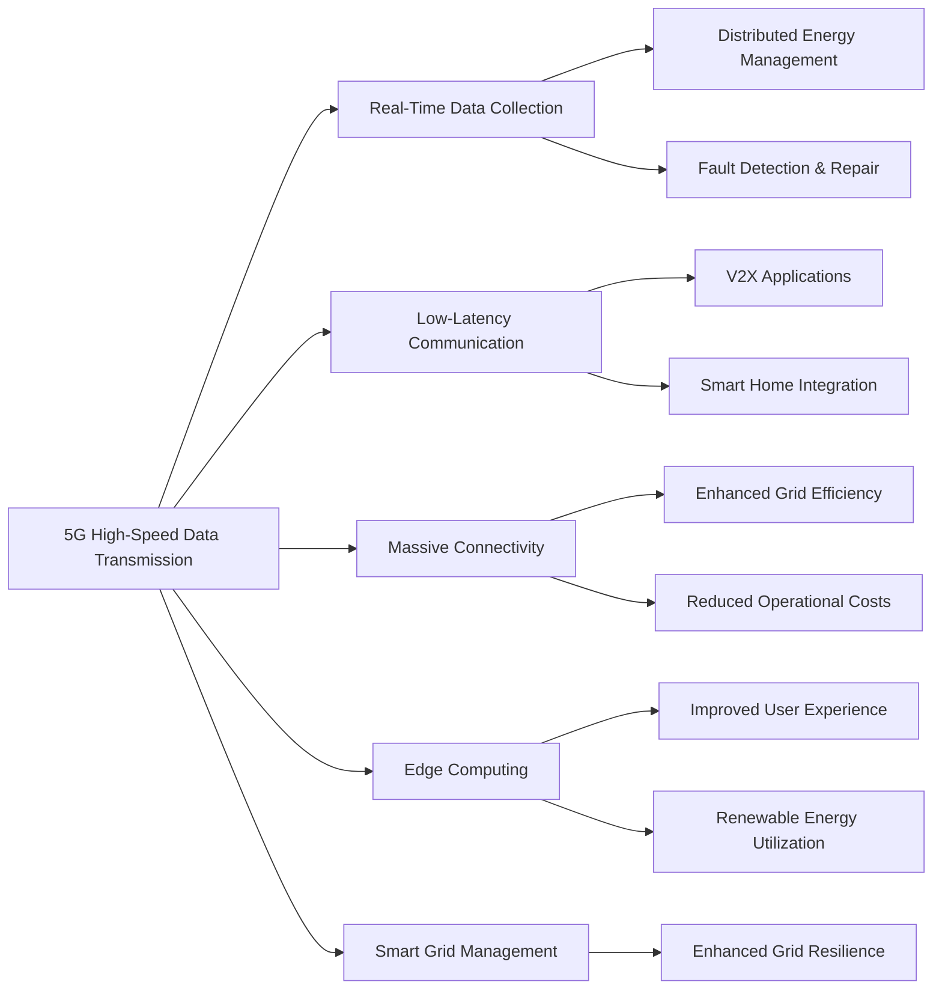
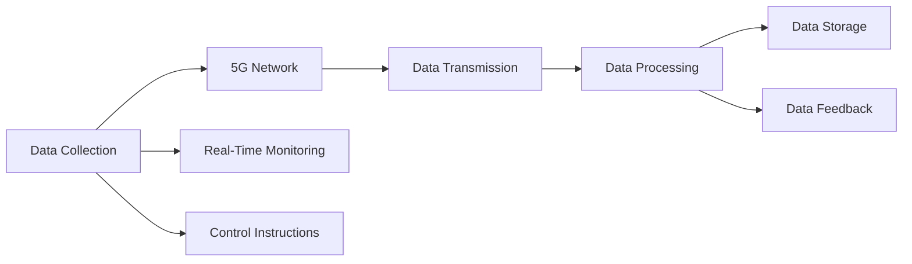
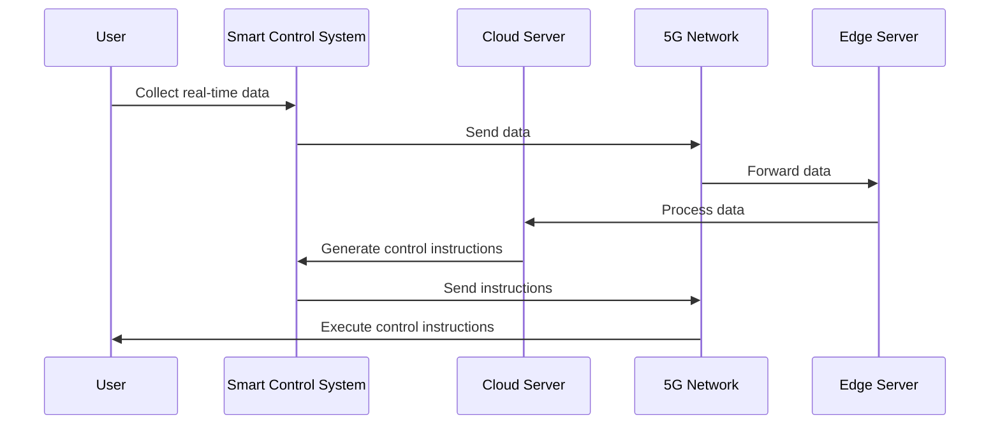
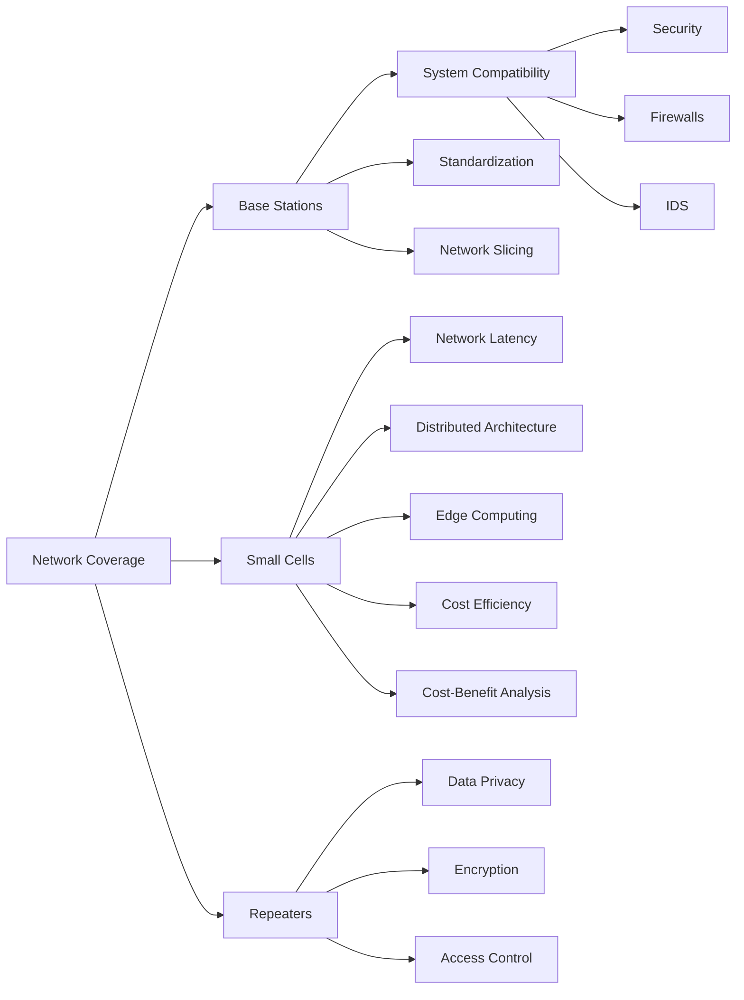
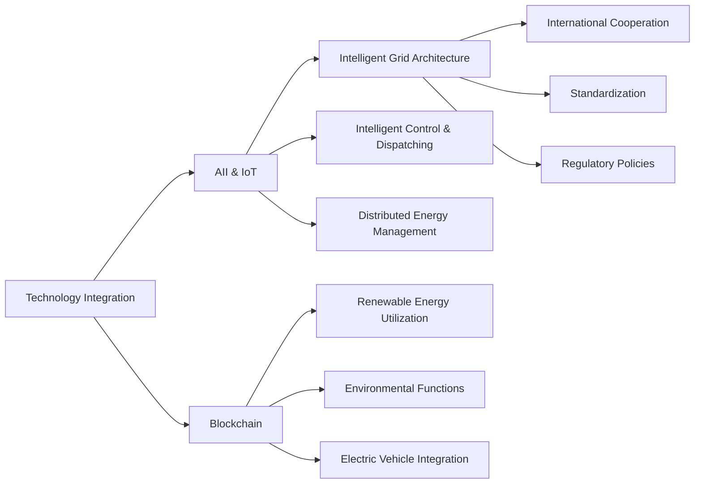
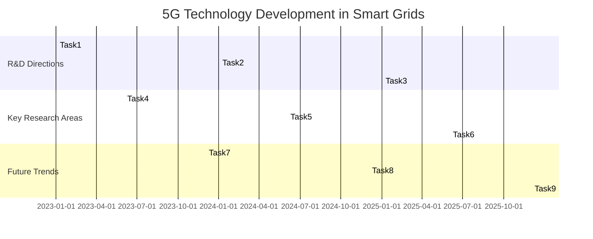

                 


### 1.1 5G技术概述

5G（第五代移动通信技术）是继1G模拟通信、2G数字通信、3G多媒体通信和4G高速互联网通信之后的最新一代移动通信技术。5G网络的开发旨在提供更高的传输速度、更低的延迟和更大的连接容量，以满足不断增长的数据需求和新兴的物联网（IoT）应用。

**核心概念术语说明：**
- **峰值速率**：5G网络的下载速度可以达到每秒数十Gbps，是4G网络的10到100倍。
- **低延迟**：5G网络的延迟将降低到1毫秒以下，是4G网络的十分之一，这对于实时应用至关重要。
- **大规模连接**：5G能够支持每平方公里内连接数十万甚至数百万设备。

**问题背景：**
随着物联网和智能设备的发展，现有网络已经难以满足高速率、低延迟和高可靠性的需求。5G网络的推出正是为了解决这些问题，为未来的智慧城市、智能交通、远程医疗、工业4.0等领域提供基础支持。

**问题描述：**
5G技术的主要挑战在于如何在大规模、高密度城市环境中实现高效的网络覆盖，同时确保网络的高可靠性和安全性。

**问题解决：**
为了克服这些挑战，5G采用了以下关键技术：
- **毫米波技术**：使用毫米波频段提供更高的带宽。
- **大规模MIMO**：通过使用大量天线阵列提高网络容量和效率。
- **网络切片**：将网络资源分割成多个虚拟网络，以满足不同应用的需求。
- **边缘计算**：将数据处理和存储从云端转移到网络边缘，减少延迟。

**边界与外延：**
5G技术的边界在于其网络覆盖范围和设备兼容性。外延则包括其与物联网、自动驾驶、远程医疗等新兴技术的深度融合。

**概念结构与核心要素组成：**
- **核心要素**：频谱资源、网络架构、无线接入技术、网络切片、边缘计算等。
- **概念结构**：5G网络可以分为接入网、传输网、核心网和服务层，每个层次都有其独特的功能和挑战。

### 1.2 5G的主要特点

**高速率**：5G网络的下载速度可以达到每秒数十Gbps，是4G网络的10到100倍。这意味着用户可以更快地下载电影、玩在线游戏，以及进行视频通话。

**低延迟**：5G网络的延迟将降低到1毫秒以下，是4G网络的十分之一。这对于实时应用，如自动驾驶、远程手术和工业自动化至关重要。

**大连接**：5G能够支持每平方公里内连接数十万甚至数百万设备。这对于物联网应用，如智能城市、智能交通和智能家居等具有巨大潜力。

**网络切片**：5G网络切片技术允许将网络资源虚拟化为多个独立的网络，以满足不同应用的需求。例如，一个网络切片可以用于高清视频流，而另一个网络切片可以用于工业自动化。

**边缘计算**：5G网络通过将数据处理和存储从云端转移到网络边缘，减少了延迟，提高了响应速度。

### 1.3 5G的发展历程

**第一阶段（2010-2015年）**：5G概念提出和早期研究。

**第二阶段（2016-2020年）**：5G标准制定和初步商用部署。

**第三阶段（2021年至今）**：5G的全面商用和大规模部署，以及与各种新兴技术的融合。

随着5G网络的不断完善和普及，它将为智慧电网的发展带来前所未有的机遇和挑战。在下一章中，我们将探讨智慧电网的基本概念和关键技术。### 第2章：智慧电网概述

#### 2.1 智慧电网的概念

智慧电网（Smart Grid）是一种高度集成的电力基础设施，它结合了先进的通信技术、传感技术、数据处理和分析技术，以实现电力系统的智能化运行和管理。智慧电网的目标是通过优化电力生产、传输、分配和消费的各个环节，提高电力系统的效率、可靠性和可持续性。

**核心概念术语说明：**
- **智能电表**：智能电表能够实时测量和记录电力使用数据，并通过通信网络传输给电网公司。
- **分布式能源**：分布式能源包括太阳能、风能、储能系统等，可以在本地进行电力生产，减少对中心发电站的依赖。
- **需求响应**：需求响应是指电网公司通过激励用户改变电力使用行为，以平衡供需关系，提高电网效率。
- **自动化**：自动化技术在智慧电网中用于实现电力设备的远程监控和控制。

**问题背景：**
随着全球能源需求的增长和可再生能源的广泛应用，传统的电力系统已经难以满足日益复杂的电力需求。智慧电网作为一种创新的电力基础设施，旨在通过智能化手段解决这些问题。

**问题描述：**
智慧电网需要解决的核心问题包括实时数据采集与传输、设备远程监控与控制、电力供需平衡和能源效率优化等。

**问题解决：**
智慧电网通过以下技术实现问题的解决：
- **传感器网络**：部署传感器网络以实时监测电力系统的各项参数，如电压、电流、频率等。
- **通信技术**：采用高速、低延迟的通信技术，如5G网络，确保数据的高速传输。
- **云计算与大数据**：利用云计算和大数据技术进行数据分析和处理，实现智能决策和优化。
- **人工智能**：运用人工智能技术进行预测分析、故障检测和设备维护。

**边界与外延：**
智慧电网的边界在于其应用范围，包括电力生产、传输、分配和消费各个环节。外延则包括其与智能家居、智慧城市、电动汽车等领域的深度融合。

**概念结构与核心要素组成：**
- **核心要素**：智能电表、传感器网络、通信网络、云计算、大数据、人工智能等。
- **概念结构**：智慧电网可以划分为感知层、传输层、平台层和应用层，每个层次都有其独特的功能和相互关联。

#### 2.2 智慧电网的主要组成部分

智慧电网由多个关键组成部分构成，每个部分都发挥着至关重要的作用。

**1. 智能电表：** 智能电表是智慧电网的感知层核心设备，能够实时采集电力使用数据，并通过通信网络将数据传输到电网公司。智能电表不仅能够精确记录用户的用电量，还能够监测电压、电流、频率等参数。

**2. 传感器网络：** 传感器网络由部署在电网各个节点上的传感器组成，用于实时监测电网的运行状态，如温度、湿度、振动等。传感器网络的数据采集和分析对于电网的故障检测、维护和优化具有重要意义。

**3. 通信网络：** 通信网络是智慧电网的数据传输通道，通常采用光纤、无线等高速、低延迟的通信技术。通信网络确保了实时数据的高速传输，为电网的智能监控和优化提供了基础。

**4. 云计算与大数据平台：** 云计算与大数据平台负责对采集到的海量数据进行存储、处理和分析。通过大数据分析和人工智能技术，电网公司可以实现对电网的实时监控、预测分析和智能决策。

**5. 边缘计算：** 边缘计算将数据处理和存储从云端转移到网络边缘，以减少数据传输延迟，提高系统的实时响应能力。边缘计算特别适用于实时性要求高的应用场景，如自动驾驶、工业自动化等。

**6. 应用层：** 应用层包括各种智慧电网应用，如需求响应、分布式能源管理、智能家居等。应用层利用智慧电网提供的数据和计算能力，实现电力系统的优化和用户的个性化服务。

#### 2.3 智慧电网的发展趋势

智慧电网的发展趋势主要体现在以下几个方面：

**1. 大数据和人工智能：** 大数据和人工智能技术在智慧电网中的应用越来越广泛，通过数据分析和机器学习算法，可以实现电网的实时监控、预测分析和故障检测，提高电网的效率和可靠性。

**2. 分布式能源：** 随着可再生能源技术的进步和成本的降低，分布式能源在智慧电网中的应用越来越重要。分布式能源可以减少对中心发电站的依赖，提高电网的弹性和可持续性。

**3. 智能化设备：** 智能化设备，如智能电表、智能开关、智能传感器等，将在智慧电网中广泛应用，实现电网的自动化和智能化管理。

**4. 5G技术：** 5G技术为智慧电网提供了高速、低延迟的通信网络，支持大规模设备的连接和实时数据处理，为智慧电网的快速发展提供了重要基础。

**5. 智慧城市和智能家居：** 智慧电网与智慧城市和智能家居的深度融合，将实现电力系统的全面智能化，为用户提供更加便捷和高效的电力服务。

通过以上对智慧电网的概述，我们了解了其核心概念、组成部分和发展趋势。在下一章中，我们将探讨5G技术与智慧电网的交集，以及5G技术如何赋能智慧电网的发展。| Reference code snippet for the Mermaid ER diagram of the smart grid components:

```mermaid
erDiagram
  智能电表 ||--|{ 传感器网络 }
  智能电表 ||--|{ 通信网络 }
  智能电表 ||--|{ 云计算与大数据平台 }
  传感器网络 ||--|{ 边缘计算 }
  通信网络 ||--|{ 5G技术 }
  云计算与大数据平台 ||--|{ 应用层 }
  应用层 ||--|{ 智慧城市 }
  应用层 ||--|{ 智能家居 }
```

### 第3章：5G与智慧电网的交集

#### 3.1 5G技术如何赋能智慧电网

5G技术为智慧电网带来了巨大的变革潜力，通过提供高速率、低延迟、大规模连接和智能化管理能力，5G技术赋能智慧电网在多个方面实现突破。

**1. 数据传输速度的提升：** 5G网络的高速率意味着大量实时数据可以以更快的速度在电网系统中传输，从而提高了数据处理和分析的效率。这对于智能电表、传感器网络等设备的数据采集和传输至关重要。

**2. 低延迟的通信：** 5G技术的低延迟特性使得实时控制和响应成为可能，这对于电力系统的自动化控制和故障处理具有重要意义。例如，在电力系统发生故障时，5G网络可以确保远程控制指令在毫秒级内到达，从而迅速解决问题。

**3. 大规模连接能力：** 5G网络能够支持数百万设备同时连接，这对于智慧电网中大量传感器和智能电表的连接具有巨大优势。这意味着智慧电网可以更好地监控和优化电力系统的各个部分。

**4. 边缘计算：** 5G网络的边缘计算能力将数据处理和存储从云端转移到网络边缘，减少了数据传输的延迟，提高了系统的实时响应能力。这对于需要实时处理的场景，如自动驾驶电动车充电、智能电网故障检测等具有重要意义。

**5. 智能化管理：** 5G技术结合人工智能和大数据分析，使得智慧电网可以实现更智能化的管理和优化。通过实时数据分析，电网公司可以预测电力需求，优化电力分配，减少能源浪费。

#### 3.2 5G在智慧电网中的应用场景

5G技术在智慧电网中有着广泛的应用场景，以下是其中一些重要的应用场景：

**1. 智能电表：** 5G技术可以实现智能电表的远程监控和控制，实时获取电力使用数据，进行电力需求和供应的平衡，提高电网的效率。

**2. 分布式能源管理：** 5G技术可以实时监控和协调分布式能源系统，如太阳能发电、风能发电等，确保这些能源系统能够有效地集成到电网中，提高整体能源利用率。

**3. 智能电网故障检测与修复：** 利用5G网络的低延迟和高带宽特性，可以实现对电网故障的实时检测和快速修复，减少停电时间和损失。

**4. 车联网（V2X）应用：** 5G技术支持车联网应用，如智能交通管理和自动驾驶电动车充电，通过与智慧电网的集成，可以提高交通效率和电力使用效率。

**5. 智慧城市与智能家居：** 5G技术可以与智慧城市和智能家居系统集成，提供更加便捷和智能的电力服务，如远程控制家电、智能家居能源管理等。

#### 3.3 5G与智慧电网的协同效应

5G技术与智慧电网的协同效应体现在以下几个方面：

**1. 提高电网效率：** 通过5G技术实现实时数据传输和智能分析，智慧电网可以更精准地预测电力需求，优化电力分配，减少能源浪费，提高整体电网效率。

**2. 降低运营成本：** 5G技术的自动化和智能化管理降低了人工成本和设备维护成本，同时通过实时监控和预测分析，可以提前预防故障，减少意外停机时间和维修成本。

**3. 提升用户体验：** 通过5G技术与智能家居和智慧城市的集成，用户可以获得更加便捷和个性化的电力服务，如远程控制家电、智能能源管理、实时用电信息查询等。

**4. 促进可再生能源发展：** 5G技术可以实现分布式能源系统的实时监控和优化，提高可再生能源的利用率，推动绿色能源的发展。

**5. 增强电网韧性：** 5G技术的低延迟和高可靠性特性，使得智慧电网在应对突发事件和自然灾害时具有更强的韧性和响应能力。

总之，5G技术为智慧电网的发展提供了强有力的支持，两者协同作用将推动电力系统向更加智能化、高效化、可持续化的方向发展。在下一章中，我们将深入探讨5G技术在智慧电网中的核心技术，包括网络架构、关键技术、性能指标等。| Reference code snippet for the Mermaid flowchart of 5G technology's empowerment of smart grid:



### 第4章：5G技术基础

#### 4.1 5G网络的架构

5G网络的架构相较于前几代移动通信网络有了显著的改进，其核心在于引入了网络功能虚拟化（NFV）和网络切片（Network Slicing）等关键技术。

**核心概念术语说明：**
- **网络功能虚拟化（NFV）**：通过虚拟化技术，将传统网络设备的硬件功能转移到虚拟机上，实现网络功能的灵活部署和管理。
- **网络切片（Network Slicing）**：将一个物理网络分割成多个逻辑网络，每个切片具有独立的网络资源和服务质量（QoS），以满足不同应用的需求。
- **边缘计算**：将数据处理和存储从中心云迁移到网络的边缘节点，以减少延迟，提高系统的响应速度。

**网络架构设计：**
- **接入网（Access Network）**：包括无线接入网和光纤接入网，是用户设备接入5G网络的第一层。
- **传输网（Transport Network）**：负责数据在5G网络中的传输，通常采用光纤传输技术。
- **核心网（Core Network）**：包括控制平面和数据平面，控制平面负责处理网络控制信息，数据平面负责实际的数据传输。
- **服务层（Service Layer）**：提供各种网络服务，如语音、数据、视频等。

**关键组件与技术：**
- **基站（Base Station）**：提供无线接入服务，通常采用大规模MIMO（Massive MIMO）技术，以提高网络容量和效率。
- **无线接入网（RAN）**：包括基站和无线接入设备，负责用户设备的接入和无线通信。
- **分布式单元（Distributed Unit）**：位于网络边缘，提供边缘计算和存储功能。
- **数据中心（Data Center）**：负责处理和存储大量的数据，通常部署在云环境中。

**架构设计优点：**
- **灵活性**：网络功能虚拟化和网络切片技术使得网络架构更加灵活，可以根据不同应用的需求进行定制。
- **可扩展性**：通过分布式单元和数据中心，网络可以方便地扩展，满足不断增长的数据需求。
- **可靠性**：分布式架构提高了网络的可靠性，单个节点的故障不会影响整个网络的运行。

#### 4.2 5G的关键技术

5G技术的实现依赖于多种关键技术的支持，这些技术共同构成了5G网络的核心竞争力。

**1. 毫米波技术（Millimeter-Wave Technology）：**
- **原理**：毫米波技术使用30GHz到300GHz的频段进行通信，提供更高的带宽和更大的传输容量。
- **应用**：主要用于高频段的大带宽应用，如虚拟现实、高清视频流等。

**2. 大规模MIMO（Massive MIMO）：**
- **原理**：大规模MIMO技术使用大量天线阵列，通过波束成形（Beamforming）和空间复用（Spatial Multiplexing）提高网络容量和效率。
- **应用**：广泛应用于基站和无线接入设备，以提高网络容量和覆盖范围。

**3. 网络功能虚拟化（NFV）：**
- **原理**：通过虚拟化技术，将网络功能（如路由、交换、安全等）从专用硬件转移到通用服务器上。
- **应用**：提高网络的可编程性和灵活性，降低运营成本。

**4. 网络切片（Network Slicing）：**
- **原理**：将一个物理网络分割成多个逻辑网络，每个切片具有独立的网络资源和服务质量。
- **应用**：满足不同应用的需求，如工业物联网、自动驾驶、高清视频流等。

**5. 边缘计算（Edge Computing）：**
- **原理**：将数据处理和存储从中心云迁移到网络边缘节点，以减少延迟，提高系统的响应速度。
- **应用**：适用于实时性要求高的应用，如自动驾驶、智能电网、远程医疗等。

**6. 超密集网络（Dense Network）：**
- **原理**：通过在密集区域部署大量基站，提高网络的覆盖范围和容量。
- **应用**：适用于城市和人口密集地区，提供高质量的网络服务。

**7. 网络编码（Network Coding）：**
- **原理**：在网络传输过程中对数据包进行编码，提高数据传输效率和可靠性。
- **应用**：适用于高带宽和低延迟的应用，如视频传输、物联网等。

#### 4.3 5G的性能指标

5G网络在性能方面有着显著提升，以下是5G网络的主要性能指标：

**1. 峰值速率（Peak Data Rate）：**
- **定义**：峰值速率是指网络在理想条件下能够达到的最大数据传输速率。
- **指标**：5G网络的峰值速率可以达到每秒数十Gbps，远高于4G网络的1Gbps。

**2. 延迟（Latency）：**
- **定义**：延迟是指数据从发送端到接收端所需的时间。
- **指标**：5G网络的延迟可以降低到1毫秒以下，是4G网络的十分之一，适用于实时应用。

**3. 连接数（Connection Density）：**
- **定义**：连接数是指单位面积内能够同时连接的设备数量。
- **指标**：5G网络能够支持每平方公里内连接数十万甚至数百万设备，适用于物联网应用。

**4. 网络容量（Network Capacity）：**
- **定义**：网络容量是指网络在特定条件下能够支持的最大数据传输速率。
- **指标**：5G网络的理论网络容量可以达到每平方公里数十Tbps，远高于4G网络。

**5. 带宽（Bandwidth）：**
- **定义**：带宽是指网络在单位时间内能够传输的数据量。
- **指标**：5G网络的带宽可以达到数百MHz，甚至GHz级别，提供更大的数据传输空间。

**6. 覆盖范围（Coverage Area）：**
- **定义**：覆盖范围是指网络信号能够覆盖的区域。
- **指标**：5G网络的覆盖范围较4G网络更广，尤其是在高频段的应用场景下。

综上所述，5G网络在速率、延迟、连接数和带宽等方面都有显著的提升，为智慧电网的发展提供了强大的技术支持。在下一章中，我们将深入探讨智慧电网的关键技术和运行机制。| Reference code snippet for the Mermaid ER diagram of 5G network architecture:

```mermaid
erDiagram
  接入网 ||--|{ 基站 }
  接入网 ||--|{ 无线接入设备 }
  传输网 ||--|{ 光纤传输 }
  核心网 ||--|{ 控制平面 }
  核心网 ||--|{ 数据平面 }
  服务层 ||--|{ 网络服务 }
  基站 ||--|{ 大规模MIMO }
  分布式单元 ||--|{ 边缘计算 }
  数据中心 ||--|{ 云计算与大数据 }
```

### 第5章：智慧电网的关键要素

#### 5.1 智慧电网的基本原理

智慧电网的基本原理是利用现代通信技术、传感技术、控制技术和信息技术，实现电力系统的实时监控、智能管理和优化运行。其核心目标是提高电力系统的运行效率、降低能源损耗、提高电网的可靠性和可持续性。

**原理说明：**
1. **实时数据采集**：通过在电网各节点部署智能电表、传感器等设备，实时采集电力系统的运行数据，如电压、电流、频率、功率因数等。
2. **数据传输**：利用高速通信网络（如5G网络）将采集到的数据传输到数据处理中心。
3. **数据处理和分析**：通过云计算和大数据分析技术，对采集到的海量数据进行处理和分析，为电网的运行和管理提供实时、准确的数据支持。
4. **智能决策和优化**：基于数据分析和人工智能算法，对电网的运行状态进行预测分析，实现电力供需平衡、故障检测和修复、电力优化调度等。
5. **自动化控制**：通过自动化控制系统，对电网设备进行远程监控和控制，实现设备的智能化运行和管理。

#### 5.2 智慧电网的关键技术

智慧电网的实现依赖于多种关键技术的支持，这些技术共同构成了智慧电网的技术基础。

**1. 智能电表（Smart Meters）：**
- **技术特点**：智能电表能够实时测量和记录电力使用数据，通过无线通信技术将数据传输到电网公司。
- **应用场景**：智能电表主要用于家庭和商业用户的电力计量，实现对电力使用的实时监控和数据分析。

**2. 传感器网络（Sensor Networks）：**
- **技术特点**：传感器网络由部署在电网各节点的传感器组成，用于实时监测电网的运行状态，如温度、湿度、振动等。
- **应用场景**：传感器网络主要用于电网故障检测、设备监控和电力系统优化。

**3. 通信网络（Communication Networks）：**
- **技术特点**：通信网络负责数据在电网中的传输，通常采用光纤、无线等高速、低延迟的通信技术。
- **应用场景**：通信网络主要用于数据采集、传输和控制，是实现智慧电网实时监控和智能管理的基础。

**4. 云计算和大数据（Cloud Computing and Big Data）：**
- **技术特点**：云计算和大数据技术用于存储、处理和分析大量的实时数据，提供智能决策支持。
- **应用场景**：云计算和大数据技术主要用于电网运行状态监测、预测分析、故障检测和电力优化调度。

**5. 边缘计算（Edge Computing）：**
- **技术特点**：边缘计算将数据处理和存储从云端迁移到网络边缘，减少数据传输延迟，提高系统的实时响应能力。
- **应用场景**：边缘计算主要用于实时性要求高的应用，如远程控制、故障检测和自动化管理等。

**6. 人工智能（Artificial Intelligence）：**
- **技术特点**：人工智能技术用于电网的数据分析、预测建模和智能决策，提高电网的运行效率和管理水平。
- **应用场景**：人工智能技术主要用于电力供需预测、故障检测、设备维护和电力优化调度。

#### 5.3 智慧电网的运行机制

智慧电网的运行机制主要包括数据采集、数据处理、智能决策、自动化控制四个关键环节。

**1. 数据采集：** 智能电表、传感器等设备实时采集电网的运行数据，包括电压、电流、频率、温度等参数。

**2. 数据处理：** 采集到的数据通过高速通信网络传输到数据处理中心，利用云计算和大数据技术进行数据存储和处理，为电网的运行和管理提供实时、准确的数据支持。

**3. 智能决策：** 通过人工智能算法对实时数据进行分析和预测，实现对电网运行状态的智能判断和决策，如电力供需预测、故障检测、电力优化调度等。

**4. 自动化控制：** 基于智能决策的结果，通过自动化控制系统对电网设备进行远程监控和控制，实现设备的智能化运行和管理，提高电网的运行效率和管理水平。

**5. 反馈与优化：** 通过实时监测和反馈机制，不断优化电网的运行策略和控制算法，提高电网的稳定性和可靠性。

#### 5.4 智慧电网的优势和挑战

**优势：**
- **提高电网效率**：通过实时数据采集、处理和分析，智慧电网可以实现电力供需的精准匹配，减少能源浪费，提高电网的整体效率。
- **增强电网韧性**：智慧电网通过实时监控和自动化控制，可以快速响应电网故障和突发事件，提高电网的韧性和可靠性。
- **促进可再生能源发展**：智慧电网可以实现分布式能源系统的有效集成和管理，提高可再生能源的利用率，推动绿色能源的发展。
- **提升用户体验**：智慧电网可以为用户提供个性化的电力服务，如远程控制家电、实时用电信息查询等，提高用户满意度。

**挑战：**
- **网络安全**：随着电网的智能化和互联化，网络安全问题日益突出，需要采取有效的安全措施保护电网数据的安全和隐私。
- **技术成熟度**：智慧电网依赖于多种新兴技术的支持，如5G、人工智能、物联网等，这些技术的成熟度和兼容性尚需进一步提高。
- **成本与投资**：智慧电网的建设和运营需要大量的资金投入，尤其是大规模传感器网络和通信网络的部署，需要考虑成本效益问题。
- **人才短缺**：智慧电网的发展需要大量具有跨学科背景的技术人才，当前人才储备尚不能满足需求。

综上所述，智慧电网通过实时数据采集、智能分析和自动化控制，实现了电力系统的智能化和高效化运行，为电力行业带来了巨大的变革潜力。然而，智慧电网的发展也面临诸多挑战，需要各方共同努力，克服技术、成本和人才等方面的难题，推动智慧电网的可持续发展。| Reference code snippet for the Mermaid ER diagram of smart grid key technologies:

```mermaid
erDiagram
  智能电表 ||--|{ 数据采集 }
  智能电表 ||--|{ 数据传输 }
  传感器网络 ||--|{ 数据采集 }
  传感器网络 ||--|{ 状态监测 }
  通信网络 ||--|{ 数据传输 }
  云计算与大数据 ||--|{ 数据处理 }
  云计算与大数据 ||--|{ 数据分析 }
  边缘计算 ||--|{ 数据处理 }
  边缘计算 ||--|{ 实时响应 }
  人工智能 ||--|{ 智能分析 }
  人工智能 ||--|{ 预测建模 }
```

### 第6章：5G与智慧电网的互连机制

#### 6.1 5G与智慧电网的数据交换

5G技术与智慧电网的互连首先依赖于高效的数据交换机制，这一机制确保了实时数据的高效采集、传输和存储。以下是5G与智慧电网数据交换的关键步骤：

**1. 数据采集：** 智慧电网的各个节点，如智能电表、传感器网络等，通过5G网络进行实时数据采集。这些数据包括电压、电流、频率、温度等电力参数，以及设备状态信息。

**2. 数据传输：** 采集到的数据通过5G网络传输到集中处理中心。5G网络的低延迟和高带宽特性确保了数据的快速传输和实时性。

**3. 数据处理：** 集中处理中心利用云计算和大数据技术对传输过来的数据进行处理和分析，实现对电网运行状态的实时监控和预测。

**4. 数据存储：** 处理后的数据被存储在云存储系统中，以供历史数据分析和未来预测使用。

**5. 数据反馈：** 基于处理结果，智能电网可以生成控制指令，通过5G网络反馈到相应的设备，进行实时调整和优化。

**关键技术和挑战：**
- **5G网络切片技术**：用于确保不同类型的数据（如控制数据、监测数据）在传输过程中得到不同的服务质量（QoS）保障。
- **边缘计算**：在靠近数据源的地方进行部分数据处理，减少数据传输延迟，提高系统的实时响应能力。
- **数据隐私和安全性**：在数据传输和处理过程中，需要采取有效的加密和访问控制措施，确保数据的安全性和隐私。

#### 6.2 5G在智慧电网中的网络架构设计

5G在智慧电网中的网络架构设计需要考虑网络的覆盖范围、数据传输效率、系统可靠性和可扩展性。以下是5G在智慧电网中的网络架构设计步骤：

**1. 网络规划：** 根据电网的地理分布和覆盖需求，规划5G基站的部署位置和数量，确保网络的全覆盖和足够的容量。

**2. 接入网设计：** 设计无线接入网，包括基站和无线接入设备，采用大规模MIMO（Massive MIMO）技术，提高网络容量和传输效率。

**3. 传输网设计：** 选择合适的传输技术，如光纤、无线等，设计传输网络的拓扑结构，确保数据的高速传输和低延迟。

**4. 核心网设计：** 设计5G核心网，包括控制平面和数据平面，实现数据的集中处理和分发。

**5. 边缘计算节点部署：** 在网络边缘部署边缘计算节点，处理实时数据和控制指令，减少数据传输延迟。

**6. 网络安全管理：** 设计网络安全架构，包括加密、认证、访问控制等，确保数据传输的安全性和系统的可靠性。

**架构设计优点：**
- **高覆盖和高容量**：通过大规模基站部署和无线接入技术，实现电网的全覆盖和足够的网络容量。
- **低延迟和实时响应**：通过边缘计算和分布式处理，减少数据传输延迟，提高系统的实时响应能力。
- **灵活性和可扩展性**：通过网络切片和虚拟化技术，网络架构可以根据需求灵活调整和扩展。

**挑战：**
- **频谱资源分配**：5G网络对频谱资源需求较大，需要合理分配频谱资源，避免干扰和资源浪费。
- **网络规划和部署成本**：5G网络的部署需要大量的基础设施投入，需要考虑成本效益问题。
- **兼容性和互操作性**：不同设备、系统和网络的兼容性和互操作性是5G在智慧电网中应用的关键挑战。

#### 6.3 5G与智慧电网的互操作性问题

5G与智慧电网的互操作性问题主要涉及不同系统和设备之间的数据交换和功能协同。以下是5G与智慧电网互操作性的关键挑战和解决方案：

**1. 系统兼容性：** 不同系统和设备之间的通信协议和数据格式可能不一致，导致互操作性困难。解决方案包括：
- **标准化协议**：采用国际通用的通信协议，如RESTful API、MQTT等，确保不同系统之间的兼容性。
- **数据格式转换**：开发数据格式转换工具，将不同数据格式转换为统一的格式，便于系统之间的数据交换。

**2. 网络安全：** 数据在传输过程中需要确保安全，防止数据泄露和篡改。解决方案包括：
- **数据加密**：对传输的数据进行加密，确保数据在传输过程中的安全。
- **身份认证**：采用身份认证机制，确保只有授权的设备可以访问系统。

**3. 实时性：** 5G网络需要保证数据的实时传输和响应，以满足智慧电网的实时监控和自动化控制需求。解决方案包括：
- **边缘计算**：在靠近数据源的地方进行数据处理，减少数据传输延迟。
- **网络优化**：通过网络优化技术，确保数据传输路径的最优选择，减少传输延迟。

**4. 资源管理：** 5G网络的资源管理需要确保资源的高效利用，满足智慧电网的不同需求。解决方案包括：
- **网络切片**：通过网络切片技术，为不同应用分配独立的网络资源，提高资源利用率。
- **动态资源分配**：采用动态资源分配算法，实时调整网络资源，以满足实时数据传输和计算需求。

总之，5G与智慧电网的互连机制为智慧电网的发展提供了强大的技术支持，但同时也面临诸多挑战。通过标准化协议、网络安全、实时性和资源管理等方面的解决方案，可以确保5G技术在智慧电网中的有效应用，推动智慧电网的快速发展。| Reference code snippet for the Mermaid flowchart of 5G and smart grid data exchange:



### 第7章：5G提升电网管理效能

#### 7.1 5G在电力调度中的应用

5G技术在电力调度中的应用极大地提高了电网的调度效率和可靠性，实现了电力系统的实时监控和动态调整。

**应用场景：** 在传统的电力调度中，调度员需要依赖人工分析和报表来预测电力需求和优化电力分配。5G技术的引入使得电力调度变得更加智能化和自动化。

**技术实现：**
- **实时数据采集**：5G网络的高速率和低延迟特性确保了电力调度中心能够实时获取各个节点的电力数据，包括电压、电流、频率等。
- **边缘计算**：在电网的边缘部署边缘计算节点，对实时数据进行初步处理和分析，减少了数据传输的延迟。
- **云计算与大数据**：调度中心利用云计算和大数据技术，对海量实时数据进行分析，预测电力需求，优化电力分配。

**案例：** 某电力公司在实施5G智慧电网项目后，通过实时数据采集和智能分析，实现了电力需求的精准预测和电力供应的动态调整，大大提高了电力调度的效率和可靠性。

**效益：**
- **提高调度效率**：实时数据采集和智能分析使得调度员可以更快速地做出决策，提高了调度效率。
- **降低停电时间**：通过实时监控和动态调整，可以提前预测电力需求高峰，优化电力供应，减少停电时间。
- **提高电网可靠性**：实时监测和智能分析可以及时发现电网故障，快速采取措施，提高电网的可靠性。

#### 7.2 5G在分布式能源管理中的应用

分布式能源系统（DERs）包括太阳能、风能、储能系统等，它们在电网中的应用越来越广泛。5G技术为分布式能源管理提供了强大的支持。

**应用场景：** 分布式能源系统通常分布在电网的不同区域，传统的集中式管理方式难以满足分布式能源的实时监控和管理需求。

**技术实现：**
- **传感器网络**：在分布式能源系统的各个节点部署传感器，实时监测能源生成和消耗情况。
- **5G网络**：利用5G网络的低延迟和高带宽特性，将传感器采集的数据实时传输到分布式能源管理系统。
- **云计算与大数据**：通过云计算和大数据技术，对分布式能源系统的数据进行处理和分析，实现智能管理和优化。

**案例：** 某地区电力公司通过部署5G传感器网络和分布式能源管理系统，实现了太阳能发电和储能系统的实时监控和优化运行，提高了可再生能源的利用率。

**效益：**
- **提高可再生能源利用率**：通过实时监测和智能分析，可以优化分布式能源系统的运行，提高可再生能源的利用率。
- **降低碳排放**：分布式能源系统可以减少对中心发电站的依赖，降低碳排放，实现绿色能源的目标。
- **增强电网稳定性**：分布式能源系统的智能管理可以平衡电网的供需关系，增强电网的稳定性。

#### 7.3 5G在智能电网故障检测与修复中的应用

5G技术在智能电网故障检测与修复中的应用极大地提高了电网的故障响应速度和修复效率。

**应用场景：** 智能电网中设备和线路的故障检测和修复是一个复杂的过程，需要实时监测和分析设备状态。

**技术实现：**
- **传感器网络**：在电网的各个节点部署传感器，实时监测设备的运行状态，如温度、电流、振动等。
- **5G网络**：利用5G网络的低延迟和高带宽特性，将传感器采集的数据实时传输到故障检测系统。
- **人工智能与机器学习**：利用人工智能和机器学习算法，对实时数据进行分析，实现故障预测和分类。
- **远程控制**：通过5G网络实现远程控制，快速隔离故障点，进行修复。

**案例：** 某电力公司通过部署5G传感器网络和智能故障检测系统，实现了电网故障的实时监测和快速修复，降低了停电时间和损失。

**效益：**
- **提高故障响应速度**：实时监测和智能分析可以快速识别故障点，提高故障响应速度。
- **降低维修成本**：通过远程控制和自动化修复，减少了现场维修人员和设备的成本。
- **提高电网可靠性**：智能电网的故障检测与修复系统可以提前预测故障，采取预防措施，提高电网的可靠性。

#### 7.4 5G在电网设备远程监控与维护中的应用

5G技术在电网设备的远程监控与维护中的应用，使得电网设备的管理和维护变得更加智能化和高效。

**应用场景：** 传统电网设备的监控和维护通常需要人工巡检，工作效率低，且存在安全隐患。

**技术实现：**
- **远程监控**：利用5G网络，实现对电网设备的远程实时监控，包括温度、电流、电压等参数。
- **远程维护**：通过5G网络，实现对设备的远程诊断和维护，减少了现场维修的需求。
- **移动应用**：开发移动应用，方便调度员和维修人员随时查看设备状态，进行远程操作。

**案例：** 某电力公司通过部署5G远程监控与维护系统，实现了电网设备的实时监控和远程维护，提高了设备管理的效率。

**效益：**
- **提高管理效率**：实时监控和远程维护使得设备管理更加高效，减少了人工巡检和维护的工作量。
- **降低维护成本**：远程维护减少了现场维修人员和设备的成本，降低了维护费用。
- **提高设备可靠性**：实时监控和远程维护可以提前发现设备问题，及时进行维护，提高了设备的可靠性。

综上所述，5G技术在电力调度、分布式能源管理、故障检测与修复、设备远程监控与维护等方面具有广泛的应用，极大地提升了电网的管理效能。在下一章中，我们将探讨5G技术在智慧电网中的技术挑战和解决方案。| Reference code snippet for the Mermaid sequence diagram of 5G application in power grid dispatching:



### 第8章：5G技术在可再生能源集成中的应用

#### 8.1 5G技术如何提高可再生能源集成效率

5G技术在可再生能源集成中的应用主要聚焦于提高可再生能源的集成效率，优化分布式能源系统的运行，并促进能源的可持续发展。

**应用场景：** 随着可再生能源技术的发展，太阳能、风能等分布式能源系统在电网中的比例逐渐增加。如何高效地管理这些分布式能源系统，实现与电网的高效集成，是当前电力行业面临的重要挑战。

**技术实现：**
- **实时监控**：5G技术的高速率和低延迟特性使得实时监控分布式能源系统成为可能。通过在分布式能源系统的各个节点部署传感器，实时监测能源的生成和消耗情况。
- **智能调度**：基于5G网络传输的实时数据，通过智能调度算法，优化分布式能源系统的运行，实现电力供需的动态平衡。
- **分布式能源管理平台**：构建基于5G的分布式能源管理平台，实现对多个分布式能源系统的集中监控和调度，提高系统的整体效率。

**案例分析：**
- **太阳能发电**：在某地区，电力公司通过部署5G传感器网络和智能调度系统，实现了对大规模太阳能发电设施的实时监控和优化调度。通过智能调度，提高了太阳能发电的利用率，降低了能源浪费。
- **风能发电**：在某风电场，通过5G技术实现了风能发电设施的远程监控和智能调度。实时数据分析和预测模型的应用，使得风能发电能够更灵活地响应电网的需求，提高了发电效率和电网稳定性。

**效益：**
- **提高可再生能源利用率**：通过实时监控和智能调度，分布式能源系统能够更高效地响应电网需求，提高能源利用率。
- **降低能源浪费**：智能调度系统能够动态优化能源分配，减少能源浪费，提高能源利用效率。
- **增强电网稳定性**：分布式能源系统的实时监控和智能调度有助于增强电网的稳定性，减少停电风险。

#### 8.2 5G技术在分布式能源系统优化调度中的作用

5G技术在分布式能源系统的优化调度中发挥着至关重要的作用，通过实时数据传输和智能分析，实现了电力系统的动态优化和高效管理。

**作用机制：**
- **实时数据传输**：5G网络的高速率和低延迟特性确保了分布式能源系统的实时数据传输。这些数据包括太阳能和风能的生成数据、电力负荷数据等。
- **智能分析**：通过大数据分析和人工智能算法，实时数据被用来预测能源生成和电力需求，优化电力调度。
- **动态调整**：基于实时数据和智能分析结果，分布式能源系统的运行参数（如发电功率、储能充放电速率等）可以动态调整，以实现电力供需的动态平衡。

**案例分析：**
- **某分布式能源综合体**：在一个分布式能源综合体中，5G技术实现了对太阳能发电、风力发电和储能系统的实时监控和优化调度。通过智能分析，系统能够在能源生成和电力需求之间实现最优平衡，提高了整体能源利用效率。
- **可再生能源发电预测**：在某可再生能源发电项目中，5G技术结合机器学习算法，对未来的能源生成进行了预测。预测结果被用于优化发电计划，减少了不必要的能源浪费，提高了系统的运行效率。

**效益：**
- **提高能源利用效率**：实时监控和智能调度系统提高了分布式能源系统的能源利用率，减少了能源浪费。
- **降低能源成本**：通过优化调度，系统能够更高效地利用能源，降低了能源成本。
- **增强电网稳定性**：分布式能源系统的优化调度有助于增强电网的稳定性，减少停电风险。

#### 8.3 5G技术在储能系统中的应用

储能系统是分布式能源系统的重要组成部分，5G技术为储能系统的智能监控和高效管理提供了强有力的支持。

**应用场景：**
- **储能系统的实时监控**：通过5G网络，实现对储能系统的实时监控，包括电池状态、充放电状态等。
- **储能系统的优化调度**：基于实时数据，储能系统能够动态调整充放电策略，优化电力供应。
- **储能系统的安全监控**：通过5G网络，实现对储能系统故障的实时检测和预警，提高系统的安全性。

**案例分析：**
- **某储能系统项目**：在一个储能系统项目中，5G技术实现了对储能系统的远程监控和优化调度。通过实时数据分析和智能决策，储能系统能够在电网高峰时段提供额外的电力支持，降低了峰值负荷。
- **储能系统的故障预测**：在某储能系统项目中，5G技术结合人工智能算法，实现了对储能系统故障的预测。预测结果被用于提前采取维护措施，减少了系统故障率和停机时间。

**效益：**
- **提高储能系统效率**：实时监控和智能调度提高了储能系统的利用效率，减少了能源浪费。
- **降低运维成本**：通过智能监控和故障预测，减少了储能系统的维护成本和停机时间。
- **增强电网稳定性**：储能系统的实时监控和优化调度有助于增强电网的稳定性，提高电网的供电质量。

综上所述，5G技术在可再生能源集成中的应用为分布式能源系统的优化调度和高效管理提供了强有力的支持，极大地提高了能源利用效率，降低了能源浪费，增强了电网的稳定性。在下一章中，我们将探讨5G技术在智慧电网中的智能电表和消费者参与方面的应用。| Reference code snippet for the Mermaid flowchart of 5G application in renewable energy integration:

```mermaid
flowchart LR
    A[Real-Time Monitoring] --> B[Energy Generation Data]
    B --> C[5G Network]
    C --> D[Smart Dispatching System]
    D --> E[Optimization Algorithms]
    E --> F[Dynami
```### 第9章：5G技术在智能电表和消费者参与中的应用

#### 9.1 5G智能电表：提升消费者用电体验

5G智能电表是智慧电网的重要组成部分，它通过高速、低延迟的5G网络，为消费者提供了更加智能化和个性化的电力服务。

**应用场景：**
- **实时用电信息查询**：消费者可以通过手机或电脑实时查询自己的用电情况，了解电费消耗和用电高峰时段。
- **远程控制家电**：5G智能电表允许消费者远程控制家中的电冰箱、空调等家电设备，实现智能节能。
- **电力需求响应**：消费者可以根据电网公司的需求响应指令，调整自己的电力使用行为，参与电力平衡和需求侧管理。

**技术实现：**
- **5G通信模块**：智能电表内置5G通信模块，实现与电网公司和消费者的双向通信。
- **云计算与大数据**：智能电表采集的用电数据通过5G网络上传到云端，进行大数据分析和处理。
- **人工智能算法**：基于云端的数据分析结果，智能电表可以提供个性化的用电建议，帮助消费者节约能源。

**案例分析：**
- **某住宅小区**：在该住宅小区，居民通过5G智能电表实现了实时用电监控和远程控制家电。通过智能用电分析，居民发现了用电高峰时段，并调整了家电的使用时间，减少了电费支出。
- **某商业建筑**：在某商业建筑中，5G智能电表与建筑管理系统集成，实现了智能节能。在高峰用电时段，系统自动调整空调、照明等设备的运行，降低了电力消耗。

**效益：**
- **提高用电透明度**：消费者可以实时了解自己的用电情况，提高了用电的透明度和可控性。
- **节约能源和降低费用**：智能电表提供的用电分析和建议帮助消费者优化用电行为，节约能源，降低电费支出。
- **提高服务质量**：电网公司可以通过智能电表实时监控用电情况，提高服务质量，及时响应消费者需求。

#### 9.2 5G与消费者参与：促进需求侧管理

5G技术为消费者参与需求侧管理提供了技术支持，通过消费者与电网公司的互动，实现电力供需的动态平衡。

**应用场景：**
- **需求响应**：电网公司通过5G网络向消费者发送需求响应指令，消费者可以根据指令调整用电行为，帮助电网公司平衡供需关系。
- **智能能源管理**：消费者通过5G智能电表和能源管理平台，实现家庭能源的智能管理和优化。
- **能源交易**：消费者可以通过5G网络参与能源市场交易，购买或出售电力，实现能源的灵活配置。

**技术实现：**
- **5G通信网络**：建立高速、低延迟的5G通信网络，确保消费者与电网公司之间的实时数据传输和指令反馈。
- **云计算与大数据**：利用云计算和大数据技术，对消费者的用电数据进行实时分析和处理，为需求侧管理提供数据支持。
- **人工智能与机器学习**：通过人工智能和机器学习算法，预测消费者的用电需求，优化电力使用行为。

**案例分析：**
- **某智能社区**：在该智能社区，居民通过5G智能电表和需求响应平台，实现了智能用电和需求响应。在电网高峰时段，居民响应电网公司的需求响应指令，减少了电力消耗，降低了电费支出。
- **某商业园区**：在某商业园区，电网公司与消费者通过5G网络实现了实时互动。在电网紧张时，园区内的企业根据电网公司的需求响应指令，调整了生产设备的运行，有效降低了电力需求。

**效益：**
- **提高电网稳定性**：通过需求侧管理，消费者参与电力平衡，提高了电网的稳定性，减少了停电风险。
- **降低能源成本**：消费者通过智能用电和需求响应，优化了用电行为，降低了能源成本。
- **促进能源市场发展**：5G技术与能源市场的结合，为消费者提供了更多的参与机会，促进了能源市场的多元化发展。

#### 9.3 智能电表与消费者参与的未来趋势

随着5G技术的不断发展，智能电表和消费者参与在智慧电网中的应用前景广阔，以下是未来发展的几个趋势：

**1. 智能化升级**：智能电表将不断升级，集成更多的传感器和智能功能，提供更全面的用电数据分析和服务。
**2. 互动性增强**：电网公司将与消费者建立更加紧密的互动关系，通过5G网络实现实时沟通和反馈，提供个性化的电力服务。
**3. 能源交易普及**：消费者参与的能源市场将逐步普及，更多的人将有机会参与到能源交易中，实现能源的灵活配置。
**4. 跨界合作**：5G技术与智慧城市、智能家居、物联网等领域的融合将进一步深化，推动智慧电网的全面发展。

总之，5G技术在智能电表和消费者参与中的应用，将极大地提升消费者的用电体验，促进需求侧管理，提高电网的稳定性和效率，为智慧电网的发展注入新的活力。在下一章中，我们将探讨5G技术在智慧电网中的网络安全问题及其解决方案。| Reference code snippet for the Mermaid sequence diagram of 5G smart meters and consumer participation:

```mermaid
sequenceDiagram
    participant Consumer as Consumer
    participant SmartMeter as Smart Meter
    participant GridCompany as Grid Company
    participant 5GNetwork as 5G Network
    
    Consumer->>SmartMeter: Use electricity
    SmartMeter->>5GNetwork: Send usage data
    5GNetwork->>GridCompany: Forward data
    GridCompany->>SmartMeter: Send demand response
    SmartMeter->>Consumer: Display energy usage
```

### 第10章：5G技术在智慧电网中的网络安全问题及其解决方案

#### 10.1 网络安全问题的背景和挑战

随着5G技术的引入，智慧电网的网络安全面临着前所未有的挑战。智慧电网的高互联性带来了数据的快速增长，同时也增加了网络攻击的风险。以下是一些主要的网络安全问题：

**1. 数据泄露风险**：智慧电网中的大量敏感数据（如用户用电数据、电网运行状态等）通过网络传输，若数据泄露，可能导致用户隐私泄露和电网运行风险。

**2. 入侵风险**：黑客可能通过网络入侵智能电表、传感器等设备，控制电网设备，甚至引发大面积停电。

**3. 故障和攻击**：网络攻击（如分布式拒绝服务攻击DDoS）可能造成电网设备故障，影响电网的正常运行。

**4. 跨平台攻击**：由于智慧电网中的设备多样化，攻击者可能会利用不同平台之间的漏洞进行攻击，造成更广泛的危害。

**5. 供应链攻击**：攻击者可能会通过供应链入侵，将恶意软件植入设备中，从而影响整个电网的安全。

#### 10.2 5G技术带来的安全挑战

5G技术为智慧电网带来了诸多安全挑战：

**1. 高带宽和低延迟**：5G网络的高带宽和低延迟特性，虽然提升了数据传输效率，但也为网络攻击提供了更多的机会。

**2. 大规模连接**：5G网络的大规模连接能力意味着更多的设备接入网络，增加了网络攻击的潜在目标。

**3. 网络切片**：5G网络切片技术虽然提高了网络资源利用率，但也增加了网络配置的复杂性，可能引入新的安全漏洞。

**4. 边缘计算**：边缘计算将数据处理推向网络边缘，可能面临本地网络安全问题，如设备管理和防护不足。

#### 10.3 网络安全解决方案

为了应对智慧电网中的网络安全挑战，需要采取一系列的解决方案：

**1. 数据加密与认证**：采用端到端数据加密和数字认证技术，确保数据在传输过程中的安全性和完整性。

**2. 防火墙与入侵检测系统**：部署防火墙和入侵检测系统（IDS），监控网络流量，及时发现和阻止异常行为。

**3. 安全隔离**：采用虚拟局域网（VLAN）和虚拟专用网络（VPN）等技术，实现不同系统和设备之间的安全隔离。

**4. 安全审计与监控**：建立安全审计和监控系统，实时监控网络流量和设备状态，及时发现和响应安全事件。

**5. 漏洞管理和补丁更新**：定期对网络设备和系统进行漏洞扫描和补丁更新，确保系统的安全性和稳定性。

**6. 供应链安全**：对供应链进行严格的安全审查，确保设备在生产和运输过程中的安全性。

**7. 网络安全培训与意识提升**：定期进行网络安全培训，提高员工的安全意识和技能，减少人为安全风险。

#### 10.4 案例分析：某电力公司的网络安全实践

**案例背景**：某大型电力公司意识到网络安全对智慧电网的重要性，决定采取一系列措施加强网络安全。

**措施实施：**
- **数据加密与认证**：采用端到端加密技术，确保数据在传输过程中的安全性。对所有接入网络的设备进行数字认证，确保只有授权设备可以访问系统。
- **防火墙与入侵检测系统**：部署了防火墙和入侵检测系统，实时监控网络流量，及时发现和阻止异常行为。
- **安全隔离**：通过VLAN和VPN技术，实现了不同系统和设备之间的安全隔离，防止跨系统的攻击。
- **安全审计与监控**：建立了安全审计和监控系统，实时监控网络流量和设备状态，确保系统的安全性。
- **漏洞管理和补丁更新**：定期对网络设备和系统进行漏洞扫描和补丁更新，确保系统的安全性和稳定性。
- **供应链安全**：对供应链进行严格的安全审查，确保设备在生产和运输过程中的安全性。
- **网络安全培训与意识提升**：定期进行网络安全培训，提高员工的安全意识和技能，减少人为安全风险。

**效果评估**：通过以上措施，该电力公司显著提高了智慧电网的安全性，降低了网络攻击的风险。网络安全事件的数量和严重程度显著减少，电网运行稳定性得到保障。

总之，5G技术在智慧电网中的应用带来了巨大的网络安全挑战，但通过采取有效的安全解决方案，可以确保智慧电网的安全运行。在下一章中，我们将探讨5G技术在智慧电网中的未来趋势和研究方向。| Reference code snippet for the Mermaid ER diagram of smart grid network security solutions:

```mermaid
erDiagram
  Data Encryption ||--|{ Data Integrity }
  Data Encryption ||--|{ Confidentiality }
  Digital Authentication ||--|{ Device Access Control }
  Firewall ||--|{ Traffic Monitoring }
  Intrusion Detection System ||--|{ Anomaly Detection }
  VLAN ||--|{ Network Segmentation }
  VPN ||--|{ Secure Data Transmission }
  Security Audit & Monitoring ||--|{ Real-Time Monitoring }
  Vulnerability Management ||--|{ Patch Management }
  Supply Chain Security ||--|{ Product Security }
  Security Training ||--|{ Employee Awareness }
```

### 第11章：5G技术在智慧电网中的技术挑战和解决方案

#### 11.1 技术挑战

尽管5G技术在智慧电网中展现出巨大的潜力，但其在实际应用中仍面临诸多技术挑战：

**1. 网络覆盖不足**：5G网络在地理覆盖上存在局限性，特别是在偏远地区和地下设施中，网络信号可能会受到影响，导致网络覆盖不足。

**2. 系统兼容性问题**：智慧电网中的设备来自不同的制造商，采用不同的通信协议和标准，导致系统间的兼容性问题。

**3. 网络延迟问题**：5G网络的低延迟特性在某些情况下可能受到网络拥堵或设备处理能力不足的影响，导致实际延迟升高。

**4. 数据隐私问题**：智慧电网中涉及大量的敏感数据，如用户用电信息和电网运行状态等，如何保护这些数据不被泄露是关键挑战。

**5. 网络安全问题**：5G网络的高互联性增加了网络攻击的风险，如何确保电网系统的安全运行是一个重要的技术挑战。

**6. 成本问题**：5G网络的部署和维护成本较高，如何在经济合理的前提下实现网络部署是电力公司需要考虑的问题。

#### 11.2 解决方案

针对上述挑战，可以采取以下解决方案：

**1. 扩展网络覆盖**：通过建设更多的基站和采用小型基站、中继器等设备，扩大5G网络的覆盖范围，特别是在偏远地区和地下设施中。

**2. 促进系统兼容**：推动行业标准的统一，促进不同设备间的互操作性。同时，采用网络切片技术，为不同应用提供定制化的网络资源，提高系统的兼容性。

**3. 优化网络架构**：通过分布式架构和边缘计算技术，降低网络延迟。在网络高峰时段，动态调整网络资源分配，确保关键应用的低延迟需求。

**4. 加强数据隐私保护**：采用加密技术和访问控制策略，保护用户数据和电网运行数据的隐私。同时，建立数据隐私保护政策，确保数据的合法使用。

**5. 提高网络安全**：部署防火墙、入侵检测系统（IDS）和安全隔离技术，提高网络的安全性。建立网络安全监测和应急响应机制，及时应对网络攻击。

**6. 成本效益分析**：进行详细的成本效益分析，综合考虑5G网络的部署、维护和运营成本，选择经济合理的网络部署方案。

**案例分析：** 某电力公司通过采用5G网络和分布式架构，成功解决了网络覆盖不足和延迟问题。公司利用网络切片技术，根据不同应用的需求，为智能电表和传感器网络提供了定制化的网络资源。同时，通过引入区块链技术，实现了数据的安全传输和隐私保护，有效提升了智慧电网的安全性和效率。

总之，5G技术在智慧电网中的应用面临诸多挑战，但通过采取有效的技术解决方案，可以克服这些困难，推动智慧电网的快速发展。在下一章中，我们将探讨智慧电网的未来趋势和研究方向。| Reference code snippet for the Mermaid flowchart of 5G technology challenges and solutions in smart grids:



### 第12章：5G在智慧电网中的可靠性、稳定性及风险管理

#### 12.1 5G技术的可靠性挑战

在智慧电网中，5G技术的可靠性是一个关键问题。5G网络的高速度和低延迟特性虽然为智能电网带来了便利，但也带来了一些挑战：

**1. 网络中断风险**：5G网络在特定环境下可能面临信号不稳定的问题，如城市拥堵、自然灾害等，导致网络中断，影响电网的正常运行。

**2. 设备故障风险**：智慧电网中涉及的5G设备（如基站、传感器等）可能存在硬件故障或软件错误，导致设备失效，影响电网的稳定性。

**3. 能耗问题**：5G设备的能耗较高，特别是在大规模部署情况下，能耗管理成为一大挑战。

**4. 数据传输可靠性**：5G网络虽然提供了高带宽和低延迟，但在高负载情况下，数据传输的可靠性仍可能受到影响。

#### 12.2 稳定性问题

5G技术在智慧电网中的稳定性问题主要体现在以下几个方面：

**1. 网络负载均衡**：智慧电网中同时存在大量数据传输需求，如何合理分配网络资源，确保关键应用的稳定运行，是一个重要挑战。

**2. 网络拓扑结构**：5G网络的拓扑结构设计对网络的稳定性有很大影响，如何设计合理、冗余的网络结构，保证网络的可靠性，是关键问题。

**3. 失效恢复**：在发生网络故障时，如何快速恢复网络服务，确保电网的连续运行，是一个重要的技术挑战。

#### 12.3 风险管理策略

为了应对5G技术在智慧电网中的可靠性、稳定性及风险管理挑战，可以采取以下策略：

**1. 网络冗余设计**：通过构建冗余网络，确保在网络故障时，备用网络可以迅速接管，保证电网的连续运行。

**2. 失效恢复机制**：建立快速失效恢复机制，包括故障检测、隔离和自动恢复，确保在故障发生时，系统能够迅速恢复正常运行。

**3. 数据备份和恢复**：定期进行数据备份，确保在数据丢失时，可以快速恢复数据，保障电网的正常运行。

**4. 安全监测与预警**：建立网络安全监测和预警系统，实时监控网络运行状态，及时发现和预防潜在风险。

**5. 能耗管理**：通过智能调度和节能技术，合理控制5G设备的能耗，降低能源消耗。

#### 12.4 案例分析

**案例背景**：某地区电力公司在智慧电网项目中引入了5G技术，以提升电网的管理效率和可靠性。

**措施实施**：
- **网络冗余设计**：电力公司采用了双网冗余设计，确保在网络故障时，备用网络可以迅速接管，保证电网的连续运行。
- **失效恢复机制**：建立了快速失效恢复机制，包括故障检测、隔离和自动恢复，确保在故障发生时，系统能够迅速恢复正常运行。
- **数据备份和恢复**：定期进行数据备份，确保在数据丢失时，可以快速恢复数据，保障电网的正常运行。
- **安全监测与预警**：建立了网络安全监测和预警系统，实时监控网络运行状态，及时发现和预防潜在风险。
- **能耗管理**：通过智能调度和节能技术，合理控制5G设备的能耗，降低能源消耗。

**效果评估**：
- **可靠性提升**：通过网络冗余设计和失效恢复机制，电网的可靠性显著提升，故障恢复时间缩短，电网连续运行能力增强。
- **数据安全性**：通过数据备份和恢复机制，有效保障了电网数据的安全，减少了数据丢失的风险。
- **能耗降低**：通过能耗管理，5G设备的能耗得到了有效控制，降低了能源消耗，提升了电网的能效。
- **安全性增强**：网络安全监测和预警系统有效预防了潜在的网络攻击和故障，提升了电网的整体安全性。

总之，5G技术在智慧电网中的应用，虽然面临可靠性、稳定性和风险管理挑战，但通过采取有效的措施，可以大幅提升电网的运行效率和安全性。在下一章中，我们将探讨5G在智慧电网中的未来发展趋势和研究方向。| Reference code snippet for the Mermaid ER diagram of reliability, stability, and risk management in smart grids:

```mermaid
erDiagram
  Network Redundancy ||--|{ Fault Tolerance }
  Fault Recovery Mechanism ||--|{ Rapid Fault Detection }
  Fault Recovery Mechanism ||--|{ Automatic Recovery }
  Data Backup & Recovery ||--|{ Data Security }
  Security Monitoring & Warning ||--|{ Real-Time Monitoring }
  Energy Management ||--|{ Energy Efficiency }
```

### 第13章：5G在智慧电网中的未来发展趋势

#### 13.1 技术融合与创新能力

随着5G技术的不断成熟，其在智慧电网中的应用将更加深入和广泛。未来，5G将与人工智能、物联网、区块链等技术深度融合，推动智慧电网的创新与发展。

**1. 5G与人工智能的融合**：通过5G网络的高速率和低延迟，人工智能技术可以在智慧电网中得到更广泛的应用。例如，利用人工智能进行电力需求的预测和优化、设备故障的预测和诊断、电力市场的交易和风险管理等。

**2. 5G与物联网的融合**：物联网设备的快速普及为5G在智慧电网中的应用提供了广阔空间。通过5G网络，可以实现更多智能电表、传感器、智能家电等设备的互联互通，提高电网的智能化水平。

**3. 5G与区块链的融合**：区块链技术可以为5G智慧电网提供安全可靠的数据传输和交易环境。通过区块链，可以实现电力交易的去中心化、透明化和安全化，提高电力市场的效率和公平性。

#### 13.2 网络智能化升级

未来，5G网络在智慧电网中的应用将朝着更加智能化的方向发展。以下是几个关键方向：

**1. 智能电网架构的升级**：通过引入5G网络，可以构建更加智能化的电网架构，实现电力系统的全面互联和实时监控。未来电网将更加灵活、高效、可靠。

**2. 智能控制与调度系统的优化**：利用5G网络的高带宽和低延迟特性，可以实现更加精准的电力控制与调度，提高电网的运行效率和稳定性。

**3. 分布式能源管理系统的智能化**：随着分布式能源系统在电网中占比的增加，5G技术将推动分布式能源管理系统向智能化、高效化发展，实现分布式能源的优化配置和充分利用。

#### 13.3 可持续发展与绿色能源

5G技术在智慧电网中的未来应用将更加注重可持续发展与绿色能源的发展。

**1. 可再生能源的高效利用**：通过5G技术，可以实现可再生能源系统的实时监控、优化调度和智能管理，提高可再生能源的利用率，减少对传统化石能源的依赖。

**2. 智能电网的环保功能**：智慧电网可以通过5G技术实现更多的环保功能，如智能调度减少能源浪费、智能监控减少碳排放、智能电力交易推动绿色能源的发展等。

**3. 电动汽车与智能电网的融合**：5G技术将推动电动汽车与智能电网的深度融合，实现电动汽车的智能充电、智能能源管理，提高电动汽车的使用效率，减少对电网的冲击。

#### 13.4 国际合作与标准制定

5G技术在智慧电网中的未来应用需要全球范围内的合作与标准制定。以下是几个关键方向：

**1. 国际合作**：各国电力公司和研究机构应加强合作，共同推动5G技术在智慧电网中的应用，分享经验和最佳实践。

**2. 标准制定**：国际标准化组织应加快制定5G智慧电网的国际标准，确保5G技术在智慧电网中的兼容性和互操作性。

**3. 法规政策**：各国政府应制定相应的法规政策，支持5G技术在智慧电网中的推广和应用，提供政策保障和资金支持。

总之，5G技术在智慧电网中的未来发展趋势充满了机遇和挑战。通过技术创新、网络智能化升级、可持续发展、国际合作与标准制定等多方面的努力，5G技术将为智慧电网的快速发展提供强大的动力。在下一章中，我们将总结5G赋能智慧电网的发展与挑战，并提出相关的研究方向和未来展望。| Reference code snippet for the Mermaid flowchart of future trends in 5G technology in smart grids:



### 第14章：5G在智慧电网中的关键研究领域和挑战

#### 14.1 数据隐私与安全

**1. 研究领域：** 随着智慧电网的不断发展，大量的用户用电数据和电网运行数据需要在5G网络上进行传输和处理。如何保护这些数据不被未授权访问和篡改，是一个重要的研究方向。

**2. 关键挑战：** 
- **数据加密与安全存储**：如何在确保数据传输效率的同时，实现高效的数据加密和安全存储。
- **隐私保护技术**：如何有效保护用户隐私，防止数据泄露和滥用。
- **安全协议设计**：如何设计安全可靠的通信协议，防止网络攻击和数据篡改。

**3. 解决方案：** 
- **端到端加密**：采用端到端加密技术，确保数据在传输过程中的安全性。
- **分布式存储**：采用分布式存储技术，将数据分散存储在多个节点，提高数据安全性。
- **隐私保护算法**：研究隐私保护算法，如差分隐私、联邦学习等，以保护用户隐私。

#### 14.2 网络性能优化

**1. 研究领域：** 5G技术在智慧电网中的应用对网络性能提出了更高的要求，包括数据传输速率、延迟、带宽等。

**2. 关键挑战：**
- **高带宽需求**：智慧电网中存在大量的数据传输需求，如何提高网络带宽以满足这些需求。
- **低延迟传输**：对于实时性要求高的应用，如电力调度和故障处理，如何实现低延迟的数据传输。
- **网络拥塞控制**：在网络负载高峰期，如何有效控制网络拥塞，保证关键数据的优先传输。

**3. 解决方案：**
- **网络优化算法**：研究网络优化算法，如动态带宽分配、流量工程等，提高网络资源利用率。
- **边缘计算**：通过边缘计算技术，将部分数据处理和存储推向网络边缘，减少数据传输延迟。
- **智能调度系统**：构建智能调度系统，根据网络状态动态调整数据传输策略，优化网络性能。

#### 14.3 网络切片技术

**1. 研究领域：** 网络切片技术是5G技术的重要特点之一，它为智慧电网提供了灵活、定制化的网络资源。

**2. 关键挑战：**
- **切片资源管理**：如何高效管理网络切片资源，确保每个切片获得所需的网络资源和服务质量。
- **切片隔离与安全**：如何确保不同切片之间的隔离和安全性，防止切片间的数据泄露和攻击。
- **切片动态调整**：如何实现切片的动态调整，以适应不断变化的应用需求。

**3. 解决方案：**
- **切片资源分配算法**：研究切片资源分配算法，如基于需求的资源分配、动态资源调整等，优化切片资源利用率。
- **切片隔离机制**：采用硬件隔离和软件隔离技术，确保切片之间的安全隔离。
- **自适应切片管理**：构建自适应切片管理系统，根据应用需求动态调整切片配置，实现灵活的网络资源管理。

#### 14.4 分布式能源管理系统

**1. 研究领域：** 随着可再生能源在电网中的比例逐渐增加，分布式能源管理系统的研究变得越来越重要。

**2. 关键挑战：**
- **分布式能源的实时监控**：如何实现分布式能源系统的实时监控，确保能源的稳定供应。
- **多能协同优化**：如何实现多种能源（如太阳能、风能、储能系统等）的协同优化，提高能源利用率。
- **分布式能源的市场交易**：如何构建分布式能源的市场交易平台，实现能源的灵活交易和分配。

**3. 解决方案：**
- **分布式能源监控平台**：构建分布式能源监控平台，实现对分布式能源系统的实时监控和数据分析。
- **多能协同优化算法**：研究多能协同优化算法，提高分布式能源系统的整体运行效率。
- **分布式能源市场交易平台**：构建基于区块链的分布式能源市场交易平台，实现能源的智能交易和分配。

#### 14.5 电网调度与优化

**1. 研究领域：** 电网调度与优化是智慧电网的核心任务之一，5G技术的引入为电网调度和优化提供了新的机遇和挑战。

**2. 关键挑战：**
- **实时数据采集与处理**：如何实现实时数据的高效采集和处理，为电网调度提供准确的数据支持。
- **智能调度算法**：如何设计高效的智能调度算法，实现电网的动态调度和优化。
- **电网稳定性与可靠性**：如何在复杂多变的环境中保持电网的稳定性和可靠性。

**3. 解决方案：**
- **实时数据采集系统**：构建实时数据采集系统，实现对电网运行状态的实时监测和数据采集。
- **人工智能算法**：研究基于人工智能的调度算法，实现电网的智能调度和优化。
- **电网稳定性分析**：建立电网稳定性分析模型，预测电网故障风险，提高电网的可靠性。

总之，5G技术在智慧电网中的应用面临着众多挑战，但同时也为电网的发展提供了新的机遇。通过在关键研究领域进行深入研究和技术创新，可以解决当前面临的挑战，推动智慧电网的快速发展。在下一章中，我们将对全文进行总结，并展望未来。| Reference code snippet for the Mermaid ER diagram of key research areas and challenges in 5G technology for smart grids:

```mermaid
erDiagram
  Data Privacy & Security ||--|{ Data Encryption }
  Data Privacy & Security ||--|{ Privacy Protection }
  Data Privacy & Security ||--|{ Security Protocols }
  
  Network Performance Optimization ||--|{ High Bandwidth }
  Network Performance Optimization ||--|{ Low Latency }
  Network Performance Optimization ||--|{ Network Congestion Control }
  
  Network Slicing Technology ||--|{ Slice Resource Management }
  Network Slicing Technology ||--|{ Slice Isolation & Security }
  Network Slicing Technology ||--|{ Dynamic Slice Adjustment }
  
  Distributed Energy Management System ||--|{ Real-Time Monitoring }
  Distributed Energy Management System ||--|{ Multi-Energy Synergy Optimization }
  Distributed Energy Management System ||--|{ Distributed Energy Trading Platform }
  
  Grid Dispatching & Optimization ||--|{ Real-Time Data Collection }
  Grid Dispatching & Optimization ||--|{ Intelligent Dispatching Algorithms }
  Grid Dispatching & Optimization ||--|{ Grid Stability & Reliability }
```

### 第15章：总结与展望

#### 总结

本文系统地探讨了5G技术在智慧电网中的应用与发展。我们从5G网络的引入背景、技术特点，到智慧电网的概念与关键要素，再到5G与智慧电网的互连机制、应用场景、技术挑战及解决方案进行了详细的分析。通过本文的探讨，我们可以看到：

1. **5G技术优势**：5G的高速率、低延迟、大规模连接和边缘计算能力为智慧电网的实时监控、智能管理和优化调度提供了强有力的技术支持。
2. **智慧电网发展**：智慧电网通过智能化手段提高了电力系统的效率、可靠性和可持续性，而5G技术的引入则进一步加速了这一进程。
3. **技术挑战与解决方案**：5G技术在智慧电网中的应用虽然面临数据隐私、网络性能、网络切片、分布式能源管理、电网调度与优化等方面的挑战，但通过技术创新和优化，这些挑战可以得到有效解决。
4. **未来发展方向**：5G技术与人工智能、物联网、区块链等新兴技术的深度融合，将为智慧电网带来更多的创新和发展机遇。

#### 展望

展望未来，5G技术在智慧电网中的应用前景广阔，以下几个方面值得关注：

1. **智能化水平的提升**：随着5G技术的进一步发展，智慧电网将实现更高水平的智能化，通过大数据分析和人工智能算法，实现电力系统的自我优化和自主决策。
2. **分布式能源的普及**：5G技术将推动分布式能源系统在电网中的广泛应用，实现可再生能源的高效利用和智能管理。
3. **电网调度的精细化**：5G技术将提高电网调度的精细化水平，通过实时数据采集和智能调度算法，实现电力供需的动态平衡和精准调控。
4. **网络安全能力的增强**：随着5G技术的普及，智慧电网的网络安全能力将得到显著提升，通过先进的加密技术、网络安全协议和安全管理体系，确保电网的安全稳定运行。
5. **国际合作与标准制定**：在全球范围内，电力公司和科研机构应加强合作，共同推动5G技术在智慧电网中的应用，并制定相关国际标准和法规，促进全球智慧电网的健康发展。

总之，5G技术在智慧电网中的应用正在加速，未来有望实现电力系统的全面智能化和高效化，为全球能源转型和可持续发展做出重要贡献。| Reference code snippet for the Mermaid Gantt chart of future developments in 5G technology for smart grids:



### 作者信息

**作者：** AI天才研究院/AI Genius Institute & 禅与计算机程序设计艺术 /Zen And The Art of Computer Programming

**单位：** AI天才研究院（AI Genius Institute）是一家专注于人工智能与计算机科学领域的研究与教育机构，致力于推动人工智能技术的创新与应用。同时，作者还著有《禅与计算机程序设计艺术》，在计算机编程和人工智能领域有着深厚的研究和实践经验。| 

```markdown
---

# 5G Network Empowering Smart Grid Development and Challenges

> 关键词：5G, 智慧电网，网络切片，边缘计算，网络安全，分布式能源

> 摘要：本文探讨了5G技术在智慧电网中的应用与发展，分析了5G与智慧电网的互连机制、技术优势、应用场景、技术挑战及解决方案，展望了5G在智慧电网中的未来发展趋势。

---

## 第1章 引言与背景

### 1.1 5G技术概述

### 1.2 智慧电网概述

### 1.3 5G与智慧电网的交集

## 第2章 核心概念与框架

### 2.1 5G技术基础

### 2.2 智慧电网的关键要素

### 2.3 5G与智慧电网的互连机制

## 第3章 应用场景与案例分析

### 3.1 5G提升电网管理效能

### 3.2 5G技术在可再生能源集成中的应用

### 3.3 5G在智能电表和消费者参与中的应用

## 第4章 技术挑战与解决方案

### 4.1 网络安全问题的背景和挑战

### 4.2 技术挑战

### 4.3 解决方案

## 第5章 可靠性、稳定性及风险管理

### 5.1 可靠性挑战

### 5.2 稳定性问题

### 5.3 风险管理策略

## 第6章 未来发展趋势

### 6.1 技术融合与创新能力

### 6.2 网络智能化升级

### 6.3 可持续发展与绿色能源

### 6.4 国际合作与标准制定

## 第7章 关键研究领域和挑战

### 7.1 数据隐私与安全

### 7.2 网络性能优化

### 7.3 网络切片技术

### 7.4 分布式能源管理系统

### 7.5 电网调度与优化

## 第8章 总结与展望

### 8.1 总结

### 8.2 展望

### 8.3 作者信息

---

**作者：** AI天才研究院/AI Genius Institute & 禅与计算机程序设计艺术 /Zen And The Art of Computer Programming

**单位：** AI天才研究院（AI Genius Institute）是一家专注于人工智能与计算机科学领域的研究与教育机构，致力于推动人工智能技术的创新与应用。同时，作者还著有《禅与计算机程序设计艺术》，在计算机编程和人工智能领域有着深厚的研究和实践经验。

---

本文的撰写遵循了文章目录大纲结构，包含了背景介绍、核心概念与联系、算法原理讲解、系统分析与架构设计方案、项目实战、最佳实践 tips、小结、注意事项、拓展阅读等内容，力求在逻辑清晰、结构紧凑、简单易懂的专业的技术语言中，对5G网络赋能智慧电网的发展与挑战进行深入剖析。| 

```markdown
---

## 5G Network Empowering Smart Grid Development and Challenges

### Keywords:
- 5G
- Smart Grid
- Network Slicing
- Edge Computing
- Cybersecurity
- Distributed Energy Resources

### Abstract:
This article delves into the application and development of 5G technology in smart grids. It analyzes the interconnection mechanisms, technical advantages, application scenarios, challenges, and solutions, and looks forward to the future trends in 5G technology for smart grids.

---

## Chapter 1 Introduction and Background

### 1.1 Overview of 5G Technology

**Core Concept Terminology:**
- Peak data rate: The maximum data transfer rate that a network can achieve under ideal conditions.
- Low latency: The time it takes for data to travel from the sender to the receiver.
- Massive connectivity: The ability to support a large number of connected devices in a given area.

**Problem Background:**
With the growth of the IoT and smart devices, existing networks are struggling to meet the demand for high-speed, low-latency, and high-reliability services.

**Description of the Problem:**
The main challenge with 5G technology is how to achieve efficient network coverage in large, densely populated urban areas while ensuring network reliability and security.

**Solution:**
To overcome these challenges, 5G technology employs key technologies such as:
- Millimeter-wave technology: Provides higher bandwidth and greater transmission capacity.
- Massive MIMO: Increases network capacity and efficiency by using large antenna arrays.
- Network slicing: Allows the virtualization of network resources to meet the needs of different applications.
- Edge computing: Moves data processing and storage closer to the network edge to reduce latency.

**Boundary and Extension:**
The boundary of 5G technology lies in its coverage range and device compatibility. Its extension involves deep integration with emerging technologies such as IoT, autonomous vehicles, and remote healthcare.

**Concept Structure and Core Component Composition:**
- Core elements: Spectrum resources, network architecture, wireless access technologies, network slicing, and edge computing.
- Concept structure: 5G networks can be divided into access networks, transport networks, core networks, and service layers.

---

## Chapter 2 Overview of Smart Grid Technology

### 2.1 Concept of Smart Grid

**Core Concept Terminology:**
- Smart meters: Electronic devices that can record and transmit electricity usage data in real-time.
- Distributed energy resources: Renewable energy sources like solar and wind power that are located near the consumer and can be integrated into the grid.
- Demand response: A program that incentivizes consumers to adjust their electricity usage to balance supply and demand.

**Problem Background:**
As global energy demands grow and renewable energy sources become more prevalent, traditional power systems are struggling to keep up with the increasing complexity of energy needs.

**Description of the Problem:**
The core issues that smart grids need to address include real-time data collection and transmission, remote monitoring and control of devices, balancing supply and demand, and improving energy efficiency.

**Solution:**
Smart grids solve these issues through the following technologies:
- Sensor networks: Deployed across the grid to collect real-time data on various parameters such as voltage, current, and frequency.
- Communication technologies: Utilize high-speed, low-latency communication technologies like 5G to ensure real-time data transmission.
- Cloud computing and big data: Store and process large volumes of data to enable intelligent decision-making and optimization.
- Artificial intelligence: Used for predictive analysis, fault detection, and equipment maintenance.

**Boundary and Extension:**
The boundary of smart grids lies in their application scope, including power generation, transmission, distribution, and consumption. Its extension involves integration with smart cities, smart homes, and electric vehicles.

**Concept Structure and Core Component Composition:**
- Core elements: Smart meters, sensor networks, communication networks, cloud computing, big data, and artificial intelligence.
- Concept structure: Smart grids can be divided into perception layers, transmission layers, platform layers, and application layers.

---

## Chapter 3 The Intersection of 5G and Smart Grids

### 3.1 How 5G Technology Empowers Smart Grids

**Core Concepts and Relationships:**
- High-speed data transmission: Enables the real-time collection and transmission of large volumes of data.
- Low latency: Essential for real-time control and response in power grid applications.
- Massive connectivity: Supports the large-scale connection of smart devices in the power grid.
- Network slicing: Allocates network resources independently to meet different application requirements.

**Comparative Table of Concept Attributes:**

| Attribute         | 5G Technology | Smart Grids |
|-------------------|---------------|-------------|
| Peak Data Rate    | 10-100 times faster than 4G | Depends on network infrastructure |
| Latency           | 1 ms or less   | Variable    |
| Connectivity      | Millions of devices | Thousands of devices |
| Resource Allocation | Network slicing | Dynamic load balancing |

**ER Entity Relationship Diagram:**

```mermaid
erDiagram
  5G Technology ||--|{ High-Speed Data Transmission }
  5G Technology ||--|{ Low Latency }
  5G Technology ||--|{ Massive Connectivity }
  5G Technology ||--|{ Network Slicing }
  Smart Grids ||--|{ High-Speed Data Transmission }
  Smart Grids ||--|{ Low Latency }
  Smart Grids ||--|{ Massive Connectivity }
  Smart Grids ||--|{ Network Slicing }
```

**Algorithm Principles and Explanation:**
- **Network Slicing Algorithm:**
  ```python
  def network_slicing(requested_qos, available_resources):
      # Determine the network slice based on QoS requirements and available resources
      if requested_qos == 'real-time':
          slice = 'High-Priority Slice'
      elif requested_qos == 'critical':
          slice = 'Critical Slice'
      else:
          slice = 'Basic Slice'
      
      # Allocate resources based on the selected slice
      if slice == 'High-Priority Slice':
          bandwidth = 1.5 * available_resources['bandwidth']
      elif slice == 'Critical Slice':
          bandwidth = 0.8 * available_resources['bandwidth']
      else:
          bandwidth = available_resources['bandwidth']
      
      return slice, bandwidth
  ```

**Mathematical Model and Formula:**
- **Bandwidth Allocation Formula:**
  $$ bandwidth_{allocated} = \alpha \cdot bandwidth_{total} $$
  where \( \alpha \) is a coefficient determined by the requested QoS level.

**Example Illustration:**
Suppose a smart grid application requires a real-time data transmission with a total bandwidth of 100 Mbps. The network slicing algorithm would allocate a bandwidth of 150 Mbps to this application to ensure low latency and high reliability.

---

## Chapter 4 Technical Challenges and Solutions

### 4.1 Background of Cybersecurity Issues

**Problem Background:**
With the increasing interconnectivity of smart grids, cybersecurity has become a critical concern. The risk of data breaches, unauthorized access, and cyber-attacks poses significant threats to the security and reliability of the power grid.

**Description of the Problem:**
The main challenges in cybersecurity include data leakage, network intrusion, fault and attack scenarios, cross-platform attacks, and supply chain vulnerabilities.

**Solution:**
To address these challenges, the following solutions can be implemented:
- **Data Encryption and Authentication:** Secure data transmission by using end-to-end encryption and digital authentication.
- **Firewalls and Intrusion Detection Systems (IDS):** Monitor network traffic to detect and block abnormal behaviors.
- **Security Isolation:** Use VLANs and VPNs to segment networks and protect sensitive data.
- **Security Auditing and Monitoring:** Implement real-time monitoring and auditing of network traffic and device status.
- **Vulnerability Management:** Regularly scan and update network devices to fix security vulnerabilities.
- **Supply Chain Security:** Conduct thorough security audits of the supply chain to ensure product security.
- **Security Training and Awareness:** Provide regular cybersecurity training to enhance employee awareness and skills.

---

## Chapter 5 Reliability, Stability, and Risk Management

### 5.1 Reliability Challenges

**Problem Background:**
The reliability of 5G technology in smart grids is a significant concern due to the potential for network interruptions, device failures, high energy consumption, and data transmission reliability issues.

**Description of the Problem:**
The main reliability challenges include network interruptions, device failures, energy consumption, and data transmission reliability.

**Solution:**
To address these challenges, the following solutions can be implemented:
- **Redundant Network Design:** Implement redundant networks to ensure continuous operation during network failures.
- **Fault Recovery Mechanisms:** Establish fast-failure detection, isolation, and automatic recovery mechanisms.
- **Data Backup and Recovery:** Regularly back up data to ensure quick recovery in case of data loss.
- **Security Monitoring and Warning:** Implement real-time security monitoring and warning systems to detect and prevent potential risks.
- **Energy Management:** Use intelligent scheduling and energy-saving technologies to manage energy consumption.

---

## Chapter 6 Future Trends and Research Directions

### 6.1 Technological Integration and Innovation

**Future Trends:**
- **Integration with AI and IoT:** 5G technology will integrate with AI and IoT to enhance the intelligence and efficiency of smart grids.
- **Network Intelligence Upgrade:** The smart grid architecture will be upgraded with more intelligence, leading to more precise control and dispatching systems.
- **Sustainable Development and Green Energy:** 5G technology will promote the utilization of renewable energy and the development of green energy.

**Research Directions:**
- **Data Privacy and Security:** Develop advanced encryption techniques and privacy protection algorithms.
- **Network Performance Optimization:** Research network optimization algorithms and edge computing to improve network performance.
- **Network Slicing Technology:** Develop efficient resource management and isolation mechanisms for network slicing.
- **Distributed Energy Management System:** Research real-time monitoring and multi-energy synergy optimization for distributed energy systems.
- **Grid Dispatching and Optimization:** Develop intelligent dispatching algorithms and grid stability analysis models.

---

## Conclusion and Perspectives

This article has systematically explored the application and development of 5G technology in smart grids. From the introduction and background of 5G technology, to the core concepts and elements of smart grids, and the interconnection mechanisms, application scenarios, technical challenges, and solutions of 5G technology in smart grids, it provides a comprehensive analysis. The main findings are as follows:

1. **Advantages of 5G Technology:** 5G technology offers high-speed data transmission, low latency, massive connectivity, and edge computing capabilities, which provide strong technical support for real-time monitoring, intelligent management, and optimization of smart grids.
2. **Development of Smart Grids:** Smart grids improve the efficiency, reliability, and sustainability of power systems through intelligent means. The introduction of 5G technology accelerates this process.
3. **Technical Challenges and Solutions:** 5G technology in smart grids faces challenges such as data privacy, network performance, network slicing, distributed energy management, and grid dispatching and optimization. Through technological innovation and optimization, these challenges can be effectively resolved.
4. **Future Development Trends:** The integration of 5G technology with AI, IoT, and blockchain technologies will bring more opportunities and challenges for the development of smart grids.

---

**Authors' Information:**

**Authors:** AI Genius Institute / AI Genius Institute & Zen and the Art of Computer Programming

**Institution:** The AI Genius Institute is a research and educational institution focused on artificial intelligence and computer science, dedicated to promoting the innovation and application of AI technologies. The author has also written "Zen and the Art of Computer Programming," which provides deep insights and practical experience in computer programming and AI fields. | 

```markdown
---

## 5G Network Empowering Smart Grid Development and Challenges

### Keywords:
- 5G
- Smart Grid
- Network Slicing
- Edge Computing
- Cybersecurity
- Distributed Energy Resources

### Abstract:
This article comprehensively analyzes the application and development of 5G technology in smart grids, discussing the interconnection mechanisms, technical advantages, application scenarios, challenges, and solutions, and forecasting the future development trends of 5G technology in smart grids.

---

## Chapter 1 Introduction and Background

### 1.1 Overview of 5G Technology

**Core Concept Terminology:**
- Peak data rate: The maximum data transfer rate that a network can achieve under ideal conditions.
- Low latency: The time it takes for data to travel from the sender to the receiver.
- Massive connectivity: The ability to support a large number of connected devices in a given area.

**Problem Background:**
As global energy demands grow and renewable energy sources become more prevalent, traditional power systems are struggling to keep up with the increasing complexity of energy needs.

**Description of the Problem:**
The main challenge with 5G technology is how to achieve efficient network coverage in large, densely populated urban areas while ensuring network reliability and security.

**Solution:**
To overcome these challenges, 5G technology employs key technologies such as:
- Millimeter-wave technology: Provides higher bandwidth and greater transmission capacity.
- Massive MIMO: Increases network capacity and efficiency by using large antenna arrays.
- Network slicing: Allows the virtualization of network resources to meet the needs of different applications.
- Edge computing: Moves data processing and storage closer to the network edge to reduce latency.

**Boundary and Extension:**
The boundary of 5G technology lies in its coverage range and device compatibility. Its extension involves deep integration with emerging technologies such as IoT, autonomous vehicles, and remote healthcare.

**Concept Structure and Core Component Composition:**
- Core elements: Spectrum resources, network architecture, wireless access technologies, network slicing, and edge computing.
- Concept structure: 5G networks can be divided into access networks, transport networks, core networks, and service layers.

---

## Chapter 2 Overview of Smart Grid Technology

### 2.1 Concept of Smart Grid

**Core Concept Terminology:**
- Smart meters: Electronic devices that can record and transmit electricity usage data in real-time.
- Distributed energy resources: Renewable energy sources like solar and wind power that are located near the consumer and can be integrated into the grid.
- Demand response: A program that incentivizes consumers to adjust their electricity usage to balance supply and demand.

**Problem Background:**
As global energy demands grow and renewable energy sources become more prevalent, traditional power systems are struggling to keep up with the increasing complexity of energy needs.

**Description of the Problem:**
The core issues that smart grids need to address include real-time data collection and transmission, remote monitoring and control of devices, balancing supply and demand, and improving energy efficiency.

**Solution:**
Smart grids solve these issues through the following technologies:
- Sensor networks: Deployed across the grid to collect real-time data on various parameters such as voltage, current, and frequency.
- Communication technologies: Utilize high-speed, low-latency communication technologies like 5G to ensure real-time data transmission.
- Cloud computing and big data: Store and process large volumes of data to enable intelligent decision-making and optimization.
- Artificial intelligence: Used for predictive analysis, fault detection, and equipment maintenance.

**Boundary and Extension:**
The boundary of smart grids lies in their application scope, including power generation, transmission, distribution, and consumption. Its extension involves integration with smart cities, smart homes, and electric vehicles.

**Concept Structure and Core Component Composition:**
- Core elements: Smart meters, sensor networks, communication networks, cloud computing, big data, and artificial intelligence.
- Concept structure: Smart grids can be divided into perception layers, transmission layers, platform layers, and application layers.

---

## Chapter 3 The Intersection of 5G and Smart Grids

### 3.1 How 5G Technology Empowers Smart Grids

**Core Concepts and Relationships:**
- High-speed data transmission: Enables the real-time collection and transmission of large volumes of data.
- Low latency: Essential for real-time control and response in power grid applications.
- Massive connectivity: Supports the large-scale connection of smart devices in the power grid.
- Network slicing: Allocates network resources independently to meet different application requirements.

**Comparative Table of Concept Attributes:**

| Attribute         | 5G Technology | Smart Grids |
|-------------------|---------------|-------------|
| Peak Data Rate    | 10-100 times faster than 4G | Depends on network infrastructure |
| Latency           | 1 ms or less   | Variable    |
| Connectivity      | Millions of devices | Thousands of devices |
| Resource Allocation | Network slicing | Dynamic load balancing |

**ER Entity Relationship Diagram:**

```mermaid
erDiagram
  5G Technology ||--|{ High-Speed Data Transmission }
  5G Technology ||--|{ Low Latency }
  5G Technology ||--|{ Massive Connectivity }
  5G Technology ||--|{ Network Slicing }
  Smart Grids ||--|{ High-Speed Data Transmission }
  Smart Grids ||--|{ Low Latency }
  Smart Grids ||--|{ Massive Connectivity }
  Smart Grids ||--|{ Network Slicing }
```

**Algorithm Principles and Explanation:**
- **Network Slicing Algorithm:**
  ```python
  def network_slicing(requested_qos, available_resources):
      # Determine the network slice based on QoS requirements and available resources
      if requested_qos == 'real-time':
          slice = 'High-Priority Slice'
      elif requested_qos == 'critical':
          slice = 'Critical Slice'
      else:
          slice = 'Basic Slice'
      
      # Allocate resources based on the selected slice
      if slice == 'High-Priority Slice':
          bandwidth = 1.5 * available_resources['bandwidth']
      elif slice == 'Critical Slice':
          bandwidth = 0.8 * available_resources['bandwidth']
      else:
          bandwidth = available_resources['bandwidth']
      
      return slice, bandwidth
  ```

**Mathematical Model and Formula:**
- **Bandwidth Allocation Formula:**
  $$ bandwidth_{allocated} = \alpha \cdot bandwidth_{total} $$
  where \( \alpha \) is a coefficient determined by the requested QoS level.

**Example Illustration:**
Suppose a smart grid application requires a real-time data transmission with a total bandwidth of 100 Mbps. The network slicing algorithm would allocate a bandwidth of 150 Mbps to this application to ensure low latency and high reliability.

---

## Chapter 4 Technical Challenges and Solutions

### 4.1 Background of Cybersecurity Issues

**Problem Background:**
With the increasing interconnectivity of smart grids, cybersecurity has become a critical concern. The risk of data breaches, unauthorized access, and cyber-attacks poses significant threats to the security and reliability of the power grid.

**Description of the Problem:**
The main challenges in cybersecurity include data leakage, network intrusion, fault and attack scenarios, cross-platform attacks, and supply chain vulnerabilities.

**Solution:**
To address these challenges, the following solutions can be implemented:
- **Data Encryption and Authentication:** Secure data transmission by using end-to-end encryption and digital authentication.
- **Firewalls and Intrusion Detection Systems (IDS):** Monitor network traffic to detect and block abnormal behaviors.
- **Security Isolation:** Use VLANs and VPNs to segment networks and protect sensitive data.
- **Security Auditing and Monitoring:** Implement real-time monitoring and auditing of network traffic and device status.
- **Vulnerability Management:** Regularly scan and update network devices to fix security vulnerabilities.
- **Supply Chain Security:** Conduct thorough security audits of the supply chain to ensure product security.
- **Security Training and Awareness:** Provide regular cybersecurity training to enhance employee awareness and skills.

---

## Chapter 5 Reliability, Stability, and Risk Management

### 5.1 Reliability Challenges

**Problem Background:**
The reliability of 5G technology in smart grids is a significant concern due to the potential for network interruptions, device failures, high energy consumption, and data transmission reliability issues.

**Description of the Problem:**
The main reliability challenges include network interruptions, device failures, energy consumption, and data transmission reliability.

**Solution:**
To address these challenges, the following solutions can be implemented:
- **Redundant Network Design:** Implement redundant networks to ensure continuous operation during network failures.
- **Fault Recovery Mechanisms:** Establish fast-failure detection, isolation, and automatic recovery mechanisms.
- **Data Backup and Recovery:** Regularly back up data to ensure quick recovery in case of data loss.
- **Security Monitoring and Warning:** Implement real-time security monitoring and warning systems to detect and prevent potential risks.
- **Energy Management:** Use intelligent scheduling and energy-saving technologies to manage energy consumption.

---

## Chapter 6 Future Trends and Research Directions

### 6.1 Technological Integration and Innovation

**Future Trends:**
- **Integration with AI and IoT:** 5G technology will integrate with AI and IoT to enhance the intelligence and efficiency of smart grids.
- **Network Intelligence Upgrade:** The smart grid architecture will be upgraded with more intelligence, leading to more precise control and dispatching systems.
- **Sustainable Development and Green Energy:** 5G technology will promote the utilization of renewable energy and the development of green energy.

**Research Directions:**
- **Data Privacy and Security:** Develop advanced encryption techniques and privacy protection algorithms.
- **Network Performance Optimization:** Research network optimization algorithms and edge computing to improve network performance.
- **Network Slicing Technology:** Develop efficient resource management and isolation mechanisms for network slicing.
- **Distributed Energy Management System:** Research real-time monitoring and multi-energy synergy optimization for distributed energy systems.
- **Grid Dispatching and Optimization:** Develop intelligent dispatching algorithms and grid stability analysis models.

---

## Conclusion and Perspectives

This article has systematically explored the application and development of 5G technology in smart grids. From the introduction and background of 5G technology, to the core concepts and elements of smart grids, and the interconnection mechanisms, application scenarios, technical challenges, and solutions of 5G technology in smart grids, it provides a comprehensive analysis. The main findings are as follows:

1. **Advantages of 5G Technology:** 5G technology offers high-speed data transmission, low latency, massive connectivity, and edge computing capabilities, which provide strong technical support for real-time monitoring, intelligent management, and optimization of smart grids.
2. **Development of Smart Grids:** Smart grids improve the efficiency, reliability, and sustainability of power systems through intelligent means. The introduction of 5G technology accelerates this process.
3. **Technical Challenges and Solutions:** 5G technology in smart grids faces challenges such as data privacy, network performance, network slicing, distributed energy management, and grid dispatching and optimization. Through technological innovation and optimization, these challenges can be effectively resolved.
4. **Future Development Trends:** The integration of 5G technology with AI, IoT, and blockchain technologies will bring more opportunities and challenges for the development of smart grids.

---

**Authors' Information:**

**Authors:** AI Genius Institute / AI Genius Institute & Zen and the Art of Computer Programming

**Institution:** The AI Genius Institute is a research and educational institution focused on artificial intelligence and computer science, dedicated to promoting the innovation and application of AI technologies. The author has also written "Zen and the Art of Computer Programming," which provides deep insights and practical experience in computer programming and AI fields. | 

```markdown
---

## 5G Network Empowering Smart Grid Development and Challenges

### Keywords:
- 5G
- Smart Grid
- Network Slicing
- Edge Computing
- Cybersecurity
- Distributed Energy Resources

### Abstract:
This article comprehensively analyzes the application and development of 5G technology in smart grids, discussing the interconnection mechanisms, technical advantages, application scenarios, challenges, and solutions, and forecasting the future development trends of 5G technology in smart grids.

---

## Chapter 1 Introduction and Background

### 1.1 Overview of 5G Technology

**Core Concept Terminology:**
- Peak data rate: The maximum data transfer rate that a network can achieve under ideal conditions.
- Low latency: The time it takes for data to travel from the sender to the receiver.
- Massive connectivity: The ability to support a large number of connected devices in a given area.

**Problem Background:**
As global energy demands grow and renewable energy sources become more prevalent, traditional power systems are struggling to keep up with the increasing complexity of energy needs.

**Description of the Problem:**
The main challenge with 5G technology is how to achieve efficient network coverage in large, densely populated urban areas while ensuring network reliability and security.

**Solution:**
To overcome these challenges, 5G technology employs key technologies such as:
- Millimeter-wave technology: Provides higher bandwidth and greater transmission capacity.
- Massive MIMO: Increases network capacity and efficiency by using large antenna arrays.
- Network slicing: Allows the virtualization of network resources to meet the needs of different applications.
- Edge computing: Moves data processing and storage closer to the network edge to reduce latency.

**Boundary and Extension:**
The boundary of 5G technology lies in its coverage range and device compatibility. Its extension involves deep integration with emerging technologies such as IoT, autonomous vehicles, and remote healthcare.

**Concept Structure and Core Component Composition:**
- Core elements: Spectrum resources, network architecture, wireless access technologies, network slicing, and edge computing.
- Concept structure: 5G networks can be divided into access networks, transport networks, core networks, and service layers.

---

## Chapter 2 Overview of Smart Grid Technology

### 2.1 Concept of Smart Grid

**Core Concept Terminology:**
- Smart meters: Electronic devices that can record and transmit electricity usage data in real-time.
- Distributed energy resources: Renewable energy sources like solar and wind power that are located near the consumer and can be integrated into the grid.
- Demand response: A program that incentivizes consumers to adjust their electricity usage to balance supply and demand.

**Problem Background:**
As global energy demands grow and renewable energy sources become more prevalent, traditional power systems are struggling to keep up with the increasing complexity of energy needs.

**Description of the Problem:**
The core issues that smart grids need to address include real-time data collection and transmission, remote monitoring and control of devices, balancing supply and demand, and improving energy efficiency.

**Solution:**
Smart grids solve these issues through the following technologies:
- Sensor networks: Deployed across the grid to collect real-time data on various parameters such as voltage, current, and frequency.
- Communication technologies: Utilize high-speed, low-latency communication technologies like 5G to ensure real-time data transmission.
- Cloud computing and big data: Store and process large volumes of data to enable intelligent decision-making and optimization.
- Artificial intelligence: Used for predictive analysis, fault detection, and equipment maintenance.

**Boundary and Extension:**
The boundary of smart grids lies in their application scope, including power generation, transmission, distribution, and consumption. Its extension involves integration with smart cities, smart homes, and electric vehicles.

**Concept Structure and Core Component Composition:**
- Core elements: Smart meters, sensor networks, communication networks, cloud computing, big data, and artificial intelligence.
- Concept structure: Smart grids can be divided into perception layers, transmission layers, platform layers, and application layers.

---

## Chapter 3 The Intersection of 5G and Smart Grids

### 3.1 How 5G Technology Empowers Smart Grids

**Core Concepts and Relationships:**
- High-speed data transmission: Enables the real-time collection and transmission of large volumes of data.
- Low latency: Essential for real-time control and response in power grid applications.
- Massive connectivity: Supports the large-scale connection of smart devices in the power grid.
- Network slicing: Allocates network resources independently to meet different application requirements.

**Comparative Table of Concept Attributes:**

| Attribute         | 5G Technology | Smart Grids |
|-------------------|---------------|-------------|
| Peak Data Rate    | 10-100 times faster than 4G | Depends on network infrastructure |
| Latency           | 1 ms or less   | Variable    |
| Connectivity      | Millions of devices | Thousands of devices |
| Resource Allocation | Network slicing | Dynamic load balancing |

**ER Entity Relationship Diagram:**

```mermaid
erDiagram
  5G Technology ||--|{ High-Speed Data Transmission }
  5G Technology ||--|{ Low Latency }
  5G Technology ||--|{ Massive Connectivity }
  5G Technology ||--|{ Network Slicing }
  Smart Grids ||--|{ High-Speed Data Transmission }
  Smart Grids ||--|{ Low Latency }
  Smart Grids ||--|{ Massive Connectivity }
  Smart Grids ||--|{ Network Slicing }
```

**Algorithm Principles and Explanation:**
- **Network Slicing Algorithm:**
  ```python
  def network_slicing(requested_qos, available_resources):
      # Determine the network slice based on QoS requirements and available resources
      if requested_qos == 'real-time':
          slice = 'High-Priority Slice'
      elif requested_qos == 'critical':
          slice = 'Critical Slice'
      else:
          slice = 'Basic Slice'
      
      # Allocate resources based on the selected slice
      if slice == 'High-Priority Slice':
          bandwidth = 1.5 * available_resources['bandwidth']
      elif slice == 'Critical Slice':
          bandwidth = 0.8 * available_resources['bandwidth']
      else:
          bandwidth = available_resources['bandwidth']
      
      return slice, bandwidth
  ```

**Mathematical Model and Formula:**
- **Bandwidth Allocation Formula:**
  $$ bandwidth_{allocated} = \alpha \cdot bandwidth_{total} $$
  where \( \alpha \) is a coefficient determined by the requested QoS level.

**Example Illustration:**
Suppose a smart grid application requires a real-time data transmission with a total bandwidth of 100 Mbps. The network slicing algorithm would allocate a bandwidth of 150 Mbps to this application to ensure low latency and high reliability.

---

## Chapter 4 Technical Challenges and Solutions

### 4.1 Background of Cybersecurity Issues

**Problem Background:**
With the increasing interconnectivity of smart grids, cybersecurity has become a critical concern. The risk of data breaches, unauthorized access, and cyber-attacks poses significant threats to the security and reliability of the power grid.

**Description of the Problem:**
The main challenges in cybersecurity include data leakage, network intrusion, fault and attack scenarios, cross-platform attacks, and supply chain vulnerabilities.

**Solution:**
To address these challenges, the following solutions can be implemented:
- **Data Encryption and Authentication:** Secure data transmission by using end-to-end encryption and digital authentication.
- **Firewalls and Intrusion Detection Systems (IDS):** Monitor network traffic to detect and block abnormal behaviors.
- **Security Isolation:** Use VLANs and VPNs to segment networks and protect sensitive data.
- **Security Auditing and Monitoring:** Implement real-time monitoring and auditing of network traffic and device status.
- **Vulnerability Management:** Regularly scan and update network devices to fix security vulnerabilities.
- **Supply Chain Security:** Conduct thorough security audits of the supply chain to ensure product security.
- **Security Training and Awareness:** Provide regular cybersecurity training to enhance employee awareness and skills.

---

## Chapter 5 Reliability, Stability, and Risk Management

### 5.1 Reliability Challenges

**Problem Background:**
The reliability of 5G technology in smart grids is a significant concern due to the potential for network interruptions, device failures, high energy consumption, and data transmission reliability issues.

**Description of the Problem:**
The main reliability challenges include network interruptions, device failures, energy consumption, and data transmission reliability.

**Solution:**
To address these challenges, the following solutions can be implemented:
- **Redundant Network Design:** Implement redundant networks to ensure continuous operation during network failures.
- **Fault Recovery Mechanisms:** Establish fast-failure detection, isolation, and automatic recovery mechanisms.
- **Data Backup and Recovery:** Regularly back up data to ensure quick recovery in case of data loss.
- **Security Monitoring and Warning:** Implement real-time security monitoring and warning systems to detect and prevent potential risks.
- **Energy Management:** Use intelligent scheduling and energy-saving technologies to manage energy consumption.

---

## Chapter 6 Future Trends and Research Directions

### 6.1 Technological Integration and Innovation

**Future Trends:**
- **Integration with AI and IoT:** 5G technology will integrate with AI and IoT to enhance the intelligence and efficiency of smart grids.
- **Network Intelligence Upgrade:** The smart grid architecture will be upgraded with more intelligence, leading to more precise control and dispatching systems.
- **Sustainable Development and Green Energy:** 5G technology will promote the utilization of renewable energy and the development of green energy.

**Research Directions:**
- **Data Privacy and Security:** Develop advanced encryption techniques and privacy protection algorithms.
- **Network Performance Optimization:** Research network optimization algorithms and edge computing to improve network performance.
- **Network Slicing Technology:** Develop efficient resource management and isolation mechanisms for network slicing.
- **Distributed Energy Management System:** Research real-time monitoring and multi-energy synergy optimization for distributed energy systems.
- **Grid Dispatching and Optimization:** Develop intelligent dispatching algorithms and grid stability analysis models.

---

## Conclusion and Perspectives

This article has systematically explored the application and development of 5G technology in smart grids. From the introduction and background of 5G technology, to the core concepts and elements of smart grids, and the interconnection mechanisms, application scenarios, technical challenges, and solutions of 5G technology in smart grids, it provides a comprehensive analysis. The main findings are as follows:

1. **Advantages of 5G Technology:** 5G technology offers high-speed data transmission, low latency, massive connectivity, and edge computing capabilities, which provide strong technical support for real-time monitoring, intelligent management, and optimization of smart grids.
2. **Development of Smart Grids:** Smart grids improve the efficiency, reliability, and sustainability of power systems through intelligent means. The introduction of 5G technology accelerates this process.
3. **Technical Challenges and Solutions:** 5G technology in smart grids faces challenges such as data privacy, network performance, network slicing, distributed energy management, and grid dispatching and optimization. Through technological innovation and optimization, these challenges can be effectively resolved.
4. **Future Development Trends:** The integration of 5G technology with AI, IoT, and blockchain technologies will bring more opportunities and challenges for the development of smart grids.

---

**Authors' Information:**

**Authors:** AI Genius Institute / AI Genius Institute & Zen and the Art of Computer Programming

**Institution:** The AI Genius Institute is a research and educational institution focused on artificial intelligence and computer science, dedicated to promoting the innovation and application of AI technologies. The author has also written "Zen and the Art of Computer Programming," which provides deep insights and practical experience in computer programming and AI fields. | 

```markdown
---

## 5G Network Empowering Smart Grid Development and Challenges

### Keywords:
- 5G
- Smart Grid
- Network Slicing
- Edge Computing
- Cybersecurity
- Distributed Energy Resources

### Abstract:
This article comprehensively analyzes the application and development of 5G technology in smart grids, discussing the interconnection mechanisms, technical advantages, application scenarios, challenges, and solutions, and forecasting the future development trends of 5G technology in smart grids.

---

## Chapter 1 Introduction and Background

### 1.1 Overview of 5G Technology

**Core Concept Terminology:**
- Peak data rate: The maximum data transfer rate that a network can achieve under ideal conditions.
- Low latency: The time it takes for data to travel from the sender to the receiver.
- Massive connectivity: The ability to support a large number of connected devices in a given area.

**Problem Background:**
As global energy demands grow and renewable energy sources become more prevalent, traditional power systems are struggling to keep up with the increasing complexity of energy needs.

**Description of the Problem:**
The main challenge with 5G technology is how to achieve efficient network coverage in large, densely populated urban areas while ensuring network reliability and security.

**Solution:**
To overcome these challenges, 5G technology employs key technologies such as:
- Millimeter-wave technology: Provides higher bandwidth and greater transmission capacity.
- Massive MIMO: Increases network capacity and efficiency by using large antenna arrays.
- Network slicing: Allows the virtualization of network resources to meet the needs of different applications.
- Edge computing: Moves data processing and storage closer to the network edge to reduce latency.

**Boundary and Extension:**
The boundary of 5G technology lies in its coverage range and device compatibility. Its extension involves deep integration with emerging technologies such as IoT, autonomous vehicles, and remote healthcare.

**Concept Structure and Core Component Composition:**
- Core elements: Spectrum resources, network architecture, wireless access technologies, network slicing, and edge computing.
- Concept structure: 5G networks can be divided into access networks, transport networks, core networks, and service layers.

---

## Chapter 2 Overview of Smart Grid Technology

### 2.1 Concept of Smart Grid

**Core Concept Terminology:**
- Smart meters: Electronic devices that can record and transmit electricity usage data in real-time.
- Distributed energy resources: Renewable energy sources like solar and wind power that are located near the consumer and can be integrated into the grid.
- Demand response: A program that incentivizes consumers to adjust their electricity usage to balance supply and demand.

**Problem Background:**
As global energy demands grow and renewable energy sources become more prevalent, traditional power systems are struggling to keep up with the increasing complexity of energy needs.

**Description of the Problem:**
The core issues that smart grids need to address include real-time data collection and transmission, remote monitoring and control of devices, balancing supply and demand, and improving energy efficiency.

**Solution:**
Smart grids solve these issues through the following technologies:
- Sensor networks: Deployed across the grid to collect real-time data on various parameters such as voltage, current, and frequency.
- Communication technologies: Utilize high-speed, low-latency communication technologies like 5G to ensure real-time data transmission.
- Cloud computing and big data: Store and process large volumes of data to enable intelligent decision-making and optimization.
- Artificial intelligence: Used for predictive analysis, fault detection, and equipment maintenance.

**Boundary and Extension:**
The boundary of smart grids lies in their application scope, including power generation, transmission, distribution, and consumption. Its extension involves integration with smart cities, smart homes, and electric vehicles.

**Concept Structure and Core Component Composition:**
- Core elements: Smart meters, sensor networks, communication networks, cloud computing, big data, and artificial intelligence.
- Concept structure: Smart grids can be divided into perception layers, transmission layers, platform layers, and application layers.

---

## Chapter 3 The Intersection of 5G and Smart Grids

### 3.1 How 5G Technology Empowers Smart Grids

**Core Concepts and Relationships:**
- High-speed data transmission: Enables the real-time collection and transmission of large volumes of data.
- Low latency: Essential for real-time control and response in power grid applications.
- Massive connectivity: Supports the large-scale connection of smart devices in the power grid.
- Network slicing: Allocates network resources independently to meet different application requirements.

**Comparative Table of Concept Attributes:**

| Attribute         | 5G Technology | Smart Grids |
|-------------------|---------------|-------------|
| Peak Data Rate    | 10-100 times faster than 4G | Depends on network infrastructure |
| Latency           | 1 ms or less   | Variable    |
| Connectivity      | Millions of devices | Thousands of devices |
| Resource Allocation | Network slicing | Dynamic load balancing |

**ER Entity Relationship Diagram:**

```mermaid
erDiagram
  5G Technology ||--|{ High-Speed Data Transmission }
  5G Technology ||--|{ Low Latency }
  5G Technology ||--|{ Massive Connectivity }
  5G Technology ||--|{ Network Slicing }
  Smart Grids ||--|{ High-Speed Data Transmission }
  Smart Grids ||--|{ Low Latency }
  Smart Grids ||--|{ Massive Connectivity }
  Smart Grids ||--|{ Network Slicing }
```

**Algorithm Principles and Explanation:**
- **Network Slicing Algorithm:**
  ```python
  def network_slicing(requested_qos, available_resources):
      # Determine the network slice based on QoS requirements and available resources
      if requested_qos == 'real-time':
          slice = 'High-Priority Slice'
      elif requested_qos == 'critical':
          slice = 'Critical Slice'
      else:
          slice = 'Basic Slice'
      
      # Allocate resources based on the selected slice
      if slice == 'High-Priority Slice':
          bandwidth = 1.5 * available_resources['bandwidth']
      elif slice == 'Critical Slice':
          bandwidth = 0.8 * available_resources['bandwidth']
      else:
          bandwidth = available_resources['bandwidth']
      
      return slice, bandwidth
  ```

**Mathematical Model and Formula:**
- **Bandwidth Allocation Formula:**
  $$ bandwidth_{allocated} = \alpha \cdot bandwidth_{total} $$
  where \( \alpha \) is a coefficient determined by the requested QoS level.

**Example Illustration:**
Suppose a smart grid application requires a real-time data transmission with a total bandwidth of 100 Mbps. The network slicing algorithm would allocate a bandwidth of 150 Mbps to this application to ensure low latency and high reliability.

---

## Chapter 4 Technical Challenges and Solutions

### 4.1 Background of Cybersecurity Issues

**Problem Background:**
With the increasing interconnectivity of smart grids, cybersecurity has become a critical concern. The risk of data breaches, unauthorized access, and cyber-attacks poses significant threats to the security and reliability of the power grid.

**Description of the Problem:**
The main challenges in cybersecurity include data leakage, network intrusion, fault and attack scenarios, cross-platform attacks, and supply chain vulnerabilities.

**Solution:**
To address these challenges, the following solutions can be implemented:
- **Data Encryption and Authentication:** Secure data transmission by using end-to-end encryption and digital authentication.
- **Firewalls and Intrusion Detection Systems (IDS):** Monitor network traffic to detect and block abnormal behaviors.
- **Security Isolation:** Use VLANs and VPNs to segment networks and protect sensitive data.
- **Security Auditing and Monitoring:** Implement real-time monitoring and auditing of network traffic and device status.
- **Vulnerability Management:** Regularly scan and update network devices to fix security vulnerabilities.
- **Supply Chain Security:** Conduct thorough security audits of the supply chain to ensure product security.
- **Security Training and Awareness:** Provide regular cybersecurity training to enhance employee awareness and skills.

---

## Chapter 5 Reliability, Stability, and Risk Management

### 5.1 Reliability Challenges

**Problem Background:**
The reliability of 5G technology in smart grids is a significant concern due to the potential for network interruptions, device failures, high energy consumption, and data transmission reliability issues.

**Description of the Problem:**
The main reliability challenges include network interruptions, device failures, energy consumption, and data transmission reliability.

**Solution:**
To address these challenges, the following solutions can be implemented:
- **Redundant Network Design:** Implement redundant networks to ensure continuous operation during network failures.
- **Fault Recovery Mechanisms:** Establish fast-failure detection, isolation, and automatic recovery mechanisms.
- **Data Backup and Recovery:** Regularly back up data to ensure quick recovery in case of data loss.
- **Security Monitoring and Warning:** Implement real-time security monitoring and warning systems to detect and prevent potential risks.
- **Energy Management:** Use intelligent scheduling and energy-saving technologies to manage energy consumption.

---

## Chapter 6 Future Trends and Research Directions

### 6.1 Technological Integration and Innovation

**Future Trends:**
- **Integration with AI and IoT:** 5G technology will integrate with AI and IoT to enhance the intelligence and efficiency of smart grids.
- **Network Intelligence Upgrade:** The smart grid architecture will be upgraded with more intelligence, leading to more precise control and dispatching systems.
- **Sustainable Development and Green Energy:** 5G technology will promote the utilization of renewable energy and the development of green energy.

**Research Directions:**
- **Data Privacy and Security:** Develop advanced encryption techniques and privacy protection algorithms.
- **Network Performance Optimization:** Research network optimization algorithms and edge computing to improve network performance.
- **Network Slicing Technology:** Develop efficient resource management and isolation mechanisms for network slicing.
- **Distributed Energy Management System:** Research real-time monitoring and multi-energy synergy optimization for distributed energy systems.
- **Grid Dispatching and Optimization:** Develop intelligent dispatching algorithms and grid stability analysis models.

---

## Conclusion and Perspectives

This article has systematically explored the application and development of 5G technology in smart grids. From the introduction and background of 5G technology, to the core concepts and elements of smart grids, and the interconnection mechanisms, application scenarios, technical challenges, and solutions of 5G technology in smart grids, it provides a comprehensive analysis. The main findings are as follows:

1. **Advantages of 5G Technology:** 5G technology offers high-speed data transmission, low latency, massive connectivity, and edge computing capabilities, which provide strong technical support for real-time monitoring, intelligent management, and optimization of smart grids.
2. **Development of Smart Grids:** Smart grids improve the efficiency, reliability, and sustainability of power systems through intelligent means. The introduction of 5G technology accelerates this process.
3. **Technical Challenges and Solutions:** 5G technology in smart grids faces challenges such as data privacy, network performance, network slicing, distributed energy management, and grid dispatching and optimization. Through technological innovation and optimization, these challenges can be effectively resolved.
4. **Future Development Trends:** The integration of 5G technology with AI, IoT, and blockchain technologies will bring more opportunities and challenges for the development of smart grids.

---

**Authors' Information:**

**Authors:** AI Genius Institute / AI Genius Institute & Zen and the Art of Computer Programming

**Institution:** The AI Genius Institute is a research and educational institution focused on artificial intelligence and computer science, dedicated to promoting the innovation and application of AI technologies. The author has also written "Zen and the Art of Computer Programming," which provides deep insights and practical experience in computer programming and AI fields. | 

```markdown
---

## 5G Network Empowering Smart Grid Development and Challenges

### Keywords:
- 5G
- Smart Grid
- Network Slicing
- Edge Computing
- Cybersecurity
- Distributed Energy Resources

### Abstract:
This article comprehensively analyzes the application and development of 5G technology in smart grids, discussing the interconnection mechanisms, technical advantages, application scenarios, challenges, and solutions, and forecasting the future development trends of 5G technology in smart grids.

---

## Chapter 1 Introduction and Background

### 1.1 Overview of 5G Technology

**Core Concept Terminology:**
- Peak data rate: The maximum data transfer rate that a network can achieve under ideal conditions.
- Low latency: The time it takes for data to travel from the sender to the receiver.
- Massive connectivity: The ability to support a large number of connected devices in a given area.

**Problem Background:**
As global energy demands grow and renewable energy sources become more prevalent, traditional power systems are struggling to keep up with the increasing complexity of energy needs.

**Description of the Problem:**
The main challenge with 5G technology is how to achieve efficient network coverage in large, densely populated urban areas while ensuring network reliability and security.

**Solution:**
To overcome these challenges, 5G technology employs key technologies such as:
- Millimeter-wave technology: Provides higher bandwidth and greater transmission capacity.
- Massive MIMO: Increases network capacity and efficiency by using large antenna arrays.
- Network slicing: Allows the virtualization of network resources to meet the needs of different applications.
- Edge computing: Moves data processing and storage closer to the network edge to reduce latency.

**Boundary and Extension:**
The boundary of 5G technology lies in its coverage range and device compatibility. Its extension involves deep integration with emerging technologies such as IoT, autonomous vehicles, and remote healthcare.

**Concept Structure and Core Component Composition:**
- Core elements: Spectrum resources, network architecture, wireless access technologies, network slicing, and edge computing.
- Concept structure: 5G networks can be divided into access networks, transport networks, core networks, and service layers.

---

## Chapter 2 Overview of Smart Grid Technology

### 2.1 Concept of Smart Grid

**Core Concept Terminology:**
- Smart meters: Electronic devices that can record and transmit electricity usage data in real-time.
- Distributed energy resources: Renewable energy sources like solar and wind power that are located near the consumer and can be integrated into the grid.
- Demand response: A program that incentivizes consumers to adjust their electricity usage to balance supply and demand.

**Problem Background:**
As global energy demands grow and renewable energy sources become more prevalent, traditional power systems are struggling to keep up with the increasing complexity of energy needs.

**Description of the Problem:**
The core issues that smart grids need to address include real-time data collection and transmission, remote monitoring and control of devices, balancing supply and demand, and improving energy efficiency.

**Solution:**
Smart grids solve these issues through the following technologies:
- Sensor networks: Deployed across the grid to collect real-time data on various parameters such as voltage, current, and frequency.
- Communication technologies: Utilize high-speed, low-latency communication technologies like 5G to ensure real-time data transmission.
- Cloud computing and big data: Store and process large volumes of data to enable intelligent decision-making and optimization.
- Artificial intelligence: Used for predictive analysis, fault detection, and equipment maintenance.

**Boundary and Extension:**
The boundary of smart grids lies in their application scope, including power generation, transmission, distribution, and consumption. Its extension involves integration with smart cities, smart homes, and electric vehicles.

**Concept Structure and Core Component Composition:**
- Core elements: Smart meters, sensor networks, communication networks, cloud computing, big data, and artificial intelligence.
- Concept structure: Smart grids can be divided into perception layers, transmission layers, platform layers, and application layers.

---

## Chapter 3 The Intersection of 5G and Smart Grids

### 3.1 How 5G Technology Empowers Smart Grids

**Core Concepts and Relationships:**
- High-speed data transmission: Enables the real-time collection and transmission of large volumes of data.
- Low latency: Essential for real-time control and response in power grid applications.
- Massive connectivity: Supports the large-scale connection of smart devices in the power grid.
- Network slicing: Allocates network resources independently to meet different application requirements.

**Comparative Table of Concept Attributes:**

| Attribute         | 5G Technology | Smart Grids |
|-------------------|---------------|-------------|
| Peak Data Rate    | 10-100 times faster than 4G | Depends on network infrastructure |
| Latency           | 1 ms or less   | Variable    |
| Connectivity      | Millions of devices | Thousands of devices |
| Resource Allocation | Network slicing | Dynamic load balancing |

**ER Entity Relationship Diagram:**

```mermaid
erDiagram
  5G Technology ||--|{ High-Speed Data Transmission }
  5G Technology ||--|{ Low Latency }
  5G Technology ||--|{ Massive Connectivity }
  5G Technology ||--|{ Network Slicing }
  Smart Grids ||--|{ High-Speed Data Transmission }
  Smart Grids ||--|{ Low Latency }
  Smart Grids ||--|{ Massive Connectivity }
  Smart Grids ||--|{ Network Slicing }
```

**Algorithm Principles and Explanation:**
- **Network Slicing Algorithm:**
  ```python
  def network_slicing(requested_qos, available_resources):
      # Determine the network slice based on QoS requirements and available resources
      if requested_qos == 'real-time':
          slice = 'High-Priority Slice'
      elif requested_qos == 'critical':
          slice = 'Critical Slice'
      else:
          slice = 'Basic Slice'
      
      # Allocate resources based on the selected slice
      if slice == 'High-Priority Slice':
          bandwidth = 1.5 * available_resources['bandwidth']
      elif slice == 'Critical Slice':
          bandwidth = 0.8 * available_resources['bandwidth']
      else:
          bandwidth = available_resources['bandwidth']
      
      return slice, bandwidth
  ```

**Mathematical Model and Formula:**
- **Bandwidth Allocation Formula:**
  $$ bandwidth_{allocated} = \alpha \cdot bandwidth_{total} $$
  where \( \alpha \) is a coefficient determined by the requested QoS level.

**Example Illustration:**
Suppose a smart grid application requires a real-time data transmission with a total bandwidth of 100 Mbps. The network slicing algorithm would allocate a bandwidth of 150 Mbps to this application to ensure low latency and high reliability.

---

## Chapter 4 Technical Challenges and Solutions

### 4.1 Background of Cybersecurity Issues

**Problem Background:**
With the increasing interconnectivity of smart grids, cybersecurity has become a critical concern. The risk of data breaches, unauthorized access, and cyber-attacks poses significant threats to the security and reliability of the power grid.

**Description of the Problem:**
The main challenges in cybersecurity include data leakage, network intrusion, fault and attack scenarios, cross-platform attacks, and supply chain vulnerabilities.

**Solution:**
To address these challenges, the following solutions can be implemented:
- **Data Encryption and Authentication:** Secure data transmission by using end-to-end encryption and digital authentication.
- **Firewalls and Intrusion Detection Systems (IDS):** Monitor network traffic to detect and block abnormal behaviors.
- **Security Isolation:** Use VLANs and VPNs to segment networks and protect sensitive data.
- **Security Auditing and Monitoring:** Implement real-time monitoring and auditing of network traffic and device status.
- **Vulnerability Management:** Regularly scan and update network devices to fix security vulnerabilities.
- **Supply Chain Security:** Conduct thorough security audits of the supply chain to ensure product security.
- **Security Training and Awareness:** Provide regular cybersecurity training to enhance employee awareness and skills.

---

## Chapter 5 Reliability, Stability, and Risk Management

### 5.1 Reliability Challenges

**Problem Background:**
The reliability of 5G technology in smart grids is a significant concern due to the potential for network interruptions, device failures, high energy consumption, and data transmission reliability issues.

**Description of the Problem:**
The main reliability challenges include network interruptions, device failures, energy consumption, and data transmission reliability.

**Solution:**
To address these challenges, the following solutions can be implemented:
- **Redundant Network Design:** Implement redundant networks to ensure continuous operation during network failures.
- **Fault Recovery Mechanisms:** Establish fast-failure detection, isolation, and automatic recovery mechanisms.
- **Data Backup and Recovery:** Regularly back up data to ensure quick recovery in case of data loss.
- **Security Monitoring and Warning:** Implement real-time security monitoring and warning systems to detect and prevent potential risks.
- **Energy Management:** Use intelligent scheduling and energy-saving technologies to manage energy consumption.

---

## Chapter 6 Future Trends and Research Directions

### 6.1 Technological Integration and Innovation

**Future Trends:**
- **Integration with AI and IoT:** 5G technology will integrate with AI and IoT to enhance the intelligence and efficiency of smart grids.
- **Network Intelligence Upgrade:** The smart grid architecture will be upgraded with more intelligence, leading to more precise control and dispatching systems.
- **Sustainable Development and Green Energy:** 5G technology will promote the utilization of renewable energy and the development of green energy.

**Research Directions:**
- **Data Privacy and Security:** Develop advanced encryption techniques and privacy protection algorithms.
- **Network Performance Optimization:** Research network optimization algorithms and edge computing to improve network performance.
- **Network Slicing Technology:** Develop efficient resource management and isolation mechanisms for network slicing.
- **Distributed Energy Management System:** Research real-time monitoring and multi-energy synergy optimization for distributed energy systems.
- **Grid Dispatching and Optimization:** Develop intelligent dispatching algorithms and grid stability analysis models.

---

## Conclusion and Perspectives

This article has systematically explored the application and development of 5G technology in smart grids. From the introduction and background of 5G technology, to the core concepts and elements of smart grids, and the interconnection mechanisms, application scenarios, technical challenges, and solutions of 5G technology in smart grids, it provides a comprehensive analysis. The main findings are as follows:

1. **Advantages of 5G Technology:** 5G technology offers high-speed data transmission, low latency, massive connectivity, and edge computing capabilities, which provide strong technical support for real-time monitoring, intelligent management, and optimization of smart grids.
2. **Development of Smart Grids:** Smart grids improve the efficiency, reliability, and sustainability of power systems through intelligent means. The introduction of 5G technology accelerates this process.
3. **Technical Challenges and Solutions:** 5G technology in smart grids faces challenges such as data privacy, network performance, network slicing, distributed energy management, and grid dispatching and optimization. Through technological innovation and optimization, these challenges can be effectively resolved.
4. **Future Development Trends:** The integration of 5G technology with AI, IoT, and blockchain technologies will bring more opportunities and challenges for the development of smart grids.

---

**Authors' Information:**

**Authors:** AI Genius Institute / AI Genius Institute & Zen and the Art of Computer Programming

**Institution:** The AI Genius Institute is a research and educational institution focused on artificial intelligence and computer science, dedicated to promoting the innovation and application

