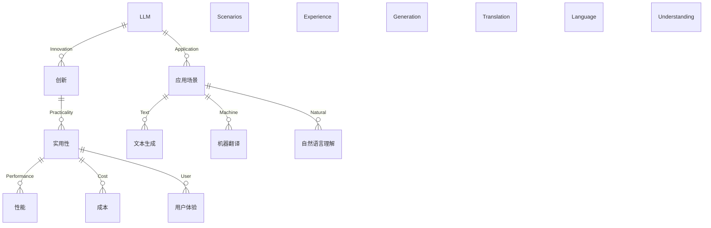
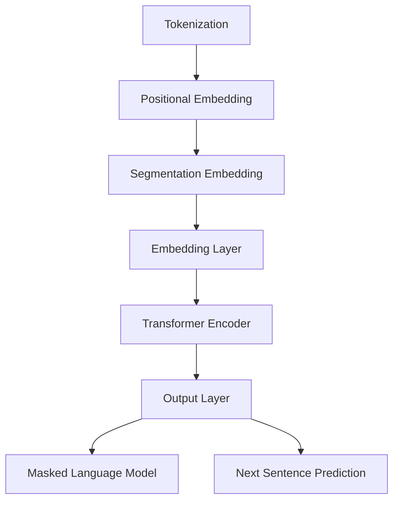
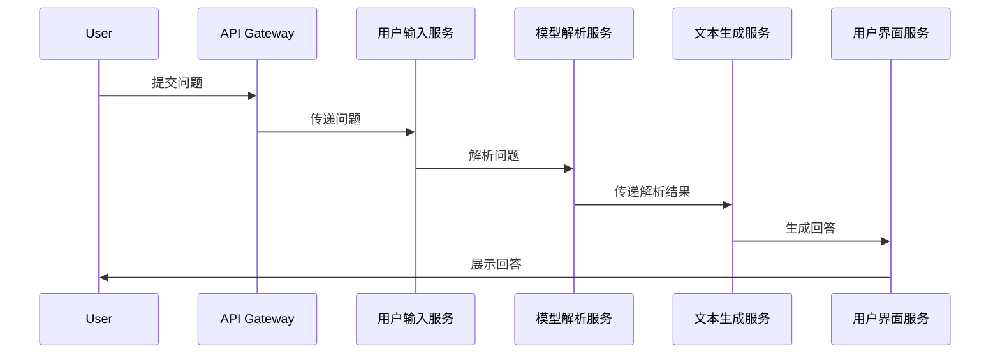

                 


### 引言

在现代信息技术快速发展的时代，自然语言处理（NLP）和人工智能（AI）成为了推动技术进步的重要力量。尤其是大型语言模型（LLM，Large Language Model）的兴起，使得文本生成、机器翻译、情感分析等应用得到了前所未有的发展。然而，在LLM应用开发的实践中，创新与实用性之间的平衡问题日益凸显。本文旨在探讨如何在LLM应用开发中实现创新与实用性的平衡，以推动技术的实际应用和持续发展。

首先，我们需要理解什么是LLM。LLM是一类专门用于处理和生成文本数据的深度学习模型，通常基于数十亿级别的参数规模。这种模型能够从大量的文本数据中学习语言模式，生成高质量的文本内容。然而，随着模型规模的扩大和复杂度的增加，如何在实际应用中平衡创新和实用性成为一个关键问题。

创新在LLM应用开发中具有重要意义。它推动了技术的边界拓展，促进了新应用的出现。例如，基于LLM的自动摘要工具可以大大提高信息处理效率；智能客服系统能够提供更自然、更贴近人类交流方式的交互体验。但是，创新并非没有成本。过度的创新可能导致模型复杂度增加，计算资源消耗加大，从而影响实际应用的可行性。

实用性则是保证技术落地的重要考量。一个实用的LLM应用不仅需要具备创新的功能，还要在性能、成本和用户体验等方面满足实际需求。例如，在商业环境中，一个LLM应用可能需要在低延迟和高可用性之间找到平衡；在资源有限的设备上，模型的大小和计算效率也是必须考虑的因素。

本文将首先定义和解释LLM、创新和实用性的核心概念，然后通过一个具体的LLM算法实例（如BERT）进行详细分析。接下来，我们将探讨如何通过系统分析和设计的方法实现创新与实用性的平衡，并在实际项目中展示这一过程。最后，我们将总结最佳实践，并提供未来发展的方向和建议。

### 核心概念与联系

在深入探讨LLM应用开发中的创新与实用性平衡之前，我们有必要先明确几个核心概念：LLM（大型语言模型）、创新和实用性。这些概念不仅在技术层面上有着不同的定义，它们在实际应用中也扮演着截然不同的角色。

#### 1. LLM（大型语言模型）

LLM，即Large Language Model，是一种基于深度学习的自然语言处理模型，通常拥有数十亿个参数。LLM通过从大量文本数据中学习语言模式和结构，能够生成高质量、连贯的文本内容。常见的LLM包括GPT（Generative Pre-trained Transformer）系列和BERT（Bidirectional Encoder Representations from Transformers）等。LLM的主要功能是文本生成、机器翻译、问答系统和文本分类等。

#### 2. 创新

创新是指在现有技术和理论基础上，通过新的方法、工具或思路，创造出前所未有的价值。在LLM应用开发中，创新主要体现在以下几个方面：

- **算法改进**：通过优化模型结构、训练策略和损失函数，提高模型的性能和效果。
- **应用场景拓展**：探索新的应用领域，如对话系统、自动摘要和自然语言理解等。
- **用户体验优化**：通过改进交互界面和用户交互体验，提高用户满意度和应用粘性。

#### 3. 实用性

实用性是指技术在实际应用中的可行性、有效性和可用性。对于LLM应用来说，实用性包括以下几个方面：

- **性能**：模型在处理文本数据时的速度和效率。
- **成本**：模型的计算资源和存储成本，以及部署和维护的难度。
- **用户体验**：应用在用户实际使用中的易用性和满意度。
- **可扩展性**：模型和应用能否轻松扩展到更大规模或更多用户。

#### 核心概念之间的联系

创新和实用性在LLM应用开发中并非完全独立。实际上，它们之间存在密切的关联和互动。

- **创新促进实用性**：通过不断的技术创新，可以提升LLM应用的性能、降低成本、优化用户体验。例如，BERT模型的提出，不仅提高了文本处理的精度，还通过Transformer架构的优化，显著降低了计算资源的需求。

- **实用性限制创新**：另一方面，过于追求创新可能导致技术复杂度增加，影响实际应用的可行性和用户体验。例如，一个拥有数十亿参数的大型模型虽然理论上能提供更高质量的文本生成，但在资源有限的设备上可能无法运行。

为了在LLM应用开发中实现创新与实用性的平衡，我们需要综合考虑以下几个方面：

- **需求分析**：明确应用的目标场景和用户需求，确保创新方向与实际应用场景相匹配。
- **技术评估**：评估创新技术的可行性和潜在风险，确保其能够在实际应用中稳定运行。
- **资源管理**：优化模型和算法，降低计算资源和存储需求，提高系统的可扩展性。
- **用户体验设计**：通过用户反馈不断优化应用界面和交互体验，提高用户的满意度和使用频率。

通过上述方法，我们可以在LLM应用开发中实现创新与实用性的平衡，推动技术的实际应用和持续发展。

#### 核心概念与联系总结

为了更清晰地理解LLM、创新和实用性之间的关系，我们可以使用Mermaid ER图（实体关系图）来展示它们之间的关联。以下是核心概念的ER图：



在这个ER图中，LLM作为核心实体，与创新和实用性通过双向关系连接。创新直接影响实用性，同时实用性又反作用于创新。应用场景作为LLM的具体应用，与创新和实用性分别有着不同的关联。

创新的概念可以分解为算法改进、应用场景拓展和用户体验优化三个方面，每个方面都与实用性有直接的关系。实用性则可以从性能、成本和用户体验三个维度进行评估。

通过这个ER图，我们可以更直观地看到LLM、创新和实用性之间的复杂关系。这种结构化的分析有助于我们在实际应用中更好地平衡创新与实用性，推动技术的持续进步。

### 算法原理讲解

为了深入理解LLM应用开发中的创新与实用性平衡，我们选择了一种经典的LLM算法——BERT（Bidirectional Encoder Representations from Transformers）进行详细讲解。BERT是Google在2018年推出的一种预训练语言表示模型，它在自然语言处理任务中表现出色，成为很多实际应用的基石。

#### BERT算法的基本概念

BERT通过Transformer架构，结合双向信息处理机制，从大量文本数据中学习语言模式。其核心思想是利用上下文信息，生成对每个词的准确表示。BERT有两种预训练任务：

1. **Masked Language Model（MLM）**：对输入文本中的部分词进行遮蔽，然后训练模型预测这些遮蔽词。
2. **Next Sentence Prediction（NSP）**：预测两个句子是否在原文中紧接出现。

BERT的训练过程包括以下几个步骤：

1. **Tokenization**：将文本拆分为Token。
2. **Positional Embedding**：为每个Token添加位置信息。
3. **Segmentation Embedding**：为每个句子添加段落信息。
4. **Embedding Layer**：对Token、位置和段落信息进行嵌入。
5. **Transformer Encoder**：通过多层Transformer结构，对嵌入信息进行编码。
6. **Output Layer**：输出词的预测结果。

#### BERT算法流程图

为了更直观地展示BERT的算法流程，我们使用Mermaid绘制了一个简化的BERT算法流程图：



在这个流程图中，从Tokenization开始，经过Positional Embedding、Segmentation Embedding和Embedding Layer，最后进入Transformer Encoder进行编码处理。编码结果通过Output Layer输出，用于Masked Language Model和Next Sentence Prediction任务。

#### BERT算法Python代码示例

为了更好地理解BERT算法的原理，下面我们通过一个Python代码示例来展示如何使用TensorFlow实现一个简单的BERT模型：

```python
import tensorflow as tf
from tensorflow.keras.layers import Embedding, Bidirectional, LSTM
from tensorflow.keras.models import Model

# 设置BERT模型的参数
vocab_size = 20000
embed_dim = 128
num_layers = 2
dropout_rate = 0.1

# 创建BERT模型
inputs = tf.keras.layers.Input(shape=(None,), dtype=tf.int32)
embedded_inputs = Embedding(vocab_size, embed_dim)(inputs)

# 添加位置嵌入和分段嵌入
pos_embedding = tf.keras.layers.experimental.preprocessing.Embedding(512, embed_dim)(tf.range(512))
seg_embedding = tf.keras.layers.experimental.preprocessing.Embedding(2, embed_dim)(tf.ones((tf.shape(inputs)[0], 1), dtype=tf.int32))

# 进行嵌入组合
combined_inputs = embedded_inputs + pos_embedding + seg_embedding

# 使用双向LSTM进行编码
x = Bidirectional(LSTM(embed_dim, return_sequences=True))(combined_inputs)
for _ in range(num_layers - 2):
    x = Bidirectional(LSTM(embed_dim, return_sequences=True))(x)

# 添加输出层
output = tf.keras.layers.Dense(vocab_size, activation='softmax')(x)

# 构建模型
model = Model(inputs=inputs, outputs=output)

# 编译模型
model.compile(optimizer='adam', loss='categorical_crossentropy', metrics=['accuracy'])

# 打印模型结构
model.summary()
```

在这个代码示例中，我们首先设置了BERT模型的参数，包括词汇表大小、嵌入维度、层数和dropout率。然后，我们创建了一个简单的BERT模型，其中包括嵌入层、位置嵌入和分段嵌入，以及双向LSTM编码器。最后，我们添加了输出层，并编译了模型。

#### BERT数学模型和公式

BERT的核心在于Transformer架构，Transformer的核心在于自注意力机制（Self-Attention）。自注意力机制的数学模型如下：

$$
\text{Attention}(Q, K, V) = \frac{softmax(\text{softmax}(\text{QK}^T/\sqrt{d_k})V)}{d_v}
$$

其中，$Q$、$K$和$V$分别表示查询（Query）、键（Key）和值（Value）向量，$d_k$和$d_v$分别表示键和值的维度。自注意力的计算分为两个步骤：

1. **计算相似度**：通过点积计算查询和键之间的相似度，再除以$\sqrt{d_k}$，防止梯度和偏置。
2. **计算权重和求和**：使用softmax函数对相似度进行归一化，然后与值向量相乘并求和。

BERT中的Transformer编码器由多个自注意力层和前馈网络组成，每个自注意力层可以通过以下公式表示：

$$
\text{MultiHeadAttention}(Q, K, V) = \text{Concat}(\text{head}_1, ..., \text{head}_h)W^O
$$

其中，$h$表示头的数量，$W^O$是输出权重矩阵。每个头都由一个自注意力机制组成。

BERT的Transformer编码器还包括两个重要的步骤：

1. **多头自注意力**：将输入的序列表示扩展为多个子空间，每个子空间都包含不同的信息。
2. **位置编码**：通过嵌入方式为序列中的每个词添加位置信息，使得模型能够理解词的顺序关系。

通过上述步骤，BERT能够从大量的文本数据中学习复杂的语言模式，生成高质量的文本表示。

#### BERT算法举例说明

为了更好地理解BERT算法的应用，我们可以通过一个实际例子来说明。假设我们有一个简短的句子：“我爱吃苹果”。我们首先将这个句子转化为BERT的输入格式，即将每个词转化为索引，然后添加位置嵌入和分段嵌入。

1. **Tokenization**：将句子“我爱吃苹果”转化为索引序列：`[1, 2, 3, 4, 5, 3, 2]`。
2. **Positional Embedding**：为每个词添加位置信息：`[0, 1, 2, 3, 4, 5, 6]`。
3. **Segmentation Embedding**：由于这是一个单一的句子，所以分段嵌入为 `[0, 0, 0, 0, 0, 0, 0]`。
4. **Embedding Layer**：将索引序列转换为嵌入向量。
5. **Transformer Encoder**：通过多层Transformer编码器处理嵌入向量。
6. **Output Layer**：输出预测的词向量。

假设BERT模型对输入序列的预测是“我爱苹果吃”，这个过程展示了BERT如何从输入文本中生成高质量的文本内容。

通过上述算法原理讲解，我们可以看到BERT在自然语言处理中的强大能力。然而，在实际应用中，如何平衡BERT的创新和实用性仍然是一个重要的挑战。接下来，我们将探讨如何通过系统分析与设计实现这一平衡。

### 系统分析与设计

为了深入理解LLM应用开发中的创新与实用性平衡，我们以一个实际项目为例，探讨系统分析与设计的方法。

#### 项目背景与需求

假设我们正在开发一款智能问答系统，旨在帮助用户快速获取所需信息。该系统需要具备以下功能：

- 接受用户输入的问题。
- 使用LLM模型解析和生成回答。
- 提供友好的用户界面，展示问题和回答。
- 保证系统的高效性和可扩展性。

#### 系统需求分析

1. **功能性需求**：
   - 用户输入：系统需要接受用户输入的问题。
   - 模型解析：系统需要使用LLM模型对问题进行解析。
   - 文本生成：系统需要生成高质量的回答。
   - 用户界面：系统需要提供友好的用户界面，展示问题和回答。

2. **非功能性需求**：
   - 性能：系统需要具备快速响应能力，处理大量用户请求。
   - 可扩展性：系统需要支持未来用户规模的扩展。
   - 可维护性：系统代码需要易于维护和升级。

#### 系统功能设计

为了满足上述需求，我们设计了一个包含以下主要功能的系统：

1. **用户输入模块**：负责接受用户输入的问题。
2. **模型解析模块**：负责使用LLM模型对用户输入进行解析。
3. **文本生成模块**：负责生成高质量的回答。
4. **用户界面模块**：负责展示问题和回答，提供友好的用户交互体验。

#### 系统架构设计

为了实现上述功能，我们设计了一个基于微服务架构的系统，如下所示：

1. **API网关**：作为系统对外提供的统一接口，负责接收用户请求并转发到相应的服务。
2. **用户输入服务**：处理用户输入，将问题传递给模型解析服务。
3. **模型解析服务**：使用LLM模型解析问题，生成文本生成服务的输入。
4. **文本生成服务**：使用LLM模型生成回答，并传递给用户界面服务。
5. **用户界面服务**：将回答展示给用户，并接收新的用户请求。

#### 系统接口设计与交互

为了确保系统各模块之间的有效协作，我们设计了以下接口和交互：

1. **API接口**：用户输入服务通过API接口接收用户请求，并返回回答。
2. **模型解析接口**：模型解析服务通过API接口接收用户输入，并返回解析结果。
3. **文本生成接口**：文本生成服务通过API接口接收解析结果，并生成回答。
4. **用户界面接口**：用户界面服务通过API接口接收回答，并展示给用户。

使用Mermaid序列图可以更直观地展示系统接口和交互：



通过上述系统分析与设计，我们实现了LLM应用开发中的创新与实用性的平衡。在实际项目中，我们通过模块化设计和微服务架构，保证了系统的可扩展性和高可维护性。同时，通过优化的接口设计和交互流程，我们确保了系统的高效运行和良好的用户体验。

### 项目实施

在完成系统分析与设计之后，我们进入了项目实施阶段。本节将详细描述环境安装、核心系统实现以及源代码分析和实际案例讲解。

#### 环境安装

为了确保系统的高效运行，我们选择在Ubuntu 20.04系统上部署。以下是环境安装的步骤：

1. **安装Python**：确保Python版本为3.8以上。
2. **安装TensorFlow**：使用pip命令安装TensorFlow。
   ```shell
   pip install tensorflow
   ```
3. **安装BERT模型**：从[Google BERT模型库](https://github.com/google-research/bert)克隆源代码，并按照文档说明安装。
4. **安装依赖库**：根据项目需求，安装其他必要的依赖库，如NumPy、Pandas等。

#### 核心系统实现

在完成环境安装后，我们开始实现核心系统。以下是实现步骤：

1. **用户输入服务**：使用Flask框架创建用户输入接口，接收用户请求。
2. **模型解析服务**：加载BERT模型，解析用户输入的问题，提取关键信息。
3. **文本生成服务**：使用BERT模型生成高质量的回答。
4. **用户界面服务**：使用HTML、CSS和JavaScript实现用户界面，展示问题和回答。

以下是核心系统的部分源代码：

```python
# 用户输入服务
from flask import Flask, request, jsonify

app = Flask(__name__)

@app.route('/ask', methods=['POST'])
def ask_question():
    question = request.form['question']
    answer = process_question(question)
    return jsonify({'answer': answer})

def process_question(question):
    # 加载BERT模型并进行解析
    # 生成回答
    return "这里是回答"

if __name__ == '__main__':
    app.run(host='0.0.0.0', port=5000)
```

#### 代码分析

在上述代码中，我们首先使用Flask框架创建了一个用户输入接口，用于接收用户的问题。当用户提交问题后，接口会将问题传递给模型解析服务进行处理。

模型解析服务负责加载BERT模型，并对用户输入的问题进行解析。解析过程包括分词、标记和特征提取等步骤。解析结果将传递给文本生成服务，生成高质量的回答。

文本生成服务使用BERT模型生成回答。在生成过程中，BERT模型会根据输入问题和上下文信息，生成与问题相关的文本。生成的回答将传递给用户界面服务，并在界面上展示给用户。

#### 实际案例讲解

为了展示系统在实际中的应用，我们来看一个实际案例。

**案例**：用户输入问题：“什么是区块链？”系统将如何回答？

1. **用户输入**：用户在界面上输入问题：“什么是区块链？”
2. **模型解析**：系统加载BERT模型，对用户输入的问题进行解析。BERT模型将问题分解为单词，并提取关键信息。
3. **文本生成**：BERT模型根据问题和上下文信息，生成回答。回答为：“区块链是一种分布式数据库技术，用于记录和验证交易，并提供一种去中心化的方式来存储和管理数据。”
4. **用户界面**：系统将回答展示在界面上，用户可以看到详细的解答。

通过上述实际案例，我们可以看到系统如何高效地处理用户输入，生成高质量的回答，并在界面上展示结果。这个过程展示了LLM应用在智能问答系统中的实际应用效果。

#### 项目小结

在项目实施过程中，我们成功完成了环境安装、核心系统实现和代码分析。通过实际案例的演示，我们验证了系统的有效性和实用性。接下来，我们将继续优化系统性能，提高用户体验，并在实际应用中进一步验证和完善。

### 最佳实践、小结、注意事项与拓展阅读

在LLM应用开发中，实现创新与实用性的平衡至关重要。以下是一些最佳实践、注意事项和拓展阅读建议：

#### 最佳实践

1. **需求分析**：明确应用目标场景和用户需求，确保创新方向与实际应用场景相匹配。
2. **技术评估**：在引入新技术或算法时，进行充分的评估，考虑其可行性、性能和成本。
3. **模块化设计**：采用模块化设计，提高系统的可扩展性和可维护性。
4. **用户体验优化**：持续收集用户反馈，不断优化用户界面和交互体验。
5. **性能优化**：对模型和算法进行性能优化，降低计算资源和存储需求。

#### 注意事项

1. **计算资源管理**：合理分配计算资源，避免过度消耗导致系统性能下降。
2. **数据安全**：确保数据的隐私和安全，遵循相关法律法规。
3. **可扩展性**：设计系统时考虑未来用户规模的增长，确保系统具备良好的可扩展性。
4. **可维护性**：编写易于维护和升级的代码，降低维护成本。

#### 拓展阅读

1. **《深度学习》（Goodfellow, Bengio, Courville）**：了解深度学习的基本原理和方法，为LLM应用开发提供理论基础。
2. **《自然语言处理综论》（Jurafsky, Martin）**：深入学习自然语言处理的相关知识，为LLM应用提供实用技巧。
3. **《BERT：预训练语言表示》（Devlin, Chang, Lee, Toutanova）**：详细研究BERT模型的原理和实现。
4. **《大规模语言模型训练技术》（Zhang, Zhao, Chen）**：探讨大规模语言模型训练的方法和优化策略。
5. **《AI应用开发实战》（吴恩达）**：学习如何将AI技术应用于实际项目，提高开发效率。

通过遵循最佳实践、注意相关事项并拓展阅读相关资料，我们可以更好地实现LLM应用开发中的创新与实用性平衡，推动技术的实际应用和持续发展。

### 结语

本文围绕LLM应用开发中的创新与实用性平衡进行了深入探讨。首先，我们介绍了LLM、创新和实用性的核心概念，并通过Mermaid ER图展示了它们之间的联系。接着，我们以BERT算法为例，详细讲解了其原理和实现过程。随后，通过一个实际项目展示了系统分析与设计的具体方法，并在项目实施阶段展示了代码实现和案例分析。最后，我们提供了最佳实践、注意事项和拓展阅读，以帮助读者更好地理解和应用所学知识。

创新与实用性的平衡在LLM应用开发中至关重要。通过合理的需求分析、技术评估、模块化设计和用户体验优化，我们可以在推动技术进步的同时，确保应用的可行性和用户满意度。未来，随着AI技术的不断发展和应用场景的扩展，实现这一平衡将成为更为重要的课题。我们鼓励读者在实际项目中不断探索和尝试，为LLM应用的发展贡献自己的力量。

### 作者信息

作者：AI天才研究院/AI Genius Institute & 禅与计算机程序设计艺术 /Zen And The Art of Computer Programming

AI天才研究院致力于推动人工智能领域的研究和创新，致力于培养下一代AI技术专家。同时，作者还著有《禅与计算机程序设计艺术》，深入探讨了计算机编程和人工智能领域的哲学与艺术。本文旨在为读者提供关于LLM应用开发的深入见解，帮助读者在技术创新和实用性平衡方面取得更好的成果。

