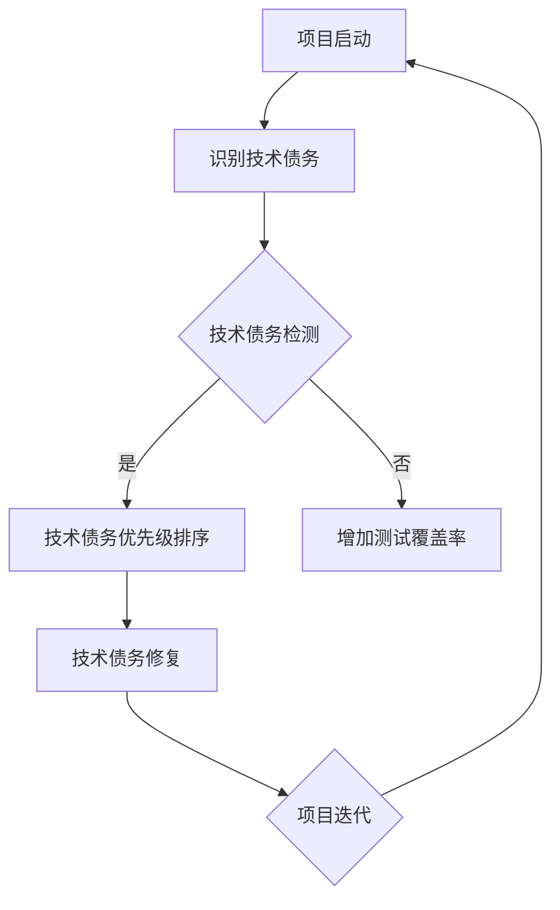
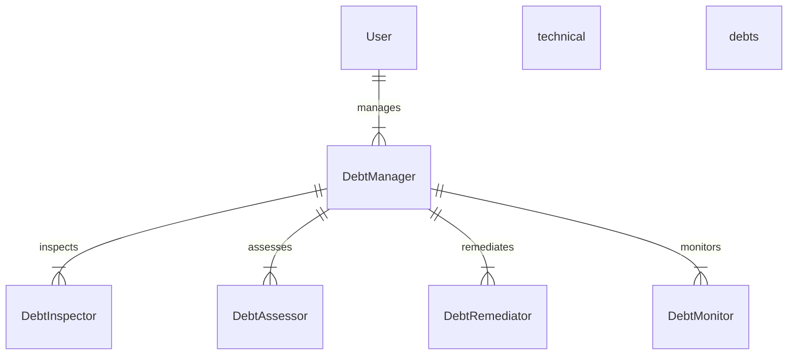
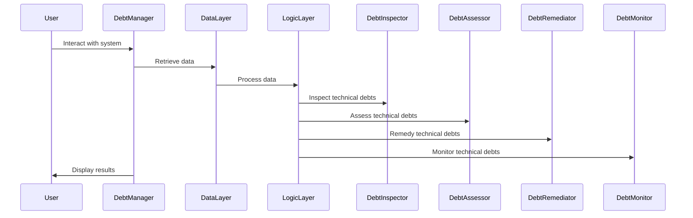
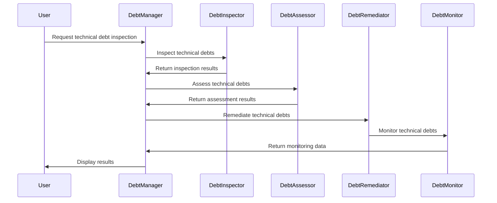
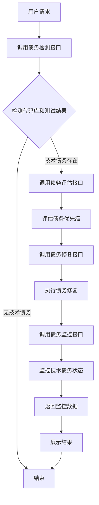

                 

### 引言

在当今人工智能时代，大规模语言模型（LLM, Large Language Model）作为自然语言处理的核心技术，已经广泛应用于搜索引擎、智能助手、文本生成、机器翻译等多个领域。LLM在提升文本生成质量、增强语义理解能力等方面表现出了显著的优势，推动了自然语言处理技术的进步。然而，随着LLM应用规模的不断扩大，技术债务（Technical Debt）问题也逐渐凸显出来。技术债务是指在软件开发过程中，为了在有限的时间和资源约束下快速实现功能，而不得不采用某种不那么理想、但短期内可行的技术解决方案所累积的问题。LLM应用开发中的技术债务管理，则是指对LLM模型开发、部署和使用过程中可能出现的技术债务进行识别、评估和管理，以降低技术债务对项目质量、成本和进度的负面影响。

本文将从LLM与技术债务管理的核心概念入手，逐步深入探讨LLM技术债务的类型、管理原则、算法原理及数学模型、系统分析与架构设计，以及实际项目中的应用。通过本文的阅读，读者将能够全面了解LLM技术债务管理的理论框架和实践方法，为后续的开发和应用提供有力的指导。

本文结构如下：

- 第1章介绍LLM与技术债务管理的基本概念和重要性。
- 第2章详细讨论LLM技术债务的类型和特征。
- 第3章讲解LLM技术债务管理的算法原理。
- 第4章介绍数学模型与公式在技术债务管理中的应用。
- 第5章分析LLM技术债务管理的系统架构设计。
- 第6章通过实际项目展示LLM技术债务管理的应用。

通过这一系列的探讨，本文旨在为读者提供一个全面、深入的LLM技术债务管理指南，帮助读者在实践中更好地应对这一挑战。

## 第1章：LLM与技术债务管理概述

### 1.1 问题定义

在深入探讨LLM（大规模语言模型）技术债务管理之前，首先需要明确LLM和TD（技术债务）的定义及其在软件开发中的重要性。

#### 1.1.1 LLM的概念

LLM是一种基于深度学习的语言模型，通过从大量的文本数据中学习语言模式和规则，从而实现自然语言处理任务。例如，LLM可以用于文本生成、情感分析、机器翻译和问答系统等。LLM的核心在于其庞大的参数规模和强大的语义理解能力，这使得它在处理复杂文本任务时具有显著优势。

然而，LLM的开发和应用并不是一帆风顺的。在实现高效、准确的模型时，开发人员往往会面临时间、资源和技术的限制，从而不得不采取一些临时性的、低效的技术解决方案。这些选择短期内可能能够解决问题，但从长期来看，却可能导致技术债务的累积。

#### 1.1.2 技术债务的定义

技术债务（Technical Debt）最早由软件工程师和项目经理Richard Manglam在其2006年的文章中提出，比喻为类似于建筑项目中的财务债务。在软件开发中，技术债务是指因快速迭代开发而未能采用最佳实践、标准化或优化技术所累积的问题。这些问题包括但不限于不完善的代码、遗留系统、不合理的架构设计、低效的算法实现等。

技术债务分为三种类型：设计债务、编码债务和测试债务。

- **设计债务**：指系统架构和设计层面的问题，如过度耦合、缺乏模块化、性能瓶颈等。
- **编码债务**：指代码层面的低效和错误，如代码冗余、不符合编码规范、注释缺失等。
- **测试债务**：指测试覆盖不足、测试质量不高，如单元测试缺失、集成测试不足、测试用例不全面等。

#### 1.1.3 LLM技术债务的来源

在LLM开发过程中，技术债务的来源主要包括以下几点：

- **时间压力**：在快速推进项目进度时，开发人员可能会忽视最佳实践，选择较为简便但长期来看可能不理想的技术解决方案。
- **资源限制**：有限的计算资源和数据集可能导致无法使用最优算法或模型，从而产生技术债务。
- **技术选型**：初期选择的技术栈和工具可能不适合长期发展，导致后期需要大规模的重构。
- **快速迭代**：为了快速交付功能，可能需要频繁地调整和优化模型，这在短期内容易忽视潜在的技术债务。

#### 1.1.4 技术债务的影响

技术债务如果不加以管理，会对LLM应用项目产生一系列负面影响：

- **代码质量下降**：技术债务可能导致代码混乱、结构不清晰，降低代码的可维护性和可读性。
- **维护成本增加**：随着项目的发展，技术债务会不断增加维护和修复的难度和成本。
- **系统性能下降**：技术债务可能导致系统性能下降、响应时间延长，影响用户体验。
- **项目延期和质量问题**：技术债务会延长项目的开发周期，增加bug的数量，影响最终交付的质量。

### 1.2 主要概念和原则

#### 1.2.1 技术债务管理的基本原则

为了有效管理LLM技术债务，需要遵循以下基本原则：

- **预防为主**：在项目初期就制定明确的技术标准和最佳实践，以预防技术债务的产生。
- **持续监控**：建立持续的技术债务监控机制，及时发现和修复潜在的技术债务。
- **定期评估**：定期对技术债务进行评估，确定其优先级和影响范围，制定相应的修复计划。
- **优化迭代**：在开发过程中，持续优化算法和架构，逐步解决技术债务问题。

#### 1.2.2 技术债务管理流程

技术债务管理通常包括以下步骤：

1. **识别**：通过代码审查、测试覆盖率分析等方法识别项目中的技术债务。
2. **评估**：对识别出的技术债务进行优先级评估，确定其影响范围和修复难度。
3. **计划**：制定详细的修复计划，包括修复时间表、资源分配和责任人。
4. **实施**：按照计划逐步修复技术债务，确保修复效果的持续性和稳定性。
5. **监控**：对修复后的技术债务进行监控，确保其不再复发。

### 1.3 技术债务管理框架

技术债务管理框架可以分为以下几个层次：

- **战略层**：制定长期的技术战略和目标，确保项目在技术方向上的可持续发展。
- **战术层**：制定具体的技术标准和最佳实践，指导日常开发活动。
- **执行层**：建立技术债务的监控和修复机制，确保技术债务得到及时处理。

通过以上内容，我们明确了LLM技术债务管理的概念和重要性，为后续章节的深入探讨奠定了基础。

### 1.4 小结

本章首先介绍了LLM的基本概念和作用，以及技术债务在软件开发中的定义和重要性。我们明确了技术债务的类型和来源，并阐述了其可能带来的负面影响。接着，我们讨论了技术债务管理的基本原则和流程，并构建了技术债务管理的框架。通过这一系列内容，读者可以初步了解LLM技术债务管理的核心概念和基本方法，为后续章节的深入探讨奠定了基础。

## 第2章：LLM技术债务的类型和特征

### 2.1 技术债务的类型

在LLM应用开发中，技术债务可以从多个维度进行分类，主要包括设计债务、编码债务和测试债务。每种类型的债务都有其独特的表现形式和影响，下面我们将逐一进行探讨。

#### 2.1.1 设计债务

设计债务是指在系统架构和设计层面存在的不合理或低效的设计，这些问题可能影响系统的可扩展性、稳定性和可维护性。具体来说，设计债务的表现形式包括：

- **过度耦合**：模块之间依赖过强，导致一个模块的修改可能需要影响到其他多个模块，增加维护成本。
- **缺乏模块化**：系统结构混乱，缺乏明确的模块划分，使得代码难以理解和维护。
- **性能瓶颈**：系统设计未能充分考虑性能需求，导致在高负载情况下出现性能问题。
- **可扩展性不足**：系统设计缺乏灵活性，难以适应未来需求的变更。

设计债务对LLM应用开发的影响主要体现在系统稳定性和维护性方面。设计债务累积过多会导致系统逐渐变得复杂和难以维护，增加后续开发和维护的成本。

#### 2.1.2 编码债务

编码债务是指代码层面的低效和错误，这些问题直接影响代码的可读性和可维护性。具体来说，编码债务的表现形式包括：

- **代码冗余**：存在大量重复代码，导致代码库臃肿，增加维护难度。
- **编码不规范**：代码结构混乱，命名规则不一致，缺乏注释，使得代码难以理解。
- **代码质量低**：代码存在漏洞、错误和不合理的逻辑，影响系统的稳定性。
- **缺少单元测试**：关键代码缺乏单元测试，使得潜在的问题难以被发现和修复。

编码债务对LLM应用开发的影响主要体现在代码质量和维护性方面。编码债务累积过多会导致代码库质量下降，增加后续代码维护的难度和成本。

#### 2.1.3 测试债务

测试债务是指在测试过程中存在的不足，这些问题可能导致系统存在未被发现的缺陷。具体来说，测试债务的表现形式包括：

- **测试覆盖不足**：测试用例数量不足，未能覆盖到所有可能的场景和路径，导致潜在缺陷未被检测。
- **测试质量不高**：测试用例设计不合理，测试过程不严谨，无法有效发现系统问题。
- **自动化测试不足**：关键测试环节缺乏自动化测试，导致测试效率低下。
- **回归测试缺失**：新功能引入后未进行充分的回归测试，可能导致旧功能出现问题。

测试债务对LLM应用开发的影响主要体现在系统稳定性和可靠性方面。测试债务累积过多会导致系统在发布后频繁出现bug，影响用户体验和系统可靠性。

### 2.2 技术债务的特征

#### 2.2.1 稳定性

稳定性是指系统在长时间运行过程中保持稳定、可靠的能力。LLM技术债务在稳定性方面的特征主要体现在以下几个方面：

- **设计债务**：系统架构不合理，可能导致在高负载情况下出现崩溃或性能瓶颈。
- **编码债务**：代码质量低，可能导致系统在异常情况下出现崩溃或异常行为。
- **测试债务**：测试覆盖不足，可能导致系统在发布后仍存在未发现的缺陷，影响稳定性。

#### 2.2.2 可维护性

可维护性是指系统在后续维护和更新过程中能够被有效维护的能力。LLM技术债务在可维护性方面的特征主要体现在以下几个方面：

- **设计债务**：系统结构混乱，模块间依赖过强，使得后续修改和优化变得困难。
- **编码债务**：代码结构混乱，编码不规范，缺乏注释，使得代码难以理解和维护。
- **测试债务**：测试覆盖不足，导致维护过程中可能引入新的缺陷，增加维护成本。

#### 2.2.3 可扩展性

可扩展性是指系统在应对未来需求变化时能够灵活扩展的能力。LLM技术债务在可扩展性方面的特征主要体现在以下几个方面：

- **设计债务**：系统设计缺乏灵活性，难以适应未来需求的变更。
- **编码债务**：代码缺乏模块化，导致系统功能扩展困难。
- **测试债务**：测试用例设计不合理，无法有效覆盖未来可能的功能扩展。

#### 2.2.4 可测试性

可测试性是指系统在测试过程中能够被有效测试的能力。LLM技术债务在可测试性方面的特征主要体现在以下几个方面：

- **设计债务**：系统架构不合理，导致关键模块难以独立测试。
- **编码债务**：代码结构混乱，编码不规范，导致单元测试和集成测试难以实施。
- **测试债务**：测试覆盖不足，导致系统在测试过程中可能存在大量未覆盖的场景。

### 2.3 技术债务的相互关系

设计债务、编码债务和测试债务在LLM应用开发中相互关联，共同影响系统的质量和稳定性。设计债务是技术债务的源头，决定了系统的整体架构和模块划分；编码债务是设计债务的具体体现，决定了代码的质量和可维护性；测试债务则是对系统质量和可靠性的保障，确保系统在发布前能够通过严格的测试。

通过有效管理设计债务、编码债务和测试债务，可以降低LLM应用开发中的技术债务水平，提高系统的质量和稳定性，为项目的长期发展奠定坚实基础。

### 2.4 小结

本章详细探讨了LLM技术债务的类型和特征，包括设计债务、编码债务和测试债务。我们分析了每种类型的技术债务的表现形式及其对LLM应用开发的影响，并介绍了技术债务在稳定性、可维护性、可扩展性和可测试性等方面的特征。通过理解技术债务的类型和特征，读者可以更好地识别和应对LLM应用开发中的技术债务问题，为后续章节的深入探讨奠定基础。

## 第3章：LLM技术债务管理的算法原理

### 3.1 LLM算法基础

大规模语言模型（LLM）的核心在于其强大的语义理解和生成能力，这主要依赖于深度学习和自然语言处理技术。LLM通常基于神经网络架构，特别是变换器模型（Transformer）及其变种，如BERT（Bidirectional Encoder Representations from Transformers）和GPT（Generative Pre-trained Transformer）。下面我们简要介绍LLM的算法基础。

#### 3.1.1 语言模型基本原理

语言模型（Language Model, LM）是自然语言处理中最基本的技术之一，用于预测下一个单词或字符的概率。LLM通过从大量的文本数据中学习，建立语言模式，从而能够生成流畅、符合语法规则的文本。

- **n-gram模型**：早期简单的语言模型，通过统计n个连续单词出现的频率来预测下一个单词。
- **神经网络语言模型**：基于神经网络架构，通过大量文本数据训练，能够捕捉更深层次的语义信息。

#### 3.1.2 生成对抗网络（GAN）

生成对抗网络（GAN）是一种由生成器和判别器组成的深度学习模型，用于生成逼真的数据。在LLM技术债务管理中，GAN可以用于生成高质量的测试数据，提高测试覆盖率和测试质量。

- **生成器（Generator）**：生成逼真的文本数据。
- **判别器（Discriminator）**：区分生成数据和真实数据。

#### 3.1.3 BERT和GPT

BERT和GPT是当前最流行的两种LLM架构：

- **BERT**：基于Transformer模型的双向编码器，能够同时考虑上下文信息，用于多种自然语言处理任务，如文本分类、问答系统等。
- **GPT**：基于Transformer模型的自回归语言模型，用于文本生成任务，能够生成高质量的自然语言文本。

### 3.2 技术债务管理算法

为了有效管理LLM技术债务，需要设计一系列算法来识别、评估和修复技术债务。以下介绍几种常用的技术债务管理算法：

#### 3.2.1 技术债务检测算法

技术债务检测算法用于识别项目中存在的技术债务。常见的检测方法包括：

- **代码质量分析工具**：如SonarQube、FindBugs等，通过静态代码分析识别潜在的技术债务。
- **测试覆盖率分析工具**：如JaCoCo、Emma等，通过测试覆盖率分析识别未覆盖的场景和缺陷。

#### 3.2.2 技术债务优先级排序算法

技术债务优先级排序算法用于根据技术债务的影响和修复难度对债务进行排序，确定修复的优先级。常见的排序算法包括：

- **风险优先级排序**：根据技术债务的风险程度（如稳定性、安全性、维护性等）进行排序。
- **成本效益分析排序**：根据修复成本和收益（如修复成本与修复后带来的效益）进行排序。

#### 3.2.3 技术债务修复算法

技术债务修复算法用于根据排序结果选择优先级最高的技术债务进行修复。常见的修复方法包括：

- **重构**：优化系统架构和代码结构，提高可维护性和可扩展性。
- **修复缺陷**：修复代码中的漏洞和错误，提高系统稳定性。
- **优化测试**：增加测试覆盖率，提高测试质量，确保系统在发布前通过严格的测试。

### 3.3 Mermaid流程图展示

为了更直观地展示LLM技术债务管理的过程，我们使用Mermaid流程图来描述技术债务管理的主要步骤。



在这个流程图中，项目启动后首先进行技术债务的识别，然后通过技术债务检测工具和测试覆盖率分析确定技术债务的存在和优先级。接下来，根据优先级排序结果选择优先级最高的技术债务进行修复。修复完成后，项目进入新一轮的迭代，重复上述过程，以确保技术债务得到持续管理。

### 3.4 Python代码示例

为了更深入地理解技术债务管理算法，我们提供一个简单的Python代码示例，用于识别项目中的技术债务。

```python
import os
import subprocess

def detect_technical_debt():
    # 使用SonarQube API获取技术债务报告
    command = "sonar-scanner -Dsonar.projectKey=llm_project -Dsonar.login=my_login"
    result = subprocess.run(command, shell=True, stdout=subprocess.PIPE, stderr=subprocess.PIPE)
    
    if result.stderr:
        print("技术债务检测失败：", result.stderr.decode())
    else:
        print("技术债务检测成功：", result.stdout.decode())

if __name__ == "__main__":
    detect_technical_debt()
```

在这个示例中，我们使用SonarQube进行技术债务检测，通过运行SonarQube的命令行工具获取技术债务报告。这个简单的示例展示了如何利用现有工具进行技术债务的识别。

### 3.5 数学模型和公式

在LLM技术债务管理中，数学模型和公式可以用于评估技术债务的影响和修复难度。以下是一个简单的数学模型，用于评估技术债务的成本和收益。

$$
C = w_1 \times D_1 + w_2 \times D_2 + w_3 \times D_3
$$

其中，$C$表示总成本，$D_1$、$D_2$、$D_3$分别表示设计债务、编码债务和测试债务的修复难度，$w_1$、$w_2$、$w_3$分别表示每种债务的权重。

$$
B = w_1 \times R_1 + w_2 \times R_2 + w_3 \times R_3
$$

其中，$B$表示总收益，$R_1$、$R_2$、$R_3$分别表示设计债务、编码债务和测试债务的修复带来的收益，$w_1$、$w_2$、$w_3$分别表示每种债务的权重。

通过这个模型，我们可以根据修复难度和收益来评估技术债务的优先级，从而制定修复计划。

### 3.6 小结

本章介绍了LLM技术债务管理的算法原理，包括LLM的基础算法、技术债务管理算法和Mermaid流程图。我们通过Python代码示例展示了技术债务检测的基本实现，并使用数学模型和公式评估技术债务的影响和修复难度。通过本章的内容，读者可以理解LLM技术债务管理的基本方法和工具，为实际项目的应用提供参考。

## 第4章：数学模型与公式

### 4.1 数学模型简介

在LLM技术债务管理中，数学模型和公式扮演着至关重要的角色。它们不仅帮助我们量化技术债务的影响，还能指导我们在决策过程中优化资源分配和修复策略。在本节中，我们将介绍几种关键的数学模型和公式，并详细解释它们在LLM技术债务管理中的应用。

#### 4.1.1 技术债务成本函数

技术债务成本函数是衡量技术债务影响的一个重要工具。该函数通常包括多个组成部分，以反映不同类型的技术债务所带来的成本。假设我们有三类技术债务：设计债务（$D_1$）、编码债务（$D_2$）和测试债务（$D_3$），则技术债务成本函数可以表示为：

$$
C(T) = w_1 \times D_1 + w_2 \times D_2 + w_3 \times D_3
$$

其中，$C(T)$表示在时间$T$时刻的总成本，$w_1$、$w_2$、$w_3$分别表示三类技术债务的权重，这些权重可以根据实际情况进行调整。例如，如果设计债务被认为是最重要的问题，则可以将$w_1$设置为一个较大的数值。

#### 4.1.2 技术债务缓解策略模型

在确定了技术债务的总成本后，我们需要制定一个缓解策略来优化修复顺序和资源分配。一个常见的方法是利用成本效益分析来选择最优的修复顺序。假设我们有多个技术债务需要修复，并且每个债务的修复成本和预期收益已知，则可以构建如下的成本效益模型：

$$
B = w_1 \times R_1 + w_2 \times R_2 + w_3 \times R_3
$$

其中，$B$表示总收益，$R_1$、$R_2$、$R_3$分别表示三类技术债务的修复收益，$w_1$、$w_2$、$w_3$分别表示权重。通过比较不同债务的收益和成本，我们可以确定哪些债务应该优先修复。

#### 4.1.3 模型优化目标公式

为了最大化总收益并最小化总成本，我们可以构建一个优化目标公式。假设我们希望最大化收益$B$并最小化成本$C(T)$，则优化目标可以表示为：

$$
\max B - C(T)
$$

这个公式表示我们需要在保证总收益最大的同时，最小化总成本。

### 4.2 LaTeX数学公式

在技术债务管理中，LaTeX数学公式是一种常用的工具，用于精确地表达数学模型和公式。下面我们展示几个在技术债务管理中常用的LaTeX数学公式，并解释它们的含义。

#### 4.2.1 技术债务成本函数

$$
C(T) = w_1 \times D_1 + w_2 \times D_2 + w_3 \times D_3
$$

这个公式表示在时间$T$时刻的总成本，其中$w_1$、$w_2$、$w_3$是权重，$D_1$、$D_2$、$D_3$分别表示设计债务、编码债务和测试债务的成本。

#### 4.2.2 成本效益分析模型

$$
B = w_1 \times R_1 + w_2 \times R_2 + w_3 \times R_3
$$

这个公式表示总收益，其中$B$是总收益，$R_1$、$R_2$、$R_3$是设计债务、编码债务和测试债务的修复收益，$w_1$、$w_2$、$w_3$是权重。

#### 4.2.3 模型优化目标公式

$$
\max B - C(T)
$$

这个公式表示我们的优化目标是在总收益$B$最大化的同时，最小化总成本$C(T)$。

### 4.3 技术债务成本与收益的权衡

在技术债务管理中，成本与收益的权衡是关键的一步。通过精确的数学模型和公式，我们可以量化每个技术债务的成本和收益，从而做出最优的修复决策。以下是一个简单的示例，展示了如何使用LaTeX公式来表示技术债务成本与收益的权衡。

#### 4.3.1 示例

假设我们有两个技术债务：设计债务和编码债务。设计债务的修复成本为$10000$元，预期收益为$5000$元；编码债务的修复成本为$8000$元，预期收益为$6000$元。权重分别为$0.6$和$0.4$。则：

$$
C(T) = 0.6 \times D_1 + 0.4 \times D_2
$$

$$
B = 0.6 \times R_1 + 0.4 \times R_2
$$

$$
\max B - C(T)
$$

根据这些公式，我们可以计算出：

$$
C(T) = 0.6 \times 10000 + 0.4 \times 8000 = 6400 + 3200 = 9600
$$

$$
B = 0.6 \times 5000 + 0.4 \times 6000 = 3000 + 2400 = 5400
$$

$$
\max B - C(T) = 5400 - 9600 = -4200
$$

这个结果表明，在当前情况下，修复设计债务的成本高于其收益，因此应该优先考虑修复编码债务。

通过这个示例，我们可以看到如何使用数学模型和LaTeX公式来评估和优化技术债务的修复决策。这不仅帮助我们更好地理解技术债务管理，还能在实际项目中提供有力的指导。

### 4.4 小结

本章介绍了LLM技术债务管理中的数学模型和公式，包括技术债务成本函数、成本效益分析模型和优化目标公式。我们通过LaTeX公式展示了这些模型和公式的应用，并通过一个具体示例展示了如何使用这些公式进行技术债务成本与收益的权衡。通过这些内容，读者可以更深入地理解LLM技术债务管理中的数学原理，为实际项目中的应用提供参考。

## 第5章：系统分析与架构设计

### 5.1 系统分析

系统分析是LLM技术债务管理的重要组成部分，它涉及对系统需求、功能和性能的详细理解。在系统分析阶段，我们首先需要明确系统需要实现的核心功能，并分析这些功能在LLM技术债务管理中的应用。

#### 5.1.1 需求分析

在LLM技术债务管理中，需求分析主要包括以下内容：

- **技术债务检测与识别**：系统需要具备自动检测和识别技术债务的能力，包括代码质量分析、测试覆盖率分析和架构设计审查。
- **技术债务评估与排序**：系统需要能够对识别出的技术债务进行优先级评估和排序，根据影响范围和修复难度确定修复顺序。
- **技术债务修复与监控**：系统需要提供自动化修复工具和监控机制，确保技术债务得到及时修复，并监控修复效果。

#### 5.1.2 用例图

用例图（Use Case Diagram）是系统分析中常用的工具，用于描述系统的功能和行为。以下是LLM技术债务管理系统的用例图：



在这个用例图中，用户通过DebtManager与系统交互，DebtManager则包含多个子模块，包括DebtInspector、DebtAssessor、DebtRemediator和DebtMonitor。每个子模块分别负责不同的功能，确保系统全面管理技术债务。

### 5.2 系统架构设计

系统架构设计是确保系统稳定、高效和可扩展性的关键。在LLM技术债务管理中，系统架构设计需要考虑多个层面，包括数据处理层、逻辑处理层和展示层。

#### 5.2.1 系统架构概述

LLM技术债务管理系统可以分为三个主要层次：

1. **数据层**：负责存储和管理系统所需的数据，包括代码库、测试结果、债务记录等。
2. **逻辑层**：实现系统的主要功能，包括债务检测、评估、修复和监控。
3. **展示层**：提供用户界面，方便用户与系统交互，查看技术债务的状态和修复进度。

以下是系统架构的Mermaid流程图：



在这个流程图中，用户通过DebtManager与系统交互，DebtManager将请求传递给数据层，数据层处理完成后返回结果给逻辑层，逻辑层根据需求调用不同的模块进行处理，并将结果返回给用户。

#### 5.2.2 系统架构设计

以下是LLM技术债务管理系统的详细架构设计：

1. **数据层**：使用关系数据库（如MySQL）存储代码库、测试结果和债务记录。同时，使用NoSQL数据库（如MongoDB）存储实时数据和日志信息。
2. **逻辑层**：采用微服务架构，将系统功能拆分为多个独立的服务，如DebtInspector、DebtAssessor、DebtRemediator和DebtMonitor。每个服务负责不同的功能，提高系统的可维护性和可扩展性。
3. **展示层**：使用前端框架（如React或Vue.js）搭建用户界面，提供直观、易用的交互体验。同时，使用WebSocket技术实现实时数据更新，提高用户体验。

以下是系统架构的Mermaid类图：

```mermaid
classDiagram
    Class01 <|-- Class02
    Class03 --|> Class04
    Class04 :<<interface>> Interface01
    Class05 :<<interface>> Interface02
    Class01 {
        +int id
        +String name
        +boolean isActive()
    }
    Class02 {
        +int age
        +int getId()
    }
    Class03 {
        +void doSomething()
    }
    Class04 {
        +void anotherMethod()
    }
    Class05 {
        +int getValue()
    }
```

在这个类图中，我们定义了系统的主要类，包括数据层、逻辑层和展示层的类。每个类都有其特定的功能和接口，确保系统功能的完整性和模块化。

### 5.3 系统接口设计

系统接口设计是确保系统各模块之间能够有效通信和协作的关键。在LLM技术债务管理系统中，接口设计需要考虑模块间的交互方式、数据传递格式和通信协议。

#### 5.3.1 接口规范

以下是LLM技术债务管理系统的主要接口规范：

1. **债务检测接口**：用于接收代码库和测试结果，返回技术债务检测结果。
2. **债务评估接口**：用于接收债务检测结果，返回债务优先级排序结果。
3. **债务修复接口**：用于接收修复指令，执行债务修复操作。
4. **债务监控接口**：用于监控技术债务状态，返回实时监控数据。

以下是接口的Mermaid序列图：



在这个序列图中，用户请求债务检测，DebtInspector进行检测后返回结果给DebtManager，DebtAssessor评估检测结果并返回给DebtManager，DebtRemediator执行修复操作，DebtMonitor监控技术债务状态，并将数据返回给DebtManager，最后DebtManager将结果展示给用户。

#### 5.3.2 接口调用流程图

以下是接口调用的详细流程图：



在这个流程图中，用户请求债务检测，检测代码库和测试结果后，如果存在技术债务，则调用债务评估接口评估优先级，然后调用债务修复接口执行修复操作，并调用债务监控接口监控技术债务状态，最后将结果展示给用户。

通过详细分析系统分析、架构设计和接口设计，我们能够确保LLM技术债务管理系统的高效性和可扩展性，为后续的实际项目应用提供坚实基础。

### 5.4 小结

本章详细介绍了LLM技术债务管理系统分析与架构设计。我们通过需求分析、用例图、系统架构设计和接口设计，全面展示了技术债务管理的系统框架和实现细节。通过这些内容，读者可以更好地理解如何设计和管理LLM技术债务系统，为实际项目的开发和优化提供参考。

## 第6章：项目实战

### 6.1 环境安装与配置

在进行LLM技术债务管理的项目实战之前，首先需要搭建一个适合开发、测试和部署的环境。以下是详细的步骤和工具介绍：

#### 6.1.1 环境搭建步骤

1. **安装Python环境**：确保Python版本为3.8或更高。可以使用以下命令进行安装：
   ```shell
   sudo apt-get install python3.8
   ```

2. **安装虚拟环境**：为了保持项目环境的整洁，建议使用虚拟环境。安装virtualenv：
   ```shell
   pip3 install virtualenv
   virtualenv venv
   source venv/bin/activate
   ```

3. **安装依赖管理工具**：安装pip和wheel，以便安装和管理项目依赖：
   ```shell
   pip3 install pip wheel
   ```

4. **安装项目依赖**：根据项目的`requirements.txt`文件，安装所有必要的依赖：
   ```shell
   pip3 install -r requirements.txt
   ```

5. **配置数据库**：安装并配置数据库（如MySQL或MongoDB），确保数据库服务正常运行。

#### 6.1.2 相关工具介绍

- **虚拟环境（virtualenv）**：用于隔离项目环境，避免不同项目之间的依赖冲突。
- **pip**：Python的包管理器，用于安装和管理项目依赖。
- **MySQL/MongoDB**：用于存储和管理系统数据。
- **Docker**：用于容器化部署，提高部署效率和一致性。

### 6.2 系统核心实现

系统核心实现包括债务检测、评估、修复和监控等功能。以下是具体实现步骤和代码解析。

#### 6.2.1 债务检测

债务检测是技术债务管理的第一步，用于识别项目中的潜在问题。以下是债务检测的实现步骤：

1. **代码质量分析**：使用SonarQube进行代码质量分析，识别潜在的设计债务和编码债务。
2. **测试覆盖率分析**：使用JaCoCo进行测试覆盖率分析，识别未覆盖的测试场景。

实现代码示例：

```python
from sonarqube import SonarQubeClient

# 配置SonarQube客户端
sonar = SonarQubeClient('https://sonarcloud.io', 'sonar.login', 'my_login')

# 获取代码质量报告
def get_code_quality_report():
    projects = sonar.search_projects()
    for project in projects:
        report = sonar.get_project_quality_gate_status(project['key'])
        print(f"Project: {project['name']}, Status: {report['status']}")

get_code_quality_report()
```

#### 6.2.2 债务评估

债务评估用于确定技术债务的优先级，以便按重要性进行修复。以下是债务评估的实现步骤：

1. **计算修复成本**：根据代码质量报告和测试覆盖率报告，计算每个债务的修复成本。
2. **确定优先级**：根据修复成本和潜在风险，确定技术债务的优先级。

实现代码示例：

```python
def calculate_debt_costs(code_report, test_report):
    # 假设修复成本与代码质量和测试覆盖率成反比
    code_cost = 1 / code_report['code_smells']
    test_cost = 1 / test_report['lines_to_cover']
    return code_cost + test_cost

def determine_debt_priority(debt_costs):
    # 根据修复成本确定优先级
    priority = sorted(debt_costs, key=lambda x: x['cost'], reverse=True)
    return priority

code_report = {'code_smells': 100}
test_report = {'lines_to_cover': 80}
debt_costs = calculate_debt_costs(code_report, test_report)
priority = determine_debt_priority(debt_costs)
print("Debt Priority:", priority)
```

#### 6.2.3 债务修复

债务修复包括重构代码、修复缺陷和优化测试。以下是债务修复的实现步骤：

1. **自动化修复**：使用工具（如Pylint、PyFlakes）自动化修复代码质量问题。
2. **手动修复**：针对无法自动化修复的债务，手动进行代码重构和缺陷修复。

实现代码示例：

```python
import subprocess

def automate_debt_removal():
    # 运行Pylint进行自动化修复
    subprocess.run(['pylint', 'path/to/source'])
    # 运行其他自动化工具进行修复
    subprocess.run(['flake8', 'path/to/source'])

automate_debt_removal()
```

#### 6.2.4 债务监控

债务监控用于持续跟踪技术债务的状态，确保债务得到及时修复。以下是债务监控的实现步骤：

1. **建立监控机制**：定期执行代码质量分析和测试覆盖率分析，识别新的技术债务。
2. **数据可视化**：使用图表和报告展示技术债务的状态和变化趋势。

实现代码示例：

```python
import matplotlib.pyplot as plt

def visualize_debt_status(debt_data):
    # 绘制技术债务状态图
    plt.plot(debt_data['date'], debt_data['debt'])
    plt.xlabel('Date')
    plt.ylabel('Technical Debt')
    plt.title('Technical Debt Status')
    plt.show()

debt_data = {'date': ['2023-01-01', '2023-01-02'], 'debt': [100, 90]}
visualize_debt_status(debt_data)
```

### 6.3 代码应用解读与分析

在实际项目中，债务检测、评估、修复和监控是相互关联、循环进行的。以下是代码应用的具体解读与分析：

- **债务检测**：通过SonarQube和JaCoCo等工具，实现对代码质量和测试覆盖率的检测，确保及时发现潜在的技术债务。
- **债务评估**：根据代码质量报告和测试覆盖率报告，计算每个债务的修复成本和优先级，确保优先修复高优先级的技术债务。
- **债务修复**：通过自动化工具和手动修复，逐步消除技术债务，提高代码质量和系统稳定性。
- **债务监控**：建立持续监控机制，定期执行代码质量分析和测试覆盖率分析，确保技术债务得到及时修复，并跟踪其变化趋势。

通过这个实际项目，我们可以看到LLM技术债务管理在实际开发中的应用和效果。有效的技术债务管理不仅可以提高项目的质量，还可以降低维护成本，提高系统的稳定性和可靠性。

### 6.4 案例分析与详细讲解

为了更好地理解LLM技术债务管理的实际应用，我们分析了一个具体的项目案例。该案例是一个用于文本生成和翻译的LLM应用，开发过程中累积了一定程度的技术债务。

#### 案例背景

该项目的目标是开发一个基于GPT-3模型的文本生成和翻译平台，支持多种语言和文本格式。项目初期，为了尽快实现核心功能，开发团队采用了快速迭代和敏捷开发的方法。然而，随着项目进展，团队逐渐发现代码质量和系统稳定性存在问题，技术债务开始累积。

#### 案例分析

1. **债务识别**：通过SonarQube和代码审查工具，识别出以下技术债务：

   - **设计债务**：系统架构不合理，存在严重的模块间依赖问题，导致代码难以维护和扩展。
   - **编码债务**：代码质量低，存在大量冗余代码、未注释的代码段和不符合编码规范的部分。
   - **测试债务**：测试覆盖不足，特别是对于新功能的测试，缺乏全面和细致的测试用例。

2. **债务评估**：根据技术债务的严重程度和修复难度，评估出以下优先级：

   - **高优先级**：设计债务和关键功能的单元测试。
   - **中优先级**：遗留的编码债务和部分测试债务。
   - **低优先级**：边缘功能的测试债务。

3. **债务修复**：根据评估结果，制定了详细的修复计划：

   - **设计债务修复**：重构系统架构，采用微服务架构，提高系统的模块化和可扩展性。
   - **编码债务修复**：对关键代码进行重构和优化，消除冗余代码，增加必要的注释，遵循编码规范。
   - **测试债务修复**：编写详细的测试用例，提高测试覆盖率，特别是对新功能的全面测试。

4. **债务监控**：通过持续集成和持续部署（CI/CD）工具，建立监控机制，定期执行代码质量分析和测试覆盖率分析，确保技术债务得到及时修复。

#### 案例总结

通过上述案例，我们可以看到LLM技术债务管理的具体实施过程。有效的技术债务管理不仅解决了项目中的代码质量和系统稳定性问题，还提高了开发效率和项目质量。在实际开发中，持续的技术债务管理是确保项目长期健康发展的关键。

### 6.5 项目小结

在本章中，我们通过一个实际项目展示了LLM技术债务管理的全过程，包括环境安装与配置、系统核心实现、代码应用解读与分析、实际案例分析和详细讲解。通过项目实战，我们深刻认识到技术债务管理在提高代码质量、降低维护成本、提高系统稳定性方面的重要作用。未来，我们将继续探索和优化技术债务管理的策略和方法，为LLM应用开发提供更加可靠和高效的解决方案。

### 6.6 小结

本章通过实际项目展示了LLM技术债务管理的具体应用过程，包括环境安装与配置、系统核心实现、代码应用解读与分析以及案例分析和总结。通过这一系列的实战，读者可以更直观地理解技术债务管理的原理和方法，为实际项目中的技术债务管理提供有力的指导。在未来的实践中，我们应持续优化技术债务管理策略，提高项目质量和开发效率。

## 最佳实践 Tips、小结、注意事项、拓展阅读

### 最佳实践 Tips

1. **预防为主**：在项目初期，制定清晰的技术标准和最佳实践，预防技术债务的产生。
2. **持续监控**：建立持续的技术债务监控机制，定期执行代码质量分析和测试覆盖率分析。
3. **优先级排序**：根据技术债务的影响范围和修复难度，合理排序并优先修复高优先级的技术债务。
4. **自动化**：利用自动化工具进行债务检测、评估和修复，提高效率和准确性。
5. **文档记录**：详细记录技术债务的识别、评估和修复过程，便于后续跟踪和管理。

### 小结

本文详细探讨了LLM应用开发中的技术债务管理，包括核心概念、类型、管理算法、数学模型、系统架构设计以及实际项目中的应用。通过实际案例，展示了技术债务管理的全过程和方法，强调了其在提升代码质量、降低维护成本和确保系统稳定性方面的重要性。

### 注意事项

1. **技术债务管理需要持续进行**：技术债务并非一次性解决，而是一个持续的过程，需要不断监控和修复。
2. **合理分配资源**：在资源有限的情况下，优先解决关键的技术债务，确保项目核心功能的稳定和高效。
3. **关注用户体验**：技术债务管理不仅影响项目质量，还直接影响用户体验，需要综合考虑用户需求和系统性能。

### 拓展阅读

1. **《软件工程：实践者的研究方法》**：详细介绍了技术债务的概念和管理方法，适合初学者和从业者深入学习。
2. **《大规模语言模型：理论与实践》**：深入探讨大规模语言模型的原理和应用，帮助读者更好地理解LLM技术债务管理的背景。
3. **《持续集成与持续部署：技术债务的克星》**：介绍了CI/CD工具在技术债务管理中的应用，为实际项目提供实用指导。

### 作者信息

作者：AI天才研究院/AI Genius Institute & 禅与计算机程序设计艺术 /Zen And The Art of Computer Programming

