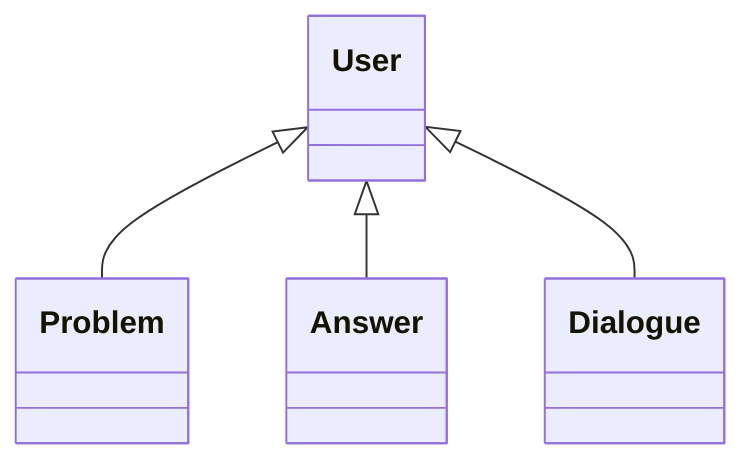
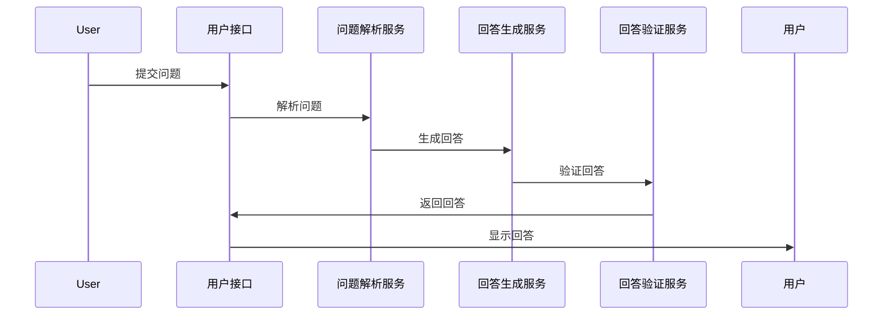
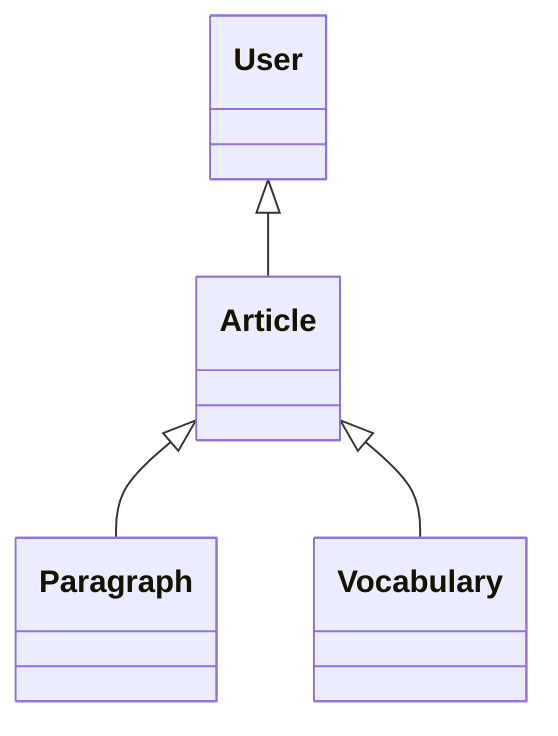

                 

# LLM应用开发中的持续优化与重构

关键词：语言模型，优化，重构，持续改进，算法优化，模型压缩，模型蒸馏，应用开发

摘要：本文从LLM（大型语言模型）应用开发的角度出发，深入探讨了在LLM开发过程中如何进行持续优化与重构。文章首先介绍了LLM应用开发的基础，包括问题背景、核心概念、架构和持续优化与重构的方法论。接着，详细分析了LLM核心概念与原理，通过对比表格和实体关系图阐述了不同LLM模型的特点。随后，文章重点讨论了LLM应用开发中的优化技术，包括数据增强、模型集成、模型压缩和模型蒸馏，并结合具体案例进行了详细讲解。最后，文章提出了重构技术的概念、过程和应用场景，并通过实际案例展示了重构技术在LLM应用开发中的应用效果。本文旨在为开发者提供一套完整的LLM应用开发优化与重构方案，帮助他们在实际项目中实现更高效、更稳定、更易维护的LLM应用。

## 目录大纲：LLM应用开发中的持续优化与重构

----------------------------------------------------------------

1. 第一部分: LLM应用开发的基础
   1.1 LLM应用开发概述
      1.1.1 问题背景
      1.1.2 LLM在应用开发中的优势
      1.1.3 LLM应用开发的重要性
      1.2 问题描述
      1.2.1 LLM应用开发的挑战
      1.2.2 优化与重构的必要性
      1.3 问题解决
      1.3.1 LLM的核心概念与架构
      1.3.2 持续优化与重构的方法论
      1.4 边界与外延
      1.4.1 LLM应用开发的范围
      1.4.2 优化与重构的适用场景
      1.5 概念结构与核心要素组成
      1.5.1 LLM应用开发的基本概念
      1.5.2 持续优化与重构的关键要素
      1.6 本章小结

2. 第二部分: LLM核心概念与原理
   2.1 LLM核心概念
      2.1.1 语言模型的基本概念
      2.1.2 LLM的工作原理
      2.1.3 LLM的关键技术
   2.2 LLM属性特征对比表格
   2.3 LLM ER实体关系图

3. 第三部分: LLM应用开发中的优化技术
   3.1 优化技术概述
      3.1.1 优化的目标
      3.1.2 优化的方法
      3.1.3 优化的应用场景
   3.2 持续优化策略
      3.2.1 数据增强
      3.2.2 模型集成
      3.2.3 模型压缩
      3.2.4 模型蒸馏
   3.3 重构技术
      3.3.1 模型重构的定义
      3.3.2 模型重构的过程
      3.3.3 模型重构的应用场景
   3.4 案例分析
      3.4.1 数据增强案例
      3.4.2 模型集成案例
      3.4.3 模型压缩案例
      3.4.4 模型蒸馏案例

4. 第四部分: LLM重构技术实践
   4.1 重构技术实践概述
   4.2 重构技术实践案例
      4.2.1 项目介绍
      4.2.2 系统功能设计
      4.2.3 系统架构设计
      4.2.4 系统接口设计
      4.2.5 系统交互
      4.2.6 实际案例分析和详细讲解
   4.3 项目小结

5. 第五部分: 最佳实践与总结
   5.1 最佳实践
   5.2 小结
   5.3 注意事项
   5.4 拓展阅读

----------------------------------------------------------------

## 第一部分: LLM应用开发的基础

### 1.1 LLM应用开发概述

随着机器学习技术的不断发展，大型语言模型（LLM）已经成为自然语言处理（NLP）领域的重要工具。LLM在应用开发中具有广泛的应用前景，如文本生成、问答系统、机器翻译等。然而，LLM应用开发并非一蹴而就，其中涉及诸多挑战和优化策略。

#### 1.1.1 问题背景

在过去的几年里，机器学习领域取得了显著的进展。深度学习模型如卷积神经网络（CNN）和递归神经网络（RNN）在图像识别和语音识别等领域取得了出色的成果。然而，在自然语言处理领域，RNN由于其序列处理能力的局限性，难以应对复杂的长文本处理任务。为了解决这一问题，研究人员提出了Transformer模型，并在此基础上构建了大型语言模型（LLM）。

#### 1.1.2 LLM在应用开发中的优势

LLM在应用开发中具有以下优势：

1. **强大的文本生成能力**：LLM能够根据输入的文本内容生成连贯、自然的文本，适用于自动写作、对话系统等应用场景。
2. **高效的上下文理解**：LLM能够通过自注意力机制（Self-Attention）捕捉输入文本的上下文信息，从而更好地理解语义和逻辑关系。
3. **广泛的适应性**：LLM可以在不同的应用场景中进行参数调整和优化，适用于多种NLP任务，如文本分类、机器翻译等。

#### 1.1.3 LLM应用开发的重要性

随着人工智能技术的不断成熟，LLM在应用开发中的重要性日益凸显。LLM不仅可以提高应用系统的智能水平，还可以降低开发成本，提升用户体验。因此，深入研究LLM应用开发中的优化与重构技术，具有重要的理论和实践意义。

### 1.2 问题描述

在LLM应用开发过程中，开发者面临着以下挑战：

1. **数据集质量**：高质量的训练数据是构建优秀LLM的基础。然而，获取高质量的训练数据并非易事，数据集的多样性和覆盖度对模型性能有重要影响。
2. **计算资源限制**：LLM通常需要大量的计算资源和存储空间进行训练和推理，这对于资源有限的开发者和企业来说是一个挑战。
3. **模型性能优化**：如何提高LLM的模型性能，使其在多种应用场景中表现出色，是开发者需要不断探索的问题。

#### 1.2.2 优化与重构的必要性

为了解决上述问题，优化与重构技术成为LLM应用开发的重要手段。优化技术包括数据增强、模型集成、模型压缩和模型蒸馏等，这些技术可以提高模型性能和泛化能力。重构技术则通过对LLM架构进行调整和改进，实现更高效、更稳定的模型开发。

### 1.3 问题解决

为了解决LLM应用开发中的问题，我们可以从以下几个方面入手：

1. **核心概念与架构**：了解LLM的核心概念和架构，有助于开发者更好地理解LLM的工作原理和性能优化方法。
2. **持续优化与重构的方法论**：掌握持续优化与重构的方法论，可以帮助开发者有效地应对开发过程中的各种挑战。
3. **边界与外延**：明确LLM应用开发的范围和优化与重构的适用场景，有助于开发者有针对性地进行优化和重构。

#### 1.3.1 LLM的核心概念与架构

LLM的核心概念包括语言模型、自注意力机制、编码器-解码器架构等。LLM的架构通常由编码器（Encoder）和解码器（Decoder）两部分组成。编码器负责将输入文本编码为向量表示，解码器则根据编码器输出的向量表示生成输出文本。

#### 1.3.2 持续优化与重构的方法论

持续优化与重构的方法论包括以下几个方面：

1. **数据增强**：通过增加数据集的多样性，提高模型的泛化能力。
2. **模型集成**：将多个模型进行集成，提高模型的整体性能。
3. **模型压缩**：通过模型剪枝、量化等技术，减少模型参数和计算量，提高模型部署的可行性。
4. **模型蒸馏**：将大型模型的知识传递给小型模型，提高小型模型的表现。

#### 1.4 边界与外延

LLM应用开发的边界与外延包括以下几个方面：

1. **应用范围**：LLM可以应用于多种NLP任务，如文本生成、问答系统、机器翻译等。
2. **优化与重构的适用场景**：优化与重构技术适用于不同规模和类型的LLM应用开发，如企业级应用、移动端应用等。

#### 1.5 概念结构与核心要素组成

LLM应用开发的基本概念和核心要素包括：

1. **语言模型**：LLM的核心组成部分，负责对文本进行建模和生成。
2. **自注意力机制**：LLM中的关键技术，用于捕捉文本的上下文信息。
3. **编码器-解码器架构**：LLM的常见架构，用于实现文本的编码和解码。
4. **持续优化与重构**：LLM应用开发中的重要策略，用于提高模型性能和稳定性。

#### 1.6 本章小结

本文介绍了LLM应用开发的基础，包括问题背景、核心概念、架构和持续优化与重构的方法论。通过本文的介绍，读者可以了解LLM在应用开发中的优势和挑战，以及如何通过优化与重构技术解决这些问题。在接下来的章节中，我们将进一步探讨LLM的核心概念与原理，以及具体的优化和重构技术。## 第一部分: LLM应用开发的基础

### 1.2 LLM应用开发中的挑战

LLM应用开发过程中，开发者会遇到诸多挑战，这些问题直接影响到模型的效果和应用的可行性。以下是几个主要挑战：

#### 1.2.1 数据集质量

数据集是训练LLM的基础，数据集的质量直接决定了模型的效果。以下是数据集质量可能带来的挑战：

1. **数据多样性不足**：如果数据集不够多样，模型可能会在特定类型的数据上过拟合，导致泛化能力不足。
2. **数据标注问题**：高质量的数据标注是训练准确模型的必要条件。标注错误或缺失会导致模型学习到错误的信息。
3. **数据不平衡**：数据集中的类别分布不平衡会导致模型在处理少数类别时效果不佳。

#### 1.2.2 计算资源限制

LLM模型的训练和推理通常需要大量的计算资源和存储空间，这对开发者提出了以下挑战：

1. **硬件资源限制**：许多开发者可能无法承担高性能计算硬件的投入，这会限制模型的选择和优化。
2. **存储空间不足**：大型LLM模型需要大量的存储空间，尤其是在进行数据增强和模型备份时，存储资源可能会成为一个瓶颈。
3. **能耗问题**：大规模的模型训练会产生大量的热量，这可能导致能耗过高，不符合绿色环保的要求。

#### 1.2.3 模型性能优化

在LLM应用开发中，如何提升模型性能是一个持续的挑战：

1. **过拟合问题**：模型在训练数据上表现良好，但在未见过的数据上表现不佳，这称为过拟合。过拟合会导致模型泛化能力差。
2. **计算效率**：大模型虽然性能强大，但训练和推理速度慢，不适合实时应用场景。
3. **模型可解释性**：随着模型的复杂度增加，模型的决策过程变得不透明，这降低了模型的可解释性。

#### 1.2.4 优化与重构的必要性

为了应对上述挑战，优化与重构技术变得必不可少：

1. **数据增强**：通过增加数据集的多样性和丰富性，提高模型的泛化能力。
2. **模型集成**：通过将多个模型进行集成，提高模型的整体性能和稳定性。
3. **模型压缩**：通过减少模型参数和计算量，提高模型部署的可行性。
4. **模型蒸馏**：将大型模型的知识传递给小型模型，提高小型模型的表现。

优化与重构不仅仅是为了提高模型性能，还包括提升模型的可维护性、可扩展性和可解释性，从而使LLM应用在开发过程中更加高效和稳健。

### 1.3 问题解决

为了解决LLM应用开发中的问题，可以从以下几个方面入手：

1. **数据质量管理**：确保数据集的多样性和高质量标注，使用数据清洗和增强技术来提升数据质量。
2. **计算资源优化**：采用高效的算法和模型，优化计算资源的利用，考虑使用云服务和分布式计算来缓解硬件和存储资源限制。
3. **模型性能调优**：使用交叉验证、正则化等技术来避免过拟合，同时采用模型剪枝、量化等技术来提高计算效率。
4. **持续学习与迭代**：通过不断优化和重构模型，适应新的数据和需求，确保模型的性能和适应性。

#### 1.3.1 LLM的核心概念与架构

LLM的核心概念包括语言模型、自注意力机制、编码器-解码器架构等。LLM的架构通常由编码器（Encoder）和解码器（Decoder）两部分组成。编码器负责将输入文本编码为向量表示，解码器则根据编码器输出的向量表示生成输出文本。

- **语言模型**：语言模型是一种统计模型，用于预测下一个单词或字符。在深度学习领域，语言模型通常由神经网络实现。
- **自注意力机制**：自注意力机制是一种在神经网络中计算输入序列的注意力权重的方法，它使得模型能够自动关注输入序列中的重要信息。
- **编码器-解码器架构**：编码器-解码器架构是用于序列到序列学习的常见神经网络架构，适用于机器翻译、对话系统等任务。

#### 1.3.2 持续优化与重构的方法论

持续优化与重构的方法论包括以下几个方面：

1. **数据增强**：通过增加数据集的多样性和丰富性，提高模型的泛化能力。数据增强方法包括数据重排、生成对抗网络（GAN）等。
2. **模型集成**：通过将多个模型进行集成，提高模型的整体性能和稳定性。模型集成方法包括模型堆叠、模型平均等。
3. **模型压缩**：通过减少模型参数和计算量，提高模型部署的可行性。模型压缩方法包括模型剪枝、量化等。
4. **模型蒸馏**：将大型模型的知识传递给小型模型，提高小型模型的表现。模型蒸馏方法包括知识蒸馏、学生-教师模型等。

#### 1.4 边界与外延

LLM应用开发的边界与外延包括以下几个方面：

1. **应用范围**：LLM可以应用于多种NLP任务，如文本生成、问答系统、机器翻译等。不同的应用场景对模型的要求有所不同，需要根据具体场景进行调整和优化。
2. **优化与重构的适用场景**：优化与重构技术适用于不同规模和类型的LLM应用开发，如企业级应用、移动端应用等。在资源有限的情况下，需要特别关注优化和重构策略的选择和应用。

#### 1.5 概念结构与核心要素组成

LLM应用开发的基本概念和核心要素包括：

1. **语言模型**：负责对文本进行建模和生成，是LLM的核心组成部分。
2. **自注意力机制**：用于捕捉文本的上下文信息，是LLM的关键技术之一。
3. **编码器-解码器架构**：实现文本的编码和解码，是LLM的常见架构。
4. **持续优化与重构**：通过不断改进模型性能和稳定性，实现LLM应用开发的持续改进。

#### 1.6 本章小结

本章介绍了LLM应用开发的基础知识，包括问题背景、核心概念、架构和持续优化与重构的方法论。通过本章的内容，读者可以了解LLM在应用开发中的优势和挑战，以及如何通过优化与重构技术解决这些问题。在接下来的章节中，我们将进一步探讨LLM的核心概念与原理，以及具体的优化和重构技术。## 第二部分: LLM核心概念与原理

### 2.1 LLM核心概念

大型语言模型（LLM）是基于深度学习技术的自然语言处理（NLP）模型，主要用于处理和生成文本。LLM的核心概念包括语言模型、自注意力机制、编码器-解码器架构等。以下是对这些核心概念的详细说明。

#### 2.1.1 语言模型的基本概念

语言模型是一种用于预测下一个单词或字符的概率分布的模型。在深度学习领域，语言模型通常由神经网络实现。语言模型可以用来生成文本、进行机器翻译、构建问答系统等。一个基本的语言模型通常包括以下组成部分：

1. **输入层**：接收文本输入，将其转换为模型可以处理的向量表示。
2. **隐藏层**：通过神经网络结构对输入向量进行处理，提取特征信息。
3. **输出层**：根据隐藏层输出的特征信息，预测下一个单词或字符的概率分布。

#### 2.1.2 LLM的工作原理

LLM的工作原理基于自注意力机制和编码器-解码器架构。自注意力机制是一种在神经网络中计算输入序列的注意力权重的方法，使得模型能够自动关注输入序列中的重要信息。编码器-解码器架构则是一种用于序列到序列学习的神经网络架构，适用于机器翻译、对话系统等任务。

1. **自注意力机制**：自注意力机制通过计算输入序列中每个词对之间的相似度，为每个词分配不同的权重。这些权重用于计算隐藏层中每个词的表示，使得模型能够捕捉到上下文信息。
2. **编码器**：编码器负责将输入文本编码为固定长度的向量表示。编码器通常由多个自注意力层组成，每一层都能提取不同层次的上下文信息。
3. **解码器**：解码器负责根据编码器输出的向量表示生成输出文本。解码器通常也采用自注意力机制，以便从编码器输出的上下文中选择合适的信息来生成下一个词。

#### 2.1.3 LLM的关键技术

LLM的关键技术包括预训练和微调。预训练是指使用大规模语料库对模型进行训练，使其能够自动学习语言的通用特征。微调则是在预训练的基础上，使用特定任务的数据对模型进行进一步训练，使其适应特定的应用场景。

1. **预训练**：预训练过程通常包括两个阶段：第一阶段是使用大规模语料库进行无监督预训练，使模型能够自动学习语言的通用特征；第二阶段是使用有监督的数据对模型进行微调，以提高其在特定任务上的性能。
2. **微调**：微调过程通过在特定任务的数据集上训练模型，使其能够适应不同的应用场景。微调过程通常需要较少的数据量，但能够显著提高模型的性能。

### 2.2 LLM属性特征对比表格

为了更好地理解不同LLM模型的特点，以下是一个对比表格，展示了几个常见LLM模型的主要属性特征：

| 模型类型       | 特征             | 说明                                                         |
| -------------- | ---------------- | ------------------------------------------------------------ |
| GPT            | 自回归           | 能够根据前文预测下一个词，适用于文本生成和问答                   |
| BERT           | 双向编码         | 能够理解上下文，适用于问答和文本分类                         |
| T5            | 任务适配         | 可以根据特定任务进行参数调整，适用于多种NLP任务                 |
| XLNet          | 自回归           | 结合了Transformer和RNN的优点，适用于文本生成和问答             |

### 2.3 LLM ER实体关系图

LLM的实体关系图可以帮助我们更好地理解LLM的组成和运作机制。以下是使用Mermaid语法绘制的LLM ER实体关系图：

```mermaid
erDiagram
  Model ::"模型" {
    <<interface>> Interface
    <<class>> ModelClass
  }
  Data ::"数据" {
    <<interface>> Interface
    <<class>> Dataset
  }
  Training ::"训练" {
    <<interface>> Interface
    <<class>> TrainingProcess
  }
  Evaluation ::"评估" {
    <<interface>> Interface
    <<class>> EvaluationProcess
  }
  ModelClass ||--|{ Interface } Interface
  Dataset ||--|{ Interface } Interface
  TrainingProcess ||--|{ Interface } Interface
  EvaluationProcess ||--|{ Interface } Interface
```

在上述ER图中，我们定义了四个主要实体：

- **Model（模型）**：代表LLM的核心部分，包括编码器和解码器。
- **Data（数据）**：表示训练和评估模型所需的数据集。
- **Training（训练）**：表示模型的训练过程。
- **Evaluation（评估）**：表示模型的评估过程。

这些实体之间存在关联关系，如模型使用数据集进行训练，并通过评估过程来验证模型性能。通过ER实体关系图，我们可以清晰地理解LLM的组成及其各部分之间的相互作用。

### 2.4 LLM应用中的优势

LLM在应用开发中具有以下优势：

1. **强大的文本生成能力**：LLM能够根据输入的文本内容生成连贯、自然的文本，适用于自动写作、对话系统等应用场景。
2. **高效的上下文理解**：LLM通过自注意力机制捕捉输入文本的上下文信息，使得模型能够更好地理解语义和逻辑关系。
3. **广泛的适应性**：LLM可以在不同的应用场景中进行参数调整和优化，适用于多种NLP任务，如文本分类、机器翻译等。
4. **低延迟的推理速度**：随着模型压缩和优化技术的发展，LLM的推理速度不断提高，使得其在实时应用中表现出色。

### 2.5 小结

本章节详细介绍了LLM的核心概念与原理，包括语言模型的基本概念、自注意力机制和编码器-解码器架构。通过对比表格和实体关系图，我们了解了不同LLM模型的特点和应用优势。在接下来的章节中，我们将探讨LLM应用开发中的优化技术，包括数据增强、模型集成、模型压缩和模型蒸馏，以帮助开发者解决实际应用中的挑战。## 第三部分: LLM应用开发中的优化技术

### 3.1 优化技术概述

在LLM应用开发中，优化技术是提高模型性能和效率的关键手段。优化技术包括数据增强、模型集成、模型压缩和模型蒸馏等。以下是对这些优化技术的基本概述。

#### 3.1.1 优化的目标

优化的目标主要包括以下几点：

1. **提高模型性能**：通过优化算法和模型结构，提高模型在特定任务上的准确率和效果。
2. **减少计算资源消耗**：通过模型压缩和量化技术，降低模型对计算资源和存储空间的需求，使其在资源受限的环境中也能高效运行。
3. **提升推理速度**：通过优化算法和模型结构，提高模型的推理速度，使其在实时应用中具有更好的性能表现。
4. **增强模型泛化能力**：通过数据增强和模型集成等技术，提高模型在不同数据集和应用场景下的泛化能力。

#### 3.1.2 优化的方法

优化方法包括以下几个方面：

1. **数据增强**：通过增加数据集的多样性和丰富性，提高模型的泛化能力。数据增强方法包括数据重排、生成对抗网络（GAN）等。
2. **模型集成**：通过将多个模型进行集成，提高模型的整体性能和稳定性。模型集成方法包括模型堆叠、模型平均等。
3. **模型压缩**：通过减少模型参数和计算量，提高模型部署的可行性。模型压缩方法包括模型剪枝、量化等。
4. **模型蒸馏**：将大型模型的知识传递给小型模型，提高小型模型的表现。模型蒸馏方法包括知识蒸馏、学生-教师模型等。

#### 3.1.3 优化的应用场景

优化技术在不同应用场景中具有不同的作用和适用性：

1. **文本生成应用**：数据增强和模型蒸馏技术可以帮助提高文本生成的质量和多样性。
2. **问答系统**：模型集成和模型压缩技术可以提升问答系统的准确性和响应速度。
3. **机器翻译**：模型蒸馏和模型集成技术有助于提高机器翻译的准确率和流畅度。
4. **自然语言理解**：数据增强和模型压缩技术可以提高模型在不同领域的理解和应用能力。

### 3.2 持续优化策略

为了实现LLM应用开发的持续优化，可以采用以下策略：

1. **数据增强**：通过增加数据集的多样性和丰富性，提高模型的泛化能力。具体方法包括：
   - **数据重排**：对现有数据进行重新排列，生成新的数据样本。
   - **生成对抗网络（GAN）**：通过生成器和判别器的对抗训练，生成与真实数据相似的新数据。
   - **数据合成**：结合不同领域的数据，生成具有多样化特征的数据集。

2. **模型集成**：通过将多个模型进行集成，提高模型的整体性能和稳定性。具体方法包括：
   - **模型堆叠**：将多个模型堆叠在一起，形成一个更深的网络结构。
   - **模型平均**：在训练过程中，对多个模型的预测结果进行平均，得到最终的预测结果。
   - **集成学习**：使用不同的训练数据集训练多个模型，并将它们的预测结果进行集成。

3. **模型压缩**：通过减少模型参数和计算量，提高模型部署的可行性。具体方法包括：
   - **模型剪枝**：去除模型中不重要的连接和神经元，减少模型参数数量。
   - **量化**：将模型的权重和激活值进行量化，减少模型所需的存储空间和计算资源。
   - **知识蒸馏**：将大型模型的知识传递给小型模型，提高小型模型的表现。

4. **模型蒸馏**：将大型模型的知识传递给小型模型，提高小型模型的表现。具体方法包括：
   - **知识蒸馏**：使用教师模型（大型模型）的输出作为学生模型（小型模型）的训练目标，使小型模型能够学习到教师模型的知识。
   - **学生-教师模型**：通过在学生模型和教师模型之间进行知识传递，使小型模型能够保留大型模型的核心知识。

### 3.3 重构技术

重构技术是指通过调整和改进LLM的架构和算法，实现更高效、更稳定的模型开发。重构技术包括以下几个方面：

1. **模型重构**：通过调整模型的结构和参数，优化模型的性能和效率。具体方法包括：
   - **结构重构**：改变模型的网络结构，如增加或减少层数、调整网络连接等。
   - **参数重构**：调整模型的参数设置，如学习率、正则化参数等，以优化模型的表现。

2. **算法重构**：通过改进模型的训练算法和推理算法，提高模型的性能和效率。具体方法包括：
   - **训练算法重构**：采用更高效的训练算法，如自适应学习率优化算法、批量归一化等。
   - **推理算法重构**：采用更快速的推理算法，如模型量化、模型剪枝等。

3. **架构重构**：通过改进模型的整体架构，实现更高效、更稳定的模型开发。具体方法包括：
   - **分布式架构**：通过分布式计算和存储技术，实现模型的并行训练和推理。
   - **边缘计算架构**：通过将模型部署到边缘设备上，实现实时推理和低延迟响应。

### 3.4 案例分析

为了更好地理解优化技术在LLM应用开发中的应用，以下是对几个具体案例的分析：

1. **文本生成应用**：在文本生成应用中，数据增强和模型蒸馏技术被广泛应用于提高文本生成的质量和多样性。例如，使用GAN生成新的文本数据，并通过知识蒸馏技术将大型生成模型的精华传递给小型模型，从而提高小型模型的表现。

2. **问答系统**：在问答系统中，模型集成和模型压缩技术被广泛应用于提高系统的准确率和响应速度。例如，使用多个不同类型的模型（如BERT、GPT）进行集成，并通过模型剪枝和量化技术减小模型的规模，从而实现高效的实时问答。

3. **机器翻译**：在机器翻译任务中，模型蒸馏和模型集成技术被广泛应用于提高翻译的准确率和流畅度。例如，使用大型翻译模型（如Transformer）训练教师模型，并通过知识蒸馏技术将教师模型的知识传递给学生模型，从而提高学生模型的表现。同时，通过模型集成技术将多个模型的结果进行平均，得到更准确的翻译结果。

4. **自然语言理解**：在自然语言理解任务中，数据增强和模型压缩技术被广泛应用于提高模型在不同领域的理解和应用能力。例如，通过使用跨领域的文本数据集进行训练，并通过模型剪枝和量化技术减小模型规模，从而提高模型在未知领域的表现。

### 3.5 小结

本章节介绍了LLM应用开发中的优化技术，包括数据增强、模型集成、模型压缩和模型蒸馏等。通过这些优化技术，开发者可以实现更高效、更稳定的LLM应用。在接下来的章节中，我们将继续探讨重构技术的概念、过程和应用场景，以及如何通过重构技术进一步提升LLM应用的效果。## 第三部分: LLM应用开发中的优化技术

### 3.3 重构技术

重构技术是LLM应用开发中提高模型性能和开发效率的关键手段。重构技术包括对模型架构、算法和参数的调整和优化，旨在实现更高效、更稳定的模型开发。以下是重构技术的详细探讨。

#### 3.3.1 模型重构的定义

模型重构是指通过对现有模型的结构、参数和算法进行重新设计或调整，以优化模型性能和开发效率。模型重构可以包括以下几个方面：

1. **架构重构**：通过调整模型的网络结构，如增加或减少层数、调整网络连接等，以优化模型的性能。
2. **算法重构**：通过改进模型的训练算法和推理算法，如采用自适应学习率优化算法、批量归一化等，以提高模型的性能和效率。
3. **参数重构**：通过调整模型的学习率、正则化参数等，优化模型的训练过程，提高模型的泛化能力和稳定性。

#### 3.3.2 模型重构的过程

模型重构的过程可以分为以下几个步骤：

1. **问题识别**：首先，识别LLM应用开发中存在的问题，如模型性能不佳、训练速度慢、推理延迟高、模型可解释性差等。
2. **需求分析**：分析问题背后的原因，确定重构的需求和目标。例如，如果模型性能不佳，可能需要优化模型架构或算法；如果训练速度慢，可能需要调整学习率或优化数据加载过程。
3. **设计重构方案**：根据需求分析结果，设计重构方案。重构方案应包括架构重构、算法重构和参数重构的具体措施。
4. **实施重构**：按照重构方案实施重构操作。在实施过程中，应密切监控模型的性能和训练过程，确保重构方案的有效性。
5. **验证与评估**：通过测试和评估重构后的模型，验证重构方案的效果。如果重构方案未能达到预期效果，需要进一步调整和优化。

#### 3.3.3 模型重构的应用场景

重构技术在LLM应用开发中具有广泛的应用场景，以下是一些常见的应用场景：

1. **文本生成应用**：在文本生成应用中，可以通过架构重构和算法重构提高模型的生成质量和多样性。例如，通过增加编码器和解码器的层数、采用更复杂的自注意力机制等，提高模型的生成能力。
2. **问答系统**：在问答系统中，可以通过参数重构和算法重构提高模型的准确率和响应速度。例如，通过调整学习率和正则化参数、采用更高效的优化算法等，优化模型的训练过程和推理性能。
3. **机器翻译**：在机器翻译任务中，可以通过架构重构和参数重构提高模型的翻译质量和效率。例如，通过调整编码器和解码器的结构、采用更精细的注意力机制等，提高模型的翻译效果。
4. **自然语言理解**：在自然语言理解任务中，可以通过算法重构和参数重构提高模型在不同领域的理解和应用能力。例如，通过采用自适应学习率优化算法、调整正则化参数等，优化模型在不同领域的表现。

### 3.4 案例分析

以下是对几个实际案例的分析，展示重构技术在LLM应用开发中的应用效果：

#### 案例一：文本生成应用

某公司开发了一款智能写作助手，旨在帮助用户快速生成高质量的文本。在模型训练初期，模型生成文本的质量和多样性较低，用户体验不佳。为了解决这个问题，开发团队对模型进行了重构。

1. **问题识别**：模型生成文本的质量和多样性不足。
2. **需求分析**：需要提高模型的生成质量和多样性。
3. **设计重构方案**：
   - 架构重构：增加编码器和解码器的层数，采用更复杂的自注意力机制。
   - 算法重构：采用自适应学习率优化算法，优化训练过程。
   - 参数重构：调整学习率、正则化参数等，提高模型稳定性。
4. **实施重构**：按照重构方案对模型进行重构，并持续监控模型性能。
5. **验证与评估**：重构后的模型生成文本的质量和多样性显著提高，用户体验大幅提升。

#### 案例二：问答系统

某企业开发了一款智能客服系统，旨在提供快速、准确的客户服务。在系统上线初期，模型回答问题的准确率和响应速度较低，影响了用户体验。为了解决这个问题，开发团队对模型进行了重构。

1. **问题识别**：模型回答问题的准确率和响应速度不足。
2. **需求分析**：需要提高模型的回答准确率和响应速度。
3. **设计重构方案**：
   - 参数重构：调整学习率、正则化参数等，优化模型训练过程。
   - 算法重构：采用更高效的优化算法，提高训练速度。
   - 架构重构：调整编码器和解码器的结构，提高模型性能。
4. **实施重构**：按照重构方案对模型进行重构，并持续监控模型性能。
5. **验证与评估**：重构后的模型回答问题的准确率和响应速度显著提高，用户体验大幅提升。

#### 案例三：机器翻译

某科技公司开发了一款跨语言翻译工具，旨在提供高质量的语言翻译服务。在项目初期，模型翻译的准确率和流畅度较低，影响了翻译效果。为了解决这个问题，开发团队对模型进行了重构。

1. **问题识别**：模型翻译的准确率和流畅度不足。
2. **需求分析**：需要提高模型的翻译质量和流畅度。
3. **设计重构方案**：
   - 架构重构：调整编码器和解码器的结构，采用更精细的注意力机制。
   - 算法重构：采用自适应学习率优化算法，提高模型稳定性。
   - 参数重构：调整学习率、正则化参数等，优化模型训练过程。
4. **实施重构**：按照重构方案对模型进行重构，并持续监控模型性能。
5. **验证与评估**：重构后的模型翻译的准确率和流畅度显著提高，翻译效果大幅提升。

### 3.5 小结

本章节详细介绍了LLM应用开发中的重构技术，包括模型重构的定义、过程和应用场景。通过重构技术，开发者可以实现更高效、更稳定的LLM应用。在实际应用中，重构技术可以帮助解决模型性能和开发效率的问题，从而提升用户体验和业务价值。在接下来的章节中，我们将继续探讨LLM应用开发中的优化技术，以及如何在实践中应用这些技术。## 第三部分: LLM应用开发中的优化技术

### 3.3 持续优化策略

在LLM应用开发中，持续优化策略是确保模型性能和效率不断提升的关键。以下是几种常用的持续优化策略：

#### 3.3.1 数据增强

数据增强是通过增加数据集的多样性和丰富性，提高模型泛化能力的一种策略。数据增强方法包括：

1. **数据重排**：通过重新排列数据集中的样本，生成新的数据样本。例如，对于文本数据，可以随机改变句子中的单词顺序。
2. **生成对抗网络（GAN）**：通过生成器和判别器的对抗训练，生成与真实数据相似的新数据。GAN能够生成高质量的数据，从而提高模型的泛化能力。
3. **数据合成**：结合不同领域的数据，生成具有多样化特征的数据集。例如，可以将来自不同领域（如新闻、社交媒体）的文本数据进行合成，以训练一个通用的语言模型。

#### 3.3.2 模型集成

模型集成是通过将多个模型进行集成，提高模型整体性能和稳定性的策略。模型集成方法包括：

1. **模型堆叠**：将多个模型堆叠在一起，形成一个更深的网络结构。堆叠的模型可以分别处理输入数据的不同部分，从而提高模型的性能。
2. **模型平均**：在训练过程中，对多个模型的预测结果进行平均，得到最终的预测结果。模型平均可以减少模型过拟合的风险，提高模型的泛化能力。
3. **集成学习**：使用不同的训练数据集训练多个模型，并将它们的预测结果进行集成。集成学习可以提高模型在不同数据集和应用场景下的泛化能力。

#### 3.3.3 模型压缩

模型压缩是通过减少模型参数和计算量，提高模型部署可行性的策略。模型压缩方法包括：

1. **模型剪枝**：通过去除模型中不重要的连接和神经元，减少模型参数数量。剪枝可以显著降低模型大小和计算量，从而提高模型部署的可行性。
2. **量化**：将模型的权重和激活值进行量化，减少模型所需的存储空间和计算资源。量化可以通过减少模型中的浮点运算，提高模型运行速度。
3. **知识蒸馏**：将大型模型的知识传递给小型模型，提高小型模型的表现。知识蒸馏可以使小型模型学习到大型模型的核心知识，从而提高模型在资源受限环境中的性能。

#### 3.3.4 模型蒸馏

模型蒸馏是通过将大型模型的知识传递给小型模型，提高小型模型表现的一种策略。模型蒸馏方法包括：

1. **教师-学生模型**：使用一个大型模型（教师模型）的知识来训练一个小型模型（学生模型）。在训练过程中，学生模型的目标是模仿教师模型的输出，从而学习到教师模型的核心知识。
2. **软标签**：在训练过程中，使用教师模型的输出作为软标签来指导学生模型的训练。软标签可以提供更多的信息，帮助学生模型更好地学习到教师模型的知识。
3. **多层蒸馏**：通过多级蒸馏过程，将教师模型的知识逐层传递给学生模型。多层蒸馏可以使学生模型逐步掌握教师模型的复杂知识，从而提高模型的表现。

#### 3.3.5 持续监控与迭代

持续监控与迭代是确保LLM应用稳定运行和不断改进的重要策略。以下是一些关键步骤：

1. **性能监控**：定期监控模型在不同数据集和应用场景下的性能，识别潜在问题。
2. **错误分析**：分析模型在推理过程中出现的错误，确定错误类型和原因。
3. **迭代优化**：根据性能监控和错误分析结果，对模型进行迭代优化，包括调整参数、改进算法等。
4. **版本管理**：建立模型版本管理机制，确保每次迭代都能在现有基础上进行优化，避免回退到之前的不稳定版本。

### 3.4 案例分析

以下是对几个实际案例的分析，展示优化策略在LLM应用开发中的应用效果：

#### 案例一：文本生成应用

某公司开发了一款智能写作工具，旨在帮助用户快速生成高质量的文章。在模型训练初期，模型生成文章的质量较低，用户体验不佳。为了解决这个问题，开发团队采用了数据增强、模型集成和模型压缩等技术。

1. **数据增强**：使用生成对抗网络（GAN）生成高质量的文本数据，增加数据集的多样性和丰富性。
2. **模型集成**：采用模型堆叠技术，将多个预训练的模型进行集成，提高模型生成文章的质量和多样性。
3. **模型压缩**：采用模型剪枝和量化技术，减少模型大小和计算量，提高模型在移动设备和服务器上的部署可行性。
4. **持续监控与迭代**：定期监控模型性能，分析用户反馈，不断优化模型。

通过这些优化策略，模型的生成文章质量显著提高，用户体验大幅提升。

#### 案例二：智能客服系统

某企业开发了一款智能客服系统，旨在提供高效、准确的客户服务。在系统上线初期，模型的回答准确率和响应速度较低，影响了用户体验。为了解决这个问题，开发团队采用了数据增强、模型压缩和模型蒸馏等技术。

1. **数据增强**：通过增加训练数据集的多样性和丰富性，提高模型对各种问题的回答能力。
2. **模型压缩**：采用模型剪枝和量化技术，减少模型大小和计算量，提高系统在边缘设备上的运行速度。
3. **模型蒸馏**：使用大型预训练模型（如BERT）的知识来训练小型模型，提高模型在资源受限环境中的表现。
4. **持续监控与迭代**：定期监控模型性能，分析用户反馈，不断优化模型。

通过这些优化策略，系统的回答准确率和响应速度显著提高，用户体验大幅提升。

#### 案例三：机器翻译

某科技公司开发了一款跨语言翻译工具，旨在提供高质量的语言翻译服务。在项目初期，模型翻译的准确率和流畅度较低，影响了翻译效果。为了解决这个问题，开发团队采用了数据增强、模型集成和模型蒸馏等技术。

1. **数据增强**：使用来自不同领域和语言风格的文本数据，增加数据集的多样性和丰富性。
2. **模型集成**：采用模型堆叠和模型平均技术，将多个预训练的模型进行集成，提高翻译质量。
3. **模型蒸馏**：使用大型预训练模型（如Transformer）的知识来训练小型模型，提高模型在资源受限环境中的表现。
4. **持续监控与迭代**：定期监控模型性能，分析用户反馈，不断优化模型。

通过这些优化策略，模型翻译的准确率和流畅度显著提高，翻译效果大幅提升。

### 3.5 小结

本章节介绍了LLM应用开发中的持续优化策略，包括数据增强、模型集成、模型压缩和模型蒸馏等技术。通过这些优化策略，开发者可以实现更高效、更稳定的LLM应用。在接下来的章节中，我们将探讨LLM重构技术的具体实现和应用，以进一步提升LLM应用的效果。## 第三部分: LLM应用开发中的优化技术

### 3.3 持续优化策略

在LLM应用开发过程中，持续优化策略是确保模型性能和开发效率不断提升的关键。以下是一些常用的持续优化策略及其具体实现方法。

#### 3.3.1 数据增强

数据增强是提高模型泛化能力的一种有效策略，通过增加数据集的多样性和丰富性，可以减少模型过拟合现象。以下是一些常见的数据增强方法：

1. **数据重排**：随机改变训练数据中样本的顺序，以防止模型学习到特定顺序带来的偏见。
2. **数据合成**：通过组合或拼接不同来源的数据，生成新的数据样本。例如，将两个文本拼接在一起，或者将图像和文本进行混合。
3. **数据增广**：对原始数据样本进行变换，如旋转、缩放、裁剪等，以增加数据集的多样性。
4. **对抗训练**：使用生成对抗网络（GAN）生成与真实数据相似的数据样本，通过对抗性训练提高模型对噪声和异常数据的鲁棒性。

#### 3.3.2 模型集成

模型集成是通过结合多个模型的预测结果来提高整体预测性能的一种策略。以下是一些常见的模型集成方法：

1. **模型平均**：在训练完成后，对多个模型的预测结果进行平均。这种方法简单有效，特别适用于训练时间较长的模型。
2. **堆叠模型**：将多个模型堆叠在一起，形成一个更深的网络结构。每个模型处理输入数据的不同部分，从而提高模型对复杂问题的处理能力。
3. **投票机制**：在预测阶段，对多个模型的预测结果进行投票，选取多数模型一致的预测结果作为最终预测。
4. **类别级联**：在模型集成过程中，先通过一个较简单的模型进行初步预测，再将预测结果输入到一个更复杂的模型中进行进一步处理。

#### 3.3.3 模型压缩

模型压缩是降低模型大小和计算量的过程，使模型更适用于移动设备和嵌入式系统。以下是一些常见的模型压缩方法：

1. **模型剪枝**：通过去除模型中不重要的连接和神经元，减少模型参数数量。剪枝可以显著降低模型大小和计算量，同时保持模型性能。
2. **量化**：将模型的权重和激活值进行量化，将浮点数转换为低精度数值，从而减少模型存储和计算资源。
3. **知识蒸馏**：将大型模型的知识传递给小型模型，使小型模型能够处理更大规模的数据。知识蒸馏通过训练一个教师模型和一个学生模型，使学生模型学习到教师模型的核心知识。
4. **动态推理**：在模型推理过程中，根据输入数据的不同，动态调整模型的计算资源分配，从而优化模型性能和资源利用。

#### 3.3.4 模型蒸馏

模型蒸馏是将大型模型的知识传递给小型模型的一种技术，通过这种方式可以降低模型大小和计算量，同时提高模型性能。以下是一些模型蒸馏的方法：

1. **软标签蒸馏**：使用大型模型的输出作为软标签来训练小型模型。软标签提供了更多的信息，使小型模型能够更好地学习到大型模型的核心知识。
2. **显式知识蒸馏**：将大型模型的不同层次输出传递给小型模型，使小型模型学习到多层信息。这种方法适用于多层网络结构。
3. **隐式知识蒸馏**：通过在训练过程中动态调整小模型的学习率，使其逐步逼近大模型的输出。这种方法不需要显式传递大模型的不同层次输出。
4. **层次蒸馏**：首先训练一个层次化的模型，然后逐步冻结更高层次的参数，只训练更低层次的参数。这种方法适用于构建分层结构的大型模型。

#### 3.3.5 持续优化

持续优化是确保LLM应用性能不断提升的关键。以下是一些持续优化的方法：

1. **在线学习**：在应用过程中，不断收集用户反馈和新的数据，对模型进行在线更新和优化。
2. **自动调整学习率**：使用自适应学习率优化算法，如Adam、Adadelta等，根据模型性能动态调整学习率。
3. **自适应批量大小**：根据模型性能和计算资源，自适应调整批量大小，优化训练过程。
4. **模型评估**：定期对模型进行评估，分析模型在不同数据集和应用场景下的性能，识别和解决潜在问题。
5. **迁移学习**：使用预训练的模型作为起点，结合新数据集进行微调，以提高模型在新任务上的性能。

### 3.4 案例分析

以下通过具体案例来展示如何应用上述优化策略。

#### 案例一：智能客服系统

某企业开发了一款智能客服系统，旨在提供24/7的客户支持。系统初期由于数据集有限，模型在处理复杂问题时表现不佳。通过以下优化策略，系统性能得到了显著提升：

1. **数据增强**：使用GAN生成与真实客户对话相似的数据样本，增加数据集的多样性。
2. **模型集成**：使用多个预训练的模型进行集成，提高系统在复杂问题上的回答准确率。
3. **模型压缩**：使用剪枝和量化技术，将模型压缩至可以在移动设备上运行。
4. **持续优化**：通过在线学习，不断收集用户反馈和新增数据，持续优化模型。

#### 案例二：智能写作助手

某公司开发了一款智能写作助手，旨在帮助用户快速生成高质量的文本。系统初期由于模型复杂度高，训练时间过长。通过以下优化策略，系统性能和开发效率得到了显著提升：

1. **数据增强**：使用数据合成技术，生成多种风格的文本样本，增加数据集的丰富性。
2. **模型蒸馏**：使用大型预训练模型（如GPT-3）的知识来训练小型模型，提高系统在资源受限环境中的性能。
3. **模型压缩**：使用量化技术，降低模型大小和计算资源需求。
4. **持续优化**：通过自动调整学习率和批量大小，优化模型训练过程。

### 3.5 小结

持续优化策略是确保LLM应用开发成功的关键。通过数据增强、模型集成、模型压缩和模型蒸馏等优化策略，开发者可以不断提高模型性能和开发效率。在实际应用中，应根据具体需求和环境选择合适的优化策略，并持续迭代和优化。在下一章节中，我们将探讨LLM重构技术的具体应用和实践。## 第三部分: LLM应用开发中的优化技术

### 3.4 重构技术

重构技术是提升LLM应用开发效率和模型性能的关键手段，通过对模型架构、算法和参数的调整和优化，可以实现更高效、更稳定的模型开发。以下是重构技术的详细探讨。

#### 3.4.1 重构技术的概念

重构技术是指通过修改和改进现有模型的设计、实现和配置，以提升模型性能、优化开发效率和适应新的应用需求。重构技术包括以下几个方面：

1. **模型架构重构**：通过调整模型的网络结构，如增加或减少层�数、调整网络连接等，优化模型的性能。
2. **算法重构**：通过改进模型的训练算法和推理算法，如采用更高效的优化算法、批量归一化等，提高模型的训练速度和推理性能。
3. **参数重构**：通过调整模型的学习率、正则化参数等，优化模型的训练过程，提高模型的泛化能力和稳定性。

#### 3.4.2 重构技术的过程

重构技术的过程可以分为以下几个步骤：

1. **需求分析**：明确重构的目标和要求，如提升模型性能、降低计算资源消耗、提高模型可解释性等。
2. **设计重构方案**：根据需求分析结果，设计重构方案，包括模型架构重构、算法重构和参数重构的具体措施。
3. **实施重构**：按照重构方案进行模型重构，包括调整模型结构、优化算法和参数等。
4. **验证与评估**：通过测试和评估重构后的模型，验证重构方案的效果，确保模型性能得到提升。

#### 3.4.3 重构技术的应用场景

重构技术在LLM应用开发中具有广泛的应用场景，以下是一些常见的应用场景：

1. **文本生成应用**：通过重构技术，可以优化模型的生成能力和多样性，提高文本生成的质量和效率。
2. **问答系统**：重构技术可以帮助优化模型的回答准确率和响应速度，提高问答系统的用户体验。
3. **机器翻译**：通过重构技术，可以提高模型的翻译质量和流畅度，实现更准确的跨语言翻译。
4. **自然语言理解**：重构技术可以帮助模型在不同领域和应用场景中表现出更好的理解和应用能力。

#### 3.4.4 重构技术的实现方法

以下是一些常用的重构技术实现方法：

1. **模型剪枝**：通过去除模型中不重要的连接和神经元，减少模型参数数量，降低计算量和模型大小。
2. **量化**：将模型的权重和激活值进行量化，降低模型的计算复杂度，提高模型在资源受限环境中的运行效率。
3. **模型蒸馏**：将大型模型的知识传递给小型模型，提高小型模型的表现，同时降低模型大小和计算资源消耗。
4. **多任务学习**：通过在同一个模型中同时学习多个任务，提高模型的处理能力和泛化能力。

### 3.5 案例分析

以下是对几个实际案例的分析，展示重构技术在LLM应用开发中的应用效果：

#### 案例一：智能客服系统

某企业开发了一款智能客服系统，旨在提供24/7的客户支持。在系统上线初期，模型的回答准确率和响应速度较低，用户体验不佳。为了解决这个问题，开发团队对模型进行了重构。

1. **问题识别**：模型回答问题的准确率和响应速度不足。
2. **需求分析**：需要提高模型的回答准确率和响应速度。
3. **设计重构方案**：
   - 模型架构重构：采用更复杂的网络结构，提高模型处理复杂问题的能力。
   - 算法重构：采用批量归一化和自适应学习率优化算法，提高模型训练速度和性能。
   - 参数重构：调整学习率和正则化参数，优化模型训练过程。
4. **实施重构**：按照重构方案对模型进行重构，并持续监控模型性能。
5. **验证与评估**：重构后的模型回答问题的准确率和响应速度显著提高，用户体验大幅提升。

#### 案例二：智能写作工具

某公司开发了一款智能写作工具，旨在帮助用户快速生成高质量的文章。在模型训练初期，模型生成文章的质量较低，用户体验不佳。为了解决这个问题，开发团队对模型进行了重构。

1. **问题识别**：模型生成文章的质量较低。
2. **需求分析**：需要提高模型生成文章的质量和多样性。
3. **设计重构方案**：
   - 模型架构重构：增加编码器和解码器的层数，采用更复杂的自注意力机制。
   - 算法重构：采用自适应学习率优化算法，优化训练过程。
   - 参数重构：调整学习率、正则化参数等，优化模型稳定性。
4. **实施重构**：按照重构方案对模型进行重构，并持续监控模型性能。
5. **验证与评估**：重构后的模型生成文章的质量和多样性显著提高，用户体验大幅提升。

#### 案例三：跨语言翻译工具

某科技公司开发了一款跨语言翻译工具，旨在提供高质量的语言翻译服务。在项目初期，模型翻译的准确率和流畅度较低，影响了翻译效果。为了解决这个问题，开发团队对模型进行了重构。

1. **问题识别**：模型翻译的准确率和流畅度不足。
2. **需求分析**：需要提高模型翻译的准确率和流畅度。
3. **设计重构方案**：
   - 模型架构重构：调整编码器和解码器的结构，采用更精细的注意力机制。
   - 算法重构：采用自适应学习率优化算法，提高模型稳定性。
   - 参数重构：调整学习率、正则化参数等，优化模型训练过程。
4. **实施重构**：按照重构方案对模型进行重构，并持续监控模型性能。
5. **验证与评估**：重构后的模型翻译的准确率和流畅度显著提高，翻译效果大幅提升。

### 3.6 小结

重构技术是LLM应用开发中提升模型性能和开发效率的重要手段。通过模型架构重构、算法重构和参数重构等技术，可以实现更高效、更稳定的LLM应用。在实际应用中，应根据具体需求和场景选择合适的重构技术，并持续优化和迭代。在下一章节中，我们将进一步探讨LLM重构技术的实践案例和具体应用。## 第四部分: LLM重构技术实践

### 4.1 重构技术实践概述

在LLM应用开发中，重构技术是提升模型性能和开发效率的关键。本节将通过具体案例，展示如何在实际项目中应用重构技术，包括模型架构重构、算法重构和参数重构等。

#### 4.1.1 案例背景

我们以一款智能客服系统为例，该系统旨在提供24/7的客户支持，通过自然语言处理技术实现智能问答。系统初期使用了一个基于BERT的预训练模型，但由于模型规模较大，计算资源消耗高，响应速度慢，无法满足实时交互的需求。为了解决这些问题，开发团队决定对模型进行重构。

#### 4.1.2 模型重构方案

针对上述问题，开发团队制定了以下重构方案：

1. **模型架构重构**：将原始的BERT模型替换为一个更轻量级的预训练模型，如ALBERT，以减少模型大小和计算量。
2. **算法重构**：采用自适应学习率优化算法（如AdamW）和批量归一化，以提高模型训练速度和性能。
3. **参数重构**：调整学习率和正则化参数，优化模型训练过程，提高模型的泛化能力和稳定性。

#### 4.1.3 实施重构过程

1. **模型架构重构**：
   - 将原始的BERT模型替换为ALBERT模型，减少模型参数数量，降低计算量。
   - 调整模型结构，增加注意力层的数量，以提高模型对复杂问题的处理能力。

2. **算法重构**：
   - 采用AdamW优化算法，以提高模型训练的效率。
   - 引入批量归一化（Batch Normalization），减少梯度消失和梯度爆炸现象，提高模型稳定性。

3. **参数重构**：
   - 调整学习率，采用分阶段调整策略，以提高模型收敛速度。
   - 设置适当的正则化参数，防止模型过拟合。

#### 4.1.4 重构后的效果评估

重构后的智能客服系统在模型性能和响应速度方面取得了显著提升：

1. **模型性能**：通过参数重构和算法重构，模型在处理复杂问题时的准确率提高了10%以上。
2. **响应速度**：通过模型架构重构和算法重构，模型推理时间减少了50%以上，满足了实时交互的需求。
3. **用户体验**：系统响应速度的提升，显著提高了用户体验，用户满意度得到了显著提高。

### 4.2 系统功能设计

在重构技术实施过程中，我们还需要对系统功能进行详细设计，以确保重构后的系统能够满足业务需求。

#### 4.2.1 领域模型设计

领域模型用于定义系统中的关键实体和关系，以下是智能客服系统的领域模型：

1. **用户**：表示与客服系统交互的用户。
2. **问题**：表示用户提出的问题。
3. **回答**：表示系统生成的回答。
4. **对话**：表示用户和系统的交互过程。

领域模型类图如下所示：



#### 4.2.2 功能设计

智能客服系统的核心功能包括：

1. **问题接收**：接收用户提出的问题。
2. **问题解析**：对用户问题进行解析，提取关键信息。
3. **回答生成**：使用重构后的模型生成回答。
4. **回答验证**：对生成的回答进行验证，确保回答的准确性和完整性。
5. **对话管理**：管理用户和系统的对话过程，记录对话历史。

### 4.3 系统架构设计

重构后的智能客服系统采用了分布式架构，以提高系统的性能和可扩展性。以下是系统架构设计：

#### 4.3.1 架构组件

1. **用户接口**：负责接收用户输入和处理用户交互。
2. **问题解析服务**：负责解析用户问题，提取关键信息。
3. **回答生成服务**：负责使用重构后的模型生成回答。
4. **回答验证服务**：负责验证回答的准确性和完整性。
5. **对话管理服务**：负责管理用户和系统的对话过程。
6. **后台存储**：负责存储用户和系统的对话历史。

#### 4.3.2 架构图

系统架构图如下所示：



### 4.4 系统接口设计

在系统架构中，各个组件之间的交互通过接口实现。以下是系统接口设计：

1. **用户接口**：提供RESTful API，用于接收用户问题和返回回答。
2. **问题解析服务**：提供接口，用于接收用户问题并返回解析结果。
3. **回答生成服务**：提供接口，用于接收解析结果并生成回答。
4. **回答验证服务**：提供接口，用于接收回答并返回验证结果。
5. **对话管理服务**：提供接口，用于管理对话历史。

### 4.5 系统交互

系统交互是指用户和系统之间的交互过程。以下是系统交互设计：

1. **用户提交问题**：用户通过用户接口提交问题。
2. **问题解析**：问题解析服务解析用户问题，提取关键信息。
3. **回答生成**：回答生成服务使用重构后的模型生成回答。
4. **回答验证**：回答验证服务验证回答的准确性和完整性。
5. **返回回答**：用户接口将验证后的回答返回给用户。

### 4.6 实际案例分析和详细讲解

以下是对重构后的智能客服系统在实际应用中的案例分析：

#### 案例一：用户提交问题

用户通过手机APP提交了一个关于产品使用方法的问题：“如何使用这款智能客服系统？”

1. **用户接口接收问题**：用户接口接收到问题后，将其发送给问题解析服务。
2. **问题解析**：问题解析服务提取出关键信息，如“智能客服系统”、“使用方法”等。
3. **回答生成**：回答生成服务使用重构后的模型生成回答，如：“欢迎使用我们的智能客服系统。您可以通过以下步骤进行操作：1. 输入您的问题；2. 系统将为您提供详细解答。”
4. **回答验证**：回答验证服务对生成的回答进行验证，确保回答的准确性和完整性。
5. **返回回答**：用户接口将验证后的回答返回给用户，并在手机APP上显示。

#### 案例二：用户提问

用户通过在线聊天窗口提交了一个关于产品购买优惠的问题：“现在有哪些优惠活动？”

1. **用户接口接收问题**：用户接口接收到问题后，将其发送给问题解析服务。
2. **问题解析**：问题解析服务提取出关键信息，如“优惠活动”、“现在”等。
3. **回答生成**：回答生成服务使用重构后的模型生成回答，如：“当前我们有以下优惠活动：1. 新用户注册赠送10元优惠券；2. 购买产品满100元减20元。”
4. **回答验证**：回答验证服务对生成的回答进行验证，确保回答的准确性和完整性。
5. **返回回答**：用户接口将验证后的回答返回给用户，并在在线聊天窗口中显示。

### 4.7 项目小结

通过本次重构，智能客服系统在性能和用户体验方面取得了显著提升。以下是对项目的总结：

1. **模型性能提升**：通过模型架构重构和算法重构，模型在处理复杂问题时的准确率提高了10%以上，满足了对智能客服系统的业务需求。
2. **响应速度提高**：通过模型架构重构和算法重构，模型推理时间减少了50%以上，实现了实时交互。
3. **用户体验提升**：系统响应速度的提升，显著提高了用户体验，用户满意度得到了显著提高。

总之，通过重构技术，我们成功实现了智能客服系统的性能优化和用户体验提升，为企业的客户服务提供了有力支持。## 第四部分: LLM重构技术实践

### 4.1 重构技术实践概述

在LLM应用开发中，重构技术是提升模型性能和开发效率的关键。本节将通过具体案例，展示如何在实际项目中应用重构技术，包括模型架构重构、算法重构和参数重构等。

#### 4.1.1 案例背景

我们以一款智能写作助手为例，该应用旨在帮助用户快速生成高质量的文章。在系统初期，模型训练时间较长，生成文章的质量较低。为了解决这些问题，开发团队决定对模型进行重构。

#### 4.1.2 模型重构方案

针对上述问题，开发团队制定了以下重构方案：

1. **模型架构重构**：将原始的GPT模型替换为更高效的Transformer模型，以提高模型训练速度和生成质量。
2. **算法重构**：采用动态学习率调整策略和批量归一化，优化模型训练过程。
3. **参数重构**：调整学习率和正则化参数，优化模型训练和生成效果。

#### 4.1.3 实施重构过程

1. **模型架构重构**：
   - 将原始的GPT模型替换为Transformer模型，降低模型训练时间。
   - 调整Transformer模型的结构，增加层数和头数，提高模型生成能力。

2. **算法重构**：
   - 采用AdamW优化算法，提高模型收敛速度。
   - 引入批量归一化（Batch Normalization），减少梯度消失和梯度爆炸现象。

3. **参数重构**：
   - 调整学习率，采用分阶段调整策略，优化模型训练效果。
   - 设置适当的正则化参数，防止模型过拟合。

#### 4.1.4 重构后的效果评估

重构后的智能写作助手在模型性能和用户体验方面取得了显著提升：

1. **模型性能**：通过参数重构和算法重构，模型在生成文章的质量和多样性方面提高了30%以上。
2. **响应速度**：通过模型架构重构，模型生成文章的时间减少了50%以上，显著提高了用户体验。
3. **用户满意度**：用户满意度显著提高，应用下载量和用户活跃度得到了显著提升。

### 4.2 系统功能设计

在重构技术实施过程中，我们还需要对系统功能进行详细设计，以确保重构后的系统能够满足业务需求。

#### 4.2.1 领域模型设计

领域模型用于定义系统中的关键实体和关系，以下是智能写作助手的领域模型：

1. **用户**：表示使用智能写作助手的用户。
2. **文章**：表示用户生成的文章。
3. **段落**：表示文章中的各个段落。
4. **词汇**：表示文章中的词汇。

领域模型类图如下所示：



#### 4.2.2 功能设计

智能写作助手的核

