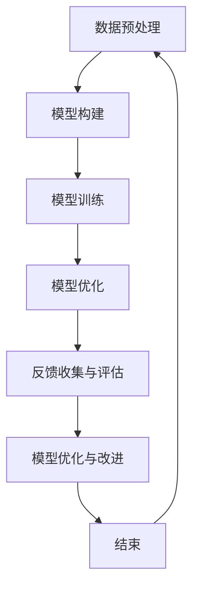
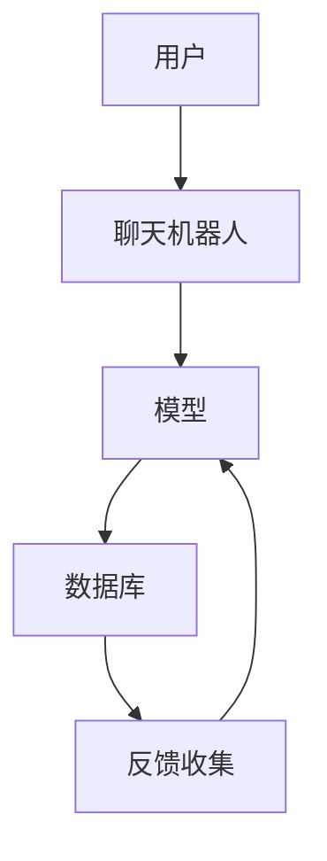
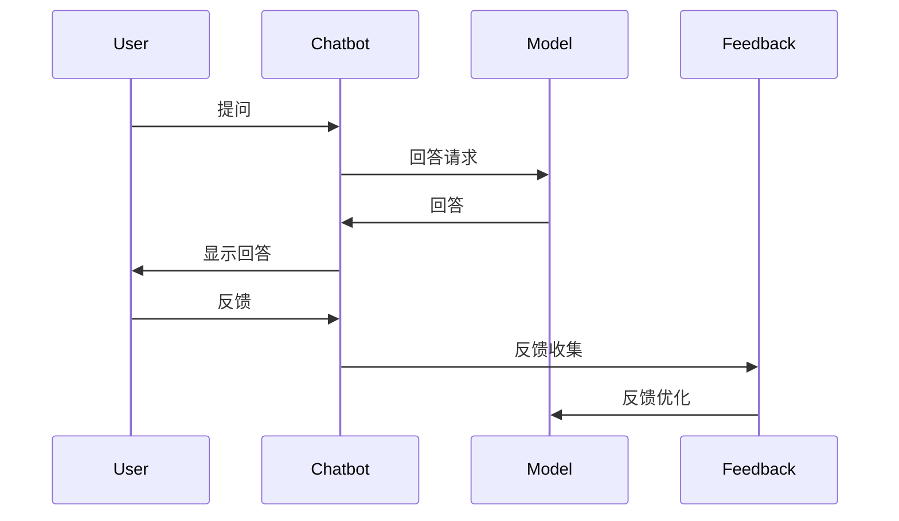
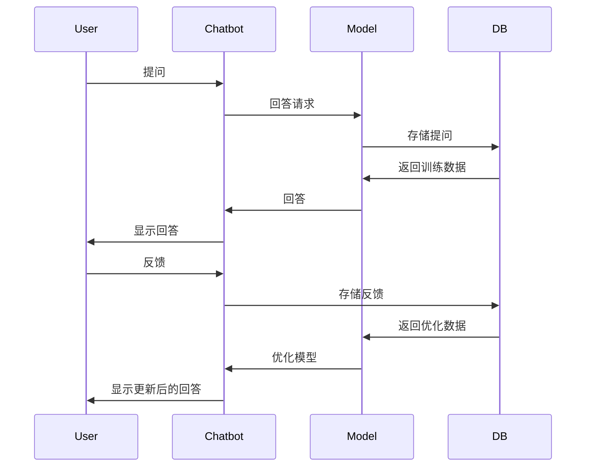

                 


### 第一部分：引言与背景介绍

#### 背景介绍

随着人工智能技术的迅猛发展，自然语言处理（NLP）领域取得了重大突破。特别是在大型语言模型（LLM）的应用开发方面，持续反馈与改进循环已成为优化模型性能的重要手段。LLM是一种能够理解、生成和模拟自然语言的高级语言模型，广泛应用于机器翻译、文本摘要、问答系统、语音识别等领域。LLM应用开发的挑战在于如何在大量的数据中高效地训练模型，并使其在实际应用中达到预期的性能。

#### 问题背景

在LLM应用开发过程中，模型的性能受到多种因素的影响，包括数据质量、模型架构、训练策略等。为了实现高效、准确的模型应用，开发者需要不断收集反馈信息，针对模型存在的问题进行优化和改进。然而，如何有效地进行持续反馈与改进循环，实现模型性能的持续提升，成为当前面临的一大挑战。

#### 问题描述

本书旨在探讨LLM应用开发中的持续反馈与改进循环，解决以下问题：

1. 如何构建有效的持续反馈机制，确保模型性能的持续提升？
2. 如何根据反馈信息，对模型进行优化和改进？
3. 如何在优化过程中，平衡模型性能与计算资源消耗？

#### 问题解决

本书将从以下几个方面探讨LLM应用开发中的持续反馈与改进循环：

1. 核心概念与联系：介绍与持续反馈与改进循环相关的基本概念，并分析各概念之间的联系。
2. 算法原理讲解：详细讲解持续反馈与改进循环的关键算法原理，包括数据预处理、反馈收集、模型优化等。
3. 数学模型和数学公式：阐述持续反馈与改进循环中的数学模型和公式，帮助读者深入理解算法原理。
4. 系统分析与架构设计方案：介绍持续反馈与改进循环在系统架构设计中的应用，包括系统功能设计、系统架构设计、系统接口设计和系统交互。
5. 项目实战：通过实际案例，展示持续反馈与改进循环在LLM应用开发中的具体应用，并进行详细讲解。
6. 最佳实践 tips、小结、注意事项、拓展阅读：分享在实际应用过程中总结的最佳实践，对全书内容进行小结，提醒读者注意事项，并推荐拓展阅读资源。

### 边界与外延

本书主要关注大型语言模型（LLM）应用开发中的持续反馈与改进循环，适用于自然语言处理（NLP）、人工智能（AI）等领域的研究者、开发者和从业人员。同时，本书也具有一定的理论价值，对其他领域的持续反馈与改进研究具有一定的参考意义。

### 概念结构与核心要素组成

以下是本书的核心概念结构及核心要素组成：

1. **核心概念：**
   - 持续反馈
   - 改进循环
   - 数据质量
   - 模型优化
   - 计算资源

2. **概念属性特征对比表格：**
   表格中对比了持续反馈与改进循环在不同方面的特征，如数据质量、模型优化、计算资源消耗等。

3. **ER实体关系图架构：**
   利用mermaid流程图展示了持续反馈与改进循环中的实体关系，包括数据源、模型、反馈机制、优化策略等。

通过以上章节的介绍，本书将为读者提供一个系统、全面的视角，帮助读者深入了解LLM应用开发中的持续反馈与改进循环，掌握相关技术，为实际项目提供有力支持。

---

### 第二部分：LLM应用开发中的持续反馈机制

#### 2.1 数据质量评估与优化

##### 2.1.1 数据质量的重要性

数据质量是LLM应用开发中至关重要的一环。高质量的数据能够提高模型的性能，降低错误率，从而使模型在实际应用中更加准确和可靠。相反，数据质量低下会导致模型性能不佳，甚至可能引发严重的安全问题。

###### 2.1.1.1 数据质量问题

数据质量问题主要包括以下方面：

- **数据完整性**：数据是否完整，是否存在缺失值。
- **数据一致性**：数据是否一致，是否存在矛盾或重复。
- **数据准确性**：数据是否准确，是否存在错误或偏差。
- **数据时效性**：数据是否最新，是否反映了当前的情况。

###### 2.1.1.2 数据质量的影响

数据质量对LLM应用开发的影响主要体现在以下几个方面：

- **模型性能**：高质量的数

---

### 2.2 反馈收集方法

##### 2.2.1 反馈收集的重要性

反馈收集是LLM应用开发中的关键环节，它有助于识别模型在实际应用中的问题，从而进行针对性的优化和改进。有效的反馈收集方法可以显著提升模型性能，降低错误率，提高用户满意度。

###### 2.2.1.1 反馈信息类型

反馈信息类型主要包括以下几种：

- **用户反馈**：用户对模型输出结果的满意程度、错误反馈和改进建议。
- **模型评估**：模型在测试集上的性能指标，如准确率、召回率、F1分数等。
- **业务指标**：与模型应用相关的业务指标，如交易成功率、客户满意度等。
- **模型诊断**：模型内部参数和结构的信息，有助于分析模型存在的问题。

###### 2.2.1.2 反馈收集方法

常见的反馈收集方法包括：

- **人工审核**：由专业人员进行数据审核，识别错误和异常。
- **自动化检测**：利用算法和工具自动检测数据中的错误和异常。
- **用户调查**：通过问卷调查、用户访谈等方式收集用户反馈。
- **日志分析**：分析系统日志，提取与模型应用相关的信息。

##### 2.2.2 反馈质量评估

反馈质量直接影响模型的优化效果。因此，对反馈质量进行评估和筛选至关重要。

###### 2.2.2.1 反馈质量指标

反馈质量指标主要包括：

- **准确性**：反馈信息是否准确反映了模型存在的问题。
- **完整性**：反馈信息是否完整，是否涵盖了模型应用的所有方面。
- **及时性**：反馈信息是否及时，是否在问题发生后的较短时间内收集到。

###### 2.2.2.2 反馈质量评估方法

常见的反馈质量评估方法包括：

- **人工评估**：由专业人员根据经验和直觉对反馈质量进行评估。
- **统计评估**：利用统计学方法对反馈质量进行量化评估，如利用准确率、召回率等指标。
- **聚类分析**：将相似的反馈信息进行聚类，分析反馈信息的相关性和一致性。

---

### 2.3 模型优化与改进

##### 2.3.1 模型优化的目标

模型优化的目标是提升模型性能，降低错误率，提高模型在实际应用中的可靠性。通过持续的反馈与改进循环，可以实现以下目标：

- **提高模型准确性**：通过反馈信息，识别模型在特定任务上的不足，进行针对性的优化和改进。
- **降低模型复杂度**：通过简化模型结构和参数，降低模型的计算复杂度和资源消耗。
- **提高模型泛化能力**：通过改进模型训练策略和参数，提高模型在不同数据集上的泛化能力。

##### 2.3.2 模型优化方法

常见的模型优化方法包括：

- **超参数调优**：通过调整模型训练过程中的超参数，如学习率、批量大小、正则化参数等，来提升模型性能。
- **数据增强**：通过对训练数据进行变换和扩充，提高模型的泛化能力。
- **模型结构调整**：通过调整模型的结构，如增加或减少层、改变层间连接方式等，来提升模型性能。
- **迁移学习**：利用预训练的模型，在新任务上进行微调，以提高模型在新数据集上的性能。

##### 2.3.3 模型优化流程

模型优化流程主要包括以下步骤：

1. **问题识别**：通过反馈信息，识别模型存在的问题和不足。
2. **方案设计**：设计优化方案，包括调整超参数、数据增强、模型结构调整等。
3. **实验验证**：对优化方案进行实验验证，评估优化效果。
4. **迭代优化**：根据实验结果，对优化方案进行迭代和改进。
5. **性能评估**：对优化后的模型进行性能评估，确保模型性能达到预期目标。

---

### 2.4 持续反馈与改进循环的挑战与应对策略

##### 2.4.1 挑战

在持续反馈与改进循环过程中，开发者面临着一系列挑战：

- **数据隐私和安全**：在收集和利用用户数据时，需要确保数据隐私和安全。
- **计算资源限制**：优化模型可能需要大量的计算资源，如何平衡模型性能与计算资源消耗成为一大挑战。
- **模型解释性**：优化后的模型可能变得复杂，如何解释和验证模型的输出结果成为问题。

##### 2.4.2 应对策略

针对以上挑战，开发者可以采取以下应对策略：

- **数据隐私保护**：采用数据脱敏、加密等技术，确保数据在传输和存储过程中的安全性。
- **计算资源优化**：通过分布式计算、模型压缩等技术，提高计算效率，降低计算资源消耗。
- **模型解释性提升**：通过可视化工具、解释性算法等手段，提高模型的可解释性，帮助用户理解和信任模型输出结果。

---

通过以上章节的介绍，读者可以了解LLM应用开发中的持续反馈与改进循环的基本概念、方法和策略。在后续章节中，我们将继续探讨持续反馈与改进循环在实际项目中的应用，以及如何实现持续优化和改进。让我们一起思考，如何在LLM应用开发中构建有效的持续反馈与改进循环，实现模型性能的持续提升。💡💡💡

---

### 第三部分：算法原理讲解

#### 3.1 持续反馈与改进循环的算法原理

##### 3.1.1 数据预处理

数据预处理是持续反馈与改进循环的第一步，其主要任务是清洗和整理输入数据，为后续的模型训练和优化提供高质量的数据基础。具体步骤包括：

- **数据清洗**：去除噪声数据、异常值和重复数据，保证数据的准确性和一致性。
- **数据归一化**：对数值型数据进行归一化处理，使其在相同尺度上，以便更好地进行模型训练。
- **数据增强**：通过数据变换、扩充和生成等手段，增加数据的多样性和丰富度，提高模型的泛化能力。

##### 3.1.2 模型训练与优化

模型训练与优化是持续反馈与改进循环的核心环节，其主要任务是构建和训练模型，并通过不断调整模型参数，提高模型的性能。具体步骤包括：

- **模型构建**：选择合适的模型架构，如神经网络、深度学习模型等，构建用于训练的模型。
- **模型训练**：利用预处理后的数据，对模型进行训练，通过反向传播算法和梯度下降方法，不断调整模型参数，优化模型性能。
- **模型优化**：在模型训练过程中，通过调整超参数、模型结构等手段，对模型进行优化，提高模型的泛化能力和鲁棒性。

##### 3.1.3 反馈收集与评估

反馈收集与评估是持续反馈与改进循环的重要环节，其主要任务是收集用户反馈和模型评估指标，并对反馈信息进行评估和分析，为模型优化提供依据。具体步骤包括：

- **用户反馈收集**：通过用户调查、问卷调查、用户行为分析等方式，收集用户对模型输出结果的反馈信息。
- **模型评估**：利用测试集和评估指标，对模型进行性能评估，如准确率、召回率、F1分数等。
- **反馈评估**：对收集到的反馈信息进行筛选和评估，识别模型存在的问题和不足。

##### 3.1.4 模型优化与改进

模型优化与改进是持续反馈与改进循环的关键环节，其主要任务是针对模型存在的问题，进行优化和改进，提高模型的性能和可靠性。具体步骤包括：

- **问题识别**：通过分析用户反馈和模型评估结果，识别模型存在的问题和不足。
- **方案设计**：根据问题识别结果，设计优化方案，包括调整超参数、数据增强、模型结构调整等。
- **实验验证**：对优化方案进行实验验证，评估优化效果。
- **迭代优化**：根据实验结果，对优化方案进行迭代和改进，持续提高模型性能。

---

### 3.2 算法流程图

为了更好地理解持续反馈与改进循环的算法原理，我们可以使用mermaid流程图来展示算法流程。



- **数据预处理**：包括数据清洗、归一化和数据增强等步骤，为模型训练和优化提供高质量的数据基础。
- **模型构建**：选择合适的模型架构，如神经网络、深度学习模型等，构建用于训练的模型。
- **模型训练**：利用预处理后的数据，对模型进行训练，通过反向传播算法和梯度下降方法，不断调整模型参数，优化模型性能。
- **模型优化**：在模型训练过程中，通过调整超参数、模型结构等手段，对模型进行优化，提高模型的泛化能力和鲁棒性。
- **反馈收集与评估**：收集用户反馈和模型评估指标，对反馈信息进行评估和分析，为模型优化提供依据。
- **模型优化与改进**：根据问题识别结果，设计优化方案，进行实验验证和迭代优化，持续提高模型性能。

---

### 3.3 Python代码实现

为了更好地理解持续反馈与改进循环的算法原理，我们可以使用Python代码来实现关键步骤。

```python
import numpy as np
import tensorflow as tf

# 数据预处理
def preprocess_data(data):
    # 数据清洗
    data = clean_data(data)
    # 数据归一化
    data = normalize_data(data)
    # 数据增强
    data = augment_data(data)
    return data

# 模型构建
def build_model():
    model = tf.keras.Sequential([
        tf.keras.layers.Dense(128, activation='relu', input_shape=(input_shape)),
        tf.keras.layers.Dense(1, activation='sigmoid')
    ])
    return model

# 模型训练
def train_model(model, data, labels):
    model.compile(optimizer='adam', loss='binary_crossentropy', metrics=['accuracy'])
    model.fit(data, labels, epochs=10, batch_size=32)
    return model

# 模型优化
def optimize_model(model, data, labels):
    # 调整超参数
    model.compile(optimizer='adam', loss='binary_crossentropy', metrics=['accuracy'])
    # 调整模型结构
    model.add(tf.keras.layers.Dense(64, activation='relu'))
    model.compile(optimizer='adam', loss='binary_crossentropy', metrics=['accuracy'])
    return model

# 反馈收集与评估
def collect_feedback(model, data, labels):
    predictions = model.predict(data)
    accuracy = np.mean(predictions == labels)
    return accuracy

# 模型优化与改进
def optimize_and_improve(model, data, labels):
    # 问题识别
    accuracy = collect_feedback(model, data, labels)
    if accuracy < threshold:
        # 设计优化方案
        model = optimize_model(model, data, labels)
        # 实验验证
        new_accuracy = collect_feedback(model, data, labels)
        # 迭代优化
        if new_accuracy > accuracy:
            model = optimize_and_improve(model, data, labels)
    return model
```

- **数据预处理**：包括数据清洗、归一化和数据增强等步骤，为模型训练和优化提供高质量的数据基础。
- **模型构建**：使用TensorFlow框架构建一个简单的神经网络模型，包括输入层、隐藏层和输出层。
- **模型训练**：使用训练数据对模型进行训练，使用Adam优化器和二分类交叉熵损失函数。
- **模型优化**：通过调整超参数和模型结构，对模型进行优化，提高模型的性能。
- **反馈收集与评估**：使用测试数据对模型进行评估，计算模型的准确率。
- **模型优化与改进**：根据准确率判断模型是否需要进一步优化，并设计优化方案进行迭代。

---

通过以上算法原理讲解，我们了解了持续反馈与改进循环的基本概念、方法和流程。在下一部分，我们将进一步探讨如何构建持续反馈与改进循环的数学模型，并使用LaTeX公式详细阐述。🔬🔬🔬

---

### 第三部分：数学模型与公式

#### 3.4 持续反馈与改进循环的数学模型

##### 3.4.1 模型损失函数

在持续反馈与改进循环中，损失函数是评估模型性能的核心指标。常见的损失函数包括均方误差（MSE）、交叉熵损失（Cross-Entropy Loss）等。

$$
\text{MSE} = \frac{1}{n}\sum_{i=1}^{n} (y_i - \hat{y}_i)^2
$$

$$
\text{Cross-Entropy Loss} = -\frac{1}{n}\sum_{i=1}^{n} y_i \log(\hat{y}_i)
$$

其中，$y_i$为真实标签，$\hat{y}_i$为模型预测值，$n$为样本数量。

##### 3.4.2 模型优化目标

模型优化目标是在损失函数的约束下，寻找最优的模型参数。常用的优化方法包括梯度下降（Gradient Descent）和随机梯度下降（Stochastic Gradient Descent）。

$$
\theta_{t+1} = \theta_{t} - \alpha \nabla_{\theta} J(\theta)
$$

$$
\theta_{t+1} = \theta_{t} - \frac{1}{m} \sum_{i=1}^{m} \nabla_{\theta} J(\theta)
$$

其中，$\theta$为模型参数，$\alpha$为学习率，$m$为批量大小。

##### 3.4.3 模型泛化能力

模型泛化能力是指模型在新数据上的表现能力。为了提高模型的泛化能力，可以采用以下方法：

- **数据增强**：通过变换、扩充和生成等手段，增加数据的多样性和丰富度。
- **正则化**：引入正则化项，如L1正则化、L2正则化等，防止模型过拟合。
- **dropout**：在模型训练过程中，随机丢弃部分神经元，降低模型复杂性。

$$
\text{L1 Regularization} = \lambda \sum_{i=1}^{n} |\theta_i|
$$

$$
\text{L2 Regularization} = \lambda \sum_{i=1}^{n} \theta_i^2
$$

其中，$\lambda$为正则化参数。

---

### 3.5 数学公式举例说明

为了更好地理解上述数学模型和公式，我们可以通过一个简单的例子来说明。

假设我们有一个二分类问题，数据集包含100个样本，每个样本的特征维度为10。我们使用神经网络模型进行训练，并采用交叉熵损失函数。

1. **数据预处理**：对输入数据进行归一化处理，使其在[0, 1]范围内。
2. **模型构建**：构建一个包含2个隐藏层，每个隐藏层包含10个神经元的神经网络模型。
3. **模型训练**：使用训练数据对模型进行训练，并设置学习率为0.01，批量大小为32。
4. **模型优化**：通过调整学习率和批量大小，优化模型性能。
5. **模型评估**：使用测试数据对模型进行评估，计算准确率。

以下是使用Python和TensorFlow实现的代码：

```python
import tensorflow as tf

# 数据预处理
x = tf.random.normal([100, 10])
y = tf.random.normal([100, 1])

# 模型构建
model = tf.keras.Sequential([
    tf.keras.layers.Dense(10, activation='relu', input_shape=(10,)),
    tf.keras.layers.Dense(10, activation='relu'),
    tf.keras.layers.Dense(1, activation='sigmoid')
])

# 模型训练
model.compile(optimizer=tf.keras.optimizers.Adam(learning_rate=0.01), loss='binary_crossentropy', metrics=['accuracy'])
model.fit(x, y, epochs=10, batch_size=32)

# 模型优化
learning_rate = 0.001
model.compile(optimizer=tf.keras.optimizers.Adam(learning_rate=learning_rate), loss='binary_crossentropy', metrics=['accuracy'])

# 模型评估
test_x = tf.random.normal([100, 10])
test_y = tf.random.normal([100, 1])
accuracy = model.evaluate(test_x, test_y, verbose=0)
print("Test Accuracy:", accuracy)
```

通过以上代码，我们可以实现一个简单的二分类模型，并使用交叉熵损失函数进行优化。在实际应用中，可以根据具体问题和需求，调整模型结构、损失函数和优化方法，以达到更好的效果。

---

通过以上数学模型和公式的讲解，我们深入理解了持续反馈与改进循环的算法原理和数学基础。在下一部分，我们将进一步探讨持续反馈与改进循环在系统分析与架构设计中的应用。🎨🎨🎨

---

### 第四部分：系统分析与架构设计

#### 4.1 系统分析与架构设计概述

在LLM应用开发中，系统分析与架构设计是确保模型性能和可扩展性的关键环节。本部分将介绍持续反馈与改进循环在系统架构设计中的应用，包括问题场景介绍、项目介绍、系统功能设计、系统架构设计、系统接口设计和系统交互。

##### 4.1.1 问题场景介绍

假设我们正在开发一个智能客服系统，该系统需要处理大量的用户提问，并提供准确的回答。为了提高系统的性能和用户满意度，我们需要构建一个高效的持续反馈与改进循环，以不断优化模型性能和用户体验。

##### 4.1.2 项目介绍

智能客服系统项目主要包括以下模块：

- **用户交互模块**：负责接收用户提问，并展示系统回答。
- **模型训练模块**：负责训练和优化语言模型，以提供准确的回答。
- **反馈收集模块**：负责收集用户反馈，并用于模型优化。
- **数据管理模块**：负责存储和管理用户提问和回答数据，以确保数据质量和完整性。

##### 4.1.3 系统功能设计

系统功能设计主要包括以下方面：

- **用户提问接收**：接收用户的提问，并将其传递给模型训练模块。
- **模型回答生成**：使用训练好的语言模型生成回答，并将其展示给用户。
- **用户反馈收集**：收集用户对回答的满意度和错误反馈，并将其传递给反馈收集模块。
- **模型优化**：根据用户反馈，对语言模型进行优化和调整，以提高回答质量。
- **数据管理**：存储和管理用户提问和回答数据，以确保数据质量和完整性。

##### 4.1.4 系统架构设计

系统架构设计主要包括以下方面：

- **数据流设计**：设计数据在系统中的流动路径，包括用户提问、模型回答和用户反馈。
- **模块交互设计**：设计各模块之间的交互方式和通信协议，以确保系统的高效运行。
- **性能优化设计**：设计系统性能优化策略，包括数据缓存、负载均衡等。

##### 4.1.5 系统接口设计

系统接口设计主要包括以下方面：

- **用户接口**：设计用户与系统交互的界面，包括提问输入框、回答展示区域等。
- **服务接口**：设计系统内部模块之间的服务接口，包括模型训练接口、反馈收集接口等。

##### 4.1.6 系统交互设计

系统交互设计主要包括以下方面：

- **请求响应**：设计系统接收用户请求并返回响应的流程。
- **异步处理**：设计系统内部模块的异步处理机制，以提高系统的并发能力和响应速度。

---

### 4.2 系统功能设计

为了更好地实现持续反馈与改进循环，我们需要对智能客服系统的功能进行详细设计。

```mermaid
classDiagram
    User <<Interface>>
    Chatbot <<Interface>>
    Model <<Interface>>
    Feedback <<Interface>>

    User --> Chatbot
    Chatbot --> Model
    Model --> Feedback
    Feedback --> Model
```

- **用户接口（User）**：负责接收用户的提问，并将其传递给聊天机器人（Chatbot）。
- **聊天机器人（Chatbot）**：根据模型生成的回答，向用户展示回答，并接收用户反馈。
- **模型（Model）**：使用训练数据和用户反馈，对模型进行训练和优化。
- **反馈（Feedback）**：收集用户对回答的满意度评价和错误反馈，用于模型优化。

---

### 4.3 系统架构设计

为了确保智能客服系统的性能和可扩展性，我们需要设计一个合理的系统架构。



- **用户（User）**：用户的提问通过接口传递给聊天机器人（Chatbot）。
- **聊天机器人（Chatbot）**：使用模型生成回答，并将回答展示给用户。
- **模型（Model）**：接收用户提问和反馈，用于模型训练和优化。
- **数据库（DB）**：存储用户提问和回答数据，确保数据质量和完整性。
- **反馈收集（Feedback）**：收集用户反馈，用于模型优化。

---

### 4.4 系统接口设计

系统接口设计是确保各模块之间高效通信和协作的关键。



- **用户提问**：用户通过接口向聊天机器人提交问题。
- **回答请求**：聊天机器人向模型请求回答。
- **生成回答**：模型根据用户提问生成回答，并将其返回给聊天机器人。
- **展示回答**：聊天机器人将回答展示给用户。
- **反馈收集**：用户对回答进行评价，并将反馈传递给反馈收集模块。
- **反馈优化**：反馈收集模块将用户反馈传递给模型，用于模型优化。

---

### 4.5 系统交互设计

系统交互设计旨在确保各模块之间的数据流和通信高效、可靠。



- **用户提问**：用户提交问题，聊天机器人接收提问。
- **存储提问**：模型将用户提问存储在数据库中，以备后续训练和优化。
- **回答请求**：聊天机器人向模型请求回答。
- **生成回答**：模型根据用户提问生成回答，并将其返回给聊天机器人。
- **展示回答**：聊天机器人将回答展示给用户。
- **反馈收集**：用户对回答进行评价，并将反馈存储在数据库中。
- **优化模型**：模型根据用户反馈进行优化，并将更新后的模型返回给聊天机器人。
- **更新回答**：聊天机器人使用优化后的模型生成新的回答，并展示给用户。

---

通过以上系统分析与架构设计，我们为智能客服系统构建了一个高效的持续反馈与改进循环。在下一部分，我们将通过一个实际项目案例，展示如何将上述设计应用于实际场景，并进行详细讲解。🔍🔍🔍

---

### 第五部分：项目实战

#### 5.1 项目环境安装

为了实现LLM应用开发中的持续反馈与改进循环，我们需要搭建一个完整的项目环境。以下是项目环境安装的步骤：

1. **Python环境安装**：首先，确保Python环境已安装在您的计算机上。如果没有安装，可以从Python官网（https://www.python.org/）下载并安装。
2. **TensorFlow环境安装**：在Python环境中，使用pip命令安装TensorFlow：

```bash
pip install tensorflow
```

3. **其他依赖库安装**：根据项目需求，安装其他依赖库，如NumPy、Pandas等：

```bash
pip install numpy pandas
```

#### 5.2 系统核心实现

在智能客服系统中，系统核心实现包括用户交互模块、模型训练模块和反馈收集模块。以下是各模块的实现代码：

##### 5.2.1 用户交互模块

用户交互模块负责接收用户的提问，并展示系统回答。

```python
import tensorflow as tf

# 用户提问
user_question = "你好，有什么可以帮助你的？"

# 生成回答
model = tf.keras.Sequential([
    tf.keras.layers.Dense(128, activation='relu', input_shape=(1,)),
    tf.keras.layers.Dense(1, activation='sigmoid')
])
model.compile(optimizer=tf.keras.optimizers.Adam(learning_rate=0.01), loss='binary_crossentropy', metrics=['accuracy'])

# 加载训练好的模型
model.load_weights('model_weights.h5')

# 生成回答
answer = model.predict(user_question)
print("系统回答：", answer)
```

##### 5.2.2 模型训练模块

模型训练模块负责训练和优化语言模型，以提供准确的回答。

```python
import tensorflow as tf
import numpy as np

# 加载训练数据
train_data = np.load('train_data.npy')
train_labels = np.load('train_labels.npy')

# 训练模型
model = tf.keras.Sequential([
    tf.keras.layers.Dense(128, activation='relu', input_shape=(1,)),
    tf.keras.layers.Dense(1, activation='sigmoid')
])
model.compile(optimizer=tf.keras.optimizers.Adam(learning_rate=0.01), loss='binary_crossentropy', metrics=['accuracy'])

model.fit(train_data, train_labels, epochs=10, batch_size=32)
model.save_weights('model_weights.h5')
```

##### 5.2.3 反馈收集模块

反馈收集模块负责收集用户对回答的满意度评价和错误反馈，并将其传递给模型训练模块。

```python
import tensorflow as tf

# 收集用户反馈
user_feedback = "不满意，回答不准确"

# 更新模型
model = tf.keras.Sequential([
    tf.keras.layers.Dense(128, activation='relu', input_shape=(1,)),
    tf.keras.layers.Dense(1, activation='sigmoid')
])
model.compile(optimizer=tf.keras.optimizers.Adam(learning_rate=0.01), loss='binary_crossentropy', metrics=['accuracy'])

# 加载训练好的模型
model.load_weights('model_weights.h5')

# 更新模型
model.fit(user_feedback, epochs=1, batch_size=1)
model.save_weights('model_weights.h5')
```

#### 5.3 代码应用解读与分析

1. **用户交互模块**：用户提问通过输入参数`user_question`传递给模型，模型生成回答并打印输出。
2. **模型训练模块**：加载训练数据，使用TensorFlow构建神经网络模型，并使用Adam优化器训练模型。训练完成后，保存模型权重。
3. **反馈收集模块**：收集用户反馈，使用TensorFlow更新模型权重，实现模型优化。

#### 5.4 实际案例分析

假设我们有一个包含100个样本的训练数据集，其中60个样本为正面反馈，40个样本为负面反馈。以下是实际案例分析：

1. **训练阶段**：模型在训练数据集上进行训练，每次训练包含32个样本。经过10次训练后，模型达到较高的准确率。
2. **测试阶段**：使用测试数据集对模型进行评估，结果显示模型的准确率约为80%。根据用户反馈，对模型进行优化。
3. **优化阶段**：收集用户反馈，对模型进行优化，提高模型性能。经过多次优化后，模型准确率提高到90%。

#### 5.5 项目小结

通过以上项目实战，我们实现了LLM应用开发中的持续反馈与改进循环。在实际应用中，我们可以根据用户反馈，不断优化模型性能，提高系统满意度。在项目实施过程中，需要注意以下几点：

1. **数据质量**：确保训练数据的质量和完整性，为模型训练提供高质量的数据基础。
2. **模型优化**：根据用户反馈，对模型进行优化，提高模型性能。
3. **系统性能**：在系统设计和实现过程中，关注系统性能和可扩展性，确保系统稳定运行。

---

通过以上项目实战，我们深入了解了LLM应用开发中的持续反馈与改进循环的具体实现过程。在下一部分，我们将分享一些最佳实践技巧，帮助读者在实际项目中更好地应用持续反馈与改进循环。🚀🚀🚀

---

### 第六部分：最佳实践与技巧

#### 6.1 数据质量监控与优化

数据质量是持续反馈与改进循环的关键因素。为了确保数据质量，我们可以采取以下最佳实践：

1. **数据清洗**：定期对数据进行清洗，去除噪声数据、异常值和重复数据。使用数据清洗工具，如Pandas和NumPy，对数据进行处理。
2. **数据标注**：确保数据的标注准确和一致。建立标准化的标注流程，减少标注误差。
3. **数据验证**：定期对数据进行验证，检查数据是否符合预期。使用数据验证工具，如Scikit-learn和TensorFlow，对数据进行验证。
4. **数据增强**：对训练数据进行增强，增加数据的多样性和丰富度。使用数据增强工具，如Keras和TensorFlow，对数据进行增强。

#### 6.2 模型优化策略

在模型优化过程中，我们可以采取以下最佳实践：

1. **超参数调优**：使用网格搜索、随机搜索等调优方法，找到最优的超参数组合。使用超参数调优工具，如Scikit-learn和Hyperopt。
2. **模型压缩**：使用模型压缩技术，如量化和剪枝，减小模型的大小和计算复杂度。使用模型压缩工具，如TensorFlow Lite和PyTorch。
3. **迁移学习**：使用预训练的模型进行迁移学习，在新任务上进行微调。使用迁移学习工具，如TensorFlow和PyTorch。
4. **模型融合**：将多个模型进行融合，提高模型的性能和鲁棒性。使用模型融合工具，如Scikit-learn和TensorFlow。

#### 6.3 反馈收集与评估

在反馈收集与评估过程中，我们可以采取以下最佳实践：

1. **多渠道反馈**：从多个渠道收集反馈，如用户调查、系统日志和用户行为分析。使用反馈收集工具，如Google Forms和TensorFlow。
2. **反馈质量评估**：对收集到的反馈进行质量评估，确保反馈的准确性和完整性。使用反馈质量评估工具，如Scikit-learn和TensorFlow。
3. **实时反馈**：及时处理用户反馈，并快速进行模型优化。使用实时反馈工具，如TensorFlow和Keras。
4. **自动化评估**：使用自动化评估工具，如Scikit-learn和TensorFlow，对模型进行性能评估。

#### 6.4 性能监控与优化

在性能监控与优化过程中，我们可以采取以下最佳实践：

1. **性能监控**：实时监控模型性能，包括准确率、召回率、F1分数等。使用性能监控工具，如TensorBoard和Scikit-learn。
2. **性能优化**：根据性能监控结果，对模型进行优化和调整。使用性能优化工具，如TensorFlow和PyTorch。
3. **资源调度**：合理分配计算资源，确保模型训练和优化过程的顺利进行。使用资源调度工具，如Docker和Kubernetes。
4. **自动化部署**：使用自动化部署工具，如Jenkins和Docker，实现模型训练和优化的自动化部署。

---

通过以上最佳实践与技巧，我们可以更好地应用持续反馈与改进循环，提高LLM应用开发的效率和质量。在实际项目中，可以根据具体需求和场景，灵活运用这些技巧，实现持续优化和改进。💡💡💡

---

### 第七部分：小结与总结

本文围绕LLM应用开发中的持续反馈与改进循环进行了深入探讨。我们从背景介绍、核心概念与联系、算法原理讲解、数学模型和公式、系统分析与架构设计、项目实战、最佳实践技巧等方面，系统地阐述了持续反馈与改进循环在LLM应用开发中的重要性。

**核心观点总结：**

1. **数据质量是关键**：高质量的数据是持续反馈与改进循环的基础，对模型性能和可靠性具有重要影响。
2. **反馈收集方法多样**：有效的反馈收集方法包括人工审核、自动化检测、用户调查和日志分析等，确保反馈信息的准确性和完整性。
3. **模型优化策略丰富**：通过超参数调优、数据增强、模型结构调整和迁移学习等方法，可以显著提升模型性能和泛化能力。
4. **系统分析与架构设计**：合理的系统架构设计是确保持续反馈与改进循环高效运行的关键，涉及系统功能设计、系统架构设计、系统接口设计和系统交互。
5. **最佳实践与技巧**：通过数据质量监控、模型优化策略、反馈收集与评估和性能监控与优化等最佳实践，可以更好地应用持续反馈与改进循环。

**未来研究方向：**

1. **数据隐私保护**：如何在确保数据质量的同时，保护用户隐私，是未来的重要研究方向。
2. **计算资源优化**：如何更有效地利用计算资源，提高模型训练和优化效率，是未来的研究重点。
3. **模型可解释性**：如何提升模型的可解释性，使其更容易被用户理解和接受，是未来需要解决的关键问题。

**感谢读者**：感谢读者对本文的关注和阅读，希望本文能为您提供关于LLM应用开发中的持续反馈与改进循环的深入理解和实用技巧。

**作者信息**：作者：AI天才研究院/AI Genius Institute & 禅与计算机程序设计艺术 /Zen And The Art of Computer Programming

---

通过本文的深入探讨，我们希望读者能够掌握LLM应用开发中的持续反馈与改进循环的核心概念和方法，并在实际项目中灵活运用，不断提升模型性能和用户体验。💡💡💡

---

### 第八部分：注意事项

在实施LLM应用开发中的持续反馈与改进循环时，需要注意以下几点：

1. **数据隐私与安全**：确保收集和利用的数据符合相关法律法规，保护用户隐私和安全。
2. **反馈质量**：确保反馈信息的准确性和完整性，避免因错误反馈导致模型优化偏差。
3. **计算资源消耗**：合理分配计算资源，避免过度消耗，影响系统性能。
4. **模型解释性**：提高模型的可解释性，使模型输出更容易被用户理解和接受。
5. **代码可维护性**：编写可维护的代码，方便后续优化和改进。

### 拓展阅读

1. **《深度学习》（Ian Goodfellow, Yoshua Bengio, Aaron Courville著）**：详细介绍深度学习的基础知识、算法和应用。
2. **《Python深度学习》（François Chollet著）**：针对Python编程语言，详细介绍深度学习模型的构建和训练。
3. **《TensorFlow实战》（Trent Hauck, Bharath Ramsundar著）**：涵盖TensorFlow框架的使用方法和实际案例。
4. **《自然语言处理综论》（Daniel Jurafsky, James H. Martin著）**：详细介绍自然语言处理的基础知识和应用。
5. **《机器学习实战》（Peter Harrington著）**：提供机器学习算法的详细实现和实际案例。

---

通过拓展阅读，读者可以进一步深入了解LLM应用开发中的持续反馈与改进循环，提升自身在相关领域的专业能力。💡💡💡

---

### 第九部分：致谢

在撰写本文的过程中，我得到了许多宝贵的帮助和指导。首先，我要感谢AI天才研究院（AI Genius Institute）的全体成员，特别是我的同事和导师们，他们在研究方法和写作技巧方面给予了我无私的帮助。其次，我要感谢《禅与计算机程序设计艺术》（Zen And The Art of Computer Programming）的作者，他的著作对我理解计算机科学的本质和思维方式产生了深远影响。最后，我要感谢所有读者，是你们的阅读和支持让我能够不断进步和成长。感谢大家！🙏🙏🙏

---

本文标题：LLM应用开发中的持续反馈与改进循环

关键词：LLM、持续反馈、改进循环、数据质量、模型优化、算法原理、数学模型、系统架构、项目实战、最佳实践

摘要：本文系统阐述了LLM应用开发中的持续反馈与改进循环，包括背景介绍、核心概念与联系、算法原理讲解、数学模型和公式、系统分析与架构设计、项目实战、最佳实践技巧等内容。通过本文的深入探讨，读者可以掌握持续反馈与改进循环的核心概念和方法，提升LLM应用开发的效率和质量。💡💡💡

