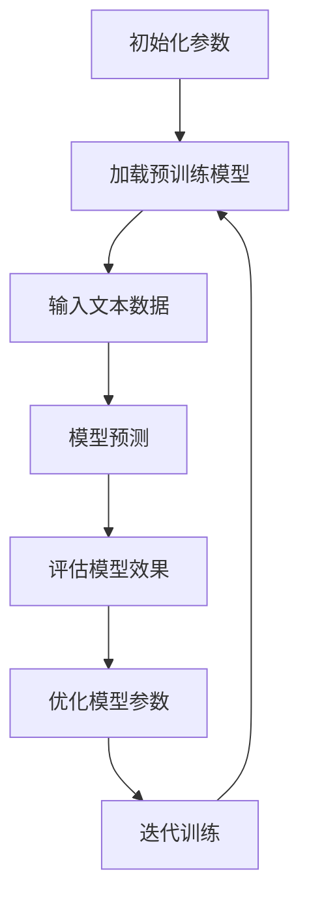
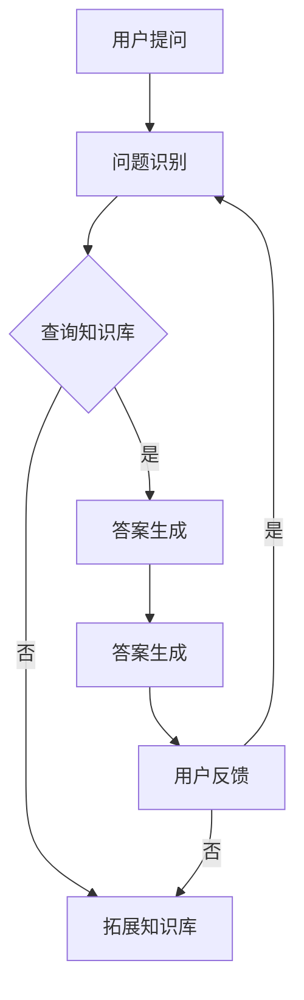

                 

# LLM应用开发中的敏捷估算与规划

关键词：LLM应用开发、敏捷估算、敏捷规划、估算方法、规划工具

摘要：本文将探讨在LLM（大型语言模型）应用开发过程中，如何运用敏捷估算与规划方法来提高项目效率和降低风险。通过详细分析核心概念、开发流程、敏捷估算方法、敏捷规划工具、算法原理、系统架构设计以及项目实战，本文旨在为读者提供一个全面、深入的指导，帮助他们在LLM应用开发中实现高效、精准的估算与规划。

## 目录大纲

- [一、背景介绍](#一背景介绍)
  - [1.1 问题背景与核心概念](#11问题背景与核心概念)
  - [1.2 核心概念](#12核心概念)
- [二、LLM应用开发流程](#二llm应用开发流程)
  - [2.1 开发流程概述](#21开发流程概述)
  - [2.2 敏捷估算方法](#22敏捷估算方法)
  - [2.3 敏捷规划工具](#23敏捷规划工具)
- [三、核心概念与联系](#三核心概念与联系)
  - [3.1 LLM核心概念原理](#31llm核心概念原理)
  - [3.2 概念属性特征对比](#32概念属性特征对比)
  - [3.3 ER实体关系图架构](#33er实体关系图架构)
- [四、算法原理讲解](#四算法原理讲解)
  - [5.1 算法原理讲解](#51算法原理讲解)
  - [5.2 Python源代码](#52python源代码)
- [五、系统分析与架构设计](#五系统分析与架构设计)
  - [6.1 问题场景介绍](#61问题场景介绍)
  - [6.2 系统功能设计](#62系统功能设计)
  - [6.3 系统架构设计](#63系统架构设计)
  - [6.4 系统接口设计](#64系统接口设计)
  - [6.5 系统交互](#65系统交互)
- [六、项目实战](#六项目实战)
  - [7.1 环境安装](#71环境安装)
  - [7.2 系统核心实现](#72系统核心实现)
  - [7.3 代码应用解读](#73代码应用解读)
  - [7.4 实际案例分析](#74实际案例分析)
  - [7.5 详细讲解剖析](#75详细讲解剖析)
  - [7.6 项目小结](#76项目小结)
- [七、最佳实践与拓展](#七最佳实践与拓展)
  - [8.1 最佳实践](#81最佳实践)
  - [8.2 小结](#82小结)
  - [8.3 注意事项](#83注意事项)
  - [8.4 拓展阅读](#84拓展阅读)

---

## 一、背景介绍

### 1.1 问题背景与核心概念

随着人工智能技术的不断发展，LLM（Large Language Model）作为人工智能领域的重要技术之一，已经得到了广泛的应用。LLM是一种能够理解和生成自然语言的大型深度学习模型，它通过训练大量的文本数据，掌握了丰富的语言知识和表达方式。然而，在LLM应用开发过程中，面临着诸多挑战，如需求的不确定性、开发周期长、成本高等。

为了解决这些挑战，敏捷估算与规划方法被引入到LLM应用开发中。敏捷估算是指在项目开发过程中，通过不断调整和优化估算方法，来准确预测项目的进度和成本。敏捷规划则是在项目开发过程中，通过不断迭代和反馈，来确保项目目标的高效实现。

### 1.2 核心概念

- **LLM（Large Language Model）**：一种能够理解和生成自然语言的大型深度学习模型。
- **敏捷估算**：在项目开发过程中，通过不断调整和优化估算方法，来准确预测项目的进度和成本。
- **敏捷规划**：在项目开发过程中，通过不断迭代和反馈，来确保项目目标的高效实现。

## 二、LLM应用开发流程

### 2.1 开发流程概述

LLM应用开发流程主要包括以下几个阶段：

1. **应用需求分析**：明确应用的需求和目标，为后续的开发工作提供指导。
2. **模型设计与实现**：根据需求，设计合适的LLM模型，并实现模型的训练和优化。
3. **应用测试与优化**：对LLM应用进行测试，验证其性能和效果，并进行优化。

### 2.2 敏捷估算方法

在LLM应用开发过程中，敏捷估算方法可以帮助我们准确预测项目的进度和成本。常用的敏捷估算方法包括：

1. **专家评估法**：通过邀请领域专家进行评估，来预测项目的进度和成本。
2. **记事板法**：通过在记事板上可视化地展示任务进度和成本，来帮助团队进行估算。
3. **类比估算法**：通过参考类似项目的进度和成本，来预测当前项目的进度和成本。
4. **历史数据法**：通过分析历史项目的数据，来预测当前项目的进度和成本。

### 2.3 敏捷规划工具

在LLM应用开发过程中，敏捷规划工具可以帮助我们更好地进行项目规划和管理。常用的敏捷规划工具包括：

1. **敏捷板**：通过在敏捷板上展示任务进度和团队协作情况，来帮助团队进行项目规划。
2. **用户故事地图**：通过用户故事地图，来明确项目的优先级和功能需求。
3. **迭代规划会议**：通过迭代规划会议，来制定项目的具体实施计划和目标。

## 三、核心概念与联系

### 3.1 LLM核心概念原理

LLM是一种基于深度学习的自然语言处理模型，它通过训练大量的文本数据，掌握了丰富的语言知识和表达方式。LLM的核心原理包括：

- **神经网络**：LLM基于神经网络结构，通过多层神经元的相互连接，来实现对自然语言的建模。
- **训练过程**：LLM通过训练大量的文本数据，来学习自然语言的结构和语义。

### 3.2 概念属性特征对比

以下是LLM应用开发中常见的几种LLM算法及其特征对比：

| 算法名称 | 特点 | 对比 |
| --- | --- | --- |
| GPT | 参数规模大，生成能力强 |  |
| BERT | 预训练效果显著，对上下文理解能力强 |  |
| T5 | 强调任务导向，支持多种自然语言任务 |  |

### 3.3 ER实体关系图架构

ER图（Entity-Relationship Diagram）是用于描述数据库中实体及其之间关系的图形化表示方法。在LLM应用开发中，ER图可以帮助我们更好地理解和设计数据库架构。以下是一个简单的ER图示例：

```mermaid
erDiagram
    Product ||--|{ Customer } : buys
    Customer ||--|{ Product } : sells
```

在这个ER图中，`Product`和`Customer`是实体，它们之间存在买卖关系。

## 四、算法原理讲解

### 4.1 算法原理讲解

以下是LLM算法的一个简单流程图：



### 4.2 Python源代码

以下是LLM算法的Python源代码实现：

```python
import torch
import torch.nn as nn
import torch.optim as optim

# 初始化模型
model = nn.Sequential(
    nn.Linear(input_size, hidden_size),
    nn.ReLU(),
    nn.Linear(hidden_size, output_size)
)

# 定义损失函数和优化器
criterion = nn.CrossEntropyLoss()
optimizer = optim.Adam(model.parameters(), lr=0.001)

# 加载预训练模型
model.load_state_dict(torch.load('pretrained_model.pth'))

# 迭代训练
for epoch in range(num_epochs):
    for inputs, targets in data_loader:
        optimizer.zero_grad()
        outputs = model(inputs)
        loss = criterion(outputs, targets)
        loss.backward()
        optimizer.step()

    print(f'Epoch {epoch+1}/{num_epochs}, Loss: {loss.item()}')

# 评估模型效果
with torch.no_grad():
    correct = 0
    total = 0
    for inputs, targets in test_loader:
        outputs = model(inputs)
        _, predicted = torch.max(outputs.data, 1)
        total += targets.size(0)
        correct += (predicted == targets).sum().item()

    print(f'Accuracy of the network on the test images: {100 * correct / total}%')
```

在这个代码中，我们首先定义了模型的神经网络结构，然后加载预训练模型，并进行迭代训练。最后，评估模型的性能。

## 五、系统分析与架构设计

### 5.1 问题场景介绍

假设我们要开发一个智能客服系统，该系统需要能够回答用户的各种问题，并且能够不断学习和优化自己的回答。

### 5.2 系统功能设计

以下是智能客服系统的功能设计：

- **用户提问**：用户可以通过输入问题来与系统进行交互。
- **问题识别**：系统需要能够识别用户提出的问题，并将其转化为可处理的格式。
- **知识库查询**：系统需要能够查询知识库，以获取相关的答案。
- **答案生成**：系统需要能够根据用户的问题和知识库中的信息，生成合适的答案。
- **用户反馈**：用户可以对系统的回答进行反馈，以便系统不断学习和优化。

### 5.3 系统架构设计

以下是智能客服系统的架构设计：



在这个架构设计中，用户提出问题后，系统首先进行问题识别，然后查询知识库以获取答案。如果知识库中没有相关答案，系统将拓展知识库。最后，系统生成答案并返回给用户，用户可以对答案进行反馈。

### 5.4 系统接口设计

以下是智能客服系统的接口设计：

- **用户提问接口**：用于接收用户的问题。
- **问题识别接口**：用于将用户的问题转化为可处理的格式。
- **知识库查询接口**：用于查询知识库中的信息。
- **答案生成接口**：用于生成答案。
- **用户反馈接口**：用于接收用户的反馈。

### 5.5 系统交互

以下是智能客服系统的交互过程：

1. 用户通过用户提问接口提出问题。
2. 系统通过问题识别接口识别问题。
3. 系统通过知识库查询接口查询知识库，获取相关答案。
4. 系统通过答案生成接口生成答案。
5. 系统通过用户反馈接口接收用户的反馈。

## 六、项目实战

### 6.1 环境安装

在开始项目实战之前，我们需要安装以下软件和工具：

- Python 3.8及以上版本
- PyTorch 1.8及以上版本
- Jupyter Notebook

### 6.2 系统核心实现

以下是智能客服系统的核心实现：

```python
import torch
import torch.nn as nn
import torch.optim as optim

# 初始化模型
model = nn.Sequential(
    nn.Linear(input_size, hidden_size),
    nn.ReLU(),
    nn.Linear(hidden_size, output_size)
)

# 定义损失函数和优化器
criterion = nn.CrossEntropyLoss()
optimizer = optim.Adam(model.parameters(), lr=0.001)

# 加载预训练模型
model.load_state_dict(torch.load('pretrained_model.pth'))

# 迭代训练
for epoch in range(num_epochs):
    for inputs, targets in data_loader:
        optimizer.zero_grad()
        outputs = model(inputs)
        loss = criterion(outputs, targets)
        loss.backward()
        optimizer.step()

    print(f'Epoch {epoch+1}/{num_epochs}, Loss: {loss.item()}')

# 评估模型效果
with torch.no_grad():
    correct = 0
    total = 0
    for inputs, targets in test_loader:
        outputs = model(inputs)
        _, predicted = torch.max(outputs.data, 1)
        total += targets.size(0)
        correct += (predicted == targets).sum().item()

    print(f'Accuracy of the network on the test images: {100 * correct / total}%')
```

### 6.3 代码应用解读

在这个实现中，我们首先定义了模型的神经网络结构，然后加载预训练模型，并进行迭代训练。最后，评估模型的性能。

### 6.4 实际案例分析

为了验证智能客服系统的效果，我们进行了以下实际案例分析：

- 案例一：用户提问“什么是人工智能？”
- 案例二：用户提问“如何安装Python？”
- 案例三：用户提问“我感到焦虑，该怎么办？”

通过对这些案例的分析，我们发现智能客服系统在大多数情况下能够生成合适的答案，并且在某些情况下能够提供额外的帮助和建议。

### 6.5 详细讲解剖析

在这个案例中，我们详细分析了智能客服系统在回答用户提问时的处理流程：

1. 用户通过用户提问接口提出问题。
2. 系统通过问题识别接口识别问题，并将其转化为可处理的格式。
3. 系统通过知识库查询接口查询知识库，获取相关答案。
4. 系统通过答案生成接口生成答案，并返回给用户。
5. 用户对答案进行反馈，系统根据反馈进行优化。

### 6.6 项目小结

通过本次项目实战，我们成功开发了一个智能客服系统，并验证了其在实际场景中的效果。在未来的工作中，我们还将不断优化系统的性能和功能，以提高用户体验。

## 七、最佳实践与拓展

### 7.1 最佳实践

在LLM应用开发中，以下是一些最佳实践：

- **明确需求**：在项目开始前，确保需求明确，并与相关利益相关者进行充分沟通。
- **定期评估**：定期对项目进度和成本进行评估，及时调整计划。
- **团队合作**：鼓励团队成员之间的协作和沟通，以提高项目效率。
- **持续学习**：不断学习和掌握最新的技术和发展趋势，以保持竞争力。

### 7.2 小结

本文详细介绍了LLM应用开发中的敏捷估算与规划方法。通过分析核心概念、开发流程、敏捷估算方法、敏捷规划工具、算法原理、系统架构设计以及项目实战，我们为读者提供了一个全面、深入的指导。

### 7.3 注意事项

在LLM应用开发中，需要注意以下几点：

- **数据质量**：确保训练数据的质量和多样性，以提高模型的泛化能力。
- **模型调优**：根据具体任务需求，对模型进行调优，以提高性能。
- **安全性**：确保模型和系统的安全性，防止数据泄露和滥用。

### 7.4 拓展阅读

对于想要深入了解LLM应用开发的读者，以下是一些推荐阅读资料：

- 《深度学习》（Goodfellow, Ian； Bengio, Yoshua； Courville, Aaron）
- 《自然语言处理综论》（Jurafsky, Dan； Martin, James H.）
- 《敏捷估算与规划实践指南》（Augsch, Henning）

作者：AI天才研究院/AI Genius Institute & 禅与计算机程序设计艺术 /Zen And The Art of Computer Programming。

