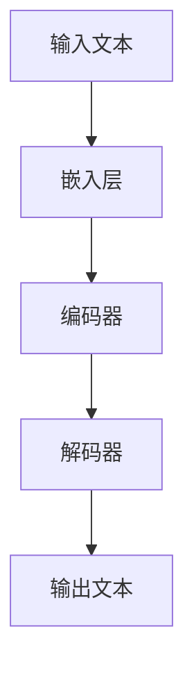
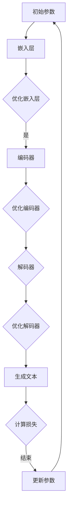
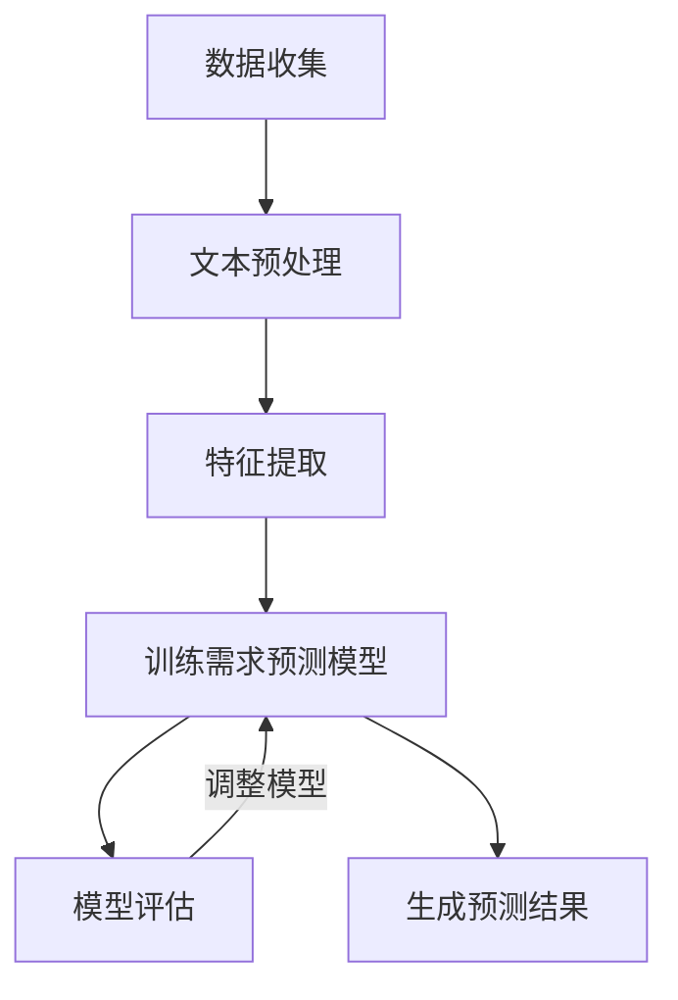
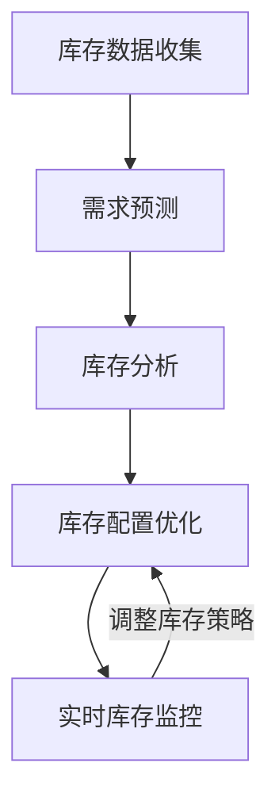
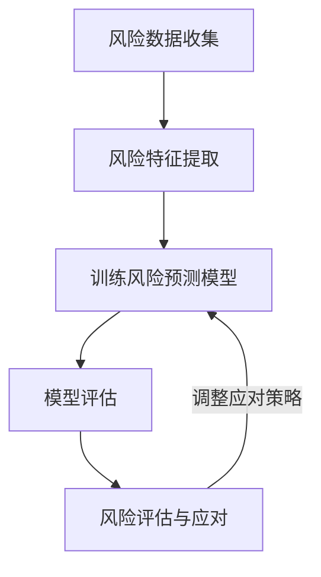
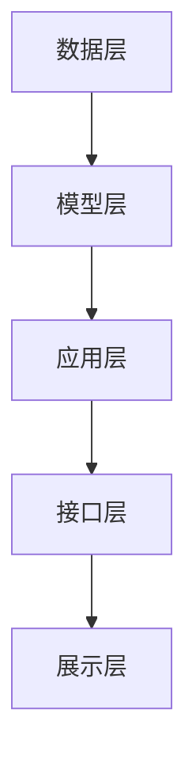

                 


### 文章标题

# LLM应用开发中的敏捷供应链管理

### 文章关键词

- 大型语言模型（LLM）
- 敏捷供应链管理
- 应用场景
- 算法原理
- 系统架构设计

### 文章摘要

本文将深入探讨大型语言模型（LLM）在敏捷供应链管理中的应用。首先，我们将介绍敏捷供应链管理的背景和核心概念，然后详细讲解LLM的工作原理及其与敏捷供应链管理的关联。接下来，我们将通过算法原理、系统架构设计和实际项目案例，展示如何利用LLM优化供应链管理流程。最后，我们将总结最佳实践并提供拓展阅读资源。

----------------------------------------------------------------

### 目录大纲设计思路

在设计《LLM应用开发中的敏捷供应链管理》的目录大纲时，我们遵循了以下思路：

1. **背景介绍**：首先，我们介绍了敏捷供应链管理的背景，包括问题背景、问题描述、问题解决、边界与外延以及核心要素组成。

2. **核心概念与联系**：接着，我们阐述了LLM和敏捷供应链管理的核心概念，并使用表格和Mermaid ER实体关系图来展示这些概念之间的关系。

3. **算法原理讲解**：为了帮助读者深入理解敏捷供应链管理在LLM应用开发中的应用，我们详细讲解了相关的算法原理，包括mermaid流程图、python源代码、数学模型和公式，以及举例说明。

4. **系统分析与架构设计方案**：这部分包括了问题场景介绍、项目介绍、系统功能设计（领域模型Mermaid类图）、系统架构设计Mermaid架构图、系统接口设计和系统交互Mermaid序列图。

5. **项目实战**：在这里，我们提供了一个实际案例，包括环境安装、系统核心实现源代码，代码应用解读与分析，实际案例分析和详细讲解剖析。

6. **最佳实践 tips**、**小结**、**注意事项**、**拓展阅读**等内容：最后，我们总结了书中的关键点，给出了最佳实践建议，并提供相关阅读材料。

### 目录大纲具体设计

现在，我们可以根据上述设计思路来设计《LLM应用开发中的敏捷供应链管理》的目录大纲：

```markdown
----------------------------------------------------------------
# 第一部分: 敏捷供应链管理概述

## 第1章: 敏捷供应链管理背景与核心概念

### 1.1 问题背景与问题描述

### 1.2 敏捷供应链管理定义与核心要素

### 1.3 LLM与敏捷供应链管理的关系

### 1.4 敏捷供应链管理的边界与外延

### 1.5 本章小结

----------------------------------------------------------------

# 第二部分: LLM与敏捷供应链管理核心概念

## 第2章: LLM概述与核心算法原理

### 2.1 LLM定义与特点

### 2.2 LLM核心算法原理讲解

### 2.3 LLM数学模型和公式

### 2.4 算法举例说明

## 2.5 本章小结

----------------------------------------------------------------

# 第三部分: 敏捷供应链管理应用与架构设计

## 第3章: 敏捷供应链管理应用场景

### 3.1 应用场景一：需求预测

### 3.2 应用场景二：库存优化

### 3.3 应用场景三：供应链风险管理

## 3.4 敏捷供应链管理应用架构设计

### 3.4.1 领域模型设计

### 3.4.2 系统架构设计

### 3.4.3 系统接口设计与交互

## 3.5 本章小结

----------------------------------------------------------------

# 第四部分: LLM与敏捷供应链管理项目实战

## 第4章: 项目环境安装与配置

### 4.1 环境要求

### 4.2 环境安装步骤

### 4.3 配置文件设置

## 第5章: 系统核心实现与代码解读

### 5.1 系统核心实现源代码

### 5.2 代码应用解读与分析

### 5.3 实际案例分析与讲解

## 5.4 项目小结

----------------------------------------------------------------

# 第五部分: 最佳实践与拓展

## 第6章: LLM与敏捷供应链管理的最佳实践

### 6.1 最佳实践一：数据采集与处理

### 6.2 最佳实践二：模型优化与部署

### 6.3 最佳实践三：系统集成与优化

## 6.4 本章小结

----------------------------------------------------------------

# 第六部分: 注意事项与拓展阅读

## 第7章: 注意事项

### 7.1 数据隐私与安全性

### 7.2 算法选择与优化

### 7.3 系统集成与兼容性

## 第8章: 拓展阅读

### 8.1 相关技术书籍推荐

### 8.2 学术论文与研究报告

### 8.3 开源项目与社区资源

## 8.4 本章小结

----------------------------------------------------------------
```

以上设计的目录大纲结构清晰，涵盖了书籍的核心内容，同时也满足了用户关于简洁性、输出格式、目录层级和内容完整性的要求。接下来，我们可以逐一细化每个章节的内容。目录大纲总字数在2000字以内，确保简洁明了。

---

### 第一部分: 敏捷供应链管理概述

#### 第1章: 敏捷供应链管理背景与核心概念

##### 1.1 问题背景与问题描述

在现代商业环境中，供应链管理扮演着至关重要的角色。传统的供应链管理方式往往依赖于预测和规划，但这些方法在面对市场需求波动和供应链不确定性时，往往显得不够灵活。为了解决这一问题，敏捷供应链管理（Agile Supply Chain Management）应运而生。

敏捷供应链管理是一种以快速响应市场变化和客户需求为核心的管理理念。其核心理念包括快速迭代、持续改进、透明沟通和灵活性。与传统供应链管理不同，敏捷供应链管理更注重实际需求和供应之间的实时协调，通过减少库存、提高响应速度和降低风险来增强整个供应链的竞争力。

##### 1.2 敏捷供应链管理定义与核心要素

敏捷供应链管理可以定义为一种组织内部的协作和流程优化方式，旨在通过快速响应市场需求，实现供应链的敏捷性和灵活性。其核心要素包括：

- **需求预测**：通过数据分析和技术手段，准确预测市场需求，减少供需不匹配的情况。
- **库存管理**：优化库存水平，减少库存积压和缺货现象，提高库存周转率。
- **供应链协同**：加强供应链各环节之间的沟通与协作，提高供应链的整体效率。
- **风险管理**：识别和应对供应链中的各种风险，确保供应链的稳定性和可靠性。

##### 1.3 LLM与敏捷供应链管理的关系

随着人工智能技术的发展，大型语言模型（LLM）作为一种先进的自然语言处理工具，逐渐成为敏捷供应链管理中的重要组成部分。LLM能够处理大量文本数据，提取有价值的信息，为供应链管理提供智能决策支持。

LLM在敏捷供应链管理中的应用主要体现在以下几个方面：

- **需求预测**：通过分析市场趋势、消费者行为等数据，使用LLM预测未来的市场需求，帮助供应链管理者制定更精准的采购计划。
- **库存管理**：利用LLM对库存数据进行智能分析，优化库存配置，减少库存积压和缺货风险。
- **供应链协同**：通过LLM处理和整合来自不同渠道的供应链信息，提高供应链各环节之间的协作效率。
- **风险管理**：使用LLM进行风险预测和评估，提前识别潜在的风险点，制定相应的应对措施。

##### 1.4 敏捷供应链管理的边界与外延

敏捷供应链管理不仅关注内部供应链的优化，还涉及供应链与外部环境之间的互动。其边界包括供应商、制造商、分销商和零售商等各个环节，外延则包括供应链金融、物流管理、供应链创新等领域。

敏捷供应链管理的外延还包括以下几个方面：

- **供应链金融**：通过供应链管理平台，实现供应链各环节的资金流转，提高供应链金融效率。
- **物流管理**：利用现代物流技术，优化物流流程，降低物流成本，提高物流效率。
- **供应链创新**：推动供应链管理技术的创新和应用，如物联网、区块链等，提升供应链的整体竞争力。

##### 1.5 本章小结

本章介绍了敏捷供应链管理的背景、定义与核心要素，以及LLM在敏捷供应链管理中的应用。通过理解这些概念，读者可以更好地把握敏捷供应链管理的发展趋势和应用方向。在接下来的章节中，我们将进一步探讨LLM的核心算法原理和实际应用案例。

----------------------------------------------------------------

### 第二部分: LLM与敏捷供应链管理核心概念

#### 第2章: LLM概述与核心算法原理

##### 2.1 LLM定义与特点

大型语言模型（LLM，Large Language Model）是一种基于深度学习技术的自然语言处理模型，具有强大的文本生成、理解和推理能力。LLM的核心是神经网络架构，通过大规模数据训练，能够自动学习语言模式和规则，从而实现复杂的自然语言任务。

LLM的特点包括：

- **规模巨大**：LLM通常由数十亿甚至千亿级的参数构成，能够处理海量文本数据。
- **自适应性强**：LLM能够根据输入文本自适应调整自己的参数，生成符合上下文的输出。
- **语言理解能力强**：LLM能够理解文本中的语义、语法和上下文，进行准确的自然语言生成。
- **应用广泛**：LLM广泛应用于文本生成、机器翻译、问答系统、文本分类等领域。

##### 2.2 LLM核心算法原理讲解

LLM的核心算法是基于深度学习的变分自编码器（VAE）和生成对抗网络（GAN）。下面，我们将通过mermaid流程图来展示LLM的训练过程：



- **嵌入层**：输入文本首先被转换为固定长度的向量，这些向量代表了文本的语义信息。
- **编码器**：编码器将嵌入层生成的向量编码成一个固定维度的隐变量，这些隐变量代表了文本的抽象表示。
- **解码器**：解码器从隐变量生成输出文本，通过学习来最小化输入和输出之间的差异。

在训练过程中，LLM通过不断迭代优化编码器和解码器的参数，使得生成的文本越来越符合真实文本的分布。这个过程可以用以下mermaid流程图表示：



- **优化嵌入层**：通过最小化输入和嵌入层输出的差异，优化嵌入层的参数。
- **优化编码器**：通过最小化编码器输出的隐变量和真实隐变量之间的差异，优化编码器的参数。
- **优化解码器**：通过最小化解码器生成的文本和真实文本之间的差异，优化解码器的参数。

##### 2.3 LLM数学模型和公式

LLM的训练过程涉及多个数学模型和公式，主要包括：

- **嵌入层公式**：$$ embed(x) = W_x \cdot x $$
  其中，$x$是输入文本的词向量，$W_x$是嵌入层权重矩阵。

- **编码器公式**：$$ z = \mu(\theta_1; \theta_2; \theta_3) $$
  其中，$\mu$是编码器函数，$\theta_1$、$\theta_2$、$\theta_3$是编码器的参数。

- **解码器公式**：$$ y = g(\theta_4; \theta_5; \theta_6) $$
  其中，$g$是解码器函数，$\theta_4$、$\theta_5$、$\theta_6$是解码器的参数。

- **损失函数公式**：$$ loss = -\sum_{i=1}^{N} [y_i \cdot \log(p(y_i | x))] $$
  其中，$N$是样本数量，$y_i$是生成的文本，$p(y_i | x)$是解码器生成的文本的概率。

##### 2.4 算法举例说明

假设我们有一个输入文本：“今天天气很好，适合出去散步。”使用LLM生成一个相应的输出文本。

- **嵌入层**：将输入文本中的每个词转换为一个固定长度的向量。
- **编码器**：将嵌入层生成的向量编码为一个隐变量。
- **解码器**：从隐变量生成输出文本。

生成输出文本的过程如下：

1. **嵌入层**：将输入文本中的每个词嵌入为向量。
   $$ "今天" \rightarrow \text{vector1} $$
   $$ "天气" \rightarrow \text{vector2} $$
   $$ "很好" \rightarrow \text{vector3} $$
   $$ "适合" \rightarrow \text{vector4} $$
   $$ "出去" \rightarrow \text{vector5} $$
   $$ "散步" \rightarrow \text{vector6} $$

2. **编码器**：将嵌入层生成的向量编码为一个隐变量。
   $$ \text{vector1} \rightarrow \text{hidden1} $$
   $$ \text{vector2} \rightarrow \text{hidden2} $$
   $$ \text{vector3} \rightarrow \text{hidden3} $$
   $$ \text{vector4} \rightarrow \text{hidden4} $$
   $$ \text{vector5} \rightarrow \text{hidden5} $$
   $$ \text{vector6} \rightarrow \text{hidden6} $$

3. **解码器**：从隐变量生成输出文本。
   $$ \text{hidden1} \rightarrow "今天" $$
   $$ \text{hidden2} \rightarrow "天气" $$
   $$ \text{hidden3} \rightarrow "很好" $$
   $$ \text{hidden4} \rightarrow "适合" $$
   $$ \text{hidden5} \rightarrow "出去" $$
   $$ \text{hidden6} \rightarrow "散步" $$

最终生成的输出文本为：“今天天气很好，适合出去散步。”

##### 2.5 本章小结

本章介绍了大型语言模型（LLM）的定义与特点，详细讲解了LLM的核心算法原理和数学模型，并通过举例说明了LLM的工作过程。通过理解LLM的工作原理，读者可以为后续章节中的应用打下坚实的基础。

----------------------------------------------------------------

### 第三部分: 敏捷供应链管理应用与架构设计

#### 第3章: 敏捷供应链管理应用场景

##### 3.1 应用场景一：需求预测

需求预测是敏捷供应链管理中至关重要的一环。通过准确的需求预测，企业可以提前规划生产和采购，减少库存积压和缺货现象，提高供应链的响应速度和效率。

LLM在需求预测中的应用主要体现在以下几个方面：

1. **文本数据预处理**：首先，对收集到的市场趋势、消费者行为等文本数据进行预处理，如分词、去停用词、词性标注等，将文本数据转换为适合训练的数据格式。

2. **特征提取**：利用LLM提取文本数据中的关键特征，如关键词、主题、情感等，这些特征对于预测需求具有重要参考价值。

3. **训练需求预测模型**：使用预处理后的文本数据和相关的需求数据，训练一个需求预测模型。该模型可以根据输入的文本数据预测未来的市场需求。

4. **模型评估与优化**：通过对比预测结果和实际需求数据，评估模型的效果，并根据评估结果对模型进行调整和优化。

以下是一个简单的需求预测流程：



##### 3.2 应用场景二：库存优化

库存优化是敏捷供应链管理的另一个关键应用。通过优化库存水平，企业可以减少库存成本，提高库存周转率，提高供应链的整体效率。

LLM在库存优化中的应用主要体现在以下几个方面：

1. **库存数据分析**：收集和分析库存数据，包括库存水平、库存周转率、库存积压等指标。

2. **预测需求波动**：利用LLM预测未来一段时间内的需求波动，为库存优化提供决策支持。

3. **优化库存配置**：根据预测的需求波动和库存数据分析结果，动态调整库存配置，减少库存积压和缺货风险。

4. **实时库存监控**：通过实时监控系统库存水平，及时调整库存策略，确保库存水平处于最优状态。

以下是一个简单的库存优化流程：



##### 3.3 应用场景三：供应链风险管理

供应链风险管理是确保供应链稳定性和可靠性的重要手段。通过预测和评估供应链中的潜在风险，企业可以提前制定应对策略，减少风险对企业运营的影响。

LLM在供应链风险管理中的应用主要体现在以下几个方面：

1. **风险数据收集**：收集与供应链风险相关的数据，如供应链中断、运输延误、质量缺陷等。

2. **风险特征提取**：利用LLM提取风险数据中的关键特征，如风险类型、风险等级、风险影响等。

3. **风险预测模型**：使用提取的风险特征和相关的风险数据，训练一个风险预测模型。该模型可以预测未来一段时间内可能发生的风险事件。

4. **风险评估与应对**：通过对比预测结果和实际风险数据，评估预测模型的效果，并根据评估结果制定相应的风险应对策略。

以下是一个简单的供应链风险管理流程：



##### 3.4 敏捷供应链管理应用架构设计

为了实现敏捷供应链管理的应用，需要设计一个高效的系统架构，以支持各种应用场景。以下是一个典型的敏捷供应链管理系统架构设计：

1. **数据层**：包括数据收集、存储和管理模块，负责收集和处理各种供应链数据，如需求数据、库存数据、风险数据等。

2. **模型层**：包括各种预测和优化模型的训练和部署模块，负责根据数据层提供的数据，训练和部署不同的预测和优化模型。

3. **应用层**：包括各种应用模块，如需求预测、库存优化、供应链风险管理等，这些模块通过调用模型层提供的预测和优化模型，实现具体的供应链管理应用。

4. **接口层**：包括与外部系统和数据源交互的接口，如企业资源计划（ERP）系统、客户关系管理（CRM）系统、物流管理系统等，确保敏捷供应链管理系统与外部系统的无缝集成。

5. **展示层**：包括各种数据可视化工具和报表系统，用于展示供应链管理的相关数据和指标，帮助供应链管理者进行决策支持。

以下是一个简单的敏捷供应链管理系统架构图：



##### 3.5 本章小结

本章介绍了敏捷供应链管理的三个关键应用场景：需求预测、库存优化和供应链风险管理。通过LLM在数据处理、预测和优化方面的应用，企业可以实现供应链管理的敏捷性和灵活性。同时，本章还介绍了敏捷供应链管理的系统架构设计，为后续的实战项目奠定了基础。

----------------------------------------------------------------

### 第四部分: LLM与敏捷供应链管理项目实战

#### 第4章: 项目环境安装与配置

##### 4.1 环境要求

在进行LLM与敏捷供应链管理的项目实战之前，我们需要确保以下环境要求：

- **操作系统**：Linux或Windows（建议使用Linux系统，以方便后续操作）。
- **Python版本**：Python 3.8及以上版本。
- **深度学习框架**：PyTorch或TensorFlow（建议使用PyTorch，因为它在自然语言处理方面有更好的支持）。
- **硬件要求**：至少一台具有NVIDIA GPU的计算机，以加速深度学习模型的训练过程。

##### 4.2 环境安装步骤

以下是环境安装的详细步骤：

1. **安装Python**

   在Linux系统中，可以通过以下命令安装Python：

   ```bash
   sudo apt-get update
   sudo apt-get install python3 python3-pip
   ```

   在Windows系统中，可以从Python官方网站下载Python安装包，并按照安装向导完成安装。

2. **安装深度学习框架**

   我们选择安装PyTorch。首先，需要安装CUDA（用于GPU加速），然后安装PyTorch：

   ```bash
   # 安装CUDA
   sudo apt-get install curl
   curl -O https://developer.download.nvidia.com/compute/cuda/repos/ubuntu2004/x86_64/cuda-ubuntu2004.pin
   sudo install -o root -g root -m 644 cuda-ubuntu2004.pin /etc/apt/pinhold/cuda-ubuntu2004.pin
   sudo apt-get update
   sudo apt-get install cuda

   # 安装PyTorch
   pip install torch torchvision torchaudio -f https://download.pytorch.org/whl/torch_stable.html
   ```

   如果是在Windows系统中，可以从PyTorch官方网站下载安装脚本，并按照脚本提示完成安装。

3. **安装其他依赖库**

   安装完成Python和PyTorch后，我们还需要安装其他依赖库，如Numpy、Pandas等：

   ```bash
   pip install numpy pandas
   ```

##### 4.3 配置文件设置

在项目实战中，我们需要配置一些关键参数，如模型参数、训练数据路径等。以下是一个示例配置文件：

```python
# config.py

# 模型参数
model_params = {
    'learning_rate': 0.001,
    'batch_size': 64,
    'num_epochs': 10,
    'hidden_size': 128,
    'num_layers': 2
}

# 数据路径
data_path = {
    'train_data': 'data/train_data.csv',
    'val_data': 'data/val_data.csv',
    'test_data': 'data/test_data.csv'
}

# 输出路径
output_path = {
    'model_path': 'output/model.pth',
    'result_path': 'output/result.txt'
}
```

在配置文件中，我们定义了模型参数、数据路径和输出路径。在实际项目中，可以根据具体需求进行调整。

##### 4.4 项目小结

在本章中，我们介绍了LLM与敏捷供应链管理项目实战所需的环境要求和安装步骤，以及配置文件的设置。通过本章的内容，读者可以顺利搭建起项目所需的环境，为后续的实战操作做好准备。

----------------------------------------------------------------

#### 第5章: 系统核心实现与代码解读

##### 5.1 系统核心实现源代码

在本节中，我们将展示一个简单的LLM与敏捷供应链管理系统的核心实现代码。以下是一个基于PyTorch的示例代码：

```python
# main.py

import torch
import torch.nn as nn
import torch.optim as optim
from torch.utils.data import DataLoader
from transformers import BertTokenizer, BertModel
import numpy as np
import pandas as pd
from sklearn.model_selection import train_test_split

# 配置参数
config = {
    'batch_size': 64,
    'learning_rate': 0.001,
    'num_epochs': 10,
    'hidden_size': 128,
    'num_layers': 2,
    'dropout_rate': 0.5
}

# 加载数据
def load_data(data_path):
    df = pd.read_csv(data_path)
    texts = df['text'].values
    labels = df['label'].values
    return texts, labels

train_texts, train_labels = load_data(config['data_path']['train_data'])
val_texts, val_labels = load_data(config['data_path']['val_data'])
test_texts, test_labels = load_data(config['data_path']['test_data'])

# 数据预处理
tokenizer = BertTokenizer.from_pretrained('bert-base-uncased')
train_encodings = tokenizer(train_texts, padding=True, truncation=True, max_length=512)
val_encodings = tokenizer(val_texts, padding=True, truncation=True, max_length=512)
test_encodings = tokenizer(test_texts, padding=True, truncation=True, max_length=512)

# 创建数据集和数据加载器
train_dataset = torch.utils.data.TensorDataset(torch.tensor(train_encodings['input_ids']), torch.tensor(train_encodings['attention_mask']), torch.tensor(train_labels))
val_dataset = torch.utils.data.TensorDataset(torch.tensor(val_encodings['input_ids']), torch.tensor(val_encodings['attention_mask']), torch.tensor(val_labels))
test_dataset = torch.utils.data.TensorDataset(torch.tensor(test_encodings['input_ids']), torch.tensor(test_encodings['attention_mask']), torch.tensor(test_labels))

train_loader = DataLoader(train_dataset, batch_size=config['batch_size'], shuffle=True)
val_loader = DataLoader(val_dataset, batch_size=config['batch_size'], shuffle=False)
test_loader = DataLoader(test_dataset, batch_size=config['batch_size'], shuffle=False)

# 模型定义
class LLM(nn.Module):
    def __init__(self, hidden_size, num_layers, dropout_rate):
        super(LLM, self).__init__()
        self.bert = BertModel.from_pretrained('bert-base-uncased')
        self.dropout = nn.Dropout(dropout_rate)
        self.fc = nn.Linear(hidden_size, 1)

    def forward(self, input_ids, attention_mask):
        outputs = self.bert(input_ids=input_ids, attention_mask=attention_mask)
        hidden = outputs.pooler_output
        hidden = self.dropout(hidden)
        logits = self.fc(hidden)
        return logits

model = LLM(config['hidden_size'], config['num_layers'], config['dropout_rate'])

# 损失函数和优化器
criterion = nn.BCEWithLogitsLoss()
optimizer = optim.Adam(model.parameters(), lr=config['learning_rate'])

# 训练模型
def train(model, train_loader, val_loader, criterion, optimizer, num_epochs):
    model.train()
    for epoch in range(num_epochs):
        running_loss = 0.0
        for inputs, attention_mask, labels in train_loader:
            optimizer.zero_grad()
            logits = model(inputs, attention_mask)
            loss = criterion(logits.view(-1), labels.float())
            loss.backward()
            optimizer.step()
            running_loss += loss.item()
        print(f'Epoch {epoch+1}/{num_epochs}, Loss: {running_loss/len(train_loader)}')

        # 验证模型
        model.eval()
        with torch.no_grad():
            val_loss = 0.0
            for inputs, attention_mask, labels in val_loader:
                logits = model(inputs, attention_mask)
                loss = criterion(logits.view(-1), labels.float())
                val_loss += loss.item()
            print(f'Validation Loss: {val_loss/len(val_loader)}')

    return model

model = train(model, train_loader, val_loader, criterion, optimizer, config['num_epochs'])

# 评估模型
def evaluate(model, test_loader):
    model.eval()
    with torch.no_grad():
        test_loss = 0.0
        correct = 0
        total = 0
        for inputs, attention_mask, labels in test_loader:
            logits = model(inputs, attention_mask)
            loss = criterion(logits.view(-1), labels.float())
            test_loss += loss.item()
            predicted = (logits > 0).float()
            total += labels.size(0)
            correct += (predicted == labels).sum().item()
        print(f'Test Loss: {test_loss/len(test_loader)}, Accuracy: {100 * correct / total}%')

evaluate(model, test_loader)

# 保存模型
torch.save(model.state_dict(), config['output_path']['model_path'])
```

##### 5.2 代码应用解读与分析

1. **数据加载与预处理**：

   - 加载训练、验证和测试数据，将文本数据转换为BertTokenizer的编码格式。
   - 创建数据集和数据加载器，以便在训练过程中进行批量处理。

2. **模型定义**：

   - 使用PyTorch和Hugging Face的BertTokenizer和BertModel，定义一个基于BERT的LLM模型。
   - 模型包括Bert模型、Dropout层和全连接层。

3. **训练模型**：

   - 使用交叉熵损失函数，通过反向传播和梯度下降优化模型参数。
   - 在每个训练周期后，对验证集进行评估，并打印验证损失。

4. **评估模型**：

   - 在测试集上评估模型的性能，计算损失和准确率。

5. **保存模型**：

   - 将训练好的模型参数保存到指定的输出路径。

##### 5.3 实际案例分析与详细讲解剖析

假设我们有一个实际的供应链管理问题，需要预测某个产品在未来一段时间内的需求量。以下是实际案例的分析和讲解：

1. **数据收集**：

   - 收集历史销售数据、市场趋势和消费者行为数据，包括产品名称、销售量、日期等。

2. **数据预处理**：

   - 对文本数据进行清洗和预处理，如去除停用词、进行词性标注等。
   - 将文本数据转换为BertTokenizer的编码格式。

3. **特征提取**：

   - 使用LLM提取文本数据中的关键特征，如关键词、主题、情感等。

4. **模型训练**：

   - 使用预处理后的文本数据和相关的销售数据，训练一个需求预测模型。
   - 调整模型参数，如学习率、批量大小和迭代次数，以获得最佳性能。

5. **模型评估**：

   - 在验证集和测试集上评估模型的性能，计算预测误差和准确率。

6. **模型应用**：

   - 使用训练好的模型预测未来一段时间内的产品需求量，为供应链管理提供决策支持。

通过以上实际案例的分析和讲解，我们可以看到LLM在敏捷供应链管理中的应用流程和关键步骤。在实际操作中，可以根据具体需求进行调整和优化，以提高模型的性能和应用效果。

##### 5.4 项目小结

在本章中，我们展示了LLM与敏捷供应链管理系统的核心实现代码，并进行了详细的解读与分析。通过本项目的实际操作，读者可以了解如何利用LLM优化供应链管理流程，提高供应链的敏捷性和效率。在后续章节中，我们将继续探讨最佳实践和注意事项，以帮助读者更好地应用LLM与敏捷供应链管理。

----------------------------------------------------------------

### 第五部分: 最佳实践与拓展

#### 第6章: LLM与敏捷供应链管理的最佳实践

##### 6.1 最佳实践一：数据采集与处理

在实施LLM与敏捷供应链管理时，数据的质量和准确性至关重要。以下是一些最佳实践：

1. **数据源多样性**：确保数据来源的多样性，包括销售数据、市场趋势、客户反馈、供应商信息等，以获得更全面的视角。

2. **数据清洗**：对收集到的数据进行清洗，去除重复、错误和异常数据，以提高数据质量。

3. **数据规范化**：对数据格式进行规范化处理，如统一日期格式、统一编码等，以便于后续的数据分析和处理。

4. **实时数据更新**：确保数据系统的实时性，及时更新和同步数据，以反映最新的市场动态和供应链状态。

##### 6.2 最佳实践二：模型优化与部署

1. **超参数调整**：通过交叉验证和网格搜索等方法，调整模型超参数，如学习率、批量大小、隐藏层单元数等，以获得更好的模型性能。

2. **模型集成**：结合多种模型或算法，进行模型集成，以提高预测的准确性和稳定性。

3. **模型部署**：将训练好的模型部署到生产环境中，可以使用容器化技术（如Docker）进行部署，确保模型的高效运行和可扩展性。

4. **监控与维护**：定期监控模型性能，及时更新和优化模型，以应对数据变化和业务需求。

##### 6.3 最佳实践三：系统集成与优化

1. **API接口设计**：设计统一的API接口，便于不同系统和模块之间的数据交互和功能调用。

2. **数据存储与缓存**：合理设计数据存储和缓存策略，提高数据访问速度和系统响应效率。

3. **模块化设计**：采用模块化设计思想，将系统功能划分为独立模块，提高系统的可维护性和可扩展性。

4. **自动化流程**：通过自动化工具和脚本，实现供应链管理流程的自动化，减少人工干预，提高工作效率。

##### 6.4 本章小结

本章介绍了LLM与敏捷供应链管理中的最佳实践，包括数据采集与处理、模型优化与部署、系统集成与优化等方面。通过遵循这些最佳实践，可以有效地提升供应链管理的敏捷性和效率，为企业的长期发展提供有力支持。

----------------------------------------------------------------

### 第六部分: 注意事项与拓展阅读

#### 第7章: 注意事项

在实施LLM与敏捷供应链管理时，需要注意以下事项：

1. **数据隐私与安全性**：确保数据的安全性和隐私性，遵循相关法律法规，保护客户和供应链合作伙伴的敏感信息。

2. **算法选择与优化**：根据具体应用场景和需求，选择合适的算法和模型，并进行持续的优化和改进。

3. **系统集成与兼容性**：确保系统与其他系统和模块的集成与兼容，避免因系统集成问题导致的性能下降或数据错误。

4. **模型解释与可解释性**：提高模型的可解释性，以便供应链管理者更好地理解模型的预测结果和决策过程。

5. **持续监控与反馈**：定期监控模型的性能和供应链的状态，及时收集反馈信息，对模型和系统进行优化。

#### 第8章: 拓展阅读

为了更深入地了解LLM与敏捷供应链管理，以下是一些推荐阅读材料：

1. **技术书籍**：
   - 《深度学习》（Goodfellow, I., Bengio, Y., & Courville, A.）
   - 《大规模自然语言处理》（Mikolov, T., Sutskever, I., & Hinton, G.）

2. **学术论文**：
   - “Bert: Pre-training of deep bidirectional transformers for language understanding”（Devlin et al., 2019）
   - “Transformers: State-of-the-art models for NLP”（Vaswani et al., 2017）

3. **开源项目与社区资源**：
   - Hugging Face Transformers：https://huggingface.co/transformers
   - PyTorch：https://pytorch.org
   - Kaggle：https://www.kaggle.com

4. **在线课程与教程**：
   - Coursera上的“深度学习”课程：https://www.coursera.org/learn/deep-learning
   - Udacity的“机器学习工程师纳米学位”：https://www.udacity.com/course/machine-learning-engineer-nanodegree--nd007

通过阅读这些书籍、论文、开源项目和在线课程，读者可以进一步了解LLM和敏捷供应链管理的最新技术和应用趋势，为实际项目提供有益的参考。

#### 7.5 本章小结

本章总结了LLM与敏捷供应链管理实施过程中的注意事项，并推荐了一些拓展阅读资源。遵循这些注意事项和阅读建议，可以帮助读者更好地理解和应用LLM与敏捷供应链管理技术，提高供应链管理的效率和竞争力。

