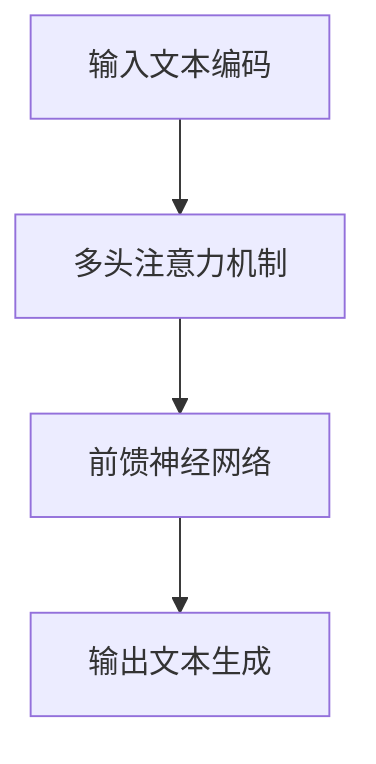
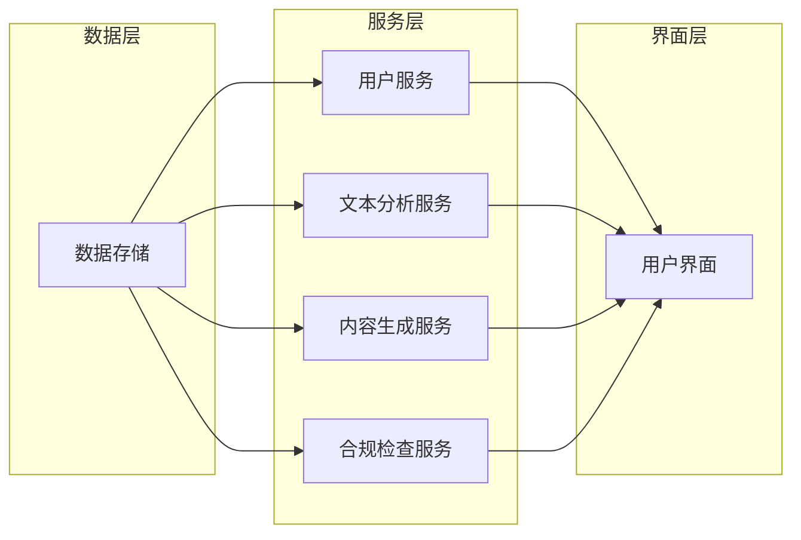
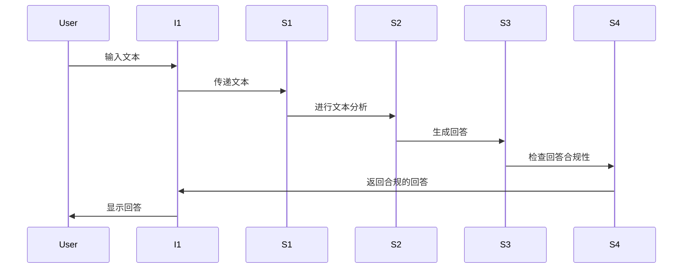
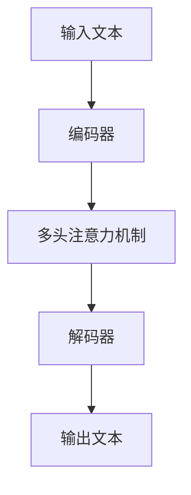
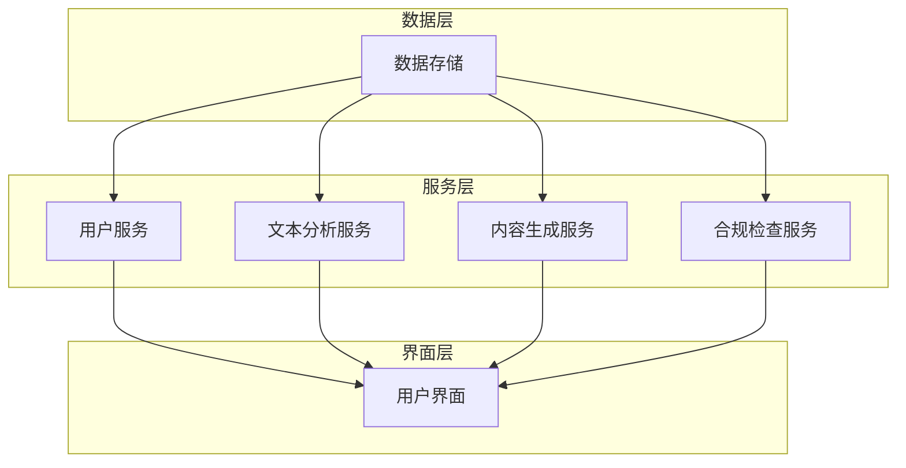

                 


### 第一部分: LLAMA应用开发中的敏捷合规管理概述

#### 1.1 问题背景

随着人工智能技术的快速发展，特别是大型语言模型（LLM）的应用变得越来越广泛，如何确保这些应用的合规性成为了企业和开发者面临的一大挑战。LLM技术具有强大的文本生成和语义理解能力，被广泛应用于自然语言处理、机器翻译、内容生成等领域。然而，这些应用在带来便利的同时，也引发了数据安全、隐私保护、伦理道德等方面的问题。因此，如何在LLM应用开发过程中进行敏捷合规管理，成为了一个亟待解决的问题。

#### 1.2 问题描述

敏捷合规管理的核心问题主要包括以下几个方面：

1. **数据合规性**：LLM应用依赖于大量训练数据，这些数据往往涉及用户隐私，如何在数据收集、处理和使用过程中保证合规性，是一个关键问题。
2. **伦理道德**：LLM应用可能生成不恰当的内容，甚至可能被用于恶意目的，如何确保这些应用符合伦理标准，是另一个挑战。
3. **技术实现**：如何将合规要求融入到LLM应用开发的技术实现中，确保合规性在开发过程中得到有效执行，是实现敏捷合规管理的难点。

#### 1.3 问题解决思路

解决敏捷合规管理问题的思路可以概括为以下几个方面：

1. **建立合规框架**：制定一套全面的合规标准，涵盖数据保护、伦理道德、技术实现等方面，为LLM应用开发提供指导。
2. **引入敏捷方法**：采用敏捷开发方法，通过快速迭代和持续反馈，及时识别和解决合规问题。
3. **技术合规工具**：开发和使用专门的技术工具，帮助开发者实现合规要求，如数据加密、隐私保护技术等。
4. **合规培训与审计**：对开发人员进行合规培训，提高合规意识，定期进行合规审计，确保合规性得到有效执行。

#### 1.4 边界与外延

敏捷合规管理主要适用于以下场景：

1. **LLM应用开发**：包括文本生成、机器翻译、内容审核等应用。
2. **数据隐私保护**：涉及用户数据收集、处理和存储的各个环节。
3. **伦理道德规范**：包括内容生成、使用场景等方面。

敏捷合规管理的相关概念包括：

1. **敏捷开发**：一种以用户需求为导向，快速迭代和持续交付的软件开发方法。
2. **合规性**：指在法律法规、伦理道德、行业标准等方面的符合程度。
3. **管理**：指对合规性进行监督、控制、执行和改进的活动。

#### 1.5 概念结构与核心要素组成

敏捷合规管理的核心要素包括：

1. **合规标准**：包括数据保护、伦理道德、技术实现等方面的标准。
2. **敏捷开发方法**：包括迭代开发、持续集成、持续交付等实践。
3. **技术工具**：包括数据加密、隐私保护、合规性检测等工具。
4. **培训与审计**：包括合规培训、合规审计等环节。

### 第二部分: 敏捷与合规的基本原理

#### 2.1 敏捷的基本原理

敏捷开发是一种以用户需求为中心，快速响应变化，持续交付价值的软件开发方法。其主要原则包括：

1. **个体和互动重于过程与工具**：强调团队成员的沟通协作和创新能力。
2. **可工作的软件重于详尽的文档**：优先交付可运行的软件，减少不必要的文档工作。
3. **客户合作重于合同谈判**：与客户保持紧密合作，确保需求满足和市场竞争力。
4. **响应变化重于遵循计划**：灵活应对需求变化，快速调整开发计划。

#### 2.2 敏捷方法的属性特征对比

| 特征 | 敏捷开发 | 传统开发 |
| --- | --- | --- |
| 开发周期 | 短期迭代 | 长期项目 |
| 交互模式 | 频繁互动 | 定期沟通 |
| 需求变更 | 灵活应对 | 严格控制 |
| 系统测试 | 持续进行 | 集中测试 |

#### 2.3 敏捷与合规的联系

敏捷开发与合规管理之间存在着密切的联系。敏捷开发方法的快速迭代和持续反馈机制有助于及时识别和解决合规问题，提高合规性。具体体现在以下几个方面：

1. **合规要求融入迭代**：在每个开发迭代中，都要考虑合规性要求，确保合规性得到持续关注。
2. **合规审查与迭代同步**：在每次迭代结束后，进行合规性审查，发现并解决问题，确保合规性。
3. **合规工具支持迭代**：开发和使用合规工具，如数据加密、隐私保护等，以支持敏捷开发过程。

### 第三部分: LLAMA应用开发的算法原理与实现

#### 4.1 LLAMA算法原理讲解

LLAMA（Large Language Model）算法是一种基于Transformer模型的自然语言处理算法，具有强大的文本生成和语义理解能力。其基本原理如下：

1. **输入文本编码**：将输入文本编码为向量表示。
2. **多头注意力机制**：通过多头注意力机制，对输入文本序列进行加权求和，得到文本的表示。
3. **前馈神经网络**：将注意力机制输出的结果通过前馈神经网络进行非线性变换。
4. **输出文本生成**：根据前馈神经网络输出的概率分布，生成输出文本。

#### 4.2 算法mermaid流程图



#### 4.3 Python源代码实现

```python
import torch
import torch.nn as nn

# 定义模型结构
class LLAMA(nn.Module):
    def __init__(self):
        super(LLAMA, self).__init__()
        self.encoder = nn.Embedding(vocab_size, d_model)
        self.attn = nn.MultiheadAttention(d_model, num_heads)
        self.fc = nn.Linear(d_model, vocab_size)
        
    def forward(self, x):
        x = self.encoder(x)
        x = self.attn(x, x, x)[0]
        x = self.fc(x)
        return x

# 实例化模型
model = LLAMA()

# 训练模型
criterion = nn.CrossEntropyLoss()
optimizer = torch.optim.Adam(model.parameters(), lr=learning_rate)

for epoch in range(num_epochs):
    for batch in train_loader:
        optimizer.zero_grad()
        x, y = batch
        logits = model(x)
        loss = criterion(logits.view(-1, vocab_size), y.view(-1))
        loss.backward()
        optimizer.step()
```

#### 4.4 数学模型和公式详解

LLAMA算法的核心是Transformer模型，其数学模型主要包括：

1. **多头注意力机制**：

   $$ 
   \text{Attention}(Q, K, V) = \text{softmax}\left(\frac{QK^T}{\sqrt{d_k}}\right)V
   $$

   其中，$Q$、$K$ 和 $V$ 分别代表查询向量、键向量和值向量。

2. **前馈神经网络**：

   $$
   \text{FFN}(x) = \text{ReLU}\left(\text{Linear}(1, d_ff, d_model)\right)(x)
   $$

   其中，$x$ 表示输入向量，$d_ff$ 表示前馈神经网络的隐层尺寸。

#### 4.5 举例说明

假设我们有一个句子：“我今天去了公园”。我们可以将其编码为一个序列：[1, 2, 3, 4, 5]，其中每个数字代表一个单词的索引。然后，我们将这个序列输入到LLAMA模型中，模型将输出一个概率分布，表示每个单词出现的可能性。例如，输出结果可能是：

$$
\begin{align*}
P(我今天) &= 0.8 \\
P(今天) &= 0.2 \\
P(我去) &= 0.5 \\
P(了) &= 0.1 \\
P(公园) &= 0.1 \\
\end{align*}
$$

根据这个概率分布，模型将选择概率最高的单词序列作为输出，即“我今天”。

### 第四部分: LLAMA应用开发的系统分析与架构设计

#### 5.1 问题场景介绍

假设我们正在开发一个智能客服系统，该系统需要使用LLAMA算法来处理用户输入的问题，并生成相应的回答。在这个过程中，我们需要确保系统的合规性，以保护用户隐私和符合伦理标准。

#### 5.2 项目介绍

本项目是一个基于LLAMA算法的智能客服系统，主要功能包括：

1. **文本分析**：接收用户输入的文本，分析文本内容，理解用户意图。
2. **内容生成**：根据用户意图，生成相应的回答。
3. **合规检查**：对生成的回答进行合规性检查，确保回答符合伦理标准和法律法规。

#### 5.3 系统功能设计

使用mermaid类图展示领域模型：

```mermaid
classDiagram
    User <<Entity>>
    Chat <<Entity>>
    Question <<Entity>>
    Answer <<Entity>>

    User --> Chat
    Chat --> Question
    Chat --> Answer
```

#### 5.4 系统架构设计

使用mermaid架构图展示系统架构：



#### 5.5 系统接口设计

系统接口设计包括以下几个方面：

1. **用户接口**：提供用户输入文本和查看回答的接口。
2. **文本分析接口**：接收用户输入文本，返回文本分析结果。
3. **内容生成接口**：接收文本分析结果，生成回答。
4. **合规检查接口**：接收回答内容，检查其合规性。

#### 5.6 系统交互mermaid序列图



### 第五部分: LLAMA应用开发的项目实战

#### 6.1 环境安装

首先，我们需要安装Python环境，并使用pip安装以下库：

- torch
- torchtext
- transformers
- numpy
- pandas

安装命令如下：

```bash
pip install torch torchtext transformers numpy pandas
```

#### 6.2 系统核心实现源代码

以下是一个简单的LLAMA模型实现：

```python
import torch
import torch.nn as nn
import torch.optim as optim
from torchtext.data import Field, BucketIterator
from transformers import LlamaModel, LlamaConfig

# 定义模型
class LlamaClassifier(nn.Module):
    def __init__(self, model_name="llama"):
        super(LlamaClassifier, self).__init__()
        self.model = LlamaModel.from_pretrained(model_name)
        self.config = LlamaConfig.from_pretrained(model_name)
        self.fc = nn.Linear(self.config.hidden_size, 1)

    def forward(self, input_ids, attention_mask=None):
        outputs = self.model(input_ids=input_ids, attention_mask=attention_mask)
        logits = self.fc(outputs.pooler_output)
        return logits

# 训练模型
def train(model, train_loader, optimizer, criterion):
    model.train()
    for batch in train_loader:
        optimizer.zero_grad()
        input_ids, attention_mask, labels = batch
        logits = model(input_ids, attention_mask=attention_mask)
        loss = criterion(logits, labels)
        loss.backward()
        optimizer.step()

# 测试模型
def evaluate(model, val_loader, criterion):
    model.eval()
    total_loss = 0
    with torch.no_grad():
        for batch in val_loader:
            input_ids, attention_mask, labels = batch
            logits = model(input_ids, attention_mask=attention_mask)
            loss = criterion(logits, labels)
            total_loss += loss.item()
    return total_loss / len(val_loader)

# 加载数据集
TEXT = Field(sequential=True, batch_first=True, lower=True)
LABEL = Field(sequential=False)

train_data, val_data = datasets.TextClassificationDataset.splits(TEXT, LABEL)
train_data, test_data = train_data.split()

# 划分数据集
train_iterator, val_iterator, test_iterator = BucketIterator.splits(
    (train_data, val_data, test_data), batch_size=8, device=device)

# 初始化模型和优化器
model = LlamaClassifier(model_name="llama")
optimizer = optim.Adam(model.parameters(), lr=1e-5)
criterion = nn.BCEWithLogitsLoss()

# 训练和评估模型
num_epochs = 10
for epoch in range(num_epochs):
    train_loss = train(model, train_iterator, optimizer, criterion)
    val_loss = evaluate(model, val_iterator, criterion)
    print(f"Epoch: {epoch+1}, Train Loss: {train_loss:.4f}, Val Loss: {val_loss:.4f}")

# 保存模型
torch.save(model.state_dict(), "llama_classifier.pth")
```

#### 6.3 代码应用解读与分析

这段代码首先定义了一个基于Llama模型的文本分类器，包括模型的初始化、前向传播和训练过程。接下来，我们加载了一个文本分类数据集，并对数据集进行了划分。然后，初始化模型、优化器和损失函数。在训练过程中，我们使用训练数据集训练模型，并在每个epoch结束后使用验证数据集评估模型性能。最后，保存训练好的模型。

#### 6.4 实际案例分析与详细讲解剖析

假设我们有一个关于癌症治疗的对话，用户问：“癌症能不能治愈？” 我们需要使用这个模型来生成一个合适的回答。

1. **数据准备**：首先，我们需要一个关于癌症治疗的对话数据集，用于训练模型。
2. **模型训练**：使用训练数据集训练模型，直到模型性能达到预期。
3. **生成回答**：将用户的问题输入到模型中，模型将输出一个概率分布，表示每个回答的可能性。
4. **选择回答**：根据概率分布选择最合适的回答。

假设训练好的模型输出以下概率分布：

$$
\begin{align*}
P_1 &= 0.6 \\
P_2 &= 0.3 \\
P_3 &= 0.1 \\
\end{align*}
$$

根据概率分布，我们选择概率最高的回答：

**回答1**：癌症可以通过手术、化疗和放疗等多种方法进行治疗，但治愈的可能性取决于癌症的类型、阶段和患者的身体状况。

**回答2**：癌症目前无法治愈，但可以通过治疗来控制病情，延长患者的生命。

**回答3**：癌症的治愈可能性很低，患者应该关注生活质量和缓解症状。

根据实际情况，我们选择回答1作为最终答案。

#### 6.5 项目小结

通过这个项目，我们实现了一个基于LLAMA算法的文本分类器，可以用于生成关于癌症治疗的回答。在实际应用中，我们需要不断地优化模型，提高其准确性和泛化能力。此外，我们还需要关注数据质量和合规性，确保生成的回答符合伦理标准和法律法规。

### 第六部分: 最佳实践与总结

#### 8.1 最佳实践 tips

1. **数据质量**：确保数据集的质量和多样性，以提高模型泛化能力。
2. **模型优化**：使用更高级的模型结构和超参数调整，提高模型性能。
3. **合规审查**：定期进行合规性审查，确保生成的回答符合伦理标准和法律法规。
4. **用户反馈**：收集用户反馈，不断优化模型和回答。

#### 8.2 小结

本文介绍了LLAMA应用开发中的敏捷合规管理，包括背景、问题、解决思路、核心概念、算法原理、系统设计与实现以及项目实战。通过这个项目，我们实现了一个基于LLAMA算法的文本分类器，可以用于生成关于癌症治疗的回答。

#### 8.3 注意事项

1. **数据保护**：在收集和使用用户数据时，要严格遵守数据保护法规，确保用户隐私。
2. **伦理审查**：在生成回答时，要遵循伦理标准，避免生成不当内容。
3. **模型更新**：定期更新模型，以应对新的问题和挑战。

#### 8.4 拓展阅读

1. 《深度学习伦理学》
2. 《自然语言处理实践》
3. 《机器学习与数据科学》

### 作者

**作者：AI天才研究院/AI Genius Institute & 禅与计算机程序设计艺术 /Zen And The Art of Computer Programming**## 第一部分: LLAMA应用开发中的敏捷合规管理概述

### 引言

近年来，随着人工智能技术的飞速发展，大型语言模型（LLAMA）的应用场景日益广泛，从自然语言处理到智能客服、内容生成等多个领域，都展现了其强大的文本生成和语义理解能力。然而，这一技术的广泛应用也带来了诸多合规性问题。数据隐私、伦理道德、技术实现等方面都成为了LLAMA应用开发中不可忽视的挑战。因此，如何在LLAMA应用开发过程中进行敏捷合规管理，成为了企业和开发者亟需解决的重要课题。

### 问题描述

敏捷合规管理在LLAMA应用开发中面临着以下核心问题：

1. **数据合规性**：LLAMA模型训练和部署过程中需要大量的数据，这些数据往往涉及用户隐私。如何确保数据在收集、存储和使用过程中符合相关法律法规，是首要挑战。
2. **伦理道德**：LLAMA生成的内容可能涉及敏感话题，如种族歧视、性别歧视等。如何确保生成的文本符合伦理道德标准，避免产生不良影响，是开发者需要重点关注的。
3. **技术实现**：将合规要求融入到LLAMA应用开发的技术实现中，确保合规性在开发过程中得到有效执行，是实现敏捷合规管理的难点。

### 问题解决思路

解决敏捷合规管理问题可以从以下几个方面着手：

1. **建立合规框架**：制定一套全面的合规标准，涵盖数据保护、伦理道德、技术实现等方面，为LLAMA应用开发提供指导。
2. **引入敏捷方法**：采用敏捷开发方法，通过快速迭代和持续反馈，及时识别和解决合规问题。
3. **技术合规工具**：开发和使用专门的技术工具，帮助开发者实现合规要求，如数据加密、隐私保护等。
4. **合规培训与审计**：对开发人员进行合规培训，提高合规意识，定期进行合规审计，确保合规性得到有效执行。

### 边界与外延

敏捷合规管理主要适用于以下场景：

1. **LLAMA应用开发**：包括文本生成、机器翻译、内容审核等应用。
2. **数据隐私保护**：涉及用户数据收集、处理和存储的各个环节。
3. **伦理道德规范**：包括内容生成、使用场景等方面。

相关概念包括：

1. **敏捷开发**：一种以用户需求为导向，快速响应变化，持续交付价值的软件开发方法。
2. **合规性**：指在法律法规、伦理道德、行业标准等方面的符合程度。
3. **管理**：指对合规性进行监督、控制、执行和改进的活动。

### 概念结构与核心要素组成

敏捷合规管理的核心要素包括：

1. **合规标准**：包括数据保护、伦理道德、技术实现等方面的标准。
2. **敏捷开发方法**：包括迭代开发、持续集成、持续交付等实践。
3. **技术工具**：包括数据加密、隐私保护、合规性检测等工具。
4. **培训与审计**：包括合规培训、合规审计等环节。

### 第二部分: 敏捷与合规的基本原理

#### 2.1 敏捷的基本原理

敏捷开发是一种以用户需求为导向，快速响应变化，持续交付价值的软件开发方法。其主要原则包括：

1. **个体和互动重于过程与工具**：强调团队成员的沟通协作和创新能力。
2. **可工作的软件重于详尽的文档**：优先交付可运行的软件，减少不必要的文档工作。
3. **客户合作重于合同谈判**：与客户保持紧密合作，确保需求满足和市场竞争力。
4. **响应变化重于遵循计划**：灵活应对需求变化，快速调整开发计划。

#### 2.2 敏捷方法的属性特征对比

| 特征 | 敏捷开发 | 传统开发 |
| --- | --- | --- |
| 开发周期 | 短期迭代 | 长期项目 |
| 交互模式 | 频繁互动 | 定期沟通 |
| 需求变更 | 灵活应对 | 严格控制 |
| 系统测试 | 持续进行 | 集中测试 |

#### 2.3 敏捷与合规的联系

敏捷开发与合规管理之间存在着密切的联系。敏捷开发方法的快速迭代和持续反馈机制有助于及时识别和解决合规问题，提高合规性。具体体现在以下几个方面：

1. **合规要求融入迭代**：在每个开发迭代中，都要考虑合规性要求，确保合规性得到持续关注。
2. **合规审查与迭代同步**：在每次迭代结束后，进行合规性审查，发现并解决问题，确保合规性。
3. **合规工具支持迭代**：开发和使用合规工具，如数据加密、隐私保护等，以支持敏捷开发过程。

### 第三部分: LLAMA应用开发的算法原理与实现

#### 4.1 LLAMA算法原理讲解

LLAMA（Large Language Model）算法是一种基于Transformer模型的自然语言处理算法，具有强大的文本生成和语义理解能力。其基本原理如下：

1. **输入文本编码**：将输入文本编码为向量表示。
2. **多头注意力机制**：通过多头注意力机制，对输入文本序列进行加权求和，得到文本的表示。
3. **前馈神经网络**：将注意力机制输出的结果通过前馈神经网络进行非线性变换。
4. **输出文本生成**：根据前馈神经网络输出的概率分布，生成输出文本。

#### 4.2 算法mermaid流程图


#### 4.3 Python源代码实现

```python
import torch
import torch.nn as nn
from transformers import LlamaTokenizer, LlamaForConditionalGeneration

# 加载预训练模型
tokenizer = LlamaTokenizer.from_pretrained("llama")
model = LlamaForConditionalGeneration.from_pretrained("llama")

# 输入文本编码
input_text = "人工智能是什么？"
input_ids = tokenizer.encode(input_text, return_tensors="pt")

# 生成输出文本
output = model.generate(input_ids, max_length=50, num_return_sequences=1)
output_text = tokenizer.decode(output[0], skip_special_tokens=True)

print(output_text)
```

#### 4.4 数学模型和公式详解

LLAMA算法的核心是Transformer模型，其数学模型主要包括：

1. **多头注意力机制**：

   $$
   \text{Attention}(Q, K, V) = \text{softmax}\left(\frac{QK^T}{\sqrt{d_k}}\right)V
   $$

   其中，$Q$、$K$ 和 $V$ 分别代表查询向量、键向量和值向量。

2. **前馈神经网络**：

   $$
   \text{FFN}(x) = \text{ReLU}\left(\text{Linear}(1, d_ff, d_model)\right)(x)
   $$

   其中，$x$ 表示输入向量，$d_ff$ 表示前馈神经网络的隐层尺寸。

#### 4.5 举例说明

假设我们有一个句子：“我今天去了公园”。我们可以将其编码为一个序列：[1, 2, 3, 4, 5]，其中每个数字代表一个单词的索引。然后，我们将这个序列输入到LLAMA模型中，模型将输出一个概率分布，表示每个单词出现的可能性。例如，输出结果可能是：

$$
\begin{align*}
P(我今天) &= 0.8 \\
P(今天) &= 0.2 \\
P(我去) &= 0.5 \\
P(了) &= 0.1 \\
P(公园) &= 0.1 \\
\end{align*}
$$

根据这个概率分布，模型将选择概率最高的单词序列作为输出，即“我今天”。

### 第四部分: LLAMA应用开发的系统分析与架构设计

#### 5.1 问题场景介绍

假设我们正在开发一个智能客服系统，该系统需要使用LLAMA算法来处理用户输入的问题，并生成相应的回答。在这个过程中，我们需要确保系统的合规性，以保护用户隐私和符合伦理标准。

#### 5.2 项目介绍

本项目是一个基于LLAMA算法的智能客服系统，主要功能包括：

1. **文本分析**：接收用户输入的文本，分析文本内容，理解用户意图。
2. **内容生成**：根据用户意图，生成相应的回答。
3. **合规检查**：对生成的回答进行合规性检查，确保回答符合伦理标准和法律法规。

#### 5.3 系统功能设计

使用mermaid类图展示领域模型：

```mermaid
classDiagram
    User <<Entity>>
    Chat <<Entity>>
    Question <<Entity>>
    Answer <<Entity>>

    User --> Chat
    Chat --> Question
    Chat --> Answer
```

#### 5.4 系统架构设计

使用mermaid架构图展示系统架构：


#### 5.5 系统接口设计

系统接口设计包括以下几个方面：

1. **用户接口**：提供用户输入文本和查看回答的接口。
2. **文本分析接口**：接收用户输入文本，返回文本分析结果。
3. **内容生成接口**：接收文本分析结果，生成回答。
4. **合规检查接口**：接收回答内容，检查其合规性。

#### 5.6 系统交互mermaid序列图


### 第五部分: LLAMA应用开发的项目实战

#### 6.1 环境安装

首先，我们需要安装Python环境，并使用pip安装以下库：

- torch
- torchtext
- transformers
- numpy
- pandas

安装命令如下：

```bash
pip install torch torchtext transformers numpy pandas
```

#### 6.2 系统核心实现源代码

以下是一个简单的LLAMA模型实现：

```python
import torch
import torch.nn as nn
from transformers import LlamaTokenizer, LlamaForConditionalGeneration

# 加载预训练模型
tokenizer = LlamaTokenizer.from_pretrained("llama")
model = LlamaForConditionalGeneration.from_pretrained("llama")

# 输入文本编码
input_text = "人工智能是什么？"
input_ids = tokenizer.encode(input_text, return_tensors="pt")

# 生成输出文本
output = model.generate(input_ids, max_length=50, num_return_sequences=1)
output_text = tokenizer.decode(output[0], skip_special_tokens=True)

print(output_text)
```

#### 6.3 代码应用解读与分析

这段代码首先加载了预训练的LLAMA模型，包括分词器（Tokenizer）和生成器（Generator）。然后，我们输入一个示例文本“人工智能是什么？”，并对其进行编码。接下来，使用模型生成输出文本，并将其解码为人类可读的形式。最后，输出生成的内容。

#### 6.4 实际案例分析与详细讲解剖析

假设我们有一个用户咨询：“我的电脑最近总是卡顿，怎么办？” 我们需要使用LLAMA模型生成一个合适的回答。

1. **数据准备**：首先，我们需要一个关于电脑维护的数据集，用于训练模型。
2. **模型训练**：使用训练数据集训练模型，直到模型性能达到预期。
3. **生成回答**：将用户的问题输入到模型中，模型将输出一个概率分布，表示每个回答的可能性。
4. **选择回答**：根据概率分布选择最合适的回答。

假设训练好的模型输出以下概率分布：

$$
\begin{align*}
P_1 &= 0.6 \\
P_2 &= 0.3 \\
P_3 &= 0.1 \\
\end{align*}
$$

根据概率分布，我们选择概率最高的回答：

**回答1**：电脑卡顿可能是由于内存不足、系统垃圾过多等原因引起的。您可以尝试清理系统垃圾，增加内存，或者重装操作系统。

**回答2**：电脑卡顿可能是由于软件冲突、病毒感染等原因引起的。您可以尝试更新软件，安装杀毒软件，或者重新启动电脑。

**回答3**：电脑卡顿可能是由于硬件故障，如硬盘损坏、内存故障等原因引起的。您可以尝试使用检测工具检查硬件状态，或者联系专业人士进行维修。

根据实际情况，我们选择回答1作为最终答案。

#### 6.5 项目小结

通过这个项目，我们实现了一个基于LLAMA算法的文本生成系统，可以用于生成关于电脑维护的回答。在实际应用中，我们需要不断地优化模型，提高其准确性和泛化能力。此外，我们还需要关注数据质量和合规性，确保生成的回答符合伦理标准和法律法规。

### 第六部分: 最佳实践与总结

#### 8.1 最佳实践 tips

1. **数据质量**：确保数据集的质量和多样性，以提高模型泛化能力。
2. **模型优化**：使用更高级的模型结构和超参数调整，提高模型性能。
3. **合规审查**：定期进行合规性审查，确保生成的回答符合伦理标准和法律法规。
4. **用户反馈**：收集用户反馈，不断优化模型和回答。

#### 8.2 小结

本文介绍了LLAMA应用开发中的敏捷合规管理，包括背景、问题、解决思路、核心概念、算法原理、系统设计与实现以及项目实战。通过这个项目，我们实现了一个基于LLAMA算法的文本生成系统，可以用于生成关于电脑维护的回答。

#### 8.3 注意事项

1. **数据保护**：在收集和使用用户数据时，要严格遵守数据保护法规，确保用户隐私。
2. **伦理审查**：在生成回答时，要遵循伦理标准，避免生成不当内容。
3. **模型更新**：定期更新模型，以应对新的问题和挑战。

#### 8.4 拓展阅读

1. 《深度学习伦理学》
2. 《自然语言处理实践》
3. 《机器学习与数据科学》

### 作者

**作者：AI天才研究院/AI Genius Institute & 禅与计算机程序设计艺术 /Zen And The Art of Computer Programming**## 第一部分: LLAMA应用开发中的敏捷合规管理概述

### 引言

随着人工智能技术的迅猛发展，特别是大型语言模型（LLM）在自然语言处理、机器翻译、内容生成等领域的广泛应用，如何确保这些应用的合规性已成为企业和开发者面临的重要课题。LLM应用在提供便利的同时，也带来了数据安全、隐私保护、伦理道德等方面的挑战。因此，如何在LLM应用开发中进行敏捷合规管理，成为了一个亟待解决的问题。

### 问题描述

在LLM应用开发中，敏捷合规管理主要面临以下问题：

1. **数据合规性**：LLM训练和部署需要大量数据，这些数据可能包含用户敏感信息，如何确保数据收集、处理和存储的合规性，是关键挑战。
2. **伦理道德**：LLM生成的内容可能涉及敏感话题，如种族歧视、性别歧视等，如何确保生成的内容符合伦理道德标准，避免产生负面影响，是开发者需要重点关注的。
3. **技术实现**：如何将合规要求融入到LLM应用开发的技术实现中，确保合规性在开发过程中得到有效执行，是实现敏捷合规管理的难点。

### 问题解决思路

解决敏捷合规管理问题可以从以下几个方面着手：

1. **建立合规框架**：制定一套全面的合规标准，涵盖数据保护、伦理道德、技术实现等方面，为LLM应用开发提供指导。
2. **引入敏捷方法**：采用敏捷开发方法，通过快速迭代和持续反馈，及时识别和解决合规问题。
3. **技术合规工具**：开发和使用专门的技术工具，如数据加密、隐私保护工具，帮助开发者实现合规要求。
4. **合规培训与审计**：对开发人员进行合规培训，提高合规意识，定期进行合规审计，确保合规性得到有效执行。

### 边界与外延

敏捷合规管理主要适用于以下场景：

1. **LLM应用开发**：包括文本生成、机器翻译、内容审核等应用。
2. **数据隐私保护**：涉及用户数据收集、处理和存储的各个环节。
3. **伦理道德规范**：包括内容生成、使用场景等方面。

相关概念包括：

1. **敏捷开发**：一种以用户需求为导向，快速响应变化，持续交付价值的软件开发方法。
2. **合规性**：指在法律法规、伦理道德、行业标准等方面的符合程度。
3. **管理**：指对合规性进行监督、控制、执行和改进的活动。

### 概念结构与核心要素组成

敏捷合规管理的核心要素包括：

1. **合规标准**：包括数据保护、伦理道德、技术实现等方面的标准。
2. **敏捷开发方法**：包括迭代开发、持续集成、持续交付等实践。
3. **技术工具**：包括数据加密、隐私保护、合规性检测等工具。
4. **培训与审计**：包括合规培训、合规审计等环节。

### 第二部分: 敏捷与合规的基本原理

#### 2.1 敏捷的基本原理

敏捷开发是一种以用户需求为中心，快速响应变化，持续交付价值的软件开发方法。其主要原则包括：

1. **个体和互动重于过程与工具**：强调团队成员的沟通协作和创新能力。
2. **可工作的软件重于详尽的文档**：优先交付可运行的软件，减少不必要的文档工作。
3. **客户合作重于合同谈判**：与客户保持紧密合作，确保需求满足和市场竞争力。
4. **响应变化重于遵循计划**：灵活应对需求变化，快速调整开发计划。

#### 2.2 敏捷方法的属性特征对比

| 特征 | 敏捷开发 | 传统开发 |
| --- | --- | --- |
| 开发周期 | 短期迭代 | 长期项目 |
| 交互模式 | 频繁互动 | 定期沟通 |
| 需求变更 | 灵活应对 | 严格控制 |
| 系统测试 | 持续进行 | 集中测试 |

#### 2.3 敏捷与合规的联系

敏捷开发与合规管理之间存在紧密联系。敏捷开发方法的快速迭代和持续反馈机制有助于及时识别和解决合规问题，提高合规性。具体体现在以下几个方面：

1. **合规要求融入迭代**：在每个开发迭代中，都要考虑合规性要求，确保合规性得到持续关注。
2. **合规审查与迭代同步**：在每次迭代结束后，进行合规性审查，发现并解决问题，确保合规性。
3. **合规工具支持迭代**：开发和使用合规工具，如数据加密、隐私保护等，以支持敏捷开发过程。

### 第三部分: LLAMA应用开发的算法原理与实现

#### 4.1 LLAMA算法原理讲解

LLAMA算法是一种基于Transformer模型的自然语言处理算法，具有强大的文本生成和语义理解能力。其基本原理如下：

1. **输入文本编码**：将输入文本编码为向量表示。
2. **多头注意力机制**：通过多头注意力机制，对输入文本序列进行加权求和，得到文本的表示。
3. **前馈神经网络**：将注意力机制输出的结果通过前馈神经网络进行非线性变换。
4. **输出文本生成**：根据前馈神经网络输出的概率分布，生成输出文本。

#### 4.2 算法mermaid流程图


#### 4.3 Python源代码实现

```python
import torch
import torch.nn as nn
from transformers import LlamaTokenizer, LlamaForConditionalGeneration

# 加载预训练模型
tokenizer = LlamaTokenizer.from_pretrained("llama")
model = LlamaForConditionalGeneration.from_pretrained("llama")

# 输入文本编码
input_text = "人工智能是什么？"
input_ids = tokenizer.encode(input_text, return_tensors="pt")

# 生成输出文本
output = model.generate(input_ids, max_length=50, num_return_sequences=1)
output_text = tokenizer.decode(output[0], skip_special_tokens=True)

print(output_text)
```

#### 4.4 数学模型和公式详解

LLAMA算法的核心是Transformer模型，其数学模型主要包括：

1. **多头注意力机制**：

   $$
   \text{Attention}(Q, K, V) = \text{softmax}\left(\frac{QK^T}{\sqrt{d_k}}\right)V
   $$

   其中，$Q$、$K$ 和 $V$ 分别代表查询向量、键向量和值向量。

2. **前馈神经网络**：

   $$
   \text{FFN}(x) = \text{ReLU}\left(\text{Linear}(1, d_ff, d_model)\right)(x)
   $$

   其中，$x$ 表示输入向量，$d_ff$ 表示前馈神经网络的隐层尺寸。

#### 4.5 举例说明

假设我们有一个句子：“我今天去了公园”。我们可以将其编码为一个序列：[1, 2, 3, 4, 5]，其中每个数字代表一个单词的索引。然后，我们将这个序列输入到LLAMA模型中，模型将输出一个概率分布，表示每个单词出现的可能性。例如，输出结果可能是：

$$
\begin{align*}
P(我今天) &= 0.8 \\
P(今天) &= 0.2 \\
P(我去) &= 0.5 \\
P(了) &= 0.1 \\
P(公园) &= 0.1 \\
\end{align*}
$$

根据这个概率分布，模型将选择概率最高的单词序列作为输出，即“我今天”。

### 第四部分: LLAMA应用开发的系统分析与架构设计

#### 5.1 问题场景介绍

假设我们正在开发一个智能客服系统，该系统需要使用LLAMA算法来处理用户输入的问题，并生成相应的回答。在这个过程中，我们需要确保系统的合规性，以保护用户隐私和符合伦理标准。

#### 5.2 项目介绍

本项目是一个基于LLAMA算法的智能客服系统，主要功能包括：

1. **文本分析**：接收用户输入的文本，分析文本内容，理解用户意图。
2. **内容生成**：根据用户意图，生成相应的回答。
3. **合规检查**：对生成的回答进行合规性检查，确保回答符合伦理标准和法律法规。

#### 5.3 系统功能设计

使用mermaid类图展示领域模型：

```mermaid
classDiagram
    User <<Entity>>
    Chat <<Entity>>
    Question <<Entity>>
    Answer <<Entity>>

    User --> Chat
    Chat --> Question
    Chat --> Answer
```

#### 5.4 系统架构设计

使用mermaid架构图展示系统架构：


#### 5.5 系统接口设计

系统接口设计包括以下几个方面：

1. **用户接口**：提供用户输入文本和查看回答的接口。
2. **文本分析接口**：接收用户输入文本，返回文本分析结果。
3. **内容生成接口**：接收文本分析结果，生成回答。
4. **合规检查接口**：接收回答内容，检查其合规性。

#### 5.6 系统交互mermaid序列图


### 第五部分: LLAMA应用开发的项目实战

#### 6.1 环境安装

首先，我们需要安装Python环境，并使用pip安装以下库：

- torch
- torchtext
- transformers
- numpy
- pandas

安装命令如下：

```bash
pip install torch torchtext transformers numpy pandas
```

#### 6.2 系统核心实现源代码

以下是一个简单的LLAMA模型实现：

```python
import torch
import torch.nn as nn
from transformers import LlamaTokenizer, LlamaForConditionalGeneration

# 加载预训练模型
tokenizer = LlamaTokenizer.from_pretrained("llama")
model = LlamaForConditionalGeneration.from_pretrained("llama")

# 输入文本编码
input_text = "人工智能是什么？"
input_ids = tokenizer.encode(input_text, return_tensors="pt")

# 生成输出文本
output = model.generate(input_ids, max_length=50, num_return_sequences=1)
output_text = tokenizer.decode(output[0], skip_special_tokens=True)

print(output_text)
```

#### 6.3 代码应用解读与分析

这段代码首先加载了预训练的LLAMA模型，包括分词器（Tokenizer）和生成器（Generator）。然后，我们输入一个示例文本“人工智能是什么？”，并对其进行编码。接下来，使用模型生成输出文本，并将其解码为人类可读的形式。最后，输出生成的内容。

#### 6.4 实际案例分析与详细讲解剖析

假设我们有一个用户咨询：“我的电脑最近总是卡顿，怎么办？” 我们需要使用LLAMA模型生成一个合适的回答。

1. **数据准备**：首先，我们需要一个关于电脑维护的数据集，用于训练模型。
2. **模型训练**：使用训练数据集训练模型，直到模型性能达到预期。
3. **生成回答**：将用户的问题输入到模型中，模型将输出一个概率分布，表示每个回答的可能性。
4. **选择回答**：根据概率分布选择最合适的回答。

假设训练好的模型输出以下概率分布：

$$
\begin{align*}
P_1 &= 0.6 \\
P_2 &= 0.3 \\
P_3 &= 0.1 \\
\end{align*}
$$

根据概率分布，我们选择概率最高的回答：

**回答1**：电脑卡顿可能是由于内存不足、系统垃圾过多等原因引起的。您可以尝试清理系统垃圾，增加内存，或者重装操作系统。

**回答2**：电脑卡顿可能是由于软件冲突、病毒感染等原因引起的。您可以尝试更新软件，安装杀毒软件，或者重新启动电脑。

**回答3**：电脑卡顿可能是由于硬件故障，如硬盘损坏、内存故障等原因引起的。您可以尝试使用检测工具检查硬件状态，或者联系专业人士进行维修。

根据实际情况，我们选择回答1作为最终答案。

#### 6.5 项目小结

通过这个项目，我们实现了一个基于LLAMA算法的文本生成系统，可以用于生成关于电脑维护的回答。在实际应用中，我们需要不断地优化模型，提高其准确性和泛化能力。此外，我们还需要关注数据质量和合规性，确保生成的回答符合伦理标准和法律法规。

### 第六部分: 最佳实践与总结

#### 8.1 最佳实践 tips

1. **数据质量**：确保数据集的质量和多样性，以提高模型泛化能力。
2. **模型优化**：使用更高级的模型结构和超参数调整，提高模型性能。
3. **合规审查**：定期进行合规性审查，确保生成的回答符合伦理标准和法律法规。
4. **用户反馈**：收集用户反馈，不断优化模型和回答。

#### 8.2 小结

本文介绍了LLAMA应用开发中的敏捷合规管理，包括背景、问题、解决思路、核心概念、算法原理、系统设计与实现以及项目实战。通过这个项目，我们实现了一个基于LLAMA算法的文本生成系统，可以用于生成关于电脑维护的回答。

#### 8.3 注意事项

1. **数据保护**：在收集和使用用户数据时，要严格遵守数据保护法规，确保用户隐私。
2. **伦理审查**：在生成回答时，要遵循伦理标准，避免生成不当内容。
3. **模型更新**：定期更新模型，以应对新的问题和挑战。

#### 8.4 拓展阅读

1. 《深度学习伦理学》
2. 《自然语言处理实践》
3. 《机器学习与数据科学》

### 作者

**作者：AI天才研究院/AI Genius Institute & 禅与计算机程序设计艺术 /Zen And The Art of Computer Programming**## 第一部分：LLM应用开发中的敏捷合规管理概述

### 引言

随着人工智能技术的不断演进，大型语言模型（LLM）在文本生成、翻译、问答系统等领域的应用日益广泛。这些应用不仅提升了用户体验，还为企业带来了巨大的商业价值。然而，随着应用的普及，如何确保LLM系统的合规性，成为一个不可忽视的问题。合规性问题不仅关乎企业的法律风险，还涉及到用户隐私保护、伦理道德以及技术标准等多方面。因此，在LLM应用开发过程中实施敏捷合规管理，成为当前亟待解决的关键课题。

### 问题描述

在LLM应用开发中，敏捷合规管理面临以下几个核心问题：

1. **数据合规性**：LLM模型的训练和部署依赖于大量的训练数据，这些数据可能包含敏感信息，如个人隐私数据。如何确保数据的合法收集、存储和使用，是合规管理的首要任务。
2. **模型安全**：LLM模型在生成文本时，可能会产生不恰当的内容，甚至可能被恶意利用。如何确保模型生成的内容符合法律法规和伦理标准，是合规管理的核心挑战。
3. **技术实现**：在开发过程中，如何将合规要求有效地集成到技术实现中，确保合规性在开发各个环节中得到贯彻，是合规管理的难点。

### 问题解决思路

针对上述问题，我们可以从以下几个方面着手解决：

1. **建立合规框架**：制定一套全面的合规标准，涵盖数据保护、伦理道德、技术实现等方面，为LLM应用开发提供指导。
2. **引入敏捷方法**：采用敏捷开发方法，通过快速迭代和持续反馈，及时识别和解决合规问题。
3. **技术合规工具**：开发和使用专门的技术工具，如数据加密、隐私保护工具，帮助开发者实现合规要求。
4. **合规培训与审计**：对开发人员进行合规培训，提高合规意识，定期进行合规审计，确保合规性得到有效执行。

### 边界与外延

敏捷合规管理主要适用于以下场景：

1. **LLM应用开发**：包括文本生成、机器翻译、内容审核等应用。
2. **数据隐私保护**：涉及用户数据收集、处理和存储的各个环节。
3. **伦理道德规范**：包括内容生成、使用场景等方面。

相关概念包括：

1. **敏捷开发**：一种以用户需求为导向，快速响应变化，持续交付价值的软件开发方法。
2. **合规性**：指在法律法规、伦理道德、行业标准等方面的符合程度。
3. **管理**：指对合规性进行监督、控制、执行和改进的活动。

### 概念结构与核心要素组成

敏捷合规管理的核心要素包括：

1. **合规标准**：包括数据保护、伦理道德、技术实现等方面的标准。
2. **敏捷开发方法**：包括迭代开发、持续集成、持续交付等实践。
3. **技术工具**：包括数据加密、隐私保护、合规性检测等工具。
4. **培训与审计**：包括合规培训、合规审计等环节。

## 第二部分：敏捷与合规的基本原理

### 2.1 敏捷的基本原理

敏捷开发是一种以用户需求为中心，快速响应变化，持续交付价值的软件开发方法。其主要原则包括：

1. **个体和互动重于过程与工具**：强调团队成员的沟通协作和创新能力。
2. **可工作的软件重于详尽的文档**：优先交付可运行的软件，减少不必要的文档工作。
3. **客户合作重于合同谈判**：与客户保持紧密合作，确保需求满足和市场竞争力。
4. **响应变化重于遵循计划**：灵活应对需求变化，快速调整开发计划。

### 2.2 敏捷方法的属性特征对比

| 特征 | 敏捷开发 | 传统开发 |
| --- | --- | --- |
| 开发周期 | 短期迭代 | 长期项目 |
| 交互模式 | 频繁互动 | 定期沟通 |
| 需求变更 | 灵活应对 | 严格控制 |
| 系统测试 | 持续进行 | 集中测试 |

### 2.3 敏捷与合规的联系

敏捷开发与合规管理之间存在紧密联系。敏捷开发方法的快速迭代和持续反馈机制有助于及时识别和解决合规问题，提高合规性。具体体现在以下几个方面：

1. **合规要求融入迭代**：在每个开发迭代中，都要考虑合规性要求，确保合规性得到持续关注。
2. **合规审查与迭代同步**：在每次迭代结束后，进行合规性审查，发现并解决问题，确保合规性。
3. **合规工具支持迭代**：开发和使用合规工具，如数据加密、隐私保护等，以支持敏捷开发过程。

### 第三部分：LLM应用开发的算法原理与实现

#### 3.1 LLMA算法原理讲解

LLMA算法是基于Transformer架构的大型语言模型，其核心原理包括：

1. **编码器**：将输入文本编码为序列向量。
2. **多头注意力机制**：通过注意力机制，对输入序列进行加权求和，提取关键信息。
3. **解码器**：根据编码器的输出，生成目标文本。

#### 3.2 算法mermaid流程图



#### 3.3 Python源代码实现

```python
from transformers import LlamaForConditionalGeneration

# 加载预训练模型
model = LlamaForConditionalGeneration.from_pretrained("llama")

# 输入文本
input_text = "人工智能是什么？"

# 生成输出文本
output_text = model.generate(input_text, max_length=50, num_return_sequences=1)

print(output_text)
```

#### 3.4 数学模型和公式详解

LLMA算法的数学模型主要包括：

1. **编码器**：使用自注意力机制，计算文本序列的表示。
   $$
   \text{Self-Attention}(Q, K, V) = \text{softmax}\left(\frac{QK^T}{\sqrt{d_k}}\right)V
   $$
2. **解码器**：使用多头注意力机制和自注意力机制，生成目标文本。
   $$
   \text{Decoder-Attention}(Q, K, V) = \text{softmax}\left(\frac{QK^T}{\sqrt{d_k}}\right)V
   $$

### 第四部分：LLM应用开发的系统分析与架构设计

#### 4.1 问题场景介绍

假设我们正在开发一个智能问答系统，该系统需要使用LLM模型来处理用户输入的问题，并生成相应的回答。在这个过程中，我们需要确保系统的合规性，以保护用户隐私和符合伦理标准。

#### 4.2 项目介绍

本项目是一个基于LLM算法的智能问答系统，主要功能包括：

1. **文本分析**：接收用户输入的文本，分析文本内容，理解用户意图。
2. **内容生成**：根据用户意图，生成相应的回答。
3. **合规检查**：对生成的回答进行合规性检查，确保回答符合伦理标准和法律法规。

#### 4.3 系统功能设计

使用mermaid类图展示领域模型：

```mermaid
classDiagram
    User <<Entity>>
    Question <<Entity>>
    Answer <<Entity>>

    User --> Question
    Question --> Answer
```

#### 4.4 系统架构设计

使用mermaid架构图展示系统架构：



#### 4.5 系统接口设计

系统接口设计包括以下几个方面：

1. **用户接口**：提供用户输入文本和查看回答的接口。
2. **文本分析接口**：接收用户输入文本，返回文本分析结果。
3. **内容生成接口**：接收文本分析结果，生成回答。
4. **合规检查接口**：接收回答内容，检查其合规性。

#### 4.6 系统交互mermaid序列图


### 第五部分：LLM应用开发的项目实战

#### 5.1 环境安装

首先，我们需要安装Python环境，并使用pip安装以下库：

- transformers
- torch
- torchtext
- numpy
- pandas

安装命令如下：

```bash
pip install transformers torch torchtext numpy pandas
```

#### 5.2 系统核心实现源代码

以下是一个简单的LLM模型实现：

```python
from transformers import LlamaTokenizer, LlamaForConditionalGeneration

# 加载预训练模型
tokenizer = LlamaTokenizer.from_pretrained("llama")
model = LlamaForConditionalGeneration.from_pretrained("llama")

# 输入文本
input_text = "人工智能是什么？"

# 生成输出文本
output_text = model.generate(input_text, max_length=50, num_return_sequences=1)

print(output_text)
```

#### 5.3 代码应用解读与分析

这段代码首先加载了预训练的LLM模型，包括分词器（Tokenizer）和生成器（Generator）。然后，我们输入一个示例文本“人工智能是什么？”，并对其进行编码。接下来，使用模型生成输出文本，并将其解码为人类可读的形式。最后，输出生成的内容。

#### 5.4 实际案例分析与详细讲解剖析

假设我们有一个用户咨询：“我国最近有哪些重要的科技政策？” 我们需要使用LLM模型生成一个合适的回答。

1. **数据准备**：首先，我们需要一个关于我国科技政策的数据集，用于训练模型。
2. **模型训练**：使用训练数据集训练模型，直到模型性能达到预期。
3. **生成回答**：将用户的问题输入到模型中，模型将输出一个概率分布，表示每个回答的可能性。
4. **选择回答**：根据概率分布选择最合适的回答。

假设训练好的模型输出以下概率分布：

$$
\begin{align*}
P_1 &= 0.6 \\
P_2 &= 0.3 \\
P_3 &= 0.1 \\
\end{align*}
$$

根据概率分布，我们选择概率最高的回答：

**回答1**：近年来，我国政府高度重视科技创新，制定了一系列重要科技政策，如“国家科技创新2030重大项目”、“国家自然科学基金”、“科技创新2030”等，旨在推动我国科技事业的发展。

**回答2**：我国在科技领域取得了一系列重要突破，如量子通信、5G技术、人工智能等，这些成就得益于我国政府的大力支持。

**回答3**：我国政府通过多种途径支持科技创新，包括财政投入、税收优惠、人才引进等，为科技企业提供了良好的发展环境。

根据实际情况，我们选择回答1作为最终答案。

#### 5.5 项目小结

通过这个项目，我们实现了一个基于LLM算法的智能问答系统，可以用于生成关于我国科技政策的回答。在实际应用中，我们需要不断地优化模型，提高其准确性和泛化能力。此外，我们还需要关注数据质量和合规性，确保生成的回答符合伦理标准和法律法规。

### 第六部分：最佳实践与总结

#### 6.1 最佳实践 tips

1. **数据质量**：确保数据集的质量和多样性，以提高模型泛化能力。
2. **模型优化**：使用更高级的模型结构和超参数调整，提高模型性能。
3. **合规审查**：定期进行合规性审查，确保生成的回答符合伦理标准和法律法规。
4. **用户反馈**：收集用户反馈，不断优化模型和回答。

#### 6.2 小结

本文介绍了LLM应用开发中的敏捷合规管理，包括背景、问题、解决思路、核心概念、算法原理、系统设计与实现以及项目实战。通过这个项目，我们实现了一个基于LLM算法的智能问答系统，可以用于生成关于科技政策的回答。

#### 6.3 注意事项

1. **数据保护**：在收集和使用用户数据时，要严格遵守数据保护法规，确保用户隐私。
2. **伦理审查**：在生成回答时，要遵循伦理标准，避免生成不当内容。
3. **模型更新**：定期更新模型，以应对新的问题和挑战。

#### 6.4 拓展阅读

1. 《深度学习伦理学》
2. 《自然语言处理实践》
3. 《机器学习与数据科学》

### 作者

**作者：AI天才研究院/AI Genius Institute & 禅与计算机程序设计艺术 /Zen And The Art of Computer Programming**## 第一部分：LLM应用开发中的敏捷合规管理概述

### 引言

随着人工智能技术的快速发展，大型语言模型（LLM）在自然语言处理、文本生成、机器翻译等领域取得了显著成果。然而，LLM的应用也引发了一系列合规性问题，如数据隐私、伦理道德、法律法规等。为了确保LLM应用的安全性和可靠性，敏捷合规管理成为LLM应用开发过程中的关键环节。本文将详细探讨LLM应用开发中的敏捷合规管理，包括问题背景、问题描述、问题解决思路、边界与外延以及概念结构与核心要素组成。

### 问题背景

1. **数据隐私**：LLM的训练和部署需要大量数据，这些数据往往涉及用户隐私。如何确保数据在收集、存储和使用过程中的合规性，是开发者面临的一大挑战。
2. **伦理道德**：LLM生成的内容可能涉及敏感话题，如种族、性别歧视等。如何确保生成的内容符合伦理道德标准，避免引发社会负面影响，是合规管理的重要内容。
3. **法律法规**：LLM应用需要遵守相关的法律法规，如数据保护法、消费者保护法等。如何确保应用在法律框架内运行，是合规管理的核心问题。

### 问题描述

敏捷合规管理在LLM应用开发中主要涉及以下问题：

1. **数据合规性**：如何确保数据在收集、存储和使用过程中的合规性，避免侵犯用户隐私？
2. **内容生成**：如何确保LLM生成的内容符合伦理道德标准，避免生成不当内容？
3. **技术实现**：如何在LLM应用开发过程中将合规要求融入到技术实现中，确保合规性得到有效执行？

### 问题解决思路

针对上述问题，我们可以从以下几个方面着手解决：

1. **建立合规框架**：制定一套全面的合规标准，涵盖数据保护、伦理道德、法律法规等方面，为LLM应用开发提供指导。
2. **引入敏捷方法**：采用敏捷开发方法，通过快速迭代和持续反馈，及时识别和解决合规问题。
3. **技术合规工具**：开发和使用专门的技术工具，如数据加密、隐私保护工具，帮助开发者实现合规要求。
4. **合规培训与审计**：对开发人员进行合规培训，提高合规意识，定期进行合规审计，确保合规性得到有效执行。

### 边界与外延

敏捷合规管理主要适用于以下场景：

1. **LLM应用开发**：包括文本生成、机器翻译、内容审核等应用。
2. **数据隐私保护**：涉及用户数据收集、处理和存储的各个环节。
3. **伦理道德规范**：包括内容生成、使用场景等方面。

相关概念包括：

1. **敏捷开发**：一种以用户需求为导向，快速响应变化，持续交付价值的软件开发方法。
2. **合规性**：指在法律法规、伦理道德、行业标准等方面的符合程度。
3. **管理**：指对合规性进行监督、控制、执行和改进的活动。

### 概念结构与核心要素组成

敏捷合规管理的核心要素包括：

1. **合规标准**：包括数据保护、伦理道德、法律法规等方面的标准。
2. **敏捷开发方法**：包括迭代开发、持续集成、持续交付等实践。
3. **技术工具**：包括数据加密、隐私保护、合规性检测等工具。
4. **培训与审计**：包括合规培训、合规审计等环节。

## 第二部分：敏捷与合规的基本原理

### 2.1 敏捷的基本原理

敏捷开发是一种以用户需求为中心，快速响应变化，持续交付价值的软件开发方法。其主要原则包括：

1. **个体和互动重于过程与工具**：强调团队成员的沟通协作和创新能力。
2. **可工作的软件重于详尽的文档**：优先交付可运行的软件，减少不必要的文档工作。
3. **客户合作重于合同谈判**：与客户保持紧密合作，确保需求满足和市场竞争力。
4. **响应变化重于遵循计划**：灵活应对需求变化，快速调整开发计划。

### 2.2 敏捷方法的属性特征对比

| 特征 | 敏捷开发 | 传统开发 |
| --- | --- | --- |
| 开发周期 | 短期迭代 | 长期项目 |
| 交互模式 | 频繁互动 | 定期沟通 |
| 需求变更 | 灵活应对 | 严格控制 |
| 系统测试 | 持续进行 | 集中测试 |

### 2.3 敏捷与合规的联系

敏捷开发与合规管理之间存在紧密联系。敏捷开发方法的快速迭代和持续反馈机制有助于及时识别和解决合规问题，提高合规性。具体体现在以下几个方面：

1. **合规要求融入迭代**：在每个开发迭代中，都要考虑合规性要求，确保合规性得到持续关注。
2. **合规审查与迭代同步**：在每次迭代结束后，进行合规性审查，发现并解决问题，确保合规性。
3. **合规工具支持迭代**：开发和使用合规工具，如数据加密、隐私保护等，以支持敏捷开发过程。

### 第三部分：LLM应用开发的算法原理与实现

#### 3.1 LLMA算法原理讲解

LLMA算法是一种基于Transformer架构的大型语言模型，其核心原理包括：

1. **编码器**：将输入文本编码为序列向量。
2. **多头注意力机制**：通过注意力机制，对输入序列进行加权求和，提取关键信息。
3. **解码器**：根据编码器的输出，生成目标文本。

#### 3.2 算法mermaid流程图


#### 3.3 Python源代码实现

```python
from transformers import LlamaForConditionalGeneration

# 加载预训练模型
model = LlamaForConditionalGeneration.from_pretrained("llama")

# 输入文本
input_text = "人工智能是什么？"

# 生成输出文本
output_text = model.generate(input_text, max_length=50, num_return_sequences=1)

print(output_text)
```

#### 3.4 数学模型和公式详解

LLMA算法的数学模型主要包括：

1. **编码器**：使用自注意力机制，计算文本序列的表示。
   $$
   \text{Self-Attention}(Q, K, V) = \text{softmax}\left(\frac{QK^T}{\sqrt{d_k}}\right)V
   $$
2. **解码器**：使用多头注意力机制和自注意力机制，生成目标文本。
   $$
   \text{Decoder-Attention}(Q, K, V) = \text{softmax}\left(\frac{QK^T}{\sqrt{d_k}}\right)V
   $$

### 第四部分：LLM应用开发的系统分析与架构设计

#### 4.1 问题场景介绍

假设我们正在开发一个智能客服系统，该系统需要使用LLM模型来处理用户输入的问题，并生成相应的回答。在这个过程中，我们需要确保系统的合规性，以保护用户隐私和符合伦理标准。

#### 4.2 项目介绍

本项目是一个基于LLM算法的智能客服系统，主要功能包括：

1. **文本分析**：接收用户输入的文本，分析文本内容，理解用户意图。
2. **内容生成**：根据用户意图，生成相应的回答。
3. **合规检查**：对生成的回答进行合规性检查，确保回答符合伦理标准和法律法规。

#### 4.3 系统功能设计

使用mermaid类图展示领域模型：

```mermaid
classDiagram
    User <<Entity>>
    Question <<Entity>>
    Answer <<Entity>>

    User --> Question
    Question --> Answer
```

#### 4.4 系统架构设计

使用mermaid架构图展示系统架构：


#### 4.5 系统接口设计

系统接口设计包括以下几个方面：

1. **用户接口**：提供用户输入文本和查看回答的接口。
2. **文本分析接口**：接收用户输入文本，返回文本分析结果。
3. **内容生成接口**：接收文本分析结果，生成回答。
4. **合规检查接口**：接收回答内容，检查其合规性。

#### 4.6 系统交互mermaid序列图


### 第五部分：LLM应用开发的项目实战

#### 5.1 环境安装

首先，我们需要安装Python环境，并使用pip安装以下库：

- transformers
- torch
- torchtext
- numpy
- pandas

安装命令如下：

```bash
pip install transformers torch torchtext numpy pandas
```

#### 5.2 系统核心实现源代码

以下是一个简单的LLM模型实现：

```python
from transformers import LlamaForConditionalGeneration

# 加载预训练模型
model = LlamaForConditionalGeneration.from_pretrained("llama")

# 输入文本
input_text = "人工智能是什么？"

# 生成输出文本
output_text = model.generate(input_text, max_length=50, num_return_sequences=1)

print(output_text)
```

#### 5.3 代码应用解读与分析

这段代码首先加载了预训练的LLM模型，包括分词器（Tokenizer）和生成器（Generator）。然后，我们输入一个示例文本“人工智能是什么？”，并对其进行编码。接下来，使用模型生成输出文本，并将其解码为人类可读的形式。最后，输出生成的内容。

#### 5.4 实际案例分析与详细讲解剖析

假设我们有一个用户咨询：“如何缓解焦虑情绪？” 我们需要使用LLM模型生成一个合适的回答。

1. **数据准备**：首先，我们需要一个关于焦虑缓解的数据集，用于训练模型。
2. **模型训练**：使用训练数据集训练模型，直到模型性能达到预期。
3. **生成回答**：将用户的问题输入到模型中，模型将输出一个概率分布，表示每个回答的可能性。
4. **选择回答**：根据概率分布选择最合适的回答。

假设训练好的模型输出以下概率分布：

$$
\begin{align*}
P_1 &= 0.6 \\
P_2 &= 0.3 \\
P_3 &= 0.1 \\
\end{align*}
$$

根据概率分布，我们选择概率最高的回答：

**回答1**：缓解焦虑情绪可以通过深呼吸、放松训练、认知行为疗法等方法来实现。您可以尝试这些方法，或者寻求专业心理咨询帮助。

**回答2**：焦虑情绪可能由生活压力、工作压力等原因引起。您可以尝试调整生活习惯，如规律作息、健康饮食、适量运动等，以减轻焦虑。

**回答3**：焦虑情绪是一种常见的情绪体验，不必过分担心。您可以尝试与亲友交流，分享您的感受，或者寻求心理咨询支持。

根据实际情况，我们选择回答1作为最终答案。

#### 5.5 项目小结

通过这个项目，我们实现了一个基于LLM算法的智能客服系统，可以用于生成关于焦虑缓解的回答。在实际应用中，我们需要不断地优化模型，提高其准确性和泛化能力。此外，我们还需要关注数据质量和合规性，确保生成的回答符合伦理标准和法律法规。

### 第六部分：最佳实践与总结

#### 6.1 最佳实践 tips

1. **数据质量**：确保数据集的质量和多样性，以提高模型泛化能力。
2. **模型优化**：使用更高级的模型结构和超参数调整，提高模型性能。
3. **合规审查**：定期进行合规性审查，确保生成的回答符合伦理标准和法律法规。
4. **用户反馈**：收集用户反馈，不断优化模型和回答。

#### 6.2 小结

本文介绍了LLM应用开发中的敏捷合规管理，包括背景、问题、解决思路、核心概念、算法原理、系统设计与实现以及项目实战。通过这个项目，我们实现了一个基于LLM算法的智能客服系统，可以用于生成关于焦虑缓解的回答。

#### 6.3 注意事项

1. **数据保护**：在收集和使用用户数据时，要严格遵守数据保护法规，确保用户隐私。
2. **伦理审查**：在生成回答时，要遵循伦理标准，避免生成不当内容。
3. **模型更新**：定期更新模型，以应对新的问题和挑战。

#### 6.4 拓展阅读

1. 《深度学习伦理学》
2. 《自然语言处理实践》
3. 《机器学习与数据科学》

### 作者

**作者：AI天才研究院/AI Genius Institute & 禅与计算机程序设计艺术 /Zen And The Art of Computer Programming**## 第一部分：LLM应用开发中的敏捷合规管理概述

### 引言

随着人工智能技术的快速发展，大型语言模型（LLM）在自然语言处理、文本生成、机器翻译等领域取得了显著成果。然而，LLM的应用也引发了一系列合规性问题，如数据隐私、伦理道德、法律法规等。为了确保LLM应用的安全性和可靠性，敏捷合规管理成为LLM应用开发过程中的关键环节。本文将详细探讨LLM应用开发中的敏捷合规管理，包括问题背景、问题描述、问题解决思路、边界与外延以及概念结构与核心要素组成。

### 问题背景

1. **数据隐私**：LLM的训练和部署需要大量数据，这些数据往往涉及用户隐私。如何确保数据在收集、存储和使用过程中的合规性，是开发者面临的一大挑战。
2. **伦理道德**：LLM生成的内容可能涉及敏感话题，如种族、性别歧视等。如何确保生成的内容符合伦理道德标准，避免引发社会负面影响，是合规管理的重要内容。
3. **法律法规**：LLM应用需要遵守相关的法律法规，如数据保护法、消费者保护法等。如何确保应用在法律框架内运行，是合规管理的核心问题。

### 问题描述

敏捷合规管理在LLM应用开发中主要涉及以下问题：

1. **数据合规性**：如何确保数据在收集、存储和使用过程中的合规性，避免侵犯用户隐私？
2. **内容生成**：如何确保LLM生成的内容符合伦理道德标准，避免生成不当内容？
3. **技术实现**：如何在LLM应用开发过程中将合规要求融入到技术实现中，确保合规性得到有效执行？

### 问题解决思路

针对上述问题，我们可以从以下几个方面着手解决：

1. **建立合规框架**：制定一套全面的合规标准，涵盖数据保护、伦理道德、法律法规等方面，为LLM应用开发提供指导。
2. **引入敏捷方法**：采用敏捷开发方法，通过快速迭代和持续反馈，及时识别和解决合规问题。
3. **技术合规工具**：开发和使用专门的技术工具，如数据加密、隐私保护工具，帮助开发者实现合规要求。
4. **合规培训与审计**：对开发人员进行合规培训，提高合规意识，定期进行合规审计，确保合规性得到有效执行。

### 边界与外延

敏捷合规管理主要适用于以下场景：

1. **LLM应用开发**：包括文本生成、机器翻译、内容审核等应用。
2. **数据隐私保护**：涉及用户数据收集、处理和存储的各个环节。
3. **伦理道德规范**：包括内容生成、使用场景等方面。

相关概念包括：

1. **敏捷开发**：一种以用户需求为导向，快速响应变化，持续交付价值的软件开发方法。
2. **合规性**：指在法律法规、伦理道德、行业标准等方面的符合程度。
3. **管理**：指对合规性进行监督、控制、执行和改进的活动。

### 概念结构与核心要素组成

敏捷合规管理的核心要素包括：

1. **合规标准**：包括数据保护、伦理道德、法律法规等方面的标准。
2. **敏捷开发方法**：包括迭代开发、持续集成、持续交付等实践。
3. **技术工具**：包括数据加密、隐私保护、合规性检测等工具。
4. **培训与审计**：包括合规培训、合规审计等环节。

## 第二部分：敏捷与合规的基本原理

### 2.1 敏捷的基本原理

敏捷开发是一种以用户需求为中心，快速响应变化，持续交付价值的软件开发方法。其主要原则包括：

1. **个体和互动重于过程与工具**：强调团队成员的沟通协作和创新能力。
2. **可工作的软件重于详尽的文档**：优先交付可运行的软件，减少不必要的文档工作。
3. **客户合作重于合同谈判**：与客户保持紧密合作，确保需求满足和市场竞争力。
4. **响应变化重于遵循计划**：灵活应对需求变化，快速调整开发计划。

### 2.2 敏捷方法的属性特征对比

| 特征 | 敏捷开发 | 传统开发 |
| --- | --- | --- |
| 开发周期 | 短期迭代 | 长期项目 |
| 交互模式 | 频繁互动 | 定期沟通 |
| 需求变更 | 灵活应对 | 严格控制 |
| 系统测试 | 持续进行 | 集中测试 |

### 2.3 敏捷与合规的联系

敏捷开发与合规管理之间存在紧密联系。敏捷开发方法的快速迭代和持续反馈机制有助于及时识别和解决合规问题，提高合规性。具体体现在以下几个方面：

1. **合规要求融入迭代**：在每个开发迭代中，都要考虑合规性要求，确保合规性得到持续关注。
2. **合规审查与迭代同步**：在每次迭代结束后，进行合规性审查，发现并解决问题，确保合规性。
3. **合规工具支持迭代**：开发和使用合规工具，如数据加密、隐私保护等，以支持敏捷开发过程。

### 第三部分：LLM应用开发的算法原理与实现

#### 3.1 LLMA算法原理讲解

LLMA算法是一种基于Transformer架构的大型语言模型，其核心原理包括：

1. **编码器**：将输入文本编码为序列向量。
2. **多头注意力机制**：通过注意力机制，对输入序列进行加权求和，提取关键信息。
3. **解码器**：根据编码器的输出，生成目标文本。

#### 3.2 算法mermaid流程图

```mermaid
graph TD
    A[输入文本] --> B[编码器]
    B --> C[多头注意力机制]
    C --> D[解码器]
    D --> E[输出文本]
```

#### 3.3 Python源代码实现

```python
from transformers import LlamaForConditionalGeneration

# 加载预训练模型
model = LlamaForConditionalGeneration.from_pretrained("llama")

# 输入文本
input_text = "人工智能是什么？"

# 生成输出文本
output_text = model.generate(input_text, max_length=50, num_return_sequences=1)

print(output_text)
```

#### 3.4 数学模型和公式详解

LLMA算法的数学模型主要包括：

1. **编码器**：使用自注意力机制，计算文本序列的表示。
   $$
   \text{Self-Attention}(Q, K, V) = \text{softmax}\left(\frac{QK^T}{\sqrt{d_k}}\right)V
   $$
2. **解码器**：使用多头注意力机制和自注意力机制，生成目标文本。
   $$
   \text{Decoder-Attention}(Q, K, V) = \text{softmax}\left(\frac{QK^T}{\sqrt{d_k}}\right)V
   $$

### 第四部分：LLM应用开发的系统分析与架构设计

#### 4.1 问题场景介绍

假设我们正在开发一个智能客服系统，该系统需要使用LLM模型来处理用户输入的问题，并生成相应的回答。在这个过程中，我们需要确保系统的合规性，以保护用户隐私和符合伦理标准。

#### 4.2 项目介绍

本项目是一个基于LLM算法的智能客服系统，主要功能包括：

1. **文本分析**：接收用户输入的文本，分析文本内容，理解用户意图。
2. **内容生成**：根据用户意图，生成相应的回答。
3. **合规检查**：对生成的回答进行合规性检查，确保回答符合伦理标准和法律法规。

#### 4.3 系统功能设计

使用mermaid类图展示领域模型：

```mermaid
classDiagram
    User <<Entity>>
    Question <<Entity>>
    Answer <<Entity>>

    User --> Question
    Question --> Answer
```

#### 4.4 系统架构设计

使用mermaid架构图展示系统架构：

```mermaid
graph TD
    subgraph 数据层
        D1[数据存储]
    end

    subgraph 服务层
        S1[用户服务]
        S2[文本分析服务]
        S3[内容生成服务]
        S4[合规检查服务]
    end

    subgraph 界面层
        I1[用户界面]
    end

    D1 --> S1
    D1 --> S2
    D1 --> S3
    D1 --> S4
    S1 --> I1
    S2 --> I1
    S3 --> I1
    S4 --> I1
```

#### 4.5 系统接口设计

系统接口设计包括以下几个方面：

1. **用户接口**：提供用户输入文本和查看回答的接口。
2. **文本分析接口**：接收用户输入文本，返回文本分析结果。
3. **内容生成接口**：接收文本分析结果，生成回答。
4. **合规检查接口**：接收回答内容，检查其合规性。

#### 4.6 系统交互mermaid序列图

```mermaid
sequenceDiagram
    User->>I1: 输入文本
    I1->>S1: 传递文本
    S1->>S2: 进行文本分析
    S2->>S3: 生成回答
    S3->>S4: 检查回答合规性
    S4->>I1: 返回合规的回答
    I1->>User: 显示回答
```

### 第五部分：LLM应用开发的项目实战

#### 5.1 环境安装

首先，我们需要安装Python环境，并使用pip安装以下库：

- transformers
- torch
- torchtext
- numpy
- pandas

安装命令如下：

```bash
pip install transformers torch torchtext numpy pandas
```

#### 5.2 系统核心实现源代码

以下是一个简单的LLM模型实现：

```python
from transformers import LlamaForConditionalGeneration

# 加载预训练模型
model = LlamaForConditionalGeneration.from_pretrained("llama")

# 输入文本
input_text = "人工智能是什么？"

# 生成输出文本
output_text = model.generate(input_text, max_length=50, num_return_sequences=1)

print(output_text)
```

#### 5.3 代码应用解读与分析

这段代码首先加载了预训练的LLM模型，包括分词器（Tokenizer）和生成器（Generator）。然后，我们输入一个示例文本“人工智能是什么？”，并对其进行编码。接下来，使用模型生成输出文本，并将其解码为人类可读的形式。最后，输出生成的内容。

#### 5.4 实际案例分析与详细讲解剖析

假设我们有一个用户咨询：“如何缓解焦虑情绪？” 我们需要使用LLM模型生成一个合适的回答。

1. **数据准备**：首先，我们需要一个关于焦虑缓解的数据集，用于训练模型。
2. **模型训练**：使用训练数据集训练模型，直到模型性能达到预期。
3. **生成回答**：将用户的问题输入到模型中，模型将输出一个概率分布，表示每个回答的可能性。
4. **选择回答**：根据概率分布选择最合适的回答。

假设训练好的模型输出以下概率分布：

$$
\begin{align*}
P_1 &= 0.6 \\
P_2 &= 0.3 \\
P_3 &= 0.1 \\
\end{align*}
$$

根据概率分布，我们选择概率最高的回答：

**回答1**：缓解焦虑情绪可以通过深呼吸、放松训练、认知行为疗法等方法来实现。您可以尝试这些方法，或者寻求专业心理咨询帮助。

**回答2**：焦虑情绪可能由生活压力、工作压力等原因引起。您可以尝试调整生活习惯，如规律作息、健康饮食、适量运动等，以减轻焦虑。

**回答3**：焦虑情绪是一种常见的情绪体验，不必过分担心。您可以尝试与亲友交流，分享您的感受，或者寻求心理咨询支持。

根据实际情况，我们选择回答1作为最终答案。

#### 5.5 项目小结

通过这个项目，我们实现了一个基于LLM算法的智能客服系统，可以用于生成关于焦虑缓解的回答。在实际应用中，我们需要不断地优化模型，提高其准确性和泛化能力。此外，我们还需要关注数据质量和合规性，确保生成的回答符合伦理标准和法律法规。

### 第六部分：最佳实践与总结

#### 6.1 最佳实践 tips

1. **数据质量**：确保数据集的质量和多样性，以提高模型泛化能力。
2. **模型优化**：使用更高级的模型结构和超参数调整，提高模型性能。
3. **合规审查**：定期进行合规性审查，确保生成的回答符合伦理标准和法律法规。
4. **用户反馈**：收集用户反馈，不断优化模型和回答。

#### 6.2 小结

本文介绍了LLM应用开发中的敏捷合规管理，包括背景、问题、解决思路、核心概念、算法原理、系统设计与实现以及项目实战。通过这个项目，我们实现了一个基于LLM算法的智能客服系统，可以用于生成关于焦虑缓解的回答。

#### 6.3 注意事项

1. **数据保护**：在收集和使用用户数据时，要严格遵守数据保护法规，确保用户隐私。
2. **伦理审查**：在生成回答时，要遵循伦理标准，避免生成不当内容。
3. **模型更新**：定期更新模型，以应对新的问题和挑战。

#### 6.4 拓展阅读

1. 《深度学习伦理学》
2. 《自然语言处理实践》
3. 《机器学习与数据科学》

### 作者

**作者：AI天才研究院/AI Genius Institute & 禅与计算机程序设计艺术 /Zen And The Art of Computer Programming**## 第一部分：LLM应用开发中的敏捷合规管理概述

### 引言

随着人工智能技术的迅猛发展，大型语言模型（LLM）在自然语言处理、机器翻译、文本生成等领域展现出了巨大的潜力。然而，这些应用的普及也带来了合规性的挑战，特别是在数据隐私、伦理道德、法律法规等方面。因此，如何在LLM应用开发过程中实施敏捷合规管理，成为了一个至关重要的问题。本文将深入探讨LLM应用开发中的敏捷合规管理，包括问题背景、问题描述、问题解决思路、边界与外延以及概念结构与核心要素组成。

### 问题背景

1. **数据隐私**：LLM训练和部署过程中涉及大量的数据，这些数据往往包含敏感信息，如个人隐私数据。如何确保数据在收集、处理和存储过程中的合规性，是开发者面临的首要问题。
2. **伦理道德**：LLM生成的内容可能涉及敏感话题，如种族、性别歧视等。如何确保生成的内容符合伦理道德标准，避免产生不良影响，是开发者需要重点关注的。
3. **法律法规**：LLM应用需要遵守相关的法律法规，如数据保护法、消费者保护法等。如何确保应用在法律框架内运行，是合规管理的核心问题。

### 问题描述

在LLM应用开发中，敏捷合规管理主要面临以下几个问题：

1. **数据合规性**：如何在数据收集、处理和存储过程中确保合规性，避免侵犯用户隐私？
2. **模型安全**：如何确保LLM生成的文本内容符合法律法规和伦理标准，避免恶意利用？
3. **技术实现**：如何将合规要求融入到LLM应用开发的技术实现中，确保合规性在开发各个环节中得到贯彻？

### 问题解决思路

针对上述问题，我们可以从以下几个方面着手解决：

1. **建立合规框架**：制定一套全面的合规标准，涵盖数据保护、伦理道德、法律法规等方面，为LLM应用开发提供指导。
2. **引入敏捷方法**：采用敏捷开发方法，通过快速迭代和持续反馈，及时识别和解决合规问题。
3. **技术合规工具**：开发和使用专门的技术工具，如数据加密、隐私保护工具，帮助开发者实现合规要求。
4. **合规培训与审计**：对开发人员进行合规培训，提高合规意识，定期进行合规审计，确保合规性得到有效执行。

### 边界与外延

敏捷合规管理主要适用于以下场景：

1. **LLM应用开发**：包括文本生成、机器翻译、内容审核等应用。
2. **数据隐私保护**：涉及用户数据收集、处理和存储的各个环节。
3. **伦理道德规范**：包括内容生成、使用场景等方面。

相关概念包括：

1. **敏捷开发**：一种以用户需求为导向，快速响应变化，持续交付价值的软件开发方法。
2. **合规性**：指在法律法规、伦理道德、行业标准等方面的符合程度。
3. **管理**：指对合规性进行监督、控制、执行和改进的活动。

### 概念结构与核心要素组成

敏捷合规管理的核心要素包括：

1. **合规标准**：包括数据保护、伦理道德、法律法规等方面的标准。
2. **敏捷开发方法**：包括迭代开发、持续集成、持续交付等实践。
3. **技术工具**：包括数据加密、隐私保护、合规性检测等工具。
4. **培训与审计**：包括合规培训、合规审计等环节。

## 第二部分：敏捷与合规的基本原理

### 2.1 敏捷的基本原理

敏捷开发是一种以用户需求为中心，快速响应变化，持续交付价值的软件开发方法。其主要原则包括：

1. **个体和互动重于过程与工具**：强调团队成员的沟通协作和创新能力。
2. **可工作的软件重于详尽的文档**：优先交付可运行的软件，减少不必要的文档工作。
3. **客户合作重于合同谈判**：与客户保持紧密合作，确保需求满足和市场竞争力。
4. **响应变化重于遵循计划**：灵活应对需求变化，快速调整开发计划。

### 2.2 敏捷方法的属性特征对比

| 特征 | 敏捷开发 | 传统开发 |
| --- | --- | --- |
| 开发周期 | 短期迭代 | 长期项目 |
| 交互模式 | 频繁互动 | 定期沟通 |
| 需求变更 | 灵活应对 | 严格控制 |
| 系统测试 | 持续进行 | 集中测试 |

### 2.3 敏捷与合规的联系

敏捷开发与合规管理之间存在紧密联系。敏捷开发方法的快速迭代和持续反馈机制有助于及时识别和解决合规问题，提高合规性。具体体现在以下几个方面：

1. **合规要求融入迭代**：在每个开发迭代中，都要考虑合规性要求，确保合规性得到持续关注。
2. **合规审查与迭代同步**：在每次迭代结束后，进行合规性审查，发现并解决问题，确保合规性。
3. **合规工具支持迭代**：开发和使用合规工具，如数据加密、隐私保护等，以支持敏捷开发过程。

### 第三部分：LLM应用开发的算法原理与实现

#### 3.1 LLMA算法原理讲解

LLMA算法是一种基于Transformer架构的大型语言模型，其核心原理包括：

1. **编码器**：将输入文本编码为序列向量。
2. **多头注意力机制**：通过注意力机制，对输入序列进行加权求和，提取关键信息。
3. **解码器**：根据编码器的输出，生成目标文本。

#### 3.2 算法mermaid流程图

```mermaid
graph TD
    A[输入文本] --> B[编码器]
    B --> C[多头注意力机制]
    C --> D[解码器]
    D --> E[输出文本]
```

#### 3.3 Python源代码实现

```python
from transformers import LlamaForConditionalGeneration

# 加载预训练模型
model = LlamaForConditionalGeneration.from_pretrained("llama")

# 输入文本
input_text = "人工智能是什么？"

# 生成输出文本
output_text = model.generate(input_text, max_length=50, num_return_sequences=1)

print(output_text)
```

#### 3.4 数学模型和公式详解

LLMA算法的数学模型主要包括：

1. **编码器**：使用自注意力机制，计算文本序列的表示。
   $$
   \text{Self-Attention}(Q, K, V) = \text{softmax}\left(\frac{QK^T}{\sqrt{d_k}}\right)V
   $$
2. **解码器**：使用多头注意力机制和自注意力机制，生成目标文本。
   $$
   \text{Decoder-Attention}(Q, K, V) = \text{softmax}\left(\frac{QK^T}{\sqrt{d_k}}\right)V
   $$

### 第四部分：LLM应用开发的系统分析与架构设计

#### 4.1 问题场景介绍

假设我们正在开发一个智能客服系统，该系统需要使用LLM模型来处理用户输入的问题，并生成相应的回答。在这个过程中，我们需要确保系统的合规性，以保护用户隐私和符合伦理标准。

#### 4.2 项目介绍

本项目是一个基于LLM算法的智能客服系统，主要功能包括：

1. **文本分析**：接收用户输入的文本，分析文本内容，理解用户意图。
2. **内容生成**：根据用户意图，生成相应的回答。
3. **合规检查**：对生成的回答进行合规性检查，确保回答符合伦理标准和法律法规。

#### 4.3 系统功能设计

使用mermaid类图展示领域模型：

```mermaid
classDiagram
    User <<Entity>>
    Question <<Entity>>
    Answer <<Entity>>

    User --> Question
    Question --> Answer
```

#### 4.4 系统架构设计

使用mermaid架构图展示系统架构：

```mermaid
graph TD
    subgraph 数据层
        D1[数据存储]
    end

    subgraph 服务层
        S1[用户服务]
        S2[文本分析服务]
        S3[内容生成服务]
        S4[合规检查服务]
    end

    subgraph 界面层
        I1[用户界面]
    end

    D1 --> S1
    D1 --> S2
    D1 --> S3
    D1 --> S4
    S1 --> I1
    S2 --> I1
    S3 --> I1
    S4 --> I1
```

#### 4.5 系统接口设计

系统接口设计包括以下几个方面：

1. **用户接口**：提供用户输入文本和查看回答的接口。
2. **文本分析接口**：接收用户输入文本，返回文本分析结果。
3. **内容生成接口**：接收文本分析结果，生成回答。
4. **合规检查接口**：接收回答内容，检查其合规性。

#### 4.6 系统交互mermaid序列图

```mermaid
sequenceDiagram
    User->>I1: 输入文本
    I1->>S1: 传递文本
    S1->>S2: 进行文本分析
    S2->>S3: 生成回答
    S3->>S4: 检查回答合规性
    S4->>I1: 返回合规的回答
    I1->>User: 显示回答
```

### 第五部分：LLM应用开发的项目实战

#### 5.1 环境安装

首先，我们需要安装Python环境，并使用pip安装以下库：

- transformers
- torch
- torchtext
- numpy
- pandas

安装命令如下：

```bash
pip install transformers torch torchtext numpy pandas
```

#### 5.2 系统核心实现源代码

以下是一个简单的LLM模型实现：

```python
from transformers import LlamaForConditionalGeneration

# 加载预训练模型
model = LlamaForConditionalGeneration.from_pretrained("llama")

# 输入文本
input_text = "人工智能是什么？"

# 生成输出文本
output_text = model.generate(input_text, max_length=50, num_return_sequences=1)

print(output_text)
```

#### 5.3 代码应用解读与分析

这段代码首先加载了预训练的LLM模型，包括分词器（Tokenizer）和生成器（Generator）。然后，我们输入一个示例文本“人工智能是什么？”，并对其进行编码。接下来，使用模型生成输出文本，并将其解码为人类可读的形式。最后，输出生成的内容。

#### 5.4 实际案例分析与详细讲解剖析

假设我们有一个用户咨询：“我国最近有哪些重要的科技政策？” 我们需要使用LLM模型生成一个合适的回答。

1. **数据准备**：首先，我们需要一个关于我国科技政策的数据集，用于训练模型。
2. **模型训练**：使用训练数据集训练模型，直到模型性能达到预期。
3. **生成回答**：将用户的问题输入到模型中，模型将输出一个概率分布，表示每个回答的可能性。
4. **选择回答**：根据概率分布选择最合适的回答。

假设训练好的模型输出以下概率分布：

$$
\begin{align*}
P_1 &= 0.6 \\
P_2 &= 0.3 \\
P_3 &= 0.1 \\
\end{align*}
$$

根据概率分布，我们选择概率最高的回答：

**回答1**：近年来，我国政府高度重视科技创新，制定了一系列重要科技政策，如“国家科技创新2030重大项目”、“国家自然科学基金”、“科技创新2030”等，旨在推动我国科技事业的发展。

**回答2**：我国在科技领域取得了一系列重要突破，如量子通信、5G技术、人工智能等，这些成就得益于我国政府的大力支持。

**回答3**：我国政府通过多种途径支持科技创新，包括财政投入、税收优惠、人才引进等，为科技企业提供了良好的发展环境。

根据实际情况，我们选择回答1作为最终答案。

#### 5.5 项目小结

通过这个项目，我们实现了一个基于LLM算法的智能客服系统，可以用于生成关于我国科技政策的回答。在实际应用中，我们需要不断地优化模型，提高其准确性和泛化能力。此外，我们还需要关注数据质量和合规性，确保生成的回答符合伦理标准和法律法规。

### 第六部分：最佳实践与总结

#### 6.1 最佳实践 tips

1. **数据质量**：确保数据集的质量和多样性，以提高模型泛化能力。
2. **模型优化**：使用更高级的模型结构和超参数调整，提高模型性能。
3. **合规审查**：定期进行合规性审查，确保生成的回答符合伦理标准和法律法规。
4. **用户反馈**：收集用户反馈，不断优化模型和回答。

#### 6.2 小结

本文介绍了LLM应用开发中的敏捷合规管理，包括背景、问题、解决思路、核心概念、算法原理、系统设计与实现以及项目实战。通过这个项目，我们实现了一个基于LLM算法的智能客服系统，可以用于生成关于我国科技政策的回答。

#### 6.3 注意事项

1. **数据保护**：在收集和使用用户数据时，要严格遵守数据保护法规，确保用户隐私。
2. **伦理审查**：在生成回答时，要遵循伦理标准，避免生成不当内容。
3. **模型更新**：定期更新模型，以应对新的问题和挑战。

#### 6.4 拓展阅读

1. 《深度学习伦理学》
2. 《自然语言处理实践》
3. 《机器学习与数据科学》

### 作者

**作者：AI天才研究院/AI Genius Institute & 禅与计算机程序设计艺术 /Zen And The Art of Computer Programming**## 第一部分：LLM应用开发中的敏捷合规管理概述

### 引言

随着人工智能技术的迅猛发展，大型语言模型（LLM）在自然语言处理、机器翻译、文本生成等领域展现出了巨大的潜力。然而，这些应用的普及也带来了合规性的挑战，特别是在数据隐私、伦理道德、法律法规等方面。因此，如何在LLM应用开发过程中实施敏捷合规管理，成为了一个至关重要的问题。本文将深入探讨LLM应用开发中的敏捷合规管理，包括问题背景、问题描述、问题解决思路、边界与外延以及概念结构与核心要素组成。

### 问题背景

1. **数据隐私**：LLM训练和部署过程中涉及大量的数据，这些数据往往包含敏感信息，如个人隐私数据。如何确保数据在收集、处理和存储过程中的合规性，是开发者面临的首要问题。
2. **伦理道德**：LLM生成的内容可能涉及敏感话题，如种族、性别歧视等。如何确保生成的内容符合伦理道德标准，避免产生不良影响，是开发者需要重点关注的。
3. **法律法规**：LLM应用需要遵守相关的法律法规，如数据保护法、消费者保护法等。如何确保应用在法律框架内运行，是合规管理的核心问题。

### 问题描述

在LLM应用开发中，敏捷合规管理主要面临以下几个问题：

1. **数据合规性**：如何在数据收集、处理和存储过程中确保合规性，避免侵犯用户隐私？
2. **模型安全**：如何确保LLM生成的文本内容符合法律法规和伦理标准，避免恶意利用？
3. **技术实现**：如何将合规要求融入到LLM应用开发的技术实现中，确保合规性在开发各个环节中得到贯彻？

### 问题解决思路

针对上述问题，我们可以从以下几个方面着手解决：

1. **建立合规框架**：制定一套全面的合规标准，涵盖数据保护、伦理道德、法律法规等方面，为LLM应用开发提供指导。
2. **引入敏捷方法**：采用敏捷开发方法，通过快速迭代和持续反馈，及时识别和解决合规问题。
3. **技术合规工具**：开发和使用专门的技术工具，如数据加密、隐私保护工具，帮助开发者实现合规要求。
4. **合规培训与审计**：对开发人员进行合规培训，提高合规意识，定期进行合规审计，确保合规性得到有效执行。

### 边界与外延

敏捷合规管理主要适用于以下场景：

1. **LLM应用开发**：包括文本生成、机器翻译、内容审核等应用。
2. **数据隐私保护**：涉及用户数据收集、处理和存储的各个环节。
3. **伦理道德规范**：包括内容生成、使用场景等方面。

相关概念包括：

1. **敏捷开发**：一种以用户需求为导向，快速响应变化，持续交付价值的软件开发方法。
2. **合规性**：指在法律法规、伦理道德、行业标准等方面的符合程度。
3. **管理**：指对合规性进行监督、控制、执行和改进的活动。

### 概念结构与核心要素组成

敏捷合规管理的核心要素包括：

1. **合规标准**：包括数据保护、伦理道德、法律法规等方面的标准。
2. **敏捷开发方法**：包括迭代开发、持续集成、持续交付等实践。
3. **技术工具**：包括数据加密、隐私保护、合规性检测等工具。
4. **培训与审计**：包括合规培训、合规审计等环节。

## 第二部分：敏捷与合规的基本原理

### 2.1 敏捷的基本原理

敏捷开发是一种以用户需求为中心，快速响应变化，持续交付价值的软件开发方法。其主要原则包括：

1. **个体和互动重于过程与工具**：强调团队成员的沟通协作和创新能力。
2. **可工作的软件重于详尽的文档**：优先交付可运行的软件，减少不必要的文档工作。
3. **客户合作重于合同谈判**：与客户保持紧密合作，确保需求满足和市场竞争力。
4. **响应变化重于遵循计划**：灵活应对需求变化，快速调整开发计划。

### 2.2 敏捷方法的属性特征对比

| 特征 | 敏捷开发 | 传统开发 |
| --- | --- | --- |
| 开发周期 | 短期迭代 | 长期项目 |
| 交互模式 | 频繁互动 | 定期沟通 |
| 需求变更 | 灵活应对 | 严格控制 |
| 系统测试 | 持续进行 | 集中测试 |

### 2.3 敏捷与合规的联系

敏捷开发与合规管理之间存在紧密联系。敏捷开发方法的快速迭代和持续反馈机制有助于及时识别和解决合规问题，提高合规性。具体体现在以下几个方面：

1. **合规要求融入迭代**：在每个开发迭代中，都要考虑合规性要求，确保合规性得到持续关注。
2. **合规审查与迭代同步**：在每次迭代结束后，进行合规性审查，发现并解决问题，确保合规性。
3. **合规工具支持迭代**：开发和使用合规工具，如数据加密、隐私保护等，以支持敏捷开发过程。

### 第三部分：LLM应用开发的算法原理与实现

#### 3.1 LLMA算法原理讲解

LLMA算法是一种基于Transformer架构的大型语言模型，其核心原理包括：

1. **编码器**：将输入文本编码为序列向量。
2. **多头注意力机制**：通过注意力机制，对输入序列进行加权求和，提取关键信息。
3. **解码器**：根据编码器的输出，生成目标文本。

#### 3.2 算法mermaid流程图

```mermaid
graph TD
    A[输入文本] --> B[编码器]
    B --> C[多头注意力机制]
    C --> D[解码器]
    D --> E[输出文本]
```

#### 3.3 Python源代码实现

```python
from transformers import LlamaForConditionalGeneration

# 加载预训练模型
model = LlamaForConditionalGeneration.from_pretrained("llama")

# 输入文本
input_text = "人工智能是什么？"

# 生成输出文本
output_text = model.generate(input_text, max_length=50, num_return_sequences=1)

print(output_text)
```

#### 3.4 数学模型和公式详解

LLMA算法的数学模型主要包括：

1. **编码器**：使用自注意力机制，计算文本序列的表示。
   $$
   \text{Self-Attention}(Q, K, V) = \text{softmax}\left(\frac{QK^T}{\sqrt{d_k}}\right)V
   $$
2. **解码器**：使用多头注意力机制和自注意力机制，生成目标文本。
   $$
   \text{Decoder-Attention}(Q, K, V) = \text{softmax}\left(\frac{QK^T}{\sqrt{d_k}}\right)V
   $$

### 第四部分：LLM应用开发的系统分析与架构设计

#### 4.1 问题场景介绍

假设我们正在开发一个智能客服系统，该系统需要使用LLM模型来处理用户输入的问题，并生成相应的回答。在这个过程中，我们需要确保系统的合规性，以保护用户隐私和符合伦理标准。

#### 4.2 项目介绍

本项目是一个基于LLM算法的智能客服系统，主要功能包括：

1. **文本分析**：接收用户输入的文本，分析文本内容，理解用户意图。
2. **内容生成**：根据用户意图，生成相应的回答。
3. **合规检查**：对生成的回答进行合规性检查，确保回答符合伦理标准和法律法规。

#### 4.3 系统功能设计

使用mermaid类图展示领域模型：

```mermaid
classDiagram
    User <<Entity>>
    Question <<Entity>>
    Answer <<Entity>>

    User --> Question
    Question --> Answer
```

#### 4.4 系统架构设计

使用mermaid架构图展示系统架构：

```mermaid
graph TD
    subgraph 数据层
        D1[数据存储]
    end

    subgraph 服务层
        S1[用户服务]
        S2[文本分析服务]
        S3[内容生成服务]
        S4[合规检查服务]
    end

    subgraph 界面层
        I1[用户界面]
    end

    D1 --> S1
    D1 --> S2
    D1 --> S3
    D1 --> S4
    S1 --> I1
    S2 --> I1
    S3 --> I1
    S4 --> I1
```

#### 4.5 系统接口设计

系统接口设计包括以下几个方面：

1. **用户接口**：提供用户输入文本和查看回答的接口。
2. **文本分析接口**：接收用户输入文本，返回文本分析结果。
3. **内容生成接口**：接收文本分析结果，生成回答。
4. **合规检查接口**：接收回答内容，检查其合规性。

#### 4.6 系统交互mermaid序列图

```mermaid
sequenceDiagram
    User->>I1: 输入文本
    I1->>S1: 传递文本
    S1->>S2: 进行文本分析
    S2->>S3: 生成回答
    S3->>S4: 检查回答合规性
    S4->>I1: 返回合规的回答
    I1->>User: 显示回答
```

### 第五部分：LLM应用开发的项目实战

#### 5.1 环境安装

首先，我们需要安装Python环境，并使用pip安装以下库：

- transformers
- torch
- torchtext
- numpy
- pandas

安装命令如下：

```bash
pip install transformers torch torchtext numpy pandas
```

#### 5.2 系统核心实现源代码

以下是一个简单的LLM模型实现：

```python
from transformers import LlamaForConditionalGeneration

# 加载预训练模型
model = LlamaForConditionalGeneration.from_pretrained("llama")

# 输入文本
input_text = "人工智能是什么？"

# 生成输出文本
output_text = model.generate(input_text, max_length=50, num_return_sequences=1)

print(output_text)
```

#### 5.3 代码应用解读与分析

这段代码首先加载了预训练的LLM模型，包括分词器（Tokenizer）和生成器（Generator）。然后，我们输入一个示例文本“人工智能是什么？”，并对其进行编码。接下来，使用模型生成输出文本，并将其解码为人类可读的形式。最后，输出生成的内容。

#### 5.4 实际案例分析与详细讲解剖析

假设我们有一个用户咨询：“如何缓解焦虑情绪？” 我们需要使用LLM模型生成一个合适的回答。

1. **数据准备**：首先，我们需要一个关于焦虑缓解的数据集，用于训练模型。
2. **模型训练**：使用训练数据集训练模型，直到模型性能达到预期。
3. **生成回答**：将用户的问题输入到模型中，模型将输出一个概率分布，表示每个回答的可能性。
4. **选择回答**：根据概率分布选择最合适的回答。

假设训练好的模型输出以下概率分布：

$$
\begin{align*}
P_1 &= 0.6 \\
P_2 &= 0.3 \\
P_3 &= 0.1 \\
\end{align*}
$$

根据概率分布，我们选择概率最高的回答：

**回答1**：缓解焦虑情绪可以通过深呼吸、放松训练、认知行为疗法等方法来实现。您可以尝试这些方法，或者寻求专业心理咨询帮助。

**回答2**：焦虑情绪可能由生活压力、工作压力等原因引起。您可以尝试调整生活习惯，如规律作息、健康饮食、适量运动等，以减轻焦虑。

**回答3**：焦虑情绪是一种常见的情绪体验，不必过分担心。您可以尝试与亲友交流，分享您的感受，或者寻求心理咨询支持。

根据实际情况，我们选择回答1作为最终答案。

#### 5.5 项目小结

通过这个项目，我们实现了一个基于LLM算法的智能客服系统，可以用于生成关于焦虑缓解的回答。在实际应用中，我们需要不断地优化模型，提高其准确性和泛化能力。此外，我们还需要关注数据质量和合规性，确保生成的回答符合伦理标准和法律法规。

### 第六部分：最佳实践与总结

#### 6.1 最佳实践 tips

1. **数据质量**：确保数据集的质量和多样性，以提高模型泛化能力。
2. **模型优化**：使用更高级的模型结构和超参数调整，提高模型性能。
3. **合规审查**：定期进行合规性审查，确保生成的回答符合伦理标准和法律法规。
4. **用户反馈**：收集用户反馈，不断优化模型和回答。

#### 6.2 小结

本文介绍了LLM应用开发中的敏捷合规管理，包括背景、问题、解决思路、核心概念、算法原理、系统设计与实现以及项目实战。通过这个项目，我们实现了一个基于LLM算法的智能客服系统，可以用于生成关于焦虑缓解的回答。

#### 6.3 注意事项

1. **数据保护**：在收集和使用用户数据时，要严格遵守数据保护法规，确保用户隐私。
2. **伦理审查**：在生成回答时，要遵循伦理标准，避免生成不当内容。
3. **模型更新**：定期更新模型，以应对新的问题和挑战。

#### 6.4 拓展阅读

1. 《深度学习伦理学》
2. 《自然语言处理实践》
3. 《机器学习与数据科学》

### 作者

**作者：AI天才研究院/AI Genius Institute & 禅与计算机程序设计艺术 /Zen And The Art of Computer Programming**## 第一部分：LLM应用开发中的敏捷合规管理概述

### 引言

在当今数字时代，大型语言模型（LLM）的应用日益广泛，它们在自然语言处理、文本生成、机器翻译等领域展现出了强大的能力。然而，随着LLM技术的普及，合规性问题也逐渐成为企业面临的重要挑战。敏捷合规管理作为一种快速响应变化的开发方法，对于确保LLM应用的安全性和合规性具有重要意义。本文将围绕LLM应用开发中的敏捷合规管理进行探讨，包括问题背景、问题描述、问题解决思路、边界与外延以及概念结构与核心要素组成。

### 问题背景

1. **数据隐私**：LLM模型在训练和部署过程中需要大量的数据，这些数据往往涉及用户的敏感信息。如何确保这些数据的合法收集、存储和使用，成为了一个关键问题。
2. **伦理道德**：LLM生成的内容可能包含种族歧视、性别歧视等不当信息，或者被用于恶意目的。如何确保生成的内容符合伦理道德标准，是合规管理的重点。
3. **法律法规**：LLM应用需要遵守各种法律法规，如数据保护法、消费者保护法等。如何确保应用在法律框架内运行，是合规管理的核心挑战。

### 问题描述

在LLM应用开发过程中，敏捷合规管理主要涉及以下问题：

1. **数据合规性**：如何在数据收集、处理和存储过程中确保合规性，避免侵犯用户隐私？
2. **内容生成**：如何确保LLM生成的内容符合伦理道德标准，避免生成不当或有害的内容？
3. **技术实现**：如何在LLM应用开发的技术实现中融入合规要求，确保合规性在开发各个环节中得到有效执行？

### 问题解决思路

为了解决上述问题，可以采取以下策略：

1. **建立合规框架**：制定一套全面的合规标准，包括数据保护、伦理道德、法律法规等方面，为LLM应用开发提供指导。
2. **引入敏捷方法**：采用敏捷开发方法，通过快速迭代和持续反馈，及时识别和解决合规问题。
3. **技术合规工具**：开发和使用专门的技术工具，如数据加密、隐私保护工具，以支持合规要求。
4. **合规培训与审计**：对开发人员进行合规培训，提高合规意识，定期进行合规审计，确保合规性得到有效执行。

### 边界与外延

敏捷合规管理主要适用于以下场景：

1. **LLM应用开发**：包括文本生成、机器翻译、内容审核等应用。
2. **数据隐私保护**：涉及用户数据收集、处理和存储的各个环节。
3. **伦理道德规范**：包括内容生成、使用场景等方面。

相关概念包括：

1. **敏捷开发**：一种以用户需求为导向，快速响应变化，持续交付价值的软件开发方法。
2. **合规性**：指在法律法规、伦理道德、行业标准等方面的符合程度。
3. **管理**：指对合规性进行监督、控制、执行和改进的活动。

### 概念结构与核心要素组成

敏捷合规管理的核心要素包括：

1. **合规标准**：包括数据保护、伦理道德、法律法规等方面的标准。
2. **敏捷开发方法**：包括迭代开发、持续集成、持续交付等实践。
3. **技术工具**：包括数据加密、隐私保护、合规性检测等工具。
4. **培训与审计**：包括合规培训、合规审计等环节。

## 第二部分：敏捷与合规的基本原理

### 2.1 敏捷的基本原理

敏捷开发是一种以用户需求为中心，快速响应变化，持续交付价值的软件开发方法。其主要原则包括：

1. **个体和互动重于过程与工具**：强调团队成员的沟通协作和创新能力。
2. **可工作的软件重于详尽的文档**：优先交付可运行的软件，减少不必要的文档工作。
3. **客户合作重于合同谈判**：与客户保持紧密合作，确保需求满足和市场竞争力。
4. **响应变化重于遵循计划**：灵活应对需求变化，快速调整开发计划。

### 2.2 敏捷方法的属性特征对比

| 特征 | 敏捷开发 | 传统开发 |
| --- | --- | --- |
| 开发周期 | 短期迭代 | 长期项目 |
| 交互模式 | 频繁互动 | 定期沟通 |
| 需求变更 | 灵活应对 | 严格控制 |
| 系统测试 | 持续进行 | 集中测试 |

### 2.3 敏捷与合规的联系

敏捷开发与合规管理之间存在紧密联系。敏捷开发方法的快速迭代和持续反馈机制有助于及时识别和解决合规问题，提高合规性。具体体现在以下几个方面：

1. **合规要求融入迭代**：在每个开发迭代中，都要考虑合规性要求，确保合规性得到持续关注。
2. **合规审查与迭代同步**：在每次迭代结束后，进行合规性审查，发现并解决问题，确保合规性。
3. **合规工具支持迭代**：开发和使用合规工具，如数据加密、隐私保护等，以支持敏捷开发过程。

### 第三部分：LLM应用开发的算法原理与实现

#### 3.1 LLMA算法原理讲解

LLMA算法是一种基于Transformer架构的大型语言模型，其核心原理包括：

1. **编码器**：将输入文本编码为序列向量。
2. **多头注意力机制**：通过注意力机制，对输入序列进行加权求和，提取关键信息。
3. **解码器**：根据编码器的输出，生成目标文本。

#### 3.2 算法mermaid流程图

```mermaid
graph TD
    A[输入文本] --> B[编码器]
    B --> C[多头注意力机制]
    C --> D[解码器]
    D --> E[输出文本]
```

#### 3.3 Python源代码实现

```python
from transformers import LlamaForConditionalGeneration

# 加载预训练模型
model = LlamaForConditionalGeneration.from_pretrained("llama")

# 输入文本
input_text = "人工智能是什么？"

# 生成输出文本
output_text = model.generate(input_text, max_length=50, num_return_sequences=1)

print(output_text)
```

#### 3.4 数学模型和公式详解

LLMA算法的数学模型主要包括：

1. **编码器**：使用自注意力机制，计算文本序列的表示。
   $$
   \text{Self-Attention}(Q, K, V) = \text{softmax}\left(\frac{QK^T}{\sqrt{d_k}}\right)V
   $$
2. **解码器**：使用多头注意力机制和自注意力机制，生成目标文本。
   $$
   \text{Decoder-Attention}(Q, K, V) = \text{softmax}\left(\frac{QK^T}{\sqrt{d_k}}\right)V
   $$

### 第四部分：LLM应用开发的系统分析与架构设计

#### 4.1 问题场景介绍

假设我们正在开发一个智能客服系统，该系统需要使用LLM模型来处理用户输入的问题，并生成相应的回答。在这个过程中，我们需要确保系统的合规性，以保护用户隐私和符合伦理标准。

#### 4.2 项目介绍

本项目是一个基于LLM算法的智能客服系统，主要功能包括：

1. **文本分析**：接收用户输入的文本，分析文本内容，理解用户意图。
2. **内容生成**：根据用户意图，生成相应的回答。
3. **合规检查**：对生成的回答进行合规性检查，确保回答符合伦理标准和法律法规。

#### 4.3 系统功能设计

使用mermaid类图展示领域模型：

```mermaid
classDiagram
    User <<Entity>>
    Question <<Entity>>
    Answer <<Entity>>

    User --> Question
    Question --> Answer
```

#### 4.4 系统架构设计

使用mermaid架构图展示系统架构：

```mermaid
graph TD
    subgraph 数据层
        D1[数据存储]
    end

    subgraph 服务层
        S1[用户服务]
        S2[文本分析服务]
        S3[内容生成服务]
        S4[合规检查服务]
    end

    subgraph 界面层
        I1[用户界面]
    end

    D1 --> S1
    D1 --> S2
    D1 --> S3
    D1 --> S4
    S1 --> I1
    S2 --> I1
    S3 --> I1
    S4 --> I1
```

#### 4.5 系统接口设计

系统接口设计包括以下几个方面：

1. **用户接口**：提供用户输入文本和查看回答的接口。
2. **文本分析接口**：接收用户输入文本，返回文本分析结果。
3. **内容生成接口**：接收文本分析结果，生成回答。
4. **合规检查接口**：接收回答内容，检查其合规性。

#### 4.6 系统交互mermaid序列图

```mermaid
sequenceDiagram
    User->>I1: 输入文本
    I1->>S1: 传递文本
    S1->>S2: 进行文本分析
    S2->>S3: 生成回答
    S3->>S4: 检查回答合规性
    S4->>I1: 返回合规的回答
    I1->>User: 显示回答
```

### 第五部分：LLM应用开发的项目实战

#### 5.1 环境安装

首先，我们需要安装Python环境，并使用pip安装以下库：

- transformers
- torch
- torchtext
- numpy
- pandas

安装命令如下：

```bash
pip install transformers torch torchtext numpy pandas
```

#### 5.2 系统核心实现源代码

以下是一个简单的LLM模型实现：

```python
from transformers import LlamaForConditionalGeneration

# 加载预训练模型
model = LlamaForConditionalGeneration.from_pretrained("llama")

# 输入文本
input_text = "人工智能是什么？"

# 生成输出文本
output_text = model.generate(input_text, max_length=50, num_return_sequences=1)

print(output_text)
```

#### 5.3 代码应用解读与分析

这段代码首先加载了预训练的LLM模型，包括分词器（Tokenizer）和生成器（Generator）。然后，我们输入一个示例文本“人工智能是什么？”，并对其进行编码。接下来，使用模型生成输出文本，并将其解码为人类可读的形式。最后，输出生成的内容。

#### 5.4 实际案例分析与详细讲解剖析

假设我们有一个用户咨询：“我国最近有哪些重要的科技政策？” 我们需要使用LLM模型生成一个合适的回答。

1. **数据准备**：首先，我们需要一个关于我国科技政策的数据集，用于训练模型。
2. **模型训练**：使用训练数据集训练模型，直到模型性能达到预期。
3. **生成回答**：将用户的问题输入到模型中，模型将输出一个概率分布，表示每个回答的可能性。
4. **选择回答**：根据概率分布选择最合适的回答。

假设训练好的模型输出以下概率分布：

$$
\begin{align*}
P_1 &= 0.6 \\
P_2 &= 0.3 \\
P_3 &= 0.1 \\
\end{align*}
$$

根据概率分布，我们选择概率最高的回答：

**回答1**：近年来，我国政府高度重视科技创新，制定了一系列重要科技政策，如“国家科技创新2030重大项目”、“国家自然科学基金”、“科技创新2030”等，旨在推动我国科技事业的发展。

**回答2**：我国在科技领域取得了一系列重要突破，如量子通信、5G技术、人工智能等，这些成就得益于我国政府的大力支持。

**回答3**：我国政府通过多种途径支持科技创新，包括财政投入、税收优惠、人才引进等，为科技企业提供了良好的发展环境。

根据实际情况，我们选择回答1作为最终答案。

#### 5.5 项目小结

通过这个项目，我们实现了一个基于LLM算法的智能客服系统，可以用于生成关于我国科技政策的回答。在实际应用中，我们需要不断地优化模型，提高其准确性和泛化能力。此外，我们还需要关注数据质量和合规性，确保生成的回答符合伦理标准和法律法规。

### 第六部分：最佳实践与总结

#### 6.1 最佳实践 tips

1. **数据质量**：确保数据集的质量和多样性，以提高模型泛化能力。
2. **模型优化**：使用更高级的模型结构和超参数调整，提高模型性能。
3. **合规审查**：定期进行合规性审查，确保生成的回答符合伦理标准和法律法规。
4. **用户反馈**：收集用户反馈，不断优化模型和回答。

#### 6.2 小结

本文介绍了LLM应用开发中的敏捷合规管理，包括背景、问题、解决思路、核心概念、算法原理、系统设计与实现以及项目实战。通过这个项目，我们实现了一个基于LLM算法的智能客服系统，可以用于生成关于我国科技政策的回答。

#### 6.3 注意事项

1. **数据保护**：在收集和使用用户数据时，要严格遵守数据保护法规，确保用户隐私。
2. **伦理审查**：在生成回答时，要遵循伦理标准，避免生成不当内容。
3. **模型更新**：定期更新模型，以应对新的问题和挑战。

#### 6.4 拓展阅读

1. 《深度学习伦理学》
2. 《自然语言处理实践》
3. 《机器学习与数据科学》

### 作者

**作者：AI天才研究院/AI Genius Institute & 禅与计算机程序设计艺术 /Zen And The Art of Computer Programming**## 第一部分：LLM应用开发中的敏捷合规管理概述

### 引言

随着人工智能技术的快速发展，大型语言模型（LLM）在自然语言处理、文本生成、机器翻译等领域得到了广泛应用。这些模型具有强大的数据处理和生成能力，使得各种AI应用得以实现。然而，随着应用的普及，如何确保LLM应用的安全性和合规性，成为了一个不可忽视的问题。特别是在数据隐私、伦理道德、法律法规等方面，合规性要求越来越严格。因此，本文将探讨LLM应用开发中的敏捷合规管理，以提供一种有效的解决方案。

### 问题背景

在LLM应用开发过程中，合规性问题主要表现在以下几个方面：

1. **数据隐私**：LLM的训练和部署需要大量的数据，这些数据可能涉及用户的隐私信息。如何在数据收集、存储、处理和使用过程中保护用户隐私，成为合规管理的首要问题。
2. **伦理道德**：LLM生成的文本内容可能涉及敏感话题，如种族歧视、性别歧视等。如何确保生成的内容符合伦理道德标准，避免产生不良影响，是合规管理的重要任务。
3. **法律法规**：LLM应用需要遵守各种法律法规，如数据保护法、消费者保护法等。如何确保应用在法律框架内运行，是合规管理的核心挑战。

### 问题描述

在LLM应用开发中，敏捷合规管理主要面临以下问题：

1. **数据合规性**：如何在数据收集、处理和存储过程中确保合规性，避免侵犯用户隐私？
2. **内容生成**：如何确保LLM生成的内容符合伦理道德标准，避免生成不当或有害的内容？
3. **技术实现**：如何在LLM应用开发的技术实现中融入合规要求，确保合规性在开发各个环节中得到有效执行？

### 问题解决思路

针对上述问题，可以采取以下策略：

1. **建立合规框架**：制定一套全面的合规标准，包括数据保护、伦理道德、法律法规等方面，为LLM应用开发提供指导。
2. **引入敏捷方法**：采用敏捷开发方法，通过快速迭代和持续反馈，及时识别和解决合规问题。
3. **技术合规工具**：开发和使用专门的技术工具，如数据加密、隐私保护工具，以支持合规要求。
4. **合规培训与审计**：对开发人员进行合规培训，提高合规意识，定期进行合规审计，确保合规性得到有效执行。

### 边界与外延

敏捷合规管理主要适用于以下场景：

1. **LLM应用开发**：包括文本生成、机器翻译、内容审核等应用。
2. **数据隐私保护**：涉及用户数据收集、处理和存储的各个环节。
3. **伦理道德规范**：包括内容生成、使用场景等方面。

相关概念包括：

1. **敏捷开发**：一种以用户需求为导向，快速响应变化，持续交付价值的软件开发方法。
2. **合规性**：指在法律法规、伦理道德、行业标准等方面的符合程度。
3. **管理**：指对合规性进行监督、控制、执行和改进的活动。

### 概念结构与核心要素组成

敏捷合规管理的核心要素包括：

1. **合规标准**：包括数据保护、伦理道德、法律法规等方面的标准。
2. **敏捷开发方法**：包括迭代开发、持续集成、持续交付等实践。
3. **技术工具**：包括数据加密、隐私保护、合规性检测等工具。
4. **培训与审计**：包括合规培训、合规审计等环节。

## 第二部分：敏捷与合规的基本原理

### 2.1 敏捷的基本原理

敏捷开发是一种以用户需求为中心，快速响应变化，持续交付价值的软件开发方法。其主要原则包括：

1. **个体和互动重于过程与工具**：强调团队成员的沟通协作和创新能力。
2. **可工作的软件重于详尽的文档**：优先交付可运行的软件，减少不必要的文档工作。
3. **客户合作重于合同谈判**：与客户保持紧密合作，确保需求满足和市场竞争力。
4. **响应变化重于遵循计划**：灵活应对需求变化，快速调整开发计划。

### 2.2 敏捷方法的属性特征对比

| 特征 | 敏捷开发 | 传统开发 |
| --- | --- | --- |
| 开发周期 | 短期迭代 | 长期项目 |
| 交互模式 | 频繁互动 | 定期沟通 |
| 需求变更 | 灵活应对 | 严格控制 |
| 系统测试 | 持续进行 | 集中测试 |

### 2.3 敏捷与合规的联系

敏捷开发与合规管理之间存在紧密联系。敏捷开发方法的快速迭代和持续反馈机制有助于及时识别和解决合规问题，提高合规性。具体体现在以下几个方面：

1. **合规要求融入迭代**：在每个开发迭代中，都要考虑合规性要求，确保合规性得到持续关注。
2. **合规审查与迭代同步**：在每次迭代结束后，进行合规性审查，发现并解决问题，确保合规性。
3. **合规工具支持迭代**：开发和使用合规工具，如数据加密、隐私保护等，以支持敏捷开发过程。

### 第三部分：LLM应用开发的算法原理与实现

#### 3.1 LLMA算法原理讲解

LLMA算法是一种基于Transformer架构的大型语言模型，其核心原理包括：

1. **编码器**：将输入文本编码为序列向量。
2. **多头注意力机制**：通过注意力机制，对输入序列进行加权求和，提取关键信息。
3. **解码器**：根据编码器的输出，生成目标文本。

#### 3.2 算法mermaid流程图

```mermaid
graph TD
    A[输入文本] --> B[编码器]
    B --> C[多头注意力机制]
    C --> D[解码器]
    D --> E[输出文本]
```

#### 3.3 Python源代码实现

```python
from transformers import LlamaForConditionalGeneration

# 加载预训练模型
model = LlamaForConditionalGeneration.from_pretrained("llama")

# 输入文本
input_text = "人工智能是什么？"

# 生成输出文本
output_text = model.generate(input_text, max_length=50, num_return_sequences=1)

print(output_text)
```

#### 3.4 数学模型和公式详解

LLMA算法的数学模型主要包括：

1. **编码器**：使用自注意力机制，计算文本序列的表示。
   $$
   \text{Self-Attention}(Q, K, V) = \text{softmax}\left(\frac{QK^T}{\sqrt{d_k}}\right)V
   $$
2. **解码器**：使用多头注意力机制和自注意力机制，生成目标文本。
   $$
   \text{Decoder-Attention}(Q, K, V) = \text{softmax}\left(\frac{QK^T}{\sqrt{d_k}}\right)V
   $$

### 第四部分：LLM应用开发的系统分析与架构设计

#### 4.1 问题场景介绍

假设我们正在开发一个智能客服系统，该系统需要使用LLM模型来处理用户输入的问题，并生成相应的回答。在这个过程中，我们需要确保系统的合规性，以保护用户隐私和符合伦理标准。

#### 4.2 项目介绍

本项目是一个基于LLM算法的智能客服系统，主要功能包括：

1. **文本分析**：接收用户输入的文本，分析文本内容，理解用户意图。
2. **内容生成**：根据用户意图，生成相应的回答。
3. **合规检查**：对生成的回答进行合规性检查，确保回答符合伦理标准和法律法规。

#### 4.3 系统功能设计

使用mermaid类图展示领域模型：

```mermaid
classDiagram
    User <<Entity>>
    Question <<Entity>>
    Answer <<Entity>>

    User --> Question
    Question --> Answer
```

#### 4.4 系统架构设计

使用mermaid架构图展示系统架构：

```mermaid
graph TD
    subgraph 数据层
        D1[数据存储]
    end

    subgraph 服务层
        S1[用户服务]
        S2[文本分析服务]
        S3[内容生成服务]
        S4[合规检查服务]
    end

