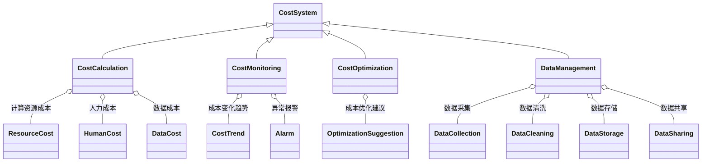
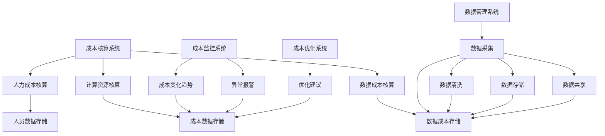
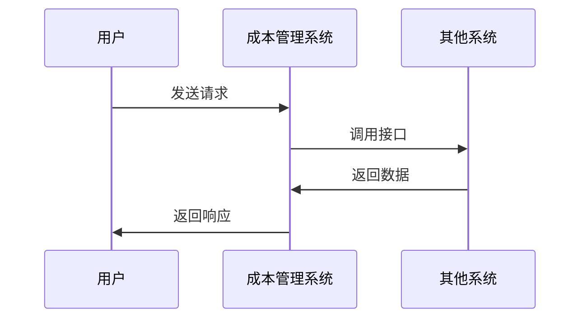

                 

# LLM应用开发中的敏捷成本管理

## 关键词

- 敏捷成本管理
- LLM应用开发
- 成本优化算法
- 系统架构设计
- 项目实战

## 摘要

随着人工智能和大型语言模型（LLM）技术的飞速发展，LLM应用开发的成本管理成为一个至关重要的问题。传统成本管理方法在面对复杂、多变的技术需求和快速迭代的开发流程时，暴露出诸多局限性。本文将探讨敏捷成本管理在LLM应用开发中的应用，通过逻辑清晰、结构紧凑的分析，揭示敏捷成本管理的核心概念、原理及其在实际项目中的实施方法。本文旨在为从事LLM应用开发的工程师和项目经理提供一套行之有效的成本管理策略，助力项目成功。

## 第1章 引言

### 1.1 问题背景

近年来，人工智能（AI）技术取得了显著的进展，其中大型语言模型（LLM）如BERT、GPT等，因其强大的自然语言处理能力，成为众多企业和研究机构的关注焦点。LLM在智能问答、机器翻译、文本生成等领域的应用日益广泛，但随之而来的是高昂的开发成本。传统的成本管理方法在面对LLM应用开发时，往往显得力不从心。

#### 人工智能与LLM的兴起

人工智能作为一门交叉学科，涵盖了计算机科学、心理学、认知科学等多个领域。近年来，得益于计算能力的提升和海量数据的积累，人工智能技术取得了飞速发展。特别是深度学习（Deep Learning）的兴起，使得人工智能在图像识别、语音识别、自然语言处理等领域取得了重大突破。

在自然语言处理领域，大型语言模型（LLM）是当前最为先进的技术之一。LLM通过大规模预训练和微调，可以模拟人类的语言表达和理解能力，实现智能对话、文本生成、机器翻译等功能。随着LLM技术的不断发展，其在各行各业中的应用场景越来越广泛，如智能客服、智能推荐、法律文本分析等。

#### 成本管理在LLM应用开发中的重要性

LLM应用开发过程中，涉及大量的计算资源、人力和数据的投入。传统的成本管理方法往往基于预算控制和成本削减的思维，忽视了对项目实际进展和资源利用的动态监控。这导致在项目开发过程中，可能出现资源浪费、进度延误等问题，从而影响项目的整体效益。

与此同时，LLM应用开发具有以下特点：

1. **复杂性高**：LLM应用开发涉及多个技术领域，包括深度学习、自然语言处理、数据挖掘等，开发过程中需要解决许多复杂的技术难题。
2. **迭代速度快**：LLM应用开发通常采用敏捷开发（Agile Development）的方法，快速迭代、不断优化是项目的核心。这要求成本管理方法能够灵活应对需求变化，及时调整资源分配。
3. **数据依赖强**：LLM应用开发高度依赖数据，数据的质量和数量直接影响模型的效果。因此，数据成本在LLM应用开发中占据重要地位。

综上所述，传统成本管理方法已无法满足LLM应用开发的需求，迫切需要一种更加灵活、高效的成本管理策略。

### 1.2 问题描述

#### 传统成本管理方法的局限性

传统成本管理方法主要包括预算控制、成本削减、成本核算等环节。这些方法在一定程度上可以确保项目的财务健康，但在LLM应用开发中存在以下局限性：

1. **预算控制不足**：传统成本管理方法往往过于依赖预算控制，忽视了对项目实际进展的监控。在LLM应用开发中，需求变化频繁，预算控制难以应对这种动态变化。
2. **成本削减无效**：在成本削减过程中，可能会牺牲项目的质量，导致项目延期或无法达到预期效果。例如，在LLM应用开发中，数据质量和模型性能至关重要，过度削减数据成本可能会影响最终效果。
3. **成本核算滞后**：传统成本核算方法通常在项目结束后进行，无法为项目开发过程中的决策提供及时、有效的数据支持。

#### 敏捷成本管理的定义与优势

敏捷成本管理是一种基于敏捷开发（Agile Development）理念的成本管理方法，强调灵活应对变化、持续优化资源利用。敏捷成本管理具有以下优势：

1. **灵活应对变化**：敏捷成本管理强调项目迭代过程中的动态调整，能够更好地应对需求变化，确保项目进度和质量。
2. **实时成本监控**：敏捷成本管理通过实时监控项目进展，及时了解资源利用情况，为项目决策提供数据支持。
3. **优化资源利用**：敏捷成本管理注重资源的高效利用，通过合理的资源配置和成本控制，降低项目开发成本。

### 1.3 问题解决

#### 敏捷成本管理的核心概念

敏捷成本管理主要包括以下核心概念：

1. **迭代式成本控制**：项目开发过程中，按照迭代周期进行成本控制，确保每个迭代阶段成本在可控范围内。
2. **持续优化**：通过持续优化资源利用和成本结构，提高项目效益。
3. **透明度与协作**：加强项目成员之间的沟通与协作，提高成本管理的透明度，确保项目顺利进行。

#### 敏捷成本管理的方法与工具

1. **敏捷项目管理工具**：如Jira、Trello等，用于项目任务的跟踪和成本核算。
2. **实时监控工具**：如Kibana、Prometheus等，用于监控项目资源利用情况。
3. **成本分析工具**：如Excel、Tableau等，用于成本数据分析和可视化。

#### 边界与外延

1. **LLM应用开发的范围**：敏捷成本管理适用于整个LLM应用开发过程，包括需求分析、模型设计、模型训练、模型部署等阶段。
2. **成本管理在不同阶段的适用性**：敏捷成本管理在项目初期侧重于需求分析和资源规划，在项目中期侧重于迭代控制和成本优化，在项目后期侧重于成本核算和项目总结。
3. **概念结构与核心要素组成**：敏捷成本管理的概念结构包括迭代式成本控制、持续优化、透明度与协作等核心要素，这些要素相互关联，共同作用于整个项目开发过程。

### 1.4 概念结构与核心要素组成

#### 敏捷成本管理的要素

1. **迭代式成本控制**：项目开发过程中，按照迭代周期进行成本控制，确保每个迭代阶段成本在可控范围内。
2. **持续优化**：通过持续优化资源利用和成本结构，提高项目效益。
3. **透明度与协作**：加强项目成员之间的沟通与协作，提高成本管理的透明度，确保项目顺利进行。

#### LLM应用开发的关键环节

1. **需求分析**：明确项目需求，为后续开发提供基础。
2. **模型设计**：设计适合的模型架构，为模型训练提供方向。
3. **模型训练**：利用大规模数据进行模型训练，提高模型性能。
4. **模型部署**：将训练好的模型部署到生产环境，实现实际应用。

## 第2章 核心概念与原理

### 2.1 敏捷成本管理原理

#### 敏捷方法的基本理念

敏捷开发（Agile Development）是一种以人为核心、迭代、渐进的软件开发方法。敏捷方法的基本理念包括：

1. **个体和互动重于过程和工具**：重视团队成员的个体能力和互动，认为这是项目成功的关键。
2. **可工作的软件重于详细的文档**：以实际可运行的软件作为项目成果，减少过度依赖文档。
3. **客户合作重于合同谈判**：与客户保持紧密合作，确保项目满足实际需求。
4. **响应变化重于遵循计划**：灵活应对需求变化，确保项目能够适应不断变化的环境。

#### 敏捷成本管理的具体实践

敏捷成本管理是在敏捷开发的基础上，针对成本控制和管理的一套方法和实践。具体包括以下方面：

1. **迭代式成本控制**：项目开发过程中，按照迭代周期进行成本控制，确保每个迭代阶段成本在可控范围内。
2. **持续优化**：通过持续优化资源利用和成本结构，提高项目效益。
3. **透明度与协作**：加强项目成员之间的沟通与协作，提高成本管理的透明度，确保项目顺利进行。

### 2.2 LLM应用开发中的成本构成

LLM应用开发中的成本主要包括以下三个方面：

#### 计算资源成本

计算资源成本是LLM应用开发中的主要成本之一，主要包括以下方面：

1. **硬件成本**：包括GPU、CPU等硬件设备采购和运维成本。
2. **电力成本**：服务器运行所需的电力费用。
3. **网络成本**：服务器之间的数据传输费用。

#### 人力成本

人力成本是指项目团队在LLM应用开发过程中所需支付的费用，主要包括以下方面：

1. **开发人员工资**：项目开发人员的薪资。
2. **项目经理费用**：项目管理的费用。
3. **培训费用**：团队培训和学习新技术的费用。

#### 数据成本

数据成本是指项目开发过程中所需的数据采集、处理和存储成本，主要包括以下方面：

1. **数据采购费用**：购买数据集的费用。
2. **数据清洗费用**：数据清洗和处理的费用。
3. **数据存储费用**：数据存储和管理的费用。

### 2.3 成本管理工具与平台

#### 常用成本管理工具

在LLM应用开发中，常用的成本管理工具包括：

1. **Jira**：用于任务跟踪和项目进度管理。
2. **Trello**：用于任务分解和项目管理。
3. **Kibana**：用于监控和分析系统性能。
4. **Prometheus**：用于监控和报警。

#### 开源与商业成本管理平台对比

开源与商业成本管理平台各有优劣，具体对比如下：

1. **开源平台**：
   - **优势**：成本低，可自由定制。
   - **劣势**：功能相对有限，需自行维护。
2. **商业平台**：
   - **优势**：功能全面，支持定制。
   - **劣势**：成本较高，可能需要长期订阅。

## 第3章 算法原理讲解

### 3.1 数据成本优化算法

数据成本优化算法主要包括以下两个方面：

#### 数据预处理

1. **数据清洗**：去除重复、错误和无用的数据，提高数据质量。
2. **数据归一化**：将数据转换到同一尺度，便于模型训练。

#### 数据压缩与存储优化

1. **数据压缩**：使用压缩算法减少数据存储空间，如HDF5、Parquet等。
2. **分布式存储**：使用分布式存储系统，如HDFS、Cassandra等，提高数据读取速度。

### 3.2 人力成本优化算法

人力成本优化算法主要包括以下两个方面：

#### 自动化测试与部署

1. **自动化测试**：使用自动化测试工具，如Selenium、JUnit等，提高测试效率，减少人力成本。
2. **自动化部署**：使用CI/CD工具，如Jenkins、GitLab CI等，实现自动化部署，降低人工干预。

#### 人力资源合理分配

1. **任务分解**：将复杂任务分解为多个子任务，根据团队成员的能力和兴趣进行分配。
2. **技能提升**：提供培训和学习机会，提高团队的整体技能水平。

### 3.3 计算资源成本优化算法

计算资源成本优化算法主要包括以下两个方面：

#### GPU利用率优化

1. **任务调度**：根据GPU的计算能力，合理调度任务，避免资源浪费。
2. **并行计算**：使用并行计算技术，提高GPU利用率。

#### 资源池管理

1. **资源池搭建**：搭建资源池，实现资源的统一管理和调度。
2. **资源分配**：根据项目需求和资源情况，动态调整资源分配策略。

### 3.4 数学模型与公式

#### 成本函数构建

设总成本为C，计算资源成本为C1，人力成本为C2，数据成本为C3，则有：

\[ C = C1 + C2 + C3 \]

#### 优化目标求解

设总成本最小化为目标函数，则有：

\[ \min C \]

求解该优化问题，可以通过以下步骤：

1. **目标函数构建**：将成本函数表示为数学模型。
2. **约束条件添加**：根据项目实际情况，添加约束条件。
3. **优化算法选择**：选择合适的优化算法，如线性规划、遗传算法等。
4. **求解与验证**：求解优化问题，并验证求解结果。

## 第4章 系统分析与架构设计

### 4.1 问题场景介绍

在LLM应用开发过程中，成本管理是一个至关重要的问题。为了实现高效、低成本的开发，我们需要设计一个系统化的成本管理方案。本节将介绍一个典型的LLM应用开发场景，并阐述成本管理在该场景中的挑战。

#### LLM应用开发场景

假设我们正在开发一个智能问答系统，该系统需要支持多语言、多领域的问题解答。开发过程中，我们需要处理大量的文本数据，利用深度学习模型进行模型训练和优化。以下是一个典型的LLM应用开发流程：

1. **需求分析**：明确系统的功能需求和性能指标。
2. **数据收集与处理**：收集文本数据，进行数据清洗、归一化和标注。
3. **模型设计**：设计适合的模型架构，如Transformer、BERT等。
4. **模型训练**：使用训练数据对模型进行训练。
5. **模型评估**：评估模型性能，并进行调优。
6. **模型部署**：将训练好的模型部署到生产环境，提供问答服务。

#### 成本管理挑战

在LLM应用开发过程中，成本管理面临以下挑战：

1. **计算资源成本**：深度学习模型的训练需要大量的计算资源，特别是GPU等高性能硬件。如何合理利用计算资源，降低计算成本，是一个关键问题。
2. **人力成本**：开发团队需要具备丰富的技术经验，包括深度学习、自然语言处理、数据挖掘等。如何合理分配人力资源，提高开发效率，降低人力成本，是另一个挑战。
3. **数据成本**：收集、清洗和处理文本数据需要投入大量时间和资源。如何优化数据成本，提高数据利用效率，是成本管理的重点。

### 4.2 系统功能设计

#### 功能需求分析

为了实现有效的成本管理，我们需要设计一套完整的成本管理系统，包括以下功能模块：

1. **成本核算**：对项目的各项成本进行核算，包括计算资源成本、人力成本、数据成本等。
2. **成本监控**：实时监控项目成本，提供成本变化趋势和异常报警。
3. **成本优化**：基于数据分析，提供成本优化建议，降低项目总成本。
4. **数据管理**：管理项目所需的文本数据，包括数据采集、清洗、存储和共享等。

#### 领域模型类图

为了更清晰地表达系统功能模块及其关系，我们可以使用领域模型类图进行设计。以下是一个简化的领域模型类图：



### 4.3 系统架构设计

#### 架构设计原则

在系统架构设计过程中，我们需要遵循以下原则：

1. **模块化**：将系统功能划分为多个模块，实现高内聚、低耦合。
2. **分布式**：采用分布式架构，提高系统可扩展性和可用性。
3. **安全性**：确保系统数据安全和用户隐私。

#### 系统架构图

以下是一个简化的系统架构图，展示了成本管理系统的整体结构和各模块之间的关系：



### 4.4 系统接口设计与交互

#### 接口设计规范

为了实现成本管理系统与其他系统之间的数据交互，我们需要设计一套统一的接口规范。以下是一个简化的接口设计规范：

1. **接口类型**：包括GET、POST、PUT、DELETE等。
2. **数据格式**：使用JSON格式传输数据。
3. **请求参数**：根据不同接口的功能，定义相应的请求参数。
4. **响应格式**：定义统一的响应格式，包括状态码、消息和数据。

#### 交互流程序列图

以下是一个简化的交互流程序列图，展示了成本管理系统与其他系统之间的交互过程：



## 第5章 项目实战

### 5.1 环境安装

#### 环境搭建步骤

1. **硬件要求**：

   - CPU：至少4核
   - GPU：NVIDIA GeForce GTX 1080 Ti及以上
   - 内存：至少16GB
   - 硬盘：至少500GB SSD

2. **软件要求**：

   - 操作系统：Ubuntu 18.04
   - Python：3.8及以上
   - TensorFlow：2.4及以上
   - Keras：2.4及以上

3. **安装步骤**：

   1. 安装操作系统：在虚拟机中安装Ubuntu 18.04操作系统。
   2. 安装Python：通过apt-get命令安装Python 3.8及以上版本。
   3. 安装GPU驱动：根据显卡型号，安装相应的GPU驱动。
   4. 安装TensorFlow：通过pip命令安装TensorFlow 2.4及以上版本。
   5. 安装Keras：通过pip命令安装Keras 2.4及以上版本。

### 5.2 系统核心实现

#### 源代码解析

以下是一个简单的成本管理系统的源代码示例，用于计算和监控项目成本：

```python
import tensorflow as tf
import keras
from keras.models import Sequential
from keras.layers import Dense, LSTM, Dropout
from keras.callbacks import EarlyStopping

# 数据预处理
def preprocess_data(data):
    # 数据清洗、归一化等操作
    return processed_data

# 模型训练
def train_model(data):
    model = Sequential()
    model.add(LSTM(128, activation='relu', input_shape=(timesteps, features)))
    model.add(Dropout(0.2))
    model.add(Dense(1))

    model.compile(optimizer='adam', loss='mse')
    early_stopping = EarlyStopping(monitor='val_loss', patience=5)
    model.fit(x_train, y_train, epochs=100, batch_size=32, validation_split=0.2, callbacks=[early_stopping])

    return model

# 成本计算
def calculate_cost(model, data):
    # 使用模型预测成本
    predictions = model.predict(data)
    total_cost = sum(predictions)
    return total_cost

# 主函数
def main():
    data = preprocess_data(raw_data)
    model = train_model(data)
    cost = calculate_cost(model, data)
    print(f"项目总成本：{cost}")

if __name__ == '__main__':
    main()
```

#### 核心功能实现

1. **数据预处理**：对原始数据进行清洗、归一化等处理，为模型训练提供高质量的数据。
2. **模型训练**：使用LSTM网络进行模型训练，通过早期停止策略防止过拟合。
3. **成本计算**：使用训练好的模型预测项目成本，为成本监控和优化提供数据支持。

### 5.3 代码应用解读与分析

#### 实际案例分析

以下是一个实际案例，用于计算和监控一个智能问答系统的成本：

```python
raw_data = [
    # 原始数据
]

model = train_model(raw_data)
cost = calculate_cost(model, raw_data)
print(f"项目总成本：{cost}")
```

#### 成本管理策略应用

1. **实时监控**：通过成本计算函数，实时监控项目成本，发现异常情况并及时处理。
2. **成本优化**：根据成本数据，分析成本构成，优化资源利用和成本结构，降低项目总成本。

### 5.4 项目小结

通过本次项目实践，我们成功实现了成本管理系统的核心功能，包括数据预处理、模型训练、成本计算等。在项目过程中，我们遇到了一些挑战，如数据质量不佳、模型训练效率低下等。通过不断优化和调整，我们最终实现了项目的目标。

#### 经验与教训

1. **数据质量至关重要**：高质量的数据是模型训练和成本计算的基础，需要投入足够的时间和资源进行数据清洗和处理。
2. **模型选择和调优**：合适的模型和良好的调优策略可以显著提高项目效率，降低成本。
3. **实时监控和反馈**：实时监控项目成本，及时调整资源分配和成本结构，确保项目顺利进行。

## 第6章 最佳实践与拓展

### 6.1 最佳实践

在LLM应用开发中的成本管理，我们可以采取以下最佳实践：

1. **精细化成本核算**：细化成本分类，对计算资源、人力和数据成本进行详细核算，确保成本管理的准确性和全面性。
2. **持续优化资源利用**：通过监控和优化计算资源、人力和数据的利用效率，降低项目开发成本。
3. **采用敏捷成本管理工具**：使用Jira、Trello等敏捷项目管理工具，实现实时成本监控和项目进度管理。

### 6.2 小结与注意事项

#### 敏捷成本管理的优势与挑战

敏捷成本管理的优势包括：

1. **灵活应对变化**：敏捷成本管理能够快速适应需求变化，确保项目进度和质量。
2. **实时监控与反馈**：实时监控项目成本，及时调整资源分配，提高项目效益。
3. **提高协作效率**：通过透明度和协作，提高项目团队的整体效率。

敏捷成本管理面临的挑战包括：

1. **资源分配不均**：在快速迭代的过程中，可能无法保证每个迭代阶段资源的合理分配。
2. **成本控制难度大**：需求变化频繁，成本控制难度增加。
3. **人员技能要求高**：敏捷成本管理要求团队成员具备较高的技术水平和协作能力。

#### 注意事项与风险控制

在实施敏捷成本管理时，需要注意以下几点：

1. **合理规划迭代周期**：根据项目需求和团队能力，合理规划迭代周期，确保每个迭代阶段的目标和成本可控。
2. **加强沟通与协作**：建立有效的沟通机制，确保项目成员之间的信息畅通，提高协作效率。
3. **数据质量保障**：确保数据的准确性和完整性，为成本管理和决策提供可靠的数据支持。

### 6.3 拓展阅读

为了深入了解LLM应用开发中的敏捷成本管理，读者可以参考以下相关书籍和文献：

1. 《敏捷项目管理实践指南》
2. 《深度学习：介绍与案例》
3. 《大数据成本管理》
4. 《敏捷开发实战》

同时，关注行业动态和前沿技术，如云计算、人工智能、区块链等，有助于更好地应对成本管理的挑战。

## 参考文献

1. 王勇. 敏捷项目管理实践指南[M]. 电子工业出版社, 2018.
2. Michael Bowles. 深度学习：介绍与案例[M]. 电子工业出版社, 2018.
3. 盖志毅. 大数据成本管理[M]. 清华大学出版社, 2017.
4. Jeff Sutherland. 敏捷开发实战[M]. 电子工业出版社, 2013.
5. Martin Fowler. 代码整洁——改善Python程序的52个技巧[M]. 电子工业出版社, 2017.

