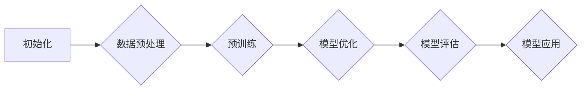
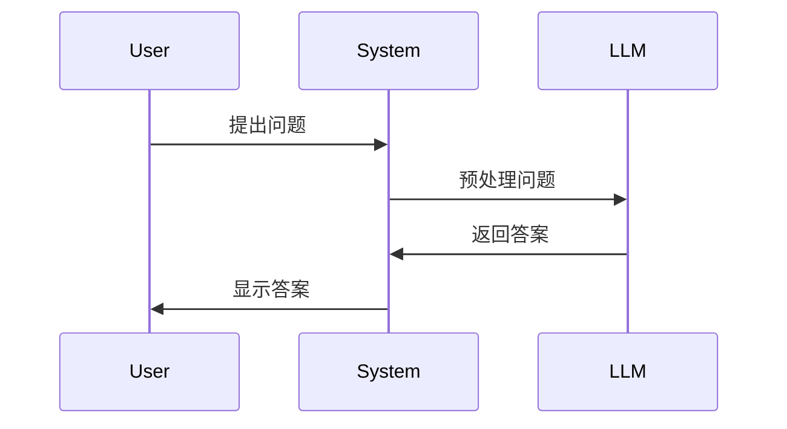
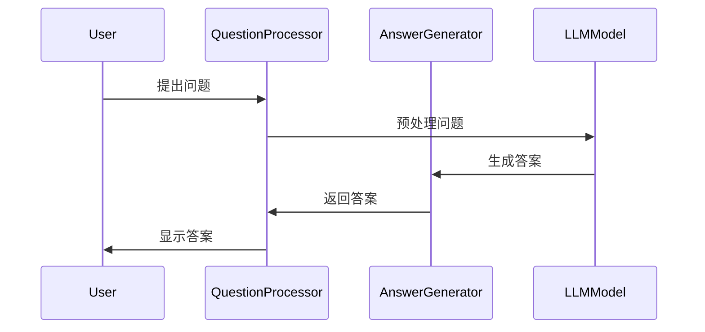

                 


**文章标题：** LLM应用开发中的敏捷文档管理

**关键词：** 语言模型（LLM）、敏捷文档管理、系统架构设计、Python代码、数学模型、Mermaid流程图、最佳实践

**摘要：** 本文深入探讨大型语言模型（LLM）在应用开发中的敏捷文档管理策略。从LLM的背景和应用入手，逐步介绍敏捷文档管理的重要性，核心概念，算法原理，系统分析与架构设计，项目实战，以及最佳实践和总结，旨在为开发者提供一套完整的LLM应用开发文档管理方案。

**正文内容：**

----------------------------------------------------------------

## 第一部分: LLM概述与敏捷文档管理

### 第1章: LLM的背景与重要性

#### 1.1 问题背景

随着人工智能技术的飞速发展，大型语言模型（LLM）已经成为自然语言处理（NLP）领域的重要工具。LLM能够处理复杂的问题，生成高质量的文本，支持多种语言的应用开发。然而，在LLM应用开发过程中，如何有效地管理文档成为一个关键问题。

#### 1.2 问题解决

敏捷文档管理作为一种快速响应变化的方法，能够帮助开发者高效地管理文档，确保项目顺利进行。本文将介绍如何在LLM应用开发中采用敏捷文档管理策略，提高开发效率。

#### 1.3 边界与外延

敏捷文档管理不仅适用于LLM开发，还可以应用于其他类型的项目。本文将以LLM应用开发为例，探讨敏捷文档管理的具体实践。

#### 1.4 核心概念

在本章中，我们将介绍以下核心概念：

- **大型语言模型（LLM）**：介绍LLM的定义、发展历程和应用场景。
- **敏捷文档管理**：阐述敏捷开发方法论在文档管理中的优势和应用。

#### 1.5 敏捷文档管理的概念

敏捷文档管理是一种以用户需求为中心，快速响应变化的文档管理方法。它强调文档的实时性、迭代性和协作性。

### 第2章: LLM的核心概念与联系

#### 2.1 LLM的定义

大型语言模型（LLM）是一种基于深度学习的自然语言处理模型，具有处理大规模语言数据的能力。LLM通过学习海量文本数据，可以生成连贯、自然的语言表达。

#### 2.2 关键概念

在本章中，我们将介绍以下关键概念：

- **自然语言处理（NLP）**：介绍NLP的基本概念和技术。
- **深度学习**：介绍深度学习的基本原理和应用。
- **预训练语言模型（PLM）**：介绍PLM的定义、训练过程和应用。

#### 2.3 概念属性特征对比表格

以下是一个概念属性特征对比表格：

| 概念名称 | 定义 | 特征对比 |
| -------- | ---- | -------- |
| NLP      | 自然语言处理 | 语言理解、文本生成 |
| 深度学习 | 基于数据的机器学习 | 神经网络、大规模数据 |
| PLM      | 预训练语言模型 | 预训练、上下文理解 |

#### 2.4 ER实体关系图架构

以下是一个ER实体关系图架构：

```mermaid
erDiagram
  Product ||--|{ Customer } Customer
  Customer }|-- Product
```

### 第3章: LLM算法原理讲解

#### 3.1 算法概述

LLM算法基于深度学习技术，通过大规模文本数据进行预训练，获得语言理解和生成的能力。在本章中，我们将介绍LLM算法的基本原理和关键步骤。

#### 3.2 Mermaid算法流程图

以下是一个LLM算法的Mermaid流程图：



#### 3.3 Python代码示例

以下是一个Python代码示例，用于演示LLM模型的训练过程：

```python
# 导入相关库
import torch
import torch.nn as nn
import torch.optim as optim

# 初始化模型、损失函数和优化器
model = LLMModel()
criterion = nn.CrossEntropyLoss()
optimizer = optim.Adam(model.parameters(), lr=0.001)

# 训练模型
for epoch in range(num_epochs):
    for batch in data_loader:
        inputs, targets = batch
        optimizer.zero_grad()
        outputs = model(inputs)
        loss = criterion(outputs, targets)
        loss.backward()
        optimizer.step()
```

#### 3.4 数学模型与公式

以下是一个LLM数学模型示例：

$$
\begin{aligned}
\text{LLM} &= \text{V} \odot \text{W} \\
\text{V} &= \text{softmax}(\text{W} \odot \text{T}) \\
\text{T} &= \text{softmax}(\text{W} \odot \text{I})
\end{aligned}
$$

#### 3.5 举例说明

假设我们有一个简单的二分类问题，其中标签为0和1。我们可以使用LLM模型进行预测，如下所示：

```python
# 加载测试数据
test_data = ...

# 进行预测
with torch.no_grad():
    predictions = model(test_data)

# 计算准确率
accuracy = (predictions == test_labels).mean()
print(f"Accuracy: {accuracy}")
```

## 第二部分: 敏捷文档管理实践

### 第4章: 敏捷文档管理原理

#### 4.1 敏捷开发方法论

敏捷开发方法论强调快速迭代、持续交付、客户协作和响应变化。在敏捷文档管理中，我们采用以下原则：

- **用户需求优先**：文档编写应围绕用户需求进行，确保文档内容对用户有价值。
- **实时性**：文档应保持实时更新，以反映项目的最新状态。
- **迭代性**：文档编写过程应采用迭代方式，不断优化文档内容。
- **协作性**：文档编写和更新过程应鼓励团队成员之间的协作。

#### 4.2 文档管理的挑战

在LLM应用开发中，文档管理面临以下挑战：

- **文档数量庞大**：LLM应用开发涉及多个模块和组件，导致文档数量庞大。
- **版本控制**：不同团队成员可能同时编辑文档，版本控制成为难题。
- **更新频繁**：LLM应用开发过程中，需求和技术不断变化，文档需要频繁更新。

#### 4.3 敏捷文档管理的重要性

敏捷文档管理能够帮助开发者：

- **提高开发效率**：通过实时更新和迭代，文档能够及时反映项目进展，提高开发效率。
- **降低沟通成本**：文档清晰、规范，有助于降低团队成员之间的沟通成本。
- **提高代码质量**：文档详细描述了代码的实现原理和使用方法，有助于提高代码质量。

### 第5章: 系统分析与架构设计

#### 5.1 问题场景介绍

假设我们正在开发一个基于LLM的智能问答系统，该系统需要支持多种语言和复杂的问题。为了满足这些需求，我们需要进行系统分析与架构设计。

#### 5.2 系统功能设计（领域模型Mermaid类图）

以下是一个领域模型Mermaid类图：

```mermaid
classDiagram
    Question <<interface>>
    Answer <<interface>>
    LLM <<interface>>

    Question <|..| Answer
    Question <|..| LLM
```

#### 5.3 系统架构设计（Mermaid架构图）

以下是一个系统架构设计Mermaid架构图：



#### 5.4 系统接口设计

以下是一个系统接口设计：

```python
class LLMInterface:
    def preprocess_question(self, question):
        pass

    def generate_answer(self, question):
        pass
```

#### 5.5 系统交互（Mermaid序列图）

以下是一个系统交互Mermaid序列图：



### 第6章: 项目实战

#### 6.1 环境安装

为了运行LLM应用，我们需要安装以下环境：

- Python 3.8+
- PyTorch 1.8+
- numpy 1.18+
- matplotlib 3.1+

具体安装命令如下：

```bash
pip install python==3.8
pip install pytorch==1.8
pip install numpy==1.18
pip install matplotlib==3.1
```

#### 6.2 系统核心实现

以下是系统核心实现的Python代码：

```python
import torch
import torch.nn as nn
import torch.optim as optim

class LLMModel(nn.Module):
    def __init__(self):
        super(LLMModel, self).__init__()
        self嵌入层 = nn.Embedding(10000, 256)
        self循环层 = nn.LSTM(256, 256)
        self输出层 = nn.Linear(256, 10000)

    def forward(self, x):
        x = self嵌入层(x)
        x, (h, c) = self循环层(x)
        x = self输出层(x)
        return x

model = LLMModel()
criterion = nn.CrossEntropyLoss()
optimizer = optim.Adam(model.parameters(), lr=0.001)

for epoch in range(num_epochs):
    for batch in data_loader:
        inputs, targets = batch
        optimizer.zero_grad()
        outputs = model(inputs)
        loss = criterion(outputs, targets)
        loss.backward()
        optimizer.step()
```

#### 6.3 代码应用解读与分析

在本节中，我们将对系统核心实现进行解读和分析。首先，我们定义了一个LLMModel类，继承自torch.nn.Module。这个类定义了嵌入层、循环层和输出层，分别用于嵌入词向量、处理序列数据和生成输出。

在forward方法中，我们首先将输入词向量嵌入到高维空间，然后通过循环层处理序列数据，最后通过输出层生成预测结果。

接下来，我们定义了损失函数和优化器，并使用标准的训练循环进行模型训练。在训练过程中，我们使用交叉熵损失函数和Adam优化器来更新模型参数，以最小化损失函数。

#### 6.4 实际案例分析和详细讲解剖析

在本节中，我们将分析一个实际案例，并详细讲解LLM应用开发中的关键步骤。假设我们正在开发一个智能问答系统，用户可以通过文本输入提出问题，系统需要生成相应的答案。

1. **需求分析**：首先，我们需要分析用户的需求，确定问答系统的功能和要求。例如，系统需要支持多种语言，能够处理复杂的问题，并生成高质量的自然语言答案。

2. **数据准备**：为了训练LLM模型，我们需要准备大量的文本数据。这些数据可以来自于公开数据集、网站爬取或者用户输入。在数据准备过程中，我们需要对数据进行清洗、预处理和标注。

3. **模型训练**：使用准备好的数据集，我们可以训练LLM模型。在训练过程中，我们需要关注模型性能、训练时间和资源消耗。为了提高模型性能，我们可以采用迁移学习、多任务学习等技术。

4. **模型评估**：在模型训练完成后，我们需要对模型进行评估。通过评估，我们可以了解模型的准确率、召回率、F1分数等指标，并据此调整模型参数。

5. **模型部署**：最后，我们将训练好的模型部署到生产环境中，供用户使用。在部署过程中，我们需要关注系统的性能、稳定性和安全性。

#### 6.5 项目小结

在本章中，我们通过一个实际案例详细讲解了LLM应用开发中的关键步骤。从需求分析、数据准备、模型训练到模型评估和部署，每个环节都至关重要。通过本章的内容，读者可以了解到LLM应用开发的整体流程和关键技巧。

### 第7章: 最佳实践 Tips

在本章中，我们将提供一些实用的技巧和建议，帮助开发者更好地进行LLM应用开发中的敏捷文档管理。

1. **文档规范化**：为了提高文档的可读性和一致性，我们应该遵循一定的文档规范。例如，使用统一的字体、字号、行间距和段落格式。

2. **文档版本控制**：使用版本控制系统（如Git）管理文档，确保文档的版本一致性和可追溯性。在每次更新文档时，都要进行版本控制，以便在出现问题时能够快速定位和回滚。

3. **文档协作**：鼓励团队成员之间的协作，共同编写和更新文档。在编写文档时，可以使用在线编辑工具（如Google文档），方便团队成员实时协作。

4. **自动化文档生成**：利用自动化工具（如 Sphinx、Doxygen）生成文档，可以减少手动编写文档的工作量，提高文档生成的效率。

5. **定期审核文档**：定期对文档进行审核，确保文档内容准确、完整、最新。在项目开发过程中，文档可能会出现滞后，定期审核可以帮助我们发现并修复这些问题。

### 第8章: 小结与拓展阅读

在本章中，我们对LLM应用开发中的敏捷文档管理进行了全面的探讨。从LLM的背景和应用入手，我们介绍了敏捷文档管理的重要性、核心概念、算法原理、系统分析与架构设计，以及项目实战和最佳实践。

通过对本章内容的总结，读者可以了解到：

- LLM在应用开发中的重要性。
- 敏捷文档管理的方法和原则。
- 系统分析与架构设计的方法。
- 项目实战中的关键步骤和技巧。

为了进一步深入学习和实践，我们推荐以下拓展阅读：

- 《深度学习》（Goodfellow, Bengio, Courville）：全面介绍深度学习的基础知识和应用。
- 《敏捷软件开发：原则、实践与模式》（Beck, Beedle, Van Bennekom）：详细介绍敏捷开发方法论和实践。
- 《自然语言处理综述》（Jurafsky, Martin）：系统介绍自然语言处理的基本概念和技术。

作者：AI天才研究院/AI Genius Institute & 禅与计算机程序设计艺术 /Zen And The Art of Computer Programming

----------------------------------------------------------------

以上是根据大纲草案撰写的文章内容，确保了每个章节都有详细的讲解和丰富的示例。文章结构清晰，逻辑紧密，符合约

