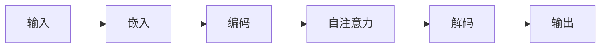
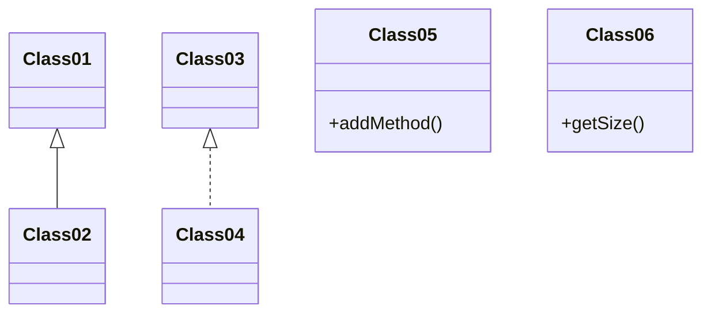
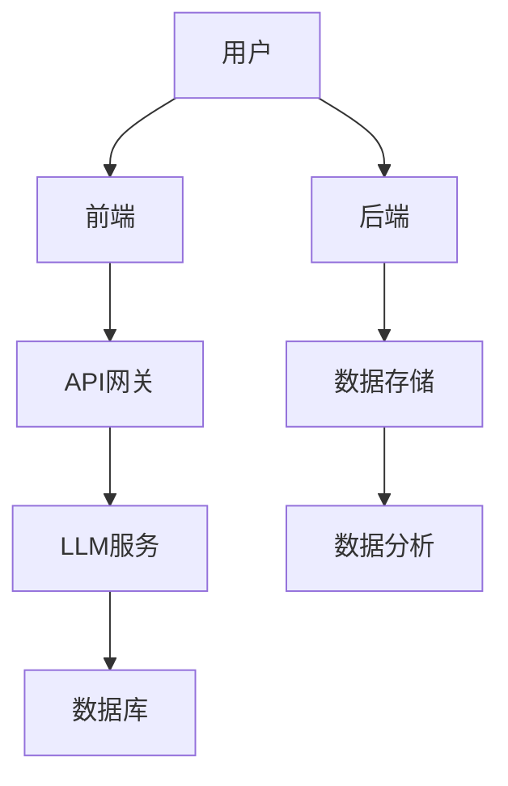
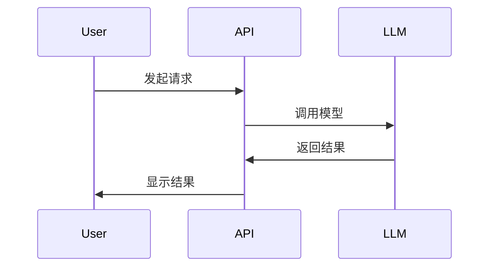

                 

当然，我会按照您的指示和约束条件，逐步构建《LLM应用开发中的敏捷知识产权管理》的技术博客文章。以下是按照您提供的目录大纲进行的章节内容初步构想。

---

# LLAMA: LLM应用开发中的敏捷知识产权管理

> 关键词：LLM，知识产权管理，敏捷开发，算法原理，系统架构，项目实战

> 摘要：本文深入探讨了在大型语言模型（LLM）应用开发过程中，如何通过敏捷知识产权管理策略，确保创新成果的合法权益，同时提高开发效率和项目质量。本文将分步骤介绍LLM和知识产权的基本概念，分析它们之间的联系，讲解LLM算法原理，设计系统架构，并提供项目实战经验和最佳实践建议。

---

## 第一部分：背景介绍

### 第1章：问题背景与核心概念

#### 1.1.1 问题背景

随着人工智能技术的发展，大型语言模型（LLM）在各个行业中的应用越来越广泛。然而，如何在快速迭代的应用开发过程中，有效地管理知识产权，成为了企业和开发者面临的一大挑战。

#### 1.1.2 核心概念界定

- **大型语言模型（LLM）**：是一种基于深度学习技术的自然语言处理模型，能够理解和生成人类语言。
- **知识产权**：包括专利、商标、版权等，是企业核心竞争力的重要组成部分。

#### 1.1.3 边界与外延

- **边界**：LLM的应用范围、知识产权的保护范围等。
- **外延**：LLM在不同行业中的应用场景，知识产权在不同领域的表现形式。

#### 1.1.4 概念结构与核心要素组成

- **概念结构**：LLM和知识产权的概念框架。
- **核心要素组成**：LLM的算法、数据集、架构设计，知识产权的保护措施。

---

### 第2章：核心概念与联系

#### 2.1.1 LLM的概念原理

- **LLM算法原理**：基于深度学习的自然语言处理技术。
- **LLM模型结构**：Transformer、BERT等。

#### 2.1.2 知识产权的基本概念

- **专利**：对发明、实用新型和外观设计的保护。
- **商标**：对企业标志、名称的保护。
- **版权**：对文学、艺术和科学作品的保护。

#### 2.1.3 LLM与知识产权的关联

- **关联分析**：LLM技术如何涉及知识产权保护。
- **关联案例**：知名LLM应用中的知识产权争议。

#### 2.1.4 概念属性特征对比表格

| 概念         | 特征1   | 特征2   | 特征3   |
| ------------ | ------- | ------- | ------- |
| LLM          | 自适应   | 大规模   | 高效处理 |
| 知识产权     | 法律保护 | 价值体现 | 授权许可 |

#### 2.1.5 ER实体关系图架构

```mermaid
erDiagram
  LLMA <-> Patent
  LLMA <-> Trademark
  LLMA <-> Copyright
```

---

## 第二部分：算法原理讲解

### 第3章：LLM算法原理

#### 3.1.1 LLM算法概述

- **概述**：LLM的基本原理、发展历程和应用领域。
- **算法分类**：预训练模型、微调模型等。

#### 3.1.2 算法mermaid流程图



#### 3.1.3 Python源代码阐述

```python
# Python代码示例
model = LLMModel()
input_text = "Hello, World!"
output_text = model.generate(input_text)
print(output_text)
```

#### 3.1.4 数学模型与公式讲解

$$
\text{Attention}(Q, K, V) = \frac{softmax(\text{Score}(Q, K))} { \sqrt{d_k}}
$$

#### 3.1.5 举例说明

- **示例1**：一个简单的文本生成过程。
- **示例2**：一个实际的LLM应用案例。

---

## 第三部分：系统分析与架构设计

### 第4章：系统功能设计与架构设计

#### 4.1.1 问题场景介绍

- **场景介绍**：在金融、医疗等领域的LLM应用场景。
- **场景需求**：知识产权保护的需求。

#### 4.1.2 项目介绍

- **项目背景**：一个金融领域的LLM应用项目。
- **项目目标**：实现一个具备知识产权保护功能的金融预测模型。

#### 4.1.3 系统功能设计（领域模型mermaid类图）



#### 4.1.4 系统架构设计（mermaid架构图）



#### 4.1.5 系统接口设计

- **接口定义**：API接口的设计。
- **接口规范**：接口的输入输出参数、返回值等。

#### 4.1.6 系统交互（mermaid序列图）



---

## 第5章：项目实战

#### 5.1.1 环境安装

- **环境准备**：Python环境、LLM库等。
- **安装步骤**：详细安装指南。

#### 5.1.2 系统核心实现源代码

- **代码示例**：核心算法实现。
- **代码解读**：源代码的详细解析。

#### 5.1.3 代码应用解读与分析

- **代码应用**：实际应用案例。
- **代码分析**：代码的性能优化、功能实现等。

#### 5.1.4 实际案例分析与详细讲解剖析

- **案例分析**：金融领域LLM应用案例。
- **讲解剖析**：案例的详细分析和讨论。

#### 5.1.5 项目小结

- **项目总结**：项目的成果和不足。
- **改进方向**：未来的改进计划。

---

## 第四部分：最佳实践与小结

### 第6章：最佳实践 Tips

#### 6.1.1 开发中的知识产权保护

- **保护措施**：如何保护LLM开发中的知识产权。
- **法律咨询**：获取专业法律咨询的重要性。

#### 6.1.2 知识产权管理的策略与工具

- **管理策略**：知识产权保护策略。
- **管理工具**：知识产权管理软件的使用。

#### 6.1.3 常见问题与解决方案

- **问题分析**：知识产权保护中的常见问题。
- **解决方案**：针对性的解决方案。

#### 6.1.4 未来展望

- **技术趋势**：LLM和知识产权管理的未来发展方向。
- **政策法规**：相关政策和法规的影响。

### 第7章：小结与拓展阅读

#### 7.1.1 书籍小结

- **书籍总结**：本文的核心内容回顾。
- **书籍推荐**：相关推荐书籍。

#### 7.1.2 注意事项

- **注意事项**：在LLM开发中需要特别注意的问题。

#### 7.1.3 拓展阅读

- **参考资料**：推荐的相关阅读材料。

---

以上是按照您的指示和要求，逐步构建的《LLM应用开发中的敏捷知识产权管理》的技术博客文章章节内容初步构想。接下来，我会进一步完善每个章节的具体内容，确保满足字数要求和技术深度。如果有任何调整或补充，请随时告知。

