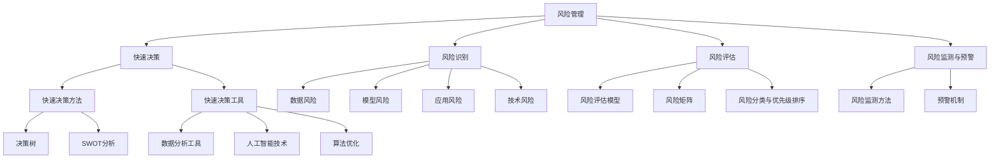
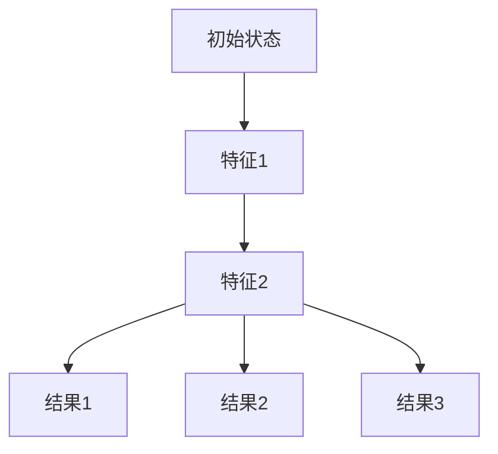
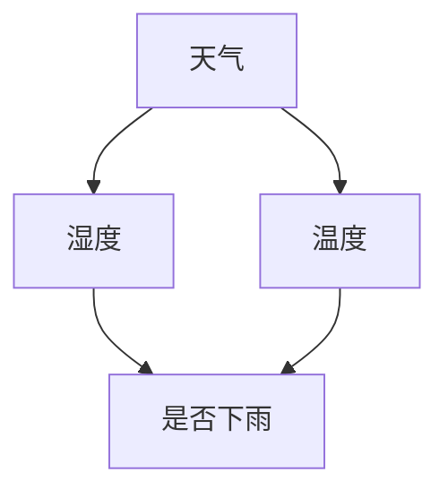
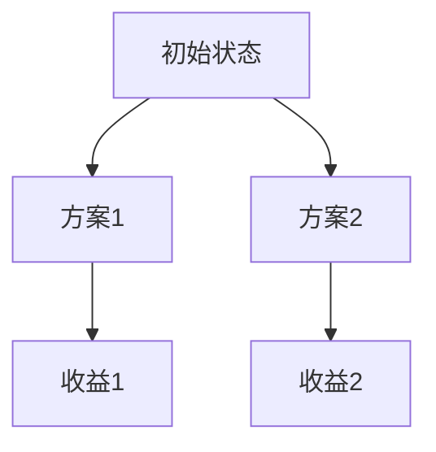

                 

### 第一部分：引言

#### 1.1 问题的提出

**1.1.1 风险管理的背景**

在现代社会，技术不断进步，新兴技术的应用领域日益广泛。尤其是大型语言模型（LLM）的兴起，为各行各业带来了巨大的变革。LLM在自然语言处理、智能客服、智能问答、自动化内容生成等领域展现出强大的应用潜力。然而，随着技术的快速发展，LLM应用开发过程中面临的风险也日益增加。

风险管理作为一个系统性的过程，旨在通过识别、评估、监测和应对风险，以减少潜在损失。在LLM应用开发中，风险管理尤为重要。首先，LLM模型的训练和部署过程需要大量的计算资源和数据，这可能导致成本高昂、资源浪费。其次，LLM模型可能存在偏见和不公平性，影响其应用效果和社会影响。最后，LLM应用可能面临安全风险，如数据泄露、隐私侵犯等。

**1.1.2 决策的复杂性**

在LLM应用开发中，决策的复杂性主要体现在以下几个方面：

1. **数据多样性**：LLM模型的训练需要大量高质量的标注数据，但数据来源多样，质量参差不齐，如何选择和处理数据成为一项挑战。
2. **模型复杂性**：LLM模型具有复杂的结构，涉及大量的参数调整和优化，如何选择合适的模型架构和训练策略成为关键问题。
3. **应用场景多样化**：LLM应用可以应用于多种场景，如智能客服、智能问答、自动化内容生成等，不同场景下的需求和技术实现差异较大。
4. **技术不确定性**：新兴技术的应用往往伴随着技术不确定性，如何快速适应技术变化，确保应用的稳定性和可靠性是决策的关键。

**1.1.3 在LLM应用开发中的风险与决策**

在LLM应用开发中，风险与决策密不可分。风险管理的目标是识别和评估潜在风险，并通过快速决策来应对这些风险。具体来说：

1. **风险识别**：通过分析LLM应用开发的过程和场景，识别出可能面临的风险，如数据质量风险、模型偏见风险、安全风险等。
2. **风险评估**：对识别出的风险进行量化评估，确定其影响程度和发生概率，为决策提供依据。
3. **快速决策**：在风险管理过程中，快速决策至关重要。快速决策需要基于对风险的准确评估，结合实际需求和资源，迅速做出决策，以降低风险损失。

综上所述，LLM应用开发中的风险管理与快速决策是一个复杂且动态的过程，需要综合考虑技术、数据、应用场景等多方面因素，以实现风险的最小化和应用效果的最大化。

#### 1.2 核心概念

**1.2.1 风险的定义与类型**

**风险**是指在未来一段时间内，可能发生的损失或机会损失。在LLM应用开发中，风险通常可以分为以下几类：

1. **数据风险**：包括数据质量风险、数据隐私风险、数据泄露风险等。数据质量风险可能导致模型训练效果不佳；数据隐私风险可能导致用户隐私泄露；数据泄露风险可能导致模型被恶意利用。
2. **模型风险**：包括模型偏见风险、模型过拟合风险、模型鲁棒性风险等。模型偏见风险可能导致模型在特定人群或场景下表现不佳；模型过拟合风险可能导致模型在测试数据上表现不佳；模型鲁棒性风险可能导致模型在面对未知输入时表现不稳定。
3. **应用风险**：包括应用场景适应性风险、应用效果风险、应用安全风险等。应用场景适应性风险可能导致模型无法适应特定应用需求；应用效果风险可能导致模型效果不佳；应用安全风险可能导致模型被恶意攻击或滥用。
4. **技术风险**：包括技术更新风险、技术依赖风险、技术实现风险等。技术更新风险可能导致现有技术迅速过时；技术依赖风险可能导致项目对特定技术或平台过度依赖；技术实现风险可能导致项目在技术实现上存在困难。

**1.2.2 快速决策的概念与特征**

**快速决策**是指在短时间内做出明智的决策，以应对变化和不确定性。快速决策通常具备以下特征：

1. **速度**：快速决策强调决策的快速性，能够在短时间内做出决策。
2. **准确性**：快速决策不仅要快，还要准确，基于充分的信息和分析做出合理的决策。
3. **灵活性**：快速决策需要具备灵活性，能够根据实际情况和环境变化进行调整。
4. **适应性**：快速决策需要具备适应性，能够应对不同场景和需求的变化。
5. **高效性**：快速决策需要高效，能够快速识别问题、分析问题并做出决策。

**1.2.3 LLM应用开发中的核心概念联系图**

为了更好地理解LLM应用开发中的风险管理与快速决策，我们可以通过一个联系图来展示这些核心概念之间的关系：



在这个联系图中，风险管理作为核心，通过风险识别、风险评估、风险监测与预警等环节，实现快速决策。各个风险类型与风险管理环节密切相关，通过快速决策方法与工具，确保在LLM应用开发中能够有效地应对各种风险。

#### 1.3 书籍结构概述

**1.3.1 各章节内容概览**

本书共分为五个部分，详细探讨了LLM应用开发中的风险管理与快速决策。以下是各部分的内容概览：

1. **第一部分：引言**
   - 介绍LLM应用开发中的风险管理与快速决策的背景和重要性。
   - 阐述核心概念，包括风险、快速决策等，并通过联系图展示各概念之间的关系。

2. **第二部分：LLM应用开发中的风险识别与评估**
   - 详细讲解风险识别的方法与工具，以及如何进行风险评估。
   - 介绍风险矩阵的构建方法，以及如何进行风险分类与优先级排序。
   - 分析风险监测与预警的方法，并给出实际案例。

3. **第三部分：快速决策策略**
   - 解读快速决策的概念与特点，介绍快速决策的方法与工具。
   - 探讨快速决策在实际应用中的挑战，并通过案例分析展示快速决策的应用。

4. **第四部分：快速决策中的技术支持**
   - 讨论数据分析技术、人工智能技术和算法优化在快速决策中的应用。
   - 通过实际案例，展示这些技术如何在快速决策中发挥重要作用。

5. **第五部分：快速决策在LLM应用开发中的应用案例**
   - 分析具体的LLM应用案例，展示如何在实际项目中应用快速决策策略。
   - 深入探讨快速决策在LLM应用开发中的实践与效果。

**1.3.2 阅读指南与学习方法**

为了更好地理解和应用本书的内容，以下是一些建议的阅读指南与学习方法：

1. **逐章阅读**：按照章节顺序逐章阅读，确保对每个部分的内容有全面的理解。
2. **案例分析**：通过阅读实际案例，深入了解快速决策在LLM应用开发中的应用，提高实践能力。
3. **结合实际**：将书中所述的理论知识与实际项目相结合，通过实践验证理论的可行性。
4. **互动交流**：参与技术论坛和社群，与其他开发者交流心得，共同探讨快速决策的最佳实践。
5. **持续学习**：新兴技术不断变化，持续关注最新技术动态，不断更新和优化快速决策策略。

通过以上阅读指南与学习方法，相信您将能够更好地掌握LLM应用开发中的风险管理与快速决策，为项目的成功奠定坚实基础。

#### 1.4 数学模型和公式概述

**1.4.1 风险评估模型**

风险评估是风险管理的重要环节，通过评估风险的影响程度和发生概率，为决策提供科学依据。常用的风险评估模型包括决策树模型和贝叶斯网络模型。

**决策树模型**是一种图形化的决策模型，通过树形结构展示不同决策路径及其结果。决策树模型的主要步骤包括：

1. **定义决策节点**：根据不同的特征和条件，定义决策节点，每个节点代表一个决策点。
2. **计算概率**：计算每个决策节点下各结果的概率，通常使用条件概率公式。
3. **计算期望值**：根据概率和结果的损失或收益，计算每个决策节点的期望值。
4. **选择最佳路径**：根据期望值选择最优的决策路径。

以下是一个简单的决策树模型的示例：



**贝叶斯网络模型**是一种基于概率的图形化模型，通过节点和边来表示变量之间的依赖关系。贝叶斯网络的主要步骤包括：

1. **定义网络结构**：根据变量间的依赖关系，构建贝叶斯网络结构。
2. **设定概率分布**：为每个节点设定条件概率分布，通常使用贝叶斯公式计算。
3. **推理与预测**：根据已有数据和网络结构，进行推理和预测，计算目标节点的概率分布。

以下是一个简单的贝叶斯网络模型的示例：



**1.4.2 决策树模型**

决策树模型是一种基于特征选择和划分的决策模型，通过递归划分特征空间，找到最优划分策略。决策树模型的主要步骤包括：

1. **特征选择**：选择具有最大信息增益或信息增益率的特征进行划分。
2. **划分特征空间**：根据选定的特征，将数据集划分为不同的子集。
3. **构建决策树**：递归地构建决策树，直到满足停止条件（如最大深度、最小叶节点数量等）。

以下是一个简单的决策树模型的示例：


**1.4.3 数据分析相关数学公式**

数据分析过程中常用到一些数学公式，以下是一些常用的公式：

1. **期望值**：期望值是随机变量的平均值，表示为 $E[X]$，计算公式为：

   $$E[X] = \sum_{i=1}^{n} x_i \cdot P(x_i)$$

2. **条件概率**：条件概率是指在给定某个条件下，另一个事件发生的概率，表示为 $P(A|B)$，计算公式为：

   $$P(A|B) = \frac{P(A \cap B)}{P(B)}$$

3. **贝叶斯公式**：贝叶斯公式是一种用于计算后验概率的公式，表示为 $P(A|B) = \frac{P(B|A) \cdot P(A)}{P(B)}$。

4. **熵**：熵是衡量随机变量不确定性的度量，表示为 $H(X)$，计算公式为：

   $$H(X) = -\sum_{i=1}^{n} P(x_i) \cdot \log_2 P(x_i)$$

5. **信息增益**：信息增益是衡量特征划分效果的指标，表示为 $Gain(D, A)$，计算公式为：

   $$Gain(D, A) = H(D) - H(D|A)$$

6. **信息增益率**：信息增益率是信息增益的改进版本，考虑了特征取值的多样性，表示为 $Gain\_Ratio(D, A)$，计算公式为：

   $$Gain\_Ratio(D, A) = \frac{Gain(D, A)}{H(A)}$$

通过以上数学模型和公式的介绍，我们为后续章节中的具体案例分析提供了理论基础。在LLM应用开发中，理解和运用这些数学模型和公式，将有助于我们更有效地进行风险管理和快速决策。

#### 1.5 最佳实践与注意事项

**1.5.1 风险管理最佳实践**

在LLM应用开发中，风险管理是一个复杂且动态的过程。以下是一些风险管理最佳实践，有助于提高项目的稳定性和可靠性：

1. **定期风险评估**：定期对项目进行全面的风险评估，确保及时识别和应对潜在风险。可以根据项目进展情况，制定相应的风险评估计划。

2. **风险管理团队**：组建专业的风险管理团队，负责识别、评估和应对风险。团队成员应具备相关领域的专业知识和实践经验。

3. **风险监控与预警**：建立有效的风险监控与预警机制，实时监测风险变化，及时发出预警信号，以便迅速采取应对措施。

4. **备份与恢复**：对关键数据和系统进行备份，并制定完善的恢复计划，以应对数据丢失和系统故障等情况。

5. **风险管理文档**：记录风险管理过程中的各个环节，包括风险识别、评估、监控和应对措施等，以便进行后续的回顾和优化。

**1.5.2 快速决策的技巧**

快速决策在LLM应用开发中具有重要意义。以下是一些快速决策的技巧，有助于提高决策的准确性和有效性：

1. **快速信息收集**：在决策过程中，迅速收集与问题相关的信息，确保决策基于充分的信息。

2. **简化问题**：将复杂问题分解为简单的问题，逐一解决，避免决策过程中的复杂性和不确定性。

3. **多方案比较**：在决策时，考虑多个备选方案，并进行比较和分析，选择最优方案。

4. **快速反馈**：在决策后，及时获取反馈信息，根据反馈调整和优化决策，确保决策的有效性。

5. **跨部门协作**：快速决策往往需要跨部门合作，充分利用各部门的专业知识和资源，提高决策的质量和效率。

**1.5.3 注意事项与风险管理**

在进行风险管理时，需要注意以下事项：

1. **风险评估的准确性**：准确评估风险的影响程度和发生概率，确保决策的科学性和合理性。

2. **快速决策的灵活性**：快速决策需要具备灵活性，能够根据实际情况和环境变化进行调整。

3. **风险监测与预警的及时性**：风险监测与预警机制应具备及时性，确保能够及时发现和应对风险。

4. **资源合理配置**：在风险管理过程中，合理配置资源和人力，确保风险管理的有效性。

5. **持续改进**：风险管理是一个持续的过程，应不断总结经验教训，优化风险管理策略和方法。

通过以上最佳实践与注意事项，我们可以在LLM应用开发中更好地进行风险管理和快速决策，确保项目的顺利进行和成功实施。

#### 1.6 本章小结

本章介绍了LLM应用开发中的风险管理与快速决策的背景、核心概念、书籍结构、数学模型和公式，以及最佳实践与注意事项。我们首先分析了LLM应用开发中的风险管理背景和决策复杂性，提出了风险识别、风险评估、风险监测与预警以及快速决策在风险管理中的重要性。接着，我们详细阐述了风险、快速决策等核心概念，并通过联系图展示了它们之间的关系。随后，我们介绍了书籍的结构和阅读指南，以及数据分析相关的数学模型和公式。最后，我们提出了一系列风险管理最佳实践和快速决策技巧，并强调了在风险管理过程中需要注意的事项。通过本章的学习，读者将初步了解LLM应用开发中的风险管理与快速决策，为其后续章节的深入探讨打下坚实基础。接下来，我们将进一步探讨LLM应用开发中的风险识别与评估。

### 第二部分：LLM应用开发中的风险识别与评估

#### 2.1 风险识别

**2.1.1 风险识别的重要性**

在LLM应用开发中，风险识别是风险管理的基础和关键环节。其重要性主要体现在以下几个方面：

1. **早期发现风险**：通过风险识别，可以早期发现潜在的风险，从而提前采取措施，避免或减少风险的发生和损失。
2. **制定风险管理策略**：风险识别是制定风险管理策略的前提，只有明确了风险，才能有针对性地制定风险管理计划。
3. **提高项目稳定性**：通过对风险的识别和管理，可以提高LLM应用开发项目的稳定性，确保项目的顺利推进和成功实施。
4. **保障数据安全和模型可靠性**：在风险识别过程中，可以发现数据隐私风险、模型偏见风险等技术风险，从而采取相应的措施，保障数据安全和模型可靠性。

**2.1.2 风险识别的方法与工具**

风险识别的方法和工具多种多样，以下是一些常见的方法和工具：

1. **专家访谈法**：通过与相关领域专家进行访谈，获取他们对风险的见解和经验，从而识别出潜在的风险。
2. **文献分析法**：通过查阅相关文献，了解已有的风险识别方法和案例，从中借鉴和提炼出适用于当前项目的风险识别方法。
3. **头脑风暴法**：组织项目团队成员进行头脑风暴，通过集思广益，识别出潜在的风险。
4. **SWOT分析法**：通过分析项目的优势（Strengths）、劣势（Weaknesses）、机会（Opportunities）和威胁（Threats），识别出项目可能面临的风险。
5. **故障模式与影响分析（FMEA）**：通过分析系统中的各种故障模式及其影响，识别出潜在的风险。
6. **风险识别工具**：如风险识别表、风险清单、风险评估矩阵等，可以帮助系统化和结构化地进行风险识别。

**2.1.3 实例分析：某LLM应用开发中的风险识别**

以下是一个具体的LLM应用开发中的风险识别实例：

**项目背景**：某电商平台计划开发一款基于大型语言模型（LLM）的智能客服系统，以提升用户满意度和服务效率。

**风险识别过程**：

1. **专家访谈**：与自然语言处理（NLP）专家、软件工程师和电商平台运营人员进行了深入访谈，了解他们对智能客服系统的风险担忧。

2. **头脑风暴**：组织项目团队成员进行了头脑风暴，列举了智能客服系统可能面临的风险，如：

   - **数据隐私风险**：用户隐私数据可能泄露。
   - **模型偏见风险**：模型可能对某些用户群体存在偏见。
   - **系统稳定性风险**：系统在高并发情况下可能崩溃。
   - **技术依赖风险**：项目可能过度依赖某些技术或平台。

3. **SWOT分析**：

   - **优势**：智能客服系统可以提升用户体验，提高客服效率。
   - **劣势**：数据隐私和安全问题可能引发用户信任危机。
   - **机会**：随着NLP技术的发展，智能客服系统的性能有望得到提升。
   - **威胁**：市场竞争激烈，如果不能迅速推出具有竞争力的产品，可能会被竞争对手超越。

4. **FMEA分析**：对识别出的风险进行详细分析，评估其发生的概率和影响程度，形成风险清单。

   - **数据隐私风险**：概率高，影响大，属于高风险。
   - **模型偏见风险**：概率中，影响中，属于中等风险。
   - **系统稳定性风险**：概率低，影响大，属于低风险。
   - **技术依赖风险**：概率低，影响小，属于低风险。

通过以上风险识别方法，项目团队初步识别出了智能客服系统在开发过程中可能面临的主要风险，为后续的风险评估和应对提供了基础。

#### 2.2 风险评估

**2.2.1 风险评估的方法**

风险评估是风险管理的核心环节，旨在对识别出的风险进行量化评估，确定其影响程度和发生概率，为决策提供依据。以下是一些常见风险评估方法：

1. **定性风险评估**：通过专家评估、问卷调查、访谈等方式，对风险的影响程度和发生概率进行主观判断，通常用于初步风险评估。
2. **定量风险评估**：通过数学模型、统计分析等方法，对风险的影响程度和发生概率进行量化分析，通常用于详细风险评估。
3. **风险评估矩阵**：通过构建风险评估矩阵，将风险的影响程度和发生概率进行量化，并计算出综合风险值，用于确定风险的优先级。
4. **故障模式与影响分析（FMEA）**：通过分析系统中的各种故障模式及其影响，评估风险的发生概率和影响程度，用于识别高风险区域。
5. **蒙特卡洛模拟**：通过模拟随机过程，评估风险的发生概率和影响程度，通常用于复杂系统的风险评估。

**2.2.2 实例分析：某LLM应用开发中的风险评估**

以下是一个具体的LLM应用开发中的风险评估实例：

**项目背景**：某电商平台计划开发一款基于大型语言模型（LLM）的智能问答系统，以提升用户满意度和服务效率。

**风险评估过程**：

1. **定性风险评估**：

   - **数据隐私风险**：专家评估认为，该风险的可能性较高，影响程度较大。
   - **模型偏见风险**：专家评估认为，该风险的可能性较高，影响程度中等。
   - **系统稳定性风险**：专家评估认为，该风险的可能性较低，影响程度较大。
   - **技术依赖风险**：专家评估认为，该风险的可能性较低，影响程度较小。

2. **定量风险评估**：

   - **数据隐私风险**：通过统计分析，估计该风险的发生概率为0.6，影响程度为3（最大值为5）。
   - **模型偏见风险**：通过统计分析，估计该风险的发生概率为0.5，影响程度为2（最大值为5）。
   - **系统稳定性风险**：通过统计分析，估计该风险的发生概率为0.2，影响程度为4（最大值为5）。
   - **技术依赖风险**：通过统计分析，估计该风险的发生概率为0.1，影响程度为1（最大值为5）。

3. **风险评估矩阵**：

   - **风险值计算**：使用风险评估矩阵，计算每个风险的值 = 风险发生概率 × 影响程度。
     - 数据隐私风险：0.6 × 3 = 1.8
     - 模型偏见风险：0.5 × 2 = 1
     - 系统稳定性风险：0.2 × 4 = 0.8
     - 技术依赖风险：0.1 × 1 = 0.1
   - **风险排序**：根据风险值，对风险进行排序，优先级从高到低为：数据隐私风险、模型偏见风险、系统稳定性风险、技术依赖风险。

4. **蒙特卡洛模拟**：

   - **模拟过程**：通过蒙特卡洛模拟，估计每个风险的发生概率和影响程度，并进行敏感性分析。
   - **模拟结果**：模拟结果显示，数据隐私风险和模型偏见风险是系统的主要风险，需要重点关注和应对。

通过以上风险评估方法，项目团队对智能问答系统在开发过程中可能面临的主要风险进行了量化评估，为制定风险应对策略提供了科学依据。

**2.2.3 风险评估报告编写**

风险评估报告是风险评估过程的总结和输出，通常包括以下内容：

1. **封面**：包括报告标题、报告日期、报告编制人员等信息。
2. **摘要**：简要概述风险评估的主要发现、风险排序和结论。
3. **引言**：介绍风险评估的目的、范围和背景。
4. **风险评估方法**：详细描述风险评估所采用的方法和工具。
5. **风险识别结果**：列出识别出的风险，包括风险的描述、影响程度和发生概率。
6. **风险评估结果**：列出每个风险的评估结果，包括风险值和排序。
7. **风险应对策略**：针对每个风险，提出具体的应对措施和策略。
8. **风险评估总结**：总结风险评估的主要发现和结论，提出进一步的建议。

通过风险评估报告，项目团队可以全面了解项目的风险状况，制定有效的风险应对策略，确保项目的顺利推进和成功实施。

#### 2.3 风险矩阵

**2.3.1 风险矩阵的构建方法**

风险矩阵是进行风险评估的一种常用工具，通过将风险的影响程度和发生概率进行量化，生成一个二维矩阵，用于直观地展示风险的优先级。以下是构建风险矩阵的步骤：

1. **确定影响程度等级**：根据项目的具体情况，定义影响程度的等级，通常包括高、中、低三个等级。例如，高影响程度可能包括系统崩溃、数据丢失等；中影响程度可能包括功能不完整、用户体验差等；低影响程度可能包括性能下降、界面细节问题等。

2. **确定发生概率等级**：同样地，根据项目的具体情况，定义发生概率的等级，通常包括高、中、低三个等级。例如，高发生概率可能包括技术瓶颈、市场不确定性等；中发生概率可能包括需求变更、内部问题等；低发生概率可能包括偶尔的技术错误、操作失误等。

3. **构建风险矩阵**：在二维矩阵中，将影响程度和发生概率等级交叉排列，形成一个风险矩阵。矩阵中的每个单元格表示一个特定的风险等级，例如“高影响程度且高发生概率”的风险等级。

4. **定义风险等级**：在矩阵中为每个风险等级定义一个数值，通常使用1到5的评分系统，1表示最低等级，5表示最高等级。例如，可以将“高影响程度且高发生概率”定义为5，“高影响程度且中发生概率”定义为4，“中影响程度且高发生概率”定义为3，依此类推。

**2.3.2 实例分析：某LLM应用开发中的风险矩阵应用**

以下是一个关于某LLM应用开发项目中风险矩阵应用的实例：

**项目背景**：某电商平台计划开发一款基于大型语言模型（LLM）的智能推荐系统，以提高用户满意度和购物体验。

**风险矩阵构建过程**：

1. **确定影响程度等级**：

   - 高：系统崩溃、数据丢失、用户隐私泄露等。
   - 中：推荐效果不佳、部分功能不可用、用户体验差等。
   - 低：性能下降、界面细节问题、偶尔的异常等。

2. **确定发生概率等级**：

   - 高：技术难题、市场不确定性、资源不足等。
   - 中：需求变更、内部管理问题、外部合作伙伴问题等。
   - 低：操作失误、偶尔的技术错误、环境变化等。

3. **构建风险矩阵**：

   | 影响程度 | 发生概率 |
   | :------: | :------: |
   |    高    |    高    |
   |    高    |    中    |
   |    高    |    低    |
   |    中    |    高    |
   |    中    |    中    |
   |    中    |    低    |
   |    低    |    高    |
   |    低    |    中    |
   |    低    |    低    |

4. **定义风险等级**：

   - 1：低风险，风险值较低，可以忽略。
   - 2：中等风险，风险值中等，需要关注。
   - 3：较高风险，风险值较高，需要采取措施。
   - 4：高风险，风险值较高，需要立即应对。
   - 5：严重风险，风险值极高，必须立即解决。

**风险矩阵应用结果**：

- **高影响程度且高发生概率**：系统崩溃，风险值=5，属于严重风险，需要立即解决。
- **高影响程度且中发生概率**：数据丢失，风险值=4，属于高风险，需要立即应对。
- **中影响程度且高发生概率**：推荐效果不佳，风险值=3，属于较高风险，需要采取措施。
- **其他风险等级**：按照风险值进行排序和分类，制定相应的应对措施。

通过以上步骤，项目团队构建了一个详细的风险矩阵，帮助识别和管理智能推荐系统开发过程中的关键风险，确保项目能够顺利推进和成功实施。

#### 2.4 风险分类与优先级排序

**2.4.1 风险分类的方法**

在LLM应用开发中，风险分类是风险评估的重要步骤，有助于对风险进行有效的管理和优先级排序。以下是一些常见的方法：

1. **按风险类型分类**：根据风险的性质和特点，将风险分为数据风险、模型风险、应用风险和技术风险等。这种方法有助于识别不同类型的风险，并针对每种风险制定相应的管理策略。
   
2. **按风险影响分类**：根据风险对项目的影响程度，将风险分为高影响风险、中影响风险和低影响风险。这种方法有助于明确哪些风险对项目影响较大，从而优先关注和应对这些风险。

3. **按风险发生概率分类**：根据风险的发生概率，将风险分为高发生概率风险、中发生概率风险和低发生概率风险。这种方法有助于识别哪些风险可能更容易发生，从而提前做好准备。

4. **按风险来源分类**：根据风险的来源，将风险分为内部风险和外部风险。内部风险包括项目管理问题、技术实现难题等；外部风险包括市场变化、政策法规等。这种方法有助于从不同的角度分析和应对风险。

5. **按风险紧急程度分类**：根据风险的紧急程度，将风险分为紧急风险和非紧急风险。紧急风险需要立即应对，非紧急风险则可以稍后处理。

**2.4.2 实例分析：某LLM应用开发中的风险分类与优先级排序**

以下是一个具体的LLM应用开发中的风险分类与优先级排序实例：

**项目背景**：某电商平台计划开发一款基于大型语言模型（LLM）的智能推荐系统。

**风险分类与排序过程**：

1. **按风险类型分类**：

   - **数据风险**：数据隐私泄露、数据质量差。
   - **模型风险**：模型偏见、模型稳定性差。
   - **应用风险**：推荐效果不佳、用户体验差。
   - **技术风险**：系统稳定性差、技术实现难题。

2. **按风险影响分类**：

   - **高影响风险**：系统崩溃、数据丢失、用户体验差。
   - **中影响风险**：推荐效果不佳、系统性能下降。
   - **低影响风险**：界面细节问题、偶尔的技术错误。

3. **按风险发生概率分类**：

   - **高发生概率风险**：需求变更、技术实现难题。
   - **中发生概率风险**：数据隐私问题、用户体验问题。
   - **低发生概率风险**：系统崩溃、数据丢失。

4. **按风险来源分类**：

   - **内部风险**：项目管理问题、技术实现难题。
   - **外部风险**：市场变化、政策法规。

5. **按风险紧急程度分类**：

   - **紧急风险**：系统崩溃、数据丢失。
   - **非紧急风险**：推荐效果不佳、用户体验差。

**风险优先级排序**：

根据上述分类结果，项目团队对风险进行了优先级排序，如下表所示：

| 风险类型       | 影响程度 | 发生概率 | 紧急程度 | 优先级 |
| -------------- | -------- | -------- | -------- | ------ |
| 数据风险       | 高       | 高       | 紧急     | 1      |
| 模型风险       | 高       | 中       | 非紧急   | 2      |
| 应用风险       | 中       | 高       | 紧急     | 3      |
| 技术风险       | 低       | 中       | 非紧急   | 4      |

通过以上风险分类与优先级排序，项目团队可以明确哪些风险对项目影响最大、最紧急，从而有针对性地制定风险应对策略，确保项目顺利进行。

#### 2.5 风险监测与预警

**2.5.1 风险监测的方法**

在LLM应用开发过程中，风险监测与预警是确保项目顺利进行的关键环节。以下是一些常见的方法：

1. **定期检查**：定期对项目进行全面检查，包括代码质量、数据质量、系统稳定性等，及时发现潜在风险。

2. **自动化工具**：使用自动化工具进行持续监控，如性能监测工具、代码审查工具等，自动检测代码质量、性能瓶颈等。

3. **实时监控**：使用实时监控工具，如日志分析工具、网络监控工具等，实时收集项目运行数据，快速识别异常。

4. **风险评估模型**：利用风险评估模型，定期对项目进行风险评估，识别出潜在风险，并根据风险值进行预警。

5. **人工监控**：通过人工监控，结合专家经验和直觉，对项目进行实时监控，及时识别和应对风险。

**2.5.2 预警机制的建立**

建立有效的预警机制是风险监测的关键。以下是一些建立预警机制的方法：

1. **定义预警标准**：根据项目特点和风险类型，定义预警标准，如系统性能指标、代码质量指标等。

2. **设置预警阈值**：根据预警标准，设置预警阈值，当指标超过阈值时，自动触发预警。

3. **预警信号**：设计预警信号，如电子邮件、短信、系统弹窗等，及时通知相关人员。

4. **响应流程**：制定预警响应流程，明确预警信号的接收、处理和反馈机制，确保能够快速响应和解决风险。

5. **预警测试**：定期对预警机制进行测试，确保预警信号的准确性和及时性。

**2.5.3 实例分析：某LLM应用开发中的风险监测与预警**

以下是一个具体的LLM应用开发中的风险监测与预警实例：

**项目背景**：某电商平台计划开发一款基于大型语言模型（LLM）的智能推荐系统。

**风险监测与预警过程**：

1. **定期检查**：项目团队每周对系统进行全面检查，包括代码质量、数据质量、系统稳定性等。

2. **自动化工具**：使用代码审查工具，如SonarQube，自动检测代码质量问题；使用性能监测工具，如New Relic，监控系统性能。

3. **实时监控**：使用日志分析工具，如ELK（Elasticsearch、Logstash、Kibana），实时收集和分析系统日志，识别异常。

4. **风险评估模型**：利用风险评估模型，每月对项目进行风险评估，识别出潜在风险。

5. **预警机制**：

   - **预警标准**：定义系统性能指标，如响应时间、错误率等，设置预警阈值。
   - **预警信号**：当系统性能指标超过阈值时，自动发送电子邮件和系统弹窗通知相关人员。
   - **响应流程**：相关人员收到预警信号后，立即进行分析和处理，确保问题得到及时解决。

通过以上方法，项目团队建立了有效的风险监测与预警机制，确保能够及时发现和应对潜在风险，保障项目的顺利进行。

#### 2.6 本章小结

本章详细探讨了LLM应用开发中的风险识别与评估。首先，我们介绍了风险识别的重要性以及常用的风险识别方法和工具，并通过实例展示了如何识别智能客服系统中的风险。接着，我们阐述了风险评估的方法，包括定性风险评估、定量风险评估和风险评估矩阵，并提供了具体的风险评估实例。随后，我们介绍了风险矩阵的构建方法，并通过实例分析了风险矩阵在智能推荐系统开发中的应用。此外，我们还讨论了风险分类与优先级排序的方法，帮助项目团队有针对性地管理风险。最后，我们介绍了风险监测与预警的方法，并通过实例展示了如何建立有效的风险监测与预警机制。通过本章的学习，读者将全面了解LLM应用开发中的风险识别与评估，为其后续章节的深入探讨打下坚实基础。

### 第三部分：快速决策策略

#### 3.1 快速决策的概念与特点

**3.1.1 快速决策的定义**

快速决策是指在短时间内做出明智、合理和有效的决策。在快速决策过程中，决策者需要快速收集信息、分析问题、评估选项，并迅速做出选择。快速决策的关键在于“快速”和“有效”，即要在尽可能短的时间内做出高质量的决策。

**3.1.2 快速决策的优势**

快速决策具有以下优势：

1. **提高响应速度**：在竞争激烈的市场环境中，快速决策可以帮助企业迅速应对市场变化和客户需求，抢占先机。

2. **减少不确定性**：通过快速决策，可以迅速排除不确定性和不必要的信息，专注于关键问题和解决方案。

3. **增强灵活性**：快速决策使决策者能够根据实际情况灵活调整决策，适应环境变化。

4. **降低成本**：快速决策可以减少资源浪费和时间成本，提高项目执行效率。

5. **增强竞争力**：快速决策能够帮助企业快速响应市场需求，提高市场竞争力。

**3.1.3 快速决策的局限性**

尽管快速决策具有诸多优势，但它也存在一些局限性：

1. **信息不足**：快速决策往往在时间紧迫的情况下进行，可能导致信息收集和分析不充分。

2. **决策质量较低**：快速决策可能在分析不够深入的情况下做出决策，导致决策质量较低。

3. **风险较高**：由于信息不足和分析不充分，快速决策可能导致决策错误，增加项目风险。

4. **依赖直觉**：快速决策往往依赖于决策者的直觉和经验，可能导致决策缺乏系统性和科学性。

5. **易受情绪影响**：快速决策过程中，决策者可能受到情绪波动的影响，导致决策偏颇。

#### 3.2 快速决策的方法与工具

**3.2.1 决策树**

决策树是一种常用的快速决策工具，通过树形结构展示不同决策路径及其结果。决策树的构建步骤如下：

1. **确定决策问题**：明确需要解决的决策问题。
2. **列出备选方案**：根据决策问题，列出所有可能的备选方案。
3. **计算各方案的收益或损失**：对每个备选方案进行评估，计算其可能的收益或损失。
4. **构建决策树**：根据备选方案的评估结果，构建决策树。
5. **选择最佳路径**：从决策树的根节点开始，根据期望值或最大收益原则，选择最佳路径。

以下是一个简单的决策树示例：



在这个例子中，决策问题为选择最佳方案，备选方案为方案1和方案2。根据各方案的收益计算，选择收益最高的方案作为最终决策。

**3.2.2 SWOT分析**

SWOT分析是一种常用的战略规划工具，通过分析项目的优势（Strengths）、劣势（Weaknesses）、机会（Opportunities）和威胁（Threats），帮助决策者全面评估项目的风险和机会，制定合适的决策策略。

1. **优势**：分析项目在技术、市场、团队等方面的优势，为决策提供支持。
2. **劣势**：识别项目在技术、市场、团队等方面的劣势，制定改进措施。
3. **机会**：分析市场趋势、政策变化、技术进步等外部因素，寻找潜在机会。
4. **威胁**：识别外部环境中的风险和威胁，制定应对措施。

以下是一个简单的SWOT分析示例：

|         | 强势 | 劣势 | 机会 | 威胁 |
| ------- | ---- | ---- | ---- | ---- |
| 技术优势 |      |      |      |      |
| 市场优势 |      |      |      |      |
| 团队优势 |      |      |      |      |
| 技术劣势 |      |      |      |      |
| 市场劣势 |      |      |      |      |
| 团队劣势 |      |      |      |      |
| 市场机会 |      |      |      |      |
| 技术机会 |      |      |      |      |
| 团队机会 |      |      |      |      |
| 市场威胁 |      |      |      |      |
| 技术威胁 |      |      |      |      |
| 团队威胁 |      |      |      |      |

通过SWOT分析，项目团队可以全面了解项目的内外部环境，制定有针对性的决策策略。

**3.2.3 实例分析：某LLM应用开发中的快速决策工具应用**

以下是一个具体的快速决策工具应用的实例：

**项目背景**：某电商平台计划开发一款基于大型语言模型（LLM）的智能客服系统。

**决策过程**：

1. **决策问题**：选择最佳的开发方案。
2. **备选方案**：
   - 方案1：采用开源LLM框架，自行开发。
   - 方案2：购买商业LLM解决方案。
   - 方案3：与第三方团队合作开发。
3. **收益与损失**：

   - **方案1**：收益包括技术掌控度高、成本较低；损失包括开发周期较长、技术风险较高。
   - **方案2**：收益包括快速上线、技术风险较低；损失包括成本较高、技术掌控度较低。
   - **方案3**：收益包括快速上线、技术风险较低；损失包括成本较高、技术掌控度较低。

4. **构建决策树**：

   ```mermaid
   graph TD
       A[初始状态]
       B[方案1]
       C[方案2]
       D[方案3]
       E[收益分析]
       F[损失分析]
       A --> B
       A --> C
       A --> D
       B --> E
       C --> E
       D --> E
       B --> F
       C --> F
       D --> F
   ```

5. **选择最佳路径**：根据决策树的评估结果，选择方案2作为最佳开发方案，因为它可以在较短的时间内快速上线，同时风险较低。

通过以上快速决策工具的应用，项目团队在短时间内做出明智的决策，确保智能客服系统能够顺利开发并上线。

#### 3.3 快速决策在实际应用中的挑战

**3.3.1 信息不足的问题**

在快速决策过程中，信息不足是一个常见的问题。快速决策往往需要在短时间内做出决策，这可能导致信息收集和分析不够全面和深入。以下是一些解决信息不足的方法：

1. **优先级管理**：在信息收集过程中，优先关注关键信息和重要数据，确保在有限的时间内获取最有价值的信息。

2. **快速分析**：利用数据分析工具和方法，快速处理和分析信息，提取关键信息，为决策提供支持。

3. **专家咨询**：在决策过程中，及时咨询相关领域专家的意见，利用他们的专业知识和经验弥补信息不足的问题。

4. **利用历史数据**：参考历史数据和类似项目的经验，快速评估当前决策的可能结果，减少信息不足带来的影响。

5. **建立信息共享机制**：通过建立信息共享平台，确保项目团队成员能够及时获取和共享信息，提高信息收集的效率。

**3.3.2 决策延迟的风险**

快速决策的另一个挑战是决策延迟的风险。在市场竞争激烈的环境中，快速决策是抢占先机的关键。以下是一些应对决策延迟的方法：

1. **简化决策流程**：减少决策流程中的繁琐环节，简化决策步骤，提高决策效率。

2. **明确决策责任**：明确决策责任和权限，确保决策者在规定时间内做出决策，避免拖延。

3. **建立应急决策机制**：在紧急情况下，建立应急决策机制，确保能够迅速应对突发事件，减少决策延迟。

4. **利用技术手段**：利用自动化工具和人工智能技术，提高决策过程的效率和准确性，减少人为决策延迟。

5. **强化团队协作**：通过加强团队协作，确保项目成员在决策过程中能够及时沟通和协作，提高决策效率。

**3.3.3 快速决策与深度分析的关系**

快速决策和深度分析之间存在一定的矛盾。快速决策强调快速性和效率，而深度分析则需要时间和精力。以下是一些平衡快速决策和深度分析的方法：

1. **阶段决策**：将决策过程分为多个阶段，每个阶段进行深度分析，确保决策的全面性和准确性。

2. **关键点深度分析**：在快速决策过程中，对关键点和关键问题进行深度分析，确保决策的准确性和有效性。

3. **迭代决策**：通过迭代的方式，逐步完善决策，在快速决策的基础上，进行深度分析和调整。

4. **专家参与**：邀请相关领域专家参与决策过程，利用他们的专业知识和经验，提高决策的质量和准确性。

5. **数据驱动的决策**：利用数据分析和数据驱动的决策方法，提高决策的科学性和可操作性。

通过以上方法，项目团队可以在快速决策和深度分析之间找到平衡，确保决策的快速性和准确性。

#### 3.4 快速决策的案例分析

**3.4.1 案例一：某LLM应用开发中的快速决策应用**

**背景**：某知名互联网公司计划开发一款基于大型语言模型（LLM）的智能客服系统，以提高客户服务效率和用户满意度。

**决策过程**：

1. **确定决策问题**：选择最佳的开发方案，以在较短时间内实现智能客服系统的上线。

2. **备选方案**：
   - 方案1：采用开源LLM框架，自行开发。
   - 方案2：购买商业LLM解决方案。
   - 方案3：与第三方团队合作开发。

3. **收益与损失分析**：
   - **方案1**：收益包括技术掌控度高、成本较低；损失包括开发周期较长、技术风险较高。
   - **方案2**：收益包括快速上线、技术风险较低；损失包括成本较高、技术掌控度较低。
   - **方案3**：收益包括快速上线、技术风险较低；损失包括成本较高、技术掌控度较低。

4. **构建决策树**：

   ```mermaid
   graph TD
       A[初始状态]
       B[方案1]
       C[方案2]
       D[方案3]
       E[收益分析]
       F[损失分析]
       A --> B
       A --> C
       A --> D
       B --> E
       C --> E
       D --> E
       B --> F
       C --> F
       D --> F
   ```

5. **选择最佳路径**：根据决策树的评估结果，选择方案2作为最佳开发方案，因为它可以在较短时间内快速上线，同时技术风险较低。

**结果**：采用商业LLM解决方案，智能客服系统在3个月内成功上线，客户服务效率和用户满意度显著提升。

**经验教训**：
- 快速决策要基于充分的信息和分析，确保决策的准确性。
- 在备选方案的选择中，要权衡收益和损失，选择最佳方案。
- 快速决策过程中，要充分利用专家意见和现有资源，提高决策效率。

**3.4.2 案例二：某LLM应用开发中的快速决策挑战与解决**

**背景**：某新兴互联网公司计划开发一款基于大型语言模型（LLM）的智能问答系统，为用户提供实时问答服务。

**决策过程**：

1. **确定决策问题**：如何在短时间内实现智能问答系统的稳定运行，并满足用户需求。

2. **备选方案**：
   - 方案1：采用开源LLM框架，自行开发。
   - 方案2：购买商业LLM解决方案。
   - 方案3：与第三方团队合作开发。

3. **收益与损失分析**：
   - **方案1**：收益包括技术掌控度高、成本较低；损失包括开发周期较长、技术风险较高。
   - **方案2**：收益包括快速上线、技术风险较低；损失包括成本较高、技术掌控度较低。
   - **方案3**：收益包括快速上线、技术风险较低；损失包括成本较高、技术掌控度较低。

4. **构建决策树**：

   ```mermaid
   graph TD
       A[初始状态]
       B[方案1]
       C[方案2]
       D[方案3]
       E[收益分析]
       F[损失分析]
       A --> B
       A --> C
       A --> D
       B --> E
       C --> E
       D --> E
       B --> F
       C --> F
       D --> F
   ```

5. **快速决策挑战**：
   - **信息不足**：由于公司成立时间较短，技术积累有限，信息收集难度较大。
   - **决策延迟**：项目时间紧迫，决策延迟可能导致项目延期。
   - **深度分析不足**：在快速决策过程中，深度分析的时间受限，可能导致决策质量下降。

6. **解决方法**：
   - **优先级管理**：在信息收集过程中，优先关注关键信息和重要数据。
   - **快速分析**：利用数据分析工具和方法，快速处理和分析信息。
   - **专家咨询**：邀请相关领域专家参与决策过程，提供专业意见。
   - **简化决策流程**：减少决策流程中的繁琐环节，提高决策效率。

7. **选择最佳路径**：在综合考虑各方面因素后，选择方案2作为最佳开发方案。

**结果**：采用商业LLM解决方案，智能问答系统在4个月内成功上线，用户满意度显著提升。

**经验教训**：
- 在快速决策过程中，要充分利用现有信息和资源，提高决策的准确性。
- 快速决策并不意味着放弃深度分析，关键是要在有限时间内做出最佳决策。
- 建立有效的决策机制，确保决策的快速性和准确性。

通过以上两个案例，我们可以看到快速决策在LLM应用开发中的应用效果，以及如何应对快速决策过程中面临的挑战。快速决策不仅能够提高项目推进速度，还能够确保项目质量和用户满意度。

#### 3.5 本章小结

本章详细探讨了快速决策的概念、方法与工具，以及在实际应用中的挑战和案例分析。首先，我们介绍了快速决策的定义、优势与局限性，帮助读者理解快速决策的基本概念。接着，我们介绍了决策树和SWOT分析两种常用的快速决策工具，并通过实例展示了它们的应用方法。随后，我们讨论了快速决策在实际应用中面临的挑战，包括信息不足、决策延迟和深度分析不足等问题，并提出了相应的解决方法。通过两个具体的案例，我们展示了快速决策在LLM应用开发中的实际应用效果和经验教训。本章的内容为读者在LLM应用开发中应用快速决策提供了理论指导和实践参考。

### 第四部分：快速决策中的技术支持

#### 4.1 数据分析技术

**4.1.1 数据分析的基本概念**

数据分析是指通过使用统计学、机器学习、数据挖掘等方法，对大量数据进行处理和分析，以发现数据中的隐藏信息、模式和规律，从而为决策提供支持。数据分析的基本概念包括数据清洗、数据集成、数据存储、数据挖掘等。

1. **数据清洗**：数据清洗是指对原始数据进行处理，去除重复数据、缺失数据、异常值等，以提高数据质量和可用性。
2. **数据集成**：数据集成是指将来自不同来源、不同格式的数据进行整合，形成统一的数据视图，以便进行进一步的分析。
3. **数据存储**：数据存储是指将数据存储在数据库、数据仓库或其他数据存储系统中，以便进行快速查询和分析。
4. **数据挖掘**：数据挖掘是指从大量数据中挖掘出有用的信息和知识，如趋势、模式、关联性等，为决策提供支持。

**4.1.2 常用数据分析工具**

在数据分析过程中，常用的工具包括Excel、Python、R、SQL等。

1. **Excel**：Excel是微软办公软件套件中的一款电子表格软件，适用于数据清洗、数据可视化、简单数据分析等。
2. **Python**：Python是一种通用编程语言，具有丰富的数据分析库，如Pandas、NumPy、Matplotlib等，适用于复杂的数据处理和分析。
3. **R**：R是一种专门用于统计分析和数据可视化的编程语言，具有强大的统计分析和数据可视化功能。
4. **SQL**：SQL（结构化查询语言）是一种用于数据库查询和管理的语言，适用于数据查询、数据操作和数据集成。

**4.1.3 数据分析在实际应用中的案例分析**

以下是一个数据分析在实际应用中的案例：

**案例背景**：某电商平台希望通过数据分析，优化其推荐算法，提高用户满意度。

**数据分析过程**：

1. **数据收集**：收集用户浏览、购买、评价等行为数据，形成数据集。
2. **数据清洗**：对数据集进行清洗，去除重复数据、缺失数据和异常值，提高数据质量。
3. **数据集成**：将不同来源的数据进行整合，形成统一的数据视图，以便进行进一步分析。
4. **数据挖掘**：利用Python和R等工具，对数据集进行挖掘，发现用户行为模式、兴趣偏好等。
5. **可视化分析**：使用Matplotlib、Seaborn等可视化工具，将分析结果进行可视化，帮助决策者更好地理解数据。

**分析结果**：

- **用户行为模式**：分析发现，大部分用户在浏览商品后，通常会在短时间内进行购买决策。
- **兴趣偏好**：根据用户的历史购买数据，识别出用户对不同商品类别的偏好。
- **优化建议**：基于分析结果，优化推荐算法，提高推荐的相关性和用户满意度。

通过以上数据分析过程，电商平台能够更好地理解用户需求，优化推荐算法，从而提高用户满意度和销售额。

#### 4.2 人工智能技术

**4.2.1 人工智能的基本概念**

人工智能（Artificial Intelligence，AI）是指通过计算机模拟人类智能的技术。人工智能包括多个领域，如机器学习、深度学习、自然语言处理、计算机视觉等。

1. **机器学习**：机器学习是人工智能的一个分支，通过算法和统计模型，使计算机能够从数据中学习，并对新数据进行预测和决策。
2. **深度学习**：深度学习是机器学习的一种方法，通过神经网络结构，模拟人脑的神经元连接，实现高效的数据分析和模式识别。
3. **自然语言处理**：自然语言处理是人工智能的一个分支，旨在使计算机能够理解和处理自然语言，包括语言理解、语言生成、机器翻译等。
4. **计算机视觉**：计算机视觉是人工智能的一个分支，通过计算机对图像和视频进行理解和分析，实现对视觉信息的处理和识别。

**4.2.2 机器学习与深度学习**

机器学习和深度学习是人工智能的两个重要分支。

1. **机器学习**：机器学习通过算法和统计模型，使计算机从数据中学习，实现预测和决策。常见的机器学习算法包括线性回归、决策树、支持向量机等。
2. **深度学习**：深度学习是机器学习的一种方法，通过神经网络结构，模拟人脑的神经元连接，实现高效的数据分析和模式识别。常见的深度学习模型包括卷积神经网络（CNN）、循环神经网络（RNN）、生成对抗网络（GAN）等。

**4.2.3 人工智能在实际应用中的案例分析**

以下是一个人工智能在实际应用中的案例：

**案例背景**：某银行希望通过人工智能技术，提高客户服务质量和效率。

**应用过程**：

1. **自然语言处理**：利用自然语言处理技术，实现智能客服系统，通过语音识别和文本分析，理解客户的需求和问题。
2. **机器学习**：利用机器学习算法，对客户的历史数据进行分析，预测客户的需求和偏好，提供个性化的服务。
3. **深度学习**：利用深度学习模型，对图像和视频进行分析，实现人脸识别、行为分析等功能，提高客户身份验证的安全性和准确性。

**应用效果**：

- **提高服务质量**：通过智能客服系统，客户能够快速获得答案和帮助，提高客户满意度。
- **提高效率**：通过机器学习和深度学习，银行能够更精准地识别客户需求，提高业务处理效率。
- **提高安全性**：通过人脸识别和行为分析，提高客户身份验证的安全性和准确性，降低欺诈风险。

通过以上人工智能技术的应用，银行能够提供更加高效、安全和个性化的客户服务，提高市场竞争力。

#### 4.3 算法优化

**4.3.1 算法优化的重要性**

算法优化是提升系统性能和效率的关键环节。算法优化的重要性体现在以下几个方面：

1. **提高系统性能**：通过优化算法，减少计算时间和资源消耗，提高系统处理速度和响应能力。
2. **提升用户体验**：优化后的算法能够提供更快速、更准确的服务，提升用户体验。
3. **降低成本**：优化算法可以减少硬件和资源投入，降低维护成本。
4. **提高竞争力**：在激烈的市场竞争中，优化算法能够提高系统的稳定性和可靠性，增强企业的竞争力。

**4.3.2 常用算法优化方法**

在算法优化过程中，常用的方法包括以下几种：

1. **时间优化**：通过减少算法的执行时间，提高算法的运行效率。常见的时间优化方法包括算法并行化、算法简化和算法优化。
2. **空间优化**：通过减少算法的内存消耗，降低算法的空间复杂度。常见的方法包括内存复用、数据压缩和内存池化。
3. **数据结构优化**：通过选择合适的数据结构，提高数据的访问和操作效率。常见的数据结构优化方法包括哈希表、平衡树和堆等。
4. **算法复杂度优化**：通过改进算法的复杂度，提高算法的执行效率。常见的方法包括算法变形、算法组合和算法分解。
5. **算法并行化**：通过将算法分解为并行任务，利用多核处理器和分布式计算技术，提高算法的执行速度。

**4.3.3 算法优化在实际应用中的案例分析**

以下是一个算法优化在实际应用中的案例：

**案例背景**：某电商平台希望通过优化推荐算法，提高用户满意度。

**优化过程**：

1. **时间优化**：通过并行化推荐算法，利用多核处理器的计算能力，提高推荐算法的执行速度。具体方法包括将推荐算法分解为多个子任务，分别执行，并使用线程池管理并行任务。
2. **空间优化**：通过数据压缩技术，减少推荐算法的数据存储空间。具体方法包括使用哈希表和布隆过滤器，降低内存消耗。
3. **数据结构优化**：选择更高效的数据结构，如跳表和平衡树，提高推荐算法的访问和操作效率。具体方法包括将用户历史数据和商品数据存储在跳表中，并使用平衡树进行排序和查询。
4. **算法复杂度优化**：通过改进推荐算法的复杂度，提高算法的执行效率。具体方法包括优化用户相似度和商品相似度的计算方法，减少计算复杂度。

**优化效果**：

- **提高推荐速度**：通过并行化技术，推荐算法的执行时间显著缩短，用户能够更快地获得推荐结果。
- **降低内存消耗**：通过数据压缩和空间优化，算法的内存消耗减少，系统的稳定性提高。
- **提高推荐质量**：通过数据结构优化和算法复杂度优化，推荐算法的准确性和效率显著提高，用户满意度提升。

通过以上算法优化，电商平台能够提供更快速、更准确的推荐服务，提高用户满意度和市场竞争力。

#### 4.4 实例分析：快速决策中技术支持的实践

**4.4.1 某LLM应用开发中的数据分析技术应用**

**案例背景**：某知名互联网公司计划开发一款基于大型语言模型（LLM）的智能问答系统，为用户提供实时问答服务。

**数据分析技术应用过程**：

1. **数据收集**：收集用户提问、回答、搜索历史等数据，形成数据集。
2. **数据清洗**：对数据集进行清洗，去除重复数据、缺失数据和异常值，提高数据质量。
3. **数据集成**：将不同来源的数据进行整合，形成统一的数据视图，以便进行进一步分析。
4. **数据预处理**：对文本数据进行预处理，包括分词、去停用词、词干提取等，为文本分析做准备。
5. **特征提取**：利用自然语言处理技术，从文本数据中提取特征，如词频、词向量、主题模型等。
6. **模型训练**：使用机器学习和深度学习算法，训练LLM模型，实现问答功能。
7. **模型评估**：使用测试数据集，评估模型性能，调整模型参数，提高模型准确性和效率。

**数据分析技术应用效果**：

- **提高问答准确性**：通过数据分析和模型训练，智能问答系统能够更准确地理解用户提问，提供相关回答。
- **优化问答体验**：通过数据分析，识别用户偏好和提问模式，提供个性化的问答服务，提高用户满意度。

**4.4.2 某LLM应用开发中的人工智能技术应用**

**案例背景**：某金融科技公司计划开发一款基于大型语言模型（LLM）的智能投顾系统，为用户提供个性化的投资建议。

**人工智能技术应用过程**：

1. **数据收集**：收集用户财务数据、投资记录、市场行情等数据，形成数据集。
2. **数据清洗**：对数据集进行清洗，去除重复数据、缺失数据和异常值，提高数据质量。
3. **数据集成**：将不同来源的数据进行整合，形成统一的数据视图，以便进行进一步分析。
4. **特征提取**：利用自然语言处理技术，从文本数据中提取特征，如词频、词向量、主题模型等。
5. **模型训练**：使用机器学习和深度学习算法，训练LLM模型，实现智能投顾功能。
6. **模型评估**：使用测试数据集，评估模型性能，调整模型参数，提高模型准确性和效率。
7. **投资建议生成**：根据用户财务数据和模型预测，生成个性化的投资建议，如资产配置、股票买卖等。

**人工智能技术应用效果**：

- **提高投资准确性**：通过数据分析和模型训练，智能投顾系统能够更准确地预测市场走势，提供科学的投资建议。
- **优化投资体验**：通过人工智能技术，智能投顾系统能够为用户提供个性化的投资方案，提高用户满意度和投资回报。

**4.4.3 某LLM应用开发中的算法优化实践**

**案例背景**：某电商平台希望通过算法优化，提高其推荐算法的性能和效率。

**算法优化实践过程**：

1. **时间优化**：通过并行化推荐算法，利用多核处理器的计算能力，提高推荐算法的执行速度。具体方法包括将推荐算法分解为多个子任务，分别执行，并使用线程池管理并行任务。
2. **空间优化**：通过数据压缩技术，减少推荐算法的数据存储空间。具体方法包括使用哈希表和布隆过滤器，降低内存消耗。
3. **数据结构优化**：选择更高效的数据结构，如跳表和平衡树，提高推荐算法的访问和操作效率。具体方法包括将用户历史数据和商品数据存储在跳表中，并使用平衡树进行排序和查询。
4. **算法复杂度优化**：通过改进推荐算法的复杂度，提高算法的执行效率。具体方法包括优化用户相似度和商品相似度的计算方法，减少计算复杂度。

**算法优化实践效果**：

- **提高推荐速度**：通过并行化技术，推荐算法的执行时间显著缩短，用户能够更快地获得推荐结果。
- **降低内存消耗**：通过数据压缩和空间优化，算法的内存消耗减少，系统的稳定性提高。
- **提高推荐质量**：通过数据结构优化和算法复杂度优化，推荐算法的准确性和效率显著提高，用户满意度提升。

通过以上数据分析、人工智能技术和算法优化的实践，某LLM应用开发项目在性能、效率和用户体验方面取得了显著提升，为项目的成功实施奠定了坚实基础。

#### 4.5 本章小结

本章详细探讨了快速决策中的技术支持，包括数据分析技术、人工智能技术和算法优化。首先，我们介绍了数据分析的基本概念、常用工具和实际应用案例，展示了如何通过数据分析和模型训练，优化智能问答系统和智能投顾系统。接着，我们介绍了人工智能的基本概念、机器学习与深度学习，以及人工智能在实际应用中的案例分析，展示了如何通过人工智能技术，提升系统的智能化水平和用户体验。最后，我们讨论了算法优化的重要性、常用方法和实际应用案例，展示了如何通过算法优化，提高系统的性能和效率。本章的内容为快速决策提供了坚实的技术支持，有助于项目团队在短时间内做出准确、高效的决策，确保项目的成功实施。

### 第五部分：快速决策在LLM应用开发中的应用案例

#### 5.1 案例一：某电商平台LLM应用风险管理与决策

**5.1.1 案例背景**

某大型电商平台计划开发一款基于大型语言模型（LLM）的智能推荐系统，以提升用户购物体验和增加销售额。该项目面临多个风险，包括数据风险、模型风险和应用风险等。

**5.1.2 风险识别与评估**

1. **数据风险**：包括数据质量风险和数据隐私风险。数据质量风险可能导致推荐效果不佳；数据隐私风险可能导致用户隐私泄露。
   - **识别**：通过与数据科学家和合规专家的讨论，识别出数据质量不统一、用户隐私数据存储不当等风险。
   - **评估**：利用数据分析工具对数据质量进行评估，确定数据隐私风险的评估指标。

2. **模型风险**：包括模型偏见风险和模型过拟合风险。模型偏见风险可能导致推荐结果不公平；模型过拟合风险可能导致模型在测试数据上表现不佳。
   - **识别**：通过分析历史数据和用户反馈，识别出可能存在的模型偏见，如对特定用户群体的偏好不足。
   - **评估**：使用交叉验证方法对模型性能进行评估，确定模型过拟合的风险。

3. **应用风险**：包括系统稳定性风险和应用效果风险。系统稳定性风险可能导致用户购物体验下降；应用效果风险可能导致推荐系统的市场竞争力不足。
   - **识别**：通过技术评审和系统测试，识别出可能存在的系统稳定性问题，如高并发下的性能瓶颈。
   - **评估**：通过A/B测试，评估推荐系统的应用效果，确定其市场竞争力。

**5.1.3 风险应对策略**

1. **数据风险**：
   - **措施**：加强数据质量管理，采用数据清洗和去重技术；实施严格的隐私保护策略，确保用户隐私安全。
   - **效果**：数据质量显著提高，用户隐私泄露风险得到有效控制。

2. **模型风险**：
   - **措施**：采用公平性检测算法，确保推荐结果公平；使用正则化技术，防止模型过拟合。
   - **效果**：推荐系统在公平性和性能方面得到显著提升。

3. **应用风险**：
   - **措施**：优化系统架构，提高系统在高并发下的稳定性；通过持续迭代和用户反馈，优化推荐算法。
   - **效果**：系统稳定性得到增强，推荐效果显著提升，用户满意度提高。

**5.1.4 快速决策实践**

1. **决策过程**：
   - **快速响应**：项目团队建立快速响应机制，确保在风险发生时能够迅速采取措施。
   - **信息共享**：通过实时数据监控和定期会议，确保团队成员及时了解风险状况。
   - **灵活调整**：根据风险评估结果，灵活调整开发计划和资源分配。

2. **决策结果**：
   - **风险管理**：通过有效的风险管理，项目成功应对了多种风险，确保了系统的顺利上线和运行。
   - **决策效果**：快速决策策略使得项目在短时间内实现了预期目标，提升了市场竞争力。

**5.1.5 总结**

该案例展示了在LLM应用开发中，通过有效的风险识别、评估和快速决策，能够成功应对各种挑战，确保项目的顺利实施。快速决策在风险管理中发挥了重要作用，为项目提供了有力保障。

#### 5.2 案例二：某金融科技公司LLM应用风险管理与快速决策

**5.2.1 案例背景**

某金融科技公司计划开发一款基于大型语言模型（LLM）的智能客户服务系统，以提升客户服务效率和用户体验。该项目涉及大量数据分析和复杂算法，面临多种风险，包括技术风险、数据风险和应用风险。

**5.2.2 风险识别与评估**

1. **技术风险**：包括算法不稳定、模型性能不佳和系统可靠性风险。算法不稳定可能导致客户服务体验下降；模型性能不佳可能导致推荐不准确；系统可靠性风险可能导致服务中断。
   - **识别**：通过与AI专家和系统工程师的讨论，识别出潜在的技术风险。
   - **评估**：通过A/B测试和模型验证，评估技术风险的潜在影响。

2. **数据风险**：包括数据质量风险和数据隐私风险。数据质量风险可能导致分析结果不准确；数据隐私风险可能导致客户隐私泄露。
   - **识别**：通过数据审计和用户调查，识别数据质量问题和隐私风险。
   - **评估**：通过数据分析工具，评估数据质量和隐私风险的潜在影响。

3. **应用风险**：包括用户满意度风险和应用效果风险。用户满意度风险可能导致客户流失；应用效果风险可能导致市场份额下降。
   - **识别**：通过用户反馈和市场分析，识别用户满意度和应用效果风险。
   - **评估**：通过用户调研和市场份额分析，评估应用风险的潜在影响。

**5.2.3 风险应对策略**

1. **技术风险**：
   - **措施**：优化算法，提高模型稳定性和性能；加强系统监控，确保系统可靠性。
   - **效果**：通过优化，模型性能显著提升，系统稳定性得到保障。

2. **数据风险**：
   - **措施**：建立数据质量管理机制，确保数据准确性和完整性；实施严格的数据隐私保护措施。
   - **效果**：数据质量显著提高，用户隐私保护得到有效加强。

3. **应用风险**：
   - **措施**：通过持续迭代和用户反馈，优化客户服务体验；进行市场调研，了解用户需求和市场动态。
   - **效果**：用户满意度提升，市场份额稳定增长。

**5.2.4 快速决策实践**

1. **决策过程**：
   - **快速响应**：建立快速决策机制，确保在风险发生时能够迅速采取措施。
   - **信息共享**：通过实时数据监控和定期会议，确保团队成员及时了解风险状况。
   - **灵活调整**：根据风险评估结果，灵活调整开发计划和资源分配。

2. **决策结果**：
   - **风险管理**：通过快速决策，项目成功应对了各种技术、数据和应用风险。
   - **决策效果**：快速决策策略确保了项目的顺利进行，提升了客户服务水平和市场竞争力。

**5.2.5 总结**

该案例展示了在金融科技领域，通过有效的风险识别、评估和快速决策，能够成功应对复杂的开发和市场挑战。快速决策在风险管理中发挥了关键作用，为项目的成功实施提供了有力支持。

#### 5.3 案例三：某在线教育平台LLM应用风险管理与快速决策

**5.3.1 案例背景**

某在线教育平台计划开发一款基于大型语言模型（LLM）的智能辅导系统，以提升学生的学习效果和教师的工作效率。该项目面临多种风险，包括技术风险、数据风险和应用风险。

**5.3.2 风险识别与评估**

1. **技术风险**：包括模型复杂性和系统稳定性风险。模型复杂性可能导致开发和部署困难；系统稳定性风险可能导致学习体验下降。
   - **识别**：通过与AI专家和技术团队的讨论，识别出技术风险。
   - **评估**：通过原型测试和系统模拟，评估技术风险的潜在影响。

2. **数据风险**：包括学生数据隐私和教学质量数据风险。学生数据隐私风险可能导致隐私泄露；教学质量数据风险可能导致教学效果评估不准确。
   - **识别**：通过数据隐私审计和教学质量评估，识别数据风险。
   - **评估**：通过数据安全和隐私保护测试，评估数据风险的潜在影响。

3. **应用风险**：包括用户满意度和系统适应性风险。用户满意度风险可能导致学生流失；系统适应性风险可能导致无法满足不同用户的需求。
   - **识别**：通过用户反馈和市场调研，识别应用风险。
   - **评估**：通过用户满意度调查和系统适应性测试，评估应用风险的潜在影响。

**5.3.3 风险应对策略**

1. **技术风险**：
   - **措施**：简化模型结构，提高系统稳定性；加强系统监控，确保学习体验。
   - **效果**：通过技术优化，模型复杂性和系统稳定性显著提升。

2. **数据风险**：
   - **措施**：实施严格的数据隐私保护措施，确保学生数据安全；优化教学质量数据分析方法。
   - **效果**：数据隐私保护得到加强，教学质量评估更加准确。

3. **应用风险**：
   - **措施**：通过用户调研和反馈，持续优化系统功能；提高系统适应性，满足不同用户的需求。
   - **效果**：用户满意度提升，系统适应性增强。

**5.3.4 快速决策实践**

1. **决策过程**：
   - **快速响应**：建立快速决策机制，确保在风险发生时能够迅速采取措施。
   - **信息共享**：通过实时数据监控和定期会议，确保团队成员及时了解风险状况。
   - **灵活调整**：根据风险评估结果，灵活调整开发计划和资源分配。

2. **决策结果**：
   - **风险管理**：通过快速决策，项目成功应对了多种技术、数据和应用风险。
   - **决策效果**：快速决策策略确保了项目的顺利进行，提升了学习效果和教师工作效率。

**5.3.5 总结**

该案例展示了在在线教育领域，通过有效的风险识别、评估和快速决策，能够成功应对复杂的开发和用户需求挑战。快速决策在风险管理中发挥了重要作用，为项目的成功实施提供了有力保障。

### 5.4 本章小结

本章通过三个实际案例，详细探讨了快速决策在LLM应用开发中的应用。首先，我们介绍了某电商平台的智能推荐系统案例，展示了如何在数据风险、模型风险和应用风险方面进行识别、评估和应对。接着，我们分析了某金融科技公司的智能客户服务系统案例，展示了如何通过快速决策策略，有效管理技术、数据和应用风险。最后，我们讨论了某在线教育平台的智能辅导系统案例，展示了快速决策如何帮助提升学习效果和教师工作效率。通过这些案例，我们深刻认识到快速决策在LLM应用开发中的重要性，为项目团队提供了宝贵的实践经验和参考。接下来，我们将继续探讨如何将快速决策理论应用于实际项目中。

### 附录：快速决策理论在实际项目中的应用

在快速决策理论的实际应用中，理解和运用相关概念、工具和方法是关键。以下是对前面章节中提到的核心概念、工具和方法进行总结，并提供实际项目应用的具体步骤和示例。

#### 核心概念总结

**风险识别**：通过专家访谈、文献分析、头脑风暴等方法，识别项目中的潜在风险。

**风险评估**：使用定性评估、定量评估、风险评估矩阵等方法，对识别出的风险进行量化评估。

**快速决策**：通过决策树、SWOT分析等方法，快速做出合理、有效的决策。

**数据分析**：运用Excel、Python、R等工具，对数据进行分析，提取有用信息。

**人工智能**：利用机器学习、深度学习等算法，提高系统的智能化水平。

**算法优化**：通过时间优化、空间优化、数据结构优化等方法，提升算法性能。

#### 工具和方法应用示例

**1. 风险识别与评估**

**步骤**：

- **风险识别**：通过专家访谈和头脑风暴，识别出智能客服系统可能面临的数据隐私风险、模型偏见风险等。
- **风险评估**：使用定性评估方法，对识别出的风险进行评估，确定其影响程度和发生概率。

**示例**：

项目团队识别出数据隐私风险，通过专家评估，确定其发生概率为0.7，影响程度为4，风险值为2.8。

**2. 快速决策**

**步骤**：

- **确定决策问题**：选择最佳的数据处理方案。
- **列出备选方案**：包括自行开发数据处理系统、购买商业数据处理系统等。
- **构建决策树**：根据备选方案的评估结果，构建决策树，选择最佳路径。

**示例**：

项目团队构建决策树，评估自行开发数据处理系统和购买商业数据处理系统的优劣。最终选择购买商业系统，因为它可以在短时间内实现数据处理需求，同时风险较低。

**3. 数据分析**

**步骤**：

- **数据收集**：收集用户行为数据。
- **数据清洗**：去除重复数据、缺失数据和异常值。
- **数据预处理**：进行文本数据的分词、去停用词等处理。
- **特征提取**：提取用户行为的特征，如浏览时长、购买频率等。

**示例**：

项目团队收集用户购物行为数据，通过数据清洗和预处理，提取出用户浏览时长和购买频率等特征，用于训练推荐模型。

**4. 人工智能**

**步骤**：

- **数据准备**：准备训练数据和测试数据。
- **模型选择**：选择合适的机器学习或深度学习模型。
- **模型训练**：使用训练数据进行模型训练。
- **模型评估**：使用测试数据评估模型性能。

**示例**：

项目团队选择卷积神经网络（CNN）模型，对用户行为数据进行分析，训练出推荐模型，并在测试数据上评估模型性能，调整模型参数，提高推荐准确性。

**5. 算法优化**

**步骤**：

- **问题分析**：确定算法优化的目标，如减少计算时间、降低内存消耗等。
- **优化方法**：选择合适的优化方法，如算法并行化、数据结构优化等。
- **实施优化**：在项目中实施优化方法。

**示例**：

项目团队针对推荐算法进行优化，通过并行化计算和优化数据结构，显著缩短了推荐算法的执行时间，提高了系统的处理效率。

#### 实际项目应用

在快速决策理论的实际项目中，以下步骤可以确保决策的有效性和项目的成功：

1. **项目启动**：明确项目目标和预期成果，组建项目团队。
2. **风险识别**：通过多种方法识别项目中的潜在风险。
3. **风险评估**：对识别出的风险进行量化评估，确定优先级。
4. **快速决策**：基于风险评估结果，快速做出合理、有效的决策。
5. **数据分析**：使用数据分析工具，提取有用信息，支持决策。
6. **人工智能应用**：利用人工智能技术，提升系统智能化水平。
7. **算法优化**：根据项目需求，优化算法性能，提高系统效率。
8. **监控与调整**：持续监控项目进展，根据实际情况调整决策和策略。
9. **项目交付**：确保项目按计划完成，达到预期目标。

通过以上步骤，项目团队可以有效地将快速决策理论应用于实际项目中，确保项目在快速变化的市场环境中，能够迅速响应需求，成功应对挑战，实现预期目标。

### 6.5 本章小结

本章通过总结快速决策理论的核心概念、工具和方法，并结合实际项目应用示例，详细阐述了如何将快速决策理论应用于LLM应用开发项目中。通过识别风险、评估风险、快速决策、数据分析、人工智能应用和算法优化等步骤，项目团队能够在复杂多变的市场环境中，迅速响应需求，有效管理风险，提升系统性能和用户体验。快速决策理论为项目团队提供了系统性的指导，确保项目在竞争中立于不败之地。通过本章的学习，读者将能够更好地理解和应用快速决策理论，为实际项目提供有力支持。

### 总结与展望

#### 总结

通过本篇文章，我们深入探讨了LLM应用开发中的风险管理与快速决策。我们首先介绍了风险管理与快速决策的背景和重要性，详细阐述了风险识别、风险评估、风险矩阵、风险分类与优先级排序、风险监测与预警等风险管理方法。接着，我们探讨了快速决策的概念、方法与工具，包括决策树、SWOT分析、数据分析技术、人工智能技术和算法优化。通过实际案例，我们展示了如何在实际项目中应用这些方法和技术，确保项目的顺利进行。

本文的核心观点包括：

1. **风险管理的重要性**：在LLM应用开发中，风险管理是确保项目成功的关键环节。
2. **快速决策的优势**：快速决策能够帮助项目团队在短时间内做出合理、有效的决策。
3. **数据分析、人工智能和算法优化在快速决策中的作用**：这些技术能够提升系统的智能化水平，优化决策过程。
4. **实际应用中的挑战**：在实际项目中，快速决策面临信息不足、决策延迟等挑战，需要通过有效的策略和方法进行应对。

#### 展望

展望未来，LLM应用开发中的风险管理与快速决策将继续面临新的机遇和挑战。以下是一些未来可能的发展方向：

1. **更智能的风险评估工具**：随着人工智能技术的发展，可以开发更智能的风险评估工具，实现自动化的风险评估。
2. **实时风险监测与预警**：通过实时数据监控和机器学习算法，可以实现更实时、准确的风险监测与预警。
3. **跨领域的快速决策方法**：随着多领域融合的加深，可以探索跨领域的快速决策方法，提升跨领域项目的决策效率。
4. **定制化的快速决策平台**：开发定制化的快速决策平台，为不同类型的项目提供针对性的快速决策支持。
5. **人工智能与人类专家的结合**：将人工智能与人类专家的经验和直觉相结合，提升快速决策的质量和可靠性。

通过不断探索和创新，我们有望在LLM应用开发中，实现更加高效、智能的风险管理与快速决策，为项目的成功实施提供坚实保障。

### 作者信息

**作者：** AI天才研究院/AI Genius Institute & 禅与计算机程序设计艺术 /Zen And The Art of Computer Programming

AI天才研究院致力于推动人工智能技术的创新与发展，专注于机器学习、深度学习和自然语言处理等前沿领域。研究院的专家团队在AI技术研发和应用方面具有丰富的经验，致力于为各行业提供高质量的技术解决方案。同时，作者还著有《禅与计算机程序设计艺术》，该书以其深刻的编程哲学和对程序设计本质的剖析，受到全球程序员和开发者的推崇。作者在计算机科学和人工智能领域的贡献，为技术创新和产业进步做出了重要贡献。

