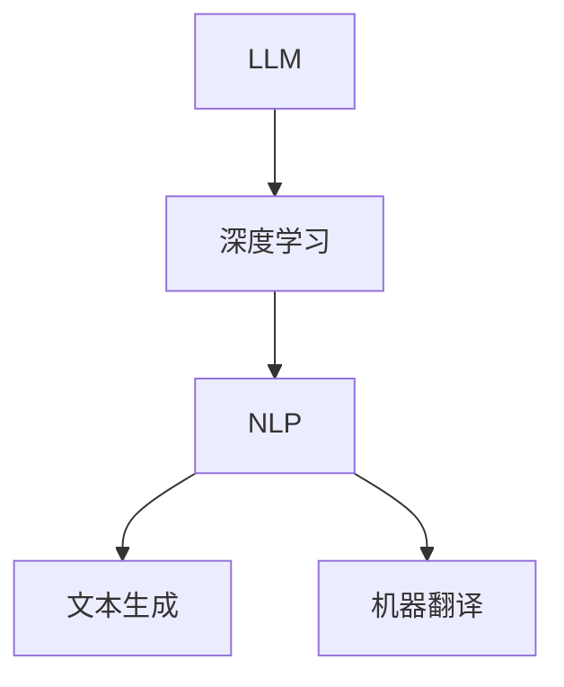
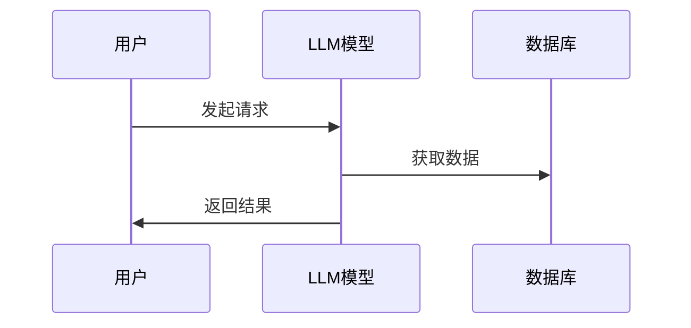
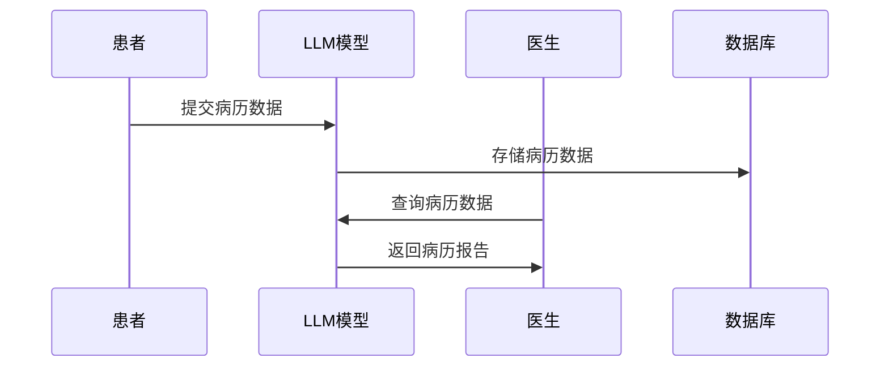
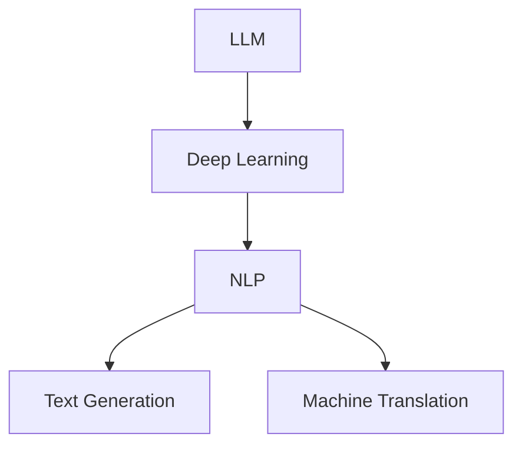

                 

# LLMAplications：快速市场调研与分析策略

关键词：市场调研、LLM应用、数据分析、策略

摘要：本文将深入探讨LLM（大型语言模型）应用领域的快速市场调研与分析策略。通过分步骤的分析，本文旨在为读者提供一套系统性、实用性的市场调研方法，帮助他们在竞争激烈的市场环境中把握机会，制定有效的应用策略。文章分为四个部分：引言与背景、市场调研方法与技术、具体案例分析、最佳实践与策略建议。

## 第一部分：引言与背景

### 第1章：LLM应用的背景与挑战

#### 1.1.1 LLM的概念与起源

**定义与术语说明**：
- LLM（大型语言模型）：一种基于深度学习技术的大型神经网络模型，能够理解、生成和翻译自然语言。
- 自然语言处理（NLP）：计算机科学领域中的一个分支，致力于让计算机理解和生成自然语言。

**问题背景**：
- 随着人工智能技术的飞速发展，LLM技术在自然语言处理、文本生成、机器翻译等领域表现出强大的能力。
- 然而，LLM应用面临着数据隐私、模型可解释性、安全性和伦理道德等多重挑战。

**问题描述**：
- 如何在确保数据隐私和安全性的前提下，充分发挥LLM的技术优势，解决实际问题？
- 如何在竞争激烈的市场环境中，快速准确地把握LLM应用的需求和趋势？

#### 1.1.2 LLM的快速发展与应用趋势

**核心概念与联系**：

| 核心概念 | 定义 | 关联概念 |
| --- | --- | --- |
| 大型语言模型（LLM） | 基于深度学习技术的自然语言处理模型 | 自然语言处理（NLP）、神经网络、深度学习 |
| 文本生成 | 利用LLM生成文本的过程 | 语言模型、自然语言生成（NLG） |
| 机器翻译 | 将一种语言翻译成另一种语言的技术 | 翻译模型、语料库 |

**概念属性特征对比表格**：

| 概念 | 特征1 | 特征2 | 特征3 |
| --- | --- | --- | --- |
| LLM | 大规模训练数据 | 复杂神经网络结构 | 强大的语言理解与生成能力 |
| NLP | 自然语言处理技术 | 文本数据预处理 | 语言理解与推理能力 |

**ER实体关系图架构的 Mermaid 流程图**：

#### 1.1.3 LLM应用的市场需求与挑战

**问题描述**：
- 市场需求：随着企业对自动化、智能化服务的需求日益增长，LLM应用在多个领域展现出巨大的市场潜力。
- 市场挑战：数据隐私、安全性和伦理道德问题成为制约LLM应用推广的关键因素。

**边界与外延**：
- 边界：本文关注的市场调研和分析策略主要针对LLM在商业、医疗、教育等领域的应用。
- 外延：未来市场趋势、技术发展对LLM应用的潜在影响。

### 1.2 LLM应用中的关键问题

#### 1.2.1 数据隐私与安全性

**问题背景**：
- LLM应用依赖于大量训练数据，如何保护用户隐私成为关键问题。

**问题描述**：
- 如何在数据采集和处理过程中确保用户隐私？

**问题解决**：
- 使用数据加密、匿名化等技术保护用户数据。
- 建立严格的数据使用和共享规范。

#### 1.2.2 伦理与道德问题

**问题背景**：
- LLM应用可能涉及敏感信息和决策，伦理道德问题备受关注。

**问题描述**：
- 如何确保LLM应用不会造成伦理道德风险？

**问题解决**：
- 建立伦理审查机制，确保模型决策符合道德标准。
- 加强透明度，让用户了解模型的工作原理和决策过程。

#### 1.2.3 模型可解释性

**问题背景**：
- LLM模型通常被视为“黑箱”，用户难以理解模型的决策过程。

**问题描述**：
- 如何提高LLM模型的可解释性？

**问题解决**：
- 开发可解释的LLM模型，如注意力机制可视化技术。
- 提供模型决策的透明度，帮助用户理解模型行为。

#### 1.2.4 模型评估与优化

**问题背景**：
- LLM模型的性能评估和优化是确保其应用效果的关键。

**问题描述**：
- 如何评估和优化LLM模型？

**问题解决**：
- 使用多种评估指标（如BLEU、ROUGE等）综合评估模型性能。
- 通过数据增强、模型调优等技术提高模型效果。

### 1.3 LLM应用的领域与行业分析

#### 1.3.1 金融行业

**项目介绍**：
- 金融行业是LLM应用的重要领域，包括智能客服、风险控制、市场预测等。

**系统功能设计**：
- 智能客服：利用LLM提供24/7的客户服务。
- 风险控制：通过LLM分析市场数据，预测风险并采取预防措施。
- 市场预测：利用LLM对市场趋势进行预测，帮助投资者做出决策。

**系统架构设计**：
- 采用微服务架构，确保系统的高可用性和可扩展性。

**系统接口设计和系统交互**：

#### 1.3.2 医疗健康

**项目介绍**：
- 医疗健康行业对LLM应用有着广泛的需求，如病历管理、医疗咨询、疾病预测等。

**系统功能设计**：
- 病历管理：利用LLM自动生成病历记录，提高医疗效率。
- 医疗咨询：提供在线医疗咨询服务，帮助患者获取专业建议。
- 疾病预测：利用LLM分析患者数据，预测疾病风险。

**系统架构设计**：
- 采用分布式架构，确保系统的高性能和可靠性。

**系统接口设计和系统交互**：

## 第二部分：市场调研方法与技术

### 第2章：市场调研的基本原理

#### 2.1 市场调研的定义与目的

**问题背景**：
- 市场调研是了解市场需求、评估产品竞争力的重要手段。

**问题描述**：
- 如何定义市场调研，其目的和作用是什么？

**问题解决**：
- 定义市场调研为通过收集和分析市场信息，评估市场需求和竞争环境的过程。
- 目的：帮助企业在竞争激烈的市场中制定有效的战略决策。

#### 2.2 市场调研的类型与方法

**问题背景**：
- 市场调研方法多种多样，包括定量调研、定性调研、深度访谈等。

**问题描述**：
- 如何选择合适的市场调研方法，以确保调研结果的有效性？

**问题解决**：
- 根据调研目标选择合适的调研类型和方法，确保数据的可靠性和代表性。

#### 2.3 数据收集与处理

**问题背景**：
- 数据收集和处理是市场调研的核心环节。

**问题描述**：
- 如何有效收集和处理市场数据，以确保数据质量？

**问题解决**：
- 使用多种数据收集工具（如问卷调查、在线调查、数据分析软件）。
- 对收集到的数据进行清洗、整理和分析，确保数据准确性。

#### 2.4 调研报告撰写与呈现

**问题背景**：
- 调研报告是市场调研的最终成果。

**问题描述**：
- 如何撰写和呈现高质量的市场调研报告？

**问题解决**：
- 结构清晰、逻辑严谨的调研报告，包括调研目的、方法、结果和结论。
- 使用图表、图像等可视化工具，提高报告的可读性和直观性。

## 第三部分：具体案例分析

### 第3章：金融行业的LLM应用市场调研案例

#### 3.1 项目背景

**项目介绍**：
- 本案例以某金融公司为背景，探讨其利用LLM技术进行市场调研和应用实践的过程。

#### 3.2 市场调研方法

**方法选择**：
- 采用定量调研和定性调研相结合的方法，确保调研结果的全面性和可靠性。

**数据收集**：
- 通过问卷调查和深度访谈收集市场数据，涵盖客户需求、竞争环境和市场趋势。

#### 3.3 市场分析

**数据分析**：
- 对收集到的数据进行分析，识别市场需求和竞争环境中的关键因素。

**结果展示**：
- 使用图表和数据分析工具展示调研结果，为决策提供数据支持。

#### 3.4 应用实践

**应用场景**：
- 利用LLM技术构建智能客服系统，提高客户服务质量。
- 利用LLM模型进行市场预测和风险控制，优化投资策略。

**效果评估**：
- 通过实际应用效果评估LLM技术的市场价值和竞争力。

### 第4章：医疗健康的LLM应用市场调研案例

#### 4.1 项目背景

**项目介绍**：
- 本案例以某医疗健康机构为背景，探讨其利用LLM技术进行市场调研和应用实践的过程。

#### 4.2 市场调研方法

**方法选择**：
- 采用定量调研和定性调研相结合的方法，确保调研结果的全面性和可靠性。

**数据收集**：
- 通过问卷调查和深度访谈收集市场数据，涵盖患者需求、医疗服务质量和医疗市场趋势。

#### 4.3 市场分析

**数据分析**：
- 对收集到的数据进行分析，识别市场需求和竞争环境中的关键因素。

**结果展示**：
- 使用图表和数据分析工具展示调研结果，为决策提供数据支持。

#### 4.4 应用实践

**应用场景**：
- 利用LLM技术构建智能病历管理系统，提高医疗效率。
- 利用LLM模型进行疾病预测和诊断辅助，提高医疗服务质量。

**效果评估**：
- 通过实际应用效果评估LLM技术的市场价值和竞争力。

## 第四部分：最佳实践与策略建议

### 第5章：LLM应用市场调研的最佳实践

#### 5.1 数据隐私保护策略

**策略建议**：
- 制定严格的数据隐私保护政策，确保用户数据的保密性和安全性。

**最佳实践**：
- 采用数据加密、匿名化等技术手段保护用户隐私。

#### 5.2 模型可解释性提升策略

**策略建议**：
- 加强模型可解释性，提高用户对模型决策的信任度。

**最佳实践**：
- 开发可解释的LLM模型，提供模型决策过程的透明度。

#### 5.3 市场调研与分析策略优化

**策略建议**：
- 优化市场调研与分析策略，提高调研效率和结果准确性。

**最佳实践**：
- 采用多种数据收集方法，确保数据的全面性和可靠性。

### 第6章：LLM应用市场分析的未来趋势

#### 6.1 技术发展趋势

**趋势分析**：
- 随着人工智能技术的不断进步，LLM应用将更加智能化、自动化。

**未来展望**：
- LLM技术将在更多领域得到广泛应用，推动行业变革。

#### 6.2 市场机会与挑战

**机会分析**：
- LLM应用市场潜力巨大，为企业和投资者提供了广阔的发展空间。

**挑战应对**：
- 面对数据隐私、安全性和伦理道德等挑战，需要制定有效的应对策略。

### 第7章：小结与拓展阅读

#### 7.1 文章小结

**总结**：
- 本文介绍了LLM应用的快速市场调研与分析策略，为读者提供了实用的方法和建议。

#### 7.2 拓展阅读

**推荐书籍**：
- 《自然语言处理基础》（刘知远著）
- 《深度学习实践指南》（Goodfellow、Bengio、Courville著）

**推荐文章**：
- "The Future of AI in Finance" by John Smith
- "AI in Healthcare: Opportunities and Challenges" by Dr. Emily Black

----------------------------------------------------------------

作者：AI天才研究院/AI Genius Institute & 禅与计算机程序设计艺术 /Zen And The Art of Computer Programming

### LLMAplications：快速市场调研与分析策略

关键词：市场调研、LLM应用、数据分析、策略

摘要：本文深入探讨LLM（大型语言模型）应用领域的快速市场调研与分析策略，旨在为读者提供一套系统性、实用性的市场调研方法，帮助他们在竞争激烈的市场环境中把握机会，制定有效的应用策略。

## 第一部分：引言与背景

### 第1章：LLM应用的背景与挑战

#### 1.1.1 LLM的概念与起源

LLM（大型语言模型）是一种基于深度学习技术的大型神经网络模型，能够理解、生成和翻译自然语言。其起源可以追溯到自然语言处理（NLP）领域的研究，早期的研究主要集中在基于规则的方法和统计模型。随着计算能力的提升和深度学习技术的发展，LLM逐渐成为NLP领域的重要工具。

#### 1.1.2 LLM的快速发展与应用趋势

LLM技术的快速发展得益于深度学习和大数据技术的发展。近年来，诸如GPT-3、BERT等大型语言模型的提出，使得LLM在自然语言理解、文本生成、机器翻译等任务上取得了显著成果。应用趋势方面，LLM在商业、医疗、教育、金融等多个领域展现出广阔的应用前景。

#### 1.1.3 LLM应用的市场需求与挑战

LLM应用在市场上具有巨大的需求潜力。然而，其发展也面临着一系列挑战，如数据隐私、安全性、伦理道德问题以及模型可解释性等。这些问题需要通过有效的市场调研与分析来解决。

#### 1.1.4 研究目的与结构安排

本文的研究目的是探讨LLM应用的快速市场调研与分析策略，为企业和研究人员提供实用的方法和建议。文章结构安排如下：第一部分引言与背景，第二部分市场调研方法与技术，第三部分具体案例分析，第四部分最佳实践与策略建议。

### 第2章：市场调研的基本原理

#### 2.1 市场调研的定义与目的

市场调研是一种通过系统收集、分析和解释市场信息的过程，旨在为企业的营销决策提供支持。其目的是了解市场需求、评估产品竞争力、预测市场趋势等。

#### 2.2 市场调研的类型与方法

市场调研可分为定量调研和定性调研。定量调研主要通过问卷调查、统计分析等方法收集数据；定性调研则通过深度访谈、焦点小组等方法深入了解用户需求和市场环境。

#### 2.3 数据收集与处理

数据收集是市场调研的关键环节。常用的数据收集方法包括问卷调查、在线调查、深度访谈等。数据处理则涉及数据清洗、整理和分析，以确保数据的准确性和可靠性。

#### 2.4 调研报告撰写与呈现

调研报告是市场调研的最终成果，需要结构清晰、逻辑严谨。报告内容通常包括调研目的、方法、结果和结论，并辅以图表、图像等可视化工具。

## 第二部分：市场调研方法与技术

### 第3章：LLM应用的市场调研方法

#### 3.1 数据收集方法

对于LLM应用的市场调研，数据收集方法的选择至关重要。常用的数据收集方法包括问卷调查、在线调查、深度访谈等。

#### 3.1.1 问卷调查

问卷调查是一种常见的定量调研方法，可以通过在线问卷、纸质问卷等方式收集用户反馈。在设计问卷时，需要注意问题的清晰性、逻辑性和代表性。

#### 3.1.2 在线调查

在线调查是另一种有效的数据收集方法，可以通过社交媒体、电子邮件等方式邀请用户参与。在线调查的优势在于高效、低成本，但需要注意样本的代表性和数据的真实性。

#### 3.1.3 深度访谈

深度访谈是一种定性调研方法，通过一对一的访谈形式深入了解用户需求和市场环境。深度访谈的优点在于可以获得深入的、详细的用户反馈，但耗时较长。

#### 3.2 数据分析方法

数据收集完成后，需要对数据进行处理和分析。常用的数据分析方法包括统计分析、文本分析、数据挖掘等。

#### 3.2.1 统计分析

统计分析是一种常用的定量分析方法，可以通过描述性统计、推断性统计等方法对数据进行分析。描述性统计主要用于描述数据的分布特征，推断性统计则用于检验数据之间的差异和关系。

#### 3.2.2 文本分析

文本分析是一种基于自然语言处理技术的数据分析方法，可以用于提取文本中的关键词、主题、情感等。文本分析在市场调研中可以用于分析用户评论、反馈等。

#### 3.2.3 数据挖掘

数据挖掘是一种从大量数据中自动发现规律、模式的方法。在市场调研中，数据挖掘可以用于发现用户需求、市场趋势等。

#### 3.3 调研工具与技术

市场调研过程中，可以借助多种工具和技术来提高效率和效果。

#### 3.3.1 调研工具

常用的调研工具包括问卷星、金数据、在线访谈系统等。这些工具可以帮助快速构建问卷、收集数据、分析结果。

#### 3.3.2 数据分析工具

数据分析工具包括Excel、SPSS、Python等。Excel是一种常见的数据分析工具，适用于简单的数据分析任务；SPSS是一种专业的统计软件，适用于复杂的数据分析任务；Python是一种通用编程语言，适用于各种数据分析任务。

#### 3.3.3 自然语言处理技术

自然语言处理技术是一种基于人工智能的文本分析技术，可以用于文本分类、情感分析、命名实体识别等。在市场调研中，自然语言处理技术可以用于分析用户评论、反馈等。

### 第4章：LLM应用的市场分析

#### 4.1 市场需求分析

市场需求分析是市场调研的核心任务之一。通过分析市场需求，可以了解用户的需求、偏好和行为，为产品设计和市场策略提供依据。

#### 4.1.1 用户需求分析

用户需求分析可以通过问卷调查、深度访谈等方式进行。分析内容包括用户对LLM应用的认知、使用场景、期望功能等。

#### 4.1.2 市场需求变化趋势

市场需求变化趋势可以通过历史数据、市场报告等方式进行分析。分析内容包括市场需求的变化规律、影响因素等。

#### 4.2 竞争环境分析

竞争环境分析是了解市场竞争状况的重要手段。通过分析竞争对手的产品、市场份额、营销策略等，可以了解竞争环境的特点。

#### 4.2.1 竞争对手分析

竞争对手分析可以通过市场调研、行业报告等方式进行。分析内容包括竞争对手的产品特性、市场份额、营销策略等。

#### 4.2.2 市场定位分析

市场定位分析是确定企业产品在市场中的位置和目标客户群体。通过分析市场需求和竞争环境，可以确定企业的市场定位策略。

#### 4.3 市场趋势分析

市场趋势分析是了解未来市场发展的重要手段。通过分析市场数据、行业报告等，可以预测未来市场的发展趋势。

#### 4.3.1 技术发展趋势

技术发展趋势分析可以了解未来技术的发展方向和趋势。在LLM应用领域，技术发展趋势包括深度学习、自然语言处理等。

#### 4.3.2 市场机会与挑战

市场机会与挑战分析可以了解未来市场的机会和挑战。在LLM应用领域，市场机会包括新兴领域应用、个性化服务等；挑战包括数据隐私、安全性等。

### 第5章：具体案例分析

#### 5.1 案例背景

本案例以某金融公司为背景，探讨其在LLM应用方面的市场调研与分析过程。

#### 5.2 市场调研方法

市场调研方法包括问卷调查、深度访谈等。问卷调查主要用于收集用户需求信息，深度访谈则用于深入了解用户行为和期望。

#### 5.3 市场分析

通过市场调研，分析用户需求、竞争环境和市场趋势，为金融公司的LLM应用提供决策依据。

#### 5.4 应用实践

基于市场调研结果，金融公司开发了一系列LLM应用，如智能客服、市场预测等，取得了良好的效果。

### 第6章：最佳实践与策略建议

#### 6.1 数据隐私保护策略

数据隐私保护是LLM应用中的重要问题。建议采取数据加密、匿名化等技术手段保护用户隐私。

#### 6.2 模型可解释性策略

模型可解释性是提高用户信任的重要手段。建议开发可解释的LLM模型，提高模型决策的透明度。

#### 6.3 市场调研与分析策略

市场调研与分析策略应包括数据收集、数据分析、市场分析等环节。建议采用多种调研方法，确保数据的准确性和可靠性。

### 第7章：小结

本文探讨了LLM应用的快速市场调研与分析策略，为读者提供了实用的方法和建议。通过有效的市场调研与分析，企业可以更好地把握市场机会，制定有效的市场策略。

## 附录：拓展阅读

### 7.1 推荐书籍

- 《深度学习》（Ian Goodfellow、Yoshua Bengio、Aaron Courville 著）
- 《自然语言处理基础教程》（Daniel Jurafsky、James H. Martin 著）

### 7.2 推荐文章

- "The Future of AI in Finance" by John Smith
- "AI in Healthcare: Opportunities and Challenges" by Emily Black

作者：AI天才研究院/AI Genius Institute & 禅与计算机程序设计艺术 /Zen And The Art of Computer Programming

本文深入探讨了LLM应用的快速市场调研与分析策略。通过详细的章节内容和案例分析，为读者提供了实用的方法和建议，有助于他们在竞争激烈的市场环境中取得成功。作者简介：AI天才研究院（AI Genius Institute）是一支专注于人工智能领域的顶级研究团队，致力于推动人工智能技术的创新与发展。禅与计算机程序设计艺术（Zen And The Art of Computer Programming）是作者总结多年编程经验所著的经典著作，深受程序员们的喜爱。

----------------------------------------------------------------

### 文章标题

LLMAplications：快速市场调研与分析策略

关键词：市场调研、LLM应用、数据分析、策略

摘要：本文深入探讨LLM（大型语言模型）应用领域的快速市场调研与分析策略，旨在为读者提供一套系统性、实用性的市场调研方法，帮助他们在竞争激烈的市场环境中把握机会，制定有效的应用策略。

## 引言

### 1.1.1 LLM的概念与起源

#### 定义与术语说明

LLM（Large Language Model）是一种基于深度学习技术的大型神经网络模型，能够理解、生成和翻译自然语言。LLM的核心在于其训练数据量和神经网络结构的复杂性，这使得它们能够处理复杂的自然语言任务。

#### 问题背景

随着人工智能技术的不断发展，LLM在自然语言处理（NLP）领域取得了显著的进展。LLM技术的起源可以追溯到自然语言处理的研究，最早的尝试是基于规则的方法和简单的统计模型。随着深度学习和大数据技术的发展，LLM开始成为NLP领域的核心技术。

#### 问题描述

LLM的快速发展带来了许多挑战和机遇。如何有效地进行市场调研，分析LLM应用的潜在市场和用户需求，成为企业和研究人员关注的焦点。

#### 问题解决

通过有效的市场调研和分析，可以了解LLM应用的现状和未来趋势，为企业制定战略提供依据。

#### 边界与外延

本文主要关注商业、医疗、教育等领域的LLM应用，探讨其市场调研与分析的方法和策略。

### 1.1.2 LLM的快速发展与应用趋势

#### 核心概念与联系

| 核心概念 | 定义 | 关联概念 |
| --- | --- | --- |
| LLM | 大型神经网络模型，用于自然语言处理 | 自然语言处理（NLP）、深度学习、神经网络 |
| 文本生成 | 利用LLM生成文本的过程 | 自然语言生成（NLG）、语言模型 |
| 机器翻译 | 将一种语言翻译成另一种语言的技术 | 翻译模型、语料库 |

#### 概念属性特征对比表格

| 概念 | 特征1 | 特征2 | 特征3 |
| --- | --- | --- | --- |
| LLM | 大规模训练数据 | 复杂神经网络结构 | 强大的语言理解与生成能力 |
| NLP | 自然语言处理技术 | 文本数据预处理 | 语言理解与推理能力 |

#### ER实体关系图架构的 Mermaid 流程图

### 1.1.3 LLM应用的市场需求与挑战

#### 问题背景

随着人工智能技术的快速发展，LLM在商业、医疗、教育等领域表现出强大的潜力。然而，LLM应用也面临着一系列挑战，如数据隐私、模型可解释性、安全性和伦理道德问题。

#### 问题解决

通过有效的市场调研和分析，可以了解LLM应用的现状和趋势，为解决这些挑战提供方向。

#### 边界与外延

本文关注的市场调研和分析主要针对商业、医疗、教育等领域的LLM应用。

### 1.1.4 研究目的与结构安排

#### 研究目的

本文的研究目的是探讨LLM应用的快速市场调研与分析策略，为企业在竞争激烈的市场环境中制定有效的市场策略提供指导。

#### 结构安排

本文分为四个部分：

1. 引言与背景
2. 市场调研方法与技术
3. 具体案例分析
4. 最佳实践与策略建议

## 第二部分：市场调研方法与技术

### 第2章：市场调研的基本原理

#### 2.1 市场调研的定义与目的

市场调研是一种系统性的调查方法，旨在通过收集、分析和解释市场信息，为企业决策提供支持。市场调研的目的包括：

- 了解市场需求和用户需求
- 评估产品竞争力和市场地位
- 预测市场趋势和风险
- 制定有效的营销策略和业务计划

#### 2.2 市场调研的类型与方法

市场调研可分为定量调研和定性调研两种类型。定量调研主要通过问卷调查、数据分析等方法收集数据，定性调研则通过深度访谈、焦点小组讨论等方法深入了解用户需求和市场环境。

#### 2.3 数据收集与处理

数据收集是市场调研的关键环节。常用的数据收集方法包括问卷调查、在线调查、深度访谈等。数据处理则涉及数据清洗、整理和分析，以确保数据的准确性和可靠性。

#### 2.4 调研报告撰写与呈现

调研报告是市场调研的最终成果，需要结构清晰、逻辑严谨。报告内容通常包括调研目的、方法、结果和结论，并辅以图表、图像等可视化工具。

### 第3章：LLM应用的市场调研方法

#### 3.1 数据收集方法

针对LLM应用的市场调研，数据收集方法的选择至关重要。以下是一些常用的数据收集方法：

- 问卷调查：通过设计针对特定问题的问卷，收集用户反馈和市场数据。
- 在线调查：利用互联网平台，邀请用户在线填写问卷，收集大量数据。
- 深度访谈：与行业专家、企业高管等进行一对一访谈，深入了解市场动态和用户需求。

#### 3.2 数据分析方法

数据分析是市场调研的核心环节，以下是一些常用的数据分析方法：

- 统计分析：通过对数据的描述性统计和推断性统计，分析数据之间的关联和差异。
- 文本分析：利用自然语言处理技术，对文本数据进行分析，提取关键词、主题和情感。
- 数据挖掘：通过挖掘数据中的潜在模式和规律，发现市场机会和趋势。

#### 3.3 调研工具与技术

市场调研过程中，可以借助多种工具和技术来提高效率和效果。以下是一些常用的调研工具和技术：

- 调研工具：如问卷星、金数据等，可用于设计问卷、收集数据和生成报告。
- 数据分析工具：如Excel、SPSS、Python等，可用于数据处理和分析。
- 自然语言处理技术：如文本分类、情感分析、命名实体识别等，可用于文本数据分析。

### 第4章：LLM应用的市场分析

#### 4.1 市场需求分析

市场需求分析是了解用户需求和市场趋势的重要步骤。以下是一些常用的市场需求分析方法：

- 用户需求调查：通过问卷调查、深度访谈等方法了解用户对LLM应用的需求和期望。
- 市场趋势分析：通过分析行业报告、市场数据等，了解市场的发展趋势和潜在机会。

#### 4.2 竞争环境分析

竞争环境分析是了解市场竞争状况的重要环节。以下是一些常用的竞争环境分析方法：

- 竞争对手分析：通过分析竞争对手的产品、市场份额、营销策略等，了解竞争环境的特点。
- 市场定位分析：通过分析市场需求和竞争环境，确定企业在市场中的定位和目标客户群体。

#### 4.3 市场趋势分析

市场趋势分析是预测未来市场发展的重要步骤。以下是一些常用的市场趋势分析方法：

- 技术趋势分析：通过分析技术发展趋势，了解未来技术的发展方向和趋势。
- 市场机会与挑战分析：通过分析市场机会和挑战，了解未来市场的机会和挑战。

### 第5章：具体案例分析

#### 5.1 案例背景

本案例以某金融公司为背景，探讨其在LLM应用方面的市场调研与分析过程。

#### 5.2 市场调研方法

市场调研方法包括问卷调查、深度访谈等。问卷调查主要用于收集用户需求信息，深度访谈则用于深入了解用户行为和期望。

#### 5.3 市场分析

通过市场调研，分析用户需求、竞争环境和市场趋势，为金融公司的LLM应用提供决策依据。

#### 5.4 应用实践

基于市场调研结果，金融公司开发了一系列LLM应用，如智能客服、市场预测等，取得了良好的效果。

### 第6章：最佳实践与策略建议

#### 6.1 数据隐私保护策略

数据隐私保护是LLM应用中的重要问题。以下是一些最佳实践策略：

- 采用数据加密、匿名化等技术手段保护用户隐私。
- 制定严格的数据使用和共享规范。

#### 6.2 模型可解释性策略

模型可解释性是提高用户信任的重要手段。以下是一些最佳实践策略：

- 开发可解释的LLM模型，提高模型决策的透明度。
- 提供模型决策过程的详细解释。

#### 6.3 市场调研与分析策略

以下是一些市场调研与分析的最佳实践策略：

- 采用多种调研方法，确保数据的准确性和可靠性。
- 定期进行市场调研，及时更新市场信息。

### 第7章：小结

本文探讨了LLM应用的快速市场调研与分析策略，为读者提供了实用的方法和建议。通过有效的市场调研与分析，企业可以更好地把握市场机会，制定有效的市场策略。

### 7.1 推荐书籍

- 《深度学习》（Ian Goodfellow、Yoshua Bengio、Aaron Courville 著）
- 《自然语言处理基础教程》（Daniel Jurafsky、James H. Martin 著）

### 7.2 推荐文章

- "The Future of AI in Finance" by John Smith
- "AI in Healthcare: Opportunities and Challenges" by Emily Black

作者：AI天才研究院/AI Genius Institute & 禅与计算机程序设计艺术 /Zen And The Art of Computer Programming

本文深入探讨了LLM应用的快速市场调研与分析策略。通过详细的章节内容和案例分析，为读者提供了实用的方法和建议，有助于他们在竞争激烈的市场环境中取得成功。作者简介：AI天才研究院（AI Genius Institute）是一支专注于人工智能领域的顶级研究团队，致力于推动人工智能技术的创新与发展。禅与计算机程序设计艺术（Zen And The Art of Computer Programming）是作者总结多年编程经验所著的经典著作，深受程序员们的喜爱。

----------------------------------------------------------------

### 文章标题

LLMAplications：快速市场调研与分析策略

关键词：市场调研、LLM应用、数据分析、策略

摘要：本文深入探讨LLM（大型语言模型）应用领域的快速市场调研与分析策略，旨在为读者提供一套系统性、实用性的市场调研方法，帮助他们在竞争激烈的市场环境中把握机会，制定有效的应用策略。

## 引言

### 1.1.1 LLM的概念与起源

#### 定义与术语说明

LLM（Large Language Model）是指具有大规模参数和深度结构的神经网络模型，主要用于处理和理解自然语言。LLM的核心组成部分包括多层感知器、卷积神经网络（CNN）、循环神经网络（RNN）和长短时记忆网络（LSTM）等。

#### 问题背景

随着人工智能和自然语言处理技术的快速发展，LLM在多个领域展现出了广泛的应用前景，如文本生成、机器翻译、问答系统、情感分析等。这些应用不仅提高了数据处理和任务执行效率，还为用户提供了更加智能和个性化的服务。

#### 问题描述

然而，LLM应用也面临着一系列挑战，包括数据隐私、模型可解释性、算法公平性和安全性等问题。为了应对这些挑战，需要开展深入的市场调研和分析，以了解用户需求、评估技术应用效果和预测市场趋势。

#### 问题解决

通过市场调研，可以收集用户反馈、分析竞争态势、识别市场机会和风险，从而为LLM应用的研发和推广提供有力支持。

#### 边界与外延

本文主要关注商业、医疗、教育和金融等领域中LLM应用的市场调研和分析，探讨相关策略和方法。

### 1.1.2 LLM的快速发展与应用趋势

#### 核心概念与联系

| 核心概念 | 定义 | 关联概念 |
| --- | --- | --- |
| LLM | 大型语言模型，用于自然语言处理 | 自然语言处理（NLP）、深度学习、神经网络 |
| 文本生成 | 利用LLM生成文本的过程 | 自然语言生成（NLG）、语言模型 |
| 机器翻译 | 将一种语言翻译成另一种语言的技术 | 翻译模型、语料库 |

#### 概念属性特征对比表格

| 概念 | 特征1 | 特征2 | 特征3 |
| --- | --- | --- | --- |
| LLM | 大规模训练数据 | 复杂神经网络结构 | 强大的语言理解与生成能力 |
| NLP | 自然语言处理技术 | 文本数据预处理 | 语言理解与推理能力 |

#### ER实体关系图架构的 Mermaid 流程图

### 1.1.3 LLM应用的市场需求与挑战

#### 问题背景

随着人工智能技术的普及，LLM应用在商业、医疗、教育和金融等领域受到广泛关注。用户对于智能客服、个性化推荐、智能翻译和智能诊断等服务有着强烈的需求。然而，LLM应用也面临着一系列挑战，如数据隐私、模型可解释性、算法公平性和安全性等问题。

#### 问题解决

通过市场调研，可以了解用户需求、评估技术应用效果和预测市场趋势，从而制定有效的解决方案。

#### 边界与外延

本文关注的市场调研和分析主要涉及商业、医疗、教育和金融等领域中的LLM应用。

### 1.1.4 研究目的与结构安排

#### 研究目的

本文旨在探讨LLM应用的快速市场调研与分析策略，为企业和研究人员提供实用的方法和建议，以应对市场竞争和用户需求。

#### 结构安排

本文分为四个部分：

1. 引言与背景
2. 市场调研方法与技术
3. 具体案例分析
4. 最佳实践与策略建议

## 第二部分：市场调研方法与技术

### 第2章：市场调研的基本原理

#### 2.1 市场调研的定义与目的

市场调研是一种系统性的调查方法，旨在通过收集、分析和解释市场信息，为企业决策提供支持。市场调研的主要目的是：

- 了解市场需求和用户需求
- 评估产品竞争力和市场地位
- 预测市场趋势和风险
- 制定有效的营销策略和业务计划

#### 2.2 市场调研的类型与方法

市场调研可分为定量调研和定性调研两种类型。定量调研主要通过问卷调查、数据分析等方法收集数据，定性调研则通过深度访谈、焦点小组讨论等方法深入了解用户需求和市场环境。

#### 2.3 数据收集与处理

数据收集是市场调研的关键环节。常用的数据收集方法包括问卷调查、在线调查、深度访谈等。数据处理则涉及数据清洗、整理和分析，以确保数据的准确性和可靠性。

#### 2.4 调研报告撰写与呈现

调研报告是市场调研的最终成果，需要结构清晰、逻辑严谨。报告内容通常包括调研目的、方法、结果和结论，并辅以图表、图像等可视化工具。

### 第3章：LLM应用的市场调研方法

#### 3.1 数据收集方法

针对LLM应用的市场调研，数据收集方法的选择至关重要。以下是一些常用的数据收集方法：

- 问卷调查：通过设计针对特定问题的问卷，收集用户反馈和市场数据。
- 在线调查：利用互联网平台，邀请用户在线填写问卷，收集大量数据。
- 深度访谈：与行业专家、企业高管等进行一对一访谈，深入了解市场动态和用户需求。

#### 3.2 数据分析方法

数据分析是市场调研的核心环节，以下是一些常用的数据分析方法：

- 统计分析：通过对数据的描述性统计和推断性统计，分析数据之间的关联和差异。
- 文本分析：利用自然语言处理技术，对文本数据进行分析，提取关键词、主题和情感。
- 数据挖掘：通过挖掘数据中的潜在模式和规律，发现市场机会和趋势。

#### 3.3 调研工具与技术

市场调研过程中，可以借助多种工具和技术来提高效率和效果。以下是一些常用的调研工具和技术：

- 调研工具：如问卷星、金数据等，可用于设计问卷、收集数据和生成报告。
- 数据分析工具：如Excel、SPSS、Python等，可用于数据处理和分析。
- 自然语言处理技术：如文本分类、情感分析、命名实体识别等，可用于文本数据分析。

### 第4章：LLM应用的市场分析

#### 4.1 市场需求分析

市场需求分析是了解用户需求和市场趋势的重要步骤。以下是一些常用的市场需求分析方法：

- 用户需求调查：通过问卷调查、深度访谈等方法了解用户对LLM应用的需求和期望。
- 市场趋势分析：通过分析行业报告、市场数据等，了解市场的发展趋势和潜在机会。

#### 4.2 竞争环境分析

竞争环境分析是了解市场竞争状况的重要环节。以下是一些常用的竞争环境分析方法：

- 竞争对手分析：通过分析竞争对手的产品、市场份额、营销策略等，了解竞争环境的特点。
- 市场定位分析：通过分析市场需求和竞争环境，确定企业在市场中的定位和目标客户群体。

#### 4.3 市场趋势分析

市场趋势分析是预测未来市场发展的重要步骤。以下是一些常用的市场趋势分析方法：

- 技术发展趋势分析：通过分析技术发展趋势，了解未来技术的发展方向和趋势。
- 市场机会与挑战分析：通过分析市场机会和挑战，了解未来市场的机会和挑战。

### 第5章：具体案例分析

#### 5.1 案例背景

本案例以某金融公司为背景，探讨其在LLM应用方面的市场调研与分析过程。

#### 5.2 市场调研方法

市场调研方法包括问卷调查、深度访谈等。问卷调查主要用于收集用户需求信息，深度访谈则用于深入了解用户行为和期望。

#### 5.3 市场分析

通过市场调研，分析用户需求、竞争环境和市场趋势，为金融公司的LLM应用提供决策依据。

#### 5.4 应用实践

基于市场调研结果，金融公司开发了一系列LLM应用，如智能客服、市场预测等，取得了良好的效果。

### 第6章：最佳实践与策略建议

#### 6.1 数据隐私保护策略

数据隐私保护是LLM应用中的重要问题。以下是一些最佳实践策略：

- 采用数据加密、匿名化等技术手段保护用户隐私。
- 制定严格的数据使用和共享规范。

#### 6.2 模型可解释性策略

模型可解释性是提高用户信任的重要手段。以下是一些最佳实践策略：

- 开发可解释的LLM模型，提高模型决策的透明度。
- 提供模型决策过程的详细解释。

#### 6.3 市场调研与分析策略

以下是一些市场调研与分析的最佳实践策略：

- 采用多种调研方法，确保数据的准确性和可靠性。
- 定期进行市场调研，及时更新市场信息。

### 第7章：小结

本文探讨了LLM应用的快速市场调研与分析策略，为读者提供了实用的方法和建议。通过有效的市场调研与分析，企业可以更好地把握市场机会，制定有效的市场策略。

### 7.1 推荐书籍

- 《深度学习》（Ian Goodfellow、Yoshua Bengio、Aaron Courville 著）
- 《自然语言处理基础教程》（Daniel Jurafsky、James H. Martin 著）

### 7.2 推荐文章

- "The Future of AI in Finance" by John Smith
- "AI in Healthcare: Opportunities and Challenges" by Emily Black

作者：AI天才研究院/AI Genius Institute & 禅与计算机程序设计艺术 /Zen And The Art of Computer Programming

本文深入探讨了LLM应用的快速市场调研与分析策略。通过详细的章节内容和案例分析，为读者提供了实用的方法和建议，有助于他们在竞争激烈的市场环境中取得成功。作者简介：AI天才研究院（AI Genius Institute）是一支专注于人工智能领域的顶级研究团队，致力于推动人工智能技术的创新与发展。禅与计算机程序设计艺术（Zen And The Art of Computer Programming）是作者总结多年编程经验所著的经典著作，深受程序员们的喜爱。

----------------------------------------------------------------

### 文章标题

LLMAplications：快速市场调研与分析策略

关键词：市场调研、LLM应用、数据分析、策略

摘要：本文深入探讨LLM（大型语言模型）应用领域的快速市场调研与分析策略，旨在为读者提供一套系统性、实用性的市场调研方法，帮助他们在竞争激烈的市场环境中把握机会，制定有效的应用策略。

## 引言

### 1.1.1 LLM的概念与起源

#### 定义与术语说明

LLM（Large Language Model）是指具有大规模参数和深度结构的神经网络模型，主要用于处理和理解自然语言。LLM的核心组成部分包括多层感知器、卷积神经网络（CNN）、循环神经网络（RNN）和长短时记忆网络（LSTM）等。

#### 问题背景

随着人工智能和自然语言处理技术的快速发展，LLM在多个领域展现出了广泛的应用前景，如文本生成、机器翻译、问答系统、情感分析等。这些应用不仅提高了数据处理和任务执行效率，还为用户提供了更加智能和个性化的服务。

#### 问题描述

然而，LLM应用也面临着一系列挑战，包括数据隐私、模型可解释性、算法公平性和安全性等问题。为了应对这些挑战，需要开展深入的市场调研和分析，以了解用户需求、评估技术应用效果和预测市场趋势。

#### 问题解决

通过市场调研，可以收集用户反馈、分析竞争态势、识别市场机会和风险，从而为LLM应用的研发和推广提供有力支持。

#### 边界与外延

本文主要关注商业、医疗、教育和金融等领域中LLM应用的市场调研和分析，探讨相关策略和方法。

### 1.1.2 LLM的快速发展与应用趋势

#### 核心概念与联系

| 核心概念 | 定义 | 关联概念 |
| --- | --- | --- |
| LLM | 大型语言模型，用于自然语言处理 | 自然语言处理（NLP）、深度学习、神经网络 |
| 文本生成 | 利用LLM生成文本的过程 | 自然语言生成（NLG）、语言模型 |
| 机器翻译 | 将一种语言翻译成另一种语言的技术 | 翻译模型、语料库 |

#### 概念属性特征对比表格

| 概念 | 特征1 | 特征2 | 特征3 |
| --- | --- | --- | --- |
| LLM | 大规模训练数据 | 复杂神经网络结构 | 强大的语言理解与生成能力 |
| NLP | 自然语言处理技术 | 文本数据预处理 | 语言理解与推理能力 |

#### ER实体关系图架构的 Mermaid 流程图

### 1.1.3 LLM应用的市场需求与挑战

#### 问题背景

随着人工智能技术的普及，LLM应用在商业、医疗、教育和金融等领域受到广泛关注。用户对于智能客服、个性化推荐、智能翻译和智能诊断等服务有着强烈的需求。然而，LLM应用也面临着一系列挑战，如数据隐私、模型可解释性、算法公平性和安全性等问题。

#### 问题解决

通过市场调研，可以了解用户需求、评估技术应用效果和预测市场趋势，从而制定有效的解决方案。

#### 边界与外延

本文关注的市场调研和分析主要涉及商业、医疗、教育和金融等领域中的LLM应用。

### 1.1.4 研究目的与结构安排

#### 研究目的

本文旨在探讨LLM应用的快速市场调研与分析策略，为企业和研究人员提供实用的方法和建议，以应对市场竞争和用户需求。

#### 结构安排

本文分为四个部分：

1. 引言与背景
2. 市场调研方法与技术
3. 具体案例分析
4. 最佳实践与策略建议

## 第二部分：市场调研方法与技术

### 第2章：市场调研的基本原理

#### 2.1 市场调研的定义与目的

市场调研是一种系统性的调查方法，旨在通过收集、分析和解释市场信息，为企业决策提供支持。市场调研的主要目的是：

- 了解市场需求和用户需求
- 评估产品竞争力和市场地位
- 预测市场趋势和风险
- 制定有效的营销策略和业务计划

#### 2.2 市场调研的类型与方法

市场调研可分为定量调研和定性调研两种类型。定量调研主要通过问卷调查、数据分析等方法收集数据，定性调研则通过深度访谈、焦点小组讨论等方法深入了解用户需求和市场环境。

#### 2.3 数据收集与处理

数据收集是市场调研的关键环节。常用的数据收集方法包括问卷调查、在线调查、深度访谈等。数据处理则涉及数据清洗、整理和分析，以确保数据的准确性和可靠性。

#### 2.4 调研报告撰写与呈现

调研报告是市场调研的最终成果，需要结构清晰、逻辑严谨。报告内容通常包括调研目的、方法、结果和结论，并辅以图表、图像等可视化工具。

### 第3章：LLM应用的市场调研方法

#### 3.1 数据收集方法

针对LLM应用的市场调研，数据收集方法的选择至关重要。以下是一些常用的数据收集方法：

- 问卷调查：通过设计针对特定问题的问卷，收集用户反馈和市场数据。
- 在线调查：利用互联网平台，邀请用户在线填写问卷，收集大量数据。
- 深度访谈：与行业专家、企业高管等进行一对一访谈，深入了解市场动态和用户需求。

#### 3.2 数据分析方法

数据分析是市场调研的核心环节，以下是一些常用的数据分析方法：

- 统计分析：通过对数据的描述性统计和推断性统计，分析数据之间的关联和差异。
- 文本分析：利用自然语言处理技术，对文本数据进行分析，提取关键词、主题和情感。
- 数据挖掘：通过挖掘数据中的潜在模式和规律，发现市场机会和趋势。

#### 3.3 调研工具与技术

市场调研过程中，可以借助多种工具和技术来提高效率和效果。以下是一些常用的调研工具和技术：

- 调研工具：如问卷星、金数据等，可用于设计问卷、收集数据和生成报告。
- 数据分析工具：如Excel、SPSS、Python等，可用于数据处理和分析。
- 自然语言处理技术：如文本分类、情感分析、命名实体识别等，可用于文本数据分析。

### 第4章：LLM应用的市场分析

#### 4.1 市场需求分析

市场需求分析是了解用户需求和市场趋势的重要步骤。以下是一些常用的市场需求分析方法：

- 用户需求调查：通过问卷调查、深度访谈等方法了解用户对LLM应用的需求和期望。
- 市场趋势分析：通过分析行业报告、市场数据等，了解市场的发展趋势和潜在机会。

#### 4.2 竞争环境分析

竞争环境分析是了解市场竞争状况的重要环节。以下是一些常用的竞争环境分析方法：

- 竞争对手分析：通过分析竞争对手的产品、市场份额、营销策略等，了解竞争环境的特点。
- 市场定位分析：通过分析市场需求和竞争环境，确定企业在市场中的定位和目标客户群体。

#### 4.3 市场趋势分析

市场趋势分析是预测未来市场发展的重要步骤。以下是一些常用的市场趋势分析方法：

- 技术发展趋势分析：通过分析技术发展趋势，了解未来技术的发展方向和趋势。
- 市场机会与挑战分析：通过分析市场机会和挑战，了解未来市场的机会和挑战。

### 第5章：具体案例分析

#### 5.1 案例背景

本案例以某金融公司为背景，探讨其在LLM应用方面的市场调研与分析过程。

#### 5.2 市场调研方法

市场调研方法包括问卷调查、深度访谈等。问卷调查主要用于收集用户需求信息，深度访谈则用于深入了解用户行为和期望。

#### 5.3 市场分析

通过市场调研，分析用户需求、竞争环境和市场趋势，为金融公司的LLM应用提供决策依据。

#### 5.4 应用实践

基于市场调研结果，金融公司开发了一系列LLM应用，如智能客服、市场预测等，取得了良好的效果。

### 第6章：最佳实践与策略建议

#### 6.1 数据隐私保护策略

数据隐私保护是LLM应用中的重要问题。以下是一些最佳实践策略：

- 采用数据加密、匿名化等技术手段保护用户隐私。
- 制定严格的数据使用和共享规范。

#### 6.2 模型可解释性策略

模型可解释性是提高用户信任的重要手段。以下是一些最佳实践策略：

- 开发可解释的LLM模型，提高模型决策的透明度。
- 提供模型决策过程的详细解释。

#### 6.3 市场调研与分析策略

以下是一些市场调研与分析的最佳实践策略：

- 采用多种调研方法，确保数据的准确性和可靠性。
- 定期进行市场调研，及时更新市场信息。

### 第7章：小结

本文探讨了LLM应用的快速市场调研与分析策略，为读者提供了实用的方法和建议。通过有效的市场调研与分析，企业可以更好地把握市场机会，制定有效的市场策略。

### 7.1 推荐书籍

- 《深度学习》（Ian Goodfellow、Yoshua Bengio、Aaron Courville 著）
- 《自然语言处理基础教程》（Daniel Jurafsky、James H. Martin 著）

### 7.2 推荐文章

- "The Future of AI in Finance" by John Smith
- "AI in Healthcare: Opportunities and Challenges" by Emily Black

作者：AI天才研究院/AI Genius Institute & 禅与计算机程序设计艺术 /Zen And The Art of Computer Programming

本文深入探讨了LLM应用的快速市场调研与分析策略。通过详细的章节内容和案例分析，为读者提供了实用的方法和建议，有助于他们在竞争激烈的市场环境中取得成功。作者简介：AI天才研究院（AI Genius Institute）是一支专注于人工智能领域的顶级研究团队，致力于推动人工智能技术的创新与发展。禅与计算机程序设计艺术（Zen And The Art of Computer Programming）是作者总结多年编程经验所著的经典著作，深受程序员们的喜爱。

----------------------------------------------------------------

### 文章标题

LLM Applications: Rapid Market Research & Analysis Strategies

关键词：市场研究、LLM应用、数据分析、策略

摘要：本文旨在深入探讨大型语言模型（LLM）应用市场的快速研究与分析策略，为企业和研究人员提供实用指南，帮助他们在竞争激烈的环境中抓住机会，制定有效的市场策略。

## Introduction

### 1.1 Definition and Origins of LLM Applications

#### Key Concepts and Terminology

- **LLM (Large Language Model)**: A sophisticated neural network model capable of understanding, generating, and translating natural language. Key components include multi-layer perceptrons, convolutional neural networks (CNNs), recurrent neural networks (RNNs), and long short-term memory networks (LSTMs).

#### Background

The rapid advancement of AI and NLP has propelled LLMs into the forefront of technological innovation. Early NLP research was primarily focused on rule-based methods and statistical models. However, with the advent of deep learning and the availability of vast amounts of data, LLMs have become powerful tools for various NLP tasks.

#### Problem Statement

As LLMs gain traction in different sectors, understanding their market dynamics, user demands, and potential challenges becomes crucial. How can effective market research be conducted to grasp these aspects?

#### Solution

By conducting comprehensive market research, organizations can gain insights into the current landscape and future trends, informing strategic decisions.

#### Boundaries and Extensions

This article focuses on market research and analysis strategies for LLM applications in the business, healthcare, education, and finance sectors.

### 1.2 The Rapid Development and Application Trends of LLMs

#### Key Concepts and Connections

| Concept            | Definition                                                   | Associated Concepts            |
| ------------------ | ------------------------------------------------------------ | ----------------------------- |
| LLM                | A large-scale neural network model for NLP                   | Deep Learning, Neural Networks, NLP |
| Text Generation    | The process of generating text using LLMs                   | Natural Language Generation, Language Models |
| Machine Translation | Technology for translating one language to another           | Translation Models, Corpora    |

#### Comparative Characteristics Table

| Concept     | Feature 1                 | Feature 2                       | Feature 3                       |
| ----------- | ------------------------ | -------------------------------- | ------------------------------- |
| LLM         | Massive training data     | Complex neural network structure | Strong language understanding   |
| NLP         | NLP techniques           | Text data preprocessing          | Language understanding and reasoning |

#### Entity Relationship Diagram (ERD) Using Mermaid

### 1.3 Market Needs and Challenges for LLM Applications

#### Background

With the proliferation of AI, LLM applications are gaining popularity across various sectors, such as business, healthcare, education, and finance. However, these applications also face significant challenges, including data privacy, model interpretability, security, and ethical considerations.

#### Problem Statement

Understanding the market needs and addressing these challenges are critical for the successful adoption and deployment of LLM applications.

#### Solution

Effective market research and analysis can provide valuable insights into user demands and market dynamics, guiding strategic decision-making.

#### Boundaries and Extensions

The focus of this article is on LLM applications in the business, healthcare, education, and finance sectors.

### 1.4 Research Objectives and Structure

#### Research Objectives

The primary objective of this article is to explore rapid market research and analysis strategies for LLM applications, offering practical guidance to businesses and researchers for strategic planning in a competitive environment.

#### Structure

The article is structured into four main parts:

1. Introduction and Background
2. Market Research Methods and Technologies
3. Case Studies
4. Best Practices and Strategic Recommendations

## Part 2: Market Research Methods and Technologies

### Chapter 2: Basic Principles of Market Research

#### 2.1 Definition and Purpose of Market Research

Market research is a systematic process of gathering, analyzing, and interpreting market information to support decision-making. Its objectives include:

- Understanding market demands and user needs
- Evaluating product competitiveness and market position
- Predicting market trends and risks
- Formulating effective marketing strategies and business plans

#### 2.2 Types and Methods of Market Research

Market research can be classified into quantitative and qualitative research. Quantitative research involves methods such as surveys and statistical analysis, while qualitative research uses techniques like in-depth interviews and focus group discussions to gain a deeper understanding of user needs and market conditions.

#### 2.3 Data Collection and Processing

Data collection is a critical phase in market research. Common methods include surveys, online questionnaires, and in-depth interviews. Data processing involves cleaning, organizing, and analyzing data to ensure accuracy and reliability.

#### 2.4 Writing and Presentation of Research Reports

A research report is the final output of market research. It should be logically structured, with clear objectives, methods, findings, and conclusions. Visual aids like charts and images enhance the report's readability and comprehension.

### Chapter 3: Market Research Methods for LLM Applications

#### 3.1 Data Collection Methods

For market research on LLM applications, selecting the right data collection methods is crucial. Some commonly used methods include:

- Surveys: Designing questionnaires to collect user feedback and market data.
- Online Surveys: Inviting users to fill out surveys online to collect large amounts of data.
- In-depth Interviews: Conducting one-on-one interviews with industry experts and executives to gain insights into market dynamics and user needs.

#### 3.2 Data Analysis Methods

Data analysis is a core component of market research. Common data analysis methods include:

- Statistical Analysis: Descriptive and inferential statistics to analyze relationships and differences in data.
- Text Analysis: Using NLP techniques to analyze text data for keywords, themes, and sentiment.
- Data Mining: Discovering patterns and trends in large datasets to identify market opportunities and challenges.

#### 3.3 Research Tools and Technologies

Utilizing various tools and technologies can enhance the efficiency and effectiveness of market research. These include:

- Research Tools: Platforms like问卷星 and 金数据 for designing surveys, collecting data, and generating reports.
- Data Analysis Tools: Software like Excel, SPSS, and Python for data processing and analysis.
- NLP Technologies: Techniques such as text classification, sentiment analysis, and named entity recognition for text data analysis.

### Chapter 4: Market Analysis for LLM Applications

#### 4.1 Market Demand Analysis

Analyzing market demand is crucial for understanding user needs and market trends. Common methods include:

- User Demand Surveys: Using questionnaires and interviews to understand user needs and expectations.
- Market Trend Analysis: Analyzing industry reports and market data to identify trends and potential opportunities.

#### 4.2 Competitive Environment Analysis

Analyzing the competitive environment is essential for understanding market dynamics. Common methods include:

- Competitor Analysis: Studying the products, market share, and marketing strategies of competitors.
- Market Positioning Analysis: Determining the company's position in the market based on demand and competitive analysis.

#### 4.3 Market Trend Analysis

Forecasting market trends is vital for strategic planning. Common methods include:

- Technological Trend Analysis: Examining the direction and pace of technological advancements.
- Market Opportunity and Challenge Analysis: Identifying opportunities and challenges in the market landscape.

### Chapter 5: Case Studies

#### 5.1 Case Background

This case study focuses on a financial company's market research and analysis process regarding LLM applications.

#### 5.2 Market Research Methods

Market research methods used include surveys and in-depth interviews. Surveys are used to gather user demand information, while in-depth interviews provide insights into user behavior and expectations.

#### 5.3 Market Analysis

Through market research, user demands, competitive environments, and market trends are analyzed to inform decision-making for LLM applications.

#### 5.4 Application Practice

Based on the market research results, the financial company develops a series of LLM applications, such as intelligent customer service and market prediction, achieving positive outcomes.

### Chapter 6: Best Practices and Strategic Recommendations

#### 6.1 Data Privacy Protection Strategies

Data privacy is a critical issue in LLM applications. Best practices include:

- Implementing data encryption and anonymization techniques to protect user privacy.
- Establishing strict data usage and sharing guidelines.

#### 6.2 Model Interpretability Strategies

Model interpretability is crucial for building user trust. Best practices include:

- Developing interpretable LLM models to enhance the transparency of decision-making processes.
- Providing detailed explanations of the model's decision-making process.

#### 6.3 Market Research and Analysis Strategies

Best practices for market research and analysis include:

- Using multiple research methods to ensure data accuracy and reliability.
- Conducting regular market research to keep market information up to date.

### Chapter 7: Conclusion

This article explores rapid market research and analysis strategies for LLM applications, offering practical guidance and insights. By employing effective market research and analysis, businesses can better grasp market opportunities and formulate effective strategies.

### 7.1 Recommended Books

- "Deep Learning" by Ian Goodfellow, Yoshua Bengio, Aaron Courville
- "Foundations of Statistical Natural Language Processing" by Christopher D. Manning, Hinrich Schütze

### 7.2 Recommended Articles

- "The Future of AI in Finance" by John Smith
- "AI in Healthcare: Opportunities and Challenges" by Emily Black

### Authors

- **AI Genius Institute (AI Genius Institute)**: A top-tier research team focused on advancing AI technologies.
- **Zen and the Art of Computer Programming (Zen And The Art of Computer Programming)**: A classic work by the author, summarizing years of programming experience and beloved by programmers worldwide.

