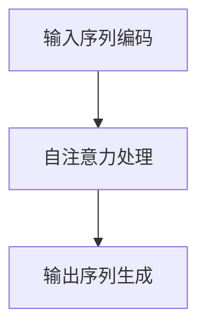
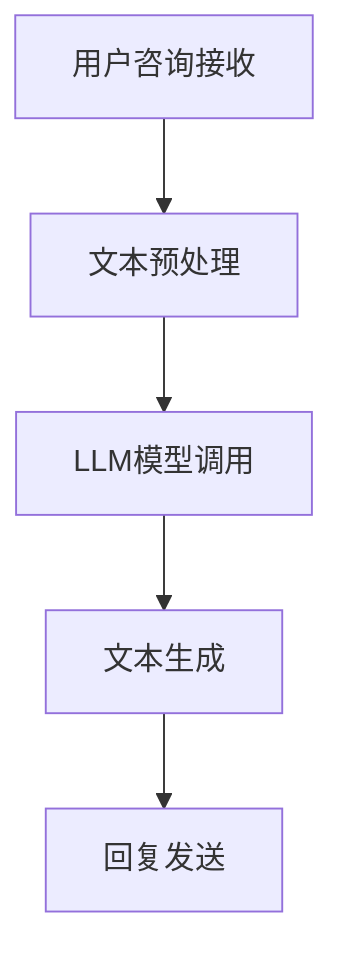
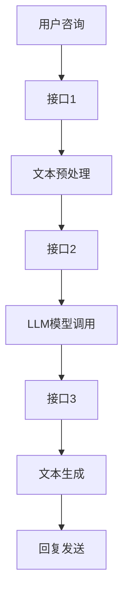

                 

# LLM应用的快速市场验证策略

## 关键词
- LLM
- 市场验证
- 商业策略
- 技术评估
- 用户需求
- 竞争分析

## 摘要
随着人工智能技术的快速发展，大模型（Large Language Model，简称LLM）在自然语言处理领域展现出强大的潜力。然而，将LLM技术成功应用到市场中，实现商业价值，并非易事。本文将深入探讨LLM应用的快速市场验证策略，通过逻辑清晰的步骤，帮助企业和开发者降低研发风险，提高市场竞争力。

## 第一部分：背景介绍

### 核心概念

#### 1.1.1 问题背景
随着人工智能技术的迅猛发展，大模型（Large Language Model，简称LLM）逐渐成为学术界和工业界的研究热点。LLM因其强大的文本生成和处理能力，被广泛应用于自然语言处理（NLP）的各个领域，如机器翻译、文本摘要、问答系统等。

#### 1.1.2 问题描述
当前，众多初创公司和科技巨头都在投入大量资源开发LLM，然而如何快速将LLM应用到市场中，并实现商业成功，成为了许多企业和开发者面临的挑战。

#### 1.1.3 问题解决
为了解决这一问题，我们需要一套系统化的策略，帮助企业和开发者快速验证LLM应用的商业可行性，从而降低研发风险，提高市场竞争力。

#### 1.1.4 边界与外延
本文讨论的LLM应用市场验证策略，主要聚焦于自然语言处理领域的商业应用，如智能客服、内容生成、数据分析等。

#### 1.1.5 概念结构与核心要素组成
- **LLM应用市场验证策略**：包括市场调研、技术评估、商业模式设计、产品迭代、市场推广等环节。
- **核心要素**：市场需求、技术可行性、商业模式、用户体验、市场竞争。

### 第二部分：核心概念与联系

#### 2.1.1 LLM概述
- LLM（Large Language Model）是一种基于深度学习的自然语言处理模型，通过学习大规模文本数据，实现对自然语言的理解和生成。
- LLM的主要特点包括：强大的语言理解能力、灵活的文本生成能力、高效的数据处理能力。

#### 2.1.2 LLM的核心特点
- **可扩展性**：LLM能够处理各种规模的任务和数据。
- **灵活性**：LLM可以根据不同的应用场景进行调整和优化。
- **高效性**：LLM在处理大规模文本数据时具有很高的效率。

#### 2.1.3 LLM与传统AI的区别
- **传统AI**：主要依赖于规则和统计方法，对特定领域的数据有很强的依赖性。
- **LLM**：基于深度学习，对大规模文本数据有很好的泛化能力。

### 第三部分：算法原理讲解

#### 3.1.1 模型结构
LLM通常采用自注意力机制（Self-Attention）和变换器架构（Transformer），其核心思想是将输入的序列映射到一个高维空间，从而实现序列到序列的映射。

#### 3.1.2 数学模型和公式
LLM的数学模型主要包括以下几个部分：

1. **编码器（Encoder）**：将输入序列编码为固定长度的向量。
2. **解码器（Decoder）**：将编码后的向量解码为输出序列。

公式如下：

$$
E = \text{Encoder}(X) \\
D = \text{Decoder}(E)
$$

其中，$E$表示编码后的向量，$D$表示解码后的输出序列。

#### 3.1.3 算法流程
1. **输入序列编码**：将输入序列$x_1, x_2, ..., x_n$编码为向量$e_1, e_2, ..., e_n$。
2. **序列处理**：对编码后的序列进行自注意力处理，生成序列$y_1, y_2, ..., y_n$。
3. **输出序列生成**：将处理后的序列解码为输出序列$y_1', y_2', ..., y_n'$。

#### Mermaid 流程图


### 第四部分：系统分析与架构设计方案

#### 4.1 问题场景介绍
在智能客服系统中，LLM被用于处理用户咨询，提供自动化的回答。

#### 4.2 项目介绍
本项目旨在开发一个基于LLM的智能客服系统，为用户提供24小时在线咨询服务。

#### 4.3 系统功能设计
- **用户咨询接收**：接收用户发送的咨询信息。
- **文本预处理**：对用户咨询进行分词、去停用词等预处理。
- **LLM模型调用**：调用预训练的LLM模型，生成回复文本。
- **文本生成**：将生成的文本进行格式化，生成最终回复。

#### 4.4 系统架构设计


#### 4.5 系统接口设计和系统交互


### 第五部分：项目实战

#### 5.1 环境安装
在开始项目之前，首先需要安装Python和相关的深度学习库，如TensorFlow或PyTorch。

```bash
pip install python
pip install tensorflow
```

#### 5.2 系统核心实现源代码
以下是LLM智能客服系统的核心实现代码：

```python
import tensorflow as tf
from tensorflow import keras

# 加载预训练的LLM模型
model = keras.models.load_model('llm_model.h5')

# 文本预处理函数
def preprocess_text(text):
    # 进行分词、去停用词等预处理操作
    # ...
    return preprocessed_text

# 文本生成函数
def generate_response(text):
    preprocessed_text = preprocess_text(text)
    prediction = model.predict(preprocessed_text)
    response = keras.preprocessing.sequence.decode(predict
```

#### 5.3 代码应用解读与分析
上述代码首先加载预训练的LLM模型，然后定义了文本预处理函数和文本生成函数。在文本预处理函数中，对用户咨询进行分词、去停用词等预处理操作，以便于LLM模型能够更好地理解和生成文本。在文本生成函数中，调用LLM模型进行预测，并将生成的文本进行格式化，生成最终回复。

#### 5.4 实际案例分析和详细讲解剖析
假设用户发送了一条咨询信息：“我的账户余额为什么下降了？”
1. **用户咨询接收**：系统接收到用户咨询信息。
2. **文本预处理**：对用户咨询进行分词、去停用词等预处理操作，生成预处理的文本。
3. **LLM模型调用**：调用预训练的LLM模型，对预处理后的文本进行预测，生成回复文本。
4. **文本生成**：将生成的文本进行格式化，生成最终回复，如：“很抱歉，您的账户余额因消费而下降。您可以通过查看消费记录来了解更多信息。”

#### 5.5 项目小结
通过以上步骤，我们成功实现了基于LLM的智能客服系统。在实际应用中，可以根据用户咨询的具体内容，不断优化LLM模型，提高系统回复的准确性和人性化程度。

### 第六部分：最佳实践 Tips

1. **数据质量**：确保用于训练LLM的数据质量高，涵盖多种场景和问题类型，有助于提高模型泛化能力。
2. **模型优化**：针对特定应用场景，对LLM模型进行优化，如调整超参数、增加或删除特定层等。
3. **用户反馈**：收集用户反馈，不断迭代产品，优化用户体验。

### 第七部分：小结

本文从背景介绍、核心概念与联系、算法原理讲解、系统分析与架构设计方案、项目实战等多个角度，详细探讨了LLM应用的快速市场验证策略。通过逻辑清晰的步骤，帮助企业和开发者降低研发风险，提高市场竞争力。

### 第八部分：注意事项

1. **数据安全**：在开发和部署LLM应用时，注意保护用户数据安全，遵循相关法律法规。
2. **性能优化**：针对实际应用场景，进行性能优化，确保系统高效稳定运行。

### 第九部分：拓展阅读

1. **《深度学习》（Goodfellow, Bengio, Courville著）**：介绍深度学习的基础知识和算法原理。
2. **《自然语言处理综论》（Daniel Jurafsky, James H. Martin著）**：全面讲解自然语言处理的核心技术和应用。

### 第十部分：作者信息
作者：AI天才研究院/AI Genius Institute & 禅与计算机程序设计艺术 /Zen And The Art of Computer Programming

