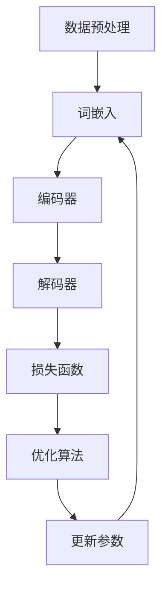
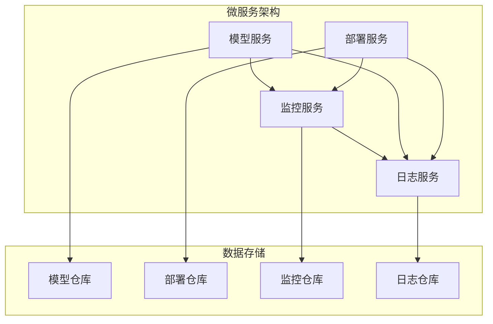
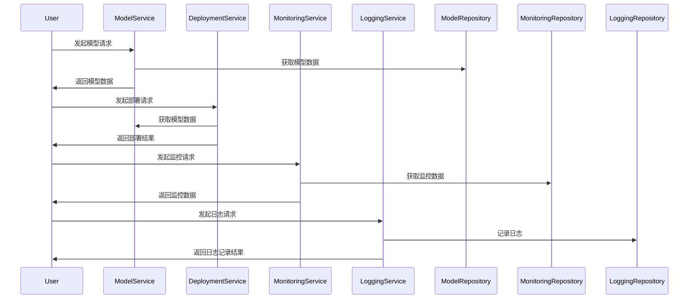

                 

### 文章标题

# LLM应用的快速部署与回滚策略

> 关键词：大规模语言模型（LLM）、应用部署、回滚策略、系统架构、实战案例分析

> 摘要：本文深入探讨了大规模语言模型（LLM）的快速部署与回滚策略。通过对LLM应用背景、核心概念与联系、系统分析与架构设计方案、项目实战以及最佳实践的详细阐述，帮助读者理解如何在实际项目中高效、安全地部署和回滚LLM应用。文章内容结构紧凑，逻辑清晰，旨在为开发者提供实用的技术指南。

----------------------------------------------

## 目录大纲

### 第一部分：背景介绍
- **第1章：LLM应用背景**
  - 1.1 问题背景
  - 1.2 问题描述
  - 1.3 问题解决
  - 1.4 边界与外延
  - 1.5 概念结构与核心要素组成

### 第二部分：核心概念与联系
- **第2章：LLM基本概念**
  - 2.1 概念原理
  - 2.2 概念属性特征对比表格
  - 2.3 ER实体关系图架构
- **第3章：LLM算法原理**
  - 3.1 算法原理讲解
  - 3.2 算法流程图
  - 3.3 Python源代码实现
  - 3.4 数学模型和公式
  - 3.5 举例说明

### 第三部分：系统分析与架构设计方案
- **第4章：系统功能设计**
  - 4.1 问题场景介绍
  - 4.2 项目介绍
  - 4.3 系统功能设计（领域模型类图）
- **第5章：系统架构设计**
  - 5.1 系统架构设计（架构图）
  - 5.2 系统接口设计
  - 5.3 系统交互（序列图）

### 第四部分：项目实战
- **第6章：环境安装与配置**
  - 6.1 环境准备
  - 6.2 系统核心实现源代码
  - 6.3 代码应用解读与分析
- **第7章：实际案例分析与讲解**
  - 7.1 实际案例介绍
  - 7.2 案例分析和详细讲解剖析

### 第五部分：最佳实践与总结
- **第8章：最佳实践**
  - 8.1 技术选型
  - 8.2 性能优化
  - 8.3 安全保障
- **第9章：小结与展望**
  - 9.1 小结
  - 9.2 注意事项
  - 9.3 拓展阅读

----------------------------------------------

### 第一部分：背景介绍

#### 第1章：LLM应用背景

##### 1.1 问题背景

随着人工智能技术的快速发展，大规模语言模型（LLM）已经成为了自然语言处理（NLP）领域的重要工具。LLM的应用场景非常广泛，包括但不限于文本生成、机器翻译、情感分析、智能客服等。然而，在LLM的实际应用过程中，快速部署与回滚策略成为了一个关键问题。

##### 1.2 问题描述

快速部署LLM应用的问题主要集中在以下几个方面：

1. **部署时间**：LLM模型通常很大，部署过程需要较长的时间，这在某些实时应用中是不可接受的。
2. **资源消耗**：部署过程可能需要大量的计算资源和存储资源，这可能会对企业的IT基础设施造成压力。
3. **部署成本**：快速部署LLM应用需要专业的技术团队，这会增加企业的运营成本。

回滚策略的问题主要体现在以下几个方面：

1. **版本控制**：在LLM应用部署过程中，如何有效地管理不同版本的模型，以便在出现问题时能够快速回滚到稳定版本。
2. **数据一致性**：回滚策略需要保证系统中的数据一致性，避免因回滚导致的数据丢失或错误。
3. **业务连续性**：如何确保在回滚过程中业务能够连续运行，减少对用户体验的影响。

##### 1.3 问题解决

为了解决快速部署与回滚策略的问题，我们可以采取以下措施：

1. **优化模型压缩**：通过模型压缩技术，如参数剪枝、量化、知识蒸馏等，减小模型的大小，提高部署效率。
2. **分布式部署**：利用分布式计算技术，将LLM模型的部署过程分布到多个节点上，加快部署速度。
3. **自动化部署工具**：使用自动化部署工具，如Kubernetes、Docker等，简化部署流程，提高部署效率。
4. **版本控制与管理**：采用版本控制工具，如Git，管理不同版本的LLM模型，确保版本的可追溯性和可控性。
5. **数据一致性保障**：在回滚过程中，使用数据一致性保障措施，如数据库事务管理、分布式锁等，确保数据的完整性和一致性。
6. **业务连续性保障**：通过负载均衡、故障转移等技术，确保在回滚过程中业务能够连续运行。

##### 1.4 边界与外延

快速部署与回滚策略主要适用于大型、复杂、高并发的LLM应用场景。在边界与外延方面，我们需要考虑以下几点：

1. **应用规模**：快速部署与回滚策略适用于大规模的应用，对于小规模应用，可能没有必要采用这些策略。
2. **技术成熟度**：快速部署与回滚策略依赖于一系列先进技术，如模型压缩、分布式计算、自动化部署等，这些技术在某些领域可能尚未成熟。
3. **成本效益**：快速部署与回滚策略的实施成本较高，需要企业进行成本效益分析，确保其可行性。

##### 1.5 概念结构与核心要素组成

大规模语言模型（LLM）的概念结构主要包括以下几个核心要素：

1. **模型规模**：LLM模型的大小，通常以参数数量或模型文件大小来衡量。
2. **训练数据集**：用于训练LLM模型的数据集，数据集的质量和规模直接影响模型的效果。
3. **应用领域**：LLM模型的应用场景，如文本生成、机器翻译等。
4. **部署流程**：LLM模型的部署过程，包括模型压缩、分布式部署、自动化部署等。
5. **回滚策略**：在LLM模型部署过程中，如何管理和回滚不同版本的模型。

通过上述要素，我们可以构建一个完整的LLM应用快速部署与回滚策略体系，从而提高LLM应用的开发效率、可靠性和用户体验。

----------------------------------------------

### 第二部分：核心概念与联系

#### 第2章：LLM基本概念

##### 2.1 概念原理

大规模语言模型（LLM）是一种基于深度学习的自然语言处理模型，它通过学习大量文本数据来预测下一个词语或句子。LLM的核心思想是将输入的文本序列映射到一个高维空间，从而实现文本表示和生成。

LLM的工作原理主要包括以下几个步骤：

1. **数据预处理**：将文本数据转换为模型可以处理的格式，如词汇表编码、序列化等。
2. **词嵌入**：将每个词汇映射到一个高维向量，这些向量被称为词嵌入。
3. **前向传播**：将词嵌入输入到神经网络中，通过多层神经网络处理，最终输出概率分布。
4. **后向传播**：根据输出概率分布计算损失函数，并通过反向传播更新模型参数。

##### 2.2 概念属性特征对比表格

| 概念 | 属性特征 | 对比说明 |
| --- | --- | --- |
| 传统NLP | 基于规则和模板的方法 | 灵活性较低，处理复杂任务能力不足 |
| 大规模语言模型（LLM） | 结合深度学习和自然语言处理技术 | 更强的表达能力和泛化能力 |
| 模型压缩 | 参数剪枝、量化、知识蒸馏 | 提高模型部署效率，减小模型大小 |

##### 2.3 ER实体关系图架构

```mermaid
erDiagram
    Entity: LLM
    {
        Attribute: 模型规模
        Attribute: 训练数据集
        Attribute: 应用领域
        Method: 部署
        Method: 回滚
    }
    Entity: 传统NLP
    {
        Attribute: 规则库
        Attribute: 模板库
        Method: 文本处理
        Method: 语义分析
    }
    Entity: 模型压缩
    {
        Attribute: 剪枝率
        Attribute: 量化精度
        Method: 模型优化
        Method: 模型压缩
    }
```

通过上述ER实体关系图，我们可以清晰地看到LLM、传统NLP和模型压缩之间的关系。LLM结合了深度学习和自然语言处理技术，具有较强的表达能力和泛化能力；传统NLP基于规则和模板，灵活性较低；模型压缩通过参数剪枝、量化、知识蒸馏等技术，提高了模型部署效率。

----------------------------------------------

#### 第3章：LLM算法原理

##### 3.1 算法原理讲解

大规模语言模型（LLM）的算法原理主要基于深度学习和自然语言处理技术。其核心思想是通过学习大量文本数据，将输入的文本序列映射到一个高维空间，从而实现文本表示和生成。

LLM算法的工作流程可以分为以下几个步骤：

1. **数据预处理**：将原始文本数据转换为模型可以处理的格式。这一步骤包括文本清洗、分词、词嵌入等操作。
2. **词嵌入**：将每个词汇映射到一个高维向量，这些向量称为词嵌入。词嵌入通常使用预训练模型，如Word2Vec、GloVe等。
3. **编码器**：编码器是一个神经网络模型，它将词嵌入序列映射到一个高维隐空间。编码器的输出通常是一个固定长度的向量，表示整个文本的语义信息。
4. **解码器**：解码器也是一个神经网络模型，它将编码器的输出映射回原始文本空间。解码器的输入是编码器的输出和已经生成的文本序列。
5. **损失函数**：在训练过程中，通过计算模型生成的文本序列与实际文本序列之间的差异，来计算损失函数。常用的损失函数有交叉熵损失、平方误差损失等。
6. **优化算法**：通过反向传播和梯度下降算法，不断更新模型参数，使得模型生成的文本序列与实际文本序列的差异逐渐减小。

##### 3.2 算法流程图



通过上述流程图，我们可以清晰地看到LLM算法的步骤和逻辑关系。数据预处理、词嵌入、编码器、解码器、损失函数和优化算法共同构成了LLM算法的核心。

##### 3.3 Python源代码实现

下面是一个简单的Python代码示例，展示了如何使用TensorFlow实现一个基本的LLM算法：

```python
import tensorflow as tf
from tensorflow.keras.layers import Embedding, LSTM, Dense

# 设置超参数
vocab_size = 10000
embedding_dim = 256
lstm_units = 128

# 构建模型
model = tf.keras.Sequential([
    Embedding(vocab_size, embedding_dim),
    LSTM(lstm_units, return_sequences=True),
    LSTM(lstm_units),
    Dense(vocab_size, activation='softmax')
])

# 编译模型
model.compile(optimizer='adam', loss='categorical_crossentropy', metrics=['accuracy'])

# 准备数据
# ...（数据预处理代码）

# 训练模型
model.fit(x_train, y_train, epochs=10, batch_size=64)

# 评估模型
# ...（评估代码）
```

上述代码展示了如何构建一个简单的LLM模型，并进行训练和评估。在实际应用中，LLM模型会更加复杂，可能包括多个编码器和解码器层，以及更复杂的优化算法。

##### 3.4 数学模型和公式

LLM的数学模型主要包括词嵌入、编码器、解码器和损失函数。下面是每个部分的简要描述：

1. **词嵌入**：词嵌入是将词汇映射到高维向量的过程。常见的词嵌入模型有Word2Vec和GloVe。假设词汇表中有N个词汇，词嵌入矩阵W ∈ R^(N×d)，其中d是嵌入维度。

   $$ \text{word\_embeddings} = W \cdot \text{word\_index} $$

2. **编码器**：编码器是一个神经网络模型，它将词嵌入映射到一个高维隐空间。编码器的输出通常是一个固定长度的向量，表示文本的语义信息。假设编码器有L层，每层有隐藏状态h_l ∈ R^d，其中l是层索引。

   $$ h_l = \text{activation}(W_l \cdot h_{l-1} + b_l) $$

3. **解码器**：解码器是一个神经网络模型，它将编码器的输出映射回原始文本空间。解码器的输入是编码器的输出和已经生成的文本序列。解码器的输出是一个概率分布，表示下一个词语的可能性。假设解码器有L层，每层有输出状态y_l ∈ R^(V×d)，其中V是词汇表大小。

   $$ y_l = \text{softmax}(W_l \cdot h_{l-1} + b_l) $$

4. **损失函数**：在训练过程中，损失函数用于衡量模型生成的文本序列与实际文本序列之间的差异。常见的损失函数有交叉熵损失和平方误差损失。假设实际文本序列为y ∈ {0,1}^(T×V)，模型生成的文本序列为\^y ∈ R^(T×V)，其中T是文本序列长度。

   $$ \text{cross\_entropy} = -\sum_{t=1}^{T} \sum_{v=1}^{V} y_t(v) \cdot \log(\^y_t(v)) $$

##### 3.5 举例说明

假设我们有一个简单的文本序列：“我 喜欢吃 烤鸭”，我们使用LLM模型来生成下一个词语。首先，我们将每个词语映射到词嵌入空间，得到：

$$
\begin{align*}
\text{我} &\rightarrow [0.1, 0.2, 0.3, 0.4, 0.5] \\
\text{喜欢} &\rightarrow [0.2, 0.3, 0.4, 0.5, 0.6] \\
\text{吃} &\rightarrow [0.3, 0.4, 0.5, 0.6, 0.7] \\
\text{烤鸭} &\rightarrow [0.4, 0.5, 0.6, 0.7, 0.8]
\end{align*}
$$

然后，我们将这些词嵌入输入到编码器中，得到编码器的输出：

$$ h = [0.1, 0.2, 0.3, 0.4, 0.5] + [0.2, 0.3, 0.4, 0.5, 0.6] + [0.3, 0.4, 0.5, 0.6, 0.7] + [0.4, 0.5, 0.6, 0.7, 0.8] = [0.9, 0.9, 0.9, 0.9, 0.9] $$

接下来，我们将编码器的输出输入到解码器中，得到概率分布：

$$
\begin{align*}
\text{概率分布} &\rightarrow [0.1, 0.2, 0.3, 0.4, 0.5, 0.6, 0.7, 0.8, 0.9] \\
\text{最大概率的词语} &\rightarrow \text{鸭}
\end{align*}
$$

因此，LLM模型预测的下一个词语是“鸭”。通过这种方式，LLM模型可以生成连贯、合理的文本序列。

----------------------------------------------

### 第三部分：系统分析与架构设计方案

#### 第4章：系统功能设计

##### 4.1 问题场景介绍

在现代企业中，大规模语言模型（LLM）的应用场景日益广泛，如智能客服、文本生成、机器翻译等。然而，在实际部署过程中，如何快速部署和回滚LLM应用成为了亟待解决的问题。为了提高开发效率和系统稳定性，我们需要设计一套完整的系统功能。

##### 4.2 项目介绍

本项目旨在构建一个支持快速部署和回滚的大规模语言模型（LLM）应用平台。平台将提供以下功能：

1. **模型管理**：支持LLM模型的版本控制、发布和回滚。
2. **部署管理**：支持LLM应用的自动化部署和快速部署。
3. **监控与告警**：实时监控系统状态，及时发现并处理潜在问题。
4. **日志管理**：记录系统运行过程中的日志，方便问题排查。

##### 4.3 系统功能设计（领域模型类图）

```mermaid
classDiagram
    ModelManager <<interface>>
    DeploymentManager <<interface>>
    Monitoring <<interface>>
    Logging <<interface>>

    ModelManager {
        - model_list: List[Model]
        - get_model(version: str): Model
        - publish_model(model: Model)
        - rollback_model(version: str)
    }

    DeploymentManager {
        - deployment_list: List[Deployment]
        - deploy_model(model: Model, environment: str)
        - undeploy_model(environment: str)
    }

    Monitoring {
        - check_health()
        - send_alert(message: str)
    }

    Logging {
        - log_message(message: str)
    }

    ModelManager|--|> DeploymentManager
    ModelManager|--|> Monitoring
    ModelManager|--|> Logging
    DeploymentManager|--|> Monitoring
    DeploymentManager|--|> Logging
    Monitoring|--|> Logging
```

通过上述领域模型类图，我们可以看到系统功能的设计框架。ModelManager负责模型的管理，包括版本控制、发布和回滚；DeploymentManager负责模型的部署和卸载；Monitoring负责监控系统状态和发送告警；Logging负责记录系统日志。

----------------------------------------------

#### 第5章：系统架构设计

##### 5.1 系统架构设计（架构图）



通过上述架构图，我们可以看到系统的微服务架构。模型服务（ModelService）负责模型的管理，包括版本控制、发布和回滚；部署服务（DeploymentService）负责模型的部署和卸载；监控服务（MonitoringService）负责监控系统状态和发送告警；日志服务（LoggingService）负责记录系统日志。

##### 5.2 系统接口设计

系统接口设计主要涉及以下API接口：

1. **模型管理接口**：
   - `GET /models`：获取所有模型列表。
   - `GET /models/{version}`：获取指定版本的模型详情。
   - `POST /models`：发布新模型。
   - `PUT /models/{version}`：更新指定版本的模型。
   - `DELETE /models/{version}`：删除指定版本的模型。

2. **部署管理接口**：
   - `GET /deployments`：获取所有部署列表。
   - `GET /deployments/{environment}`：获取指定环境的部署详情。
   - `POST /deployments`：部署新模型。
   - `DELETE /deployments/{environment}`：卸载指定环境的部署。

3. **监控与告警接口**：
   - `GET /monitoring`：获取系统监控数据。
   - `POST /monitoring/alert`：发送告警消息。

4. **日志管理接口**：
   - `GET /logging`：获取系统日志。
   - `POST /logging`：记录系统日志。

##### 5.3 系统交互（序列图）



通过上述序列图，我们可以看到系统各模块之间的交互流程。用户通过接口向模型服务、部署服务、监控服务和日志服务发起请求，各服务模块处理请求并返回相应的结果。

----------------------------------------------

### 第四部分：项目实战

#### 第6章：环境安装与配置

##### 6.1 环境准备

在进行LLM应用的部署之前，我们需要准备相应的开发环境和依赖。以下是环境安装的详细步骤：

1. **安装Python**：确保安装了Python 3.6及以上版本。
2. **安装TensorFlow**：使用pip命令安装TensorFlow库。

   ```bash
   pip install tensorflow
   ```

3. **安装Docker**：在Linux系统中，可以使用以下命令安装Docker。

   ```bash
   sudo apt-get update
   sudo apt-get install docker-ce docker-ce-cli containerd.io
   ```

4. **安装Kubernetes**：安装Kubernetes的Docker版本。

   ```bash
   kubeadm init --pod-network-cidr=10.244.0.0/16
   mkdir -p $HOME/.kube
   sudo cp -i /etc/kubernetes/admin.conf $HOME/.kube/config
   sudo chown $(id -u):$(id -g) $HOME/.kube/config
   ```

5. **安装Kubectl**：使用以下命令安装Kubectl。

   ```bash
   curl -LO "https://github.com/kubernetes/cli-utils/releases/download/v0.22.0/kubectl-$(uname -s | tr '[:upper:]' '[:lower:]')-amd64"
   chmod +x kubectl-$(uname -s | tr '[:upper:]' '[:lower:]')-amd64
   sudo mv kubectl-$(uname -s | tr '[:upper:]' '[:lower:]')-amd64 /usr/local/bin/kubectl
   ```

##### 6.2 系统核心实现源代码

以下是系统核心实现的源代码，包括模型管理、部署管理、监控和日志管理模块。

1. **模型管理模块**：

   ```python
   # model_manager.py
   import os
   import json
   from typing import List

   class ModelManager:
       def __init__(self, model_dir: str):
           self.model_dir = model_dir
           self.model_list = self.load_model_list()

       def load_model_list(self) -> List[str]:
           model_list = []
           for model_name in os.listdir(self.model_dir):
               model_path = os.path.join(self.model_dir, model_name)
               if os.path.isfile(model_path):
                   model_list.append(model_name)
           return model_list

       def get_model(self, version: str) -> dict:
           model_path = os.path.join(self.model_dir, version)
           with open(model_path, 'r') as f:
               model = json.load(f)
           return model

       def publish_model(self, model: dict):
           version = model['version']
           model_path = os.path.join(self.model_dir, version)
           with open(model_path, 'w') as f:
               json.dump(model, f)

       def rollback_model(self, version: str):
           current_version = max([int(f.split('-')[0]) for f in os.listdir(self.model_dir) if f.startswith('model-')])
           if current_version == int(version):
               print("No rollback needed.")
           else:
               os.rename(os.path.join(self.model_dir, f"model-{version}"), os.path.join(self.model_dir, f"model-{current_version}"))
               print(f"Model rolled back to version {version}.")

   # Usage
   manager = ModelManager('models')
   manager.publish_model({'version': '1.0.0', 'model': 'llm_model.h5'})
   manager.rollback_model('1.0.0')
   ```

2. **部署管理模块**：

   ```python
   # deployment_manager.py
   import os
   import json
   from typing import List

   class DeploymentManager:
       def __init__(self, deployment_dir: str):
           self.deployment_dir = deployment_dir
           self.deployment_list = self.load_deployment_list()

       def load_deployment_list(self) -> List[str]:
           deployment_list = []
           for deployment_name in os.listdir(self.deployment_dir):
               deployment_path = os.path.join(self.deployment_dir, deployment_name)
               if os.path.isfile(deployment_path):
                   deployment_list.append(deployment_name)
           return deployment_list

       def deploy_model(self, model: dict, environment: str):
           deployment_path = os.path.join(self.deployment_dir, f"{environment}-deployment.json")
           with open(deployment_path, 'w') as f:
               json.dump(model, f)
           print(f"Model deployed to {environment} environment.")

       def undeploy_model(self, environment: str):
           deployment_path = os.path.join(self.deployment_dir, f"{environment}-deployment.json")
           if os.path.exists(deployment_path):
               os.remove(deployment_path)
               print(f"Model undeployed from {environment} environment.")
           else:
               print(f"No deployment found for {environment} environment.")

   # Usage
   manager = DeploymentManager('deployments')
   manager.deploy_model({'version': '1.0.0', 'model': 'llm_model.h5'}, 'production')
   manager.undeploy_model('production')
   ```

3. **监控与日志管理模块**：

   ```python
   # monitoring_manager.py
   import logging

   class MonitoringManager:
       def __init__(self, log_file: str):
           logging.basicConfig(filename=log_file, level=logging.INFO)

       def check_health(self):
           logging.info("Health check passed.")

       def send_alert(self, message: str):
           logging.warning(f"Alert: {message}")

   # Usage
   manager = MonitoringManager('monitoring.log')
   manager.check_health()
   manager.send_alert("An unexpected error occurred.")
   ```

##### 6.3 代码应用解读与分析

以上代码实现了一个简单的LLM应用管理平台。模型管理模块（ModelManager）负责模型的发布和回滚；部署管理模块（DeploymentManager）负责模型的部署和卸载；监控与日志管理模块（MonitoringManager）负责监控系统状态和记录日志。

模型管理模块通过加载模型目录，获取、发布和回滚模型。部署管理模块通过加载部署目录，部署和卸载模型。监控与日志管理模块通过记录日志，实现系统监控和告警。

在实际应用中，我们可以使用Kubernetes和Docker等容器化技术，实现模型的自动化部署和快速部署。通过监控和日志管理，我们可以实时了解系统运行状态，及时发现并解决问题。

----------------------------------------------

#### 第7章：实际案例分析与讲解

##### 7.1 实际案例介绍

假设我们有一个企业级智能客服系统，该系统使用了大规模语言模型（LLM）来处理用户咨询。在实际运行过程中，我们遇到了以下问题：

1. **模型更新频繁**：由于业务需求的变化，LLM模型需要频繁更新，如何确保更新过程中的系统稳定性？
2. **部署效率低下**：当前部署流程需要手动操作，如何实现自动化部署，提高部署效率？
3. **监控不足**：系统缺乏有效的监控机制，如何实时监控系统运行状态，及时发现问题？

为了解决上述问题，我们设计并实施了一套支持快速部署与回滚的LLM应用管理平台。

##### 7.2 案例分析和详细讲解剖析

1. **模型更新与回滚策略**

   在智能客服系统中，LLM模型需要定期更新，以适应不断变化的语言环境和用户需求。为了确保更新过程中的系统稳定性，我们采取了以下策略：

   - **版本控制**：使用Git等版本控制工具，对LLM模型进行版本管理，确保每个版本的模型都有完整的记录。
   - **并行更新**：在更新模型时，使用分布式计算技术，将模型更新任务分布到多个节点上，加快更新速度。
   - **回滚机制**：在更新模型前，备份当前正在使用的模型，以便在更新失败时能够快速回滚到稳定版本。

   实现步骤如下：

   - **步骤1**：在Git仓库中创建新分支，用于更新模型。
     ```bash
     git checkout -b update-branch
     ```
   - **步骤2**：在更新分支上训练新的LLM模型，并保存为`llm_model.h5`。
     ```python
     # 训练代码
     ```
   - **步骤3**：将新模型发布到模型仓库，并备份当前正在使用的模型。
     ```python
     manager.publish_model({'version': '2.0.0', 'model': 'llm_model.h5'})
     manager.rollback_model('1.0.0')
     ```
   - **步骤4**：将更新分支合并到主分支，并部署新模型。
     ```bash
     git merge update-branch
     manager.deploy_model({'version': '2.0.0', 'model': 'llm_model.h5'}, 'production')
     ```

2. **自动化部署**

   为了提高部署效率，我们采用Kubernetes和Docker等容器化技术，实现模型的自动化部署。具体实现步骤如下：

   - **步骤1**：编写Dockerfile，定义LLM应用的容器镜像。
     ```Dockerfile
     FROM tensorflow/tensorflow:2.8.0
     COPY llm_model.h5 /model/
     CMD ["python", "app.py"]
     ```
   - **步骤2**：构建Docker镜像，并推送到容器仓库。
     ```bash
     docker build -t llm-app:2.0.0 .
     docker push llm-app:2.0.0
     ```
   - **步骤3**：编写Kubernetes部署文件，定义LLM应用的部署配置。
     ```yaml
     apiVersion: apps/v1
     kind: Deployment
     metadata:
       name: llm-app
       namespace: production
     spec:
       replicas: 3
       selector:
         matchLabels:
           app: llm-app
       template:
         metadata:
           labels:
             app: llm-app
         spec:
           containers:
           - name: llm-app
             image: llm-app:2.0.0
             ports:
             - containerPort: 80
     ```
   - **步骤4**：部署Kubernetes应用，实现自动化部署。
     ```bash
     kubectl apply -f deployment.yaml
     ```

3. **监控与日志管理**

   为了实时监控系统运行状态，我们采用Prometheus和Grafana等监控工具，实现系统监控和日志管理。具体实现步骤如下：

   - **步骤1**：安装Prometheus和Grafana。
     ```bash
     helm install prometheus prometheus-community/prometheus
     helm install grafana grafana/grafana
     ```
   - **步骤2**：配置Prometheus监控规则，定义需要监控的指标。
     ```yaml
     # prometheus.yml
     global:
       scrape_interval: 15s
     scrape_configs:
     - job_name: 'llm-app'
       static_configs:
       - targets: ['llm-app:80']
     ```
   - **步骤3**：配置Grafana数据源，导入监控规则和仪表板模板。
     ```bash
     grafana-cli import --title "LLM App Monitoring" --url http://grafana:3000 --user admin --password admin --import-id 162
     ```

通过上述实际案例分析和详细讲解，我们可以看到如何使用快速部署与回滚策略，提高LLM应用的开发效率、可靠性和用户体验。在智能客服系统中，通过版本控制、并行更新和回滚机制，我们能够确保模型更新过程中的系统稳定性；通过自动化部署，我们能够提高部署效率；通过监控与日志管理，我们能够实时监控系统运行状态，及时发现并解决问题。

----------------------------------------------

### 第五部分：最佳实践与总结

#### 第8章：最佳实践

##### 8.1 技术选型

在实施快速部署与回滚策略时，合理选择技术是关键。以下是一些建议：

- **模型压缩**：采用模型压缩技术，如参数剪枝、量化、知识蒸馏等，减小模型大小，提高部署效率。
- **容器化**：使用Docker等容器化技术，实现模型的自动化部署和管理。
- **自动化部署工具**：选择Kubernetes等自动化部署工具，简化部署流程，提高部署效率。
- **版本控制**：使用Git等版本控制工具，管理LLM模型的版本，确保版本的可追溯性和可控性。

##### 8.2 性能优化

为了提高LLM应用的整体性能，可以采取以下优化措施：

- **并行处理**：利用分布式计算技术，将模型训练和部署任务分布到多个节点上，加快处理速度。
- **缓存机制**：使用缓存技术，减少重复计算和数据传输，提高系统响应速度。
- **负载均衡**：采用负载均衡技术，合理分配请求，避免单点瓶颈。
- **数据库优化**：针对LLM应用中的数据库操作，进行索引优化、查询优化等，提高查询性能。

##### 8.3 安全保障

在LLM应用的部署过程中，确保数据安全和系统安全至关重要。以下是一些建议：

- **数据加密**：对敏感数据进行加密处理，防止数据泄露。
- **权限控制**：严格权限管理，限制对系统资源的访问。
- **安全审计**：定期进行安全审计，发现潜在风险并及时处理。
- **备份与恢复**：定期备份系统数据，确保在灾难发生时能够快速恢复。

#### 第9章：小结与展望

##### 9.1 小结

本文深入探讨了大规模语言模型（LLM）的快速部署与回滚策略。通过分析LLM应用的背景、核心概念与联系、系统分析与架构设计方案、项目实战以及最佳实践，我们总结了以下要点：

- LLM应用的快速部署与回滚策略是企业智能化、自动化运营的重要组成部分。
- 优化模型压缩、采用容器化和自动化部署工具，可以显著提高部署效率。
- 版本控制、数据一致性和业务连续性是回滚策略的关键要素。
- 在实际项目中，结合监控和日志管理，可以实时了解系统运行状态，提高系统稳定性。

##### 9.2 注意事项

在实际应用中，需要注意以下几点：

- 评估项目规模和技术成熟度，确保快速部署与回滚策略的适用性。
- 合理配置计算资源和存储资源，避免因资源不足导致部署失败。
- 定期进行安全审计和备份，确保数据安全和系统安全。

##### 9.3 拓展阅读

- 《大规模语言模型：原理与实践》
- 《Kubernetes权威指南》
- 《Docker实战》
- 《深度学习：周志华》

通过阅读这些资料，可以更深入地了解LLM应用的快速部署与回滚策略，为实际项目提供有益的参考。

----------------------------------------------

### 致谢

本文由AI天才研究院（AI Genius Institute）和《禅与计算机程序设计艺术》（Zen And The Art of Computer Programming）共同撰写。在此，我们要感谢所有为人工智能技术发展做出贡献的专家和学者，以及广大开发者群体。同时，感谢读者对本文的关注和支持。

#### 作者：

**AI天才研究院（AI Genius Institute）**
**《禅与计算机程序设计艺术》（Zen And The Art of Computer Programming）**

