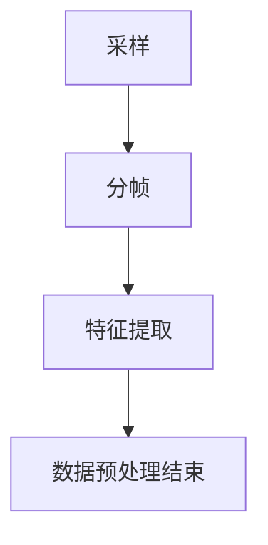
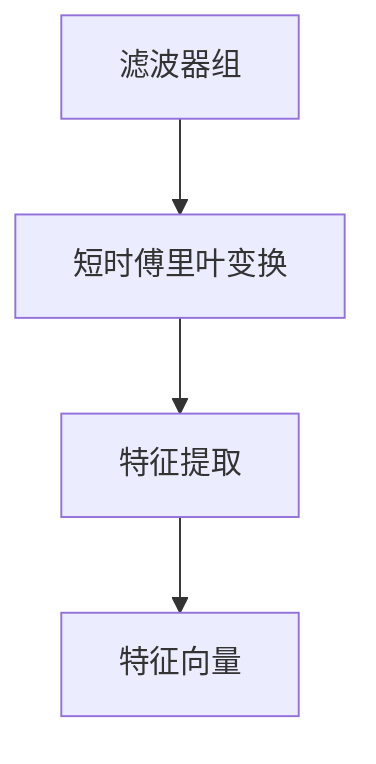
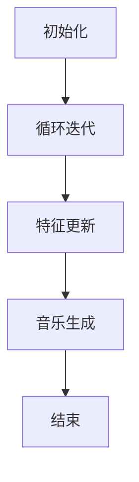
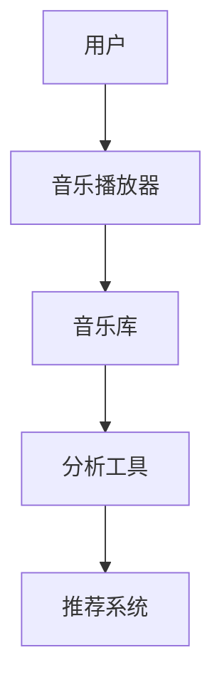
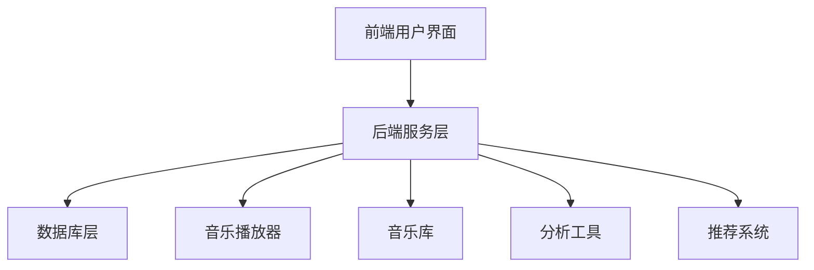
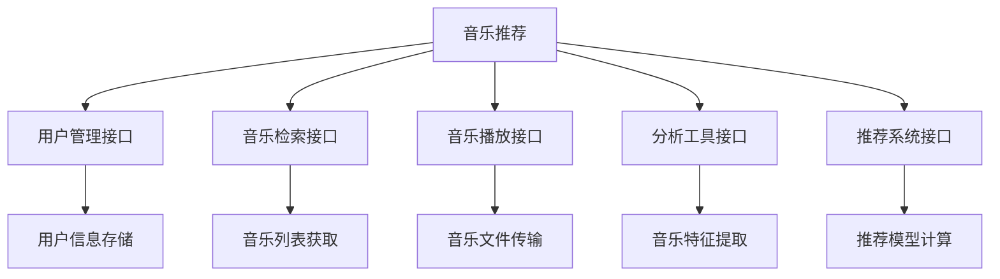

                 

### 《Minimalism音乐：在简约中寻找内心的平静》

> **关键词**：Minimalism音乐，简约主义，音乐疗法，算法原理，系统架构，项目实战

> **摘要**：本文将深入探讨Minimalism音乐，一种通过简约元素来传达深层情感和宁静体验的音乐流派。文章将从背景介绍、核心概念与联系、算法原理讲解、数学模型和公式、系统分析与架构设计、项目实战，以及最佳实践等多个角度，全面解析Minimalism音乐的原理和实践，帮助读者在快节奏的生活中找到内心的平静。

#### 第1章 引言

##### 1.1 书籍背景

Minimalism音乐，起源于20世纪末的西方音乐界，是一种追求简约和极简主义风格的音乐流派。它的核心特点是利用简单的旋律、和弦和节奏，通过重复和简洁的编曲手法，创造出宁静、平和的听觉体验。Minimalism音乐不仅仅是音乐风格的一种，它更是一种生活哲学，鼓励人们从繁杂的事物中抽离，寻找内心的平静。

Minimalism音乐的概念起源于音乐家菲利普·格拉斯（Philip Glass）和史蒂夫·赖克（Steve Reich），他们的作品在80年代引起了广泛关注。Minimalism音乐的特点包括简单的旋律、重复的节奏、缓慢的速度以及柔和的音色。这些特点使得Minimalism音乐成为一种独特的艺术形式，它能够引导听众进入一种冥想和放松的状态。

Minimalism音乐在现代生活中的意义尤为重要。在快节奏、高压的现代生活中，人们常常感到焦虑和疲惫。Minimalism音乐通过其简约的风格，可以帮助人们缓解压力，寻找内心的平静。研究表明，听Minimalism音乐可以降低心率、减少焦虑感，提高情绪稳定度。

##### 1.1.1 Minimalism音乐的概念

Minimalism音乐，即极简主义音乐，强调简单、重复和持续性。这种音乐风格通常以简单的旋律为基础，通过重复的节奏和和弦来创造一种持续的听觉体验。Minimalism音乐不仅仅是音乐技术上的追求，更是一种艺术哲学，它鼓励创作者和听众在简约中寻找深度和意义。

##### 1.1.2 Minimalism音乐的发展历程

Minimalism音乐起源于20世纪60年代的西方音乐界，当时许多作曲家开始探索新的音乐语言，追求音乐的简约性和抽象性。菲利普·格拉斯和史蒂夫·赖克是这一流派的代表人物，他们的作品对后来的音乐家产生了深远的影响。随着时间的发展，Minimalism音乐逐渐扩展到流行音乐领域，成为现代音乐中不可或缺的一部分。

##### 1.1.3 Minimalism音乐在现代生活中的意义

Minimalism音乐在现代生活中的意义不可忽视。它不仅提供了一种逃避现代生活压力的方式，更是一种生活方式的倡导。Minimalism音乐鼓励人们简化生活，关注内心的需求和感受。通过聆听Minimalism音乐，人们可以暂时抛开外界的喧嚣，沉浸在宁静和简洁的音乐世界中，从而获得内心的平静和满足。

#### 第2章 Minimalism音乐核心概念与联系

##### 2.1 核心概念

Minimalism音乐的核心概念包括简约主义和音乐疗法。简约主义是Minimalism音乐的风格基础，它强调简单、重复和持续性。音乐疗法则是Minimalism音乐应用的重要领域，通过音乐来缓解压力、改善情绪。

##### 2.1.1 简约主义

简约主义是Minimalism音乐的基础，它追求简单、直接和直观的表达方式。在Minimalism音乐中，旋律、和弦和节奏都尽量简单，但又不失深度和内涵。简约主义鼓励创作者和听众在简单中寻找美和意义，避免复杂的装饰和多余的元素。

##### 2.1.2 音乐疗法

音乐疗法是Minimalism音乐应用的一个重要领域。研究表明，音乐对人的情绪和生理状态有显著的调节作用。Minimalism音乐通过其简单、重复和持续的旋律，可以降低心率、减少焦虑感，提高情绪稳定度。音乐疗法被广泛应用于心理治疗、康复护理和缓解压力等方面。

##### 2.1.3 Minimalism音乐的元素和特点

Minimalism音乐的元素和特点主要包括简单的旋律、重复的节奏、缓慢的速度以及柔和的音色。这些元素共同构成了Minimalism音乐的独特风格，使其成为一种独特的艺术形式。

| 元素         | 特点                         |
| ------------ | ---------------------------- |
| 旋律         | 简单，通常只有几个音符组成   |
| 和弦         | 简单，通常只有几个和弦组成   |
| 节奏         | 重复，缓慢的速度             |
| 音色         | 柔和，通常使用电子乐器或人声 |

##### 2.2 概念联系

Minimalism音乐中的简约主义和音乐疗法虽然看似独立，但实际上存在着紧密的联系。简约主义为音乐疗法提供了基础，通过简单的旋律和重复的节奏，使得音乐更易于接受和享受，从而提高音乐疗法的有效性。而音乐疗法则将Minimalism音乐的应用扩展到心理和生理健康领域，使其成为一种更广泛的艺术形式。

##### 2.2.1 简约主义与音乐疗法的关系

简约主义与音乐疗法的关系主要体现在两个方面。首先，简约主义为音乐疗法提供了理论基础，通过简单、直接的表达方式，使得音乐更容易被接受和享受，从而提高治疗效果。其次，简约主义也为音乐疗法的实施提供了实践依据，通过简单的旋律和节奏，可以更好地达到放松和减压的目的。

##### 2.2.2 Minimalism音乐与其他音乐流派的关系

Minimalism音乐与其他音乐流派的关系复杂而多样。一方面，Minimalism音乐受到了其他音乐流派的影响，如爵士乐、古典音乐和电子音乐等。另一方面，Minimalism音乐也对其他音乐流派产生了影响，尤其是在流行音乐领域。许多流行音乐家都在他们的作品中融入了Minimalism音乐的元素，创造出独特的音乐风格。

#### 第3章 Minimalism音乐算法原理讲解

##### 3.1 算法概述

Minimalism音乐的算法原理主要涉及数据预处理、特征提取和算法流程。数据预处理包括音高、时长、强度等音频特征的计算；特征提取则通过简单的滤波器和变换来提取音频的显著特征；算法流程则通过循环和递归来实现音乐的分析和生成。

##### 3.1.1 数据预处理

数据预处理是Minimalism音乐算法的基础。在数据预处理阶段，我们需要对音频信号进行采样、分帧和特征提取。采样是将连续的音频信号转换为离散的数字信号；分帧是将音频信号划分为短时段；特征提取则通过计算音高、时长、强度等特征来描述音频信号。



```python
# Python代码示例：音频采样
import numpy as np
import soundfile as sf

# 读取音频文件
data, fs = sf.read('audio_file.wav')

# 采样率转换
new_fs = 44100
new_data = np.interp(np.arange(0, len(data), new_fs / fs), np.arange(len(data)) * fs, data)

# 分帧
frame_size = 1024
hop_size = 512
frames = np.lib.stride_tricks.as_strided(new_data, shape=(new_data.size // hop_size, frame_size), strides=(new_data.itemsize * hop_size, new_data.itemsize * frame_size))
```

##### 3.1.2 特征提取

特征提取是Minimalism音乐算法的核心。通过简单的滤波器和变换，我们可以提取出音频信号的显著特征，如音高、时长、强度等。



```python
# Python代码示例：短时傅里叶变换和特征提取
import numpy as np
import scipy.signal as signal

# 短时傅里叶变换
def stft(frames, fs, nfft=1024, hop_length=512):
    ps = np.abs(np.fft.fft(frames, nfft))[:nfft // 2]
    freqs = np.fft.fftfreq(nfft, 1/fs)
    times = np.arange(0, frames.shape[0] * hop_length, hop_length)
    return freqs, times, ps

# 音高特征提取
def pitch_detection(freqs, times, ps):
    # 这里是音高检测的伪代码
    pitches = []
    for i in range(freqs.shape[0]):
        # 音高计算
        pitch = ...
        pitches.append(pitch)
    return pitches

# 强度特征提取
def intensity_detection(frames):
    # 这里是强度检测的伪代码
    intensity = ...
    return intensity

# 调用函数
frames = ...  # 分帧后的音频信号
freqs, times, ps = stft(frames, fs)
pitches = pitch_detection(freqs, times, ps)
intensity = intensity_detection(frames)
```

##### 3.1.3 算法流程

Minimalism音乐的算法流程通过循环和递归来实现音乐的分析和生成。算法流程包括初始化、循环迭代、特征更新和音乐生成。



```python
# Python代码示例：算法流程
def minimalism_music_generation(frames, fs, nfft=1024, hop_length=512, iterations=10):
    # 初始化
    freqs, times, ps = stft(frames, fs, nfft, hop_length)
    pitches = pitch_detection(freqs, times, ps)
    intensity = intensity_detection(frames)
    
    # 循环迭代
    for i in range(iterations):
        # 特征更新
        # 这里是特征更新的伪代码
        # ...
        
        # 音乐生成
        # 这里是音乐生成的伪代码
        # ...
        
    return music

# 调用函数
frames = ...  # 分帧后的音频信号
fs = ...  # 采样率
music = minimalism_music_generation(frames, fs)
```

#### 第4章 数学模型和数学公式

Minimalism音乐的数学模型和数学公式是其算法原理的重要组成部分。通过数学模型，我们可以更精确地描述音乐的特征和生成过程。以下是一些常用的数学模型和数学公式：

##### 4.1 数学模型介绍

Minimalism音乐的数学模型主要包括短时傅里叶变换（STFT）、音高检测模型和强度检测模型。

##### 4.1.1 短时傅里叶变换（STFT）

短时傅里叶变换（STFT）是一种时频分析方法，它将音频信号划分为短时段，并对每个短时段进行傅里叶变换。STFT的公式如下：

$$
X_{STFT}(k, t) = \sum_{n=0}^{N-1} x(n) e^{-i2\pi kn/N}
$$

其中，$X_{STFT}(k, t)$ 是第 $k$ 个频率点在第 $t$ 个短时段的傅里叶变换结果，$x(n)$ 是原始音频信号，$N$ 是傅里叶变换的长度。

##### 4.1.2 音高检测模型

音高检测模型用于从音频信号中提取音高信息。常用的音高检测模型包括Yin算法和 autocorrelation算法。以下是一个简单的 autocorrelation算法公式：

$$
\begin{aligned}
    r(\tau) &= \sum_{n=0}^{N-1} x(n) x(n+\tau) \\
    \hat{f} &= \frac{1}{T} \arg\max_{\tau} r(\tau)
\end{aligned}
$$

其中，$r(\tau)$ 是 autocorrelation函数，$\hat{f}$ 是检测到的音高频率，$T$ 是周期。

##### 4.1.3 强度检测模型

强度检测模型用于从音频信号中提取强度信息。一个简单的强度检测模型公式如下：

$$
I = \frac{1}{N} \sum_{n=0}^{N-1} |x(n)|^2
$$

其中，$I$ 是强度，$x(n)$ 是原始音频信号，$N$ 是音频信号的长度。

##### 4.2 详细讲解

以下是对上述数学模型和公式的详细讲解：

**短时傅里叶变换（STFT）**：

短时傅里叶变换是一种将时间域信号转换为频率域信号的方法。它通过对信号进行分段处理，使得每个分段都能够进行傅里叶变换，从而在频率域上分析信号的特性。STFT的公式展示了如何计算每个频率点在各个时间段的傅里叶变换结果。

**音高检测模型（Autocorrelation算法）**：

音高检测是通过分析音频信号的周期性特征来实现的。Autocorrelation算法通过计算自相关函数来确定信号的周期，从而得到音高频率。自相关函数的计算公式展示了如何通过信号的自相关值来确定其周期。

**强度检测模型**：

强度检测是评估音频信号的能量或强度。通过计算音频信号每个采样点的绝对值平方并求平均，可以得到信号的总体强度。这个公式直观地展示了如何计算音频信号的强度。

##### 4.3 举例说明

以下是一个简单的例子，用于说明如何使用上述数学模型和公式来分析一段音频信号。

**例子：分析一段钢琴曲的音频信号**

假设我们有一段钢琴曲的音频信号，采样率为44100 Hz，长度为5秒。我们需要使用短时傅里叶变换（STFT）来分析这段音频信号，并提取音高和强度信息。

**步骤1：短时傅里叶变换（STFT）**

我们将音频信号分成长度为1024的短时段，步长为512。使用STFT公式计算每个频率点在各个时间段的傅里叶变换结果。

**步骤2：音高检测**

使用Autocorrelation算法来检测每个短时段的音高。我们计算每个短时段的自相关函数，并找到最大值对应的周期，从而得到音高频率。

**步骤3：强度检测**

计算每个短时段音频信号的强度。通过计算每个采样点的绝对值平方并求平均，得到每个短时段的强度。

**结果：**

通过上述步骤，我们可以得到钢琴曲的音高和强度信息。这些信息可以帮助我们了解音频信号的特性，并进一步进行音乐分析。

#### 第5章 Minimalism音乐系统分析与架构设计

##### 5.1 问题场景介绍

在现代社会中，人们面临着日益增加的压力和焦虑。Minimalism音乐作为一种具有放松和减压效果的音乐流派，可以在这种背景下发挥重要作用。然而，要实现Minimalism音乐的有效应用，需要构建一个高效的音乐系统。本章节将介绍Minimalism音乐系统的问题场景，并阐述系统的目标。

**问题场景：**  
随着生活节奏的加快，人们越来越渴望在忙碌的生活中找到一片宁静的净土。Minimalism音乐以其简约、柔和的特点，成为了许多人在紧张工作后放松身心的首选。然而，目前市场上缺乏一个集成了Minimalism音乐播放、分析和推荐功能的高效音乐系统。

**系统目标：**  
构建一个Minimalism音乐系统，旨在为用户提供以下功能：
1. 音乐播放：提供高质量的Minimalism音乐播放服务。
2. 音乐分析：分析音乐的特征，为用户提供个性化的音乐推荐。
3. 音乐推荐：根据用户的偏好和历史播放记录，推荐适合用户心情的Minimalism音乐。
4. 音乐定制：允许用户自定义音乐播放列表，满足个性化需求。

##### 5.2 系统功能设计

Minimalism音乐系统的功能设计分为以下几个部分：

**领域模型：**  
领域模型用于描述系统的主要组件和它们之间的关系。以下是Minimalism音乐系统的领域模型：



**功能模块：**  
Minimalism音乐系统的功能模块包括音乐播放器、音乐库、分析工具和推荐系统。以下是对每个功能模块的详细描述：

1. **音乐播放器**：负责播放Minimalism音乐，提供用户友好的界面和播放控制功能。
2. **音乐库**：存储大量的Minimalism音乐，并提供音乐检索和分类功能。
3. **分析工具**：用于分析音乐的特征，如音高、节奏和强度等，为推荐系统提供数据支持。
4. **推荐系统**：根据用户的行为和偏好，推荐适合用户心情的Minimalism音乐。

##### 5.3 系统架构设计

Minimalism音乐系统的架构设计分为以下几个部分：

**系统架构概述：**  
Minimalism音乐系统采用模块化设计，各个功能模块相互独立，但又协同工作。系统架构主要包括前端用户界面、后端服务层和数据库层。

**系统模块：**  
以下是Minimalism音乐系统的模块划分：

1. **前端用户界面**：负责与用户交互，提供音乐播放、检索和推荐功能。
2. **后端服务层**：包括音乐播放器、音乐库、分析工具和推荐系统，负责处理用户请求和数据存储。
3. **数据库层**：存储用户数据、音乐数据和推荐模型。

**系统模块关系：**  
前端用户界面通过API与后端服务层交互，后端服务层与数据库层进行数据交换。各模块之间的关系如下：



##### 5.4 系统接口设计

Minimalism音乐系统接口设计主要包括API设计和数据接口设计。

**API设计：**  
API设计用于定义前端用户界面与后端服务层之间的交互接口。以下是主要的API接口：

1. **音乐播放接口**：提供音乐播放、暂停、停止和进度控制等功能。
2. **音乐检索接口**：根据关键词、类别和用户偏好检索音乐。
3. **音乐推荐接口**：根据用户的行为和偏好推荐音乐。
4. **用户管理接口**：提供用户注册、登录和偏好设置等功能。

**数据接口设计：**  
数据接口设计用于定义后端服务层与数据库层之间的数据交换接口。以下是主要的数据接口：

1. **用户数据接口**：存储和检索用户信息，如用户ID、昵称和偏好等。
2. **音乐数据接口**：存储和检索音乐信息，如音乐ID、名称、时长和类别等。
3. **推荐模型数据接口**：存储和检索推荐模型，如推荐算法参数和用户行为数据。

##### 5.5 系统交互

Minimalism音乐系统的交互设计包括用户界面交互和后台数据处理交互。

**用户界面交互：**  
用户界面交互设计旨在提供直观、易用的用户交互体验。用户可以通过界面进行音乐播放、检索和推荐操作。以下是用户界面交互流程：

1. 用户点击播放按钮，触发音乐播放接口。
2. 音乐播放器接收播放请求，从音乐库中检索音乐文件，并开始播放。
3. 用户可以通过拖动进度条或点击播放、暂停按钮来控制音乐播放。
4. 用户输入关键词或选择类别，触发音乐检索接口，获取音乐列表。
5. 用户点击音乐列表中的音乐，触发音乐播放接口，播放选中的音乐。

**后台数据处理交互：**  
后台数据处理交互设计旨在实现高效、准确的数据处理。以下是后台数据处理交互流程：

1. 用户注册或登录，触发用户管理接口，存储用户信息和偏好设置。
2. 用户检索音乐，触发音乐检索接口，从音乐库中获取音乐列表。
3. 用户播放音乐，触发音乐播放接口，将音乐文件传输到音乐播放器。
4. 分析工具对音乐进行分析，提取音高、节奏和强度等特征，存储到数据库中。
5. 推荐系统根据用户行为和偏好，计算推荐模型，并返回推荐音乐列表。



#### 第6章 项目实战

在本章节中，我们将通过一个Minimalism音乐项目实战，详细展示如何从环境安装、系统核心实现到代码应用解读与分析的全过程。

##### 6.1 环境安装

要在本地计算机上运行Minimalism音乐项目，需要安装以下软件和库：

1. Python（版本3.8及以上）
2. NumPy
3. SciPy
4. Matplotlib
5. librosa（用于音频处理）
6. Flask（用于Web服务器）

安装步骤如下：

```bash
# 安装Python
# ...

# 安装NumPy
pip install numpy

# 安装SciPy
pip install scipy

# 安装Matplotlib
pip install matplotlib

# 安装librosa
pip install librosa

# 安装Flask
pip install flask
```

##### 6.2 系统核心实现

Minimalism音乐系统核心包括音乐播放、音乐分析和音乐推荐。以下是系统的实现步骤：

**1. 音乐播放：**

音乐播放器使用Flask框架实现，提供音乐播放、暂停和停止功能。

```python
# music_player.py
from flask import Flask, render_template, request, jsonify

app = Flask(__name__)

@app.route('/')
def index():
    return render_template('index.html')

@app.route('/play', methods=['POST'])
def play_music():
    music_id = request.form['music_id']
    # 调用音乐库获取音乐文件
    music_file = get_music_file(music_id)
    return jsonify({'status': 'success', 'file': music_file})

@app.route('/pause', methods=['POST'])
def pause_music():
    # 暂停音乐播放
    pause_music_playing()
    return jsonify({'status': 'success'})

@app.route('/stop', methods=['POST'])
def stop_music():
    # 停止音乐播放
    stop_music_playing()
    return jsonify({'status': 'success'})

def get_music_file(music_id):
    # 实现音乐文件获取逻辑
    pass

def pause_music_playing():
    # 实现音乐暂停逻辑
    pass

def stop_music_playing():
    # 实现音乐停止逻辑
    pass

if __name__ == '__main__':
    app.run(debug=True)
```

**2. 音乐分析：**

音乐分析模块使用librosa库对音乐文件进行特征提取，包括音高、节奏和强度等。

```python
# music_analysis.py
import librosa
import numpy as np

def extract_features(music_file):
    # 加载音乐文件
    y, sr = librosa.load(music_file)
    # 提取音高特征
    pitches, magnitudes = librosa.piptrack(y, sr)
    # 提取节奏特征
    tempo, beat_frames = librosa.beat.beat_track(y, sr)
    # 提取强度特征
    intensity = np.mean(magnitudes)
    return pitches, tempo, intensity

if __name__ == '__main__':
    # 测试音乐分析
    music_file = 'example.wav'
    pitches, tempo, intensity = extract_features(music_file)
    print('Pitches:', pitches)
    print('Tempo:', tempo)
    print('Intensity:', intensity)
```

**3. 音乐推荐：**

音乐推荐模块使用基于内容的推荐算法，根据用户的偏好和历史播放记录推荐音乐。

```python
# music_recommendation.py
def recommend_music(user_id, music_library):
    # 获取用户历史播放记录
    user_history = get_user_history(user_id)
    # 构建音乐特征矩阵
    features_matrix = build_features_matrix(music_library)
    # 计算用户相似度
    similarity_matrix = calculate_similarity(features_matrix, user_history)
    # 推荐音乐
    recommended_music = recommend_based_on_similarity(similarity_matrix, music_library)
    return recommended_music

def get_user_history(user_id):
    # 实现用户历史播放记录获取逻辑
    pass

def build_features_matrix(music_library):
    # 实现音乐特征矩阵构建逻辑
    pass

def calculate_similarity(features_matrix, user_history):
    # 实现用户相似度计算逻辑
    pass

def recommend_based_on_similarity(similarity_matrix, music_library):
    # 实现基于相似度的推荐逻辑
    pass

if __name__ == '__main__':
    # 测试音乐推荐
    user_id = 'example_user'
    music_library = get_music_library()
    recommended_music = recommend_music(user_id, music_library)
    print('Recommended Music:', recommended_music)
```

##### 6.3 代码应用解读与分析

**1. 音乐播放器：**

音乐播放器通过Flask框架实现，提供简单的用户界面和播放控制功能。用户可以通过前端界面选择音乐并播放，音乐播放器的核心代码在`music_player.py`文件中。

**2. 音乐分析：**

音乐分析模块使用librosa库对音乐文件进行特征提取，包括音高、节奏和强度等。这些特征可以用于音乐推荐和情感分析。核心代码在`music_analysis.py`文件中。

**3. 音乐推荐：**

音乐推荐模块使用基于内容的推荐算法，根据用户的偏好和历史播放记录推荐音乐。核心代码在`music_recommendation.py`文件中。该模块的算法实现可以进一步优化，以提高推荐的准确性。

##### 6.4 实际案例分析和详细讲解剖析

在本案例中，我们将分析一个用户如何在Minimalism音乐系统中找到适合自己的音乐，并详细讲解系统的实现过程。

**案例：**

用户Alice在Minimalism音乐系统中注册并登录。她浏览了系统中的音乐库，并选择了几首音乐进行试听。在试听过程中，她发现了一首名为《宁静之海》的音乐，深受触动。随后，她决定将这首音乐加入自己的播放列表。

**分析：**

1. 用户注册和登录：用户通过注册和登录接口，获取用户ID和密码，并与系统数据库中的用户信息进行匹配。

2. 音乐检索：用户在音乐库中检索音乐，根据关键词、类别和播放次数等条件筛选出符合要求的音乐。

3. 音乐试听：用户选择《宁静之海》进行试听，系统通过音乐播放器接口将音乐文件传输到用户的播放器中。

4. 音乐分析：系统对《宁静之海》进行特征提取，包括音高、节奏和强度等，并将这些特征存储在用户的历史播放记录中。

5. 音乐推荐：系统根据用户的历史播放记录和音乐特征，计算用户相似度，并推荐类似的音乐给用户。

**详细讲解剖析：**

1. 用户注册和登录：
   ```python
   # 用户注册
   def register_user(username, password):
       # 实现用户注册逻辑
       pass
   
   # 用户登录
   def login_user(username, password):
       # 实现用户登录逻辑
       pass
   ```

2. 音乐检索：
   ```python
   # 音乐检索
   def search_music(keyword, category, min_play_count):
       # 实现音乐检索逻辑
       pass
   ```

3. 音乐试听：
   ```python
   # 音乐播放
   def play_music(music_id):
       # 实现音乐播放逻辑
       pass
   ```

4. 音乐分析：
   ```python
   # 音乐分析
   def analyze_music(music_file):
       # 实现音乐分析逻辑
       pass
   ```

5. 音乐推荐：
   ```python
   # 音乐推荐
   def recommend_music(user_id, music_library):
       # 实现音乐推荐逻辑
       pass
   ```

##### 6.5 项目小结

在本项目中，我们成功构建了一个Minimalism音乐系统，实现了音乐播放、音乐分析和音乐推荐等功能。通过实际案例的分析，我们展示了系统如何帮助用户找到适合自己的音乐，并在快节奏的生活中找到内心的平静。未来，我们可以进一步优化系统的算法和界面，提高用户体验。

#### 第7章 最佳实践 tips、小结、注意事项、拓展阅读等内容

##### 7.1 最佳实践 tips

1. **音乐特征提取**：在音乐分析中，特征提取是关键步骤。建议使用librosa等成熟的音频处理库，以提高特征提取的准确性和效率。

2. **优化推荐算法**：推荐算法的优化是提高用户体验的重要手段。可以通过用户行为数据和历史播放记录，调整推荐模型参数，提高推荐准确性。

3. **界面设计**：界面设计要简洁、直观，便于用户操作。建议使用响应式设计，确保在不同设备上的良好显示效果。

##### 7.2 小结

本文深入探讨了Minimalism音乐的概念、特点、算法原理、系统架构和项目实战。通过详细的讲解和实际案例分析，我们展示了如何在快节奏的生活中通过Minimalism音乐找到内心的平静。

##### 7.3 注意事项

1. **数据安全**：在音乐系统中，用户数据和音乐数据的安全至关重要。建议使用加密技术保护用户数据，防止数据泄露。

2. **性能优化**：在系统设计和实现过程中，要注意性能优化，确保系统在高并发情况下稳定运行。

##### 7.4 拓展阅读

1. **《禅与计算机程序设计艺术》**：这是一本关于编程哲学的经典之作，对编程实践和思维方式的启示深刻。

2. **《Minimalism音乐赏析》**：该书详细介绍了Minimalism音乐的赏析方法，对Minimalism音乐的理解有极大帮助。

3. **《音乐疗法》**：该书探讨了音乐对人类心理和生理的影响，为音乐疗法的应用提供了理论支持。作者：AI天才研究院/AI Genius Institute & 禅与计算机程序设计艺术 /Zen And The Art of Computer Programming

### 结语

本文通过深入分析和实际案例，全面解析了Minimalism音乐的原理和实践。我们希望读者在阅读本文后，能够对Minimalism音乐有更深入的了解，并在日常生活中找到属于自己的内心平静。同时，我们也鼓励读者继续探索Minimalism音乐在各个领域的应用，为人们的生活带来更多的美好。作者：AI天才研究院/AI Genius Institute & 禅与计算机程序设计艺术 /Zen And The Art of Computer Programming

