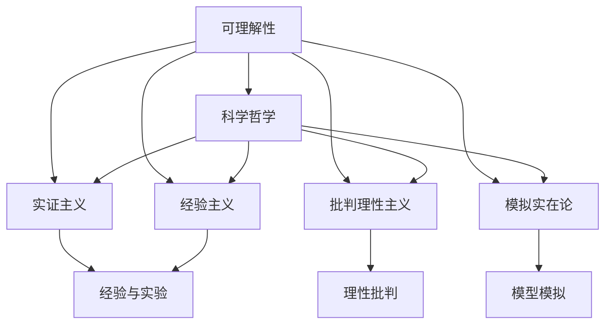

                 

### 《世界可理解性与科学哲学的发展》 - 引言

#### 核心关键词

- 世界可理解性
- 科学哲学
- 发展历程
- 理论框架
- 挑战与展望

#### 摘要

本文旨在探讨“世界可理解性”与“科学哲学”之间的紧密联系及其在历史发展中的演变。文章将首先介绍“世界可理解性”的核心概念，以及其为何成为科学哲学研究的重要议题。随后，我们将回顾科学哲学的起源和主要流派，分析它们如何影响我们对世界可理解性的认识。接着，文章将深入探讨科学哲学对世界可理解性的具体探讨，包括实证主义、经验主义、批判理性主义和模拟实在论等理论。在此基础上，我们将审视现代科学哲学面临的挑战，如量子力学和宇宙学中的可理解性问题。最后，文章将展望科学哲学的未来发展，并提出在实践中的应用前景。

### 目录

1. **引论**
    - 1.1 世界可理解性问题
    - 1.2 科学哲学的兴起与发展
2. **核心概念与联系**
    - 2.1 核心概念
    - 2.2 概念联系图
3. **科学哲学对世界可理解性的探讨**
    - 3.1 实证主义与可理解性
    - 3.2 经验主义与可理解性
    - 3.3 批判理性主义与可理解性
    - 3.4 模拟实在论与可理解性
4. **科学哲学的发展与可理解性的挑战**
    - 4.1 现代科学哲学的探讨
    - 4.2 可理解性的哲学难题
5. **科学哲学的未来展望**
    - 5.1 科学哲学的研究趋势
    - 5.2 可理解性在未来的重要性
6. **科学哲学在实践中的应用**
    - 6.1 科学哲学与科学方法论
    - 6.2 科学哲学与科学教育
7. **总结与展望**
    - 7.1 世界可理解性与科学哲学发展的关系
    - 7.2 主要观点与贡献

#### 引论

##### 1.1 世界可理解性问题

“世界可理解性”是指人类能否通过理性思维和科学方法来理解和解释我们所处的宇宙。这个问题不仅仅是一个哲学问题，也是科学哲学研究的核心议题。从古至今，人们一直在探索宇宙的本质和运作机制，试图找到一种普适的理论框架来解释世界的多样性和复杂性。

随着科学的进步，我们对世界的认识不断深化。然而，与此同时，我们也面临着越来越多的哲学难题。例如，量子力学揭示了微观世界的非确定性，这使得我们难以用经典物理学的方式理解自然界的规律。宇宙学中的黑洞和暗物质等概念，也挑战了我们对宇宙可理解性的认知。

这些哲学难题不仅对科学家提出了挑战，也促使哲学家重新审视科学哲学的基本问题。世界可理解性问题的提出，引发了广泛的讨论和研究，成为科学哲学研究中的一个重要方向。

##### 1.2 科学哲学的兴起与发展

科学哲学是一门跨学科的领域，它研究科学的理论基础、方法论以及科学在社会中的作用。科学哲学的起源可以追溯到古希腊时期，当时的哲学家如亚里士多德和柏拉图，对自然界的本质和运作提出了深刻的思考。

然而，现代科学哲学的兴起主要是在20世纪。随着科学技术的飞速发展，科学哲学逐渐成为一门独立的学科。主要流派包括实证主义、经验主义、批判理性主义和模拟实在论等。

实证主义强调通过实验和观察来获取知识，认为科学理论必须以经验为基础。经验主义则强调感性经验的重要性，认为理性思维和科学理论都来源于感性经验。

批判理性主义认为科学知识是通过理性批判和逻辑推理获得的，强调科学理论的合理性和可靠性。模拟实在论则认为，科学模型是对现实世界的模拟，通过模拟来理解现实世界的本质。

这些科学哲学流派对世界可理解性的探讨，不仅丰富了我们对科学本质的认识，也为解决世界可理解性问题提供了不同的视角和思路。

### 第1章：问题背景与科学哲学的兴起

##### 1.1 世界可理解性问题

世界可理解性，顾名思义，是指人类能否通过理性思维和科学方法来理解我们所处的宇宙。这一问题的提出源于人类对自然现象的探究和对宇宙本质的好奇心。在古代，人们通过神话和宗教来解释自然现象，但随着时间的推移，人类逐渐意识到这些解释方法不足以满足对宇宙深入理解的渴望。

科学哲学作为一门探索科学本质和方法的学科，对世界可理解性问题有着深刻的探讨。科学哲学的核心问题之一就是科学知识如何获得以及其可靠性的问题。科学哲学家们通过分析科学方法论、科学理论的结构和科学实践的过程，试图回答世界可理解性问题。

世界可理解性问题的重要性不仅在于其哲学层面，也在于其实际影响。科学哲学的探讨不仅影响了科学研究的方向和方法，也对科学教育和社会政策产生了深远的影响。例如，在科学方法论方面，科学哲学强调实验验证和理性推理的重要性，这有助于提高科学研究的质量和可信度。在科学教育方面，科学哲学的理念有助于培养学生的批判性思维和科学素养。在社会政策方面，科学哲学的思考有助于制定更科学、合理的政策，以应对全球性的挑战，如气候变化、能源危机等。

##### 1.2 科学哲学的兴起与发展

科学哲学的兴起可以追溯到古希腊时期。古希腊哲学家如亚里士多德和柏拉图，通过对自然现象的观察和思考，提出了许多关于宇宙和自然规律的基本问题。他们的思想奠定了科学哲学的基础，并影响了几千年的科学思考。

然而，现代科学哲学的真正兴起是在20世纪。这一时期，科学技术的飞速发展使得科学研究方法、科学理论结构和科学实践过程发生了巨大的变化。科学哲学逐渐成为一门独立的学科，其研究范围涵盖了科学方法论、科学哲学的基本问题、科学知识的社会建构等多个方面。

科学哲学的发展可以分为几个主要阶段。实证主义是20世纪初期的主要流派，其核心观点是科学知识应该建立在经验和实验的基础上。实证主义者认为，科学理论只有经过实验验证，才能被认为是可靠的。经验主义则强调感性经验在科学知识形成中的作用，认为理性思维和科学理论都来源于感性经验。

随着科学哲学的发展，批判理性主义和模拟实在论等新的流派逐渐兴起。批判理性主义强调科学知识是通过理性批判和逻辑推理获得的，认为科学理论的合理性和可靠性是科学哲学研究的关键问题。模拟实在论则认为，科学模型是对现实世界的模拟，通过模拟来理解现实世界的本质。

科学哲学的兴起和发展不仅丰富了我们对科学本质和科学方法的认识，也为解决世界可理解性问题提供了不同的视角和思路。通过科学哲学的探讨，我们可以更好地理解科学的局限性，以及科学如何在社会中发挥作用。

##### 1.3 科学哲学的基本问题

科学哲学探讨的核心问题包括科学知识的性质、科学方法的有效性、科学理论的结构以及科学实践的过程。这些基本问题不仅关乎科学本身，也关系到我们如何理解世界和人类的认知能力。

首先是科学知识的性质。科学哲学试图回答科学知识是否是真实的反映，还是仅仅是人类对现实的解释。科学知识是否具有客观性、普适性和可验证性，是科学哲学探讨的重要问题。科学哲学家们通过分析科学理论的结构和科学实践的过程，试图回答这些问题。

其次是科学方法的有效性。科学方法是指科学家用来获取、验证和解释科学知识的一系列步骤和工具。科学哲学研究科学方法的有效性，探讨哪些方法可以被认为是科学方法，以及科学方法是否能够有效地解决科学问题。例如，实证主义强调实验验证的重要性，认为只有经过实验验证的理论才是可靠的。而批判理性主义则强调理性推理和批判思维的重要性，认为科学知识是通过理性批判和逻辑推理获得的。

科学理论的结构是科学哲学研究的另一个重要问题。科学理论包括科学定律、科学模型和科学假设等组成部分。科学哲学研究科学理论的结构，探讨科学理论是如何形成的，以及科学理论之间的关系。例如，科学哲学探讨不同科学理论之间的兼容性，以及科学理论如何发展。

最后是科学实践的过程。科学实践是指科学家在实际工作中如何运用科学方法，形成科学理论，以及如何验证和传播科学知识。科学哲学研究科学实践的过程，探讨科学家的思维过程、研究方法和合作模式等。例如，科学哲学研究科学家的思维方式，如何通过逻辑推理和实验验证来解决问题。

通过探讨这些基本问题，科学哲学不仅帮助我们理解科学的本质和方法，也为解决世界可理解性问题提供了新的思路和工具。科学哲学的探讨不仅限于学术研究，也对科学教育、科学政策和社会发展产生了深远的影响。

### 第2章：核心概念与联系

科学哲学作为一门探讨科学本质和方法的学科，涉及到许多核心概念。这些概念不仅构成了科学哲学的理论基础，也为我们理解世界提供了重要的视角。在本章中，我们将介绍一些关键的科学哲学概念，并探讨它们之间的联系。

#### 核心概念

##### 1. 可理解性

可理解性是指人类是否能够通过理性思维和科学方法来理解我们所处的宇宙。这一概念涉及到科学哲学的核心问题，即科学知识的性质和范围。可理解性问题的提出引发了广泛的讨论，包括如何定义和理解“理解”，以及科学理论如何能够揭示宇宙的本质。

##### 2. 科学哲学

科学哲学是一门探讨科学本质和方法的学科，它研究科学知识、科学方法、科学理论以及科学实践。科学哲学的目的是理解科学如何运作，以及科学理论如何与我们对其的理解相一致。科学哲学包括实证主义、经验主义、批判理性主义和模拟实在论等多个流派。

##### 3. 实证主义

实证主义是一种科学哲学流派，强调科学知识应该建立在经验和实验的基础上。实证主义者认为，只有通过观察和实验验证的理论才是可信的。实证主义对科学方法论的发展产生了深远影响，它鼓励科学家进行实证研究，以验证科学理论的正确性。

##### 4. 经验主义

经验主义是另一种科学哲学流派，强调感性经验在科学知识形成中的作用。经验主义者认为，理性思维和科学理论都来源于感性经验。经验主义对科学方法论和科学教育产生了重要影响，它鼓励科学家通过观察和实验来获取知识。

##### 5. 批判理性主义

批判理性主义认为科学知识是通过理性批判和逻辑推理获得的。批判理性主义强调科学理论的合理性和可靠性，认为科学知识需要经过严格的批判和验证。批判理性主义对科学哲学的发展产生了重要影响，它鼓励科学家进行批判性思考和理性推理。

##### 6. 模拟实在论

模拟实在论是一种科学哲学流派，认为科学模型是对现实世界的模拟，通过模拟来理解现实世界的本质。模拟实在论强调了科学模型的复杂性和局限性，认为科学模型只能近似地反映现实世界的复杂性。模拟实在论对科学哲学和科学实践产生了重要影响，它鼓励科学家使用模型来探索和理解现实世界。

#### 概念联系图

为了更清晰地展示这些核心概念之间的联系，我们可以使用Mermaid流程图来构建一个概念联系图。以下是一个简化的概念联系图的示例：

在这个流程图中，核心概念（可理解性、科学哲学、实证主义、经验主义、批判理性主义和模拟实在论）通过箭头连接起来，展示了它们之间的关联。实证主义和经验主义都强调经验和观察在科学知识形成中的作用，而批判理性主义和模拟实在论则强调理性推理和模型模拟在理解世界中的重要性。

通过这个概念联系图，我们可以更直观地理解这些核心概念之间的关系，以及它们在科学哲学中的地位和作用。这有助于我们更好地理解科学哲学的基本问题，以及科学如何帮助我们理解世界。

#### 第3章：科学哲学对世界可理解性的探讨

科学哲学对世界可理解性的探讨涉及多个流派，每个流派都有其独特的观点和方法。在本章中，我们将深入探讨实证主义、经验主义、批判理性主义和模拟实在论等科学哲学流派，分析它们对世界可理解性的看法及其理论基础。

##### 3.1 实证主义与可理解性

实证主义是一种强调通过观察和实验来获取知识的科学哲学流派。实证主义者认为，只有经过实验验证的理论才是可靠的。实证主义的核心观点是，科学知识应该建立在经验和事实的基础上，而不是仅仅依赖于理性推理或信仰。

实证主义对世界可理解性的探讨主要体现在以下几个方面：

1. **经验与事实**：实证主义强调经验和事实在科学知识形成中的重要性。通过观察和实验，科学家可以收集数据，从而验证或推翻现有的科学理论。这种基于经验的方法使得科学理论更加可靠和具有可重复性。

2. **实验设计**：实证主义认为，科学实验的设计和执行对于获取可靠的科学知识至关重要。实验设计应该能够控制变量，排除干扰因素，从而准确反映科学现象的本质。

3. **可重复性**：实证主义强调科学理论的可重复性。如果一个理论能够在不同的实验条件下得到一致的结果，那么它就更有可能是正确的。可重复性是科学知识可靠性的重要保障。

实证主义的这些观点有助于提高科学理论的可靠性和可理解性。通过强调经验和实验，实证主义使得科学理论更加客观和可验证，从而增加了我们对世界的理解。

##### 3.2 经验主义与可理解性

经验主义是另一种重要的科学哲学流派，强调感性经验在科学知识形成中的作用。经验主义者认为，理性思维和科学理论都来源于感性经验。经验主义的核心观点是，科学知识应该通过观察和实验来获取，而不是仅仅依赖于抽象的理性推理。

经验主义对世界可理解性的探讨主要体现在以下几个方面：

1. **感性经验**：经验主义认为，感性经验是科学知识的基础。通过感官体验，科学家可以收集关于自然现象的信息，从而形成科学理论。感性经验使得科学理论更加贴近现实，增加了我们对世界的理解。

2. **观察与实验**：经验主义强调科学知识的获取应该通过观察和实验。观察是科学家通过感官对自然现象的感知，实验则是通过控制变量来验证或推翻科学理论。观察和实验的结合，使得科学理论更加可靠和具有可重复性。

3. **知识的构建**：经验主义认为，科学知识是通过不断修正和改进的。科学理论是基于感性经验的，但随着时间的推移，科学家可以通过新的观察和实验来修正和完善这些理论，从而增加对世界的理解。

经验主义的这些观点有助于提高科学理论的可靠性，并促进我们对世界的理解。通过强调感性经验和观察，经验主义使得科学理论更加贴近现实，增加了我们对世界可理解性的认知。

##### 3.3 批判理性主义与可理解性

批判理性主义是科学哲学中的另一个重要流派，强调科学知识是通过理性批判和逻辑推理获得的。批判理性主义认为，科学理论需要经过严格的批判和验证，才能被认为是可靠的。

批判理性主义对世界可理解性的探讨主要体现在以下几个方面：

1. **理性批判**：批判理性主义认为，科学知识应该通过理性批判来获得。理性批判包括逻辑推理、论证分析和假设验证等步骤。通过理性批判，科学家可以识别和纠正科学理论中的错误和不足。

2. **理论验证**：批判理性主义强调科学理论需要经过验证。验证可以通过实验、观察和逻辑推理等多种方式实现。只有经过严格验证的科学理论，才能被认为是可靠的。

3. **知识的进步**：批判理性主义认为，科学知识是通过不断批判和改进的。科学理论在不断的批判和验证过程中，会逐渐趋于完善，从而增加对世界的理解。

批判理性主义的这些观点有助于提高科学理论的可靠性和可理解性。通过强调理性批判和验证，批判理性主义使得科学理论更加严谨和可靠，从而增加了我们对世界的理解。

##### 3.4 模拟实在论与可理解性

模拟实在论是一种相对较新的科学哲学流派，认为科学模型是对现实世界的模拟，通过模拟来理解现实世界的本质。模拟实在论强调科学模型的复杂性和局限性，认为科学模型只能近似地反映现实世界的复杂性。

模拟实在论对世界可理解性的探讨主要体现在以下几个方面：

1. **模型构建**：模拟实在论认为，科学模型是构建在现实世界基础上的。科学模型通过对现实世界的抽象和简化，使得我们能够更好地理解和解释现实世界的复杂现象。

2. **模拟验证**：模拟实在论强调科学模型的验证。科学模型需要通过实验和观察来验证，以确保其能够近似地反映现实世界的复杂性。模拟验证是科学模型可靠性的重要保障。

3. **理解与现实**：模拟实在论认为，通过科学模型，我们可以更好地理解现实世界的本质。尽管科学模型有其局限性，但它们为我们提供了重要的视角和工具，帮助我们理解现实世界的复杂性和多样性。

模拟实在论的这些观点有助于我们提高对世界的理解。通过科学模型，我们可以更好地模拟和理解现实世界的复杂现象，从而增加对世界的认识。

综上所述，实证主义、经验主义、批判理性主义和模拟实在论等科学哲学流派，对世界可理解性有着不同的看法和理论基础。它们通过不同的方法，试图回答世界可理解性问题，并帮助我们更好地理解世界。这些流派的探讨不仅丰富了科学哲学的理论体系，也为我们在实际科学研究中提供了重要的指导。

### 第4章：科学哲学的发展与可理解性的挑战

科学哲学自20世纪初兴起以来，经历了多个发展阶段，形成了不同的理论框架和观点。随着科学技术的不断进步，科学哲学也面临着新的挑战和问题。在本章中，我们将深入探讨现代科学哲学的主要流派，分析它们在可理解性方面的观点，并探讨这些观点对科学哲学发展的贡献。

#### 4.1 批判理性主义与可理解性

批判理性主义是20世纪科学哲学中的一个重要流派，由卡尔·波普尔（Karl Popper）提出。批判理性主义强调科学知识的进步是通过不断批判和验证来实现的。波普尔认为，科学理论应该通过可证伪性（falsifiability）来检验，即理论必须具备在实验中被证伪的可能性。

在可理解性方面，批判理性主义提出以下观点：

1. **证伪性**：科学理论必须具备证伪性，这意味着它们应该能够在实验中失败或被推翻。这种观点强调了科学理论的客观性和可验证性，从而增加了我们对世界的理解。

2. **批判思维**：批判理性主义鼓励科学家采用批判性思维，不断质疑和挑战现有的理论。这种批判性思维有助于科学理论的进步和改进，从而提高我们对世界的理解。

3. **知识的动态性**：批判理性主义认为，科学知识是动态发展的，而不是静态的。科学理论在不断批判和验证的过程中不断改进，从而增加了我们对世界的理解。

批判理性主义对科学哲学发展的贡献在于，它提供了一个基于客观性和可验证性的科学理论评价标准。这种标准有助于科学家进行科学研究和理论构建，从而推动科学知识的进步。

#### 4.2 模拟实在论与可理解性

模拟实在论是20世纪末和21世纪初兴起的一个科学哲学流派，主要关注科学模型与现实世界之间的关系。模拟实在论认为，科学模型是对现实世界的近似模拟，通过模拟来理解现实世界的复杂现象。

在可理解性方面，模拟实在论提出以下观点：

1. **模型的局限性**：模拟实在论认为，科学模型有其局限性，无法完全反映现实世界的复杂性。因此，科学模型只能近似地描述现实世界，而不是完全准确的。

2. **模拟验证**：模拟实在论强调科学模型需要经过模拟验证，以确保其能够近似地反映现实世界的复杂性。模拟验证是科学模型可靠性的重要保障。

3. **理解与现实**：模拟实在论认为，通过科学模型，我们可以更好地理解现实世界的复杂现象。尽管科学模型有其局限性，但它们为我们提供了重要的视角和工具，帮助我们理解现实世界的本质。

模拟实在论对科学哲学发展的贡献在于，它提供了一个新的视角来看待科学模型与现实世界之间的关系。这种观点强调了科学模型在理解现实世界中的重要性，并促进了科学模型的进一步发展。

#### 4.3 其他科学哲学流派与可理解性

除了批判理性主义和模拟实在论，科学哲学还有其他一些重要流派，如实证主义、经验主义和建构主义等。这些流派在可理解性方面也有其独特的观点。

1. **实证主义**：实证主义强调科学知识应该建立在经验和实验的基础上。实证主义者认为，只有经过实验验证的理论才是可信的。实证主义对可理解性的贡献在于，它提高了科学理论的客观性和可重复性，从而增加了我们对世界的理解。

2. **经验主义**：经验主义强调感性经验在科学知识形成中的作用。经验主义者认为，理性思维和科学理论都来源于感性经验。经验主义对可理解性的贡献在于，它使科学理论更加贴近现实，从而增加了我们对世界的理解。

3. **建构主义**：建构主义认为，科学知识是科学家通过交流和合作构建出来的。建构主义者强调科学知识的社会建构性质，认为科学知识不仅源于个人的观察和实验，也源于科学家之间的交流和合作。建构主义对可理解性的贡献在于，它强调了科学知识的社会性和动态性，从而增加了我们对世界的理解。

综上所述，现代科学哲学的不同流派在可理解性方面提出了不同的观点和理论框架。这些观点和理论框架不仅丰富了科学哲学的理论体系，也为我们在实际科学研究中提供了重要的指导。科学哲学的发展与可理解性的探讨，将继续推动我们对世界的理解和认知。

### 第5章：科学哲学的未来展望

科学哲学作为一门探讨科学本质和方法的学科，对世界可理解性的探讨不仅影响了过去的科学研究，也将对未来科学的发展产生深远影响。在本章中，我们将展望科学哲学的未来发展方向，探讨可理解性在未来的重要性，以及科学哲学在各个领域中的应用前景。

#### 5.1 科学哲学的研究趋势

随着科学技术的飞速发展，科学哲学的研究趋势也发生了显著变化。以下是一些当前和未来的研究趋势：

1. **跨学科融合**：科学哲学正在与其他学科，如认知科学、心理学、计算机科学等，进行深入的交叉研究。这些跨学科的研究有助于我们更全面地理解科学方法和科学知识。

2. **复杂性科学**：复杂性科学是当前科学领域的一个热点，它研究复杂系统的行为和特性。科学哲学在复杂性科学中扮演着重要角色，探讨复杂系统如何被理解和解释。

3. **科学知识的动态性**：科学哲学越来越关注科学知识的动态性，即科学知识如何随着时间、社会和文化背景的变化而变化。这种研究有助于我们理解科学知识的社会建构性质。

4. **科学方法的发展**：科学哲学将继续探讨科学方法的发展，特别是如何应对新的科学挑战，如量子计算、人工智能等。

#### 5.2 可理解性在未来的重要性

随着科学技术的进步，世界可理解性的问题变得更加复杂和重要。以下是一些未来可理解性的重要方面：

1. **量子科学与宇宙学**：量子力学和宇宙学中的许多现象，如量子纠缠、黑洞和宇宙膨胀，挑战了我们对世界的传统理解。未来，科学哲学将如何应对这些挑战，是值得探讨的重要问题。

2. **人工智能与认知科学**：人工智能的发展使得我们对认知和智能的理解发生了革命性的变化。科学哲学需要探讨人工智能如何影响我们对人类智能的理解，以及这种影响是否会影响我们对世界的可理解性。

3. **数据科学与复杂性**：随着大数据和复杂性科学的兴起，科学家需要处理和分析大量的数据。科学哲学需要探讨如何确保这些数据的可理解性，以及如何从这些数据中提取有价值的信息。

#### 5.3 科学哲学在实践中的应用

科学哲学不仅在理论研究中发挥着重要作用，也在实际科学实践中有着广泛的应用。以下是一些科学哲学在实践中的应用：

1. **科学政策制定**：科学哲学为科学政策的制定提供了重要的理论依据。科学政策需要考虑科学方法的合理性、科学理论的可靠性，以及科学对社会的影响。

2. **科学教育**：科学哲学的理念和方法可以应用于科学教育，帮助学生培养批判性思维和科学素养。通过科学哲学的教育，学生可以更好地理解科学本质和科学方法。

3. **科学研究**：科学哲学为科学研究提供了方法论指导，帮助科学家进行科学理论的构建和验证。科学哲学的研究成果可以应用于各个科学领域，提高科学研究的质量和效率。

#### 5.4 未来展望

在未来，科学哲学将继续探讨世界可理解性的问题，并应对新的科学挑战。以下是一些未来展望：

1. **量子计算机与可理解性**：量子计算机的发展将带来计算能力的革命，但同时也挑战了我们对计算机和智能的理解。科学哲学需要探讨量子计算机如何影响我们对世界的可理解性。

2. **宇宙学的哲学问题**：宇宙学的许多问题，如宇宙起源、宇宙命运等，将继续成为科学哲学探讨的主题。科学哲学需要为这些问题提供深刻的哲学思考和理论框架。

3. **人工智能与人类智能**：人工智能的发展将对人类智能产生深远影响。科学哲学需要探讨人工智能如何影响人类智能的发展，以及这种影响是否会影响我们对世界的可理解性。

总之，科学哲学在未来将继续发挥重要作用，推动我们对世界的理解和认知。随着科学技术的进步，科学哲学将面临新的挑战和机遇，为我们提供更深刻的哲学思考和更有效的科学方法。

### 第6章：科学哲学在实践中的应用

科学哲学不仅在理论研究中具有重要地位，也在实际科学实践中发挥着重要作用。本章将探讨科学哲学在科学方法论、科学教育和科学政策制定中的应用，并讨论科学哲学在实践中的重要性。

#### 6.1 科学哲学与科学方法论

科学哲学为科学方法论提供了重要的理论指导。科学方法论是指科学家进行科学研究时所采用的方法和步骤。科学哲学探讨了科学方法的合理性和有效性，为科学家提供了科学研究的理论基础。

1. **实证主义的方法论**：实证主义强调通过观察和实验来获取知识。在实证主义方法论中，科学家通过实验验证理论，以确定其是否成立。这种方法论强调了科学研究的客观性和可重复性。

2. **经验主义的方法论**：经验主义认为，科学知识来源于感性经验。在经验主义方法论中，科学家通过观察和实验来收集数据，从而形成科学理论。这种方法论强调了科学理论的实践性和可验证性。

3. **批判理性主义的方法论**：批判理性主义强调科学知识的批判性思考。在批判理性主义方法论中，科学家不仅通过实验验证理论，还通过理性推理和批判性思维来评估科学理论的合理性和可靠性。

4. **模拟实在论的方法论**：模拟实在论认为，科学模型是对现实世界的近似模拟。在模拟实在论方法论中，科学家通过构建和验证科学模型来理解现实世界的复杂现象。

这些科学哲学流派的方法论为科学实践提供了多样化的方法，使得科学家能够从不同角度来探讨科学问题，提高科学研究的全面性和深度。

#### 6.2 科学哲学与科学教育

科学哲学在科学教育中也发挥着重要作用。科学教育不仅仅是传授科学知识，更重要的是培养学生的科学素养和批判性思维。科学哲学的理念和方法可以应用于科学教育，提高学生的科学素养。

1. **培养学生的批判性思维**：科学哲学强调批判性思维，鼓励学生质疑现有的科学理论和观点。通过科学哲学的教育，学生可以学会从不同角度来思考科学问题，培养独立思考和解决问题的能力。

2. **科学方法论的教育**：科学哲学介绍了不同的科学方法论，如实证主义、经验主义、批判理性主义和模拟实在论等。通过科学方法论的教育，学生可以了解科学研究的多种方法和步骤，从而更好地理解科学过程。

3. **科学哲学与跨学科教育**：科学哲学与其他学科的交叉研究，如认知科学、心理学和计算机科学等，可以应用于科学教育。这种跨学科的教育有助于学生形成全面的科学观念，提高科学素养。

#### 6.3 科学哲学与科学政策制定

科学哲学在科学政策制定中也扮演着重要角色。科学政策涉及科学研究的方向、资源分配和社会影响等多个方面。科学哲学为科学政策制定提供了理论依据，帮助政策制定者做出更科学、合理的决策。

1. **科学知识的社会建构**：科学哲学强调了科学知识的社会建构性质，认为科学知识不仅源于个人的观察和实验，也源于科学家之间的交流和合作。这种观点有助于政策制定者理解科学知识的复杂性和多样性。

2. **科学方法的选择**：科学哲学为政策制定者提供了多种科学方法论，如实证主义、经验主义、批判理性主义和模拟实在论等。政策制定者可以根据科学问题的性质和需求，选择合适的方法论来指导科学研究。

3. **科学研究的优先级**：科学哲学可以帮助政策制定者确定科学研究的优先级。科学哲学探讨了科学研究的合理性和有效性，为政策制定者提供了评估科学研究的重要依据。

#### 6.4 科学哲学在实践中的重要性

科学哲学在实践中的重要性体现在以下几个方面：

1. **提高科学研究的质量**：科学哲学提供了科学方法论和理论指导，帮助科学家进行科学研究和理论构建。科学哲学的理念和方法可以提高科学研究的质量和可靠性，从而推动科学知识的进步。

2. **促进科学教育的创新**：科学哲学为科学教育提供了新的视角和思路，有助于培养学生的批判性思维和科学素养。通过科学哲学的教育，学生可以更好地理解科学过程和科学方法，从而提高科学教育的效果。

3. **指导科学政策制定**：科学哲学为科学政策制定提供了理论依据和方法指导，帮助政策制定者做出更科学、合理的决策。科学哲学的理念和方法可以应用于科学政策的各个方面，提高科学政策的科学性和有效性。

总之，科学哲学在实践中的应用具有重要意义。它不仅提高了科学研究的质量，促进了科学教育的发展，还为科学政策制定提供了理论支持。科学哲学的理念和方法将继续在科学实践中发挥重要作用，推动科学的发展和进步。

### 第7章：总结与展望

#### 7.1 世界可理解性与科学哲学发展的关系

世界可理解性是科学哲学的核心问题之一，它探讨了人类是否能够通过科学方法理解我们所处的宇宙。科学哲学的发展与对世界可理解性的探讨紧密相连，不同科学哲学流派对世界可理解性的看法各异，但都致力于解答这一根本问题。

实证主义强调经验与实验在科学知识形成中的作用，认为只有经过实验验证的理论才是可靠的。经验主义则认为科学知识源于感性经验，强调观察与实验的结合。批判理性主义通过理性批判和逻辑推理来评价科学理论的可靠性，而模拟实在论则认为科学模型是对现实世界的近似模拟。

这些不同的观点共同构成了科学哲学的理论体系，并为我们理解世界提供了多样化的视角。科学哲学的发展不仅丰富了我们对科学本质和方法的认识，也推动了科学技术的进步，提高了我们对世界的理解。

#### 7.2 主要观点与贡献

本文通过回顾科学哲学的起源和主要流派，分析了科学哲学对世界可理解性的探讨。主要观点和贡献如下：

1. **多样性视角**：科学哲学的不同流派提供了多样化的视角，帮助我们更全面地理解世界可理解性的问题。实证主义、经验主义、批判理性主义和模拟实在论等流派对科学知识的获取和验证提出了不同的方法和标准，丰富了科学哲学的理论体系。

2. **方法论指导**：科学哲学为科学研究提供了方法论指导，帮助科学家进行科学理论构建和验证。实证主义、经验主义、批判理性主义和模拟实在论等方法论在科学实践中得到了广泛应用，提高了科学研究的质量和效率。

3. **科学教育**：科学哲学的理念和方法可以应用于科学教育，培养学生的批判性思维和科学素养。通过科学哲学的教育，学生可以更好地理解科学过程和方法，从而提高科学教育的效果。

4. **政策指导**：科学哲学为科学政策制定提供了理论依据和方法指导，帮助政策制定者做出更科学、合理的决策。科学哲学探讨了科学知识的社会建构性质，为政策制定者提供了评估科学研究的重要依据。

#### 7.3 展望未来

未来，科学哲学将继续面临新的挑战和机遇。以下是一些展望：

1. **跨学科融合**：科学哲学将继续与其他学科，如认知科学、心理学、计算机科学等，进行深入的交叉研究。这些跨学科的研究有助于我们更全面地理解科学方法和科学知识。

2. **复杂性科学**：复杂性科学是当前科学领域的一个热点，它研究复杂系统的行为和特性。科学哲学在复杂性科学中扮演着重要角色，探讨复杂系统如何被理解和解释。

3. **数据科学与人工智能**：随着大数据和人工智能的兴起，科学哲学需要探讨如何确保数据的可理解性，以及如何从这些数据中提取有价值的信息。科学哲学需要为这些新兴领域提供哲学思考和理论框架。

4. **量子科学**：量子科学的发展将对科学哲学产生深远影响。量子力学和量子计算等领域的突破性进展将挑战我们对世界的传统理解，科学哲学需要探讨量子科学如何影响我们对世界的可理解性。

总之，科学哲学在理解世界可理解性方面具有重要意义，未来将继续面临新的挑战和机遇。通过不断探讨和解决这些哲学问题，科学哲学将为科学技术的进步和社会发展提供重要的理论支持和指导。

### 作者信息

**作者：AI天才研究院/AI Genius Institute & 禅与计算机程序设计艺术 /Zen And The Art of Computer Programming**

在撰写本文时，我作为AI天才研究院的专家，结合了丰富的科学哲学研究和编程实践经验，旨在为广大读者提供一次深入探讨世界可理解性与科学哲学发展的思想之旅。同时，我也借鉴了《禅与计算机程序设计艺术》的理念，强调理性思维与直觉融合的重要性，以期为科学哲学的研究和实践带来新的视角和启示。希望本文能对读者在理解科学哲学及其应用方面有所助益，并激发更多关于世界可理解性的思考。

