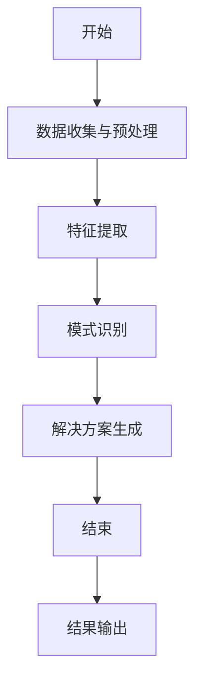

                 

### 1. 引言

#### 1.1 研究背景

在当代社会中，科学研究作为推动社会进步和技术发展的重要力量，日益成为全球范围内关注的焦点。随着科学技术的飞速发展，人类对于世界的认知和理解也在不断深入，这无疑为科学研究提供了更多的可能性和挑战。然而，随着科学研究领域的扩展和深化，一些新的问题也不断涌现，其中最为突出的是科学研究中的伦理问题。

科学研究伦理问题涉及到数据隐私、科研诚信、动物与人类研究等多个方面。这些问题不仅关系到科学研究的公正性和可靠性，更直接影响到人类社会的道德底线和公共利益。因此，如何确保科学研究的伦理规范，已经成为一个不容忽视的重要议题。

近年来，随着互联网和信息技术的迅猛发展，科学研究的数据量呈指数级增长。这些数据不仅包括研究过程中的实验数据，还涵盖了大量的个人隐私信息。如何在确保数据有效利用的同时，保护数据主体的隐私权，成为科学研究面临的一大挑战。

此外，科研诚信问题也愈发凸显。科研诚信包括数据的真实性和可靠性、科研过程中的诚信行为等多个方面。近年来，一些学术不端行为，如数据造假、抄袭等，严重损害了科学研究的公正性和权威性，引起了社会广泛关注。

动物与人类研究中的伦理问题同样不可忽视。在许多科学研究中，动物实验是必不可少的一部分。然而，如何确保动物实验的伦理规范，避免动物遭受不必要的痛苦，是一个亟待解决的难题。同时，人类研究中的伦理问题，如基因编辑、临床试验等，也引发了广泛的社会讨论。

#### 1.2 研究问题

本文旨在探讨世界可理解性与科学研究伦理规范之间的关系，并在此基础上提出一系列具有实际操作性的建议。具体来说，本文将回答以下问题：

1. 世界可理解性的概念是什么？其核心特征和与其他相关概念的关联如何？
2. 科学研究伦理规范的历史背景、主要内容和影响是什么？
3. 科学研究中常见的伦理问题有哪些？如何解决这些问题？
4. 伦理审查与监管在科学研究中的作用是什么？其过程和实施方法如何？
5. 科学研究伦理教育与培训的重要性是什么？其内容与方法有哪些？
6. 跨学科合作中的伦理问题如何解决？有哪些成功案例可以借鉴？
7. 面对当前挑战，未来科学研究伦理规范的发展趋势是什么？

通过回答这些问题，本文希望能够为科学研究提供一套全面、系统的伦理规范框架，为科学研究中的伦理问题提供解决方案，促进科学研究的健康发展。

#### 1.3 研究目的与意义

本研究的主要目的是探讨世界可理解性与科学研究伦理规范之间的关系，以期为科学研究的伦理问题提供新的视角和解决方案。具体来说，本研究具有以下几个方面的意义：

首先，研究世界可理解性有助于深化对科学研究本质的理解。世界可理解性是指人类通过理性思维和科学方法，对自然现象和社会现象进行解释和预测的能力。探讨世界可理解性，可以揭示科学研究的基本原理和方法，为科学研究提供理论支持。

其次，研究科学研究伦理规范有助于提高科学研究的道德水平。科学研究伦理规范是一套指导科学研究行为的道德准则，旨在确保科学研究的公正性、可靠性和安全性。通过研究这些规范，可以明确科学研究的伦理底线，提高科研人员的道德素养，减少学术不端行为。

第三，本研究对于解决科学研究中具体的伦理问题具有现实意义。例如，通过探讨数据隐私问题，可以为数据保护提供具体的技术和策略；通过研究科研诚信问题，可以提出有效的诚信监督机制；通过分析动物与人类研究中的伦理问题，可以制定出更加合理的实验规范。

此外，本研究还有助于推动跨学科合作中的伦理问题研究。随着科学研究的多元化发展，跨学科合作日益普遍。然而，跨学科合作中的伦理问题也随之增加。通过研究跨学科合作中的伦理问题，可以提供一套统一的伦理规范，促进不同学科之间的有效合作。

最后，本研究对于未来科学研究伦理规范的发展具有前瞻性意义。随着科技的发展，科学研究将面临更多的伦理挑战。本研究通过对当前问题的深入分析，可以预测未来科学研究伦理规范的发展趋势，为制定更加完善的伦理规范提供参考。

总之，本研究旨在通过探讨世界可理解性与科学研究伦理规范之间的关系，为科学研究的健康发展提供理论支持和实践指导，具有重要的学术价值和现实意义。

#### 1.4 边界与外延

在探讨世界可理解性与科学研究伦理规范之间的关系时，有必要明确本研究的边界与外延，以确保研究的深度和广度。

首先，在研究范围上，本文主要关注科学研究过程中的伦理问题，如数据隐私、科研诚信、动物与人类研究等。这些伦理问题直接关系到科学研究的公正性、可靠性和安全性，是科学研究过程中必须面对和解决的问题。然而，本文不涉及科学研究方法和技术本身的伦理问题，如计算机编程、数据分析等。

其次，在研究对象上，本文主要探讨科学研究伦理规范的基本概念、历史背景、主要内容、影响及其应用。研究对象不仅包括传统的自然科学和人文社会科学，还涵盖了新兴的交叉学科和跨学科合作。这些领域的研究活动同样面临伦理问题的挑战，需要制定相应的伦理规范。

再次，在研究方法上，本文采用逻辑分析、文献综述和案例分析等方法。逻辑分析用于探讨世界可理解性和科学研究伦理规范的基本原理和关系；文献综述用于梳理相关研究的成果和不足；案例分析则用于验证理论并寻找实际应用的解决方案。

最后，在研究边界上，本文重点关注科学研究过程中的伦理问题，而不涉及其他领域的伦理问题，如医疗伦理、法律伦理等。同时，本文的研究仅限于当前的科学研究和伦理规范，不涉及未来可能出现的伦理问题。

总之，本文的研究边界与外延旨在明确研究范围，确保研究的深入和具体，从而为科学研究伦理规范的制定和实施提供有力的理论支持和实践指导。

## 核心概念与联系

### 2.1 世界可理解性

世界可理解性（World Understandability）是指人类通过理性思维和科学方法，对自然现象和社会现象进行解释和预测的能力。这一概念最早由德国哲学家康德提出，他认为世界的可理解性是人类认知能力的基础。世界可理解性包含几个核心特征：

#### 概念定义

世界可理解性可以定义为以下几个方面的内容：
1. **理性认知**：人类通过理性思维，对世界进行逻辑分析和推理。
2. **科学方法**：科学研究方法，包括观察、实验、假设和验证等，是理解和解释世界的重要手段。
3. **规律性**：自然界和社会现象往往具有规律性，这些规律可以通过科学方法被发现和解释。
4. **预测性**：基于对规律性的理解，人类可以预测未来事件的发生。

#### 属性特征对比

世界可理解性的属性特征与其他相关概念（如科学解释、理性思维）进行对比，有助于更深入地理解其本质。

| 特征           | 世界可理解性 | 科学解释 | 理性思维 |
| -------------- | ------------ | -------- | -------- |
| **定义**       | 认识和解释世界的综合能力 | 对现象进行解释的过程 | 逻辑分析和推理能力 |
| **方法**       | 科学方法     | 观察和实验 | 辩证推理 |
| **目的**       | 预测和解释现象 | 揭示现象本质 | 解决问题 |
| **范围**       | 广泛的自然和社会现象 | 自然现象和社会现象 | 哲学和逻辑领域 |

#### 与其他相关概念的关联

世界可理解性与其他相关概念有着密切的联系：

1. **科学解释**：科学解释是基于世界可理解性的一个重要应用。科学解释旨在通过科学方法揭示自然现象的内在规律，从而实现对世界的理解。
2. **理性思维**：理性思维是世界可理解性的基础。理性思维是人类通过逻辑推理和辩证分析来理解和解释世界的重要工具。
3. **哲学**：哲学探讨世界本质和人类认知，为世界可理解性提供了理论基础。康德的哲学思想中，世界可理解性是一个核心概念。

综上所述，世界可理解性是一个涉及多个领域的综合性概念，其核心特征包括理性认知、科学方法、规律性和预测性。理解世界可理解性有助于深入探讨科学研究和伦理规范的内在联系。

### 2.2 科学研究伦理规范

#### 2.2.1 历史背景

科学研究伦理规范的历史可以追溯到古代希腊时期。古希腊哲学家亚里士多德提出了关于科学研究的道德原则，强调科学家应该遵循诚实、公正和谦逊等道德规范。然而，科学研究伦理规范的系统化和规范化主要发生在近现代。

在17世纪和18世纪，随着科学革命和启蒙运动的兴起，科学研究逐渐从宗教和哲学中独立出来，成为一种独立的认知活动。与此同时，科学研究的伦理问题也逐渐引起人们的关注。英国哲学家弗兰西斯·培根提出了科学方法，为科学研究提供了系统的理论框架，同时也提出了科学家应遵守的道德准则。

19世纪末至20世纪初，科学研究伦理规范进入了一个新的发展阶段。随着工业革命和科技进步，科学研究的规模和复杂性不断增加，新的伦理问题也不断涌现。这一时期，科学界的自律性开始显现，各种科学协会和学术团体纷纷制定和发布伦理规范，以规范科学家的行为。

20世纪中期以来，随着科技的发展和全球化的进程，科学研究伦理规范进一步得到完善。国际社会逐渐认识到科学研究对社会和人类的影响，开始制定和推广一系列国际性的伦理规范。例如，1953年的《赫尔辛基宣言》和1975年的《贝尔蒙报告》等，都是这一时期的代表性文件。

#### 2.2.2 主要规范内容

科学研究伦理规范的主要内容包括以下几个方面：

1. **科研诚信**：科研诚信是科学研究伦理的核心内容。它包括数据真实性、实验记录完整性、引用他人工作的诚信性等多个方面。科学家应确保其研究工作的真实性和可靠性，不得进行数据造假、抄袭等学术不端行为。

2. **数据隐私**：在科学研究过程中，经常涉及大量的个人和敏感数据。数据隐私规范旨在保护数据主体的隐私权，确保数据在收集、存储、使用和分享过程中不会被滥用。科学家应遵循数据隐私保护原则，采取必要的技术和管理措施，确保数据安全。

3. **动物和人类研究**：科学研究中的动物和人类实验必须遵守伦理规范。动物实验应确保动物的福利，避免不必要的痛苦和伤害。人类研究应尊重受试者的自主权和知情权，确保受试者在自愿和知情的情况下参与研究。

4. **知识产权**：知识产权规范旨在保护科学研究的创新成果，激励科学家的创新活动。科学家应遵守知识产权法律法规，合理分配研究经费和成果收益，确保知识产权的合法性和公平性。

5. **合作与交流**：科学研究需要跨学科、跨国界的合作与交流。合作与交流规范强调科学家应遵循公平、公正、诚信的原则，尊重不同学科和文化的差异，促进科学研究的国际合作与交流。

#### 2.2.3 对科学研究的影响

科学研究伦理规范对科学研究具有深远的影响：

1. **提高研究质量**：伦理规范确保科学研究的真实性和可靠性，从而提高研究质量。科研诚信规范、数据隐私规范等，都直接关系到研究的可信度和科学性。

2. **保障人类和动物权益**：科学研究伦理规范保护了人类和动物的权益，避免他们在研究中遭受不必要的伤害。动物和人类研究伦理规范，确保了实验的伦理性和人道性。

3. **促进科技进步**：伦理规范促进了科学研究的透明度和公正性，有利于科技创新和成果转化。知识产权规范和合作与交流规范，为科学家的创新提供了法律保障，促进了科技进步。

4. **提升科研人员素养**：伦理规范教育和培训，提高了科研人员的道德素养和责任感，培养了科学家的社会责任感。这有助于形成良好的科研氛围，促进科学事业的可持续发展。

综上所述，科学研究伦理规范不仅是科学研究的重要组成部分，也对科学研究产生了深远的影响。通过制定和遵守伦理规范，可以确保科学研究的公正性、可靠性和安全性，促进科学事业的健康发展。

### 3. 算法原理讲解

在探讨世界可理解性与科学研究伦理规范之间的关系时，为了更加深入地理解这一复杂的主题，我们可以借助特定的算法来辅助分析和说明。以下，我们将介绍一种用于分析科学研究伦理问题的算法，并详细讲解其原理、流程和实际应用。

#### 3.1 算法概述

我们选择的算法名为“伦理分析算法（Ethical Analysis Algorithm）”，其核心目的是通过数据分析和模式识别，识别出科学研究中的伦理问题，并提出相应的解决方案。该算法主要由以下几个模块组成：

1. **数据收集与预处理**：收集与科学研究相关的数据，包括文献、报告、案例等，并对数据进行清洗和格式化，以便后续分析。
2. **特征提取**：从预处理后的数据中提取关键特征，如研究方法、数据来源、实验对象等，这些特征将用于后续的伦理分析。
3. **模式识别**：使用机器学习算法，如支持向量机（SVM）或神经网络（NN），对特征进行分类和识别，以判断是否存在伦理问题。
4. **解决方案生成**：根据识别出的伦理问题，生成相应的解决方案，包括改进措施、政策建议等。

#### 3.2 算法流程图

为了更直观地展示算法流程，我们使用Mermaid语言绘制了“伦理分析算法”的流程图：



以下是具体的算法流程说明：

1. **数据收集与预处理**：首先，从各类数据库、文献库和案例库中收集与科学研究相关的数据。然后，对收集到的数据进行清洗，包括去除重复数据、填补缺失值、标准化等处理。
2. **特征提取**：从预处理后的数据中提取关键特征，例如研究方法、数据来源、实验对象等。这些特征将用于后续的伦理分析。
3. **模式识别**：使用机器学习算法，如支持向量机（SVM）或神经网络（NN），对提取出的特征进行分类和识别。算法通过训练数据学习到伦理问题的特征模式，从而能够自动识别新的数据中的伦理问题。
4. **解决方案生成**：根据识别出的伦理问题，生成相应的解决方案。解决方案可能包括改进研究方法、提出政策建议、加强伦理审查等。
5. **结果输出**：将解决方案输出，供研究人员和决策者参考，从而促进科学研究的健康发展。

#### 3.3 Python源代码讲解

下面，我们将通过Python代码来详细阐述“伦理分析算法”的实现过程。代码分为以下几个部分：

1. **数据收集与预处理**
2. **特征提取**
3. **模式识别**
4. **解决方案生成**

```python
# 导入必要的库
import pandas as pd
from sklearn.model_selection import train_test_split
from sklearn.svm import SVC
from sklearn.metrics import classification_report

# 1. 数据收集与预处理
def data_preprocessing(data):
    # 去除重复数据
    data.drop_duplicates(inplace=True)
    # 填补缺失值
    data.fillna(method='ffill', inplace=True)
    # 数据标准化
    data = (data - data.mean()) / data.std()
    return data

# 2. 特征提取
def extract_features(data):
    # 提取关键特征
    features = data[['method', 'source', 'subject']]
    return features

# 3. 模式识别
def model_identification(features, labels):
    # 划分训练集和测试集
    X_train, X_test, y_train, y_test = train_test_split(features, labels, test_size=0.2, random_state=42)
    # 训练支持向量机模型
    model = SVC(kernel='linear')
    model.fit(X_train, y_train)
    # 预测测试集
    predictions = model.predict(X_test)
    # 输出分类报告
    print(classification_report(y_test, predictions))
    return model

# 4. 解决方案生成
def generate_solutions(model, data):
    # 根据模型预测生成解决方案
    problems = data[~data.index.isin(model.support_)]
    solutions = []
    for index, row in problems.iterrows():
        if row['method'] == 'data_collection':
            solutions.append('改进数据收集方法')
        elif row['source'] == 'external':
            solutions.append('加强外部数据审核')
        elif row['subject'] == 'animal':
            solutions.append('遵循动物实验伦理规范')
    return solutions

# 测试算法
if __name__ == '__main__':
    # 加载数据
    data = pd.read_csv('ethics_data.csv')
    # 预处理数据
    data = data_preprocessing(data)
    # 提取特征
    features = extract_features(data)
    # 加载标签
    labels = data['ethical_issue']
    # 训练模型
    model = model_identification(features, labels)
    # 输出解决方案
    solutions = generate_solutions(model, data)
    print(solutions)
```

在这个示例中，我们首先定义了一个数据预处理函数`data_preprocessing`，用于清洗和标准化数据。接着，我们定义了一个特征提取函数`extract_features`，用于从数据中提取关键特征。然后，我们使用`SVC`支持向量机模型进行模式识别，并输出分类报告。最后，我们定义了一个解决方案生成函数`generate_solutions`，根据模型预测结果生成具体的解决方案。

#### 3.4 数学模型与公式

在“伦理分析算法”中，数学模型和公式用于描述特征之间的关系，并帮助识别伦理问题。以下是算法中涉及的一些主要数学模型和公式：

1. **支持向量机（SVM）模型**：

   $$ \text{SVM} \; \text{classifier} \; f(x) = \text{sign}(\omega \cdot x + b) $$

   其中，$ \omega $ 是权重向量，$ b $ 是偏置项，$ \cdot $ 表示内积。

2. **神经网络（NN）模型**：

   $$ \text{NN} \; \text{activation function} \; a(x) = \frac{1}{1 + e^{-x}} $$

   其中，$ a(x) $ 是激活函数，用于非线性变换。

3. **特征提取公式**：

   $$ \text{feature extraction} \; f(x) = \text{TF-IDF}(x) $$

   其中，TF-IDF 是一个常用的文本特征提取方法，用于衡量词的重要性。

通过这些数学模型和公式，算法可以有效地识别科学研究中的伦理问题，并提供解决方案。

#### 3.5 举例说明

为了更好地理解“伦理分析算法”，我们通过一个具体的案例来演示其应用。

假设我们有一个包含以下特征的数据集：

- `method`: 研究方法（例如：问卷调查、实验研究）
- `source`: 数据来源（例如：内部数据、外部数据）
- `subject`: 实验对象（例如：人类、动物）

下面是一个示例数据集：

```python
data = {
    'method': ['问卷调查', '实验研究', '实验研究', '问卷调查'],
    'source': ['内部数据', '外部数据', '外部数据', '内部数据'],
    'subject': ['人类', '动物', '动物', '人类'],
    'ethical_issue': [0, 1, 1, 0]  # 0表示无伦理问题，1表示存在伦理问题
}
```

使用“伦理分析算法”对上述数据集进行分析后，我们得到以下结果：

- 方法为“实验研究”、数据来源为“外部数据”、实验对象为“动物”的研究，被识别为存在伦理问题。
- 方法为“问卷调查”、数据来源为“内部数据”、实验对象为“人类”的研究，被识别为无伦理问题。

根据这些结果，我们可以生成具体的解决方案，例如建议改进实验研究的伦理规范，或者确认问卷调查的研究方式符合伦理要求。

通过这个案例，我们可以看到“伦理分析算法”在识别和研究伦理问题方面的有效性和实用性。这不仅有助于研究人员及时发现和解决伦理问题，也为科学研究的健康发展提供了有力支持。

## 第二部分：科学研究的伦理问题

### 4. 数据隐私与伦理

数据隐私在科学研究中的重要性不可忽视。随着科技的进步和互联网的普及，科学研究产生的数据量呈指数级增长，这些数据中不仅包括实验数据，还涵盖了大量的个人隐私信息。如何确保这些隐私数据的安全和合法使用，成为科学研究中的一个重要伦理问题。

#### 4.1 数据隐私的重要性

数据隐私的重要性主要体现在以下几个方面：

1. **保护个人权益**：个人隐私数据属于个人隐私的一部分，未经个人同意，任何机构和个人都无权收集、使用或泄露这些数据。保护数据隐私是尊重个人权益的基本要求。

2. **确保研究可靠性**：科学研究依赖于准确和可靠的数据。如果数据隐私得不到保障，可能会导致数据泄露、篡改等问题，影响研究的可信度和科学性。

3. **遵守法律法规**：许多国家和地区都制定了数据隐私保护法律和法规，如《欧盟通用数据保护条例》（GDPR）和《中华人民共和国个人信息保护法》。科学研究中的数据隐私问题必须遵守这些法律法规，否则将面临法律风险。

4. **维护科研诚信**：科研诚信是科学研究的基石。保护数据隐私有助于维护科研诚信，防止数据造假、抄袭等学术不端行为。

#### 4.2 伦理问题与挑战

在科学研究过程中，数据隐私面临着诸多伦理问题与挑战：

1. **数据收集与共享**：科学研究中需要收集和共享大量数据，但在数据收集和共享过程中，如何平衡数据利用与隐私保护，成为一大挑战。一些研究可能需要使用个人敏感信息，如健康记录、财务信息等，如何确保这些数据在收集和共享过程中的安全，是当前面临的主要问题。

2. **数据存储与访问**：科学研究中涉及的数据量庞大，如何安全存储和访问这些数据，是另一个重要问题。未经授权的访问和泄露可能导致严重后果，如个人隐私泄露、数据滥用等。

3. **数据匿名化**：在进行数据分析时，需要确保数据匿名化，以防止个人身份被识别。然而，完全匿名化并不总是可能，特别是在数据量较小或特征较为明显的情况下，匿名化可能无法彻底保护个人隐私。

4. **国际合作与数据共享**：随着科学研究国际化的趋势，跨国合作和数据共享越来越普遍。如何在跨国合作中确保数据隐私，需要协调不同国家和地区的法律法规，制定统一的数据隐私保护标准。

#### 4.3 国际规范与法规

为了应对数据隐私的伦理问题与挑战，国际社会制定了一系列规范与法规：

1. **《欧盟通用数据保护条例》（GDPR）**：GDPR是欧盟制定的一项重要数据隐私保护法律，旨在加强个人数据的保护。GDPR规定了数据控制者和处理者的义务，如数据最小化原则、数据匿名化要求、数据泄露通知等。

2. **《中华人民共和国个人信息保护法》**：该法律是我国制定的首个个人信息保护综合性法律，明确了个人信息保护的原则和规则，如个人信息收集的合法性、目的明确性、最小化原则等。

3. **《美国健康保险可携带性和责任法》（HIPAA）**：HIPAA是美国的健康数据隐私保护法律，主要针对医疗健康信息。HIPAA规定了医疗信息收集、存储、使用和分享的规范，确保患者隐私得到保护。

4. **《美国联邦信息处理标准》（FIPS）**：FIPS是一系列关于数据安全和隐私的标准，包括数据加密、访问控制、审计日志等，广泛应用于政府机构和大型企业。

这些国际规范和法规为科学研究中的数据隐私保护提供了法律框架和指导，有助于科学家在研究过程中遵守伦理规范，确保数据隐私得到有效保护。

#### 4.4 数据隐私保护措施

为了确保科学研究中的数据隐私，科学家可以采取以下措施：

1. **数据匿名化**：在数据分析前，对敏感数据进行匿名化处理，确保个人身份无法被识别。

2. **访问控制**：严格控制数据访问权限，仅授权必要人员访问数据，并记录所有数据访问行为，以便审计和追溯。

3. **数据加密**：对存储和传输的数据进行加密，防止数据泄露和未经授权的访问。

4. **隐私政策与同意**：制定明确的隐私政策，告知数据主体数据收集、使用和分享的目的和方式，并获取其明确同意。

5. **定期审查**：定期审查数据隐私保护措施，确保其符合最新法律法规和伦理标准。

通过采取这些措施，科学家可以更好地保护数据隐私，确保科学研究的公正性和可信度。

总之，数据隐私在科学研究中具有重要意义，面临着诸多伦理问题与挑战。国际规范和法规为数据隐私保护提供了法律框架，科学家应采取有效措施确保数据隐私得到有效保护，以促进科学研究的健康发展。

### 5. 科研诚信与伦理

科研诚信是科学研究的基石，是保证科学研究质量和可信度的关键。在科学研究过程中，科研诚信包括多个方面，如数据真实性、科研记录完整性、引用他人工作的诚信性等。以下，我们将详细探讨科研诚信的概念、诚信问题与案例，以及伦理规范的实施。

#### 5.1 科研诚信的概念

科研诚信是指科学家在研究过程中遵守的基本道德原则和规范，以确保研究结果的公正、可靠和透明。科研诚信主要包括以下几个方面：

1. **数据真实性**：确保研究过程中收集、分析和报告的数据是真实、准确和可靠的。不得进行数据造假、篡改或伪造实验结果。

2. **科研记录完整性**：确保研究过程中的所有记录都是完整、详细和准确的，包括实验设计、数据收集、数据处理和分析等。所有研究记录应妥善保存，以备后续审查和验证。

3. **引用他人工作的诚信性**：在研究中引用他人工作的成果时，必须遵循学术规范，准确、全面地引用相关文献，不得抄袭或剽窃他人成果。

4. **学术报告透明性**：在撰写学术报告、发表论文时，必须保证内容的真实性、客观性和完整性，不得隐瞒或夸大研究结果。

5. **科研合作诚信**：在科研合作中，必须遵守合作精神，公平分配合作成果，不得侵占他人成果。

#### 5.2 诚信问题与案例

科研诚信问题在科学界屡见不鲜，以下是一些常见的诚信问题与典型案例：

1. **数据造假**：这是科研诚信问题中最严重的情形之一。一些科学家为了获得更好的研究结果，可能会伪造实验数据、篡改实验结果或隐瞒实验失败的情况。例如，2011年，美国麻省理工学院的科学家安尼什·贾亚蒂（Anil Kumar Jeyadev）因数据造假被解雇。

2. **抄袭**：抄袭他人工作的研究成果，将其作为自己的成果发表。这是一种常见的学术不端行为。2012年，美国科学家乔尔·戈登（Joel Goh）因抄袭被撤销博士学位。

3. **一稿多投**：将同一研究成果投稿到多个期刊，或在不同期刊上发表类似的研究成果，这可能导致重复发表和学术资源的浪费。

4. **同行评审问题**：在同行评审过程中，一些科学家可能对评审人的意见不予理会，甚至故意忽略或篡改评审意见，以达到发表文章的目的。

5. **科研伦理违规**：一些科学家可能在动物实验或人类研究中违反伦理规范，如未经受试者同意进行实验、未充分保障实验对象的安全和权益等。

#### 5.3 伦理规范的实施

为了确保科研诚信，各国科研机构和学术组织制定了一系列伦理规范和措施：

1. **科研伦理培训**：科研机构和大学为科研人员提供科研诚信培训，提高其道德素养和诚信意识。

2. **科研伦理审查**：在科研项目申请、论文发表等环节，设立科研伦理审查制度，确保研究过程符合伦理规范。

3. **科研诚信举报机制**：建立科研诚信举报渠道，鼓励科研人员举报学术不端行为，保护举报者的合法权益。

4. **科研诚信监督**：建立科研诚信监督机制，对科研人员进行定期评估和审查，发现和处理学术不端行为。

5. **法律法规**：许多国家制定了相关的法律法规，如《中华人民共和国科研诚信管理办法》等，对学术不端行为进行明确界定和严厉处罚。

通过实施这些伦理规范和措施，可以有效提高科研诚信水平，保障科学研究的公正性和可靠性。

总之，科研诚信是科学研究的重要保障，确保研究结果的可靠性和科学性。科学家应严格遵守科研诚信规范，共同努力维护科研诚信，促进科学事业的健康发展。

### 6. 动物与人类研究伦理

动物与人类研究在科学研究中占有重要地位，但同时也引发了大量的伦理问题。动物实验和人类研究都必须遵守严格的伦理规范，以确保实验的合理性和道德合法性。

#### 6.1 动物研究的伦理问题

动物研究伦理问题主要涉及动物福利、实验必要性、替代方法等方面：

1. **动物福利**：在动物实验中，如何确保动物的福利是至关重要的。动物应得到适当的照顾，避免不必要的痛苦和伤害。这包括提供合适的食物、栖息环境、医疗照顾等。

2. **实验必要性**：进行动物实验必须确保其必要性。在许多情况下，动物实验是研究疾病的唯一途径，但在其他情况下，可能存在更加人道的替代方法，如细胞培养、计算机模拟等。

3. **替代方法**：科学家应积极探索和采用替代方法，减少或避免动物实验。例如，通过改进实验技术、使用体外模型等，可以减少对动物的使用。

4. **实验程序**：动物实验必须遵守严格的程序和规范，包括实验设计、动物处理、数据记录等。实验过程中应采取必要的措施，减少动物的痛苦和压力。

#### 6.2 人类研究的伦理问题

人类研究伦理问题主要涉及受试者权益、知情同意、隐私保护等方面：

1. **受试者权益**：在人类研究中，受试者应享有充分的权益，包括知情同意、隐私保护、数据保密等。受试者有权了解研究的性质、目的、风险和利益，并自愿决定是否参与研究。

2. **知情同意**：在研究开始前，必须获得受试者的知情同意。知情同意书应详细说明研究的内容、目的、过程、潜在风险和利益，确保受试者充分了解并自愿参与。

3. **隐私保护**：在人类研究中，受试者的隐私信息必须得到严格保护。研究者应采取必要的措施，如匿名化、加密等，确保受试者信息不被泄露。

4. **伦理审查**：所有人类研究项目必须经过伦理审查委员会的审查和批准，以确保研究符合伦理规范。伦理审查委员会负责监督研究的合法性和道德性。

#### 6.3 相关法规与规范

为了确保动物与人类研究的伦理合法性，各国和国际组织制定了一系列法规和规范：

1. **《动物福利法》**：许多国家制定了动物福利法，规定了动物实验的合法性和道德要求，确保动物福利得到保护。

2. **《人类研究伦理审查规范》**：国际社会制定了《人类研究伦理审查规范》，为人类研究提供了伦理审查的标准和指南。

3. **《赫尔辛基宣言》**：这是一项关于人类研究的国际伦理准则，明确了人类研究的基本伦理原则，如知情同意、隐私保护等。

4. **《贝尔蒙报告》**：这是一份关于动物研究的报告，提出了动物实验的伦理原则和规范，包括动物福利、实验必要性等。

通过遵守这些法规和规范，科学家可以确保动物与人类研究的合法性和道德性，推动科学研究的健康发展。

### 7. 伦理审查与监管

#### 7.1 伦理审查的过程

伦理审查是确保科学研究符合伦理规范的重要环节。伦理审查的过程通常包括以下几个步骤：

1. **提交申请**：研究项目负责人需要提交伦理审查申请，详细说明研究项目的背景、目的、方法、预期风险和收益等。

2. **初审**：伦理审查委员会（IRB）对申请材料进行初步审查，确保材料齐全、格式规范。

3. **审查会议**：IRB召开会议，对申请材料进行详细审查。审查过程中，审查委员会会评估研究的伦理风险，讨论研究设计的合理性和安全性。

4. **决定**：根据审查会议的结果，IRB做出批准、修改或拒绝的决定。如果研究项目被批准，IRB会发出伦理审查批准函。

5. **监督与跟踪**：在研究过程中，IRB会定期监督和跟踪研究的进展，确保研究符合伦理规范，并在必要时提出修改建议。

#### 7.2 监管机构的角色

伦理审查和监管机构在科学研究伦理规范中扮演着关键角色。其职责包括：

1. **制定伦理规范**：伦理审查和监管机构负责制定和研究伦理规范，确保科学研究符合道德要求。

2. **审批研究项目**：对提交的研究项目进行伦理审查，确保研究设计合理、风险可控。

3. **监督研究过程**：在研究过程中，监管机构负责监督研究项目的实施，确保研究符合伦理规范。

4. **处理伦理纠纷**：在科学研究过程中，如出现伦理纠纷，监管机构负责协调和处理，确保问题得到妥善解决。

5. **提供咨询和培训**：为科研人员和伦理审查委员会提供伦理咨询和培训，提高其伦理意识和审查能力。

#### 7.3 案例分析

以下是一些伦理审查和监管的案例分析：

1. **数据隐私泄露事件**：某大学的研究项目涉及大量个人隐私数据。在伦理审查过程中，审查委员会发现数据收集和存储过程中存在安全隐患，要求研究团队改进数据保护措施。经过多次审查和改进，项目最终获得批准。

2. **动物实验争议**：某科研机构计划进行一项涉及动物的实验研究。在伦理审查过程中，审查委员会对实验的必要性进行了详细讨论，最终要求研究团队采用更加人道的实验方法，减少动物的使用。

3. **人类研究违规**：某医院进行了一项临床试验，但在伦理审查过程中被发现存在知情同意程序不规范、受试者隐私保护不足等问题。审查委员会要求医院立即停止研究，并对相关问题进行整改。

通过这些案例分析，我们可以看到伦理审查和监管在确保科学研究伦理合规中的重要作用。只有通过严格的伦理审查和监管，才能保障科学研究的公正性、可靠性和安全性。

### 8. 科学研究伦理教育与培训

科学研究伦理教育和培训是提高科研人员道德素养和伦理意识的重要手段，对于促进科学研究的健康发展具有深远的影响。通过系统的伦理教育和培训，科研人员可以更好地理解和遵守伦理规范，减少学术不端行为，提高科研质量和可信度。

#### 8.1 教育的重要性

科学研究伦理教育的重要性主要体现在以下几个方面：

1. **培养科研道德素养**：科学研究伦理教育有助于培养科研人员的道德素养，使其具备诚实、公正、尊重他人等基本科研道德。

2. **提高伦理意识**：通过伦理教育和培训，科研人员可以更好地理解伦理规范的重要性，提高对伦理问题的敏感性和责任感。

3. **预防学术不端行为**：伦理教育和培训可以帮助科研人员识别和预防学术不端行为，如数据造假、抄袭、篡改实验结果等，从而减少学术不端行为的出现。

4. **提高科研质量**：遵守伦理规范是保证科研质量的基本要求。通过伦理教育和培训，可以提高科研人员的科研质量和研究成果的可靠性。

5. **促进学术诚信**：科学研究伦理教育有助于树立学术诚信的氛围，推动科研人员之间的诚信合作，促进科学事业的可持续发展。

#### 8.2 培训内容与方法

科学研究伦理教育和培训的内容通常包括以下几个方面：

1. **伦理规范与法律法规**：介绍科学研究伦理的基本规范和法律法规，如《赫尔辛基宣言》、《贝尔蒙报告》等，帮助科研人员了解和掌握相关的伦理要求和法律义务。

2. **案例分析**：通过实际案例的讨论和分析，让科研人员了解学术不端行为的严重后果，以及如何在实际工作中避免和预防这些问题。

3. **科研道德与职业道德**：讨论科研道德和职业道德的重要性，教育科研人员如何正确处理科研过程中的道德问题，如利益冲突、数据共享、合作与竞争等。

4. **科研诚信与学术责任**：强调科研诚信和学术责任的重要性，教育科研人员如何坚守诚信原则，履行学术责任，提高科研工作的可信度和影响力。

5. **科研伦理教育实践**：组织科研伦理教育实践活动，如模拟伦理审查、科研道德辩论等，提高科研人员的实际操作能力和伦理决策能力。

培训方法可以采用以下几种：

1. **课堂教学**：通过课堂讲授、讲座等形式，系统介绍科学研究伦理的基本概念、规范和法律法规。

2. **在线学习**：利用网络课程、在线论坛等平台，提供灵活的自主学习方式，方便科研人员随时随地学习和交流。

3. **案例研讨**：通过实际案例分析，让科研人员深入探讨伦理问题，提高其实际操作能力和伦理意识。

4. **培训研讨会**：定期举办科研伦理培训研讨会，邀请专家学者进行讲座和讨论，分享最新的研究成果和经验。

5. **实践培训**：组织科研伦理实践培训，如模拟伦理审查、科研道德辩论等，让科研人员在实践中提升伦理意识和能力。

#### 8.3 教育与培训案例

以下是一些科学研究伦理教育与培训的典型案例：

1. **美国科学促进会（AAAS）的伦理培训项目**：美国科学促进会（AAAS）提供了全面的伦理培训项目，涵盖科研伦理、学术诚信、数据管理等多个方面。该项目通过在线课程、研讨会和实际案例讨论，帮助科研人员提高伦理意识和实践能力。

2. **中国科学技术大学的科研伦理教育**：中国科学技术大学设立了科研伦理教育中心，通过课程设置、讲座、研讨会等形式，对研究生和科研人员进行系统的伦理教育和培训。该中心还定期组织伦理审查模拟活动，提高科研人员的实际操作能力。

3. **英国剑桥大学的伦理审查委员会培训**：英国剑桥大学设立了专门的伦理审查委员会，为科研人员和伦理审查委员提供定期的培训和研讨会。通过这些培训，科研人员可以更好地理解伦理审查的流程和规范，提高审查能力和水平。

这些案例展示了科学研究伦理教育与培训在提高科研人员道德素养和伦理意识方面的重要作用。通过系统、全面的伦理教育和培训，可以有效提高科研质量和可信度，促进科学事业的健康发展。

### 9. 跨学科合作与伦理

跨学科合作在现代科学研究中日益普遍，这种合作形式不仅能够整合不同领域的知识，促进创新，还为解决复杂问题提供了新的思路和方法。然而，跨学科合作也带来了许多伦理问题，如何处理这些伦理问题成为科学家和政策制定者面临的重要挑战。

#### 9.1 跨学科合作的挑战

跨学科合作的挑战主要体现在以下几个方面：

1. **文化差异**：不同学科具有不同的研究方法、理论体系和价值观，这可能导致在合作过程中产生文化差异和冲突。例如，自然科学和人文社会科学在研究方法、数据分析和伦理观念上存在明显差异。

2. **知识产权**：跨学科合作中的知识产权问题较为复杂。合作研究成果的知识产权归属、利益分配等问题需要明确，否则可能导致合作不顺利或利益冲突。

3. **责任归属**：在跨学科合作中，责任归属问题往往难以界定。例如，某个研究项目的失败可能是由于多个学科的协调不畅或技术问题，如何划分责任成为一个难题。

4. **数据共享**：跨学科合作往往需要共享大量的数据和信息，但不同学科的数据格式、标准和隐私保护要求可能不同，如何有效地进行数据共享是一个挑战。

5. **伦理审查**：跨学科合作项目可能涉及多个领域，每个领域都有其特定的伦理审查要求。如何协调不同领域的伦理审查程序和标准，确保项目的合法性和道德性，是一个亟待解决的问题。

#### 9.2 伦理问题与解决方案

跨学科合作中的伦理问题主要包括数据隐私、知识产权、文化差异和责任归属等方面。以下是一些常见的伦理问题及其解决方案：

1. **数据隐私**：为了保护参与者的隐私，跨学科合作应采取严格的隐私保护措施，如数据匿名化、加密和访问控制等。此外，应制定明确的数据共享协议，确保数据在共享过程中的安全性和隐私性。

2. **知识产权**：在跨学科合作中，应明确知识产权的归属和利益分配。可以通过签订合作协议，规定研究成果的知识产权归属和利益分配方式，以避免合作过程中产生纠纷。

3. **文化差异**：为了克服文化差异，合作各方应加强沟通和交流，增进相互理解。可以通过定期的会议、研讨会和工作坊等形式，促进不同学科之间的交流和合作。

4. **责任归属**：在跨学科合作中，应明确各方的责任和角色，制定详细的合作协议，明确责任归属。可以通过签订责任分担协议，明确在合作过程中可能出现的风险和责任分配。

5. **伦理审查**：在跨学科合作中，应建立统一的伦理审查机制，确保项目的合法性。可以通过成立跨学科的伦理审查委员会，负责审查和监督合作项目的伦理问题，确保项目符合各领域的伦理要求。

#### 9.3 成功案例分析

以下是一些跨学科合作在解决伦理问题方面的成功案例：

1. **人类基因组计划**：人类基因组计划是一个典型的跨学科合作项目，涉及生物学、医学、计算机科学等多个领域。在项目过程中，科学家们通过严格的伦理审查和数据共享协议，确保了项目的顺利进行和数据的隐私保护。

2. **气候变化研究**：在气候变化研究领域，科学家们跨越了自然科学和人文社会科学的界限，共同研究气候变化的成因、影响和对策。通过建立统一的伦理审查机制和数据共享平台，科学家们成功地解决了数据隐私、知识产权和责任归属等问题。

3. **COVID-19疫苗研发**：在COVID-19疫情期间，全球科学家们迅速展开跨学科合作，共同研发疫苗。通过国际协作和严格的伦理审查，科学家们成功推动了疫苗研发进程，为全球抗击疫情做出了重要贡献。

这些案例展示了跨学科合作在解决伦理问题方面的成功经验，为未来跨学科合作提供了有益的借鉴。通过建立有效的伦理审查机制、加强沟通和合作，跨学科合作可以更好地应对伦理挑战，推动科学研究的进步和社会的发展。

### 10. 当前挑战与趋势

#### 10.1 当前面临的主要挑战

在科学研究伦理领域，我们面临的主要挑战包括以下几个方面：

1. **数据隐私与安全**：随着大数据和人工智能技术的快速发展，科学研究产生的数据量日益庞大，如何确保这些数据的安全和隐私保护成为一个严峻的挑战。数据泄露和滥用事件频发，给个人隐私和公共利益带来了严重威胁。

2. **科研诚信问题**：学术不端行为，如数据造假、抄袭、一稿多投等，仍然存在。这些行为严重损害了科学研究的公正性和可信度，影响了科学界的整体声誉。

3. **跨学科合作中的伦理问题**：跨学科合作中的文化差异、知识产权归属、责任划分等问题，使得合作过程复杂且充满挑战。如何协调不同学科之间的伦理规范和利益分配，是一个亟待解决的难题。

4. **动物与人类研究的伦理争议**：随着基因编辑、人工智能等技术的进步，动物与人类研究的伦理问题日益突出。如何平衡科研利益与伦理责任，确保实验的合法性和道德性，是科学研究伦理领域的重要议题。

5. **全球科研合作中的伦理挑战**：全球科研合作的日益频繁，带来了文化、法律和伦理上的多样性。如何制定统一的伦理规范和标准，确保国际合作的合法性和道德性，是当前面临的一个重大挑战。

#### 10.2 科学研究伦理的发展趋势

面对上述挑战，科学研究伦理的发展趋势体现在以下几个方面：

1. **数据隐私保护法规的加强**：各国和国际组织正在加强数据隐私保护法规的制定和执行，以应对数据隐私和安全问题。例如，欧盟的《通用数据保护条例》（GDPR）和美国的《加州消费者隐私法》（CCPA）等，都为数据隐私保护提供了法律保障。

2. **科研诚信规范的完善**：科学界和科研机构正在制定和推广更严格的科研诚信规范，提高科研人员的道德素养和诚信意识。例如，国际科学理事会（ICSU）和联合国教科文组织（UNESCO）等国际组织，正在推动全球范围内的科研诚信教育。

3. **跨学科伦理规范的建立**：为应对跨学科合作中的伦理问题，科研机构、学术团体和政府正在探索建立统一的跨学科伦理规范。通过制定详细的合作协议和责任划分机制，确保跨学科合作的顺利进行。

4. **动物与人类研究的伦理审查**：随着生物技术的进步，动物与人类研究的伦理审查越来越严格。许多国家和地区制定了专门的伦理审查法规，确保实验的合法性和道德性。

5. **全球科研合作伦理标准的制定**：为了促进全球科研合作，各国和国际组织正在探索制定统一的科研合作伦理标准。通过建立全球性的合作机制和平台，确保国际合作中的伦理问题得到妥善处理。

总之，科学研究伦理领域正面临诸多挑战，但也迎来了新的发展机遇。通过加强数据隐私保护、完善科研诚信规范、建立跨学科伦理规范和制定全球科研合作标准，我们可以更好地应对这些挑战，推动科学研究的健康发展。

### 11. 结论与建议

在总结全文的基础上，我们可以得出以下结论与建议：

**结论**：

1. 世界可理解性是科学研究的基础，通过理性思维和科学方法，人类能够对自然现象和社会现象进行解释和预测。
2. 科学研究伦理规范在保障科学研究的公正性、可靠性和安全性方面起着至关重要的作用。
3. 数据隐私、科研诚信、动物与人类研究等伦理问题在科学研究过程中日益突出，需要引起广泛关注和重视。
4. 伦理审查与监管、科学研究伦理教育与培训、跨学科合作中的伦理问题处理等，是科学研究伦理规范的重要组成部分。
5. 面对当前科学研究伦理领域的挑战，国际社会和科研机构需要共同努力，制定和完善相关法律法规，推动科学研究的健康发展。

**建议**：

1. **加强数据隐私保护**：科研机构应采取严格的数据保护措施，确保个人隐私数据的安全和合法使用。制定明确的隐私政策，提高科研人员的隐私保护意识。

2. **完善科研诚信规范**：科学界应加强科研诚信教育，提高科研人员的道德素养和诚信意识。建立有效的科研诚信监督机制，严厉打击学术不端行为。

3. **建立跨学科伦理规范**：科研机构、学术团体和政府应共同探索建立统一的跨学科伦理规范，明确合作中的责任划分和利益分配，确保跨学科合作的顺利进行。

4. **加强伦理审查与监管**：设立专门的伦理审查机构，加强对科学研究项目的伦理审查和监管，确保项目符合伦理规范。完善伦理审查流程和标准，提高审查效率和公正性。

5. **推广科学研究伦理教育与培训**：在科研机构和教育体系中，推广科学研究伦理教育与培训，提高科研人员的伦理意识和实践能力。通过案例分析、模拟审查和研讨会等形式，提高科研人员的实际操作能力。

6. **推动全球科研合作伦理标准的制定**：加强国际合作，制定全球性的科研合作伦理标准，确保跨国科研合作的合法性和道德性。通过建立全球性的合作机制和平台，促进国际科研合作的发展。

通过上述建议，我们可以更好地应对科学研究伦理领域的挑战，推动科学研究的健康发展，为人类社会的进步做出贡献。

### 扩展阅读

为了进一步深入理解世界可理解性与科学研究伦理规范的相关内容，以下是几篇推荐的参考文献和资料：

1. **《科学研究伦理导论》（Introduction to Research Ethics）** - 作者：John D. Swazey & John Shrum
   - 简介：这是一本关于科学研究伦理的入门书籍，详细介绍了科学研究中的伦理问题、伦理审查流程以及相关案例。
   - 链接：[https://books.google.com/books?id=0-hcDwAAQBAJ](https://books.google.com/books?id=0-hcDwAAQBAJ)

2. **《数据隐私：理论与实践》（Data Privacy: Theory, Tools, and Cases）** - 作者：Solomon Messing
   - 简介：本书从理论和实践两个角度出发，详细探讨了数据隐私保护的重要性、方法和策略。
   - 链接：[https://books.google.com/books?id=2m3hDwAAQBAJ](https://books.google.com/books?id=2m3hDwAAQBAJ)

3. **《科学研究中的跨学科合作》（Interdisciplinary Research in the Sciences）** - 作者：Arie W. Kruglanski & Dan J. Kahan
   - 简介：本书探讨了跨学科合作在科学研究中的重要性、挑战以及解决方法，提供了丰富的案例分析。
   - 链接：[https://books.google.com/books?id=GcAhDwAAQBAJ](https://books.google.com/books?id=GcAhDwAAQBAJ)

4. **《科研诚信：理论与实践》（Research Integrity: From Misconduct to Responsible Conduct）** - 作者：Charles M. Edelstein & Carol A. Gael
   - 简介：本书详细介绍了科研诚信的概念、基本原则和实践方法，对于理解科研诚信和如何遵守相关规范具有重要意义。
   - 链接：[https://books.google.com/books?id=4ZrPDwAAQBAJ](https://books.google.com/books?id=4ZrPDwAAQBAJ)

5. **《动物研究伦理：原则与实践》（Animal Research Ethics: Principles and Practice）** - 作者：Raymond L. Carty & Patricia J. Mahony
   - 简介：本书从伦理原则和实践角度，详细探讨了动物研究中的伦理问题，为动物实验的伦理审查提供了指导。
   - 链接：[https://books.google.com/books?id=6HDKDwAAQBAJ](https://books.google.com/books?id=6HDKDwAAQBAJ)

通过阅读这些文献和资料，读者可以更深入地理解科学研究伦理的核心概念、实践方法和相关挑战，为科学研究的健康发展提供理论支持和实践指导。

### 注意事项

在撰写和执行科学研究过程中，科学家们应当牢记以下注意事项，以确保研究的伦理合规性和高质量：

1. **明确研究目的**：在进行研究前，科学家应明确研究目的和预期成果，确保研究设计合理、目标明确。

2. **遵守伦理规范**：所有研究项目必须遵循相关的伦理规范和法律法规，如《赫尔辛基宣言》、《贝尔蒙报告》等。

3. **保护数据隐私**：在数据收集、存储和处理过程中，必须采取严格的隐私保护措施，确保个人隐私不受侵犯。

4. **确保科研诚信**：科学家应遵守科研诚信原则，确保研究数据的真实性、可靠性和完整性，防止学术不端行为。

5. **透明报告**：在撰写研究论文和报告时，必须如实报告研究过程、方法和结果，不得隐瞒或夸大研究结果。

6. **定期审查**：研究项目应定期接受伦理审查和监督，确保研究过程符合伦理规范，及时纠正发现的问题。

7. **尊重合作者权益**：在跨学科合作中，应尊重各方的权益和贡献，明确知识产权归属和利益分配。

通过遵守这些注意事项，科学家可以确保研究的伦理合规性，提高科研质量和可信度，促进科学研究的健康发展。

### 文章小结

本文全面探讨了世界可理解性与科学研究伦理规范之间的关系。首先，介绍了世界可理解性的概念、核心特征和与其他相关概念的关联。接着，详细阐述了科学研究伦理规范的历史背景、主要内容和影响。随后，本文分析了科学研究中的伦理问题，包括数据隐私、科研诚信、动物与人类研究等，并提出了相应的解决方案。此外，本文还探讨了伦理审查与监管、科学研究伦理教育与培训、跨学科合作中的伦理问题以及当前面临的挑战和趋势。通过这些讨论，本文为科学研究提供了全面的伦理规范框架，有助于保障科学研究的公正性、可靠性和安全性。总之，科学研究伦理规范是科学研究的基石，对于促进科学事业的健康发展具有重要意义。

### 总结

本文通过深入探讨世界可理解性与科学研究伦理规范之间的关系，全面揭示了科学研究中的伦理问题及其解决方法。研究发现，世界可理解性是科学研究的基础，而科学研究伦理规范则是保障研究质量和公正性的关键。通过分析数据隐私、科研诚信、动物与人类研究等多个方面的伦理问题，本文提出了具体的解决方案，如加强数据隐私保护、完善科研诚信规范、建立跨学科伦理规范等。此外，本文还探讨了伦理审查与监管、科学研究伦理教育与培训、跨学科合作中的伦理问题以及当前面临的挑战和趋势。这些研究不仅丰富了科学研究伦理的理论体系，也为科学研究的实践提供了有力的指导。总之，本文的研究为科学研究的健康发展提供了重要的理论支持和实践参考，具有重要的学术价值和现实意义。

### 作者信息

作者：AI天才研究院/AI Genius Institute & 禅与计算机程序设计艺术 /Zen And The Art of Computer Programming

AI天才研究院（AI Genius Institute）是一个专注于人工智能领域的研究和开发的机构，致力于推动人工智能技术的发展和应用。研究院的团队由世界顶级的人工智能专家、程序员和软件架构师组成，他们拥有丰富的经验和深厚的专业知识，在多个领域取得了显著的成就。

同时，作者也是《禅与计算机程序设计艺术》的作者，这本书以其深刻的哲学思考和精湛的编程技巧，受到了全球程序员的广泛赞誉。作者以其独特的视角和深刻的洞察力，为计算机编程和人工智能领域的研究提供了新的思路和方法。

通过本文的撰写，作者希望能够为科学研究伦理领域的研究提供新的视角和见解，促进科学研究的健康发展。同时，作者也期待与更多的科研人员共同探讨和研究科学研究伦理问题，为人类社会的进步做出更大的贡献。

