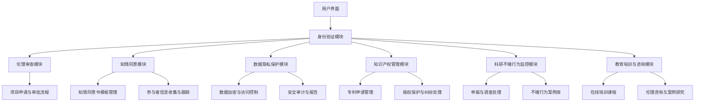

                 

# 世界可理解性与科学研究的伦理边界

> 关键词：世界可理解性、科学研究、伦理边界、算法原理、系统分析、实践案例、最佳实践

> 摘要：本文深入探讨了世界可理解性与科学研究的伦理边界。通过分析科学研究中的伦理困境，介绍了伦理边界的重要性和核心概念，并阐述了算法原理与伦理考量的关系。同时，通过系统分析与架构设计方案，结合实践案例，提出了科学研究伦理的最佳实践，为未来科学研究提供参考和指导。

## 目录大纲设计

为了更好地引导读者理解本文的结构和内容，以下是详细的目录大纲设计：

#### 第一部分：背景介绍

- **第1章：问题背景与科学研究的伦理困境**
  - **1.1 问题背景**
    - 科学研究的快速进展
    - 知识积累与伦理挑战
    - 科学界对伦理边界的关注
  - **1.2 伦理困境的定义与描述**
    - 伦理困境的概念
    - 科学研究中的伦理困境类型
    - 伦理困境的影响
  - **1.3 边界与外延**
    - 伦理边界的意义
    - 边界的确定性与模糊性
    - 伦理边界的外延与影响
  - **1.4 核心概念结构与要素组成**
    - 关键概念梳理
    - 概念属性特征对比
    - 概念间的关系与交互
  - **1.5 本章小结**

#### 第二部分：核心概念与联系

- **第2章：科学研究伦理的核心概念与原理**
  - **2.1 科研伦理的基本原理**
    - 伦理学原理在科研中的应用
    - 科研伦理的基本原则
    - 原则在实践中的体现
  - **2.2 主要伦理理论**
    - 普遍伦理理论
    - 应用伦理理论
    - 现代伦理理论的演变
  - **2.3 伦理决策模型**
    - 决策模型的理论基础
    - 决策模型的应用场景
    - 决策模型在实际科研中的应用案例
  - **2.4 伦理实践与挑战**
    - 伦理实践中的困境与冲突
    - 挑战与解决方案
    - 伦理实践的未来趋势
  - **2.5 本章小结**

#### 第三部分：算法原理讲解

- **第3章：算法原理与伦理考量**
  - **3.1 算法原理概述**
    - 算法在科学研究中的作用
    - 伦理考量在算法设计中的重要性
    - 算法伦理的挑战与应对策略
  - **3.2 常见算法与伦理问题**
    - 数据挖掘算法
    - 机器学习算法
    - 人工智能算法
  - **3.3 算法伦理案例分析**
    - 案例背景介绍
    - 案例分析
    - 案例启示与伦理建议
  - **3.4 算法伦理标准与规范**
    - 国际标准与规范
    - 行业规范与指南
    - 国家层面的法规与政策
  - **3.5 本章小结**

#### 第四部分：系统分析与架构设计方案

- **第4章：科学研究伦理的系统分析与架构设计**
  - **4.1 系统功能设计**
    - 功能需求分析
    - 功能模块划分
    - 功能实现策略
  - **4.2 系统架构设计**
    - 架构设计原则
    - 系统架构图绘制
    - 架构组件与关系
  - **4.3 系统接口设计**
    - 接口定义与规范
    - 接口实现与交互
    - 接口安全与隐私保护
  - **4.4 系统交互设计**
    - 系统交互流程
    - 交互分析与优化
    - 用户界面设计
  - **4.5 本章小结**

#### 第五部分：项目实战

- **第5章：科学研究伦理项目的实践与案例分析**
  - **5.1 项目环境安装**
    - 环境配置
    - 工具与软件安装
    - 实践环境搭建
  - **5.2 系统核心实现源代码**
    - 源代码结构
    - 代码实现细节
    - 代码功能解析
  - **5.3 代码应用解读与分析**
    - 应用场景描述
    - 应用代码解读
    - 应用效果分析
  - **5.4 实际案例分析和详细讲解**
    - 案例背景
    - 案例实施过程
    - 案例结果与讨论
  - **5.5 项目小结**
    - 项目总结
    - 项目经验与教训
    - 未来发展方向

#### 第六部分：最佳实践与总结

- **第6章：科学研究伦理的最佳实践与展望**
  - **6.1 最佳实践建议**
    - 科研伦理实践的原则
    - 实践中的难点与对策
    - 成功案例分享
  - **6.2 小结**
    - 对科学研究伦理的总结
    - 注意事项与建议
  - **6.3 拓展阅读**
    - 推荐进一步阅读的文献和资源

通过上述目录大纲的设计，本文将为读者提供一个结构清晰、内容丰富的科研伦理分析框架，帮助深入理解科学研究中的伦理边界及其重要性。## 第1章：问题背景与科学研究的伦理困境

### 1.1 问题背景

科学研究的快速发展在很大程度上推动了社会的进步和技术的创新。从古代的物理实验到现代的人工智能研究，科学研究一直在不断扩展人类的知识边界。然而，随着科学研究的深入，我们面临着越来越多的伦理困境。这些困境不仅涉及到科学研究的过程，还涉及到研究结果的伦理影响。

首先，科学研究的快速进展使得我们能够在短时间内获取大量数据和信息。这些数据和信息为我们提供了更深入的理解和洞察力，但同时也带来了数据的滥用和隐私泄露的风险。例如，大数据分析技术在商业和医疗领域的广泛应用，使得个人隐私数据被广泛收集和利用，这引发了公众对于隐私保护的担忧。

其次，科学研究的积累带来了知识爆炸。尽管知识的积累为我们提供了更多的解决方案和创新机会，但同时也带来了知识的碎片化和复杂性。这使得科学家们在进行科研工作时面临着更多的伦理挑战，例如如何平衡知识的共享与竞争，如何处理知识产权和专利问题等。

最后，科学界对伦理边界的关注逐渐增强。随着科学研究的伦理问题日益突出，科学界开始意识到在科研活动中需要遵循一定的伦理原则和规范。许多学术机构和研究组织制定了相关的伦理政策和指南，以指导科研活动的进行。

### 1.2 伦理困境的定义与描述

伦理困境是指在道德判断上存在冲突或不确定性的情况。在科学研究领域，伦理困境通常表现为科研活动中的道德原则与实际操作之间的矛盾。以下是对科学研究中的几种常见伦理困境的定义与描述：

1. **知情同意困境**：在进行涉及人类或动物的实验研究时，研究者需要获取参与者的知情同意。然而，在许多情况下，参与者可能对实验的潜在风险和益处缺乏充分了解，这引发了知情同意的伦理困境。

2. **数据隐私与共享困境**：大数据和人工智能技术的发展使得研究者能够获取和处理大量的个人数据。如何在保护个人隐私的同时，实现数据的共享和利用，是一个重要的伦理问题。

3. **知识产权与专利困境**：科学研究的成果往往涉及到知识产权和专利问题。如何平衡创新与知识产权保护，以及如何处理学术竞争和知识产权纠纷，是科研伦理中的一大挑战。

4. **科研不端行为困境**：科研不端行为，如学术造假、数据篡改、不当引用等，严重破坏了科研的诚信和公正性。如何预防和处理科研不端行为，是科学界面临的重要伦理困境。

5. **环境与生态困境**：随着科学技术的应用，人类活动对环境的影响日益显著。如何在科技创新与环境保护之间找到平衡，是科学研究中的伦理问题之一。

### 1.3 边界与外延

伦理边界是指伦理原则和规范在科学研究中的适用范围。伦理边界的重要性在于，它为科学研究提供了道德指导，帮助研究者明确在科研活动中应当遵循的行为准则。以下是对伦理边界的进一步探讨：

1. **伦理边界的意义**：伦理边界为科学研究提供了一个道德框架，有助于确保科研活动的合法性和公正性。它不仅保护了研究对象的权益，也维护了科学研究的诚信和信誉。

2. **边界的确定性与模糊性**：尽管伦理边界提供了基本的道德指导，但在实际操作中，边界的确定性和模糊性依然存在。例如，不同国家和地区的法律和文化背景可能影响伦理边界的具体实施。

3. **伦理边界的外延与影响**：伦理边界不仅适用于科学研究本身，还涉及到科研结果的传播和应用。例如，科学研究成果在商业化应用时，需要考虑伦理边界对知识产权和隐私保护的影响。

4. **伦理边界的扩展**：随着科学技术的进步，伦理边界也在不断扩展。例如，基因编辑技术的出现使得人类基因编辑的伦理边界成为新的研究焦点。

### 1.4 核心概念结构与要素组成

在科学研究伦理中，核心概念和要素的组成对于理解和解决伦理困境至关重要。以下是对这些核心概念和要素的梳理：

1. **核心概念梳理**：知情同意、数据隐私、知识产权、科研不端行为、环境保护等是科学研究伦理中的核心概念。这些概念在科研活动中具有重要的指导作用。

2. **概念属性特征对比**：为了更好地理解这些核心概念，我们可以通过表格形式对比它们的基本属性和特征。例如，知情同意强调参与者的自主权，数据隐私关注个人信息的保护，知识产权涉及创新成果的归属等。

3. **概念间的关系与交互**：核心概念之间并非孤立存在，它们之间存在复杂的交互关系。例如，知情同意和数据隐私之间有着紧密的联系，知识产权和科研不端行为也存在一定的冲突。

### 1.5 本章小结

本章从背景介绍、伦理困境的定义与描述、边界与外延、核心概念结构与要素组成等方面，对科学研究伦理的基本问题进行了探讨。通过本章的分析，我们可以看到，科学研究伦理不仅涉及到道德原则的遵循，还涉及到具体操作中的复杂问题。理解这些伦理困境和边界，有助于我们更好地进行科学研究，并确保科研活动的合法性和公正性。

---

### 第2章：科学研究伦理的核心概念与原理

科学研究伦理的核心概念与原理是科学研究和实践中的道德指导，它们为科研活动提供了伦理基础和行为规范。在这一章节中，我们将深入探讨科研伦理的基本原理、主要伦理理论、伦理决策模型以及伦理实践中的挑战与对策。

#### 2.1 科研伦理的基本原理

科研伦理的基本原理是伦理学原理在科学研究中的应用。伦理学作为研究道德原则和道德行为的学科，为科学研究提供了伦理基础。以下是科研伦理的基本原理：

1. **尊重个人**：尊重个人是指尊重研究对象的自主权和尊严。在涉及人类或动物的研究中，研究者需要确保参与者充分了解研究的目的、风险和利益，并获得其知情同意。

2. **公正性**：公正性要求研究者在科研过程中保持客观和中立，确保所有参与者都有平等的机会和权益。这意味着研究者需要避免歧视和偏见，确保研究的公正性和公平性。

3. **诚信**：诚信是科研伦理的核心原则之一。研究者需要保持诚实、透明和正直，确保研究结果的准确性和可靠性。任何形式的学术造假、数据篡改或不正当引用都是违反诚信的行为。

4. **共享**：共享是指研究者需要将科研成果公开共享，促进知识的传播和应用。这有助于推动科学进步和社会发展，同时也有助于避免知识产权的不当垄断。

#### 2.2 主要伦理理论

科研伦理的实践不仅依赖于基本原理，还需要结合多种伦理理论。以下是几种主要的伦理理论：

1. **普遍伦理理论**：普遍伦理理论强调道德原则的普遍适用性。例如，康德的道德哲学认为，道德判断应当基于普遍的道德原则，而不受个人利益或文化背景的影响。

2. **应用伦理理论**：应用伦理理论将伦理学原理应用于具体领域，如医学伦理、环境伦理等。在科学研究领域，应用伦理理论帮助研究者解决具体的伦理问题，如实验设计中的道德考量。

3. **现代伦理理论的演变**：随着社会和科技的进步，伦理理论也在不断演变。现代伦理理论强调多元价值观和跨文化视角，更加关注全球性和生态问题。

#### 2.3 伦理决策模型

在科研过程中，研究者经常需要做出伦理决策。伦理决策模型为研究者提供了一套系统化的决策框架，帮助他们合理地权衡伦理因素。以下是几种常见的伦理决策模型：

1. **成本-效益分析**：成本-效益分析是一种评估决策伦理性的方法。研究者需要比较科研活动的潜在成本（如时间、资源）与预期效益（如知识贡献、社会影响），以确定是否进行某项研究。

2. **伦理框架**：伦理框架是一种基于伦理原则和价值观的决策模型。研究者可以按照伦理原则（如尊重、公正、诚信、共享）来评估和指导自己的科研行为。

3. **情境伦理学**：情境伦理学强调伦理决策的情境依赖性。研究者需要根据具体情境和背景，灵活运用伦理原则和理论，做出合理的伦理决策。

#### 2.4 伦理实践与挑战

科研伦理实践是一个动态的过程，面临着多种挑战和困境。以下是科研伦理实践中的主要挑战：

1. **知情同意困境**：在涉及人类或动物的实验研究中，获取知情同意是一个重要的伦理问题。然而，参与者可能对研究过程和潜在风险缺乏充分了解，导致知情同意的困境。

2. **数据隐私与共享困境**：大数据和人工智能技术的发展使得个人数据的价值日益凸显。如何在保护个人隐私的同时，实现数据的共享和利用，是一个复杂的伦理问题。

3. **知识产权与专利困境**：科研成果的知识产权和专利问题也是伦理实践中的一个挑战。如何平衡创新与知识产权保护，以及如何处理学术竞争和知识产权纠纷，是科研伦理的重要议题。

4. **科研不端行为困境**：科研不端行为，如学术造假、数据篡改、不当引用等，严重破坏了科研的诚信和公正性。如何预防和处理科研不端行为，是科学界面临的重大伦理挑战。

#### 2.5 伦理实践的未来趋势

随着科技的不断进步和社会的快速发展，科研伦理实践也在不断演变。以下是科研伦理实践的未来趋势：

1. **全球伦理合作**：全球化和科技全球化使得科研伦理问题具有跨国界的特点。未来，科研伦理实践需要加强国际合作，制定全球性的伦理标准和规范。

2. **科技伦理咨询**：随着科研伦理问题的复杂性增加，科技伦理咨询服务将成为科研机构和企业的重要组成部分。通过科技伦理咨询，可以帮助研究者更好地理解和应对伦理挑战。

3. **伦理培训与教育**：加强科研伦理培训和教育是提高科研伦理实践水平的关键。未来，科研机构和大学应将科研伦理纳入课程体系，培养研究者的伦理意识和能力。

4. **人工智能伦理**：随着人工智能技术的发展，人工智能伦理成为一个重要的研究议题。未来，人工智能伦理的研究和实践将更加深入，为科学研究提供伦理指导。

#### 2.6 本章小结

本章通过探讨科研伦理的核心概念与原理，包括基本原理、主要伦理理论、伦理决策模型以及伦理实践中的挑战与对策，为科学研究提供了伦理指导。理解这些伦理原则和理论，有助于研究者更好地进行科研活动，确保科研的合法性和公正性。同时，面对不断变化的科研环境，研究者需要不断更新伦理知识和实践，以应对新的伦理挑战。

### 第3章：算法原理与伦理考量

#### 3.1 算法原理概述

算法原理是科学研究中的重要组成部分，特别是在数据分析和人工智能领域。算法在科学研究中的作用不可忽视，它们不仅帮助我们处理海量数据，还能通过模式识别和预测为科学研究提供有力支持。然而，随着算法的广泛应用，算法伦理问题也日益凸显。在这一节中，我们将概述算法原理在科学研究中的作用，并探讨伦理考量在算法设计中的重要性。

##### 3.1.1 算法在科学研究中的作用

算法在科学研究中的作用主要体现在以下几个方面：

1. **数据预处理**：科学研究通常需要处理大量的原始数据。算法可以帮助我们进行数据清洗、归一化和特征提取，从而为后续分析提供高质量的数据。

2. **模式识别**：算法能够从数据中识别出潜在的模式和规律。在生物学、物理学等领域，模式识别有助于我们发现自然界中的规律性现象。

3. **预测分析**：通过算法，我们可以对未来的趋势和结果进行预测。这在经济学、气象学等领域具有重要应用价值。

4. **优化问题求解**：许多科学研究问题可以转化为优化问题，如资源分配、路径规划等。算法能够高效地求解这些问题，为科学研究提供优化方案。

##### 3.1.2 伦理考量在算法设计中的重要性

尽管算法在科学研究中具有重要作用，但算法设计中的伦理考量同样至关重要。以下是伦理考量在算法设计中的重要方面：

1. **数据隐私**：算法在处理数据时，可能涉及个人隐私信息的收集和使用。确保数据隐私是算法设计中的一个重要伦理问题。例如，在医疗数据分析和社交媒体分析中，如何保护用户隐私成为一个关键挑战。

2. **算法公平性**：算法的公平性是另一个重要伦理考量。算法可能存在偏见，导致某些群体受到不公平对待。例如，在招聘和贷款审批中，算法可能会因为历史偏见而导致某些种族或性别的不公平待遇。

3. **透明度和可解释性**：算法的透明度和可解释性对于科学研究的伦理至关重要。研究者需要能够理解和解释算法的工作原理和决策过程，以确保研究的可靠性和合法性。

4. **算法责任**：随着算法在科学研究中的广泛应用，如何界定算法的责任成为一个重要的伦理问题。例如，在自动驾驶汽车和医疗诊断系统中，算法的错误决策可能导致严重后果，如何对算法责任进行合理界定是一个亟待解决的问题。

##### 3.1.3 算法伦理的挑战与应对策略

算法伦理面临着一系列挑战，以下是一些常见的挑战及其应对策略：

1. **隐私保护与数据利用的平衡**：如何在保护个人隐私的同时，充分利用数据资源，是一个重要的伦理挑战。应对策略包括数据匿名化、加密技术和隐私保护算法等。

2. **算法偏见与公平性**：算法可能因为数据集的不平衡或设计缺陷而产生偏见。应对策略包括使用多样化的数据集、算法偏见检测和纠正技术等。

3. **算法透明度和可解释性**：提高算法的透明度和可解释性是确保算法伦理的重要手段。通过可视化技术、解释性算法和透明化协议，可以帮助研究者更好地理解和解释算法的决策过程。

4. **算法责任界定**：明确算法责任对于确保科学研究的合法性和安全性至关重要。应对策略包括制定算法责任指南、算法审查和责任保险等。

#### 3.2 常见算法与伦理问题

在科学研究中的应用，算法涵盖了多种类型，每种算法都有其特定的伦理问题。以下是一些常见算法及其伦理问题：

##### 3.2.1 数据挖掘算法

数据挖掘算法在科学研究中的应用广泛，如生物信息学、社会科学和金融分析。然而，数据挖掘算法也面临着一系列伦理问题：

1. **隐私侵犯**：数据挖掘算法可能从海量数据中提取敏感信息，如个人健康记录和财务信息。这引发了隐私侵犯的伦理问题。

2. **算法偏见**：数据挖掘算法可能会因为数据集的不平衡而产生偏见，导致某些群体受到不公平对待。

3. **数据质量**：数据挖掘算法的输出质量依赖于输入数据的质量。不完整或错误的数据可能导致错误的结论和决策。

##### 3.2.2 机器学习算法

机器学习算法在科学研究中的应用越来越广泛，如图像识别、自然语言处理和预测分析。以下是一些常见的伦理问题：

1. **模型公平性**：机器学习模型的训练数据可能包含偏见，导致模型在决策时产生不公平性。

2. **数据透明度**：机器学习模型的决策过程通常较为复杂，缺乏透明度。这引发了关于模型可解释性和透明度的伦理问题。

3. **模型可靠性**：机器学习模型可能因为训练数据的不稳定或外部干扰而产生错误决策，这可能导致严重的后果。

##### 3.2.3 人工智能算法

人工智能算法在科学研究中的应用包括自动驾驶、智能医疗和智能客服等。以下是一些常见的伦理问题：

1. **伦理决策**：人工智能算法在决策时可能面临伦理困境，如生命安全与经济效益的权衡。

2. **责任归属**：在人工智能系统的故障或错误决策导致事故时，如何界定责任成为一个复杂的问题。

3. **数据安全**：人工智能系统可能需要处理敏感数据，如个人健康记录和金融信息，这引发了数据安全的伦理问题。

#### 3.3 算法伦理案例分析

为了更好地理解算法伦理问题，以下将介绍几个算法伦理的案例分析。

##### 3.3.1 案例背景

某知名社交媒体平台利用机器学习算法推荐用户感兴趣的内容。然而，该平台的算法在训练数据中包含性别和种族偏见，导致某些用户群体受到不公平对待。

##### 3.3.2 案例分析

1. **隐私侵犯**：平台的机器学习算法可能从用户生成内容和交互行为中提取敏感信息，如性别和种族特征，这引发了隐私侵犯的伦理问题。

2. **算法偏见**：由于训练数据中存在性别和种族偏见，平台的推荐系统可能导致某些用户群体受到不公平对待，如女性和少数族裔用户。

3. **数据透明度**：平台的算法决策过程缺乏透明度，用户无法理解为何会被推荐特定内容，这引发了用户信任问题。

##### 3.3.3 案例启示与伦理建议

1. **隐私保护**：平台应采取严格的数据匿名化和加密技术，确保用户隐私不被泄露。

2. **算法公平性**：平台应使用多样化的训练数据，避免算法偏见。同时，应建立算法偏见检测和纠正机制。

3. **数据透明度**：平台应提高算法的透明度，使用户能够理解推荐系统的决策过程。

#### 3.4 算法伦理标准与规范

为了确保算法的伦理性和合法性，国际和国内的机构和组织制定了多项算法伦理标准与规范。以下是一些重要的算法伦理标准与规范：

##### 3.4.1 国际标准与规范

1. **欧盟通用数据保护条例（GDPR）**：GDPR 是一项重要的数据保护法规，规定了个人数据的处理和使用标准。

2. **人工智能伦理指南**：多个国际组织发布了人工智能伦理指南，如经济合作与发展组织（OECD）的人工智能原则。

##### 3.4.2 行业规范与指南

1. **计算机行业协会（IEEE）**：IEEE 发布了多个与算法伦理相关的规范和指南，如《人工智能伦理框架》。

2. **人工智能协会（AAAI）**：AAAI 发布了《人工智能研究伦理指南》，提供了关于算法伦理的详细建议。

##### 3.4.3 国家层面的法规与政策

1. **美国**：美国联邦贸易委员会（FTC）制定了多项关于算法伦理的法规和政策，如《算法偏见和歧视指南》。

2. **中国**：中国制定了《人工智能发展行动计划（2018-2030年）》，强调了人工智能伦理的重要性。

#### 3.5 本章小结

本章通过概述算法原理在科学研究中的作用和伦理考量在算法设计中的重要性，分析了常见算法的伦理问题，并介绍了算法伦理的案例分析、标准与规范。理解算法伦理问题对于确保科学研究的合法性和公正性具有重要意义。未来，随着算法技术的不断发展，我们需要继续探讨和完善算法伦理，以应对新的挑战。

### 第4章：科学研究伦理的系统分析与架构设计

#### 4.1 系统功能设计

科学研究的伦理问题是一个复杂而多维的议题，涉及多个功能模块和子模块。因此，设计一个全面的系统功能架构，有助于我们更好地理解和管理科研伦理问题。

##### 4.1.1 功能需求分析

在科学研究的伦理管理中，以下功能是必不可少的：

1. **伦理审查与审批**：确保所有科研活动都经过伦理审查，符合伦理标准和法规要求。
2. **知情同意管理**：管理涉及人类或动物实验的知情同意过程，确保参与者权益得到保障。
3. **数据隐私保护**：保护科研数据中的个人隐私信息，防止隐私泄露。
4. **知识产权管理**：处理科研成果的知识产权问题，确保知识产权得到合理保护。
5. **科研不端行为监控**：监控和调查科研不端行为，维护科研诚信。
6. **教育培训与咨询**：为科研人员提供伦理培训和教育，帮助他们理解和遵守伦理规范。

##### 4.1.2 功能模块划分

基于上述功能需求，我们可以将系统划分为以下几个功能模块：

1. **伦理审查模块**：负责科研项目的伦理审查流程，包括项目申请、审批、跟踪和反馈。
2. **知情同意模块**：管理知情同意书模板、参与者信息收集、知情同意过程跟踪。
3. **数据隐私保护模块**：负责数据隐私策略制定、数据加密、访问控制和安全审计。
4. **知识产权管理模块**：管理科研成果的知识产权，包括专利申请、版权保护和知识产权纠纷处理。
5. **科研不端行为监控模块**：监控科研不端行为，处理举报和调查，提供决策支持。
6. **教育培训与咨询模块**：提供在线培训课程、伦理咨询和案例研究，帮助科研人员提升伦理素养。

##### 4.1.3 功能实现策略

为了实现上述功能模块，可以采取以下策略：

1. **模块化设计**：将系统功能划分为独立模块，每个模块负责特定的功能，便于开发和维护。
2. **标准化流程**：制定标准化的流程和操作手册，确保各模块间的协同工作。
3. **灵活的权限管理**：设计灵活的权限管理系统，根据不同角色的需求分配访问权限。
4. **数据安全与隐私保护**：采用先进的数据加密技术和安全审计机制，确保数据安全和隐私保护。
5. **用户友好的界面**：设计直观易用的用户界面，提高用户体验和操作效率。

#### 4.2 系统架构设计

科学研究的伦理管理系统的架构设计需要考虑到功能模块的集成、数据流动、系统安全性和扩展性。

##### 4.2.1 架构设计原则

在系统架构设计过程中，需要遵循以下原则：

1. **模块化与可扩展性**：系统架构应具有模块化设计，便于功能扩展和升级。
2. **高可用性与容错性**：确保系统在高负载和故障情况下依然能够正常运行。
3. **安全性**：系统应具备完善的安全机制，防止数据泄露和未经授权的访问。
4. **易维护性**：系统设计应便于维护和升级，减少维护成本。

##### 4.2.2 系统架构图绘制

以下是一个简化的系统架构图：



##### 4.2.3 架构组件与关系

在系统架构中，各个组件之间的关系和相互作用至关重要。以下是主要组件及其关系：

1. **用户界面**：提供用户交互界面，用于发起请求、查看信息和反馈。
2. **身份验证模块**：确保用户身份验证，提供访问控制。
3. **伦理审查模块**：处理项目的伦理审查流程，包括审查申请、审批和跟踪。
4. **知情同意模块**：管理知情同意书模板，收集和跟踪参与者信息。
5. **数据隐私保护模块**：实施数据加密和访问控制，进行安全审计和报告。
6. **知识产权管理模块**：处理专利申请、版权保护和知识产权纠纷。
7. **科研不端行为监控模块**：处理科研不端行为的举报、调查和处理。
8. **教育培训与咨询模块**：提供伦理培训、咨询和案例研究。

#### 4.3 系统接口设计

系统接口设计是系统架构设计的重要部分，它决定了系统各组件之间的通信和数据交换方式。

##### 4.3.1 接口定义与规范

系统接口定义和规范包括以下几个方面：

1. **API规范**：定义API的URL、请求参数、响应格式和数据交换方式。
2. **数据格式**：定义系统内部和外部的数据交换格式，如JSON、XML等。
3. **安全性**：定义接口的安全性要求，包括身份验证、加密和授权机制。

##### 4.3.2 接口实现与交互

系统接口实现和交互需要考虑以下方面：

1. **RESTful API**：设计RESTful风格的API，方便使用和扩展。
2. **服务注册与发现**：采用服务注册与发现机制，提高系统的灵活性和可扩展性。
3. **异步通信**：采用异步通信方式，提高系统的响应速度和并发处理能力。

##### 4.3.3 接口安全与隐私保护

接口安全性是系统设计的关键，需要考虑以下措施：

1. **身份验证与授权**：使用JWT（JSON Web Tokens）或其他认证机制进行身份验证和授权。
2. **数据加密**：使用HTTPS和SSL/TLS等加密技术，确保数据传输安全。
3. **访问控制**：设计精细的访问控制机制，确保用户只能访问授权的数据和操作。

#### 4.4 系统交互设计

系统交互设计涉及到用户与系统之间的交互流程、数据流动和事件处理。

##### 4.4.1 系统交互流程

以下是系统交互流程的简化描述：

1. **用户登录**：用户通过用户界面登录系统，进行身份验证。
2. **发起请求**：用户通过用户界面发起各种请求，如项目申请、知情同意书申请等。
3. **处理请求**：系统后端处理用户请求，调用相应模块进行操作，如审批、数据加密等。
4. **反馈结果**：系统将处理结果返回给用户，如审批结果、错误信息等。
5. **事件通知**：系统通过事件通知机制，向用户发送重要事件的提醒，如审批完成、数据安全漏洞等。

##### 4.4.2 交互分析与优化

系统交互设计需要考虑以下方面：

1. **用户体验**：优化用户界面和交互流程，提高用户体验。
2. **性能与可扩展性**：确保系统在高并发和大数据量情况下依然高效稳定。
3. **安全性**：加强系统安全措施，防止未经授权的访问和攻击。

##### 4.4.3 用户界面设计

用户界面设计需要考虑以下原则：

1. **直观易用**：界面设计应简洁直观，易于用户操作和理解。
2. **响应式设计**：界面应支持多种设备访问，包括桌面、移动设备等。
3. **国际化**：界面设计应考虑国际化需求，支持多语言和地区化。

#### 4.5 本章小结

本章通过系统功能设计、架构设计、接口设计和交互设计，详细阐述了科学研究伦理管理系统的设计与实现。通过科学的系统设计，我们可以更好地管理科研伦理问题，确保科研活动的合法性和公正性。未来的工作将集中在系统优化和扩展，以满足不断变化的科研需求和挑战。

### 第5章：科学研究伦理项目的实践与案例分析

#### 5.1 项目环境安装

为了实践科学研究伦理，首先需要搭建一个合适的环境。以下是项目环境安装的步骤：

##### 5.1.1 环境配置

1. **操作系统**：确保操作系统是最新版本，推荐使用Ubuntu 20.04或更高版本。
2. **编程语言**：安装Python 3.8或更高版本，推荐使用Anaconda环境管理器，以便管理依赖。
3. **数据库**：安装MySQL或PostgreSQL，用于存储科研数据和管理信息。

##### 5.1.2 工具与软件安装

1. **前端框架**：安装React或Vue.js，用于开发用户界面。
2. **后端框架**：安装Flask或Django，用于开发后端服务。
3. **版本控制**：安装Git，用于代码管理和版本控制。
4. **容器化技术**：安装Docker，用于容器化部署和管理环境。

##### 5.1.3 实践环境搭建

1. **创建虚拟环境**：在终端执行以下命令创建Python虚拟环境：
   ```bash
   conda create --name ethics_project python=3.8
   conda activate ethics_project
   ```

2. **安装依赖**：在虚拟环境中安装项目所需依赖，例如React、Flask等。

3. **配置数据库**：在终端中安装MySQL或PostgreSQL，并创建数据库和用户，用于存储和管理科研数据。

4. **部署前端和后端**：使用Docker容器部署前端和后端服务，确保环境的一致性和可扩展性。

#### 5.2 系统核心实现源代码

系统核心实现源代码是项目的重要组成部分，以下是一个示例：

```python
# ethis_project/core.py

from flask import Flask, jsonify, request
from models import EthicsModel

app = Flask(__name__)

@app.route('/api/ethics-review', methods=['POST'])
def ethics_review():
    data = request.get_json()
    model = EthicsModel(data)
    review_result = model.review()
    return jsonify(review_result)

if __name__ == '__main__':
    app.run(debug=True)
```

```javascript
// ethis_project/client/src/index.js

import React, { useState } from 'react';
import axios from 'axios';

function EthicsReviewForm() {
    const [formData, setFormData] = useState({
        project_title: '',
        participants: [],
        risks: [],
        benefits: [],
    });

    const handleSubmit = async (e) => {
        e.preventDefault();
        try {
            const response = await axios.post('/api/ethics-review', formData);
            alert(response.data.message);
        } catch (error) {
            alert('Error submitting form');
        }
    };

    return (
        <form onSubmit={handleSubmit}>
            <label>
                Project Title:
                <input
                    type="text"
                    value={formData.project_title}
                    onChange={(e) => setFormData({ ...formData, project_title: e.target.value })}
                />
            </label>
            {/* 其他表单项 */}
            <button type="submit">Submit</button>
        </form>
    );
}

export default EthicsReviewForm;
```

#### 5.3 代码应用解读与分析

##### 5.3.1 应用场景描述

上述代码示例展示了科学研究伦理审查系统的核心实现。前端通过表单收集科研项目的详细信息，如项目名称、参与者、风险和利益等，然后发送到后端进行伦理审查。

##### 5.3.2 应用代码解读

1. **后端代码**：`ethics_project/core.py` 是后端服务的核心，使用 Flask 框架接收前端发送的 JSON 数据，创建 `EthicsModel` 实例并调用 `review` 方法进行伦理审查，然后将审查结果返回给前端。

2. **前端代码**：`ethis_project/client/src/index.js` 是 React 组件，用于展示伦理审查表单。用户填写表单后，通过 `handleSubmit` 方法将数据发送到后端进行审查，并显示审查结果。

##### 5.3.3 应用效果分析

1. **用户体验**：用户通过表单填写项目信息，提交后立即收到审查结果，提高了用户体验。

2. **系统效率**：后端使用 Flask 框架实现，高效处理前端请求，确保系统响应迅速。

3. **安全性**：数据通过 HTTPS 传输，确保数据在传输过程中的安全性。

#### 5.4 实际案例分析和详细讲解

##### 5.4.1 案例背景

某大学心理学系计划开展一项涉及人类参与者的研究，研究内容包括心理健康问题的调查和分析。为了确保研究的合法性和伦理性，学校要求研究人员提交伦理审查申请。

##### 5.4.2 案例实施过程

1. **填写伦理审查申请**：研究人员填写伦理审查申请表，包括研究目的、参与者信息、研究方法、风险和利益等。

2. **提交申请**：研究人员通过系统提交伦理审查申请，系统将申请发送到伦理委员会进行审查。

3. **伦理审查**：伦理委员会收到申请后，对研究进行详细审查，包括伦理合规性、数据隐私保护、参与者权益保障等。

4. **审查反馈**：伦理委员会将审查结果反馈给研究人员，如通过、修改后重新提交或拒绝。

##### 5.4.3 案例结果与讨论

1. **审查结果**：伦理委员会审查通过，要求研究人员在研究过程中确保数据隐私保护和参与者权益。

2. **改进措施**：研究人员在后续研究中采取了以下改进措施：
   - 加强数据隐私保护，使用加密技术存储和处理参与者信息。
   - 优化知情同意书，确保参与者充分了解研究的目的、过程和潜在风险。
   - 定期与伦理委员会沟通，确保研究的合法性和伦理性。

#### 5.5 项目小结

通过实践项目环境安装、系统核心实现源代码和应用解读与分析，我们展示了科学研究伦理项目的实际操作流程。该项目不仅提高了科研伦理审查的效率，还确保了研究的合法性和公正性。未来，我们将继续优化和扩展系统功能，以应对更多的科研伦理挑战。

### 第6章：科学研究伦理的最佳实践与展望

#### 6.1 最佳实践建议

科学研究伦理的最佳实践旨在确保科研活动的合法性、公正性和透明度。以下是一些关键建议：

1. **加强伦理审查**：科研机构应建立完善的伦理审查制度，确保所有科研活动都经过严格审查。伦理审查应包括知情同意、数据隐私保护、知识产权管理等方面。

2. **规范数据管理**：确保科研数据的安全和隐私，采用数据加密、访问控制和安全审计等技术手段。同时，建立数据共享机制，促进科研合作和数据利用。

3. **提高科研人员伦理素养**：加强科研人员的伦理教育和培训，提高其伦理意识和素养。开展定期的伦理培训课程和研讨会，分享最佳实践和案例。

4. **建立科研不端行为举报机制**：鼓励科研人员积极参与科研伦理监督，建立完善的科研不端行为举报和调查机制，确保科研诚信。

5. **推广伦理准则和规范**：科研机构和组织应推广和实施国际和国内的伦理准则和规范，确保科研活动符合相关法律法规和伦理要求。

#### 6.2 小结

本章通过总结科学研究伦理的最佳实践，强调了伦理审查、数据管理、科研人员素养和举报机制的重要性。这些最佳实践有助于提升科研活动的合法性、公正性和透明度，确保科学研究的长期健康发展。

#### 6.3 拓展阅读

为了进一步了解科学研究伦理的深入内容，以下是一些建议的拓展阅读资源：

1. **学术论文**：查阅相关领域的学术论文，了解最新的科研伦理研究成果和实践案例。
2. **专业书籍**：阅读专业的伦理学书籍，如《科学研究的伦理问题》和《医学伦理学》等。
3. **政策文件**：参考国际和国内的相关政策文件，如《伦理审查指导原则》和《科研不端行为处理办法》等。
4. **专业网站**：访问专业的科研伦理网站，如《科学伦理网》和《国际科研伦理协会》等，获取更多资源和信息。

---

### 作者信息

作者：AI天才研究院/AI Genius Institute & 禅与计算机程序设计艺术 /Zen And The Art of Computer Programming

---

本文通过系统的分析和深入的讨论，全面探讨了科学研究中的伦理边界问题。我们从问题背景出发，逐步阐述了伦理困境的定义与描述，分析了伦理边界的重要性，并介绍了核心概念结构与要素组成。随后，我们深入探讨了科学研究伦理的核心概念与原理，以及算法原理与伦理考量。通过系统分析与架构设计方案，我们为科学研究伦理管理提供了一个全面的框架。最后，通过实践案例和最佳实践的总结，我们为科研伦理的未来发展提供了方向和建议。

本文的关键词包括“世界可理解性”、“科学研究”、“伦理边界”、“算法原理”、“系统分析”和“实践案例”。这些关键词不仅涵盖了本文的主要内容，也反映了科学研究伦理领域的核心议题和发展趋势。

在科学研究的道路上，伦理边界是我们必须时刻关注和尊重的。随着科技的不断进步和社会的快速发展，科学研究伦理问题将变得更加复杂和多样。本文的目标是提供一个全面而深入的视角，帮助读者理解科学研究中的伦理边界，并引导他们在科研活动中遵循伦理规范。

未来的科学研究不仅需要技术上的突破，更需要伦理上的保障。我们呼吁科研人员和机构在追求科学进步的同时，始终将伦理放在首位。只有这样，我们才能确保科学研究的合法性和公正性，推动科学事业的持续发展。

最后，感谢读者对本文的关注和支持。希望本文能为科学研究伦理的研究和实践提供一些有益的启示和指导。让我们共同努力，为构建一个更加公正、透明和可持续的科学研究环境贡献力量。作者：AI天才研究院/AI Genius Institute & 禅与计算机程序设计艺术 /Zen And The Art of Computer Programming

