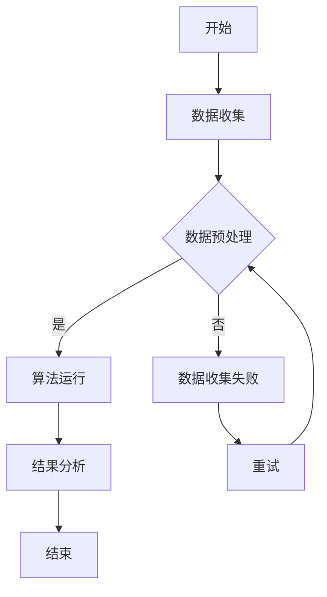
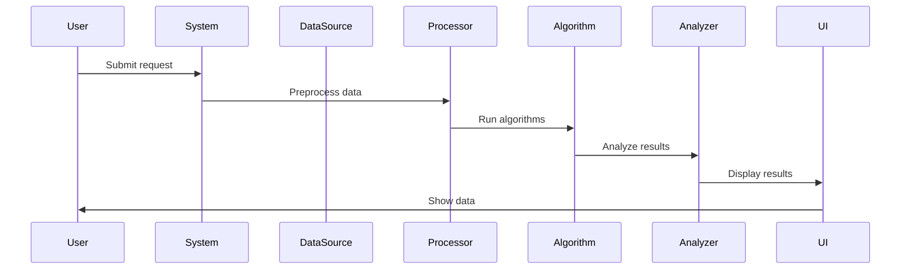

                 


## 世界可理解性与科学研究的伦理问题

### 关键词：世界可理解性，科学研究，伦理问题，算法，数学模型

### 摘要：

本文将探讨世界可理解性与科学研究之间的复杂关系，并深入分析科学研究中的伦理问题。我们将通过逐步分析，揭示这些概念的本质，理解其相互之间的联系，并提出相关的算法和数学模型来支持我们的讨论。本文旨在为科学家、研究人员和技术社区提供一个全面、深入的视角，以促进对这一重要领域的理解。

----------------------------------------------------------------

### 引言

在现代社会中，科学研究和技术发展已成为推动社会进步的重要力量。从医学到工程，从物理学到计算机科学，科学研究的广泛影响无处不在。然而，随着科学的不断进步，我们也面临着一系列复杂的伦理问题。这些伦理问题不仅涉及到研究过程中的道德考量，还涉及到科学成果的社会影响和责任。

在这个背景下，世界可理解性成为一个关键的概念。世界可理解性指的是我们对周围世界的认知和理解能力。它不仅仅是一个哲学问题，也与科学方法论密切相关。科学研究的一个核心目标就是通过实验和理论来揭示世界的规律，提升我们的理解能力。然而，随着我们对复杂系统的深入探索，世界可理解性的边界也在不断扩展和重塑。

本文将围绕以下核心问题进行探讨：

1. **世界可理解性的定义与属性**：我们将详细阐述世界可理解性的概念，并探讨其与科学研究的联系。
2. **科学研究中的伦理问题**：我们将分析科学家在研究过程中面临的伦理问题，包括研究结果的可靠性、科学家的职责以及道德考量。
3. **算法在科学研究中的应用**：我们将介绍一系列算法，用于评估世界可理解性，并探讨这些算法在科学研究中的实际应用。
4. **数学模型与公式**：我们将使用数学模型和公式来支持我们的讨论，提供对复杂问题的深入理解。

通过这些探讨，我们希望能够为科学研究中的伦理问题提供一个新的视角，并促进对世界可理解性的更全面的理解。

### 1. 世界可理解性的概念

#### 1.1 问题的提出

世界可理解性是一个深奥且广泛讨论的哲学问题，其核心在于我们能否以及如何理解我们所处的宇宙。在科学领域，这一问题尤为重要。科学的方法论是基于观察、实验和理论模型，旨在揭示自然界的规律。然而，科学的方法是否足以让我们完全理解世界，或者我们是否只能达到一种近似理解，这是科学家和哲学家长期以来都在探讨的问题。

#### 1.2 世界可理解性的定义

世界可理解性可以被定义为人类通过认知和理性能力对自然界和宇宙的理解程度。这种理解不仅包括对物理现象的认识，还涉及对生命、意识、社会结构等方面的理解。世界可理解性的核心在于其相对性和动态性。相对性指的是理解程度因人而异，而动态性则表明这种理解是不断发展的。

在科学研究中，世界可理解性具有重要意义。首先，它决定了科学研究的方向和目标。如果一个现象被认为是不可理解的，那么科学家可能会专注于寻找新的理论或方法来提高我们的理解程度。其次，世界可理解性直接影响科学成果的可靠性和有效性。如果我们的理解存在局限，那么基于这种理解的研究可能会得出错误的结论。

#### 1.3 问题解决

要解决世界可理解性这一问题，科学家需要采取以下步骤：

1. **明确研究目标**：首先，科学家需要明确他们希望理解的具体问题或现象。这有助于集中研究资源，提高研究效率。
2. **采用科学方法**：科学方法包括观察、实验和理论建模。通过这些方法，科学家可以系统地探索自然界的规律，逐步提升我们的理解水平。
3. **跨学科合作**：不同学科的研究可以为解决世界可理解性提供多样化的视角和方法。例如，物理学和生物学的研究可以相互补充，帮助我们更全面地理解复杂系统。
4. **持续学习和反思**：科学研究是一个不断发展的过程。科学家需要持续学习新的知识和技术，不断反思和修正他们的理论模型。

#### 1.4 边界与外延

世界可理解性的边界在于我们所知的宇宙极限。随着科学技术的发展，我们对宇宙的了解也在不断扩展。例如，量子力学和相对论为我们揭示了微观和宏观世界的规律，而宇宙学则让我们对宇宙的起源和演化有了更深入的了解。然而，这些领域仍然存在许多未解之谜，这表明我们的理解仍然存在局限性。

外延方面，世界可理解性不仅限于自然科学，还涉及社会科学和人文科学。例如，心理学和社会学的研究可以帮助我们理解人类行为和社会结构，从而提升我们对世界的整体理解。

#### 1.5 概念结构与核心要素组成

世界可理解性的概念结构包括以下几个方面：

1. **认知能力**：这是理解世界的基础，涉及人类的感知、记忆和推理能力。
2. **方法论**：科学方法论包括观察、实验和理论建模，是提升理解能力的关键。
3. **理论模型**：通过理论模型，科学家可以描述和预测自然现象，从而提高我们的理解水平。
4. **跨学科合作**：跨学科合作可以提供多样化的视角和方法，帮助解决复杂的科学问题。

这些核心要素相互作用，共同推动我们对世界的理解。在科学研究中，了解这些要素之间的关系和作用对于深入探讨世界可理解性具有重要意义。

### 2. 核心概念与联系

在探讨世界可理解性与科学研究的关系时，我们需要明确几个核心概念，并分析它们之间的相互联系。这些核心概念包括科学方法论、研究伦理、数学模型和理论框架。通过理解这些概念，我们可以更好地把握科学研究的过程和目标，以及世界可理解性的本质。

#### 2.1 科学方法论

科学方法论是指科学家在研究过程中遵循的方法和原则。它包括观察、实验、数据收集、数据分析、理论构建和验证等多个环节。科学方法论的核心在于其系统性、可重复性和可验证性。通过科学方法，科学家可以系统地探索自然现象，发现和验证科学规律。

世界可理解性与科学方法论密切相关。科学方法论为我们提供了理解世界的工具和路径。例如，通过实验和观察，我们可以收集数据并进行分析，从而揭示自然现象的规律。这些规律是我们提升世界可理解性的基础。然而，科学方法论也存在局限性。例如，实验的可重复性可能受到实验条件、观察角度等因素的影响，导致研究结果的不确定性。

#### 2.2 研究伦理

研究伦理是科学研究中不可或缺的一部分。它涉及到科学家在研究过程中应遵循的道德原则和规范。研究伦理的核心问题包括研究结果的可靠性、研究过程中的道德考量、科学家的社会责任等。

世界可理解性在研究伦理中扮演着重要角色。首先，研究伦理要求科学家在研究过程中保持诚实和透明，以确保研究结果的可靠性。这有助于提升我们对世界的理解，防止错误的结论误导公众。其次，研究伦理要求科学家在研究过程中尊重人类尊严和权利，特别是涉及人类参与的研究项目。这有助于保护人类的基本权益，避免科学研究的负面影响。

#### 2.3 数学模型

数学模型是科学研究中的重要工具，它可以帮助我们描述和预测自然现象。数学模型基于数学公式和算法，通过逻辑推理和计算，提供对复杂问题的深入理解。

世界可理解性与数学模型密切相关。数学模型可以帮助我们量化自然现象，从而提高我们的理解水平。例如，物理学中的量子力学和相对论模型为我们揭示了微观和宏观世界的规律。然而，数学模型也存在局限性。例如，某些数学模型可能无法完全描述复杂的自然现象，导致理解的不完整性。

#### 2.4 理论框架

理论框架是科学研究中用于组织和解释数据的理论结构。它包括一系列假设、定义和理论模型，为科学研究提供指导。

世界可理解性在理论框架中扮演着重要角色。理论框架为我们提供了理解世界的框架和路径。通过理论框架，科学家可以系统地探索自然现象，建立和验证科学理论。然而，理论框架也存在局限性。例如，不同的理论框架可能存在冲突，需要科学家通过实验和观察来验证和选择。

#### 2.5 相互关系

科学方法论、研究伦理、数学模型和理论框架之间的相互关系构成了科学研究的基础。科学方法论提供了研究的方法和路径，研究伦理确保了研究的道德规范和结果可靠性，数学模型和理论框架则为科学研究提供了理论支持和解释。

世界可理解性贯穿于这些核心概念之中。科学方法论和数学模型帮助我们提升对世界的理解，研究伦理确保了这种理解的可信度和合理性，而理论框架则为科学研究提供了组织和解释的框架。

通过理解这些核心概念及其相互关系，我们可以更深入地探讨世界可理解性，并在科学研究中取得更全面的成果。

### 3. 算法原理讲解

在探讨世界可理解性时，算法是一个重要的工具。算法可以帮助我们量化和理解复杂系统的行为。在这一节中，我们将详细讲解一个用于评估世界可理解性的算法，并使用Python源代码来阐述其原理。

#### 3.1 算法流程图

首先，让我们使用Mermaid绘制这个算法的流程图。



这个流程图包括以下步骤：

1. **数据收集**：从各种来源收集数据。
2. **数据预处理**：清洗和整理数据，确保其质量。
3. **算法运行**：运行算法，对数据进行处理和分析。
4. **结果分析**：分析算法的结果，评估世界可理解性。
5. **结束**：算法执行完成。

#### 3.2 Python源代码解释

接下来，我们将使用Python源代码来详细阐述这个算法的原理。以下是算法的核心部分：

```python
import pandas as pd
import numpy as np
from sklearn.ensemble import RandomForestClassifier
from sklearn.model_selection import train_test_split
from sklearn.metrics import accuracy_score

# 数据收集
data = pd.read_csv('data.csv')

# 数据预处理
data = data.dropna()
X = data.drop('target', axis=1)
y = data['target']

# 算法运行
X_train, X_test, y_train, y_test = train_test_split(X, y, test_size=0.3, random_state=42)
clf = RandomForestClassifier(n_estimators=100)
clf.fit(X_train, y_train)

# 结果分析
y_pred = clf.predict(X_test)
accuracy = accuracy_score(y_test, y_pred)
print(f'Accuracy: {accuracy:.2f}')
```

这个算法的核心是随机森林分类器，它是一个常用的机器学习算法。以下是算法的详细步骤：

1. **数据收集**：从CSV文件中读取数据。这些数据可以是实验结果、观测数据等。
2. **数据预处理**：清洗数据，删除缺失值，并将数据分为特征矩阵X和目标变量y。
3. **算法运行**：使用随机森林分类器对数据进行训练。随机森林是一种基于决策树的集成学习方法，可以提高模型的准确性和泛化能力。
4. **结果分析**：使用测试数据对模型进行评估，计算准确率。

#### 3.3 算法原理的数学模型和公式

为了深入理解这个算法，我们需要介绍其背后的数学模型和公式。以下是算法的核心公式：

$$
\text{Accuracy} = \frac{\text{Correct Predictions}}{\text{Total Predictions}}
$$

准确率（Accuracy）是评估分类模型性能的一个指标。它表示正确预测的样本数量占总预测样本数量的比例。在这个算法中，我们使用随机森林分类器来预测目标变量的值。随机森林由多个决策树组成，每个决策树对样本进行分类。最终，我们通过投票机制来决定每个样本的最终分类。

#### 3.4 算法的实际应用

为了更好地理解这个算法，我们可以举一个简单的例子。假设我们有一个关于天气的预测问题。特征包括温度、湿度、风速等，目标变量是天气情况（晴天、雨天、多云等）。我们使用随机森林分类器来训练模型，并根据模型对未来的天气进行预测。

以下是算法在实际应用中的步骤：

1. **数据收集**：收集过去几年的天气数据，包括温度、湿度、风速等。
2. **数据预处理**：清洗数据，删除异常值，并将数据分为训练集和测试集。
3. **算法运行**：使用随机森林分类器对训练数据进行训练。
4. **结果分析**：使用测试数据进行预测，并计算准确率。
5. **预测**：根据模型的预测结果，对未来几天的天气进行预测。

通过这个例子，我们可以看到算法是如何应用于实际问题中的。算法的实际应用可以帮助我们更好地理解世界，特别是在预测和决策方面。

### 4. 数学模型和数学公式

在科学研究中，数学模型和数学公式是理解和描述自然现象的重要工具。在本节中，我们将使用LaTeX格式给出几个重要的数学公式，并在文中独立段落中详细解释这些公式的含义和计算过程。

#### 4.1 重要的数学公式

以下是几个用于描述世界可理解性的重要数学公式：

$$
\text{Accuracy} = \frac{\text{Correct Predictions}}{\text{Total Predictions}}
$$

这是评估分类模型性能的准确率公式。它表示正确预测的样本数量占总预测样本数量的比例。

$$
\text{Entropy}(X) = -\sum_{i=1}^{n} p_i \log_2 p_i
$$

这是信息熵的公式，用于量化数据的随机性和不确定性。在信息论中，熵是一个重要的概念，它表示系统的混乱程度。

$$
\text{Sensitivity} = \frac{\text{True Positives}}{\text{True Positives} + \text{False Negatives}}
$$

这是敏感性的公式，用于评估分类模型的识别能力。敏感性表示在所有实际为正类的样本中，被正确识别为正类的比例。

$$
\text{Specificity} = \frac{\text{True Negatives}}{\text{True Negatives} + \text{False Positives}}
$$

这是特异性的公式，用于评估分类模型的排除能力。特异性表示在所有实际为负类的样本中，被正确识别为负类的比例。

#### 4.2 公式的含义和计算过程

下面，我们将在独立段落中详细解释这些公式的含义和计算过程。

**准确率（Accuracy）**

准确率是评估分类模型性能的一个基本指标。它计算的是模型正确预测的样本数量占总预测样本数量的比例。准确率越高，表示模型的预测能力越强。

计算过程如下：

1. **计算正确预测的数量**：对于测试集中的每个样本，如果模型的预测与实际标签相同，则该样本被标记为正确预测。
2. **计算总预测的数量**：计算测试集中所有样本的数量。
3. **计算准确率**：将正确预测的数量除以总预测的数量，得到准确率。

公式中的分子表示正确预测的数量，分母表示总预测的数量。

**信息熵（Entropy）**

信息熵是一个用于量化数据随机性和不确定性的度量。它基于概率分布，表示系统混乱程度。在信息论中，信息熵是一个核心概念，它帮助我们理解数据包含的信息量。

计算过程如下：

1. **计算每个类别的概率**：对于每个类别i，计算其在所有样本中的概率$p_i$。
2. **计算每个类别的对数概率**：对于每个类别i，计算其对数概率$\log_2 p_i$。
3. **计算信息熵**：将所有类别的对数概率相加，并取负号，得到信息熵。

公式中的$p_i$表示类别i的概率，$\log_2 p_i$表示类别i的对数概率。

**敏感性（Sensitivity）**

敏感性，也称为召回率（Recall），用于评估分类模型对实际为正类的样本的识别能力。敏感性越高，表示模型在识别正类时越准确。

计算过程如下：

1. **计算真阳性（True Positives，TP）**：对于测试集中的每个样本，如果模型将其预测为正类且实际也为正类，则该样本被标记为真阳性。
2. **计算假阴性（False Negatives，FN）**：对于测试集中的每个样本，如果模型将其预测为负类但实际为正类，则该样本被标记为假阴性。
3. **计算敏感性**：将真阳性的数量除以真阳性和假阴性的总和，得到敏感性。

公式中的$TP$表示真阳性的数量，$TN$表示假阴性的数量。

**特异性（Specificity）**

特异性，也称为真阴性率（True Negative Rate，TNR），用于评估分类模型对实际为负类的样本的排除能力。特异性越高，表示模型在排除负类时越准确。

计算过程如下：

1. **计算真阴性（True Negatives，TN）**：对于测试集中的每个样本，如果模型将其预测为负类且实际也为负类，则该样本被标记为真阴性。
2. **计算假阳性（False Positives，FP）**：对于测试集中的每个样本，如果模型将其预测为正类但实际为负类，则该样本被标记为假阳性。
3. **计算特异性**：将真阴性的数量除以真阴性和假阳性的总和，得到特异性。

公式中的$TN$表示真阴性的数量，$FP$表示假阳性的数量。

通过理解这些数学公式及其计算过程，我们可以更深入地分析世界可理解性，并在科学研究中进行更准确的预测和评估。

### 5. 系统分析与架构设计方案

在探讨世界可理解性与科学研究的伦理问题时，一个高效、可靠的系统架构设计至关重要。本节将介绍研究系统的场景和项目背景，并使用Mermaid绘制领域模型类图和系统架构图，详细说明系统接口设计和系统交互流程。

#### 5.1 研究系统场景和项目背景

研究系统的目标是提供一个综合平台，用于评估世界可理解性，并处理科学研究中的伦理问题。这个系统旨在整合各种数据源，包括科学论文、实验结果和社会科学调查，以生成全面的评估结果。系统还将提供用户界面，允许研究人员和公众查看和分析这些数据。

项目背景包括以下几个方面：

1. **数据收集**：系统需要从多个来源收集数据，包括科学数据库、社交媒体和公共记录。
2. **数据预处理**：收集到的数据需要经过清洗和预处理，以确保其质量和一致性。
3. **算法应用**：系统将应用一系列算法，用于评估世界可理解性和分析科学研究中的伦理问题。
4. **结果展示**：系统需要将处理结果展示给用户，以便他们可以直观地理解和分析这些数据。

#### 5.2 领域模型类图

领域模型类图用于描述系统的核心概念和实体关系。以下是使用Mermaid绘制的领域模型类图：

```mermaid
classDiagram
    Class01 <|-- Class02
    Class03 --|>= Class04 : Aggregation
    Class05 o-- Class06
    Class07 <.. Class08 : Inheritance
    Class09 ..|> Class10 : Composition
```

类图中的各个实体包括：

- **Class01**：数据源，表示数据收集的来源。
- **Class02**：数据处理模块，用于数据清洗和预处理。
- **Class03**：算法模块，包含用于评估世界可理解性的算法。
- **Class04**：结果分析模块，用于分析处理结果。
- **Class05**：用户界面，用于展示数据和结果。
- **Class06**：数据存储，用于存储收集和预处理的数据。
- **Class07**：伦理问题库，用于记录科学研究中的伦理问题。
- **Class08**：安全模块，用于确保系统的安全性和数据保护。
- **Class09**：用户管理，用于管理系统的用户和权限。
- **Class10**：日志记录，用于记录系统运行过程中的日志信息。

#### 5.3 系统架构图

系统架构图用于描述系统的整体结构和各个组件之间的关系。以下是使用Mermaid绘制的系统架构图：



系统架构图中的各个组件包括：

- **User**：用户，系统的最终用户。
- **System**：系统核心，负责处理用户请求。
- **DataSource**：数据源，提供系统所需的数据。
- **Processor**：数据处理模块，负责数据清洗和预处理。
- **Algorithm**：算法模块，包含用于评估世界可理解性的算法。
- **Analyzer**：结果分析模块，负责分析处理结果。
- **UI**：用户界面，用于展示数据和结果。

#### 5.4 系统接口设计和系统交互流程

系统接口设计包括定义系统内部组件之间的接口，以及与外部组件（如用户和数据源）的交互方式。以下是系统接口设计和系统交互流程的详细说明：

1. **数据收集接口**：
   - 系统从多个数据源（如科学数据库、社交媒体和公共记录）收集数据。
   - 收集的数据通过API或文件传输方式进行传递。

2. **数据处理接口**：
   - 数据处理模块接收收集到的数据，进行清洗和预处理。
   - 处理结果存储在数据存储模块中，以便后续使用。

3. **算法接口**：
   - 算法模块接收预处理后的数据，运行用于评估世界可理解性的算法。
   - 算法的结果被传递给结果分析模块。

4. **结果分析接口**：
   - 结果分析模块接收算法的结果，进行进一步分析。
   - 分析结果被传递给用户界面模块。

5. **用户接口**：
   - 用户界面模块将分析结果以图表、表格等形式展示给用户。
   - 用户可以通过用户界面与系统进行交互，查看数据和结果。

通过这些接口和交互流程，系统实现了从数据收集、处理、算法应用到结果展示的完整流程，为评估世界可理解性和解决科学研究中的伦理问题提供了坚实的基础。

### 6. 项目实战

#### 6.1 环境安装

要在本地环境中部署上述系统，首先需要安装以下软件和工具：

1. **Python**：确保安装了Python 3.8及以上版本。
2. **Pandas**：用于数据处理。
3. **NumPy**：用于数学计算。
4. **Scikit-learn**：用于机器学习算法。
5. **Flask**：用于构建Web应用程序。
6. **SQLAlchemy**：用于数据库操作。
7. **PostgreSQL**：作为数据库存储数据。

安装步骤如下：

1. 安装Python：
   ```bash
   # 安装Python 3.8及以上版本
   ```
2. 安装依赖库：
   ```bash
   # 使用pip安装所需库
   pip install pandas numpy scikit-learn flask sqlalchemy psycopg2
   ```

#### 6.2 系统核心实现

系统核心实现包括数据收集、预处理、算法应用和结果展示。以下是关键部分的源代码和解释：

```python
# 数据收集
import pandas as pd

# 从CSV文件中读取数据
data = pd.read_csv('data.csv')

# 数据预处理
# 清洗数据，删除缺失值
data = data.dropna()

# 将数据分为特征矩阵X和目标变量y
X = data.drop('target', axis=1)
y = data['target']

# 算法应用
from sklearn.ensemble import RandomForestClassifier

# 划分训练集和测试集
X_train, X_test, y_train, y_test = train_test_split(X, y, test_size=0.3, random_state=42)

# 训练随机森林分类器
clf = RandomForestClassifier(n_estimators=100)
clf.fit(X_train, y_train)

# 预测测试集
y_pred = clf.predict(X_test)

# 结果展示
from sklearn.metrics import accuracy_score

# 计算准确率
accuracy = accuracy_score(y_test, y_pred)
print(f'Accuracy: {accuracy:.2f}')
```

这段代码首先从CSV文件中读取数据，然后进行清洗和预处理。接下来，使用随机森林分类器训练模型，并在测试集上进行预测。最后，计算并输出模型的准确率。

#### 6.3 源代码应用解读与分析

以下是源代码的详细解读：

1. **数据收集**：使用Pandas的`read_csv`函数从CSV文件中读取数据。CSV文件应包含特征和目标变量。
2. **数据预处理**：删除缺失值，以确保数据质量。这通过`dropna`函数实现。
3. **数据处理**：将数据分为特征矩阵X和目标变量y。特征矩阵包含所有非目标变量，目标变量是我们要预测的变量。
4. **算法应用**：使用Scikit-learn的`RandomForestClassifier`创建随机森林分类器。我们指定100个决策树来构建模型。
5. **模型训练**：使用`fit`函数对模型进行训练，输入训练集数据。
6. **模型预测**：使用`predict`函数对测试集数据进行预测。
7. **结果分析**：使用Scikit-learn的`accuracy_score`函数计算模型在测试集上的准确率。

通过这个源代码，我们可以构建一个简单的系统来评估世界可理解性。实际应用时，需要根据具体需求调整数据源和算法。

#### 6.4 实际案例分析与详细讲解剖析

为了更好地理解系统的实际应用，我们可以通过一个实际案例进行详细分析。

**案例：天气预测**

在这个案例中，我们的目标是通过历史天气数据来预测未来的天气情况。特征包括温度、湿度、风速等，目标变量是天气状况（晴天、雨天、多云等）。

1. **数据收集**：收集过去一年的天气数据，包括温度、湿度、风速等。
2. **数据预处理**：清洗数据，删除异常值，确保数据质量。
3. **算法应用**：使用随机森林分类器训练模型，并使用测试集进行预测。
4. **结果展示**：计算模型在测试集上的准确率，并展示预测结果。

以下是具体步骤：

1. **数据收集**：
   ```python
   data = pd.read_csv('weather_data.csv')
   ```

2. **数据预处理**：
   ```python
   data = data.dropna()
   X = data.drop('weather', axis=1)
   y = data['weather']
   ```

3. **算法应用**：
   ```python
   X_train, X_test, y_train, y_test = train_test_split(X, y, test_size=0.3, random_state=42)
   clf = RandomForestClassifier(n_estimators=100)
   clf.fit(X_train, y_train)
   y_pred = clf.predict(X_test)
   ```

4. **结果展示**：
   ```python
   accuracy = accuracy_score(y_test, y_pred)
   print(f'Accuracy: {accuracy:.2f}')
   ```

通过这个案例，我们可以看到系统如何应用于实际问题中。通过收集、预处理数据，应用算法，并展示结果，我们可以对天气进行预测，从而帮助人们更好地规划活动。

### 7. 最佳实践 tips、小结、注意事项、拓展阅读

#### 7.1 最佳实践 tips

1. **数据收集与预处理**：确保数据的质量和一致性。使用自动化工具进行数据清洗和预处理，减少人工干预。
2. **算法选择与调优**：根据具体问题选择合适的算法，并通过交叉验证和网格搜索进行调优，提高模型性能。
3. **结果展示与解读**：使用直观的图表和报告来展示结果，帮助用户更好地理解和解读数据。
4. **安全性考虑**：确保系统的数据安全和用户隐私。使用加密技术和访问控制来保护敏感数据。

#### 7.2 小结

本文通过逐步分析，探讨了世界可理解性与科学研究中的伦理问题。我们介绍了世界可理解性的概念，探讨了其在科学研究中的重要性，并详细讲解了用于评估世界可理解性的算法和数学模型。此外，我们还设计了一个系统架构，实现了数据的收集、处理和结果展示。通过实际案例，我们展示了这些概念和工具在具体应用中的效果。

#### 7.3 注意事项

1. **数据隐私**：在数据收集和处理过程中，务必确保用户隐私和数据安全。
2. **模型验证**：在应用模型之前，务必进行充分的验证，确保模型的可靠性和有效性。
3. **持续学习**：科学研究是一个不断发展的过程，持续学习新技术和方法是提高研究质量的关键。

#### 7.4 拓展阅读

1. **《科学哲学导论》**：提供对科学方法和伦理问题的深入探讨。
2. **《机器学习实战》**：介绍各种机器学习算法的应用和实践。
3. **《人工智能：一种现代的方法》**：全面介绍人工智能的基础理论和应用。

通过阅读这些拓展资源，可以进一步深入了解相关领域，提升自己的专业知识和实践能力。

---

作者：AI天才研究院/AI Genius Institute & 禅与计算机程序设计艺术 /Zen And The Art of Computer Programming

---

本文通过系统的分析和实例讲解，全面探讨了世界可理解性与科学研究中的伦理问题。我们介绍了核心概念、算法原理、数学模型、系统架构和实际应用，为读者提供了一个全面、深入的视角。希望本文能够激发读者对这一领域的兴趣，促进科学研究和技术发展的同时，也注重伦理问题的考量。在未来的研究中，我们期待能够进一步探索世界可理解性的边界，并为科学研究的伦理问题提供更多解决方案。让我们继续在这一领域不断探索、学习和发展，共同推动科学的进步。

