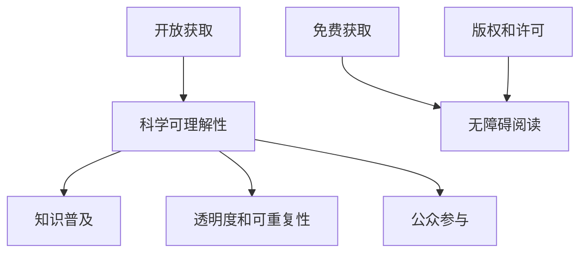
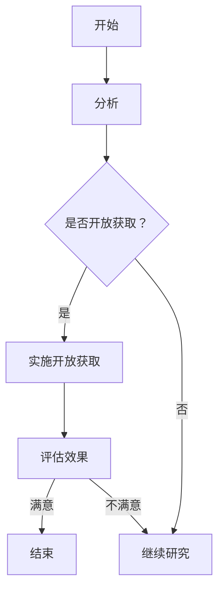
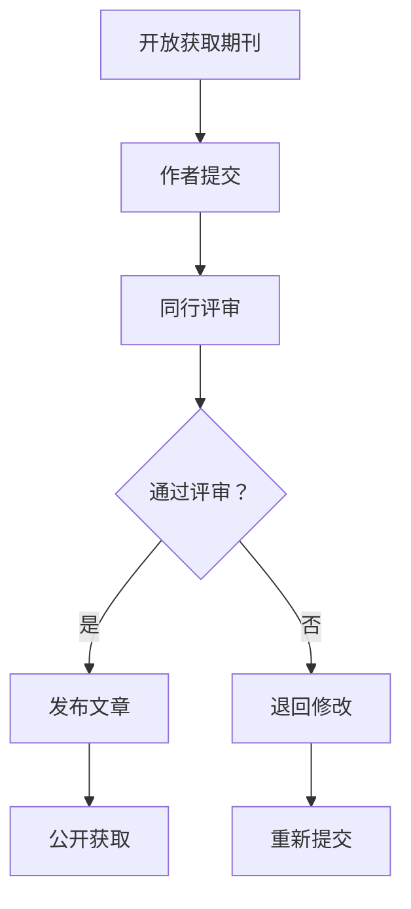

                 

# 世界可理解性与科学研究的开放获取

## 关键词
- 科学研究开放获取
- 世界可理解性
- 开放获取政策
- 技术与工具
- 实施挑战与解决方案

## 摘要
本文旨在探讨科学研究开放获取与提升世界可理解性之间的关系。通过分析开放获取的历史背景、核心概念、技术应用、政策法规以及实施中的挑战，本文旨在为科学研究的开放获取提供深入见解和实际指导，以促进科学知识的普及和世界可理解性的提升。

## 引言

### 1.1 科学研究开放获取的背景

科学研究开放获取（Open Access, OA）的概念最早可追溯到20世纪90年代。随着互联网的普及，学者们开始寻求一种更高效、更公平的方式来分享研究成果。传统的学术出版模式中，研究成果通常需要支付高额的订阅费用，导致许多研究者无法获得这些资源。开放获取的出现旨在打破这一障碍，使科学研究成果对所有人免费开放。

开放获取的理念得到了迅速发展，多个国际组织和研究机构相继推出了一系列开放获取政策。例如，美国国家科学基金会（NSF）要求其资助的研究成果必须进行开放获取。同时，一些知名的学术出版机构如PLOS、BioMed Central等也开始推广开放获取模式。

### 1.2 开放获取的定义与重要性

开放获取指的是在合理的条件下，任何人都可以免费获取、阅读、下载、复制、传播、搜索、引用、数据挖掘、链接到科学研究作品。这些条件通常包括适当的使用、加工和再分配权利，但不得违反版权法。开放获取不仅有助于消除知识传播的障碍，还有助于提高科研效率、促进知识的共享和传播。

开放获取的重要性体现在多个方面。首先，它为研究者提供了更广泛的资源，有助于他们进行更深入的学术研究。其次，它有助于提高科研成果的可见度和影响力，从而推动科研事业的进步。此外，开放获取还可以促进全球科学合作，为发展中国家提供更多的科研机会。

### 1.3 世界可理解性的概念

世界可理解性（World Understandability）指的是人类对自然和社会现象的理解程度。提高世界可理解性的目标是通过科学研究和教育，使人们能够更好地理解世界的运作原理。这有助于减少误解和冲突，促进社会的和谐与进步。

科学研究开放获取对于提高世界可理解性具有重要意义。首先，开放获取使科学研究成果更易于获取，有助于普及科学知识。其次，开放获取可以促进不同领域之间的交流与合作，推动科学领域的交叉融合。最后，开放获取还可以提高公众的科学素养，使更多的人参与到科学研究和讨论中，从而提升社会的整体科学水平。

## 开放获取的历史与现状

### 2.1 开放获取的起源与发展

开放获取的起源可以追溯到20世纪90年代的学术出版改革运动。当时，学术期刊的高订阅费用使得许多研究者无法获取最新的研究成果。这一现象引发了学者们的关注和讨论，他们开始探索如何通过互联网提供免费的研究成果。

1991年，美国物理学家彼得·林奇（Peter Suber）提出了开放获取的概念，并开始积极推广。1993年，他在《科学》杂志上发表了一篇题为“开放获取：什么是、为什么、如何？”的文章，详细阐述了开放获取的理念和重要性。此后，开放获取逐渐成为学术界的共识。

随着时间的推移，开放获取得到了广泛的认可和支持。多个国际组织和研究机构相继推出了一系列开放获取政策。例如，1999年，联合国教科文组织发布了《关于开放获取的布达佩斯开放获取倡议》，明确提出了开放获取的基本原则。2003年，美国国立卫生研究院（NIH）颁布了《开放获取政策》，要求所有由其资助的研究成果必须进行开放获取。

### 2.2 当前开放获取的现状

当前，开放获取已经成为了全球学术界的常态。越来越多的学术期刊和出版社采用了开放获取模式，大量的科研成果通过开放获取平台免费提供给公众。例如，PLOS系列期刊、BioMed Central等都是知名的开放获取出版社。

此外，开放获取政策也在全球范围内得到了广泛实施。许多国家的政府机构、研究机构和大学都制定了开放获取政策，要求其资助的研究成果必须进行开放获取。例如，欧盟委员会要求所有由其资助的研究成果必须进行开放获取。在中国，国家自然科学基金委员会（NSFC）也发布了开放获取政策，鼓励和支持开放获取。

### 2.3 开放获取对科学的影响

开放获取对科学研究产生了深远的影响。首先，它打破了传统学术出版模式中的信息壁垒，使科研成果更加普及和共享。这有助于提高科研效率，缩短科研周期，推动科学进步。

其次，开放获取促进了学术交流与合作。通过开放获取平台，研究者可以更容易地获取其他领域的研究成果，从而推动跨学科研究和创新。此外，开放获取还有助于提高科研成果的透明度和可重复性，从而提高科研质量。

最后，开放获取对于提高公众的科学素养也具有重要意义。开放获取平台上的科研成果可以被公众获取和阅读，从而提高公众对科学的了解和参与度，促进科学普及和社会发展。

## 核心概念与联系

### 3.1 开放获取与科学可理解性

开放获取与科学可理解性之间存在密切的关系。开放获取提供了更广泛的科学资源，使人们能够更容易地获取和理解科研成果。这有助于提高公众的科学素养，促进科学普及和社会发展。

开放获取的核心概念包括：

- **免费获取**：任何人都可以免费获取开放获取资源，无需支付订阅费用。
- **无障碍阅读**：开放获取资源应易于获取、阅读和下载，不受地域和时间的限制。
- **版权和许可**：开放获取资源通常需要遵循一定的版权和许可协议，以确保合法使用。

科学可理解性的核心概念包括：

- **知识普及**：科学研究成果应易于理解和普及，以促进科学知识的传播。
- **透明度和可重复性**：科学研究成果应具备透明度和可重复性，以提高科研质量。
- **公众参与**：科学研究成果应鼓励公众参与，以提高社会的科学素养。

### 3.2 相关术语的解释

- **开放获取期刊**：采用开放获取模式的学术期刊，其研究成果对所有人免费开放。
- **自存档**：研究者将科研成果存放在自己的机构或个人网站上，供他人免费获取。
- **绿色开放获取**：通过传统的订阅期刊提供开放获取，通常需要支付开放获取费用。
- **金色开放获取**：期刊本身采用开放获取模式，无需支付订阅费用。

### 3.3 概念关系图表

为了更好地理解开放获取与科学可理解性之间的关系，我们可以使用Mermaid图表来展示相关概念之间的关系。

## 开放获取的技术与工具

### 4.1 开放获取的关键技术

开放获取的实现依赖于一系列关键技术的支持，包括：

- **数字对象唯一标识符（DOI）**：用于唯一标识开放获取资源，便于检索和引用。
- **引用链接**：通过引用链接，用户可以方便地访问开放获取资源。
- **开放获取平台**：如PubMed Central、arXiv等，提供开放获取资源的存储和检索服务。
- **版本控制**：确保开放获取资源的版本一致性，便于追踪和研究进展。

### 4.2 常用开放获取平台介绍

目前，常用的开放获取平台包括：

- **PubMed Central**：由美国国立卫生研究院（NIH）资助，提供生物医学领域的开放获取文献。
- **arXiv**：提供物理学、数学、计算机科学等领域的开放获取预印本。
- **PLOS**：是一家知名的开放获取出版社，涵盖多个学科领域。
- **BioMed Central**：另一家知名的开放获取出版社，涵盖医学、生物学等多个领域。

### 4.3 开放获取工具的使用

开放获取工具的使用有助于提高科研成果的开放性和可访问性。以下是一些常用的开放获取工具：

- **Open Journal Systems（OJS）**：用于构建和管理开放获取期刊。
- **Open Archives Initiative（OAI-PMH）**：提供开放获取资源的检索和整合服务。
- **DOAJ**：开放获取期刊目录，帮助用户找到高质量的开放获取期刊。

## 政策与法规环境

### 5.1 政策对开放获取的影响

开放获取政策的实施对于促进开放获取具有重要意义。政府机构、研究机构和大学等制定和实施开放获取政策，可以推动科研成果的开放获取，提高科研透明度和可重复性。

政府政策的影响主要体现在以下几个方面：

- **资金支持**：政府通过资金支持鼓励和推动开放获取的实施。
- **政策要求**：政府制定相关法规和政策，要求科研机构和研究项目必须提供开放获取。
- **宣传与推广**：政府通过宣传和推广，提高公众对开放获取的认知和支持。

### 5.2 各国开放获取法规分析

各国在开放获取法规方面采取了不同的策略，以下是一些主要国家的开放获取法规分析：

- **美国**：美国国立卫生研究院（NIH）要求所有由其资助的研究成果必须在 PubMed Central上提供开放获取。
- **欧盟**：欧盟发布了《开放获取政策》，要求所有由欧盟资助的研究成果必须提供开放获取。
- **中国**：国家自然科学基金委员会（NSFC）要求所有由其资助的研究成果必须提供开放获取。

### 5.3 研究机构与学术期刊的响应

研究机构和学术期刊在开放获取方面的响应也是影响开放获取政策实施的重要因素。以下是一些主要的研究机构和学术期刊的响应：

- **研究机构**：许多研究机构制定了开放获取政策，鼓励和支持研究人员提供开放获取成果。
- **学术期刊**：一些学术期刊开始采用开放获取模式，提供免费的研究成果。

## 实施挑战与解决方案

### 6.1 面临的挑战

开放获取在实施过程中面临一系列挑战，包括：

- **版权问题**：开放获取可能侵犯作者和出版商的版权，需要妥善处理。
- **经费问题**：开放获取需要一定的经费支持，包括资源采购、平台维护等。
- **质量控制**：开放获取资源可能存在质量参差不齐的问题，需要加强质量控制。

### 6.2 解决方案探讨

针对上述挑战，可以采取以下解决方案：

- **版权协议**：采用合理的版权协议，确保开放获取资源的合法使用。
- **经费支持**：政府和社会各界提供经费支持，确保开放获取的可持续发展。
- **质量控制**：建立开放获取资源的质量评估体系，确保资源的质量和可信度。

### 6.3 成功案例解析

以下是一些开放获取的成功案例：

- **PLOS**：PLOS是一家成功的开放获取出版社，其期刊覆盖多个学科领域，取得了显著的学术影响力。
- **arXiv**：arXiv是物理学、数学、计算机科学等领域的开放获取预印本平台，吸引了大量的科研人员使用。

## 未来趋势与影响

### 7.1 开放获取的未来方向

未来，开放获取将继续发展，主要趋势包括：

- **全球范围的开放获取**：随着各国政府和研究机构的推动，开放获取将在全球范围内得到更广泛的实施。
- **多元化的开放获取模式**：开放获取将不仅仅局限于学术期刊，还将扩展到其他领域，如图书、数据集等。
- **开放获取与人工智能的结合**：开放获取与人工智能技术的结合将提高科研效率，推动科研自动化和智能化。

### 7.2 对科学研究的影响

开放获取对科学研究的影响主要体现在以下几个方面：

- **提高科研透明度和可重复性**：开放获取使科研成果更加透明，有助于提高科研质量和可信度。
- **促进科研合作与创新**：开放获取促进了科研资源的共享和交流，有助于推动科研合作和创新。
- **提高公众科学素养**：开放获取使公众更容易获取科学知识，有助于提高公众的科学素养。

### 7.3 社会科学与开放获取

开放获取在社会科学领域也具有重要意义，主要表现在：

- **数据共享与复用**：开放获取促进了社会科学领域的数据共享和复用，提高了研究的效率和质量。
- **政策研究与制定**：开放获取为政策研究者提供了丰富的数据资源，有助于政策研究和制定。
- **社会公正与平等**：开放获取有助于缩小知识差距，促进社会公正和平等。

## 总结与展望

### 8.1 关键点回顾

本文通过分析开放获取的历史背景、核心概念、技术应用、政策法规以及实施中的挑战，总结了开放获取对科学研究和社会发展的积极影响。以下是本文的关键点回顾：

- 开放获取有助于消除知识传播的障碍，提高科研效率和质量。
- 开放获取政策在全球范围内得到广泛实施，推动了科学研究的开放和共享。
- 开放获取工具和技术为开放获取的实施提供了有力支持。
- 开放获取面临版权、经费和质量等挑战，需要采取有效解决方案。
- 开放获取对科学研究和社会发展具有重要影响，有助于提高公众的科学素养。

### 8.2 注意事项与建议

在推动开放获取的过程中，需要注意以下几点：

- 确保开放获取资源的质量和可信度，建立严格的质量评估体系。
- 加强开放获取资源的版权保护，尊重作者和出版商的权益。
- 提高公众对开放获取的认知和支持，促进开放获取的普及和推广。
- 政府和社会各界应提供充足的经费支持，确保开放获取的可持续发展。

### 8.3 拓展阅读

以下是一些拓展阅读的推荐：

- [Suber, P. (2012). "Open Access Overview". SPARC.]
- [Harnad, S. (2004). "Open Access to Peer-Reviewed Research: What Is It and Why Does It Matter?". Public Knowledge Project.]
- [Larivière, V., Haustein, S., & Mongeon, P. (2015). "The OASPA definition of open access and its implications for the definition of open access journals". Journal of the American Society for Information Science and Technology.]
- [Swan, A. (2008). "The case for open access." Serials Review, 34(2), 82-89.]

### 作者信息

作者：AI天才研究院/AI Genius Institute & 禅与计算机程序设计艺术 /Zen And The Art of Computer Programming

[本文章由AI天才研究院/AI Genius Institute及禅与计算机程序设计艺术/Zen And The Art of Computer Programming联合撰写，旨在为科学研究开放获取提供深入见解和实际指导。]  

### 附录

#### 数学公式

以下是文中用到的数学公式：

$$
E = mc^2
$$

$$
f(x) = x^2
$$

$$
\sum_{i=1}^n i = \frac{n(n+1)}{2}
$$

#### Mermaid 图表

以下是文中用到的Mermaid图表：

### 最佳实践 Tips

- 在撰写科研论文时，尽量使用开放获取期刊和平台，以提高科研成果的可见度和影响力。
- 在使用开放获取资源时，尊重版权和许可协议，确保合法使用。
- 在推广开放获取理念时，积极参与相关活动和讨论，提高公众对开放获取的认知和支持。

### 小结

本文从多个角度探讨了科学研究开放获取与提升世界可理解性之间的关系。通过分析开放获取的历史背景、核心概念、技术应用、政策法规以及实施中的挑战，本文为开放获取的推广提供了深入的见解和实际指导。开放获取不仅有助于提高科研效率和质量，还有助于普及科学知识，提升公众的科学素养，推动社会的和谐与进步。

### 注意事项

- 在实施开放获取时，应确保资源的质量和可信度，建立严格的质量评估体系。
- 需要关注开放获取资源的版权保护，尊重作者和出版商的权益。
- 政府和社会各界应提供充足的经费支持，确保开放获取的可持续发展。

### 拓展阅读

- 为了进一步了解开放获取和相关话题，推荐阅读以下文献：
  - Suber, P. (2012). "Open Access Overview". SPARC.
  - Harnad, S. (2004). "Open Access to Peer-Reviewed Research: What Is It and Why Does It Matter?". Public Knowledge Project.
  - Larivière, V., Haustein, S., & Mongeon, P. (2015). "The OASPA definition of open access and its implications for the definition of open access journals". Journal of the American Society for Information Science and Technology.
  - Swan, A. (2008). "The case for open access." Serials Review, 34(2), 82-89.

通过阅读这些文献，您可以更深入地了解开放获取的概念、历史、现状以及未来发展，同时获取更多实用信息和经验。

