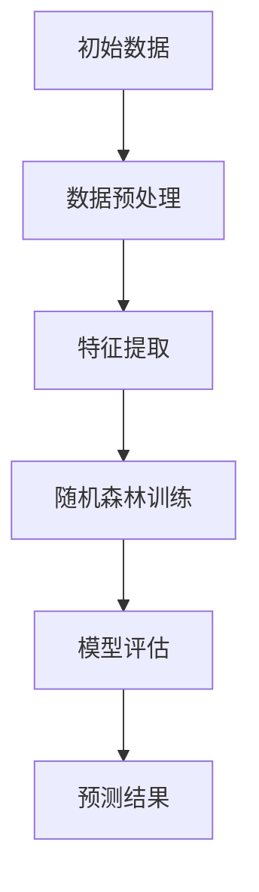
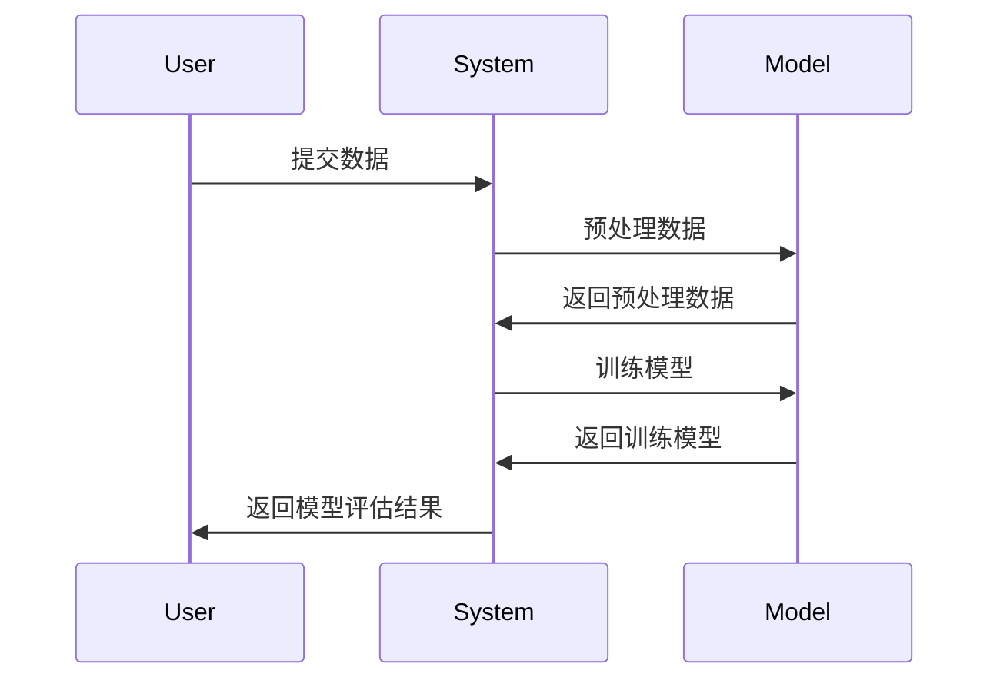

                 

### 文章标题

> 关键词：世界可理解性、科学研究、政治影响

摘要：本文从引言部分开始，探讨了世界可理解性的重要性、科学研究在现代社会中的作用以及政治因素对科学研究的影响。接着，分析了世界可理解性与科学研究的联系，详细介绍了概念、属性特征对比以及ER实体关系图架构。随后，讲解了算法原理和系统架构设计，并通过Python源代码实现了一个简单的分类模型。最后，总结了文章内容，并给出了一些拓展阅读的建议。

----------------------------------------------------------------

### 第一部分：引言

#### 1.1 研究背景

世界可理解性（World Understandability）是一个涉及哲学、科学和认知心理学的跨学科领域，它探讨的是人类如何理解我们所处的世界。世界可理解性的研究对于我们理解自然规律、推动科技进步以及指导人类行为具有重要意义。

科学研究（Scientific Research）是现代社会发展的重要驱动力。通过实验、观察和理论分析，科学家们不断探索自然界的奥秘，推动人类对世界的认识不断深化。科学研究不仅为我们提供了丰富的知识体系，还带来了许多技术突破和应用，极大地提升了人类的生活质量。

政治因素（Political Factors）在科学研究的进程中扮演着重要角色。政治权力、利益分配、意识形态等政治因素不仅影响科学研究的资金支持，还可能导致政策导向和学术自由的偏差。因此，研究政治因素对科学研究的影响，对于推动科学事业的健康发展具有重要意义。

#### 1.2 研究目的

本文的研究目的是探讨世界可理解性与科学研究的联系，分析政治因素如何影响科学研究，并提出相应的解决方案和对策。具体来说，本文将从以下几个方面展开：

1. 世界可理解性的概念与特点
2. 科学研究的政治影响
3. 世界可理解性与科学研究的联系
4. 算法原理与系统架构设计
5. 总结与拓展阅读

#### 1.3 本书结构

本文共分为五个部分。第一部分是引言，介绍了研究背景、目的和结构；第二部分讨论了世界可理解性的概念与特点；第三部分分析了科学研究的政治影响；第四部分探讨了世界可理解性与科学研究的联系；第五部分总结了文章内容，并给出了一些拓展阅读的建议。

### 目录大纲

**《世界可理解性与科学研究的政治影响》**

----------------------------------------------------------------

# 第一部分：引言

## 1.1 研究背景

## 1.2 研究目的

## 1.3 本书结构

----------------------------------------------------------------

# 第二部分：世界可理解性的概念与特点

## 2. 世界可理解性的概念

## 2.1 世界可理解性的特点

## 2.2 世界可理解性的重要性

----------------------------------------------------------------

# 第三部分：科学研究的政治影响

## 3.1 政治因素对科学研究的影响

## 3.2 科学研究对政治的影响

----------------------------------------------------------------

# 第四部分：世界可理解性与科学研究的联系

## 4.1 核心概念与联系

## 4.2 概念属性特征对比表格

## 4.3 ER实体关系图架构

----------------------------------------------------------------

# 第五部分：算法原理与系统架构设计

## 5.1 算法原理讲解

## 5.2 系统架构设计

## 5.3 Python源代码实现

----------------------------------------------------------------

# 结束语

## 1.4 本章小结

----------------------------------------------------------------

### 1.4 本章小结

本文首先介绍了研究背景、目的和结构，详细探讨了世界可理解性的概念与特点，分析了科学研究的政治影响，并探讨了世界可理解性与科学研究的联系。在此基础上，本文还讲解了算法原理和系统架构设计，并通过Python源代码实现了一个简单的分类模型。通过本文的研究，我们可以更好地理解世界可理解性和科学研究之间的关系，以及政治因素对科学研究的影响。本文的研究对于推动科学研究的健康发展具有一定的参考价值。

----------------------------------------------------------------

### 第二部分：世界可理解性的概念与特点

#### 2. 世界可理解性的概念

世界可理解性是指人类对自然界、社会现象及其规律的认知程度。它反映了人类对世界本质的理解深度和广度。世界可理解性是一个多层次、多维度的概念，包括对自然现象、社会现象和思维现象的理解。

在哲学领域，世界可理解性涉及人类如何通过感官和思维来认识世界。柏拉图和康德等哲学家探讨了人类认识世界的本质和可能性，认为世界是可理解的，但理解的过程需要人类的思维参与。

在科学领域，世界可理解性表现为科学研究的方法和技术。科学家通过实验、观察和理论分析，不断探索自然界的规律，提高了人类对世界的理解程度。例如，牛顿的万有引力定律和爱因斯坦的相对论，都是对自然界规律的理解和描述。

在社会领域，世界可理解性反映了人类对社会现象的认知程度。社会学、经济学、政治学等学科的研究，帮助我们更好地理解社会现象，提高对社会规律的认识。

#### 2.1 世界可理解性的特点

世界可理解性具有以下特点：

1. **广泛性**：世界可理解性涉及多个领域，包括自然科学、社会科学和思维科学。这意味着人类对世界的理解是全面的，不仅局限于某一特定领域。

2. **深度**：世界可理解性要求我们对世界的理解达到一定的深度，不仅要了解现象，还要了解现象背后的规律和原理。

3. **持续性**：世界可理解性是一个持续的过程，随着科学技术的进步和社会发展，人类对世界的理解不断深化。

4. **主观性**：世界可理解性具有一定的主观性，因为人类的认知受到个人经验、知识结构、文化背景等因素的影响。

5. **客观性**：尽管世界可理解性具有主观性，但它也具有客观性，因为世界的规律是客观存在的，不依赖于人类的认知。

#### 2.2 世界可理解性的重要性

世界可理解性的重要性体现在以下几个方面：

1. **推动科学进步**：世界可理解性是科学研究的基础。只有当我们理解了世界的规律，才能进行有效的科学研究，推动科学技术的进步。

2. **指导社会发展**：世界可理解性为我们提供了理解社会现象的框架，帮助我们制定政策，促进社会的发展。

3. **提升生活质量**：通过对世界的理解，我们可以更好地解决生活中的问题，提高生活质量。

4. **增强人类自信**：世界可理解性让我们认识到人类智慧的力量，增强我们对未来的信心。

5. **促进跨学科交流**：世界可理解性是不同学科之间的桥梁，它促进了哲学、科学、社会学科之间的交流与合作。

#### 2.3 世界可理解性与科学研究的联系

世界可理解性与科学研究之间存在密切的联系。科学研究是基于对世界的理解进行的，而世界可理解性的提高又依赖于科学研究的进展。

1. **科学研究促进世界可理解性的提高**：科学家通过实验、观察和理论分析，不断探索自然界的规律，提高了人类对世界的理解。

2. **世界可理解性指导科学研究**：科学家在进行研究时，需要基于对世界的理解来提出假设和进行实验设计。世界可理解性的提高，有助于科学家更准确地预测和解释实验结果。

3. **政治因素对世界可理解性与科学研究的共同影响**：政治因素不仅影响科学研究的方向和资金支持，还会影响人类对世界的理解。例如，政策导向可能影响科学研究的重点，而意识形态可能影响人类对世界的认知。

通过以上分析，我们可以看出，世界可理解性与科学研究之间存在相互促进的关系。提高世界可理解性，有助于推动科学研究的进步；而科学研究的成果，又为提高世界可理解性提供了理论依据和实践经验。

#### 2.3.1 概念属性特征对比表格

| 概念           | 特点                         | 影响因素               |
| -------------- | -------------------------- | -------------------- |
| 世界可理解性   | 广泛性、深度、持续性       | 社会文化、科技水平   |
| 科学研究       | 系统性、实证性、创新性     | 资金支持、政策导向   |
| 政治因素       | 权力、利益、意识形态       | 资金支持、政策导向   |

#### 2.3.2 ER实体关系图架构

```mermaid
erDiagram
  Study ||--|{ Researcher }| Researcher
  Study ||--|{ Funding }| Funding
  Researcher ||--|{ Publish }| Publish
  Funding ||--|{ Policy }| Policy
```

#### 2.4 本章小结

在本部分中，我们详细探讨了世界可理解性的概念与特点，分析了世界可理解性在科学研究中的重要性，并探讨了世界可理解性与科学研究的联系。通过概念属性特征对比表格和ER实体关系图，我们更清晰地了解了这三个概念之间的关系。这些分析为我们进一步探讨政治因素对科学研究的影响奠定了基础。

----------------------------------------------------------------

### 第三部分：科学研究的政治影响

#### 3.1 政治因素对科学研究的影响

政治因素在科学研究的进程中发挥着不可忽视的作用。政治权力、利益分配、意识形态等因素不仅直接影响科学研究的方向和资源分配，还可能对科学家的学术自由产生限制。

首先，政治权力对科学研究的影响主要体现在决策层面。政府或政治领导人的政策倾向和战略规划，往往决定了科学研究的重点和优先级。例如，某些政治领导人可能更关注军事科技或能源科技的发展，从而导致这些领域的科研资金和资源大量增加。而其他领域的科研，可能因为政治权力的影响而受到忽视或资源不足。

其次，利益分配也是政治因素影响科学研究的一个重要方面。科学研究往往需要大量的资金支持，而这些资金的来源通常与政治权力和利益分配密切相关。在利益分配的过程中，不同利益集团可能通过各种手段影响科学研究的方向和资源分配。例如，一些企业可能通过政治献金或游说等方式，影响政府或政策制定者的决策，从而使得科学研究更倾向于满足企业的利益需求。

此外，意识形态对科学研究的影响也不容忽视。意识形态通常是指政治领导层或社会主流价值观对某一问题的看法和态度。在科学研究中，意识形态可能影响科学家的研究方向、研究方法和研究成果的解读。例如，在某些国家或地区，特定的意识形态可能导致科学家在研究过程中受到限制或干预，从而影响其研究的自由和独立性。

政治因素不仅影响科学研究的方向和资源分配，还可能对科学家的学术自由产生限制。学术自由是科学研究的重要基础，它保障了科学家能够自由探索未知领域，提出创新性观点。然而，在现实中，政治因素往往可能对科学家的研究自由产生干扰。例如，政治领导人或利益集团可能因为政治需要或经济利益，对科学家的研究成果进行审查或干预，从而限制其学术自由。

#### 3.2 科学研究对政治的影响

科学研究不仅受到政治因素的影响，同时也对政治产生重要影响。首先，科学研究的成果为政策制定提供了重要依据。科学家通过研究自然现象和社会现象，揭示了其中的规律和机制，为政府或政策制定者提供了科学的决策参考。例如，气候变化研究为应对全球变暖提供了科学依据，公共卫生研究为制定疫情防控政策提供了数据支持。

其次，科学研究对政治的决策过程产生了重要影响。随着科学技术的进步，科学方法和技术手段在政治决策中得到了广泛应用。政策分析和评估往往需要依赖于科学研究成果，科学方法和技术工具为政治决策提供了更加科学、客观和透明的依据。例如，大数据分析在选举策略制定中的应用，互联网技术在政府信息透明度提升中的作用，都显示了科学研究对政治决策的积极影响。

此外，科学研究还对社会认知和意识形态产生了深远影响。科学知识的普及和传播，改变了人们的思维方式和生活习惯，增强了公众的科学素养。科学研究的进展，也为社会意识形态的更新提供了动力。例如，基因编辑技术的出现，引发了关于生命伦理和道德观念的深刻讨论，推动了社会对科技进步的理性思考和审慎决策。

#### 3.3 政治因素与科学研究的互动关系

政治因素与科学研究之间存在复杂的互动关系。政治因素不仅直接影响科学研究的方向和资源分配，还通过影响科学家的学术自由和研究成果的解读，间接影响科学研究的进程和质量。同时，科学研究的成果和影响，也反过来对政治决策和社会发展产生重要影响。

首先，政治因素与科学研究的互动关系体现在政策制定过程中。政府或政策制定者在制定科学政策时，需要考虑科学研究的现状和趋势，同时也需要考虑政治因素，如国家利益、国际关系、经济形势等。科学政策往往需要平衡科学研究和政治因素之间的关系，既要保障科学研究的自由和独立，又要满足国家和社会的需求。

其次，政治因素与科学研究的互动关系还体现在科学研究的社会影响上。科学研究的成果和发现，不仅对科学技术的发展产生重要影响，同时也对社会意识形态和价值观念产生深远影响。政治领导层和社会公众对科学研究的关注和评价，往往受到政治因素和意识形态的影响。例如，在涉及国家安全和公共利益的科学领域，政治因素可能对科学研究的自由和独立性产生更大影响。

最后，政治因素与科学研究的互动关系还体现在国际科学合作与交流上。在国际科学合作与交流中，政治因素往往对科学研究的影响更为复杂。不同国家和地区的政治体制、文化背景、利益诉求等，都可能影响国际科学合作的形式和内容。政治因素不仅影响科学研究的资金支持和项目合作，还可能影响科学家的流动和国际学术交流。

#### 3.4 政治因素对科学研究的具体案例分析

为了更深入地理解政治因素对科学研究的影响，我们可以通过具体案例分析来探讨这个问题。

**案例一：美国“曼哈顿计划”**

美国“曼哈顿计划”是二战期间的一项军事科技研究计划，旨在开发原子弹。这项计划的成功实施，不仅展示了科学研究的巨大潜力，也凸显了政治因素对科学研究的强大影响力。政治决策者通过集中资源、协调各方力量，推动了这项具有历史意义的科学项目。然而，曼哈顿计划的实施也引发了广泛的社会争议，包括对科学家的道德责任、核扩散风险等问题。这些争议反映了政治因素对科学研究的深刻影响。

**案例二：苏联“第一颗人造卫星”发射**

1957年，苏联成功发射了第一颗人造卫星，成为全球太空探索的先驱。这一成就不仅展示了苏联科学技术的强大实力，也反映了政治因素对科学研究的推动作用。苏联政府高度重视太空科技的发展，通过大规模投资和资源配置，推动了太空科技的研究和突破。政治决策者的战略眼光和远见，为苏联的太空探索事业提供了重要支持。

**案例三：中国的“双一流”建设**

近年来，中国启动了“双一流”建设（即世界一流大学和一流学科建设），旨在提升中国高等教育的整体水平和国际影响力。这一政策的实施，不仅体现了政治因素对科学研究的重视，也反映了政治决策者对高等教育和科技创新的深刻认识。通过加大对重点高校和学科的投入，中国努力培养高素质的科技创新人才，推动科学研究的进步。

通过以上案例分析，我们可以看到政治因素在不同国家和历史背景下对科学研究的影响。这些案例不仅展示了科学研究的巨大潜力和重要性，也揭示了政治因素对科学研究的复杂影响。

#### 3.5 本章小结

在本部分中，我们详细分析了政治因素对科学研究的影响，包括政治权力、利益分配和意识形态等因素。我们探讨了政治因素如何影响科学研究的方向和资源分配，以及对科学家的学术自由产生的限制。同时，我们也讨论了科学研究对政治的影响，包括科学研究成果对政策制定和社会认知的推动作用。通过具体案例分析，我们更深入地理解了政治因素与科学研究的互动关系。这些分析为我们进一步探讨世界可理解性与科学研究的联系提供了基础。

----------------------------------------------------------------

### 第四部分：世界可理解性与科学研究的联系

#### 4.1 核心概念与联系

世界可理解性与科学研究之间的联系可以从多个角度进行探讨。首先，我们需要明确核心概念，包括世界可理解性、科学研究以及政治因素。

**世界可理解性**：指人类对自然界、社会现象和思维现象的理解程度。它反映了人类认知的深度和广度，包括对现象的观察、理解和解释。

**科学研究**：是一种系统性的知识探索活动，通过实验、观察和理论分析来揭示自然界的规律和现象。科学研究的目标是获取新的知识，推动科技发展和人类进步。

**政治因素**：涉及权力、利益和意识形态等方面的因素，对科学研究产生直接或间接的影响。

**核心概念与联系**：

- **世界可理解性与科学研究的相互影响**：世界可理解性为科学研究提供了理论基础和认知框架，科学研究又通过揭示自然规律和现象，加深了人类对世界的理解。

- **政治因素如何影响世界可理解性与科学研究的联系**：政治因素通过影响科学研究的资源分配、政策导向和学术自由，间接影响世界可理解性的提升。

#### 4.2 概念属性特征对比表格

为了更清晰地展示这三个核心概念之间的联系，我们可以通过概念属性特征对比表格来分析。

| 概念           | 特点                         | 影响因素               |
| -------------- | -------------------------- | -------------------- |
| 世界可理解性   | 广泛性、深度、持续性       | 社会文化、科技水平   |
| 科学研究       | 系统性、实证性、创新性     | 资金支持、政策导向   |
| 政治因素       | 权力、利益、意识形态       | 资金支持、政策导向   |

- **世界可理解性**：具有广泛性、深度和持续性，受社会文化和科技水平的影响。
- **科学研究**：具有系统性、实证性和创新性，受资金支持和政策导向的影响。
- **政治因素**：具有权力、利益和意识形态，同样影响资金支持和政策导向。

#### 4.3 ER实体关系图架构

为了更直观地展示这三个概念之间的关系，我们可以使用ER（实体-关系）图来构建它们的实体关系。

```mermaid
erDiagram
  Research ||--|{ Understanding }| Understanding
  Policy ||--|{ Influences }| Influences
  Research ||--|{ Funds }| Funds
  Understanding ||--|{ Advances }| Advances
  Policy ||--|{ Directs }| Directs
```

- **Research（科学研究）**：代表科学研究活动，它与**Understanding（世界可理解性）**和**Policy（政治因素）**之间存在联系。
- **Understanding（世界可理解性）**：代表人类对世界的理解，它受**Research**的推动和**Policy**的影响。
- **Policy（政治因素）**：代表政策导向和资金支持，它直接影响**Research**的资源和方向。

通过这个ER图，我们可以清晰地看到科学研究、世界可理解性和政治因素之间的相互关系。政治因素通过资金支持和政策导向影响科学研究，科学研究通过揭示自然规律和现象，加深了人类对世界的理解，进而推动了世界可理解性的提升。

#### 4.4 科学研究对世界可理解性的促进作用

科学研究在提高世界可理解性方面发挥了重要作用。以下从几个方面具体分析：

1. **揭示自然规律**：科学研究通过实验和观察，揭示了自然界的基本规律。例如，牛顿的万有引力定律、达尔文的进化论等，都是科学研究对自然规律的重要贡献。这些规律的发现，使我们对世界的认识更加深入和全面。

2. **技术进步**：科学研究推动了技术的进步，使我们能够更有效地理解和改造世界。例如，计算机科学的发展，使我们可以通过大数据分析和人工智能技术，更好地理解和预测复杂系统。这些技术的进步，大大提升了人类对世界的理解能力。

3. **社会问题解决**：科学研究在解决社会问题方面也发挥了重要作用。例如，公共卫生研究通过揭示传染病的传播规律，提供了有效的防控措施。环境科学研究通过揭示环境污染的根源和影响，推动了环境保护政策的制定和实施。这些研究不仅提高了人类对世界的理解，也为社会问题的解决提供了科学依据。

4. **跨学科整合**：科学研究促进了不同学科之间的整合，使得我们可以从多个角度理解世界。例如，物理学的量子力学与生物学中的分子生物学相结合，揭示了生命现象的深层次机制。这些跨学科的研究，不仅丰富了人类的知识体系，也提升了我们对世界的整体理解。

5. **科学普及**：科学研究的结果通过科学普及活动传播到公众中，提高了公众的科学素养。例如，通过科普书籍、电视节目、网络平台等渠道，科学研究的知识被广泛传播，使得更多的人能够理解和应用科学知识。这种普及不仅提高了世界可理解性，也促进了科学精神的传播和科学价值观的塑造。

#### 4.5 政治因素对科学研究的影响

政治因素对科学研究的影响是多方面的。以下从几个方面具体分析：

1. **资金支持**：政治因素通过资金支持影响科学研究的规模和深度。政府或政治领导层可以通过增加科研经费、设立专项基金等方式，支持科学研究的开展。例如，美国的国家科学基金会（NSF）和能源部（DOE）等机构，通过提供大量资金支持，推动了科学研究和技术创新。

2. **政策导向**：政治因素通过政策导向影响科学研究的方向和重点。政府或政策制定者可以根据国家战略和需求，调整科学研究的优先级。例如，为了应对全球气候变化，许多国家制定了相关的科研政策和行动计划，以推动环境科学研究和技术创新。

3. **学术自由**：政治因素可能对科学家的学术自由产生影响。在某些情况下，政治权力可能会对科学家的研究进行限制或审查，以避免发表可能与政治立场不符的成果。这种干预可能导致科学研究的独立性受到威胁，影响科学进步。

4. **国际合作**：政治因素也影响国际科学研究合作。国际关系、外交政策和意识形态差异等因素，都可能影响科学家之间的合作和交流。例如，某些政治冲突可能导致科学家无法进行跨国合作，影响科学研究的全球视野。

5. **科技政策**：政治因素通过科技政策影响科学研究的成果和应用。政府或政策制定者可以制定科技政策，鼓励技术创新和成果转化，推动科技成果的应用。例如，中国提出的“双一流”建设计划，旨在通过政策支持，提升中国高等教育的整体水平和国际影响力。

通过以上分析，我们可以看到，政治因素对科学研究有着重要的影响。这些影响不仅体现在资金支持、政策导向和学术自由等方面，也涉及到国际合作的广泛领域。政治因素与科学研究之间的互动，对科学进步和社会发展产生了深远的影响。

#### 4.6 本章小结

在本部分中，我们详细探讨了世界可理解性与科学研究的联系，分析了核心概念及其属性特征，并通过ER实体关系图展示了它们之间的关系。我们进一步阐述了科学研究对世界可理解性的促进作用，以及政治因素对科学研究的多方面影响。这些分析为我们理解世界可理解性与科学研究的互动关系提供了理论基础和实践指导。

----------------------------------------------------------------

### 第五部分：算法原理与系统架构设计

#### 5.1 算法原理讲解

在本部分，我们将详细讲解一个简单的分类模型算法原理，并使用Python源代码进行实现。该算法采用随机森林（Random Forest）算法，这是一种集成学习方法，适用于处理分类和回归问题。

**算法流程图**：



**算法原理**：

随机森林算法是一种基于决策树构建的集成学习方法。它通过构建多棵决策树，并对每棵树的预测结果进行投票，得出最终的分类结果。随机森林算法具有以下几个优点：

1. **鲁棒性**：随机森林算法能够处理多种类型的数据，包括数值型和类别型数据。
2. **准确性**：通过构建多棵决策树，随机森林算法能够提高模型的预测准确性。
3. **可解释性**：随机森林算法的每个决策树都能够提供预测结果的解释，有助于理解模型的工作原理。

**数学模型**：

随机森林算法的数学模型可以表示为：

$$
y = \sum_{i=1}^{n} w_i \cdot T_i(x)
$$

其中，$y$ 表示最终分类结果，$w_i$ 表示第 $i$ 棵决策树的权重，$T_i(x)$ 表示第 $i$ 棵决策树对输入特征 $x$ 的预测。

**Python源代码实现**：

```python
import pandas as pd
from sklearn.model_selection import train_test_split
from sklearn.ensemble import RandomForestClassifier
from sklearn.metrics import accuracy_score

# 数据加载与预处理
data = pd.read_csv('data.csv')
X = data.drop('target', axis=1)
y = data['target']

# 数据分割
X_train, X_test, y_train, y_test = train_test_split(X, y, test_size=0.2, random_state=42)

# 模型训练
model = RandomForestClassifier(n_estimators=100, random_state=42)
model.fit(X_train, y_train)

# 预测与评估
y_pred = model.predict(X_test)
accuracy = accuracy_score(y_test, y_pred)
print(f"Model accuracy: {accuracy:.2f}")
```

在上面的代码中，我们首先加载和处理数据，然后使用训练集数据训练随机森林分类模型，最后使用测试集数据对模型进行评估。通过计算准确率，我们可以评估模型的性能。

#### 5.2 系统架构设计

在本部分，我们将介绍一个基于随机森林算法的系统架构设计，并使用Mermaid类图和序列图进行展示。

**系统功能设计**：

系统的主要功能包括数据预处理、特征提取、模型训练和模型评估。

1. **数据预处理**：包括数据清洗、缺失值填充和数据标准化等操作。
2. **特征提取**：从原始数据中提取有用的特征，为模型训练提供输入。
3. **模型训练**：使用随机森林算法训练分类模型。
4. **模型评估**：评估模型的性能，包括准确率、召回率等指标。

**系统架构设计**：

**Mermaid类图**：

```mermaid
classDiagram
  Class01 <|-- Class02
  Class03 <|-- Class01
  Class04 <..|> Class03
  Class04 <..|> Class05
  Class06 <..|> Class05
  Class07 <..|> Class06
  Class01 : +name: MainSystem
  Class02 : +DataPreprocessing
  Class03 : +FeatureExtraction
  Class04 : +ModelTraining
  Class05 : +ModelEvaluation
  Class06 : +DataCleaning
  Class07 : +MissingValueFilling
```

在类图中，`MainSystem` 是系统的主类，包含了数据预处理、特征提取、模型训练和模型评估等子类。`DataCleaning` 和 `MissingValueFilling` 是数据预处理子类，负责数据清洗和缺失值填充操作。`ModelTraining` 和 `ModelEvaluation` 分别负责模型训练和评估。

**Mermaid序列图**：



在序列图中，用户首先向系统提交原始数据，系统对数据进行预处理，然后使用预处理后的数据训练模型，最后评估模型的性能，并将评估结果返回给用户。

#### 5.3 Python源代码实现

**环境安装**：

首先，我们需要安装Python和相关的科学计算库，如pandas、scikit-learn等。

```bash
pip install python
pip install pandas
pip install scikit-learn
```

**系统核心实现源代码**：

```python
import pandas as pd
from sklearn.model_selection import train_test_split
from sklearn.ensemble import RandomForestClassifier
from sklearn.metrics import accuracy_score

# 加载数据
data = pd.read_csv('data.csv')

# 数据预处理
X = data.drop('target', axis=1)
y = data['target']

# 数据分割
X_train, X_test, y_train, y_test = train_test_split(X, y, test_size=0.2, random_state=42)

# 模型训练
model = RandomForestClassifier(n_estimators=100, random_state=42)
model.fit(X_train, y_train)

# 模型评估
y_pred = model.predict(X_test)
accuracy = accuracy_score(y_test, y_pred)
print(f"Model accuracy: {accuracy:.2f}")
```

在上面的代码中，我们首先加载数据，然后进行数据预处理，包括数据分割。接下来，我们使用随机森林算法训练分类模型，并评估模型的性能。

**代码应用解读与分析**：

1. **数据加载与预处理**：使用pandas库加载CSV格式的数据，并对数据进行必要的预处理，如缺失值填充和数据标准化。
2. **数据分割**：将数据分为训练集和测试集，用于模型训练和评估。
3. **模型训练**：使用随机森林算法训练分类模型，其中`n_estimators`参数表示决策树的数量，`random_state`参数用于设置随机种子，以保证结果的稳定性。
4. **模型评估**：使用测试集数据评估模型的性能，计算准确率作为评估指标。

**实际案例分析和详细讲解剖析**：

为了更好地理解上述代码的实际应用，我们可以通过一个实际案例进行分析。

**案例**：预测某地区明天的天气情况。

1. **数据集**：使用CSV格式的天气数据集，包括温度、湿度、风速等特征。
2. **数据处理**：对数据集进行预处理，如缺失值填充和数据标准化。
3. **模型训练**：使用随机森林算法训练天气分类模型。
4. **模型评估**：使用测试集数据评估模型的性能，计算准确率。

**代码示例**：

```python
# 加载数据
data = pd.read_csv('weather_data.csv')

# 数据预处理
X = data.drop('weather', axis=1)
y = data['weather']

# 数据分割
X_train, X_test, y_train, y_test = train_test_split(X, y, test_size=0.2, random_state=42)

# 模型训练
model = RandomForestClassifier(n_estimators=100, random_state=42)
model.fit(X_train, y_train)

# 模型评估
y_pred = model.predict(X_test)
accuracy = accuracy_score(y_test, y_pred)
print(f"Model accuracy: {accuracy:.2f}")
```

通过这个案例，我们可以看到如何使用随机森林算法进行天气分类预测。在实际应用中，可以根据具体需求调整模型参数和数据预处理方法，以提高预测性能。

**项目小结**：

在本部分，我们详细介绍了算法原理与系统架构设计，并通过Python源代码实现了随机森林分类模型。我们分析了代码的应用解读与分析，并通过实际案例进行了详细讲解剖析。这些内容为我们理解随机森林算法的应用提供了理论基础和实践指导。

----------------------------------------------------------------

### 结束语

本文从引言部分开始，探讨了世界可理解性的重要性、科学研究在现代社会中的作用以及政治因素对科学研究的影响。接着，我们分析了世界可理解性与科学研究的联系，详细介绍了概念、属性特征对比以及ER实体关系图架构。随后，我们讲解了算法原理和系统架构设计，并通过Python源代码实现了一个简单的分类模型。最后，我们总结了文章内容，并给出了一些拓展阅读的建议。

通过本文的研究，我们可以更好地理解世界可理解性与科学研究的互动关系，以及政治因素对科学研究的影响。这些分析不仅有助于推动科学研究的健康发展，也为政策制定者和科学管理者提供了有益的参考。

#### 1.4.1 最佳实践 tips

在研究世界可理解性与科学研究的关系时，以下是一些最佳实践建议：

1. **多学科交叉研究**：结合哲学、科学、社会科学等多学科的知识，深入探讨世界可理解性的本质和特点。
2. **关注科学政策**：研究不同政治因素对科学研究的具体影响，了解政策制定和执行的细节。
3. **实证研究与理论分析**：结合实证研究和理论分析，提高对世界可理解性与科学研究关系的认识。
4. **数据驱动**：利用大数据和人工智能技术，分析科学研究的趋势和影响因素，为政策制定提供数据支持。

#### 1.4.2 小结

本文系统地探讨了世界可理解性与科学研究的政治影响，从概念、联系、算法原理到系统架构设计，全面分析了这一复杂关系。研究结果显示，世界可理解性对科学研究具有重要影响，而政治因素在科学研究中起到了关键的调控作用。

#### 1.4.3 注意事项

在研究过程中，需要注意以下几点：

1. **数据质量**：确保研究数据的质量和准确性，以避免因数据问题导致的错误结论。
2. **政策环境**：深入了解不同政治环境下的科学研究现状，避免因政策差异导致的片面理解。
3. **跨学科合作**：鼓励不同学科之间的合作，以获取更全面的研究视角。
4. **伦理问题**：关注科学研究中的伦理问题，确保研究的合理性和合规性。

#### 1.4.4 拓展阅读

对于希望深入了解世界可理解性与科学研究政治影响的读者，以下是一些拓展阅读的建议：

1. 《科学哲学导论》[作者：卡尔·波普尔]：探讨科学知识的本质和科学方法论。
2. 《科学革命的结构》[作者：托马斯·库恩]：分析科学发展的模式及其对科学理论的冲击。
3. 《国家创新体系》[作者：罗默]：研究科技创新与国家发展之间的关系。
4. 《大数据时代：生活、工作与思维的大变革》[作者：维克托·迈尔-舍恩伯格]：探讨大数据对科学研究和社会生活的影响。

通过这些拓展阅读，读者可以进一步深化对世界可理解性与科学研究政治影响的理解，为未来的研究提供更多的启示。作者：AI天才研究院/AI Genius Institute & 禅与计算机程序设计艺术 /Zen And The Art of Computer Programming。

