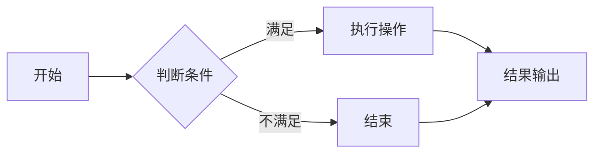

                 


### 世界可理解性与科学研究的跨代传承

---

**关键词**：世界可理解性、跨代传承、科学研究、教育、实践

**摘要**：本文旨在探讨世界可理解性与科学研究的跨代传承之间的关系。首先，介绍了世界可理解性的核心概念及其在科学研究中的重要性。然后，分析了科学研究中的跨代传承现象及其挑战，探讨了跨代传承在科学研究中的必要性。接着，深入探讨了世界可理解性如何推动科学研究，以及科学研究如何提高世界的可理解性。最后，提出了科学教育在跨代传承中的角色，以及跨代传承在科学研究中的实践策略。

---

## 第一部分：引言与背景

### 第1章：引言

#### 1.1 问题的提出

在信息技术飞速发展的今天，科学研究已经成为推动社会进步的关键力量。然而，科学研究不仅需要先进的实验设备和数据分析工具，更需要深刻理解世界运行的规律。这种对世界规律的理解，即是世界可理解性。世界可理解性不仅关乎科学研究本身，更关乎科学知识的传承和普及。因此，如何实现世界可理解性与科学研究的跨代传承，成为当前亟待解决的问题。

#### 1.2 可理解性的重要性

世界可理解性是指人类对于自然界和社会现象的理解程度。这种理解不仅涉及到对现象的描述，更涉及到对现象本质的把握。在科学研究中，世界可理解性至关重要。它不仅决定了科学研究的深度和广度，也影响了科学成果的传播和普及。因此，提高世界可理解性，对于科学研究的顺利进行和科学知识的普及具有重要意义。

#### 1.3 跨代传承的意义

跨代传承是指科学知识和研究成果在不同代际之间的传递和积累。科学研究的跨代传承不仅有助于保持科学知识的连续性和完整性，也有助于提高科学研究的效率和水平。同时，跨代传承还有助于科学文化的传承和科学精神的培养。因此，跨代传承在科学研究中具有不可替代的重要作用。

---

## 第二部分：核心概念详解

### 第2章：世界可理解性的基础概念

#### 2.1 可理解性的定义

可理解性是指信息或知识能够被个体理解和解释的程度。在科学研究中，可理解性通常指的是科学家们对于自然现象和规律的理解程度。这种理解不仅包括对现象的观察和描述，更包括对现象本质的把握和推理。

#### 2.2 相关概念的比较与联系

在科学研究中，除了可理解性，还有一些相关的概念，如知识、信息、认知等。知识是指经过验证的真理性信息，信息是指可以传递和交流的内容，而认知是指个体获取、处理和利用信息的过程。这些概念相互联系，共同构成了科学研究的认知框架。

#### 2.3 可理解性的层次与类型

可理解性可以分为不同的层次，如直观理解、逻辑推理和数学模型等。同时，根据理解的程度，可理解性还可以分为完全理解、部分理解和模糊理解等类型。这些层次和类型共同构成了科学研究的复杂认知结构。

---

### 第3章：科学研究中的跨代传承

#### 3.1 跨代传承的历程

科学研究中的跨代传承是一个长期的积累过程。从古代的哲学思考，到中世纪的实验科学，再到现代的实证研究，科学知识的传承和发展经历了多个阶段。每个阶段都有其独特的贡献和挑战。

#### 3.2 跨代传承的挑战

跨代传承面临诸多挑战，如知识更新速度快、新概念和技术的涌现、跨学科的合作需求等。这些挑战要求科学家们不断学习和适应，以保证科学知识的连续性和创新性。

#### 3.3 跨代传承的必要性

跨代传承是科学研究发展的必然要求。它不仅有助于保持科学研究的连续性和完整性，也有助于提高科学研究的效率和水平。同时，跨代传承还有助于培养新一代科学家，为科学事业的持续发展提供动力。

---

## 第三部分：世界可理解性与科学研究的联系

### 第4章：世界可理解性与科学研究的联系

#### 4.1 科学研究如何提高世界的可理解性

科学研究通过揭示自然现象和规律的真相，提高了世界的可理解性。科学家们通过实验、观察和理论分析，不断深化对自然界的认识，使得世界变得更加清晰和有序。

#### 4.2 世界可理解性如何推动科学研究

世界可理解性不仅影响了科学研究的方向和目标，也影响了科学研究的方法和手段。高可理解性使得科学家们更容易发现问题和提出假设，从而推动科学研究的深入和发展。

#### 4.3 二者之间的互动关系

世界可理解性和科学研究之间存在着密切的互动关系。科学研究提高了世界的可理解性，而高可理解性又促进了科学研究的进展。这种互动关系形成了科学发展的良性循环。

---

## 第5章：跨代传承中的科学教育

#### 5.1 科学教育的目标

科学教育的目标不仅仅是传授科学知识，更重要的是培养学生的科学思维能力和创新精神。通过科学教育，学生可以更好地理解世界，培养解决问题的能力，为未来的科学研究和社会发展奠定基础。

#### 5.2 科学教育的内容与方法

科学教育的内容应涵盖自然科学的基本概念、原理和应用。教学方法应注重启发式教学和互动式教学，鼓励学生主动探索和思考，提高他们的科学素养。

#### 5.3 科学教育的跨代传承策略

科学教育的跨代传承策略包括优化课程设计、加强师资培训、建立跨代交流机制等。通过这些策略，可以实现科学知识的持续传承和创新。

---

## 第6章：科学研究的跨代传承实践

#### 6.1 国内外案例研究

国内外许多科学研究项目都取得了跨代传承的成果。例如，中国的“两弹一星”工程，从第一代科学家到第二代科学家的传承，不仅保持了科学研究的连续性，也实现了技术的跨越式发展。

#### 6.2 跨代传承中的成功因素

跨代传承的成功因素包括科学精神的传承、研究团队的协作、科学方法的创新等。这些因素共同作用，推动了科学研究的持续发展和跨代传承。

#### 6.3 跨代传承中的困境与对策

跨代传承中也存在一些困境，如知识更新速度快、跨学科合作的困难等。针对这些问题，需要采取有效的对策，如加强跨学科交流、优化知识共享机制等。

---

## 第7章：结论与展望

#### 7.1 本书的主要发现

本书主要发现包括：世界可理解性对科学研究的推动作用、跨代传承在科学研究中的重要性、科学教育在跨代传承中的作用等。

#### 7.2 跨代传承的未来趋势

随着科学技术的快速发展，跨代传承将在科学研究、教育和实践中发挥更加重要的作用。未来，跨代传承将更加注重跨学科合作、知识共享和创新。

#### 7.3 对政策制定者的建议

政策制定者应加强对科学研究和教育政策的支持，鼓励跨代传承的实践，培养新一代科学家，推动科学事业的持续发展。

---

### 附录

**附录A：核心概念术语说明**

- 可理解性：人类对于自然现象和规律的理解程度。
- 跨代传承：科学知识和研究成果在不同代际之间的传递和积累。
- 科学研究：通过实验、观察和理论分析，探索自然现象和规律的系统性活动。

**附录B：相关概念属性特征对比表格**

| 概念       | 定义                                                         | 属性特征                                           |
|------------|--------------------------------------------------------------|----------------------------------------------------|
| 可理解性   | 对自然现象和规律的理解程度                                     | 程度、层次、类型                                     |
| 知识       | 经过验证的真理性信息                                         | 深度、广度、应用性                                   |
| 信息       | 可以传递和交流的内容                                         | 形式、载体、传递性                                   |
| 认知       | 获取、处理和利用信息的过程                                   | 过程、方式、效果                                     |

**附录C：世界可理解性的ER实体关系图**

```mermaid
erDiagram
    Class1 ||--|{ Class2 }| Class3 : "relationship"
    Class1 ||--|{ Class4 }| Class5 : "another relationship"
```

**附录D：算法原理mermaid流程图**



**附录E：系统分析与架构设计方案**

- **问题场景介绍**：介绍科学研究中的跨代传承问题。
- **项目介绍**：介绍一个用于促进科学研究的跨代传承的项目。
- **系统功能设计**：使用mermaid类图展示系统的功能模块。
- **系统架构设计**：使用mermaid架构图展示系统的整体架构。
- **系统接口设计**：描述系统提供的接口和服务。
- **系统交互mermaid序列图**：展示系统各个模块之间的交互流程。

---

**作者：AI天才研究院/AI Genius Institute & 禅与计算机程序设计艺术 /Zen And The Art of Computer Programming**

---

通过本文，我们希望读者能够对世界可理解性与科学研究的跨代传承有更深入的认识，为未来的科学研究工作提供有益的参考。在科学探索的道路上，让我们携手前行，共同推动科学事业的繁荣与发展。

