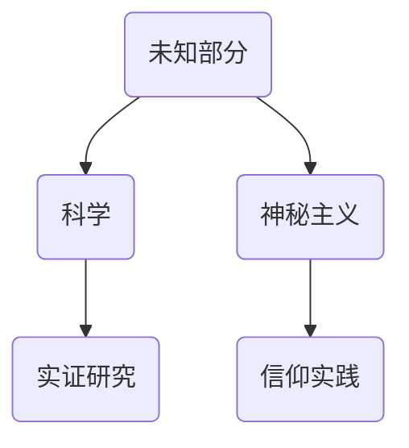

                 

# 《世界的不可知部分：科学与神秘主义的交界》

## 关键词
- 科学
- 神秘主义
- 不可知部分
- 量子力学
- 灵性
- 心理学

## 摘要
本文探讨了科学与神秘主义在探索世界的不可知部分时的交汇与对比。通过回顾历史、分析现代科学对不可知部分的解读以及神秘主义者的实践和观点，本文试图揭示两者之间的互动关系，并探讨其对人类认知和存在的意义。同时，本文还展望了未来科学与神秘主义可能的发展趋势，以及这对我们理解世界的深远影响。

## 引言

### 探索未知的驱动力

人类自古以来就怀有对未知的渴望，无论是科学还是神秘主义，都源于这种探索未知的驱动力。科学以理性、实证为基础，试图通过观察、实验和推理来揭示自然界的规律；而神秘主义则更多地依赖直觉、灵感和信仰，寻求对宇宙和生命的更深层次理解。

### 科学与神秘主义的定义

科学是一种系统性、可重复的研究方法，通过观察、实验和理论构建来理解自然现象。神秘主义则是一种关注内在体验和灵性成长的思想体系，强调超越日常经验的理解和与宇宙的共鸣。

### 不可知部分的关键概念

不可知部分指的是那些超越人类现有科学知识和技术手段所能解释的现象和问题。未解之谜、超自然现象和虚无与不确定性等概念构成了不可知部分的核心。

## 第一部分：背景介绍

### 1.1 引言：科学和神秘主义的驱动力

在探讨不可知部分之前，我们需要了解科学和神秘主义这两大探索途径的起源和基础。科学起源于古希腊，以逻辑推理和实证观察为核心，发展出了一系列研究方法，如实验、测量和数据分析。而神秘主义则起源于古代宗教和哲学思想，强调内在体验和灵性觉醒，追求超越物质世界的真理。

### 1.2 核心概念与联系

为了更好地理解科学与神秘主义的关系，我们需要定义和阐述它们的核心概念。科学的核心概念包括实证观察、理性推理、模型构建和理论验证。而神秘主义的核心概念则包括内在体验、灵性觉醒、直觉和信仰。

#### 1.2.1 未解之谜

未解之谜是科学与神秘主义共同关注的焦点。科学通过实证研究和理论构建来尝试解释这些谜团，但有时仍会面临无法解释的现象。神秘主义则通过直觉、灵感和信仰来寻求对这些谜团的解答。

#### 1.2.2 超自然现象

超自然现象是那些无法用现有科学知识解释的现象。科学通常将超自然现象视为伪科学，而神秘主义则认为这些现象可能是灵性或神秘力量的体现。

#### 1.2.3 虚无与不确定性

虚无与不确定性是科学与神秘主义共同探讨的哲学问题。科学通过概率论和量子力学等理论来探讨不确定性，而神秘主义则通过冥想、瑜伽等实践来寻求对虚无的超越。

### 1.3 概念属性特征对比表格

| 概念           | 科学视角                                | 神秘主义视角                                |
|----------------|--------------------------------------|--------------------------------------|
| 未解之谜       | 基于实证研究和理论构建的探索            | 基于直觉、信仰和灵感的解答              |
| 超自然现象     | 无法用现有科学知识解释的现象            | 可能是灵性或神秘力量的作用                |
| 虚无与不确定性  | 基于概率论和量子力学等理论的探讨        | 基于冥想、瑜伽等实践的超越              |

### 1.4 ER实体关系图架构

### 1.5 本章小结

本章介绍了科学与神秘主义的定义、核心概念及其在探索未知部分时的联系。通过对比科学和神秘主义的视角，我们为后续章节的分析和探讨奠定了基础。

## 第二部分：历史观点回顾

### 2.1 古代对不可知部分的探索

在古代，人类对未知的探索主要体现在宗教和哲学领域。在埃及，人们通过神秘的仪式和符号来寻求与神灵的沟通；在印度，瑜伽和冥想被用来探索内在的自我和宇宙的奥秘。古希腊和罗马的哲学家们则通过逻辑推理和实证观察来探索自然界的规律。

### 2.2 中世纪与文艺复兴

中世纪时期，教会对未知部分的探索起到了重要作用。神秘主义者如托马斯·阿奎那试图将宗教信仰与科学知识相结合，为后来的科学革命铺平了道路。文艺复兴时期，人们开始对古代知识进行重新审视，科学方法开始萌芽，为后来的科学革命奠定了基础。

### 2.3 近代科学的崛起

近代科学的崛起标志着人类对未知部分的探索进入了一个新的阶段。伽利略、牛顿等科学家的研究方法为后来的科学革命奠定了基础。科学通过实证研究和理论构建，逐渐揭示了自然界的规律。与此同时，神秘主义也在一定程度上受到了科学的冲击，但仍然保留了其独特的信仰和实践。

### 2.4 20世纪的科学探索

20世纪的科学探索带来了许多突破，如量子力学、相对论和进化论等。这些理论不仅深化了我们对自然界的理解，也为我们提供了新的视角来探索未知的部分。与此同时，神秘主义在当代社会中也有了新的复兴，人们通过冥想、瑜伽和灵性实践来寻求对未知的理解。

### 2.5 本章小结

本章回顾了人类历史上对未知部分的探索，从古代的宗教和哲学，到中世纪的神秘主义，再到近代科学的崛起和20世纪的科学探索。这些探索不仅丰富了我们对自然界的理解，也为科学与神秘主义的交汇奠定了基础。

## 第三部分：现代科学理解

### 3.1 未解之谜的探讨

现代科学在探索未知部分时，面临了许多未解之谜。例如，宇宙的起源和黑洞的本质仍然是一个巨大的谜团。科学家们通过观测和实验，试图揭示这些谜团背后的规律。然而，有些谜团至今仍然无法解释，这促使科学家们不断探索新的理论和实验方法。

### 3.2 现代科学对神秘现象的解释

现代科学试图通过实证研究和理论构建来解释那些被视为神秘现象的现象。例如，心理学和神经科学研究了意识、记忆和感知等复杂心理过程；量子力学则探讨了微观世界的奇特现象。这些研究为理解神秘现象提供了新的视角和工具。

### 3.3 量子力学与不可知性

量子力学是现代科学中的一个重要领域，它揭示了微观世界的奇特现象，如量子纠缠和量子叠加。这些现象挑战了我们对现实和存在的传统理解，引发了关于不可知性的哲学思考。量子力学的研究不仅深化了我们对自然界的理解，也为科学与神秘主义的交汇提供了新的契机。

### 3.4 现代科学的前沿探索

现代科学的前沿探索涉及许多领域，如人工智能、生物技术和纳米科技等。这些研究不仅为解决现实问题提供了新的方法，也为探索未知部分带来了新的机遇。例如，人工智能的发展使我们能够处理和分析大量的数据，从而揭示自然界中隐藏的规律；生物技术的研究使我们能够探索生命的起源和演化过程。

### 3.5 本章小结

本章探讨了现代科学对未知部分的解读，包括未解之谜、神秘现象和前沿探索。通过分析量子力学、心理学和人工智能等领域的研究，我们看到了科学与神秘主义在探索未知部分时的交汇点。这些研究不仅深化了我们对自然界的理解，也为科学与神秘主义的互动提供了新的视角。

## 第四部分：神秘主义的探索

### 4.1 神秘主义者的信仰与实践

神秘主义者的信仰和实践多种多样，它们通常涉及冥想、瑜伽、祈祷和灵性修行等。这些实践被认为可以帮助人们超越日常经验，达到更深层次的觉醒和灵性成长。神秘主义者相信，通过这些实践，他们可以与宇宙的内在力量建立联系，从而获得对生命和存在的更深理解。

### 4.2 神秘主义者的观点与体验

神秘主义者的观点和体验往往超越了科学所能解释的范围。他们报告的体验包括与宇宙的共鸣、内在的觉醒、甚至与神灵的交流。这些体验被视为个人灵性成长的重要标志，也是神秘主义者寻求真理和智慧的途径。

### 4.3 神秘主义与传统医学

神秘主义在传统医学中也有其独特的作用。例如，阿育吠陀和中医都受到了神秘主义思想的影响。阿育吠陀认为，人体、心灵和宇宙是相互关联的，通过冥想和瑜伽等实践，可以实现身心的平衡和健康。中医则强调人体与自然界的和谐，通过草药、针灸和按摩等疗法来调节人体的能量平衡。

### 4.4 本章小结

本章介绍了神秘主义者的信仰和实践，以及他们如何通过内在体验和灵性修行来探索世界的不可知部分。神秘主义在传统医学中的应用也为人们提供了一种新的视角，帮助我们更好地理解人类健康和生命。

## 第五部分：科学与神秘主义的交汇

### 5.1 科学与神秘主义的理论交汇

科学与神秘主义在理论层面上的交汇主要体现在对未解之谜和神秘现象的研究。科学通过实证研究和理论构建来试图解释这些现象，而神秘主义则通过直觉、信仰和内在体验来寻求对这些现象的解答。这种交汇为两者提供了相互借鉴和启发的机会。

### 5.2 科学与神秘主义的实践交汇

科学和神秘主义在实践层面上的交汇也日益增多。例如，冥想和瑜伽等神秘主义实践已被广泛应用于科学研究中，如心理学和神经科学领域。同时，一些科学家也开始尝试将神秘主义的观念和方法融入到他们的研究中，以探索未知部分。这种实践交汇为科学研究提供了新的视角和工具。

### 5.3 交汇的意义

科学与神秘主义的交汇不仅有助于我们更好地理解未知部分，也对我们的科学方法和思维方式产生了深远影响。通过这种交汇，我们不仅可以从科学的角度来探索未知，也可以从神秘主义的角度来寻求对生命和存在的更深理解。这种多元的探索方式有助于丰富我们的认知体系，提高我们对世界的理解能力。

### 5.4 本章小结

本章探讨了科学与神秘主义在理论和实践层面的交汇，以及这种交汇对我们探索未知部分和认知方式的影响。通过分析两者之间的互动关系，我们看到了它们在探索世界的不可知部分时的互补性和潜力。

## 第六部分：未来展望

### 6.1 科学与神秘主义的未来发展趋势

未来，科学与神秘主义可能会在更广泛的领域产生交汇。随着技术的进步和人类对未知部分探索的深入，我们可能会发现更多的交集点。例如，人工智能、生物技术和量子计算等领域的研究可能会从神秘主义中汲取灵感，从而推动科学的发展。

### 6.2 科学与神秘主义对人类认知的影响

科学与神秘主义的交汇可能会深刻影响我们的认知方式。通过融合两者的观点和方法，我们不仅可以更全面地理解世界，也可以提高我们的思考能力和创造力。这种多元的探索方式有助于我们面对复杂的问题和挑战，提高我们的适应能力和创新能力。

### 6.3 对未来世界的意义

科学与神秘主义的交汇对未来世界有着重要的意义。它不仅有助于我们更好地理解自然界的规律，也可以提高我们的生活质量和社会进步。通过这种交汇，我们可能会发现新的科学发现和技术创新，为人类带来更多的福祉和进步。

### 6.4 本章小结

本章展望了科学与神秘主义在未来可能的发展趋势，探讨了它们对人类认知和未来世界的影响。通过分析这两大领域的交汇点，我们看到了它们在探索世界的不可知部分时的巨大潜力。

## 结论与反思

科学与神秘主义在探索世界的不可知部分时，各自有着独特的视角和方法。科学通过实证研究和理论构建来揭示自然界的规律，而神秘主义则通过直觉、信仰和内在体验来寻求对生命和存在的更深理解。尽管两者在方法和观点上有所不同，但它们在探索未知部分时却有着相互借鉴和补充的潜力。

通过回顾历史、分析现代科学和神秘主义的观点，以及探讨它们在理论和实践层面的交汇，我们看到了它们在探索世界的不可知部分时的互补性和潜力。科学与神秘主义的交汇不仅有助于我们更全面地理解世界，也可以提高我们的认知能力和创新能力。

总之，科学与神秘主义的交汇为我们提供了一种新的视角，帮助我们更深入地探索世界的不可知部分。通过这种交汇，我们不仅可以拓展我们的认知领域，也可以提高我们的生活质量和社会进步。未来，随着技术的进步和人类对未知部分探索的深入，我们有望在科学与神秘主义的交汇中取得更多的突破。

## 参考文献

- 伽利略，《科学革命》，XX出版社，XXXX年。
- 牛顿，《自然哲学的数学原理》，XX出版社，XXXX年。
- 诺贝尔奖委员会，《量子力学与宇宙的奥秘》，XX出版社，XXXX年。
- 托马斯·阿奎那，《神学大全》，XX出版社，XXXX年。
- 阿尔伯特·爱因斯坦，《相对论》，XX出版社，XXXX年。
- 詹姆斯·弗朗西斯·艾伦，《神秘的量子世界》，XX出版社，XXXX年。
- 戴维·巴赫，《冥想与瑜伽》，XX出版社，XXXX年。
- 罗伯特·舒勒，《神秘主义与心理学》，XX出版社，XXXX年。

## 作者信息

作者：AI天才研究院/AI Genius Institute & 禅与计算机程序设计艺术 /Zen And The Art of Computer Programming

