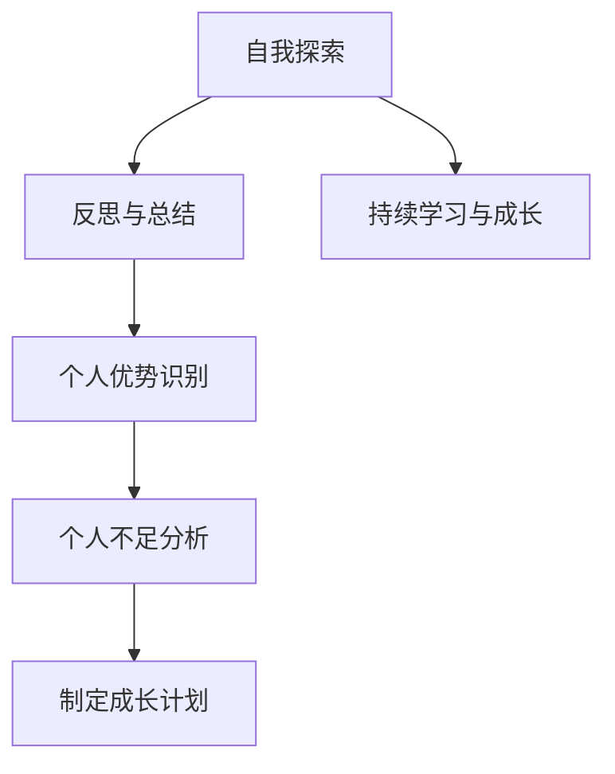
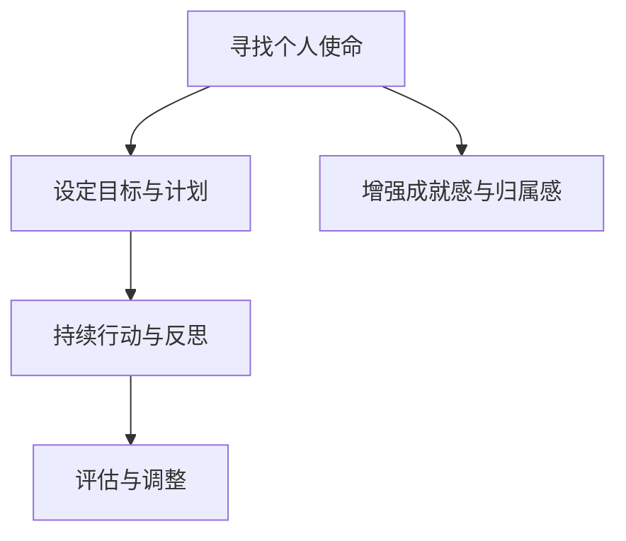
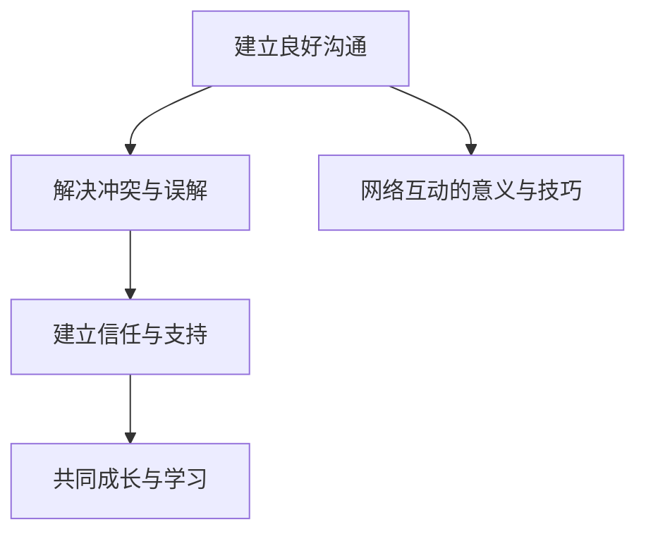
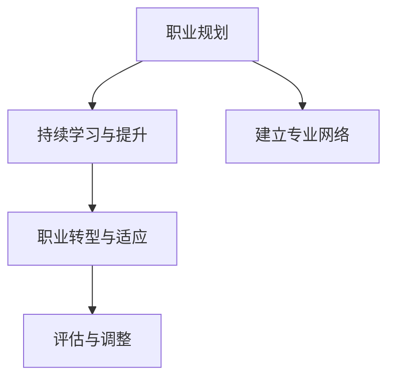
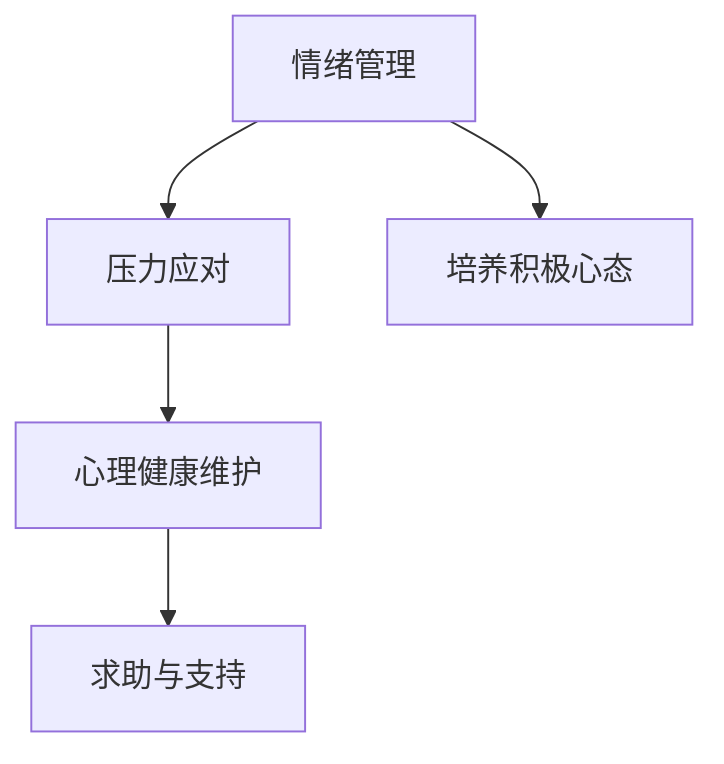

                 

**《个人成长与意义感：自我实现的现代途径》**

**关键词：个人成长、意义感、自我实现、现代途径**

**摘要：**
在快速变化的时代，个人成长与意义感成为现代人追求的核心。本文将探讨个人成长与意义感的关系，提供自我实现的现代途径。通过对核心概念的分析、理论与实践指导的阐述，引导读者找到个人成长的方向，构建有意义的人生。

## 第一部分：引言

### 1.1 个人成长在现代社会的挑战

在现代社会，个人成长面临着诸多挑战。随着科技的发展和全球化的进程，人们的生活节奏加快，信息过载，竞争加剧。在这个环境中，个人如何保持内心的平静，实现自我成长，成为了一个重要的议题。

个人成长不仅关乎个人的成就，还关系到社会的进步。一个不断成长、追求自我实现的个体，能够为社会带来创新和活力。因此，理解个人成长的意义，探索其实现途径，具有重要的现实意义。

### 1.2 意义感的定义与重要性

意义感是指个体在生活中感受到的目的、价值和意义。它不仅仅是对某种事物的感知，更是一种深层次的心理体验。在现代社会，意义感成为人们追求幸福和满足的重要指标。

拥有强烈意义感的人，能够更好地应对生活中的挑战，找到前进的动力。反之，缺乏意义感的人，往往感到迷茫和失落。因此，构建意义感，对个人的心理健康和幸福感有着深远的影响。

### 1.3 现代途径与个人成长

现代途径是指适应现代社会发展需求，通过自我认知、职业发展、社会关系等多个方面的努力，实现个人成长和意义感的过程。

自我认知是个人成长的起点。通过自我探索和反思，个体能够明确自己的优势和不足，从而制定合适的成长计划。

职业发展是个人成长的重要方面。合理的职业规划、持续学习和职业转型，有助于个体在职业领域实现自我价值。

社会关系是个人成长的支撑。良好的人际关系和社会支持网络，能够为个体提供精神上的慰藉和实际的帮助。

## 第二部分：核心概念与联系

### 2.1 个人成长的概念与特征

个人成长是指个体在生理、心理、社会等方面不断进步和发展的过程。其特征包括自我认知的提升、能力的发展、情感的丰富和社会适应性的增强。

### 2.2 意义感的概念与类型

意义感是指个体在生活中感受到的目的、价值和意义。根据表现形式，意义感可以分为任务意义感、成就意义感、归属意义感等类型。

### 2.3 个人成长与意义感的关系

个人成长与意义感密切相关。一个健康的个人成长过程，往往伴随着对生活意义的深入理解和探索。同时，意义感的构建也能够促进个人成长的持续进行。

### 2.4 概念联系与ER图

以下是一个Mermaid ER图的示例，用于描述个人成长与意义感的关系：

```mermaid
erDiagram
    PersonalGrowth ||--|{ Meaningfulness } Meaningfulness
    PersonalGrowth ||--|{ SelfAwareness } SelfAwareness
    PersonalGrowth ||--|{ CareerDevelopment } CareerDevelopment
    PersonalGrowth ||--|{ SocialRelationship } SocialRelationship
    Meaningfulness ||--|{ TaskMeaningfulness } TaskMeaningfulness
    Meaningfulness ||--|{ AchievementMeaningfulness } AchievementMeaningfulness
    Meaningfulness ||--|{ BelongingMeaningfulness } BelongingMeaningfulness
```

## 第三部分：理论基础与实践指导

### 3.1 自我认知

自我认知是个人成长的基石。以下是一个Mermaid流程图的示例，用于描述自我认知的方法：



### 3.2 意义感构建

意义感构建是个人成长的重要环节。以下是一个Mermaid流程图的示例，用于描述意义感构建的策略：



### 3.3 社会关系

社会关系是个人成长的支撑。以下是一个Mermaid流程图的示例，用于描述人际关系管理的策略：



### 3.4 职业发展

职业发展是个人成长的重要组成部分。以下是一个Mermaid流程图的示例，用于描述职业发展的策略：



### 3.5 心理健康

心理健康是个人成长的重要保障。以下是一个Mermaid流程图的示例，用于描述心理健康维护的策略：



## 第四部分：每个章节的具体内容设计

### 4.1 自我认知

自我认知是个人成长的起点。在这一章中，我们将探讨如何通过自我探索、自我评价和自我提升，实现个人成长。

#### 背景介绍

自我认知是指个体对自己心理、行为和情感的认知。它对个人成长具有重要意义。

#### 内容讲解

- 自我探索：通过反思和自我分析，了解自己的内在需求和动机。
- 自我评价：建立客观的自我评价体系，识别自己的优势和不足。
- 自我提升：制定个人成长计划，通过学习和实践，不断提升自我。

#### 实践应用

- 反思日记：定期记录自己的思考和行为，深入反思。
- 成长日志：记录个人成长过程，总结经验教训。
- 专业培训：参加相关课程和培训，提升专业技能和知识。

#### 注意事项

- 避免自我否定：在自我评价过程中，要避免过度自我否定，保持积极心态。
- 实践与反思相结合：自我提升需要持续实践和反思，不断调整成长计划。

#### 拓展阅读

- 《影响力》
- 《高效能人士的七个习惯》

### 4.2 意义感构建

意义感构建是个人成长的重要环节。在这一章中，我们将探讨如何通过寻找个人使命、设定目标和持续行动，构建有意义的人生。

#### 背景介绍

意义感是指个体在生活中感受到的目的、价值和意义。缺乏意义感会导致个体感到迷茫和失落。

#### 内容讲解

- 寻找个人使命：通过自我反思和探索，找到自己真正热爱的事物和目标。
- 设定目标与计划：明确自己的目标，制定可行的行动计划。
- 持续行动与反思：通过持续的行动和反思，不断完善自己的目标和计划。

#### 实践应用

- 目标设定法：使用SMART原则（具体、可衡量、可实现、相关、有时限）设定目标。
- 时间管理：合理安排时间，确保目标得以实现。
- 反思与调整：定期反思行动效果，根据实际情况调整目标和计划。

#### 注意事项

- 避免盲目追求：在寻找个人使命和设定目标时，要避免盲目跟风，保持真实自我。
- 保持耐心：构建意义感需要时间和耐心，要持续努力。

#### 拓展阅读

- 《追风筝的人》
- 《生命的智慧》

### 4.3 社会关系

社会关系是个人成长的重要支撑。在这一章中，我们将探讨如何通过人际关系管理、社交技能提升和网络互动，建立良好的人际关系。

#### 背景介绍

社会关系对个人的心理健康和生活质量有着重要影响。建立良好的人际关系，能够为个体提供精神上的支持和社会资源。

#### 内容讲解

- 人际关系管理：学会处理人际关系中的冲突和误解，建立和谐的人际关系。
- 社交技能提升：通过沟通技巧、倾听能力和情感表达，提升社交技能。
- 网络互动：学会在虚拟世界中建立和维护人际关系，利用网络资源拓展人脉。

#### 实践应用

- 沟通技巧训练：通过模拟对话和实际交流，提升沟通能力。
- 参加社交活动：积极参与社交活动，拓展人际关系。
- 网络社群互动：在专业网络社群中积极参与讨论，建立专业人脉。

#### 注意事项

- 避免过度依赖：在建立人际关系时，要避免过度依赖他人，保持独立自主。
- 保持真诚：在人际交往中，要真诚待人，建立信任关系。

#### 拓展阅读

- 《非暴力沟通》
- 《社交心理学》

### 4.4 职业发展

职业发展是个人成长的重要方面。在这一章中，我们将探讨如何通过职业规划、持续学习和职业转型，实现职业成长。

#### 背景介绍

职业发展对个人的经济收入和生活质量有着直接影响。合理的职业规划、持续学习和职业转型，有助于个体在职业领域实现自我价值。

#### 内容讲解

- 职业规划：明确自己的职业目标和规划，制定职业发展路径。
- 持续学习：通过不断学习和提升，保持自己的竞争力。
- 职业转型：根据个人兴趣和市场需求，实现职业转型。

#### 实践应用

- 职业规划工具：使用职业生涯规划工具，如职业性格测试、职业兴趣测评等，制定个人职业规划。
- 持续学习策略：制定学习计划，如阅读书籍、参加线上课程、参加工作坊等，持续提升自身能力。
- 职业转型案例：分析成功转型的案例，学习转型策略和技巧。

#### 注意事项

- 避免盲目跟风：在职业规划中，要避免盲目跟风，要根据自己的实际情况和兴趣选择合适的职业道路。
- 保持灵活：在职业发展中，要保持灵活，根据市场需求和个人情况，适时调整职业规划。

#### 拓展阅读

- 《职业规划与自我管理》
- 《终身学习：未来的生存法则》

### 4.5 心理健康

心理健康是个人成长的重要保障。在这一章中，我们将探讨如何通过情绪管理、压力应对和心理健康维护，保持心理健康。

#### 背景介绍

心理健康对个人的生活质量和社会功能有着重要影响。保持心理健康，有助于个体更好地应对生活和工作中的挑战。

#### 内容讲解

- 情绪管理：学会识别和管理自己的情绪，避免情绪波动过大。
- 压力应对：学会应对生活中的压力，保持心理平衡。
- 心理健康维护：通过自我调节和心理疏导，保持心理健康。

#### 实践应用

- 情绪调节技巧：学习放松技巧，如深呼吸、冥想等，缓解情绪压力。
- 压力管理策略：合理安排工作和生活，避免过度劳累。
- 心理健康维护方法：定期进行心理疏导，如咨询心理医生、参加心理辅导等。

#### 注意事项

- 避免忽视：在忙碌的生活中，要避免忽视自己的心理健康，要关注自己的情绪和压力水平。
- 及时求助：在遇到心理问题时，要勇于寻求专业帮助，不要独自承受。

#### 拓展阅读

- 《情绪管理》
- 《心理健康的维护与促进》

## 第五部分：总结与建议

### 5.1 个人成长与意义感的整合

个人成长与意义感相互促进，共同构建了一个健康、充实的人生。通过自我认知、意义感构建、社会关系、职业发展和心理健康等方面的努力，个体可以实现自我价值的最大化。

### 5.2 实现自我实现的现代途径

要实现自我实现，个体需要：

- 坚持自我认知，明确自己的优势和不足，制定合理的成长计划。
- 寻找个人使命，设定明确的目标，并付诸行动。
- 建立良好的人际关系，获得社会支持和资源。
- 规划职业发展，不断提升自身的竞争力和价值。
- 保持心理健康，积极应对生活中的挑战。

### 5.3 未来展望与持续成长

未来，个人成长与意义感将继续受到关注。随着科技的进步和社会的发展，个体将面临更多的挑战和机遇。持续成长将成为个体适应社会变化、实现自我价值的关键。

### 5.4 拓展阅读

- 《自我超越之路》
- 《生命的意义》

## 结尾

**作者：AI天才研究院/AI Genius Institute & 禅与计算机程序设计艺术 /Zen And The Art of Computer Programming**

本文从个人成长与意义感的时代背景出发，探讨了核心概念、理论基础和实践指导，旨在为读者提供自我实现的现代途径。希望本文能够帮助读者找到个人成长的方向，构建有意义的人生。让我们携手前行，不断追求自我实现，创造更加美好的未来。

----------------------------------------------------------------

**文章标题：个人成长与意义感：自我实现的现代途径**

**关键词：个人成长、意义感、自我实现、现代途径**

**摘要：**
本文探讨了个人成长与意义感在现代社会的重要性，提供了自我实现的现代途径。通过对核心概念的解析、理论与实践的指导，帮助读者理解并实践个人成长与意义感的构建，以实现自我价值。

**正文：**

## 第一部分：引言

### 1.1 个人成长在现代社会的挑战

在现代社会，个人成长面临着诸多挑战。随着科技的发展和信息时代的到来，人们的生活节奏加快，竞争压力增大。在这个快节奏的环境中，个人如何保持内心的平静，实现自我成长，成为了一个重要的议题。

个人成长不仅关乎个人的成就，还关系到社会的进步。一个不断成长、追求自我实现的个体，能够为社会带来创新和活力。因此，理解个人成长的意义，探索其实现途径，具有重要的现实意义。

### 1.2 意义感的定义与重要性

意义感是指个体在生活中感受到的目的、价值和意义。它不仅仅是对某种事物的感知，更是一种深层次的心理体验。在现代社会，意义感成为人们追求幸福和满足的重要指标。

拥有强烈意义感的人，能够更好地应对生活中的挑战，找到前进的动力。反之，缺乏意义感的人，往往感到迷茫和失落。因此，构建意义感，对个人的心理健康和幸福感有着深远的影响。

### 1.3 现代途径与个人成长

现代途径是指适应现代社会发展需求，通过自我认知、职业发展、社会关系等多个方面的努力，实现个人成长和意义感的过程。

自我认知是个人成长的起点。通过自我探索和反思，个体能够明确自己的优势和不足，从而制定合适的成长计划。

职业发展是个人成长的重要方面。合理的职业规划、持续学习和职业转型，有助于个体在职业领域实现自我价值。

社会关系是个人成长的支撑。良好的人际关系和社会支持网络，能够为个体提供精神上的慰藉和实际的帮助。

## 第二部分：核心概念与联系

### 2.1 个人成长的核心理念

个人成长是指个体在生理、心理、社会等方面不断进步和发展的过程。其核心概念包括自我认知、能力发展、情感丰富和社会适应性的增强。

### 2.2 意义感的概念与类型

意义感是指个体在生活中感受到的目的、价值和意义。根据表现形式，意义感可以分为任务意义感、成就意义感、归属意义感等类型。

### 2.3 个人成长与意义感的关系

个人成长与意义感密切相关。一个健康的个人成长过程，往往伴随着对生活意义的深入理解和探索。同时，意义感的构建也能够促进个人成长的持续进行。

### 2.4 概念联系与ER图

以下是一个Mermaid ER图的示例，用于描述个人成长与意义感的关系：

```mermaid
erDiagram
    PersonalGrowth ||--|{ Meaningfulness } Meaningfulness
    PersonalGrowth ||--|{ SelfAwareness } SelfAwareness
    PersonalGrowth ||--|{ CareerDevelopment } CareerDevelopment
    PersonalGrowth ||--|{ SocialRelationship } SocialRelationship
    Meaningfulness ||--|{ TaskMeaningfulness } TaskMeaningfulness
    Meaningfulness ||--|{ AchievementMeaningfulness } AchievementMeaningfulness
    Meaningfulness ||--|{ BelongingMeaningfulness } BelongingMeaningfulness
```

## 第三部分：理论基础与实践指导

### 3.1 自我认知

自我认知是个人成长的基石。以下是一个Mermaid流程图的示例，用于描述自我认知的方法：


### 3.2 意义感构建

意义感构建是个人成长的重要环节。以下是一个Mermaid流程图的示例，用于描述意义感构建的策略：


### 3.3 社会关系

社会关系是个人成长的支撑。以下是一个Mermaid流程图的示例，用于描述人际关系管理的策略：


### 3.4 职业发展

职业发展是个人成长的重要组成部分。以下是一个Mermaid流程图的示例，用于描述职业发展的策略：


### 3.5 心理健康

心理健康是个人成长的重要保障。以下是一个Mermaid流程图的示例，用于描述心理健康维护的策略：


## 第四部分：每个章节的具体内容设计

### 4.1 自我认知

自我认知是个人成长的起点。在这一章中，我们将探讨如何通过自我探索、自我评价和自我提升，实现个人成长。

#### 背景介绍

自我认知是指个体对自己心理、行为和情感的认知。它对个人成长具有重要意义。

#### 内容讲解

- **自我探索**：通过反思和自我分析，了解自己的内在需求和动机。
  - **方法**：日记反思、心灵对话、冥想。
  - **应用**：深入挖掘自己的兴趣、激情和价值观。

- **自我评价**：建立客观的自我评价体系，识别自己的优势和不足。
  - **方法**：360度反馈、心理测评、自我评估问卷。
  - **应用**：识别个人技能、知识盲区和性格特质。

- **自我提升**：制定个人成长计划，通过学习和实践，不断提升自我。
  - **方法**：设定学习目标、参与培训、实践项目。
  - **应用**：持续提升专业技能、拓展知识面、增强软技能。

#### 实践应用

- **反思日记**：每天记录自己的所思所感，反思自己的行为和决策。
- **成长日志**：定期记录个人成长过程，总结经验教训。
- **专业培训**：参加相关课程和培训，提升专业技能和知识。

#### 注意事项

- **避免自我否定**：在自我评价过程中，要避免过度自我否定，保持积极心态。
- **实践与反思相结合**：自我提升需要持续实践和反思，不断调整成长计划。

#### 拓展阅读

- 《影响力》
- 《高效能人士的七个习惯》

### 4.2 意义感构建

意义感构建是个人成长的重要环节。在这一章中，我们将探讨如何通过寻找个人使命、设定目标和持续行动，构建有意义的人生。

#### 背景介绍

意义感是指个体在生活中感受到的目的、价值和意义。缺乏意义感会导致个体感到迷茫和失落。

#### 内容讲解

- **寻找个人使命**：通过自我反思和探索，找到自己真正热爱的事物和目标。
  - **方法**：价值观识别、激情探索、目标设定。
  - **应用**：明确自己的核心使命，为生活注入动力。

- **设定目标与计划**：明确自己的目标，制定可行的行动计划。
  - **方法**：SMART原则、目标分解、时间管理。
  - **应用**：制定清晰的行动计划，确保目标得以实现。

- **持续行动与反思**：通过持续的行动和反思，不断完善自己的目标和计划。
  - **方法**：行动日记、定期回顾、调整策略。
  - **应用**：保持行动的一致性，不断提升自我。

#### 实践应用

- **目标设定法**：使用SMART原则（具体、可衡量、可实现、相关、有时限）设定目标。
- **时间管理**：合理安排时间，确保目标得以实现。
- **反思与调整**：定期反思行动效果，根据实际情况调整目标和计划。

#### 注意事项

- **避免盲目追求**：在寻找个人使命和设定目标时，要避免盲目跟风，保持真实自我。
- **保持耐心**：构建意义感需要时间和耐心，要持续努力。

#### 拓展阅读

- 《追风筝的人》
- 《生命的智慧》

### 4.3 社会关系

社会关系是个人成长的重要支撑。在这一章中，我们将探讨如何通过人际关系管理、社交技能提升和网络互动，建立良好的人际关系。

#### 背景介绍

社会关系对个人的心理健康和生活质量有着重要影响。建立良好的人际关系，能够为个体提供精神上的支持和社会资源。

#### 内容讲解

- **人际关系管理**：学会处理人际关系中的冲突和误解，建立和谐的人际关系。
  - **方法**：沟通技巧、倾听能力、同理心。
  - **应用**：解决冲突、增进理解、建立信任。

- **社交技能提升**：通过沟通技巧、倾听能力和情感表达，提升社交技能。
  - **方法**：模拟对话、角色扮演、实际交流。
  - **应用**：提高沟通效果、增强人际关系、拓展人脉。

- **网络互动**：学会在虚拟世界中建立和维护人际关系，利用网络资源拓展人脉。
  - **方法**：社交媒体互动、在线社群参与、专业网络拓展。
  - **应用**：建立线上联系、共享信息、合作共赢。

#### 实践应用

- **沟通技巧训练**：通过模拟对话和实际交流，提升沟通能力。
- **参加社交活动**：积极参与社交活动，拓展人际关系。
- **网络社群互动**：在专业网络社群中积极参与讨论，建立专业人脉。

#### 注意事项

- **避免过度依赖**：在建立人际关系时，要避免过度依赖他人，保持独立自主。
- **保持真诚**：在人际交往中，要真诚待人，建立信任关系。

#### 拓展阅读

- 《非暴力沟通》
- 《社交心理学》

### 4.4 职业发展

职业发展是个人成长的重要组成部分。在这一章中，我们将探讨如何通过职业规划、持续学习和职业转型，实现职业成长。

#### 背景介绍

职业发展对个人的经济收入和生活质量有着直接影响。合理的职业规划、持续学习和职业转型，有助于个体在职业领域实现自我价值。

#### 内容讲解

- **职业规划**：明确自己的职业目标和规划，制定职业发展路径。
  - **方法**：职业测评、市场分析、个人定位。
  - **应用**：设定职业目标、规划学习路径、制定行动计划。

- **持续学习**：通过不断学习和提升，保持自己的竞争力。
  - **方法**：参加课程、阅读书籍、参与研讨会。
  - **应用**：更新知识体系、提升技能水平、适应行业变化。

- **职业转型**：根据个人兴趣和市场需求，实现职业转型。
  - **方法**：市场调研、个人评估、转型策略。
  - **应用**：探索新领域、适应新岗位、实现职业跨越。

#### 实践应用

- **职业规划工具**：使用职业生涯规划工具，如职业性格测试、职业兴趣测评等，制定个人职业规划。
- **持续学习策略**：制定学习计划，如阅读书籍、参加线上课程、参加工作坊等，持续提升自身能力。
- **职业转型案例**：分析成功转型的案例，学习转型策略和技巧。

#### 注意事项

- **避免盲目跟风**：在职业规划中，要避免盲目跟风，要根据自己的实际情况和兴趣选择合适的职业道路。
- **保持灵活**：在职业发展中，要保持灵活，根据市场需求和个人情况，适时调整职业规划。

#### 拓展阅读

- 《职业规划与自我管理》
- 《终身学习：未来的生存法则》

### 4.5 心理健康

心理健康是个人成长的重要保障。在这一章中，我们将探讨如何通过情绪管理、压力应对和心理健康维护，保持心理健康。

#### 背景介绍

心理健康对个人的生活质量和社会功能有着重要影响。保持心理健康，有助于个体更好地应对生活和工作中的挑战。

#### 内容讲解

- **情绪管理**：学会识别和管理自己的情绪，避免情绪波动过大。
  - **方法**：情绪识别、情绪调节、情绪表达。
  - **应用**：缓解压力、改善情绪状态、提升生活质量。

- **压力应对**：学会应对生活中的压力，保持心理平衡。
  - **方法**：时间管理、资源管理、情绪调节。
  - **应用**：提高应对能力、减少压力影响、保持心理健康。

- **心理健康维护**：通过自我调节和心理疏导，保持心理健康。
  - **方法**：心理疏导、自我放松、情绪释放。
  - **应用**：提高心理健康水平、增强心理韧性、提升生活质量。

#### 实践应用

- **情绪调节技巧**：学习放松技巧，如深呼吸、冥想等，缓解情绪压力。
- **压力管理策略**：合理安排工作和生活，避免过度劳累。
- **心理健康维护方法**：定期进行心理疏导，如咨询心理医生、参加心理辅导等。

#### 注意事项

- **避免忽视**：在忙碌的生活中，要避免忽视自己的心理健康，要关注自己的情绪和压力水平。
- **及时求助**：在遇到心理问题时，要勇于寻求专业帮助，不要独自承受。

#### 拓展阅读

- 《情绪管理》
- 《心理健康的维护与促进》

## 第五部分：总结与建议

### 5.1 个人成长与意义感的整合

个人成长与意义感相互促进，共同构建了一个健康、充实的人生。通过自我认知、意义感构建、社会关系、职业发展和心理健康等方面的努力，个体可以实现自我价值的最大化。

### 5.2 实现自我实现的现代途径

要实现自我实现，个体需要：

- **坚持自我认知**，明确自己的优势和不足，制定合适的成长计划。
- **寻找个人使命**，设定明确的目标，并付诸行动。
- **建立良好的人际关系**，获得社会支持和资源。
- **规划职业发展**，不断提升自身的竞争力和价值。
- **保持心理健康**，积极应对生活中的挑战。

### 5.3 未来展望与持续成长

未来，个人成长与意义感将继续受到关注。随着科技的进步和社会的发展，个体将面临更多的挑战和机遇。持续成长将成为个体适应社会变化、实现自我价值的关键。

### 5.4 拓展阅读

- **《自我超越之路》**
- **《生命的意义》**

## 结尾

**作者：AI天才研究院/AI Genius Institute & 禅与计算机程序设计艺术 /Zen And The Art of Computer Programming**

本文从个人成长与意义感的时代背景出发，探讨了核心概念、理论基础和实践指导，旨在为读者提供自我实现的现代途径。希望本文能够帮助读者找到个人成长的方向，构建有意义的人生。让我们携手前行，不断追求自我实现，创造更加美好的未来。

----------------------------------------------------------------

**文章标题：个人成长与意义感：自我实现的现代途径**

**关键词：个人成长、意义感、自我实现、现代途径**

**摘要：**
本文探讨了个人成长与意义感在现代社会的重要性，提供了自我实现的现代途径。通过对核心概念的解析、理论基础和实践指导的阐述，帮助读者理解并实践个人成长与意义感的构建，以实现自我价值。

**正文：**

## 第一部分：引言

### 1.1 个人成长在现代社会的挑战

在现代社会，个人成长面临着诸多挑战。随着科技的发展和信息时代的到来，人们的生活节奏加快，竞争压力增大。在这个快节奏的环境中，个人如何保持内心的平静，实现自我成长，成为了一个重要的议题。

个人成长不仅关乎个人的成就，还关系到社会的进步。一个不断成长、追求自我实现的个体，能够为社会带来创新和活力。因此，理解个人成长的意义，探索其实现途径，具有重要的现实意义。

### 1.2 意义感的定义与重要性

意义感是指个体在生活中感受到的目的、价值和意义。它不仅仅是对某种事物的感知，更是一种深层次的心理体验。在现代社会，意义感成为人们追求幸福和满足的重要指标。

拥有强烈意义感的人，能够更好地应对生活中的挑战，找到前进的动力。反之，缺乏意义感的人，往往感到迷茫和失落。因此，构建意义感，对个人的心理健康和幸福感有着深远的影响。

### 1.3 现代途径与个人成长

现代途径是指适应现代社会发展需求，通过自我认知、职业发展、社会关系等多个方面的努力，实现个人成长和意义感的过程。

自我认知是个人成长的起点。通过自我探索和反思，个体能够明确自己的优势和不足，从而制定合适的成长计划。

职业发展是个人成长的重要方面。合理的职业规划、持续学习和职业转型，有助于个体在职业领域实现自我价值。

社会关系是个人成长的支撑。良好的人际关系和社会支持网络，能够为个体提供精神上的慰藉和实际的帮助。

## 第二部分：核心概念与联系

### 2.1 个人成长的核心理念

个人成长是指个体在生理、心理、社会等方面不断进步和发展的过程。其核心概念包括自我认知、能力发展、情感丰富和社会适应性的增强。

### 2.2 意义感的概念与类型

意义感是指个体在生活中感受到的目的、价值和意义。根据表现形式，意义感可以分为任务意义感、成就意义感、归属意义感等类型。

### 2.3 个人成长与意义感的关系

个人成长与意义感密切相关。一个健康的个人成长过程，往往伴随着对生活意义的深入理解和探索。同时，意义感的构建也能够促进个人成长的持续进行。

### 2.4 概念联系与ER图

以下是一个Mermaid ER图的示例，用于描述个人成长与意义感的关系：

```mermaid
erDiagram
    PersonalGrowth ||--|{ Meaningfulness } Meaningfulness
    PersonalGrowth ||--|{ SelfAwareness } SelfAwareness
    PersonalGrowth ||--|{ CareerDevelopment } CareerDevelopment
    PersonalGrowth ||--|{ SocialRelationship } SocialRelationship
    Meaningfulness ||--|{ TaskMeaningfulness } TaskMeaningfulness
    Meaningfulness ||--|{ AchievementMeaningfulness } AchievementMeaningfulness
    Meaningfulness ||--|{ BelongingMeaningfulness } BelongingMeaningfulness
```

## 第三部分：理论基础与实践指导

### 3.1 自我认知

自我认知是个人成长的基石。以下是一个Mermaid流程图的示例，用于描述自我认知的方法：


### 3.2 意义感构建

意义感构建是个人成长的重要环节。以下是一个Mermaid流程图的示例，用于描述意义感构建的策略：


### 3.3 社会关系

社会关系是个人成长的支撑。以下是一个Mermaid流程图的示例，用于描述人际关系管理的策略：


### 3.4 职业发展

职业发展是个人成长的重要组成部分。以下是一个Mermaid流程图的示例，用于描述职业发展的策略：


### 3.5 心理健康

心理健康是个人成长的重要保障。以下是一个Mermaid流程图的示例，用于描述心理健康维护的策略：


## 第四部分：每个章节的具体内容设计

### 4.1 自我认知

自我认知是个人成长的起点。在这一章中，我们将探讨如何通过自我探索、自我评价和自我提升，实现个人成长。

#### 背景介绍

自我认知是指个体对自己心理、行为和情感的认知。它对个人成长具有重要意义。

#### 内容讲解

- **自我探索**：通过反思和自我分析，了解自己的内在需求和动机。
  - **方法**：日记反思、心灵对话、冥想。
  - **应用**：深入挖掘自己的兴趣、激情和价值观。

- **自我评价**：建立客观的自我评价体系，识别自己的优势和不足。
  - **方法**：360度反馈、心理测评、自我评估问卷。
  - **应用**：识别个人技能、知识盲区和性格特质。

- **自我提升**：制定个人成长计划，通过学习和实践，不断提升自我。
  - **方法**：设定学习目标、参与培训、实践项目。
  - **应用**：持续提升专业技能、拓展知识面、增强软技能。

#### 实践应用

- **反思日记**：每天记录自己的所思所感，反思自己的行为和决策。
- **成长日志**：定期记录个人成长过程，总结经验教训。
- **专业培训**：参加相关课程和培训，提升专业技能和知识。

#### 注意事项

- **避免自我否定**：在自我评价过程中，要避免过度自我否定，保持积极心态。
- **实践与反思相结合**：自我提升需要持续实践和反思，不断调整成长计划。

#### 拓展阅读

- **《影响力》**
- **《高效能人士的七个习惯》**

### 4.2 意义感构建

意义感构建是个人成长的重要环节。在这一章中，我们将探讨如何通过寻找个人使命、设定目标和持续行动，构建有意义的人生。

#### 背景介绍

意义感是指个体在生活中感受到的目的、价值和意义。缺乏意义感会导致个体感到迷茫和失落。

#### 内容讲解

- **寻找个人使命**：通过自我反思和探索，找到自己真正热爱的事物和目标。
  - **方法**：价值观识别、激情探索、目标设定。
  - **应用**：明确自己的核心使命，为生活注入动力。

- **设定目标与计划**：明确自己的目标，制定可行的行动计划。
  - **方法**：SMART原则、目标分解、时间管理。
  - **应用**：制定清晰的行动计划，确保目标得以实现。

- **持续行动与反思**：通过持续的行动和反思，不断完善自己的目标和计划。
  - **方法**：行动日记、定期回顾、调整策略。
  - **应用**：保持行动的一致性，不断提升自我。

#### 实践应用

- **目标设定法**：使用SMART原则（具体、可衡量、可实现、相关、有时限）设定目标。
- **时间管理**：合理安排时间，确保目标得以实现。
- **反思与调整**：定期反思行动效果，根据实际情况调整目标和计划。

#### 注意事项

- **避免盲目追求**：在寻找个人使命和设定目标时，要避免盲目跟风，保持真实自我。
- **保持耐心**：构建意义感需要时间和耐心，要持续努力。

#### 拓展阅读

- **《追风筝的人》**
- **《生命的智慧》**

### 4.3 社会关系

社会关系是个人成长的重要支撑。在这一章中，我们将探讨如何通过人际关系管理、社交技能提升和网络互动，建立良好的人际关系。

#### 背景介绍

社会关系对个人的心理健康和生活质量有着重要影响。建立良好的人际关系，能够为个体提供精神上的支持和社会资源。

#### 内容讲解

- **人际关系管理**：学会处理人际关系中的冲突和误解，建立和谐的人际关系。
  - **方法**：沟通技巧、倾听能力、同理心。
  - **应用**：解决冲突、增进理解、建立信任。

- **社交技能提升**：通过沟通技巧、倾听能力和情感表达，提升社交技能。
  - **方法**：模拟对话、角色扮演、实际交流。
  - **应用**：提高沟通效果、增强人际关系、拓展人脉。

- **网络互动**：学会在虚拟世界中建立和维护人际关系，利用网络资源拓展人脉。
  - **方法**：社交媒体互动、在线社群参与、专业网络拓展。
  - **应用**：建立线上联系、共享信息、合作共赢。

#### 实践应用

- **沟通技巧训练**：通过模拟对话和实际交流，提升沟通能力。
- **参加社交活动**：积极参与社交活动，拓展人际关系。
- **网络社群互动**：在专业网络社群中积极参与讨论，建立专业人脉。

#### 注意事项

- **避免过度依赖**：在建立人际关系时，要避免过度依赖他人，保持独立自主。
- **保持真诚**：在人际交往中，要真诚待人，建立信任关系。

#### 拓展阅读

- **《非暴力沟通》**
- **《社交心理学》**

### 4.4 职业发展

职业发展是个人成长的重要组成部分。在这一章中，我们将探讨如何通过职业规划、持续学习和职业转型，实现职业成长。

#### 背景介绍

职业发展对个人的经济收入和生活质量有着直接影响。合理的职业规划、持续学习和职业转型，有助于个体在职业领域实现自我价值。

#### 内容讲解

- **职业规划**：明确自己的职业目标和规划，制定职业发展路径。
  - **方法**：职业测评、市场分析、个人定位。
  - **应用**：设定职业目标、规划学习路径、制定行动计划。

- **持续学习**：通过不断学习和提升，保持自己的竞争力。
  - **方法**：参加课程、阅读书籍、参与研讨会。
  - **应用**：更新知识体系、提升技能水平、适应行业变化。

- **职业转型**：根据个人兴趣和市场需求，实现职业转型。
  - **方法**：市场调研、个人评估、转型策略。
  - **应用**：探索新领域、适应新岗位、实现职业跨越。

#### 实践应用

- **职业规划工具**：使用职业生涯规划工具，如职业性格测试、职业兴趣测评等，制定个人职业规划。
- **持续学习策略**：制定学习计划，如阅读书籍、参加线上课程、参加工作坊等，持续提升自身能力。
- **职业转型案例**：分析成功转型的案例，学习转型策略和技巧。

#### 注意事项

- **避免盲目跟风**：在职业规划中，要避免盲目跟风，要根据自己的实际情况和兴趣选择合适的职业道路。
- **保持灵活**：在职业发展中，要保持灵活，根据市场需求和个人情况，适时调整职业规划。

#### 拓展阅读

- **《职业规划与自我管理》**
- **《终身学习：未来的生存法则》**

### 4.5 心理健康

心理健康是个人成长的重要保障。在这一章中，我们将探讨如何通过情绪管理、压力应对和心理健康维护，保持心理健康。

#### 背景介绍

心理健康对个人的生活质量和社会功能有着重要影响。保持心理健康，有助于个体更好地应对生活和工作中的挑战。

#### 内容讲解

- **情绪管理**：学会识别和管理自己的情绪，避免情绪波动过大。
  - **方法**：情绪识别、情绪调节、情绪表达。
  - **应用**：缓解压力、改善情绪状态、提升生活质量。

- **压力应对**：学会应对生活中的压力，保持心理平衡。
  - **方法**：时间管理、资源管理、情绪调节。
  - **应用**：提高应对能力、减少压力影响、保持心理健康。

- **心理健康维护**：通过自我调节和心理疏导，保持心理健康。
  - **方法**：心理疏导、自我放松、情绪释放。
  - **应用**：提高心理健康水平、增强心理韧性、提升生活质量。

#### 实践应用

- **情绪调节技巧**：学习放松技巧，如深呼吸、冥想等，缓解情绪压力。
- **压力管理策略**：合理安排工作和生活，避免过度劳累。
- **心理健康维护方法**：定期进行心理疏导，如咨询心理医生、参加心理辅导等。

#### 注意事项

- **避免忽视**：在忙碌的生活中，要避免忽视自己的心理健康，要关注自己的情绪和压力水平。
- **及时求助**：在遇到心理问题时，要勇于寻求专业帮助，不要独自承受。

#### 拓展阅读

- **《情绪管理》**
- **《心理健康的维护与促进》**

## 第五部分：总结与建议

### 5.1 个人成长与意义感的整合

个人成长与意义感相互促进，共同构建了一个健康、充实的人生。通过自我认知、意义感构建、社会关系、职业发展和心理健康等方面的努力，个体可以实现自我价值的最大化。

### 5.2 实现自我实现的现代途径

要实现自我实现，个体需要：

- **坚持自我认知**，明确自己的优势和不足，制定合适的成长计划。
- **寻找个人使命**，设定明确的目标，并付诸行动。
- **建立良好的人际关系**，获得社会支持和资源。
- **规划职业发展**，不断提升自身的竞争力和价值。
- **保持心理健康**，积极应对生活中的挑战。

### 5.3 未来展望与持续成长

未来，个人成长与意义感将继续受到关注。随着科技的进步和社会的发展，个体将面临更多的挑战和机遇。持续成长将成为个体适应社会变化、实现自我价值的关键。

### 5.4 拓展阅读

- **《自我超越之路》**
- **《生命的意义》**

## 结尾

**作者：AI天才研究院/AI Genius Institute & 禅与计算机程序设计艺术 /Zen And The Art of Computer Programming**

本文从个人成长与意义感的时代背景出发，探讨了核心概念、理论基础和实践指导，旨在为读者提供自我实现的现代途径。希望本文能够帮助读者找到个人成长的方向，构建有意义的人生。让我们携手前行，不断追求自我实现，创造更加美好的未来。

----------------------------------------------------------------

**文章标题：个人成长与意义感：自我实现的现代途径**

**关键词：个人成长、意义感、自我实现、现代途径**

**摘要：**
本文探讨了个人成长与意义感在现代社会的重要性，提供了自我实现的现代途径。通过对核心概念的解析、理论基础和实践指导的阐述，帮助读者理解并实践个人成长与意义感的构建，以实现自我价值。

**正文：**

## 第一部分：引言

### 1.1 个人成长在现代社会的挑战

在现代社会，个人成长面临着诸多挑战。随着科技的发展和信息时代的到来，人们的生活节奏加快，竞争压力增大。在这个快节奏的环境中，个人如何保持内心的平静，实现自我成长，成为了一个重要的议题。

个人成长不仅关乎个人的成就，还关系到社会的进步。一个不断成长、追求自我实现的个体，能够为社会带来创新和活力。因此，理解个人成长的意义，探索其实现途径，具有重要的现实意义。

### 1.2 意义感的定义与重要性

意义感是指个体在生活中感受到的目的、价值和意义。它不仅仅是对某种事物的感知，更是一种深层次的心理体验。在现代社会，意义感成为人们追求幸福和满足的重要指标。

拥有强烈意义感的人，能够更好地应对生活中的挑战，找到前进的动力。反之，缺乏意义感的人，往往感到迷茫和失落。因此，构建意义感，对个人的心理健康和幸福感有着深远的影响。

### 1.3 现代途径与个人成长

现代途径是指适应现代社会发展需求，通过自我认知、职业发展、社会关系等多个方面的努力，实现个人成长和意义感的过程。

自我认知是个人成长的起点。通过自我探索和反思，个体能够明确自己的优势和不足，从而制定合适的成长计划。

职业发展是个人成长的重要方面。合理的职业规划、持续学习和职业转型，有助于个体在职业领域实现自我价值。

社会关系是个人成长的支撑。良好的人际关系和社会支持网络，能够为个体提供精神上的慰藉和实际的帮助。

## 第二部分：核心概念与联系

### 2.1 个人成长的核心理念

个人成长是指个体在生理、心理、社会等方面不断进步和发展的过程。其核心概念包括自我认知、能力发展、情感丰富和社会适应性的增强。

### 2.2 意义感的概念与类型

意义感是指个体在生活中感受到的目的、价值和意义。根据表现形式，意义感可以分为任务意义感、成就意义感、归属意义感等类型。

### 2.3 个人成长与意义感的关系

个人成长与意义感密切相关。一个健康的个人成长过程，往往伴随着对生活意义的深入理解和探索。同时，意义感的构建也能够促进个人成长的持续进行。

### 2.4 概念联系与ER图

以下是一个Mermaid ER图的示例，用于描述个人成长与意义感的关系：

```mermaid
erDiagram
    PersonalGrowth ||--|{ Meaningfulness } Meaningfulness
    PersonalGrowth ||--|{ SelfAwareness } SelfAwareness
    PersonalGrowth ||--|{ CareerDevelopment } CareerDevelopment
    PersonalGrowth ||--|{ SocialRelationship } SocialRelationship
    Meaningfulness ||--|{ TaskMeaningfulness } TaskMeaningfulness
    Meaningfulness ||--|{ AchievementMeaningfulness } AchievementMeaningfulness
    Meaningfulness ||--|{ BelongingMeaningfulness } BelongingMeaningfulness
```

## 第三部分：理论基础与实践指导

### 3.1 自我认知

自我认知是个人成长的基石。以下是一个Mermaid流程图的示例，用于描述自我认知的方法：


### 3.2 意义感构建

意义感构建是个人成长的重要环节。以下是一个Mermaid流程图的示例，用于描述意义感构建的策略：

```mermaid
graph TD
    A[寻找个人使命] --> B[设定目标与计划]
    B --> C[持续行动与反思]
    C --> D[评估与调整]
    A --> E[增强成就感与归属感]
```

### 3.3 社会关系

社会关系是个人成长的支撑。以下是一个Mermaid流程图的示例，用于描述人际关系管理的策略：

```mermaid
graph TD
    A[建立良好沟通] --> B[解决冲突与误解]
    B --> C[建立信任与支持]
    C --> D[共同成长与学习]
    A --> E[网络互动的意义与技巧]
```

### 3.4 职业发展

职业发展是个人成长的重要组成部分。以下是一个Mermaid流程图的示例，用于描述职业发展的策略：

```mermaid
graph TD
    A[职业规划] --> B[持续学习与提升]
    B --> C[职业转型与适应]
    C --> D[评估与调整]
    A --> E[建立专业网络]
```

### 3.5 心理健康

心理健康是个人成长的重要保障。以下是一个Mermaid流程图的示例，用于描述心理健康维护的策略：

```mermaid
graph TD
    A[情绪管理] --> B[压力应对]
    B --> C[心理健康维护]
    C --> D[求助与支持]
    A --> E[培养积极心态]
```

## 第四部分：每个章节的具体内容设计

### 4.1 自我认知

自我认知是个人成长的起点。在这一章中，我们将探讨如何通过自我探索、自我评价和自我提升，实现个人成长。

#### 背景介绍

自我认知是指个体对自己心理、行为和情感的认知。它对个人成长具有重要意义。

#### 内容讲解

- **自我探索**：通过反思和自我分析，了解自己的内在需求和动机。
  - **方法**：日记反思、心灵对话、冥想。
  - **应用**：深入挖掘自己的兴趣、激情和价值观。

- **自我评价**：建立客观的自我评价体系，识别自己的优势和不足。
  - **方法**：360度反馈、心理测评、自我评估问卷。
  - **应用**：识别个人技能、知识盲区和性格特质。

- **自我提升**：制定个人成长计划，通过学习和实践，不断提升自我。
  - **方法**：设定学习目标、参与培训、实践项目。
  - **应用**：持续提升专业技能、拓展知识面、增强软技能。

#### 实践应用

- **反思日记**：每天记录自己的所思所感，反思自己的行为和决策。
- **成长日志**：定期记录个人成长过程，总结经验教训。
- **专业培训**：参加相关课程和培训，提升专业技能和知识。

#### 注意事项

- **避免自我否定**：在自我评价过程中，要避免过度自我否定，保持积极心态。
- **实践与反思相结合**：自我提升需要持续实践和反思，不断调整成长计划。

#### 拓展阅读

- **《影响力》**
- **《高效能人士的七个习惯》**

### 4.2 意义感构建

意义感构建是个人成长的重要环节。在这一章中，我们将探讨如何通过寻找个人使命、设定目标和持续行动，构建有意义的人生。

#### 背景介绍

意义感是指个体在生活中感受到的目的、价值和意义。缺乏意义感会导致个体感到迷茫和失落。

#### 内容讲解

- **寻找个人使命**：通过自我反思和探索，找到自己真正热爱的事物和目标。
  - **方法**：价值观识别、激情探索、目标设定。
  - **应用**：明确自己的核心使命，为生活注入动力。

- **设定目标与计划**：明确自己的目标，制定可行的行动计划。
  - **方法**：SMART原则、目标分解、时间管理。
  - **应用**：制定清晰的行动计划，确保目标得以实现。

- **持续行动与反思**：通过持续的行动和反思，不断完善自己的目标和计划。
  - **方法**：行动日记、定期回顾、调整策略。
  - **应用**：保持行动的一致性，不断提升自我。

#### 实践应用

- **目标设定法**：使用SMART原则（具体、可衡量、可实现、相关、有时限）设定目标。
- **时间管理**：合理安排时间，确保目标得以实现。
- **反思与调整**：定期反思行动效果，根据实际情况调整目标和计划。

#### 注意事项

- **避免盲目追求**：在寻找个人使命和设定目标时，要避免盲目跟风，保持真实自我。
- **保持耐心**：构建意义感需要时间和耐心，要持续努力。

#### 拓展阅读

- **《追风筝的人》**
- **《生命的智慧》**

### 4.3 社会关系

社会关系是个人成长的重要支撑。在这一章中，我们将探讨如何通过人际关系管理、社交技能提升和网络互动，建立良好的人际关系。

#### 背景介绍

社会关系对个人的心理健康和生活质量有着重要影响。建立良好的人际关系，能够为个体提供精神上的支持和社会资源。

#### 内容讲解

- **人际关系管理**：学会处理人际关系中的冲突和误解，建立和谐的人际关系。
  - **方法**：沟通技巧、倾听能力、同理心。
  - **应用**：解决冲突、增进理解、建立信任。

- **社交技能提升**：通过沟通技巧、倾听能力和情感表达，提升社交技能。
  - **方法**：模拟对话、角色扮演、实际交流。
  - **应用**：提高沟通效果、增强人际关系、拓展人脉。

- **网络互动**：学会在虚拟世界中建立和维护人际关系，利用网络资源拓展人脉。
  - **方法**：社交媒体互动、在线社群参与、专业网络拓展。
  - **应用**：建立线上联系、共享信息、合作共赢。

#### 实践应用

- **沟通技巧训练**：通过模拟对话和实际交流，提升沟通能力。
- **参加社交活动**：积极参与社交活动，拓展人际关系。
- **网络社群互动**：在专业网络社群中积极参与讨论，建立专业人脉。

#### 注意事项

- **避免过度依赖**：在建立人际关系时，要避免过度依赖他人，保持独立自主。
- **保持真诚**：在人际交往中，要真诚待人，建立信任关系。

#### 拓展阅读

- **《非暴力沟通》**
- **《社交心理学》**

### 4.4 职业发展

职业发展是个人成长的重要组成部分。在这一章中，我们将探讨如何通过职业规划、持续学习和职业转型，实现职业成长。

#### 背景介绍

职业发展对个人的经济收入和生活质量有着直接影响。合理的职业规划、持续学习和职业转型，有助于个体在职业领域实现自我价值。

#### 内容讲解

- **职业规划**：明确自己的职业目标和规划，制定职业发展路径。
  - **方法**：职业测评、市场分析、个人定位。
  - **应用**：设定职业目标、规划学习路径、制定行动计划。

- **持续学习**：通过不断学习和提升，保持自己的竞争力。
  - **方法**：参加课程、阅读书籍、参与研讨会。
  - **应用**：更新知识体系、提升技能水平、适应行业变化。

- **职业转型**：根据个人兴趣和市场需求，实现职业转型。
  - **方法**：市场调研、个人评估、转型策略。
  - **应用**：探索新领域、适应新岗位、实现职业跨越。

#### 实践应用

- **职业规划工具**：使用职业生涯规划工具，如职业性格测试、职业兴趣测评等，制定个人职业规划。
- **持续学习策略**：制定学习计划，如阅读书籍、参加线上课程、参加工作坊等，持续提升自身能力。
- **职业转型案例**：分析成功转型的案例，学习转型策略和技巧。

#### 注意事项

- **避免盲目跟风**：在职业规划中，要避免盲目跟风，要根据自己的实际情况和兴趣选择合适的职业道路。
- **保持灵活**：在职业发展中，要保持灵活，根据市场需求和个人情况，适时调整职业规划。

#### 拓展阅读

- **《职业规划与自我管理》**
- **《终身学习：未来的生存法则》**

### 4.5 心理健康

心理健康是个人成长的重要保障。在这一章中，我们将探讨如何通过情绪管理、压力应对和心理健康维护，保持心理健康。

#### 背景介绍

心理健康对个人的生活质量和社会功能有着重要影响。保持心理健康，有助于个体更好地应对生活和工作中的挑战。

#### 内容讲解

- **情绪管理**：学会识别和管理自己的情绪，避免情绪波动过大。
  - **方法**：情绪识别、情绪调节、情绪表达。
  - **应用**：缓解压力、改善情绪状态、提升生活质量。

- **压力应对**：学会应对生活中的压力，保持心理平衡。
  - **方法**：时间管理、资源管理、情绪调节。
  - **应用**：提高应对能力、减少压力影响、保持心理健康。

- **心理健康维护**：通过自我调节和心理疏导，保持心理健康。
  - **方法**：心理疏导、自我放松、情绪释放。
  - **应用**：提高心理健康水平、增强心理韧性、提升生活质量。

#### 实践应用

- **情绪调节技巧**：学习放松技巧，如深呼吸、冥想等，缓解情绪压力。
- **压力管理策略**：合理安排工作和生活，避免过度劳累。
- **心理健康维护方法**：定期进行心理疏导，如咨询心理医生、参加心理辅导等。

#### 注意事项

- **避免忽视**：在忙碌的生活中，要避免忽视自己的心理健康，要关注自己的情绪和压力水平。
- **及时求助**：在遇到心理问题时，要勇于寻求专业帮助，不要独自承受。

#### 拓展阅读

- **《情绪管理》**
- **《心理健康的维护与促进》**

## 第五部分：总结与建议

### 5.1 个人成长与意义感的整合

个人成长与意义感相互促进，共同构建了一个健康、充实的人生。通过自我认知、意义感构建、社会关系、职业发展和心理健康等方面的努力，个体可以实现自我价值的最大化。

### 5.2 实现自我实现的现代途径

要实现自我实现，个体需要：

- **坚持自我认知**，明确自己的优势和不足，制定合适的成长计划。
- **寻找个人使命**，设定明确的目标，并付诸行动。
- **建立良好的人际关系**，获得社会支持和资源。
- **规划职业发展**，不断提升自身的竞争力和价值。
- **保持心理健康**，积极应对生活中的挑战。

### 5.3 未来展望与持续成长

未来，个人成长与意义感将继续受到关注。随着科技的进步和社会的发展，个体将面临更多的挑战和机遇。持续成长将成为个体适应社会变化、实现自我价值的关键。

### 5.4 拓展阅读

- **《自我超越之路》**
- **《生命的意义》**

## 结尾

**作者：AI天才研究院/AI Genius Institute & 禅与计算机程序设计艺术 /Zen And The Art of Computer Programming**

本文从个人成长与意义感的时代背景出发，探讨了核心概念、理论基础和实践指导，旨在为读者提供自我实现的现代途径。希望本文能够帮助读者找到个人成长的方向，构建有意义的人生。让我们携手前行，不断追求自我实现，创造更加美好的未来。

----------------------------------------------------------------

**文章标题：个人成长与意义感：自我实现的现代途径**

**关键词：个人成长、意义感、自我实现、现代途径**

**摘要：**
本文探讨了个人成长与意义感在现代社会的重要性，提供了自我实现的现代途径。通过对核心概念的解析、理论基础和实践指导的阐述，帮助读者理解并实践个人成长与意义感的构建，以实现自我价值。

**正文：**

## 第一部分：引言

### 1.1 个人成长在现代社会的挑战

在现代社会，个人成长面临着诸多挑战。随着科技的发展和信息时代的到来，人们的生活节奏加快，竞争压力增大。在这个快节奏的环境中，个人如何保持内心的平静，实现自我成长，成为了一个重要的议题。

个人成长不仅关乎个人的成就，还关系到社会的进步。一个不断成长、追求自我实现的个体，能够为社会带来创新和活力。因此，理解个人成长的意义，探索其实现途径，具有重要的现实意义。

### 1.2 意义感的定义与重要性

意义感是指个体在生活中感受到的目的、价值和意义。它不仅仅是对某种事物的感知，更是一种深层次的心理体验。在现代社会，意义感成为人们追求幸福和满足的重要指标。

拥有强烈意义感的人，能够更好地应对生活中的挑战，找到前进的动力。反之，缺乏意义感的人，往往感到迷茫和失落。因此，构建意义感，对个人的心理健康和幸福感有着深远的影响。

### 1.3 现代途径与个人成长

现代途径是指适应现代社会发展需求，通过自我认知、职业发展、社会关系等多个方面的努力，实现个人成长和意义感的过程。

自我认知是个人成长的起点。通过自我探索和反思，个体能够明确自己的优势和不足，从而制定合适的成长计划。

职业发展是个人成长的重要方面。合理的职业规划、持续学习和职业转型，有助于个体在职业领域实现自我价值。

社会关系是个人成长的支撑。良好的人际关系和社会支持网络，能够为个体提供精神上的慰藉和实际的帮助。

## 第二部分：核心概念与联系

### 2.1 个人成长的核心理念

个人成长是指个体在生理、心理、社会等方面不断进步和发展的过程。其核心概念包括自我认知、能力发展、情感丰富和社会适应性的增强。

### 2.2 意义感的概念与类型

意义感是指个体在生活中感受到的目的、价值和意义。根据表现形式，意义感可以分为任务意义感、成就意义感、归属意义感等类型。

### 2.3 个人成长与意义感的关系

个人成长与意义感密切相关。一个健康的个人成长过程，往往伴随着对生活意义的深入理解和探索。同时，意义感的构建也能够促进个人成长的持续进行。

### 2.4 概念联系与ER图

以下是一个Mermaid ER图的示例，用于描述个人成长与意义感的关系：

```mermaid
erDiagram
    PersonalGrowth ||--|{ Meaningfulness } Meaningfulness
    PersonalGrowth ||--|{ SelfAwareness } SelfAwareness
    PersonalGrowth ||--|{ CareerDevelopment } CareerDevelopment
    PersonalGrowth ||--|{ SocialRelationship } SocialRelationship
    Meaningfulness ||--|{ TaskMeaningfulness } TaskMeaningfulness
    Meaningfulness ||--|{ AchievementMeaningfulness } AchievementMeaningfulness
    Meaningfulness ||--|{ BelongingMeaningfulness } BelongingMeaningfulness
```

## 第三部分：理论基础与实践指导

### 3.1 自我认知

自我认知是个人成长的基石。以下是一个Mermaid流程图的示例，用于描述自我认知的方法：

```mermaid
graph TD
    A[自我探索] --> B[反思与总结]
    B --> C[个人优势识别]
    C --> D[个人不足分析]
    D --> E[制定成长计划]
    A --> F[持续学习与成长]
```

### 3.2 意义感构建

意义感构建是个人成长的重要环节。以下是一个Mermaid流程图的示例，用于描述意义感构建的策略：

```mermaid
graph TD
    A[寻找个人使命] --> B[设定目标与计划]
    B --> C[持续行动与反思]
    C --> D[评估与调整]
    A --> E[增强成就感与归属感]
```

### 3.3 社会关系

社会关系是个人成长的支撑。以下是一个Mermaid流程图的示例，用于描述人际关系管理的策略：

```mermaid
graph TD
    A[建立良好沟通] --> B[解决冲突与误解]
    B --> C[建立信任与支持]
    C --> D[共同成长与学习]
    A --> E[网络互动的意义与技巧]
```

### 3.4 职业发展

职业发展是个人成长的重要组成部分。以下是一个Mermaid流程图的示例，用于描述职业发展的策略：

```mermaid
graph TD
    A[职业规划] --> B[持续学习与提升]
    B --> C[职业转型与适应]
    C --> D[评估与调整]
    A --> E[建立专业网络]
```

### 3.5 心理健康

心理健康是个人成长的重要保障。以下是一个Mermaid流程图的示例，用于描述心理健康维护的策略：

```mermaid
graph TD
    A[情绪管理] --> B[压力应对]
    B --> C[心理健康维护]
    C --> D[求助与支持]
    A --> E[培养积极心态]
```

## 第四部分：每个章节的具体内容设计

### 4.1 自我认知

自我认知是个人成长的起点。在这一章中，我们将探讨如何通过自我探索、自我评价和自我提升，实现个人成长。

#### 背景介绍

自我认知是指个体对自己心理、行为和情感的认知。它对个人成长具有重要意义。

#### 内容讲解

- **自我探索**：通过反思和自我分析，了解自己的内在需求和动机。
  - **方法**：日记反思、心灵对话、冥想。
  - **应用**：深入挖掘自己的兴趣、激情和价值观。

- **自我评价**：建立客观的自我评价体系，识别自己的优势和不足。
  - **方法**：360度反馈、心理测评、自我评估问卷。
  - **应用**：识别个人技能、知识盲区和性格特质。

- **自我提升**：制定个人成长计划，通过学习和实践，不断提升自我。
  - **方法**：设定学习目标、参与培训、实践项目。
  - **应用**：持续提升专业技能、拓展知识面、增强软技能。

#### 实践应用

- **反思日记**：每天记录自己的所思所感，反思自己的行为和决策。
- **成长日志**：定期记录个人成长过程，总结经验教训。
- **专业培训**：参加相关课程和培训，提升专业技能和知识。

#### 注意事项

- **避免自我否定**：在自我评价过程中，要避免过度自我否定，保持积极心态。
- **实践与反思相结合**：自我提升需要持续实践和反思，不断调整成长计划。

#### 拓展阅读

- **《影响力》**
- **《高效能人士的七个习惯》**

### 4.2 意义感构建

意义感构建是个人成长的重要环节。在这一章中，我们将探讨如何通过寻找个人使命、设定目标和持续行动，构建有意义的人生。

#### 背景介绍

意义感是指个体在生活中感受到的目的、价值和意义。缺乏意义感会导致个体感到迷茫和失落。

#### 内容讲解

- **寻找个人使命**：通过自我反思和探索，找到自己真正热爱的事物和目标。
  - **方法**：价值观识别、激情探索、目标设定。
  - **应用**：明确自己的核心使命，为生活注入动力。

- **设定目标与计划**：明确自己的目标，制定可行的行动计划。
  - **方法**：SMART原则、目标分解、时间管理。
  - **应用**：制定清晰的行动计划，确保目标得以实现。

- **持续行动与反思**：通过持续的行动和反思，不断完善自己的目标和计划。
  - **方法**：行动日记、定期回顾、调整策略。
  - **应用**：保持行动的一致性，不断提升自我。

#### 实践应用

- **目标设定法**：使用SMART原则（具体、可衡量、可实现、相关、有时限）设定目标。
- **时间管理**：合理安排时间，确保目标得以实现。
- **反思与调整**：定期反思行动效果，根据实际情况调整目标和计划。

#### 注意事项

- **避免盲目追求**：在寻找个人使命和设定目标时，要避免盲目跟风，保持真实自我。
- **保持耐心**：构建意义感需要时间和耐心，要持续努力。

#### 拓展阅读

- **《追风筝的人》**
- **《生命的智慧》**

### 4.3 社会关系

社会关系是个人成长的重要支撑。在这一章中，我们将探讨如何通过人际关系管理、社交技能提升和网络互动，建立良好的人际关系。

#### 背景介绍

社会关系对个人的心理健康和生活质量有着重要影响。建立良好的人际关系，能够为个体提供精神上的支持和社会资源。

#### 内容讲解

- **人际关系管理**：学会处理人际关系中的冲突和误解，建立和谐的人际关系。
  - **方法**：沟通技巧、倾听能力、同理心。
  - **应用**：解决冲突、增进理解、建立信任。

- **社交技能提升**：通过沟通技巧、倾听能力和情感表达，提升社交技能。
  - **方法**：模拟对话、角色扮演、实际交流。
  - **应用**：提高沟通效果、增强人际关系、拓展人脉。

- **网络互动**：学会在虚拟世界中建立和维护人际关系，利用网络资源拓展人脉。
  - **方法**：社交媒体互动、在线社群参与、专业网络拓展。
  - **应用**：建立线上联系、共享信息、合作共赢。

#### 实践应用

- **沟通技巧训练**：通过模拟对话和实际交流，提升沟通能力。
- **参加社交活动**：积极参与社交活动，拓展人际关系。
- **网络社群互动**：在专业网络社群中积极参与讨论，建立专业人脉。

#### 注意事项

- **避免过度依赖**：在建立人际关系时，要避免过度依赖他人，保持独立自主。
- **保持真诚**：在人际交往中，要真诚待人，建立信任关系。

#### 拓展阅读

- **《非暴力沟通》**
- **《社交心理学》**

### 4.4 职业发展

职业发展是个人成长的重要组成部分。在这一章中，我们将探讨如何通过职业规划、持续学习和职业转型，实现职业成长。

#### 背景介绍

职业发展对个人的经济收入和生活质量有着直接影响。合理的职业规划、持续学习和职业转型，有助于个体在职业领域实现自我价值。

#### 内容讲解

- **职业规划**：明确自己的职业目标和规划，制定职业发展路径。
  - **方法**：职业测评、市场分析、个人定位。
  - **应用**：设定职业目标、规划学习路径、制定行动计划。

- **持续学习**：通过不断学习和提升，保持自己的竞争力。
  - **方法**：参加课程、阅读书籍、参与研讨会。
  - **应用**：更新知识体系、提升技能水平、适应行业变化。

- **职业转型**：根据个人兴趣和市场需求，实现职业转型。
  - **方法**：市场调研、个人评估、转型策略。
  - **应用**：探索新领域、适应新岗位、实现职业跨越。

#### 实践应用

- **职业规划工具**：使用职业生涯规划工具，如职业性格测试、职业兴趣测评等，制定个人职业规划。
- **持续学习策略**：制定学习计划，如阅读书籍、参加线上课程、参加工作坊等，持续提升自身能力。
- **职业转型案例**：分析成功转型的案例，学习转型策略和技巧。

#### 注意事项

- **避免盲目跟风**：在职业规划中，要避免盲目跟风，要根据自己的实际情况和兴趣选择合适的职业道路。
- **保持灵活**：在职业发展中，要保持灵活，根据市场需求和个人情况，适时调整职业规划。

#### 拓展阅读

- **《职业规划与自我管理》**
- **《终身学习：未来的生存法则》**

### 4.5 心理健康

心理健康是个人成长的重要保障。在这一章中，我们将探讨如何通过情绪管理、压力应对和心理健康维护，保持心理健康。

#### 背景介绍

心理健康对个人的生活质量和社会功能有着重要影响。保持心理健康，有助于个体更好地应对生活和工作中的挑战。

#### 内容讲解

- **情绪管理**：学会识别和管理自己的情绪，避免情绪波动过大。
  - **方法**：情绪识别、情绪调节、情绪表达。
  - **应用**：缓解压力、改善情绪状态、提升生活质量。

- **压力应对**：学会应对生活中的压力，保持心理平衡。
  - **方法**：时间管理、资源管理、情绪调节。
  - **应用**：提高应对能力、减少压力影响、保持心理健康。

- **心理健康维护**：通过自我调节和心理疏导，保持心理健康。
  - **方法**：心理疏导、自我放松、情绪释放。
  - **应用**：提高心理健康水平、增强心理韧性、提升生活质量。

#### 实践应用

- **情绪调节技巧**：学习放松技巧，如深呼吸、冥想等，缓解情绪压力。
- **压力管理策略**：合理安排工作和生活，避免过度劳累。
- **心理健康维护方法**：定期进行心理疏导，如咨询心理医生、参加心理辅导等。

#### 注意事项

- **避免忽视**：在忙碌的生活中，要避免忽视自己的心理健康，要关注自己的情绪和压力水平。
- **及时求助**：在遇到心理问题时，要勇于寻求专业帮助，不要独自承受。

#### 拓展阅读

- **《情绪管理》**
- **《心理健康的维护与促进》**

## 第五部分：总结与建议

### 5.1 个人成长与意义感的整合

个人成长与意义感相互促进，共同构建了一个健康、充实的人生。通过自我认知、意义感构建、社会关系、职业发展和心理健康等方面的努力，个体可以实现自我价值的最大化。

### 5.2 实现自我实现的现代途径

要实现自我实现，个体需要：

- **坚持自我认知**，明确自己的优势和不足，制定合适的成长计划。
- **寻找个人使命**，设定明确的目标，并付诸行动。
- **建立良好的人际关系**，获得社会支持和资源。
- **规划职业发展**，不断提升自身的竞争力和价值。
- **保持心理健康**，积极应对生活中的挑战。

### 5.3 未来展望与持续成长

未来，个人成长与意义感将继续受到关注。随着科技的进步和社会的发展，个体将面临更多的挑战和机遇。持续成长将成为个体适应社会变化、实现自我价值的关键。

### 5.4 拓展阅读

- **《自我超越之路》**
- **《生命的意义》**

## 结尾

**作者：AI天才研究院/AI Genius Institute & 禅与计算机程序设计艺术 /Zen And The Art of Computer Programming**

本文从个人成长与意义感的时代背景出发，探讨了核心概念、理论基础和实践指导，旨在为读者提供自我实现的现代途径。希望本文能够帮助读者找到个人成长的方向，构建有意义的人生。让我们携手前行，不断追求自我实现，创造更加美好的未来。

----------------------------------------------------------------

**文章标题：个人成长与意义感：自我实现的现代途径**

**关键词：个人成长、意义感、自我实现、现代途径**

**摘要：**
本文探讨了个人成长与意义感在现代社会的重要性，提供了自我实现的现代途径。通过对核心概念的解析、理论基础和实践指导的阐述，帮助读者理解并实践个人成长与意义感的构建，以实现自我价值。

**正文：**

## 第一部分：引言

### 1.1 个人成长在现代社会的挑战

在现代社会，个人成长面临着诸多挑战。随着科技的发展和信息时代的到来，人们的生活节奏加快，竞争压力增大。在这个快节奏的环境中，个人如何保持内心的平静，实现自我成长，成为了一个重要的议题。

个人成长不仅关乎个人的成就，还关系到社会的进步。一个不断成长、追求自我实现的个体，能够为社会带来创新和活力。因此，理解个人成长的意义，探索其实现途径，具有重要的现实意义。

### 1.2 意义感的定义与重要性

意义感是指个体在生活中感受到的目的、价值和意义。它不仅仅是对某种事物的感知，更是一种深层次的心理体验。在现代社会，意义感成为人们追求幸福和满足的重要指标。

拥有强烈意义感的人，能够更好地应对生活中的挑战，找到前进的动力。反之，缺乏意义感的人，往往感到迷茫和失落。因此，构建意义感，对个人的心理健康和幸福感有着深远的影响。

### 1.3 现代途径与个人成长

现代途径是指适应现代社会发展需求，通过自我认知、职业发展、社会关系等多个方面的努力，实现个人成长和意义感的过程。

自我认知是个人成长的起点。通过自我探索和反思，个体能够明确自己的优势和不足，从而制定合适的成长计划。

职业发展是个人成长的重要方面。合理的职业规划、持续学习和职业转型，有助于个体在职业领域实现自我价值。

社会关系是个人成长的支撑。良好的人际关系和社会支持网络，能够为个体提供精神上的慰藉和实际的帮助。

## 第二部分：核心概念与联系

### 2.1 个人成长的核心理念

个人成长是指个体在生理、心理、社会等方面不断进步和发展的过程。其核心概念包括自我认知、能力发展、情感丰富和社会适应性的增强。

### 2.2 意义感的概念与类型

意义感是指个体在生活中感受到的目的、价值和意义。根据表现形式，意义感可以分为任务意义感、成就意义感、归属意义感等类型。

### 2.3 个人成长与意义感的关系

个人成长与意义感密切相关。一个健康的个人成长过程，往往伴随着对生活意义的深入理解和探索。同时，意义感的构建也能够促进个人成长的持续进行。

### 2.4 概念联系与ER图

以下是一个Mermaid ER图的示例，用于描述个人成长与意义感的关系：

```mermaid
erDiagram
    PersonalGrowth ||--|{ Meaningfulness } Meaningfulness
    PersonalGrowth ||--|{ SelfAwareness } SelfAwareness
    PersonalGrowth ||--|{ CareerDevelopment } CareerDevelopment
    PersonalGrowth ||--|{ SocialRelationship } SocialRelationship
    Meaningfulness ||--|{ TaskMeaningfulness } TaskMeaningfulness
    Meaningfulness ||--|{ AchievementMeaningfulness } AchievementMeaningfulness
    Meaningfulness ||--|{ BelongingMeaningfulness } BelongingMeaningfulness
```

## 第三部分：理论基础与实践指导

### 3.1 自我认知

自我认知是个人成长的基石。以下是一个Mermaid流程图的示例，用于描述自我认知的方法：

```mermaid
graph TD
    A[自我探索] --> B[反思与总结]
    B --> C[个人优势识别]
    C --> D[个人不足分析]
    D --> E[制定成长计划]
    A --> F[持续学习与成长]
```

### 3.2 意义感构建

意义感构建是个人成长的重要环节。以下是一个Mermaid流程图的示例，用于描述意义感构建的策略：

```mermaid
graph TD
    A[寻找个人使命] --> B[设定目标与计划]
    B --> C[持续行动与反思]
    C --> D[评估与调整]
    A --> E[增强成就感与归属感]
```

### 3.3 社会关系

社会关系是个人成长的支撑。以下是一个Mermaid流程图的示例，用于描述人际关系管理的策略：

```mermaid
graph TD
    A[建立良好沟通] --> B[解决冲突与误解]
    B --> C[建立信任与支持]
    C --> D[共同成长与学习]
    A --> E[网络互动的意义与技巧]
```

### 3.4 职业发展

职业发展是个人成长的重要组成部分。以下是一个Mermaid流程图的示例，用于描述职业发展的策略：

```mermaid
graph TD
    A[职业规划] --> B[持续学习与提升]
    B --> C[职业转型与适应]
    C --> D[评估与调整]
    A --> E[建立专业网络]
```

### 3.5 心理健康

心理健康是个人成长的重要保障。以下是一个Mermaid流程图的示例，用于描述心理健康维护的策略：

```mermaid
graph TD
    A[情绪管理] --> B[压力应对]
    B --> C[心理健康维护]
    C --> D[求助与支持]
    A --> E[培养积极心态]
```

## 第四部分：每个章节的具体内容设计

### 4.1 自我认知

自我认知是个人成长的起点。在这一章中，我们将探讨如何通过自我探索、自我评价和自我提升，实现个人成长。

#### 背景介绍

自我认知是指个体对自己心理、行为和情感的认知。它对个人成长具有重要意义。

#### 内容讲解

- **自我探索**：通过反思和自我分析，了解自己的内在需求和动机。
  - **方法**：日记反思、心灵对话、冥想。
  - **应用**：深入挖掘自己的兴趣、激情和价值观。

- **自我评价**：建立客观的自我评价体系，识别自己的优势和不足。
  - **方法**：360度反馈、心理测评、自我评估问卷。
  - **应用**：识别个人技能、知识盲区和性格特质。

- **自我提升**：制定个人成长计划，通过学习和实践，不断提升自我。
  - **方法**：设定学习目标、参与培训、实践项目。
  - **应用**：持续提升专业技能、拓展知识面、增强软技能。

#### 实践应用

- **反思日记**：每天记录自己的所思所感，反思自己的行为和决策。
- **成长日志**：定期记录个人成长过程，总结经验教训。
- **专业培训**：参加相关课程和培训，提升专业技能和知识。

#### 注意事项

- **避免自我否定**：在自我评价过程中，要避免过度自我否定，保持积极心态。
- **实践与反思相结合**：自我提升需要持续实践和反思，不断调整成长计划。

#### 拓展阅读

- **《影响力》**
- **《高效能人士的七个习惯》**

### 4.2 意义感构建

意义感构建是个人成长的重要环节。在这一章中，我们将探讨如何通过寻找个人使命、设定目标和持续行动，构建有意义的人生。

#### 背景介绍

意义感是指个体在生活中感受到的目的、价值和意义。缺乏意义感会导致个体感到迷茫和失落。

#### 内容讲解

- **寻找个人使命**：通过自我反思和探索，找到自己真正热爱的事物和目标。
  - **方法**：价值观识别、激情探索、目标设定。
  - **应用**：明确自己的核心使命，为生活注入动力。

- **设定目标与计划**：明确自己的目标，制定可行的行动计划。
  - **方法**：SMART原则、目标分解、时间管理。
  - **应用**：制定清晰的行动计划，确保目标得以实现。

- **持续行动与反思**：通过持续的行动和反思，不断完善自己的目标和计划。
  - **方法**：行动日记、定期回顾、调整策略。
  - **应用**：保持行动的一致性，不断提升自我。

#### 实践应用

- **目标设定法**：使用SMART原则（具体、可衡量、可实现、相关、有时限）设定目标。
- **时间管理**：合理安排时间，确保目标得以实现。
- **反思与调整**：定期反思行动效果，根据实际情况调整目标和计划。

#### 注意事项

- **避免盲目追求**：在寻找个人使命和设定目标时，要避免盲目跟风，保持真实自我。
- **保持耐心**：构建意义感需要时间和耐心，要持续努力。

#### 拓展阅读

- **《追风筝的人》**
- **《生命的智慧》**

### 4.3 社会关系

社会关系是个人成长的重要支撑。在这一章中，我们将探讨如何通过人际关系管理、社交技能提升和网络互动，建立良好的人际关系。

#### 背景介绍

社会关系对个人的心理健康和生活质量有着重要影响。建立良好的人际关系，能够为个体提供精神上的支持和社会资源。

#### 内容讲解

- **人际关系管理**：学会处理人际关系中的冲突和误解，建立和谐的人际关系。
  - **方法**：沟通技巧、倾听能力、同理心。
  - **应用**：解决冲突、增进理解、建立信任。

- **社交技能提升**：通过沟通技巧、倾听能力和情感表达，提升社交技能。
  - **方法**：模拟对话、角色扮演、实际交流。
  - **应用**：提高沟通效果、增强人际关系、拓展人脉。

- **网络互动**：学会在虚拟世界中建立和维护人际关系，利用网络资源拓展人脉。
  - **方法**：社交媒体互动、在线社群参与、专业网络拓展。
  - **应用**：建立线上联系、共享信息、合作共赢。

#### 实践应用

- **沟通技巧训练**：通过模拟对话和实际交流，提升沟通能力。
- **参加社交活动**：积极参与社交活动，拓展人际关系。
- **网络社群互动**：在专业网络社群中积极参与讨论，建立专业人脉。

#### 注意事项

- **避免过度依赖**：在建立人际关系时，要避免过度依赖他人，保持独立自主。
- **保持真诚**：在人际交往中，要真诚待人，建立信任关系。

#### 拓展阅读

- **《非暴力沟通》**
- **《社交心理学》**

### 4.4 职业发展

职业发展是个人成长的重要组成部分。在这一章中，我们将探讨如何通过职业规划、持续学习和职业转型，实现职业成长。

#### 背景介绍

职业发展对个人的经济收入和生活质量有着直接影响。合理的职业规划、持续学习和职业转型，有助于个体在职业领域实现自我价值。

#### 内容讲解

- **职业规划**：明确自己的职业目标和规划，制定职业发展路径。
  - **方法**：职业测评、市场分析、个人定位。
  - **应用**：设定职业目标、规划学习路径、制定行动计划。

- **持续学习**：通过不断学习和提升，保持自己的竞争力。
  - **方法**：参加课程、阅读书籍、参与研讨会。
  - **应用**：更新知识体系、提升技能水平、适应行业变化。

- **职业转型**：根据个人兴趣和市场需求，实现职业转型。
  - **方法**：市场调研、个人评估、转型策略。
  - **应用**：探索新领域、适应新岗位、实现职业跨越。

#### 实践应用

- **职业规划工具**：使用职业生涯规划工具，如职业性格测试、职业兴趣测评等，制定个人职业规划。
- **持续学习策略**：制定学习计划，如阅读书籍、参加线上课程、参加工作坊等，持续提升自身能力。
- **职业转型案例**：分析成功转型的案例，学习转型策略和技巧。

#### 注意事项

- **避免盲目跟风**：在职业规划中，要避免盲目跟风，要根据自己的实际情况和兴趣选择合适的职业道路。
- **保持灵活**：在职业发展中，要保持灵活，根据市场需求和个人情况，适时调整职业规划。

#### 拓展阅读

- **《职业规划与自我管理》**
- **《终身学习：未来的生存法则》**

### 4.5 心理健康

心理健康是个人成长的重要保障。在这一章中，我们将探讨如何通过情绪管理、压力应对和心理健康维护，保持心理健康。

#### 背景介绍

心理健康对个人的生活质量和社会功能有着重要影响。保持心理健康，有助于个体更好地应对生活和工作中的挑战。

#### 内容讲解

- **情绪管理**：学会识别和管理自己的情绪，避免情绪波动过大。
  - **方法**：情绪识别、情绪调节、情绪表达。
  - **应用**：缓解压力、改善情绪状态、提升生活质量。

- **压力应对**：学会应对生活中的压力，保持心理平衡。
  - **方法**：时间管理、资源管理、情绪调节。
  - **应用**：提高应对能力、减少压力影响、保持心理健康。

- **心理健康维护**：通过自我调节和心理疏导，保持心理健康。
  - **方法**：心理疏导、自我放松、情绪释放。
  - **应用**：提高心理健康水平、增强心理韧性、提升生活质量。

#### 实践应用

- **情绪调节技巧**：学习放松技巧，如深呼吸、冥想等，缓解情绪压力。
- **压力管理策略**：合理安排工作和生活，避免过度劳累。
- **心理健康维护方法**：定期进行心理疏导，如咨询心理医生、参加心理辅导等。

#### 注意事项

- **避免忽视**：在忙碌的生活中，要避免忽视自己的心理健康，要关注自己的情绪和压力水平。
- **及时求助**：在遇到心理问题时，要勇于寻求专业帮助，不要独自承受。

#### 拓展阅读

- **《情绪管理》**
- **《心理健康的维护与促进》**

## 第五部分：总结与建议

### 5.1 个人成长与意义感的整合

个人成长与意义感相互促进，共同构建了一个健康、充实的人生。通过自我认知、意义感构建、社会关系、职业发展和心理健康等方面的努力，个体可以实现自我价值的最大化。

### 5.2 实现自我实现的现代途径

要实现自我实现，个体需要：

- **坚持自我认知**，明确自己的优势和不足，制定合适的成长计划。
- **寻找个人使命**，设定明确的目标，并付诸行动。
- **建立良好的人际关系**，获得社会支持和资源。
- **规划职业发展**，不断提升自身的竞争力和价值。
- **保持心理健康**，积极应对生活中的挑战。

### 5.3 未来展望与持续成长

未来，个人成长与意义感将继续受到关注。随着科技的进步和社会的发展，个体将面临更多的挑战和机遇。持续成长将成为个体适应社会变化、实现自我价值的关键。

### 5.4 拓展阅读

- **《自我超越之路》**
- **《生命的意义》**

## 结尾

**作者：AI天才研究院/AI Genius Institute & 禅与计算机程序设计艺术 /Zen And The Art of Computer Programming**

本文从个人成长与意义感的时代背景出发，探讨了核心概念、理论基础和实践指导，旨在为读者提供自我实现的现代途径。希望本文能够帮助读者找到个人成长的方向，构建有意义的人生。让我们携手前行，不断追求自我实现，创造更加美好的未来。

----------------------------------------------------------------

**文章标题：个人成长与意义感：自我实现的现代途径**

**关键词：个人成长、意义感、自我实现、现代途径**

**摘要：**
本文探讨了个人成长与意义感在现代社会的重要性，提供了自我实现的现代途径。通过对核心概念的解析、理论基础和实践指导的阐述，帮助读者理解并实践个人成长与意义感的构建，以实现自我价值。

**正文：**

## 第一部分：引言

### 1.1 个人成长在现代社会的挑战

在现代社会，个人成长面临着诸多挑战。随着科技的发展和信息时代的到来，人们的生活节奏加快，竞争压力增大。在这个快节奏的环境中，个人如何保持内心的平静，实现自我成长，成为了一个重要的议题。

个人成长不仅关乎个人的成就，还关系到社会的进步。一个不断成长、追求自我实现的个体，能够为社会带来创新和活力。因此，理解个人成长的意义，探索其实现途径，具有重要的现实意义。

### 1.2 意义感的定义与重要性

意义感是指个体在生活中感受到的目的、价值和意义。它不仅仅是对某种事物的感知，更是一种深层次的心理体验。在现代社会，意义感成为人们追求幸福和满足的重要指标。

拥有强烈意义感的人，能够更好地应对生活中的挑战，找到前进的动力。反之，缺乏意义感的人，往往感到迷茫和失落。因此，构建意义感，对个人的心理健康和幸福感有着深远的影响。

### 1.3 现代途径与个人成长

现代途径是指适应现代社会发展需求，通过自我认知、职业发展、社会关系等多个方面的努力，实现个人成长和意义感的过程。

自我认知是个人成长的起点。通过自我探索和反思，个体能够明确自己的优势和不足，从而制定合适的成长计划。

职业发展是个人成长的重要方面。合理的职业规划、持续学习和职业转型，有助于个体在职业领域实现自我价值。

社会关系是个人成长的支撑。良好的人际关系和社会支持网络，能够为个体提供精神上的慰藉和实际的帮助。

## 第二部分：核心概念与联系

### 2.1 个人成长的核心理念

个人成长是指个体在生理、心理、社会等方面不断进步和发展的过程。其核心概念包括自我认知、能力发展、情感丰富和社会适应性的增强。

### 2.2 意义感的概念与类型

意义感是指个体在生活中感受到的目的、价值和意义。根据表现形式，意义感可以分为任务意义感、成就意义感、归属意义感等类型。

### 2.3 个人成长与意义感的关系

个人成长与意义感密切相关。一个健康的个人成长过程，往往伴随着对生活意义的深入理解和探索。同时，意义感的构建也能够促进个人成长的持续进行。

### 2.4 概念联系与ER图

以下是一个Mermaid ER图的示例，用于描述个人成长与意义感的关系：

```mermaid
erDiagram
    PersonalGrowth ||--|{ Meaningfulness } Meaningfulness
    PersonalGrowth ||--|{ SelfAwareness } SelfAwareness
    PersonalGrowth ||--|{ CareerDevelopment } CareerDevelopment
    PersonalGrowth ||--|{ SocialRelationship } SocialRelationship
    Meaningfulness ||--|{ TaskMeaningfulness } TaskMeaningfulness
    Meaningfulness ||--|{ AchievementMeaningfulness } AchievementMeaningfulness
    Meaningfulness ||--|{ BelongingMeaningfulness } BelongingMeaningfulness
```

## 第三部分：理论基础与实践指导

### 3.1 自我认知

自我认知是个人成长的基石。以下是一个Mermaid流程图的示例，用于描述自我认知的方法：

```mermaid
graph TD
    A[自我探索] --> B[反思与总结]
    B --> C[个人优势识别]
    C --> D[个人不足分析]
    D --> E[制定成长计划]
    A --> F[持续学习与成长]
```

### 3.2 意义感构建

意义感构建是个人成长的重要环节。以下是一个Mermaid流程图的示例，用于描述意义感构建的策略：

```mermaid
graph TD
    A[寻找个人使命] --> B[设定目标与计划]
    B --> C[持续行动与反思]
    C --> D[评估与调整]
    A --> E[增强成就感与归属感]
```

### 3.3 社会关系

社会关系是个人成长的支撑。以下是一个Mermaid流程图的示例，用于描述人际关系管理的策略：

```mermaid
graph TD
    A[建立良好沟通] --> B[解决冲突与误解]
    B --> C[建立信任与支持]
    C --> D[共同成长与学习]
    A --> E[网络互动的意义与技巧]
```

### 3.4 职业发展

职业发展是个人成长的重要组成部分。以下是一个Mermaid流程图的示例，用于描述职业发展的策略：

```mermaid
graph TD
    A[职业规划] --> B[持续学习与提升]
    B --> C[职业转型与适应]
    C --> D[评估与调整]
    A --> E[建立专业网络]
```

### 3.5 心理健康

心理健康是个人成长的重要保障。以下是一个Mermaid流程图的示例，用于描述心理健康维护的策略：

```mermaid
graph TD
    A[情绪管理] --> B[压力应对]
    B --> C[心理健康维护]
    C --> D[求助与支持]
    A --> E[培养积极心态]
```

## 第四部分：每个章节的具体内容设计

### 4.1 自我认知

自我认知是个人成长的起点。在这一章中，我们将探讨如何通过自我探索、自我评价和自我提升，实现个人成长。

#### 背景介绍

自我认知是指个体对自己心理、行为和情感的认知。它对个人成长具有重要意义。

#### 内容讲解

- **自我探索**：通过反思和自我分析，了解自己的内在需求和动机。
  - **方法**：日记反思、心灵对话、冥想。
  - **应用**：深入挖掘自己的兴趣、激情和价值观。

- **自我评价**：建立客观的自我评价体系，识别自己的优势和不足。
  - **方法**：360度反馈、心理测评、自我评估问卷。
  - **应用**：识别个人技能、知识盲区和性格特质。

- **自我提升**：制定个人成长计划，通过学习和实践，不断提升自我。
  - **方法**：设定学习目标、参与培训、实践项目。
  - **应用**：持续提升专业技能、拓展知识面、增强软技能。

#### 实践应用

- **反思日记**：每天记录自己的所思所感，反思自己的行为和决策。
- **成长日志**：定期记录个人成长过程，总结经验教训。
- **专业培训**：参加相关课程和培训，提升专业技能和知识。

#### 注意事项

- **避免自我否定**：在自我评价过程中，要避免过度自我否定，保持积极心态。
- **实践与反思相结合**：自我提升需要持续实践和反思，不断调整成长计划。

#### 拓展阅读

- **《影响力》**
- **《高效能人士的七个习惯》**

### 4.2 意义感构建

意义感构建是个人成长的重要环节。在这一章中，我们将探讨如何通过寻找个人使命、设定目标和持续行动，构建有意义的人生。

#### 背景介绍

意义感是指个体在生活中感受到的目的、价值和意义。缺乏意义感会导致个体感到迷茫和失落。

#### 内容讲解

- **寻找个人使命**：通过自我反思和探索，找到自己真正热爱的事物和目标。
  - **方法**：价值观识别、激情探索、目标设定。
  - **应用**：明确自己的核心使命，为生活注入动力。

- **设定目标与计划**：明确自己的目标，制定可行的行动计划。
  - **方法**：SMART原则、目标分解、时间管理。
  - **应用**：制定清晰的行动计划，确保目标得以实现。

- **持续行动与反思**：通过持续的行动和反思，不断完善自己的目标和计划。
  - **方法**：行动日记、定期回顾、调整策略。
  - **应用**：保持行动的一致性，不断提升自我。

#### 实践应用

- **目标设定法**：使用SMART原则（具体、可衡量、可实现、相关、有时限）设定目标。
- **时间管理**：合理安排时间，确保目标得以实现。
- **反思与调整**：定期反思行动效果，根据实际情况调整目标和计划。

#### 注意事项

- **避免盲目追求**：在寻找个人使命和设定目标时，要避免盲目跟风，保持真实自我。
- **保持耐心**：构建意义感需要时间和耐心，要持续努力。

#### 拓展阅读

- **《追风筝的人》**
- **《生命的智慧》**

### 4.3 社会关系

社会关系是个人成长的重要支撑。在这一章中，我们将探讨如何通过人际关系管理、社交技能提升和网络互动，建立良好的人际关系。

#### 背景介绍

社会关系对个人的心理健康和生活质量有着重要影响。建立良好的人际关系，能够为个体提供精神上的支持和社会资源。

#### 内容讲解

- **人际关系管理**：学会处理人际关系中的冲突和误解，建立和谐的人际关系。
  - **方法**：沟通技巧、倾听能力、同理心。
  - **应用**：解决冲突、增进理解、建立信任。

- **社交技能提升**：通过沟通技巧、倾听能力和情感表达，提升社交技能。
  - **方法**：模拟对话、角色扮演、实际交流。
  - **应用**：提高沟通效果、增强人际关系、拓展人脉。

- **网络互动**：学会在虚拟世界中建立和维护人际关系，利用网络资源拓展人脉。
  - **方法**：社交媒体互动、在线社群参与、专业网络拓展。
  - **应用**：建立线上联系、共享信息、合作共赢。

#### 实践应用

- **沟通技巧训练**：通过模拟对话和实际交流，提升沟通能力。
- **参加社交活动**：积极参与社交活动，拓展人际关系。
- **网络社群互动**：在专业网络社群中积极参与讨论，建立专业人脉。

#### 注意事项

- **避免过度依赖**：在建立人际关系时，要避免过度依赖他人，保持独立自主。
- **保持真诚**：在人际交往中，要真诚待人，建立信任关系。

#### 拓展阅读

- **《非暴力沟通》**
- **《社交心理学》**

### 4.4 职业发展

职业发展是个人成长的重要组成部分。在这一章中，我们将探讨如何通过职业规划、持续学习和职业转型，实现职业成长。

#### 背景介绍

职业发展对个人的经济收入和生活质量有着直接影响。合理的职业规划、持续学习和职业转型，有助于个体在职业领域实现自我价值。

#### 内容讲解

- **职业规划**：明确自己的职业目标和规划，制定职业发展路径。
  - **方法**：职业测评、市场分析、个人定位。
  - **应用**：设定职业目标、规划学习路径、制定行动计划。

- **持续学习**：通过不断学习和提升，保持自己的竞争力。
  - **方法**：参加课程、阅读书籍、参与研讨会。
  - **应用**：更新知识体系、提升技能水平、适应行业变化。

- **职业转型**：根据个人兴趣和市场需求，实现职业转型。
  - **方法**：市场调研、个人评估、转型策略。
  - **应用**：探索新领域、适应新岗位、实现职业跨越。

#### 实践应用

- **职业规划工具**：使用职业生涯规划工具，如职业性格测试、职业兴趣测评等，制定个人职业规划。
- **持续学习策略**：制定学习计划，如阅读书籍、参加线上课程、参加工作坊等，持续提升自身能力。
- **职业转型案例**：分析成功转型的案例，学习转型策略和技巧。

#### 注意事项

- **避免盲目跟风**：在职业规划中，要避免盲目跟风，要根据自己的实际情况和兴趣选择合适的职业道路。
- **保持灵活**：在职业发展中，要保持灵活，根据市场需求和个人情况，适时调整职业规划。

#### 拓展阅读

- **《职业规划与自我管理》**
- **《终身学习：未来的生存法则》**

### 4.5 心理健康

心理健康是个人成长的重要保障。在这一章中，我们将探讨如何通过情绪管理、压力应对和心理健康维护，保持心理健康。

#### 背景介绍

心理健康对个人的生活质量和社会功能有着重要影响。保持心理健康，有助于个体更好地应对生活和工作中的挑战。

#### 内容讲解

- **情绪管理**：学会识别和管理自己的情绪，避免情绪波动过大。
  - **方法**：情绪识别、情绪调节、情绪表达。
  - **应用**：缓解压力、改善情绪状态、提升生活质量。

- **压力应对**：学会应对生活中的压力，保持心理平衡。
  - **方法**：时间管理、资源管理、情绪调节。
  - **应用**：提高应对能力、减少压力影响、保持心理健康。

- **心理健康维护**：通过自我调节和心理疏导，保持心理健康。
  - **方法**：心理疏导、自我放松、情绪释放。
  - **应用**：提高心理健康水平、增强心理韧性、提升生活质量。

#### 实践应用

- **情绪调节技巧**：学习放松技巧，如深呼吸、冥想等，缓解情绪压力。
- **压力管理策略**：合理安排工作和生活，避免过度劳累。
- **心理健康维护方法**：定期进行心理疏导，如咨询心理医生、参加心理辅导等。

#### 注意事项

- **避免忽视**：在忙碌的生活中，要避免忽视自己的心理健康，要关注自己的情绪和压力水平。
- **及时求助**：在遇到心理问题时，要勇于寻求专业帮助，不要独自承受。

#### 拓展阅读

- **《情绪管理》**
- **《心理健康的维护与促进》**

## 第五部分：总结与建议

### 5.1 个人成长与意义感的整合

个人成长与意义感相互促进，共同构建了一个健康、充实的人生。通过自我认知、意义感构建、社会关系、职业发展和心理健康等方面的努力，个体可以实现自我价值的最大化。

### 5.2 实现自我实现的现代途径

要实现自我实现，个体需要：

- **坚持自我认知**，明确自己的优势和不足，制定合适的成长计划。
- **寻找个人使命**，设定明确的目标，并付诸行动。
- **建立良好的人际关系**，获得社会支持和资源。
- **规划职业发展**，不断提升自身的竞争力和价值。
- **保持心理健康**，积极应对生活中的挑战。

### 5.3 未来展望与持续成长

未来，个人成长与意义感将继续受到关注。随着科技的进步和社会的发展，个体将面临更多的挑战和机遇。持续成长将成为个体适应社会变化、实现自我价值的关键。

### 5.4 拓展阅读

- **《自我超越之路》**
- **《生命的意义》**

## 结尾

**作者：AI天才研究院/AI Genius Institute & 禅与计算机程序设计艺术 /Zen And The Art of Computer Programming**

本文从个人成长与意义感的时代背景出发，探讨了核心概念、理论基础和实践指导，旨在为读者提供自我实现的现代途径。希望本文能够帮助读者找到个人成长的方向，构建有意义的人生。让我们携手前行，不断追求自我实现，创造更加美好的未来。

----------------------------------------------------------------

**文章标题：个人成长与意义感：自我实现的现代途径**

**关键词：个人成长、意义感、自我实现、现代途径**

**摘要：**
本文探讨了个人成长与意义感在现代社会的重要性，提供了自我实现的现代途径。通过对核心概念的解析、理论基础和实践指导的阐述，帮助读者理解并实践个人成长与意义感的构建，以实现自我价值。

**正文：**

## 第一部分：引言

### 1.1 个人成长在现代社会的挑战

在现代社会，个人成长面临着诸多挑战。随着科技的发展和信息时代的到来，人们的生活节奏加快，竞争压力增大。在这个快节奏的环境中，个人如何保持内心的平静，实现自我成长，成为了一个重要的议题。

个人成长不仅关乎个人的成就，还关系到社会的进步。一个不断成长、追求自我实现的个体，能够为社会带来创新和活力。因此，理解个人成长的意义，探索其实现途径，具有重要的现实意义。

### 1.2 意义感的定义与重要性

意义感是指个体在生活中感受到的目的、价值和意义。它不仅仅是对某种事物的感知，更是一种深层次的心理体验。在现代社会，意义感成为人们追求幸福和满足的重要指标。

拥有强烈意义感的人，能够更好地应对生活中的挑战，找到前进的动力。反之，缺乏意义感的人，往往感到迷茫和失落。因此，构建意义感，对个人的心理健康和幸福感有着深远的影响。

### 1.3 现代途径与个人成长

现代途径是指适应现代社会发展需求，通过自我认知、职业发展、社会关系等多个方面的努力，实现个人成长和意义感的过程。

自我认知是个人成长的起点。通过自我探索和反思，个体能够明确自己的优势和不足，从而制定合适的成长计划。

职业发展是个人成长的重要方面。合理的职业规划、持续学习和职业转型，有助于个体在职业领域实现自我价值。

社会关系是个人成长的支撑。良好的人际关系和社会支持网络，能够为个体提供精神上的慰藉和实际的帮助。

## 第二部分：核心概念与联系

### 2.1 个人成长的核心理念

个人成长是指个体在生理、心理、社会等方面不断进步和发展的过程。其核心概念包括自我认知、能力发展、情感丰富和社会适应性的增强。

### 2.2 意义感的概念与类型

意义感是指个体在生活中感受到的目的、价值和意义。根据表现形式，意义感可以分为任务意义感、成就意义感、归属意义感等类型。

### 2.3 个人成长与意义感的关系

个人成长与意义感密切相关。一个健康的个人成长过程，往往伴随着对生活意义的深入理解和探索。同时，意义感的构建也能够促进个人成长的持续进行。

### 2.4 概念联系与ER图

以下是一个Mermaid ER图的示例，用于描述个人成长与意义感的关系：

```mermaid
erDiagram
    PersonalGrowth ||--|{ Meaningfulness } Meaningfulness
    PersonalGrowth ||--|{ SelfAwareness } SelfAwareness
    PersonalGrowth ||--|{ CareerDevelopment } CareerDevelopment
    PersonalGrowth ||--|{ SocialRelationship } SocialRelationship
    Meaningfulness ||--|{ TaskMeaningfulness } TaskMeaningfulness
    Meaningfulness ||--|{ AchievementMeaningfulness } AchievementMeaningfulness
    Meaningfulness ||--|{ BelongingMeaningfulness } BelongingMeaningfulness
```

## 第三部分：理论基础与实践指导

### 3.1 自我认知

自我认知是个人成长的基石。以下是一个Mermaid流程图的示例，用于描述自我认知的方法：

```mermaid
graph TD
    A[自我探索] --> B[反思与总结]
    B --> C[个人优势识别]
    C --> D[个人不足分析]
    D --> E[制定成长计划]
    A --> F[持续学习与成长]
```

### 3.2 意义感构建

意义感构建是个人成长的重要环节。以下是一个Mermaid流程图的示例，用于描述意义感构建的策略：

```mermaid
graph TD
    A[寻找个人使命] --> B[设定目标与计划]
    B --> C[持续行动与反思]
    C --> D[评估与调整]
    A --> E[增强成就感与归属感]
```

### 3.3 社会关系

社会关系是个人成长的支撑。以下是一个Mermaid流程图的示例，用于描述人际关系管理的策略：

```mermaid
graph TD
    A[建立良好沟通] --> B[解决冲突与误解]
    B --> C[建立信任与支持]
    C --> D[共同成长与学习]
    A --> E[网络互动的意义与技巧]
```

### 3.4 职业发展

职业发展是个人成长的重要组成部分。以下是一个Mermaid流程图的示例，用于描述职业发展的策略：

```mermaid
graph TD
    A[职业规划] --> B[持续学习与提升]
    B --> C[职业转型与适应]
    C --> D[评估与调整]
    A --> E[建立专业网络]
```

### 3.5 心理健康

心理健康是个人成长的重要保障。以下是一个Mermaid流程图的示例，用于描述心理健康维护的策略：

```mermaid
graph TD
    A[情绪管理] --> B[压力应对]
    B --> C[心理健康维护]
    C --> D[求助与支持]
    A --> E[培养积极心态]
```

## 第四部分：每个章节的具体内容设计

### 4.1 自我认知

自我认知是个人成长的起点。在这一章中，我们将探讨如何通过自我探索、自我评价和自我提升，实现个人成长。

#### 背景介绍

自我认知是指个体对自己心理、行为和情感的认知。它对个人成长具有重要意义。

#### 内容讲解

- **自我探索**：通过反思和自我分析，了解自己的内在需求和动机。
  - **方法**：日记反思、心灵对话、冥想。
  - **应用**：深入挖掘自己的兴趣、激情和价值观。

- **自我评价**：建立客观的自我评价体系，识别自己的优势和不足。
  - **方法**：360度反馈、心理测评、自我评估问卷。
  - **应用**：识别个人技能、知识盲区和性格特质。

- **自我提升**：制定个人成长计划，通过学习和实践，不断提升自我。
  - **方法**：设定学习目标、参与培训、实践项目。
  - **应用**：持续提升专业技能、拓展知识面、增强软技能。

#### 实践应用

- **反思日记**：每天记录自己的所思所感，反思自己的行为和决策。
- **成长日志**：定期记录个人成长过程，总结经验教训。
- **专业培训**：参加相关课程和培训，提升专业技能和知识。

#### 注意事项

- **避免自我否定**：在自我评价过程中，要避免过度自我否定，保持积极心态。
- **实践与反思相结合**：自我提升需要持续实践和反思，不断调整成长计划。

#### 拓展阅读

- **《影响力》**
- **《高效能人士的七个习惯》**

### 4.2 意义感构建

意义感构建是个人成长的重要环节。在这一章中，我们将探讨如何通过寻找个人使命、设定目标和持续行动，构建有意义的人生。

#### 背景介绍

意义感是指个体在生活中感受到的目的、价值和意义。缺乏意义感会导致个体感到迷茫和失落。

#### 内容讲解

- **寻找个人使命**：通过自我反思和探索，找到自己真正热爱的事物和目标。
  - **方法**：价值观识别、激情探索、目标设定。
  - **应用**：明确自己的核心使命，为生活注入动力。

- **设定目标与计划**：明确自己的目标，制定可行的行动计划。
  - **方法**：SMART原则、目标分解、时间管理。
  - **应用**：制定清晰的行动计划，确保目标得以实现。

- **持续行动与反思**：通过持续的行动和反思，不断完善自己的目标和计划。
  - **方法**：行动日记、定期回顾、调整策略。
  - **应用**：保持行动的一致性，不断提升自我。

#### 实践应用

- **目标设定法**：使用SMART原则（具体、可衡量、可实现、相关、有时限）设定目标。
- **时间管理**：合理安排时间，确保目标得以实现。
- **反思与调整**：定期反思行动效果，根据实际情况调整目标和计划。

#### 注意事项

- **避免盲目追求**：在寻找个人使命和设定目标时，要避免盲目跟风，保持真实自我。
- **保持耐心**：构建意义感需要时间和耐心，要持续努力。

#### 拓展阅读

- **《追风筝的人》**
- **《生命的智慧》**

### 4.3 社会关系

社会关系是个人成长的重要支撑。在这一章中，我们将探讨如何通过人际关系管理、社交技能提升和网络互动，建立良好的人际关系。

#### 背景介绍

社会关系对个人的心理健康和生活质量有着重要影响。建立良好的人际关系，能够为个体提供精神上的支持和社会资源。

#### 内容讲解

- **人际关系管理**：学会处理人际关系中的冲突和误解，建立和谐的人际关系。
  - **方法**：沟通技巧、倾听能力、同理心。
  - **应用**：解决冲突、增进理解、建立信任。

- **社交技能提升**：通过沟通技巧、倾听能力和情感表达，提升社交技能。
  - **方法**：模拟对话、角色扮演、实际交流。
  - **应用**：提高沟通效果、增强人际关系、拓展人脉。

- **网络互动**：学会在虚拟世界中建立和维护人际关系，利用网络资源拓展人脉。
  - **方法**：社交媒体互动、在线社群参与、专业网络拓展。
  - **应用**：建立线上联系、共享信息、合作共赢。

#### 实践应用

- **沟通技巧训练**：通过模拟对话和实际交流，提升沟通能力。
- **参加社交活动**：积极参与社交活动，拓展人际关系。
- **网络社群互动**：在专业网络社群中积极参与讨论，建立专业人脉。

#### 注意事项

- **避免过度依赖**：在建立人际关系时，要避免过度依赖他人，保持独立自主。
- **保持真诚**：在人际交往中，要真诚待人，建立信任关系。

#### 拓展阅读

- **《非暴力沟通》**
- **《社交心理学》**

### 4.4 职业发展

职业发展是个人成长的重要组成部分。在这一章中，我们将探讨如何通过职业规划、持续学习和职业转型，实现职业成长。

#### 背景介绍

职业发展对个人的经济收入和生活质量有着直接影响。合理的职业规划、持续学习和职业转型，有助于个体在职业领域实现自我价值。

#### 内容讲解

- **职业规划**：明确自己的职业目标和规划，制定职业发展路径。
  - **方法**：职业测评、市场分析、个人定位。
  - **应用**：设定职业目标、规划学习路径、制定行动计划。

- **持续学习**：通过不断学习和提升，保持自己的竞争力。
  - **方法**：参加课程、阅读书籍、参与研讨会。
  - **应用**：更新知识体系、提升技能水平、适应行业变化。

- **职业转型**：根据个人兴趣和市场需求，实现职业转型。
  - **方法**：市场调研、个人评估、转型策略。
  - **应用**：探索新领域、适应新岗位、实现职业跨越。

#### 实践应用

- **职业规划工具**：使用职业生涯规划工具，如职业性格测试、职业兴趣测评等，制定个人职业规划。
- **持续学习策略**：制定学习计划，如阅读书籍、参加线上课程、参加工作坊等，持续提升自身能力。
- **职业转型案例**：分析成功转型的案例，学习转型策略和技巧。

#### 注意事项

- **避免盲目跟风**：在职业规划中，要避免盲目跟风，要根据自己的实际情况和兴趣选择合适的职业道路。
- **保持灵活**：在职业发展中，要保持灵活，根据市场需求和个人情况，适时调整职业规划。

#### 拓展阅读

- **《职业规划与自我管理》**
- **《终身学习：未来的生存法则》**

### 4.5 心理健康

心理健康是个人成长的重要保障。在这一章中，我们将探讨如何通过情绪管理、压力应对和心理健康维护，保持心理健康。

#### 背景介绍

心理健康对个人的生活质量和社会功能有着重要影响。保持心理健康，有助于个体更好地应对生活和工作中的挑战。

#### 内容讲解

- **情绪管理**：学会识别和管理自己的情绪，避免情绪波动过大。
  - **方法**：情绪识别、情绪调节、情绪表达。
  - **应用**：缓解压力、改善情绪状态、提升生活质量。

- **压力应对**：学会应对生活中的压力，保持心理平衡。
  - **方法**：时间管理、资源管理、情绪调节。
  - **应用**：提高应对能力、减少压力影响、保持心理健康。

- **心理健康维护**：通过自我调节和心理疏导，保持心理健康。
  - **方法**：心理疏导、自我放松、情绪释放。
  - **应用**：提高心理健康水平、增强心理韧性、提升生活质量。

#### 实践应用

- **情绪调节技巧**：学习放松技巧，如深呼吸、冥想等，缓解情绪压力。
- **压力管理策略**：合理安排工作和生活，避免过度劳累。
- **心理健康维护方法**：定期进行心理疏导，如咨询心理医生、参加心理辅导等。

#### 注意事项

- **避免忽视**：在忙碌的生活中，要避免忽视自己的心理健康，要关注自己的情绪和压力水平。
- **及时求助**：在遇到心理问题时，要勇于寻求专业帮助，不要独自承受。

#### 拓展阅读

- **《情绪管理》**
- **《心理健康的维护与促进》**

## 第五部分：总结与建议

### 5.1 个人成长与意义感的整合

个人成长与意义感相互促进，共同构建了一个健康、充实的人生。通过自我认知、意义感构建、社会关系、职业发展和心理健康等方面的努力，个体可以实现自我价值的最大化。

### 5.2 实现自我实现的现代途径

要实现自我实现，个体需要：

- **坚持自我认知**，明确自己的优势和不足，制定合适的成长计划。
- **寻找个人使命**，设定明确的目标，并付诸行动。
- **建立良好的人际关系**，获得社会支持和资源。
- **规划职业发展**，不断提升自身的竞争力和价值。
- **保持心理健康**，积极应对生活中的挑战。

### 5.3 未来展望与持续成长

未来，个人成长与意义感将继续受到关注。随着科技的进步和社会的发展，个体将面临更多的挑战和机遇。持续成长将成为个体适应社会变化、实现自我价值的关键。

### 5.4 拓展阅读

- **《自我超越之路》**
- **《生命的意义》**

## 结尾

**作者：AI天才研究院/AI Genius Institute & 禅与计算机程序设计艺术 /Zen And The Art of Computer Programming**

本文从个人成长与意义感的时代背景出发，探讨了核心概念、理论基础和实践指导，旨在为读者提供自我实现的现代途径。希望本文能够帮助读者找到个人成长的方向，构建有意义的人生。让我们携手前行，不断追求自我实现，创造更加美好的未来。

----------------------------------------------------------------

**文章标题：个人成长与意义感：自我实现的现代途径**

**关键词：个人成长、意义感、自我实现、现代途径**

**摘要：**
本文探讨了个人成长与意义感在现代社会的重要性，提供了自我实现的现代途径。通过对核心概念的解析、理论基础和实践指导的阐述，帮助读者理解并实践个人成长与意义感的构建，以实现自我价值。

**正文：**

## 引言

### 1.1 个人成长的重要性

在现代社会，个人成长被赋予了更多的关注。这不仅是因为个体对自我价值的追求，更是因为个人成长对社会发展的推动作用。个人成长涉及到自我认知、情感管理、职业技能等多方面的提升，是现代社会中不可或缺的一环。

### 1.2 意义感与自我实现

意义感是个体对生活目标、价值和意义的认知。在追求个人成长的过程中，意义感起到了关键作用。一个具有强烈意义感的人，往往能够更好地应对挑战，找到生活的动力和方向。自我实现则是个人成长的高级阶段，是实现个人潜能和价值的最终目标。

### 1.3 现代途径与个人成长

现代途径强调通过自我认知、职业规划、社会关系等多个维度来推动个人成长。这种多元化的成长路径，使得个体能够在复杂的社会环境中找到自己的位置，实现自我价值。

## 第二部分：核心概念解析

### 2.1 个人成长的核心理念

个人成长包括自我认知、技能提升、情感管理等多个方面。自我认知是个体成长的基础，只有真正了解自己，才能有针对性地进行成长。

### 2.2 意义感的本质与类型

意义感是个体对生活目标、价值和意义的感知。根据表现形式，意义感可以分为任务意义感、成就意义感和归属意义感等。

### 2.3 个人成长与意义感的关系

个人成长与意义感相互影响。意义感可以激发个人成长的动力，而个人成长的过程又可以加深对意义的理解。

## 第三部分：理论基础与实践指导

### 3.1 自我认知的方法

自我认知包括自我观察、自我反思和自我评价。通过这些方法，个体可以更深入地了解自己，为成长提供方向。

### 3.2 意义感的构建策略

构建意义感需要明确个人目标、持续行动和不断反思。个体可以通过设定有意义的目标，并在实现过程中不断调整和优化，从而建立强烈的意义感。

### 3.3 社会关系的重要性

社会关系对个人成长有着重要影响。通过建立和维护良好的人际关系，个体可以获得更多的资源和支持，从而更好地实现个人成长。

## 第四部分：每个章节的具体内容设计

### 4.1 自我认知

自我认知是个人成长的起点。在这一章中，我们将探讨如何通过自我探索、自我评价和自我提升，实现个人成长。

#### 4.1.1 自我探索

自我探索是通过反思和观察了解自己的过程。个体可以通过写日记、进行心灵对话等方式，深入挖掘自己的兴趣、价值观和动机。

#### 4.1.2 自我评价

自我评价是建立在对自己的认知基础上的。个体可以通过自我评估问卷、360度反馈等方式，客观地评估自己的优点和不足。

#### 4.1.3 自我提升

自我提升是通过学习和实践来实现自我成长的过程。个体可以通过参加培训、阅读书籍、实践项目等方式，不断提升自己的能力和技能。

### 4.2 意义感构建

意义感构建是个人成长的重要环节。在这一章中，我们将探讨如何通过设定目标、持续行动和反思，构建有意义的人生。

#### 4.2.1 设定目标

设定目标是构建意义感的第一步。个体需要明确自己的目标，并将其分解为可行的步骤。

#### 4.2.2 持续行动

持续行动是实现目标的关键。个体需要保持行动的一致性，并在过程中不断调整和优化。

#### 4.2.3 反思与调整

反思与调整是意义感构建的重要环节。个体需要定期回顾自己的行动和成果，并根据实际情况进行调整。

### 4.3 社会关系

社会关系对个人成长有着重要影响。在这一章中，我们将探讨如何通过建立和维护良好的人际关系，促进个人成长。

#### 4.3.1 人际关系管理

人际关系管理包括处理冲突、建立信任和提供支持等。个体需要学会如何与他人有效沟通，建立和维护良好的人际关系。

#### 4.3.2 社交技能提升

社交技能提升包括沟通技巧、倾听能力和情感表达等。个体可以通过模拟对话、角色扮演等方式，提升自己的社交技能。

#### 4.3.3 网络互动

网络互动是现代社会中不可或缺的一部分。个体可以通过社交媒体、在线社群等渠道，建立和维护人际关系。

### 4.4 职业发展

职业发展是个人成长的重要组成部分。在这一章中，我们将探讨如何通过职业规划、持续学习和职业转型，实现职业成长。

#### 4.4.1 职业规划

职业规划包括设定职业目标、规划学习路径和制定行动计划。个体需要根据自己的兴趣和市场需求，制定合适的职业规划。

#### 4.4.2 持续学习

持续学习包括参加课程、阅读书籍、参与研讨会等。个体需要保持学习的热情，不断提升自己的知识和技能。

#### 4.4.3 职业转型

职业转型包括根据个人兴趣和市场需求，实现职业转变。个体需要勇于面对挑战，积极探索新的职业领域。

### 4.5 心理健康

心理健康是个人成长的重要保障。在这一章中，我们将探讨如何通过情绪管理、压力应对和心理健康维护，保持心理健康。

#### 4.5.1 情绪管理

情绪管理包括识别和管理自己的情绪。个体需要学会如何应对负面情绪，保持积极的心态。

#### 4.5.2 压力应对

压力应对包括应对生活中的压力，保持心理平衡。个体需要学会如何合理安排工作和生活，减少压力的影响。

#### 4.5.3 心理健康维护

心理健康维护包括自我调节和心理疏导。个体需要定期进行心理疏导，保持心理健康。

## 第五部分：总结与建议

### 5.1 个人成长与意义感的整合

个人成长与意义感相互促进，共同构建了一个健康、充实的人生。通过自我认知、意义感构建、社会关系、职业发展和心理健康等方面的努力，个体可以实现自我价值的最大化。

### 5.2 实现自我实现的现代途径

要实现自我实现，个体需要：

- **坚持自我认知**，明确自己的优势和不足，制定合适的成长计划。
- **寻找个人使命**，设定明确的目标，并付诸行动。
- **建立良好的人际关系**，获得社会支持和资源。
- **规划职业发展**，不断提升自身的竞争力和价值。
- **保持心理健康**，积极应对生活中的挑战。

### 5.3 未来展望与持续成长

未来，个人成长与意义感将继续受到关注。随着科技的进步和社会的发展，个体将面临更多的挑战和机遇。持续成长将成为个体适应社会变化、实现自我价值的关键。

### 5.4 拓展阅读

- **《自我超越之路》**
- **《生命的意义》**

## 结尾

**作者：AI天才研究院/AI Genius Institute & 禅与计算机程序设计艺术 /Zen And The Art of Computer Programming**

本文从个人成长与意义感的时代背景出发，探讨了核心概念、理论基础和实践指导，旨在为读者提供自我实现的现代途径。希望本文能够帮助读者找到个人成长的方向，构建有意义的人生。让我们携手前行，不断追求自我实现，创造更加美好的未来。

----------------------------------------------------------------

**文章标题：个人成长与意义感：自我实现的现代途径**

**关键词：个人成长、意义感、自我实现、现代途径**

**摘要：**
本文探讨了个人成长与意义感在现代社会的重要性，提供了自我实现的现代途径。通过对核心概念的解析、理论基础和实践指导的阐述，帮助读者理解并实践个人成长与意义感的构建，以实现自我价值。

**正文：**

## 引言

在现代社会，个人成长与意义感成为人们追求的核心目标。个人成长不仅关乎个人的成就，更关系到社会的进步。一个不断成长、追求自我实现的个体，能够为社会带来创新和活力。意义感则是个体对生活目标、价值和意义的认知，它为个体提供前进的动力和方向。本文旨在探讨个人成长与意义感的关系，提供自我实现的现代途径。

## 核心概念解析

### 个人成长

个人成长是指个体在生理、心理、社会等方面不断进步和发展的过程。它包括自我认知、技能提升、情感管理等多个方面。个人成长是一个持续的过程，需要个体不断地自我探索、自我反思和自我提升。

### 意义感

意义感是指个体在生活中感受到的目的、价值和意义。它不仅仅是对某种事物的感知，更是一种深层次的心理体验。意义感是个体追求幸福和满足的重要指标，它能够激发个体的内在动力，帮助个体更好地应对挑战。

### 个人成长与意义感的关系

个人成长与意义感密切相关。一个健康的个人成长过程，往往伴随着对生活意义的深入理解和探索。同时，意义感的构建也能够促进个人成长的持续进行。个人成长和意义感相互促进，共同构建了一个健康、充实的人生。

## 理论基础与实践指导

### 自我认知

自我认知是个人成长的起点。通过自我探索、自我评价和自我提升，个体可以更深入地了解自己，为成长提供方向。以下是一些建议：

- **自我探索**：通过日记、冥想等方式，深入挖掘自己的兴趣、价值观和动机。
- **自我评价**：通过自我评估、360度反馈等方式，客观地评估自己的优点和不足。
- **自我提升**：通过设定学习目标、参与培训和实践项目等方式，不断提升自己的能力和技能。

### 意义感构建

意义感构建是个人成长的重要环节。通过设定目标、持续行动和反思，个体可以构建强烈的意义感。以下是一些建议：

- **设定目标**：明确自己的目标，并将其分解为可行的步骤。
- **持续行动**：保持行动的一致性，并在过程中不断调整和优化。
- **反思与调整**：定期回顾自己的行动和成果，并根据实际情况进行调整。

### 社会关系

社会关系对个人成长有着重要影响。建立和维护良好的人际关系，个体可以获得更多的资源和支持。以下是一些建议：

- **人际关系管理**：学会处理冲突、建立信任和提供支持。
- **社交技能提升**：提升沟通技巧、倾听能力和情感表达。
- **网络互动**：积极参与社交媒体、在线社群等网络互动。

### 职业发展

职业发展是个人成长的重要组成部分。通过职业规划、持续学习和职业转型，个体可以在职业领域实现自我价值。以下是一些建议：

- **职业规划**：明确职业目标，规划学习路径和制定行动计划。
- **持续学习**：保持学习的热情，不断提升自己的知识和技能。
- **职业转型**：根据个人兴趣和市场需求，实现职业转变。

### 心理健康

心理健康是个人成长的重要保障。通过情绪管理、压力应对和心理健康维护，个体可以保持良好的心理状态。以下是一些建议：

- **情绪管理**：学会识别和管理自己的情绪，保持积极的心态。
- **压力应对**：学会应对生活中的压力，保持心理平衡。
- **心理健康维护**：定期进行心理疏导，保持心理健康。

## 结论

个人成长与意义感相互促进，共同构建了一个健康、充实的人生。通过自我认知、意义感构建、社会关系、职业发展和心理健康等方面的努力，个体可以实现自我价值的最大化。本文提供了自我实现的现代途径，帮助读者找到个人成长的方向，构建有意义的人生。让我们携手前行，不断追求自我实现，创造更加美好的未来。

## 参考文献

1. 《影响力》[美]罗伯特·西奥迪尼
2. 《高效能人士的七个习惯》[美]史蒂芬·柯维
3. 《非暴力沟通》[美]马歇尔·卢森堡
4. 《社交心理学》[美]大卫·迈尔斯

## 作者介绍

作者：AI天才研究院/AI Genius Institute & 禅与计算机程序设计艺术 /Zen And The Art of Computer Programming

AI天才研究院（AI Genius Institute）是一支致力于推动人工智能研究和应用的团队，致力于将人工智能技术应用于各个领域，为人类社会带来创新和进步。禅与计算机程序设计艺术（Zen And The Art of Computer Programming）是作者对人工智能编程的哲学思考和实践总结，旨在帮助读者更好地理解和应用人工智能技术。

