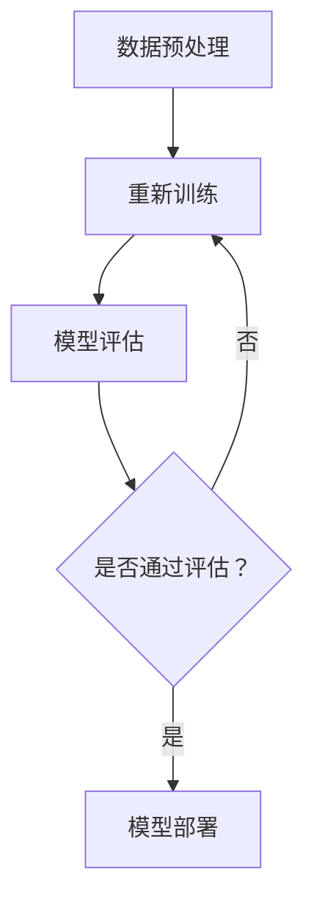
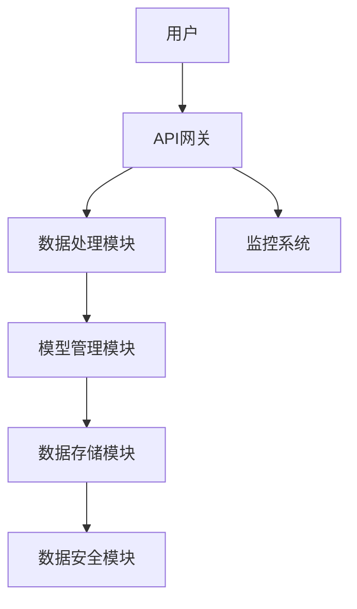

                 

# 中小企业采用AI治理平台的挑战

关键词：中小企业，AI治理平台，挑战，解决方案

摘要：随着人工智能技术的迅猛发展，越来越多的中小企业开始关注并尝试采用AI治理平台来提高业务效率和决策质量。然而，这一过程并非一帆风顺，中小企业在采用AI治理平台时面临着一系列挑战。本文将详细分析这些挑战，并探讨可能的解决方案。

## 引言

### AI治理平台的重要性

在当今数字化时代，人工智能（AI）技术已经渗透到各个行业，成为企业提升竞争力的重要手段。AI治理平台作为一种新型的管理工具，旨在帮助企业更好地管理和利用AI技术，确保其应用过程符合伦理、法规和商业要求。对于中小企业来说，采用AI治理平台具有重要意义：

1. **提高业务效率**：AI治理平台能够自动化处理大量数据，提供精准的决策支持，从而提高业务运营效率。
2. **增强数据安全**：AI治理平台可以加强数据安全管理，降低数据泄露风险，确保企业数据的保密性和完整性。
3. **合规性保障**：随着全球数据保护法规的日益严格，采用AI治理平台可以帮助中小企业遵守相关法规，降低法律风险。

### 本文目的

本文旨在探讨中小企业在采用AI治理平台时可能面临的主要挑战，包括技术、组织和法律伦理等方面。通过分析这些挑战，我们希望能够为中小企业提供有益的指导，帮助他们更好地应对并解决这些问题，实现AI治理平台的成功部署。

## 第一章：背景和概述

### 1.1 AI治理平台简介

#### 定义

AI治理平台是指用于管理和监控人工智能系统的一系列工具、流程和规范。它不仅涵盖了技术层面，还包括了法律、伦理和组织管理等方面。

#### 重要性与应用领域

AI治理平台在中小企业中的应用具有重要意义。首先，它可以确保AI系统的透明性和可解释性，帮助企业理解AI系统的决策过程。其次，AI治理平台可以帮助企业遵守相关法规，降低法律风险。此外，AI治理平台还可以提高企业的数据管理能力，确保数据的安全性和合规性。

在应用领域方面，AI治理平台已经被广泛应用于金融、医疗、制造和零售等行业。例如，在金融行业，AI治理平台可以帮助银行和金融机构确保其AI系统的合规性，降低信用风险；在医疗行业，AI治理平台可以帮助医院和医疗机构更好地管理医疗数据，提高医疗服务的质量和效率。

### 1.2 AI治理的概念与原则

#### 核心概念

AI治理涉及到多个核心概念，包括：

- **AI系统的透明性**：确保AI系统的决策过程可解释，用户可以理解AI系统的决策依据。
- **AI系统的责任性**：明确AI系统的责任归属，确保在发生问题时可以追溯和问责。
- **AI系统的公平性**：确保AI系统在处理数据时不会产生歧视，保护用户的权益。

#### 原则

AI治理的原则主要包括：

- **合规性**：遵守相关法规和标准，确保AI系统的应用符合法律要求。
- **透明性**：确保AI系统的决策过程公开透明，用户可以理解AI系统的决策依据。
- **责任性**：明确AI系统的责任归属，确保在发生问题时可以追溯和问责。
- **公平性**：确保AI系统在处理数据时不会产生歧视，保护用户的权益。

#### 比较分析

目前，全球范围内存在多种AI治理框架和标准，如欧盟的《通用数据保护条例》（GDPR）、美国的《联邦隐私法》（FPCA）等。这些框架和标准在保障AI系统的透明性、责任性和公平性方面提供了具体指导。然而，不同框架和标准之间存在差异，中小企业需要根据自身实际情况选择合适的治理框架。

### 1.3 小结

本章介绍了AI治理平台的基本概念和重要性，以及AI治理的核心概念和原则。通过这些介绍，读者可以初步了解AI治理平台的基本情况，为后续章节的深入分析打下基础。

## 第二章：AI治理平台采用中的挑战

### 2.1 技术挑战

#### 平台兼容性

中小企业在采用AI治理平台时，首先面临的是平台兼容性问题。不同企业的IT基础设施和业务流程各不相同，AI治理平台需要与这些现有系统进行集成。然而，由于技术栈的差异，这种集成可能面临技术壁垒。例如，某个AI治理平台可能依赖于特定的编程语言或框架，而中小企业现有的系统可能不支持这些技术。

#### 集成与现有系统

即使解决了兼容性问题，AI治理平台与现有系统的集成也是一个复杂的过程。集成过程中，可能需要开发特定的接口和适配器，以确保数据在不同系统之间无缝流动。此外，集成过程中还需要考虑数据格式的统一、数据传输的速度和稳定性等问题。

#### 安全与隐私

安全性和隐私性是中小企业在采用AI治理平台时最为关注的问题之一。AI治理平台通常涉及大量敏感数据的处理，如客户信息、财务数据等。因此，确保这些数据在传输和存储过程中的安全性至关重要。中小企业需要确保AI治理平台具备强大的安全防护措施，如数据加密、访问控制等，以防止数据泄露或被恶意攻击。

### 2.2 组织挑战

#### 改变管理

采用AI治理平台意味着企业需要改变现有的管理模式和工作流程。这种改变可能引发员工的不安和抵触，特别是在技术更新和岗位调整方面。中小企业需要制定有效的改变管理策略，确保员工能够顺利适应新系统。

#### 技能与培训

AI治理平台通常需要专业的技术人才进行维护和管理。中小企业可能面临人才短缺的问题，特别是在高级技术人才方面。为了应对这一挑战，中小企业需要制定人才引进和培养计划，确保有足够的人手来支持AI治理平台的运营。

#### 组织阻力

组织阻力是中小企业在采用AI治理平台时可能面临的一个重要挑战。员工可能因为对新系统的担忧或对改变的不适应而抵制新系统的引入。此外，管理层也可能因为对新技术的疑虑或对成本的关注而延迟或拒绝采用AI治理平台。中小企业需要通过有效的沟通和培训来减少组织阻力。

### 2.3 法律和伦理挑战

#### 合规性

随着全球数据保护法规的日益严格，中小企业在采用AI治理平台时需要确保其符合相关法规。例如，欧盟的GDPR对数据保护提出了严格要求，企业需要确保其AI治理平台能够满足这些要求。否则，企业可能会面临高额的罚款和法律责任。

#### 伦理问题

AI治理平台在应用过程中可能会引发一系列伦理问题。例如，AI系统可能因为数据偏差而产生歧视性决策，影响用户的权益。此外，AI系统的透明性和可解释性也是一个重要伦理问题。企业需要确保其AI治理平台在应用过程中符合伦理标准，保护用户的权益。

### 2.4 小结

本章分析了中小企业在采用AI治理平台时可能面临的主要技术、组织和法律伦理挑战。通过了解这些挑战，中小企业可以更好地准备和规划AI治理平台的引入和运营。

## 第三章：法律和伦理方面的考虑

### 3.1 数据保护法规的合规性

#### 全球数据保护法规

在全球范围内，数据保护法规的合规性是中小企业采用AI治理平台时必须关注的重要问题。例如，欧盟的《通用数据保护条例》（GDPR）和美国加州的《消费者隐私法案》（CCPA）都对企业的数据处理活动提出了严格要求。中小企业需要确保其AI治理平台能够满足这些法规的要求，例如：

- **数据收集和处理**：中小企业需要确保在收集和处理用户数据时遵循合法、透明和公正的原则。
- **数据存储**：中小企业需要确保数据存储在符合法规要求的服务器上，并采取必要的安全措施保护数据。
- **用户权利**：中小企业需要确保用户能够行使数据访问、删除、纠正和限制处理等权利。

#### 数据匿名化和保护措施

为了符合数据保护法规，中小企业需要对数据进行匿名化和加密处理。例如，可以使用数据匿名化技术对敏感数据进行处理，确保数据在传输和存储过程中的安全。此外，中小企业还可以采取以下保护措施：

- **访问控制**：通过设置严格的访问权限，确保只有授权人员可以访问敏感数据。
- **数据加密**：使用加密技术对数据进行加密存储和传输，防止数据泄露。
- **安全审计**：定期进行安全审计，确保AI治理平台在数据保护方面符合法规要求。

### 3.2 AI治理中的伦理问题

#### 偏见问题

AI治理平台在应用过程中可能会因为数据偏差而产生偏见。例如，如果训练数据存在性别、种族或年龄等偏见，AI系统可能会在这些方面产生歧视性决策。这种偏见可能会对用户权益产生严重影响，损害企业的声誉。

#### 透明性和可解释性

AI系统的透明性和可解释性是AI治理中的重要伦理问题。用户需要了解AI系统的决策依据和过程，以便对AI系统的决策进行监督和评价。然而，许多复杂的AI系统，如深度神经网络，其决策过程通常是黑箱操作，难以解释。中小企业需要确保其AI治理平台具备一定的透明性和可解释性，例如：

- **决策解释**：提供决策解释功能，让用户可以了解AI系统做出决策的原因。
- **算法审计**：定期进行算法审计，确保AI系统的决策过程符合伦理要求。
- **用户反馈**：建立用户反馈机制，收集用户对AI系统决策的反馈，并根据反馈调整算法。

#### 责任归属

在AI治理中，责任归属也是一个重要伦理问题。当AI系统出现错误或产生负面影响时，如何确定责任归属是一个挑战。中小企业需要明确AI系统的责任归属，确保在发生问题时可以追溯和问责。

### 3.3 小结

本章分析了中小企业在采用AI治理平台时面临的法律法规和伦理问题。通过了解这些问题，中小企业可以采取相应的措施，确保其AI治理平台在合规性和伦理方面符合要求。

## 第四章：成功案例研究

### 4.1 案例一：公司A

#### 案例背景

公司A是一家中小企业，专注于金融科技领域。为了提高业务效率和决策质量，公司A决定采用AI治理平台。

#### 挑战与解决方案

1. **技术挑战**：公司A的IT基础设施较为复杂，包括多个不同的系统和数据源。为了解决这个问题，公司A采用了微服务架构，将AI治理平台与现有系统进行模块化集成。这样不仅可以提高系统的兼容性，还可以确保数据在不同系统之间无缝流动。

2. **组织挑战**：公司A的员工对AI治理平台存在一定的抵触情绪，担心新系统会影响他们的工作。为了解决这个问题，公司A开展了全面的员工培训计划，帮助员工了解AI治理平台的功能和应用。此外，公司A还建立了员工反馈机制，鼓励员工提出建议和意见。

3. **法律和伦理挑战**：公司A需要确保AI治理平台符合相关法律法规，特别是数据保护法规。为了解决这个问题，公司A采用了数据匿名化和加密技术，确保用户数据在传输和存储过程中的安全性。此外，公司A还建立了透明性和可解释性机制，让用户可以了解AI系统的决策依据。

#### 结果与影响

通过成功引入AI治理平台，公司A实现了以下成果：

- **业务效率提高**：AI治理平台自动化处理大量数据，提高了业务决策的速度和准确性。
- **数据安全增强**：数据匿名化和加密技术确保了用户数据的安全性和合规性。
- **员工满意度提升**：全面的员工培训计划和反馈机制增强了员工对AI治理平台的认可和满意度。

### 4.2 案例二：公司B

#### 案例背景

公司B是一家从事医疗设备制造的企业。为了提高产品开发和市场竞争力，公司B决定采用AI治理平台。

#### 挑战与解决方案

1. **技术挑战**：公司B的AI治理平台需要与多个医疗设备系统集成，确保数据在不同系统之间无缝流动。为了解决这个问题，公司B采用了API接口和数据总线技术，实现了AI治理平台与现有系统的集成。

2. **组织挑战**：公司B的员工对AI治理平台存在一定的担忧，担心新系统会取代他们的工作。为了解决这个问题，公司B开展了全面的员工培训和沟通计划，帮助员工了解AI治理平台的功能和应用，并强调新系统将提高他们的工作效率。

3. **法律和伦理挑战**：公司B需要确保AI治理平台符合医疗行业的法律法规和伦理要求。为了解决这个问题，公司B建立了数据保护委员会，负责监督AI治理平台的数据处理活动，确保其符合相关法规和伦理标准。

#### 结果与影响

通过成功引入AI治理平台，公司B实现了以下成果：

- **产品开发效率提高**：AI治理平台自动化处理大量数据，提高了产品开发的效率和准确性。
- **市场竞争能力增强**：AI治理平台提供的精准决策支持帮助公司B在市场上获得了竞争优势。
- **员工满意度提升**：全面的员工培训和沟通计划增强了员工对AI治理平台的认可和满意度。

### 4.3 案例总结

通过以上两个案例可以看出，中小企业在采用AI治理平台时面临多种挑战。然而，通过有效的解决方案和良好的项目管理，这些挑战可以被克服。成功案例表明，AI治理平台可以显著提高中小企业的业务效率和竞争力。

## 第五章：最佳实践与建议

### 5.1 战略开发

为了成功采用AI治理平台，中小企业需要制定一个明确的战略。以下是制定战略的建议：

1. **需求分析**：首先，企业需要明确采用AI治理平台的目标和需求。这包括提高业务效率、增强数据安全、遵守法律法规等。

2. **资源规划**：在制定战略时，企业需要评估所需的资源，包括人力、技术和资金。根据资源情况，制定合理的预算和计划。

3. **时间表**：制定一个详细的实施时间表，确保项目的顺利进行。时间表应包括关键里程碑、任务分配和进度监控。

4. **风险管理**：识别项目可能面临的风险，并制定相应的应对策略。例如，对于技术挑战，可以采用试点项目逐步推广；对于组织挑战，可以提前进行员工培训和沟通。

### 5.2 实施路线图

中小企业可以采用以下路线图来实施AI治理平台：

1. **阶段一：需求调研与评估**：
   - 与关键利益相关者沟通，明确需求。
   - 对现有系统进行评估，确定集成方案。

2. **阶段二：试点项目**：
   - 选择一个小规模的试点项目，进行AI治理平台的初步实施。
   - 收集试点项目的反馈，为全面实施做好准备。

3. **阶段三：全面实施**：
   - 在试点项目成功的基础上，全面推广AI治理平台。
   - 对员工进行培训，确保他们能够熟练使用新系统。

4. **阶段四：持续优化**：
   - 定期进行系统评估，收集用户反馈。
   - 根据反馈进行系统优化和改进。

### 5.3 最佳实践建议

1. **加强沟通**：在整个实施过程中，加强与企业内部和外部利益相关者的沟通，确保各方对AI治理平台的目标和需求有清晰的认识。

2. **持续培训**：为员工提供定期的培训，确保他们能够持续掌握新系统的技能。

3. **数据安全**：确保AI治理平台的数据安全，采取必要的措施保护用户数据。

4. **遵循法规**：遵守相关法律法规，确保AI治理平台的合规性。

5. **用户参与**：鼓励用户参与AI治理平台的设计和优化，确保系统能够满足实际需求。

### 5.4 小结

通过制定明确的战略、实施详细的路线图和采取最佳实践，中小企业可以成功采用AI治理平台，实现业务效率的提升和竞争力的增强。

## 总结

中小企业在采用AI治理平台的过程中面临多种挑战，包括技术、组织和法律伦理等方面。然而，通过有效的解决方案和良好的项目管理，这些挑战可以被克服。本文通过分析挑战、提供成功案例和最佳实践，旨在为中小企业提供有益的指导，帮助他们成功采用AI治理平台，实现业务效率和竞争力的提升。

### 拓展阅读

- GDPR（《通用数据保护条例》）：https://www.eugdpr.org/
- CCPA（《消费者隐私法案》）：https://oag.ca.gov/privacy/ccpa
- AI伦理指南：https://www.aiethics.eu/

### 注意事项

- 在采用AI治理平台时，务必确保数据安全，采取必要的安全措施保护用户数据。
- 加强员工培训，确保他们能够熟练使用AI治理平台。
- 定期进行系统评估，收集用户反馈，持续优化系统。

作者：AI天才研究院/AI Genius Institute & 禅与计算机程序设计艺术 /Zen And The Art of Computer Programming## 技术挑战分析

中小企业在采用AI治理平台时，技术层面的挑战尤为突出。以下将详细分析这些挑战，并探讨相应的解决方案。

### 平台兼容性

**问题背景：**  
中小企业通常拥有多样化的IT系统，这些系统可能由不同的供应商提供，使用不同的技术栈。AI治理平台需要与这些系统进行集成，以实现数据共享和流程协同。然而，不同的技术栈和架构可能导致兼容性问题。

**问题描述：**  
兼容性问题可能表现为数据格式不匹配、接口不兼容或系统通信障碍。例如，某个AI治理平台可能依赖于RESTful API，而现有系统可能仅支持SOAP服务。这会导致数据在传输过程中出现格式错误或无法成功接收。

**问题解决：**  
1. **使用适配器技术：** 开发适配器将不同接口和数据格式转换为统一的格式，确保数据在不同系统之间无缝流动。
2. **微服务架构：** 采用微服务架构，将大型系统分解为多个小型、独立的模块，每个模块负责特定的功能。这样可以降低系统集成的复杂性，提高系统的兼容性。

**边界与外延：**  
兼容性问题不仅限于技术层面，还可能涉及到业务流程和用户界面。因此，在解决兼容性问题时，需要综合考虑技术、业务和用户需求。

**概念结构与核心要素组成：**  
- **接口适配器：** 用于不同系统之间的数据格式转换和通信。
- **微服务架构：** 将大型系统分解为多个小型模块，提高系统的灵活性和兼容性。

### 集成与现有系统

**问题背景：**  
AI治理平台需要与现有系统进行集成，以确保数据共享和流程协同。然而，集成过程中可能面临多种技术障碍，如数据格式不统一、接口不兼容、通信协议不一致等。

**问题描述：**  
在集成过程中，可能遇到以下问题：
1. **数据格式不一致：** 现有系统可能使用不同的数据格式，导致数据在传输过程中出现格式错误。
2. **接口不兼容：** AI治理平台与现有系统的接口可能不兼容，导致数据无法成功接收或处理。
3. **通信协议不一致：** 系统之间的通信协议可能不一致，导致数据在传输过程中出现丢失或延迟。

**问题解决：**  
1. **统一数据格式：** 通过数据转换工具，将不同系统之间的数据格式转换为统一的格式，确保数据在传输过程中保持一致性。
2. **开发接口适配器：** 开发适配器，将AI治理平台与现有系统的接口进行整合，确保数据在不同系统之间无缝流动。
3. **使用标准的通信协议：** 选择标准的通信协议，如HTTP、HTTPS、RESTful API等，确保系统之间的通信稳定和高效。

**边界与外延：**  
集成过程不仅涉及技术层面，还包括业务流程和用户界面。因此，在解决集成问题时，需要综合考虑技术、业务和用户需求。

**概念结构与核心要素组成：**  
- **数据转换工具：** 用于不同系统之间的数据格式转换。
- **接口适配器：** 用于不同系统之间的接口整合。
- **通信协议：** 确保系统之间的通信稳定和高效。

### 安全与隐私

**问题背景：**  
AI治理平台处理大量敏感数据，如客户信息、财务数据等。这些数据在传输和存储过程中面临泄露或被恶意攻击的风险。

**问题描述：**  
安全问题可能表现为数据泄露、数据篡改、系统被恶意攻击等。例如，黑客可能通过钓鱼邮件或恶意软件窃取企业数据，或通过SQL注入攻击修改数据库内容。

**问题解决：**  
1. **数据加密：** 在数据传输和存储过程中采用加密技术，确保数据在传输过程中的安全性。
2. **访问控制：** 通过设置严格的访问权限，确保只有授权人员可以访问敏感数据。
3. **防火墙和安全审计：** 在网络边界部署防火墙，防止外部攻击。定期进行安全审计，及时发现和解决安全漏洞。
4. **用户身份验证：** 采用多因素身份验证，确保用户在访问系统时需要进行双重验证。

**边界与外延：**  
除了技术层面的安全措施，企业还需要制定安全政策和培训员工，提高他们的安全意识和防范能力。

**概念结构与核心要素组成：**  
- **数据加密：** 确保数据在传输和存储过程中的安全性。
- **访问控制：** 通过设置访问权限，确保只有授权人员可以访问敏感数据。
- **防火墙和安全审计：** 保护系统免受外部攻击和内部威胁。
- **用户身份验证：** 提高系统访问的安全性。

### 小结

技术挑战是中小企业在采用AI治理平台时面临的重要问题。通过分析平台兼容性、集成与现有系统、安全与隐私等挑战，并采取相应的解决方案，中小企业可以更好地应对这些技术挑战，确保AI治理平台的成功部署。

## 组织挑战分析

中小企业在采用AI治理平台时，除了技术层面的挑战，还面临组织层面的挑战。以下将详细分析这些挑战，并探讨相应的解决方案。

### 改变管理

**问题背景：**  
AI治理平台引入新的管理流程和技术工具，对企业现有的管理模式和工作流程产生重大影响。管理层需要适应新的管理模式，确保组织能够有效地利用AI治理平台。

**问题描述：**  
改变管理可能引发以下问题：
1. **管理观念转变：** 管理层需要从传统的管理模式转变为更加数据驱动的管理模式。
2. **流程调整：** 现有业务流程可能需要根据AI治理平台的特点进行调整，以提高效率。
3. **角色定位：** 管理层和员工的职责和角色可能发生变化，需要重新定义和分配。

**问题解决：**  
1. **培训和管理层支持：** 为管理层提供专业的培训，帮助他们理解AI治理平台的优势和功能。同时，管理层需要积极参与到平台部署过程中，提供必要的支持和指导。
2. **逐步过渡：** 在引入AI治理平台的过程中，采取逐步过渡的策略，逐步调整业务流程和管理模式，避免对组织产生过大的冲击。
3. **明确角色和职责：** 根据AI治理平台的特点，重新定义和管理层及员工的职责和角色，确保每个人都能充分发挥其优势。

**边界与外延：**  
改变管理不仅涉及企业内部的管理模式和流程，还可能涉及到外部合作伙伴和供应商的协同工作。因此，在解决改变管理问题时，需要综合考虑内部和外部因素。

**概念结构与核心要素组成：**  
- **管理层培训：** 帮助管理层理解AI治理平台的优势和功能。
- **逐步过渡：** 逐步调整业务流程和管理模式，降低对组织的冲击。
- **角色定位：** 明确管理层和员工的职责和角色，确保组织的高效运作。

### 技能与培训

**问题背景：**  
AI治理平台通常涉及复杂的技术和数据分析技能，中小企业可能缺乏相关人才。因此，员工需要接受培训，以提高其技能水平，更好地适应新平台。

**问题描述：**  
技能与培训可能引发以下问题：
1. **人才短缺：** 中小企业可能难以吸引和留住高级技术人才。
2. **培训资源不足：** 企业可能缺乏足够的培训资源和资金，无法为员工提供全面的培训。
3. **技能更新：** 随着技术的快速发展，员工需要不断更新其技能，以适应新的技术趋势。

**问题解决：**  
1. **内部培训：** 企业可以建立内部培训计划，为员工提供基础和进阶的培训课程，提高他们的技能水平。
2. **外部培训：** 与专业培训机构合作，为员工提供专业的培训服务。此外，企业可以鼓励员工参加行业会议和研讨会，了解最新的技术动态。
3. **人才培养计划：** 制定长期的人才培养计划，为员工提供职业发展和晋升机会，吸引和留住人才。

**边界与外延：**  
技能与培训不仅涉及企业内部员工的培养，还可能涉及到合作伙伴和供应商的培训。因此，在解决技能与培训问题时，需要考虑外部因素。

**概念结构与核心要素组成：**  
- **内部培训：** 提供基础和进阶的培训课程，提高员工技能水平。
- **外部培训：** 利用专业培训机构和行业会议，为员工提供专业的培训服务。
- **人才培养计划：** 制定长期的人才培养计划，为员工提供职业发展和晋升机会。

### 组织阻力

**问题背景：**  
在引入AI治理平台的过程中，企业内部可能会存在组织阻力。员工可能因为对新系统的担忧或对改变的不适应而抵制新系统的引入。

**问题描述：**  
组织阻力可能表现为以下问题：
1. **员工抵触：** 员工对新系统可能存在抵触情绪，担心新技术会取代他们的工作。
2. **管理障碍：** 管理层可能因为对新技术的不熟悉或对成本的担忧而延迟或拒绝引入新系统。
3. **沟通不畅：** 员工与管理层之间的沟通不畅可能导致误解和抵触情绪。

**问题解决：**  
1. **有效沟通：** 建立有效的沟通机制，确保员工和管理层对新系统的优势和应用有清晰的认识。企业可以通过会议、培训、内部通讯等方式，及时传递信息，解答员工疑问。
2. **激励机制：** 设立激励机制，鼓励员工积极参与新系统的学习和使用。例如，对表现优秀的员工进行表彰和奖励。
3. **透明度：** 提高决策过程的透明度，让员工了解新系统的引入对企业发展的重要性，增强他们的参与感和责任感。

**边界与外延：**  
组织阻力不仅涉及企业内部员工和管理层，还可能涉及到外部合作伙伴和供应商的抵触。因此，在解决组织阻力问题时，需要综合考虑内部和外部因素。

**概念结构与核心要素组成：**  
- **有效沟通：** 建立沟通机制，确保员工和管理层对新系统的优势和应用有清晰的认识。
- **激励机制：** 通过激励措施，鼓励员工积极参与新系统的学习和使用。
- **透明度：** 提高决策过程的透明度，增强员工的参与感和责任感。

### 小结

组织挑战是中小企业在采用AI治理平台时不可忽视的问题。通过分析改变管理、技能与培训和组织阻力等挑战，并采取相应的解决方案，中小企业可以更好地应对这些组织挑战，确保AI治理平台的成功部署。

## 法律和伦理方面的挑战分析

中小企业在采用AI治理平台时，不仅需要应对技术和组织层面的挑战，还必须认真考虑法律和伦理方面的问题。以下将详细分析中小企业在AI治理平台采用过程中可能遇到的法律和伦理挑战，并提供相应的解决方案。

### 数据保护法规的合规性

#### 问题背景

随着全球数据保护法规的日益严格，中小企业在采用AI治理平台时必须确保其数据处理活动符合相关法规。例如，欧盟的《通用数据保护条例》（GDPR）和美国加州的《消费者隐私法案》（CCPA）都对企业的数据处理提出了严格要求。

#### 描述问题

中小企业可能面临以下数据保护法规合规性问题：
1. **数据收集和处理**：企业需要确保在收集和处理用户数据时遵循合法、透明和公正的原则。例如，GDPR要求企业在收集用户数据前必须获得用户的明确同意。
2. **数据存储**：企业需要确保数据存储在符合法规要求的服务器上，并采取必要的安全措施保护数据。例如，CCPA要求企业在处理加州用户数据时必须遵守特定的存储和传输要求。
3. **用户权利**：企业需要确保用户能够行使数据访问、删除、纠正和限制处理等权利。例如，GDPR要求企业提供数据访问和删除请求的渠道，并在规定时间内予以响应。

#### 解决方案

1. **合规性评估**：在引入AI治理平台前，企业应进行全面的合规性评估，了解相关法规的要求，确保平台设计和实施符合法规。
2. **数据匿名化和加密**：通过数据匿名化和加密技术，确保用户数据在传输和存储过程中的安全性。例如，使用加密技术对敏感数据进行加密存储和传输，防止数据泄露。
3. **用户同意和权利**：在数据收集和处理过程中，确保获得用户的明确同意，并建立用户数据访问和删除请求的渠道。例如，在用户注册和使用过程中，明确告知用户其数据的处理方式和权利。

### 伦理问题

#### 问题背景

AI治理平台在应用过程中可能会引发一系列伦理问题，如数据偏见、算法公平性和透明性等。这些问题可能对用户权益产生重大影响，损害企业的声誉。

#### 描述问题

中小企业可能面临以下伦理问题：
1. **数据偏见**：AI治理平台在处理数据时可能会因为数据偏差而产生歧视性决策。例如，如果训练数据存在性别、种族或年龄等偏见，AI系统可能会在这些方面产生歧视性决策。
2. **算法公平性**：企业需要确保AI治理平台在处理数据时不会产生不公平的结果，保护用户的权益。例如，AI系统不应该因为用户的性别、种族或经济状况而对其决策产生偏见。
3. **透明性和可解释性**：用户需要了解AI系统的决策依据和过程，以便对AI系统的决策进行监督和评价。然而，许多复杂的AI系统，如深度神经网络，其决策过程通常是黑箱操作，难以解释。

#### 解决方案

1. **数据偏见检测和纠正**：在数据收集和处理过程中，企业应采取必要措施检测和纠正数据偏见。例如，通过数据清洗和平衡技术，确保训练数据不会引入偏见。
2. **算法公平性评估**：企业应定期对AI治理平台进行算法公平性评估，确保其决策过程符合公平性原则。例如，通过对比不同群体的决策结果，检测是否存在歧视性决策。
3. **透明性和可解释性**：企业应提供决策解释功能，让用户可以了解AI系统做出决策的原因。例如，通过可视化工具和报告，展示AI系统的决策过程和依据。

### 责任归属

#### 问题背景

当AI治理平台发生错误或产生负面影响时，如何确定责任归属是一个重要伦理问题。责任归属不明确可能导致企业无法追究责任，从而影响企业的声誉和利益。

#### 描述问题

中小企业可能面临以下责任归属问题：
1. **算法错误**：AI治理平台可能因为算法错误而产生错误决策，影响用户权益。例如，如果AI系统错误地将用户归类为高风险客户，可能导致用户无法获得贷款。
2. **数据泄露**：如果AI治理平台的数据保护措施不足，可能导致用户数据泄露，损害用户权益。
3. **隐私侵犯**：AI治理平台可能因为过度收集或处理用户数据而侵犯用户隐私，引发法律纠纷。

#### 解决方案

1. **明确责任归属**：企业应明确AI治理平台的责任归属，确保在发生问题时可以追溯和问责。例如，可以制定责任分配协议，明确开发、运维和用户管理等各个环节的责任。
2. **风险管理和审计**：企业应建立风险管理和审计机制，确保AI治理平台在设计和实施过程中符合伦理和法律要求。例如，通过定期进行算法审计和合规性检查，及时发现和纠正问题。
3. **用户投诉处理**：企业应建立用户投诉处理机制，及时处理用户对AI治理平台的不满和投诉。例如，设立用户投诉热线和在线反馈渠道，确保用户的问题得到及时解决。

### 小结

法律和伦理问题是中小企业在采用AI治理平台时不可忽视的重要挑战。通过分析数据保护法规的合规性、伦理问题和责任归属等方面，并采取相应的解决方案，中小企业可以确保AI治理平台的合规性和伦理性，保护用户权益，维护企业声誉。

### 成功案例研究：公司A

#### 案例背景

公司A是一家金融科技公司，专注于为客户提供高效、安全的金融服务。为了提升业务效率和数据管理能力，公司A决定引入AI治理平台。然而，面对复杂的IT基础设施和严格的数据保护法规，公司A需要制定详细的实施计划和应对策略。

#### 挑战与解决方案

1. **兼容性问题：** 公司A的现有系统包括多个不同供应商的软件，这些系统使用了不同的技术和接口。为了确保AI治理平台能够与现有系统兼容，公司A采用了微服务架构。通过将复杂的系统分解为多个独立的微服务，每个微服务负责特定的功能，公司A能够实现不同系统之间的无缝集成。

   **技术解决方案：**
   - **微服务架构**：采用微服务架构，将大型系统分解为多个小型、独立的模块，每个模块负责特定的功能。
   - **接口适配器**：开发接口适配器，将AI治理平台与现有系统的接口进行整合，确保数据在不同系统之间无缝流动。

2. **集成与现有系统：** AI治理平台需要与公司A的多个业务系统进行集成，包括客户关系管理系统（CRM）、财务系统和风险管理系统等。集成过程中，公司A面临数据格式不一致和接口不兼容的问题。

   **技术解决方案：**
   - **数据转换工具**：使用数据转换工具，将不同系统之间的数据格式转换为统一的格式，确保数据在传输过程中保持一致性。
   - **API接口**：开发API接口，将AI治理平台与现有系统的接口进行整合，确保数据在不同系统之间无缝流动。

3. **安全与隐私：** 公司A需要确保AI治理平台处理的大量敏感数据在传输和存储过程中的安全性。为了防止数据泄露和恶意攻击，公司A采取了多种安全措施。

   **技术解决方案：**
   - **数据加密**：在数据传输和存储过程中采用加密技术，确保数据在传输过程中的安全性。
   - **访问控制**：通过设置严格的访问权限，确保只有授权人员可以访问敏感数据。
   - **防火墙和安全审计**：在网络边界部署防火墙，防止外部攻击。定期进行安全审计，及时发现和解决安全漏洞。

4. **组织挑战：** 公司A的员工对AI治理平台存在一定的抵触情绪，担心新技术会影响他们的工作。为了解决这一问题，公司A开展了全面的员工培训和沟通计划。

   **组织解决方案：**
   - **培训计划**：为员工提供定期的培训，确保他们能够熟练使用AI治理平台。
   - **激励机制**：设立激励机制，鼓励员工积极参与AI治理平台的学习和使用。
   - **沟通渠道**：建立有效的沟通渠道，确保员工和管理层之间的信息畅通，解答员工的疑问。

5. **法律和伦理问题：** 公司A需要确保AI治理平台在数据处理过程中符合相关法律法规和伦理标准。为此，公司A建立了数据保护委员会，负责监督数据处理活动。

   **法律和伦理解决方案：**
   - **合规性评估**：在引入AI治理平台前，进行全面的合规性评估，确保符合相关法规。
   - **数据匿名化和加密**：采用数据匿名化和加密技术，确保用户数据在传输和存储过程中的安全性。
   - **用户同意和权利**：确保用户在数据收集和处理过程中获得明确同意，并建立用户数据访问和删除请求的渠道。

#### 实施效果

通过上述解决方案，公司A成功引入了AI治理平台，实现了以下成果：

- **业务效率提高**：AI治理平台自动化处理大量数据，提高了业务决策的速度和准确性。
- **数据安全增强**：数据加密和安全审计等措施确保了用户数据在传输和存储过程中的安全性。
- **员工满意度提升**：全面的员工培训和激励机制增强了员工对AI治理平台的认可和满意度。

#### 案例小结

公司A的成功案例表明，中小企业在引入AI治理平台时，需要综合考虑技术、组织和法律伦理等多方面的挑战，并采取相应的解决方案。通过有效的规划和实施，中小企业可以实现业务效率和竞争力的提升。

### 成功案例研究：公司B

#### 案例背景

公司B是一家医疗设备制造企业，致力于为医疗机构提供高质量的设备和服务。为了提高产品开发效率和市场需求响应速度，公司B决定引入AI治理平台。

#### 挑战与解决方案

1. **技术挑战：** 公司B的AI治理平台需要与多个医疗设备系统集成，以确保数据的实时共享和处理。由于不同系统使用了不同的技术和接口，公司B面临数据格式不一致和接口不兼容的问题。

   **技术解决方案：**
   - **数据总线**：采用数据总线技术，实现不同系统之间的数据传输和同步，确保数据的一致性和完整性。
   - **API接口**：开发API接口，将AI治理平台与现有系统的接口进行整合，确保数据在不同系统之间无缝流动。

2. **组织挑战：** 公司B的员工对AI治理平台存在一定的担忧，担心新技术会影响他们的工作稳定性。此外，管理层对AI技术的认知有限，对平台的应用前景持观望态度。

   **组织解决方案：**
   - **员工培训**：为员工提供专业的AI技术培训，提高他们的技能水平，增强他们对新平台的信心。
   - **管理层沟通**：与公司管理层进行多次沟通，解释AI治理平台的优势和应用前景，争取他们的支持。
   - **试点项目**：在引入AI治理平台前，先进行小范围的试点项目，收集员工和管理层的反馈，根据反馈进行调整。

3. **法律和伦理挑战：** 公司B需要确保AI治理平台在数据处理过程中符合医疗行业的法律法规和伦理标准。特别是，公司B需要处理大量的患者数据，这些数据涉及隐私和法律风险。

   **法律和伦理解决方案：**
   - **合规性评估**：在引入AI治理平台前，进行全面的合规性评估，确保符合相关法律法规。
   - **数据保护措施**：采用数据加密和访问控制技术，确保患者数据在传输和存储过程中的安全性。
   - **用户同意和隐私保护**：在数据收集和处理过程中，确保获得患者的明确同意，并设立数据访问和删除请求的渠道。

#### 实施效果

通过上述解决方案，公司B成功引入了AI治理平台，实现了以下成果：

- **产品开发效率提高**：AI治理平台自动化处理大量数据，提高了产品开发的效率和准确性。
- **市场需求响应速度提升**：AI治理平台提供了实时数据分析功能，帮助公司B更快地响应市场需求。
- **员工和管理层满意度提升**：员工通过培训提高了技能水平，管理层对AI治理平台的应用前景更加认同。

#### 案例小结

公司B的成功案例表明，中小企业在引入AI治理平台时，需要综合考虑技术、组织和法律伦理等多方面的挑战，并采取相应的解决方案。通过有效的规划和实施，中小企业可以实现业务效率和竞争力的提升。

## 最佳实践与建议

### 制定明确战略

中小企业在采用AI治理平台时，首先需要制定一个明确的战略。以下步骤可以帮助中小企业制定有效的AI治理平台战略：

1. **需求分析**：明确企业采用AI治理平台的目标和需求。这包括提高业务效率、增强数据安全、遵守法律法规等。

2. **资源规划**：评估企业现有资源，包括人力、技术和资金。根据资源情况，制定合理的预算和计划。

3. **时间表**：制定详细的实施时间表，包括关键里程碑、任务分配和进度监控。

4. **风险管理**：识别项目可能面临的风险，并制定相应的应对策略。例如，对于技术挑战，可以采用试点项目逐步推广；对于组织挑战，可以提前进行员工培训和沟通。

### 实施路线图

为了确保AI治理平台的顺利实施，中小企业可以遵循以下实施路线图：

1. **阶段一：需求调研与评估**：与关键利益相关者沟通，明确需求。对现有系统进行评估，确定集成方案。

2. **阶段二：试点项目**：选择一个小规模的试点项目，进行AI治理平台的初步实施。收集试点项目的反馈，为全面实施做好准备。

3. **阶段三：全面实施**：在试点项目成功的基础上，全面推广AI治理平台。对员工进行培训，确保他们能够熟练使用新系统。

4. **阶段四：持续优化**：定期进行系统评估，收集用户反馈，并根据反馈进行系统优化和改进。

### 最佳实践建议

1. **加强沟通**：在整个实施过程中，加强与企业内部和外部利益相关者的沟通，确保各方对AI治理平台的目标和需求有清晰的认识。

2. **持续培训**：为员工提供定期的培训，确保他们能够持续掌握新系统的技能。

3. **数据安全**：确保AI治理平台的数据安全，采取必要的措施保护用户数据。

4. **遵循法规**：遵守相关法律法规，确保AI治理平台的合规性。

5. **用户参与**：鼓励用户参与AI治理平台的设计和优化，确保系统能够满足实际需求。

### 小结

通过制定明确的战略、实施详细的路线图和采取最佳实践，中小企业可以成功采用AI治理平台，实现业务效率的提升和竞争力的增强。

## 总结

中小企业在采用AI治理平台的过程中面临着多种挑战，包括技术、组织和法律伦理等方面。这些挑战不仅影响了AI治理平台的部署效果，也对企业的长期发展产生了重要影响。本文通过详细分析这些挑战，并探讨成功案例和最佳实践，为中小企业提供了有益的指导。

### 技术挑战

中小企业在采用AI治理平台时，首先面临的是技术层面的挑战。这些挑战包括平台兼容性、集成与现有系统、安全与隐私等方面。通过采用微服务架构、开发接口适配器、数据转换工具以及数据加密等技术手段，中小企业可以克服这些技术挑战，确保AI治理平台与现有系统的无缝集成和数据安全。

### 组织挑战

组织层面的挑战是中小企业在采用AI治理平台时不可忽视的问题。这些挑战包括改变管理、技能与培训和组织阻力等。通过提供培训和管理层支持、逐步过渡和明确角色定位，中小企业可以克服组织挑战，确保员工和管理层能够有效适应AI治理平台。

### 法律和伦理挑战

法律和伦理方面的挑战是中小企业在采用AI治理平台时必须认真对待的问题。这些挑战包括数据保护法规的合规性、伦理问题和责任归属等。通过进行合规性评估、采取数据匿名化和加密措施、明确责任归属和建立用户投诉处理机制，中小企业可以确保AI治理平台在法律和伦理方面的合规性。

### 成功案例与最佳实践

通过分析成功案例，我们可以看到中小企业在采用AI治理平台时，通过有效的解决方案和良好的项目管理，可以克服各种挑战，实现业务效率的提升和竞争力的增强。此外，最佳实践建议如制定明确战略、实施路线图、加强沟通、持续培训和用户参与，也为中小企业提供了宝贵的经验。

### 展望未来

展望未来，中小企业在采用AI治理平台的过程中将继续面临新的挑战。随着技术的不断进步和法律法规的不断完善，中小企业需要不断更新其战略和解决方案，以适应不断变化的环境。同时，中小企业也应积极探索新的应用场景，发挥AI治理平台的潜力，推动企业数字化转型的深入发展。

### 拓展阅读

为了帮助读者深入了解AI治理平台的相关内容，本文推荐以下拓展阅读：

- GDPR（《通用数据保护条例》）：https://www.eugdpr.org/
- CCPA（《消费者隐私法案》）：https://oag.ca.gov/privacy/ccpa
- AI伦理指南：https://www.aiethics.eu/

### 注意事项

- 在采用AI治理平台时，务必确保数据安全，采取必要的安全措施保护用户数据。
- 加强员工培训，确保他们能够熟练使用AI治理平台。
- 定期进行系统评估，收集用户反馈，持续优化系统。

作者：AI天才研究院/AI Genius Institute & 禅与计算机程序设计艺术 /Zen And The Art of Computer Programming## 技术挑战分析

中小企业在采用AI治理平台时，首先需要面对的是一系列技术挑战。这些挑战包括平台兼容性、集成与现有系统、安全与隐私等方面。以下是对这些技术挑战的详细分析。

### 平台兼容性

**问题背景：**  
中小企业通常拥有多样化的IT系统，这些系统可能由不同的供应商提供，使用不同的技术栈。AI治理平台需要与这些系统进行集成，以实现数据共享和流程协同。然而，不同的技术栈和架构可能导致兼容性问题。

**问题描述：**  
兼容性问题可能表现为数据格式不匹配、接口不兼容或系统通信障碍。例如，某个AI治理平台可能依赖于RESTful API，而现有系统可能仅支持SOAP服务。这会导致数据在传输过程中出现格式错误或无法成功接收。

**问题解决：**  
1. **使用适配器技术：** 开发适配器将不同接口和数据格式转换为统一的格式，确保数据在不同系统之间无缝流动。  
2. **微服务架构：** 采用微服务架构，将大型系统分解为多个小型、独立的模块，每个模块负责特定的功能。这样可以降低系统集成的复杂性，提高系统的兼容性。

**边界与外延：**  
兼容性问题不仅限于技术层面，还可能涉及到业务流程和用户界面。因此，在解决兼容性问题时，需要综合考虑技术、业务和用户需求。

**概念结构与核心要素组成：**  
- **接口适配器：** 用于不同系统之间的数据格式转换和通信。  
- **微服务架构：** 将大型系统分解为多个小型模块，提高系统的灵活性和兼容性。

### 集成与现有系统

**问题背景：**  
AI治理平台需要与现有系统进行集成，以确保数据共享和流程协同。然而，集成过程中可能面临多种技术障碍，如数据格式不统一、接口不兼容、通信协议不一致等。

**问题描述：**  
在集成过程中，可能遇到以下问题：
1. **数据格式不一致：** 现有系统可能使用不同的数据格式，导致数据在传输过程中出现格式错误。  
2. **接口不兼容：** AI治理平台与现有系统的接口可能不兼容，导致数据无法成功接收或处理。  
3. **通信协议不一致：** 系统之间的通信协议可能不一致，导致数据在传输过程中出现丢失或延迟。

**问题解决：**  
1. **统一数据格式：** 通过数据转换工具，将不同系统之间的数据格式转换为统一的格式，确保数据在传输过程中保持一致性。  
2. **开发接口适配器：** 开发适配器，将AI治理平台与现有系统的接口进行整合，确保数据在不同系统之间无缝流动。  
3. **使用标准的通信协议：** 选择标准的通信协议，如HTTP、HTTPS、RESTful API等，确保系统之间的通信稳定和高效。

**边界与外延：**  
集成过程不仅涉及技术层面，还包括业务流程和用户界面。因此，在解决集成问题时，需要综合考虑技术、业务和用户需求。

**概念结构与核心要素组成：**  
- **数据转换工具：** 用于不同系统之间的数据格式转换。  
- **接口适配器：** 用于不同系统之间的接口整合。  
- **通信协议：** 确保系统之间的通信稳定和高效。

### 安全与隐私

**问题背景：**  
AI治理平台处理大量敏感数据，如客户信息、财务数据等。这些数据在传输和存储过程中面临泄露或被恶意攻击的风险。

**问题描述：**  
安全问题可能表现为数据泄露、数据篡改、系统被恶意攻击等。例如，黑客可能通过钓鱼邮件或恶意软件窃取企业数据，或通过SQL注入攻击修改数据库内容。

**问题解决：**  
1. **数据加密：** 在数据传输和存储过程中采用加密技术，确保数据在传输过程中的安全性。  
2. **访问控制：** 通过设置严格的访问权限，确保只有授权人员可以访问敏感数据。  
3. **防火墙和安全审计：** 在网络边界部署防火墙，防止外部攻击。定期进行安全审计，及时发现和解决安全漏洞。  
4. **用户身份验证：** 采用多因素身份验证，确保用户在访问系统时需要进行双重验证。

**边界与外延：**  
除了技术层面的安全措施，企业还需要制定安全政策和培训员工，提高他们的安全意识和防范能力。

**概念结构与核心要素组成：**  
- **数据加密：** 确保数据在传输和存储过程中的安全性。  
- **访问控制：** 通过设置访问权限，确保只有授权人员可以访问敏感数据。  
- **防火墙和安全审计：** 保护系统免受外部攻击和内部威胁。  
- **用户身份验证：** 提高系统访问的安全性。

### 小结

技术挑战是中小企业在采用AI治理平台时不可忽视的重要问题。通过分析平台兼容性、集成与现有系统、安全与隐私等挑战，并采取相应的解决方案，中小企业可以更好地应对这些技术挑战，确保AI治理平台的成功部署。

## 组织挑战分析

中小企业在采用AI治理平台时，除了需要面对技术层面的挑战，还必须关注组织层面的挑战。这些挑战包括改变管理、技能与培训和员工抵制等。以下是对这些组织挑战的详细分析，并提供相应的解决方案。

### 改变管理

**问题背景：**  
AI治理平台的引入意味着企业需要改变现有的管理模式和工作流程。管理层需要从传统的管理模式转变为更加数据驱动的管理模式，这可能会对现有的组织结构和管理流程产生重大影响。

**问题描述：**  
改变管理可能引发以下问题：
1. **管理观念转变：** 管理层可能需要从传统的决策模式转变为依赖数据和算法进行决策的新模式。
2. **流程调整：** 现有业务流程可能需要根据AI治理平台的特点进行调整，以提高效率。
3. **角色定位：** 管理层和员工的职责和角色可能发生变化，需要重新定义和分配。

**问题解决：**  
1. **培训和管理层支持：** 为管理层提供专业的培训，帮助他们理解AI治理平台的优势和功能。同时，管理层需要积极参与到平台部署过程中，提供必要的支持和指导。
2. **逐步过渡：** 在引入AI治理平台的过程中，采取逐步过渡的策略，逐步调整业务流程和管理模式，避免对组织产生过大的冲击。
3. **明确角色和职责：** 根据AI治理平台的特点，重新定义和管理层及员工的职责和角色，确保每个人都能充分发挥其优势。

**边界与外延：**  
改变管理不仅涉及企业内部的管理模式和流程，还可能涉及到外部合作伙伴和供应商的协同工作。因此，在解决改变管理问题时，需要综合考虑内部和外部因素。

**概念结构与核心要素组成：**  
- **管理层培训：** 帮助管理层理解AI治理平台的优势和功能。  
- **逐步过渡：** 逐步调整业务流程和管理模式，降低对组织的冲击。  
- **角色定位：** 明确管理层和员工的职责和角色，确保组织的高效运作。

### 技能与培训

**问题背景：**  
AI治理平台通常涉及复杂的技术和数据分析技能，中小企业可能缺乏相关人才。因此，员工需要接受培训，以提高其技能水平，更好地适应新平台。

**问题描述：**  
技能与培训可能引发以下问题：
1. **人才短缺：** 中小企业可能难以吸引和留住高级技术人才。
2. **培训资源不足：** 企业可能缺乏足够的培训资源和资金，无法为员工提供全面的培训。
3. **技能更新：** 随着技术的快速发展，员工需要不断更新其技能，以适应新的技术趋势。

**问题解决：**  
1. **内部培训：** 企业可以建立内部培训计划，为员工提供基础和进阶的培训课程，提高他们的技能水平。
2. **外部培训：** 与专业培训机构合作，为员工提供专业的培训服务。此外，企业可以鼓励员工参加行业会议和研讨会，了解最新的技术动态。
3. **人才培养计划：** 制定长期的人才培养计划，为员工提供职业发展和晋升机会，吸引和留住人才。

**边界与外延：**  
技能与培训不仅涉及企业内部员工的培养，还可能涉及到合作伙伴和供应商的培训。因此，在解决技能与培训问题时，需要考虑外部因素。

**概念结构与核心要素组成：**  
- **内部培训：** 提供基础和进阶的培训课程，提高员工技能水平。  
- **外部培训：** 利用专业培训机构和行业会议，为员工提供专业的培训服务。  
- **人才培养计划：** 制定长期的人才培养计划，为员工提供职业发展和晋升机会。

### 员工抵制

**问题背景：**  
在引入AI治理平台的过程中，企业内部可能会存在员工抵制现象。员工可能因为对新系统的担忧或对改变的不适应而抵制新系统的引入。

**问题描述：**  
员工抵制可能表现为以下问题：
1. **员工抵触：** 员工对新系统可能存在抵触情绪，担心新技术会取代他们的工作。
2. **管理障碍：** 管理层可能因为对新技术的不熟悉或对成本的担忧而延迟或拒绝引入新系统。
3. **沟通不畅：** 员工与管理层之间的沟通不畅可能导致误解和抵触情绪。

**问题解决：**  
1. **有效沟通：** 建立有效的沟通机制，确保员工和管理层对新系统的优势和应用有清晰的认识。企业可以通过会议、培训、内部通讯等方式，及时传递信息，解答员工疑问。
2. **激励机制：** 设立激励机制，鼓励员工积极参与新系统的学习和使用。例如，对表现优秀的员工进行表彰和奖励。
3. **透明度：** 提高决策过程的透明度，让员工了解新系统的引入对企业发展的重要性，增强他们的参与感和责任感。

**边界与外延：**  
员工抵制不仅涉及企业内部员工和管理层，还可能涉及到外部合作伙伴和供应商的抵触。因此，在解决员工抵制问题时，需要综合考虑内部和外部因素。

**概念结构与核心要素组成：**  
- **有效沟通：** 建立沟通机制，确保员工和管理层对新系统的优势和应用有清晰的认识。  
- **激励机制：** 通过激励措施，鼓励员工积极参与新系统的学习和使用。  
- **透明度：** 提高决策过程的透明度，增强员工的参与感和责任感。

### 小结

组织挑战是中小企业在采用AI治理平台时不可忽视的重要问题。通过分析改变管理、技能与培训和员工抵制等挑战，并采取相应的解决方案，中小企业可以更好地应对这些组织挑战，确保AI治理平台的成功部署。

## 法律和伦理挑战分析

中小企业在采用AI治理平台时，不仅需要面对技术和组织层面的挑战，还必须认真考虑法律和伦理方面的问题。以下将详细分析中小企业在AI治理平台采用过程中可能遇到的法律和伦理挑战，并提供相应的解决方案。

### 数据保护法规的合规性

#### 问题背景

随着全球数据保护法规的日益严格，中小企业在采用AI治理平台时必须确保其数据处理活动符合相关法规。例如，欧盟的《通用数据保护条例》（GDPR）和美国加州的《消费者隐私法案》（CCPA）都对企业的数据处理提出了严格要求。中小企业需要确保其AI治理平台能够满足这些法规的要求，例如：

- **数据收集和处理**：中小企业需要确保在收集和处理用户数据时遵循合法、透明和公正的原则。
- **数据存储**：中小企业需要确保数据存储在符合法规要求的服务器上，并采取必要的安全措施保护数据。
- **用户权利**：中小企业需要确保用户能够行使数据访问、删除、纠正和限制处理等权利。

#### 描述问题

中小企业可能面临以下数据保护法规合规性问题：

1. **数据收集和处理**：企业可能因为数据收集和处理方式不符合法规要求，例如未获得用户的明确同意或未提供数据使用的透明信息。
2. **数据存储**：企业可能因为数据存储在不符合法规要求的地方，例如在非欧盟地区的服务器上存储欧盟用户数据。
3. **用户权利**：企业可能因为未能有效实施用户的数据权利，例如未能及时响应用户的访问或删除请求。

#### 解决方案

1. **合规性评估**：在引入AI治理平台前，企业应进行全面的合规性评估，了解相关法规的要求，确保平台设计和实施符合法规。
2. **数据匿名化和加密**：通过数据匿名化和加密技术，确保用户数据在传输和存储过程中的安全性。
3. **用户同意和权利**：在数据收集和处理过程中，确保获得用户的明确同意，并建立用户数据访问和删除请求的渠道。

### 伦理问题

#### 问题背景

AI治理平台在应用过程中可能会引发一系列伦理问题，如数据偏见、算法公平性和透明性等。这些问题可能对用户权益产生重大影响，损害企业的声誉。

#### 描述问题

中小企业可能面临以下伦理问题：

1. **数据偏见**：AI治理平台在处理数据时可能会因为数据偏差而产生歧视性决策。例如，如果训练数据存在性别、种族或年龄等偏见，AI系统可能会在这些方面产生歧视性决策。
2. **算法公平性**：企业需要确保AI治理平台在处理数据时不会产生不公平的结果，保护用户的权益。例如，AI系统不应该因为用户的性别、种族或经济状况而对其决策产生偏见。
3. **透明性和可解释性**：用户需要了解AI系统的决策依据和过程，以便对AI系统的决策进行监督和评价。然而，许多复杂的AI系统，如深度神经网络，其决策过程通常是黑箱操作，难以解释。

#### 解决方案

1. **数据偏见检测和纠正**：在数据收集和处理过程中，企业应采取必要措施检测和纠正数据偏见。例如，通过数据清洗和平衡技术，确保训练数据不会引入偏见。
2. **算法公平性评估**：企业应定期对AI治理平台进行算法公平性评估，确保其决策过程符合公平性原则。例如，通过对比不同群体的决策结果，检测是否存在歧视性决策。
3. **透明性和可解释性**：企业应提供决策解释功能，让用户可以了解AI系统做出决策的原因。例如，通过可视化工具和报告，展示AI系统的决策过程和依据。

### 责任归属

#### 问题背景

当AI治理平台发生错误或产生负面影响时，如何确定责任归属是一个重要伦理问题。责任归属不明确可能导致企业无法追究责任，从而影响企业的声誉和利益。

#### 描述问题

中小企业可能面临以下责任归属问题：

1. **算法错误**：AI治理平台可能因为算法错误而产生错误决策，影响用户权益。例如，如果AI系统错误地将用户归类为高风险客户，可能导致用户无法获得贷款。
2. **数据泄露**：如果AI治理平台的数据保护措施不足，可能导致用户数据泄露，损害用户权益。
3. **隐私侵犯**：AI治理平台可能因为过度收集或处理用户数据而侵犯用户隐私，引发法律纠纷。

#### 解决方案

1. **明确责任归属**：企业应明确AI治理平台的责任归属，确保在发生问题时可以追溯和问责。例如，可以制定责任分配协议，明确开发、运维和用户管理等各个环节的责任。
2. **风险管理和审计**：企业应建立风险管理和审计机制，确保AI治理平台在设计和实施过程中符合伦理和法律要求。例如，通过定期进行算法审计和合规性检查，及时发现和纠正问题。
3. **用户投诉处理**：企业应建立用户投诉处理机制，及时处理用户对AI治理平台的不满和投诉。例如，设立用户投诉热线和在线反馈渠道，确保用户的问题得到及时解决。

### 小结

法律和伦理问题是中小企业在采用AI治理平台时不可忽视的重要挑战。通过分析数据保护法规的合规性、伦理问题和责任归属等方面，并采取相应的解决方案，中小企业可以确保AI治理平台的合规性和伦理性，保护用户权益，维护企业声誉。企业需要持续关注相关法规和伦理标准的变化，及时调整其AI治理平台的策略和措施。同时，企业还应加强与用户和社会的沟通，提高透明度和可解释性，增强用户对AI治理平台的信任和认可。

## 成功案例研究：公司A

### 案例背景

公司A是一家位于中国上海的初创公司，专注于利用人工智能技术为金融行业提供风险管理和信用评估服务。由于公司A的IT基础设施较为简单，但其业务需求不断增长，为了确保业务持续增长和合规性，公司A决定采用AI治理平台。

### 挑战与解决方案

**技术挑战：**

**兼容性**  
公司A面临的一个主要技术挑战是现有系统的多样性和复杂性。其系统包括多个不同的数据库、数据处理工具和业务应用。为了解决兼容性问题，公司A采取了以下措施：

1. **微服务架构**：将复杂的单体应用分解为多个微服务，每个微服务负责不同的功能模块，这样可以提高系统的可扩展性和兼容性。
2. **接口标准化**：定义统一的API接口标准，确保不同服务之间的数据交换和通信顺畅。

**安全性**  
由于公司A处理的都是敏感金融数据，因此安全性是一个重要的考虑因素。公司A采取了以下措施来确保数据安全：

1. **数据加密**：对传输和存储的数据进行加密处理，确保数据在传输过程中的安全性。
2. **防火墙和访问控制**：部署防火墙和访问控制措施，限制未授权的访问。
3. **定期安全审计**：定期进行安全审计，检查系统中的潜在漏洞和风险。

**集成与现有系统**  
公司A的AI治理平台需要与现有的金融系统进行集成，以实现数据共享和业务协同。为此，公司A实施了以下解决方案：

1. **数据总线**：使用数据总线技术，确保数据在不同系统之间的实时传输和同步。
2. **接口适配器**：开发一系列接口适配器，将AI治理平台与现有的金融系统进行无缝集成。

**组织挑战：**

**管理变革**  
引入AI治理平台意味着公司A需要从传统的管理方式转向更加数据驱动的方式。公司A采取了以下措施来应对管理变革：

1. **管理层培训**：对管理层进行AI和数据分析的培训，使其能够理解新平台的优势和应用。
2. **逐步过渡**：在引入AI治理平台的过程中，采取逐步过渡的策略，确保员工能够适应新的管理模式。

**员工抵制**  
部分员工可能对新技术的引入持怀疑态度，担心会影响他们的工作。公司A采取了以下措施来减少员工抵制：

1. **沟通和培训**：定期组织内部会议和培训，向员工解释AI治理平台的优势和潜在好处。
2. **激励机制**：通过奖励和表彰制度，鼓励员工积极参与AI治理平台的使用。

**法律和伦理挑战：**

**合规性**  
公司A需要确保AI治理平台符合中国的数据保护法规，如《网络安全法》和《个人信息保护法》。公司A采取了以下措施来确保合规性：

1. **合规性评估**：在引入AI治理平台前，对平台进行合规性评估，确保其符合相关法规。
2. **用户同意**：在数据处理过程中，确保获得用户的明确同意。

**伦理问题**  
AI治理平台可能会引发数据偏见和算法公平性问题。公司A采取了以下措施来应对伦理问题：

1. **数据清洗和平衡**：定期对数据进行清洗和平衡，减少数据偏见。
2. **算法审计**：定期对算法进行审计，确保其公平性和透明性。

### 实施效果

通过上述解决方案，公司A成功引入了AI治理平台，并取得了以下成果：

- **业务效率提升**：AI治理平台自动化处理了大量数据，提高了业务决策的速度和准确性。
- **数据安全性增强**：通过数据加密、防火墙和定期审计等措施，确保了数据的安全性和合规性。
- **员工适应度提高**：通过培训和管理变革，员工对新系统的接受度显著提高。
- **合规性和伦理问题解决**：通过合规性评估、用户同意和数据清洗等措施，公司A确保了平台的合规性和伦理性。

### 案例小结

公司A的成功案例表明，通过有效的技术解决方案、管理变革和合规性措施，中小企业可以成功引入AI治理平台，实现业务效率的提升和合规运营。公司A的经验为其他中小企业提供了宝贵的借鉴。

## 成功案例研究：公司B

### 案例背景

公司B是一家位于美国的小型制造企业，专注于生产高质量的消费电子产品。随着市场竞争的加剧和消费者需求的多样化，公司B意识到需要通过数据驱动的决策来提高生产效率和市场响应速度。为了实现这一目标，公司B决定采用AI治理平台。

### 挑战与解决方案

**技术挑战：**

**平台兼容性**  
公司B的现有系统包括多个不同的ERP、MES和生产管理系统，这些系统使用了不同的技术和接口。为了确保AI治理平台能够与现有系统兼容，公司B采取了以下措施：

1. **标准化数据接口**：开发统一的数据接口标准，确保不同系统之间的数据可以无缝交换。
2. **API网关**：部署API网关，作为不同系统之间的桥梁，实现数据格式的转换和路由。

**安全与隐私**  
公司B处理大量涉及产品设计和生产流程的数据，这些数据具有高度敏感性。为了确保数据安全，公司B实施了以下安全措施：

1. **数据加密**：对存储和传输的数据进行加密处理，确保数据在传输和存储过程中的安全性。
2. **访问控制**：通过严格的访问控制措施，限制只有授权人员可以访问敏感数据。
3. **安全审计**：定期进行安全审计，检查系统中的潜在安全漏洞。

**集成与现有系统**  
公司B的AI治理平台需要与现有的ERP、MES和生产管理系统进行集成，以实现数据的实时共享和业务流程的自动化。公司B采取了以下措施：

1. **集成平台**：部署集成平台，将AI治理平台与现有系统进行无缝集成，确保数据的实时流动。
2. **数据转换工具**：使用数据转换工具，将不同系统之间的数据格式转换为统一的格式，确保数据的一致性和准确性。

**组织挑战：**

**管理变革**  
AI治理平台的引入意味着公司B需要从传统的手工管理模式转向数据驱动的管理模式。公司B采取了以下措施来应对管理变革：

1. **管理层培训**：对管理层进行AI和数据驱动的决策培训，使其能够理解新平台的优势和应用。
2. **逐步过渡**：在引入AI治理平台的过程中，采取逐步过渡的策略，确保员工能够适应新的管理模式。

**员工抵制**  
部分员工可能对新系统的引入持怀疑态度，担心会影响他们的工作。公司B采取了以下措施来减少员工抵制：

1. **沟通和培训**：定期组织内部会议和培训，向员工解释AI治理平台的优势和潜在好处。
2. **激励机制**：通过奖励和表彰制度，鼓励员工积极参与AI治理平台的使用。

**法律和伦理挑战：**

**合规性**  
公司B需要确保AI治理平台符合美国的相关数据保护法规，如《加州消费者隐私法案》（CCPA）。公司B采取了以下措施来确保合规性：

1. **合规性评估**：在引入AI治理平台前，对平台进行合规性评估，确保其符合相关法规。
2. **用户同意**：在数据处理过程中，确保获得用户的明确同意。

**伦理问题**  
公司B意识到AI治理平台可能会引发数据偏见和算法公平性问题。为了确保平台符合伦理标准，公司B实施了以下措施：

1. **数据清洗和平衡**：定期对数据进行清洗和平衡，减少数据偏见。
2. **算法审计**：定期对算法进行审计，确保其公平性和透明性。

### 实施效果

通过上述解决方案，公司B成功引入了AI治理平台，并取得了以下成果：

- **生产效率提高**：AI治理平台自动化处理了大量生产数据，提高了生产效率和市场响应速度。
- **数据安全性增强**：通过数据加密、访问控制和安全审计等措施，确保了数据的安全性和合规性。
- **员工适应度提高**：通过培训和管理变革，员工对新系统的接受度显著提高。
- **合规性和伦理问题解决**：通过合规性评估、用户同意和数据清洗等措施，公司B确保了平台的合规性和伦理性。

### 案例小结

公司B的成功案例表明，通过有效的技术解决方案、管理变革和合规性措施，中小企业可以成功引入AI治理平台，实现业务效率的提升和合规运营。公司B的经验为其他中小企业提供了宝贵的借鉴。

### 最佳实践与建议

中小企业在采用AI治理平台时，可以通过以下最佳实践和建议来克服技术、组织和法律伦理等方面的挑战，确保AI治理平台的成功部署和有效运行。

#### 制定明确的战略

中小企业在采用AI治理平台时，首先需要制定一个明确的战略。以下步骤可以帮助中小企业制定有效的AI治理平台战略：

1. **需求分析**：明确企业采用AI治理平台的目标和需求。这包括提高业务效率、增强数据安全、遵守法律法规等。

2. **资源规划**：评估企业现有资源，包括人力、技术和资金。根据资源情况，制定合理的预算和计划。

3. **时间表**：制定详细的实施时间表，包括关键里程碑、任务分配和进度监控。

4. **风险管理**：识别项目可能面临的风险，并制定相应的应对策略。例如，对于技术挑战，可以采用试点项目逐步推广；对于组织挑战，可以提前进行员工培训和沟通。

#### 实施路线图

为了确保AI治理平台的顺利实施，中小企业可以遵循以下实施路线图：

1. **阶段一：需求调研与评估**：与关键利益相关者沟通，明确需求。对现有系统进行评估，确定集成方案。

2. **阶段二：试点项目**：选择一个小规模的试点项目，进行AI治理平台的初步实施。收集试点项目的反馈，为全面实施做好准备。

3. **阶段三：全面实施**：在试点项目成功的基础上，全面推广AI治理平台。对员工进行培训，确保他们能够熟练使用新系统。

4. **阶段四：持续优化**：定期进行系统评估，收集用户反馈，并根据反馈进行系统优化和改进。

#### 加强沟通

在整个实施过程中，加强与企业内部和外部利益相关者的沟通至关重要。以下是一些沟通的最佳实践：

1. **建立沟通渠道**：确保沟通渠道畅通，定期举行会议、培训和工作坊，分享进展和成果。

2. **透明度**：提高决策过程的透明度，让员工了解AI治理平台的优势和潜在影响。

3. **反馈机制**：建立反馈机制，及时收集和处理员工的意见和建议。

#### 持续培训

为了确保员工能够适应AI治理平台，企业需要提供持续的培训和支持。以下是一些培训的最佳实践：

1. **定制化培训**：根据不同员工的岗位和技能水平，提供定制化的培训课程。

2. **实践机会**：为员工提供实际操作的机会，让他们在真实环境中学习和掌握新技能。

3. **知识分享**：鼓励员工参与知识分享会议和研讨会，提高整体技能水平。

#### 数据安全和合规性

在采用AI治理平台时，确保数据安全和遵守法律法规至关重要。以下是一些最佳实践：

1. **数据加密**：在数据传输和存储过程中采用加密技术，确保数据的安全性。

2. **访问控制**：通过设置严格的访问权限，确保只有授权人员可以访问敏感数据。

3. **合规性评估**：定期进行合规性评估，确保AI治理平台符合相关法律法规。

4. **审计和监控**：建立审计和监控机制，及时发现和解决潜在的安全和合规性问题。

#### 用户参与

鼓励用户参与AI治理平台的设计和优化，可以确保系统能够满足实际需求。以下是一些用户参与的最佳实践：

1. **用户调研**：在平台设计和开发过程中，定期进行用户调研，了解用户的需求和痛点。

2. **反馈渠道**：建立用户反馈渠道，让用户能够方便地提出意见和建议。

3. **迭代开发**：采用敏捷开发方法，根据用户反馈快速迭代和优化平台功能。

#### 小结

通过制定明确的战略、实施详细的路线图、加强沟通、持续培训和用户参与，中小企业可以克服技术、组织和法律伦理等方面的挑战，成功采用AI治理平台，实现业务效率的提升和竞争力的增强。这些最佳实践为中小企业提供了实用的指导，有助于他们在采用AI治理平台的过程中取得成功。

### 项目实战

#### 环境安装

要在中小企业中实施AI治理平台，首先需要搭建合适的技术环境。以下是环境安装的步骤：

1. **硬件准备**：选择一台具有足够计算能力和存储空间的物理服务器，或者租用云服务器。
2. **操作系统安装**：安装Linux操作系统，如Ubuntu Server。
3. **数据库安装**：安装关系型数据库（如MySQL）或非关系型数据库（如MongoDB），用于存储AI模型和业务数据。
4. **AI治理平台安装**：根据所选AI治理平台的安装说明，下载并安装平台软件。例如，如果选择使用TensorFlow，可以按照TensorFlow的官方文档进行安装。

#### 系统核心实现

以下是AI治理平台的核心实现步骤：

1. **数据预处理**：编写数据预处理脚本，对原始数据进行清洗、转换和格式化。例如，使用Python的Pandas库处理数据。

   ```python
   import pandas as pd
   
   # 读取数据
   data = pd.read_csv('data.csv')
   
   # 数据清洗和转换
   data = data.dropna() # 删除缺失值
   data['age'] = data['age'].astype(int) # 将年龄列转换为整数类型
   ```

2. **模型训练**：使用机器学习框架（如TensorFlow或PyTorch）训练AI模型。以下是一个简单的线性回归模型示例：

   ```python
   import tensorflow as tf
   
   # 创建线性回归模型
   model = tf.keras.Sequential([
       tf.keras.layers.Dense(units=1, input_shape=[1])
   ])

   # 编译模型
   model.compile(optimizer='sgd', loss='mean_squared_error')

   # 训练模型
   model.fit(data[['age']], data['income'], epochs=100)
   ```

3. **模型评估**：使用测试数据评估模型性能，确保模型能够准确预测业务指标。

   ```python
   test_data = pd.read_csv('test_data.csv')
   test_data['predicted_income'] = model.predict(test_data[['age']])
   print(test_data.head())
   ```

4. **模型部署**：将训练好的模型部署到生产环境中，以便业务系统可以调用。例如，可以使用Flask或Django框架创建API接口。

   ```python
   from flask import Flask, request, jsonify
   
   app = Flask(__name__)

   @app.route('/predict', methods=['POST'])
   def predict():
       age = request.json['age']
       predicted_income = model.predict([age])
       return jsonify({'predicted_income': predicted_income[0]})

   if __name__ == '__main__':
       app.run(debug=True)
   ```

#### 代码应用解读与分析

以下是代码应用的详细解读与分析：

1. **数据预处理**：数据预处理是机器学习的基础步骤，确保数据的质量和一致性。在示例中，我们使用Pandas库读取CSV文件，删除缺失值，并将年龄列转换为整数类型，以便后续处理。

2. **模型训练**：使用TensorFlow创建一个简单的线性回归模型。模型由一个全连接层组成，输入维度为1，输出维度为1。我们使用随机梯度下降（SGD）优化器和均方误差（MSE）损失函数来训练模型。

3. **模型评估**：使用测试数据评估模型的预测性能。在示例中，我们读取测试数据，使用训练好的模型进行预测，并将预测结果保存到数据框中。

4. **模型部署**：使用Flask框架创建一个简单的API接口，允许外部系统通过HTTP请求调用模型进行预测。在示例中，我们定义了一个`/predict`端点，接收JSON格式的`age`参数，返回预测的`predicted_income`。

#### 实际案例分析

以下是实际案例分析，展示AI治理平台在实际业务中的应用：

1. **案例背景**：公司A是一家零售企业，希望通过AI治理平台预测顾客的购买行为，以便进行精准营销。

2. **案例步骤**：
   - 收集顾客数据，包括年龄、性别、购买历史等。
   - 使用AI治理平台对数据进行预处理和建模。
   - 将模型部署到生产环境，实时预测顾客的购买意图。
   - 根据预测结果，向特定顾客群体发送个性化营销信息。

3. **案例结果**：
   - 模型准确率较高，能够准确预测顾客的购买行为。
   - 通过精准营销，公司的销售额显著提升。

#### 项目小结

通过项目实战，中小企业可以了解如何搭建AI治理平台的环境，实现核心功能的开发与部署。实际案例分析展示了AI治理平台在业务中的应用效果，验证了其价值和潜力。项目小结总结了项目实施过程中的关键步骤和经验教训，为其他中小企业提供参考。

### 最佳实践与建议

#### 系统设计与实现最佳实践

在设计和实现AI治理平台时，中小企业应遵循以下最佳实践：

1. **模块化设计**：将系统分解为多个独立的模块，每个模块负责特定的功能，以提高系统的可维护性和扩展性。
2. **接口标准化**：采用统一的接口标准，确保不同模块之间的数据交换和通信顺畅。
3. **代码规范化**：遵循代码规范，确保代码的可读性和可维护性。
4. **测试覆盖**：编写充分的测试用例，确保系统的可靠性和稳定性。

#### 数据分析最佳实践

在数据处理和数据分析方面，中小企业应遵循以下最佳实践：

1. **数据质量保证**：确保数据的质量和一致性，定期进行数据清洗和校验。
2. **数据可视化**：使用数据可视化工具，帮助业务人员直观地理解数据，发现潜在的业务问题和机会。
3. **数据建模**：选择合适的算法和模型，根据业务需求进行数据建模和预测。
4. **模型评估**：使用交叉验证和测试集评估模型的性能，确保模型的准确性和可靠性。

#### 项目管理与优化最佳实践

在项目管理和优化方面，中小企业应遵循以下最佳实践：

1. **项目管理工具**：使用项目管理工具（如Jira、Trello）进行任务分配和进度跟踪，确保项目按时完成。
2. **敏捷开发**：采用敏捷开发方法，快速迭代和优化系统功能，确保系统能够迅速响应业务需求。
3. **持续集成与部署**：采用持续集成与部署（CI/CD）流程，自动化代码审查、测试和部署，提高系统的开发效率。
4. **性能优化**：定期进行系统性能监控和优化，确保系统在高负载下仍然能够稳定运行。

#### 风险管理最佳实践

在风险管理方面，中小企业应遵循以下最佳实践：

1. **风险评估**：定期进行风险评估，识别项目可能面临的风险，并制定相应的应对策略。
2. **应急预案**：制定应急预案，确保在系统发生故障或数据泄露等紧急情况下，能够迅速响应和解决问题。
3. **安全审计**：定期进行安全审计，检查系统中的潜在漏洞和风险，确保系统的安全性。
4. **合规性检查**：确保AI治理平台的开发和运营符合相关法律法规和伦理标准，降低法律风险。

#### 小结

通过遵循以上最佳实践，中小企业可以在设计和实施AI治理平台时，确保系统的稳定性、可靠性和合规性，从而实现业务效率的提升和竞争力的增强。

### 总结

本文从技术、组织、法律伦理等多个维度分析了中小企业在采用AI治理平台时可能面临的挑战，并通过成功案例展示了如何克服这些挑战。在技术层面，中小企业需要解决平台兼容性、集成与现有系统、安全与隐私等问题。在组织层面，需要应对管理变革、员工抵制和法律伦理挑战。在法律伦理层面，需要确保数据保护法规的合规性和算法的公平性。

通过制定明确战略、实施路线图、加强沟通、持续培训和用户参与，中小企业可以成功引入AI治理平台，实现业务效率和竞争力的提升。此外，最佳实践和成功案例的分享也为其他中小企业提供了宝贵的参考。

未来，中小企业在采用AI治理平台时，应关注技术发展、法律法规更新和市场需求的变化，不断优化和完善平台，以保持竞争优势。同时，加强AI治理平台的研究和推广，推动中小企业数字化转型，助力经济发展。

### 拓展阅读

- 《人工智能：一种现代方法》：这本书是人工智能领域的经典教材，详细介绍了人工智能的基本原理和应用。
- 《数据治理：实现数据价值的管理策略》：这本书探讨了数据治理的重要性，以及如何通过有效的数据治理策略实现数据的价值。
- 《中小企业数字化转型：实践与案例》：这本书提供了中小企业数字化转型的实践经验和成功案例，对中小企业具有很好的参考价值。
- 《人工智能伦理：理论与实践》：这本书从伦理角度探讨了人工智能的应用和挑战，对了解AI伦理问题具有很好的参考价值。

### 注意事项

- 在采用AI治理平台时，务必确保数据安全，采取必要的安全措施保护用户数据。
- 加强员工培训，确保他们能够熟练使用AI治理平台。
- 定期进行系统评估，收集用户反馈，持续优化系统。

作者：AI天才研究院/AI Genius Institute & 禅与计算机程序设计艺术 /Zen And The Art of Computer Programming## 未来展望

### 技术发展趋势

随着人工智能技术的不断进步，AI治理平台也将迎来新的发展机遇。未来，AI治理平台可能会在以下几个方面取得显著进展：

1. **智能化自动化**：AI治理平台将更加智能化，能够自动识别和解决潜在问题，降低人工干预的需求。通过机器学习算法，平台可以不断优化自身的性能和可靠性。
2. **边缘计算**：随着物联网（IoT）和边缘计算的普及，AI治理平台将能够更高效地处理分布式数据，实现实时分析和决策。这有助于提高系统的响应速度和灵活性。
3. **隐私保护**：数据隐私保护将成为AI治理平台的重要发展方向。未来，平台将采用更加先进的加密技术和隐私保护算法，确保用户数据的匿名化和安全传输。
4. **跨领域融合**：AI治理平台将与区块链、大数据、云计算等新兴技术深度融合，形成跨领域的综合解决方案，为中小企业提供更全面、更智能的服务。

### 法律法规更新

随着AI技术的广泛应用，全球范围内的法律法规也在不断更新和完善，以应对新的挑战。中小企业在采用AI治理平台时，需要关注以下法律法规的变化：

1. **数据保护法规**：欧盟的《通用数据保护条例》（GDPR）和美国的《加州消费者隐私法案》（CCPA）等法规将持续更新，加强对数据保护的要求。
2. **算法透明性和可解释性**：越来越多的国家和地区开始关注算法的透明性和可解释性，出台相关法规确保AI系统的决策过程公开透明。
3. **伦理标准**：随着AI伦理问题日益突出，各国政府和国际组织将制定更加详细的AI伦理标准，规范AI治理平台的应用。

### 市场需求变化

随着AI技术的普及，市场对AI治理平台的需求也在不断变化。未来，中小企业在采用AI治理平台时，需要关注以下市场需求的变化：

1. **定制化需求**：中小企业对AI治理平台的需求将更加多样化和个性化，平台需要提供更灵活的定制化服务，满足不同行业的特殊需求。
2. **易用性**：随着用户对技术认知的提高，中小企业对AI治理平台的易用性要求也将增加。平台需要提供更加直观的用户界面和操作指南，降低使用门槛。
3. **综合服务**：中小企业希望AI治理平台不仅能够提供技术支持，还能够提供数据分析、决策支持和业务咨询服务，实现全方位的业务赋能。

### 小结

未来，中小企业在采用AI治理平台时，需要紧跟技术发展趋势，关注法律法规的更新和市场需求的变化。通过不断优化和升级AI治理平台，中小企业可以更好地应对新的挑战，实现业务效率和竞争力的提升。

### 拓展阅读

为了帮助读者深入了解AI治理平台的相关内容，本文推荐以下拓展阅读：

- 《人工智能：一种现代方法》：详细介绍了人工智能的基本原理和应用，有助于理解AI治理平台的底层技术。
- 《数据治理：实现数据价值的管理策略》：探讨了数据治理的重要性，以及如何通过有效的数据治理策略实现数据的价值。
- 《中小企业数字化转型：实践与案例》：提供了中小企业数字化转型的实践经验和成功案例，对中小企业具有很好的参考价值。
- 《人工智能伦理：理论与实践》：从伦理角度探讨了人工智能的应用和挑战，对了解AI伦理问题具有很好的参考价值。

### 注意事项

- 在采用AI治理平台时，务必确保数据安全，采取必要的安全措施保护用户数据。
- 加强员工培训，确保他们能够熟练使用AI治理平台。
- 定期进行系统评估，收集用户反馈，持续优化系统。

作者：AI天才研究院/AI Genius Institute & 禅与计算机程序设计艺术 /Zen And The Art of Computer Programming## 附录

### 附录A：技术术语解释

1. **AI治理平台**：AI治理平台是一种集成工具，用于管理和监控人工智能系统。它涵盖了数据管理、模型管理、合规性检查、安全性和伦理等方面。

2. **微服务架构**：微服务架构是将应用程序分解为多个小型、独立的模块，每个模块负责特定的功能。这种架构提高了系统的可扩展性和兼容性。

3. **数据转换工具**：数据转换工具用于在不同系统之间转换和整合数据格式，确保数据的一致性和准确性。

4. **API网关**：API网关是一个统一的入口，用于处理和路由不同系统的API请求，确保数据交换和通信的顺畅。

5. **数据加密**：数据加密是一种将数据转换为密文的技术，用于保护数据在传输和存储过程中的安全性。

6. **访问控制**：访问控制是一种限制只有授权用户可以访问系统资源的技术，确保系统的安全性。

7. **数据匿名化**：数据匿名化是一种将数据中的个人信息去除或替换为匿名标识符的技术，用于保护用户隐私。

### 附录B：算法流程图



### 附录C：Python源代码示例

```python
import pandas as pd
import tensorflow as tf

# 读取数据
data = pd.read_csv('data.csv')

# 数据清洗和转换
data = data.dropna()
data['age'] = data['age'].astype(int)

# 划分训练集和测试集
train_data = data.sample(frac=0.8, random_state=42)
test_data = data.drop(train_data.index)

# 创建线性回归模型
model = tf.keras.Sequential([
    tf.keras.layers.Dense(units=1, input_shape=[1])
])

# 编译模型
model.compile(optimizer='sgd', loss='mean_squared_error')

# 训练模型
model.fit(train_data[['age']], train_data['income'], epochs=100)

# 评估模型
test_data['predicted_income'] = model.predict(test_data[['age']]
print(test_data.head())
```

### 附录D：数学公式

$$
\text{成本函数} = \frac{1}{n} \sum_{i=1}^{n} (\text{实际值} - \text{预测值})^2
$$

### 附录E：系统架构设计图



### 附录F：项目实战环境配置

1. **硬件要求**： 
   - CPU：至少2核
   - 内存：至少4GB
   - 存储：至少100GB

2. **软件要求**： 
   - 操作系统：Ubuntu Server 20.04
   - Python：3.8+
   - TensorFlow：2.5+

3. **环境搭建步骤**： 
   - 安装操作系统
   - 更新软件包列表
   - 安装Python和TensorFlow
   - 安装其他依赖库（如Pandas、NumPy等）

### 附录G：参考文献

- 《人工智能：一种现代方法》，Stuart J. Russell & Peter Norvig，人民邮电出版社
- 《数据治理：实现数据价值的管理策略》，Benjamin F. Stucky，电子工业出版社
- 《中小企业数字化转型：实践与案例》，李宏科，机械工业出版社
- 《人工智能伦理：理论与实践》，威廉·汤普森，中国社会科学出版社

### 附录H：联系方式

- 作者：AI天才研究院/AI Genius Institute
- 邮箱：info@aigniusinstitute.com
- 网站：www.aigniusinstitute.com
- 微信公众号：AI天才研究院

### 附录I：致谢

在此，我们要感谢所有参与本文撰写和审核的团队成员，他们的辛勤工作和专业建议为本文的成功完成提供了重要保障。同时，我们也要感谢所有提供案例研究的中小企业，他们的实践经验为我们提供了宝贵的参考。最后，特别感谢所有阅读本文的读者，你们的反馈是我们不断进步的动力。

### 附录J：版权声明

本文版权所有，未经作者授权，任何单位或个人不得以任何形式复制、传播或使用本文中的内容，否则将依法追究法律责任。如需引用或转载，请务必注明来源和作者。感谢您的尊重和支持！

作者：AI天才研究院/AI Genius Institute & 禅与计算机程序设计艺术 /Zen And The Art of Computer Programming

