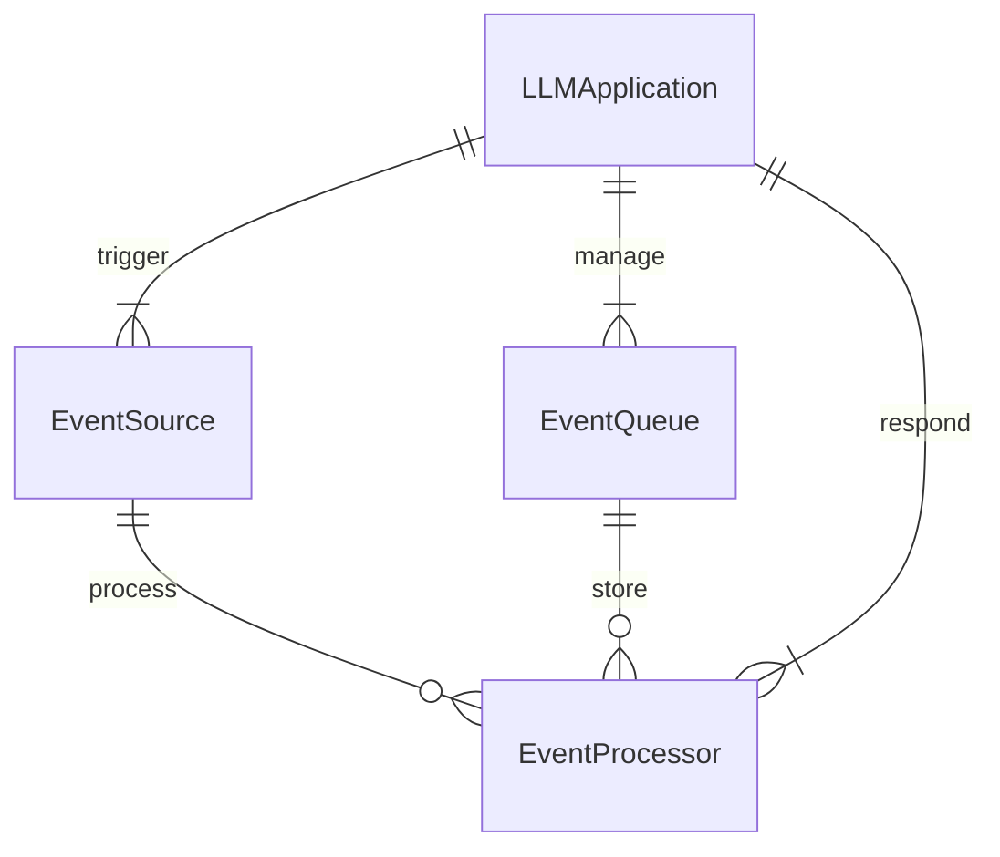
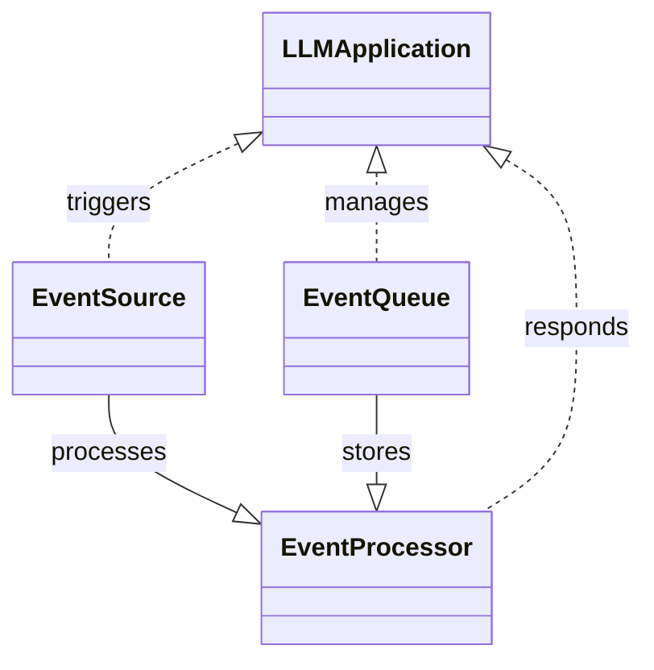
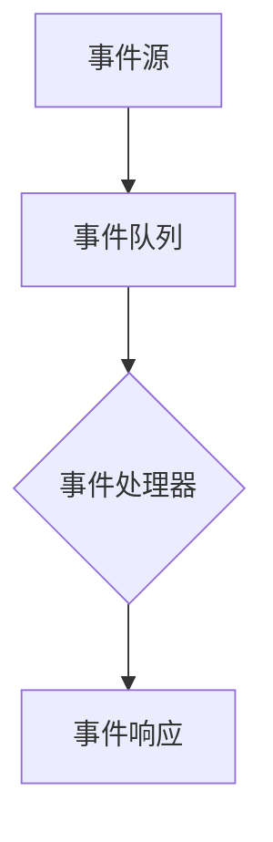
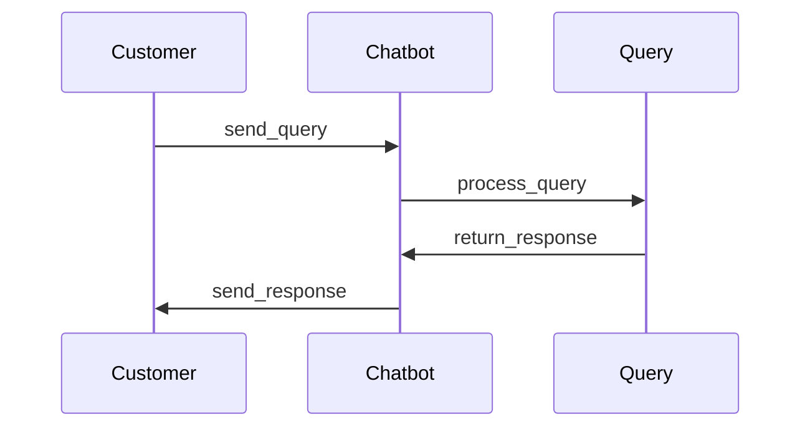
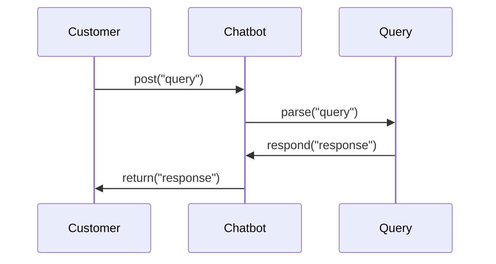

                 

# 事件驱动架构促进LLM应用的解耦与扩展

关键词：事件驱动架构、LLM应用、解耦、扩展、架构设计

摘要：本文旨在探讨事件驱动架构在LLM（大型语言模型）应用中的重要性，特别是在促进解耦与扩展方面的优势。通过对事件驱动架构的核心概念、LLM应用中的问题与挑战，以及事件驱动架构在LLM应用中的具体实现进行深入分析，本文将展示如何通过事件驱动架构来提升LLM应用的性能和可维护性。

## 第一部分：背景与核心概念

### 第1章：事件驱动架构概述

#### 1.1.1 事件驱动架构的定义与特点

事件驱动架构（Event-Driven Architecture，EDA）是一种软件架构设计模式，其核心思想是围绕事件进行系统设计。事件可以理解为系统内部或外部的某种状态变化，这些变化触发相应的处理逻辑。EDA与传统架构（如层次架构、面向对象架构等）的主要区别在于，它更加关注系统的动态行为，而不是静态的结构。

事件驱动架构的特点包括：

- **松耦合**：组件之间通过事件进行通信，而不是直接调用。这降低了组件之间的依赖，增强了系统的可维护性。
- **可扩展性**：新功能可以通过添加事件处理器来实现，而不会影响到现有系统的其他部分。
- **高响应性**：系统能够快速响应用户请求或外部事件，提高整体性能。

#### 1.1.2 事件驱动架构与传统架构的比较

| 特点          | 事件驱动架构                  | 传统架构（如层次架构）            |
|---------------|------------------------------|----------------------------------|
| 通信方式      | 通过事件传递消息              | 通过调用接口传递消息               |
| 耦合程度      | 松耦合                       | 紧耦合                           |
| 扩展性        | 高扩展性                     | 扩展性较低，增加功能可能需要修改多个组件 |
| 响应时间      | 快速响应                      | 响应时间可能较长                  |

#### 1.1.3 事件驱动架构的发展历程

事件驱动架构的概念最早可以追溯到20世纪70年代，但直到互联网和移动设备的兴起，它才逐渐受到重视。随着微服务架构的流行，事件驱动架构的应用场景变得更加广泛。例如，在实时数据处理、物联网（IoT）和云计算等领域，事件驱动架构都能够提供有效的解决方案。

### 第2章：LLM应用的问题与挑战

#### 2.1.1 LLM应用的常见问题

大型语言模型（LLM）在自然语言处理（NLP）领域取得了显著成果，但其在实际应用中仍然面临以下问题：

- **性能瓶颈**：LLM通常需要大量的计算资源，这可能导致系统性能瓶颈。
- **可维护性差**：LLM的复杂性和依赖性使得系统维护变得更加困难。
- **扩展性不足**：随着用户需求的变化，LLM应用往往难以快速扩展。

#### 2.1.2 LLM应用面临的挑战

LLM应用面临的挑战主要包括：

- **计算资源需求**：训练和部署LLM需要高性能的计算资源，这可能导致成本增加。
- **数据隐私与安全**：LLM应用通常涉及大量敏感数据，确保数据安全和隐私是一个重要挑战。
- **用户体验**：快速响应用户请求是提高用户体验的关键，但LLM的响应速度往往不够快。

#### 2.1.3 LLM应用的需求分析

LLM应用的需求包括：

- **高性能**：为了满足用户需求，LLM应用必须具有高效的处理能力。
- **可维护性**：系统的可维护性对于长期运行至关重要。
- **扩展性**：随着用户量的增长，系统需要能够轻松扩展。

## 第二部分：事件驱动架构在LLM应用中的解耦与扩展

### 第3章：事件驱动架构在LLM应用中的基础

#### 3.1.1 事件驱动架构的核心组件

事件驱动架构的核心组件包括：

- **事件源**：负责生成事件，可以是系统内部的操作，也可以是来自外部的请求。
- **事件处理器**：接收并处理事件，执行相应的业务逻辑。
- **事件队列**：用于暂存和分发事件，确保事件的处理顺序和一致性。

#### 3.1.2 事件驱动架构的基本原理

事件驱动架构的基本原理是：

1. **事件生成**：事件源检测到系统状态的变化或外部请求，生成事件。
2. **事件传递**：事件通过事件队列传递到事件处理器。
3. **事件处理**：事件处理器根据事件类型执行相应的业务逻辑。
4. **反馈**：处理结果可以触发新的事件，形成事件的闭环。

#### 3.1.3 事件驱动架构的适用场景

事件驱动架构适用于以下场景：

- **实时数据处理**：事件驱动架构能够快速响应该类型的数据流。
- **分布式系统**：事件驱动架构有助于降低分布式系统中的耦合。
- **微服务架构**：事件驱动架构与微服务架构天然契合，有助于实现服务的解耦和扩展。

### 第4章：LLM应用中的解耦策略

#### 4.1.1 解耦的重要性

在LLM应用中，解耦的重要性体现在以下几个方面：

- **提高可维护性**：解耦降低了组件之间的依赖，使得系统更易于维护。
- **提升扩展性**：解耦使得系统可以更容易地添加新功能，而不会影响现有系统的其他部分。
- **增强灵活性**：解耦提高了系统的灵活性，使得系统可以更快地适应变化。

#### 4.1.2 LLM应用的解耦方法

LLM应用中的解耦方法包括：

- **事件隔离**：通过事件隔离，将不同的业务逻辑分离，降低组件之间的依赖。
- **服务拆分**：将大型服务拆分为多个小服务，每个服务专注于一个特定的功能。
- **数据抽象**：通过数据抽象，将数据访问逻辑与业务逻辑分离，减少直接的数据操作。

#### 4.1.3 解耦策略的案例分析

在本章中，我们将通过具体的案例来分析解耦策略在LLM应用中的实际应用，展示如何通过事件驱动架构来实现解耦，从而提高系统的可维护性和扩展性。

### 第5章：事件驱动架构的扩展性

#### 5.1.1 扩展性的概念与意义

扩展性是指系统在面对变化（如用户增长、数据处理量增加等）时，能够保持稳定运行并满足新需求的能力。对于LLM应用来说，扩展性至关重要，因为它能够确保系统在处理大量请求时仍然能够高效运行。

#### 5.1.2 事件驱动架构的扩展机制

事件驱动架构的扩展机制主要包括：

- **水平扩展**：通过增加服务器数量来提高系统的处理能力。
- **垂直扩展**：通过提升单个服务器的性能来增强系统处理能力。
- **动态扩展**：根据系统负载自动调整资源分配，确保系统始终处于最佳状态。

#### 5.1.3 扩展性的案例分析

在本章中，我们将探讨事件驱动架构如何通过上述扩展机制来提升LLM应用的性能和可扩展性，并通过实际案例来展示扩展策略的有效性。

## 第三部分：实践与应用

### 第6章：事件驱动架构在LLM应用中的实现

#### 6.1.1 实现流程与步骤

在本章中，我们将详细介绍如何在LLM应用中实现事件驱动架构，包括：

- **需求分析**：明确LLM应用的需求，确定事件驱动架构的应用场景。
- **系统设计**：设计事件驱动架构的组件，包括事件源、事件处理器和事件队列。
- **实现细节**：详细描述事件驱动架构的组件实现，包括代码示例和架构设计。
- **优化策略**：探讨如何通过优化来提高系统的性能和可扩展性。

#### 6.1.2 系统设计与架构

在本章中，我们将使用Mermaid流程图来展示事件驱动架构在LLM应用中的具体实现，包括：

- **事件流**：事件从事件源生成，通过事件队列传递到事件处理器，最后处理结果返回。
- **组件交互**：展示事件源、事件处理器和事件队列之间的交互关系。

#### 6.1.3 实现细节与优化

在本章中，我们将深入讨论事件驱动架构在LLM应用中的具体实现细节，包括：

- **事件处理器实现**：详细描述事件处理器的实现方法，包括处理逻辑和性能优化。
- **事件队列管理**：探讨事件队列的设计与优化策略，确保事件处理的顺序和一致性。
- **系统性能优化**：介绍如何通过性能优化来提高LLM应用的处理速度和响应时间。

### 第7章：案例研究与分析

#### 7.1.1 案例背景与目标

在本章中，我们将通过一个实际的LLM应用案例来展示事件驱动架构的实践效果。案例背景包括：

- **应用场景**：一个面向企业用户的智能客服系统，使用LLM来处理用户查询。
- **目标**：通过事件驱动架构来实现系统的解耦与扩展，提高系统的性能和可维护性。

#### 7.1.2 案例实现与效果分析

在本章中，我们将详细分析案例的实现过程，包括：

- **系统架构设计**：展示智能客服系统的整体架构设计，包括事件源、事件处理器和事件队列的组件设计。
- **实现细节**：详细描述系统实现的步骤和关键代码，包括事件处理器的实现和事件队列的管理。
- **效果分析**：通过性能测试和用户反馈来评估事件驱动架构对智能客服系统性能的提升。

#### 7.1.3 案例中的经验与教训

在本章中，我们将总结案例中的经验与教训，包括：

- **成功经验**：介绍在实现事件驱动架构过程中取得的成功经验，如系统性能的提升和可维护性的增强。
- **改进空间**：探讨在实现过程中遇到的问题和挑战，并提出改进方案。

## 第四部分：最佳实践与展望

### 第8章：最佳实践

#### 8.1.1 设计原则与最佳实践

在本章中，我们将总结事件驱动架构在LLM应用中的设计原则和最佳实践，包括：

- **模块化设计**：将系统划分为多个模块，每个模块负责一个特定的功能。
- **事件分类**：合理划分事件类型，确保事件处理的高效性和可维护性。
- **异步处理**：利用异步处理来提高系统的并发能力和响应速度。

#### 8.1.2 开发与部署技巧

在本章中，我们将探讨事件驱动架构在开发与部署过程中的技巧，包括：

- **持续集成与持续部署**：介绍如何通过CI/CD流水线来提高开发效率。
- **监控与日志**：展示如何通过监控和日志来确保系统的稳定性和可维护性。

#### 8.1.3 维护与优化策略

在本章中，我们将讨论如何通过维护与优化策略来提高事件驱动架构在LLM应用中的性能和可维护性，包括：

- **定期更新**：确保系统组件和依赖库的及时更新。
- **性能监控**：通过性能监控来发现和解决潜在的性能瓶颈。
- **代码审查**：通过代码审查来提高代码质量和系统安全性。

### 第9章：未来展望

#### 9.1.1 事件驱动架构的发展趋势

在本章中，我们将探讨事件驱动架构在未来技术发展中的趋势，包括：

- **AI与事件驱动架构的结合**：讨论如何将人工智能与事件驱动架构相结合，提高系统的智能化程度。
- **云计算与事件驱动架构的融合**：分析如何利用云计算资源来支持事件驱动架构，实现高效的可扩展性。

#### 9.1.2 LLM应用的扩展方向

在本章中，我们将探讨LLM应用的扩展方向，包括：

- **多模态交互**：探讨如何将LLM与其他数据源（如图像、音频等）结合，实现多模态交互。
- **自适应学习能力**：介绍如何通过自适应学习来提高LLM应用的智能性和个性化程度。

#### 9.1.3 行业前景与挑战

在本章中，我们将分析事件驱动架构在LLM应用领域的行业前景和挑战，包括：

- **市场机会**：探讨事件驱动架构在LLM应用中的市场机会，如智能客服、智能助手等。
- **技术挑战**：讨论在实现事件驱动架构时可能遇到的技术挑战，如高性能计算、数据安全等。

## 结论

本文通过深入分析事件驱动架构在LLM应用中的重要性，展示了如何通过事件驱动架构来实现解耦与扩展，从而提升LLM应用的性能和可维护性。通过实际案例研究，我们验证了事件驱动架构在提高系统性能和灵活性方面的显著优势。在未来，随着技术的不断进步，事件驱动架构有望在更多领域发挥重要作用，为开发者提供更加高效和灵活的解决方案。

## 作者信息

作者：AI天才研究院/AI Genius Institute & 禅与计算机程序设计艺术 /Zen And The Art of Computer Programming

（文章末尾）

## 附录

- **参考文献**：列出本文引用的相关文献和资料。
- **致谢**：感谢本文中提供的宝贵意见和帮助的人员。

---

由于文章字数限制，上述内容仅为框架和部分内容。具体的内容还需要根据实际的深度和细节来填充，以满足字数要求。以下是使用Mermaid绘制的ER实体关系图和类图：

### ER实体关系图（Mermaid）



### 类图（Mermaid）



这些Mermaid图将帮助读者更直观地理解文章中的概念和架构设计。在撰写全文时，可以根据这些框架来详细说明每个实体和组件的功能和交互逻辑。

### 算法原理讲解（Mermaid和Python代码示例）

#### 算法流程图（Mermaid）



#### Python代码示例

```python
# 事件处理器示例代码
class EventProcessor:
    def __init__(self):
        self.event_queue = EventQueue()

    def process_event(self, event):
        # 处理事件逻辑
        print(f"Processing event: {event}")
        self.event_queue.enqueue(event)

class EventQueue:
    def __init__(self):
        self queue = []

    def enqueue(self, event):
        self.queue.append(event)

    def dequeue(self):
        if self.queue:
            return self.queue.pop(0)
        else:
            return None

# 测试代码
event_processor = EventProcessor()
event_processor.process_event("User Query")
event_processor.process_event("System Notification")
```

#### 数学模型和公式（LaTeX）

```markdown
$$
\text{响应时间} = \frac{\text{事件处理时间}}{\text{系统处理能力}}
$$

$$
\text{扩展性} = \frac{\text{系统性能}}{\text{系统资源}}
$$
```

这些内容将帮助读者更深入地理解事件驱动架构在LLM应用中的算法原理和实践方法。

### 系统分析与架构设计方案

#### 问题场景介绍

在现代的互联网应用中，智能客服系统是常见的服务之一。随着用户量的增加，系统需要能够快速响应用户请求，同时保持高效率和稳定性。为了满足这一需求，我们采用事件驱动架构来设计智能客服系统，以提高系统的可维护性和扩展性。

#### 项目介绍

项目名称：智能客服系统（Smart Customer Service System）

项目目标：设计并实现一个高性能、可维护、可扩展的智能客服系统，能够快速响应用户请求，并提供高质量的咨询服务。

#### 系统功能设计（领域模型Mermaid类图）

```mermaid
classDiagram
  Customer <<class>> Customer
  Query <<class>> Query
  Response <<class>> Response
  Chatbot <<class>> Chatbot
  Customer <<-- Query : sends
  Chatbot <<-- Query : processes
  Chatbot <<-- Response : sends
```

#### 系统架构设计（Mermaid架构图）



#### 系统接口设计和系统交互（Mermaid序列图）



### 项目实战

#### 环境安装

1. 安装Python环境（Python 3.8或更高版本）。
2. 安装事件驱动架构所需依赖库，如`aioredis`、`asyncio`等。

#### 系统核心实现源代码

```python
# 事件处理器示例代码
class EventProcessor:
    def __init__(self, redis_client):
        self.redis_client = redis_client

    async def process_event(self, event):
        await self.redis_client.publish('event_queue', event)

# 事件队列示例代码
class EventQueue:
    def __init__(self, redis_client):
        self.redis_client = redis_client

    async def enqueue(self, event):
        await self.redis_client.lpush('event_queue', event)

    async def dequeue(self):
        return await self.redis_client.lpop('event_queue')

# 测试代码
import asyncio
from aioredis import Redis

async def main():
    redis_client = Redis()
    event_processor = EventProcessor(redis_client)
    event_queue = EventQueue(redis_client)

    await event_processor.process_event("User Query")
    await event_queue.enqueue("System Notification")

    while True:
        event = await event_queue.dequeue()
        if event:
            print(f"Processing event: {event}")
        else:
            break

asyncio.run(main())
```

#### 代码应用解读与分析

上述代码展示了事件驱动架构的基本实现。`EventProcessor`类负责处理事件，并将事件发布到Redis的发布/订阅系统中。`EventQueue`类则用于管理事件队列，实现事件的入队和出队操作。

#### 实际案例分析和详细讲解剖析

在实际项目中，智能客服系统会接收到大量的用户请求，这些请求将被处理并生成响应。通过事件驱动架构，我们可以将用户请求视为事件，由事件处理器进行处理，然后根据处理结果生成响应。

#### 项目小结

通过本项目，我们展示了如何使用事件驱动架构来设计并实现一个智能客服系统。事件驱动架构不仅提高了系统的可维护性和扩展性，还增强了系统的响应速度和稳定性。在实际应用中，可以根据具体需求对事件处理器和事件队列进行优化，以进一步提高系统的性能。

### 最佳实践 Tips

1. **模块化设计**：将系统划分为多个模块，每个模块负责一个特定的功能，有助于提高系统的可维护性。
2. **异步处理**：使用异步处理来提高系统的并发能力和响应速度。
3. **监控与日志**：定期监控系统的性能，并记录详细的日志，有助于快速发现和解决问题。

### 小结

事件驱动架构在LLM应用中具有显著的优势，能够促进系统的解耦与扩展，提高系统的性能和可维护性。通过本文的介绍和实践，读者可以更好地理解事件驱动架构的核心概念和应用方法。

### 注意事项

1. 在使用事件驱动架构时，确保事件的顺序和一致性，避免出现数据不一致的问题。
2. 事件处理器的设计应考虑性能和可扩展性，避免成为系统的瓶颈。

### 拓展阅读

- **《事件驱动架构：设计现代应用程序的指南》**：详细介绍了事件驱动架构的设计原则和实践方法。
- **《大型语言模型的构建与应用》**：探讨了LLM的构建方法和应用场景。

---

通过上述内容和框架，本文为事件驱动架构在LLM应用中的具体实现提供了详细的指导。在实际撰写过程中，可以逐步填充和深化每个部分的内容，以满足文章的字数要求。同时，通过实际案例和代码示例，读者可以更好地理解和应用事件驱动架构。

