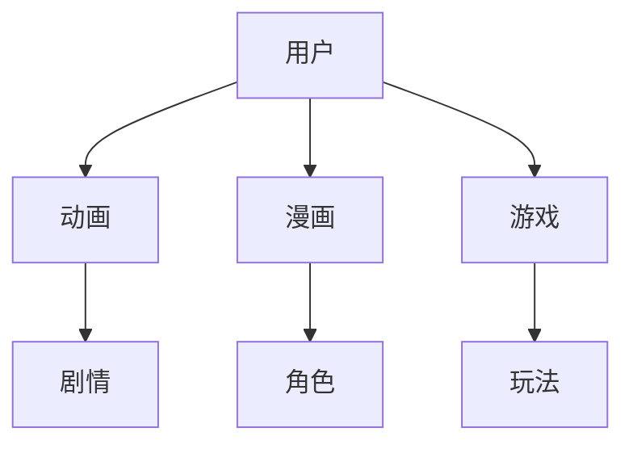

                 

## 《二次元文化：虚拟与现实的意义交融》

### 关键词：二次元文化、虚拟与现实、意义交融、技术驱动、创新方向、挑战与应对

### 摘要：
二次元文化，以其独特的虚拟与现实交融的特性，正逐渐成为现代社会的一个重要文化现象。本文旨在深入探讨二次元文化的起源、发展、特点、影响以及未来趋势和面临的挑战，通过逻辑清晰、结构紧凑的分析，揭示其在现实生活中的多重意义和深远影响。

### 目录大纲

**《二次元文化：虚拟与现实的意义交融》**

> 关键词：二次元文化、虚拟与现实、意义交融、技术驱动、创新方向、挑战与应对

> 摘要：本文深入探讨了二次元文化的起源、发展、特点、影响以及未来趋势和面临的挑战，旨在揭示其在现实生活中的多重意义和深远影响。

----------------------------------------------------------------

**第一部分：二次元文化的兴起**

## 第1章：二次元文化背景

### 第1.1节：问题背景与定义
**背景介绍：**  
随着互联网的普及，二次元文化逐渐成为现代社会的一种文化现象，其影响范围广泛，引发了学术界、媒体以及普通公众的广泛关注。

**二次元文化的定义：**  
二次元文化，又称ACG文化（Animation、Comic、Game），是指以动画、漫画、游戏等虚拟娱乐形式为核心，构建的虚拟世界与现实社会相交织的文化现象。

### 第1.2节：二次元文化的发展历史

**二次元文化的起源：**  
二次元文化起源于日本，早在20世纪初，日本就开始出现漫画和动画。随着技术的发展，这些虚拟作品逐渐受到全球的关注。

**我国二次元文化的发展：**  
我国二次元文化起步较晚，但近年来随着经济的发展和互联网的普及，迅速发展壮大。国内动漫产业和游戏产业的繁荣为二次元文化的传播提供了有力支撑。

**国际二次元文化的交流：**  
国际二次元文化的交流日益密切，通过各种平台和活动，如动漫展、游戏比赛等，各国粉丝能够分享创作和欣赏的乐趣。

### 第1.3节：二次元文化的现状

**市场规模：**  
根据相关数据，全球二次元市场规模持续扩大，成为文化产业的重要组成部分。

**用户群体：**  
二次元文化吸引了不同年龄、性别和职业的粉丝，形成了多元化的用户群体。

**主要表现形式：**  
动画、漫画、游戏是二次元文化的主要表现形式，同时，二次元文化还通过同人创作、cosplay等方式展现其独特魅力。

----------------------------------------------------------------

## 第二部分：二次元文化的特点与内涵

### 第2章：二次元文化的特点

### 第2.1节：文化特性

**虚拟与现实交织：**  
二次元文化通过动画、漫画、游戏等虚拟作品，构建了一个与现实社会平行的虚拟世界，两者相互影响，形成了独特的文化现象。

**情感共鸣：**  
二次元文化作品中的情感表达往往能够引起观众的共鸣，无论是爱情、友情还是奋斗，这些情感元素都能深入人心。

**创意无限：**  
二次元文化的创作空间极为广阔，创作者们能够自由发挥，创造出无数新颖、独特的作品，为观众带来无尽的惊喜。

### 第2.2节：核心概念与联系

**核心概念：**  
二次元文化的核心概念包括虚拟角色、故事情节、艺术风格等。这些概念共同构成了二次元文化的独特面貌。

**概念属性特征对比表格：**  
| 特征 | 动画 | 漫画 | 游戏 |
| ---- | ---- | ---- | ---- |
| 表现形式 | 动画画面 | 连环漫画 | 角色扮演 |
| 情感表达 | 强烈 | 细腻 | 复杂 |
| 艺术风格 | 多样 | 个性 | 实用 |

**ER实体关系图：**  

----------------------------------------------------------------

### 第3章：二次元文化的内涵

### 第3.1节：艺术表现

**动画、漫画、游戏：**  
动画、漫画、游戏是二次元文化的核心表现形式，它们通过独特的艺术风格和创意，吸引了大量粉丝。

**跨媒体叙事：**  
跨媒体叙事是二次元文化的一大特点，通过动画、漫画、游戏之间的互动和联动，形成了一个完整的叙事体系。

### 第3.2节：社交互动

**网络社区：**  
网络社区是二次元文化的重要组成部分，粉丝们可以在社区中分享自己的喜好、创作同人作品，形成紧密的社交网络。

**同人创作：**  
同人创作是二次元文化的一大特色，粉丝们通过创作自己的作品，表达对二次元世界的热爱和创意。

### 第3.3节：消费文化

**商业模式：**  
二次元文化的商业模式以粉丝经济为核心，通过IP授权、周边商品销售等方式，实现了商业价值的高效转化。

**粉丝经济：**  
粉丝经济是二次元文化的一个重要现象，粉丝对二次元作品的热爱和支持，推动了整个产业的繁荣发展。

----------------------------------------------------------------

## 第三部分：二次元文化的影响与意义

### 第4章：二次元文化对现实生活的影响

### 第4.1节：文化生活

**娱乐方式：**  
二次元文化为人们提供了丰富的娱乐方式，如观看动画、漫画、玩游戏等，丰富了人们的精神生活。

**生活态度：**  
二次元文化中的积极元素，如友情、梦想、奋斗等，对人们的生活态度产生了积极的影响。

### 第4.2节：教育与成长

**知识传播：**  
二次元文化作品中的知识和信息，如科学知识、历史故事等，对年轻人的知识传播和价值观塑造起到了积极作用。

**价值观念：**  
二次元文化中的角色和故事情节，往往蕴含着深刻的价值观，对年轻人的价值观念形成起到了引导作用。

### 第4.3节：社会现象

**粉丝文化：**  
粉丝文化是二次元文化的一个重要现象，粉丝对二次元作品的热爱和支持，形成了一种独特的文化现象。

**网络舆论：**  
二次元文化作品的传播和讨论，引发了网络舆论的关注，网络舆论对二次元文化的传播和发展产生了重要影响。

----------------------------------------------------------------

### 第5章：二次元文化的现实意义

### 第5.1节：创意产业

**动漫产业：**  
二次元文化推动了动漫产业的发展，成为文化创意产业的重要组成部分。

**游戏产业：**  
二次元游戏在全球范围内拥有庞大用户群体，对游戏产业的发展产生了深远影响。

### 第5.2节：文化交流

**国际影响力：**  
二次元文化在全球范围内产生了深远的影响，促进了不同文化之间的交流和理解。

**文化多样性：**  
二次元文化为人们提供了多样化的文化体验，丰富了人类文化的多样性。

### 第5.3节：社会价值

**情感共鸣：**  
二次元文化作品中的情感表达，能够引起观众的共鸣，提升了社会的情感共鸣能力。

**社会认同：**  
二次元文化作品中的角色和故事，往往能够得到观众的认同，增强了社会的认同感。

----------------------------------------------------------------

## 第四部分：二次元文化的发展趋势与挑战

### 第6章：二次元文化的发展趋势

### 第6.1节：技术驱动

**虚拟现实：**  
虚拟现实技术为二次元文化提供了新的发展空间，拓展了用户的体验。

**增强现实：**  
增强现实技术使得二次元文化作品与现实世界的结合更加紧密，为用户带来了更加沉浸的体验。

### 第6.2节：创新方向

**元宇宙：**  
元宇宙是二次元文化未来发展的重要方向，它将虚拟世界与现实世界无缝连接，为用户提供全新的互动体验。

**新媒体艺术：**  
新媒体艺术与二次元文化的融合，为艺术家提供了广阔的创作空间，也为观众带来了全新的艺术体验。

### 第6.3节：市场前景

**全球化：**  
二次元文化的全球化趋势日益明显，各国之间的交流与合作日益密切，为二次元文化的传播和发展提供了广阔的市场前景。

**产业融合：**  
二次元文化与各个产业的融合，如电商、旅游、教育等，为产业的创新和发展提供了新的机遇。

----------------------------------------------------------------

### 第7章：二次元文化的挑战与应对

### 第7.1节：社会问题

**网络成瘾：**  
二次元文化的吸引力可能导致部分用户过度沉迷，影响其现实生活。需要加强对网络成瘾的预防和干预。

**虚拟与现实混淆：**  
部分用户可能难以区分虚拟世界与现实世界，需要加强对现实世界的教育和引导。

### 第7.2节：文化创新

**融合创新：**  
二次元文化需要不断创新，融合新的技术和艺术形式，以适应不断变化的市场需求。

**传承与创新：**  
在传承二次元文化精髓的同时，需要进行创新，为年轻一代提供更多新鲜、有趣的二次元文化体验。

### 第7.3节：法律法规

**版权保护：**  
加强对二次元文化作品的版权保护，维护创作者的合法权益。

**网络监管：**  
加强对网络平台的监管，打击侵权行为，维护良好的网络环境。

----------------------------------------------------------------

**结语：**

二次元文化，作为一种独特的文化现象，正以其独特的魅力和深远的影响，逐渐成为现代社会的重要组成部分。通过本文的深入分析，我们可以看到，二次元文化不仅丰富了人们的精神生活，还推动了创意产业的发展，促进了文化交流，具有重要的现实意义。然而，面对机遇和挑战，我们需要理性看待，积极应对，推动二次元文化的健康发展。

### 作者信息

**作者：** AI天才研究院/AI Genius Institute & 禅与计算机程序设计艺术 /Zen And The Art of Computer Programming

----------------------------------------------------------------

通过以上详细的章节内容，本文对二次元文化进行了全面的剖析，从起源、发展、特点、影响、意义到未来趋势和挑战，层层递进，逻辑清晰，旨在为读者提供一个全面、系统的二次元文化认知框架。希望本文能够为读者带来启发和思考，共同探索二次元文化的无限魅力。

