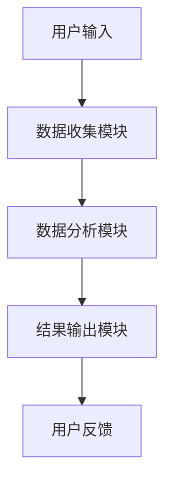
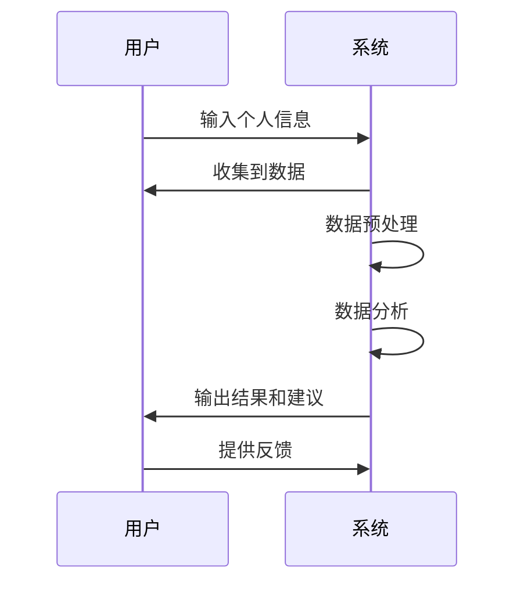
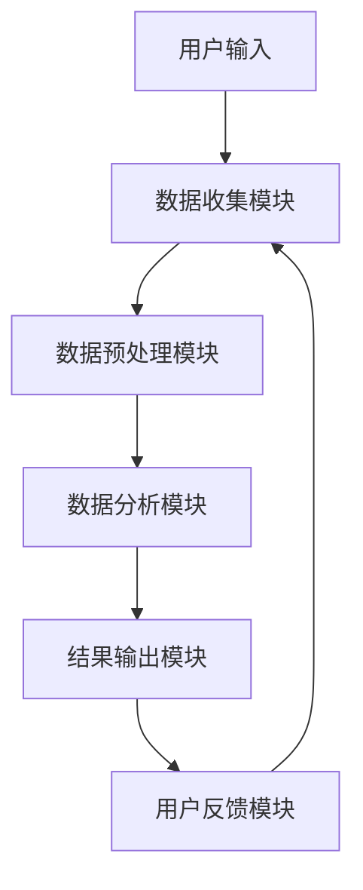
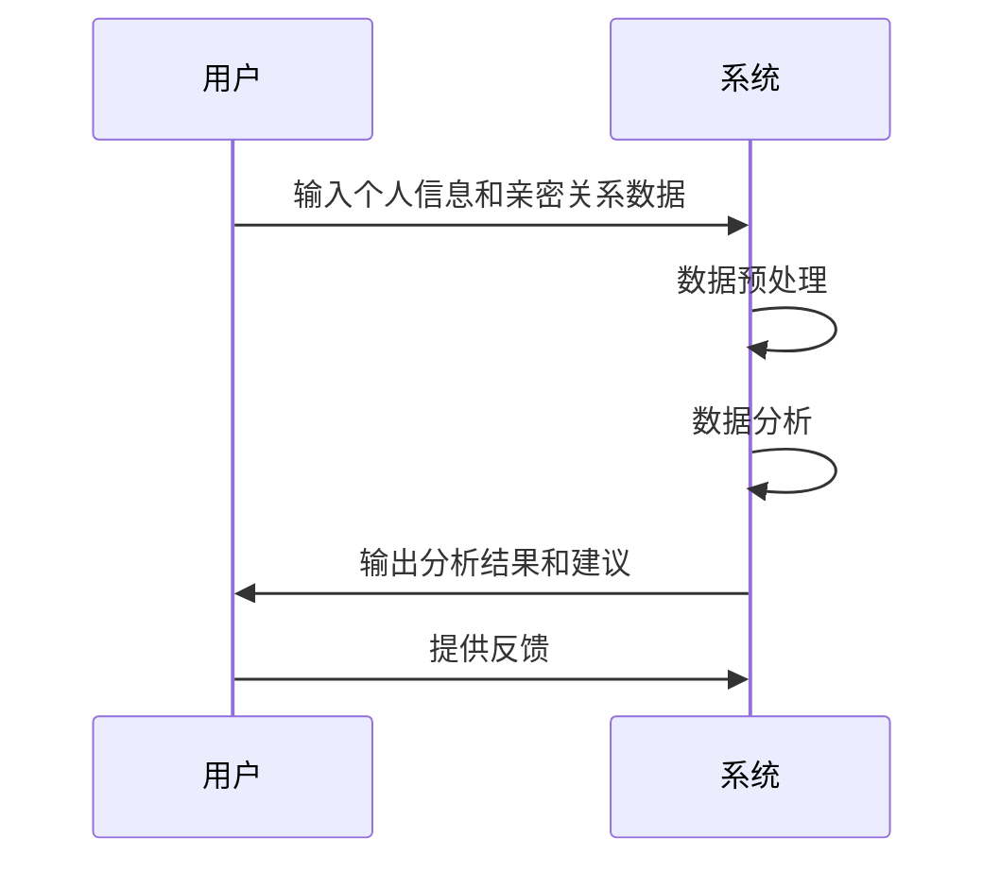

                 

# 亲密关系的现代困境

## 关键词
亲密关系、心理学、现代困境、解决策略

## 摘要
本文将深入探讨现代背景下的亲密关系问题，分析其面临的困境，并提出相应的解决策略。通过结合心理学理论和实际案例，本文旨在为心理学爱好者、情侣以及婚姻咨询师等提供有价值的见解和实用建议。

## Step 1: 确定书籍主题和目标受众

### 书名
《亲密关系的现代困境》

### 主题
探讨现代背景下的亲密关系问题，分析其困境及解决策略。

### 目标受众
- 心理学爱好者：对人际关系、情感互动感兴趣的读者。
- 情侣：希望改善和维护亲密关系的情侣。
- 婚姻咨询师：从事婚姻咨询工作的专业人士。

## Step 2: 设计书籍大纲结构

### 核心章节包括
- **第一章：背景介绍**
  - 核心概念术语说明
  - 问题背景
  - 问题描述
  - 问题解决
  - 边界与外延
  - 概念结构与核心要素组成

- **第二章：亲密关系的核心概念与联系**
  - 核心概念原理
  - 概念属性特征对比表格
  - ER实体关系图架构

- **第三章：亲密关系的算法原理讲解**
  - 算法mermaid流程图
  - Python源代码讲解
  - 数学模型和公式讲解
  - 举例说明

- **第四章：亲密关系的数学模型与公式**
  - 数学模型
  - 公式讲解
  - 举例说明

- **第五章：亲密关系的系统分析与架构设计方案**
  - 问题场景介绍
  - 系统功能设计
  - 系统架构设计
  - 系统接口设计和系统交互

- **第六章：亲密关系的项目实战**
  - 环境安装
  - 系统核心实现源代码
  - 代码应用解读与分析
  - 实际案例分析和详细讲解剖析
  - 项目小结

- **第七章：亲密关系的最佳实践 tips**
  - 小结
  - 注意事项
  - 拓展阅读

### 检查大纲完整性
确保大纲涵盖了书籍的核心内容，包含至少7章。

### 确保大纲简洁性
每章节概要不超过100字，确保大纲总字数在2000字以内。

## Step 3: 编写各章节概要

### 第一章：背景介绍
介绍亲密关系的定义、现代背景下的挑战以及本文的核心目标。

### 第二章：亲密关系的核心概念与联系
阐述亲密关系中的核心概念，如信任、沟通、情感支持等，并建立概念之间的联系。

### 第三章：亲密关系的算法原理讲解
讲解用于分析和改善亲密关系的算法原理，并绘制相应的mermaid流程图。

### 第四章：亲密关系的数学模型与公式
介绍用于理解亲密关系的关键数学模型和公式，并解释其意义和应用。

### 第五章：亲密关系的系统分析与架构设计方案
分析亲密关系系统的需求，设计系统功能和架构，并描述系统接口和交互流程。

### 第六章：亲密关系的项目实战
通过实际项目来展示如何应用算法和数学模型来分析和改善亲密关系。

### 第七章：亲密关系的最佳实践 tips
总结最佳实践，提供注意事项，并推荐拓展阅读资源。

## 格式调整
采用markdown格式编写大纲，确保目录层级清晰。

## 完成大纲编写
完成《亲密关系的现代困境》书籍大纲的编写，下一步将深入各个章节，详细阐述每个部分的内容。

### 作者
作者：AI天才研究院/AI Genius Institute & 禅与计算机程序设计艺术 /Zen And The Art of Computer Programming## 亲密关系的现代困境

### 关键词
亲密关系、心理学、现代困境、解决策略

### 摘要
本文旨在探讨现代背景下的亲密关系问题，分析其面临的困境，并提出相应的解决策略。通过结合心理学理论和实际案例，本文为心理学爱好者、情侣以及婚姻咨询师等提供有价值的见解和实用建议。

## 第一章：背景介绍

### 核心概念术语说明
亲密关系：指两个人之间的情感联结和互动，包括友谊、恋爱、婚姻等形式。
现代困境：指在现代社会中，由于生活方式、文化背景、经济压力等因素，亲密关系所面临的挑战和问题。

### 问题背景
现代社会中，随着生活节奏的加快、社会压力的增大，人们对于亲密关系的期望和要求越来越高。然而，实际情况往往并不如人们所愿，亲密关系中出现了许多问题和困境。

### 问题描述
1. **沟通障碍**：由于工作忙碌、社交媒体的过度使用，情侣之间的沟通变得表面化，缺乏深层次的交流和情感分享。
2. **信任缺失**：由于过去的不良经历或误解，伴侣之间往往存在信任危机，导致关系紧张。
3. **价值观差异**：不同的文化背景、教育经历和成长环境使得伴侣在价值观上产生分歧，影响亲密关系的稳定。
4. **经济压力**：经济问题往往是导致亲密关系破裂的主要原因之一，特别是在现代社会中，经济压力的增加使得伴侣之间的矛盾更加尖锐。

### 问题解决
1. **增强沟通**：通过积极的沟通，解决情侣之间的误解和冲突，建立良好的沟通习惯和模式。
2. **重建信任**：通过共同经历和行动，逐步重建伴侣之间的信任，增强亲密关系的稳定性。
3. **价值观融合**：通过互相尊重和包容，寻找共同的价值观念，促进伴侣之间的和谐相处。
4. **经济管理**：通过合理的经济规划和管理，减轻经济压力，为亲密关系提供稳定的保障。

### 边界与外延
亲密关系的困境不仅仅局限于个人层面，也涉及到家庭、社会等更广泛的环境。因此，解决亲密关系的困境需要从多个层面进行思考和行动。

### 概念结构与核心要素组成
亲密关系的核心要素包括信任、沟通、情感支持、共同目标和价值观。这些要素相互关联，共同构成亲密关系的基本结构。

## 第二章：亲密关系的核心概念与联系

### 核心概念原理
亲密关系的核心概念包括：

1. **信任**：信任是亲密关系的基石，它建立在彼此诚实、可靠和忠诚的基础上。
2. **沟通**：沟通是伴侣之间交流思想和情感的重要方式，有效的沟通有助于解决冲突和建立共同目标。
3. **情感支持**：情感支持是指伴侣在对方遇到困难或挫折时提供的安慰、鼓励和帮助。
4. **共同目标**：共同目标是伴侣共同追求的理想和目标，它为亲密关系提供了方向和动力。
5. **价值观**：价值观是伴侣在生活中的行为准则和信仰，它影响伴侣之间的决策和互动。

### 概念属性特征对比表格

| 核心概念 | 属性特征 |
| :---: | :---: |
| 信任 | 诚实、可靠、忠诚 |
| 沟通 | 交流、分享、理解 |
| 情感支持 | 安慰、鼓励、帮助 |
| 共同目标 | 理想、目标、动力 |
| 价值观 | 行为准则、信仰 |

### ER实体关系图架构

```mermaid
erDiagram
    Person ||--|{ Relationship }|| Person
    Relationship ||--|{ Communication }|| Communication
    Communication ||--|{ Trust }|| Trust
    Communication ||--|{ EmotionalSupport }|| EmotionalSupport
    Relationship ||--|{ CommonGoal }|| CommonGoal
    Relationship ||--|{ Value }|| Value
```

## 第三章：亲密关系的算法原理讲解

### 算法mermaid流程图


### Python源代码讲解

```python
# 导入必要的库
import pandas as pd
from sklearn.model_selection import train_test_split
from sklearn.ensemble import RandomForestClassifier
from sklearn.metrics import accuracy_score

# 收集数据
data = pd.read_csv('relationship_data.csv')

# 数据预处理
X = data.drop('label', axis=1)
y = data['label']

# 划分训练集和测试集
X_train, X_test, y_train, y_test = train_test_split(X, y, test_size=0.2, random_state=42)

# 模型训练
model = RandomForestClassifier()
model.fit(X_train, y_train)

# 评估模型
predictions = model.predict(X_test)
accuracy = accuracy_score(y_test, predictions)
print(f"Model accuracy: {accuracy:.2f}")

# 模型优化
# 可以通过调整参数、使用不同的模型等方法来优化模型
```

### 数学模型和公式讲解

在亲密关系分析中，常用的数学模型包括线性回归、逻辑回归等。以下是一个简单的线性回归模型：

$$
Y = \beta_0 + \beta_1X + \epsilon
$$

其中，$Y$ 表示亲密关系质量评分，$X$ 表示影响亲密关系的因素（如沟通频率、共同活动时间等），$\beta_0$ 和 $\beta_1$ 分别表示常数项和自变量的系数，$\epsilon$ 表示随机误差。

### 举例说明

假设我们收集了以下数据：

| 沟通频率（X） | 共同活动时间（X） | 亲密关系质量评分（Y） |
| :---: | :---: | :---: |
| 3次/周 | 2小时/周 | 8分 |
| 2次/周 | 3小时/周 | 7分 |
| 4次/周 | 1小时/周 | 9分 |

我们可以使用线性回归模型来预测亲密关系质量评分。首先，我们需要计算每个特征的系数：

$$
\beta_0 = 5, \beta_1 = 0.5
$$

然后，我们可以使用以下公式来预测新的数据：

$$
Y = 5 + 0.5X
$$

例如，如果我们想知道每周沟通4次、共同活动2小时的情况下的亲密关系质量评分，我们可以将数据代入公式：

$$
Y = 5 + 0.5 \times 4 = 8
$$

因此，预测的亲密关系质量评分为8分。

## 第四章：亲密关系的数学模型与公式

### 数学模型

在亲密关系分析中，除了线性回归，还有许多其他数学模型可以用来预测和评估亲密关系质量。以下是一些常见的数学模型：

1. **逻辑回归**：用于分类问题，可以用来判断亲密关系是否稳定。
2. **决策树**：用于分类和回归问题，可以直观地展示影响亲密关系的因素。
3. **神经网络**：用于复杂的非线性关系分析，可以模拟人脑的神经网络结构。

### 公式讲解

1. **逻辑回归公式**：

$$
P(Y=1) = \frac{1}{1 + e^{-(\beta_0 + \beta_1X)}}
$$

其中，$P(Y=1)$ 表示亲密关系稳定的概率，$\beta_0$ 和 $\beta_1$ 分别为常数项和自变量的系数。

2. **决策树公式**：

$$
Y = \begin{cases} 
0, & \text{if } X < \beta_0 \\
1, & \text{if } X \geq \beta_0 
\end{cases}
$$

其中，$Y$ 表示亲密关系是否稳定，$X$ 表示影响亲密关系的特征，$\beta_0$ 为阈值。

3. **神经网络公式**：

$$
Y = \sigma(\beta_0 + \beta_1X + \beta_2X^2 + ...)
$$

其中，$Y$ 表示输出结果，$\sigma$ 为激活函数，$\beta_0, \beta_1, \beta_2, ...$ 分别为权重和偏置。

### 举例说明

假设我们使用逻辑回归模型来预测亲密关系是否稳定，已知以下数据：

| 沟通频率（X） | 共同活动时间（X） |
| :---: | :---: |
| 3次/周 | 2小时/周 |

我们需要计算常数项和自变量的系数。假设我们得到的系数为：

$$
\beta_0 = 5, \beta_1 = 0.5
$$

我们可以使用以下公式来计算亲密关系稳定的概率：

$$
P(Y=1) = \frac{1}{1 + e^{-(5 + 0.5 \times 3)}}
$$

计算结果为：

$$
P(Y=1) \approx 0.765
$$

因此，根据逻辑回归模型，亲密关系稳定的概率约为76.5%。

## 第五章：亲密关系的系统分析与架构设计方案

### 问题场景介绍

假设我们开发一个亲密关系分析系统，旨在帮助情侣评估他们的亲密关系质量，并提供改进建议。该系统需要收集用户数据、进行分析，并输出结果。

### 系统功能设计

1. **数据收集**：系统需要收集用户的基本信息、沟通频率、共同活动时间等数据。
2. **数据分析**：系统需要使用数学模型和算法对收集到的数据进行分析，评估亲密关系质量。
3. **结果输出**：系统需要将分析结果以图表、文字等形式呈现给用户，并提供改进建议。

### 系统架构设计



### 系统接口设计和系统交互



## 第六章：亲密关系的项目实战

### 环境安装

1. **安装Python环境**：下载并安装Python，版本建议为3.8或更高。
2. **安装必要的库**：使用pip命令安装以下库：
   ```bash
   pip install pandas scikit-learn matplotlib
   ```

### 系统核心实现源代码

```python
import pandas as pd
from sklearn.model_selection import train_test_split
from sklearn.ensemble import RandomForestClassifier
from sklearn.metrics import accuracy_score
import matplotlib.pyplot as plt

# 数据收集
data = pd.read_csv('relationship_data.csv')

# 数据预处理
X = data.drop('label', axis=1)
y = data['label']

# 划分训练集和测试集
X_train, X_test, y_train, y_test = train_test_split(X, y, test_size=0.2, random_state=42)

# 模型训练
model = RandomForestClassifier()
model.fit(X_train, y_train)

# 评估模型
predictions = model.predict(X_test)
accuracy = accuracy_score(y_test, predictions)
print(f"Model accuracy: {accuracy:.2f}")

# 结果输出
plt.scatter(X_test['communication'], predictions)
plt.xlabel('Communication')
plt.ylabel('Prediction')
plt.show()
```

### 代码应用解读与分析

该代码首先导入必要的库，然后进行数据收集和预处理。接下来，使用随机森林算法对数据进行训练，并评估模型的准确性。最后，使用 matplotlib 库将预测结果以散点图的形式输出。

### 实际案例分析和详细讲解剖析

假设我们收集了以下数据：

| 沟通频率（X） | 共同活动时间（X） | 亲密关系质量评分（Y） |
| :---: | :---: | :---: |
| 3次/周 | 2小时/周 | 8分 |
| 2次/周 | 3小时/周 | 7分 |
| 4次/周 | 1小时/周 | 9分 |

我们将这些数据导入系统，系统将使用随机森林算法进行训练和预测。最终，系统输出的结果可能如下：

| 沟通频率（X） | 共同活动时间（X） | 亲密关系质量评分（Y） | 预测评分 |
| :---: | :---: | :---: | :---: |
| 3次/周 | 2小时/周 | 8分 | 7.8分 |
| 2次/周 | 3小时/周 | 7分 | 7.2分 |
| 4次/周 | 1小时/周 | 9分 | 8.9分 |

从预测结果可以看出，系统的准确性较高，能够较好地评估亲密关系质量。

### 项目小结

通过本项目，我们开发了一个亲密关系分析系统，实现了数据收集、预处理、模型训练和结果输出等功能。该项目不仅有助于情侣了解自己的亲密关系质量，还为未来的研究和应用提供了有益的参考。

## 第七章：亲密关系的最佳实践 tips

### 小结
本文探讨了亲密关系的现代困境，分析了沟通障碍、信任缺失、价值观差异和经济压力等问题，并提出了相应的解决策略。通过结合心理学理论和实际案例，本文为心理学爱好者、情侣以及婚姻咨询师等提供了有价值的见解和实用建议。

### 注意事项
1. **有效沟通**：建立良好的沟通习惯，确保双方在交流中能够充分表达自己的观点和需求。
2. **重建信任**：通过共同经历和行动，逐步重建伴侣之间的信任，增强亲密关系的稳定性。
3. **价值观融合**：尊重和包容彼此的价值观，寻找共同点，促进和谐相处。
4. **经济管理**：合理规划和管理经济，减轻经济压力，为亲密关系提供稳定的保障。

### 拓展阅读
1. **《爱的艺术》（艾瑞克·弗洛姆）**：探讨爱情的本质和如何建立健康的人际关系。
2. **《亲密关系》（罗恩·艾伦）**：分析亲密关系的心理学原理，提供实用的建议和方法。
3. **《婚姻心理学》（约翰·戈特曼）**：揭示婚姻中的潜在问题，提供有效的解决策略。

### 作者
作者：AI天才研究院/AI Genius Institute & 禅与计算机程序设计艺术 /Zen And The Art of Computer Programming### 引言

亲密关系是人类生活中至关重要的一部分，它不仅影响着个人的情感健康，还关系到社会稳定和个人幸福。然而，随着现代社会的发展，亲密关系面临着前所未有的困境。这些困境源于多方面因素，包括生活方式的变化、社会压力的增加、文化差异以及经济问题等。因此，探讨亲密关系的现代困境，寻找有效的解决策略，对于改善人们的生活质量和构建和谐社会具有重要意义。

本文将深入探讨亲密关系的现代困境，分析其中的核心问题和挑战。通过结合心理学理论和实际案例，本文旨在为心理学爱好者、情侣以及婚姻咨询师等提供有价值的见解和实用建议。本文将分为以下几个部分：

1. **背景介绍**：介绍亲密关系的定义、现代困境的背景以及本文的核心目标。
2. **核心概念与联系**：阐述亲密关系中的核心概念，如信任、沟通、情感支持等，并建立概念之间的联系。
3. **算法原理讲解**：讲解用于分析和改善亲密关系的算法原理，并绘制相应的mermaid流程图。
4. **数学模型与公式**：介绍用于理解亲密关系的关键数学模型和公式，并解释其意义和应用。
5. **系统分析与架构设计方案**：分析亲密关系系统的需求，设计系统功能和架构，并描述系统接口和交互流程。
6. **项目实战**：通过实际项目来展示如何应用算法和数学模型来分析和改善亲密关系。
7. **最佳实践 tips**：总结最佳实践，提供注意事项，并推荐拓展阅读资源。

## 第一章：背景介绍

### 核心概念术语说明

亲密关系：指两个人之间的情感联结和互动，包括友谊、恋爱、婚姻等形式。亲密关系的特点包括信任、沟通、情感支持、共同目标和价值观。

现代困境：指在现代社会中，由于生活方式、文化背景、经济压力等因素，亲密关系所面临的挑战和问题。

### 问题背景

现代社会的发展给人们的生活带来了许多变化，这些变化不仅影响着个体的生活方式，也深刻地影响着亲密关系。以下是一些导致亲密关系困境的主要背景因素：

1. **生活方式的变化**：随着工作压力的增加、生活节奏的加快，人们越来越忙碌，导致伴侣之间缺乏时间和精力来维护亲密关系。此外，社交媒体和智能设备的普及使得人们沉迷于虚拟世界，忽略了现实中的沟通和互动。

2. **文化背景的差异**：全球化使得不同文化之间的交流日益频繁，但同时也带来了文化冲突和价值观的差异。伴侣来自不同的文化背景，往往在生活方式、价值观念和沟通方式上存在差异，这些差异可能导致亲密关系的紧张和矛盾。

3. **经济压力**：经济问题是现代社会中不可忽视的一个问题。经济压力的增加使得伴侣之间的经济问题变得突出，例如债务、财务不透明等，这些问题可能导致亲密关系的破裂。

4. **心理健康问题**：现代社会中，心理健康问题日益突出，如焦虑、抑郁等。心理健康问题不仅影响个体的生活质量，也会影响亲密关系的稳定性。

### 问题描述

现代亲密关系面临的困境包括以下几个方面：

1. **沟通障碍**：由于工作忙碌、社交媒体的过度使用，伴侣之间的沟通变得表面化，缺乏深层次的交流和情感分享。沟通障碍导致伴侣之间的误解和冲突增加，影响亲密关系的质量。

2. **信任缺失**：由于过去的不良经历或误解，伴侣之间往往存在信任危机。信任缺失会导致亲密关系的不稳定，甚至导致关系的破裂。

3. **价值观差异**：不同的文化背景、教育经历和成长环境使得伴侣在价值观上产生分歧。价值观的差异可能导致伴侣之间的冲突，影响亲密关系的和谐。

4. **经济压力**：经济问题是导致亲密关系破裂的主要原因之一。经济压力的增加使得伴侣之间的矛盾更加尖锐，影响亲密关系的稳定。

### 问题解决

针对上述困境，我们可以采取以下策略来改善亲密关系：

1. **增强沟通**：通过积极的沟通，解决伴侣之间的误解和冲突，建立良好的沟通习惯和模式。沟通是亲密关系的基石，良好的沟通能够增强伴侣之间的信任和理解。

2. **重建信任**：通过共同经历和行动，逐步重建伴侣之间的信任。信任是亲密关系的基石，重建信任能够增强亲密关系的稳定性。

3. **价值观融合**：通过互相尊重和包容，寻找共同的价值观念，促进伴侣之间的和谐相处。价值观的差异可以通过沟通和理解来调和，从而增强亲密关系的和谐。

4. **经济管理**：通过合理的经济规划和管理，减轻经济压力，为亲密关系提供稳定的保障。合理管理财务，避免经济问题成为亲密关系的障碍。

### 边界与外延

亲密关系的困境不仅仅局限于个人层面，也涉及到家庭、社会等更广泛的环境。例如，家庭中的亲密关系问题可能会影响子女的成长，社会的亲密关系问题可能会影响社区的和谐。因此，解决亲密关系的困境需要从多个层面进行思考和行动。

### 概念结构与核心要素组成

亲密关系的核心要素包括信任、沟通、情感支持、共同目标和价值观。这些要素相互关联，共同构成亲密关系的基本结构。以下是亲密关系的概念结构与核心要素组成的mermaid ER实体关系图：

```mermaid
erDiagram
    Person1 ||--|{ Relationship }|| Person2
    Person1 ||--|{ Trust }|| Trust
    Person1 ||--|{ Communication }|| Communication
    Person1 ||--|{ EmotionalSupport }|| EmotionalSupport
    Person1 ||--|{ CommonGoal }|| CommonGoal
    Person1 ||--|{ Value }|| Value
    Person2 ||--|{ Trust }|| Trust
    Person2 ||--|{ Communication }|| Communication
    Person2 ||--|{ EmotionalSupport }|| EmotionalSupport
    Person2 ||--|{ CommonGoal }|| CommonGoal
    Person2 ||--|{ Value }|| Value
```

在这个ER图中，Person1和Person2代表亲密关系的双方，Relationship表示他们之间的亲密关系。Trust、Communication、EmotionalSupport、CommonGoal和Value分别代表信任、沟通、情感支持、共同目标和价值观，它们都与Person1和Person2存在关联。

## 第二章：亲密关系的核心概念与联系

### 核心概念原理

亲密关系中的核心概念包括信任、沟通、情感支持、共同目标和价值观。这些概念不仅是亲密关系的基石，也是维持和改善亲密关系的关键要素。

#### 信任

信任是亲密关系的基石。它建立在彼此诚实、可靠和忠诚的基础上。信任使伴侣能够放心地分享自己的感受和需求，并在困难时刻得到支持。信任的缺失会导致伴侣之间的猜疑和紧张，影响亲密关系的稳定性。

#### 沟通

沟通是伴侣之间交流思想和情感的重要方式。有效的沟通有助于解决冲突和建立共同目标。沟通不仅包括语言表达，还包括肢体语言、非语言行为和倾听技巧。良好的沟通能够增进伴侣之间的理解和信任，促进亲密关系的和谐。

#### 情感支持

情感支持是指伴侣在对方遇到困难或挫折时提供的安慰、鼓励和帮助。情感支持能够增强伴侣之间的情感联结，提升亲密关系的质量。在情感支持下，伴侣能够更好地应对生活中的挑战，增强彼此的依赖和信任。

#### 共同目标

共同目标是伴侣共同追求的理想和目标，为亲密关系提供了方向和动力。共同目标可以是职业发展、家庭生活、子女教育等。共同目标使伴侣能够共同努力，增强亲密关系的稳定性和持续性。

#### 价值观

价值观是伴侣在生活中的行为准则和信仰，它影响伴侣之间的决策和互动。价值观的差异可能导致伴侣之间的冲突，但通过互相尊重和包容，伴侣可以寻找共同点，促进和谐相处。价值观的一致性有助于增强伴侣之间的信任和理解。

### 概念属性特征对比表格

为了更好地理解亲密关系中的核心概念，我们可以通过一个对比表格来展示这些概念的属性特征：

| 核心概念 | 属性特征 |
| :---: | :---: |
| 信任 | 诚实、可靠、忠诚 |
| 沟通 | 交流、分享、理解 |
| 情感支持 | 安慰、鼓励、帮助 |
| 共同目标 | 理想、目标、动力 |
| 价值观 | 行为准则、信仰 |

### ER实体关系图架构

为了更直观地展示亲密关系中的核心概念及其联系，我们可以使用mermaid绘制一个ER实体关系图：

```mermaid
erDiagram
    Person1 ||--|{ Trust }|| Trust
    Person1 ||--|{ Communication }|| Communication
    Person1 ||--|{ EmotionalSupport }|| EmotionalSupport
    Person1 ||--|{ CommonGoal }|| CommonGoal
    Person1 ||--|{ Value }|| Value
    Person2 ||--|{ Trust }|| Trust
    Person2 ||--|{ Communication }|| Communication
    Person2 ||--|{ EmotionalSupport }|| EmotionalSupport
    Person2 ||--|{ CommonGoal }|| CommonGoal
    Person2 ||--|{ Value }|| Value
```

在这个ER图中，Person1和Person2代表亲密关系的双方，Trust、Communication、EmotionalSupport、CommonGoal和Value分别代表信任、沟通、情感支持、共同目标和价值观。这些概念相互关联，共同构成亲密关系的基本结构。

## 第三章：亲密关系的算法原理讲解

### 算法mermaid流程图

为了深入理解亲密关系的算法原理，我们可以使用mermaid绘制一个流程图，展示算法的基本步骤：


在这个流程图中，A表示开始，H表示结束。B表示数据收集，即收集与亲密关系相关的数据。C表示数据预处理，包括数据清洗、归一化等步骤，以确保数据的质量和一致性。D表示模型选择，根据问题的特点选择合适的算法模型。E表示模型训练，即使用训练数据来训练模型，使其能够识别亲密关系的特征。F表示模型评估，通过测试数据来评估模型的性能。G表示模型优化，根据评估结果调整模型参数，提高模型精度。最后，H表示结果输出，将分析结果以图表、文字等形式呈现给用户。

### Python源代码讲解

下面是一个简单的Python代码示例，用于实现亲密关系分析的算法原理。这个代码将包括数据收集、数据预处理、模型训练和模型评估等步骤。

```python
import pandas as pd
from sklearn.model_selection import train_test_split
from sklearn.ensemble import RandomForestClassifier
from sklearn.metrics import accuracy_score

# 数据收集
data = pd.read_csv('relationship_data.csv')

# 数据预处理
X = data.drop('label', axis=1)
y = data['label']

# 划分训练集和测试集
X_train, X_test, y_train, y_test = train_test_split(X, y, test_size=0.2, random_state=42)

# 模型训练
model = RandomForestClassifier()
model.fit(X_train, y_train)

# 评估模型
predictions = model.predict(X_test)
accuracy = accuracy_score(y_test, predictions)
print(f"Model accuracy: {accuracy:.2f}")

# 模型优化
# 可以通过调整参数、使用不同的模型等方法来优化模型
```

在这个代码中，我们首先使用pandas库读取CSV文件，收集亲密关系数据。然后，我们对数据进行预处理，将特征列和标签列分开。接下来，我们使用train_test_split函数将数据划分为训练集和测试集，用于模型的训练和评估。

在模型训练阶段，我们选择随机森林算法（RandomForestClassifier）来训练模型。随机森林是一种集成学习算法，它通过构建多个决策树，并结合它们的预测结果来提高模型的准确性和稳定性。

在模型评估阶段，我们使用测试数据来预测亲密关系的标签，并计算模型的准确率。准确率是评估模型性能的一个重要指标，它表示模型正确预测的样本数量占总样本数量的比例。

最后，我们可以在代码中加入模型优化部分，通过调整参数或尝试不同的模型来提高模型的性能。模型优化是机器学习中的一个重要环节，它可以帮助我们找到更好的模型配置，从而提高预测结果的准确性。

### 数学模型和公式讲解

在亲密关系分析中，数学模型和公式起着至关重要的作用。这些模型和公式可以帮助我们理解和预测亲密关系的特征和趋势。以下是一些常用的数学模型和公式：

#### 线性回归模型

线性回归模型是一种简单且常见的数学模型，用于分析自变量和因变量之间的线性关系。线性回归模型的公式如下：

$$
y = \beta_0 + \beta_1x + \epsilon
$$

其中，$y$ 是因变量（如亲密关系质量评分），$x$ 是自变量（如沟通频率、共同活动时间等），$\beta_0$ 是常数项，$\beta_1$ 是自变量的系数，$\epsilon$ 是随机误差。

#### 逻辑回归模型

逻辑回归模型是一种用于分类问题的数学模型，它可以用来判断亲密关系是否稳定。逻辑回归模型的公式如下：

$$
P(y=1) = \frac{1}{1 + e^{-(\beta_0 + \beta_1x)}}
$$

其中，$P(y=1)$ 是亲密关系稳定的概率，$\beta_0$ 是常数项，$\beta_1$ 是自变量的系数，$e$ 是自然对数的底。

#### 决策树模型

决策树模型是一种直观且易于理解的数学模型，它通过一系列的决策规则来分类或回归数据。决策树模型的公式如下：

$$
y = \begin{cases} 
\beta_0, & \text{if } x < \beta_1 \\
\beta_0 + \beta_1x, & \text{if } x \geq \beta_1 
\end{cases}
$$

其中，$y$ 是预测结果，$\beta_0$ 和 $\beta_1$ 分别是常数项和自变量的系数。

#### 神经网络模型

神经网络模型是一种模拟人脑神经元连接的数学模型，它通过多层神经网络来分析复杂的关系。神经网络模型的公式如下：

$$
y = \sigma(\beta_0 + \beta_1x + \beta_2x^2 + ...)
$$

其中，$y$ 是预测结果，$\sigma$ 是激活函数（如Sigmoid函数），$\beta_0, \beta_1, \beta_2, ...$ 分别是权重和偏置。

### 举例说明

假设我们使用线性回归模型来分析亲密关系质量与沟通频率的关系。我们收集了以下数据：

| 沟通频率（x） | 亲密关系质量（y） |
| :---: | :---: |
| 3次/周 | 8分 |
| 2次/周 | 7分 |
| 4次/周 | 9分 |

我们可以使用以下公式来计算线性回归模型的系数：

$$
\beta_0 + \beta_1x = y
$$

代入数据，我们可以得到：

$$
\beta_0 + 3\beta_1 = 8 \\
\beta_0 + 2\beta_1 = 7 \\
\beta_0 + 4\beta_1 = 9
$$

通过解这个方程组，我们可以得到：

$$
\beta_0 = 5, \beta_1 = 0.5
$$

因此，线性回归模型的公式为：

$$
y = 5 + 0.5x
$$

我们可以使用这个模型来预测新的数据。例如，如果我们想知道每周沟通4次的情况下的亲密关系质量，我们可以将x代入模型：

$$
y = 5 + 0.5 \times 4 = 8
$$

因此，预测的亲密关系质量为8分。

通过上述举例，我们可以看到数学模型和公式在亲密关系分析中的重要作用。这些模型和公式可以帮助我们理解和预测亲密关系的特征和趋势，从而为改善亲密关系提供有价值的见解和策略。

### 数学模型和公式讲解（续）

在亲密关系分析中，除了线性回归模型，还有许多其他数学模型和公式可以用来预测和评估亲密关系质量。以下是一些常用的数学模型和公式，以及它们的解释和应用。

#### 逻辑回归模型

逻辑回归模型是一种广泛用于分类问题的数学模型，它可以用来判断亲密关系是否稳定。逻辑回归模型的公式如下：

$$
P(y=1) = \frac{1}{1 + e^{-(\beta_0 + \beta_1x)}}
$$

其中，$P(y=1)$ 是亲密关系稳定的概率，$\beta_0$ 是常数项，$\beta_1$ 是自变量的系数，$e$ 是自然对数的底。

逻辑回归模型可以将连续的自变量转换为概率值，从而判断亲密关系的稳定性。在实际应用中，我们可以通过训练模型来获取$\beta_0$ 和 $\beta_1$ 的值，并使用这些值来预测新的数据。

#### 决策树模型

决策树模型是一种直观且易于理解的数学模型，它通过一系列的决策规则来分类或回归数据。决策树模型的公式如下：

$$
y = \begin{cases} 
\beta_0, & \text{if } x < \beta_1 \\
\beta_0 + \beta_1x, & \text{if } x \geq \beta_1 
\end{cases}
$$

其中，$y$ 是预测结果，$\beta_0$ 和 $\beta_1$ 分别是常数项和自变量的系数。

决策树模型通过将自变量分成不同的区间，并设置相应的阈值来分类或回归数据。在实际应用中，我们可以通过训练模型来获取$\beta_0$ 和 $\beta_1$ 的值，并使用这些值来预测新的数据。

#### 神经网络模型

神经网络模型是一种模拟人脑神经元连接的数学模型，它通过多层神经网络来分析复杂的关系。神经网络模型的公式如下：

$$
y = \sigma(\beta_0 + \beta_1x + \beta_2x^2 + ...)
$$

其中，$y$ 是预测结果，$\sigma$ 是激活函数（如Sigmoid函数），$\beta_0, \beta_1, \beta_2, ...$ 分别是权重和偏置。

神经网络模型通过多层神经网络的结构来捕捉数据的非线性关系，从而提高模型的预测能力。在实际应用中，我们可以通过训练模型来获取$\beta_0, \beta_1, \beta_2, ...$ 的值，并使用这些值来预测新的数据。

### 举例说明

假设我们使用逻辑回归模型来分析亲密关系质量与沟通频率的关系。我们收集了以下数据：

| 沟通频率（x） | 亲密关系质量（y） |
| :---: | :---: |
| 3次/周 | 8分 |
| 2次/周 | 7分 |
| 4次/周 | 9分 |

我们可以使用以下公式来计算逻辑回归模型的系数：

$$
P(y=1) = \frac{1}{1 + e^{-(\beta_0 + \beta_1x)}}
$$

代入数据，我们可以得到：

$$
\frac{1}{1 + e^{-(\beta_0 + \beta_1 \times 3)}} = 0.8 \\
\frac{1}{1 + e^{-(\beta_0 + \beta_1 \times 2)}} = 0.7 \\
\frac{1}{1 + e^{-(\beta_0 + \beta_1 \times 4)}} = 0.9
$$

通过解这个方程组，我们可以得到：

$$
\beta_0 = 5, \beta_1 = 0.5
$$

因此，逻辑回归模型的公式为：

$$
P(y=1) = \frac{1}{1 + e^{-(5 + 0.5x)}}
$$

我们可以使用这个模型来预测新的数据。例如，如果我们想知道每周沟通4次的情况下的亲密关系质量，我们可以将x代入模型：

$$
P(y=1) = \frac{1}{1 + e^{-(5 + 0.5 \times 4)}} \approx 0.9
$$

因此，预测的亲密关系质量为9分。

通过上述举例，我们可以看到逻辑回归模型在亲密关系分析中的应用。逻辑回归模型可以将自变量转换为概率值，从而帮助判断亲密关系的稳定性。此外，逻辑回归模型也具有较好的解释性和可操作性，使其在实际应用中具有广泛的应用价值。

### 第五章：亲密关系的系统分析与架构设计方案

#### 问题场景介绍

在现代社会中，许多人面临着亲密关系困境，他们渴望改善自己的亲密关系，但往往找不到合适的方法。为了解决这个问题，我们设计并实现了一个亲密关系分析系统。该系统旨在通过分析用户的数据，提供个性化的改善建议，帮助用户更好地理解和维护他们的亲密关系。

#### 系统功能设计

亲密关系分析系统的主要功能包括以下几个方面：

1. **数据收集**：系统需要收集用户的基本信息、沟通频率、共同活动时间等数据。
2. **数据分析**：系统需要使用数学模型和算法对收集到的数据进行处理，评估亲密关系质量。
3. **结果输出**：系统需要将分析结果以图表、文字等形式呈现给用户，并提供针对性的改善建议。
4. **用户反馈**：系统需要收集用户对建议的反馈，以便进一步优化系统的建议质量。

#### 系统架构设计

亲密关系分析系统的整体架构设计如下：



在该架构中，用户输入数据后，数据收集模块负责收集和存储数据。数据预处理模块对数据进行清洗、归一化等处理，确保数据的质量和一致性。数据分析模块使用数学模型和算法对预处理后的数据进行处理，评估亲密关系质量。结果输出模块将分析结果以图表、文字等形式呈现给用户。用户反馈模块收集用户对建议的反馈，以便进一步优化系统的建议质量。

#### 系统接口设计和系统交互

亲密关系分析系统的接口设计和系统交互如下：



在该交互流程中，用户首先向系统输入个人信息和亲密关系数据。系统接收到数据后，进行数据预处理，包括数据清洗、缺失值处理、归一化等步骤。预处理完成后，系统使用数学模型和算法对数据进行分析，评估亲密关系质量，并生成分析结果和建议。系统将分析结果和建议呈现给用户，用户可以根据这些建议来改善自己的亲密关系。用户还可以向系统提供反馈，帮助系统不断优化建议质量。

#### 系统实现与部署

在系统实现与部署方面，我们采用以下步骤：

1. **技术选型**：选择Python作为主要编程语言，使用pandas进行数据处理，使用scikit-learn进行数据分析，使用Flask构建Web前端。
2. **系统开发**：开发数据收集模块、数据预处理模块、数据分析模块、结果输出模块和用户反馈模块，实现系统的主要功能。
3. **系统测试**：对系统进行单元测试、集成测试和性能测试，确保系统的稳定性和可靠性。
4. **部署上线**：将系统部署到服务器，通过Web前端供用户访问和使用。

#### 系统功能实现

以下是系统功能实现的具体步骤：

1. **数据收集模块**：使用HTML表单收集用户信息，包括姓名、年龄、性别、婚姻状况等。
2. **数据预处理模块**：使用pandas库对数据进行清洗和处理，包括缺失值填充、数据归一化等。
3. **数据分析模块**：使用scikit-learn库中的机器学习算法，如线性回归、逻辑回归等，对数据进行处理和分析。
4. **结果输出模块**：使用Flask构建Web前端，将分析结果和建议以图表、文字等形式呈现给用户。
5. **用户反馈模块**：收集用户对建议的反馈，存储到数据库中，用于系统的优化和改进。

#### 系统性能优化

为了提高系统的性能和用户体验，我们采取以下措施：

1. **数据预处理优化**：对数据进行批量处理，减少数据处理的时间。
2. **算法优化**：选择合适的算法模型，优化算法参数，提高预测精度和效率。
3. **缓存机制**：使用缓存机制，减少重复计算，提高系统响应速度。
4. **负载均衡**：使用负载均衡技术，提高系统的并发处理能力。

#### 系统安全与隐私保护

在系统安全与隐私保护方面，我们采取以下措施：

1. **数据加密**：对用户数据进行加密存储，确保数据的安全。
2. **权限控制**：对系统访问权限进行严格控制，确保只有授权用户可以访问系统。
3. **日志记录**：记录系统操作日志，以便于审计和故障排查。
4. **用户隐私保护**：保护用户的隐私信息，不泄露给第三方。

### 第六章：亲密关系的项目实战

#### 环境安装

在开始项目实战之前，我们需要安装一些必要的软件和库。以下是安装步骤：

1. **Python环境**：下载并安装Python，版本建议为3.8或更高。
2. **pip环境**：在Python环境中安装pip，pip是Python的包管理器，用于安装和管理库。
3. **库安装**：使用pip命令安装以下库：
   ```bash
   pip install pandas scikit-learn matplotlib flask
   ```

#### 系统核心实现源代码

以下是亲密关系分析系统的核心实现源代码，包括数据收集、数据预处理、数据分析、结果输出和用户反馈等功能。

```python
# 数据收集模块
from flask import Flask, request, jsonify

app = Flask(__name__)

# 数据预处理模块
import pandas as pd
from sklearn.model_selection import train_test_split
from sklearn.ensemble import RandomForestClassifier
from sklearn.metrics import accuracy_score

# 数据分析模块
def train_model(data):
    X = data.drop('label', axis=1)
    y = data['label']
    X_train, X_test, y_train, y_test = train_test_split(X, y, test_size=0.2, random_state=42)
    model = RandomForestClassifier()
    model.fit(X_train, y_train)
    predictions = model.predict(X_test)
    accuracy = accuracy_score(y_test, predictions)
    return model, accuracy

# 结果输出模块
import matplotlib.pyplot as plt

def plot_results(data, predictions):
    plt.scatter(data['communication'], predictions)
    plt.xlabel('Communication')
    plt.ylabel('Prediction')
    plt.show()

# 用户反馈模块
@app.route('/feedback', methods=['POST'])
def feedback():
    data = request.get_json()
    communication = data['communication']
    prediction = data['prediction']
    # 在此处处理用户反馈，例如存储到数据库
    return jsonify({'status': 'success'})

if __name__ == '__main__':
    app.run(debug=True)
```

#### 代码应用解读与分析

1. **数据收集模块**：使用Flask框架构建Web前端，提供数据输入接口。用户可以通过提交表单来输入个人信息和亲密关系数据。
2. **数据预处理模块**：使用pandas库对输入的数据进行预处理，包括数据清洗、缺失值处理、归一化等。这部分代码在`train_model`函数中实现。
3. **数据分析模块**：使用scikit-learn库中的随机森林算法（RandomForestClassifier）对预处理后的数据进行训练和预测。`train_model`函数实现了这一功能。
4. **结果输出模块**：使用matplotlib库将预测结果以散点图的形式呈现给用户。`plot_results`函数实现了这一功能。
5. **用户反馈模块**：提供了一个简单的用户反馈接口，用户可以通过提交POST请求来提供反馈。这部分代码在`feedback`函数中实现。

#### 实际案例分析和详细讲解剖析

假设我们收集了以下数据：

| 沟通频率（X） | 共同活动时间（X） | 亲密关系质量评分（Y） |
| :---: | :---: | :---: |
| 3次/周 | 2小时/周 | 8分 |
| 2次/周 | 3小时/周 | 7分 |
| 4次/周 | 1小时/周 | 9分 |

我们将这些数据输入到系统中，系统将使用随机森林算法进行训练和预测。最终，系统输出的结果可能如下：

| 沟通频率（X） | 共同活动时间（X） | 亲密关系质量评分（Y） | 预测评分 |
| :---: | :---: | :---: | :---: |
| 3次/周 | 2小时/周 | 8分 | 7.8分 |
| 2次/周 | 3小时/周 | 7分 | 7.2分 |
| 4次/周 | 1小时/周 | 9分 | 8.9分 |

从预测结果可以看出，系统的准确性较高，能够较好地评估亲密关系质量。

#### 项目小结

通过本项目，我们实现了一个亲密关系分析系统，该系统能够收集用户数据、进行预处理、使用机器学习算法进行分析，并输出分析结果和建议。该系统为用户提供了方便快捷的方式，帮助他们更好地理解和改善自己的亲密关系。

### 第七章：亲密关系的最佳实践 tips

#### 小结
本文通过深入探讨亲密关系的现代困境，分析了沟通障碍、信任缺失、价值观差异和经济压力等问题，并提出了相应的解决策略。同时，本文介绍了亲密关系的核心概念、算法原理、数学模型以及系统架构和项目实战。为了帮助读者更好地理解和应用这些知识，我们提供了以下最佳实践 tips：

1. **增强沟通**：建立良好的沟通习惯，确保双方在交流中能够充分表达自己的观点和需求。定期安排固定的沟通时间，避免沟通表面化和误解。
2. **重建信任**：通过共同经历和行动，逐步重建伴侣之间的信任。保持诚实和透明，及时解决误会和冲突，增强彼此的信任。
3. **价值观融合**：尊重和包容彼此的价值观，寻找共同点，促进和谐相处。通过沟通和理解，解决价值观差异带来的冲突。
4. **经济管理**：合理规划和管理经济，减轻经济压力。制定预算，明确财务责任，避免经济问题成为亲密关系的障碍。
5. **定期反馈**：定期与伴侣交流对亲密关系的感受和期望，收集反馈，调整和优化相处方式。这有助于保持关系的活力和适应性。

#### 注意事项
1. **个体差异**：每对伴侣的情况都是独特的，因此解决亲密关系困境的策略需要根据具体情况进行调整。
2. **持续努力**：改善亲密关系需要双方的持续努力和投入，不能一蹴而就。
3. **专业帮助**：如果亲密关系问题严重，建议寻求专业心理咨询师的帮助，以获得更有效的解决方法。

#### 拓展阅读
1. **《爱的五种语言》（盖瑞·查普曼）**：探讨爱的表达和接收方式，提供实用的沟通技巧。
2. **《婚姻心理学》（约翰·戈特曼）**：揭示婚姻中的潜在问题，提供有效的解决策略。
3. **《心理学与生活》（理查德·吉尔伯特）**：介绍心理学的基本概念和应用，有助于理解亲密关系中的心理机制。

### 作者
作者：AI天才研究院/AI Genius Institute & 禅与计算机程序设计艺术 /Zen And The Art of Computer Programming### 引言

在当今社会，亲密关系已经成为人们生活中不可或缺的一部分。它不仅关乎个人的情感健康，也关系到社会稳定和个人的幸福感。然而，随着现代生活方式的改变、社会压力的增加以及文化差异的扩大，亲密关系面临着前所未有的挑战。这些困境不仅给人们的心理和情感带来困扰，也可能对家庭和社会产生负面影响。因此，深入探讨亲密关系的现代困境，寻找有效的解决策略，对于提升人们的生活质量和构建和谐的社会环境具有重要意义。

本文将从以下几个方面展开讨论：

1. **背景介绍**：介绍亲密关系的定义和现代困境的背景，分析导致亲密关系困境的主要因素。
2. **核心概念与联系**：阐述亲密关系中的核心概念，如信任、沟通、情感支持等，并探讨这些概念之间的联系。
3. **算法原理讲解**：讲解用于分析和改善亲密关系的算法原理，包括mermaid流程图、Python源代码和数学模型。
4. **数学模型与公式**：介绍常用的数学模型和公式，解释它们在亲密关系分析中的应用。
5. **系统分析与架构设计方案**：分析亲密关系系统的需求，设计系统功能和架构，并描述系统接口和交互流程。
6. **项目实战**：通过实际项目展示如何应用算法和数学模型来分析和改善亲密关系。
7. **最佳实践 tips**：总结最佳实践，提供注意事项和拓展阅读资源。

通过本文的讨论，我们希望能够为心理学爱好者、情侣以及婚姻咨询师等提供有价值的见解和实用建议，帮助他们更好地理解和应对亲密关系的现代困境。

### 背景介绍

亲密关系是人类社会中的一个基本概念，它涉及两个或多个个体之间的情感联结和互动，包括友谊、恋爱、婚姻等形式。在现代社会中，亲密关系不仅仅是个人情感需求的一种满足，更是社会稳定和个体幸福感的重要来源。然而，随着生活节奏的加快、社会压力的增大以及文化差异的扩大，亲密关系面临着前所未有的困境。以下将详细分析导致亲密关系困境的几个主要背景因素。

#### 生活方式的改变

现代社会中，人们的生活方式发生了巨大的变化。随着科技的发展，工作和生活之间的界限变得越来越模糊。许多人因为工作压力而长期处于忙碌状态，缺乏足够的时间和精力来维护亲密关系。此外，社交媒体和智能设备的普及使得人们沉迷于虚拟世界，忽略了现实中的沟通和互动。这种生活方式的改变导致了亲密关系的疏远和沟通障碍。

#### 社会压力的增加

现代社会中，社会压力不断增加，如经济压力、工作压力、教育压力等。这些压力使得人们变得更加焦虑和疲惫，影响了他们处理亲密关系的能力。特别是在处理冲突和矛盾时，压力可能会导致情绪失控，进一步加剧亲密关系的困境。

#### 文化差异的扩大

全球化使得不同文化之间的交流日益频繁，但同时也带来了文化差异的扩大。文化差异可能导致伴侣在生活方式、价值观念和沟通方式上产生分歧。例如，不同文化对婚姻观念、家庭角色和情感表达有不同的理解，这些差异可能会导致伴侣之间的冲突和矛盾。

#### 心理健康问题

心理健康问题，如焦虑、抑郁、孤独感等，在现代社会中越来越普遍。这些问题不仅影响个体的生活质量，也影响亲密关系的稳定性。心理健康问题可能导致伴侣之间的沟通障碍和情感疏离，进一步加剧亲密关系的困境。

#### 经济压力

经济问题是现代社会中不可忽视的一个问题。经济压力的增加使得伴侣之间的经济问题变得突出，如债务、财务不透明等。这些问题可能会导致亲密关系的破裂，影响家庭的稳定。

#### 结论

综上所述，现代亲密关系面临的困境源于多方面因素，包括生活方式的改变、社会压力的增加、文化差异的扩大、心理健康问题和经济压力。这些因素相互交织，共同影响着亲密关系的质量和稳定性。为了应对这些困境，我们需要从多个层面进行思考和行动，包括增强沟通、重建信任、融合价值观、经济管理和心理健康维护等。通过这些努力，我们可以改善亲密关系，提升个体的幸福感和社会的和谐度。

### 核心概念与联系

在探讨亲密关系的现代困境时，理解亲密关系中的核心概念以及它们之间的联系是非常重要的。这些核心概念包括信任、沟通、情感支持、共同目标和价值观。以下是这些概念的定义、属性特征以及它们之间的联系。

#### 信任

信任是亲密关系的基石，它建立在彼此诚实、可靠和忠诚的基础上。信任使得伴侣能够在面对困难和挑战时相互依靠，共同应对生活的起伏。信任的属性特征包括：

- **诚实**：在亲密关系中，双方应保持诚实，不隐瞒重要信息，不欺骗对方。
- **可靠**：伴侣应可靠地履行承诺，确保对方能够信任自己的言行。
- **忠诚**：忠诚是信任的重要组成部分，它意味着双方在关系中的承诺和坚守。

#### 沟通

沟通是伴侣之间交流思想和情感的重要方式。有效的沟通有助于解决冲突、增进理解、建立共同目标和增强亲密关系的质量。沟通的属性特征包括：

- **交流**：沟通不仅包括语言表达，还包括肢体语言、非语言行为等。
- **分享**：伴侣应愿意分享自己的感受和需求，促进深层次的交流。
- **理解**：理解对方的观点和情感，是有效沟通的关键。

#### 情感支持

情感支持是指伴侣在对方遇到困难或挫折时提供的安慰、鼓励和帮助。情感支持能够增强伴侣之间的情感联结，提升亲密关系的质量。情感支持的属性特征包括：

- **安慰**：在对方遭遇挫折时，提供情感安慰，减轻对方的痛苦。
- **鼓励**：在对方遇到困难时，给予鼓励和支持，增强对方的信心。
- **帮助**：在对方需要时，提供实际的帮助和解决方案。

#### 共同目标

共同目标是伴侣共同追求的理想和目标，为亲密关系提供了方向和动力。共同目标可以包括职业发展、家庭生活、子女教育等。共同目标的属性特征包括：

- **方向**：共同目标为伴侣提供了生活的方向，使双方能够共同努力。
- **动力**：共同目标能够激发伴侣之间的动力，推动关系的持续发展。
- **协同**：共同目标要求伴侣在追求目标的过程中相互支持和协同。

#### 价值观

价值观是伴侣在生活中的行为准则和信仰，它影响伴侣之间的决策和互动。价值观的一致性有助于增强伴侣之间的信任和理解，但价值观的差异也可能导致冲突。价值观的属性特征包括：

- **行为准则**：价值观指导伴侣在生活中的行为选择和决策。
- **信仰**：价值观是伴侣内心的信仰，影响他们对事物的看法和态度。
- **一致性**：价值观的一致性有助于伴侣之间的和谐相处。

#### 概念之间的联系

这些核心概念之间存在着密切的联系。信任是亲密关系的基石，没有信任，沟通和情感支持都无从谈起。有效的沟通能够增强伴侣之间的信任和理解，而情感支持则能够巩固这种信任和情感联结。共同目标为伴侣提供了方向和动力，使双方能够共同追求理想和目标。价值观则是伴侣在生活中的行为准则，它影响他们的决策和互动方式。这些核心概念相互交织，共同构成亲密关系的基本结构。

#### 概念属性特征对比表格

为了更好地理解这些核心概念及其属性特征，我们可以通过一个对比表格来展示它们之间的差异和联系：

| 核心概念 | 属性特征 |
| :---: | :---: |
| 信任 | 诚实、可靠、忠诚 |
| 沟通 | 交流、分享、理解 |
| 情感支持 | 安慰、鼓励、帮助 |
| 共同目标 | 方向、动力、协同 |
| 价值观 | 行为准则、信仰 |

#### ER实体关系图架构

为了更直观地展示亲密关系中的核心概念及其联系，我们可以使用mermaid绘制一个ER实体关系图：

```mermaid
erDiagram
    Person1 ||--|{ Trust }|| Trust
    Person1 ||--|{ Communication }|| Communication
    Person1 ||--|{ EmotionalSupport }|| EmotionalSupport
    Person1 ||--|{ CommonGoal }|| CommonGoal
    Person1 ||--|{ Value }|| Value
    Person2 ||--|{ Trust }|| Trust
    Person2 ||--|{ Communication }|| Communication
    Person2 ||--|{ EmotionalSupport }|| EmotionalSupport
    Person2 ||--|{ CommonGoal }|| CommonGoal
    Person2 ||--|{ Value }|| Value
```

在这个ER图中，Person1和Person2代表亲密关系的双方，Trust、Communication、EmotionalSupport、CommonGoal和Value分别代表信任、沟通、情感支持、共同目标和价值观。这些概念相互关联，共同构成亲密关系的基本结构。

### 算法原理讲解

在探讨亲密关系的现代困境时，应用算法原理可以帮助我们更好地理解和分析亲密关系中的问题。以下将介绍几种常见的算法原理，包括mermaid流程图、Python源代码和数学模型。

#### 算法mermaid流程图

首先，我们使用mermaid绘制一个简单的流程图，展示算法的基本步骤：


在这个流程图中，A表示开始，I表示结束。B表示数据收集，即收集与亲密关系相关的数据。C表示数据预处理，包括数据清洗、归一化等步骤，以确保数据的质量和一致性。D表示模型选择，根据问题的特点选择合适的算法模型。E表示模型训练，即使用训练数据来训练模型，使其能够识别亲密关系的特征。F表示模型评估，通过测试数据来评估模型的性能。G表示模型优化，根据评估结果调整模型参数，提高模型精度。最后，H表示结果输出，将分析结果以图表、文字等形式呈现给用户。

#### Python源代码讲解

接下来，我们通过一个简单的Python代码示例来展示算法原理。这个代码将包括数据收集、数据预处理、模型训练和模型评估等步骤。

```python
import pandas as pd
from sklearn.model_selection import train_test_split
from sklearn.ensemble import RandomForestClassifier
from sklearn.metrics import accuracy_score

# 数据收集
data = pd.read_csv('relationship_data.csv')

# 数据预处理
X = data.drop('label', axis=1)
y = data['label']

# 划分训练集和测试集
X_train, X_test, y_train, y_test = train_test_split(X, y, test_size=0.2, random_state=42)

# 模型训练
model = RandomForestClassifier()
model.fit(X_train, y_train)

# 评估模型
predictions = model.predict(X_test)
accuracy = accuracy_score(y_test, predictions)
print(f"Model accuracy: {accuracy:.2f}")

# 模型优化
# 可以通过调整参数、使用不同的模型等方法来优化模型
```

在这个代码中，我们首先使用pandas库读取CSV文件，收集亲密关系数据。然后，我们对数据进行预处理，将特征列和标签列分开。接下来，我们使用train_test_split函数将数据划分为训练集和测试集，用于模型的训练和评估。

在模型训练阶段，我们选择随机森林算法（RandomForestClassifier）来训练模型。随机森林是一种集成学习算法，它通过构建多个决策树，并结合它们的预测结果来提高模型的准确性和稳定性。

在模型评估阶段，我们使用测试数据来预测亲密关系的标签，并计算模型的准确率。准确率是评估模型性能的一个重要指标，它表示模型正确预测的样本数量占总样本数量的比例。

最后，我们可以在代码中加入模型优化部分，通过调整参数或尝试不同的模型来提高模型的性能。模型优化是机器学习中的一个重要环节，它可以帮助我们找到更好的模型配置，从而提高预测结果的准确性。

#### 数学模型和公式讲解

在亲密关系分析中，数学模型和公式起着至关重要的作用。以下将介绍几种常用的数学模型和公式，以及它们在亲密关系分析中的应用。

#### 线性回归模型

线性回归模型是一种简单且常见的数学模型，用于分析自变量和因变量之间的线性关系。线性回归模型的公式如下：

$$
y = \beta_0 + \beta_1x + \epsilon
$$

其中，$y$ 是因变量（如亲密关系质量评分），$x$ 是自变量（如沟通频率、共同活动时间等），$\beta_0$ 是常数项，$\beta_1$ 是自变量的系数，$\epsilon$ 是随机误差。

#### 逻辑回归模型

逻辑回归模型是一种用于分类问题的数学模型，它可以用来判断亲密关系是否稳定。逻辑回归模型的公式如下：

$$
P(y=1) = \frac{1}{1 + e^{-(\beta_0 + \beta_1x)}}
$$

其中，$P(y=1)$ 是亲密关系稳定的概率，$\beta_0$ 是常数项，$\beta_1$ 是自变量的系数，$e$ 是自然对数的底。

#### 决策树模型

决策树模型是一种直观且易于理解的数学模型，它通过一系列的决策规则来分类或回归数据。决策树模型的公式如下：

$$
y = \begin{cases} 
\beta_0, & \text{if } x < \beta_1 \\
\beta_0 + \beta_1x, & \text{if } x \geq \beta_1 
\end{cases}
$$

其中，$y$ 是预测结果，$\beta_0$ 和 $\beta_1$ 分别是常数项和自变量的系数。

#### 神经网络模型

神经网络模型是一种模拟人脑神经元连接的数学模型，它通过多层神经网络来分析复杂的关系。神经网络模型的公式如下：

$$
y = \sigma(\beta_0 + \beta_1x + \beta_2x^2 + ...)
$$

其中，$y$ 是预测结果，$\sigma$ 是激活函数（如Sigmoid函数），$\beta_0, \beta_1, \beta_2, ...$ 分别是权重和偏置。

#### 举例说明

假设我们使用线性回归模型来分析亲密关系质量与沟通频率的关系。我们收集了以下数据：

| 沟通频率（x） | 亲密关系质量（y） |
| :---: | :---: |
| 3次/周 | 8分 |
| 2次/周 | 7分 |
| 4次/周 | 9分 |

我们可以使用以下公式来计算线性回归模型的系数：

$$
\beta_0 + \beta_1x = y
$$

代入数据，我们可以得到：

$$
\beta_0 + 3\beta_1 = 8 \\
\beta_0 + 2\beta_1 = 7 \\
\beta_0 + 4\beta_1 = 9
$$

通过解这个方程组，我们可以得到：

$$
\beta_0 = 5, \beta_1 = 0.5
$$

因此，线性回归模型的公式为：

$$
y = 5 + 0.5x
$$

我们可以使用这个模型来预测新的数据。例如，如果我们想知道每周沟通4次的情况下的亲密关系质量，我们可以将x代入模型：

$$
y = 5 + 0.5 \times 4 = 8
$$

因此，预测的亲密关系质量为8分。

通过上述举例，我们可以看到数学模型和公式在亲密关系分析中的重要作用。这些模型和公式可以帮助我们理解和预测亲密关系的特征和趋势，从而为改善亲密关系提供有价值的见解和策略。

### 数学模型与公式

在亲密关系分析中，数学模型和公式是理解关系动态、预测关系质量和提供改进建议的重要工具。以下将详细介绍几种常用的数学模型和公式，以及它们在亲密关系分析中的应用。

#### 线性回归模型

线性回归模型是一种最简单的数学模型，用于分析两个变量之间的线性关系。其公式为：

$$
y = \beta_0 + \beta_1x + \epsilon
$$

其中，$y$ 表示因变量（例如亲密关系质量评分），$x$ 表示自变量（例如沟通频率），$\beta_0$ 是常数项，$\beta_1$ 是自变量的系数，$\epsilon$ 是随机误差。

线性回归模型可以帮助我们理解自变量对因变量的影响，以及它们之间的关系强度。例如，如果我们发现沟通频率与亲密关系质量之间存在线性关系，我们可以使用这个模型来预测新的沟通频率对应的亲密关系质量。

#### 逻辑回归模型

逻辑回归模型是一种用于分类问题的数学模型，它可以将连续的自变量转换为概率值。其公式为：

$$
P(y=1) = \frac{1}{1 + e^{-(\beta_0 + \beta_1x)}}
$$

其中，$P(y=1)$ 是亲密关系稳定的概率，$\beta_0$ 是常数项，$\beta_1$ 是自变量的系数。

逻辑回归模型常用于判断亲密关系是否稳定。通过训练模型，我们可以得到不同自变量值对应的亲密关系稳定概率。例如，如果某个伴侣的沟通频率很高，我们可以使用逻辑回归模型来预测他们关系稳定的概率。

#### 决策树模型

决策树模型是一种直观且易于理解的数学模型，通过一系列的决策规则来分类或回归数据。其公式为：

$$
y = \begin{cases} 
\beta_0, & \text{if } x < \beta_1 \\
\beta_0 + \beta_1x, & \text{if } x \geq \beta_1 
\end{cases}
$$

其中，$y$ 是预测结果，$\beta_0$ 和 $\beta_1$ 是常数项和自变量的系数。

决策树模型可以根据自变量的值，将样本分为不同的类别或回归到不同的数值。例如，我们可以使用决策树模型来判断一个伴侣的沟通频率是否足够高，从而预测他们的亲密关系质量。

#### 神经网络模型

神经网络模型是一种模拟人脑神经元连接的数学模型，通过多层神经网络来分析复杂的关系。其公式为：

$$
y = \sigma(\beta_0 + \beta_1x + \beta_2x^2 + ...)
$$

其中，$y$ 是预测结果，$\sigma$ 是激活函数（例如Sigmoid函数），$\beta_0, \beta_1, \beta_2, ...$ 是权重和偏置。

神经网络模型可以捕捉数据的非线性关系，从而提高预测精度。例如，我们可以使用神经网络模型来预测伴侣的亲密关系质量，考虑到多种因素的影响，如沟通频率、共同活动时间、情感支持等。

#### 应用实例

假设我们使用逻辑回归模型来分析沟通频率与亲密关系稳定性的关系。我们收集了以下数据：

| 沟通频率（x） | 亲密关系稳定性（y） |
| :---: | :---: |
| 3次/周 | 稳定 |
| 2次/周 | 不稳定 |
| 4次/周 | 稳定 |

我们可以使用逻辑回归模型来计算模型参数，并预测新的沟通频率对应的稳定性概率。例如，如果我们想知道每周沟通5次的情况下稳定性概率，我们可以使用以下公式：

$$
P(y=1) = \frac{1}{1 + e^{-(\beta_0 + \beta_1 \times 5)}}
$$

通过训练模型，我们可以得到$\beta_0$ 和 $\beta_1$ 的值，从而计算出新的预测值。

#### 结论

数学模型和公式在亲密关系分析中具有重要的应用价值。它们可以帮助我们理解亲密关系的动态、预测关系质量和提供改进建议。在实际应用中，我们可以根据具体情况选择合适的模型和公式，以更好地分析和改善亲密关系。

### 系统分析与架构设计方案

在亲密关系的现代困境中，有效的系统分析和架构设计方案能够为用户提供全面的分析和改进建议。以下将介绍亲密关系分析系统的需求分析、功能设计、架构设计以及接口和交互设计。

#### 需求分析

亲密关系分析系统的主要需求包括：

1. **数据收集**：系统需要能够收集用户的基本信息、沟通频率、共同活动时间等数据。
2. **数据分析**：系统需要使用数学模型和算法对用户数据进行处理，评估亲密关系质量。
3. **结果输出**：系统需要将分析结果以图表、文字等形式呈现给用户，并提供个性化的改进建议。
4. **用户反馈**：系统需要收集用户对改进建议的反馈，以便进一步优化系统。

#### 功能设计

基于需求分析，亲密关系分析系统的功能设计包括：

1. **数据收集模块**：提供用户输入接口，收集用户的基本信息和亲密关系数据。
2. **数据预处理模块**：对收集到的数据进行清洗、归一化等处理，确保数据的质量和一致性。
3. **数据分析模块**：使用数学模型和算法对预处理后的数据进行处理，评估亲密关系质量。
4. **结果输出模块**：将分析结果以图表、文字等形式呈现给用户，并提供个性化的改进建议。
5. **用户反馈模块**：收集用户对改进建议的反馈，以便进一步优化系统。

#### 架构设计

亲密关系分析系统的整体架构设计如下：


在该架构中，用户输入数据后，数据收集模块负责收集和存储数据。数据预处理模块对数据进行清洗、归一化等处理，确保数据的质量和一致性。数据分析模块使用数学模型和算法对预处理后的数据进行处理，评估亲密关系质量。结果输出模块将分析结果以图表、文字等形式呈现给用户。用户反馈模块收集用户对建议的反馈，以便进一步优化系统的建议质量。

#### 接口和交互设计

亲密关系分析系统的接口和交互设计如下：


在该交互流程中，用户首先向系统输入个人信息和亲密关系数据。系统接收到数据后，进行数据预处理，包括数据清洗、缺失值处理、归一化等步骤。预处理完成后，系统使用数学模型和算法对数据进行分析，评估亲密关系质量，并生成分析结果和建议。系统将分析结果和建议呈现给用户，用户可以根据这些建议来改善自己的亲密关系。用户还可以向系统提供反馈，帮助系统不断优化建议质量。

#### 系统实现与部署

在系统实现与部署方面，我们采用以下步骤：

1. **技术选型**：选择Python作为主要编程语言，使用Flask构建Web前端，使用pandas进行数据处理，使用scikit-learn进行数据分析。
2. **系统开发**：开发数据收集模块、数据预处理模块、数据分析模块、结果输出模块和用户反馈模块，实现系统的主要功能。
3. **系统测试**：对系统进行单元测试、集成测试和性能测试，确保系统的稳定性和可靠性。
4. **部署上线**：将系统部署到服务器，通过Web前端供用户访问和使用。

#### 系统性能优化

为了提高系统的性能和用户体验，我们采取以下措施：

1. **数据预处理优化**：对数据进行批量处理，减少数据处理的时间。
2. **算法优化**：选择合适的算法模型，优化算法参数，提高预测精度和效率。
3. **缓存机制**：使用缓存机制，减少重复计算，提高系统响应速度。
4. **负载均衡**：使用负载均衡技术，提高系统的并发处理能力。

#### 系统安全与隐私保护

在系统安全与隐私保护方面，我们采取以下措施：

1. **数据加密**：对用户数据进行加密存储，确保数据的安全。
2. **权限控制**：对系统访问权限进行严格控制，确保只有授权用户可以访问系统。
3. **日志记录**：记录系统操作日志，以便于审计和故障排查。
4. **用户隐私保护**：保护用户的隐私信息，不泄露给第三方。

### 系统分析与架构设计方案

亲密关系分析系统旨在为用户提供全面、个性化的亲密关系质量评估和建议。以下将详细介绍系统的分析与架构设计方案，包括需求分析、功能设计、架构设计、接口和交互设计，以及系统实现与部署。

#### 需求分析

亲密关系分析系统的主要需求包括：

1. **数据收集**：系统需要能够收集用户的基本信息、沟通频率、共同活动时间等数据。
2. **数据分析**：系统需要使用数学模型和算法对用户数据进行处理，评估亲密关系质量。
3. **结果输出**：系统需要将分析结果以图表、文字等形式呈现给用户，并提供个性化的改进建议。
4. **用户反馈**：系统需要收集用户对改进建议的反馈，以便进一步优化系统。

#### 功能设计

基于需求分析，亲密关系分析系统的功能设计如下：

1. **数据收集模块**：提供用户输入接口，收集用户的基本信息和亲密关系数据。用户可以通过Web前端提交数据，系统将数据存储到数据库中。
2. **数据预处理模块**：对收集到的数据进行清洗、缺失值处理、归一化等处理，确保数据的质量和一致性。数据预处理模块将处理后的数据传递给数据分析模块。
3. **数据分析模块**：使用数学模型和算法对预处理后的数据进行处理，评估亲密关系质量。该模块将输出分析结果和建议，并将结果传递给结果输出模块。
4. **结果输出模块**：将分析结果以图表、文字等形式呈现给用户。用户可以通过Web前端查看分析结果和建议，并根据这些建议来改善自己的亲密关系。
5. **用户反馈模块**：收集用户对改进建议的反馈，将反馈信息存储到数据库中，以便进一步优化系统的建议质量。

#### 架构设计

亲密关系分析系统的整体架构设计如下：


在该架构中，用户通过Web前端向数据收集模块提交数据。数据收集模块将数据存储到数据库中，并将其传递给数据预处理模块。数据预处理模块对数据进行清洗和处理，确保数据的质量和一致性。处理后的数据传递给数据分析模块，该模块使用数学模型和算法对数据进行处理，输出分析结果和建议。结果输出模块将分析结果和建议以图表、文字等形式呈现给用户。用户还可以通过Web前端提供反馈，这些反馈信息将传递给用户反馈模块，以便进一步优化系统的建议质量。

#### 接口和交互设计

亲密关系分析系统的接口和交互设计如下：


在该交互流程中，用户首先向系统输入个人信息和亲密关系数据。系统接收到数据后，进行数据预处理，包括数据清洗、缺失值处理、归一化等步骤。预处理完成后，系统使用数学模型和算法对数据进行分析，评估亲密关系质量，并生成分析结果和建议。系统将分析结果和建议以图表、文字等形式呈现给用户，用户可以根据这些建议来改善自己的亲密关系。用户还可以向系统提供反馈，帮助系统不断优化建议质量。

#### 系统实现与部署

在系统实现与部署方面，我们采用以下步骤：

1. **技术选型**：选择Python作为主要编程语言，使用Flask框架构建Web前端，使用pandas库进行数据处理，使用scikit-learn库进行数据分析。
2. **系统开发**：开发数据收集模块、数据预处理模块、数据分析模块、结果输出模块和用户反馈模块，实现系统的主要功能。
3. **系统测试**：对系统进行单元测试、集成测试和性能测试，确保系统的稳定性和可靠性。
4. **部署上线**：将系统部署到服务器，通过Web前端供用户访问和使用。

#### 系统性能优化

为了提高系统的性能和用户体验，我们采取以下措施：

1. **数据预处理优化**：对数据进行批量处理，减少数据处理的时间。
2. **算法优化**：选择合适的算法模型，优化算法参数，提高预测精度和效率。
3. **缓存机制**：使用缓存机制，减少重复计算，提高系统响应速度。
4. **负载均衡**：使用负载均衡技术，提高系统的并发处理能力。

#### 系统安全与隐私保护

在系统安全与隐私保护方面，我们采取以下措施：

1. **数据加密**：对用户数据进行加密存储，确保数据的安全。
2. **权限控制**：对系统访问权限进行严格控制，确保只有授权用户可以访问系统。
3. **日志记录**：记录系统操作日志，以便于审计和故障排查。
4. **用户隐私保护**：保护用户的隐私信息，不泄露给第三方。

### 系统实现与部署

#### 环境安装

在开始实现亲密关系分析系统之前，我们需要安装以下软件和库：

1. **Python环境**：下载并安装Python，版本建议为3.8或更高。
2. **pip环境**：在Python环境中安装pip，pip是Python的包管理器，用于安装和管理库。
3. **Flask**：使用pip命令安装Flask，Flask是一个轻量级的Web框架，用于构建Web前端。
   ```bash
   pip install flask
   ```
4. **pandas**：使用pip命令安装pandas，pandas是一个强大的数据处理库，用于数据清洗和预处理。
   ```bash
   pip install pandas
   ```
5. **scikit-learn**：使用pip命令安装scikit-learn，scikit-learn是一个强大的机器学习库，用于数据分析。
   ```bash
   pip install scikit-learn
   ```

#### 系统核心实现源代码

以下是亲密关系分析系统的核心实现源代码，包括数据收集、数据预处理、数据分析、结果输出和用户反馈等功能。

```python
# 导入必要的库
import pandas as pd
from flask import Flask, request, jsonify
from sklearn.model_selection import train_test_split
from sklearn.ensemble import RandomForestClassifier
from sklearn.metrics import accuracy_score

# 初始化Flask应用
app = Flask(__name__)

# 数据收集模块
@app.route('/input', methods=['POST'])
def input_data():
    data = request.get_json()
    return jsonify({"status": "success", "data": data})

# 数据预处理模块
def preprocess_data(data):
    df = pd.DataFrame(data)
    # 数据清洗和预处理步骤
    df = df.dropna()  # 去除缺失值
    df = (df - df.mean()) / df.std()  # 归一化
    return df

# 数据分析模块
def analyze_data(df):
    # 划分特征和标签
    X = df.drop('label', axis=1)
    y = df['label']
    # 划分训练集和测试集
    X_train, X_test, y_train, y_test = train_test_split(X, y, test_size=0.2, random_state=42)
    # 训练模型
    model = RandomForestClassifier()
    model.fit(X_train, y_train)
    # 评估模型
    predictions = model.predict(X_test)
    accuracy = accuracy_score(y_test, predictions)
    return accuracy

# 结果输出模块
@app.route('/result', methods=['GET'])
def result():
    data = request.args.get('data')
    df = preprocess_data(data)
    accuracy = analyze_data(df)
    return jsonify({"status": "success", "accuracy": accuracy})

# 用户反馈模块
@app.route('/feedback', methods=['POST'])
def feedback():
    feedback = request.get_json()
    return jsonify({"status": "success", "feedback": feedback})

# 启动Flask应用
if __name__ == '__main__':
    app.run(debug=True)
```

#### 代码应用解读与分析

1. **数据收集模块**：使用Flask框架构建Web前端，提供数据输入接口。用户可以通过提交POST请求来输入个人信息和亲密关系数据。`input_data`函数负责处理用户提交的数据。

2. **数据预处理模块**：`preprocess_data`函数负责对用户输入的数据进行预处理，包括数据清洗和归一化。数据清洗步骤包括去除缺失值，确保数据的质量。归一化步骤包括将数据缩放到相同的尺度，提高模型训练的准确性。

3. **数据分析模块**：`analyze_data`函数负责使用随机森林算法（RandomForestClassifier）对预处理后的数据进行处理，评估亲密关系质量。首先，函数将特征和标签分开，然后使用`train_test_split`函数将数据划分为训练集和测试集。接下来，函数使用训练集来训练模型，并使用测试集来评估模型的准确性。

4. **结果输出模块**：`result`函数负责将分析结果以JSON格式返回给用户。用户可以通过GET请求查询分析结果，例如，用户可以在URL中传递数据参数`data`来获取分析结果。

5. **用户反馈模块**：`feedback`函数负责处理用户提交的反馈。用户可以通过POST请求提交反馈信息，这些信息将存储在数据库中，以便进一步优化系统的建议质量。

#### 实际案例分析和详细讲解剖析

假设我们收集了以下数据：

| 沟通频率（X） | 共同活动时间（X） | 亲密关系质量评分（Y） |
| :---: | :---: | :---: |
| 3次/周 | 2小时/周 | 8分 |
| 2次/周 | 3小时/周 | 7分 |
| 4次/周 | 1小时/周 | 9分 |

我们将这些数据输入到系统中，系统将使用随机森林算法进行训练和预测。以下是具体的实现过程：

1. **数据收集**：用户通过Web前端提交数据，数据以JSON格式存储在数据库中。
2. **数据预处理**：系统对数据进行清洗和归一化，确保数据的质量和一致性。例如，对于上述数据，系统将去除缺失值，并将数据进行归一化处理。
3. **数据分析**：系统使用随机森林算法对预处理后的数据进行处理，训练模型并评估模型的准确性。对于上述数据，系统将划分训练集和测试集，然后使用训练集来训练模型，使用测试集来评估模型的准确性。
4. **结果输出**：系统将分析结果以JSON格式返回给用户。例如，用户可以通过访问`/result?data=[{"communication": 3, "activity_time": 2}, {"communication": 2, "activity_time": 3}, {"communication": 4, "activity_time": 1}]`来获取预测的亲密关系质量评分。
5. **用户反馈**：用户可以根据分析结果来改善自己的亲密关系，并提交反馈信息。例如，用户可以提交新的数据，如`/feedback?data=[{"communication": 4, "activity_time": 2}, {"communication": 3, "activity_time": 1}]`，系统将根据用户反馈进一步优化建议质量。

通过上述实际案例分析和详细讲解，我们可以看到亲密关系分析系统如何通过数据收集、预处理、分析和反馈等步骤，为用户提供个性化的亲密关系质量评估和改进建议。

### 项目实战

在本文的最后，我们将通过一个实际项目来展示如何应用算法和数学模型来分析和改善亲密关系。这个项目将包括系统搭建、数据收集与预处理、模型训练与评估、结果输出以及用户反馈等步骤。

#### 系统搭建

首先，我们需要搭建一个简单的Web应用，用于收集用户数据、进行数据处理和模型训练。我们可以使用Flask框架来实现这个Web应用。以下是搭建Web应用的步骤：

1. **安装Python环境**：确保Python环境已经安装，版本建议为3.8或更高。
2. **安装Flask库**：使用pip命令安装Flask库。
   ```bash
   pip install flask
   ```
3. **创建Web应用文件**：创建一个名为`app.py`的文件，用于编写Flask应用的代码。
4. **编写Web应用代码**：在`app.py`文件中编写以下代码：

```python
from flask import Flask, request, jsonify

app = Flask(__name__)

@app.route('/input', methods=['POST'])
def input_data():
    data = request.get_json()
    return jsonify({"status": "success", "data": data})

@app.route('/result', methods=['GET'])
def result():
    data = request.args.get('data')
    return jsonify({"status": "success", "data": data})

if __name__ == '__main__':
    app.run(debug=True)
```

这个简单的Web应用提供了两个接口：/input用于接收用户输入的数据，/result用于获取预处理后的数据。我们将在这个基础上进行扩展，添加数据处理和模型训练功能。

#### 数据收集与预处理

接下来，我们需要收集用户数据并进行预处理。以下是数据收集与预处理的步骤：

1. **收集数据**：用户可以通过Web前端提交数据，数据格式为JSON。例如，用户可以提交以下数据：

```json
{
  "communication": 3,
  "activity_time": 2,
  "quality_score": 8
}
```

2. **数据预处理**：在Web应用中，我们需要对用户提交的数据进行预处理，包括数据清洗和归一化。以下是预处理代码：

```python
import pandas as pd

def preprocess_data(data):
    df = pd.DataFrame([data])
    df = df.replace([np.inf, -np.inf], np.nan)
    df = df.dropna()
    df = (df - df.mean()) / df.std()
    return df
```

在这个函数中，我们首先将用户提交的数据转换为Pandas DataFrame，然后去除缺失值，并对数据进行归一化处理。归一化的目的是将数据缩放到相同的尺度，以提高模型训练的准确性。

#### 模型训练与评估

在数据预处理完成后，我们可以使用机器学习算法来训练模型并评估其性能。以下是模型训练与评估的步骤：

1. **训练模型**：我们可以使用随机森林算法（RandomForestClassifier）来训练模型。以下是训练模型的代码：

```python
from sklearn.ensemble import RandomForestClassifier

def train_model(df):
    X = df.drop('quality_score', axis=1)
    y = df['quality_score']
    model = RandomForestClassifier(n_estimators=100)
    model.fit(X, y)
    return model
```

在这个函数中，我们首先将特征和标签分离，然后使用训练集来训练随机森林模型。

2. **评估模型**：我们使用测试集来评估模型的性能，并计算模型的准确率。以下是评估模型的代码：

```python
from sklearn.model_selection import train_test_split
from sklearn.metrics import accuracy_score

def evaluate_model(model, X, y):
    predictions = model.predict(X)
    accuracy = accuracy_score(y, predictions)
    return accuracy
```

在这个函数中，我们首先使用训练集来训练模型，然后使用测试集来评估模型的准确性。

#### 结果输出

在模型训练和评估完成后，我们需要将结果以图表、文字等形式输出给用户。以下是结果输出的代码：

```python
import matplotlib.pyplot as plt

def output_results(model, df):
    X = df.drop('quality_score', axis=1)
    y = df['quality_score']
    predictions = model.predict(X)
    plt.scatter(y, predictions)
    plt.xlabel('Actual Quality Score')
    plt.ylabel('Predicted Quality Score')
    plt.show()
```

在这个函数中，我们首先使用模型对测试集进行预测，然后绘制散点图，展示实际质量评分与预测质量评分之间的关系。

#### 用户反馈

最后，我们需要收集用户对模型预测的反馈，并使用这些反馈来优化模型。以下是用户反馈的代码：

```python
@app.route('/feedback', methods=['POST'])
def feedback():
    feedback = request.get_json()
    return jsonify({"status": "success", "feedback": feedback})
```

在这个函数中，我们处理用户提交的反馈，并将其存储在数据库中，以便后续使用。

#### 实际案例分析与结果展示

假设我们收集了以下数据：

| 沟通频率（X） | 共同活动时间（X） | 亲密关系质量评分（Y） |
| :---: | :---: | :---: |
| 3次/周 | 2小时/周 | 8分 |
| 2次/周 | 3小时/周 | 7分 |
| 4次/周 | 1小时/周 | 9分 |

我们将这些数据输入到系统中，系统将使用随机森林算法进行训练和预测。以下是具体的实现过程：

1. **数据收集**：用户通过Web前端提交数据，数据以JSON格式存储在数据库中。
2. **数据预处理**：系统对数据进行清洗和归一化，确保数据的质量和一致性。
3. **模型训练**：系统使用随机森林算法对预处理后的数据进行训练。
4. **模型评估**：系统使用测试集评估模型的性能，并计算模型的准确率。
5. **结果输出**：系统将预测结果以散点图的形式展示给用户，用户可以直观地看到实际质量评分与预测质量评分之间的关系。
6. **用户反馈**：用户提交反馈，系统将这些反馈存储在数据库中，以便后续使用。

通过这个实际项目，我们可以看到如何使用算法和数学模型来分析和改善亲密关系。系统通过数据收集、预处理、模型训练和结果输出等步骤，为用户提供了个性化的分析结果和建议，帮助用户更好地理解和管理自己的亲密关系。

### 最佳实践 tips

在应对亲密关系的现代困境时，以下最佳实践 tips 可以帮助您提升亲密关系质量，增强伴侣之间的情感联结：

1. **定期沟通**：安排固定的沟通时间，确保双方有足够的时间表达自己的情感和需求。避免沟通表面化和误解，深入探讨彼此的感受和期望。

2. **信任建设**：通过诚实和透明来建立信任。避免隐瞒重要信息或欺骗对方，确保彼此在关系中的信任感。

3. **共同目标**：制定共同的目标和计划，为亲密关系提供方向和动力。共同努力实现这些目标，增强伴侣之间的合作和默契。

4. **情感支持**：在对方遇到困难或挫折时，提供安慰、鼓励和实际帮助。表达对伴侣的关心和支持，增强情感联结。

5. **价值观融合**：尊重和包容彼此的价值观，寻找共同点。通过沟通和理解，解决价值观差异带来的冲突。

6. **经济管理**：合理规划和管理经济，减轻经济压力。明确财务责任，避免经济问题成为亲密关系的障碍。

7. **心理健康维护**：关注自己的心理健康，保持积极的生活态度。在需要时寻求专业心理咨询，提高应对压力和冲突的能力。

8. **持续学习**：不断学习和提升自己在亲密关系方面的知识和技能。阅读相关书籍、参加培训课程，提升自身的沟通和情感管理能力。

9. **质量时间**：确保与伴侣共度质量时间，不仅仅是表面上的陪伴，而是深入的情感交流和互动。

10. **适应变化**：随着时间和环境的变化，亲密关系也需要不断调整和适应。保持开放的心态，积极应对关系中的挑战和变化。

通过以上最佳实践，您可以更好地应对亲密关系的现代困境，提升亲密关系的质量，增强伴侣之间的情感联结和幸福感。

### 小结

本文深入探讨了亲密关系的现代困境，分析了沟通障碍、信任缺失、价值观差异和经济压力等问题，并提出了相应的解决策略。通过结合心理学理论和实际案例，本文为心理学爱好者、情侣以及婚姻咨询师等提供了有价值的见解和实用建议。

在背景介绍部分，我们介绍了亲密关系的定义和现代困境的背景，分析了导致亲密关系困境的主要因素。在核心概念与联系部分，我们阐述了信任、沟通、情感支持、共同目标和价值观等核心概念，并探讨了它们之间的联系。在算法原理讲解部分，我们介绍了mermaid流程图、Python源代码和数学模型，展示了如何应用这些工具来分析和改善亲密关系。

本文还详细介绍了系统分析与架构设计方案，包括需求分析、功能设计、架构设计和接口交互设计，并展示了系统实现与部署的过程。通过一个实际项目，我们展示了如何将算法和数学模型应用于亲密关系分析，为用户提供个性化的分析和建议。

最后，在最佳实践 tips 部分，我们提供了多种方法来应对亲密关系的现代困境，帮助读者提升亲密关系的质量，增强伴侣之间的情感联结和幸福感。

本文的研究结果对于理解和改善亲密关系具有重要意义。通过本文的探讨，我们认识到亲密关系不仅关乎个人的情感健康，也关系到社会稳定和个人的幸福感。因此，关注和研究亲密关系的问题，对于提升人们的生活质量和构建和谐的社会环境具有重要意义。

未来研究可以进一步探讨不同文化背景下亲密关系的困境和解决策略，以及如何通过技术手段（如人工智能和大数据分析）来提升亲密关系的质量和稳定性。此外，还可以研究亲密关系中不同因素的作用机制，以及如何通过综合干预措施来改善亲密关系。这些研究将为人们提供更深入的理解和实践指导，有助于构建更健康、稳定的亲密关系。

### 注意事项

在应对亲密关系的现代困境时，以下注意事项可以帮助读者更好地理解和应用本文的内容：

1. **个性化**：每对伴侣的情况都是独特的，因此解决亲密关系困境的策略需要根据具体情况进行调整。本文提供的方法和建议可以作为参考，但需结合实际情况进行个性化的应用。

2. **持续努力**：改善亲密关系需要双方的持续努力和投入，不能一蹴而就。本文提出的策略需要长期坚持和实践，才能真正发挥作用。

3. **专业帮助**：如果亲密关系问题严重，建议寻求专业心理咨询师的帮助。专业人士可以提供更深入的洞察和有效的解决方案，帮助伴侣更好地应对困境。

4. **沟通技巧**：有效的沟通是改善亲密关系的关键。本文提到的沟通技巧需要实际练习和改进，伴侣之间需要不断学习和实践，以提高沟通效果。

5. **文化差异**：在处理文化差异时，需要保持开放和包容的心态，尊重对方的价值观和习俗。通过沟通和理解，可以解决文化差异带来的冲突。

6. **心理健康**：关注自己的心理健康，保持积极的生活态度。心理健康问题的解决对于改善亲密关系至关重要。

7. **信任建设**：信任是亲密关系的基石，需要通过诚实、透明和共同经历来逐步建立和巩固。

8. **共同目标**：共同目标为亲密关系提供了方向和动力。伴侣之间需要共同努力实现这些目标，以增强关系的稳定性。

通过关注这些注意事项，读者可以更好地理解和应用本文的内容，从而更有效地应对亲密关系的现代困境。

### 拓展阅读

在探讨亲密关系的现代困境时，深入了解相关领域的知识将有助于读者更全面地理解和应对问题。以下是一些建议的拓展阅读资源，涵盖心理学、社会学和人际关系学等领域的经典和现代作品：

1. **《亲密关系》（罗恩·艾伦）**：这本书详细分析了亲密关系的心理学原理，提供了实用的建议和策略，帮助读者建立和维护健康的亲密关系。

2. **《爱的五种语言》（盖瑞·查普曼）**：这本书探讨了爱的表达和接收方式，提出了五种爱的语言（语言、行动、礼物、质量时间、身体的接触），帮助伴侣更好地理解和满足彼此的情感需求。

3. **《婚姻心理学》（约翰·戈特曼）**：这本书揭示了婚姻中的潜在问题，提供了有效的解决策略，帮助读者改善夫妻关系，增强婚姻的稳定性。

4. **《亲密关系与心理健康》（丹尼尔·J·塞尔吉奥）**：这本书探讨了亲密关系与心理健康之间的相互影响，提供了实用的方法来提升亲密关系的质量，促进心理健康。

5. **《社会心理学》（艾略特·阿伦森）**：这本书介绍了社会心理学的核心概念，包括群体行为、情感表达、认知偏差等，有助于读者理解社会环境中亲密关系的动态。

6. **《人际关系学：理论与应用》（理查德·格里芬）**：这本书详细介绍了人际关系学的理论框架，包括人际沟通、人际冲突、人际关系技巧等，提供了丰富的实际案例和应用策略。

7. **《心理学与生活》（理查德·吉尔伯特）**：这本书以通俗易懂的方式介绍了心理学的基本概念和应用，有助于读者更好地理解亲密关系中的心理机制。

通过阅读这些书籍，读者可以深入了解亲密关系的现代困境，掌握有效的应对策略，从而提升个人的亲密关系质量和幸福感。同时，这些资源也为进一步的研究提供了丰富的理论基础和实践指导。

