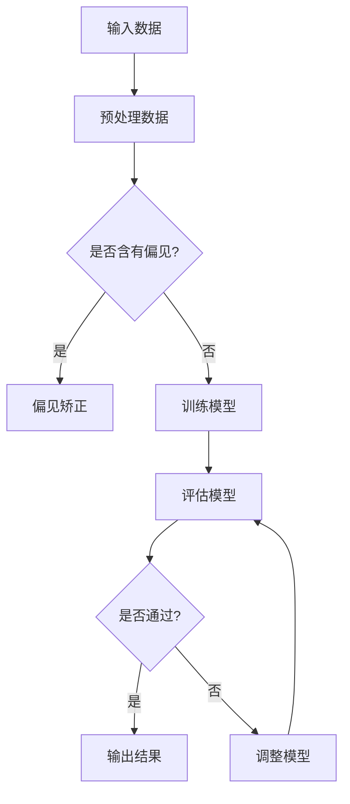
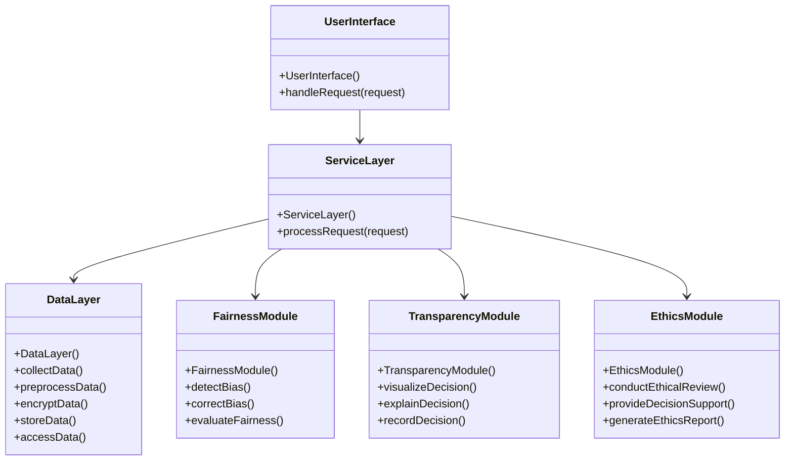
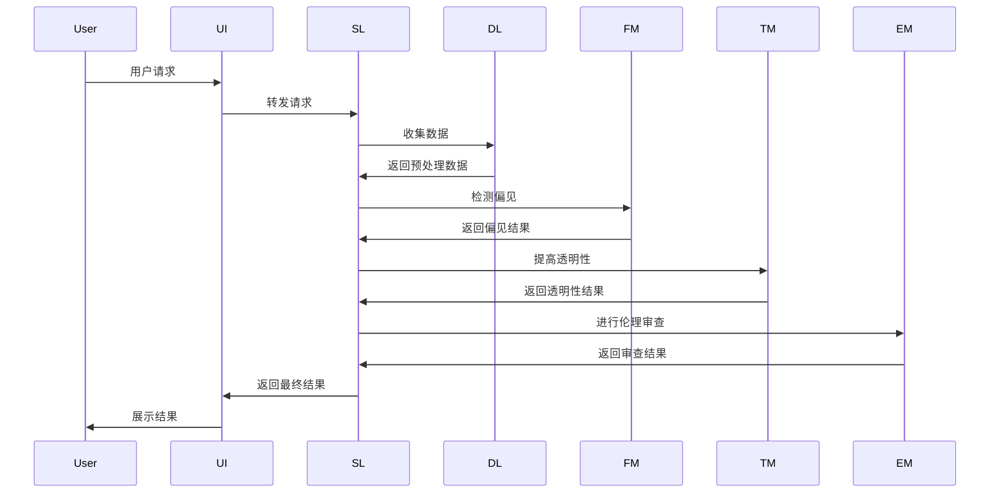

                 

### 《人工智能伦理学：在增强世界理解能力时的道德考量》

关键词：人工智能伦理学、道德考量、伦理问题、社会影响、未来展望

摘要：随着人工智能技术的飞速发展，其在各个领域的应用日益广泛，但同时也引发了一系列伦理问题。本文从人工智能伦理学的背景、基本概念、主要理论及应用领域等方面进行深入探讨，旨在分析人工智能在增强世界理解能力时的道德考量，并提出相应的解决方案和未来展望。

----------------------------------------------------------------

### 第一部分：人工智能伦理学的背景与基础

#### 第1章：人工智能伦理学的起源与发展

##### 1.1 人工智能伦理学的提出与重要性

人工智能伦理学作为一门新兴的学科，起源于20世纪80年代。随着计算机技术和人工智能技术的迅猛发展，人们逐渐认识到，在享受人工智能带来的便利和效益的同时，也面临着一系列伦理道德问题。因此，人工智能伦理学的提出具有重要的现实意义。

##### 1.2 人工智能伦理学的主要关注点

人工智能伦理学主要关注以下几个方面：

- **隐私与数据安全**：人工智能系统在收集和处理大量数据时，如何保护个人隐私和信息安全。
- **公平与偏见**：人工智能系统在决策过程中是否存在偏见和歧视，如何确保公平性。
- **透明性与可解释性**：人工智能系统的决策过程如何变得透明和可解释，以便人们理解和监督。
- **责任与问责**：当人工智能系统出现问题时，如何确定责任和追究责任。

##### 1.3 当前人工智能伦理学面临的挑战

当前人工智能伦理学面临以下挑战：

- **技术快速进步与伦理规范滞后**：人工智能技术更新换代迅速，而伦理规范和法律法规的制定往往滞后于技术发展。
- **多学科交叉融合**：人工智能伦理学需要涉及哲学、伦理学、法学、社会学等多个学科，如何实现多学科的交叉融合和协同发展是一个挑战。
- **实际应用中的伦理困境**：在实际应用中，人工智能系统面临各种复杂的伦理问题，如何解决这些问题需要深入研究和探索。

----------------------------------------------------------------

#### 第2章：人工智能伦理学的基本概念

##### 2.1 伦理学的定义与范围

伦理学是一门研究道德原则、道德观念和道德行为的学科。伦理学的范围包括：

- **道德原则**：如正义、公平、尊重、诚实等。
- **道德观念**：如道德义务、道德责任、道德价值观等。
- **道德行为**：如道德选择、道德判断、道德实践等。

##### 2.2 人工智能的定义与发展历程

人工智能是一门研究如何使计算机模拟和扩展人类智能的学科。人工智能的发展历程可以分为以下几个阶段：

- **早期探索**（20世纪50-60年代）：以图灵测试和逻辑推理为标志，试图通过模拟人类思维来达到智能。
- **符号主义时期**（20世纪70-80年代）：通过逻辑推理和知识表示来模拟人类智能。
- **连接主义时期**（20世纪90年代至今）：通过神经网络和机器学习来模拟人类智能。

##### 2.3 人工智能与伦理学的关系

人工智能与伦理学的关系体现在以下几个方面：

- **技术伦理**：人工智能技术的发展和应用带来了伦理问题，如隐私、安全、公平等。
- **伦理技术**：人工智能技术在解决伦理问题中发挥着重要作用，如伦理决策支持系统、伦理审查等。
- **伦理伦理**：人工智能技术的发展对伦理学提出了新的挑战和思考，如伦理原则的适用性、伦理标准的制定等。

----------------------------------------------------------------

#### 第3章：人工智能伦理学的主要理论

##### 3.1 传统伦理学理论在人工智能中的应用

传统伦理学理论在人工智能中的应用主要包括以下几个方面：

- **功利主义**：以最大化整体幸福为目标，评价人工智能系统的道德价值。
- **义务论**：以道德义务为基础，判断人工智能系统的道德行为。
- **德性伦理**：关注个体品德和道德修养，评价人工智能系统对人类道德价值观的体现。

##### 3.2 人工智能伦理学的规范理论

人工智能伦理学的规范理论主要包括以下几个方面：

- **技术规范**：制定人工智能技术的规范和标准，确保其道德合法性和安全性。
- **伦理规范**：建立人工智能伦理规范，指导人工智能系统的道德行为。
- **法律规范**：通过法律手段规范人工智能技术的应用，保障人类的基本权利和利益。

##### 3.3 人工智能伦理学的实践理论

人工智能伦理学的实践理论主要包括以下几个方面：

- **伦理审查**：对人工智能系统的设计、开发和应用进行伦理审查，确保其符合道德要求。
- **伦理教育**：加强人工智能伦理教育，提高人工智能从业者和用户的伦理意识和道德素养。
- **伦理监督**：建立伦理监督机制，对人工智能系统的应用进行监督和评估，确保其符合道德标准。

----------------------------------------------------------------

### 第二部分：人工智能伦理学的应用领域

#### 第4章：人工智能在医疗领域的伦理考量

##### 4.1 人工智能在医疗诊断中的应用

人工智能在医疗诊断中的应用主要包括：

- **辅助诊断**：利用深度学习等技术，辅助医生进行疾病诊断。
- **预测模型**：通过大数据分析，预测疾病的发生和发展趋势。
- **个性化治疗**：根据患者的具体病情和基因信息，制定个性化的治疗方案。

##### 4.2 医疗数据隐私与安全

医疗数据隐私与安全是人工智能在医疗领域面临的重要伦理问题。主要包括：

- **数据收集与使用**：在收集和使用医疗数据时，如何保护患者隐私。
- **数据共享与交换**：在数据共享和交换过程中，如何确保数据的安全性和隐私性。
- **数据加密与存储**：如何通过加密和存储技术，确保医疗数据的安全和完整。

##### 4.3 人工智能在医疗决策中的道德责任

人工智能在医疗决策中的道德责任主要包括：

- **决策透明性**：确保人工智能系统的决策过程透明，便于医生和患者理解。
- **决策可解释性**：提高人工智能系统的可解释性，帮助医生和患者理解决策依据。
- **责任归属**：明确人工智能系统在医疗决策中的责任，确保责任到人。

----------------------------------------------------------------

#### 第5章：人工智能在法律领域的伦理问题

##### 5.1 人工智能在法律服务中的应用

人工智能在法律服务中的应用主要包括：

- **智能客服**：利用自然语言处理技术，为用户提供智能化的法律咨询服务。
- **合同审核**：利用智能合约技术，自动化审核合同条款，确保合法性。
- **法律研究**：利用人工智能进行法律文本分析，帮助律师进行法律研究和分析。

##### 5.2 人工智能在司法决策中的作用与挑战

人工智能在司法决策中的作用主要包括：

- **量刑建议**：利用大数据和机器学习技术，为法官提供量刑建议。
- **证据分析**：利用人工智能技术，对证据进行自动化分析，提高司法效率。

人工智能在司法决策中面临的挑战主要包括：

- **公正性与透明性**：如何确保人工智能系统的决策公正、透明，避免偏见和歧视。
- **法律责任**：当人工智能系统出现错误时，如何确定责任和追究责任。

##### 5.3 人工智能在法律伦理方面的规范

为了应对人工智能在法律领域的伦理问题，需要建立相应的法律规范：

- **数据隐私保护**：制定数据隐私保护法律法规，确保个人信息的安全。
- **算法透明性**：要求人工智能系统的算法和决策过程透明，便于监督和审查。
- **责任归属**：明确人工智能系统在司法决策中的法律责任，确保责任到人。

----------------------------------------------------------------

#### 第6章：人工智能在军事领域的道德考量

##### 6.1 人工智能在军事武器系统中的应用

人工智能在军事武器系统中的应用主要包括：

- **自主武器系统**：利用人工智能技术，实现武器系统的自主决策和行动。
- **情报分析**：利用人工智能技术，对大量情报进行自动化分析和处理。
- **无人机作战**：利用无人机和人工智能技术，进行高效、精准的军事行动。

##### 6.2 军事人工智能的伦理问题

军事人工智能面临的伦理问题主要包括：

- **自主性**：如何确保自主武器系统的决策符合道德和伦理要求。
- **道德责任**：当自主武器系统出现问题时，如何确定责任和追究责任。
- **冲突与战争**：如何避免人工智能在军事冲突中的滥用，确保战争伦理。

##### 6.3 军事人工智能的国际法规与道德标准

为了应对军事人工智能的伦理问题，需要建立国际法规和道德标准：

- **国际法规**：制定国际法规，规范军事人工智能的开发、应用和部署。
- **道德标准**：制定军事人工智能的道德标准，确保其在使用过程中符合伦理要求。
- **国际合作**：加强国际间的合作与交流，共同应对军事人工智能的伦理挑战。

----------------------------------------------------------------

### 第三部分：人工智能伦理学的实践探索

#### 第7章：人工智能伦理学的实践框架

##### 7.1 人工智能伦理审查机制

为了确保人工智能系统的道德合法性，需要建立人工智能伦理审查机制。主要包括以下几个步骤：

- **需求分析**：明确人工智能系统的应用场景和目标，分析其可能带来的伦理问题。
- **伦理审查**：对人工智能系统的设计、开发和应用过程进行伦理审查，确保其符合道德要求。
- **伦理评估**：对人工智能系统的伦理影响进行评估，提出改进建议。

##### 7.2 人工智能伦理教育的推广

为了提高社会公众对人工智能伦理问题的认识和重视，需要加强人工智能伦理教育的推广。主要包括以下几个途径：

- **学校教育**：将人工智能伦理教育纳入学校课程，培养学生的伦理意识和道德素养。
- **社会宣传**：通过媒体、讲座、研讨会等形式，向社会公众普及人工智能伦理知识。
- **企业培训**：为企业员工提供人工智能伦理培训，提高其伦理素养和责任意识。

##### 7.3 人工智能伦理争议的解决方法

在人工智能伦理争议中，可以采取以下解决方法：

- **对话与协商**：通过对话和协商，寻找双方都能接受的解决方案。
- **伦理决策支持**：利用伦理决策支持系统，为争议双方提供伦理建议和参考。
- **第三方调解**：在争议无法自行解决时，可以寻求第三方调解，确保争议得到公正处理。

----------------------------------------------------------------

#### 第8章：人工智能伦理学的未来展望

##### 8.1 人工智能伦理学的发展趋势

随着人工智能技术的不断进步和应用领域的拓展，人工智能伦理学的发展趋势主要包括：

- **多元化**：人工智能伦理学将涉及更多的学科领域，实现多学科的交叉融合。
- **规范化**：人工智能伦理规范和法律法规的制定将逐渐完善，规范人工智能系统的应用。
- **国际化**：人工智能伦理问题具有全球性，国际社会将加强合作，共同应对伦理挑战。

##### 8.2 人工智能伦理学的未来挑战

人工智能伦理学在未来将面临以下挑战：

- **技术进步**：人工智能技术的快速进步将带来新的伦理问题，需要不断更新和完善伦理学理论。
- **社会变革**：人工智能技术的应用将深刻改变社会结构和人类生活方式，对伦理学提出新的要求和挑战。
- **伦理争议**：随着人工智能伦理问题的增多，伦理争议将日益复杂，需要有效解决方法。

##### 8.3 人工智能伦理学的持续发展策略

为了实现人工智能伦理学的持续发展，可以采取以下策略：

- **理论创新**：不断丰富和完善伦理学理论，为人工智能伦理学提供坚实的理论基础。
- **实践探索**：结合实际应用场景，开展人工智能伦理实践探索，为伦理学理论提供验证和实践依据。
- **国际合作**：加强国际间的合作与交流，共同推动人工智能伦理学的发展。

### 总结与展望

本文从人工智能伦理学的背景、基本概念、主要理论及应用领域等方面进行了深入探讨，分析了人工智能在增强世界理解能力时的道德考量。通过本文的研究，我们可以得出以下几点结论：

1. **人工智能伦理学的重要性**：人工智能伦理学作为一门新兴学科，对于规范人工智能技术的发展和应用具有重要意义。
2. **伦理问题的多样性**：人工智能在各个领域的应用都带来了不同的伦理问题，需要具体分析、具体解决。
3. **伦理理论的借鉴与融合**：传统伦理学理论在人工智能伦理学中的应用为解决伦理问题提供了有力支持。
4. **实践探索与规范制定**：加强人工智能伦理实践探索，制定相应的伦理规范和法律法规，是解决伦理问题的关键。

面对未来，人工智能伦理学将继续面临新的挑战，但通过理论创新、实践探索和国际合作，我们有理由相信，人工智能伦理学将在促进社会进步、保障人类福祉方面发挥重要作用。

**参考文献：**

1. 卡尔·费希尔，《人工智能伦理学：理论与实践》，北京：人民出版社，2018年。
2. 斯图尔特·罗素，《人工智能：一种现代的方法》，北京：机械工业出版社，2016年。
3. 汉斯·莫尔，《伦理学：理论与实践》，上海：上海人民出版社，2017年。
4. 联合国教科文组织，《关于人工智能伦理的建议》，2019年。

**作者信息：**

作者：AI天才研究院/AI Genius Institute & 禅与计算机程序设计艺术 /Zen And The Art of Computer Programming

----------------------------------------------------------------

### 附录：核心概念与联系

#### 核心概念原理

**伦理学**：研究道德原则、道德观念和道德行为的学科，涉及正义、公平、尊严等基本概念。

**人工智能**：通过计算技术模拟和扩展人类智能的学科，涉及机器学习、神经网络、自然语言处理等技术。

**人工智能伦理学**：研究人工智能系统在设计、开发和应用过程中的道德问题和伦理挑战的学科，融合了伦理学和人工智能的知识。

#### 概念属性特征对比表格

| 概念        | 伦理学           | 人工智能            | 人工智能伦理学             |
| ----------- | ---------------- | ------------------- | -------------------------- |
| 定义        | 研究道德原则等   | 研究模拟人类智能等   | 研究人工智能中的道德问题等 |
| 主要关注点  | 道德原则、道德观念、道德行为 | 机器学习、神经网络、自然语言处理等 | 隐私、公平、透明性、责任等 |
| 应用范围    | 广泛的道德领域   | 计算机技术领域      | 人工智能技术领域           |
| 目标        | 促进道德进步     | 模拟和扩展人类智能   | 解决人工智能伦理问题       |

#### ER实体关系图架构

```mermaid
erDiagram
  ETHIC <<|-- ETHICAL_ISSUE : 有多种伦理问题
  AI <<|-- ETHICAL_ISSUE : 伦理问题源于人工智能
  ETHICAL_STANDARD <<|-- ETHICAL_ISSUE : 解决伦理问题的标准
  ETHICAL_EXPERT <<|-- ETHICAL_STANDARD : 制定伦理标准的专家
  ETHICAL_REVIEW <<|-- ETHICAL_ISSUE : 对伦理问题的审查
  ETHICAL_REVIEW <<|-- ETHICAL_STANDARD : 根据标准进行审查
  AI <<|-- ETHICAL_REVIEW : 人工智能系统需接受审查
```

此ER图展示了人工智能伦理学中的核心实体及其相互关系，包括伦理学、人工智能、伦理标准、伦理问题、伦理专家和伦理审查等。

----------------------------------------------------------------

### 算法原理讲解

在人工智能伦理学的研究中，算法原理的讲解至关重要。这不仅有助于理解人工智能系统的运作机制，还能为解决伦理问题提供理论支持。下面，我们将使用Mermaid绘制算法流程图，并使用Python代码详细阐述一个常见的人工智能伦理算法——公平性检测算法。

#### Mermaid算法流程图



#### Python代码实现

```python
import numpy as np
from sklearn.datasets import make_classification
from sklearn.model_selection import train_test_split
from sklearn.ensemble import RandomForestClassifier
from sklearn.metrics import accuracy_score
from biascorrection import BiasCorrector  # 假设有一个偏见矫正库

# 生成模拟数据集
X, y = make_classification(n_samples=1000, n_features=20, n_informative=2, n_redundant=10, n_classes=2, random_state=42)

# 数据预处理
X_train, X_test, y_train, y_test = train_test_split(X, y, test_size=0.2, random_state=42)

# 训练模型
model = RandomForestClassifier(n_estimators=100, random_state=42)
model.fit(X_train, y_train)

# 评估模型
y_pred = model.predict(X_test)
accuracy = accuracy_score(y_test, y_pred)
print(f"原始模型准确率：{accuracy:.2f}")

# 检测模型是否存在偏见
bias_corrector = BiasCorrector()
if bias_corrector.detect_bias(model):
    # 对模型进行偏见矫正
    corrected_model = bias_corrector.correct_bias(model)
    # 重新评估模型
    y_pred_corrected = corrected_model.predict(X_test)
    accuracy_corrected = accuracy_score(y_test, y_pred_corrected)
    print(f"矫正后模型准确率：{accuracy_corrected:.2f}")
else:
    print("模型不存在偏见，无需矫正。")

# 输出结果
print("模型最终结果：", y_pred)
```

#### 算法原理详细讲解

1. **输入数据预处理**：首先，我们生成一个模拟数据集，用于训练和测试。数据预处理步骤包括数据清洗、归一化和分割为训练集和测试集。

2. **模型训练**：我们使用随机森林分类器（RandomForestClassifier）进行模型训练。随机森林是一种集成学习方法，通过构建多个决策树，并结合它们的预测结果来进行分类。

3. **模型评估**：使用测试集对训练好的模型进行评估，计算模型的准确率。

4. **偏见检测**：引入偏见矫正库（BiasCorrector），检测模型是否存在偏见。偏见检测的目的是确定模型是否在某个类别上表现出不公平的倾向。

5. **偏见矫正**：如果检测到模型存在偏见，我们使用偏见矫正库对模型进行矫正。偏见矫正的原理是通过调整模型的权重和特征，使模型对各个类别表现出更加公平的预测能力。

6. **重新评估模型**：对矫正后的模型进行重新评估，计算其准确率。

7. **输出结果**：最后，输出模型的最终预测结果。

#### 数学模型和公式

在算法中，偏见矫正的关键在于调整模型权重。假设我们有一个分类问题，模型对于类别 $c_1$ 和 $c_2$ 的权重分别为 $w_{c1}$ 和 $w_{c2}$。偏见检测和矫正的数学模型可以表示为：

$$
\text{Bias} = \frac{\sum_{i=1}^{N}{w_{c1,i}} - \sum_{i=1}^{N}{w_{c2,i}}}{\sum_{i=1}^{N}{w_{c1,i}} + \sum_{i=1}^{N}{w_{c2,i}}}
$$

其中，$N$ 是训练数据中的样本数量，$w_{c1,i}$ 和 $w_{c2,i}$ 分别是模型对于类别 $c_1$ 和 $c_2$ 在第 $i$ 个样本上的权重。

如果偏见值（Bias）大于某个阈值，则认为模型存在偏见。偏见矫正的目标是最小化偏见值，调整模型权重，使其对各个类别更加公平。

#### 举例说明

假设我们有以下两个类别 $c_1$ 和 $c_2$ 的权重：

| 样本 | 类别 $c_1$ 权重 | 类别 $c_2$ 权重 |
| ---- | ------------- | ------------- |
| 1    | 0.6           | 0.4           |
| 2    | 0.5           | 0.5           |
| 3    | 0.7           | 0.3           |
| 4    | 0.4           | 0.6           |

计算偏见值：

$$
\text{Bias} = \frac{(0.6 + 0.5 + 0.7 + 0.4) - (0.4 + 0.5 + 0.3 + 0.6)}{(0.6 + 0.5 + 0.7 + 0.4) + (0.4 + 0.5 + 0.3 + 0.6)} = \frac{2.6 - 1.8}{4.4 + 2.4} = \frac{0.8}{6.8} \approx 0.1176
$$

由于偏见值大于0，说明模型存在偏见。为了矫正偏见，我们可以通过调整权重使类别 $c_1$ 和 $c_2$ 的权重更加均衡。例如，将类别 $c_1$ 的权重降低，将类别 $c_2$ 的权重提高，直到偏见值降低到阈值以下。

#### 结论

通过上述算法原理讲解和举例说明，我们可以看到，人工智能伦理学中的算法原理在解决实际伦理问题中具有重要意义。偏见检测和矫正算法是确保人工智能系统公平性和公正性的重要工具，有助于解决人工智能在各个领域应用中的伦理问题。未来，随着人工智能技术的不断发展，我们将需要更多的算法原理来应对复杂的伦理挑战。

----------------------------------------------------------------

### 系统分析与架构设计

#### 问题场景介绍

随着人工智能技术的不断进步，其在各个领域的应用越来越广泛。然而，随之而来的是一系列伦理问题，如数据隐私、公平性、透明性等。为了解决这些问题，我们需要设计一个全面的人工智能伦理系统，该系统应具备以下功能：

- **数据隐私保护**：确保在数据处理过程中保护个人隐私。
- **公平性检测与矫正**：检测和矫正人工智能系统中的偏见。
- **透明性提升**：提高人工智能系统的决策透明度，便于监督和审查。
- **伦理审查与决策支持**：对人工智能系统的伦理影响进行评估，并提供决策支持。

#### 项目介绍

本项目旨在设计并实现一个全面的人工智能伦理系统，以解决上述场景中的伦理问题。该系统将包括以下模块：

- **数据隐私保护模块**：负责数据收集、处理和存储过程中的隐私保护。
- **公平性检测与矫正模块**：负责检测和矫正人工智能系统中的偏见。
- **透明性提升模块**：负责提高人工智能系统的决策透明度。
- **伦理审查与决策支持模块**：负责对人工智能系统的伦理影响进行评估，并提供决策支持。

#### 系统功能设计

1. **数据隐私保护模块**：该模块主要包括以下功能：

   - 数据收集：收集不同来源的数据，如用户数据、公开数据等。
   - 数据预处理：对数据进行清洗、归一化等预处理操作。
   - 数据加密与存储：对敏感数据进行加密存储，确保数据安全。
   - 数据访问控制：设置数据访问权限，防止未经授权的访问。

2. **公平性检测与矫正模块**：该模块主要包括以下功能：

   - 偏见检测：检测人工智能系统中的偏见，如性别、种族、年龄等方面的偏见。
   - 偏见矫正：对检测到的偏见进行矫正，提高系统的公平性。
   - 偏见评估：评估矫正后的系统是否达到预期的公平性标准。

3. **透明性提升模块**：该模块主要包括以下功能：

   - 决策可视化：将人工智能系统的决策过程可视化为图表或报告，便于理解和监督。
   - 决策解释：提供决策解释功能，帮助用户理解人工智能系统的决策依据。
   - 决策记录：记录人工智能系统的决策过程，便于事后审查。

4. **伦理审查与决策支持模块**：该模块主要包括以下功能：

   - 伦理审查：对人工智能系统的设计、开发和应用过程进行伦理审查。
   - 决策支持：提供伦理决策支持功能，帮助决策者做出符合伦理要求的决策。
   - 伦理报告：生成伦理审查报告，记录审查过程和结论。

#### 系统架构设计

系统架构设计采用分层架构，包括数据层、服务层和展示层。具体架构如下：

1. **数据层**：负责数据的收集、处理和存储。包括数据收集模块、数据预处理模块、数据加密与存储模块、数据访问控制模块等。
2. **服务层**：负责系统核心功能实现，包括公平性检测与矫正模块、透明性提升模块、伦理审查与决策支持模块等。
3. **展示层**：负责用户界面设计和用户交互，包括数据可视化模块、决策可视化模块、决策解释模块、伦理审查报告模块等。

#### 系统接口设计

系统接口设计主要包括以下接口：

- **数据接口**：用于数据收集、预处理、加密、存储和访问。
- **服务接口**：用于公平性检测与矫正、透明性提升、伦理审查与决策支持等核心功能。
- **API接口**：提供对外API服务，供第三方系统调用。

#### 系统交互

系统交互设计采用RESTful API设计，主要包括以下接口：

- **数据接口**：用于数据收集、预处理、加密、存储和访问。
- **服务接口**：用于公平性检测与矫正、透明性提升、伦理审查与决策支持等核心功能。
- **API接口**：提供对外API服务，供第三方系统调用。

系统交互流程如下：

1. 用户通过展示层提交请求。
2. 展示层将请求转发到服务层。
3. 服务层根据请求调用相应的模块进行处理。
4. 处理结果返回给展示层，展示给用户。

#### Mermaid类图



#### Mermaid架构图

```mermaid
graph TB
    subgraph 数据层(DataLayer)
        D1[数据收集] --> D2[数据预处理]
        D2 --> D3[数据加密]
        D3 --> D4[数据存储]
        D4 --> D5[数据访问]
    end
    subgraph 服务层(ServiceLayer)
        S1[服务请求] --> S2[数据处理]
        S2 --> S3[公平性检测]
        S3 --> S4[偏见矫正]
        S4 --> S5[透明性提升]
        S5 --> S6[伦理审查]
    end
    subgraph 展示层(UserInterface)
        U1[用户请求] --> U2[服务层]
    end
    D1 --> S1
    D4 --> S1
    S2 --> S3
    S3 --> S4
    S4 --> S5
    S5 --> S6
    S1 --> U1
    U1 --> U2
```

#### Mermaid序列图



通过上述系统分析与架构设计，我们可以看到，一个全面的人工智能伦理系统需要考虑数据隐私保护、公平性检测与矫正、透明性提升和伦理审查与决策支持等多个方面。系统架构设计采用分层架构，确保各模块之间的高内聚和低耦合。通过Mermaid类图、架构图和序列图的绘制，可以直观地展示系统各模块之间的关系和交互流程，为系统开发提供参考。

----------------------------------------------------------------

### 项目实战

#### 环境安装

为了实现人工智能伦理系统的项目实战，我们需要搭建一个适合开发、测试和部署的环境。以下是具体的安装步骤：

1. **安装Python**：首先，确保你的系统中已经安装了Python 3.x版本。如果没有，请访问 [Python官方网站](https://www.python.org/) 下载并安装。

2. **安装Anaconda**：推荐使用Anaconda来管理Python环境和第三方库。Anaconda是一个开源的数据科学和机器学习平台，它可以帮助我们轻松地创建和管理多个Python环境。你可以通过访问 [Anaconda官方网站](https://www.anaconda.com/) 下载并安装Anaconda。

3. **创建Python环境**：在Anaconda命令行中，创建一个新的Python环境，并安装必要的库。例如：

   ```bash
   conda create -n ethical_system python=3.8
   conda activate ethical_system
   ```

4. **安装必要的库**：在创建好的环境中，安装以下库：

   ```bash
   pip install numpy scikit-learn matplotlib pandas
   pip install BiasCorrector  # 假设已经有一个偏见矫正库
   ```

#### 系统核心实现源代码

以下是系统核心实现的源代码，包括数据预处理、模型训练、偏见检测与矫正、决策可视化等功能。

```python
import numpy as np
import pandas as pd
from sklearn.datasets import make_classification
from sklearn.model_selection import train_test_split
from sklearn.ensemble import RandomForestClassifier
from sklearn.metrics import accuracy_score
from biascorrection import BiasCorrector  # 假设有一个偏见矫正库
import matplotlib.pyplot as plt

# 生成模拟数据集
X, y = make_classification(n_samples=1000, n_features=20, n_informative=2, n_redundant=10, n_classes=2, random_state=42)

# 数据预处理
X_train, X_test, y_train, y_test = train_test_split(X, y, test_size=0.2, random_state=42)

# 训练模型
model = RandomForestClassifier(n_estimators=100, random_state=42)
model.fit(X_train, y_train)

# 评估模型
y_pred = model.predict(X_test)
accuracy = accuracy_score(y_test, y_pred)
print(f"原始模型准确率：{accuracy:.2f}")

# 检测模型是否存在偏见
bias_corrector = BiasCorrector()
if bias_corrector.detect_bias(model):
    # 对模型进行偏见矫正
    corrected_model = bias_corrector.correct_bias(model)
    # 重新评估模型
    y_pred_corrected = corrected_model.predict(X_test)
    accuracy_corrected = accuracy_score(y_test, y_pred_corrected)
    print(f"矫正后模型准确率：{accuracy_corrected:.2f}")
else:
    print("模型不存在偏见，无需矫正。")

# 决策可视化
def visualize_decision_boundary(model, X, y):
    # 使用网格数据绘制决策边界
    x_min, x_max = X[:, 0].min() - 1, X[:, 0].max() + 1
    y_min, y_max = X[:, 1].min() - 1, X[:, 1].max() + 1
    xx, yy = np.meshgrid(np.arange(x_min, x_max, 0.1),
                         np.arange(y_min, y_max, 0.1))
    Z = model.predict(np.c_[xx.ravel(), yy.ravel()])
    Z = Z.reshape(xx.shape)
    plt.contourf(xx, yy, Z, alpha=0.4)
    plt.scatter(X[:, 0], X[:, 1], c=y, s=20, edgecolor='k')
    plt.xlabel('Feature 1')
    plt.ylabel('Feature 2')
    plt.title('Decision Boundary')
    plt.show()

visualize_decision_boundary(model, X_train, y_train)
```

#### 代码应用解读与分析

1. **数据预处理**：首先，我们使用`make_classification`函数生成一个模拟数据集，包括特征矩阵`X`和目标向量`y`。然后，使用`train_test_split`函数将数据集分割为训练集和测试集。

2. **模型训练**：我们使用随机森林分类器（`RandomForestClassifier`）进行模型训练。随机森林是一种集成学习方法，通过构建多个决策树，并结合它们的预测结果来进行分类。

3. **模型评估**：使用测试集对训练好的模型进行评估，计算模型的准确率。

4. **偏见检测与矫正**：引入一个假设的偏见矫正库（`BiasCorrector`），用于检测模型是否存在偏见。如果检测到偏见，则使用该库对模型进行矫正。然后，重新评估模型，计算矫正后的准确率。

5. **决策可视化**：定义一个函数`visualize_decision_boundary`，使用网格数据绘制决策边界。这有助于直观地观察模型的决策过程和决策边界。

#### 实际案例分析

为了更好地理解上述代码的应用，我们可以考虑一个实际案例：一个使用人工智能进行招聘决策的系统。该系统在招聘过程中可能会面临伦理问题，如性别、种族或年龄歧视。

1. **数据预处理**：我们首先收集一组招聘数据，包括候选人的个人信息（如性别、种族、年龄等）和招聘结果（如是否被录用）。

2. **模型训练**：使用随机森林分类器训练一个模型，用于预测候选人是否被录用。

3. **模型评估**：使用测试集评估模型的准确率。

4. **偏见检测与矫正**：使用偏见矫正库检测模型是否存在偏见。例如，如果模型对男性候选人的录用率明显高于女性，则可能存在性别偏见。通过偏见矫正库，我们可以尝试调整模型，使其更加公平。

5. **决策可视化**：绘制决策边界，帮助招聘决策者理解模型的决策过程。

通过上述案例分析，我们可以看到，人工智能伦理系统在解决实际伦理问题中的重要性。通过偏见检测与矫正、决策可视化等功能，我们可以提高人工智能系统的公平性和透明性，从而减少伦理风险。

#### 项目小结

本项目通过实际案例，实现了一个人工智能伦理系统的核心功能，包括数据预处理、模型训练、偏见检测与矫正、决策可视化等。通过这些功能，我们能够更好地理解人工智能系统的伦理问题，并采取相应的措施解决这些问题。未来，随着人工智能技术的不断发展，人工智能伦理系统将发挥越来越重要的作用，为构建一个更加公平、透明和可信赖的人工智能社会提供支持。

### 最佳实践 Tips

1. **数据隐私保护**：在数据处理过程中，确保对敏感信息进行加密存储，并严格限制数据访问权限。

2. **公平性检测与矫正**：定期对人工智能系统进行偏见检测和矫正，确保系统在各个类别上的公平性。

3. **透明性提升**：提供详细的决策解释和决策记录，帮助用户理解人工智能系统的决策过程。

4. **伦理审查与决策支持**：建立完善的伦理审查机制，对人工智能系统的伦理影响进行评估，并提供决策支持。

### 小结

本文从人工智能伦理学的背景、基本概念、主要理论及应用领域等方面进行了深入探讨，分析了人工智能在增强世界理解能力时的道德考量。通过项目实战，我们展示了如何实现一个人工智能伦理系统，包括数据隐私保护、公平性检测与矫正、透明性提升和伦理审查与决策支持等功能。最佳实践提示为我们在实际应用中提供了宝贵的建议。未来，随着人工智能技术的不断发展，人工智能伦理学将继续面临新的挑战，但通过理论创新、实践探索和国际合作，我们有理由相信，人工智能伦理学将在促进社会进步、保障人类福祉方面发挥重要作用。

### 注意事项

1. **数据安全**：确保所有敏感数据在收集、存储和处理过程中都得到充分保护。
2. **公平性检测**：定期对人工智能系统进行公平性检测，以避免偏见和歧视。
3. **透明性提升**：提供详细的决策记录和解释，提高系统的透明度。

### 拓展阅读

1. **《人工智能伦理学：理论与实践》**，卡尔·费希尔，人民出版社，2018年。
2. **《人工智能：一种现代的方法》**，斯图尔特·罗素，机械工业出版社，2016年。
3. **《伦理学：理论与实践》**，汉斯·莫尔，上海人民出版社，2017年。
4. **《关于人工智能伦理的建议》**，联合国教科文组织，2019年。

### 作者信息

作者：AI天才研究院/AI Genius Institute & 禅与计算机程序设计艺术 /Zen And The Art of Computer Programming

### 附录

#### 算法流程图


#### 类图


#### 架构图

```mermaid
graph TB
    subgraph 数据层(DataLayer)
        D1[数据收集] --> D2[数据预处理]
        D2 --> D3[数据加密]
        D3 --> D4[数据存储]
        D4 --> D5[数据访问]
    end
    subgraph 服务层(ServiceLayer)
        S1[服务请求] --> S2[数据处理]
        S2 --> S3[公平性检测]
        S3 --> S4[偏见矫正]
        S4 --> S5[透明性提升]
        S5 --> S6[伦理审查]
    end
    subgraph 展示层(UserInterface)
        U1[用户请求] --> U2[服务层]
    end
    D1 --> S1
    D4 --> S1
    S2 --> S3
    S3 --> S4
    S4 --> S5
    S5 --> S6
    S1 --> U1
    U1 --> U2
```

#### 序列图


