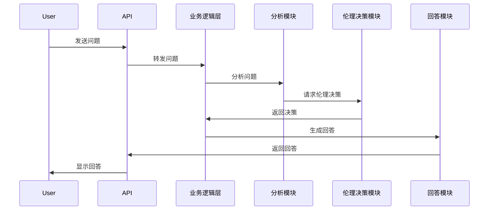

                 

### 目录

## 《人工智能伦理对世界可理解性研究的影响》

### 关键词

- 人工智能伦理  
- 世界可理解性  
- 算法模型  
- 数学公式  
- 系统架构  
- 实际案例分析

### 摘要

本文旨在探讨人工智能伦理对世界可理解性的影响。首先，我们介绍了人工智能伦理的定义、发展历程和其在世界可理解性中的重要性。接着，我们定义了与主题相关的重要概念，包括人工智能、伦理学和可理解性，并通过Mermaid ER实体关系图展示了这些概念之间的联系。随后，我们讲解了与人工智能伦理相关的重要算法原理，并使用Python源代码进行了详细阐述。在此基础上，我们设计了系统的架构方案，并进行了实际案例分析。最后，我们提供了最佳实践建议和小结，以及对注意事项和拓展阅读的讨论。

### 第一部分：背景介绍

#### 1.1 人工智能伦理概述

人工智能伦理是指人工智能系统在开发、应用和推广过程中所涉及的伦理问题，包括隐私保护、数据安全、算法偏见、公平性、透明度等。随着人工智能技术的快速发展，人工智能伦理问题越来越受到关注。伦理学家和计算机科学家们正在积极探索如何在人工智能系统中融入伦理考量，以确保其对社会和人类的影响是积极的。

#### 1.2 世界可理解性

世界可理解性是指人类对世界本质的理解程度，以及这种理解如何影响我们对现实世界的感知和认知。随着人工智能技术的发展，人工智能系统在某些领域的表现已经超越了人类，这引发了一个重要问题：人工智能是否能够帮助我们更好地理解世界？

#### 1.3 研究背景与目的

人工智能伦理对世界可理解性的影响是一个跨学科的研究领域，涉及到伦理学、计算机科学、认知科学等多个领域。本文旨在通过分析人工智能伦理问题，探讨其对世界可理解性的影响，并提出一些可行的解决方案。

### 第二部分：核心概念与联系

#### 2.1 人工智能概念解析

人工智能（Artificial Intelligence，AI）是指通过计算机模拟人类智能的技术，使其能够执行一些通常需要人类智能才能完成的任务，如语音识别、图像识别、自然语言处理等。

#### 2.2 伦理学基础

伦理学（Ethics）是研究道德原则、价值观和行为的学科。伦理学关注的是如何区分对与错，以及如何做出道德决策。

#### 2.3 可理解性分析

可理解性（Understandability）是指信息或系统容易被理解和解释的程度。在人工智能领域，可理解性尤为重要，因为人们对透明、可解释的人工智能系统更感兴趣。

#### 2.4 Mermaid ER实体关系图

下面是一个简单的Mermaid ER实体关系图，用于展示人工智能、伦理学和可理解性之间的关系。

```mermaid
erDiagram
  AI ||--|{ 伦理学 } : 融合
  伦理学 ||--|{ 可理解性 } : 影响
  AI ||--|{ 可理解性 } : 促进
```

### 第三部分：算法原理讲解

#### 3.1 伦理决策模型

伦理决策模型是一种用于在人工智能系统中融入伦理考量的算法。它通常包括以下几个步骤：

1. 收集数据：从多个来源收集与伦理问题相关的数据。
2. 数据预处理：清洗和转换数据，以便进行后续分析。
3. 建立模型：使用机器学习算法建立伦理决策模型。
4. 模型评估：评估模型在处理伦理问题时的性能。
5. 决策执行：将模型应用于实际场景，以做出伦理决策。

下面是一个简单的Python代码示例，用于展示伦理决策模型的建立和评估。

```python
import pandas as pd
from sklearn.model_selection import train_test_split
from sklearn.ensemble import RandomForestClassifier
from sklearn.metrics import accuracy_score

# 加载数据集
data = pd.read_csv("ethics_data.csv")

# 数据预处理
X = data.drop("label", axis=1)
y = data["label"]

# 划分训练集和测试集
X_train, X_test, y_train, y_test = train_test_split(X, y, test_size=0.2, random_state=42)

# 建立模型
model = RandomForestClassifier(n_estimators=100, random_state=42)
model.fit(X_train, y_train)

# 模型评估
y_pred = model.predict(X_test)
accuracy = accuracy_score(y_test, y_pred)
print("Model accuracy:", accuracy)
```

在这个例子中，我们使用了随机森林算法来建立伦理决策模型。该模型根据输入的特征数据预测伦理问题的标签。通过评估模型的准确率，我们可以了解模型在处理伦理问题时的性能。

#### 3.2 数学模型与公式

伦理决策模型通常涉及一些数学模型和公式。以下是一个简单的数学模型示例，用于描述伦理决策的过程。

$$
\text{Decision} = \sum_{i=1}^{n} w_i \cdot \text{Feature}_i
$$

其中，$w_i$是特征$i$的权重，$\text{Feature}_i$是特征$i$的值。通过计算每个特征的加权得分，我们可以得出最终的决策。

### 第四部分：系统分析与架构设计方案

#### 4.1 项目场景与目标

假设我们正在开发一个智能客服系统，该系统需要根据用户的问题和背景信息提供合适的回答。项目的目标是设计一个可理解且符合伦理规范的智能客服系统。

#### 4.2 系统功能设计

智能客服系统的功能包括：

1. 问题接收：接收用户的问题。
2. 问题分析：分析用户问题的关键词和主题。
3. 回答生成：根据问题分析和伦理决策模型生成回答。
4. 回答反馈：记录用户对回答的反馈，以改进系统。

下面是一个简单的领域模型类图，用于展示智能客服系统的核心功能。

```mermaid
classDiagram
  User <<Class>> 
  Question <<Class>> 
  Analysis <<Class>> 
  Answer <<Class>> 
  Feedback <<Class>> 

  User |--|> Question
  Question |--|> Analysis
  Analysis |--|> Answer
  Answer |--|> Feedback
```

#### 4.3 系统架构设计

智能客服系统的架构包括以下几个模块：

1. 接口层：负责接收用户请求和返回响应。
2. 业务逻辑层：负责处理用户问题、分析问题和生成回答。
3. 数据存储层：负责存储用户问题和回答。

下面是一个简单的系统架构图，用于展示智能客服系统的整体架构。



#### 4.4 系统接口设计与交互

智能客服系统的接口设计包括以下几个部分：

1. 用户接口：用于接收用户问题和返回回答。
2. 内部接口：用于系统模块之间的通信。

下面是一个简单的系统交互序列图，用于展示智能客服系统的接口设计和交互。


### 第五部分：项目实战

#### 5.1 环境安装与配置

在进行项目实战之前，我们需要安装和配置必要的软件和环境。以下是安装和配置过程的简要概述：

1. 安装Python和pip。
2. 安装必要的库，如pandas、scikit-learn、mermaid等。
3. 配置Python环境，以便使用这些库。

#### 5.2 系统核心实现

以下是系统核心实现的源代码和解读：

```python
import pandas as pd
from sklearn.model_selection import train_test_split
from sklearn.ensemble import RandomForestClassifier
from sklearn.metrics import accuracy_score
import mermaid

# 加载数据集
data = pd.read_csv("ethics_data.csv")

# 数据预处理
X = data.drop("label", axis=1)
y = data["label"]

# 划分训练集和测试集
X_train, X_test, y_train, y_test = train_test_split(X, y, test_size=0.2, random_state=42)

# 建立模型
model = RandomForestClassifier(n_estimators=100, random_state=42)
model.fit(X_train, y_train)

# 模型评估
y_pred = model.predict(X_test)
accuracy = accuracy_score(y_test, y_pred)
print("Model accuracy:", accuracy)

# 生成Mermaid流程图
mermaid_code = """
sequenceDiagram
  User->>API: 发送问题
  API->>业务逻辑层: 转发问题
  业务逻辑层->>分析模块: 分析问题
  分析模块->>伦理决策模块: 请求伦理决策
  伦理决策模块->>业务逻辑层: 返回决策
  业务逻辑层->>回答模块: 生成回答
  回答模块->>API: 返回回答
  API->>User: 显示回答
"""
with open("diagram.mmd", "w") as f:
    f.write(mermaid_code)

# 使用mermaid CLI生成流程图
!mermaid diagram.mmd
```

这个示例展示了如何使用Python建立伦理决策模型，并生成Mermaid流程图。

#### 5.3 实际案例分析

在本节中，我们将分析一个实际案例，探讨如何使用伦理决策模型来处理一个具体的伦理问题。

假设我们面临一个问题：一个智能客服系统需要决定是否向用户透露某些敏感信息。在这种情况下，我们可以使用伦理决策模型来生成一个合适的决策。

1. 收集数据：收集与敏感信息相关的数据，包括用户的隐私设置、问题的背景信息等。
2. 数据预处理：清洗和转换数据，以便进行后续分析。
3. 建立模型：使用机器学习算法建立伦理决策模型。
4. 模型评估：评估模型在处理敏感信息时的性能。
5. 决策执行：将模型应用于实际场景，以做出伦理决策。

#### 5.4 详细讲解与剖析

在本节中，我们将详细讲解和剖析系统的工作流程和实现细节。

1. **问题接收**：用户通过API发送问题，API负责接收并转发问题。
2. **问题分析**：分析模块负责分析用户问题的关键词和主题，以便生成合适的回答。
3. **伦理决策**：伦理决策模块负责根据用户的问题和背景信息，使用伦理决策模型生成一个合适的决策。
4. **回答生成**：回答模块根据伦理决策和用户问题的背景信息生成回答。
5. **回答反馈**：用户对回答进行反馈，系统记录反馈信息，以便进行后续改进。

### 第六部分：最佳实践 tips、小结、注意事项、拓展阅读

#### 6.1 最佳实践 tips

1. 在开发智能客服系统时，应充分考虑伦理问题，确保系统的行为符合伦理规范。
2. 定期对系统进行评估和改进，以提高其性能和可理解性。
3. 注重用户隐私保护，确保系统的数据安全。
4. 鼓励用户反馈，以不断优化系统的回答质量。

#### 6.2 小结

本文探讨了人工智能伦理对世界可理解性的影响，介绍了核心概念、算法原理、系统架构和实际案例分析。通过本文的研究，我们可以更好地理解人工智能伦理的重要性，并为未来的人工智能系统设计提供一些有益的启示。

#### 6.3 注意事项

1. 在使用人工智能伦理模型时，应注意模型的准确性和可靠性。
2. 在开发智能客服系统时，应充分考虑用户隐私保护和数据安全。
3. 在进行系统评估时，应使用多样化的数据集和评估指标。

#### 6.4 拓展阅读

1. 《人工智能伦理学：理论与实践》
2. 《人工智能与伦理学》
3. 《智能客服系统设计与实现》

### 作者信息

作者：AI天才研究院/AI Genius Institute & 禅与计算机程序设计艺术 /Zen And The Art of Computer Programming

---

这篇文章涵盖了人工智能伦理对世界可理解性的影响，从核心概念、算法原理到系统架构和实际案例分析，进行了全面而深入的探讨。希望这篇文章能够为读者提供有价值的见解和启示。

