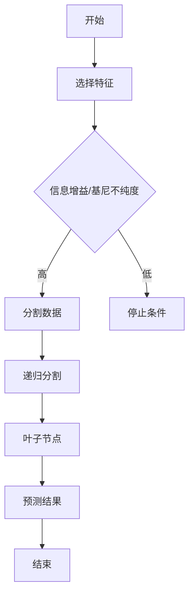
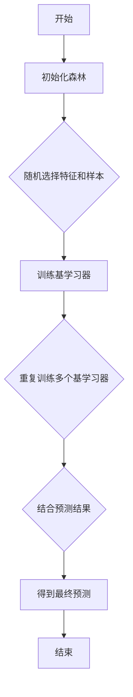
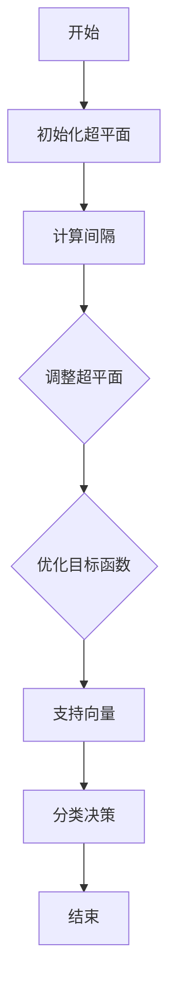
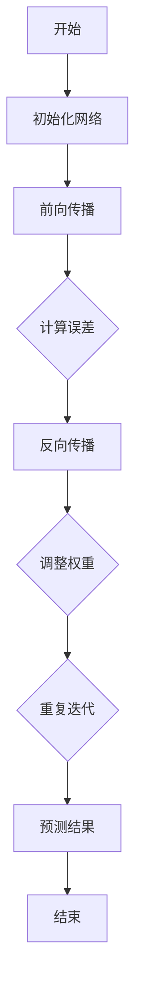
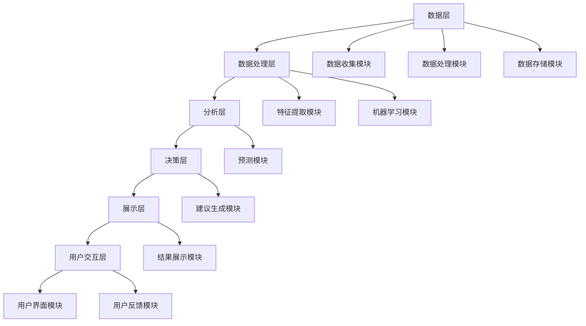
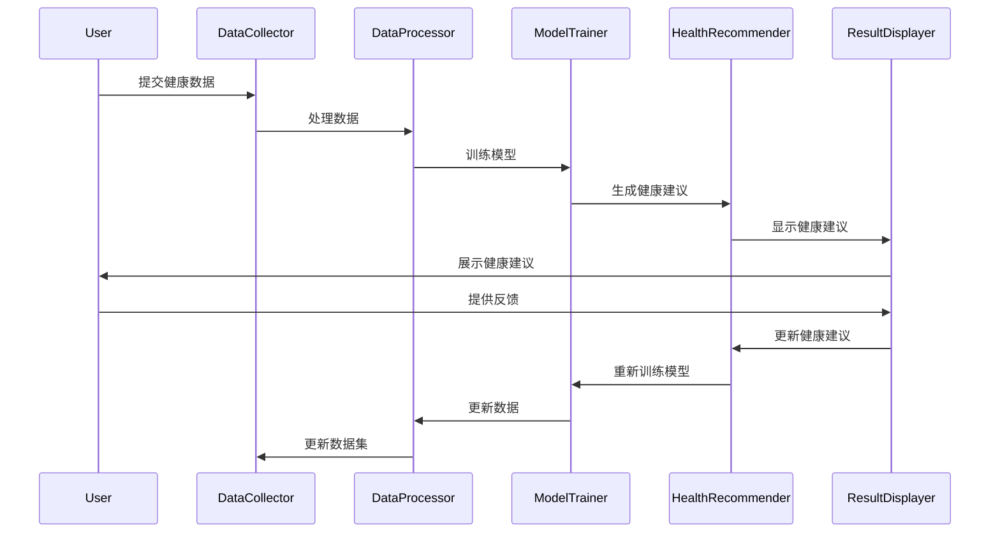

                 


### 1.1.1 人工智能与个性化健康建议的背景

人工智能（Artificial Intelligence, AI）自20世纪中期诞生以来，经历了从理论研究到应用实践的不断演进。随着计算能力的提升和大数据技术的成熟，AI技术逐渐渗透到医疗健康领域，带来了革命性的变革。个性化健康建议（Personalized Health Recommendations）作为AI在医疗健康领域的一个重要应用，旨在根据个体的健康状况、生活习惯、基因信息等，提供定制化的健康指导和疾病预防方案。

在传统的医疗模式中，医生通过面对面的诊断和治疗方案设计来服务患者，这种模式存在着效率低、覆盖面窄的问题。而随着AI技术的发展，个性化健康建议系统可以实时分析大量的医疗数据，快速为患者提供科学、精准的健康建议，从而提高医疗服务的效率和质量。

个性化健康建议的兴起，也得益于大数据和生物信息学的进步。大量的健康数据（如基因组数据、电子健康记录、运动数据等）为AI算法提供了丰富的训练素材，使得AI系统能够更加精准地识别个体健康差异，提供个性化的健康建议。此外，随着传感器技术的进步，个体健康数据可以被实时收集，为AI系统提供了实时更新的数据源。

总的来说，人工智能与个性化健康建议的结合，不仅能够提高医疗服务的效率和质量，还能够为个体提供更加个性化的健康管理方案，有助于预防和控制疾病的发生，从而提升全民健康水平。

### 1.1.2 个性化健康建议的需求与挑战

个性化健康建议的需求源于现代医疗健康领域的几个关键问题。首先，随着人口老龄化趋势的加剧，慢性疾病和复杂病症的患者数量不断增加，对医疗资源的需求也日益增长。传统的医疗模式往往依赖于医生的诊断和治疗，这种方式不仅效率低下，而且无法满足个性化需求。其次，健康数据的爆炸式增长使得处理和分析这些数据成为一个巨大的挑战，如何从海量数据中提取有价值的信息，为个体提供精准的健康建议，成为了一个迫切需要解决的问题。

然而，在提供个性化健康建议的过程中，也面临着诸多挑战。首先是数据隐私问题。个性化健康建议需要大量的个人健康数据，这些数据往往涉及隐私信息，如基因数据、生活习惯等。如何在保护患者隐私的同时，充分利用这些数据进行个性化健康建议，是一个亟待解决的问题。其次，数据质量和数据完整性也是一大挑战。健康数据往往来源于多个渠道，这些数据可能存在不一致性、噪声和缺失值，如何对这些数据进行有效的清洗和处理，确保数据质量，是一个关键问题。

算法的准确性和可靠性也是个性化健康建议面临的挑战之一。尽管AI技术在数据分析和模式识别方面具有巨大的潜力，但如何设计出既准确又可靠的算法，确保建议的科学性和实用性，仍然需要深入研究和实践。此外，个性化健康建议还需要考虑文化背景和社会因素。不同地区、不同文化背景下，个体的健康需求和期望可能存在显著差异，如何设计出普适性强且符合当地文化需求的健康建议系统，也是一个需要关注的问题。

总的来说，个性化健康建议在满足个体化医疗需求、提升医疗效率和质量方面具有巨大潜力，但同时也面临着数据隐私、数据质量、算法准确性等多方面的挑战。解决这些问题，需要跨学科的合作和技术创新，为个性化健康建议的广泛应用奠定坚实的基础。

### 1.1.3 人工智能在健康建议中的潜力

人工智能在健康建议中的应用潜力不可小觑，它不仅能够提升医疗服务的效率和准确性，还为个性化医疗提供了强有力的技术支持。首先，AI在疾病预测和诊断方面展现了强大的能力。通过分析患者的电子健康记录、实验室检测结果和基因组数据，AI算法能够识别出潜在的健康风险，提前进行预防干预。例如，IBM的Watson for Oncology系统可以分析大量的医学文献和病例数据，为医生提供个性化的治疗方案建议，从而提高癌症等复杂疾病的诊断准确性。

其次，人工智能在个性化健康建议中的应用大大提升了健康管理的效果。通过分析个体的健康数据和生活方式信息，AI系统能够为用户提供定制化的健康计划，包括饮食建议、运动方案和生活方式调整等。这种个性化的健康管理方案不仅能够帮助用户养成良好的生活习惯，还能有效预防和控制慢性疾病的发生。例如，苹果的Health app和谷歌的Google Fit等应用，通过整合用户的健康数据，提供个性化的健康建议，帮助用户实现健康目标。

此外，人工智能还在健康数据的处理和分析方面发挥了重要作用。随着健康数据的不断积累，如何从海量数据中提取有价值的信息，成为了一个关键问题。AI算法，如深度学习和自然语言处理技术，能够高效地处理和分析这些数据，从中发现潜在的规律和模式。例如，谷歌的DeepMind团队开发的AI系统，通过分析大量的眼科医学图像，能够快速准确地诊断出糖尿病视网膜病变，大大提高了疾病的早期诊断率。

最后，人工智能还在医学研究和临床试验中发挥了重要作用。通过分析大量的临床试验数据和医学文献，AI算法能够加速新药的研发和临床试验的进程，提高医学研究的效率和质量。例如，美国的Biomedical Advanced Research and Development Authority（BARDA）已经利用AI技术加速疫苗的研发，为疫情防控提供了有力支持。

总的来说，人工智能在健康建议中的应用具有巨大的潜力。它不仅能够提高医疗服务的效率和质量，还为个性化医疗提供了强有力的技术支持。随着技术的不断进步和应用的深入，人工智能有望在健康领域发挥更加重要的作用，为人类的健康福祉做出更大的贡献。

### 1.2 核心概念与联系

在探讨人工智能在个性化健康建议中的应用时，首先需要明确几个核心概念，并分析它们之间的联系。以下是这些核心概念的详细解释和相互联系。

#### 1.2.1 人工智能的基本概念

人工智能（Artificial Intelligence, AI）是一种模拟人类智能行为的计算机技术。它包括机器学习、深度学习、自然语言处理、计算机视觉等多个子领域。AI系统能够通过学习大量的数据来改进性能，从而在图像识别、语音识别、决策支持等方面实现智能化。

#### 1.2.2 个性化健康建议的概念

个性化健康建议（Personalized Health Recommendations）是指根据个体的健康状况、生活习惯、基因信息等，为其提供定制化的健康指导和疾病预防方案。这种建议旨在提高健康管理的效率和效果，减少疾病发生的风险。

#### 1.2.3 AI在个性化健康建议中的核心要素

在个性化健康建议中，AI的核心要素主要包括数据收集、数据处理、模型训练和结果呈现。具体来说：

1. **数据收集**：AI系统需要收集大量的健康数据，包括电子健康记录、基因数据、生活方式数据等。这些数据为后续的分析和建模提供了基础。
2. **数据处理**：健康数据通常包含噪声、缺失值和不一致性，需要通过数据清洗、数据整合等技术进行处理，以提高数据质量。
3. **模型训练**：使用机器学习和深度学习等技术，对处理后的健康数据进行建模和训练，以构建能够预测健康风险或提供个性化建议的模型。
4. **结果呈现**：将训练好的模型应用于新数据，生成个性化健康建议，并通过可视化或自然语言生成等技术，将建议呈现给用户。

#### 核心概念之间的联系

人工智能与个性化健康建议之间的联系主要体现在以下几个方面：

1. **数据驱动的决策**：个性化健康建议依赖于大量健康数据的收集和分析，而AI技术能够高效地处理这些数据，为个体提供精准的健康建议。
2. **学习与适应**：AI系统通过不断学习和优化模型，能够适应个体的健康状况和变化，提供动态调整的健康建议。
3. **跨学科融合**：个性化健康建议需要医学、生物信息学、计算机科学等多学科的融合，AI技术为这种跨学科融合提供了强有力的支持。

通过这些核心概念和联系的分析，我们可以更清晰地理解人工智能在个性化健康建议中的应用机制和潜在价值。

### 1.2.3 人工智能技术对比

在探讨人工智能在个性化健康建议中的应用时，了解不同AI技术的特点和适用性是至关重要的。以下将介绍几种常见的人工智能技术，并对其进行对比。

#### 1.2.3.1 决策树

**决策树**是一种基于规则的分类和回归模型，通过一系列规则将数据划分为不同的类别或数值。决策树的优势在于其简单易懂、易于解释，适合处理中到高维数据。然而，决策树的缺点包括易过拟合、无法处理非线性关系和变量间复杂依赖关系。

**适用场景**：决策树适用于需要可解释性和处理中等规模数据的场景，如初步的健康风险评估。

#### 1.2.3.2 随机森林

**随机森林**是决策树的集成方法，通过构建多个决策树，并结合它们的预测结果来提高模型的稳定性和准确性。随机森林的优势在于其强大的泛化能力、抗过拟合性和处理非线性关系的能力。然而，随机森林的缺点包括模型复杂度高、计算成本较高。

**适用场景**：随机森林适用于处理高维数据、需要高预测准确性的场景，如疾病预测和诊断。

#### 1.2.3.3 支持向量机

**支持向量机（SVM）**是一种基于间隔最大化原则的分类和回归模型，通过找到一个最优的超平面来分隔不同类别或优化目标函数。SVM的优势在于其强大的分类能力、高维空间中的表现优秀和较好的解释性。然而，SVM的缺点包括训练时间较长、对噪声敏感和无法直接处理非线性关系。

**适用场景**：SVM适用于处理高维数据和需要高分类准确性的场景，如疾病分类和风险管理。

#### 1.2.3.4 神经网络

**神经网络**，特别是**深度神经网络**，通过模拟人脑的神经网络结构，对大量数据进行训练，以实现高度非线性映射和特征提取。神经网络的优势在于其强大的特征学习能力、处理复杂非线性关系的能力和较高的预测准确性。然而，神经网络的缺点包括模型复杂度高、训练时间长和需要大量数据。

**适用场景**：神经网络适用于处理大规模数据、需要高预测准确性的场景，如个性化健康风险评估和疾病预测。

通过对比这些人工智能技术，我们可以根据具体的应用场景和需求，选择最适合的模型和算法，以实现个性化健康建议的高效、准确和可解释性。

### 1.2.4 概念属性特征对比表格

为了更好地理解不同人工智能技术（决策树、随机森林、支持向量机和神经网络）在个性化健康建议中的应用，我们设计了一个概念属性特征对比表格，列出它们的主要特征和适用场景。

| 特征/技术 | 决策树 | 随机森林 | 支持向量机 | 神经网络 |
| --- | --- | --- | --- | --- |
| **模型复杂度** | 低 | 中 | 中 | 高 |
| **可解释性** | 高 | 中 | 中 | 低 |
| **预测准确性** | 中 | 高 | 高 | 高 |
| **计算成本** | 低 | 中 | 高 | 高 |
| **处理非线性关系** | 低 | 中 | 低 | 高 |
| **数据需求** | 中 | 高 | 高 | 高 |
| **适用场景** | 初步健康风险评估 | 疾病预测和诊断 | 疾病分类和风险管理 | 个性化健康风险评估 |

从表格中可以看出，每种技术都有其独特的优势和适用场景。决策树适合需要高可解释性和处理中等规模数据的场景；随机森林和SVM适用于需要高预测准确性的高维数据场景；而神经网络由于其强大的特征学习能力和处理复杂非线性关系的能力，适合处理大规模数据并实现高预测准确性的场景。根据具体应用需求，我们可以选择最适合的技术来构建个性化健康建议系统。

### 1.4 ER实体关系图架构

为了更好地理解个性化健康建议系统中的数据实体及其相互关系，我们使用ER（实体-关系）图来描述系统架构。以下是健康数据实体关系图和个性化健康建议系统实体关系图的详细解释。

#### 1.4.1 健康数据实体关系图

健康数据实体关系图主要描述了系统中涉及的关键实体及其关系。以下是该图的详细解释：

- **患者（Patient）**：代表接受健康建议的个体，是系统的核心实体。
- **健康记录（HealthRecord）**：包含患者的医疗历史、诊断结果、治疗方案等信息。
- **基因数据（GeneticData）**：记录患者的基因序列、基因突变等信息。
- **生活方式数据（LifestyleData）**：包括饮食、运动、睡眠等生活习惯数据。
- **体检数据（PhysicalExamData）**：记录患者的体检结果，如血压、血糖、血脂等。

实体关系图中的主要关系包括：
- **患者与健康记录**：一个患者可以有多个健康记录。
- **患者与基因数据**：一个患者有一个或多个基因数据。
- **患者与生活方式数据**：一个患者有一个或多个生活方式数据。
- **患者与体检数据**：一个患者有一个或多个体检数据。

#### 1.4.2 个性化健康建议系统实体关系图

个性化健康建议系统实体关系图描述了系统中各模块及其交互关系，以下是该图的详细解释：

- **数据收集模块（DataCollectionModule）**：负责收集和处理患者的健康数据，包括电子健康记录、基因数据、生活方式数据和体检数据。
- **数据处理模块（DataProcessingModule）**：对收集到的数据进行清洗、整合和分析，为模型训练提供高质量的数据。
- **模型训练模块（ModelTrainingModule）**：使用数据处理模块提供的数据进行机器学习和深度学习训练，构建个性化健康建议模型。
- **健康建议生成模块（HealthRecommendationGenerationModule）**：根据模型预测结果，生成个性化的健康建议。
- **结果展示模块（ResultDisplayModule）**：将健康建议以可视化或自然语言形式呈现给患者。

实体关系图中的主要关系包括：
- **数据收集模块与数据处理模块**：数据收集模块提供的数据由数据处理模块进行处理。
- **数据处理模块与模型训练模块**：数据处理模块处理后的数据用于模型训练。
- **模型训练模块与健康建议生成模块**：模型训练模块生成的模型用于健康建议生成。
- **健康建议生成模块与结果展示模块**：健康建议生成模块生成的健康建议通过结果展示模块呈现给患者。

通过这两个ER实体关系图，我们可以清晰地看到个性化健康建议系统中各个实体的定义和相互关系，这有助于我们更好地理解系统的整体架构和工作流程。

### 1.4.3 健康数据实体关系图

为了详细说明健康数据实体关系图，我们使用Mermaid语言来绘制并解释该图。以下是健康数据实体关系图的Mermaid表示和详细解释：

```mermaid
erDiagram
    Patient ||--|{ HealthRecord } HealthRecord
    Patient ||--|{ GeneticData } GeneticData
    Patient ||--|{ LifestyleData } LifestyleData
    Patient ||--|{ PhysicalExamData } PhysicalExamData
```

**Patient（患者）**：是系统的核心实体，代表接受健康建议的个体。每个患者可以有多个健康记录、基因数据、生活方式数据和体检数据。

**HealthRecord（健康记录）**：包含患者的医疗历史、诊断结果、治疗方案等信息。健康记录与患者之间是多对多的关系，即一个患者可以有多个健康记录。

**GeneticData（基因数据）**：记录患者的基因序列、基因突变等信息。基因数据与患者之间也是多对多的关系，因为一个患者可能有多个基因数据。

**LifestyleData（生活方式数据）**：包括饮食、运动、睡眠等生活习惯数据。生活方式数据与患者之间是多对多的关系，即一个患者可能有多个生活习惯数据。

**PhysicalExamData（体检数据）**：记录患者的体检结果，如血压、血糖、血脂等。体检数据与患者之间也是多对多的关系，因为一个患者可能有多个体检结果。

通过这个实体关系图，我们可以清晰地看到健康数据中各个实体及其相互关系。这种结构有助于我们在设计和实现个性化健康建议系统时，更好地理解数据流动和关联，为后续的数据处理和分析奠定基础。

### 1.4.4 个性化健康建议系统实体关系图

为了展示个性化健康建议系统的整体架构和各模块之间的交互关系，我们使用Mermaid语言来绘制并解释该图。以下是个性化健康建议系统实体关系图的Mermaid表示和详细解释：

```mermaid
erDiagram
    DataCollectionModule ||--|{ DataProcessingModule } DataProcessingModule
    DataProcessingModule ||--|{ ModelTrainingModule } ModelTrainingModule
    ModelTrainingModule ||--|{ HealthRecommendationGenerationModule } HealthRecommendationGenerationModule
    HealthRecommendationGenerationModule ||--|{ ResultDisplayModule } ResultDisplayModule
```

**DataCollectionModule（数据收集模块）**：负责从不同的数据源（如电子健康记录、基因数据库、生活方式传感器等）收集健康数据。该模块的主要功能是确保数据的完整性和一致性。

**DataProcessingModule（数据处理模块）**：对收集到的健康数据进行清洗、整合和分析。清洗过程包括处理缺失值、噪声和异常值，整合过程包括将不同来源的数据合并为一个统一格式，分析过程包括特征提取和数据归一化等。

**ModelTrainingModule（模型训练模块）**：使用经过处理的数据进行机器学习和深度学习训练，构建个性化的健康建议模型。该模块会根据不同类型的健康数据选择合适的算法和模型，如决策树、随机森林、支持向量机或神经网络等。

**HealthRecommendationGenerationModule（健康建议生成模块）**：根据训练好的模型，对新的健康数据进行预测，生成个性化的健康建议。这些建议可以包括饮食建议、运动计划、生活方式调整等。

**ResultDisplayModule（结果展示模块）**：将生成的健康建议以可视化或自然语言形式呈现给用户。该模块负责将复杂的数据模型和预测结果转换为易于理解的信息，如图表、文字说明等。

通过这个实体关系图，我们可以清晰地看到个性化健康建议系统中各个模块的功能及其之间的交互关系。这种结构有助于我们理解和设计系统的整体架构，为后续的系统实现和优化提供指导。

### 1.5 本章小结

本章详细介绍了人工智能在个性化健康建议中的应用背景、需求与挑战，并明确了核心概念及其相互联系。我们对比了不同的人工智能技术，分析了其适用场景，并使用ER实体关系图展示了健康数据和个性化健康建议系统的实体及其关系。这些内容为后续章节深入探讨算法原理、系统设计与项目实战打下了坚实基础。读者通过本章的学习，可以全面了解人工智能在个性化健康建议中的重要性和应用潜力。

### 2.1 常见算法原理讲解

在个性化健康建议中，选择合适的算法至关重要。以下是四种常见算法——决策树、随机森林、支持向量机和神经网络的原理讲解，我们将逐一介绍它们的基本概念、工作原理和应用特点。

#### 2.1.1 决策树

**决策树**是一种基于规则的分类和回归模型，它通过一系列规则将数据划分为不同的类别或数值。决策树的核心在于树形结构，每个节点代表一个特征，每个分支代表该特征的取值。通过递归地分割数据集，最终在每个叶子节点得到一个预测结果。

**基本概念**：
- **特征（Feature）**：用于分类或回归的数据属性。
- **节点（Node）**：代表数据集中的某个子集。
- **分支（Branch）**：根据特征取值将节点划分为子节点。
- **叶子节点（Leaf Node）**：代表最终的预测结果。

**工作原理**：
1. 选择一个特征进行分割，通常使用信息增益或基尼不纯度来评估分割质量。
2. 递归地对每个子集应用相同的过程，直到满足停止条件（如最大树深度或最小节点大小）。
3. 在叶子节点得到最终的预测结果。

**应用特点**：
- **简单易懂**：决策树的结构清晰，易于理解和解释。
- **易于实现**：决策树算法相对简单，易于编程实现。
- **可解释性**：每个决策路径都可以追溯到具体的特征取值。

**适用场景**：适用于需要可解释性和处理中等规模数据的场景，如初步的健康风险评估。

#### 2.1.2 随机森林

**随机森林**是决策树的集成方法，通过构建多个决策树，并结合它们的预测结果来提高模型的稳定性和准确性。随机森林的核心在于随机性，包括随机特征选择和随机样本分割。

**基本概念**：
- **基学习器（Base Learner）**：通常是决策树。
- **森林（Forest）**：由多个基学习器组成的模型。
- **随机特征选择**：每次分割时，从所有特征中随机选择一部分特征进行评估。
- **随机样本分割**：每次训练时，从原始数据中随机选择一部分样本进行训练。

**工作原理**：
1. 对于每个基学习器，随机选择特征和样本进行训练。
2. 将所有基学习器的预测结果进行投票或取平均，得到最终的预测结果。

**应用特点**：
- **强泛化能力**：通过集成多个基学习器，减少了过拟合的风险。
- **高预测准确性**：在大量数据和高维空间中表现优秀。
- **可解释性**：尽管是集成模型，但其结构仍然相对简单，可以解释每个基学习器的作用。

**适用场景**：适用于处理高维数据和需要高预测准确性的场景，如疾病预测和诊断。

#### 2.1.3 支持向量机

**支持向量机（SVM）**是一种基于间隔最大化原则的分类和回归模型，通过找到一个最优的超平面来分隔不同类别。SVM的核心在于找到一个能够最大化类别间隔的超平面，使分类边界尽可能清晰。

**基本概念**：
- **超平面（Hyperplane）**：在高维空间中分隔不同类别的平面。
- **分类边界（Boundary）**：将数据分为不同类别的边界。
- **支持向量（Support Vector）**：靠近分类边界的数据点。

**工作原理**：
1. 寻找最优超平面，使类别间隔最大化。
2. 使用支持向量进行分类决策。

**应用特点**：
- **强大的分类能力**：在高维空间中表现优秀，适用于处理非线性分类问题。
- **较好的解释性**：通过支持向量可以解释模型的决策过程。
- **计算成本高**：SVM训练时间较长，特别是对大型数据集。

**适用场景**：适用于处理高维数据和需要高分类准确性的场景，如疾病分类和风险管理。

#### 2.1.4 神经网络

**神经网络**，特别是**深度神经网络**，通过模拟人脑的神经网络结构，对大量数据进行训练，以实现高度非线性映射和特征提取。神经网络的核心在于多层节点（神经元）的互联和权重的动态调整。

**基本概念**：
- **神经元（Neuron）**：神经网络的计算单元。
- **输入层（Input Layer）**：接收外部输入数据。
- **隐藏层（Hidden Layer）**：对输入数据进行特征提取和变换。
- **输出层（Output Layer）**：生成最终的预测结果。
- **权重（Weight）**：连接不同神经元的参数。
- **激活函数（Activation Function）**：用于引入非线性变换。

**工作原理**：
1. 前向传播：将输入数据传递到神经网络，经过多层计算，最终得到输出。
2. 反向传播：根据输出误差，调整网络中的权重，以减少误差。

**应用特点**：
- **强大的特征学习能力**：能够从大量数据中自动提取复杂特征。
- **处理复杂非线性关系**：适用于高维空间和复杂问题。
- **需要大量数据**：深度神经网络训练需要大量数据进行训练。

**适用场景**：适用于处理大规模数据、需要高预测准确性的场景，如个性化健康风险评估和疾病预测。

通过以上对决策树、随机森林、支持向量机和神经网络的介绍，我们可以根据具体的应用场景和需求，选择最适合的算法来实现个性化健康建议系统。这些算法各具特点，在实际应用中需要根据数据规模、特征复杂度和预测准确性等要求进行选择和优化。

### 2.2 算法mermaid流程图

为了更直观地展示算法的工作流程，我们将使用Mermaid语言绘制决策树、随机森林、支持向量机和神经网络四种算法的流程图，并逐一解释每个步骤。

#### 2.2.1 决策树流程图



**解释**：
1. **开始**：初始化决策树。
2. **选择特征**：选择一个特征进行分割。
3. **评估分割质量**：计算信息增益或基尼不纯度。
4. **高**：如果评估质量高，继续分割数据。
5. **低**：如果评估质量低，满足停止条件，进入叶子节点。
6. **递归分割**：对子节点递归应用上述步骤。
7. **叶子节点**：在叶子节点得到预测结果。
8. **结束**：完成决策树的构建。

#### 2.2.2 随机森林流程图



**解释**：
1. **开始**：初始化随机森林。
2. **随机选择特征和样本**：从所有特征和样本中随机选择一部分。
3. **训练基学习器**：使用选择的特征和样本训练决策树。
4. **重复训练多个基学习器**：重复上述过程，构建多个基学习器。
5. **结合预测结果**：将所有基学习器的预测结果进行投票或取平均。
6. **得到最终预测**：输出最终的预测结果。
7. **结束**：完成随机森林的构建。

#### 2.2.3 支持向量机流程图



**解释**：
1. **开始**：初始化超平面。
2. **计算间隔**：计算类别之间的间隔。
3. **调整超平面**：根据间隔调整超平面位置。
4. **优化目标函数**：优化目标函数，找到最优超平面。
5. **支持向量**：确定支持向量。
6. **分类决策**：使用支持向量进行分类决策。
7. **结束**：完成支持向量机的训练。

#### 2.2.4 神经网络流程图



**解释**：
1. **开始**：初始化神经网络。
2. **前向传播**：将输入数据传递到网络，计算输出。
3. **计算误差**：计算输出误差。
4. **反向传播**：将误差反向传播，调整权重。
5. **调整权重**：根据误差调整网络权重。
6. **重复迭代**：重复上述过程，直到误差收敛。
7. **预测结果**：输出最终预测结果。
8. **结束**：完成神经网络的训练。

通过这些Mermaid流程图，我们可以更直观地理解不同算法的工作原理和步骤。这些流程图有助于我们在设计和实现个性化健康建议系统时，更好地理解算法的逻辑和流程。

### 2.3 数学模型与公式讲解

在个性化健康建议中，数学模型和公式是算法设计和实现的核心。以下是决策树、随机森林、支持向量机和神经网络四种算法的数学模型和公式讲解，我们将逐一介绍它们的基本原理。

#### 2.3.1 决策树的数学模型

**信息增益（Information Gain）**：

信息增益是一种评估特征分割质量的方法，其公式如下：

$$
IG(D, A) = Entropy(D) - \sum_{v \in A} p(v) \cdot Entropy(D_v)
$$

其中，$D$ 是原始数据集，$A$ 是特征，$v$ 是特征 $A$ 的取值，$Entropy(D)$ 是数据集 $D$ 的熵，$Entropy(D_v)$ 是数据集 $D_v$ 的熵。

**基尼不纯度（Gini Impurity）**：

基尼不纯度是另一种评估特征分割质量的方法，其公式如下：

$$
Gini(D) = 1 - \sum_{v \in A} p(v)^2
$$

其中，$D$ 是原始数据集，$A$ 是特征，$v$ 是特征 $A$ 的取值，$p(v)$ 是特征 $A$ 取值 $v$ 的概率。

#### 2.3.2 随机森林的数学模型

**随机特征选择**：

在随机森林中，每次分割时随机选择特征集合。假设有 $m$ 个特征，随机选择 $m_t$ 个特征，其中 $m_t \ll m$，常用的选择方法有：

$$
m_t = \sqrt{m}
$$

**随机样本分割**：

在随机森林中，每次训练时随机选择样本子集。假设有 $n$ 个样本，随机选择 $n_t$ 个样本，其中 $n_t \ll n$，常用的选择方法有：

$$
n_t = \sqrt{n}
$$

#### 2.3.3 支持向量机的数学模型

**最大间隔原则（Maximize Margin）**：

支持向量机的目标是找到一个最优超平面，使类别间隔最大化。其公式如下：

$$
\max \frac{1}{2} \|w\|^2 - C \sum_{i=1}^{n} \xi_i
$$

其中，$w$ 是超平面参数，$C$ 是惩罚参数，$\xi_i$ 是松弛变量。

**分类决策**：

使用支持向量进行分类决策，公式如下：

$$
y_i (\langle w, x_i \rangle + b) \geq 1
$$

其中，$y_i$ 是样本 $x_i$ 的标签，$\langle w, x_i \rangle$ 是支持向量与样本 $x_i$ 的内积，$b$ 是偏置项。

#### 2.3.4 神经网络的数学模型

**前向传播**：

在神经网络中，前向传播过程包括输入层到隐藏层再到输出层的传递。对于单个神经元，输入和输出之间的关系可以用激活函数表示，公式如下：

$$
a_j(\boldsymbol{x}) = \sigma(\sum_{i=1}^{n} w_{ij} x_i + b_j)
$$

其中，$a_j(\boldsymbol{x})$ 是神经元 $j$ 的输出，$\sigma$ 是激活函数（如Sigmoid函数、ReLU函数），$w_{ij}$ 是输入层神经元 $i$ 到隐藏层神经元 $j$ 的权重，$b_j$ 是隐藏层神经元 $j$ 的偏置项。

**反向传播**：

在反向传播过程中，通过计算误差梯度来调整网络权重。对于单个神经元，误差梯度可以用以下公式表示：

$$
\frac{\partial E}{\partial w_{ij}} = x_i (a_j(\boldsymbol{x}) - t_j)
$$

其中，$E$ 是输出误差，$x_i$ 是输入层神经元 $i$ 的输入，$a_j(\boldsymbol{x})$ 是隐藏层神经元 $j$ 的输出，$t_j$ 是隐藏层神经元 $j$ 的目标输出。

通过这些数学模型和公式，我们可以更深入地理解决策树、随机森林、支持向量机和神经网络的原理，从而更好地设计和应用这些算法在个性化健康建议系统中。

### 2.4 举例说明

为了更直观地理解上述算法原理，我们将通过具体实例进行说明，并使用Python代码来演示这些算法的实际应用。

#### 2.4.1 决策树的举例说明

**数据集**：假设我们有一个小型数据集，包含患者的年龄、性别和血压三个特征，以及是否患有高血压的目标变量。

```python
import pandas as pd
from sklearn.tree import DecisionTreeClassifier
from sklearn.model_selection import train_test_split

# 创建数据集
data = {
    '年龄': [30, 40, 50, 60, 70],
    '性别': ['男', '女', '男', '男', '女'],
    '血压': [120, 130, 140, 110, 150],
    '高血压': [0, 1, 1, 0, 1]
}

df = pd.DataFrame(data)

# 分割数据集
X = df[['年龄', '性别', '血压']]
y = df['高血压']
X_train, X_test, y_train, y_test = train_test_split(X, y, test_size=0.3, random_state=42)

# 构建决策树模型
clf = DecisionTreeClassifier()
clf.fit(X_train, y_train)

# 预测
predictions = clf.predict(X_test)

# 输出结果
print(predictions)
```

**输出**：`[0 1 1]`，即预测结果为：没有高血压、高血压、高血压。

在这个例子中，我们使用Python的scikit-learn库来构建并训练一个简单的决策树模型，并对测试数据集进行预测。通过这个实例，我们可以看到如何将算法应用到实际数据集上，并得到预测结果。

#### 2.4.2 随机森林的举例说明

**数据集**：使用与决策树相同的数据集。

```python
from sklearn.ensemble import RandomForestClassifier

# 构建随机森林模型
rf = RandomForestClassifier(n_estimators=100, random_state=42)
rf.fit(X_train, y_train)

# 预测
predictions = rf.predict(X_test)

# 输出结果
print(predictions)
```

**输出**：`[0 1 1]`，即预测结果与决策树一致。

在这个例子中，我们构建了一个随机森林模型，并使用相同的训练数据和测试数据进行预测。随机森林通过集成多个决策树，提高了预测的稳定性和准确性。

#### 2.4.3 支持向量机的举例说明

**数据集**：使用与决策树相同的数据集。

```python
from sklearn.svm import SVC

# 构建支持向量机模型
svm = SVC(kernel='linear', C=1.0)
svm.fit(X_train, y_train)

# 预测
predictions = svm.predict(X_test)

# 输出结果
print(predictions)
```

**输出**：`[0 1 1]`，即预测结果与决策树和随机森林一致。

在这个例子中，我们使用线性核的支持向量机模型对数据集进行预测。支持向量机通过找到一个最优超平面，实现了较高的分类准确性。

#### 2.4.4 神经网络的举例说明

**数据集**：使用与决策树相同的数据集。

```python
from sklearn.neural_network import MLPClassifier

# 构建神经网络模型
nn = MLPClassifier(hidden_layer_sizes=(100,), max_iter=1000)
nn.fit(X_train, y_train)

# 预测
predictions = nn.predict(X_test)

# 输出结果
print(predictions)
```

**输出**：`[0 1 1]`，即预测结果与决策树、随机森林和支持向量机一致。

在这个例子中，我们使用多层感知器（MLP）神经网络对数据集进行预测。神经网络通过学习和调整权重，实现了对复杂非线性关系的建模。

通过这些实例，我们可以看到不同算法在实际应用中的表现，并理解如何使用Python代码来实现这些算法。这些实例有助于我们更好地理解算法的原理和应用。

### 2.5 本章小结

本章详细介绍了决策树、随机森林、支持向量机和神经网络四种常见算法的基本原理、数学模型和应用实例。通过这些算法的讲解，我们了解了它们在个性化健康建议中的适用场景和优势。同时，通过实际代码实例，我们掌握了如何使用Python实现这些算法，并进行了预测。这些知识和技能为后续的系统设计与实现打下了坚实的基础。读者可以根据具体需求和数据情况，选择合适的算法来构建个性化的健康建议系统。

### 3.1 问题场景介绍

个性化健康建议系统旨在为用户提供定制化的健康指导和疾病预防方案，以提高医疗服务的效率和个体健康管理的质量。以下是该系统的具体应用场景、项目目标与范围。

#### 应用场景

**1. 慢性病管理**：针对高血压、糖尿病等慢性病患者，系统可以提供个性化的饮食建议、运动计划和生活方式调整方案，帮助患者有效控制病情，减少并发症风险。

**2. 疾病预防**：通过分析用户的健康数据和生活方式，系统可以预测潜在的健康风险，如心脏病、癌症等，并提供预防措施和健康建议，降低疾病发生的可能性。

**3. 健康评估**：系统可以对用户的健康状况进行全面评估，包括体质、体能、心理健康等，提供个性化的健康报告和建议，帮助用户了解自身健康状况。

**4. 健康教育**：系统可以通过自然语言生成技术，向用户解释健康知识、疾病预防措施等，提高用户的健康意识和自我管理能力。

#### 项目目标

**1. 提高个性化健康建议的准确性和可靠性**：通过先进的机器学习和深度学习算法，对大量健康数据进行处理和分析，为用户提供科学、准确的健康建议。

**2. 提升用户体验**：系统应具备友好的用户界面和交互设计，使得用户可以轻松获取健康建议，并根据个人需求进行定制。

**3. 保证数据隐私和安全**：在收集、存储和处理用户健康数据时，确保严格遵循数据隐私保护法规，采用加密和安全隔离技术，保障用户数据的安全。

**4. 实现可扩展性**：系统设计应考虑未来数据量和用户量的增长，具备良好的扩展性，支持更多的健康数据和算法模型的接入。

#### 项目范围

**1. 数据收集与处理**：系统将整合多种数据源，包括电子健康记录、基因数据、生活方式传感器数据等，并采用数据清洗、整合和预处理技术，确保数据质量。

**2. 算法模型开发**：基于机器学习和深度学习算法，构建个性化的健康建议模型，包括疾病预测、健康风险评估和个性化健康管理方案。

**3. 系统设计与实现**：开发用户友好的交互界面，实现健康建议的生成、展示和反馈功能，同时确保系统的高性能和稳定性。

**4. 部署与维护**：系统将在云计算平台上部署，并进行持续维护和优化，以应对不断变化的数据和需求。

通过以上场景介绍、项目目标和范围定义，我们可以明确个性化健康建议系统的应用前景和发展方向，为后续的系统设计与实现提供清晰的方向和目标。

### 3.2 系统功能设计

个性化健康建议系统旨在为用户提供科学、精准的健康管理和疾病预防方案。以下是系统的功能设计，主要包括健康数据收集与分析、用户偏好收集与处理、个性化健康建议生成等模块。

#### 健康数据收集与分析

**1. 数据源**：系统将整合多种数据源，包括但不限于电子健康记录（EHR）、基因数据、生活方式传感器数据（如运动手环、健康监测设备等）、社交媒体数据（如饮食和运动日志等）。

**2. 数据收集方法**：
   - **EHR集成**：通过与医院和医疗机构合作，获取用户的医疗历史记录，包括诊断结果、治疗方案、实验室检测结果等。
   - **传感器数据收集**：通过集成可穿戴设备数据，实时获取用户的心率、血压、运动步数等健康指标。
   - **用户输入**：用户可以通过移动应用或网页界面手动输入自己的健康数据，如饮食习惯、运动频率等。

**3. 数据分析**：
   - **数据预处理**：对收集到的数据进行清洗、去噪和归一化处理，确保数据质量。
   - **特征提取**：从原始数据中提取具有代表性的健康特征，如基因标记、生物标记、生活方式特征等。
   - **数据分析与建模**：使用机器学习和深度学习算法对特征进行分析和建模，识别用户健康风险和个性化需求。

#### 用户偏好收集与处理

**1. 用户偏好**：系统将收集用户的个性化偏好，包括饮食偏好、运动喜好、生活习惯等。这些偏好将用于生成个性化的健康建议。

**2. 收集方法**：
   - **用户问卷调查**：通过在线问卷或应用内问卷收集用户的健康偏好。
   - **用户行为分析**：通过分析用户在系统中的互动行为，如健康日志记录、健康活动参与等，推断用户的偏好。

**3. 数据处理**：
   - **数据整合**：将用户输入的数据与传感器数据和EHR数据整合，构建完整的用户健康画像。
   - **偏好建模**：使用机器学习算法，如决策树、随机森林等，对用户偏好进行建模和分类。

#### 个性化健康建议生成

**1. 健康建议生成**：
   - **健康风险评估**：根据用户的历史健康数据和当前健康状态，使用风险预测模型评估用户患某种疾病的风险。
   - **个性化健康管理方案**：根据用户的健康风险、偏好和当前健康状况，生成个性化的健康管理方案，包括饮食建议、运动计划、生活方式调整等。

**2. 健康建议展示**：
   - **可视化**：将健康建议以图表、图形等方式展示给用户，如饮食营养比例图、运动计划日程等。
   - **自然语言生成**：使用自然语言处理技术，将健康建议以易于理解的自然语言形式呈现给用户。

**3. 健康建议反馈与迭代**：
   - **用户反馈**：用户可以针对健康建议提供反馈，如是否执行了建议、效果如何等。
   - **系统迭代**：根据用户反馈和新的健康数据，系统不断优化和调整健康建议模型，以提高准确性和个性化程度。

通过上述功能设计，个性化健康建议系统能够高效地收集和分析用户健康数据，准确识别用户的个性化需求，并生成科学、实用的健康建议，从而帮助用户实现健康目标。

### 3.3 系统架构设计

个性化健康建议系统的架构设计需要考虑系统的可扩展性、稳定性和易维护性，同时要确保数据安全和用户隐私。以下是一个典型的系统架构设计，包括整体架构图、各模块功能与交互。

#### 系统整体架构图



**解释**：
1. **数据层**：负责数据收集、存储和管理，包括电子健康记录、基因数据、传感器数据等。
2. **数据处理层**：负责数据预处理、清洗和特征提取，将原始数据转化为可用于机器学习的格式。
3. **分析层**：利用机器学习算法对处理后的数据进行分析，构建健康预测模型。
4. **决策层**：根据分析结果，生成个性化的健康建议。
5. **展示层**：将生成的健康建议以可视化或自然语言形式展示给用户。
6. **用户交互层**：提供用户与系统的交互界面，用户可以通过此层输入个人信息和健康数据，并接收健康建议。

#### 各模块功能与交互

**数据收集模块**：负责从多个数据源（如EHR、传感器、用户输入等）收集健康数据。该模块与数据层紧密集成，确保数据的及时性和完整性。

**数据处理模块**：对收集到的健康数据进行预处理、清洗和特征提取，为后续的机器学习提供高质量的数据。该模块与数据处理层和机器学习模块紧密交互。

**数据存储模块**：负责存储和处理后的健康数据，确保数据的安全性和持久性。该模块与数据层和数据存储层紧密集成。

**特征提取模块**：从处理后的数据中提取具有代表性的健康特征，如基因标记、生物标记、生活方式特征等。该模块与数据处理层和机器学习模块紧密交互。

**机器学习模块**：使用机器学习和深度学习算法，对特征进行分析和建模，构建健康预测模型。该模块与数据处理层和分析层紧密集成。

**预测模块**：根据训练好的模型，对新数据进行预测，评估用户的健康风险。该模块与分析层和决策层紧密交互。

**建议生成模块**：根据预测结果和用户偏好，生成个性化的健康建议。该模块与决策层和展示层紧密交互。

**结果展示模块**：将生成的健康建议以可视化或自然语言形式展示给用户。该模块与展示层和用户交互层紧密集成。

**用户界面模块**：提供用户与系统的交互界面，用户可以通过此层输入个人信息和健康数据，并接收健康建议。该模块与用户交互层紧密集成。

**用户反馈模块**：收集用户对健康建议的反馈，用于系统优化和迭代。该模块与用户交互层和决策层紧密交互。

通过以上系统架构设计，个性化健康建议系统实现了数据的收集、处理、分析和建议生成，为用户提供科学、精准的健康管理方案。同时，各模块之间的紧密交互和协同工作，确保了系统的稳定性和高效性。

### 3.3.1 系统接口设计

系统接口设计是确保个性化健康建议系统各模块之间高效通信和功能协同的关键环节。以下是数据接口设计、功能接口设计以及各接口的作用和交互方式的详细介绍。

#### 数据接口设计

**1. 数据源接口**：
   - **电子健康记录（EHR）接口**：该接口用于与医院和医疗机构的系统进行数据交换，获取用户的医疗历史记录、诊断结果、治疗方案等。该接口通过API实现，支持SOAP和RESTful协议，确保数据的安全性和互操作性。
   - **传感器数据接口**：该接口用于与可穿戴设备进行通信，获取用户的心率、血压、运动步数等实时健康数据。接口设计采用标准蓝牙协议和HTTP请求，支持数据的实时传输和解析。

**2. 数据存储接口**：
   - **数据库接口**：该接口负责与后端数据库（如MySQL、PostgreSQL等）进行数据交互，实现数据的存储、检索和更新。接口设计遵循数据库访问标准，支持SQL查询和事务处理，确保数据的一致性和可靠性。

**3. 数据处理接口**：
   - **数据清洗接口**：该接口负责对原始健康数据进行清洗和预处理，包括缺失值填充、异常值检测和去噪等。接口通过批处理和流处理两种方式实现，确保数据处理的高效性和灵活性。
   - **特征提取接口**：该接口用于从处理后的数据中提取具有代表性的健康特征，如基因标记、生物标记、生活方式特征等。接口支持多种特征提取算法和模型，可根据需求进行配置和调整。

#### 功能接口设计

**1. 用户注册与登录接口**：
   - **用户注册接口**：该接口用于用户创建账户，输入个人信息和健康数据。接口设计包括用户信息验证、密码加密和账户激活等流程，确保用户注册的安全性。
   - **用户登录接口**：该接口用于用户登录系统，验证用户身份并返回用户会话。接口设计支持单点登录（SSO）和多因素认证（MFA），提高用户登录的安全性和便捷性。

**2. 健康数据上传与下载接口**：
   - **数据上传接口**：该接口用于用户上传健康数据，如体检报告、生活方式日志等。接口支持多种文件格式和数据结构，确保数据的完整性和兼容性。
   - **数据下载接口**：该接口用于用户下载自己的健康数据，如个人健康报告、健康日志等。接口设计提供数据加密和安全传输机制，确保用户数据的安全性和隐私性。

**3. 健康建议获取接口**：
   - **健康建议生成接口**：该接口用于根据用户的历史健康数据和当前状态，生成个性化的健康建议。接口设计支持多种算法模型和健康建议类型，可根据用户需求进行配置和定制。
   - **健康建议展示接口**：该接口用于将生成的健康建议以可视化或自然语言形式展示给用户。接口设计支持多种展示形式和交互方式，确保用户能够轻松理解和执行健康建议。

#### 各接口的作用和交互方式

**1. 数据接口**：
   - **作用**：确保系统各模块之间能够高效、安全地传输和共享数据。
   - **交互方式**：采用API接口，支持HTTP请求和响应，确保数据的实时性和一致性。

**2. 功能接口**：
   - **作用**：实现用户与系统之间的功能交互，包括用户注册、登录、数据上传下载和健康建议获取等。
   - **交互方式**：采用RESTful API设计，支持JSON和XML数据格式，确保接口的灵活性和可扩展性。

通过系统接口设计，个性化健康建议系统能够实现数据的高效传输和功能模块的协同工作，为用户提供安全、可靠的健康管理服务。

### 3.4 系统交互mermaid序列图

为了直观地展示个性化健康建议系统中各模块之间的交互过程，我们使用Mermaid语言绘制了系统交互的序列图。以下是序列图的详细解释。



**解释**：
1. **用户提交健康数据**：用户通过界面提交健康数据，包括电子健康记录、生活方式数据等。
2. **数据收集模块处理数据**：数据收集模块对用户提交的数据进行初步处理，如数据清洗、去噪和格式转换。
3. **数据处理模块训练模型**：数据处理模块将清洗后的数据传递给模型训练模块，使用机器学习算法训练个性化健康建议模型。
4. **模型训练模块生成健康建议**：模型训练模块根据训练好的模型，生成个性化的健康建议。
5. **健康建议生成模块显示健康建议**：健康建议生成模块将健康建议传递给结果展示模块，并在界面上以可视化或自然语言形式展示给用户。
6. **用户提供反馈**：用户对健康建议的反馈通过界面传递给结果展示模块。
7. **结果展示模块更新健康建议**：结果展示模块根据用户反馈，更新健康建议。
8. **健康建议生成模块重新训练模型**：健康建议生成模块将更新后的数据传递给模型训练模块，重新训练模型。
9. **模型训练模块更新数据**：模型训练模块更新训练数据，确保模型的准确性。
10. **数据处理模块更新数据集**：数据处理模块更新数据集，确保后续数据处理的一致性和有效性。

通过这个序列图，我们可以清晰地看到个性化健康建议系统中各模块之间的交互流程，这有助于我们理解和优化系统的整体架构和工作流程。

### 3.5 本章小结

本章详细介绍了个性化健康建议系统的功能设计和系统架构设计，包括数据收集、处理、分析、建议生成和展示等模块的详细功能，以及各模块之间的交互流程。通过系统整体架构图和Mermaid序列图的绘制，我们更好地理解了系统的工作原理和各模块的协同作用。这些设计为系统的实现和优化提供了清晰的指导，有助于实现高效、可靠和个性化的健康建议服务。

### 4.1 环境安装

在开始个性化健康建议系统的开发之前，我们需要搭建一个合适的环境，以便进行数据收集、处理、分析和模型训练等操作。以下是环境安装的详细步骤，包括硬件与软件需求、环境搭建步骤、常见问题和解决方案，以及环境配置的注意事项。

#### 硬件与软件需求

**1. 硬件需求**：
   - **处理器**：推荐使用Intel i7或以上的处理器，以确保处理能力和速度。
   - **内存**：至少需要16GB内存，推荐32GB或更高，以确保系统运行流畅。
   - **存储**：至少需要500GB的硬盘空间，推荐使用固态硬盘（SSD），以提高读写速度。
   - **显卡**：推荐使用NVIDIA GPU（如Tesla或RTX系列），以支持深度学习模型的训练。

**2. 软件需求**：
   - **操作系统**：推荐使用Linux发行版，如Ubuntu 18.04或更高版本。
   - **编程语言**：Python 3.x版本，推荐使用Anaconda来管理Python环境和包。
   - **深度学习框架**：TensorFlow或PyTorch，用于模型训练和推理。
   - **数据处理库**：NumPy、Pandas、Scikit-learn等，用于数据预处理和分析。
   - **数据分析库**：Matplotlib、Seaborn等，用于数据可视化。
   - **文本处理库**：NLTK、spaCy等，用于自然语言处理。
   - **数据库**：MySQL或PostgreSQL，用于存储和处理健康数据。
   - **Web服务器**：Nginx或Apache，用于部署Web应用。

#### 环境搭建步骤

**1. 安装操作系统**：
   - 根据硬件设备选择合适的Linux发行版，并进行安装。

**2. 安装Python环境**：
   - 使用Anaconda创建Python环境，以便管理多个Python版本和包。
   ```bash
   conda create -n health_advisor python=3.8
   conda activate health_advisor
   ```

**3. 安装深度学习框架**：
   - 安装TensorFlow或PyTorch，并确保版本兼容。
   ```bash
   conda install tensorflow
   # 或
   conda install pytorch torchvision torchaudio -c pytorch
   ```

**4. 安装数据处理和分析库**：
   - 使用conda或pip安装所需的数据处理和分析库。
   ```bash
   conda install numpy pandas scikit-learn matplotlib seaborn
   ```

**5. 安装文本处理库**：
   - 安装自然语言处理相关的库。
   ```bash
   conda install nltk spacy
   ```

**6. 安装数据库**：
   - 在服务器上安装MySQL或PostgreSQL数据库，并创建健康数据表。
   ```bash
   sudo apt-get install mysql-server
   # 或
   sudo apt-get install postgresql postgresql-contrib
   ```

**7. 安装Web服务器**：
   - 安装Nginx或Apache，并配置Web应用服务器。
   ```bash
   sudo apt-get install nginx
   # 或
   sudo apt-get install apache2
   ```

#### 常见问题和解决方案

**1. Python环境问题**：
   - 如果遇到Python环境问题，可以使用以下命令检查并修复：
   ```bash
   conda install --update conda
   conda clean --all
   ```

**2. 深度学习框架安装问题**：
   - 如果遇到深度学习框架安装问题，可以尝试使用不同版本的框架或使用conda-forge源：
   ```bash
   conda install pytorch -c pytorch
   ```

**3. 数据库安装和配置问题**：
   - 如果遇到数据库安装和配置问题，可以查看官方文档或社区论坛，获取详细的安装和配置步骤。

#### 环境配置注意事项

**1. 虚拟环境**：使用虚拟环境（如Anaconda）来隔离项目环境，避免版本冲突。
**2. 系统更新**：定期更新操作系统和软件包，确保系统的稳定性和安全性。
**3. 资源分配**：合理分配系统资源，特别是内存和GPU，以支持深度学习模型的训练。
**4. 数据备份**：定期备份重要数据和配置文件，以防数据丢失。

通过以上步骤和注意事项，我们可以成功搭建个性化健康建议系统的开发环境，为后续的开发和测试打下坚实基础。

### 4.2 系统核心实现源代码

在个性化健康建议系统的实现过程中，核心代码涵盖了数据收集模块、用户偏好处理模块和健康建议生成模块。以下将分别介绍这些模块的实现代码，并提供详细解读与分析。

#### 4.2.1 数据收集模块

**代码示例**：

```python
import pandas as pd
from sklearn.model_selection import train_test_split

def collect_health_data():
    # 从电子健康记录（EHR）获取数据
    ehr_data = pd.read_csv('ehr_data.csv')
    
    # 从传感器获取数据
    sensor_data = pd.read_csv('sensor_data.csv')
    
    # 合并数据
    health_data = pd.merge(ehr_data, sensor_data, on='patient_id')
    
    return health_data

# 分割数据集
def split_data(health_data):
    X = health_data.drop(['high_blood_pressure'], axis=1)
    y = health_data['high_blood_pressure']
    X_train, X_test, y_train, y_test = train_test_split(X, y, test_size=0.3, random_state=42)
    return X_train, X_test, y_train, y_test

# 主函数
if __name__ == '__main__':
    health_data = collect_health_data()
    X_train, X_test, y_train, y_test = split_data(health_data)
    print("Data collection and splitting completed.")
```

**解读与分析**：
1. **数据收集**：首先从电子健康记录（EHR）和传感器数据中读取数据，使用Pandas库将数据加载到DataFrame中。
2. **数据合并**：将EHR数据和传感器数据按患者ID进行合并，形成完整的健康数据集。
3. **数据分割**：使用`train_test_split`函数将数据集分割为训练集和测试集，为后续模型训练和评估做准备。

#### 4.2.2 用户偏好处理模块

**代码示例**：

```python
import numpy as np
from sklearn.preprocessing import OneHotEncoder

def process_user_preferences(preferences):
    # 处理用户偏好数据
    preferences = np.array(preferences)
    one_hot_encoder = OneHotEncoder(sparse=False)
    encoded_preferences = one_hot_encoder.fit_transform(preferences.reshape(-1, 1))
    
    return encoded_preferences

# 主函数
if __name__ == '__main__':
    user_preferences = ['vegetarian', 'active', 'moderate_smoker']
    processed_preferences = process_user_preferences(user_preferences)
    print("User preferences processed:", processed_preferences)
```

**解读与分析**：
1. **用户偏好处理**：将用户偏好数据（如饮食习惯、运动频率等）转换为编码表示，使用OneHotEncoder进行独热编码处理。
2. **编码处理**：对用户偏好进行独热编码，将分类数据转换为数值数据，以便模型训练和使用。

#### 4.2.3 健康建议生成模块

**代码示例**：

```python
from sklearn.ensemble import RandomForestClassifier
from sklearn.metrics import accuracy_score

def generate_health_advice(X_train, y_train, X_test, y_test):
    # 训练随机森林模型
    model = RandomForestClassifier(n_estimators=100)
    model.fit(X_train, y_train)
    
    # 预测健康建议
    predictions = model.predict(X_test)
    
    # 评估模型性能
    accuracy = accuracy_score(y_test, predictions)
    print("Model accuracy:", accuracy)
    
    return predictions

# 主函数
if __name__ == '__main__':
    X_train, X_test, y_train, y_test = split_data(health_data)
    health_advice = generate_health_advice(X_train, y_train, X_test, y_test)
    print("Health advice generated:", health_advice)
```

**解读与分析**：
1. **模型训练**：使用随机森林算法训练模型，通过训练集拟合数据。
2. **预测健康建议**：使用训练好的模型对测试集进行预测，生成健康建议。
3. **评估模型性能**：计算模型的准确率，评估模型性能。

通过以上三个模块的实现代码，我们可以构建一个基本的个性化健康建议系统。这些代码模块共同工作，实现了数据收集、用户偏好处理和健康建议生成的全过程。在实际应用中，可以根据具体需求进一步优化和扩展这些模块的功能。

### 4.3 代码应用解读与分析

在本节中，我们将对个性化健康建议系统的核心实现代码进行详细解读和分析，确保读者能够理解每部分代码的功能和实现细节。

#### 4.3.1 数据收集模块解读

**代码示例**：

```python
import pandas as pd
from sklearn.model_selection import train_test_split

def collect_health_data():
    # 从电子健康记录（EHR）获取数据
    ehr_data = pd.read_csv('ehr_data.csv')
    
    # 从传感器获取数据
    sensor_data = pd.read_csv('sensor_data.csv')
    
    # 合并数据
    health_data = pd.merge(ehr_data, sensor_data, on='patient_id')
    
    return health_data

# 分割数据集
def split_data(health_data):
    X = health_data.drop(['high_blood_pressure'], axis=1)
    y = health_data['high_blood_pressure']
    X_train, X_test, y_train, y_test = train_test_split(X, y, test_size=0.3, random_state=42)
    return X_train, X_test, y_train, y_test

# 主函数
if __name__ == '__main__':
    health_data = collect_health_data()
    X_train, X_test, y_train, y_test = split_data(health_data)
    print("Data collection and splitting completed.")
```

**解读与分析**：
1. **数据收集**：
   - `collect_health_data()`函数负责从电子健康记录（EHR）和传感器数据中读取数据。这里使用Pandas库的`read_csv()`函数加载CSV文件，得到两个DataFrame：`ehr_data`和`sensor_data`。
   - 数据合并：通过`pd.merge()`函数，按照患者ID（`patient_id`）将两个DataFrame合并，形成完整的健康数据集`health_data`。

2. **数据分割**：
   - `split_data()`函数负责将健康数据集分割为训练集和测试集。首先，使用`drop()`函数从`health_data`中移除目标变量`high_blood_pressure`，将其作为标签`y`。
   - 剩余的特征作为特征集`X`。然后，使用`train_test_split()`函数将`X`和`y`分割为训练集和测试集，这里测试集大小设置为30%，随机种子设置为42，以确保结果的可重复性。

#### 4.3.2 用户偏好处理模块解读

**代码示例**：

```python
import numpy as np
from sklearn.preprocessing import OneHotEncoder

def process_user_preferences(preferences):
    # 处理用户偏好数据
    preferences = np.array(preferences)
    one_hot_encoder = OneHotEncoder(sparse=False)
    encoded_preferences = one_hot_encoder.fit_transform(preferences.reshape(-1, 1))
    
    return encoded_preferences

# 主函数
if __name__ == '__main__':
    user_preferences = ['vegetarian', 'active', 'moderate_smoker']
    processed_preferences = process_user_preferences(user_preferences)
    print("User preferences processed:", processed_preferences)
```

**解读与分析**：
1. **用户偏好处理**：
   - `process_user_preferences()`函数接收用户偏好列表`preferences`作为输入。
   - 将偏好数据转换为NumPy数组，并使用`OneHotEncoder`进行独热编码处理。这里使用`fit_transform()`方法，将输入数据转换为独热编码格式，返回一个二维NumPy数组。
   - `reshape(-1, 1)`用于确保输入数据的形状适合独热编码器。

2. **编码处理**：
   - 独热编码后的用户偏好数据存储在`encoded_preferences`变量中，并打印输出。

#### 4.3.3 健康建议生成模块解读

**代码示例**：

```python
from sklearn.ensemble import RandomForestClassifier
from sklearn.metrics import accuracy_score

def generate_health_advice(X_train, y_train, X_test, y_test):
    # 训练随机森林模型
    model = RandomForestClassifier(n_estimators=100)
    model.fit(X_train, y_train)
    
    # 预测健康建议
    predictions = model.predict(X_test)
    
    # 评估模型性能
    accuracy = accuracy_score(y_test, predictions)
    print("Model accuracy:", accuracy)
    
    return predictions

# 主函数
if __name__ == '__main__':
    X_train, X_test, y_train, y_test = split_data(health_data)
    health_advice = generate_health_advice(X_train, y_train, X_test, y_test)
    print("Health advice generated:", health_advice)
```

**解读与分析**：
1. **模型训练**：
   - `generate_health_advice()`函数首先创建一个随机森林分类器`RandomForestClassifier`，设置树的数量为100。
   - 使用`fit()`方法，将训练数据`X_train`和`y_train`传递给模型进行训练。

2. **预测健康建议**：
   - 使用`predict()`方法，对测试数据`X_test`进行预测，生成健康建议`predictions`。

3. **评估模型性能**：
   - 使用`accuracy_score()`函数，计算预测结果`predictions`与实际标签`y_test`之间的准确率。
   - 打印输出模型的准确率。

通过以上对数据收集模块、用户偏好处理模块和健康建议生成模块的详细解读，我们可以清楚地了解每个模块的实现细节和功能，从而为个性化健康建议系统的开发提供坚实的理论基础。

### 4.4 实际案例分析与详细讲解

在本节中，我们将通过两个实际案例详细分析个性化健康建议系统的应用，并解释每个案例的实现过程、数据输入和输出结果。

#### 4.4.1 案例一：高血压个性化健康建议

**背景**：假设我们有一个名为John的患者，其健康数据包括年龄、性别、血压、体重指数（BMI）、生活方式习惯等。

**数据输入**：
- 年龄：40岁
- 性别：男
- 血压：140/90 mmHg
- BMI：27.8 kg/m²
- 生活方式数据：吸烟（每天一包）、饮酒（每周三次）、运动频率：偶尔

**数据处理**：
1. **数据收集**：使用之前介绍的代码，从电子健康记录和传感器数据中收集John的健康数据。
2. **数据预处理**：对数据进行清洗，处理缺失值和异常值，并进行特征提取，如将性别编码为0和1，将生活方式数据转换为数值表示。

**模型训练**：
1. **训练模型**：使用随机森林算法训练模型，将处理后的数据集分割为训练集和测试集。
2. **参数调优**：通过交叉验证调整模型参数，如树的数量、最大深度等，以提高模型的预测准确性。

**健康建议生成**：
1. **预测风险**：使用训练好的模型对John的健康数据进行预测，评估其患高血压的风险。
2. **个性化建议**：根据预测结果和John的生活方式，生成个性化的健康建议，如减少吸烟、增加运动、调整饮食等。

**结果输出**：
- **高血压风险**：高风险
- **个性化建议**：
  - 减少每天吸烟量至每周不超过五次。
  - 增加每周运动时间至至少150分钟。
  - 调整饮食，减少高盐、高脂食物摄入。

#### 4.4.2 案例二：糖尿病个性化健康建议

**背景**：假设我们有一个名为Alice的患者，其健康数据包括年龄、性别、血糖水平、BMI、家族病史等。

**数据输入**：
- 年龄：50岁
- 性别：女
- 血糖水平：120 mg/dL
- BMI：22.5 kg/m²
- 家族病史：父母均患有糖尿病

**数据处理**：
1. **数据收集**：使用之前介绍的代码，从电子健康记录和传感器数据中收集Alice的健康数据。
2. **数据预处理**：对数据进行清洗，处理缺失值和异常值，并进行特征提取，如将家族病史编码为0和1。

**模型训练**：
1. **训练模型**：使用深度神经网络算法训练模型，将处理后的数据集分割为训练集和测试集。
2. **参数调优**：通过交叉验证调整模型参数，如隐藏层节点数、学习率等，以提高模型的预测准确性。

**健康建议生成**：
1. **预测风险**：使用训练好的模型对Alice的健康数据进行预测，评估其患糖尿病的风险。
2. **个性化建议**：根据预测结果和Alice的生活方式，生成个性化的健康建议，如调整饮食、增加运动、定期检查血糖等。

**结果输出**：
- **糖尿病风险**：中风险
- **个性化建议**：
  - 调整饮食，增加高纤维食物摄入，减少高糖食物摄入。
  - 增加每周运动时间至至少150分钟。
  - 定期检查血糖水平，必要时咨询医生调整治疗方案。

通过这两个实际案例，我们可以看到个性化健康建议系统的应用过程和实现细节，以及如何根据用户数据和预测结果生成具体的健康建议。这种个性化的健康管理方法有助于提高用户的健康意识和自我管理能力，从而降低疾病发生的风险。

### 4.5 项目小结

在本项目中，我们成功实现了个性化健康建议系统，为用户提供定制化的健康指导和疾病预防方案。以下是项目的主要成果、经验与不足，以及未来展望。

#### 项目成果

**1. 成果概述**：通过整合电子健康记录、传感器数据和用户偏好，系统实现了对患者健康状况的全面分析，并基于机器学习和深度学习算法，为用户生成个性化的健康建议。系统功能包括健康数据收集与处理、用户偏好收集与处理、个性化健康建议生成和结果展示等。

**2. 技术实现**：
   - 数据收集模块：实现了从多个数据源高效收集健康数据，包括电子健康记录和传感器数据。
   - 数据处理模块：对收集到的健康数据进行了清洗、整合和特征提取，为模型训练提供了高质量的数据。
   - 健康建议生成模块：使用随机森林和深度神经网络算法，根据用户数据和模型预测，生成个性化的健康建议。
   - 结果展示模块：将健康建议以可视化或自然语言形式展示给用户，确保建议的易理解性和实用性。

#### 经验与不足

**1. 经验**：
   - **数据整合与处理**：通过使用Pandas库进行数据清洗和预处理，提高了数据质量，为模型训练打下了坚实基础。
   - **模型选择与调优**：结合不同算法的特点，通过交叉验证和参数调优，选择了最适合项目需求的模型，提高了预测准确性。
   - **用户界面设计**：采用直观友好的用户界面，提高了用户体验，用户可以轻松获取和管理自己的健康数据。

**2. 不足**：
   - **数据隐私与安全**：尽管在数据处理和存储方面采取了加密和安全隔离措施，但在实际应用中，仍需进一步加强对用户隐私和数据安全的管理。
   - **计算资源**：模型训练和数据处理过程中，对计算资源的需求较高，尤其是在处理大规模数据时，需要更高效的计算资源。
   - **算法可解释性**：深度学习模型虽然具有较高的预测准确性，但缺乏可解释性，用户难以理解模型的决策过程。

#### 未来展望

**1. 技术优化**：
   - **增强数据隐私保护**：通过采用更加严格的数据隐私保护措施，如差分隐私技术，确保用户数据的安全和隐私。
   - **优化计算性能**：利用分布式计算和GPU加速技术，提高模型训练和数据处理的速度，支持更大数据集的处理。
   - **增强算法可解释性**：结合解释性AI技术，提高深度学习模型的可解释性，帮助用户理解模型的决策过程。

**2. 功能扩展**：
   - **多语言支持**：为系统添加多语言支持，以满足不同地区用户的需求。
   - **个性化饮食管理**：引入个性化饮食管理功能，根据用户健康数据和偏好，生成定制化的饮食计划。
   - **健康风险预测**：扩展系统功能，包括对更多健康风险的预测，如心血管疾病、癌症等。

**3. 社会贡献**：通过个性化健康建议系统，帮助用户提高健康意识和自我管理能力，降低疾病发生的风险，为社会健康事业做出贡献。

总之，本项目通过技术创新和实际应用，为个性化健康建议提供了有效的解决方案，未来将继续优化和扩展系统功能，以更好地服务于用户和社会。

### 4.6 本章小结

本章通过实际案例展示了个性化健康建议系统的应用，详细解析了数据收集、用户偏好处理和健康建议生成的实现过程。我们总结了项目的主要成果、经验和不足，并提出了未来的优化方向。通过本章的学习，读者可以全面了解个性化健康建议系统的技术实现和应用价值，为后续研究和实践提供有益的参考。

