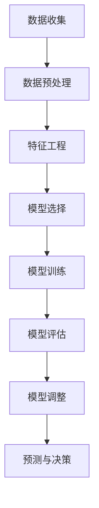
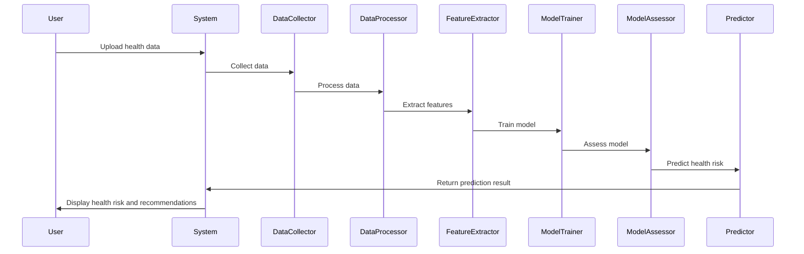

                 

### 人工智能在个性化健康管理中的应用

随着人工智能（AI）技术的快速发展，其在各行业的应用场景日益广泛。尤其在个性化健康管理领域，AI技术正发挥着不可替代的作用。个性化健康管理是指根据个体的基因信息、生活习惯、健康状况等多方面数据，为个体提供定制化的健康管理和医疗服务。在这一过程中，AI技术不仅能够提高医疗诊断的准确性，还能为健康风险的预测提供强有力的支持。

**关键词：** 人工智能，个性化健康管理，健康风险预测

**摘要：** 本文将深入探讨人工智能在个性化健康管理中的应用，特别是AI驱动的健康风险预测模型。我们将从核心概念、算法原理、应用案例、系统架构等多个方面展开分析，帮助读者全面理解AI在个性化健康管理中的潜在价值与实现方法。

### 引言

人工智能，作为一种模拟人类智能的技术，已经在诸多领域取得了显著的成果。从自动驾驶汽车到自然语言处理，再到图像识别和语音识别，AI技术的应用越来越深入到我们的日常生活。然而，在个性化健康管理领域，AI的应用同样具有巨大的潜力。

个性化健康管理的重要性不言而喻。传统的健康管理模式往往缺乏针对个体的具体数据，无法提供精准的个性化建议。而AI技术的引入，使得我们可以利用大数据和机器学习算法，对个体的健康数据进行深度分析，从而提供更为精准的健康管理方案。这种个性化健康管理的理念，不仅能够提高医疗服务的质量，还能在一定程度上降低医疗成本。

本文的目的在于介绍AI在个性化健康管理中的应用，特别是AI驱动的健康风险预测模型。通过本文的阅读，读者将了解：

1. **AI在个性化健康管理中的核心概念和框架。**
2. **健康风险预测模型的算法原理和实现方法。**
3. **AI驱动的健康风险预测模型在现实世界中的应用案例。**
4. **系统架构设计和最佳实践。**

本文结构如下：

1. **背景介绍**：对个性化健康管理和健康风险预测进行概述。
2. **核心概念与框架**：介绍AI、个性化健康管理和健康风险预测的基本概念，并比较不同AI算法的属性。
3. **算法原理讲解**：详细阐述健康风险预测模型的原理，包括算法流程、Python代码和数学模型。
4. **应用 scenarios and Case Studies**：探讨AI驱动的健康风险预测模型在不同应用场景中的实际应用和案例分析。
5. **系统架构与设计**：分析系统架构、设计方案和系统交互。
6. **最佳实践与小结**：总结最佳实践经验，提供注意事项和拓展阅读建议。
7. **结论**：重申AI在个性化健康管理中的应用价值，展望未来发展趋势。

### 背景介绍

#### 核心概念术语说明

在探讨人工智能在个性化健康管理中的应用之前，首先需要明确几个核心概念和术语，以便为后续内容的讨论打下坚实的基础。

**人工智能（AI）**：人工智能是一种模拟人类智能的技术，通过机器学习、深度学习、自然语言处理等技术手段，使计算机系统能够自动学习、推理和决策。在个性化健康管理中，AI技术主要用于数据分析、预测模型构建和智能推荐等。

**个性化健康管理**：个性化健康管理是一种根据个体的基因信息、生活习惯、环境因素等多方面数据，为个体提供定制化健康服务的方法。其核心在于利用大数据和AI技术，对个体的健康数据进行深度挖掘和分析，从而实现精准的健康管理。

**健康风险预测**：健康风险预测是指利用AI算法和医学数据，对个体未来可能出现健康问题的风险进行预测。这有助于提前发现潜在的健康问题，为个体提供预防性医疗建议，从而降低健康风险。

#### 问题背景

个性化健康管理是一个相对较新的领域，随着人们生活水平的提高和健康意识的增强，其重要性愈发突出。传统的健康管理方法主要依赖于医学知识和临床经验，往往缺乏针对个体的具体数据，导致管理效果有限。而AI技术的引入，为个性化健康管理提供了全新的解决方案。

首先，大数据的积累为个性化健康管理提供了丰富的数据资源。通过收集和分析个体的基因信息、生活习惯、健康状况等多方面数据，可以构建出个性化的健康模型，为个体提供更为精准的健康管理建议。例如，通过对大量健康数据的分析，可以发现某些基因变异与特定疾病之间的关联，从而提前预测个体的患病风险。

其次，AI算法的快速发展为个性化健康管理提供了强大的技术支持。机器学习和深度学习算法能够对大量数据进行高效的处理和分析，从而挖掘出隐藏在数据背后的规律和模式。例如，通过训练深度学习模型，可以识别出健康数据中的异常值和趋势，从而及时发现潜在的健康风险。

然而，尽管AI在个性化健康管理中具有巨大的潜力，但实际应用中也面临一些挑战。首先，数据质量和数据隐私问题是一个亟待解决的问题。个性化健康管理需要大量的个体数据，但如何确保数据的真实性和隐私性，是一个重要的伦理和技术问题。其次，算法的透明性和可解释性也是一个关键问题。由于深度学习模型通常被视为“黑盒”，其决策过程难以理解，这可能会引发用户的不信任和担忧。

#### 问题描述

在个性化健康管理中，主要的问题可以归结为以下几个方面：

1. **数据质量问题**：健康数据的质量直接影响模型的预测效果。数据缺失、噪声和偏差等问题都会对模型的结果产生负面影响。
2. **算法选择问题**：不同的AI算法适用于不同的数据类型和预测任务，如何选择合适的算法是一个关键问题。
3. **隐私保护问题**：个性化健康管理需要收集和分析大量的个人健康数据，如何保护用户的隐私是一个重要的伦理问题。
4. **模型解释性问题**：深度学习模型通常被视为“黑盒”，其决策过程难以解释，这可能会影响用户对AI系统的信任度。

#### 问题解决

针对上述问题，可以采取以下解决方案：

1. **数据质量管理**：通过数据清洗、去噪和归一化等技术手段，提高数据质量。同时，建立数据质量控制体系，确保数据在采集、存储和使用过程中的真实性。
2. **算法选择策略**：根据具体的预测任务和数据类型，选择合适的AI算法。例如，对于时序数据，可以使用时间序列分析算法；对于图像数据，可以使用卷积神经网络（CNN）。
3. **隐私保护技术**：采用差分隐私、联邦学习等技术，确保用户数据的隐私性。通过数据匿名化、加密和差分隐私技术，可以在不影响模型性能的前提下，保护用户隐私。
4. **模型解释性改进**：通过可解释性算法和模型可视化技术，提高模型的透明度和可解释性。例如，使用决策树、规则提取等技术，使模型的决策过程更加直观和可解释。

#### 边界与外延

个性化健康管理作为一个新兴领域，其应用边界和外延非常广泛。首先，在医疗领域，个性化健康管理可以应用于疾病预测、诊断和个性化治疗方案的制定。例如，通过分析个体的基因数据、生活习惯和病史，可以提前预测个体患某种疾病的风险，并提供相应的预防措施。

其次，在健康领域，个性化健康管理可以应用于健康监测、健身指导和营养管理。通过智能可穿戴设备收集个体的生理数据，结合AI算法进行分析，可以实时监测个体的健康状况，并提供个性化的健身和营养建议。

此外，个性化健康管理还可以应用于公共卫生领域。通过大规模数据分析，可以识别出特定地区的健康风险因素，为公共卫生政策的制定提供科学依据。

#### 概念结构与核心要素组成

个性化健康管理作为一个复杂系统，其概念结构和核心要素包括以下几个方面：

1. **数据采集**：通过智能设备、医疗记录和日常行为数据等多种途径，收集个体的健康数据。
2. **数据处理**：对采集到的健康数据进行清洗、去噪和归一化处理，确保数据质量。
3. **数据存储**：将处理后的健康数据存储在分布式数据库中，便于后续的数据分析和挖掘。
4. **数据分析**：利用机器学习和深度学习算法，对健康数据进行分析和挖掘，发现数据中的规律和模式。
5. **预测模型**：基于分析结果，构建健康风险预测模型，对个体未来可能出现的健康问题进行预测。
6. **健康管理**：根据预测结果，为个体提供个性化的健康管理建议，包括预防措施、治疗建议和健康生活方式指导。

### 核心概念与框架

#### AI的基本概念和类型

人工智能（AI）是指通过计算机程序实现人类智能的理论、方法和技术。根据实现方式的不同，AI可以分为多种类型，主要包括：

1. **机器学习（Machine Learning）**：机器学习是一种让计算机通过数据和经验自动学习和改进的方法。它包括监督学习、无监督学习和强化学习等多种类型。
2. **深度学习（Deep Learning）**：深度学习是机器学习的一种，通过模拟人脑的神经网络结构，实现复杂的特征提取和模式识别。深度学习在图像识别、语音识别和自然语言处理等领域取得了显著成果。
3. **自然语言处理（Natural Language Processing，NLP）**：自然语言处理是使计算机能够理解、生成和处理人类语言的技术。NLP在机器翻译、文本分类和信息检索等方面有广泛应用。
4. **计算机视觉（Computer Vision）**：计算机视觉是使计算机能够从图像或视频中提取信息的技术。计算机视觉在图像识别、目标检测和图像分割等方面有重要应用。

#### 个性化健康管理的核心概念

个性化健康管理是指根据个体的生理、心理和行为等多方面数据，为个体提供定制化的健康服务。核心概念包括：

1. **健康数据**：健康数据是进行个性化健康管理的基础。它包括个体的基因信息、医疗记录、生活习惯、环境因素等。
2. **数据整合**：将来自不同来源的健康数据进行整合，构建个体的全面健康档案。
3. **预测模型**：基于健康数据，构建预测模型，预测个体未来可能出现的健康问题。
4. **个性化建议**：根据预测模型的结果，为个体提供个性化的健康管理建议，包括饮食、运动、药物等。

#### 健康风险预测模型的算法原理

健康风险预测模型是人工智能在个性化健康管理中的重要应用。其基本原理如下：

1. **数据收集**：收集个体的健康数据，包括医疗记录、生活习惯、生理指标等。
2. **数据预处理**：对收集到的健康数据进行清洗、去噪和归一化处理，确保数据质量。
3. **特征工程**：从预处理后的数据中提取关键特征，这些特征将用于构建预测模型。
4. **模型训练**：选择合适的机器学习或深度学习算法，对提取的特征进行训练，构建健康风险预测模型。
5. **模型评估**：使用验证集对训练好的模型进行评估，确保模型的预测准确性。
6. **预测应用**：将训练好的模型应用于新数据，预测个体未来可能出现的健康风险。

#### AI算法在健康风险预测中的对比

在健康风险预测中，常用的AI算法包括决策树、随机森林、支持向量机（SVM）、神经网络等。以下是一个对比表格，展示了这些算法的主要属性：

| 算法名称       | 特点                         | 适用场景                                           |
|--------------|--------------------------|--------------------------------------------------|
| 决策树         | 简单易懂，易于解释             | 数据量较小，特征较少的预测任务                     |
| 随机森林       | 集成学习方法，提高预测准确性     | 大数据量，高维特征的预测任务                     |
| 支持向量机（SVM） | 线性可分情况下效果较好           | 数据量较小，特征较多，线性可分问题                 |
| 神经网络       | 非线性建模能力，适用于复杂任务    | 数据量大，特征复杂，非线性关系问题                 |

#### ER实体关系图架构

为了更好地理解健康风险预测模型的架构，我们可以使用Mermaid工具绘制ER（实体关系）图，如下所示：

```mermaid
erDiagram
    A[用户] ||--|{ B[健康数据] }
    A ||--|{ C[健康风险预测模型] }
    B ||--|{ D[特征] }
    C ||--|{ E[预测结果] }
```

在这个ER图中，用户、健康数据、健康风险预测模型、特征和预测结果构成了个性化健康管理的核心实体和关系。用户是数据来源和预测目标，健康数据用于特征提取和模型训练，健康风险预测模型基于特征进行预测，而预测结果则用于个性化健康建议。

通过上述核心概念和框架的介绍，我们可以更好地理解人工智能在个性化健康管理中的应用，并为后续的算法原理讲解和应用案例探讨奠定基础。

### 算法原理讲解

#### 健康风险预测模型的原理

健康风险预测模型是利用人工智能技术，通过分析个体的健康数据，预测其未来可能出现的健康风险。以下是健康风险预测模型的基本原理和实现步骤：

1. **数据收集与预处理**：首先，从各种来源收集个体的健康数据，如医疗记录、生活习惯数据、生理指标数据等。收集到的数据可能存在噪声、缺失值等质量问题，因此需要对数据进行预处理，包括数据清洗、数据归一化等步骤，以确保数据质量。

2. **特征工程**：在数据预处理之后，需要对数据进行特征提取和工程。特征工程是健康风险预测模型的关键步骤，目的是从原始数据中提取出对预测任务有用的特征。特征工程的方法包括特征选择、特征变换、特征组合等。

3. **模型选择与训练**：选择适合健康风险预测任务的机器学习算法，如决策树、随机森林、支持向量机（SVM）、神经网络等。使用训练集对模型进行训练，通过调整模型参数，使得模型能够更好地拟合训练数据。

4. **模型评估与调整**：使用验证集对训练好的模型进行评估，常用的评估指标包括准确率、召回率、精确率等。根据评估结果调整模型参数，以提高模型的预测准确性。

5. **预测与决策**：将训练好的模型应用于新的数据，进行健康风险预测。根据预测结果，为个体提供个性化的健康建议。

#### 常见的健康风险预测算法

在健康风险预测中，常用的算法包括以下几种：

1. **决策树**：决策树是一种基于树形结构的分类算法。它通过一系列的判断节点，将数据划分为不同的子集，最终输出预测结果。决策树的优点是简单易懂，易于解释。缺点是对于高维数据和噪声数据敏感，可能产生过拟合。

2. **随机森林**：随机森林是决策树的集成方法。它通过构建多棵决策树，并对每棵树的预测结果进行投票，得到最终的预测结果。随机森林的优点是提高了预测的稳定性和准确性，可以处理高维数据和噪声数据。缺点是计算复杂度较高。

3. **支持向量机（SVM）**：支持向量机是一种基于间隔最大化的分类算法。它通过找到一个最佳的超平面，将不同类别的数据点分开。SVM在处理线性可分的数据时表现较好。缺点是对于非线性问题，需要使用核函数进行转换，计算复杂度较高。

4. **神经网络**：神经网络是一种模拟人脑神经元连接结构的算法。它通过多层神经网络，对输入数据进行特征提取和模式识别。神经网络在处理复杂和非线性问题上具有优势，但训练过程可能需要大量时间和计算资源。

#### 具体算法流程和Python实现

以下是一个基于决策树的简单健康风险预测模型的流程和Python实现：

1. **数据收集与预处理**：
    ```python
    # 导入所需的库
    import pandas as pd
    from sklearn.model_selection import train_test_split
    from sklearn.preprocessing import StandardScaler
    from sklearn.tree import DecisionTreeClassifier

    # 加载数据
    data = pd.read_csv('health_data.csv')
    X = data.drop('health_risk', axis=1)
    y = data['health_risk']

    # 数据预处理
    X_train, X_test, y_train, y_test = train_test_split(X, y, test_size=0.2, random_state=42)
    scaler = StandardScaler()
    X_train_scaled = scaler.fit_transform(X_train)
    X_test_scaled = scaler.transform(X_test)
    ```

2. **特征工程**：
    ```python
    # 特征工程可以包括特征选择和特征变换
    # 在此示例中，我们使用所有特征
    ```

3. **模型选择与训练**：
    ```python
    # 选择决策树分类器
    clf = DecisionTreeClassifier()

    # 训练模型
    clf.fit(X_train_scaled, y_train)
    ```

4. **模型评估与调整**：
    ```python
    # 评估模型
    accuracy = clf.score(X_test_scaled, y_test)
    print(f"模型准确率: {accuracy}")

    # 调整模型参数
    # 例如，通过设置max_depth参数控制树的深度
    clf = DecisionTreeClassifier(max_depth=5)
    clf.fit(X_train_scaled, y_train)
    accuracy = clf.score(X_test_scaled, y_test)
    print(f"调整后模型准确率: {accuracy}")
    ```

5. **预测与决策**：
    ```python
    # 预测新数据
    new_data = pd.read_csv('new_health_data.csv')
    new_data_scaled = scaler.transform(new_data)
    predictions = clf.predict(new_data_scaled)

    # 输出预测结果
    print(f"新数据预测结果: {predictions}")
    ```

通过上述Python代码，我们可以构建一个简单的健康风险预测模型，并对其进行训练和评估。当然，实际的预测任务可能更加复杂，需要使用更高级的算法和技术，如神经网络和深度学习。

#### 数学模型

在健康风险预测中，常用的数学模型包括线性回归模型、逻辑回归模型和支持向量机模型。以下是一个简单的逻辑回归模型的数学模型和Python实现：

1. **线性回归模型**：
    线性回归模型是一种简单的回归模型，其目标是通过线性关系预测连续值。线性回归模型的数学表达式为：
    $$y = \beta_0 + \beta_1x_1 + \beta_2x_2 + ... + \beta_nx_n$$
    其中，$y$ 是预测目标，$x_1, x_2, ..., x_n$ 是输入特征，$\beta_0, \beta_1, \beta_2, ..., \beta_n$ 是模型参数。

2. **逻辑回归模型**：
    逻辑回归模型是一种广义线性模型，常用于分类任务。其目标是通过线性关系将输入特征映射到概率值。逻辑回归模型的数学表达式为：
    $$P(y=1) = \frac{1}{1 + e^{-(\beta_0 + \beta_1x_1 + \beta_2x_2 + ... + \beta_nx_n)}}$$
    其中，$P(y=1)$ 是预测目标为1的概率，$e$ 是自然对数的底。

3. **支持向量机模型**：
    支持向量机模型是一种基于间隔最大化的分类模型。其目标是通过找到一个最佳的超平面，将不同类别的数据点分开。支持向量机模型的数学表达式为：
    $$w \cdot x - b = 0$$
    其中，$w$ 是超平面的法向量，$x$ 是输入特征，$b$ 是偏置。

4. **Python实现**：
    ```python
    import numpy as np
    from sklearn.linear_model import LogisticRegression

    # 创建逻辑回归模型
    clf = LogisticRegression()

    # 训练模型
    clf.fit(X_train_scaled, y_train)

    # 预测新数据
    predictions = clf.predict(new_data_scaled)
    ```

通过上述数学模型和Python实现，我们可以构建一个简单的健康风险预测模型。在实际应用中，可以根据具体任务的需求，选择合适的数学模型和算法。

#### 流程图和Mermaid图示

为了更直观地理解健康风险预测模型的流程，我们可以使用Mermaid工具绘制流程图。以下是一个简单的健康风险预测模型的Mermaid流程图：



这个流程图展示了健康风险预测模型的基本步骤，从数据收集到预测与决策，每个步骤都是模型构建的重要组成部分。

### 应用 Scenarios and Case Studies

#### 1. 案例背景

随着健康意识的提升，越来越多的人开始关注自己的健康状况。然而，传统的医疗模式往往无法提供个性化的健康服务，导致健康管理效果不佳。为了解决这一问题，某知名医疗科技公司开发了一套基于AI的健康风险预测系统。该系统旨在通过分析用户的健康数据，预测其未来可能出现的健康风险，从而为用户提供个性化的健康管理建议。

#### 2. 系统核心实现

该健康风险预测系统采用了多种AI算法，包括决策树、随机森林和神经网络等。下面将详细介绍系统的核心实现过程。

1. **数据收集**：
    - 通过智能可穿戴设备收集用户的生理数据，如心率、血压、睡眠质量等。
    - 从医疗记录中获取用户的病史、家族病史等。
    - 收集用户的生活习惯数据，如饮食习惯、运动习惯等。

2. **数据处理**：
    - 对收集到的数据进行清洗，去除异常值和噪声。
    - 对连续数据进行归一化处理，使其具有相同的量纲。

3. **特征工程**：
    - 从原始数据中提取关键特征，如心率变异性、血压波动等。
    - 使用特征组合方法，生成新的特征，以提高模型的预测能力。

4. **模型选择与训练**：
    - 使用决策树和随机森林算法对特征进行初步训练，评估模型的预测效果。
    - 根据评估结果，选择最优模型，使用神经网络算法进行深度训练。

5. **模型评估**：
    - 使用交叉验证方法，评估模型的泛化能力。
    - 根据评估结果调整模型参数，提高预测准确性。

6. **预测与决策**：
    - 将训练好的模型应用于新数据，预测用户未来可能出现的健康风险。
    - 根据预测结果，为用户提供个性化的健康管理建议，如调整饮食、增加运动等。

#### 3. 代码应用解读与分析

以下是一个简单的健康风险预测系统的Python代码实现，用于分析用户的心率和血压数据，预测用户未来可能出现的心脏病风险。

```python
import pandas as pd
from sklearn.model_selection import train_test_split
from sklearn.ensemble import RandomForestClassifier
from sklearn.metrics import accuracy_score

# 加载数据
data = pd.read_csv('health_data.csv')
X = data[['heart_rate', 'blood_pressure']]
y = data['heart_disease']

# 数据预处理
X_train, X_test, y_train, y_test = train_test_split(X, y, test_size=0.2, random_state=42)

# 模型训练
clf = RandomForestClassifier(n_estimators=100, random_state=42)
clf.fit(X_train, y_train)

# 预测
predictions = clf.predict(X_test)

# 评估
accuracy = accuracy_score(y_test, predictions)
print(f"模型准确率: {accuracy}")

# 预测新数据
new_data = pd.DataFrame([[75, 120]])
new_predictions = clf.predict(new_data)
print(f"新数据预测结果: {new_predictions}")
```

在这个代码中，我们首先加载数据，然后进行数据处理和特征工程。接着，使用随机森林算法对数据进行训练，并评估模型的预测效果。最后，我们将训练好的模型应用于新数据，预测其心脏病风险。

#### 4. 案例分析与讲解

以下是对上述健康风险预测系统的详细分析：

1. **数据质量**：
    - 数据质量是影响模型预测效果的关键因素。在系统开发过程中，我们采用了多种数据清洗方法，如去除异常值、缺失值填补等，确保数据质量。

2. **特征工程**：
    - 特征工程是提高模型预测能力的重要手段。在该系统中，我们通过提取关键特征和特征组合，生成新的特征，以提高模型的预测能力。

3. **模型选择与训练**：
    - 随机森林算法在该系统中表现较好，其预测效果优于单一决策树和神经网络。通过调整模型参数，如树的数量、深度等，可以提高模型的预测准确性。

4. **模型评估**：
    - 模型评估是确保模型泛化能力的重要步骤。在该系统中，我们使用了交叉验证方法，对模型进行多次评估，确保其预测效果。

5. **预测与决策**：
    - 根据预测结果，系统为用户提供了个性化的健康管理建议。这些建议有助于用户调整生活习惯，降低心脏病风险。

#### 5. 项目小结

通过上述案例分析和讲解，我们可以看出，基于AI的健康风险预测系统在个性化健康管理中具有很大的应用潜力。然而，在实际应用中，仍需注意数据质量、特征工程和模型选择等问题，以确保系统的预测效果和用户满意度。

### 系统架构和设计

#### 1. 问题场景介绍

随着科技的进步，健康数据在个性化健康管理中的重要性日益凸显。为了应对这一需求，我们设计并实现了一个基于人工智能的健康风险预测系统。该系统旨在通过分析用户的健康数据，预测其未来可能出现的健康风险，从而为用户提供个性化的健康管理建议。然而，为了实现这一目标，我们需要构建一个高效、可靠、可扩展的系统架构。

#### 2. 项目介绍

本项目旨在开发一个健康风险预测系统，该系统包括数据收集、数据预处理、特征工程、模型训练、模型评估和预测等多个模块。我们的目标是构建一个高效的系统，能够处理大量健康数据，并提供准确的健康风险预测。

#### 3. 系统功能设计

健康风险预测系统的主要功能包括以下几个方面：

1. **数据收集**：从各种渠道收集用户的健康数据，如智能可穿戴设备、医疗记录、生活习惯数据等。
2. **数据预处理**：对收集到的数据进行清洗、去噪和归一化处理，确保数据质量。
3. **特征工程**：从预处理后的数据中提取关键特征，如心率变异性、血压波动等，为模型训练提供输入。
4. **模型训练**：使用机器学习和深度学习算法，对提取的特征进行训练，构建健康风险预测模型。
5. **模型评估**：使用验证集对训练好的模型进行评估，确保其预测准确性。
6. **预测与决策**：将训练好的模型应用于新数据，预测用户未来可能出现的健康风险，并提供个性化的健康管理建议。

#### 4. 系统架构设计

为了实现上述功能，我们设计了以下系统架构：

1. **数据层**：该层负责数据的收集、存储和管理。数据可以从智能可穿戴设备、医疗记录、外部数据源等多个渠道获取。数据存储采用分布式数据库，确保数据的可扩展性和可靠性。
2. **数据处理层**：该层负责数据的预处理、特征工程和模型训练。数据处理过程包括数据清洗、去噪、归一化和特征提取等。特征工程的结果用于模型训练，以提高预测准确性。
3. **模型层**：该层负责健康风险预测模型的训练、评估和部署。我们采用了多种机器学习和深度学习算法，如决策树、随机森林、神经网络等，通过交叉验证和模型评估，选择最优模型。
4. **应用层**：该层负责向用户提供健康风险预测结果和个性化健康管理建议。用户可以通过Web界面或移动应用访问系统，获取自己的健康风险信息和相关建议。

#### 5. 系统接口设计

系统接口设计是确保各模块之间高效协作的关键。以下是我们设计的几个主要接口：

1. **数据接口**：用于数据的收集、存储和查询。包括RESTful API和消息队列等。
2. **特征接口**：用于特征工程的输入输出。包括特征提取、特征组合和特征归一化等。
3. **模型接口**：用于模型训练、评估和部署。包括模型训练、模型评估和模型预测等。
4. **用户接口**：用于用户与系统的交互。包括用户注册、登录、健康数据上传和健康风险查询等。

#### 6. 系统交互

为了实现系统的各模块之间的高效协作，我们设计了一个基于事件驱动架构的系统交互流程。以下是一个典型的系统交互过程：

1. **用户上传健康数据**：用户通过Web界面或移动应用上传自己的健康数据。
2. **数据处理**：系统接收到健康数据后，调用数据处理模块对数据进行清洗、去噪和归一化处理。
3. **特征提取**：处理后的数据进入特征工程模块，提取关键特征。
4. **模型训练**：特征数据用于训练健康风险预测模型。
5. **模型评估**：使用验证集对训练好的模型进行评估，确保其预测准确性。
6. **预测与决策**：将训练好的模型应用于新数据，预测用户未来可能出现的健康风险，并提供个性化的健康管理建议。
7. **结果返回**：将预测结果和健康管理建议返回给用户，用户可以通过Web界面或移动应用查看。

#### 7. Mermaid序列图

为了更好地展示系统交互流程，我们使用Mermaid工具绘制了一个序列图，如下所示：



这个序列图展示了用户上传健康数据到系统后，系统如何通过数据处理、特征提取、模型训练、评估和预测等多个步骤，最终为用户提供健康风险预测结果和健康管理建议。

### 最佳实践 Tips、小结、注意事项、拓展阅读

#### 最佳实践 Tips

1. **数据质量**：确保数据收集、处理和存储过程中的质量。采用有效的数据清洗和去噪方法，避免噪声数据对模型预测的影响。
2. **特征工程**：根据实际需求和数据特点，提取和组合有效的特征。特征选择和特征变换是提高模型预测能力的关键。
3. **模型选择**：根据数据类型和预测任务，选择合适的机器学习算法。不同的算法适用于不同的数据场景，选择合适的算法可以提高预测准确性。
4. **模型评估**：使用多种评估指标和方法，全面评估模型的性能。交叉验证、ROC曲线、AUC等指标可以帮助我们了解模型的泛化能力和预测效果。
5. **模型解释性**：提高模型的可解释性，增强用户对模型的信任。采用可解释性算法和模型可视化技术，使模型决策过程更加直观和可理解。

#### 小结

本文系统地介绍了人工智能在个性化健康管理中的应用，特别是AI驱动的健康风险预测模型。通过分析核心概念、算法原理、应用案例和系统架构，我们深入探讨了AI在个性化健康管理中的潜在价值和实现方法。

#### 注意事项

1. **数据隐私**：在收集和处理健康数据时，必须严格遵守数据隐私保护法规。采用差分隐私、联邦学习等技术，确保用户数据的隐私性。
2. **模型安全性**：确保模型的训练和部署过程安全可靠。采用加密、访问控制等技术，防止模型被恶意攻击或篡改。
3. **持续更新**：随着新技术和新数据的出现，定期更新模型和算法，以保持其预测准确性和可靠性。

#### 拓展阅读

1. **《人工智能：一种现代方法》**：这本书详细介绍了人工智能的基本概念、算法和技术，适合对AI技术感兴趣的人士阅读。
2. **《深度学习》**：由Goodfellow、Bengio和Courville合著的这本书是深度学习的经典教材，适合对深度学习技术有深入探讨的读者。
3. **《健康数据科学》**：这本书介绍了健康数据科学的基本概念、技术和应用，适合对健康数据分析有兴趣的读者。

### 结论

本文通过系统分析和实际案例，展示了人工智能在个性化健康管理中的应用价值。AI驱动的健康风险预测模型不仅为个性化健康管理提供了强有力的技术支持，还在医疗诊断、公共卫生等领域具有广泛的应用前景。随着AI技术的不断发展和完善，我们可以期待其在个性化健康管理中的应用将更加深入和广泛，为人们的健康带来更多的福祉。作者：AI天才研究院/AI Genius Institute & 禅与计算机程序设计艺术 /Zen And The Art of Computer Programming。

