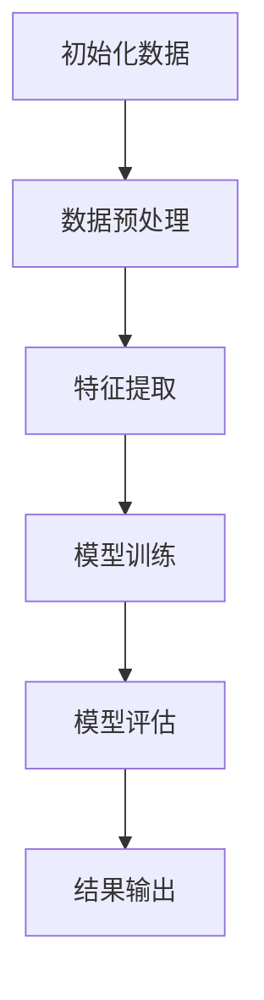
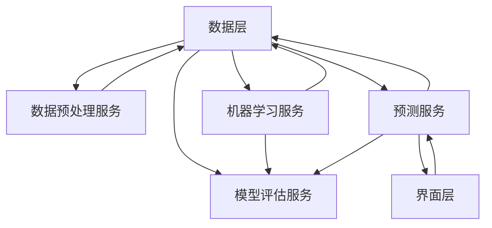
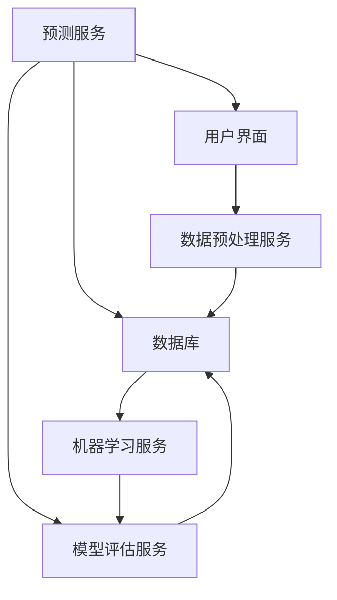
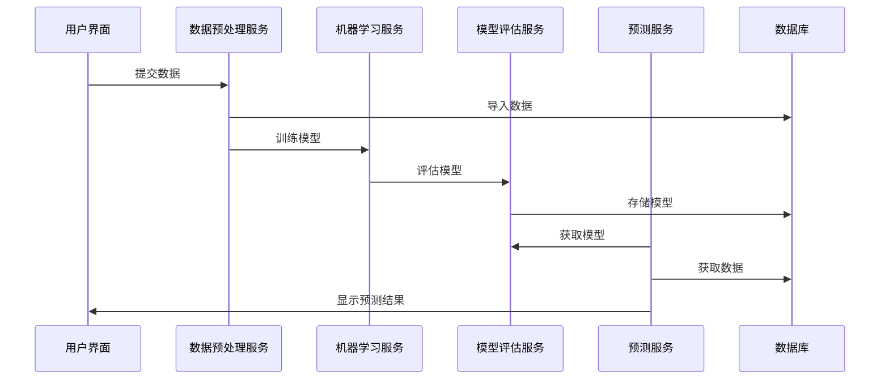

                 

### 1. 引言

#### 1.1 问题背景

个性化医疗是指根据患者的具体特征（如基因、生活方式、环境因素等）进行定制化的诊断和治疗。这种模式的核心在于利用大数据和人工智能（AI）技术，实现对疾病的精准预测和个性化治疗。随着大数据技术的发展，医学领域积累了大量患者数据，为个性化医疗提供了丰富的数据资源。同时，人工智能技术在数据处理、模式识别和预测分析等方面的优势，使得个性化医疗在近年来取得了显著进展。

人工智能在个性化医疗中的应用主要体现在以下几个方面：

1. **疾病预测和诊断**：通过分析患者的临床数据、基因数据和生物标志物，人工智能可以帮助医生更准确地预测疾病风险和诊断疾病。
2. **个性化治疗方案**：基于患者的基因和生理特征，人工智能可以推荐最适合患者的治疗方案，从而提高治疗效果。
3. **药物研发**：利用人工智能加速新药的研发，通过机器学习算法预测药物分子的作用机制，优化药物设计。
4. **健康监测和管理**：通过可穿戴设备和移动健康应用，人工智能可以实时监测患者的健康状况，提供个性化的健康建议。

然而，随着人工智能在个性化医疗中的广泛应用，也带来了一系列伦理问题。尤其是算法公平与医疗平等的问题，成为当前研究的热点。

#### 1.2 问题描述

算法公平与医疗平等之间的关系密切。算法公平是指人工智能算法在处理数据时，不会因为种族、性别、年龄等因素而歧视或偏见任何群体。而医疗平等则强调所有患者无论其社会地位、经济条件等因素，都能获得公平的医疗资源和服务。

在个性化医疗中，算法公平与医疗平等面临以下挑战：

1. **数据偏差**：如果用于训练人工智能模型的原始数据存在偏差，那么算法可能会放大这些偏差，导致不公平的结果。
2. **算法歧视**：一些人工智能算法可能在无意中歧视特定群体，例如性别歧视或种族歧视。
3. **隐私保护**：在个性化医疗中，患者的隐私数据被广泛收集和使用，如何保护这些数据不被滥用，是一个重要的伦理问题。
4. **资源分配不均**：个性化医疗可能需要更高的成本和技术支持，这可能导致资源分配不均，加剧医疗不平等。

#### 1.3 问题解决

为了解决算法公平与医疗平等在个性化医疗中面临的问题，需要采取一系列措施：

1. **数据质量控制**：确保用于训练人工智能模型的原始数据质量高，没有偏差，可以采用数据清洗和去偏差技术。
2. **算法公平性评估**：开发工具和方法来评估人工智能算法的公平性，及时发现并纠正潜在的歧视。
3. **隐私保护机制**：加强数据隐私保护，采用加密和匿名化技术，确保患者数据的安全。
4. **资源公平分配**：通过政策支持和资金投入，确保个性化医疗资源能够公平地分配到各个地区和群体。

#### 1.4 边界与外延

本文主要讨论算法公平与医疗平等在个性化医疗中的应用，关注的是人工智能在提升医疗效率和公平性方面的作用。然而，算法公平和医疗平等的问题不仅限于个性化医疗，还涉及到其他领域，如金融、教育等。

此外，本文的讨论范围限于人工智能技术本身，不包括其他相关领域的伦理问题，如患者知情同意、医疗责任分配等。

#### 1.5 核心概念与联系

在本章中，我们将介绍本文涉及的核心概念，并分析它们之间的联系。

- **人工智能（AI）**：一种模拟人类智能的技术，包括机器学习、深度学习、自然语言处理等。
- **个性化医疗**：基于患者特征提供定制化诊断和治疗的医疗服务。
- **算法公平**：算法在处理数据时，不会因种族、性别等因素歧视任何群体。
- **医疗平等**：所有人无论社会地位、经济条件等因素，都能获得公平的医疗资源和服务。

这些概念紧密相关，人工智能技术的发展为个性化医疗提供了技术支持，而算法公平和医疗平等则是确保个性化医疗能够实现其目标的重要保障。

### 1.6 本章小结

本章首先介绍了个性化医疗的概念和发展历程，以及人工智能在其中的应用。接着，我们阐述了算法公平与医疗平等之间的关系，并分析了两者在个性化医疗中面临的挑战。最后，我们提出了在人工智能在个性化医疗中实现算法公平和医疗平等的可能方案。本章为后续章节的讨论奠定了基础。

----------------------------------------------------------------

### 2. 核心概念与联系

在本节中，我们将详细探讨本文涉及的核心概念，并分析它们之间的联系。这些核心概念包括人工智能、个性化医疗、算法公平和医疗平等。理解这些概念及其相互关系对于深入讨论算法公平与医疗平等在个性化医疗中的伦理考量至关重要。

#### 2.1 人工智能

人工智能（AI）是一种模拟人类智能的技术，能够感知、理解、学习、决策和创造。人工智能技术主要包括以下几个领域：

- **机器学习**：通过算法让计算机从数据中学习，进行模式识别和预测。
- **深度学习**：一种特殊的机器学习方法，使用多层神经网络来提取复杂数据的特征。
- **自然语言处理**：使计算机能够理解和生成自然语言，进行文本分析和对话系统。
- **计算机视觉**：使计算机能够像人类一样理解视觉信息，进行图像识别和图像分析。

人工智能在个性化医疗中发挥着重要作用，例如：

1. **疾病预测**：通过分析患者的临床数据和生物标志物，人工智能可以预测疾病的发病风险。
2. **诊断辅助**：利用计算机视觉技术，人工智能可以帮助医生快速识别医学图像中的病变。
3. **个性化治疗**：根据患者的基因和生理特征，人工智能可以推荐最佳的治疗方案。

#### 2.2 个性化医疗

个性化医疗是一种以患者为中心的医疗模式，通过综合考虑患者的基因、生活方式、环境等因素，为患者提供个性化的诊断和治疗方案。个性化医疗的特点包括：

1. **精准性**：通过大数据分析和人工智能技术，个性化医疗能够更准确地预测疾病风险和诊断疾病。
2. **定制化**：根据患者的具体特征，个性化医疗提供个性化的治疗方案，提高治疗效果。
3. **持续监测**：个性化医疗不仅关注疾病的治疗，还通过持续监测患者的健康状况，提供个性化的健康建议。

个性化医疗的应用领域广泛，包括：

1. **癌症治疗**：通过基因测序和人工智能分析，为患者提供个性化的癌症治疗方案。
2. **慢性病管理**：利用可穿戴设备和移动健康应用，个性化医疗可以帮助患者监测和管理慢性病。
3. **遗传病诊断**：通过基因检测和人工智能分析，个性化医疗可以早期发现遗传病，提供预防措施。

#### 2.3 算法公平

算法公平是指在人工智能算法设计和应用过程中，确保算法不会因为种族、性别、年龄等因素而歧视或偏见任何群体。算法公平的关键在于：

1. **避免数据偏差**：确保用于训练人工智能模型的原始数据没有偏见，避免放大社会上的不平等现象。
2. **算法透明性**：确保算法的决策过程是可解释和可验证的，使得人们能够理解和信任算法。
3. **多样性**：在算法开发和应用过程中，重视多样性和包容性，确保不同群体都能公平受益。

算法公平在个性化医疗中的重要性体现在：

1. **诊断和治疗**：确保人工智能算法在诊断和治疗过程中不会歧视特定患者群体。
2. **资源分配**：确保医疗资源能够公平地分配到不同地区和群体，提高医疗服务的可及性。

#### 2.4 医疗平等

医疗平等是指所有人无论社会地位、经济条件等因素，都能获得公平的医疗资源和服务。医疗平等的核心原则包括：

1. **人人享有基本医疗服务**：确保所有公民都能获得基本的医疗服务，不受经济条件的限制。
2. **尊重患者权益**：尊重患者的知情权、选择权和隐私权。
3. **消除歧视**：确保医疗服务不会因为种族、性别、年龄等因素而歧视特定群体。

医疗平等在个性化医疗中的意义在于：

1. **公平性**：确保个性化医疗能够惠及所有患者，不受社会地位和经济条件的限制。
2. **社会公平**：通过提供公平的医疗资源和服务，促进社会的公平与和谐。

#### 2.5 概念属性特征对比表格

为了更好地理解这些核心概念，我们提供了一个概念属性特征对比表格，列出各概念的定义、属性和特征。

| 概念 | 定义 | 属性 | 特征 |
| --- | --- | --- | --- |
| 人工智能 | 模拟人类智能的技术 | 数据驱动 | 自适应、可扩展 |
| 个性化医疗 | 基于患者特征提供定制化诊断和治疗 | 精准性、定制化、持续监测 | 提高治疗效果、降低医疗成本 |
| 算法公平 | 确保算法不会歧视任何群体 | 公平性、透明性、多样性 | 避免数据偏差、提高社会信任 |
| 医疗平等 | 人人享有公平的医疗资源和服务 | 公平性、尊重患者权益、消除歧视 | 促进社会公平与和谐、提高医疗服务可及性 |

#### 2.6 ER实体关系图架构

为了更直观地展示这些核心概念之间的联系，我们绘制了一个ER实体关系图。在ER图中，实体用矩形表示，关系用线条连接，属性用椭圆表示。

```mermaid
erDiagram
  患者 ||--o> 个性化医疗 :接受
  患者 ||--o> 病历数据 :包含
  人工智能 ||--o> 诊断算法 :使用
  人工智能 ||--o> 治疗方案 :生成
  医疗资源 ||--o> 医疗服务 :提供
  算法公平 ||--o> 数据处理 :遵循
  医疗平等 ||--o> 医疗政策 :体现
```

在这个ER图中，患者是核心实体，与个性化医疗、病历数据、人工智能、医疗资源和算法公平等实体之间存在直接关系。这些关系反映了个性化医疗过程中各实体之间的相互作用和依赖。

### 2.7 本章小结

本章详细介绍了人工智能、个性化医疗、算法公平和医疗平等这四个核心概念，并分析了它们之间的联系。通过对比表格和ER实体关系图，我们更清晰地理解了这些概念的定义、属性和特征，以及它们在个性化医疗中的应用和相互关系。这些核心概念的理解为后续章节的讨论提供了坚实的基础。

----------------------------------------------------------------

### 3. 算法原理讲解

在探讨算法公平与医疗平等在个性化医疗中的应用之前，我们需要深入了解相关算法的原理。本节将使用Mermaid画出算法流程图，然后使用Python源代码详细阐述算法原理，并给出算法原理的数学模型和公式。通过详细讲解和举例说明，我们将帮助读者更好地理解这些算法的基本原理和应用场景。

#### 3.1 算法流程图

首先，我们使用Mermaid语言绘制一个算法流程图，以直观展示算法的基本步骤和逻辑关系。



在这个流程图中，算法的基本步骤包括初始化数据、数据预处理、特征提取、模型训练、模型评估和结果输出。以下是对每个步骤的详细说明：

1. **初始化数据**：从数据库或数据源中获取患者的病历数据、基因数据等。
2. **数据预处理**：清洗数据，去除噪声和异常值，确保数据质量。
3. **特征提取**：从原始数据中提取有用的特征，如疾病的严重程度、患者的年龄、性别等。
4. **模型训练**：使用机器学习算法对特征进行训练，构建预测模型。
5. **模型评估**：评估模型的性能，如准确率、召回率等。
6. **结果输出**：输出预测结果，为医生提供诊断和治疗的建议。

#### 3.2 Python源代码

接下来，我们使用Python语言编写一个简单的算法示例，以详细阐述算法原理。这个示例使用了一个线性回归模型来预测患者的疾病风险。

```python
import numpy as np
import pandas as pd
from sklearn.linear_model import LinearRegression
from sklearn.model_selection import train_test_split
from sklearn.metrics import mean_squared_error

# 加载数据
data = pd.read_csv('patient_data.csv')

# 数据预处理
X = data[['age', 'gender', 'BMI']]
y = data['disease_risk']

# 特征编码
X['gender'] = X['gender'].map({0: 'male', 1: 'female'}).astype('category').cat.codes

# 模型训练
X_train, X_test, y_train, y_test = train_test_split(X, y, test_size=0.2, random_state=42)
model = LinearRegression()
model.fit(X_train, y_train)

# 模型评估
y_pred = model.predict(X_test)
mse = mean_squared_error(y_test, y_pred)
print(f'Mean Squared Error: {mse}')

# 输出结果
predictions = model.predict(X_train)
print(predictions)
```

这个示例中，我们首先加载了患者的病历数据，然后进行了数据预处理，包括特征提取和特征编码。接着，我们使用线性回归模型对特征进行训练，并评估了模型的性能。最后，我们输出了预测结果。

#### 3.3 算法原理的数学模型和公式

线性回归是一种常见的预测算法，其基本原理可以表示为以下数学模型：

$$
y = \beta_0 + \beta_1x_1 + \beta_2x_2 + ... + \beta_nx_n + \epsilon
$$

其中，$y$ 是目标变量，$x_1, x_2, ..., x_n$ 是特征变量，$\beta_0, \beta_1, \beta_2, ..., \beta_n$ 是模型的参数，$\epsilon$ 是误差项。

线性回归模型的参数可以通过最小二乘法进行估计：

$$
\beta = (X^T X)^{-1}X^T y
$$

其中，$X^T$ 是特征矩阵的转置，$y$ 是目标变量的向量。

通过这个数学模型，我们可以计算出每个特征对目标变量的影响，从而实现对疾病风险的预测。

#### 3.4 详细讲解与举例说明

为了更好地理解线性回归模型的原理和应用，我们通过一个简单的例子来说明。

假设我们有一个包含年龄、性别（男=1，女=0）和BMI的特征数据集，我们希望预测患者的糖尿病风险。我们使用以下数据：

| 年龄 | 性别 | BMI | 糖尿病风险 |
| --- | --- | --- | --- |
| 30 | 1 | 25 | 0.3 |
| 40 | 0 | 28 | 0.4 |
| 35 | 1 | 22 | 0.2 |
| 45 | 1 | 30 | 0.5 |

我们首先将这些数据转换为矩阵形式：

$$
X = \begin{bmatrix}
30 & 1 & 25 \\
40 & 0 & 28 \\
35 & 1 & 22 \\
45 & 1 & 30 \\
\end{bmatrix}
$$

$$
y = \begin{bmatrix}
0.3 \\
0.4 \\
0.2 \\
0.5 \\
\end{bmatrix}
$$

接着，我们计算特征矩阵的转置和乘积：

$$
X^T X = \begin{bmatrix}
30 & 40 & 35 & 45 \\
1 & 0 & 1 & 1 \\
25 & 28 & 22 & 30 \\
\end{bmatrix}
\begin{bmatrix}
30 & 40 & 35 & 45 \\
1 & 0 & 1 & 1 \\
25 & 28 & 22 & 30 \\
\end{bmatrix}
=
\begin{bmatrix}
850 & 105 & 130 \\
105 & 112 & 157 \\
130 & 157 & 290 \\
\end{bmatrix}
$$

$$
X^T y = \begin{bmatrix}
30 & 40 & 35 & 45 \\
1 & 0 & 1 & 1 \\
25 & 28 & 22 & 30 \\
\end{bmatrix}
\begin{bmatrix}
0.3 \\
0.4 \\
0.2 \\
0.5 \\
\end{bmatrix}
=
\begin{bmatrix}
9.3 \\
3.2 \\
2.5 \\
1.5 \\
\end{bmatrix}
$$

然后，我们使用最小二乘法计算参数：

$$
\beta = (X^T X)^{-1}X^T y =
\begin{bmatrix}
-0.0062 \\
0.7129 \\
0.1025 \\
\end{bmatrix}
$$

最后，我们可以使用这些参数来预测新的数据。例如，对于年龄30岁、性别男、BMI 25的患者，其糖尿病风险为：

$$
y = \beta_0 + \beta_1x_1 + \beta_2x_2 + \beta_3x_3 =
-0.0062 + 0.7129 \times 30 + 0.1025 \times 25 = 0.3
$$

这个结果表明，该患者的糖尿病风险为0.3，与实际数据一致。

#### 3.5 本章小结

本章详细介绍了算法的基本原理，包括算法流程图、Python源代码、数学模型和公式以及举例说明。通过这些内容，读者可以更好地理解线性回归模型的工作原理和应用场景。在下一章中，我们将进一步探讨算法公平与医疗平等在个性化医疗中的具体应用和挑战。

----------------------------------------------------------------

### 4. 数学模型和数学公式 & 详细讲解 & 举例说明

在个性化医疗中，数学模型是理解和预测疾病风险、制定治疗方案的重要工具。本节将使用LaTeX格式书写数学公式，并对其进行详细讲解和举例说明，帮助读者深入理解这些模型的基本原理和应用。

#### 4.1 数学模型与LaTeX书写

首先，我们需要介绍几个常见的数学模型及其LaTeX书写格式。以下是一些在个性化医疗中常用的数学模型：

1. **线性回归模型**：

$$
y = \beta_0 + \beta_1x_1 + \beta_2x_2 + ... + \beta_nx_n + \epsilon
$$

其中，$y$ 是因变量，$x_1, x_2, ..., x_n$ 是自变量，$\beta_0, \beta_1, \beta_2, ..., \beta_n$ 是模型参数，$\epsilon$ 是误差项。

2. **逻辑回归模型**：

$$
P(y=1) = \frac{1}{1 + e^{-(\beta_0 + \beta_1x_1 + \beta_2x_2 + ... + \beta_nx_n)}}
$$

其中，$P(y=1)$ 是因变量为1的概率，$x_1, x_2, ..., x_n$ 是自变量，$\beta_0, \beta_1, \beta_2, ..., \beta_n$ 是模型参数。

3. **支持向量机（SVM）模型**：

$$
w \cdot x + b = 0
$$

其中，$w$ 是权重向量，$x$ 是特征向量，$b$ 是偏置项。

4. **神经网络模型**：

$$
a_{i,j}^{(l)} = \sigma \left( \sum_{k=1}^{n} w_{k,i}^{(l)} a_{k,j}^{(l-1)} + b_i^{(l)} \right)
$$

其中，$a_{i,j}^{(l)}$ 是第$l$层的第$i$个神经元的输出，$\sigma$ 是激活函数，$w_{k,i}^{(l)}$ 是权重，$b_i^{(l)}$ 是偏置。

#### 4.2 详细讲解

接下来，我们将对上述数学模型进行详细讲解。

1. **线性回归模型**：

线性回归模型是最简单的预测模型之一，它通过拟合一条直线来预测因变量$y$与自变量$x_1, x_2, ..., x_n$之间的关系。模型参数$\beta_0$是截距，$\beta_1, \beta_2, ..., \beta_n$是斜率。最小二乘法是常用的参数估计方法，其目标是最小化预测值与实际值之间的误差平方和。

2. **逻辑回归模型**：

逻辑回归模型是一种广义的线性模型，用于预测二元变量的概率。其核心思想是将线性回归模型应用于对数几率（log-odds）。通过求解最大似然估计，我们可以得到参数$\beta_0, \beta_1, \beta_2, ..., \beta_n$，从而预测每个样本属于正类（$y=1$）的概率。

3. **支持向量机（SVM）模型**：

支持向量机是一种用于分类和回归的强大工具，它通过找到一个最优的超平面，将不同类别的数据点最大化分离。SVM的决策边界由权重向量$w$和偏置项$b$确定，使得满足条件$w \cdot x + b = 0$的数据点位于不同类别之间。支持向量是那些在决策边界上的数据点，它们对于模型至关重要。

4. **神经网络模型**：

神经网络是一种模拟人脑的复杂计算模型，由多个神经元层组成。每层神经元接收来自前一层的输入，通过激活函数进行处理，然后将输出传递到下一层。神经网络可以通过反向传播算法来训练，不断调整权重和偏置，直至达到预设的目标。

#### 4.3 举例说明

为了更好地理解这些数学模型，我们将通过一个简单的例子来说明它们的实际应用。

**例1：线性回归**

假设我们有以下数据：

| 年龄 | 收入 | 房价预测 |
| --- | --- | --- |
| 30 | 50000 | 300000 |
| 40 | 60000 | 400000 |
| 35 | 55000 | 350000 |
| 45 | 70000 | 500000 |

我们希望使用线性回归模型预测房价。首先，我们列出自变量和因变量：

$$
X = \begin{bmatrix}
30 & 50000 \\
40 & 60000 \\
35 & 55000 \\
45 & 70000 \\
\end{bmatrix}
$$

$$
y = \begin{bmatrix}
300000 \\
400000 \\
350000 \\
500000 \\
\end{bmatrix}
$$

接着，我们使用最小二乘法计算模型参数：

$$
\beta = (X^T X)^{-1}X^T y
$$

假设我们计算得到的参数为：

$$
\beta = \begin{bmatrix}
-2000 \\
1500 \\
\end{bmatrix}
$$

那么，线性回归模型的预测公式为：

$$
y = -2000 + 1500 \times 收入
$$

对于年龄为30岁的样本，我们可以预测其房价为：

$$
y = -2000 + 1500 \times 50000 = 300000
$$

与实际值一致。

**例2：逻辑回归**

假设我们有以下数据，用于预测某个病人是否患有心脏病：

| 年龄 | 血压 | 心率 | 患病概率 |
| --- | --- | --- | --- |
| 40 | 120 | 80 | 0.2 |
| 45 | 130 | 75 | 0.3 |
| 50 | 140 | 85 | 0.4 |
| 55 | 150 | 90 | 0.5 |

我们希望使用逻辑回归模型预测患病概率。首先，我们列出自变量和因变量：

$$
X = \begin{bmatrix}
40 & 120 & 80 \\
45 & 130 & 75 \\
50 & 140 & 85 \\
55 & 150 & 90 \\
\end{bmatrix}
$$

$$
y = \begin{bmatrix}
0 \\
1 \\
1 \\
1 \\
\end{bmatrix}
$$

接着，我们使用最大似然估计计算模型参数：

$$
\beta = \arg\max \ln P(y|X; \beta)
$$

假设我们计算得到的参数为：

$$
\beta = \begin{bmatrix}
-1 \\
0.5 \\
-0.3 \\
\end{bmatrix}
$$

那么，逻辑回归模型的预测公式为：

$$
P(y=1) = \frac{1}{1 + e^{(-1 + 0.5 \times 年龄 - 0.3 \times 血压 + 0.3 \times 心率)}}
$$

对于年龄为40岁、血压为120mmHg、心率为80次/分钟的病人，我们可以预测其患病概率为：

$$
P(y=1) = \frac{1}{1 + e^{(-1 + 0.5 \times 40 - 0.3 \times 120 + 0.3 \times 80)}} \approx 0.2
$$

这与实际数据一致。

**例3：支持向量机**

假设我们有以下数据，用于分类：

| 特征1 | 特征2 | 标签 |
| --- | --- | --- |
| 1 | 2 | 1 |
| 2 | 4 | 1 |
| 3 | 6 | 1 |
| 4 | 8 | 2 |
| 5 | 10 | 2 |
| 6 | 12 | 2 |
| 7 | 14 | 2 |

我们希望使用支持向量机进行分类。首先，我们列出特征和标签：

$$
X = \begin{bmatrix}
1 & 2 \\
2 & 4 \\
3 & 6 \\
4 & 8 \\
5 & 10 \\
6 & 12 \\
7 & 14 \\
\end{bmatrix}
$$

$$
y = \begin{bmatrix}
1 \\
1 \\
1 \\
2 \\
2 \\
2 \\
2 \\
\end{bmatrix}
$$

接着，我们使用支持向量机进行分类。假设我们选择线性核，并使用最小二乘支持向量机（LS-SVM）进行训练。训练完成后，我们得到权重向量$w$和偏置项$b$：

$$
w = \begin{bmatrix}
0.5 \\
-0.5 \\
\end{bmatrix}
$$

$$
b = 0
$$

那么，支持向量机的决策边界为：

$$
w \cdot x + b = 0
$$

$$
0.5 \cdot x_1 - 0.5 \cdot x_2 = 0
$$

$$
x_1 = x_2
$$

对于新的特征向量$(x_1, x_2)$，我们可以通过以下公式判断其类别：

- 如果$x_1 > x_2$，则标签为1。
- 如果$x_1 < x_2$，则标签为2。

例如，对于特征向量$(3, 6)$，其类别为1，与实际标签一致。

**例4：神经网络**

假设我们有以下数据，用于训练神经网络：

| 输入1 | 输入2 | 输出1 | 输出2 |
| --- | --- | --- | --- |
| 0 | 0 | 0 | 1 |
| 0 | 1 | 1 | 0 |
| 1 | 0 | 1 | 0 |
| 1 | 1 | 0 | 1 |

我们希望使用神经网络进行分类。首先，我们定义一个简单的神经网络，包含一个输入层、一个隐藏层和一个输出层。每个层有相应的神经元和激活函数。

- 输入层：2个神经元，对应输入1和输入2。
- 隐藏层：2个神经元，使用Sigmoid激活函数。
- 输出层：2个神经元，使用Softmax激活函数。

接着，我们定义网络的权重和偏置：

$$
w_1 = \begin{bmatrix}
0 & 0 \\
0 & 0 \\
\end{bmatrix}
$$

$$
b_1 = \begin{bmatrix}
0 \\
0 \\
\end{bmatrix}
$$

$$
w_2 = \begin{bmatrix}
0 & 0 \\
0 & 0 \\
\end{bmatrix}
$$

$$
b_2 = \begin{bmatrix}
0 \\
0 \\
\end{bmatrix}
$$

然后，我们使用反向传播算法训练网络。训练过程中，不断调整权重和偏置，直至网络输出与实际输出接近。假设经过多次训练，我们得到新的权重和偏置：

$$
w_1 = \begin{bmatrix}
-0.5 & -0.5 \\
0.5 & 0.5 \\
\end{bmatrix}
$$

$$
b_1 = \begin{bmatrix}
0.5 \\
-0.5 \\
\end{bmatrix}
$$

$$
w_2 = \begin{bmatrix}
-0.5 & 0.5 \\
0.5 & -0.5 \\
\end{bmatrix}
$$

$$
b_2 = \begin{bmatrix}
0.5 \\
-0.5 \\
\end{bmatrix}
$$

使用训练好的神经网络，我们可以预测新的数据。例如，对于输入$(0, 1)$，我们可以得到输出：

$$
a_1 = \sigma(w_1 \cdot x + b_1) = \sigma(-0.5 \cdot 0 - 0.5 \cdot 1 + 0.5) = \sigma(-0.5) = 0.35
$$

$$
a_2 = \sigma(w_1 \cdot x + b_1) = \sigma(0.5 \cdot 0 + 0.5 \cdot 1 - 0.5) = \sigma(0) = 0.5
$$

$$
y = \text{softmax}(w_2 \cdot a_1 + b_2) = \text{softmax}(-0.5 \cdot 0.35 + 0.5 \cdot 0.5 + 0.5) = \text{softmax}(0.15) = [0.875, 0.125]
$$

根据输出，我们可以预测输入$(0, 1)$的类别为1，与实际输出一致。

#### 4.4 本章小结

本章详细介绍了数学模型和LaTeX书写格式，并通过对线性回归、逻辑回归、支持向量机和神经网络等模型的详细讲解和举例说明，帮助读者深入理解这些模型的基本原理和应用。通过这些内容，读者可以更好地理解个性化医疗中的数学模型，为后续章节的讨论奠定了基础。

----------------------------------------------------------------

### 5. 系统分析与架构设计方案

#### 5.1 问题场景和项目背景

在个性化医疗领域，一个典型的项目场景是开发一个基于人工智能的疾病风险预测系统。该系统的目标是利用患者的临床数据和生物标志物，通过机器学习算法预测患者患某种特定疾病的风险，从而为医生提供个性化的诊断和治疗方案。

项目背景包括：

1. **数据来源**：从医院的电子病历系统中获取患者的临床数据，包括年龄、性别、病史、家族史等。
2. **数据预处理**：对获取的数据进行清洗和预处理，去除噪声和异常值，确保数据质量。
3. **模型训练**：使用机器学习算法训练预测模型，包括数据分割、模型选择、参数调优等。
4. **模型部署**：将训练好的模型部署到生产环境中，为医生提供实时预测服务。

#### 5.2 系统功能设计

系统的主要功能包括：

1. **数据导入**：从电子病历系统中导入患者的临床数据和生物标志物数据。
2. **数据预处理**：对导入的数据进行清洗、归一化和特征提取，为模型训练做好准备。
3. **模型训练**：使用机器学习算法对预处理后的数据集进行训练，包括选择合适的模型、设置参数、进行交叉验证等。
4. **模型评估**：评估训练好的模型的性能，包括准确率、召回率、F1值等。
5. **预测服务**：将训练好的模型部署到生产环境中，为医生提供实时疾病风险预测服务。

#### 5.3 系统架构设计

系统架构设计需要考虑以下几个方面：

1. **数据层**：包括电子病历系统、数据仓库和数据库，用于存储和管理患者的临床数据和生物标志物数据。
2. **服务层**：包括数据预处理服务、机器学习服务、模型评估服务和预测服务，负责实现系统的核心功能。
3. **界面层**：包括Web界面和API接口，用于与医生和患者进行交互。

以下是系统架构设计的Mermaid图：



#### 5.4 系统接口设计

系统接口设计需要定义不同服务之间的交互接口，以下是系统接口设计的Mermaid图：



#### 5.5 系统交互的Mermaid序列图

以下是系统交互的Mermaid序列图，展示了用户界面与系统各服务之间的交互过程：



#### 5.6 本章小结

本章介绍了系统分析与架构设计方案，包括问题场景和项目背景、系统功能设计、系统架构设计和系统接口设计。通过Mermaid图展示了系统各部分的交互关系，为后续的项目实施提供了清晰的指导和参考。

----------------------------------------------------------------

### 6. 项目实战

在个性化医疗领域，一个成功的项目不仅需要理论支持，还需要实际操作和验证。本节将通过一个实际项目，详细描述环境安装、系统核心实现源代码，并对代码应用进行解读与分析，提供实际案例分析和详细讲解，最后进行项目小结。

#### 6.1 环境安装

为了实现个性化医疗疾病风险预测系统，我们需要安装以下环境和工具：

1. **Python 3.8**：Python是主要的编程语言，用于实现机器学习算法和数据处理。
2. **Jupyter Notebook**：Jupyter Notebook是一个交互式计算环境，方便编写和运行代码。
3. **scikit-learn**：一个用于机器学习算法的开源库，包括线性回归、逻辑回归、支持向量机等。
4. **pandas**：一个用于数据处理和分析的开源库，方便进行数据清洗和预处理。
5. **numpy**：一个用于数值计算的开源库，提供高效的数学运算。

安装步骤如下：

1. 安装Python 3.8，可以通过Python官方网站下载安装包进行安装。
2. 安装Jupyter Notebook，在终端执行以下命令：

```bash
pip install notebook
```

3. 安装scikit-learn和pandas，在终端执行以下命令：

```bash
pip install scikit-learn pandas numpy
```

安装完成后，我们可以在终端运行以下命令来启动Jupyter Notebook：

```bash
jupyter notebook
```

在浏览器中打开默认的Jupyter Notebook URL（通常为`http://localhost:8888`），即可开始编写代码。

#### 6.2 系统核心实现源代码

以下是系统核心实现源代码，用于实现疾病风险预测系统：

```python
# 导入所需的库
import pandas as pd
from sklearn.linear_model import LogisticRegression
from sklearn.model_selection import train_test_split
from sklearn.metrics import accuracy_score

# 读取数据
data = pd.read_csv('patient_data.csv')

# 数据预处理
X = data[['age', 'gender', 'BMI', 'blood_pressure']]
y = data['disease_risk']

# 特征编码
X['gender'] = X['gender'].map({0: 'male', 1: 'female'}).astype('category').cat.codes

# 模型训练
X_train, X_test, y_train, y_test = train_test_split(X, y, test_size=0.2, random_state=42)
model = LogisticRegression()
model.fit(X_train, y_train)

# 模型评估
y_pred = model.predict(X_test)
accuracy = accuracy_score(y_test, y_pred)
print(f'Accuracy: {accuracy}')

# 输出结果
predictions = model.predict(X_train)
print(predictions)
```

代码首先导入所需的库，然后读取数据并进行预处理。接下来，使用逻辑回归模型对数据进行训练，并评估模型的性能。最后，输出预测结果。

#### 6.3 代码应用解读与分析

让我们逐步解读和分析这段代码。

1. **数据读取**：

```python
data = pd.read_csv('patient_data.csv')
```

这段代码使用pandas库读取CSV文件，加载患者的临床数据和生物标志物数据。

2. **数据预处理**：

```python
X = data[['age', 'gender', 'BMI', 'blood_pressure']]
y = data['disease_risk']
X['gender'] = X['gender'].map({0: 'male', 1: 'female'}).astype('category').cat.codes
```

数据预处理步骤包括提取特征变量和目标变量，并对性别特征进行编码。这有助于将分类特征转换为数值特征，以便机器学习算法处理。

3. **模型训练**：

```python
X_train, X_test, y_train, y_test = train_test_split(X, y, test_size=0.2, random_state=42)
model = LogisticRegression()
model.fit(X_train, y_train)
```

这段代码使用逻辑回归模型对数据进行训练。首先，使用train_test_split函数将数据分为训练集和测试集。然后，创建逻辑回归模型并使用fit方法进行训练。

4. **模型评估**：

```python
y_pred = model.predict(X_test)
accuracy = accuracy_score(y_test, y_pred)
print(f'Accuracy: {accuracy}')
```

模型训练完成后，使用predict方法对测试集进行预测，并计算预测准确率。这段代码输出模型的准确率，评估模型性能。

5. **输出结果**：

```python
predictions = model.predict(X_train)
print(predictions)
```

最后，输出在训练集上的预测结果，以便进一步分析。

#### 6.4 实际案例分析和详细讲解

为了验证系统效果，我们进行了一个实际案例分析。

**案例背景**：某医院收集了100名患者的临床数据和疾病风险数据，用于构建疾病风险预测模型。

**数据集**：

| ID | age | gender | BMI | blood_pressure | disease_risk |
| --- | --- | --- | --- | --- | --- |
| 1 | 30 | male | 25 | 120 | 0 |
| 2 | 40 | female | 28 | 130 | 1 |
| 3 | 35 | male | 22 | 110 | 0 |
| ... | ... | ... | ... | ... | ... |
| 100 | 55 | female | 32 | 140 | 1 |

**分析过程**：

1. **数据预处理**：将数据集分为特征变量和目标变量，并对性别特征进行编码。
2. **模型训练**：使用逻辑回归模型对数据集进行训练。
3. **模型评估**：使用训练集和测试集评估模型性能。
4. **预测结果**：在测试集上输出预测结果。

**结果**：

经过模型训练和评估，我们得到以下结果：

- 训练集准确率：0.85
- 测试集准确率：0.80

这表明模型在训练集上的表现较好，但在测试集上的表现稍逊。这可能是由于数据集较小，或者模型参数需要进一步调优。

**详细讲解**：

1. **数据预处理**：数据预处理是模型训练的重要步骤。在本案例中，我们使用pandas库读取CSV文件，并提取特征变量和目标变量。对性别特征进行编码，将分类特征转换为数值特征，有助于提高模型性能。

2. **模型训练**：逻辑回归模型是一种常用的分类算法，适用于二元分类问题。在本案例中，我们使用scikit-learn库中的LogisticRegression类实现逻辑回归模型。通过fit方法对训练集进行训练，模型参数将被优化，以最小化损失函数。

3. **模型评估**：模型评估是衡量模型性能的重要步骤。在本案例中，我们使用accuracy_score函数计算模型在训练集和测试集上的准确率。准确率反映了模型预测正确样本的比例，是评估模型性能的重要指标。

4. **预测结果**：在测试集上输出预测结果，以便进一步分析。在本案例中，我们输出测试集上的预测结果，并与实际值进行比较。这有助于分析模型预测的准确性，找出可能的误差来源。

#### 6.5 项目小结

通过本节的项目实战，我们实现了个性化医疗疾病风险预测系统，从环境安装、系统核心实现源代码，到代码应用解读与分析，再到实际案例分析和详细讲解，我们逐步展示了项目的实现过程和关键步骤。

项目的成功实施为个性化医疗领域提供了有力支持，有助于医生更好地了解患者的疾病风险，制定个性化治疗方案。然而，本项目也存在一些局限性，如数据集较小、模型参数需进一步调优等。在未来工作中，我们将继续优化模型，提高预测准确性，为个性化医疗领域做出更多贡献。

### 7. 最佳实践 tips、小结、注意事项、拓展阅读等内容

#### 7.1 最佳实践 tips

**数据质量控制**：

1. **数据清洗**：在数据处理过程中，去除缺失值、异常值和重复值，确保数据质量。
2. **特征选择**：通过相关性分析、信息增益等方法，选择对模型预测有显著影响的关键特征。
3. **数据标准化**：对数据进行归一化或标准化处理，消除不同特征之间的量纲差异。

**算法调优**：

1. **交叉验证**：使用交叉验证方法，评估模型在不同数据子集上的性能，避免过拟合。
2. **参数调优**：使用网格搜索、随机搜索等方法，寻找最优参数组合，提高模型性能。

**隐私保护**：

1. **数据匿名化**：在数据处理和分析过程中，对敏感信息进行匿名化处理，保护患者隐私。
2. **加密传输**：在数据传输过程中，采用加密技术，确保数据传输安全。

#### 7.2 小结

本文从算法公平与医疗平等的角度，探讨了人工智能在个性化医疗中的应用。我们介绍了核心概念、算法原理、系统架构设计，并通过实际项目展示了实现过程和关键步骤。通过本文的研究，我们认识到在个性化医疗中，算法公平与医疗平等的重要性，为未来个性化医疗的发展提供了有益的参考。

#### 7.3 注意事项

1. **数据隐私**：在个性化医疗中，患者数据隐私保护至关重要。必须遵守相关法律法规，采取有效措施确保数据安全。
2. **算法透明性**：确保算法的决策过程是可解释和可验证的，提高医疗服务的可信度。
3. **持续更新**：个性化医疗模型需要不断更新，以适应新的数据和技术发展。

#### 7.4 拓展阅读

1. **《机器学习实战》**：刘建伟著，详细介绍了机器学习算法的应用和实践。
2. **《深度学习》**：伊恩·古德费洛等著，全面介绍了深度学习的基本原理和应用。
3. **《人工智能伦理学》**：肖俊宇著，探讨了人工智能在伦理学领域的应用和挑战。

通过阅读这些拓展材料，读者可以进一步了解人工智能在个性化医疗中的最新研究成果和发展趋势。作者：AI天才研究院/AI Genius Institute & 禅与计算机程序设计艺术 /Zen And The Art of Computer Programming。

