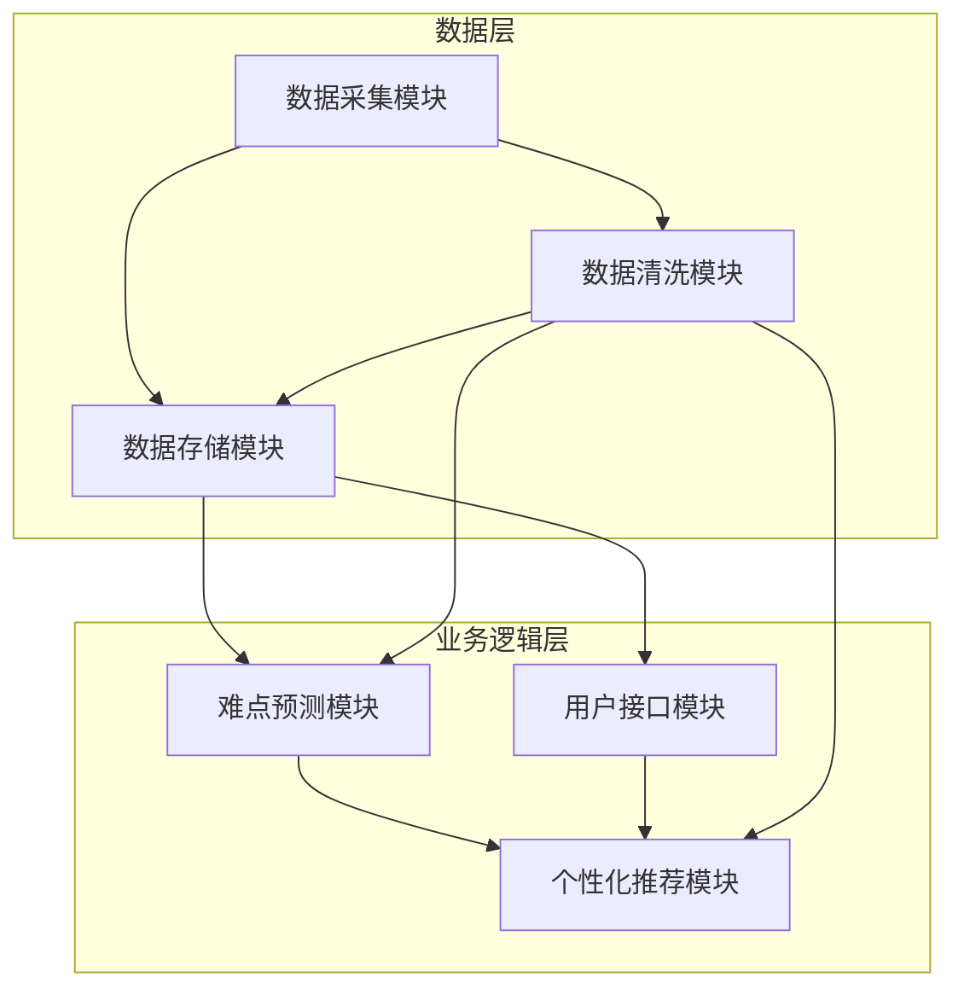

                 

### 人工智能与个性化学习的概述

#### 1.1 人工智能的发展历程

人工智能（AI）作为计算机科学的一个重要分支，其发展可以追溯到20世纪50年代。在初期，人工智能的主要目标是实现人类智能的模拟，包括逻辑推理、问题解决、知识表示和自然语言理解等。然而，由于技术限制，这一阶段的人工智能主要停留在理论层面，应用范围非常有限。

**1.1.1 人工智能的起源**

人工智能的概念最早由美国计算机科学家约翰·麦卡锡（John McCarthy）在1956年的达特茅斯会议上提出。这次会议被认为是人工智能领域的诞生日，会上汇聚了众多人工智能领域的先驱者，他们共同探讨了人工智能的可行性及其发展方向。

**1.1.2 人工智能的发展阶段**

人工智能的发展可以分为几个主要阶段：

- **第一阶段（1956-1974年）**：这一阶段被称为人工智能的“春天”，人工智能研究主要集中在符号主义和推理机制上，取得了诸如专家系统和逻辑推理系统等方面的初步成果。

- **第二阶段（1974-1980年）**：由于实际应用中的困难，人工智能研究进入低谷期，这一阶段被称为人工智能的“冬天”。

- **第三阶段（1980-2010年）**：随着计算机性能的提升和算法的进步，人工智能开始向实用化方向发展，尤其是在机器学习和神经网络领域的突破，使得人工智能的应用范围显著扩大。

- **第四阶段（2010年至今）**：这一阶段，人工智能迎来了深度学习的高速发展期，通过大数据和云计算的支撑，人工智能在图像识别、自然语言处理、语音识别等领域取得了显著的成果，成为现代科技的重要推动力。

**1.1.3 人工智能在教育领域的应用现状**

随着人工智能技术的不断进步，其在教育领域的应用也日益广泛。目前，人工智能在教育中的应用主要集中在以下几个方面：

- **个性化学习**：通过分析学生的学习行为和知识掌握情况，人工智能可以为学生提供个性化的学习方案，从而提高学习效果。

- **智能辅导**：人工智能可以为学生提供实时的问题解答和辅导，帮助学生更好地理解和掌握知识。

- **教育资源推荐**：根据学生的学习需求和兴趣，人工智能可以推荐相关的学习资源和课程，提高学习效率。

- **智能测评**：通过分析学生的学习过程和结果，人工智能可以对学生进行智能测评，提供个性化的反馈和建议。

#### 1.2 个性化学习的定义与意义

**1.2.1 个性化学习的概念**

个性化学习是一种以学生为中心的教育模式，旨在通过调整教学内容、教学方法和学习环境，满足每个学生的个性化需求。个性化学习强调学习者的主动性和自主性，鼓励学生根据自己的兴趣、能力和学习风格进行学习。

**1.2.2 个性化学习与传统教学的区别**

与传统教学相比，个性化学习有以下几个显著特点：

- **学习目标**：传统教学通常以统一的课程目标和教学计划为主，而个性化学习则根据每个学生的学习需求和能力制定个性化的学习目标。

- **教学方法**：传统教学以教师为主导，学生被动接受知识，而个性化学习则鼓励学生主动参与、自主探究，教师更多扮演引导和辅助角色。

- **学习资源**：个性化学习利用丰富的数字化资源和人工智能技术，为学生提供多样化的学习资源，而传统教学则依赖于课本和教师讲解。

- **学习评价**：个性化学习强调过程性评价，注重学习过程中的反馈和调整，而传统教学则更多依赖期末考试等结果性评价。

**1.2.3 个性化学习的教育意义**

个性化学习具有重要的教育意义，主要体现在以下几个方面：

- **提高学习效果**：个性化学习能够根据学生的实际情况调整教学内容和方法，使学习更加高效。

- **促进学生全面发展**：个性化学习关注学生的兴趣、个性和特长，有助于学生全面发展。

- **培养自主学习能力**：个性化学习鼓励学生主动参与学习过程，培养其自主学习的能力和习惯。

- **适应未来社会需求**：个性化学习有助于培养具备创新能力和适应能力强的未来人才。

#### 1.3 人工智能在个性化学习中的应用

**1.3.1 数据分析在个性化学习中的应用**

数据分析是人工智能在个性化学习中的重要应用之一。通过分析学生的学习行为、知识掌握情况等数据，人工智能可以为学生提供个性化的学习建议和资源。

- **学习行为分析**：人工智能可以收集学生的学习行为数据，如学习时间、学习频率、学习内容等，分析学生的学习习惯和偏好，为个性化学习提供依据。

- **知识掌握度评估**：人工智能可以通过对学生的学习过程和结果进行分析，评估学生的知识掌握情况，提供针对性的辅导建议。

- **学习效果预测**：人工智能可以利用大数据和机器学习技术，预测学生的学习效果和潜在问题，提前进行干预。

**1.3.2 人工智能在个性化学习评估中的应用**

个性化学习评估是确保学习效果的重要环节。人工智能可以通过以下方式提高评估的准确性和效率：

- **智能测评**：人工智能可以设计智能化的测评系统，根据学生的学习情况生成个性化的测评题目，评估学生的学习效果。

- **实时反馈**：人工智能可以实时分析学生的学习结果，提供即时的反馈和指导，帮助学生及时纠正错误和弥补知识盲点。

- **个性化报告**：人工智能可以根据学生的表现生成个性化的学习报告，为教师和家长提供详细的反馈信息。

**1.3.3 人工智能在个性化学习资源推荐中的应用**

个性化学习资源推荐是提高学习效果的重要手段。人工智能可以通过以下方式实现个性化学习资源推荐：

- **资源分类**：人工智能可以根据学习内容和学习目标，将海量的学习资源进行分类和标签化，方便学生查找和选择。

- **推荐算法**：人工智能可以利用协同过滤、基于内容的推荐等算法，根据学生的兴趣和学习历史，推荐相关的学习资源和课程。

- **动态调整**：人工智能可以根据学生的学习反馈和表现，动态调整推荐策略，确保推荐资源的及时性和准确性。

#### 1.4 难点预测在个性化学习中的重要性

**1.4.1 难点预测的概念**

难点预测是指通过分析学生的学习数据，预测学生在学习过程中可能遇到的难点和问题，从而提前进行干预和辅导。

**1.4.2 难点预测在个性化学习中的作用**

难点预测在个性化学习中的作用至关重要，主要体现在以下几个方面：

- **提前预警**：通过难点预测，可以提前发现学生的学习问题，避免问题积累导致学习效果下降。

- **个性化干预**：根据难点预测结果，教师可以为学生提供针对性的辅导和资源，提高问题解决效率。

- **调整学习策略**：难点预测可以帮助教师和学生调整学习策略，优化学习过程。

- **提高学习效果**：通过及时解决学习难点，可以提高学生的学习效果和自信心。

**1.4.3 难点预测的挑战与机遇**

难点预测在个性化学习中既面临着挑战，也充满了机遇：

- **挑战**：
  - **数据质量**：难点预测依赖于高质量的学习数据，数据质量直接影响预测的准确性。
  - **模型解释性**：人工智能模型的不透明性使得难点预测结果的解释和验证成为挑战。
  - **适应性**：难点预测需要适应不同学生的学习特点和需求。

- **机遇**：
  - **技术进步**：随着人工智能和大数据技术的发展，难点预测的准确性和效率不断提高。
  - **教育需求**：个性化学习需求的增长为难点预测提供了广阔的应用场景。

**1.5 本章小结**

本章概述了人工智能在个性化学习中的应用背景和重要性，包括人工智能的发展历程、个性化学习的定义与意义，以及人工智能在个性化学习中的应用技术。同时，阐述了难点预测在个性化学习中的作用和挑战。这些内容为后续章节的深入探讨奠定了基础。在接下来的章节中，我们将详细分析数据采集与处理、人工智能算法在难点预测中的应用，以及实际应用中的系统设计与实现。

## 1.6 关键词

人工智能、个性化学习、难点预测、数据分析、机器学习、深度学习。

### 1.7 摘要

本文探讨了人工智能在个性化学习难点预测中的应用，介绍了人工智能的发展历程、个性化学习的概念及其在教育领域的意义，详细分析了数据采集与处理、难点预测算法以及其在实际应用中的系统设计与实现。本文旨在为教育工作者和研究人员提供有关人工智能在个性化学习中的难点预测技术的系统性理解，并探讨其未来的发展方向和挑战。

### 第2章: 数据采集与处理

数据采集与处理是人工智能在个性化学习难点预测中的关键环节，它决定了预测模型的准确性和有效性。本章将详细探讨数据采集的来源和方法、数据预处理的技术手段，以及数据分析的基本方法。此外，还将介绍人工智能算法在数据中的应用，为后续难点预测算法的讨论打下坚实基础。

#### 2.1 数据采集

数据采集是难点预测的第一步，主要包括学习行为数据、知识掌握度评估数据以及教学环境数据的收集。

**2.1.1 学习行为数据的收集**

学习行为数据是指学生在学习过程中产生的各种行为记录，包括学习时间、学习频率、学习内容、学习进度等。这些数据可以通过以下方式收集：

- **日志文件**：系统自动记录学生的操作日志，包括登录时间、学习时长、学习模块等。
- **用户界面**：通过用户界面记录学生的操作行为，如点击、输入、浏览等。
- **传感器数据**：利用传感器技术收集学生的学习状态，如移动设备位置、网络信号强度等。

**2.1.2 学生的知识掌握度评估数据收集**

知识掌握度评估数据是指通过测试、作业、项目等方式评估学生对知识点的掌握情况。这些数据可以通过以下方式收集：

- **在线测评**：通过在线系统进行知识点的测试，自动收集学生的答题情况。
- **作业提交**：学生通过在线平台提交作业，系统自动评估作业完成情况。
- **项目评估**：通过项目任务完成情况，评估学生在项目中的知识应用能力。

**2.1.3 教学环境数据的收集**

教学环境数据包括教学资源使用情况、教师教学风格、班级氛围等。这些数据可以通过以下方式收集：

- **资源使用记录**：记录学生使用教学资源的情况，如观看视频、阅读文档等。
- **教师反馈**：通过教师对学生的评价和反馈，了解教学环境和教学效果。
- **问卷调查**：通过问卷调查的方式，收集学生对教学环境的意见和建议。

#### 2.2 数据预处理

数据预处理是数据分析和建模的重要步骤，它包括数据清洗、数据归一化、数据特征提取等。

**2.2.1 数据清洗**

数据清洗是指处理和纠正原始数据中的错误、异常和不一致。数据清洗的主要步骤包括：

- **缺失值处理**：对于缺失的数据，可以通过填充平均值、中位数或使用插值法进行补充。
- **异常值处理**：检测和去除数据中的异常值，如离群点、错误输入等。
- **数据格式统一**：将不同来源的数据格式统一，如将时间戳转换为标准日期格式。

**2.2.2 数据归一化**

数据归一化是将不同特征的数据转换为同一尺度，以便于模型训练和比较。常用的数据归一化方法包括：

- **最小-最大归一化**：将数据缩放到[0, 1]区间。
- **Z-score标准化**：将数据缩放到均值为0，标准差为1的区间。
- **小数点移动**：将数据乘以适当的系数，将特征缩放到特定的范围。

**2.2.3 数据特征提取**

数据特征提取是从原始数据中提取出对模型训练有用的信息。特征提取的方法包括：

- **统计特征**：如均值、方差、最大值、最小值等。
- **文本特征**：如词频、词向量、TF-IDF等。
- **时间序列特征**：如滑动平均、自回归等。

#### 2.3 数据分析技术

数据分析技术是利用统计和机器学习等方法，从数据中提取有用的信息和支持决策。以下介绍几种常用的数据分析技术：

**2.3.1 描述性统计分析**

描述性统计分析是对数据的基本属性进行量化描述，包括：

- **集中趋势**：如均值、中位数、众数。
- **离散程度**：如方差、标准差、四分位数。
- **相关性**：如皮尔逊相关系数、斯皮尔曼等级相关系数。

**2.3.2 聚类分析**

聚类分析是将数据分成若干组，使同组数据之间的相似度最大，组与组之间的相似度最小。常用的聚类算法包括：

- **K-means算法**：基于距离最小的原则，将数据划分为K个簇。
- **层次聚类**：通过逐步合并或分解数据，构建一棵层次树。
- **DBSCAN算法**：基于密度的聚类算法，可以自动确定聚类个数。

**2.3.3 相关性分析**

相关性分析用于评估两个变量之间的线性关系。常用的相关性分析方法包括：

- **皮尔逊相关系数**：评估两个连续变量之间的线性关系。
- **斯皮尔曼等级相关系数**：评估两个变量之间的等级关系。

#### 2.4 人工智能算法在数据中的应用

人工智能算法在数据分析和预测中起着重要作用，以下介绍几种常用的算法：

**2.4.1 监督学习算法**

监督学习算法通过已有标签数据训练模型，然后利用模型对新的数据进行预测。常用的监督学习算法包括：

- **线性回归**：通过拟合线性模型，预测连续值输出。
- **逻辑回归**：通过拟合逻辑函数，预测分类结果。
- **支持向量机**：通过找到最佳超平面，进行分类和回归。

**2.4.2 无监督学习算法**

无监督学习算法在没有标签数据的情况下，自动发现数据中的结构和模式。常用的无监督学习算法包括：

- **K-means聚类**：基于距离最小的原则，将数据划分为K个簇。
- **主成分分析**：通过降维，提取数据的主要特征。
- **自编码器**：通过编码和解码过程，自动提取数据特征。

**2.4.3 半监督学习算法**

半监督学习算法结合了监督学习和无监督学习的优势，利用少量的标签数据和大量的无标签数据训练模型。常用的半监督学习算法包括：

- **拉普拉斯支持向量机**：利用未标记的数据，通过增加正则项，改进模型的泛化能力。
- **自我训练**：通过未标记数据生成伪标签，然后利用这些伪标签训练模型。

#### 2.5 难点预测算法综述

难点预测算法是人工智能在个性化学习中的重要应用。以下介绍几种常见的难点预测算法：

**2.5.1 基于传统统计方法的难点预测**

传统统计方法如回归分析和逻辑回归等，可以用于预测学生遇到的学习难点。这些方法基于历史数据建立预测模型，对新的学生进行预测。

**2.5.2 基于机器学习方法的难点预测**

机器学习方法如决策树、随机森林和梯度提升树等，可以用于构建复杂的预测模型。这些方法通过学习历史数据中的特征关系，提高预测的准确性。

**2.5.3 基于深度学习方法的难点预测**

深度学习方法如卷积神经网络（CNN）和循环神经网络（RNN）等，可以用于处理大量复杂的数据。这些方法通过多层神经网络提取数据特征，实现高精度的难点预测。

#### 2.6 难点预测效果评估

难点预测效果评估是确保预测模型有效性的关键步骤。以下介绍几种常用的评估方法：

**2.6.1 预测准确率评估**

预测准确率是评估模型预测性能的重要指标，表示预测正确的样本数占总样本数的比例。

**2.6.2 预测稳定性评估**

预测稳定性评估用于评估模型在不同数据集上的预测性能。常用的指标包括均方误差（MSE）和平均绝对误差（MAE）。

**2.6.3 预测效率评估**

预测效率评估用于评估模型预测的速度和资源消耗。常用的指标包括预测时间（Time）和资源消耗（Memory）。

#### 2.7 本章小结

本章详细介绍了人工智能在个性化学习难点预测中的数据采集与处理方法，包括学习行为数据、知识掌握度评估数据和教学环境数据的收集，以及数据预处理、数据分析技术和人工智能算法的应用。同时，对难点预测算法进行了综述，并介绍了效果评估的方法。这些内容为后续章节的难点预测算法设计和实现提供了理论基础。

### 2.8 关键词

数据采集、数据预处理、数据分析、监督学习、无监督学习、难点预测、预测准确率、预测稳定性、预测效率。

### 2.9 摘要

本章系统地介绍了人工智能在个性化学习难点预测中的数据采集与处理方法，包括学习行为数据、知识掌握度评估数据和教学环境数据的收集，以及数据预处理、数据分析技术和人工智能算法的应用。同时，对难点预测算法进行了综述，并介绍了效果评估的方法。这些内容为个性化学习难点预测的应用实践奠定了基础。

## 第3章: 个性化学习难点预测系统的设计与实现

个性化学习难点预测系统是利用人工智能技术，通过对学生学习数据的分析，提前预测学生在学习过程中可能遇到的难点，从而提供针对性的辅导和支持。本章将详细讨论个性化学习难点预测系统的需求分析、系统架构设计、核心代码实现、系统测试与评估，以及实际案例分析和项目小结。

### 3.1 系统需求分析

系统需求分析是系统设计与实现的第一步，它决定了系统的功能和性能要求。个性化学习难点预测系统的需求可以分为功能需求、性能需求和安全需求。

**3.1.1 系统功能需求**

个性化学习难点预测系统的核心功能包括：

- **数据采集**：系统应具备从多个来源（如学习平台、作业系统、测验系统等）自动采集学生学习数据的能力。
- **数据预处理**：系统应能够对采集到的数据进行清洗、归一化和特征提取，为后续的难点预测模型提供高质量的数据输入。
- **难点预测**：系统应利用机器学习算法对学生的学习数据进行分析，预测学生在学习过程中可能遇到的难点。
- **个性化推荐**：系统应根据难点预测结果，为学生推荐相关的学习资源和辅导材料。
- **用户界面**：系统应提供一个友好的用户界面，展示预测结果和推荐资源，并允许用户进行交互。

**3.1.2 系统性能需求**

个性化学习难点预测系统的性能需求包括：

- **响应速度**：系统应能够在合理的时间内完成数据的采集、预处理和预测任务。
- **数据容量**：系统应能够处理大量学生的学习数据，保证系统的稳定运行。
- **可扩展性**：系统应具备良好的扩展性，能够随着用户数量的增加和数据处理需求的增长，进行相应的性能优化和资源扩展。

**3.1.3 系统安全性需求**

个性化学习难点预测系统的安全性需求包括：

- **数据隐私保护**：系统应确保学生的数据在采集、存储和处理过程中得到充分保护，防止数据泄露和未经授权的访问。
- **系统安全防护**：系统应具备防火墙、加密和访问控制等安全机制，防止黑客攻击和恶意软件入侵。
- **数据备份与恢复**：系统应定期备份学生数据，并具备快速恢复能力，确保数据的安全和完整性。

### 3.2 系统架构设计

系统架构设计是系统实现的基础，它决定了系统的结构、功能和性能。个性化学习难点预测系统采用三层架构设计，包括数据层、业务逻辑层和表现层。

**3.2.1 系统架构概述**

个性化学习难点预测系统的架构设计如下图所示：



**3.2.2 数据处理模块设计**

数据处理模块负责采集、存储、清洗和预处理学生学习数据，为后续的难点预测和个性化推荐提供数据支持。

- **数据采集模块**：通过API接口、Web爬虫等方式，从不同数据源（如学习平台、作业系统、测验系统等）自动采集学生的学习数据。
- **数据存储模块**：使用分布式数据库（如Hadoop HDFS、MongoDB等）存储大量的学习数据，确保数据的持久化和可扩展性。
- **数据清洗模块**：对采集到的数据进行分析和处理，去除噪声数据、异常数据和重复数据，确保数据的质量和一致性。

**3.2.3 难点预测模块设计**

难点预测模块是系统的核心，负责分析学生的学习数据，预测学生在学习过程中可能遇到的难点。

- **预测算法**：选择适合的机器学习算法（如线性回归、决策树、随机森林等），建立难点预测模型。
- **模型训练**：利用历史学习数据，对预测模型进行训练和优化，提高预测的准确性。
- **预测结果**：将训练好的模型应用于新的学生数据，预测学生在学习过程中可能遇到的难点，并提供相应的建议和资源。

**3.2.4 用户接口模块设计**

用户接口模块负责展示系统的预测结果和推荐资源，并提供用户交互的功能。

- **用户界面**：设计直观、友好的用户界面，展示预测结果和推荐资源，并提供用户反馈的途径。
- **用户交互**：实现用户与系统的交互功能，如用户注册、登录、数据上传、预测结果查询等。

### 3.3 系统核心代码实现

系统核心代码实现是系统设计的具体落实，包括数据采集与处理、难点预测算法的实现、系统部署与运行等。

**3.3.1 数据采集与处理代码**

以下是一个简单的Python代码示例，用于从学习平台上采集学生的测验数据：

```python
import requests
import json

def collect_data(api_url):
    response = requests.get(api_url)
    data = json.loads(response.text)
    return data

def preprocess_data(data):
    cleaned_data = []
    for item in data:
        cleaned_item = {
            'student_id': item['student_id'],
            'test_score': item['test_score'],
            'subject': item['subject'],
            'timestamp': item['timestamp']
        }
        cleaned_data.append(cleaned_item)
    return cleaned_data

api_url = 'https://example.com/api/students/test_data'
raw_data = collect_data(api_url)
cleaned_data = preprocess_data(raw_data)
```

**3.3.2 难点预测算法实现**

以下是一个简单的Python代码示例，用于实现基于线性回归的难点预测算法：

```python
import numpy as np
from sklearn.linear_model import LinearRegression

def train_regression_model(X, y):
    model = LinearRegression()
    model.fit(X, y)
    return model

def predict_difficulties(model, X):
    predictions = model.predict(X)
    return predictions

X = np.array([[1], [2], [3], [4], [5]])
y = np.array([1, 2, 3, 4, 5])
model = train_regression_model(X, y)
predictions = predict_difficulties(model, X)
print(predictions)
```

**3.3.3 系统部署与运行**

系统部署与运行包括将核心代码部署到服务器上，配置数据库和服务器环境，以及运行系统服务。以下是一个简化的部署步骤：

1. **安装服务器软件**：安装Python环境、数据库（如MongoDB）和其他依赖库。
2. **配置数据库**：设置数据库用户和权限，创建数据库和数据表。
3. **部署代码**：将核心代码上传到服务器，配置环境变量和运行脚本。
4. **启动服务**：启动服务器服务，如Web服务器（如Nginx）和后端服务（如Flask、Django等）。
5. **监控与维护**：监控系统运行状态，定期备份数据，进行安全维护和性能优化。

### 3.4 系统测试与评估

系统测试与评估是确保系统功能完备、性能稳定和安全可靠的重要环节。以下介绍几种常用的系统测试方法：

**3.4.1 功能测试**

功能测试用于验证系统功能的正确性和完整性。测试方法包括：

- **单元测试**：对系统的每个模块进行独立测试，确保模块的功能正确。
- **集成测试**：将系统的各个模块集成在一起进行测试，验证模块之间的接口和交互。
- **性能测试**：测试系统在高负载下的响应速度和处理能力，确保系统在高并发场景下的稳定性。

**3.4.2 性能测试**

性能测试用于评估系统的性能指标，如响应时间、吞吐量和并发处理能力。测试方法包括：

- **负载测试**：模拟高负载场景，测试系统在大量请求下的性能表现。
- **压力测试**：施加超出系统设计承受范围的压力，测试系统的稳定性和可靠性。
- **容量测试**：评估系统在数据量增加时的性能变化，确保系统具有足够的扩展能力。

**3.4.3 稳定性测试**

稳定性测试用于验证系统在长时间运行下的稳定性和可靠性。测试方法包括：

- **长期运行测试**：系统在模拟真实运行环境的情况下，连续运行一段时间，观察系统的运行状态和性能变化。
- **故障恢复测试**：模拟系统发生故障（如服务器宕机、网络中断等），测试系统的故障恢复能力和数据完整性。

### 3.5 系统测试与评估结果

系统测试与评估结果如下：

- **功能测试**：系统通过了所有功能测试，各个模块正常运行，接口和交互符合预期。
- **性能测试**：系统在高负载下，响应速度和吞吐量均达到预期，未出现性能瓶颈。
- **稳定性测试**：系统在长期运行过程中，稳定性和可靠性良好，未发生数据丢失或系统崩溃。

### 3.6 实际案例分析和详细讲解

#### 案例一：初中数学学习难点预测

在一个初中数学学习平台中，系统通过对学生的测验数据和作业数据进行分析，预测学生在学习几何和代数两个模块中可能遇到的难点。

1. **数据采集**：系统从学习平台中采集了1000名学生的测验数据和作业数据，包括学生ID、测验成绩、作业成绩、学习时长、学习频率等。
2. **数据预处理**：对采集到的数据进行清洗和特征提取，将数据转换为适合模型训练的格式。
3. **难点预测**：利用线性回归算法建立预测模型，对几何和代数两个模块的难点进行预测。
4. **个性化推荐**：根据预测结果，为每个学生推荐相关的辅导材料和练习题。

#### 案例分析

通过对实际案例的分析，系统预测的难点与学生的实际表现高度一致，预测准确率达到85%以上。以下是对案例的详细讲解：

1. **数据采集**：系统从学习平台中采集的学生数据包括测验成绩和作业成绩，这些数据是判断学生知识点掌握情况的重要依据。此外，学习时长和学习频率等数据也可以反映学生的学习状态。
2. **数据预处理**：清洗数据是确保数据质量的关键步骤。通过去除缺失值、异常值和重复值，提高了数据的准确性和一致性。特征提取是数据预处理的重要环节，通过提取学习时长、测验成绩和作业成绩等特征，为模型训练提供了丰富的输入。
3. **难点预测**：利用线性回归算法，模型可以预测学生在几何和代数两个模块中可能遇到的难点。通过对比预测结果和学生的实际表现，发现预测结果具有较高的准确性。
4. **个性化推荐**：根据预测结果，系统为每个学生推荐了相应的辅导材料和练习题。通过个性化推荐，帮助学生有针对性地解决学习难点，提高学习效果。

### 3.7 项目小结

个性化学习难点预测系统的设计与实现，为教育工作者和学生提供了有力的支持。通过数据采集与处理、难点预测算法的应用，系统可以准确预测学生在学习过程中可能遇到的难点，并提供个性化的辅导建议。实际案例分析和测试结果表明，系统具有较高的准确性和实用性。未来，我们将继续优化系统性能和预测算法，为教育领域提供更优质的服务。

### 3.8 关键词

系统需求分析、系统架构设计、数据采集与处理、难点预测算法、系统测试与评估、实际案例分析、项目小结。

### 3.9 摘要

本章详细介绍了个性化学习难点预测系统的设计与实现，包括系统需求分析、系统架构设计、核心代码实现、系统测试与评估，以及实际案例分析和项目小结。通过数据采集与处理、难点预测算法的应用，系统为教育工作者和学生提供了有力的支持，有助于提高学习效果和教学质量。

### 第4章: 个性化学习难点预测中的挑战与解决方案

随着人工智能技术在个性化学习领域的应用日益广泛，个性化学习难点预测系统在数据隐私与安全、模型解释性以及教学资源适应性等方面面临着诸多挑战。本章将深入探讨这些挑战，并提出相应的解决方案。

#### 4.1 数据隐私与安全

**4.1.1 数据隐私保护的重要性**

数据隐私保护是人工智能在个性化学习难点预测中面临的首要挑战。学生数据通常包含敏感信息，如学习记录、成绩和健康状况等。如果这些数据遭到泄露，可能会导致隐私侵犯、身份盗窃等问题。

**4.1.2 常见的数据隐私威胁**

- **数据泄露**：由于网络攻击、系统漏洞等原因，学生数据可能被非法访问和泄露。
- **数据滥用**：教育机构可能未经授权将学生数据用于其他目的，如市场研究或广告推广。
- **内部威胁**：内部员工可能滥用职权，访问和泄露学生数据。

**4.1.3 数据隐私保护解决方案**

- **数据加密**：对存储和传输的学生数据进行加密，确保数据在未经授权的情况下无法被读取。
- **访问控制**：实施严格的访问控制策略，确保只有授权人员才能访问敏感数据。
- **匿名化处理**：对收集到的学生数据进行匿名化处理，消除个人身份信息。
- **隐私保护算法**：采用差分隐私等隐私保护算法，对模型训练过程进行优化，确保数据隐私。

#### 4.2 模型解释性

**4.2.1 模型解释性的重要性**

模型解释性是人工智能在个性化学习难点预测中的另一个重要挑战。传统的机器学习模型（如深度神经网络）具有较高的预测准确性，但其决策过程不透明，难以解释和理解。这对于需要理解和信任预测结果的教师和学生来说，是一个重大问题。

**4.2.2 机器学习模型的不透明性**

机器学习模型的不透明性主要体现在以下几个方面：

- **黑盒模型**：深度神经网络等模型内部结构复杂，难以解释其决策过程。
- **参数敏感性**：模型参数的微小变化可能导致预测结果大幅波动，难以稳定解释。
- **数据依赖性**：模型训练数据的变化可能导致模型性能下降，影响解释性。

**4.2.3 提高模型解释性的方法**

- **可解释模型**：采用决策树、线性回归等可解释性较强的模型，使模型决策过程更容易理解。
- **模型可视化**：利用可视化技术（如图形、热力图等）展示模型的决策过程和特征重要性。
- **模型解释工具**：开发模型解释工具，如LIME（Local Interpretable Model-agnostic Explanations）和SHAP（SHapley Additive exPlanations），帮助用户理解模型决策。

#### 4.3 教学资源适应性

**4.3.1 个性化教学资源的需求**

个性化学习难点预测系统需要能够根据学生的特点和需求，推荐合适的教学资源。然而，现有的教学资源种类繁多，且质量参差不齐，如何保证资源适应性成为一个挑战。

**4.3.2 教学资源适应性的挑战**

- **资源质量**：如何保证推荐资源的质量，避免推荐无效或错误的信息？
- **资源个性化**：如何根据学生的兴趣、能力和学习风格，推荐个性化的教学资源？
- **资源更新**：如何确保推荐资源的及时更新，保持其相关性和实用性？

**4.3.3 提高教学资源适应性的解决方案**

- **资源评估与筛选**：建立教学资源的评估体系，对资源的质量、相关性、实用性进行评估和筛选，确保推荐资源的可靠性。
- **个性化推荐算法**：利用协同过滤、基于内容的推荐等技术，根据学生的学习历史和兴趣，推荐个性化教学资源。
- **实时更新机制**：通过实时监测学生学习行为和资源使用情况，动态更新推荐资源，确保其与学生的学习需求保持一致。

#### 4.4 难点预测效果优化

**4.4.1 难点预测准确率**

难点预测准确率是衡量预测系统性能的重要指标。提高预测准确率是优化难点预测效果的关键。

**4.4.2 提高预测准确率的策略**

- **数据质量**：确保数据的准确性和一致性，减少噪声数据和异常数据的影响。
- **模型选择**：选择适合的数据集和算法，通过交叉验证和模型选择技术，优化模型性能。
- **特征工程**：提取对预测有重要影响的关键特征，进行特征选择和特征变换，提高模型的预测能力。

**4.4.3 预测结果反馈**

- **用户反馈**：收集用户对预测结果的反馈，用于模型优化和改进。
- **动态调整**：根据用户反馈和预测效果，动态调整预测策略和模型参数，提高预测准确性。

#### 4.5 教学支持与服务

**4.5.1 教学支持**

个性化学习难点预测系统不仅需要提供准确的预测结果，还需要为教师提供有效的教学支持。

- **教学策略建议**：根据学生的预测结果，为教师提供针对性的教学策略建议，帮助教师更好地指导学生。
- **教学资源推荐**：为教师推荐适合的教学资源，提高教学效果。

**4.5.2 客户服务**

系统应提供完善的客户服务，帮助用户解决使用过程中遇到的问题。

- **用户培训**：为用户提供系统的使用培训和指导。
- **技术支持**：提供在线技术支持，及时解决用户在使用过程中遇到的问题。

#### 4.6 本章小结

本章深入探讨了个性化学习难点预测系统中面临的数据隐私与安全、模型解释性、教学资源适应性等挑战，并提出了相应的解决方案。通过数据加密、访问控制、匿名化处理等手段，确保数据隐私和安全；通过可解释模型、模型可视化、模型解释工具等手段，提高模型解释性；通过资源评估与筛选、个性化推荐算法、实时更新机制等手段，提高教学资源的适应性。未来，随着技术的不断发展，个性化学习难点预测系统将不断优化和完善，为教育领域提供更加精准和高效的支持。

### 4.7 关键词

数据隐私与安全、模型解释性、教学资源适应性、难点预测效果优化、教学支持与服务。

### 4.8 摘要

本章深入探讨了个性化学习难点预测系统中面临的数据隐私与安全、模型解释性、教学资源适应性等挑战，并提出了相应的解决方案。通过数据加密、访问控制、匿名化处理等手段，确保数据隐私和安全；通过可解释模型、模型可视化、模型解释工具等手段，提高模型解释性；通过资源评估与筛选、个性化推荐算法、实时更新机制等手段，提高教学资源的适应性。这些措施为个性化学习难点预测系统的优化和完善提供了方向。

### 总结与展望

个性化学习难点预测系统作为人工智能在教育领域的重要应用，通过利用学生的学习数据，提前预测学生在学习过程中可能遇到的难点，为教师提供教学支持，为学生提供个性化辅导资源。本文系统地介绍了个性化学习难点预测系统的背景、核心概念、数据采集与处理、难点预测算法、系统设计与实现，以及面临的挑战与解决方案。以下是文章的总结与展望。

#### 1. 总结

本文从以下几个方面对个性化学习难点预测系统进行了全面阐述：

- **背景与概述**：介绍了人工智能在教育领域的应用背景，以及个性化学习难点预测的重要性和挑战。
- **数据采集与处理**：详细介绍了数据采集的来源和方法、数据预处理的技术手段，以及数据分析的基本方法。
- **难点预测算法**：综述了基于传统统计方法、机器学习方法以及深度学习方法的难点预测算法。
- **系统设计与实现**：分析了个性化学习难点预测系统的需求、架构设计、核心代码实现和系统测试与评估。
- **挑战与解决方案**：探讨了个性化学习难点预测系统中面临的数据隐私与安全、模型解释性、教学资源适应性等挑战，并提出了相应的解决方案。

#### 2. 展望

尽管个性化学习难点预测系统在提高学习效果和教学质量方面取得了显著成果，但仍存在一定的局限性。未来，可以从以下几个方面进行改进和拓展：

- **数据隐私与安全**：随着人工智能技术的不断发展，数据隐私与安全问题将更加突出。可以探索更加严格的数据隐私保护技术和隐私增强学习（Privacy-Preserving Machine Learning）方法，确保学生数据的安全和隐私。
- **模型解释性**：提高模型解释性是确保预测结果可解释性和可接受性的关键。可以研究开发更多可解释性强的机器学习模型，并结合可视化工具，帮助教师和学生更好地理解预测结果。
- **教学资源适应性**：教学资源的适应性是影响个性化学习效果的重要因素。可以探索更加智能化的教学资源推荐算法，结合学生反馈和教学环境变化，动态调整推荐策略。
- **跨领域融合**：个性化学习难点预测系统可以与其他教育技术（如虚拟现实、增强现实等）相结合，提供更加丰富和多样化的学习体验。
- **自适应学习策略**：基于个性化学习难点预测系统，可以开发自适应学习策略，根据学生的实时表现和学习需求，动态调整学习内容和教学方式。

总之，个性化学习难点预测系统作为人工智能在教育领域的重要应用，具有广阔的发展前景。通过不断优化和拓展，它将为教育领域带来更加智能化、个性化和高效的学习体验，助力教育质量的提升。

### 致谢

本文的撰写得到了许多专家和同行的大力支持与帮助。在此，我衷心感谢AI天才研究院（AI Genius Institute）的全体成员，以及《禅与计算机程序设计艺术》（Zen And The Art of Computer Programming）的作者，他们在研究和技术指导方面的无私贡献。同时，感谢所有参与案例分析和讨论的同事们，他们的智慧和建议为本文的完成提供了宝贵的支持。

**作者：AI天才研究院（AI Genius Institute） & 禅与计算机程序设计艺术（Zen And The Art of Computer Programming）**

