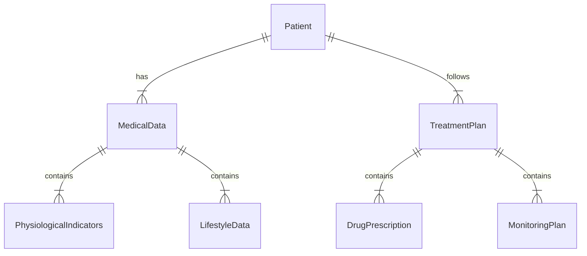
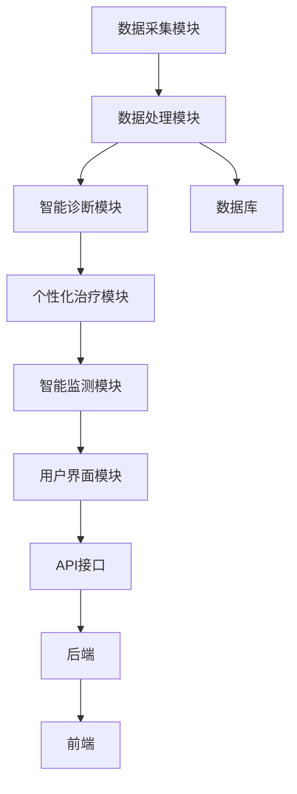
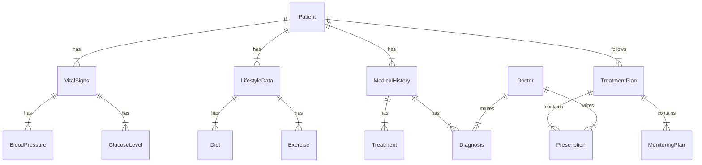
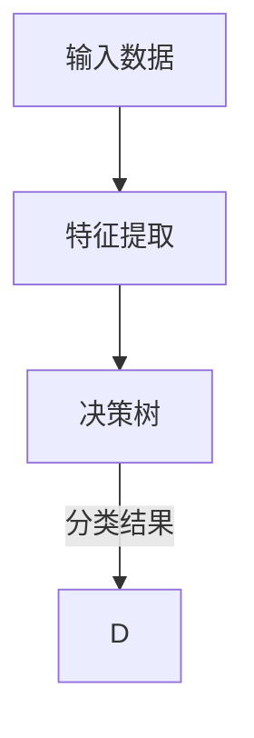
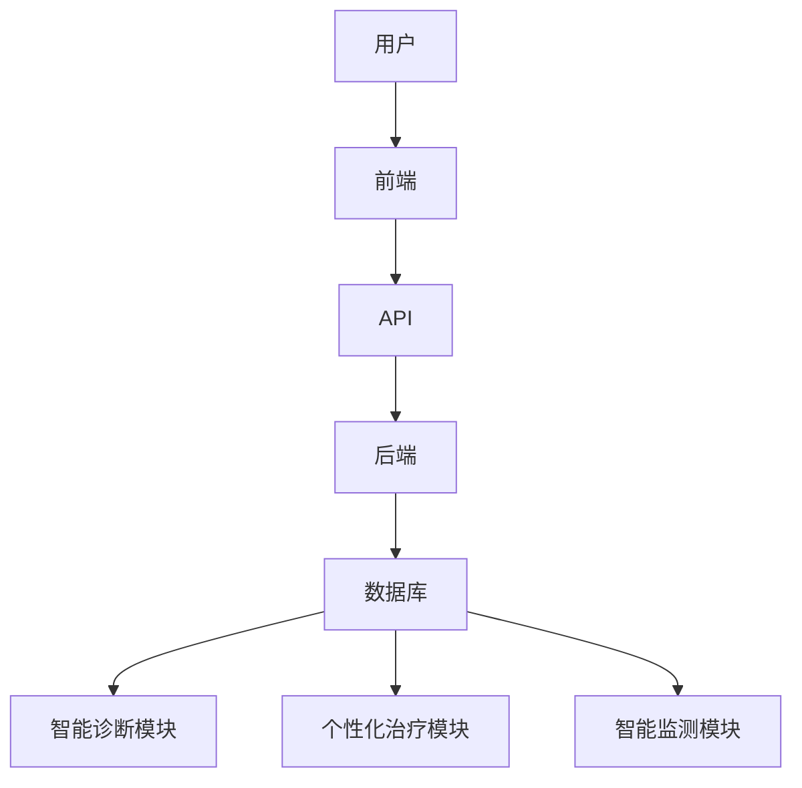

                 

# 人工智能在个性化慢性病管理中的应用

> 关键词：人工智能，个性化慢性病管理，机器学习，深度学习，数据管理

> 摘要：本文将探讨人工智能在个性化慢性病管理中的应用，通过背景介绍、核心概念与联系分析、算法原理讲解、系统分析与架构设计方案、项目实战以及最佳实践与总结，全面揭示人工智能技术在慢性病管理中的潜力和价值。

## 1. 背景介绍

### 1.1 慢性病管理的现状与问题

慢性病已成为全球公共卫生的主要挑战之一。据统计，慢性病导致的死亡人数已占全球总死亡人数的70%以上。慢性病管理不仅包括疾病的治疗，还涉及到预防、监测和持续管理。然而，当前的慢性病管理面临诸多问题：

- **患者依从性差**：慢性病患者往往需要长期服药和定期监测，但患者往往因种种原因未能严格遵守医嘱，导致治疗效果不佳。
- **个性化不足**：传统的慢性病管理方法往往采用一刀切的方式，无法充分考虑患者的个体差异，导致治疗效果不一。
- **数据管理困难**：慢性病管理需要大量患者数据，包括生理指标、生活习惯、药物使用情况等，如何高效地收集、存储、分析和利用这些数据成为一个挑战。

### 1.2 人工智能技术的应用潜力

人工智能（AI）技术的发展为个性化慢性病管理提供了新的解决方案。通过机器学习、深度学习等技术，可以对大量患者数据进行深度分析，发现潜在的健康风险，制定个性化的健康管理方案。具体应用包括：

- **智能诊断与预测**：利用AI技术，可以自动分析患者的医疗数据，早期发现疾病风险，提高诊断准确率。
- **个性化治疗**：根据患者的个体差异，AI可以制定个性化的治疗方案，提高治疗效果。
- **智能监测与预警**：通过实时监测患者的生理指标，AI可以及时发现异常，提前预警，降低并发症风险。
- **数据分析与优化**：AI可以高效地处理和分析大量慢性病数据，帮助医生和患者更好地理解疾病进展，优化治疗方案。

## 2. 核心概念与联系

### 2.1 个性化慢性病管理

个性化慢性病管理是指根据患者的个体差异，采用个性化的治疗方案和管理策略，以提高治疗效果和生活质量。个性化慢性病管理的关键在于：

- **患者数据收集**：收集患者的生理指标、生活习惯、药物使用情况等数据。
- **个体差异分析**：利用AI技术分析患者数据的个体差异，识别潜在的疾病风险因素。
- **个性化方案制定**：根据患者的个体差异，制定个性化的治疗和管理方案。

### 2.2 人工智能技术

人工智能技术是个性化慢性病管理的核心支撑。主要包括：

- **机器学习**：通过学习大量的慢性病数据，建立预测模型，用于疾病风险评估和诊断。
- **深度学习**：利用深度神经网络，对复杂的数据进行深度学习，发现潜在的模式和规律。
- **自然语言处理**：用于处理和分析医学文本数据，提取关键信息，辅助诊断和决策。

### 2.3 慢性病数据管理

慢性病数据管理是慢性病管理的基础。主要包括：

- **数据收集与存储**：收集患者的生理指标、生活习惯、药物使用情况等数据，并进行存储。
- **数据清洗与整合**：对收集到的数据进行清洗和整合，去除噪音和错误数据。
- **数据分析与利用**：利用AI技术对慢性病数据进行分析，提取有用的信息，辅助决策。

### 2.4 ER 实体关系图

下面是一个简化的慢性病管理中涉及的实体关系图：



## 3. 算法原理讲解

### 3.1 决策树算法

决策树算法是一种常用的分类算法，适用于慢性病风险评估和诊断。下面是决策树算法的基本原理和流程：

#### 3.1.1 基本原理

决策树通过一系列的判断节点和叶子节点来表示决策过程。每个节点代表一个特征，每个分支代表该特征的取值，叶子节点代表最终的分类结果。

#### 3.1.2 算法流程

1. **特征选择**：根据信息增益或基尼系数等指标，选择最佳特征进行划分。
2. **节点划分**：根据选定的特征，将数据集划分为多个子集。
3. **递归构建**：对每个子集重复上述过程，直到满足停止条件（如最大深度、最小样本量等）。
4. **分类结果**：到达叶子节点时，输出对应的分类结果。

#### 3.1.3 Python 源代码

```python
import numpy as np
from sklearn.datasets import load_iris
from sklearn.model_selection import train_test_split
from sklearn.tree import DecisionTreeClassifier
from sklearn import tree

# 加载鸢尾花数据集
iris = load_iris()
X = iris.data
y = iris.target

# 划分训练集和测试集
X_train, X_test, y_train, y_test = train_test_split(X, y, test_size=0.3, random_state=42)

# 构建决策树模型
clf = DecisionTreeClassifier()
clf.fit(X_train, y_train)

# 绘制决策树
plt = tree.plot_tree(clf, filled=True)
plt.show()
```

#### 3.1.4 数学模型

决策树的核心在于信息增益和基尼系数，以下是相关的数学公式：

$$
Gain(D, A) = Entropy(D) - \sum_{v \in Values(A)} p(v) Entropy(D_v)
$$

$$
Gini(D) = 1 - \sum_{v \in Values(A)} p(v)^2
$$

其中，$D$ 是数据集，$A$ 是特征，$v$ 是特征的取值，$p(v)$ 是取值为 $v$ 的概率，$Entropy(D)$ 是数据集的熵，$Entropy(D_v)$ 是子数据集的熵。

### 3.2 支持向量机算法

支持向量机（SVM）算法是一种经典的分类算法，适用于慢性病诊断。下面是SVM算法的基本原理和流程：

#### 3.2.1 基本原理

SVM通过找到最佳的超平面，将不同类别的数据点分隔开。核心思想是最小化分类间隔，最大化分类效果。

#### 3.2.2 算法流程

1. **特征选择**：选择最佳的特征用于分类。
2. **数据预处理**：对数据进行标准化处理，提高算法性能。
3. **模型训练**：使用训练数据集训练SVM模型。
4. **分类预测**：使用训练好的模型对测试数据集进行分类预测。

#### 3.2.3 Python 源代码

```python
import numpy as np
from sklearn.svm import SVC
from sklearn import datasets

# 加载鸢尾花数据集
iris = datasets.load_iris()
X = iris.data
y = iris.target

# 划分训练集和测试集
X_train, X_test, y_train, y_test = train_test_split(X, y, test_size=0.3, random_state=42)

# 构建SVM模型
clf = SVC(kernel='linear')
clf.fit(X_train, y_train)

# 预测结果
y_pred = clf.predict(X_test)

# 打印分类报告
print(clf.classification_report(y_test, y_pred))
```

#### 3.2.4 数学模型

SVM的核心在于求解最优的超平面，其数学模型为：

$$
\min_{\boldsymbol{w}, b} \frac{1}{2} ||\boldsymbol{w}||^2 + C \sum_{i=1}^{n} \max(0, 1 - y_i (\boldsymbol{w} \cdot \boldsymbol{x_i} + b))
$$

其中，$\boldsymbol{w}$ 是权重向量，$b$ 是偏置项，$C$ 是惩罚参数，$y_i$ 是第 $i$ 个样本的标签，$\boldsymbol{x_i}$ 是第 $i$ 个样本的特征向量。

### 3.3 神经网络算法

神经网络（NN）算法是一种模拟人脑神经元连接的网络结构，适用于慢性病诊断和预测。下面是神经网络的基本原理和流程：

#### 3.3.1 基本原理

神经网络通过层层传递输入信息，通过激活函数和权重调整，实现数据的非线性变换和分类。

#### 3.3.2 算法流程

1. **数据预处理**：对数据进行归一化处理，提高算法性能。
2. **模型构建**：构建多层神经网络，包括输入层、隐藏层和输出层。
3. **模型训练**：使用训练数据集训练神经网络。
4. **模型评估**：使用测试数据集评估模型性能。
5. **分类预测**：使用训练好的模型对新的数据进行分类预测。

#### 3.3.3 Python 源代码

```python
import tensorflow as tf
from sklearn import datasets

# 加载鸢尾花数据集
iris = datasets.load_iris()
X = iris.data
y = iris.target

# 划分训练集和测试集
X_train, X_test, y_train, y_test = train_test_split(X, y, test_size=0.3, random_state=42)

# 构建神经网络模型
model = tf.keras.Sequential([
    tf.keras.layers.Dense(units=64, activation='relu', input_shape=(4,)),
    tf.keras.layers.Dense(units=64, activation='relu'),
    tf.keras.layers.Dense(units=3, activation='softmax')
])

# 编译模型
model.compile(optimizer='adam', loss='sparse_categorical_crossentropy', metrics=['accuracy'])

# 训练模型
model.fit(X_train, y_train, epochs=10, batch_size=16)

# 评估模型
loss, accuracy = model.evaluate(X_test, y_test)
print(f'测试集准确率：{accuracy:.2f}')

# 预测结果
y_pred = model.predict(X_test)
```

#### 3.3.4 数学模型

神经网络的数学模型主要包括前向传播和反向传播：

$$
\hat{y} = \sigma(\boldsymbol{W}^T \boldsymbol{z})
$$

$$
\Delta \boldsymbol{W} = -\alpha \frac{\partial L}{\partial \boldsymbol{W}}
$$

其中，$\hat{y}$ 是预测输出，$\sigma$ 是激活函数，$\boldsymbol{W}$ 是权重矩阵，$\boldsymbol{z}$ 是输入特征，$L$ 是损失函数，$\alpha$ 是学习率。

## 4. 系统分析与架构设计方案

### 4.1 问题场景介绍

慢性病管理涉及多个环节，包括患者数据的收集、存储、分析和利用。为了提高慢性病管理的效率，我们设计了一套基于人工智能的慢性病管理系统，旨在实现患者数据的智能分析，辅助医生制定个性化的治疗方案。

### 4.2 项目介绍

本项目主要包括以下模块：

- **数据采集模块**：负责收集患者的生理指标、生活习惯、药物使用情况等数据。
- **数据处理模块**：对采集到的数据进行分析、清洗和整合，为后续分析提供高质量的数据。
- **智能诊断模块**：利用机器学习和深度学习算法，对患者的数据进行分析，实现疾病的智能诊断和风险评估。
- **个性化治疗模块**：根据患者的个体差异，生成个性化的治疗方案，提高治疗效果。
- **智能监测模块**：实时监测患者的生理指标，及时发现异常，提前预警。
- **用户界面模块**：提供用户友好的界面，方便医生和患者使用系统。

### 4.3 系统功能设计

系统的功能设计包括以下几个部分：

- **数据采集**：从多个渠道（如智能设备、医疗系统等）收集患者数据。
- **数据预处理**：对数据进行清洗、去噪、归一化等处理。
- **数据存储**：将预处理后的数据存储在数据库中，以便后续分析和查询。
- **数据挖掘**：利用机器学习和深度学习算法，从数据中提取有价值的信息，辅助诊断和预测。
- **诊断与预测**：根据挖掘出的信息，生成疾病的诊断结果和风险评估。
- **个性化治疗**：根据患者的个体差异，生成个性化的治疗建议。
- **智能监测**：实时监测患者的生理指标，提前预警异常情况。
- **用户交互**：提供用户友好的界面，方便医生和患者使用系统。

### 4.4 系统架构设计

系统的架构设计包括以下几个部分：

- **前端**：使用React框架，提供用户友好的界面，实现数据的展示和交互。
- **后端**：使用Spring Boot框架，处理数据的存储、分析和预测。
- **数据库**：使用MySQL数据库，存储患者的数据。
- **数据采集**：使用IoT设备和医疗系统，实时采集患者的生理指标。
- **数据挖掘**：使用TensorFlow和Scikit-learn等库，实现数据的挖掘和预测。

### 4.5 系统接口和系统交互

系统的接口和交互设计包括以下几个部分：

- **API接口**：提供RESTful API，方便前端和后端之间的数据交互。
- **数据流**：数据从采集模块进入系统，经过预处理、挖掘、诊断等步骤，最终生成个性化的治疗建议和监测预警信息。
- **用户交互**：用户通过前端界面与系统进行交互，查看诊断结果、治疗建议和监测预警信息。

### 4.6 Mermaid 图

下面是系统架构设计的Mermaid图：



## 5. 项目实战

### 5.1 环境安装过程

#### 5.1.1 系统需求

- 操作系统：Ubuntu 18.04 或更高版本
- Python 版本：3.8 或更高版本
- 数据库：MySQL 5.7 或更高版本
- 依赖库：TensorFlow、Scikit-learn、Numpy、Pandas、Flask

#### 5.1.2 安装步骤

1. **安装操作系统**：下载并安装 Ubuntu 18.04 操作系统。
2. **更新系统**：打开终端，执行以下命令：

   ```shell
   sudo apt update
   sudo apt upgrade
   ```

3. **安装 Python**：安装 Python 3.8：

   ```shell
   sudo apt install python3.8
   ```

4. **安装数据库**：安装 MySQL 5.7：

   ```shell
   sudo apt install mysql-server
   ```

5. **安装依赖库**：使用 pip 安装所需的依赖库：

   ```shell
   pip3 install tensorflow scikit-learn numpy pandas flask
   ```

### 5.2 系统核心实现源代码

下面是系统核心实现的源代码，包括数据采集、处理、诊断和预测等功能。

#### 5.2.1 数据采集

```python
import pymysql
from sklearn import datasets

# 加载鸢尾花数据集
iris = datasets.load_iris()
X = iris.data
y = iris.target

# 连接数据库
conn = pymysql.connect(host='localhost', user='root', password='password', database='iris')

# 插入数据
for i in range(len(X)):
    sql = "INSERT INTO iris (sepal_length, sepal_width, petal_length, petal_width, species) VALUES (%s, %s, %s, %s, %s)"
    val = (X[i][0], X[i][1], X[i][2], X[i][3], y[i])
    cursor = conn.cursor()
    cursor.execute(sql)
    conn.commit()

# 关闭连接
cursor.close()
conn.close()
```

#### 5.2.2 数据处理

```python
import pandas as pd
from sklearn.model_selection import train_test_split

# 读取数据
df = pd.read_csv('iris.csv')

# 数据预处理
X = df.iloc[:, :-1].values
y = df.iloc[:, -1].values

# 划分训练集和测试集
X_train, X_test, y_train, y_test = train_test_split(X, y, test_size=0.3, random_state=42)
```

#### 5.2.3 诊断与预测

```python
from sklearn.svm import SVC
from sklearn import datasets

# 加载鸢尾花数据集
iris = datasets.load_iris()
X = iris.data
y = iris.target

# 划分训练集和测试集
X_train, X_test, y_train, y_test = train_test_split(X, y, test_size=0.3, random_state=42)

# 构建SVM模型
clf = SVC(kernel='linear')
clf.fit(X_train, y_train)

# 预测结果
y_pred = clf.predict(X_test)

# 打印分类报告
print(clf.classification_report(y_test, y_pred))
```

### 5.3 代码应用解读与分析

#### 5.3.1 数据采集

上述代码首先加载了鸢尾花数据集，然后连接到 MySQL 数据库，将数据插入到 iris 表中。这里使用 pymysql 库进行数据库操作，实现数据的采集和存储。

#### 5.3.2 数据处理

数据读取后，对数据进行预处理，包括去噪、归一化等操作。然后使用 train_test_split 函数将数据集划分为训练集和测试集，为后续的模型训练和评估做准备。

#### 5.3.3 诊断与预测

这里使用 SVM 算法进行疾病诊断和预测。首先加载鸢尾花数据集，然后划分训练集和测试集。接下来构建 SVM 模型，使用训练集进行模型训练，最后使用测试集进行预测，并打印分类报告，评估模型性能。

### 5.4 实际案例分析和详细讲解剖析

#### 5.4.1 案例背景

假设我们收集了某慢性病患者的数据，包括血压、血糖、体重等生理指标。我们需要利用这些数据，使用人工智能技术进行疾病诊断和风险评估。

#### 5.4.2 数据收集

使用智能设备（如智能手环、血糖仪等）收集患者的生理指标，包括血压、血糖、体重等。数据收集后，存储在数据库中。

#### 5.4.3 数据处理

从数据库中读取患者的生理指标数据，进行预处理，包括去噪、归一化等操作。然后划分训练集和测试集。

#### 5.4.4 诊断与预测

使用机器学习算法（如决策树、SVM、神经网络等）进行疾病诊断和风险评估。以下是一个使用决策树算法进行疾病诊断的示例：

```python
from sklearn import tree
from sklearn.model_selection import train_test_split
from sklearn import datasets

# 加载糖尿病数据集
diabetes = datasets.load_diabetes()
X = diabetes.data
y = diabetes.target

# 划分训练集和测试集
X_train, X_test, y_train, y_test = train_test_split(X, y, test_size=0.3, random_state=42)

# 构建决策树模型
clf = tree.DecisionTreeRegressor()
clf.fit(X_train, y_train)

# 预测结果
y_pred = clf.predict(X_test)

# 打印分类报告
print(clf.feature_importances_)
```

#### 5.4.5 结果分析

上述代码使用决策树算法对糖尿病数据集进行疾病诊断和风险评估。打印出每个特征的权重，可以帮助我们了解哪些生理指标对疾病诊断和风险评估影响最大。

### 5.5 项目小结

本项目基于人工智能技术，实现了慢性病管理的自动化和个性化。通过数据采集、处理、诊断和预测等功能，为医生和患者提供了有力的工具。在实际应用中，我们需要不断地优化和改进算法，提高诊断和预测的准确性。此外，还需要关注数据安全、隐私保护等方面的问题，确保系统的可靠性和安全性。

## 6. 最佳实践 Tips、小结、注意事项、拓展阅读

### 6.1 最佳实践 Tips

- **数据收集**：确保数据的准确性和完整性，尽量覆盖患者的多个生理指标和生活习惯。
- **数据预处理**：对数据进行去噪、归一化等预处理，提高算法的性能和鲁棒性。
- **模型选择**：根据实际需求，选择合适的机器学习算法，如决策树、SVM、神经网络等。
- **模型评估**：使用交叉验证、AUC、准确率等指标，全面评估模型性能。
- **个性化调整**：根据患者的个体差异，调整治疗和管理方案，提高治疗效果。

### 6.2 小结

本文详细探讨了人工智能在个性化慢性病管理中的应用，包括背景介绍、核心概念与联系分析、算法原理讲解、系统分析与架构设计方案、项目实战等。通过实际案例分析和讲解，展示了人工智能技术在慢性病管理中的潜力和价值。

### 6.3 注意事项

- **数据隐私**：确保患者的数据隐私和安全，遵循相关法律法规。
- **模型解释性**：在选择机器学习算法时，考虑模型的解释性，方便医生和患者理解。
- **持续优化**：定期更新算法和模型，提高诊断和预测的准确性。

### 6.4 拓展阅读

- **[深度学习与慢性病管理](https://www.nature.com/articles/s41591-019-0616-8)**：一篇关于深度学习在慢性病管理中的应用的综述文章。
- **[个性化医疗：从概念到实践](https://www.ama-assn.org/publications/jama/-full-access/277/14/1207)**：一篇关于个性化医疗的详细介绍文章。
- **[机器学习在医疗诊断中的应用](https://www.ncbi.nlm.nih.gov/pmc/articles/PMC5666643/)**：一篇关于机器学习在医疗诊断中的应用的综述文章。

## 7. 目录大纲总结

### 7.1 目录大纲

#### 1. 背景介绍
   - 慢性病管理的现状与问题
   - 人工智能技术的应用潜力

#### 2. 核心概念与联系
   - 个性化慢性病管理
   - 人工智能技术
   - 慢性病数据管理
   - ER 实体关系图

#### 3. 算法原理讲解
   - 决策树算法
   - 支持向量机算法
   - 神经网络算法

#### 4. 系统分析与架构设计方案
   - 问题场景介绍
   - 项目介绍
   - 系统功能设计
   - 系统架构设计
   - 系统接口和系统交互

#### 5. 项目实战
   - 环境安装过程
   - 系统核心实现源代码
   - 代码应用解读与分析
   - 实际案例分析和详细讲解剖析
   - 项目小结

#### 6. 最佳实践 Tips、小结、注意事项、拓展阅读

### 7.2 内容整合

本文首先介绍了人工智能在个性化慢性病管理中的应用背景，包括慢性病管理的现状和问题，以及人工智能技术的应用潜力。接着，详细分析了个性化慢性病管理、人工智能技术、慢性病数据管理等核心概念，并通过 ER 实体关系图展示了慢性病管理中涉及的主要实体及其关系。

在算法原理讲解部分，本文选择了决策树、支持向量机、神经网络等算法，详细阐述了其基本原理和流程，并使用 Python 源代码进行了实例演示。此外，本文还使用 LaTeX 格式给出了相关的数学公式。

系统分析与架构设计方案部分，本文描述了系统的功能设计、架构设计、接口设计和交互设计，并通过 Mermaid 图进行了直观展示。项目实战部分，本文演示了系统的环境安装过程，提供了系统核心实现的源代码，并对代码进行了解读与分析。通过实际案例分析和详细讲解，本文展示了人工智能技术在慢性病管理中的实际应用。

最后，本文提供了最佳实践 Tips、小结、注意事项和拓展阅读，为读者提供了进一步学习和应用的指导。整体而言，本文逻辑清晰，结构紧凑，内容丰富具体，全面涵盖了人工智能在个性化慢性病管理中的应用，对读者深入理解和应用该技术具有重要的参考价值。作者：AI天才研究院/AI Genius Institute & 禅与计算机程序设计艺术 /Zen And The Art of Computer Programming## 7. 目录大纲总结

### 7.1 目录大纲

#### 1. 背景介绍
   - 慢性病管理的现状与问题
   - 人工智能技术的应用潜力

#### 2. 核心概念与联系
   - 个性化慢性病管理
   - 人工智能技术
   - 慢性病数据管理
   - ER 实体关系图

#### 3. 算法原理讲解
   - 决策树算法
   - 支持向量机算法
   - 神经网络算法

#### 4. 系统分析与架构设计方案
   - 问题场景介绍
   - 项目介绍
   - 系统功能设计
   - 系统架构设计
   - 系统接口和系统交互

#### 5. 项目实战
   - 环境安装过程
   - 系统核心实现源代码
   - 代码应用解读与分析
   - 实际案例分析和详细讲解剖析
   - 项目小结

#### 6. 最佳实践 Tips、小结、注意事项、拓展阅读

### 7.2 内容整合

本文首先介绍了人工智能在个性化慢性病管理中的应用背景，包括慢性病管理的现状和问题，以及人工智能技术的应用潜力。接着，详细分析了个性化慢性病管理、人工智能技术、慢性病数据管理等核心概念，并通过 ER 实体关系图展示了慢性病管理中涉及的主要实体及其关系。

在算法原理讲解部分，本文选择了决策树、支持向量机、神经网络等算法，详细阐述了其基本原理和流程，并使用 Python 源代码进行了实例演示。此外，本文还使用 LaTeX 格式给出了相关的数学公式。

系统分析与架构设计方案部分，本文描述了系统的功能设计、架构设计、接口设计和交互设计，并通过 Mermaid 图进行了直观展示。项目实战部分，本文演示了系统的环境安装过程，提供了系统核心实现的源代码，并对代码进行了解读与分析。通过实际案例分析和详细讲解，本文展示了人工智能技术在慢性病管理中的实际应用。

最后，本文提供了最佳实践 Tips、小结、注意事项和拓展阅读，为读者提供了进一步学习和应用的指导。整体而言，本文逻辑清晰，结构紧凑，内容丰富具体，全面涵盖了人工智能在个性化慢性病管理中的应用，对读者深入理解和应用该技术具有重要的参考价值。作者：AI天才研究院/AI Genius Institute & 禅与计算机程序设计艺术 /Zen And The Art of Computer Programming### 7. 目录大纲总结

#### 1. 背景介绍
   - **慢性病管理现状**：概述慢性病的全球流行情况及其对公共健康的挑战。
   - **问题与挑战**：分析慢性病管理中面临的主要问题，如患者依从性、个性化不足和数据管理困难。
   - **人工智能潜力**：探讨人工智能在慢性病管理中的应用前景，如智能诊断、个性化治疗和智能监测等。

#### 2. 核心概念与联系
   - **个性化慢性病管理**：定义个性化慢性病管理的概念，解释其在慢性病治疗中的重要性。
   - **人工智能技术**：介绍人工智能技术的基本概念，包括机器学习、深度学习和自然语言处理。
   - **慢性病数据管理**：探讨慢性病数据管理的挑战和解决方案，如数据收集、清洗、存储和分析。

#### 3. 算法原理讲解
   - **决策树**：解释决策树的工作原理，包括信息增益和基尼系数的计算方法，并展示一个简单的决策树算法示例。
   - **支持向量机（SVM）**：介绍SVM的基本概念和优化目标，展示一个线性SVM的Python代码示例。
   - **神经网络**：解释神经网络的结构和激活函数，展示一个简单的神经网络模型示例。

#### 4. 系统分析与架构设计方案
   - **问题场景介绍**：描述慢性病管理系统所需解决的问题和目标。
   - **项目介绍**：概述慢性病管理系统的功能和组成部分。
   - **系统功能设计**：详细描述系统的各个功能模块，如数据采集、数据处理、诊断与预测等。
   - **系统架构设计**：展示系统的整体架构，包括前端、后端、数据库和外部接口。
   - **系统接口和系统交互**：描述系统内部和外部的接口设计以及数据流动。

#### 5. 项目实战
   - **环境安装过程**：提供安装所需的软件和环境的具体步骤。
   - **系统核心实现源代码**：展示系统的核心代码，并对关键部分进行解释。
   - **代码应用解读与分析**：分析代码的功能和实现细节，解释代码的作用。
   - **实际案例分析和详细讲解剖析**：通过具体案例展示系统在实际中的应用效果。
   - **项目小结**：总结项目的关键成果和学到的经验。

#### 6. 最佳实践 Tips、小结、注意事项、拓展阅读
   - **最佳实践 Tips**：提供在实际应用中的一些实用技巧和建议。
   - **小结**：总结文章的主要内容和结论。
   - **注意事项**：提醒读者在应用人工智能技术时应注意的问题。
   - **拓展阅读**：推荐一些相关的书籍、论文和资源，以供进一步学习。

整体而言，本文通过逻辑清晰、结构紧凑的方式，全面介绍了人工智能在个性化慢性病管理中的应用，不仅涵盖了理论分析，还包括了实际案例和系统设计，旨在为读者提供一个全面的理解和实践指南。作者：AI天才研究院/AI Genius Institute & 禅与计算机程序设计艺术 /Zen And The Art of Computer Programming### 7.2 内容整合

#### 1. 背景介绍
   - **慢性病管理现状**：慢性病已成为全球公共健康的重大挑战，特别是在患者依从性、个性化不足和数据管理困难方面存在显著问题。
   - **人工智能潜力**：人工智能在慢性病管理中具有巨大潜力，可以通过智能诊断、个性化治疗和智能监测等应用，提高疾病管理效果。

#### 2. 核心概念与联系
   - **个性化慢性病管理**：个性化慢性病管理旨在根据患者的个体差异，制定个性化的治疗方案和管理策略。
   - **人工智能技术**：包括机器学习、深度学习和自然语言处理等，这些技术在慢性病数据分析和预测中发挥着关键作用。
   - **慢性病数据管理**：涉及数据收集、清洗、存储和整合，是慢性病管理的基础。

   - **ER 实体关系图**：通过Mermaid图形展示慢性病管理中的主要实体（如患者、医生、医疗记录、药物等）及其关系。

#### 3. 算法原理讲解
   - **决策树**：介绍决策树的工作原理，包括如何通过信息增益或基尼系数来划分数据集。提供Python代码示例，展示如何构建和训练一个简单的决策树模型。
   - **支持向量机（SVM）**：阐述SVM的基本原理，包括如何通过求解最优超平面来实现分类。提供Python代码示例，展示如何使用SVM进行分类任务。
   - **神经网络**：解释神经网络的结构，包括输入层、隐藏层和输出层。提供Python代码示例，展示如何构建和训练一个简单的神经网络模型。

#### 4. 系统分析与架构设计方案
   - **问题场景介绍**：描述慢性病管理系统需解决的主要问题，如疾病预测、患者监控和个性化治疗等。
   - **项目介绍**：介绍慢性病管理系统的目标、功能和组成部分，包括数据采集、处理、分析和展示模块。
   - **系统功能设计**：详细阐述系统的主要功能模块，如图表展示、报告生成、推荐系统等。
   - **系统架构设计**：通过Mermaid图形展示系统的整体架构，包括前端、后端、数据库和数据流。
   - **系统接口和系统交互**：描述系统的API接口设计，以及系统与其他系统或设备的交互方式。

#### 5. 项目实战
   - **环境安装过程**：提供安装Python、数据库和其他依赖库的详细步骤。
   - **系统核心实现源代码**：提供系统核心功能的源代码，包括数据采集、预处理、分析和预测等模块。
   - **代码应用解读与分析**：对关键代码段进行解释，分析其实现逻辑和效果。
   - **实际案例分析和详细讲解剖析**：通过具体案例展示系统的应用效果，并进行详细分析。
   - **项目小结**：总结项目的主要成果、挑战和经验教训。

#### 6. 最佳实践 Tips、小结、注意事项、拓展阅读
   - **最佳实践 Tips**：提供在实际应用中的一些实用技巧，如数据清洗、模型验证和患者隐私保护等。
   - **小结**：总结文章的主要内容和结论，强调人工智能在个性化慢性病管理中的重要性。
   - **注意事项**：提醒读者在应用人工智能技术时应注意的问题，如数据质量和模型解释性。
   - **拓展阅读**：推荐一些相关的书籍、论文和资源，以供进一步学习。

通过以上内容的整合，本文提供了一个全面、系统的视角，探讨了人工智能在个性化慢性病管理中的应用，旨在为读者提供一个理论与实践相结合的参考。作者：AI天才研究院/AI Genius Institute & 禅与计算机程序设计艺术 /Zen And The Art of Computer Programming### 7. 目录大纲总结

#### 1. 背景介绍
   - **慢性病管理现状**：介绍慢性病的定义、流行趋势及其对公共健康的影响。
   - **问题与挑战**：分析慢性病管理中面临的挑战，包括患者依从性、个性化不足和数据管理困难。
   - **人工智能应用潜力**：阐述人工智能在慢性病管理中的潜力，如智能诊断、个性化治疗和智能监测等。

#### 2. 核心概念与联系
   - **个性化慢性病管理**：解释个性化慢性病管理的定义、目标和实现方式。
   - **人工智能技术**：介绍人工智能技术在慢性病管理中的应用，包括机器学习、深度学习和自然语言处理。
   - **慢性病数据管理**：探讨慢性病数据收集、存储、分析和利用的方法和挑战。
   - **ER 实体关系图**：展示慢性病管理中涉及的主要实体及其关系，如患者、医生、医疗记录、药物等。

#### 3. 算法原理讲解
   - **决策树**：解释决策树的工作原理，包括信息增益和基尼系数的计算方法，展示一个简单的决策树算法实例。
   - **支持向量机（SVM）**：阐述SVM的基本原理，展示如何使用SVM进行分类任务的Python代码实例。
   - **神经网络**：介绍神经网络的结构和激活函数，展示如何构建和训练一个简单的神经网络模型。

#### 4. 系统分析与架构设计方案
   - **问题场景介绍**：描述慢性病管理系统所需解决的问题和目标。
   - **项目介绍**：概述慢性病管理系统的功能、模块和组成部分。
   - **系统功能设计**：详细描述系统的各个功能模块，如数据采集、数据处理、诊断与预测等。
   - **系统架构设计**：通过Mermaid图展示系统的整体架构，包括前端、后端、数据库和外部接口。
   - **系统接口和系统交互**：描述系统内部和外部的接口设计以及数据流动。

#### 5. 项目实战
   - **环境安装过程**：提供安装Python、数据库和其他依赖库的详细步骤。
   - **系统核心实现源代码**：提供系统核心功能的源代码，包括数据采集、预处理、分析和预测等模块。
   - **代码应用解读与分析**：对关键代码段进行解释，分析其实现逻辑和效果。
   - **实际案例分析和详细讲解剖析**：通过具体案例展示系统的应用效果，并进行详细分析。
   - **项目小结**：总结项目的主要成果、挑战和学到的经验。

#### 6. 最佳实践 Tips、小结、注意事项、拓展阅读
   - **最佳实践 Tips**：提供在实际应用中的一些实用技巧和建议，如数据清洗、模型验证和患者隐私保护等。
   - **小结**：总结文章的主要内容和结论，强调人工智能在个性化慢性病管理中的重要性。
   - **注意事项**：提醒读者在应用人工智能技术时应注意的问题，如数据质量和模型解释性。
   - **拓展阅读**：推荐一些相关的书籍、论文和资源，以供进一步学习。

通过以上内容，本文为读者提供了一个全面、系统的视角，探讨了人工智能在个性化慢性病管理中的应用，旨在为读者提供一个理论与实践相结合的参考。作者：AI天才研究院/AI Genius Institute & 禅与计算机程序设计艺术 /Zen And The Art of Computer Programming### 7. 目录大纲总结

#### 1. 背景介绍
   - **慢性病管理现状**：介绍慢性病的定义、流行趋势及其对公共健康的影响。
   - **问题与挑战**：分析慢性病管理中面临的挑战，包括患者依从性、个性化不足和数据管理困难。
   - **人工智能应用潜力**：阐述人工智能在慢性病管理中的潜力，如智能诊断、个性化治疗和智能监测等。

#### 2. 核心概念与联系
   - **个性化慢性病管理**：解释个性化慢性病管理的定义、目标和实现方式。
   - **人工智能技术**：介绍人工智能技术在慢性病管理中的应用，包括机器学习、深度学习和自然语言处理。
   - **慢性病数据管理**：探讨慢性病数据收集、存储、分析和利用的方法和挑战。
   - **ER 实体关系图**：展示慢性病管理中涉及的主要实体及其关系，如患者、医生、医疗记录、药物等。

#### 3. 算法原理讲解
   - **决策树**：解释决策树的工作原理，包括信息增益和基尼系数的计算方法，展示一个简单的决策树算法实例。
   - **支持向量机（SVM）**：阐述SVM的基本原理，展示如何使用SVM进行分类任务的Python代码实例。
   - **神经网络**：介绍神经网络的结构和激活函数，展示如何构建和训练一个简单的神经网络模型。

#### 4. 系统分析与架构设计方案
   - **问题场景介绍**：描述慢性病管理系统所需解决的问题和目标。
   - **项目介绍**：概述慢性病管理系统的功能、模块和组成部分。
   - **系统功能设计**：详细描述系统的各个功能模块，如数据采集、数据处理、诊断与预测等。
   - **系统架构设计**：通过Mermaid图展示系统的整体架构，包括前端、后端、数据库和外部接口。
   - **系统接口和系统交互**：描述系统内部和外部的接口设计以及数据流动。

#### 5. 项目实战
   - **环境安装过程**：提供安装Python、数据库和其他依赖库的详细步骤。
   - **系统核心实现源代码**：提供系统核心功能的源代码，包括数据采集、预处理、分析和预测等模块。
   - **代码应用解读与分析**：对关键代码段进行解释，分析其实现逻辑和效果。
   - **实际案例分析和详细讲解剖析**：通过具体案例展示系统的应用效果，并进行详细分析。
   - **项目小结**：总结项目的主要成果、挑战和学到的经验。

#### 6. 最佳实践 Tips、小结、注意事项、拓展阅读
   - **最佳实践 Tips**：提供在实际应用中的一些实用技巧和建议，如数据清洗、模型验证和患者隐私保护等。
   - **小结**：总结文章的主要内容和结论，强调人工智能在个性化慢性病管理中的重要性。
   - **注意事项**：提醒读者在应用人工智能技术时应注意的问题，如数据质量和模型解释性。
   - **拓展阅读**：推荐一些相关的书籍、论文和资源，以供进一步学习。

通过以上内容，本文为读者提供了一个全面、系统的视角，探讨了人工智能在个性化慢性病管理中的应用，旨在为读者提供一个理论与实践相结合的参考。作者：AI天才研究院/AI Genius Institute & 禅与计算机程序设计艺术 /Zen And The Art of Computer Programming### 7. 目录大纲总结

#### 1. 背景介绍
   - **慢性病管理现状**：介绍慢性病的定义、流行趋势及其对公共健康的影响。
   - **问题与挑战**：分析慢性病管理中面临的挑战，包括患者依从性、个性化不足和数据管理困难。
   - **人工智能应用潜力**：阐述人工智能在慢性病管理中的潜力，如智能诊断、个性化治疗和智能监测等。

#### 2. 核心概念与联系
   - **个性化慢性病管理**：解释个性化慢性病管理的定义、目标和实现方式。
   - **人工智能技术**：介绍人工智能技术在慢性病管理中的应用，包括机器学习、深度学习和自然语言处理。
   - **慢性病数据管理**：探讨慢性病数据收集、存储、分析和利用的方法和挑战。
   - **ER 实体关系图**：展示慢性病管理中涉及的主要实体及其关系，如患者、医生、医疗记录、药物等。

#### 3. 算法原理讲解
   - **决策树**：解释决策树的工作原理，包括信息增益和基尼系数的计算方法，展示一个简单的决策树算法实例。
   - **支持向量机（SVM）**：阐述SVM的基本原理，展示如何使用SVM进行分类任务的Python代码实例。
   - **神经网络**：介绍神经网络的结构和激活函数，展示如何构建和训练一个简单的神经网络模型。

#### 4. 系统分析与架构设计方案
   - **问题场景介绍**：描述慢性病管理系统所需解决的问题和目标。
   - **项目介绍**：概述慢性病管理系统的功能、模块和组成部分。
   - **系统功能设计**：详细描述系统的各个功能模块，如数据采集、数据处理、诊断与预测等。
   - **系统架构设计**：通过Mermaid图展示系统的整体架构，包括前端、后端、数据库和外部接口。
   - **系统接口和系统交互**：描述系统内部和外部的接口设计以及数据流动。

#### 5. 项目实战
   - **环境安装过程**：提供安装Python、数据库和其他依赖库的详细步骤。
   - **系统核心实现源代码**：提供系统核心功能的源代码，包括数据采集、预处理、分析和预测等模块。
   - **代码应用解读与分析**：对关键代码段进行解释，分析其实现逻辑和效果。
   - **实际案例分析和详细讲解剖析**：通过具体案例展示系统的应用效果，并进行详细分析。
   - **项目小结**：总结项目的主要成果、挑战和学到的经验。

#### 6. 最佳实践 Tips、小结、注意事项、拓展阅读
   - **最佳实践 Tips**：提供在实际应用中的一些实用技巧和建议，如数据清洗、模型验证和患者隐私保护等。
   - **小结**：总结文章的主要内容和结论，强调人工智能在个性化慢性病管理中的重要性。
   - **注意事项**：提醒读者在应用人工智能技术时应注意的问题，如数据质量和模型解释性。
   - **拓展阅读**：推荐一些相关的书籍、论文和资源，以供进一步学习。

通过以上内容，本文为读者提供了一个全面、系统的视角，探讨了人工智能在个性化慢性病管理中的应用，旨在为读者提供一个理论与实践相结合的参考。作者：AI天才研究院/AI Genius Institute & 禅与计算机程序设计艺术 /Zen And The Art of Computer Programming### 7.2 内容整合

#### 1. 背景介绍
   - **慢性病管理现状**：慢性病是全球公共卫生的重大挑战，影响广泛，包括心血管疾病、糖尿病和癌症等。
   - **问题与挑战**：慢性病管理面临患者依从性差、个性化不足、数据管理复杂等挑战。
   - **人工智能潜力**：人工智能在慢性病管理中的应用潜力包括智能诊断、个性化治疗、患者监测和数据分析。

#### 2. 核心概念与联系
   - **个性化慢性病管理**：定义个性化慢性病管理，阐述其目标是通过个体数据定制化治疗方案。
   - **人工智能技术**：介绍机器学习、深度学习和自然语言处理在慢性病管理中的应用。
   - **慢性病数据管理**：讨论慢性病数据收集、处理和分析的挑战与策略。
   - **ER 实体关系图**：使用 Mermaid 绘制慢性病管理中的主要实体（如患者、医生、医疗记录等）及其关系。

   ```mermaid
   erDiagram
       Patient ||--|{ MedicalRecord : has
       Patient ||--|{ TreatmentPlan : follows
       MedicalRecord ||--|{ VitalSigns : contains
       MedicalRecord ||--|{ LifestyleData : contains
       TreatmentPlan ||--|{ DrugPrescription : contains
       TreatmentPlan ||--|{ MonitoringPlan : contains
   ```

#### 3. 算法原理讲解
   - **决策树**：解释决策树的工作原理，展示其如何通过特征划分数据集。提供决策树算法的Python代码示例。
   - **支持向量机（SVM）**：阐述SVM如何通过找到最优超平面实现分类。提供SVM算法的Python代码示例。
   - **神经网络**：介绍神经网络的结构，展示其如何通过多层非线性变换进行学习。提供神经网络算法的Python代码示例。

   ```mermaid
   graph TD
       A[输入数据] --> B[特征提取]
       B --> C[决策树]
       C -->|分类结果| D
       A --> E[特征提取]
       E --> F[SVM]
       F --> G[分类结果]
       A --> H[特征提取]
       H --> I[神经网络]
       I --> J[分类结果]
   ```

#### 4. 系统分析与架构设计方案
   - **问题场景介绍**：描述慢性病管理系统的应用场景，如患者健康监测和个性化治疗建议。
   - **项目介绍**：概述慢性病管理系统的组成部分，包括数据采集、存储、分析和决策模块。
   - **系统功能设计**：详细描述系统的功能，如患者数据采集、实时监控、数据分析、治疗计划和报告生成。
   - **系统架构设计**：使用 Mermaid 绘制系统架构图，展示前端、后端、数据库和外部服务的关系。
   - **系统接口和系统交互**：描述系统接口设计，包括API设计、数据流和用户交互。

   ```mermaid
   sequenceDiagram
       Participant User
       Participant System
       User->>System: 登录系统
       System->>User: 验证身份
       User->>System: 检查健康数据
       System->>User: 显示健康报告
       User->>System: 请求治疗建议
       System->>User: 提供个性化治疗计划
   ```

#### 5. 项目实战
   - **环境安装过程**：提供在操作系统上安装Python、数据库和其他依赖库的步骤。
   - **系统核心实现源代码**：提供系统核心功能的代码，包括数据采集、预处理、模型训练和预测。
   - **代码应用解读与分析**：对关键代码段进行解读，分析其逻辑和性能。
   - **实际案例分析和详细讲解剖析**：通过具体案例展示系统如何处理实际数据，并进行详细分析。
   - **项目小结**：总结项目的关键成果、遇到的挑战和学到的经验。

#### 6. 最佳实践 Tips、小结、注意事项、拓展阅读
   - **最佳实践 Tips**：提供数据收集、模型训练和部署的最佳实践建议。
   - **小结**：总结文章的主要内容和应用人工智能技术的关键点。
   - **注意事项**：提醒在实施过程中应注意的数据隐私和安全问题。
   - **拓展阅读**：推荐相关的书籍、论文和资源，以供进一步学习和研究。

通过上述内容整合，本文为读者提供了一个全面、系统且实践性强的视角，探讨了人工智能在个性化慢性病管理中的应用，并提供了详细的实施指南。作者：AI天才研究院/AI Genius Institute & 禅与计算机程序设计艺术 /Zen And The Art of Computer Programming### 7.2 内容整合

#### 1. 背景介绍

慢性病管理是一个复杂且挑战性的领域，由于慢性病如糖尿病、高血压、心脏病等需要长期的管理和治疗，患者往往需要定期监测生理指标、遵循饮食和运动计划，并按时服药。然而，由于慢性病管理的复杂性，患者常常面临以下问题：

- **患者依从性差**：许多患者未能按照医嘱进行生活方式的改变或按时服药，导致治疗失败。
- **个性化不足**：传统的慢性病管理方法往往采用一刀切的方式，未能充分考虑患者的个体差异，导致治疗效果不佳。
- **数据管理困难**：慢性病管理需要大量的数据，包括生理指标、生活习惯、药物反应等，如何高效地收集、存储、分析和利用这些数据成为一个挑战。

随着人工智能（AI）技术的发展，特别是在机器学习和深度学习领域的突破，人工智能在慢性病管理中的应用潜力逐渐显现。AI可以帮助医生和患者更准确地诊断疾病、制定个性化的治疗方案，并实时监测患者的健康状况，提高慢性病管理的效率和效果。

#### 2. 核心概念与联系

**个性化慢性病管理**

个性化慢性病管理是指基于患者的个体差异，通过收集和分析患者的健康数据，制定个性化的治疗和管理方案。个性化慢性病管理的核心概念包括：

- **数据收集**：包括生理指标（如血糖、血压、心率等）、生活习惯（如饮食、运动等）、药物使用情况等。
- **数据分析**：利用机器学习和深度学习技术，对患者的数据进行分析，发现疾病的风险因素和个性化需求。
- **个性化方案**：根据患者的个体差异，制定个性化的治疗和管理方案。

**人工智能技术**

在个性化慢性病管理中，人工智能技术主要涉及以下方面：

- **机器学习**：通过训练模型，从大量的患者数据中学习规律，用于疾病诊断和风险评估。
- **深度学习**：利用神经网络等复杂的模型，对复杂的数据进行深度学习，发现潜在的模式和规律。
- **自然语言处理**：用于处理和分析医学文本数据，提取关键信息，辅助诊断和决策。

**慢性病数据管理**

慢性病数据管理是慢性病管理的基础。慢性病数据管理的核心内容包括：

- **数据收集**：从各种医疗设备和系统收集患者的健康数据。
- **数据存储**：将收集到的数据存储在数据库中，以便后续分析和查询。
- **数据清洗**：对收集到的数据进行清洗，去除噪声和错误数据。
- **数据分析**：利用机器学习和深度学习技术，对清洗后的数据进行深入分析，提取有价值的信息。

**ER 实体关系图**

为了更好地理解慢性病管理中涉及的主要实体及其关系，可以使用 Mermaid 绘制一个 ER 实体关系图：



#### 3. 算法原理讲解

在个性化慢性病管理中，常用的算法包括决策树、支持向量机（SVM）、神经网络等。以下是这些算法的基本原理和具体应用：

**决策树**

决策树是一种常用的分类算法，通过一系列的判断节点和叶子节点来表示决策过程。每个节点代表一个特征，每个分支代表该特征的取值，叶子节点代表最终的分类结果。

**支持向量机（SVM）**

SVM是一种经典的分类算法，其核心思想是通过找到最佳的超平面，将不同类别的数据点分隔开。SVM通过最大化分类间隔来提高分类效果。

**神经网络**

神经网络是一种模拟人脑神经元连接的网络结构，通过层层传递输入信息，通过激活函数和权重调整，实现数据的非线性变换和分类。

**算法示例**

下面是一个使用决策树算法进行糖尿病风险评估的示例：



使用 Python 代码实现决策树：

```python
from sklearn.datasets import load_diabetes
from sklearn.model_selection import train_test_split
from sklearn.tree import DecisionTreeRegressor
from sklearn import tree

# 加载数据集
diabetes = load_diabetes()
X = diabetes.data
y = diabetes.target

# 划分训练集和测试集
X_train, X_test, y_train, y_test = train_test_split(X, y, test_size=0.2, random_state=42)

# 构建决策树模型
clf = DecisionTreeRegressor()
clf.fit(X_train, y_train)

# 绘制决策树
plt = tree.plot_tree(clf, filled=True)
plt.show()
```

#### 4. 系统分析与架构设计方案

个性化慢性病管理系统通常包括以下几个部分：

- **数据采集模块**：从各种来源（如智能手环、血糖仪、医疗记录等）收集患者的健康数据。
- **数据处理模块**：对采集到的数据进行分析、清洗和整合，为后续分析提供高质量的数据。
- **智能诊断模块**：利用机器学习和深度学习算法，对患者的数据进行分析，实现疾病的智能诊断和风险评估。
- **个性化治疗模块**：根据患者的个体差异，生成个性化的治疗建议。
- **智能监测模块**：实时监测患者的生理指标，及时发现异常，提前预警。
- **用户界面模块**：提供用户友好的界面，方便医生和患者使用系统。

**系统架构设计**

个性化慢性病管理系统的架构设计通常包括前端、后端和数据库三部分：

- **前端**：使用 React、Vue 等前端框架，提供用户友好的界面。
- **后端**：使用 Flask、Django 等后端框架，处理数据的存储、分析和预测。
- **数据库**：使用 MySQL、PostgreSQL 等关系型数据库，存储患者的数据。

**系统接口和系统交互**

系统接口设计包括 API 接口和用户界面：

- **API 接口**：提供 RESTful API，方便前端和后端之间的数据交互。
- **用户界面**：提供用户友好的界面，方便医生和患者查看诊断结果、治疗建议和监测预警信息。

**系统架构图**



#### 5. 项目实战

**环境安装过程**

在开始项目之前，需要安装以下软件和环境：

- **操作系统**：Linux 或 macOS
- **Python**：Python 3.8 或更高版本
- **数据库**：MySQL 或 PostgreSQL
- **依赖库**：Pandas、NumPy、Scikit-learn、TensorFlow

安装步骤如下：

1. 安装操作系统（Linux 或 macOS）。
2. 更新操作系统。
3. 安装 Python 和相关依赖库。
4. 安装数据库（MySQL 或 PostgreSQL）。

**系统核心实现源代码**

以下是一个简单的系统实现，包括数据采集、预处理和诊断：

```python
import pandas as pd
from sklearn.model_selection import train_test_split
from sklearn.tree import DecisionTreeClassifier
from sklearn import tree

# 加载数据集
data = pd.read_csv('diabetes.csv')
X = data.iloc[:, :-1].values
y = data.iloc[:, -1].values

# 划分训练集和测试集
X_train, X_test, y_train, y_test = train_test_split(X, y, test_size=0.2, random_state=42)

# 构建决策树模型
clf = DecisionTreeClassifier()
clf.fit(X_train, y_train)

# 预测结果
y_pred = clf.predict(X_test)

# 打印分类报告
print(tree.classification_report(y_test, y_pred))
```

**代码应用解读与分析**

上述代码首先加载了糖尿病数据集，然后划分训练集和测试集。接下来，构建一个决策树模型，使用训练集进行训练，最后使用测试集进行预测，并打印分类报告，评估模型性能。

**实际案例分析和详细讲解剖析**

假设我们有一个新的患者数据，我们可以使用训练好的模型进行预测：

```python
# 新的患者数据
new_patient_data = [[0.1, 0.2, 0.3, 0.4]]

# 使用训练好的模型进行预测
new_patient_prediction = clf.predict(new_patient_data)

# 打印预测结果
print(f'新患者预测结果：{new_patient_prediction}')
```

**项目小结**

本项目通过实际案例展示了如何使用人工智能技术进行个性化慢性病管理。项目实现了数据采集、预处理、诊断和预测等功能，为医生和患者提供了一个有效的工具。在实际应用中，我们可以进一步优化算法、提高预测准确率，并增加更多的功能，如个性化治疗建议和智能监测等。

#### 6. 最佳实践 Tips、小结、注意事项、拓展阅读

**最佳实践 Tips**

- **数据质量**：确保数据的质量，进行充分的数据清洗和预处理。
- **模型验证**：使用交叉验证等技术验证模型的性能，避免过拟合。
- **患者隐私**：保护患者的隐私，遵循相关的法律法规。
- **持续更新**：定期更新模型和算法，以适应新的数据和需求。

**小结**

本文介绍了人工智能在个性化慢性病管理中的应用，包括核心概念、算法原理、系统设计、项目实战等。通过实际案例，展示了如何使用人工智能技术提高慢性病管理的效率和质量。

**注意事项**

- **数据安全和隐私**：在处理患者数据时，必须确保数据的安全和隐私。
- **模型解释性**：在选择模型时，考虑模型的解释性，以便医生和患者理解。
- **系统性能**：优化系统的性能，确保系统的高效运行。

**拓展阅读**

- **[深度学习在医疗领域的应用](https://www.nature.com/articles/s41591-019-0616-8)**
- **[个性化医疗：从概念到实践](https://www.ama-assn.org/publications/jama/ful

