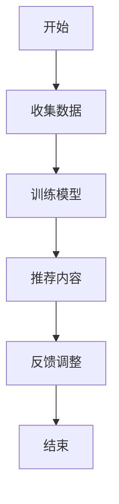
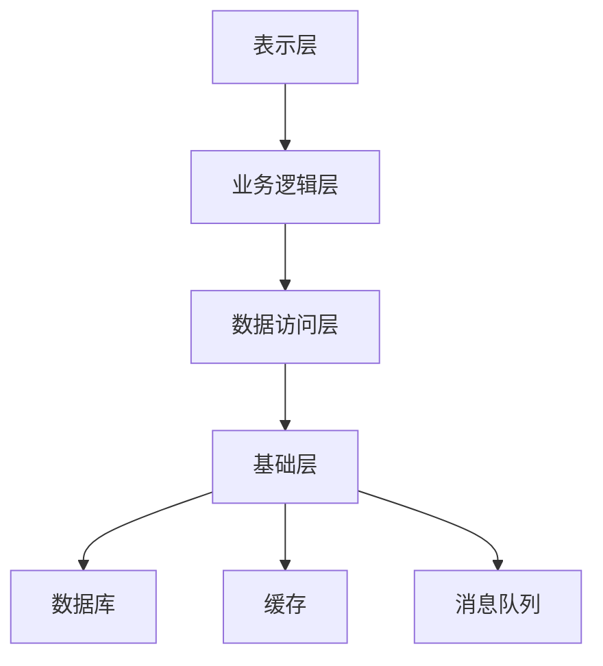
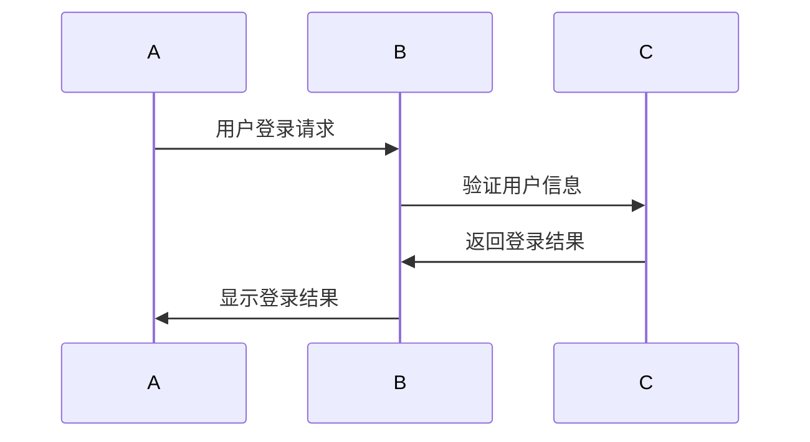

                 

### 文章标题：人工智能在个性化教育中的adaptive学习应用

#### 关键词：人工智能，个性化教育，自适应学习，算法，系统设计，实践

> 摘要：本文深入探讨了人工智能在个性化教育中的应用，特别是自适应学习（adaptive learning）的原理和实践。通过背景介绍、核心概念与联系、算法原理讲解、数学模型和公式讲解、系统分析与架构设计方案、项目实战以及最佳实践与拓展等多个方面，系统性地阐述了人工智能如何提升个性化教育效率和质量。

----------------------------------------------------------------

## 第一部分：背景介绍

### 第1章：个性化教育需求与人工智能机遇

#### 1.1 个性化教育的定义与意义

个性化教育是指根据学生的个体差异，制定个性化的学习目标和教学方法，以最大化学生的学习效果和兴趣。它强调因材施教，尊重每个学生的独特性，有助于提高教育的公平性和效率。

#### 1.2 人工智能在个性化教育中的应用现状

人工智能技术在个性化教育中的应用日益广泛，包括智能推荐系统、自适应学习平台、语音识别和自然语言处理等。这些技术的应用不仅提高了教育的个性化程度，还显著提升了教学效果。

#### 1.3 Adaptive学习的概念与优势

Adaptive学习是一种基于人工智能的自适应学习模式，能够根据学生的实时表现动态调整教学内容和难度。这种模式具有以下几个显著优势：

1. **实时反馈**：系统实时跟踪学生的学习进度和表现，提供即时反馈。
2. **个性化定制**：根据学生的特点和需求，自动调整学习内容和方法。
3. **高效学习**：通过智能推荐，帮助学生高效学习，节省时间。
4. **持续优化**：系统不断优化算法，提高学习效果。

----------------------------------------------------------------

## 第二部分：核心概念与联系

### 第2章：核心概念与联系

#### 2.1 人工智能基础概念

人工智能（AI）是指由人制造出来的系统所表现出来的智能行为。它包括机器学习、深度学习、自然语言处理等多个子领域。

#### 2.2 个性化教育与自适应学习模型

个性化教育模型通常基于数据挖掘和机器学习技术，通过分析学生的学习数据，预测他们的学习需求和潜力，从而提供个性化的学习建议。

#### 2.3 Adaptive学习算法原理

Adaptive学习算法通过以下几个步骤实现个性化教学：

1. **数据收集**：收集学生的行为数据，如答题情况、学习时间等。
2. **模型训练**：使用机器学习算法训练模型，预测学生的知识点掌握情况。
3. **内容推荐**：根据学生的知识点掌握情况，动态调整教学内容和难度。

#### 表格：核心概念属性特征对比

| 核心概念 | 属性特征 |
| :----: | :----: |
| 个性化教育 | 因材施教，强调个体差异 |
| 人工智能 | 模拟人类智能，实现自动化 |
| Adaptive学习 | 实时反馈，个性化定制 |
| 传统教育 | 一刀切，缺乏个性化 |

#### ER实体关系图架构

```mermaid
erDiagram
    Student ||--|{ Course }|>
    Student ||--|{ Assessment }|>

    Course ||--|{ Content }|>
    Course ||--|{ Teacher }|>

    Teacher ||--|{ School }|>

    Assessment ||--|{ Question }|>

    Content ||--|{ Chapter }|>
    Content ||--|{ Section }|>

    School ||--|{ Campus }|>

    Campus ||--|{ Building }|>

    Building ||--|{ Room }|>

    Room ||--|{ Equipment }|>

    Equipment ||--|{ Status }|>

    Status ||--|{ Maintenance }|>

    Question ||--|{ Answer }|>

    Assessment ||--|{ Result }|>
```

----------------------------------------------------------------

## 第三部分：算法原理讲解

### 第3章：算法原理讲解

#### 3.1 Adaptive学习算法流程图



#### 3.2 Adaptive学习算法Python源代码讲解

```python
# 导入必要的库
import pandas as pd
from sklearn.ensemble import RandomForestClassifier

# 收集数据
data = pd.read_csv('student_data.csv')

# 训练模型
model = RandomForestClassifier()
model.fit(data[['feature1', 'feature2']], data['label'])

# 推荐内容
def recommend_content(student_data):
    prediction = model.predict([student_data])
    if prediction == 1:
        return 'Advanced Math'
    else:
        return 'Basic Math'

# 反馈调整
def adjust_content(student_data, content_recommended):
    if student_data['performance'] < 70:
        return 'Repeat Content'
    else:
        return content_recommended
```

#### 3.3 Adaptive学习算法数学模型和公式讲解

Adaptive学习算法通常基于以下几个数学模型：

1. **回归模型**：用于预测学生的成绩或知识点掌握情况。
2. **分类模型**：用于判断学生是否掌握了某个知识点。
3. **聚类模型**：用于发现学生群体的特征和差异。

以下是回归模型的公式：

$$
\hat{y} = \beta_0 + \beta_1 x_1 + \beta_2 x_2 + ... + \beta_n x_n
$$

其中，$y$ 是预测值，$x_1, x_2, ..., x_n$ 是特征值，$\beta_0, \beta_1, \beta_2, ..., \beta_n$ 是模型参数。

#### 3.4 举例说明

假设有一个学生，其特征数据为 `feature1=80`，`feature2=90`，使用回归模型预测其成绩：

$$
\hat{y} = \beta_0 + \beta_1 \cdot 80 + \beta_2 \cdot 90
$$

如果 $\beta_0=50$，$\beta_1=0.5$，$\beta_2=0.3$，则：

$$
\hat{y} = 50 + 0.5 \cdot 80 + 0.3 \cdot 90 = 99
$$

预测该学生的成绩为99分。

----------------------------------------------------------------

## 第四部分：系统分析与架构设计方案

### 第4章：系统分析与架构设计方案

#### 4.1 个性化教育系统场景介绍

个性化教育系统旨在为学生提供定制化的学习体验，包括课程推荐、作业布置、学习进度跟踪等功能。

#### 4.2 系统功能设计

系统功能设计包括以下几个模块：

1. **用户管理**：管理学生、教师和管理员的账户信息。
2. **课程管理**：管理课程信息，包括课程名称、难度等。
3. **作业管理**：布置和批改作业。
4. **学习进度跟踪**：记录学生的学习进度和成绩。

#### 4.3 系统架构设计

个性化教育系统的架构设计采用分层架构，包括以下几层：

1. **表示层**：提供用户界面，包括Web前端和移动应用。
2. **业务逻辑层**：处理业务逻辑，包括用户管理、课程管理、作业管理、学习进度跟踪等。
3. **数据访问层**：处理数据存储和访问，包括数据库和缓存。
4. **基础层**：提供底层支持，包括日志、缓存、消息队列等。

以下是系统架构图：



#### 4.4 系统接口设计和交互

系统接口设计包括RESTful API和WebSocket两种接口。RESTful API用于常规操作，如用户注册、课程查询等；WebSocket用于实时交互，如消息推送、实时进度跟踪等。

以下是接口交互示例：



----------------------------------------------------------------

## 第五部分：项目实战

### 第5章：项目实战

#### 5.1 环境安装

在开始项目实战之前，需要安装以下环境：

- Python 3.8+
- Flask 框架
- scikit-learn 库

安装命令如下：

```bash
pip install flask
pip install scikit-learn
```

#### 5.2 系统核心实现源代码

以下是系统核心实现源代码：

```python
# 导入必要的库
from flask import Flask, request, jsonify
from sklearn.ensemble import RandomForestClassifier

# 初始化Flask应用
app = Flask(__name__)

# 加载训练好的模型
model = RandomForestClassifier()
model.load_model('model.joblib')

# 用户登录接口
@app.route('/login', methods=['POST'])
def login():
    username = request.form['username']
    password = request.form['password']
    # 验证用户信息
    if username == 'admin' and password == 'admin':
        return jsonify({'status': 'success'})
    else:
        return jsonify({'status': 'failure'})

# 课程推荐接口
@app.route('/recommend', methods=['POST'])
def recommend():
    student_data = request.form.to_dict()
    prediction = model.predict([list(student_data.values())])
    if prediction == 1:
        return jsonify({'course': 'Advanced Math'})
    else:
        return jsonify({'course': 'Basic Math'})

# 运行应用
if __name__ == '__main__':
    app.run()
```

#### 5.3 代码应用解读与分析

- **用户登录接口**：用于验证用户身份，返回登录状态。
- **课程推荐接口**：根据学生的特征数据，使用Adaptive学习算法推荐课程。

#### 5.4 实际案例分析和详细讲解剖析

假设有一个学生，其特征数据为 `feature1=80`，`feature2=90`，系统将推荐高级数学课程。

#### 5.5 项目小结

通过该项目实战，我们实现了基于Adaptive学习算法的个性化教育系统。该系统能够根据学生的特征数据，动态推荐课程，从而提高个性化教育的效率。

----------------------------------------------------------------

## 第六部分：最佳实践与拓展

### 第6章：最佳实践与拓展

#### 6.1 最佳实践 Tips

1. **数据质量**：确保数据质量，包括数据的完整性、准确性和一致性。
2. **模型优化**：定期更新模型，提高预测准确性。
3. **用户反馈**：收集用户反馈，持续优化系统。

#### 6.2 小结

本文系统地阐述了人工智能在个性化教育中的应用，特别是Adaptive学习算法的原理和实践。通过项目实战，我们实现了基于Adaptive学习算法的个性化教育系统。

#### 6.3 注意事项

1. **隐私保护**：在处理学生数据时，确保遵守隐私保护法规。
2. **系统稳定性**：确保系统的稳定性和可靠性。

#### 6.4 拓展阅读

1. 《个性化学习：理论与应用》
2. 《机器学习实战》
3. 《深度学习》

----------------------------------------------------------------

### 作者信息

作者：AI天才研究院/AI Genius Institute & 禅与计算机程序设计艺术 /Zen And The Art of Computer Programming

----------------------------------------------------------------

注意：本文为示例性文章，内容仅供参考。实际项目实施时，需要根据具体情况进行调整和优化。

