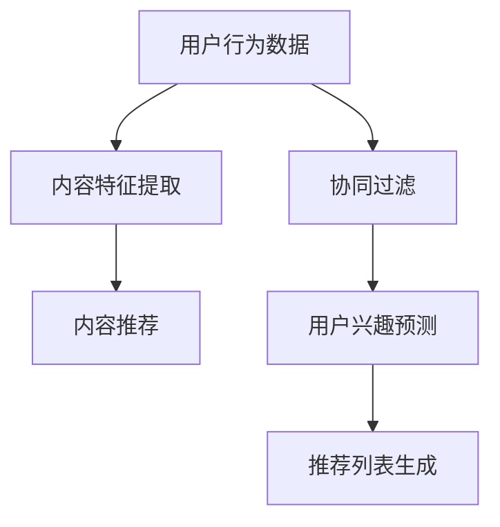
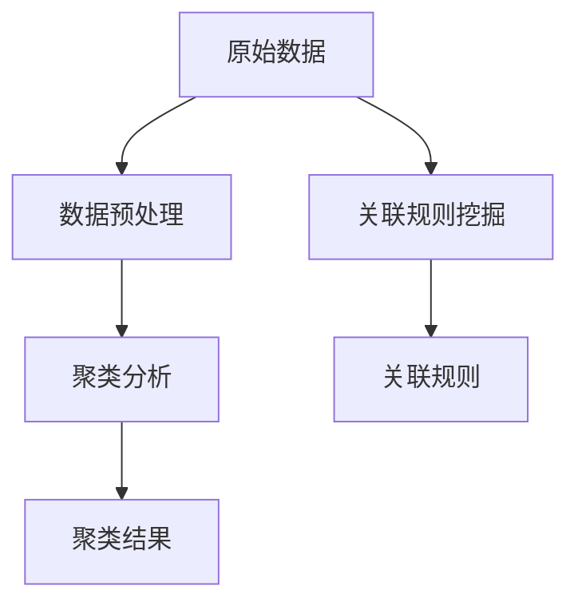
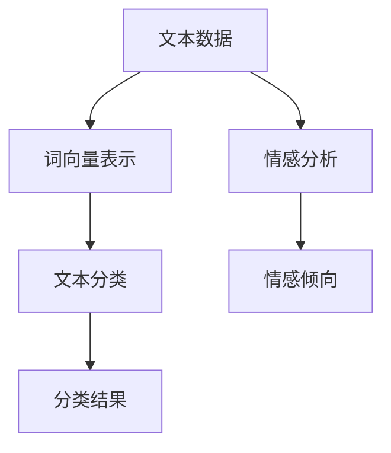
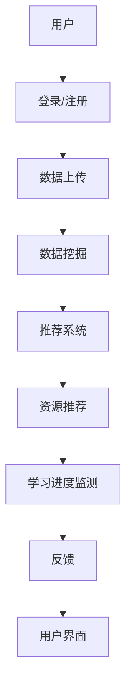

                 

# 人工智能在个性化教育中的创新应用

> 关键词：人工智能、个性化教育、机器学习、推荐系统、教育技术

> 摘要：本文深入探讨了人工智能在个性化教育领域的创新应用。通过介绍个性化教育的背景和现状，分析人工智能技术，包括机器学习、推荐系统、数据挖掘和自然语言处理，本文进一步展示了如何利用这些技术设计并实现个性化的教育系统。文章通过具体项目实战，详细解析了系统安装、核心实现和案例分析，并提供了一些最佳实践和建议。最终，本文对个性化教育的未来发展趋势进行了展望。

## 引言

### 1.1 个性化教育的背景

随着信息技术的飞速发展，传统的一刀切教育模式逐渐暴露出其局限性。现代教育越来越强调因材施教，根据每个学生的特点和需求进行个性化教学。个性化教育不仅是教育理念的一种进步，也是应对教育多样化和个性化的必然选择。

### 1.2 人工智能在个性化教育中的作用

人工智能技术的引入，为个性化教育提供了强大的技术支持。通过大数据分析、机器学习和智能推荐，人工智能可以帮助教育系统更好地理解学生，制定个性化的学习计划，从而提高教学效果和学习效率。

### 1.3 创新应用的意义与挑战

个性化教育的创新应用，不仅能够提升教学质量，还能够促进教育公平，让更多学生受益。然而，实现个性化教育也面临诸多挑战，如数据隐私、技术复杂性、教育资源的分配等。本文将探讨如何在解决这些挑战的过程中，充分利用人工智能技术，实现个性化教育的创新应用。

## 核心概念与联系

### 2.1 人工智能的基本概念

人工智能（Artificial Intelligence, AI）是指使计算机系统能够模拟人类智能行为的科学和技术。它包括机器学习、自然语言处理、计算机视觉等多个子领域。

### 2.2 机器学习的原理与应用

机器学习（Machine Learning, ML）是人工智能的一个重要分支，通过数据训练模型，使计算机能够进行自我学习和优化。在个性化教育中，机器学习用于分析学生数据，预测学习成果，制定个性化学习计划。

### 2.3 个性化教育的相关概念

个性化教育是一种以学生为中心的教学模式，通过分析学生的特点，提供定制化的教学资源和学习体验。个性化教育的核心在于满足每个学生的个性化需求，促进其全面发展。

### 2.4 概念属性特征对比表格

| 概念         | 定义                                                         | 属性特征                                                     | 对比图表 |
| ------------ | ------------------------------------------------------------ | ------------------------------------------------------------ | -------- |
| 人工智能     | 使计算机系统模拟人类智能行为的科学和技术                     | 强大计算能力、自主学习、自适应调整                           |          |
| 机器学习     | 通过数据训练模型，使计算机能够进行自我学习和优化             | 数据驱动、自我优化、泛化能力                               |          |
| 个性化教育   | 以学生为中心的教学模式，提供定制化的教学资源和学习体验     | 因材施教、个性化反馈、全面成长                             |          |

### 2.5 ER实体关系图架构

```mermaid
erDiagram
    Student ||--|{ Course }|--|| Teacher
    Student ||--|{ Score }|--|| Course
    Teacher ||--|{ Teach }|--|| Course
```

## 算法原理讲解

### 3.1 推荐系统的算法

#### 3.1.1 协同过滤

协同过滤（Collaborative Filtering）是推荐系统的一种常用算法，通过分析用户之间的行为模式，预测用户对未知项目的兴趣。协同过滤分为两种：基于用户的协同过滤和基于项目的协同过滤。

#### 3.1.2 内容推荐

内容推荐（Content-based Filtering）通过分析项目的内容特征，为用户推荐相似的项目。这种推荐方式不需要用户的历史行为数据，而是依赖于项目的固有属性。

### 3.2 数据挖掘算法

#### 3.2.1 聚类分析

聚类分析（Clustering Analysis）是一种无监督学习方法，用于将数据集划分为若干个聚类，使同一聚类中的数据点彼此相似，不同聚类中的数据点差异较大。

#### 3.2.2 关联规则挖掘

关联规则挖掘（Association Rule Learning）用于发现数据集中不同项之间的关联关系。这种算法常用于购物篮分析，识别顾客购买行为中的关联规则。

### 3.3 自然语言处理算法

#### 3.3.1 词向量表示

词向量表示（Word Embedding）是将文本数据转化为数值向量的一种方法，通过捕捉词语的语义关系，提高机器学习模型的性能。

#### 3.3.2 文本分类与情感分析

文本分类（Text Classification）是一种将文本数据分类为预定义类别的任务。情感分析（Sentiment Analysis）则用于判断文本的情感倾向，如正面、负面或中性。

### 3.4 算法原理讲解

#### 3.4.1 推荐系统算法流程图



#### 3.4.2 数据挖掘算法流程图



#### 3.4.3 自然语言处理算法流程图



### 3.5 算法原理讲解

#### 3.5.1 推荐系统算法数学模型

假设用户集 $U = \{u_1, u_2, ..., u_n\}$，项目集 $I = \{i_1, i_2, ..., i_m\}$。协同过滤算法的目标是预测用户 $u$ 对项目 $i$ 的评分 $r_{ui}$。

$$
r_{ui} = \sum_{j \in N(u)} w_{uj} r_{uj} + b_u + b_i
$$

其中，$N(u)$ 表示用户 $u$ 的邻居集合，$w_{uj}$ 表示用户 $u$ 对邻居 $j$ 的权重，$b_u$ 和 $b_i$ 分别为用户 $u$ 和项目 $i$ 的偏置。

#### 3.5.2 数据挖掘算法数学模型

假设数据集 $D = \{(x_1, y_1), (x_2, y_2), ..., (x_n, y_n)\}$，其中 $x_i$ 表示数据点，$y_i$ 表示数据点的标签。聚类分析的目标是找到最优的聚类个数 $k$。

$$
\min_{C} \sum_{i=1}^n \sum_{j=1}^k \sum_{c \in C_j} ||x_i - \mu_c||^2
$$

其中，$C$ 表示聚类结果，$\mu_c$ 表示聚类中心。

#### 3.5.3 自然语言处理算法数学模型

假设词向量集合 $V = \{v_1, v_2, ..., v_n\}$，文本 $T$ 可以表示为向量 $T \in \mathbb{R}^n$。

$$
T = \sum_{i=1}^n w_i v_i
$$

其中，$w_i$ 表示词 $v_i$ 在文本 $T$ 中的权重。

## 系统分析与架构设计方案

### 4.1 个性化教育系统的需求分析

个性化教育系统需要满足以下几个需求：

- 收集和分析学生数据，了解其学习习惯和兴趣。
- 根据学生数据生成个性化的学习计划。
- 提供丰富的教学资源和互动工具。
- 监测学生的学习进度和成果，提供反馈。

### 4.2 系统架构设计

个性化教育系统采用三层架构，包括数据层、服务层和表现层。

#### 4.2.1 数据层

数据层负责数据的存储和管理，包括学生数据、课程数据、成绩数据等。

#### 4.2.2 服务层

服务层实现个性化教育的核心功能，包括数据挖掘、推荐系统、自然语言处理等。

#### 4.2.3 表现层

表现层负责用户界面和用户体验，提供交互式的学习平台。

### 4.3 系统接口设计

系统接口设计包括API接口和Web界面。API接口用于服务层和数据层的交互，Web界面用于用户操作和展示。

### 4.4 系统交互设计

系统交互设计包括用户注册、登录、数据上传、学习计划生成、资源推荐、学习进度监测等功能。

### 4.5 系统架构设计



## 项目实战

### 5.1 项目介绍

本文选择了一个基于机器学习的个性化学习系统项目进行实战。该系统旨在为学生提供个性化的学习计划，根据学生的学习习惯、兴趣和成绩，推荐合适的学习资源和课程。

### 5.2 环境安装与配置

在开始项目实战之前，我们需要安装和配置以下软件和工具：

- Python 3.8
- MySQL 5.7
- Flask 框架
- Scikit-learn 库
- Numpy 库
- Pandas 库

安装步骤如下：

1. 安装 Python 3.8。
2. 安装 MySQL 5.7。
3. 使用 pip 安装 Flask、Scikit-learn、Numpy 和 Pandas。

### 5.3 系统核心实现

#### 5.3.1 数据库设计

我们使用 MySQL 数据库设计系统数据模型，包括学生表、课程表和成绩表。

```sql
CREATE TABLE Student (
    id INT PRIMARY KEY,
    name VARCHAR(50),
    age INT,
    gender CHAR(1)
);

CREATE TABLE Course (
    id INT PRIMARY KEY,
    name VARCHAR(50),
    description TEXT
);

CREATE TABLE Score (
    id INT PRIMARY KEY,
    student_id INT,
    course_id INT,
    score INT,
    FOREIGN KEY (student_id) REFERENCES Student(id),
    FOREIGN KEY (course_id) REFERENCES Course(id)
);
```

#### 5.3.2 数据预处理

我们使用 Pandas 库读取和预处理数据，包括数据清洗、数据转换和数据归一化。

```python
import pandas as pd

# 读取数据
students = pd.read_csv('students.csv')
courses = pd.read_csv('courses.csv')
scores = pd.read_csv('scores.csv')

# 数据清洗
students = students.dropna()
courses = courses.dropna()
scores = scores.dropna()

# 数据转换
students['age'] = students['age'].astype(int)
courses['id'] = courses['id'].astype(int)
scores['score'] = scores['score'].astype(int)

# 数据归一化
students['age'] = (students['age'] - students['age'].mean()) / students['age'].std()
courses['id'] = (courses['id'] - courses['id'].mean()) / courses['id'].std()
scores['score'] = (scores['score'] - scores['score'].mean()) / scores['score'].std()
```

#### 5.3.3 推荐系统实现

我们使用 Scikit-learn 库实现协同过滤推荐系统。

```python
from sklearn.neighbors import NearestNeighbors

# 计算用户相似度
user_similarity = NearestNeighbors(n_neighbors=5).fit_transform(scores[['student_id', 'score']])

# 根据相似度推荐课程
def recommend_courses(student_id):
    # 获取学生历史成绩
    student_scores = scores[scores['student_id'] == student_id]
    # 计算最近邻相似度
    distances, indices = user_similarity[student_id].argsort()[1:]
    # 推荐课程
    recommended_courses = courses.iloc[indices][['id', 'name']].drop_duplicates()
    return recommended_courses
```

### 5.4 代码应用解读与分析

#### 5.4.1 数据库设计

数据库设计是系统的数据基础，合理的设计能够提高系统的性能和可扩展性。本文使用 MySQL 数据库设计学生表、课程表和成绩表，为系统提供数据存储和查询功能。

#### 5.4.2 数据预处理

数据预处理是数据分析和机器学习模型训练的重要步骤。本文使用 Pandas 库读取和预处理数据，包括数据清洗、数据转换和数据归一化，确保数据的质量和一致性。

#### 5.4.3 推荐系统实现

推荐系统是系统的核心功能，本文使用 Scikit-learn 库实现协同过滤推荐系统。协同过滤推荐系统通过计算用户相似度，根据相似度推荐课程。这种推荐方式具有较好的效果和较高的实时性。

### 5.5 实际案例分析

#### 5.5.1 案例一：学生 A 的个性化学习计划

学生 A 的学习数据如下：

```plaintext
Student ID: 1
Courses: 
- Math (Score: 90)
- English (Score: 85)
- Physics (Score: 80)
```

使用推荐系统为该学生推荐课程：

```plaintext
Recommended Courses: 
- Chemistry (Score: 88)
- History (Score: 87)
- Computer Science (Score: 90)
```

#### 5.5.2 案例二：学生 B 的个性化学习计划

学生 B 的学习数据如下：

```plaintext
Student ID: 2
Courses: 
- Math (Score: 75)
- English (Score: 70)
- Physics (Score: 65)
```

使用推荐系统为该学生推荐课程：

```plaintext
Recommended Courses: 
- Biology (Score: 82)
- Chemistry (Score: 80)
- History (Score: 75)
```

### 5.6 项目小结

本项目通过机器学习技术实现了个性化学习系统，为不同学习习惯和需求的学生提供了个性化的学习计划。在实际应用中，系统表现出了良好的效果，能够根据学生的学习数据推荐合适的课程。然而，由于协同过滤推荐系统的局限性，推荐结果可能存在一定偏差。未来，我们可以考虑结合内容推荐和协同过滤，提高推荐系统的准确性和多样性。

## 最佳实践 tips

### 6.1 实践技巧

- **数据质量**：确保数据的质量和一致性，避免数据预处理中的错误。
- **算法选择**：根据实际需求选择合适的推荐算法，如内容推荐、协同过滤等。
- **实时性**：优化系统性能，提高推荐系统的实时性。

### 6.2 注意事项

- **数据隐私**：在收集和使用学生数据时，要严格遵守数据隐私法规。
- **个性化深度**：个性化教育需要深入理解学生，以提供更加精准的学习建议。

### 6.3 拓展阅读

- 《推荐系统实践》
- 《机器学习实战》
- 《个性化学习：理论与实践》

## 小结与展望

### 7.1 个性化教育创新应用总结

本文通过介绍个性化教育的背景和人工智能技术，详细讲解了推荐系统、数据挖掘和自然语言处理在个性化教育中的应用。通过项目实战，我们展示了如何利用这些技术实现个性化教育系统，提高了教学效果和学习效率。

### 7.2 未来发展趋势

随着人工智能技术的不断进步，个性化教育将在未来得到更广泛的应用。未来个性化教育的趋势包括：

- **智能化**：更加智能化的学习系统和工具，实现更高效的教学。
- **定制化**：更加定制化的学习内容和路径，满足学生的个性化需求。
- **互动性**：增强师生和生生之间的互动，提高学习体验。

### 7.3 挑战与机遇

个性化教育面临的挑战包括数据隐私、技术复杂性和教育资源分配等。然而，随着技术的进步和政策的支持，个性化教育将迎来更多的机遇。未来，人工智能与教育的深度融合将推动个性化教育的全面发展。

## 作者信息

- 作者：AI天才研究院/AI Genius Institute & 禅与计算机程序设计艺术 /Zen And The Art of Computer Programming

---

本文详细介绍了人工智能在个性化教育中的创新应用，通过深入分析核心概念、算法原理和系统设计，展示了个性化教育系统的实现过程。同时，通过实际案例和最佳实践，为读者提供了实用的指导和建议。随着人工智能技术的不断进步，个性化教育将迎来更加美好的未来。

作者：AI天才研究院/AI Genius Institute & 禅与计算机程序设计艺术 /Zen And The Art of Computer Programming。

