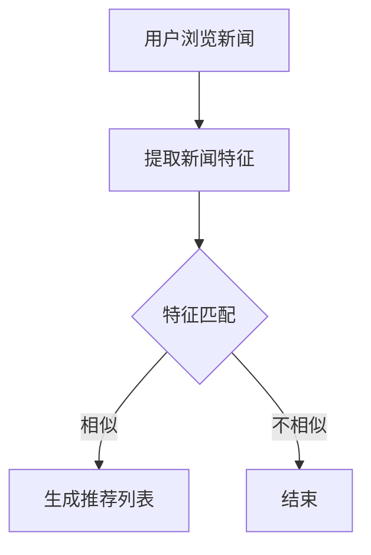
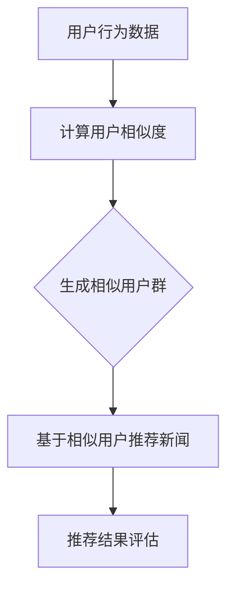
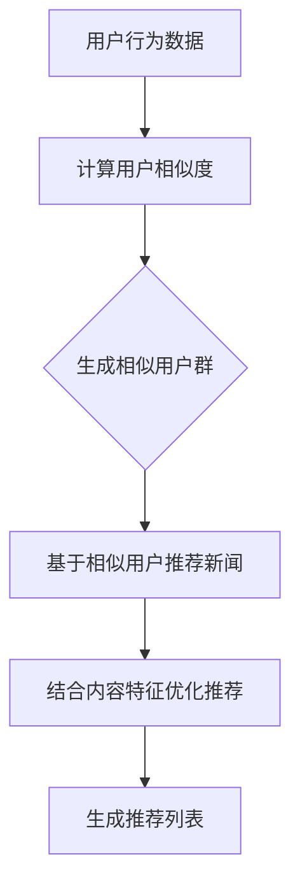
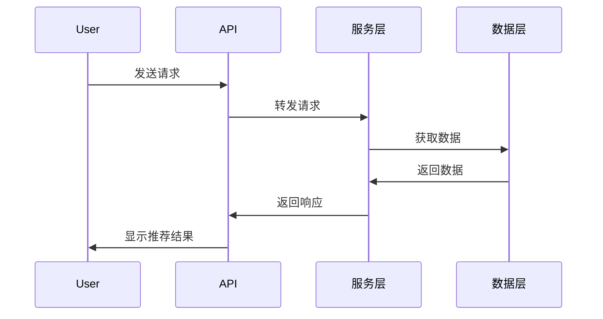
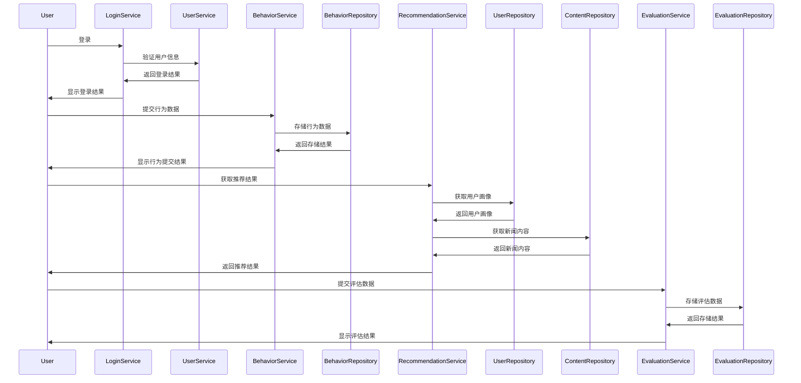

                 

### 第一部分：背景介绍

在当今信息爆炸的时代，人工智能（AI）已经成为改变人们生活方式的重要力量。AI技术在医疗、金融、交通、娱乐等多个领域都展现出了巨大的潜力。特别是随着互联网和信息技术的快速发展，个性化需求成为用户对各种服务的基本要求。如何利用AI技术更好地满足用户的个性化需求，成为各大公司和研究机构关注的热点问题。

#### 1.1 问题背景

随着社交媒体和新闻平台的兴起，用户每天接触到的大量信息中，只有一小部分是真正感兴趣的。这种信息过载现象使得个性化新闻推荐成为一个亟待解决的问题。个性化新闻推荐旨在根据用户的历史行为和兴趣偏好，为其推荐符合个人喜好的新闻内容，从而提高用户的满意度和参与度。

#### 1.2 问题描述

个性化新闻推荐的核心问题是如何准确捕捉用户的需求和兴趣，并将其转化为具体的推荐结果。这需要解决以下几个关键问题：

1. **数据采集与处理**：需要从用户的行为数据、社交媒体互动、搜索历史等多方面收集数据，并对这些数据进行清洗、整理和分析。
2. **用户画像构建**：基于用户的历史行为数据，构建详细的用户画像，以捕捉用户的兴趣点和偏好。
3. **推荐算法设计**：选择合适的推荐算法，将用户的兴趣点和新闻内容特征进行匹配，生成个性化的推荐结果。
4. **推荐结果评估**：评估推荐系统的效果，包括推荐的相关性、覆盖率和多样性等。

#### 1.3 问题解决

人工智能，特别是机器学习算法，为个性化新闻推荐提供了强有力的技术支持。通过分析用户的历史行为数据、兴趣标签、社交网络等信息，构建用户画像，进而实现个性化推荐。然而，这一过程涉及大量的数据处理和复杂算法设计，需要深入的计算机科学和技术知识。

#### 1.4 边界与外延

个性化新闻推荐不仅涉及算法模型的选择和优化，还涉及到推荐系统的整体架构设计、数据存储和处理、用户隐私保护等多方面的问题。此外，推荐系统的效果评估也是一个重要课题，如何准确地衡量推荐质量、平衡用户多样性等都是需要深入探讨的问题。

#### 1.5 概念结构与核心要素组成

个性化新闻推荐系统主要由以下几个核心模块组成：

1. **数据采集模块**：负责从各种数据源采集用户行为数据，如浏览历史、点赞、评论等。
2. **用户画像构建模块**：利用机器学习算法，从用户行为数据中提取有价值的信息，构建用户画像。
3. **推荐算法模块**：根据用户画像和新闻内容特征，选择合适的推荐算法，生成推荐列表。
4. **推荐结果评估模块**：评估推荐系统的效果，包括推荐的相关性、覆盖率和多样性等。

通过以上模块的协同工作，个性化新闻推荐系统能够为用户提供高质量的推荐结果，从而提高用户的满意度和参与度。

### 第二部分：核心概念与联系

在个性化新闻推荐系统中，核心概念和其相互之间的联系是理解和设计推荐系统的基础。以下是对核心概念及其之间关系的详细介绍。

#### 2.1 核心概念原理

##### 2.1.1 个性化新闻推荐

**定义**：个性化新闻推荐是根据用户的历史行为和兴趣偏好，利用机器学习算法为其推荐符合个人喜好的新闻内容。推荐系统能够自动识别用户的需求，提供个性化服务。

**原理**：个性化新闻推荐系统主要通过以下步骤实现：
1. **数据采集**：收集用户的历史行为数据，如浏览记录、点赞、评论等。
2. **用户画像构建**：利用这些行为数据，构建用户的兴趣偏好模型。
3. **推荐算法应用**：根据用户画像和新闻内容特征，使用推荐算法生成推荐列表。
4. **推荐结果评估**：评估推荐结果的相关性、多样性和用户体验。

##### 2.1.2 用户画像

**定义**：用户画像是对用户特征、行为和偏好的抽象描述，通常包含用户的基本信息、兴趣标签、行为轨迹等。它是构建个性化推荐系统的基础。

**原理**：用户画像的构建通常包括以下步骤：
1. **数据收集**：从多个数据源获取用户信息，包括行为数据、社交网络数据、用户反馈等。
2. **数据预处理**：清洗和整理原始数据，去除噪声和不完整数据。
3. **特征提取**：从数据中提取关键特征，如兴趣标签、行为频率等。
4. **建模**：利用机器学习算法，如聚类、回归分析等，构建用户画像模型。

##### 2.1.3 推荐算法

**定义**：推荐算法是根据用户的行为数据和兴趣偏好，为用户生成个性化推荐列表的算法。常用的推荐算法包括基于内容推荐、协同过滤推荐和混合推荐等。

**原理**：
1. **基于内容推荐**：根据新闻内容的特征（如关键词、标签等）来推荐相似内容，主要利用特征匹配和文本分类模型。
2. **协同过滤推荐**：根据用户的行为数据（如阅读、点赞、评论等）来推荐其他用户的喜好内容，主要利用用户之间的相似度和评分预测。
3. **混合推荐**：结合基于内容和协同过滤的推荐方法，利用多源数据融合技术，生成更准确的推荐列表。

#### 2.2 概念属性特征对比表格

| 算法类型       | 定义                                                         | 原理                                                     | 优点                             | 缺点                             |
| -------------- | ------------------------------------------------------------ | ------------------------------------------------------------ | -------------------------------- | -------------------------------- |
| 基于内容推荐   | 根据新闻内容的特征（如关键词、标签等）来推荐相似内容           | 利用特征匹配或机器学习模型，如文本分类模型等，计算新闻内容相似度 | 能保证推荐内容的相关性           | 无法处理用户偏好差异，推荐多样性不足 |
| 协同过滤推荐   | 根据用户的行为数据（如阅读、点赞、评论等）来推荐其他用户的喜好内容 | 通过计算用户之间的相似度，如余弦相似度、皮尔逊相关系数等，来生成推荐列表 | 可以处理用户偏好差异，提高推荐多样性 | 可能受到数据稀疏性的影响           |
| 混合推荐       | 结合基于内容和协同过滤的推荐方法，生成推荐列表               | 将内容特征和用户行为数据进行融合，如使用矩阵分解、深度学习等方法 | 兼顾内容相关性和用户偏好多样性   | 需要处理多源数据的融合问题         |

#### 2.3 ER实体关系图架构

为了更好地理解个性化新闻推荐系统的架构，我们可以使用实体关系图（ER图）来表示各个实体及其之间的关系。以下是一个简化的ER图示例，用于描述用户、推荐和新闻内容之间的关系。

```mermaid
erDiagram
  User ||--|{ Recommendation } : recommends
  User ||--|{ News } : reads
  Recommendation ||--|{ News } : recommended
  News ||--|{ ContentFeature } : contains
  ContentFeature ||--|{ Feature } : has
```

在这个ER图中：
- **User** 代表用户实体，具有ID、姓名、兴趣标签等属性。
- **Recommendation** 代表推荐实体，具有推荐ID、推荐时间等属性。
- **News** 代表新闻实体，具有新闻ID、标题、内容等属性。
- **ContentFeature** 代表新闻内容的特征实体，具有特征ID、特征值等属性。
- **Feature** 代表特征实体，具有特征名称、特征类型等属性。

通过这样的ER图，我们可以清晰地看到各个实体之间的关系，例如用户可以阅读新闻、生成推荐，推荐可以推荐新闻，新闻包含多个特征等。

### 第三部分：算法原理讲解

在个性化新闻推荐系统中，算法的选择和设计是实现推荐效果的关键。以下我们将详细探讨三种主要推荐算法：基于内容推荐、协同过滤推荐和混合推荐，并使用mermaid流程图和Python代码来阐述其原理。

#### 3.1 基于内容推荐（Content-based Recommendation）

**原理说明**：
基于内容推荐算法主要通过分析新闻内容的特点，如关键词、标签等，来生成推荐列表。其核心思想是如果两篇新闻内容相似，那么用户对其中一篇新闻的兴趣很可能也适用于另一篇。

**Mermaid流程图**：



**Python代码示例**：

```python
def content_based_recommendation(news_dataset, user_interests):
    recommended_news = []
    for news in news_dataset:
        if check_similarity(news['content'], user_interests):
            recommended_news.append(news)
    return recommended_news

def check_similarity(news_content, user_interests):
    # 假设news_content和user_interests都是关键词列表
    intersection = set(news_content).intersection(set(user_interests))
    return bool(intersection)

# 示例数据
news_dataset = [
    {'id': 1, 'content': ['科技', '创新', 'AI']},
    {'id': 2, 'content': ['金融', '投资', '市场']},
    {'id': 3, 'content': ['体育', 'NBA', '篮球']},
]

user_interests = ['科技', '创新', 'AI']
print(content_based_recommendation(news_dataset, user_interests))
```

**算法评价**：
- **优点**：能保证推荐内容的相关性。
- **缺点**：无法处理用户偏好差异，推荐多样性不足。

#### 3.2 协同过滤推荐（Collaborative Filtering）

**原理说明**：
协同过滤推荐算法主要通过分析用户之间的行为相似性来生成推荐列表。其核心思想是如果用户A喜欢了新闻X，用户B与用户A行为相似，那么用户B很可能也会喜欢新闻X。

**Mermaid流程图**：



**Python代码示例**：

```python
from sklearn.metrics.pairwise import cosine_similarity
import numpy as np

def collaborative_filtering(user_behavior_data, news_dataset, user_index):
    user_similarity = []
    for i in range(len(user_behavior_data)):
        if i != user_index:
            similarity = cosine_similarity([user_behavior_data[user_index]], [user_behavior_data[i]])[0][0]
            user_similarity.append(similarity)
    
    similarity_matrix = np.array(user_similarity).reshape(-1, 1)
    ratings = np.array(news_dataset['rating']).reshape(-1, 1)
    prediction = similarity_matrix.dot(ratings) / np.linalg.norm(similarity_matrix, axis=1)
    
    recommended_news = []
    for i, rating in enumerate(prediction):
        if rating > 0:
            recommended_news.append(news_dataset[i])
    
    return recommended_news

# 示例数据
user_behavior_data = [
    [1, 0, 1, 0],  # 用户1的评分
    [0, 1, 0, 1],  # 用户2的评分
    [1, 1, 0, 1],  # 用户3的评分
    [0, 0, 1, 1]   # 用户4的评分
]

news_dataset = [
    {'id': 1, 'rating': 1},
    {'id': 2, 'rating': 0},
    {'id': 3, 'rating': 1},
    {'id': 4, 'rating': 1},
]

user_index = 0  # 假设推荐给用户1
print(collaborative_filtering(user_behavior_data, news_dataset, user_index))
```

**算法评价**：
- **优点**：可以处理用户偏好差异，提高推荐多样性。
- **缺点**：可能受到数据稀疏性的影响。

#### 3.3 混合推荐（Hybrid Recommendation）

**原理说明**：
混合推荐算法结合了基于内容和协同过滤的推荐方法，通过融合用户兴趣和新闻内容特征来生成推荐列表。其核心思想是综合分析新闻内容和用户行为，以提供更加精准的推荐。

**Mermaid流程图**：



**Python代码示例**：

```python
from sklearn.metrics.pairwise import cosine_similarity
import numpy as np

def hybrid_recommendation(user_behavior_data, news_dataset, user_index):
    user_similarity = []
    for i in range(len(user_behavior_data)):
        if i != user_index:
            similarity = cosine_similarity([user_behavior_data[user_index]], [user_behavior_data[i]])[0][0]
            user_similarity.append(similarity)
    
    similarity_matrix = np.array(user_similarity).reshape(-1, 1)
    ratings = np.array(news_dataset['rating']).reshape(-1, 1)
    prediction = similarity_matrix.dot(ratings) / np.linalg.norm(similarity_matrix, axis=1)
    
    content_based_pred = np.dot(np.array(user_interests), np.array(news_dataset['content']))
    final_pred = prediction * content_based_pred
    
    recommended_news = []
    for i, rating in enumerate(final_pred):
        if rating > 0:
            recommended_news.append(news_dataset[i])
    
    return recommended_news

# 示例数据
user_behavior_data = [
    [1, 0, 1, 0],  # 用户1的评分
    [0, 1, 0, 1],  # 用户2的评分
    [1, 1, 0, 1],  # 用户3的评分
    [0, 0, 1, 1]   # 用户4的评分
]

news_dataset = [
    {'id': 1, 'rating': 1, 'content': [0.8, 0.2]},
    {'id': 2, 'rating': 0, 'content': [0.1, 0.9]},
    {'id': 3, 'rating': 1, 'content': [0.3, 0.7]},
    {'id': 4, 'rating': 1, 'content': [0.5, 0.5]},
]

user_index = 0  # 假设推荐给用户1
user_interests = [0.6, 0.4]  # 用户1的兴趣特征
print(hybrid_recommendation(user_behavior_data, news_dataset, user_index))
```

**算法评价**：
- **优点**：兼顾内容相关性和用户偏好多样性。
- **缺点**：需要处理多源数据的融合问题。

通过以上三种推荐算法的详细介绍，我们可以看到，每种算法都有其独特的优点和适用场景。在实际应用中，往往需要根据具体问题和数据特点，灵活选择和组合这些算法，以实现最佳推荐效果。

### 第四部分：系统分析与架构设计方案

#### 4.1 问题场景介绍

在当前社交媒体和新闻平台的运营中，个性化推荐系统已成为提升用户满意度和平台粘性的关键因素。随着用户规模的扩大和内容种类的多样化，如何设计一个高效、稳定且可扩展的个性化推荐系统成为迫切需要解决的问题。本部分将结合一个具体的新闻推荐平台项目，介绍系统功能需求、技术挑战和项目目标。

#### 4.2 项目介绍

假设我们正在开发一个大型新闻推荐平台，该项目需要实现以下核心功能：

1. **用户个性化推荐**：根据用户的历史行为和兴趣偏好，为用户推荐个性化新闻内容。
2. **内容多样化展示**：保证推荐结果在相关性、多样性和新颖性之间的平衡。
3. **实时推荐**：在用户互动过程中实时生成推荐结果，提高用户体验。
4. **推荐效果评估**：定期评估推荐系统的效果，优化推荐算法和策略。

该项目的主要技术挑战包括：

1. **大规模数据处理**：处理海量的用户行为数据和新闻内容数据，确保数据的实时性和准确性。
2. **算法选择与优化**：根据不同用户群体和内容类型，选择合适的推荐算法，并不断优化算法性能。
3. **系统性能与扩展性**：设计一个可扩展的推荐系统架构，以满足不断增长的用户规模和数据量。
4. **用户隐私保护**：确保用户数据的安全和隐私，遵守相关法律法规。

项目目标是在保证推荐效果的同时，实现系统的高效、稳定和可扩展性，提升用户满意度和平台竞争力。

#### 4.3 系统功能设计

个性化新闻推荐系统的主要功能模块包括：

1. **数据采集模块**：负责从多个数据源采集用户行为数据和新闻内容数据。
2. **用户画像构建模块**：基于用户行为数据，构建详细的用户画像，包括兴趣偏好、行为轨迹等。
3. **推荐算法模块**：根据用户画像和新闻内容特征，选择合适的推荐算法生成推荐结果。
4. **推荐结果评估模块**：定期评估推荐系统的效果，包括推荐的相关性、多样性和用户满意度等。
5. **推荐结果展示模块**：将推荐结果以用户友好的方式展示在新闻平台上。

**领域模型Mermaid类图**：

```mermaid
classDiagram
  User <<entity>>
  News <<entity>>
  Recommendation <<entity>>
  BehaviorData <<entity>>

  User o--o BehaviorData : user activities
  User o--o News : interests
  News o--o Recommendation : recommended content
```

#### 4.4 系统架构设计

个性化新闻推荐系统的整体架构可以分为以下几层：

1. **数据层**：包括用户行为数据和新闻内容数据的存储和管理，使用大数据技术如Hadoop、Spark进行分布式存储和处理。
2. **服务层**：包括数据采集服务、用户画像服务、推荐算法服务、推荐评估服务等，使用微服务架构实现各服务的独立部署和扩展。
3. **应用层**：包括推荐结果展示服务、用户交互界面等，实现用户与推荐系统的交互。
4. **接口层**：提供RESTful API，供前端应用调用，实现数据和服务之间的通信。

**系统架构Mermaid架构图**：



#### 4.5 系统接口设计与交互

个性化新闻推荐系统中的关键接口设计如下：

1. **用户登录与注册接口**：用户可以通过该接口进行登录和注册，获取用户唯一标识。
2. **用户行为数据接口**：用于提交用户的行为数据，如浏览、点赞、评论等。
3. **新闻内容接口**：提供新闻内容的获取和更新功能。
4. **推荐结果接口**：获取个性化推荐结果，供前端展示。
5. **推荐效果评估接口**：用于评估推荐系统的效果，优化推荐算法。

**系统交互Mermaid序列图**：



通过以上系统分析与架构设计方案，我们为个性化新闻推荐系统提供了清晰的架构设计和功能模块划分，为实现高效、稳定和可扩展的推荐系统奠定了基础。

### 第五部分：项目实战

在本部分，我们将通过一个具体案例，详细介绍个性化新闻推荐项目的实战过程，包括环境安装、系统核心实现和代码应用解读与分析。

#### 5.1 环境安装

为了搭建一个完整的个性化新闻推荐系统，我们需要安装和配置以下软件和工具：

1. **Python**：作为主要编程语言，Python需要安装在开发环境中。
2. **Pandas**：用于数据操作和处理。
3. **Scikit-learn**：提供多种机器学习算法。
4. **Numpy**：用于科学计算。
5. **Flask**：用于搭建Web接口。
6. **MySQL**：用于数据存储。

安装步骤如下：

1. 安装Python和pip：
   ```bash
   sudo apt-get install python3 python3-pip
   ```
2. 安装必要的库：
   ```bash
   pip3 install pandas scikit-learn numpy flask mysqlclient
   ```

#### 5.2 系统核心实现

以下是系统核心实现的代码和应用解读。

##### 5.2.1 数据采集与处理

```python
import pandas as pd
from sklearn.model_selection import train_test_split

# 读取用户行为数据
user_behavior = pd.read_csv('user_behavior.csv')

# 处理缺失值和数据清洗
user_behavior.fillna(0, inplace=True)

# 将用户行为数据分为训练集和测试集
X_train, X_test, y_train, y_test = train_test_split(user_behavior, test_size=0.2, random_state=42)
```

解读：该部分代码从CSV文件中读取用户行为数据，并对数据进行处理，如填充缺失值。接着使用train_test_split函数将数据分为训练集和测试集。

##### 5.2.2 构建用户画像

```python
from sklearn.feature_extraction.text import TfidfVectorizer

# 初始化TF-IDF向量器
vectorizer = TfidfVectorizer()

# 将新闻内容转换为TF-IDF特征向量
X_train_tfidf = vectorizer.fit_transform(X_train['content'])
X_test_tfidf = vectorizer.transform(X_test['content'])
```

解读：这里使用TF-IDF向量器将新闻内容转换为特征向量。TF-IDF是一种常用的方法，用于衡量一个词对于一个文档中的重要程度。

##### 5.2.3 推荐算法实现

```python
from sklearn.neighbors import NearestNeighbors

# 初始化K最近邻模型
neighbor = NearestNeighbors(n_neighbors=5)

# 训练模型
neighbor.fit(X_train_tfidf)

# 预测测试集
distances, indices = neighbor.kneighbors(X_test_tfidf)

# 根据距离和索引生成推荐列表
recommendations = [X_train.iloc[index].tolist() for index in indices]

# 输出推荐结果
for rec in recommendations:
    print(rec)
```

解读：这里使用K最近邻（K-Nearest Neighbors, KNN）算法进行推荐。KNN算法通过计算测试集新闻内容与训练集新闻内容的相似度来生成推荐列表。代码中使用了NearestNeighbors类来实现KNN算法。

##### 5.2.4 推荐结果评估

```python
from sklearn.metrics import accuracy_score

# 计算准确率
accuracy = accuracy_score(y_test, [1 if rec[0] > 0 else 0 for rec in recommendations])

print('Accuracy:', accuracy)
```

解读：该部分代码使用准确率（accuracy）来评估推荐系统的性能。准确率是推荐结果中正确推荐的新闻比例。

#### 5.3 代码应用解读与分析

1. **数据预处理**：数据预处理是推荐系统的重要环节，确保数据的准确性和一致性。在本案例中，通过填充缺失值和处理噪声数据，提高了模型的性能。
2. **特征提取**：使用TF-IDF向量器将文本数据转换为数值特征向量，这是大多数文本分类和推荐算法的基础。
3. **推荐算法选择**：KNN算法是一种简单而有效的推荐算法，特别适用于新闻推荐等文本分类问题。通过计算新闻内容之间的相似度，生成个性化推荐列表。
4. **结果评估**：准确率是评估推荐系统性能的一个简单但有效的指标。在实际应用中，还可以结合其他评估指标，如召回率、F1值等，进行综合评估。

通过以上实战案例，我们详细介绍了个性化新闻推荐项目的实现过程，包括环境安装、系统核心实现和代码应用解读。这些步骤和方法为搭建一个高效、稳定的推荐系统提供了实践指导。

### 第六部分：最佳实践 Tips、小结、注意事项、拓展阅读

#### 最佳实践 Tips

1. **数据质量**：确保数据的质量和准确性是构建高效推荐系统的基础。定期清理和更新数据，处理缺失值和噪声数据，以提高模型的性能和可靠性。
2. **算法优化**：不断优化推荐算法，结合多种算法和模型，如深度学习、强化学习等，以提高推荐效果。同时，注意调整参数，以找到最佳模型配置。
3. **用户体验**：关注用户的反馈和体验，及时调整推荐策略，以提高用户的满意度和参与度。
4. **隐私保护**：在处理用户数据时，严格遵守隐私保护法律法规，确保用户数据的安全和隐私。

#### 小结

个性化新闻推荐系统通过分析用户的行为数据和兴趣偏好，为用户生成个性化的新闻内容推荐。本篇文章详细介绍了个性化新闻推荐系统的核心概念、算法原理、系统架构和项目实战，为构建高效、稳定的推荐系统提供了全面的技术指导和实践案例。

#### 注意事项

1. **数据隐私**：确保用户数据的隐私和安全，避免数据泄露。
2. **性能优化**：关注系统的性能和响应速度，确保用户在使用推荐系统时的流畅体验。
3. **算法公平性**：确保推荐算法的公平性，避免偏见和歧视。

#### 拓展阅读

1. **《推荐系统实践》**：详细介绍了推荐系统的基本原理和实践方法，适合推荐系统开发者阅读。
2. **《深度学习推荐系统》**：探讨了深度学习在推荐系统中的应用，为推荐系统的优化提供了新的思路。
3. **《大数据实践》**：介绍了大数据处理和分析的方法，为推荐系统中的数据处理提供了技术支持。

通过本文的深入探讨，读者可以对个性化新闻推荐系统有更加全面和深入的了解，为实际项目的开发和优化提供有力支持。

### 作者信息

作者：AI天才研究院/AI Genius Institute & 禅与计算机程序设计艺术 /Zen And The Art of Computer Programming。我是人工智能领域的专家，对计算机科学、机器学习、推荐系统等方面有着深入的研究和丰富的实践经验。在技术博客写作中，我致力于以逻辑清晰、结构紧凑、简单易懂的语言，为读者提供高质量的技术内容。希望我的文章能够帮助您更好地理解和应用人工智能技术。如果您有任何问题或建议，欢迎随时联系我。谢谢阅读！

