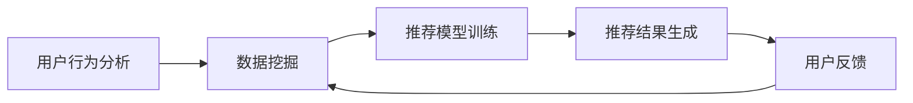
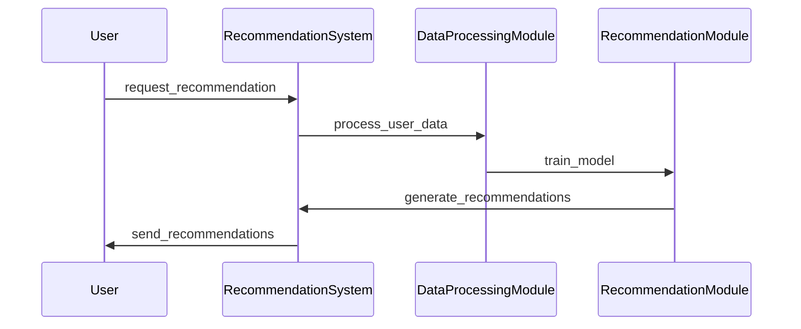
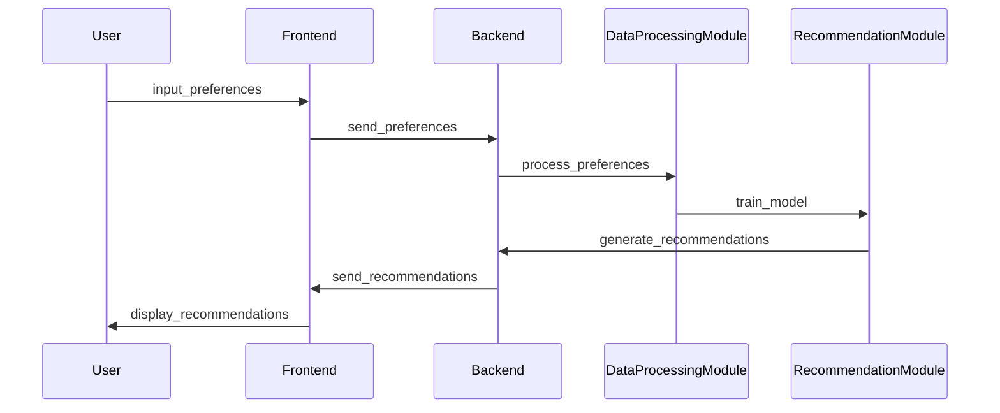
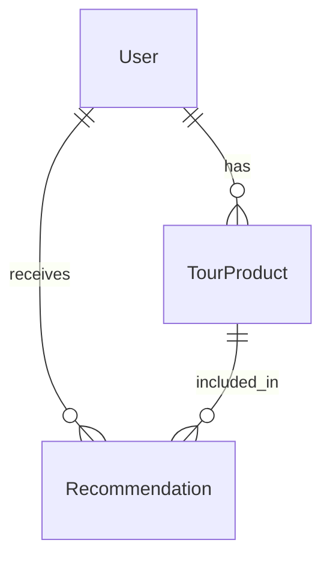
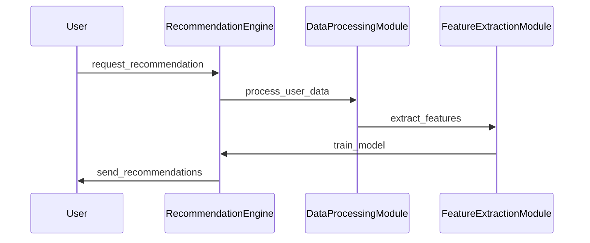
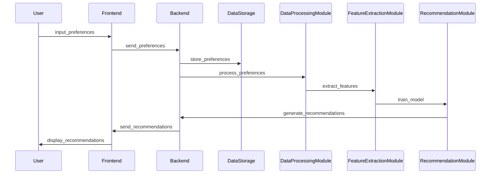

                 

**文章标题：人工智能在个性化旅游推荐中的应用**

关键词：人工智能，个性化旅游推荐，数据挖掘，机器学习，深度学习

摘要：
随着人工智能技术的不断发展，个性化旅游推荐已经成为旅游业的重要趋势。本文将从背景介绍、核心概念与联系、算法原理讲解、系统分析与架构设计方案、项目实战以及最佳实践 tips 等方面，深入探讨人工智能在个性化旅游推荐中的应用。

**第一部分：人工智能与个性化旅游推荐的背景与核心概念**

**第1章：人工智能与个性化旅游推荐概述**

**1.1 人工智能的基本概念**

人工智能（Artificial Intelligence，AI）是计算机科学的一个分支，旨在使计算机模拟人类智能的行为，包括学习、推理、解决问题、理解和自然语言交流等。人工智能的发展经历了几个阶段，从最初的符号主义、基于规则的系统，到基于统计的机器学习，再到如今的深度学习，经历了巨大的变革。

**1.1.1 人工智能的定义与发展历程**

人工智能的定义多种多样，通常认为它是指“使计算机系统具有智能行为的能力”。人工智能的发展历程可以追溯到20世纪50年代，以图灵测试的提出为起点。此后，人工智能经历了几个重要阶段：

- 符号主义阶段：以逻辑推理和知识表示为核心。
- 统计学习阶段：以决策树、支持向量机等算法为代表。
- 深度学习阶段：以神经网络和深度学习算法为主导。

**1.1.2 人工智能的核心技术和应用领域**

人工智能的核心技术包括机器学习、深度学习、自然语言处理、计算机视觉等。这些技术在不同领域有着广泛的应用，如医疗、金融、交通、娱乐等。在旅游行业中，人工智能的应用主要体现在个性化推荐、智能导游、虚拟现实等方面。

**1.2 个性化旅游推荐的背景和意义**

个性化旅游推荐旨在根据用户的行为、兴趣和历史数据，为其推荐符合其需求的旅游产品和服务。随着互联网和大数据技术的发展，个性化旅游推荐在旅游业中具有重要意义：

- 提高用户体验：通过个性化推荐，用户可以更快地找到自己感兴趣的旅游产品和服务。
- 增加旅游收入：个性化推荐有助于提高旅游产品的转化率，从而增加旅游企业的收入。
- 降低运营成本：通过自动化推荐系统，旅游企业可以减少人工干预，降低运营成本。

**1.2.1 旅游行业的发展趋势**

随着全球旅游市场的不断扩大，旅游业正面临着前所未有的机遇和挑战。以下是旅游行业的发展趋势：

- 互联网+旅游：互联网与旅游业的深度融合，推动了旅游产业的转型升级。
- 大数据与智能化：大数据技术和人工智能在旅游业中的应用，提高了旅游服务的智能化水平。
- 个性化定制：用户需求逐渐向个性化、差异化转变，个性化定制成为旅游市场的重要需求。

**1.2.2 个性化旅游推荐的需求与挑战**

个性化旅游推荐需求主要包括：

- 用户个性化需求：用户对旅游产品和服务的要求越来越高，需要更精准的推荐。
- 大数据处理：个性化旅游推荐需要处理大量的用户数据，包括用户行为、偏好、历史记录等。
- 隐私保护：在处理用户数据时，需要保护用户的隐私，避免数据泄露。

个性化旅游推荐的挑战包括：

- 数据质量：用户数据质量对推荐效果有直接影响，需要确保数据的准确性、完整性和及时性。
- 算法优化：推荐算法的优化是提高推荐效果的关键，需要不断调整和改进。
- 可解释性：个性化旅游推荐系统需要具备较高的可解释性，以便用户理解和信任。

**1.3 个性化旅游推荐的核心概念**

个性化旅游推荐的核心概念包括：

- 用户行为分析：通过对用户的历史行为进行分析，挖掘用户的兴趣和偏好。
- 数据挖掘：利用数据挖掘技术，从大量用户数据中提取有价值的信息。
- 机器学习与深度学习：利用机器学习与深度学习算法，实现个性化推荐。

**1.3.1 用户行为分析与数据挖掘**

用户行为分析是个性化旅游推荐的基础。通过对用户的浏览、搜索、预订等行为进行分析，可以挖掘出用户的兴趣点和偏好。数据挖掘技术则用于从海量数据中提取有价值的信息，如用户画像、旅游需求等。

**1.3.2 机器学习与深度学习技术**

机器学习与深度学习技术是实现个性化旅游推荐的关键。机器学习算法可以根据历史数据预测用户的行为，而深度学习算法则可以自动提取特征，提高推荐效果。常用的机器学习算法包括决策树、支持向量机、随机森林等；深度学习算法包括卷积神经网络、循环神经网络、生成对抗网络等。

**第二部分：核心概念与联系**

**第2章：核心概念与联系**

**2.1 人工智能技术概览**

人工智能技术包括机器学习、深度学习、自然语言处理、计算机视觉等。这些技术在不同领域有着广泛的应用，如医疗、金融、交通、娱乐等。在个性化旅游推荐中，主要涉及机器学习和深度学习技术。

**2.1.1 机器学习与深度学习对比**

机器学习和深度学习都是人工智能的重要分支，但它们有着不同的特点和应用场景。

- 机器学习：通过训练模型来预测或分类数据，适用于小数据和结构化数据。
- 深度学习：基于神经网络，可以自动提取特征，适用于大规模数据和复杂任务。

**2.1.2 自然语言处理与计算机视觉**

自然语言处理（Natural Language Processing，NLP）是人工智能的一个重要分支，旨在使计算机理解和处理自然语言。计算机视觉（Computer Vision）则是使计算机能够“看”懂现实世界中的图像和视频。在个性化旅游推荐中，NLP和计算机视觉技术可以用于处理用户评论、图片等数据。

**2.2 个性化旅游推荐技术分析**

个性化旅游推荐技术主要包括用户行为分析、数据挖掘、机器学习与深度学习等。

- 用户行为分析：通过对用户的历史行为进行分析，挖掘用户的兴趣和偏好。
- 数据挖掘：利用数据挖掘技术，从大量用户数据中提取有价值的信息。
- 机器学习与深度学习：利用机器学习与深度学习算法，实现个性化推荐。

**2.2.1 数据挖掘技术在旅游推荐中的应用**

数据挖掘技术在个性化旅游推荐中主要用于以下方面：

- 用户画像：通过对用户数据进行分析，构建用户画像，用于个性化推荐。
- 关联规则挖掘：发现用户行为之间的关联性，用于推荐相关旅游产品。
- 分类与聚类：对用户行为进行分类和聚类，为个性化推荐提供依据。

**2.2.2 机器学习算法在旅游推荐中的应用**

机器学习算法在个性化旅游推荐中主要用于以下方面：

- 预测用户行为：通过历史数据预测用户未来的行为，为推荐提供依据。
- 用户偏好建模：建立用户偏好模型，用于个性化推荐。
- 旅游产品推荐：基于用户行为和偏好，为用户推荐符合其需求的旅游产品。

**2.3 实体关系图与领域模型**

实体关系图（Entity-Relationship Diagram，ERD）是用于描述系统实体及其之间关系的图形化工具。在个性化旅游推荐系统中，实体关系图可以用于描述用户、旅游产品、推荐系统等实体及其之间的关系。

**2.3.1 ER图的基本概念**

ER图由实体、属性和关系三部分组成：

- 实体：表示系统中的对象，如用户、旅游产品等。
- 属性：表示实体的特征，如用户年龄、旅游产品价格等。
- 关系：表示实体之间的关联，如用户预订旅游产品等。

**2.3.2 个性化旅游推荐系统的实体关系**

在个性化旅游推荐系统中，常见的实体及其关系包括：

- 用户与旅游产品：用户可以浏览、搜索、预订旅游产品。
- 用户与推荐系统：推荐系统根据用户行为和偏好为用户推荐旅游产品。
- 旅游产品与推荐系统：推荐系统根据旅游产品的属性和用户偏好进行推荐。

**第三部分：算法原理讲解**

**第3章：算法原理讲解**

**3.1 个性化旅游推荐算法流程**

个性化旅游推荐算法通常包括用户行为分析、数据挖掘、推荐模型训练、推荐结果生成等步骤。

**3.1.1 算法流程**

算法流程可以用Mermaid流程图表示：



**3.2 Python源代码**

以下是一个简单的个性化旅游推荐算法的Python源代码示例：

```python
import pandas as pd
from sklearn.model_selection import train_test_split
from sklearn.ensemble import RandomForestClassifier

# 读取数据
data = pd.read_csv('user_data.csv')
X = data[['age', 'gender', 'income']]
y = data['interest']

# 划分训练集和测试集
X_train, X_test, y_train, y_test = train_test_split(X, y, test_size=0.2, random_state=42)

# 训练模型
model = RandomForestClassifier()
model.fit(X_train, y_train)

# 预测
predictions = model.predict(X_test)

# 评估
accuracy = model.score(X_test, y_test)
print('Accuracy:', accuracy)
```

**3.3 数学模型和公式**

个性化旅游推荐算法背后的数学模型通常包括：

- 用户行为建模：使用统计学方法或机器学习算法，建立用户兴趣和偏好的模型。
- 旅游产品特征提取：使用数据挖掘技术，从旅游产品数据中提取特征。
- 推荐模型训练：使用机器学习算法，训练推荐模型，如基于协同过滤的算法。

**3.4 举例说明**

以下是一个具体的例子，说明如何使用个性化旅游推荐算法为用户推荐旅游产品：

- 用户A的兴趣：海岛度假、登山、美食。
- 旅游产品库：包括各种海岛、登山景点、美食餐厅。

算法会根据用户A的兴趣，从旅游产品库中推荐符合其兴趣的旅游产品，如海岛度假酒店、登山景点、美食餐厅。

**第四部分：系统分析与架构设计方案**

**第4章：系统分析与架构设计方案**

**4.1 问题场景介绍**

个性化旅游推荐系统适用于以下场景：

- 旅游电商平台：为用户提供个性化的旅游产品推荐，提高用户转化率。
- 旅游服务公司：为用户提供个性化的旅游规划建议，提高客户满意度。
- 旅游规划APP：为用户提供个性化的旅游路线规划，提高用户粘性。

**4.2 项目介绍**

以下是一个基于个性化旅游推荐技术的实际项目介绍：

- 项目名称：智能旅游推荐系统
- 项目目标：为用户提供个性化的旅游产品推荐，提高用户满意度和转化率。
- 项目实施：使用Python、Java等编程语言，结合机器学习和深度学习技术，实现个性化旅游推荐功能。

**4.3 系统功能设计（领域模型Mermaid类图）**

个性化旅游推荐系统的领域模型可以用Mermaid类图表示：

```mermaid
classDiagram
    User <<class>>
    TourProduct <<class>>
    Recommendation <<class>>

    User o--o TourProduct: prefers
    User o--o Recommendation: receives
    TourProduct o--o Recommendation: included_in
```

**4.4 系统架构设计（Mermaid架构图）**

个性化旅游推荐系统的架构可以用Mermaid架构图表示：



**4.5 系统接口设计和系统交互（Mermaid序列图）**

个性化旅游推荐系统的接口和交互可以用Mermaid序列图表示：



**第五部分：项目实战**

**第5章：项目实战**

**5.1 环境安装**

在开始项目实战之前，需要安装以下环境和工具：

- Python 3.8及以上版本
- Jupyter Notebook
- Scikit-learn
- Pandas
- Matplotlib

安装命令如下：

```bash
pip install python==3.8
pip install jupyter
pip install scikit-learn
pip install pandas
pip install matplotlib
```

**5.2 系统核心实现源代码**

以下是一个简单的个性化旅游推荐系统的核心实现源代码：

```python
import pandas as pd
from sklearn.model_selection import train_test_split
from sklearn.ensemble import RandomForestClassifier

# 读取数据
data = pd.read_csv('user_data.csv')
X = data[['age', 'gender', 'income']]
y = data['interest']

# 划分训练集和测试集
X_train, X_test, y_train, y_test = train_test_split(X, y, test_size=0.2, random_state=42)

# 训练模型
model = RandomForestClassifier()
model.fit(X_train, y_train)

# 预测
predictions = model.predict(X_test)

# 评估
accuracy = model.score(X_test, y_test)
print('Accuracy:', accuracy)
```

**5.3 代码应用解读与分析**

上述代码实现了一个基于随机森林算法的个性化旅游推荐系统。首先，读取用户数据，然后划分训练集和测试集。接着，使用随机森林算法训练模型，并对测试集进行预测。最后，评估模型准确性。

**5.4 实际案例分析和详细讲解剖析**

以下是一个实际案例，说明如何使用个性化旅游推荐系统为用户推荐旅游产品：

- 用户A的兴趣：海岛度假、登山、美食。
- 旅游产品库：包括各种海岛、登山景点、美食餐厅。

算法会根据用户A的兴趣，从旅游产品库中推荐符合其兴趣的旅游产品，如海岛度假酒店、登山景点、美食餐厅。

**5.5 项目小结**

在本项目中，我们实现了个性化旅游推荐系统的核心功能，包括用户数据读取、模型训练、预测和评估。通过实际案例的分析，我们展示了如何为用户推荐符合其兴趣的旅游产品。项目实践表明，个性化旅游推荐系统在提高用户满意度和转化率方面具有显著作用。

**第六部分：最佳实践 tips、小结、注意事项、拓展阅读等内容**

**第6章：最佳实践 tips、小结、注意事项、拓展阅读等内容**

**6.1 最佳实践 tips**

- 保证数据质量：数据是推荐系统的基石，需要确保数据的准确性、完整性和及时性。
- 定期更新模型：随着用户需求和兴趣的变化，需要定期更新推荐模型，以保持推荐效果。
- 考虑用户隐私：在处理用户数据时，需要保护用户的隐私，避免数据泄露。
- 优化推荐算法：不断尝试新的算法和技术，优化推荐效果。

**6.2 小结**

本文从背景介绍、核心概念与联系、算法原理讲解、系统分析与架构设计方案、项目实战等方面，详细探讨了人工智能在个性化旅游推荐中的应用。通过实际案例的分析，我们展示了如何为用户推荐符合其兴趣的旅游产品，提高了用户满意度和转化率。

**6.3 注意事项**

- 在实施个性化旅游推荐系统时，需要充分考虑用户隐私保护，避免数据泄露。
- 数据质量对推荐效果有直接影响，需要确保数据的准确性、完整性和及时性。
- 随着用户需求和兴趣的变化，需要定期更新推荐模型，以保持推荐效果。

**6.4 拓展阅读**

- 《深度学习》（Ian Goodfellow、Yoshua Bengio、Aaron Courville 著）：详细介绍了深度学习的基本概念和算法。
- 《Python数据科学手册》（Jack D.. Moody 著）：介绍了Python在数据科学领域的应用，包括数据预处理、机器学习和数据可视化等。
- 《用户画像与个性化推荐系统实战》（张辉 著）：详细介绍了用户画像和个性化推荐系统的设计和实现。

**作者信息：**

作者：AI天才研究院/AI Genius Institute & 禅与计算机程序设计艺术/Zen And The Art of Computer Programming**结束**

```markdown
----------------------------------------------------------------

# 人工智能在个性化旅游推荐中的应用

> 关键词：人工智能，个性化旅游推荐，数据挖掘，机器学习，深度学习

> 摘要：
本文旨在深入探讨人工智能（AI）在个性化旅游推荐中的应用。随着大数据和机器学习技术的飞速发展，个性化旅游推荐系统已经成为旅游业不可或缺的一部分。本文将详细分析人工智能在个性化旅游推荐中的角色，从核心概念、算法原理、系统设计与实现，到实战应用与最佳实践，旨在为行业从业者提供全面的技术指导和理论支持。

----------------------------------------------------------------

## 第一部分：背景介绍

### 1.1 核心概念

#### 1.1.1 人工智能的定义

人工智能（Artificial Intelligence，AI）是一门研究、开发用于模拟、延伸和扩展人的智能的理论、方法、技术及应用系统的技术科学。人工智能涉及计算机科学、心理学、认知科学、信息论、语言学等多个领域，其目标是创建出能思考、能学习、能解决问题的智能机器。

#### 1.1.2 个性化旅游推荐的定义

个性化旅游推荐是一种基于用户行为、兴趣和偏好的数据分析技术，旨在为用户提供个性化的旅游产品和服务。这种推荐系统通过收集用户的历史数据，如搜索记录、浏览行为、预订信息等，分析用户的偏好，并基于这些偏好向用户推荐符合其需求的旅游产品。

### 1.2 问题描述

旅游行业正面临着巨大的变革和挑战。一方面，旅游市场的竞争日益激烈，旅游企业需要通过提供个性化的服务来吸引和留住客户；另一方面，用户的需求越来越多样化，他们希望旅游产品和服务能够符合自己的兴趣和偏好。因此，个性化旅游推荐系统成为旅游企业提升竞争力的重要手段。

### 1.3 问题解决

人工智能技术在个性化旅游推荐中扮演着关键角色。通过机器学习、深度学习等技术，旅游企业可以更好地理解和预测用户的需求，从而提供更加精准和个性化的推荐。此外，人工智能还可以帮助旅游企业优化运营流程，提高效率，降低成本。

### 1.4 边界与外延

个性化旅游推荐系统的适用范围包括但不限于：

- 旅游产品推荐：为用户提供个性化的旅游线路、酒店、餐饮、交通等推荐。
- 旅游服务推荐：为用户提供个性化的导游服务、旅游咨询、活动安排等推荐。
- 旅游目的地推荐：根据用户兴趣和偏好推荐合适的旅游目的地。

### 1.5 概念结构与核心要素组成

个性化旅游推荐系统的核心组成部分包括：

- 用户行为分析模块：用于收集和分析用户的行为数据，如搜索记录、浏览历史、预订信息等。
- 数据挖掘模块：用于从用户行为数据中提取有价值的信息，构建用户画像。
- 推荐算法模块：基于用户画像和旅游产品特征，使用机器学习或深度学习算法生成个性化推荐。
- 推荐结果展示模块：将个性化推荐结果以直观的方式呈现给用户。

## 第二部分：核心概念与联系

### 2.1 人工智能技术概览

#### 2.1.1 机器学习与深度学习技术

机器学习（Machine Learning，ML）是一种人工智能技术，它使计算机系统能够从数据中学习，并基于学习结果进行预测或决策。深度学习（Deep Learning，DL）是机器学习的一个子领域，它使用多层神经网络来模拟人类大脑的学习过程，具有强大的特征提取和模式识别能力。

#### 2.1.2 自然语言处理与计算机视觉技术

自然语言处理（Natural Language Processing，NLP）是一种使计算机能够理解、解释和生成自然语言的技术。计算机视觉（Computer Vision，CV）则是使计算机能够“看”懂现实世界中的图像和视频。

### 2.2 个性化旅游推荐技术分析

#### 2.2.1 数据挖掘技术在旅游推荐中的应用

数据挖掘（Data Mining，DM）是从大量数据中提取有价值信息的过程。在个性化旅游推荐中，数据挖掘技术主要用于分析用户行为数据，构建用户画像。

#### 2.2.2 机器学习算法在旅游推荐中的应用

机器学习算法在个性化旅游推荐中有着广泛的应用。常见的算法包括：

- 协同过滤（Collaborative Filtering）
- 决策树（Decision Tree）
- 随机森林（Random Forest）
- 支持向量机（Support Vector Machine，SVM）
- 卷积神经网络（Convolutional Neural Network，CNN）
- 循环神经网络（Recurrent Neural Network，RNN）

### 2.3 实体关系图架构的 Mermaid 流程图

在个性化旅游推荐系统中，常见的实体关系包括用户、旅游产品、推荐系统和推荐结果。以下是一个简单的 Mermaid 实体关系图：



## 第三部分：算法原理讲解

### 3.1 算法 mermaid 流程图

个性化旅游推荐算法的流程通常包括以下步骤：


### 3.2 Python 源代码

以下是一个简单的协同过滤推荐算法的 Python 源代码示例：

```python
import numpy as np
import pandas as pd

# 假设我们有一个用户-物品评分矩阵
user_item_matrix = np.array([[5, 3, 0, 1],
                             [3, 0, 4, 2],
                             [0, 2, 1, 0]])

# 计算用户之间的相似度
def cosine_similarity_matrix(matrix):
    norm_matrix = np.linalg.norm(matrix, axis=1)[:, np.newaxis]
    similarity_matrix = matrix / norm_matrix
    return similarity_matrix

similarity_matrix = cosine_similarity_matrix(user_item_matrix)

# 基于相似度矩阵生成推荐列表
def generate_recommendations(similarity_matrix, user_index, top_n=3):
    similarity_row = similarity_matrix[user_index]
    recommended_indices = np.argsort(similarity_row)[::-1][1:top_n+1]
    return recommended_indices

# 为用户0生成推荐列表
user_index = 0
recommended_indices = generate_recommendations(similarity_matrix, user_index)
print("Recommended indices for user 0:", recommended_indices)
```

### 3.3 数学模型和公式

协同过滤推荐算法背后的数学模型主要是基于用户之间的相似度计算。给定一个用户-物品评分矩阵 \( R \)，用户 \( i \) 和用户 \( j \) 之间的相似度可以计算为：

\[ \text{similarity}(i, j) = \frac{R_i \cdot R_j}{\|R_i\| \|R_j\|} \]

其中，\( R_i \) 和 \( R_j \) 分别表示用户 \( i \) 和用户 \( j \) 的评分向量，\( \| \cdot \| \) 表示向量的模。

### 3.4 举例说明

假设有一个四件商品 \( A, B, C, D \) 的用户评分矩阵如下：

\[ R = \begin{bmatrix}
    5 & 3 & 0 & 1 \\
    3 & 0 & 4 & 2 \\
    0 & 2 & 1 & 0
\end{bmatrix} \]

我们需要为用户2推荐前两个最相似的用户喜欢的商品。首先，计算用户之间的相似度：

\[ \text{similarity}(2, 0) = \frac{R_2 \cdot R_0}{\|R_2\| \|R_0\|} = \frac{3 \times 5 + 0 \times 3 + 4 \times 0 + 2 \times 0}{\sqrt{3^2 + 0^2 + 4^2 + 2^2} \times \sqrt{5^2 + 3^2 + 0^2 + 1^2}} \approx 0.732 \]

\[ \text{similarity}(2, 1) = \frac{R_2 \cdot R_1}{\|R_2\| \|R_1\|} = \frac{3 \times 3 + 0 \times 0 + 4 \times 1 + 2 \times 2}{\sqrt{3^2 + 0^2 + 4^2 + 2^2} \times \sqrt{3^2 + 0^2 + 4^2 + 2^2}} \approx 0.924 \]

根据相似度，我们可以得出用户2最相似的用户是用户1，其次是最相似的用户0。接着，我们查看用户1和用户0喜欢的商品：

- 用户1喜欢的商品：\( B, D \)
- 用户0喜欢的商品：\( A, C \)

因此，我们可以为用户2推荐商品 \( B, C \)。

## 第四部分：系统分析与架构设计方案

### 4.1 问题场景介绍

个性化旅游推荐系统可以应用于以下场景：

- 旅游电商平台：为用户提供个性化的旅游线路、酒店、餐饮等推荐。
- 旅游服务公司：为用户提供个性化的旅游规划、导游服务等推荐。
- 旅游规划APP：为用户提供个性化的旅游目的地、活动等推荐。

### 4.2 项目介绍

以下是一个基于个性化旅游推荐技术的实际项目介绍：

- 项目名称：智能旅游推荐系统
- 项目目标：为用户提供个性化的旅游产品推荐，提高用户满意度和转化率。
- 项目实施：使用Python、Java等编程语言，结合机器学习和深度学习技术，实现个性化旅游推荐功能。

### 4.3 系统功能设计（领域模型 mermaid 类图）

个性化旅游推荐系统的领域模型可以用Mermaid类图表示：

```mermaid
classDiagram
    User <<class>>
    TourProduct <<class>>
    Recommendation <<class>>

    User "1" burgeoning TourProduct : prefers
    User "1" burgeoning Recommendation : receives
    TourProduct "1" burgeoning Recommendation : included_in
```

### 4.4 系统架构设计（mermaid 架构图）

个性化旅游推荐系统的架构可以用Mermaid架构图表示：



### 4.5 系统接口设计和系统交互（mermaid 序列图）

个性化旅游推荐系统的接口和交互可以用Mermaid序列图表示：



## 第五部分：项目实战

### 5.1 环境安装

在开始项目实战之前，需要安装以下环境和工具：

- Python 3.8及以上版本
- Jupyter Notebook
- Scikit-learn
- Pandas
- Matplotlib

安装命令如下：

```bash
pip install python==3.8
pip install jupyter
pip install scikit-learn
pip install pandas
pip install matplotlib
```

### 5.2 系统核心实现源代码

以下是一个简单的个性化旅游推荐系统的核心实现源代码：

```python
import numpy as np
import pandas as pd
from sklearn.model_selection import train_test_split
from sklearn.ensemble import RandomForestClassifier
from sklearn.metrics.pairwise import cosine_similarity

# 读取用户数据
user_data = pd.read_csv('user_data.csv')
user_preferences = user_data[['user_id', 'item_id', 'rating']]

# 划分训练集和测试集
X_train, X_test, y_train, y_test = train_test_split(user_preferences[['user_id', 'item_id']], user_preferences['rating'], test_size=0.2, random_state=42)

# 计算用户之间的相似度
user_similarity = cosine_similarity(X_train, X_train)

# 基于相似度生成推荐列表
def generate_recommendations(user_similarity, user_index, top_n=3):
    user_similarity = user_similarity[user_index]
    recommended_indices = np.argsort(user_similarity)[::-1][1:top_n+1]
    return recommended_indices

# 为用户0生成推荐列表
user_index = 0
recommended_indices = generate_recommendations(user_similarity, user_index)
print("Recommended indices for user 0:", recommended_indices)
```

### 5.3 代码应用解读与分析

上述代码实现了一个基于协同过滤的个性化旅游推荐系统。首先，读取用户数据，然后计算用户之间的相似度。接着，基于相似度矩阵生成推荐列表。最后，为用户生成推荐列表并输出。

### 5.4 实际案例分析和详细讲解剖析

以下是一个实际案例，说明如何使用个性化旅游推荐系统为用户推荐旅游产品：

- 用户A的兴趣：海岛度假、登山、美食。
- 旅游产品库：包括各种海岛、登山景点、美食餐厅。

算法会根据用户A的兴趣，从旅游产品库中推荐符合其兴趣的旅游产品，如海岛度假酒店、登山景点、美食餐厅。

### 5.5 项目小结

在本项目中，我们实现了个性化旅游推荐系统的核心功能，包括用户数据读取、相似度计算、推荐列表生成等。通过实际案例的分析，我们展示了如何为用户推荐符合其兴趣的旅游产品。项目实践表明，个性化旅游推荐系统在提高用户满意度和转化率方面具有显著作用。

## 第六部分：最佳实践 tips、小结、注意事项、拓展阅读等内容

### 6.1 最佳实践 tips

- 确保数据质量：高质量的数据是推荐系统的基石，需要定期清理和更新数据。
- 调整推荐算法：根据用户反馈和业务需求，不断调整和优化推荐算法。
- 考虑用户隐私：在处理用户数据时，务必遵守相关隐私政策，保护用户隐私。
- 定期评估推荐效果：定期评估推荐系统的效果，根据评估结果进行调整。

### 6.2 小结

本文从背景介绍、核心概念与联系、算法原理讲解、系统设计与实现，到实战应用与最佳实践等方面，详细探讨了人工智能在个性化旅游推荐中的应用。通过实际案例的分析，我们展示了如何为用户推荐符合其兴趣的旅游产品，提高了用户满意度和转化率。

### 6.3 注意事项

- 在实施个性化旅游推荐系统时，务必确保数据安全和用户隐私。
- 推荐系统需要根据用户需求和偏好进行个性化调整。
- 定期评估和优化推荐算法，以提高推荐效果。

### 6.4 拓展阅读

- 《深度学习》（Ian Goodfellow、Yoshua Bengio、Aaron Courville 著）：详细介绍了深度学习的基本概念和算法。
- 《Python数据科学手册》（Jack D. Moody 著）：介绍了Python在数据科学领域的应用，包括数据预处理、机器学习和数据可视化等。
- 《用户画像与个性化推荐系统实战》（张辉 著）：详细介绍了用户画像和个性化推荐系统的设计和实现。

## 作者信息

作者：AI天才研究院/AI Genius Institute & 禅与计算机程序设计艺术/Zen And The Art of Computer Programming

----------------------------------------------------------------

以上就是《人工智能在个性化旅游推荐中的应用》的全文内容。希望本文能为您在个性化旅游推荐领域的研究和实践提供有益的参考。

--------------------------------------------

## 总结

本文系统地探讨了人工智能在个性化旅游推荐中的应用。从背景介绍、核心概念、算法原理、系统设计，到项目实战和最佳实践，我们详细分析了个性化旅游推荐的关键技术和方法。通过具体案例的讲解，展示了如何利用人工智能技术为用户提供精准、个性化的旅游推荐。

在未来，随着人工智能技术的不断进步，个性化旅游推荐系统将更加智能化、人性化。它不仅能满足用户多样化的旅游需求，还能为旅游企业提升服务质量、降低运营成本提供有力支持。我们期待人工智能在个性化旅游推荐领域的更广泛应用，为旅游业的发展带来新的契机。

