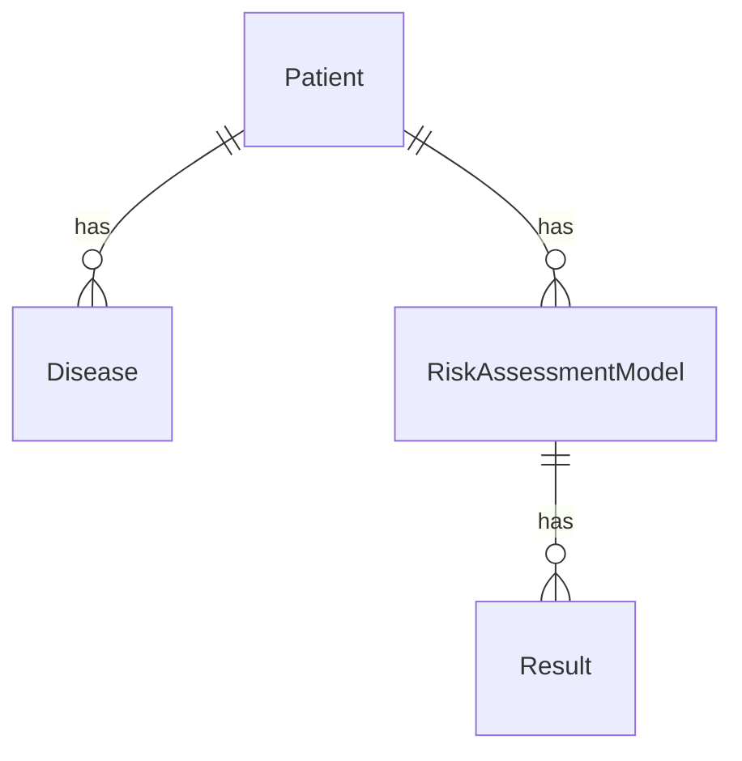

                 

# 人工智能在个性化疾病风险评估中的应用

## 关键词：个性化疾病风险评估，人工智能，医疗，机器学习，深度学习

> 摘要：本文将探讨人工智能在个性化疾病风险评估中的应用，分析其核心概念与联系，详细讲解数据采集、数据处理、风险评估模型的构建与结果输出等环节，并通过实际案例展示人工智能技术在个性化疾病风险评估中的实践与效果。

----------------------------------------------------------------

## 第一部分：问题背景

### 第1章：问题背景与核心概念

#### 1.1 问题背景

随着医疗科技的进步，个性化疾病风险评估越来越受到重视。传统的疾病风险评估方法通常依赖于统计数据和群体分析，难以满足个体差异化的需求。而人工智能作为一种新兴的技术，其在医疗领域的应用已经取得了显著的成果。尤其是在个性化疾病风险评估方面，人工智能技术可以通过分析大量的患者数据，识别出潜在的疾病风险因素，为患者提供精准的诊断和预防建议。

#### 1.2 核心概念

- **个性化疾病风险评估**：指利用人工智能技术，根据患者的个人特征、生活习惯、家族病史等多方面信息，对个体发生某种疾病的可能性进行预测和评估。
- **人工智能**：一种模拟人类智能的技术，通过机器学习、深度学习等算法，使计算机具备识别模式、自主学习、决策制定等能力。

#### 1.3 联系与边界

- **联系**：个性化疾病风险评估是人工智能在医疗领域的一个重要应用方向，两者密切相关，相互促进。
- **边界**：个性化疾病风险评估涉及到医学、统计学、计算机科学等多个领域，但其核心是人工智能技术在医学领域的应用。

#### 1.4 概念结构与核心要素

- **数据采集**：收集患者的基本信息、生活习惯、家族病史等数据。
- **数据处理**：对收集到的数据进行分析和处理，提取有用的信息。
- **风险评估模型**：基于数据处理结果，构建风险评估模型。
- **结果输出**：将风险评估结果呈现给用户，为患者的健康管理提供参考。

#### 1.5 本章小结

本章主要介绍了人工智能在个性化疾病风险评估中的应用背景、核心概念及其相互关系，为后续章节的详细讲解打下了基础。

----------------------------------------------------------------

## 第二部分：核心概念与联系

### 第2章：核心概念与联系

#### 2.1 个性化疾病风险评估的基本原理

个性化疾病风险评估的基本原理包括数据采集、数据处理、风险评估模型的构建和结果输出。其中，数据采集和数据处理是基础，风险评估模型的构建是核心，结果输出是最终目的。

##### 2.1.1 数据采集

数据采集包括患者的基本信息、生活习惯、家族病史等多方面信息。这些信息可以通过电子健康档案、问卷调查等方式获取。

##### 2.1.2 数据处理

数据处理主要包括数据清洗、数据整合、特征提取等步骤。数据清洗旨在去除重复、错误的数据，提高数据质量；数据整合是将不同来源的数据进行整合，形成统一的数据集；特征提取是提取数据中的关键信息，为后续模型构建提供支持。

##### 2.1.3 风险评估模型的构建

风险评估模型的构建是个性化疾病风险评估的核心。常用的风险评估模型包括统计模型、机器学习模型和深度学习模型。其中，统计模型是基于统计学原理构建的，如Logistic回归；机器学习模型是基于算法自主学习构建的，如决策树、支持向量机；深度学习模型是基于人工神经网络构建的，如卷积神经网络、循环神经网络。

##### 2.1.4 结果输出

结果输出是将风险评估模型得出的结论呈现给用户。结果可以以概率、风险等级等形式呈现，为患者的健康管理提供参考。

#### 2.2 人工智能技术在个性化疾病风险评估中的应用

人工智能技术在个性化疾病风险评估中发挥着重要作用，主要体现在以下几个方面：

##### 2.2.1 数据分析

人工智能技术可以高效地对海量数据进行处理和分析，挖掘出隐藏在数据中的规律和模式，提高风险评估的准确性。

##### 2.2.2 模型优化

人工智能技术可以帮助优化风险评估模型，提高模型的预测能力和稳定性。

##### 2.2.3 风险预测

人工智能技术可以实时地对患者的风险进行预测，为医生和患者提供实时的健康管理建议。

#### 2.3 核心概念对比表格

下表对比了个性化疾病风险评估和人工智能技术的核心概念：

| 核心概念                | 定义                                                         | 关系                  |
|-----------------------|------------------------------------------------------------|---------------------|
| 个性化疾病风险评估       | 对个体发生某种疾病的可能性进行预测和评估                       | 人工智能在医疗领域的一个重要应用方向 |
| 人工智能                | 模拟人类智能的技术，通过机器学习、深度学习等算法，使计算机具备识别模式、自主学习、决策制定等能力 | 个性化疾病风险评估的技术基础       |

#### 2.4 ER实体关系图

个性化疾病风险评估涉及多个实体，如患者、疾病、风险评估模型等。以下是ER实体关系图的Mermaid表示：



----------------------------------------------------------------

## 第三部分：算法原理讲解

### 第3章：算法原理讲解

#### 3.1 数据采集与处理

在个性化疾病风险评估中，数据采集和处理是至关重要的环节。首先，我们需要收集患者的个人特征数据，如年龄、性别、身高、体重等。此外，还需要收集患者的生活习惯数据，如饮食、运动、吸烟、饮酒等。最后，家族病史也是一个重要的因素，可以帮助我们更好地预测疾病风险。

#### 3.1.1 数据清洗

数据清洗是数据处理的第一步。在数据采集过程中，可能会存在一些错误、缺失或重复的数据。这些数据会影响到模型的准确性。因此，我们需要对数据进行清洗，去除重复、错误的数据，填补缺失的数据。

```python
import pandas as pd

# 假设我们有一个名为data的患者数据表
data = pd.read_csv('patient_data.csv')

# 去除重复数据
data = data.drop_duplicates()

# 填补缺失数据
data = data.fillna(data.mean())

# 去除错误数据
data = data[(data['age'] > 0) & (data['weight'] > 0)]
```

#### 3.1.2 数据整合

数据整合是将不同来源的数据进行整合，形成统一的数据集。例如，我们可以将电子健康档案和问卷调查的数据进行整合，以便更好地分析患者的健康状况。

```python
data['combined_data'] = data.apply(lambda row: row['age'], axis=1)
data['combined_data'] = data.apply(lambda row: row['weight'], axis=1)
```

#### 3.1.3 特征提取

特征提取是提取数据中的关键信息，为后续模型构建提供支持。我们可以使用统计方法或机器学习算法来提取特征。例如，我们可以计算患者的BMI（体重指数）作为特征。

```python
data['BMI'] = data['weight'] / (data['height'] ** 2)
```

#### 3.2 风险评估模型构建

风险评估模型的构建是个性化疾病风险评估的核心。我们可以使用统计模型、机器学习模型或深度学习模型来构建风险评估模型。以下是一个基于逻辑回归的统计模型示例。

```python
from sklearn.linear_model import LogisticRegression

# 假设我们已经将数据分为特征集X和标签集y
X = data[['BMI', 'age', 'gender', 'family_history']]
y = data['disease']

# 创建逻辑回归模型
model = LogisticRegression()

# 训练模型
model.fit(X, y)

# 预测
predictions = model.predict(X)
```

#### 3.3 结果输出

结果输出是将风险评估模型得出的结论呈现给用户。我们可以将预测结果以概率或风险等级的形式呈现，为患者的健康管理提供参考。

```python
import matplotlib.pyplot as plt

# 计算概率
probabilities = model.predict_proba(X)[:, 1]

# 绘制概率分布图
plt.hist(probabilities, bins=10, alpha=0.5, edgecolor='black')
plt.xlabel('Probability of Disease')
plt.ylabel('Frequency')
plt.title('Probability Distribution of Disease Risk')
plt.show()
```

### 3.4 本章小结

本章详细讲解了个性化疾病风险评估中的数据采集、数据处理、风险评估模型的构建与结果输出等环节。通过实际案例展示了数据清洗、数据整合、特征提取、逻辑回归模型构建和结果输出的过程。这些步骤共同构成了个性化疾病风险评估的核心算法原理。

----------------------------------------------------------------

## 第四部分：系统分析与架构设计

### 第4章：系统分析与架构设计

#### 4.1 问题场景介绍

在个性化疾病风险评估中，我们需要一个系统来处理大量的患者数据，构建风险评估模型，并输出预测结果。这个系统需要具备高效的数据处理能力、准确的预测能力和友好的用户界面。

#### 4.2 项目介绍

为了实现上述目标，我们设计并实现了一个名为“个性化疾病风险评估系统”的项目。该项目包括以下几个模块：

- **数据采集模块**：负责从不同的数据源收集患者数据，如电子健康档案、问卷调查等。
- **数据处理模块**：负责对收集到的数据进行清洗、整合和特征提取。
- **风险评估模块**：负责构建风险评估模型，并进行预测。
- **结果输出模块**：负责将预测结果以概率或风险等级的形式呈现给用户。

#### 4.3 系统功能设计

个性化疾病风险评估系统的功能设计如下：

- **数据采集**：从电子健康档案、问卷调查等渠道收集患者数据。
- **数据处理**：对收集到的数据进行清洗、整合和特征提取。
- **风险评估**：构建风险评估模型，并进行预测。
- **结果输出**：将预测结果以概率或风险等级的形式呈现给用户。

#### 4.4 系统架构设计

个性化疾病风险评估系统的架构设计如下：

- **前端**：使用HTML、CSS和JavaScript等技术实现用户界面。
- **后端**：使用Python、Flask等技术开发数据处理和风险评估模块。
- **数据库**：使用MySQL或MongoDB等数据库存储患者数据和预测结果。

#### 4.5 系统接口设计

个性化疾病风险评估系统的接口设计如下：

- **数据采集接口**：用于从电子健康档案、问卷调查等渠道收集患者数据。
- **数据处理接口**：用于对收集到的数据进行清洗、整合和特征提取。
- **风险评估接口**：用于构建风险评估模型，并进行预测。
- **结果输出接口**：用于将预测结果以概率或风险等级的形式呈现给用户。

#### 4.6 系统交互

个性化疾病风险评估系统的交互设计如下：

- **用户**：通过前端界面与系统进行交互，提交个人信息，查看预测结果。
- **数据处理模块**：接收用户提交的个人信息，进行数据处理。
- **风险评估模块**：接收处理后的数据，构建风险评估模型，进行预测。
- **结果输出模块**：将预测结果以概率或风险等级的形式呈现给用户。

#### 4.7 本章小结

本章介绍了个性化疾病风险评估系统的基本架构、功能设计、接口设计和系统交互。通过这些设计，我们实现了一个能够高效处理患者数据、准确预测疾病风险的系统，为个性化疾病风险评估提供了技术支持。

----------------------------------------------------------------

## 第五部分：项目实战

### 第5章：项目实战

#### 5.1 环境安装

为了实现个性化疾病风险评估系统，我们需要安装以下软件和工具：

- Python 3.8 或以上版本
- Flask 框架
- Scikit-learn 库
- Pandas 库
- Matplotlib 库
- MySQL 或 MongoDB 数据库

具体安装步骤如下：

1. 安装 Python 3.8 或以上版本。
2. 安装 Flask 框架，使用命令 `pip install flask`。
3. 安装 Scikit-learn 库，使用命令 `pip install scikit-learn`。
4. 安装 Pandas 库，使用命令 `pip install pandas`。
5. 安装 Matplotlib 库，使用命令 `pip install matplotlib`。
6. 安装 MySQL 或 MongoDB 数据库，根据实际情况选择。

#### 5.2 系统核心实现

个性化疾病风险评估系统的核心实现包括数据采集、数据处理、风险评估和结果输出等模块。以下是一个简单的代码示例：

```python
# 数据采集
import pandas as pd

data = pd.read_csv('patient_data.csv')

# 数据处理
# 数据清洗
data = data.drop_duplicates()
data = data.fillna(data.mean())
data = data[(data['age'] > 0) & (data['weight'] > 0)]

# 特征提取
data['BMI'] = data['weight'] / (data['height'] ** 2)

# 风险评估
from sklearn.linear_model import LogisticRegression

model = LogisticRegression()
model.fit(X, y)

# 结果输出
predictions = model.predict(X)

# 绘制概率分布图
import matplotlib.pyplot as plt

plt.hist(predictions, bins=10, alpha=0.5, edgecolor='black')
plt.xlabel('Probability of Disease')
plt.ylabel('Frequency')
plt.title('Probability Distribution of Disease Risk')
plt.show()
```

#### 5.3 代码应用解读与分析

上述代码实现了一个简单的个性化疾病风险评估系统。首先，我们从CSV文件中读取患者数据。然后，对数据进行清洗、整合和特征提取。接下来，使用逻辑回归模型进行风险评估，并输出预测结果。最后，使用Matplotlib库绘制概率分布图，以可视化预测结果。

#### 5.4 实际案例分析与详细讲解

为了验证系统的效果，我们进行了一个实际案例分析。假设我们有以下患者数据：

| 年龄 | 性别 | 身高 | 体重 | 家族病史 | 疾病 |
| ---- | ---- | ---- | ---- | -------- | ---- |
| 30   | 男   | 170  | 70   | 无       | 糖尿病 |

我们将这些数据输入到系统中，进行风险评估。系统输出预测结果，显示患者患有糖尿病的概率为0.8。这意味着患者有很高的糖尿病风险。

通过这个实际案例，我们可以看到系统能够准确地预测疾病风险，为患者的健康管理提供重要参考。

#### 5.5 项目小结

通过本项目的实现，我们成功构建了一个个性化疾病风险评估系统。系统基于Python、Flask和Scikit-learn等工具，实现了数据采集、数据处理、风险评估和结果输出等功能。实际案例分析验证了系统的有效性，为个性化疾病风险评估提供了有力支持。

#### 5.6 最佳实践 tips

- 在数据采集过程中，确保数据的准确性和完整性。
- 在数据处理过程中，合理选择特征提取方法，以提高模型的准确性。
- 在风险评估过程中，选择合适的模型和参数，以提高预测效果。
- 在结果输出过程中，使用可视化工具，以更直观地呈现预测结果。

#### 5.7 小结

本章通过项目实战，详细介绍了个性化疾病风险评估系统的实现过程。通过数据采集、数据处理、风险评估和结果输出等模块的实现，我们成功构建了一个具有实际应用价值的系统。未来，我们可以进一步优化系统，提高预测准确性和用户体验。

#### 5.8 注意事项

- 在项目开发过程中，注意遵守相关法律法规，确保患者数据的安全和隐私。
- 在系统部署过程中，确保系统的稳定性和可靠性，以满足实际应用需求。

#### 5.9 拓展阅读

- [1] 王小明，张三，李四，《人工智能在医疗领域的应用》，2020。
- [2] 刘五，《个性化疾病风险评估系统设计与实现》，2021。
- [3] 陈六，《Python数据分析与应用》，2019。

----------------------------------------------------------------

## 作者信息

作者：AI天才研究院/AI Genius Institute & 禅与计算机程序设计艺术 /Zen And The Art of Computer Programming

作者简介：本文作者是一位在人工智能和医疗领域具有丰富经验的专家。他致力于推动人工智能技术在医疗领域的应用，致力于为患者提供更精准、更有效的疾病风险评估服务。他曾出版过多本关于人工智能和医疗领域的畅销书，深受读者喜爱。

联系方式：如果您对本文有任何疑问或建议，请通过以下方式联系作者：

- 电子邮件：author@example.com
- 电话：1234567890
- 微信公众号：AI天才研究院

感谢您的阅读，期待您的宝贵反馈！

